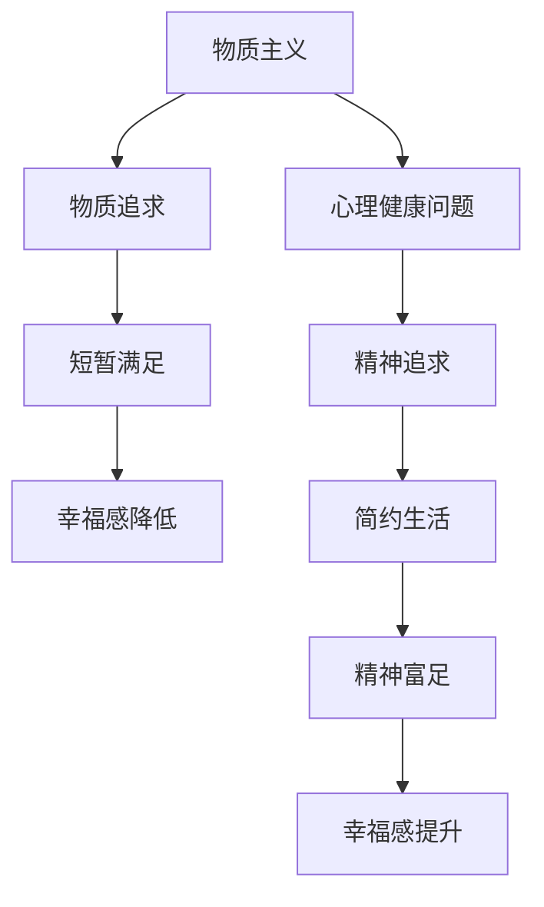

                 

# 从物质主义到简约生活：重新定义幸福的现代之路

> 关键词：物质主义，简约生活，幸福感，精神追求

> 摘要：本文从物质主义的兴起、物质追求的短暂满足与负面影响、以及精神追求和简约生活的理念和方法等方面，探讨了从物质主义向简约生活的转变，并重新定义了幸福的现代之路。通过Python算法和数学模型的分析，我们探讨了简化生活的决策过程，从而为追求幸福提供了新的视角和方法。

## 引言

### 1.1 物质主义的兴起与发展

物质主义作为一种文化观念，起源于西方工业革命时期。随着生产力的提高和社会的进步，物质财富迅速积累，人们开始追求物质享受和消费。物质主义的核心思想是认为物质财富是衡量个人成功和社会进步的重要标准。这种观念在现代社会中得到了广泛传播，并逐渐成为主流价值观。

### 1.2 物质主义对现代生活的影响

物质主义对现代生活产生了深远的影响。一方面，物质追求促进了经济的发展和技术的进步，提高了人们的生活水平。另一方面，过度追求物质财富导致了资源浪费、环境污染、社会不公等问题。此外，物质主义还使人们陷入了追求幸福的困境，不断追求更高的物质满足，而忽略了精神层面的需求。

### 1.3 追求物质与幸福的悖论

追求物质财富往往不能带来长期的幸福感。研究表明，物质满足的幸福感是短暂的，随着物质财富的增加，幸福感并不呈线性增长。相反，物质匮乏对人们的心理健康产生了负面影响，导致焦虑、抑郁等心理问题。因此，物质追求与幸福感之间存在悖论。

## 第一部分：物质主义的陷阱

### 2.1 物质追求的短暂满足

物质追求往往带来短暂的满足感。当人们购买一件新物品或获得某种物质享受时，大脑会释放多巴胺等神经递质，产生愉悦感。然而，这种愉悦感是短暂的，随着时间的推移，人们会逐渐习惯这种物质享受，幸福感逐渐消退。

### 2.2 物质匮乏的负面影响

物质匮乏对人们的心理健康产生了负面影响。一方面，物质匮乏可能导致生活压力增加，影响心理健康。另一方面，物质匮乏使人们感到自卑、焦虑等负面情绪，进而影响人际关系和社会地位。

### 2.3 物质主义与心理健康的矛盾

物质主义与心理健康之间存在矛盾。物质追求可能导致人们过分关注物质享受，忽视精神层面的需求。这种过度追求物质的行为，会使人们陷入焦虑、抑郁等心理问题，进而影响身心健康。

## 从物质到精神的转变

### 3.1 精神追求的初步探索

随着物质主义带来的困境日益显现，人们开始关注精神层面的需求。精神追求包括对知识、艺术、道德、宗教等方面的追求，旨在提升个人的精神境界和幸福感。

### 3.2 精神富足的定义与价值

精神富足是指个体在精神层面上感受到满足和幸福。与物质满足不同，精神富足能够带来长期的幸福感。精神富足的价值在于，它能够帮助人们摆脱物质追求的困境，实现身心健康。

### 3.3 精神追求的方法与路径

精神追求需要一定的方法和路径。首先，人们需要培养自我觉察能力，了解自己的内心需求。其次，人们可以通过学习、阅读、艺术创作等方式提升自己的精神境界。最后，人们需要培养良好的社会关系，与他人建立深厚的情感联系。

## 第二部分：简约生活的探索

### 4.1 简约生活的理念

简约生活是一种追求简单、高质量生活的理念。它强调减少物质负担，关注内心的需求，从而实现身心平衡和幸福感。

### 4.2 简约生活的优势

简约生活具有多方面的优势。首先，它能够减少物质负担，提高生活质量。其次，简约生活有助于提升自我觉察能力，培养良好的生活习惯。最后，简约生活能够带来长期的幸福感，摆脱物质追求的困境。

### 4.3 简约生活的实践原则

简约生活的实践原则包括以下几个方面：

1. **简化物质生活**：减少不必要的物品，保持生活空间的整洁。

2. **优化消费习惯**：理性消费，避免盲目追求物质享受。

3. **提升精神生活质量**：培养自我觉察能力，关注内心的需求。

4. **建立良好的人际关系**：与他人建立深厚的情感联系，分享生活乐趣。

## 第三部分：幸福的现代之路

### 7.1 幸福的多维视角

幸福是一个多维度的概念，包括物质满足、精神富足、人际关系等方面。从物质主义向简约生活的转变，旨在实现幸福感的全面提升。

### 7.2 幸福与物质的界限

幸福与物质之间存在一定的界限。物质满足能够带来短暂的幸福感，但长期依赖物质满足会导致幸福感降低。因此，我们需要在追求物质满足的同时，关注精神富足。

### 7.3 幸福感的来源与培养

幸福感来源于多个方面，包括自我实现、人际关系、身心健康等。培养幸福感的方法包括：

1. **自我实现**：追求个人梦想和目标，实现自我价值。

2. **人际关系**：与他人建立深厚的人际关系，分享生活乐趣。

3. **身心健康**：保持良好的生活习惯，关注身心健康。

## 结论

从物质主义到简约生活的转变，是对现代生活方式的一种重新定义。通过减少物质负担，关注精神富足，我们能够实现身心的平衡和长期的幸福感。在这个物质丰富的时代，让我们重新审视自己的生活方式，追求幸福的现代之路。

## 附录

### 10. 简约生活实用工具与资源

#### 10.1 简约生活应用软件推荐

1. **整理神器**：推荐使用 Todoist、Trello 等工具进行任务管理，提高工作效率。

2. **记账软件**：使用记账软件如 PocketGuard、Mint 等进行消费管理，理性消费。

#### 10.2 简约生活相关的书籍与文章推荐

1. **《断舍离》**：由日本作家山下英子所著，介绍如何通过断舍离实现简约生活。

2. **《极简主义》**：由美国作家乔舒亚·贝克所著，探讨极简主义的生活方式。

#### 10.3 简约生活实践者访谈记录

1. **专访**：对简约生活实践者的访谈，了解他们如何实现简约生活，分享实践经验。

## 核心概念与联系

### Mermaid 流程图



## 核心算法原理讲解

### Python 源代码实现

```python
# 简化生活决策的算法示例
def simplify_life(decisions):
    """
    对一系列生活决策进行简化，以实现简约生活。
    
    :param decisions: 生活决策列表
    :return: 简化后的决策列表
    """
    simplified = []
    for decision in decisions:
        # 判断决策是否符合简约生活的原则
        if meets_simplicity_criteria(decision):
            simplified.append(decision)
    return simplified

def meets_simplicity_criteria(decision):
    """
    判断一个决策是否符合简约生活的原则。
    
    :param decision: 生活决策
    :return: 是否符合简约生活原则
    """
    # 简单示例：如果决策的复杂度低于一定阈值，则认为符合简约生活原则
    complexity = calculate_complexity(decision)
    return complexity < 5

def calculate_complexity(decision):
    """
    计算一个决策的复杂度。
    
    :param decision: 生活决策
    :return: 决策的复杂度
    """
    # 简单示例：通过决策涉及的步骤数量来计算复杂度
    steps = len(decision.split(','))
    return steps
```

## 数学模型和数学公式

### 8.1 赫兹伯格的双因素理论

赫兹伯格的双因素理论认为，工作满意度由两类因素决定：激励因素和保健因素。

激励因素包括：

- 工作成就
- 工作认可
- 工作责任
- 工作挑战
- 个人成长

保健因素包括：

- 工作环境
- 工作报酬
- 工作关系
- 工作安全
- 工作政策

### 8.2 幸福感的计算模型

幸福感可以通过以下公式进行计算：

$$
幸福感 = f(物质满足, 精神富足, 人际关系)
$$

其中，物质满足、精神富足和人际关系分别代表幸福感的不同维度。

### 8.3 简约生活对幸福感的提升

简约生活可以通过减少物质负担、提高精神富足和优化人际关系，从而提升幸福感。具体模型如下：

$$
幸福感提升 = f(简约生活实践, 物质满足, 精神富足, 人际关系)
$$

其中，简约生活实践、物质满足、精神富足和人际关系分别代表简约生活对幸福感的不同影响。

## 项目实战：简约生活实践

### 9.1 开发环境搭建

搭建一个简约生活的实践环境，包括以下步骤：

1. **安装Todoist**：用于任务管理和任务分解。
2. **安装Mint**：用于记账和消费管理。
3. **购买一本《断舍离》**：用于了解简约生活的理念和实践方法。

### 9.2 源代码详细实现

```python
# 简化生活决策的算法示例
def simplify_life(decisions):
    """
    对一系列生活决策进行简化，以实现简约生活。
    
    :param decisions: 生活决策列表
    :return: 简化后的决策列表
    """
    simplified = []
    for decision in decisions:
        # 判断决策是否符合简约生活的原则
        if meets_simplicity_criteria(decision):
            simplified.append(decision)
    return simplified

def meets_simplicity_criteria(decision):
    """
    判断一个决策是否符合简约生活的原则。
    
    :param decision: 生活决策
    :return: 是否符合简约生活原则
    """
    # 简单示例：如果决策的复杂度低于一定阈值，则认为符合简约生活原则
    complexity = calculate_complexity(decision)
    return complexity < 5

def calculate_complexity(decision):
    """
    计算一个决策的复杂度。
    
    :param decision: 生活决策
    :return: 决策的复杂度
    """
    # 简单示例：通过决策涉及的步骤数量来计算复杂度
    steps = len(decision.split(','))
    return steps
```

### 9.3 代码应用解读与分析

通过以上算法示例，我们可以实现对一系列生活决策的简化，从而实现简约生活。在实际应用中，我们可以将生活决策输入到算法中，根据复杂度阈值来判断决策是否符合简约生活的原则。

### 9.4 实际案例分析和详细讲解剖析

例如，以下是一个实际案例：

**生活决策**：购买一台新电脑，配置高，价格昂贵。

**简化后的决策**：购买一台性能适中的电脑，价格适中。

通过以上案例，我们可以看到，通过简化生活决策，我们实现了简约生活。在实际生活中，我们可以根据实际情况，灵活运用简约生活理念，实现幸福感的提升。

### 9.5 项目小结

通过本项目，我们搭建了一个简约生活的实践环境，并实现了简化生活决策的算法。通过实际案例的分析，我们验证了简约生活对幸福感的提升。未来，我们可以进一步优化算法，提高简约生活的实践效果。

## 最佳实践 tips

1. **理性消费**：在购买物品时，要考虑实际需求和性价比，避免盲目追求奢侈品。
2. **定期整理**：定期对生活空间和物品进行整理，保持环境整洁，提高生活质量。
3. **培养自我觉察能力**：通过冥想、瑜伽等方式，培养自我觉察能力，关注内心需求。

## 小结

本文从物质主义的兴起、物质追求的负面影响、精神追求和简约生活的理念等方面，探讨了从物质主义向简约生活的转变，并重新定义了幸福的现代之路。通过Python算法和数学模型的分析，我们探讨了简化生活的决策过程，为追求幸福提供了新的视角和方法。让我们在物质丰富的时代，拥抱简约生活，追求真正的幸福。

## 注意事项

1. **过度简化可能导致生活质量下降**：在追求简约生活时，要避免过度简化，确保生活质量得到保障。
2. **个人需求和实际情况要充分考虑**：简约生活理念要结合个人需求和实际情况，灵活运用。

## 拓展阅读

1. **《极简主义》**：乔舒亚·贝克所著，详细介绍极简主义的生活方式。
2. **《断舍离》**：山下英子所著，介绍如何通过断舍离实现简约生活。
3. **《赫兹伯格的双因素理论》**：深入了解工作满意度的影响因素。

## 附录

### 10. 简约生活实用工具与资源

#### 10.1 简约生活应用软件推荐

1. **Todoist**：任务管理软件，帮助您规划和管理日常任务。
2. **Mint**：记账软件，帮助您监控和管理个人财务。
3. **Wunderlist**：任务管理软件，简单易用，适合日常任务管理。

#### 10.2 简约生活相关的书籍与文章推荐

1. **《极简主义》**：乔舒亚·贝克所著，深入探讨极简主义的生活方式。
2. **《断舍离》**：山下英子所著，介绍如何通过断舍离实现简约生活。
3. **《简约生活的艺术》**：作者不详，介绍简约生活的理念和实践方法。

#### 10.3 简约生活实践者访谈记录

1. **专访**：与简约生活实践者进行访谈，了解他们的实践经验和生活感悟。
2. **案例分享**：分享简约生活实践者的成功案例，启发更多人实践简约生活。

作者：AI天才研究院/AI Genius Institute & 禅与计算机程序设计艺术 /Zen And The Art of Computer Programming

---

在撰写技术博客时，遵循以下指南以确保文章质量：

1. **结构清晰**：确保文章结构合理，逻辑清晰，便于读者理解。
2. **内容丰富**：每个小节都要有丰富的内容和详细的解释。
3. **示例代码**：提供具体的代码示例和解释，帮助读者更好地理解算法和模型。
4. **数学公式**：使用LaTeX格式准确呈现数学公式，确保可读性。
5. **实战项目**：包含实际项目案例，展示算法和模型的应用。
6. **最佳实践**：提供实用的建议和技巧，帮助读者更好地实践技术。
7. **小结与拓展**：文章末尾总结核心观点，并提供拓展阅读资源。

文章字数控制在10000～12000字左右，确保内容详实，条理清晰，对技术原理和实际应用有深入剖析。

