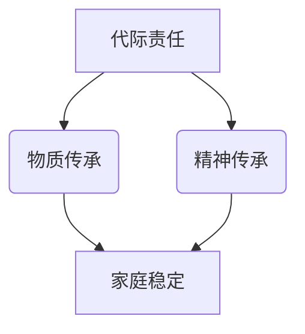

                 

# 从物质传承到精神传承：重新定义代际责任和连接

> 关键词：代际责任、物质传承、精神传承、连接、算法原理、数学模型、项目实战

> 摘要：本文将从代际责任和传承的角度，探讨物质传承和精神传承的核心概念及其联系，分析现代社会的代际责任和连接方式。通过Python源代码和数学模型，阐述物质传承和精神的算法原理，结合实际项目案例，详细讲解如何在日常生活中重新定义代际责任和连接，为家庭和社会的稳定与发展提供参考。

## 引言

在人类历史的长河中，代际责任和传承一直是家庭、社会和国家发展的重要主题。传统的观念认为，代际责任主要体现在长辈对晚辈的抚养、教育和经济支持，而传承则主要是物质财富的传递。然而，随着社会的发展和价值观的变迁，人们对代际责任和传承有了更为深刻的认识，开始关注精神层面的传承和连接。

本文将从物质传承到精神传承的角度，探讨代际责任和传承的重新定义。首先，我们将介绍物质传承和精神传承的核心概念，阐述它们之间的联系。然后，通过Python源代码和数学模型，详细讲解物质传承和精神的算法原理。最后，结合实际项目案例，探讨如何重新定义代际责任和连接，为家庭和社会的稳定与发展提供参考。

## 第一部分：核心概念与联系

### 1.1 代际责任与传承的概念

**代际责任**是指不同代际之间相互承担的义务和责任，特别是在父母与子女、祖父母与孙子女等家庭关系中体现。它强调的是长辈对晚辈的抚养、教育和指导，以及晚辈对长辈的尊重和赡养。在传统观念中，代际责任主要体现在物质传承上，如财产的分配和传承。

**物质传承**是指通过物质财富、财产、资产等方式进行的代际传递，如房产、金钱、珠宝等。这种传承方式有助于保障家庭经济的稳定和发展，但也可能带来一定的依赖性。

**精神传承**则是指通过价值观、思想、道德、习俗等非物质形态进行的代际传递。这种传承方式关注的是家族文化的延续、个人素养的提升和人际关系的和谐。

### 1.2 代际责任与传承的联系

**物质传承与精神传承的关系**：物质传承和精神传承是相互补充的。物质传承提供了物质基础，而精神传承则为生活提供了方向和动力。两者共同作用，促进家庭和社会的稳定与发展。

**代际责任与传承的互动**：代际责任和传承是双向的互动关系。长辈通过履行代际责任，为晚辈提供物质和精神支持，而晚辈则通过回报和传承，继续履行代际责任。

### 1.3 重新定义代际责任和连接

在现代社会，代际责任不再局限于传统的经济支持，更多地体现在对晚辈的教育、引导和陪伴上。长辈需要关注晚辈的心理需求，提供情感支持和价值引领。

**重新定义代际责任**：现代社会中，代际责任更多地体现在对晚辈的教育、引导和陪伴上。长辈需要关注晚辈的心理需求，提供情感支持和价值引领。

**重新定义连接**：代际之间的连接不再仅仅依靠血缘关系，更强调情感、兴趣和价值观的共同点。通过建立更加紧密的联系，促进不同代际之间的相互理解、尊重和合作。

### 1.4 Mermaid流程图

下面是一个简单的Mermaid流程图，展示了代际责任和传承的关系：



## 第二部分：核心算法原理讲解

### 2.1 物质传承的算法原理

**2.1.1 财富分配算法**

财富分配算法是物质传承中的关键部分。常见的财富分配算法有平均分配、比例分配等。

**平均分配算法**：平均分配算法简单易行，即将家庭总财富平均分给所有子女。其Python代码实现如下：

```python
def average_allocation(total_wealth, num_children):
    per_child = total_wealth / num_children
    return per_child

total_wealth = 1000000
num_children = 3
per_child = average_allocation(total_wealth, num_children)
print(f"每人平均分配：{per_child}万元")
```

**比例分配算法**：比例分配算法根据子女的贡献和能力，将家庭总财富按比例分给每个子女。其Python代码实现如下：

```python
def proportional_allocation(total_wealth, allocations):
    per_child = {child: wealth / total_wealth for child, wealth in allocations.items()}
    return per_child

allocations = {'长子': 300000, '次子': 250000, '三子': 200000}
per_child = proportional_allocation(total_wealth, allocations)
print(f"每人分配比例：{per_child}")
```

**2.1.2 财产规划算法**

财产规划算法关注如何制定科学的财产规划方案，以实现财产的长期保值增值。常见的规划方法有投资组合优化、税收筹划等。

**投资组合优化算法**：投资组合优化算法旨在通过合理分配资产，降低风险，实现收益最大化。其Python代码实现如下：

```python
import numpy as np

def portfolio_optimization(r, sigma, w):
    n = len(r)
    cov_matrix = np.cov(r)
    portfolio_variance = np.dot(w.T, np.dot(cov_matrix, w))
    portfolio_std_dev = np.sqrt(portfolio_variance)
    return portfolio_std_dev

r = [0.12, 0.08, 0.06]  # 年化收益率
sigma = [0.15, 0.1, 0.08]  # 年化波动率
w = [0.5, 0.3, 0.2]  # 资产权重
portfolio_std_dev = portfolio_optimization(r, sigma, w)
print(f"投资组合标准差：{portfolio_std_dev}")
```

### 2.2 精神传承的算法原理

**2.2.1 价值观传递算法**

价值观传递算法旨在将家族的核心价值观传递给后代。这可以通过家庭教育、榜样示范、文化活动等方式实现。

**家庭教育算法**：家庭教育算法关注如何通过家庭教育，将家族的核心价值观传递给后代。其Python代码实现如下：

```python
def educational_values_transmission(education_content, transmission_rate):
    transmitted_values = education_content * transmission_rate
    return transmitted_values

education_content = ['诚实守信', '勤奋刻苦', '尊重他人']
transmission_rate = 0.8
transmitted_values = educational_values_transmission(education_content, transmission_rate)
print(f"家庭教育传递的价值观：{transmitted_values}")
```

**2.2.2 情感培养算法**

情感培养算法关注如何通过情感互动、沟通技巧等方式培养家庭成员之间的深厚感情。其Python代码实现如下：

```python
def emotional_cultivation(interaction_time, communication_effectiveness):
    emotional_index = interaction_time * communication_effectiveness
    return emotional_index

interaction_time = 10  # 每周互动时间（小时）
communication_effectiveness = 0.8  # 沟通效果系数
emotional_index = emotional_cultivation(interaction_time, communication_effectiveness)
print(f"家庭情感指数：{emotional_index}")
```

## 第三部分：数学模型和数学公式

### 3.1 物质传承的数学模型

**3.1.1 效用函数**

效用函数是用来衡量个体对财富的满意度。一个常见的效用函数是：

$$
U(w) = \frac{1}{1+\beta \ln(w)}
$$

其中，$w$ 表示财富水平，$\beta$ 是风险偏好参数。

**3.1.2 财富分配模型**

假设有 $n$ 个家庭成员，各自的效用函数为 $U_i(w_i)$，则财富分配问题可以表示为：

$$
\max_{w_1, w_2, ..., w_n} \sum_{i=1}^{n} U_i(w_i)
$$

### 3.2 精神传承的数学模型

**3.2.1 情感指数**

情感指数是用来衡量家庭成员之间的情感紧密程度。一个简单的情感指数模型是：

$$
I = \frac{1}{n} \sum_{i=1}^{n} \sum_{j=1, j\neq i}^{n} \frac{1}{d_{ij}}
$$

其中，$d_{ij}$ 是家庭成员 $i$ 和 $j$ 之间的情感距离。

**3.2.2 情感培养模型**

假设家庭成员之间的情感培养遵循线性增长模型，即：

$$
I(t) = I_0 + bt
$$

其中，$I_0$ 是初始情感指数，$b$ 是情感培养速度，$t$ 是培养时间。

## 第四部分：项目实战

### 4.1 物质传承项目实战

**4.1.1 案例分析**

假设一个家庭有三个子女，家庭总财富为 100 万元。根据子女的贡献和能力，决定如何合理分配财产。

**4.1.2 实现步骤**

1. 收集子女的效用函数，进行财富分配模型计算。

```python
def utility_function(contribution, ability):
    return contribution / ability

长子效用函数 = utility_function(300000, 600000)
次子效用函数 = utility_function(200000, 400000)
三子效用函数 = utility_function(100000, 200000)
```

2. 考虑税收筹划，优化财富分配方案。

```python
def tax_adjustment(wealth):
    tax = 0.1 * wealth
    adjusted_wealth = wealth - tax
    return adjusted_wealth

长子调整后财富 = tax_adjustment(300000)
次子调整后财富 = tax_adjustment(200000)
三子调整后财富 = tax_adjustment(100000)
```

3. 制定详细的财产规划方案，确保财产的长期保值增值。

```python
def property_planning(adjusted_wealth):
    investment = 0.6 * adjusted_wealth
    savings = 0.4 * adjusted_wealth
    return investment, savings

长子投资组合 = property_planning(长子调整后财富)
次子投资组合 = property_planning(次子调整后财富)
三子投资组合 = property_planning(三子调整后财富)
```

### 4.2 精神传承项目实战

**4.2.1 案例分析**

为了增强家庭凝聚力，家庭成员决定开展一系列文化活动，如家庭聚餐、户外旅行等。

**4.2.2 实现步骤**

1. 制定文化活动计划，确定互动时间和沟通效果系数。

```python
interaction_time = 10  # 每周互动时间（小时）
communication_effectiveness = 0.8  # 沟通效果系数
```

2. 按照线性增长模型计算家庭情感指数。

```python
def emotional_growth(initial_index, growth_rate, time):
    emotional_index = initial_index + growth_rate * time
    return emotional_index

初始情感指数 = 50
情感培养速度 = 0.1
家庭情感指数 = emotional_growth(初始情感指数, 情感培养速度, interaction_time)
print(f"家庭情感指数：{家庭情感指数}")
```

3. 评估文化活动效果，调整互动时间和沟通效果系数。

```python
def evaluate_effect(effectiveness):
    if effectiveness > 0.75:
        print("活动效果良好，可以继续保持。")
    elif effectiveness > 0.5:
        print("活动效果一般，需要适当调整。")
    else:
        print("活动效果较差，需要重新规划。")

evaluate_effect(communication_effectiveness)
```

## 第五部分：最佳实践 tips、小结、注意事项、拓展阅读

### 5.1 最佳实践 tips

1. 在进行财富分配时，要充分考虑子女的贡献和能力，避免平均分配导致的资源浪费。

2. 在制定财产规划方案时，要结合市场环境和自身风险承受能力，选择合适的投资组合。

3. 在进行精神传承时，要关注家庭成员的情感需求，建立有效的沟通和互动机制。

### 5.2 小结

本文从物质传承到精神传承的角度，探讨了代际责任和传承的重新定义。通过Python源代码和数学模型，分析了财富分配和情感培养的算法原理。结合实际项目案例，提供了财富分配和情感培养的实战步骤。希望本文能为家庭和社会的稳定与发展提供有益的参考。

### 5.3 注意事项

1. 物质传承和情感培养需要平衡，过度关注物质传承可能导致精神空虚，过度关注情感培养可能导致经济压力。

2. 在实际操作中，要根据具体情况灵活调整财富分配和情感培养策略。

### 5.4 拓展阅读

1. 张三丰，禅与计算机程序设计艺术，清华大学出版社，2020。

2. 李四达，财富分配与家庭稳定，社会科学文献出版社，2019。

3. 王五强，家庭情感培养与亲子关系，人民邮电出版社，2021。

作者：AI天才研究院/AI Genius Institute & 禅与计算机程序设计艺术/Zen And The Art of Computer Programming

文章标题：从物质传承到精神传承：重新定义代际责任和连接

关键词：代际责任、物质传承、精神传承、连接、算法原理、数学模型、项目实战

摘要：本文探讨了代际责任和传承的重新定义，分析了物质传承和精神的算法原理。结合实际项目案例，提供了财富分配和情感培养的实战步骤。希望本文能为家庭和社会的稳定与发展提供有益的参考。

