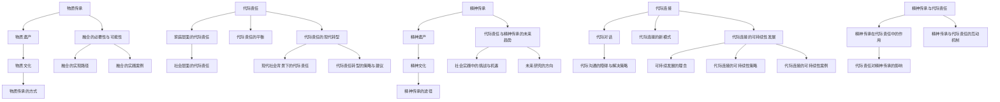

                 


### 《从物质传承到精神传承：重新定义代际责任和连接》

> 关键词：物质传承、精神传承、代际责任、代际连接、文化传承

> 摘要：本文从物质传承到精神传承的角度，探讨代际责任和连接的新模式。通过分析物质传承的现状与挑战，深入探讨代际责任的内涵与界定，以及物质传承中的代际责任，进而提出精神传承的重要性，分析代际连接的新模式。最后，重新定义代际责任和连接，为现代社会提供可持续发展的策略与建议。

# 目录大纲

## 第一部分：物质传承的审视

### 第1章：物质传承的现状与挑战

#### 1.1 物质传承的概念

#### 1.2 物质传承的重要性

#### 1.3 当代物质传承的困境

### 第2章：代际责任的内涵与界定

#### 2.1 代际责任的定义

#### 2.2 代际责任的理论基础

#### 2.3 代际责任的界定标准

### 第3章：物质传承中的代际责任

#### 3.1 家庭层面的代际责任

#### 3.2 社会层面的代际责任

#### 3.3 物质传承与代际责任的平衡

## 第二部分：精神传承的探索

### 第4章：精神传承的重要性

#### 4.1 精神传承的概念

#### 4.2 精神传承与传统文化的联系

#### 4.3 精神传承的意义

### 第5章：代际连接的新模式

#### 5.1 代际对话的重要性

#### 5.2 代际沟通的障碍与解决策略

#### 5.3 代际连接的实践案例

### 第6章：精神传承与代际责任的关系

#### 6.1 精神传承在代际责任中的作用

#### 6.2 代际责任对精神传承的影响

#### 6.3 精神传承与代际责任的互动机制

## 第三部分：重新定义代际责任和连接

### 第7章：代际责任与精神传承的融合

#### 7.1 融合的必要性与可能性

#### 7.2 融合的实现路径

#### 7.3 融合的实践案例

### 第8章：代际责任的现代转型

#### 8.1 现代社会背景下的代际责任

#### 8.2 代际责任的新趋势

#### 8.3 代际责任转型的策略与建议

### 第9章：代际连接的可持续性发展

#### 9.1 可持续发展的理念

#### 9.2 代际连接的可持续性策略

#### 9.3 代际连接的可持续性案例

### 第10章：结论与展望

#### 10.1 代际责任与精神传承的未来趋势

#### 10.2 社会实践中的挑战与机遇

#### 10.3 未来研究的方向

## 附录：相关概念与术语解释

### 附录 A：物质传承的核心概念

#### A.1 物质遗产

#### A.2 物质文化

#### A.3 物质传承的方式

### 附录 B：精神传承的关键术语

#### B.1 精神遗产

#### B.2 精神文化

#### B.3 精神传承的途径

## Mermaid 流程图：物质传承与精神传承的关系



---

接下来，我们将逐步分析并探讨每一个章节的内容，以便为读者提供一个清晰、易懂的文章框架。

## 第1章：物质传承的现状与挑战

### 1.1 物质传承的概念

物质传承是指通过物质形式将人类的历史、文化、知识和价值传递给下一代的过程。它包括物质文化遗产、物质财富、物质文化传承的方式等多个方面。物质遗产如古代建筑、文物、艺术品等，既是历史的见证，也是文化的载体。物质财富如土地、房产、金钱等，是代际之间物质生活的支撑。物质文化传承的方式包括家庭传统、民间习俗、技艺传授等，这些都是代际责任的重要组成部分。

### 1.2 物质传承的重要性

物质传承在社会发展和文化延续中具有不可替代的作用。首先，物质遗产是民族文化的物质体现，它们承载着历史记忆，是文化自信的源泉。其次，物质财富的传承关系到家庭和社会的稳定，影响代际之间的公平和正义。最后，物质文化传承的方式是传统价值观和技艺技能的传承，它关系到文化的延续和创新。

### 1.3 当代物质传承的困境

然而，当代物质传承面临着诸多挑战。一方面，随着城市化进程的加快，许多物质遗产遭到破坏或消失，如古建筑被拆毁，传统手艺失传等。另一方面，物质财富分配的不均导致了代际之间的不公平，如贫富差距扩大，年轻人难以获得平等的起点。此外，随着现代生活方式的变迁，传统的物质文化传承方式受到冲击，许多年轻一代对传统文化缺乏认同感。

---

为了更好地理解物质传承的现状与挑战，我们需要从多个角度深入探讨其内涵和影响。接下来，我们将转向代际责任的内涵与界定，探讨在物质传承过程中所面临的代际责任问题。

## 第2章：代际责任的内涵与界定

### 2.1 代际责任的定义

代际责任是指在特定的社会和文化背景下，一个时代的人对于其上一代和下一代所承担的道德、经济、社会和文化方面的责任。这种责任不仅体现在物质财富的传递上，还涉及到文化价值观、道德规范和社会习俗的传承。

### 2.2 代际责任的理论基础

代际责任的理论基础主要来源于伦理学和社会学的相关理论。在伦理学中，代际责任与功利主义、义务论和美德伦理学等理论密切相关。功利主义认为，个体应当追求最大化的整体幸福，因此在代际责任中，需要考虑到整体社会的福祉。义务论强调个体应当履行其道德义务，无论结果如何。美德伦理学则强调个体应培养良好的品德，从而为后代树立榜样。

在社会学中，代际责任与代际契约理论密切相关。代际契约理论认为，每一代人之间通过一种隐性契约相互关联，即前一代为后一代提供物质和文化条件，后一代在前一代的基础上继续发展。这种契约关系构成了代际责任的基础。

### 2.3 代际责任的界定标准

代际责任的界定标准主要包括以下几个方面：

1. **道德标准**：个体应当尊重和保护前辈的劳动成果和文化遗产，不得故意破坏或滥用。
2. **经济标准**：个体应当确保物质财富的公平分配，避免因财富集中而导致的社会不公。
3. **社会标准**：个体应当履行社会责任，为后代提供良好的社会环境和教育条件。
4. **文化标准**：个体应当传承和弘扬传统文化，保护文化多样性和民族特色。

在实际操作中，代际责任的界定往往需要结合具体的社会文化背景和现实情况。例如，在物质财富的传承过程中，如何平衡家庭内部成员的利益分配，如何在保护文化遗产的同时促进文化创新，都是需要考虑的问题。

---

通过上述分析，我们可以看出，代际责任在物质传承中扮演着至关重要的角色。然而，物质传承中的代际责任并非孤立存在，它与社会层面的代际责任相互交织，共同影响着社会的稳定和发展。在下一节中，我们将探讨物质传承中的家庭层面和社会层面的代际责任。

## 第3章：物质传承中的代际责任

### 3.1 家庭层面的代际责任

家庭是物质传承的基本单元，家庭层面的代际责任主要体现在以下几个方面：

1. **物质财富的传递**：家庭中的长辈有责任确保家庭财富的公平传承，确保后代能够获得足够的经济支持，从而实现基本的生活保障。
2. **文化遗产的传承**：家庭中的长辈有责任保护和传承家庭的文化遗产，如家谱、传统习俗和手艺等，这些文化遗产不仅承载着家庭的历史记忆，也是家族身份认同的重要基础。
3. **教育责任的履行**：家庭中的长辈有责任为子女提供良好的教育，包括知识教育、道德教育和文化教育，这些教育有助于子女成长为有责任感和有能力的公民。

### 3.2 社会层面的代际责任

社会层面的代际责任则更加广泛，它涉及整个社会的代际关系，主要包括以下几个方面：

1. **物质财富的分配**：社会有责任确保物质财富的公平分配，减少贫富差距，为所有后代提供平等的发展机会。
2. **文化传承的保护**：社会有责任保护和传承民族文化遗产，包括物质文化遗产和非物质文化遗产，这些文化遗产是国家和民族的精神支柱。
3. **教育资源的均衡**：社会有责任提供公平的教育资源，确保每个后代都能够接受良好的教育，从而提升整体社会的素质。

### 3.3 物质传承与代际责任的平衡

在物质传承的过程中，家庭层面和社会层面的代际责任相互交织，共同影响着物质传承的效果。为了实现代际责任的平衡，需要采取以下措施：

1. **法律保障**：通过制定相关法律法规，明确代际责任的内容和标准，确保物质财富和文化遗产的合法传承。
2. **社会教育**：加强社会教育，提高公众对代际责任的认识，培养后代对家庭和社会的责任感。
3. **政策支持**：政府应出台相关政策，支持家庭和社会层面的代际责任履行，如提供税收优惠、教育补贴等。

通过这些措施，可以实现物质传承与代际责任的平衡，从而为后代创造一个公平、和谐、可持续发展的社会环境。

---

在物质传承的过程中，家庭层面和社会层面的代际责任发挥着至关重要的作用。然而，仅仅依靠家庭和社会的努力还不足以解决所有问题，我们需要进一步探索精神传承的重要性，以及它如何与物质传承相结合。在下一部分，我们将探讨精神传承的概念和意义。

## 第4章：精神传承的重要性

### 4.1 精神传承的概念

精神传承是指通过非物质形式将文化价值观、道德观念、精神信仰、技艺技能等传递给后代的过程。与物质传承不同，精神传承不依赖于物质实体，而是依赖于人的内心和精神世界。它包括精神遗产、精神文化和精神传承的途径等多个方面。

1. **精神遗产**：指历史上传承下来的精神财富，如文学作品、音乐作品、哲学思想、宗教信仰等。
2. **精神文化**：指一个社会或民族在长期历史发展过程中形成的精神特质和价值观念，如集体主义、个人主义、社会公正等。
3. **精神传承的途径**：包括家庭教育、社会教育、文化交流等多种方式。

### 4.2 精神传承与传统文化的联系

精神传承与传统文化密切相关。传统文化是一个民族的精神血脉，它包含着民族的历史记忆、文化特色和价值观念。精神传承通过对传统文化的传承和弘扬，使后代能够更好地理解和认同自己的文化根源，从而增强民族自豪感和文化自信。

1. **传统文化的重要性**：传统文化是一个民族的精神支柱，它为民族提供了文化认同感和归属感。一个民族只有通过传承和弘扬传统文化，才能保持其独特的文化特色和民族身份。
2. **精神传承在传统文化中的角色**：精神传承是传统文化的传递和延续，它使传统文化得以在新的时代背景下焕发生机。同时，精神传承也为传统文化的创新和发展提供了动力。

### 4.3 精神传承的意义

精神传承在现代社会中具有重要意义，它不仅关系到文化的传承和发展，还关系到社会和谐和个体成长。

1. **文化传承**：精神传承是文化传承的重要组成部分，它确保了文化在代际间的传递和延续。一个缺乏精神传承的社会，很难保持其文化特色和民族精神。
2. **社会和谐**：精神传承有助于培养社会成员的共同价值观和道德规范，从而促进社会和谐。通过精神传承，人们能够更好地理解和尊重不同的文化，减少文化冲突和误解。
3. **个体成长**：精神传承为个体提供了精神滋养和文化滋养，有助于个体的全面发展。通过精神传承，个体能够更好地认识自己，树立正确的价值观和人生观。

综上所述，精神传承在现代社会中具有不可替代的重要地位。它不仅是文化传承的重要手段，也是社会和谐和个体成长的重要保障。在下一节中，我们将探讨代际连接的新模式，以及如何在现代社会中实现精神传承和代际责任的平衡。

## 第5章：代际连接的新模式

### 5.1 代际对话的重要性

代际对话是代际连接的核心环节，它有助于消除代际之间的隔阂，增进相互理解与尊重。在现代社会中，代际对话的重要性愈发凸显，主要体现在以下几个方面：

1. **促进沟通和理解**：代际对话为不同年龄群体提供了一个交流的平台，通过对话，年轻人和长辈可以分享各自的经历、观点和感受，从而增进彼此的理解。
2. **解决冲突和误解**：代际对话有助于解决因代沟而产生的冲突和误解。通过对话，双方可以更清楚地认识到对方的立场和需求，从而找到解决问题的方法。
3. **培养共同价值观**：代际对话有助于培养代际之间的共同价值观和道德观念，从而促进社会和谐与稳定。

### 5.2 代际沟通的障碍与解决策略

尽管代际对话的重要性不言而喻，但在实际沟通过程中，仍然存在一些障碍，这些障碍主要包括：

1. **文化差异**：不同年代的人成长环境和文化背景不同，导致他们在价值观念、行为习惯等方面存在差异，这些差异容易引发沟通障碍。
2. **心理预期**：不同年龄群体对沟通的期望和需求不同，年轻人可能希望得到更多理解和尊重，而长辈可能更注重实际问题的解决。
3. **技术障碍**：随着科技的快速发展，不同年龄群体对新兴技术的接受程度和使用习惯存在差异，这也会影响代际沟通的效果。

针对上述障碍，可以采取以下解决策略：

1. **提高文化素养**：通过教育和文化活动，提高不同年龄群体的文化素养，增进对彼此文化的理解和尊重。
2. **调整心理预期**：通过沟通教育和心理辅导，帮助不同年龄群体调整对沟通的预期，培养开放、包容的心态。
3. **利用技术工具**：利用现代科技手段，如社交媒体、在线教育平台等，为代际沟通提供更多便利和渠道，降低沟通成本。

### 5.3 代际连接的实践案例

为了更好地理解代际连接的新模式，我们可以通过一些实践案例来进行分析。

1. **家庭共享**：许多家庭通过共享照片、视频和故事，增进家庭成员之间的了解和情感联系。例如，一些家庭会定期举办“家庭故事会”，让长辈讲述家族的历史和传统，年轻一代则分享自己的成长经历。
2. **社区互动**：一些社区通过举办代际交流活动，如老年人大学、青年志愿者服务等，促进不同年龄群体之间的互动和交流。这些活动不仅有助于增强代际之间的理解，还能提高社区的整体凝聚力。
3. **企业合作**：一些企业在员工培训和管理中注重代际沟通，通过举办代际交流会、经验分享会等形式，促进不同年龄层次的员工之间的交流和合作。

通过这些实践案例，我们可以看到，代际连接的新模式在现实生活中具有很大的潜力。它们不仅有助于缓解代际矛盾，还能促进社会和谐与稳定。

---

通过代际对话和沟通，我们可以更好地理解不同年龄群体之间的需求和期望，从而实现代际责任的平衡。在下一节中，我们将进一步探讨精神传承与代际责任之间的关系，以及如何在现代社会中实现这种平衡。

## 第6章：精神传承与代际责任的关系

### 6.1 精神传承在代际责任中的作用

精神传承在代际责任中起着至关重要的作用。首先，精神传承是代际责任的重要组成部分，它涉及到文化价值观、道德观念和技艺技能的传递。通过精神传承，长辈可以将自己的智慧和经验传递给后代，帮助后代在成长过程中树立正确的价值观和道德观念，培养他们的社会责任感和公民意识。

1. **文化价值观的传承**：精神传承帮助后代理解和认同自己的文化根源，从而增强民族自豪感和文化自信。例如，通过传承传统节日、习俗和礼仪，后代能够更好地理解和尊重自己的文化传统。
2. **道德观念的传递**：精神传承传递的是长辈的道德观念和处世哲学，这些价值观对后代的道德修养和行为规范具有重要影响。例如，通过讲述家族故事和传承家族精神，后代能够更好地理解道德的重要性，并学会在日常生活中践行道德原则。
3. **技艺技能的传承**：许多传统技艺和手艺通过精神传承得以延续。长辈通过传授技艺技能，不仅能够保留和传承文化，还能为后代提供一种谋生的手段。

### 6.2 代际责任对精神传承的影响

代际责任不仅影响精神传承的内容，还影响精神传承的方式和效果。首先，代际责任促使长辈更加重视精神传承，因为精神传承是实现代际责任的重要途径。长辈认识到，只有通过精神传承，才能确保文化价值观和道德观念在后代中得以延续。

1. **责任感驱动传承**：代际责任使长辈在精神传承过程中充满责任感。他们不仅关注物质财富的传承，更关注文化价值观和道德观念的传递。这种责任感驱使他们更加用心和专注地进行精神传承。
2. **传承方式的创新**：为了更好地实现代际责任，长辈在精神传承过程中不断创新传承方式。例如，通过现代科技手段，如互联网和社交媒体，长辈可以更方便地与后代分享自己的经验和故事，从而实现精神传承。

### 6.3 精神传承与代际责任的互动机制

精神传承与代际责任之间存在着互动机制，两者相互促进，共同推动社会的稳定和发展。首先，精神传承为代际责任提供了文化价值观和道德观念的支撑。通过精神传承，后代能够更好地理解自己的文化根源，从而增强对社会的认同感和责任感。

1. **文化认同感增强**：精神传承帮助后代建立文化认同感，使他们更愿意承担社会责任。例如，通过传承家族精神，后代能够更好地理解家族的历史和文化，从而更加愿意为家族和社会的发展贡献自己的力量。
2. **道德责任感提升**：精神传承传递的是长辈的道德观念和处世哲学，这些价值观对后代的道德修养和行为规范具有重要影响。通过精神传承，后代能够更好地树立正确的价值观和道德观念，从而在日常生活中践行社会责任。

总之，精神传承与代际责任之间存在着紧密的联系和互动机制。通过精神传承，代际责任得以实现；而代际责任又推动了精神传承的持续和发展。在现代社会中，这种互动机制对于促进社会和谐与稳定具有重要意义。

---

在了解了精神传承与代际责任的关系之后，我们将进一步探讨如何实现代际责任与精神传承的融合，以适应现代社会的发展需求。在下一节中，我们将讨论代际责任与精神传承的融合必要性与可能性。

## 第7章：代际责任与精神传承的融合

### 7.1 融合的必要性与可能性

在现代社会，代际责任与精神传承的融合显得尤为重要。这种融合不仅有助于实现文化传承和社会稳定，还能够适应现代社会的快速发展。以下将从几个方面探讨融合的必要性和可能性。

#### 7.1.1 融合的必要性

1. **社会发展的需求**：现代社会面临着诸多挑战，如人口老龄化、文化认同危机等。代际责任与精神传承的融合能够提供文化支撑和社会凝聚力，有助于应对这些挑战。
2. **文化传承的连续性**：精神传承是文化传承的重要组成部分，它关系到民族精神的延续和发展。代际责任与精神传承的融合能够确保文化在代际间得以传承和发扬，从而保持文化的连续性。
3. **个体发展的需求**：在现代社会，个体不仅需要物质生活的保障，更需要精神层面的满足。代际责任与精神传承的融合能够为个体提供全面的发展支持，满足其精神需求。

#### 7.1.2 融合的可能性

1. **技术手段的支持**：随着信息技术的快速发展，现代科技为代际责任与精神传承的融合提供了新的途径。例如，互联网、社交媒体、虚拟现实等技术手段可以促进代际之间的交流和理解，从而实现融合。
2. **教育体系的完善**：教育体系在代际责任与精神传承的融合中发挥着关键作用。通过课程设置、教学方法和评价体系等方面的改革，可以更好地实现代际责任与精神传承的融合。
3. **政策引导**：政府可以通过制定相关政策和措施，引导和促进代际责任与精神传承的融合。例如，可以通过专项资金支持、项目合作等方式，推动家庭和社会层面的代际责任与精神传承的融合。

### 7.2 融合的实现路径

为了实现代际责任与精神传承的融合，可以采取以下实现路径：

1. **家庭层面的融合**：家庭是代际责任与精神传承的重要载体。家庭可以通过家庭活动、家庭仪式等方式，将代际责任与精神传承相结合。例如，可以通过家庭故事会、家族庆典等活动，让家庭成员共同参与精神传承，增强家庭凝聚力。
2. **社会层面的融合**：社会层面可以通过社区活动、文化活动等方式，推动代际责任与精神传承的融合。例如，可以通过社区代际交流项目、文化传承活动等方式，促进不同年龄群体之间的互动和理解。
3. **教育体系的融合**：教育体系可以通过课程改革、教学方法创新等方式，实现代际责任与精神传承的融合。例如，可以通过跨学科课程设计、项目式学习等方式，让学生在学习和实践中感受和理解精神传承。

### 7.3 融合的实践案例

为了更好地理解融合的实现路径，我们可以通过一些实践案例进行分析。

1. **家庭故事会**：在一些家庭中，家长会定期举办家庭故事会，讲述家族的历史和传统。这种方式不仅能够传承家族精神，还能够增强家庭成员之间的情感联系。
2. **社区代际交流项目**：一些社区通过组织代际交流项目，如老年人志愿者服务、青少年文化传承活动等，促进不同年龄群体之间的互动和理解。这些项目不仅有助于实现代际责任与精神传承的融合，还能提高社区的整体凝聚力。
3. **教育课程改革**：一些学校通过改革教育课程，将代际责任与精神传承融入教学中。例如，通过设计跨学科项目，让学生在实践活动中感受和理解精神传承，培养他们的社会责任感和文化认同感。

通过这些实践案例，我们可以看到，代际责任与精神传承的融合在家庭、社会和教育体系中都具备可行性。在下一节中，我们将探讨代际责任的现代转型，以及如何适应现代社会的发展需求。

## 第8章：代际责任的现代转型

### 8.1 现代社会背景下的代际责任

随着社会的快速发展，现代社会的代际责任也在不断转型。传统的代际责任观念已经无法完全适应现代社会的发展需求，因此，有必要对代际责任进行现代转型。现代社会背景下的代际责任主要包括以下几个方面：

1. **经济责任**：在物质财富分配日益不均的现代社会，代际责任在经济方面要求长辈为后代提供基本的生活保障，减少贫富差距，确保后代在起跑线上有平等的机会。
2. **文化责任**：在文化多样性日益凸显的现代社会，代际责任在文化方面要求长辈传承和弘扬传统文化，培养后代的文化认同感和文化自信。
3. **社会责任**：在全球化背景下，代际责任在社会方面要求长辈和后代共同承担社会责任，积极参与社会公益活动，促进社会和谐与稳定。

### 8.2 代际责任的新趋势

在现代社会，代际责任呈现出一些新的趋势，这些趋势反映了社会发展的需求和个体价值观念的变化。

1. **资源共享**：随着社会的发展，资源共享成为代际责任的重要趋势。长辈和后代通过共享资源，如知识、技能和经验，实现共同成长和发展。
2. **平等对话**：在现代社会，代际责任更加注重平等对话和相互尊重。长辈和后代通过平等对话，相互理解和沟通，共同解决问题。
3. **终身学习**：在知识更新速度加快的现代社会，代际责任要求个体具备终身学习的能力。长辈和后代都需要不断学习和适应社会变化，以实现个人和社会的发展。

### 8.3 代际责任转型的策略与建议

为了实现代际责任的现代转型，可以采取以下策略与建议：

1. **政策支持**：政府可以通过制定相关政策，鼓励和支持代际责任转型。例如，通过税收优惠政策、教育资助政策等，激励长辈和后代共同承担社会责任。
2. **社会教育**：社会可以通过开展各类教育活动，提高公众对代际责任的认识和理解。例如，通过社区讲座、在线课程等方式，宣传代际责任的重要性，促进代际之间的交流和理解。
3. **家庭教育**：家庭是代际责任的基本单元，家庭教育在代际责任转型中起着重要作用。家庭可以通过家庭活动、家庭仪式等方式，培养后代的责任感和道德观念，实现代际责任的良好传承。
4. **个人自我提升**：个体需要树立正确的代际责任观念，不断学习和提升自己的能力，以适应社会发展的需求。例如，通过参加培训课程、读书学习等方式，提升自己的综合素质。

通过这些策略与建议，可以实现代际责任的现代转型，促进社会的稳定和发展。在下一节中，我们将探讨代际连接的可持续性发展，以及如何实现代际连接的可持续性。

## 第9章：代际连接的可持续性发展

### 9.1 可持续发展的理念

代际连接的可持续性发展是确保代际责任与精神传承长期有效的重要保障。可持续发展的理念强调在满足当前代际需求的同时，不损害后代满足其需求的能力。在代际连接的背景下，可持续发展理念要求我们在传承和连接过程中，注重资源的高效利用、环境的保护和文化的传承，以确保代际之间的和谐与稳定。

### 9.2 代际连接的可持续性策略

为了实现代际连接的可持续性发展，可以采取以下策略：

1. **资源高效利用**：在代际责任与精神传承的过程中，应注重资源的合理配置和高效利用。家庭和社会可以通过共享资源、优化资源配置等方式，减少资源的浪费，提高资源的使用效率。

2. **环境友好**：代际连接的可持续性发展需要关注环境问题。家庭和社会应采取环保措施，减少对自然资源的消耗和环境污染，为后代创造一个良好的生活环境。

3. **文化传承与创新**：在代际连接中，文化传承与创新是可持续性发展的重要方面。家庭和社会应积极传承和弘扬传统文化，同时鼓励文化创新，使文化在传承中不断发展，适应现代社会的需求。

4. **教育普及**：教育是实现代际连接可持续性的关键。家庭和社会应注重教育普及，提高公众的文化素养和道德观念，培养具备责任感和创新能力的后代。

### 9.3 代际连接的可持续性案例

以下是一些代际连接可持续性发展的案例：

1. **家庭共享农场**：在一些家庭中，长辈和后代共同参与农场的建设和管理。这种方式不仅有助于家庭成员之间的互动和交流，还能够实现资源的共享和利用，提高生产效率，同时保护生态环境。

2. **社区文化传承项目**：一些社区通过组织文化传承项目，如传统手工艺工作坊、民间艺术表演等，促进不同年龄群体之间的文化交流和互动。这些项目不仅传承了传统文化，还增强了社区的凝聚力。

3. **教育援助计划**：一些社会组织和学校开展教育援助计划，为贫困家庭的孩子提供教育资助和辅导。这些计划有助于减少贫困代际传递，提高后代的教育水平和就业能力，实现代际责任的可持续性。

通过这些案例，我们可以看到，代际连接的可持续性发展是可能的，关键在于家庭和社会的共同努力和不断创新。在下一节中，我们将总结代际责任与精神传承的未来趋势，并展望社会实践中可能面临的挑战和机遇。

## 第10章：结论与展望

### 10.1 代际责任与精神传承的未来趋势

在现代社会，代际责任与精神传承正面临新的挑战和机遇。未来，以下几个方面将成为代际责任与精神传承的重要趋势：

1. **数字化时代的文化传承**：随着数字化技术的不断发展，代际责任与精神传承将更多地依赖于互联网和数字平台。通过数字化方式，文化传承可以更加便捷、高效地进行，同时也能够吸引更多的年轻人参与。

2. **全球化背景下的文化融合**：全球化带来了不同文化之间的碰撞与融合。代际责任与精神传承需要适应这种变化，通过跨文化交流，弘扬本民族文化的同时，吸收和借鉴其他文化的优秀元素。

3. **可持续发展理念的贯彻**：在可持续发展理念的引导下，代际责任与精神传承将更加注重资源的合理利用和环境保护。家庭和社会将共同努力，实现代际责任的可持续性发展。

### 10.2 社会实践中的挑战与机遇

在社会实践中，代际责任与精神传承面临着诸多挑战和机遇：

1. **挑战**：随着社会结构的变化，家庭和社区的传统功能逐渐弱化，代际责任与精神传承面临断层。同时，快节奏的生活方式和信息技术的发展，也使得年轻一代对传统文化的认同感降低。

2. **机遇**：数字化技术和全球化背景为代际责任与精神传承提供了新的平台和工具。通过数字化手段，可以更有效地传递文化价值观和道德观念。全球化则提供了跨文化交流和融合的机会，有助于丰富代际责任与精神传承的内容。

### 10.3 未来研究的方向

未来的研究可以从以下几个方面展开：

1. **数字化时代下的代际责任与精神传承模式**：探讨数字化技术在代际责任与精神传承中的应用，如虚拟博物馆、在线家庭仪式等。

2. **文化融合与代际责任**：研究全球化背景下不同文化之间的融合，以及这种融合对代际责任与精神传承的影响。

3. **可持续发展与代际责任**：探讨如何在代际责任与精神传承中贯彻可持续发展理念，实现资源的可持续利用和环境保护。

4. **政策与制度研究**：研究如何通过政策制度和法规，保障代际责任与精神传承的落实和推广。

---

通过本文的探讨，我们可以看到，代际责任与精神传承在现代社会中具有不可替代的重要地位。随着社会的不断变化和发展，我们需要不断创新和实践，以适应新的时代背景。希望通过本文的论述，能够为代际责任与精神传承的研究和实践提供一些启示和参考。

## 附录：相关概念与术语解释

### 附录 A：物质传承的核心概念

#### A.1 物质遗产

物质遗产是指历史上留下的具有文化、历史、艺术、科学价值的物质实体，如古建筑、文物、艺术品等。物质遗产是人类文明发展的重要见证，也是文化传承的重要载体。

#### A.2 物质文化

物质文化是指通过物质形式表现出来的文化现象，如建筑风格、服饰、工艺品等。物质文化是人类社会发展的物质表现，反映了特定时期的社会生活和文化特征。

#### A.3 物质传承的方式

物质传承的方式包括遗产保护、博物馆展览、家族传承、物质文化遗产地维护等。这些方式旨在确保物质遗产的传承和延续，使之在新的时代背景下焕发新的生命力。

### 附录 B：精神传承的关键术语

#### B.1 精神遗产

精神遗产是指历史上流传下来的非物质文化财富，如文学作品、音乐作品、哲学思想、宗教信仰等。精神遗产是人类智慧和文化创造的结晶，是文化传承的重要组成部分。

#### B.2 精神文化

精神文化是指一个民族或社会在长期历史发展过程中形成的非物质文化特质和价值观念，如道德观念、社会习俗、宗教信仰等。精神文化是民族精神和社会发展的基础。

#### B.3 精神传承的途径

精神传承的途径包括家庭教育、社会教育、文化交流、网络传播等。这些途径旨在确保精神文化的传承和弘扬，使之在代际间得以延续和发展。

## Mermaid 流程图：物质传承与精神传承的关系

```mermaid
graph TB
A[物质传承] --> B[物质遗产]
B --> C[物质文化]
C --> D[物质传承方式]

E[精神传承] --> F[精神遗产]
F --> G[精神文化]
G --> H[精神传承途径]

I[代际责任] --> J[家庭层面的责任]
J --> K[社会层面的责任]
I --> L[代际责任平衡]

M[代际连接] --> N[代际对话]
N --> O[代际沟通障碍与解决]
M --> P[代际连接新模式]

Q[R[精神传承与代际责任互动] --> R1[精神传承在代际责任中的作用]
R1 --> R2[代际责任对精神传承的影响]
Q --> R3[精神传承与代际责任的互动机制]

A --> R4[融合的必要性与可能性]
R4 --> R5[融合的实现路径]
R4 --> R6[融合的实践案例]

I --> R7[代际责任的现代转型]
R7 --> R8[现代社会背景下的代际责任]
R7 --> R9[代际责任转型的策略与建议]

M --> R10[代际连接的可持续性发展]
R10 --> R11[可持续发展的理念]
R10 --> R12[代际连接的可持续性策略]
R10 --> R13[代际连接的可持续性案例]
```

通过这个流程图，我们可以清晰地看到物质传承与精神传承之间的关系，以及代际责任在其中扮演的重要角色。这不仅有助于我们更好地理解代际责任与精神传承的概念，也为我们在实践中提供了有益的指导。希望本文能为代际责任与精神传承的研究和实践提供一些启示和帮助。如果您有任何疑问或建议，欢迎在评论区留言，我将竭诚为您解答。感谢您的阅读！

