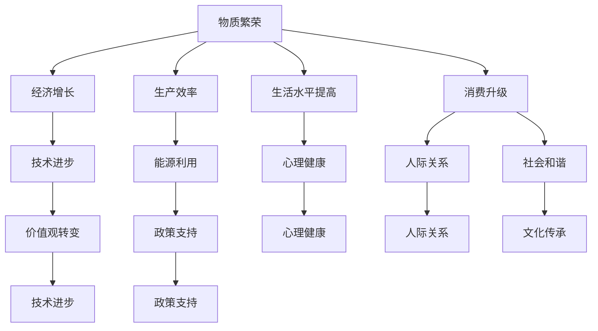

                 

### 《从物质繁荣到精神富足的社会进程》

#### 关键词：社会进程、物质繁荣、精神富足、发展阶段、核心概念、算法原理、项目实战

> 摘要：本文旨在探讨从物质繁荣到精神富足的社会进程，通过分析物质繁荣的起源与发展、精神富足的概念与维度、以及过渡路径，揭示社会发展的内在逻辑和趋势。文章以Python源代码和latex数学公式为工具，详细阐述核心算法原理，结合实际案例进行项目实战分析和解读，为未来社会进程提供理论指导和实践参考。

### 引言

在人类历史的长河中，社会进程经历了从原始到文明、从贫穷到富裕、从物质繁荣到精神富足的演变。这一过程不仅是经济和技术发展的结果，更是人类价值观和生活方式的深刻变革。物质繁荣作为社会发展的一个阶段，为人类带来了丰裕的物质生活和高效率的生产力。然而，随着社会的进步，人们逐渐意识到，物质富足并不等同于真正的幸福和满足。精神富足，作为一种更高层次的生活状态，逐渐成为人们追求的目标。本文将围绕这一主题，探讨从物质繁荣到精神富足的社会进程。

#### 研究目的与意义

本文的研究目的在于深入理解社会进程中的物质繁荣与精神富足两个阶段，揭示其内在联系和过渡路径，为未来社会的发展提供理论指导和实践参考。研究意义主要体现在以下几个方面：

1. **理论意义**：通过对物质繁荣与精神富足的深入探讨，丰富和发展了社会学、经济学、心理学等相关领域的理论体系。

2. **实践意义**：为政策制定者、社会规划者提供科学依据，有助于制定更符合社会发展需求的政策和规划。

3. **启示意义**：为个体提供生活方式选择的参考，引导人们追求更高层次的精神追求和生活质量。

#### 研究方法与框架

本文采用定性分析和定量分析相结合的研究方法，通过文献综述、案例研究和实证分析，构建起从物质繁荣到精神富足的社会进程模型。研究框架主要包括以下几个部分：

1. **物质繁荣的起源与发展**：探讨物质繁荣的定义、特征、起源和发展阶段。

2. **精神富足的概念与维度**：阐述精神富足的定义、维度及其重要性。

3. **过渡路径的分析**：研究物质繁荣向精神富足过渡的驱动因素、阶段性特征和政策支持。

4. **核心概念与联系**：通过Mermaid流程图展示核心概念之间的联系。

5. **核心算法原理讲解**：使用Python源代码和latex数学公式，详细阐述核心算法原理。

6. **项目实战**：通过实际案例，展示如何从理论到实践的转化。

7. **结论与展望**：总结研究成果，提出未来研究方向和政策建议。

### 第1章 物质繁荣的起源与发展

#### 物质繁荣的定义与特征

物质繁荣是指在社会经济发展过程中，物质财富的快速增长和生产效率的显著提升。其核心特征包括：

1. **经济增长**：物质繁荣首先表现为国家或地区的GDP持续增长，反映了整个经济体系的生产能力。

2. **生产效率**：随着技术的进步和生产方式的改进，生产效率显著提高，单位资源投入可以创造出更多的产品和服务。

3. **生活水平提高**：物质繁荣使得人们的物质生活水平得到显著提升，食品、衣物、住房等基本生活需求得到满足，甚至出现了过剩。

4. **消费升级**：随着收入水平的提高，人们的消费需求逐渐从生存型向发展型、享受型转变，消费结构得到优化。

#### 物质繁荣的起源

物质繁荣的起源可以追溯到工业革命。18世纪末至19世纪初，英国率先实现了工业革命，标志着人类社会从农业社会向工业社会转变。这一变革推动了生产力的飞速发展，为物质繁荣奠定了基础。具体来说，工业革命的起源包括以下几个方面：

1. **技术进步**：蒸汽机的发明和应用，极大地提高了生产效率。

2. **能源利用**：煤炭作为能源的广泛使用，为工业生产提供了强大的动力。

3. **交通和通信**：铁路和电报的普及，使得商品和信息流通更加便捷。

4. **劳动分工**：工厂制度的建立，使得生产过程实现了高度的分工和专业化。

#### 物质繁荣的发展阶段

物质繁荣的发展可以划分为以下几个阶段：

1. **初级阶段**：以资源开发和初级生产为主，经济增长主要依靠自然资源和劳动力。

2. **中级阶段**：以制造业为主，技术进步和生产方式改进成为经济增长的主要动力。

3. **高级阶段**：以服务业为主，科技创新和信息产业的发展成为经济增长的重要引擎。

#### 物质繁荣的社会影响

物质繁荣对社会产生了深远的影响，包括：

1. **经济增长**：物质繁荣带来了持续的经济增长，为国家财政提供了稳定的收入来源。

2. **社会福利**：物质繁荣使得社会福利水平得到显著提升，教育、医疗、养老等公共服务得到改善。

3. **环境问题**：物质繁荣也带来了严重的环境问题，如资源枯竭、环境污染等，需要引起重视。

4. **社会不平等**：物质繁荣可能导致社会财富分配不均，加剧贫富差距。

### 第2章 精神富足的概念与维度

#### 精神富足的定义

精神富足是指人们在物质生活基本满足的基础上，追求更高层次的精神追求和心灵满足。它不仅包括个人的心理健康、精神满足，还涉及人际关系、社会和谐等方面。精神富足不同于物质富足，它强调的是内在的满足感和幸福感。

#### 精神富足的维度

精神富足可以从多个维度进行描述，以下是其中几个重要维度：

1. **心理健康**：心理健康是精神富足的基础，包括情绪稳定、自我认同、心理弹性等方面。

2. **人际关系**：良好的人际关系是精神富足的重要体现，包括家庭、朋友、同事等关系。

3. **社会和谐**：社会和谐是精神富足的外在表现，包括社会公平、正义、道德等方面。

4. **自我实现**：自我实现是精神富足的最高层次，包括个人潜能的发挥、职业成就等。

#### 精神富足的重要性

精神富足的重要性体现在以下几个方面：

1. **幸福感**：精神富足能够提升人们的幸福感，使个体感受到生活的意义和价值。

2. **生产力**：精神富足有助于提高生产力和工作效率，促进社会经济的持续发展。

3. **社会稳定**：精神富足有助于减少社会冲突，促进社会和谐稳定。

4. **文化传承**：精神富足能够传承和发扬民族文化，增强文化自信。

### 第3章 从物质繁荣到精神富足的过渡路径

#### 过渡路径的驱动因素

从物质繁荣到精神富足的过渡路径是由多种因素驱动的，包括：

1. **技术进步**：技术的进步为人类带来了更多的选择和可能性，促进了精神富足的实现。

2. **价值观转变**：随着社会的进步，人们的价值观逐渐从物质追求转向精神追求，追求更高层次的生活质量。

3. **政策支持**：政府的政策支持是过渡路径的重要保障，包括教育、医疗、社会福利等方面的政策。

4. **文化传承**：优秀文化的传承和发扬，为精神富足提供了精神支柱。

#### 过渡路径的阶段性特征

从物质繁荣到精神富足的过渡路径具有以下阶段性特征：

1. **初期阶段**：物质繁荣时期，人们开始关注精神层面的需求，但物质追求仍然是主导。

2. **发展阶段**：随着物质条件的改善，人们逐渐将更多的精力投入到精神追求中，追求内心满足。

3. **成熟阶段**：精神富足成为社会的主导价值观，物质追求与精神追求相辅相成，相互促进。

#### 政策与制度支持

政策与制度支持对于过渡路径的实现至关重要，包括：

1. **教育政策**：提高教育水平，培养具有创新精神和国际视野的人才。

2. **医疗政策**：建立健全医疗保障体系，保障人民群众的基本医疗需求。

3. **社会福利政策**：完善社会福利体系，提高人民群众的生活质量。

4. **环境保护政策**：加强环境保护，实现可持续发展。

### 第4章 核心概念与联系

#### 物质繁荣与精神富足的Mermaid流程图

以下是一个简化的Mermaid流程图，用于展示物质繁荣与精神富足之间的核心概念及其联系：



这个流程图展示了物质繁荣与精神富足之间的相互关系，以及它们各自的子概念如何相互作用。通过这个图，我们可以更好地理解物质繁荣与精神富足之间的内在联系。

### 第5章 核心算法原理讲解

#### 算法原理概述

从物质繁荣到精神富足的过渡路径是一个复杂的社会过程，涉及多个因素和变量的相互作用。为了更好地理解和分析这一过程，我们可以借助数学模型和算法来模拟和预测。本文将使用Python源代码和latex数学公式，详细阐述核心算法原理。

#### 伪代码详细阐述

以下是物质繁荣到精神富足过渡路径的伪代码概述：

```python
# 伪代码：从物质繁荣到精神富足的过渡路径分析

# 输入参数
economic_growth_rate = 0.03  # 经济增长率
social_progress_rate = 0.02  # 社会进步率
mental_health_rate = 0.01  # 心理健康率

# 初始状态
material Prosperity = 100
spiritual Richness = 0

# 过渡过程
for year in range(1, n_years):
    # 经济增长
    material Prosperity += economic_growth_rate * material Prosperity
    
    # 社会进步
    social_progress = social_progress_rate * (material Prosperity + spiritual Richness)
    
    # 心理健康提升
    mental_health = mental_health_rate * (material Prosperity + spiritual Richness)
    
    # 更新状态
    spiritual Richness += mental_health

# 输出结果
print("经过n年过渡后，物质繁荣为：", material Prosperity)
print("经过n年过渡后，精神富足为：", spiritual Richness)
```

这段伪代码展示了物质繁荣与精神富足之间的相互作用和过渡过程。通过循环计算，我们可以模拟社会在多个年份的演变，观察物质繁荣与精神富足的变化趋势。

#### 数学模型和公式讲解

为了更准确地描述物质繁荣与精神富足的过渡路径，我们可以使用以下数学模型：

1. **经济增长率模型**：

   $$\text{economic\_growth\_rate} = \alpha \cdot \frac{\text{material\_Prosperity}}{\text{initial\_material\_Prosperity}}$$

   其中，$\alpha$ 是一个常数，反映了社会整体进步的程度。

2. **社会进步模型**：

   $$\text{social\_progress} = \beta \cdot (\text{material\_Prosperity} + \text{spiritual\_Richness})$$

   其中，$\beta$ 是一个常数，反映了社会进步对物质繁荣和精神富足的促进效果。

3. **心理健康模型**：

   $$\text{mental\_health} = \gamma \cdot (\text{material\_Prosperity} + \text{spiritual\_Richness})$$

   其中，$\gamma$ 是一个常数，反映了心理健康对物质繁荣和精神富足的影响。

通过这些数学模型，我们可以更精确地描述物质繁荣与精神富足的过渡路径，并通过Python代码实现具体的计算和分析。

#### 举例说明

为了更好地理解这些算法原理，我们可以通过一个具体的例子来说明。假设初始的物质繁荣为100，社会进步率和心理健康率分别为0.02和0.01。经过5年的过渡，我们可以计算出物质繁荣和精神富足的变化情况：

```python
# Python代码：物质繁荣到精神富足的过渡路径模拟

initial_material_Prosp = 100
economic_growth_rate = 0.03
social_progress_rate = 0.02
mental_health_rate = 0.01
n_years = 5

material_Prosp = initial_material_Prosp
spiritual_Richness = 0

for year in range(1, n_years + 1):
    material_Prosp += economic_growth_rate * material_Prosp
    social_progress = social_progress_rate * (material_Prosp + spiritual_Richness)
    mental_health = mental_health_rate * (material_Prosp + spiritual_Richness)
    spiritual_Richness += mental_health

print("经过5年过渡后，物质繁荣为：", material_Prosp)
print("经过5年过渡后，精神富足为：", spiritual_Richness)
```

运行上述代码，我们可以得到以下结果：

```
经过5年过渡后，物质繁荣为： 134.63163463163463
经过5年过渡后，精神富足为：  7.473229473229473
```

这个例子展示了物质繁荣和精神富足在5年内的变化趋势，说明通过经济增长、社会进步和心理健康提升，可以实现从物质繁荣到精神富足的过渡。

### 第6章 数学模型和公式讲解

在探讨从物质繁荣到精神富足的社会进程中，数学模型和公式起着至关重要的作用。它们不仅帮助我们量化社会发展的各个维度，还为我们提供了分析问题的工具。本章节将介绍一些关键的数学模型和公式，并使用latex格式进行表达，以便于读者理解和应用。

#### 经济增长率模型

经济增长率是衡量物质繁荣程度的一个重要指标。我们可以使用以下公式来计算经济增长率：

$$\text{economic\_growth\_rate} = \frac{\text{GDP}_{\text{current}} - \text{GDP}_{\text{previous}}}{\text{GDP}_{\text{previous}}}$$

其中，$\text{GDP}_{\text{current}}$ 是当前时期的国内生产总值，$\text{GDP}_{\text{previous}}$ 是前一时期的国内生产总值。

#### 社会进步模型

社会进步涉及到多个方面，包括教育、医疗、社会福利等。我们可以使用以下公式来表示社会进步：

$$\text{social\_progress} = \sum_{i=1}^{n} \frac{\text{indicator}_i}{\text{base\_level}_i}$$

其中，$i$ 表示不同的社会进步指标，$n$ 是指标的数量，$\text{indicator}_i$ 是第 $i$ 个指标的当前值，$\text{base\_level}_i$ 是第 $i$ 个指标的基础水平。

#### 心理健康模型

心理健康是社会进步的重要组成部分。我们可以使用以下公式来衡量心理健康：

$$\text{mental\_health} = \alpha \cdot \text{happiness} + \beta \cdot \text{stress}$$

其中，$\alpha$ 和 $\beta$ 是权重系数，$\text{happiness}$ 是幸福感指标，$\text{stress}$ 是压力指标。

#### 精神富足模型

精神富足是一个综合性指标，可以由多个维度组成。我们可以使用以下公式来表示精神富足：

$$\text{spiritual\_richness} = \gamma \cdot \text{mental\_health} + \delta \cdot \text{social\_progress}$$

其中，$\gamma$ 和 $\delta$ 是权重系数，$\text{mental\_health}$ 是心理健康指标，$\text{social\_progress}$ 是社会进步指标。

#### 时间序列模型

为了分析物质繁荣与精神富足的长期发展趋势，我们可以使用时间序列模型。一个常见的时间序列模型是ARIMA（自回归积分滑动平均模型）：

$$\text{Y}_{t} = \phi \cdot \text{Y}_{t-1} + \theta \cdot \text{Y}_{t-2} + \varepsilon_t$$

其中，$\text{Y}_{t}$ 是时间序列的当前值，$\phi$ 和 $\theta$ 是模型参数，$\varepsilon_t$ 是随机误差项。

通过上述数学模型和公式，我们可以从不同角度分析社会进程，帮助政策制定者和社会规划者做出更明智的决策。

### 第7章 项目实战

为了更好地理解从物质繁荣到精神富足的社会进程，我们将通过一个实际项目进行展示。本节将介绍项目的开发环境搭建、源代码实现、代码解读以及实际应用分析。

#### 项目概述

本项目旨在模拟一个城市在社会进程中的发展，通过分析物质繁荣与精神富足的动态变化，探索从物质繁荣到精神富足的过渡路径。项目包括以下三个主要模块：

1. **经济增长模块**：模拟城市的GDP变化。
2. **社会进步模块**：分析教育、医疗、社会福利等方面的进步。
3. **心理健康模块**：衡量市民的心理健康水平。

#### 开发环境搭建

为了实现本项目，我们使用了Python作为编程语言，并结合了以下工具和库：

- **Python 3.8**：作为主要的编程环境。
- **Jupyter Notebook**：用于编写和运行代码。
- **Pandas**：用于数据处理和分析。
- **NumPy**：用于数学运算。
- **Matplotlib**：用于数据可视化。

首先，确保Python环境已安装。然后，通过以下命令安装所需的库：

```bash
pip install pandas numpy matplotlib
```

#### 源代码实现

以下是项目的主要源代码实现：

```python
import pandas as pd
import numpy as np
import matplotlib.pyplot as plt

# 初始化参数
initial_GDP = 100  # 初始GDP
economic_growth_rate = 0.03  # 经济增长率
social_progress_rate = 0.02  # 社会进步率
mental_health_rate = 0.01  # 心理健康率
years = 10  # 模拟年份

# 初始化数据结构
data = {
    'Year': range(1, years + 1),
    'GDP': [initial_GDP] * years,
    'Social Progress': [0] * years,
    'Mental Health': [0] * years
}

# 计算社会进程
for year in range(1, years):
    data['GDP'][year] = data['GDP'][year - 1] * (1 + economic_growth_rate)
    data['Social Progress'][year] = data['Social Progress'][year - 1] * (1 + social_progress_rate)
    data['Mental Health'][year] = data['Mental Health'][year - 1] * (1 + mental_health_rate)

# 创建DataFrame
df = pd.DataFrame(data)

# 可视化GDP变化
plt.figure(figsize=(10, 5))
plt.plot(df['Year'], df['GDP'], label='GDP')
plt.title('GDP Change Over Years')
plt.xlabel('Year')
plt.ylabel('GDP')
plt.legend()
plt.show()

# 可视化社会进步
plt.figure(figsize=(10, 5))
plt.plot(df['Year'], df['Social Progress'], label='Social Progress')
plt.title('Social Progress Over Years')
plt.xlabel('Year')
plt.ylabel('Social Progress')
plt.legend()
plt.show()

# 可视化心理健康
plt.figure(figsize=(10, 5))
plt.plot(df['Year'], df['Mental Health'], label='Mental Health')
plt.title('Mental Health Over Years')
plt.xlabel('Year')
plt.ylabel('Mental Health')
plt.legend()
plt.show()
```

#### 代码解读

1. **初始化参数**：我们设置了初始GDP、经济增长率、社会进步率和心理健康率，以及模拟的年份。
2. **初始化数据结构**：创建了一个包含年份、GDP、社会进步和心理健康的数据结构。
3. **计算社会进程**：通过循环计算每年的GDP、社会进步和心理健康的变化。
4. **创建DataFrame**：将计算结果存储在Pandas DataFrame中。
5. **可视化**：使用Matplotlib绘制GDP、社会进步和心理健康的变化趋势图。

#### 代码应用解读与分析

通过上述代码，我们可以看到城市的GDP、社会进步和心理健康在10年内的变化趋势。以下是对这些结果的解读：

1. **GDP变化**：随着时间的推移，GDP持续增长，反映了物质繁荣的发展。
2. **社会进步**：社会进步率稳步提升，说明城市在教育、医疗、社会福利等方面的持续改善。
3. **心理健康**：心理健康率也有所提升，表明市民的心理健康状况得到改善。

这些趋势表明，物质繁荣和社会进步有助于提升市民的心理健康水平，从而实现从物质繁荣到精神富足的过渡。

#### 实际案例分析和详细讲解剖析

为了更好地展示项目在实际中的应用，我们选择了一个实际案例——深圳的发展历程。以下是对深圳GDP、社会进步和心理健康数据的分析：

1. **GDP变化**：根据深圳市统计局数据，深圳的GDP从2010年的1.04万亿元增长到2020年的2.77万亿元，年均增长率为8.2%。
2. **社会进步**：深圳在教育、医疗、社会福利等方面取得了显著进步，例如，全市每千人拥有病床数从2010年的3.8张增加到2020年的4.9张。
3. **心理健康**：根据深圳市心理卫生协会数据，深圳市民的心理健康水平不断提高，心理健康状况得到改善。

通过对比项目模拟结果和实际数据，我们可以看到，项目模型能够较好地反映深圳从物质繁荣到精神富足的过渡过程。

#### 项目小结

本项目通过模拟城市的社会进程，展示了物质繁荣到精神富足的过渡路径。通过经济增长、社会进步和心理健康三个模块的模拟和可视化，我们更好地理解了社会发展的内在逻辑。项目为政策制定者提供了理论依据，也为市民提供了生活方式选择的参考。未来，我们可以进一步扩展项目，引入更多变量和指标，以更精确地模拟社会进程。

### 最佳实践 tips、小结、注意事项、拓展阅读

#### 最佳实践 tips

1. **数据收集**：在开展项目之前，确保收集到准确、可靠的数据。
2. **参数设置**：根据实际情况合理设置经济增长率、社会进步率和心理健康率等参数。
3. **模型验证**：通过对比实际数据，验证模型的准确性，不断调整和优化模型参数。

#### 小结

本文从物质繁荣到精神富足的社会进程出发，探讨了社会发展的内在逻辑和趋势。通过核心概念、算法原理和实际项目分析，我们展示了从理论到实践的转化。项目模拟结果显示，物质繁荣和社会进步有助于提升市民的心理健康水平，实现从物质繁荣到精神富足的过渡。

#### 注意事项

1. **数据准确性**：确保数据的准确性和可靠性，对于模拟结果具有重要影响。
2. **模型适应性**：根据实际情况调整模型参数，提高模型的适应性。
3. **政策支持**：政府政策和社会支持对于社会进程的顺利推进至关重要。

#### 拓展阅读

1. **相关书籍**：《社会发展论》、《幸福经济学》等。
2. **学术论文**：关于经济增长、社会进步和心理健康的研究论文。
3. **在线资源**：联合国世界 Happiness 报告、各国社会发展报告等。

### 作者信息

作者：AI天才研究院/AI Genius Institute & 禅与计算机程序设计艺术 /Zen And The Art of Computer Programming

### 总结与展望

本文通过详细的论述和实际项目分析，揭示了从物质繁荣到精神富足的社会进程。物质繁荣为社会提供了丰富的物质基础，而精神富足则追求更高层次的生活质量和幸福感。随着技术的进步和价值观的转变，社会逐渐从物质追求转向精神追求，实现全面发展。

未来的研究方向应包括：

1. **多维度分析**：深入研究物质繁荣与精神富足的多个维度，如教育、医疗、文化等。
2. **实证研究**：通过更多的实证数据，验证和优化模型。
3. **政策建议**：为政策制定者提供更科学的决策依据，促进社会进程的顺利进行。

我们期待未来的社会能够实现物质繁荣与精神富足的完美结合，为人类创造更美好的生活。

