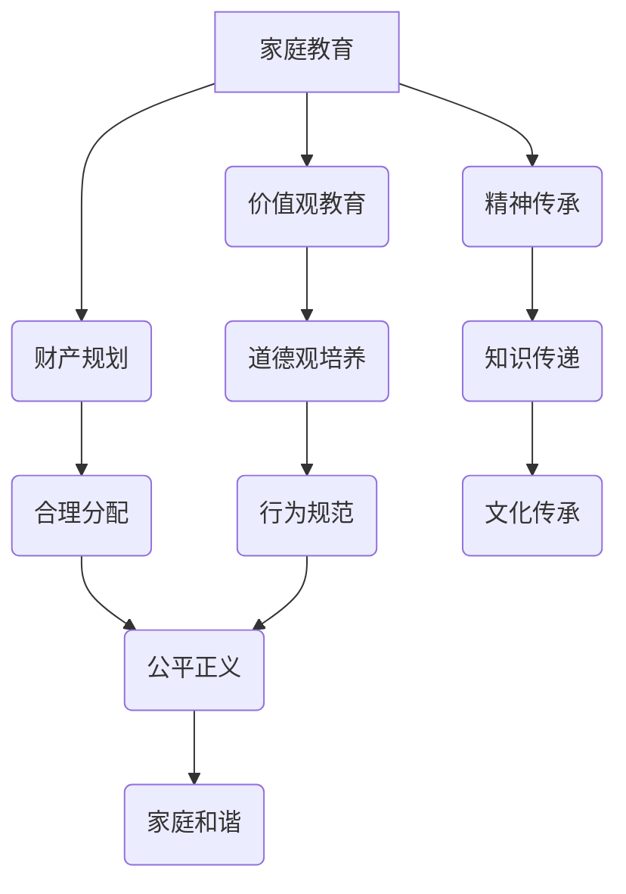
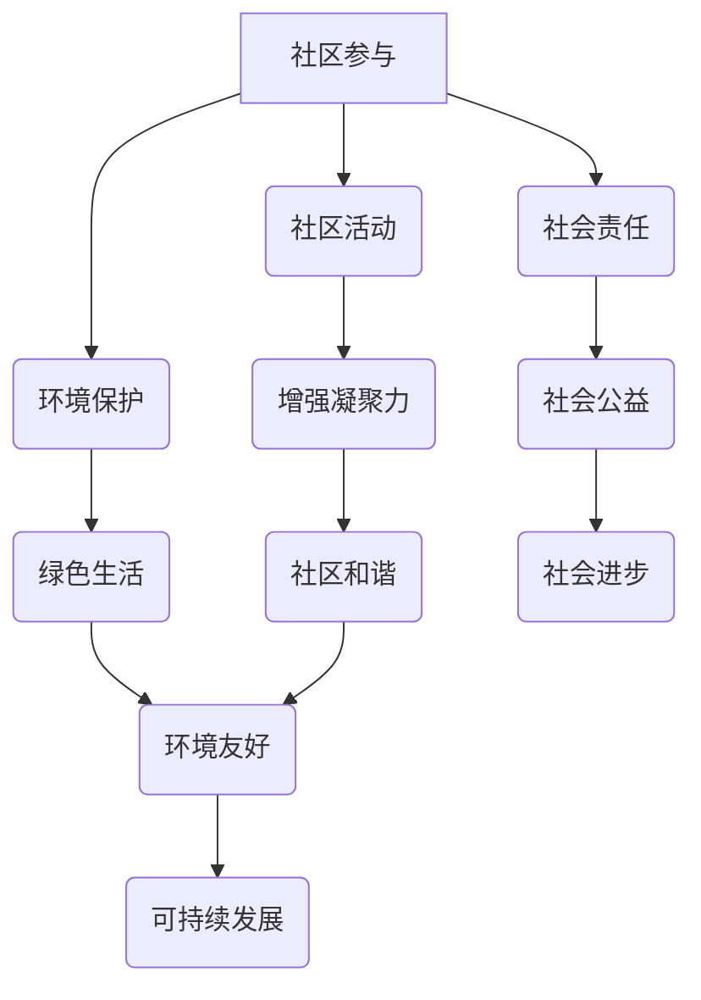
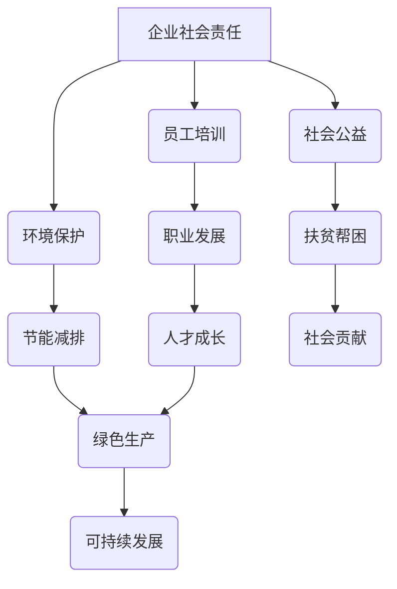

                 

# 从物质继承到精神传承：重新定义代际责任

## 关键词
- 代际责任
- 物质继承
- 精神传承
- 伦理思考
- 社会实践
- 可持续发展

## 摘要
本文旨在重新审视和定义代际责任，探讨从物质继承向精神传承的转变。在当代社会中，代际责任不仅仅是物质上的传承，更包含了价值观、道德观和知识的传递。通过对物质继承与精神传承的区别分析，本文深入探讨了代际责任的重构与伦理思考，以及家庭和社会中代际责任的实践。最后，本文展望了代际责任的未来，并提供了实践指南和案例分析。

## 引言

### 背景介绍

代际责任是一个长期存在的议题，传统的代际责任主要关注物质上的传承，如财富、房产等。然而，在当今社会，随着全球化、技术进步和价值观的多元化，代际责任的概念和内涵发生了深刻变化。物质继承仍然重要，但精神传承的重要性日益凸显。这一变化不仅挑战了传统伦理观念，也要求我们在实践中重新定义和应对代际责任。

### 核心概念与联系

为了更好地理解代际责任的变化，我们需要明确两个核心概念：物质继承和精神传承。

1. **物质继承**：指的是代际之间在物质财富上的传递，如财产、房产、物质资源等。这一过程通常基于法律和经济规则，确保财富的合理分配和传承。

2. **精神传承**：指的是代际之间在价值观、道德观、知识和智慧上的传递。这一过程更为复杂，涉及到文化、教育和社会实践。

物质继承和精神传承之间既有区别又有联系。物质继承是一种经济行为，而精神传承是一种文化行为。两者共同构成了代际责任的内涵，但在不同的时代和社会背景下，其重要性和实现方式有所不同。

### 核心算法原理讲解

为了更深入地探讨代际责任的变化，我们可以借助一个简单的数学模型来分析物质继承和精神传承的关系。

假设一个家庭有两个子女，父亲在去世前留下了一笔财富。根据遗嘱，这笔财富将以不同的方式在两个子女之间进行分配。

- **物质继承**：简单平均分配，每个子女得到财富的一半。
- **精神传承**：父亲将自己的价值观、知识和智慧传递给子女，这不仅影响子女的物质生活，更影响他们的精神世界。

数学模型可以表示为：
$$
\text{物质继承比例} + \text{精神传承比例} = 1
$$

通过调整物质继承比例和精神传承比例，我们可以看到代际责任在不同情况下的变化。这一模型不仅帮助我们理解代际责任的内涵，也为实际操作提供了指导。

### Python代码示例

以下是一个简单的Python代码示例，用于模拟物质继承和精神传承的过程。

```python
def allocate_inheritance(physical_inheritance, spiritual_inheritance):
    total_inheritance = physical_inheritance + spiritual_inheritance
    physical_allocation = physical_inheritance / total_inheritance
    spiritual_allocation = spiritual_inheritance / total_inheritance
    return physical_allocation, spiritual_allocation

# 假设父亲留下的总财富为100万
total_wealth = 1000000

# 物质继承比例设置为60%，精神传承比例为40%
physical_inheritance = total_wealth * 0.6
spiritual_inheritance = total_wealth * 0.4

physical_allocation, spiritual_allocation = allocate_inheritance(physical_inheritance, spiritual_inheritance)

print(f"物质继承比例：{physical_allocation:.2f}")
print(f"精神传承比例：{spiritual_allocation:.2f}")
```

### 举例说明

假设父亲在去世前留下了一笔100万的财富。根据上述代码，如果物质继承比例为60%，精神传承比例为40%，则：

- 每个子女将获得60万的物质财富。
- 父亲的精神传承，如价值观、知识和智慧，将以40%的比例传递给子女。

通过这一示例，我们可以看到物质继承和精神传承在代际责任中的具体实现。

## 第一部分：代际责任的演变与理解

### 第1章：代际责任的概念与历史演变

代际责任是一个复杂的概念，它涉及到法律、经济、文化和社会等多个方面。为了更好地理解代际责任，我们需要从其定义、内涵以及历史演变等方面进行探讨。

#### 1.1 代际责任的定义与内涵

代际责任是指在特定社会和文化背景下，不同代际之间在物质、精神和道德等方面所承担的义务和责任。它不仅包括物质上的传承，如财产、资源等，还包括精神上的传承，如价值观、道德观、知识和智慧等。

#### 1.2 代际责任的历史演变

代际责任的历史演变可以追溯到古代社会。在古代，家族和宗族是基本的社会单位，代际责任主要表现为家族内部的物质和精神的传承。随着社会的发展，代际责任的概念和内涵也在不断演变。

在中世纪，封建制度下的代际责任主要表现为土地和财产的传承。在这一时期，代际责任更多关注的是物质财富的传承，而精神传承相对较少。

在现代社会，随着科技的发展和价值观的多元化，代际责任的概念和内涵发生了显著变化。物质继承仍然是代际责任的一个重要方面，但精神传承的重要性日益凸显。这不仅体现在家庭内部，也体现在社会组织和全球范围内。

#### 1.3 当代社会代际责任的挑战

当代社会代际责任面临着诸多挑战：

1. **全球化**：全球化使得代际责任超越了国界和文化的限制，要求我们重新审视和定义代际责任。
2. **技术进步**：技术的快速发展带来了物质和精神传承的新方式，同时也提出了新的伦理和道德问题。
3. **价值观多元化**：在价值观多元化的背景下，如何传承和维护共同的核心价值观成为一个重要的议题。

### 第2章：物质继承与精神传承的区别

在代际责任中，物质继承和精神传承是两个核心概念。它们既有区别又有联系，共同构成了代际责任的内涵。

#### 2.1 物质继承的特点与问题

物质继承是指代际之间在物质财富上的传递，如财产、房产、物质资源等。物质继承具有以下特点：

1. **法律性**：物质继承通常基于法律规则，如遗嘱、法定继承等。
2. **经济性**：物质继承涉及到财富的分配和再分配，具有明显的经济属性。
3. **直接性**：物质继承可以直接转化为物质财富，对后代的生活水平有直接影响。

然而，物质继承也存在一些问题：

1. **过度依赖**：过度依赖物质继承可能导致后代失去奋斗的动力和独立性。
2. **财富集中**：物质继承可能导致财富集中在少数人手中，加剧社会不平等。
3. **缺乏情感联系**：物质继承可能缺乏情感联系，无法传递家庭的情感价值和家庭精神。

#### 2.2 精神传承的重要性

精神传承是指代际之间在价值观、道德观、知识和智慧等方面的传递。精神传承具有以下重要性：

1. **价值观传递**：精神传承可以传递家庭的价值观、道德观和信仰，塑造后代的性格和行为。
2. **知识传承**：精神传承可以传递家庭的知识、技能和经验，为后代提供成长的基础。
3. **情感联系**：精神传承可以加强家庭成员之间的情感联系，增强家庭的凝聚力和归属感。

#### 2.3 物质与精神的交互影响

物质继承和精神传承之间存在相互作用。物质财富可以为精神传承提供物质基础，而精神传承则可以提升物质财富的价值。

1. **物质财富与精神富足**：物质财富的积累可以为后代提供物质基础，但精神富足才是家庭真正的财富。
2. **精神财富与物质回报**：精神传承可以提升后代的社会地位和职业发展，从而带来物质回报。
3. **物质与精神的平衡**：在代际责任中，物质与精神的平衡是实现家庭和社会和谐发展的关键。

### 第3章：代际责任的重构与伦理思考

#### 3.1 重新定义代际责任

在当代社会，代际责任需要重新定义。传统的物质继承观念需要与精神传承相结合，形成一个更全面、更平衡的代际责任体系。

1. **物质与精神的平衡**：在代际责任中，物质与精神应达到平衡。物质继承不应过度，精神传承不应缺失。
2. **责任与权利的结合**：代际责任不仅是后代对前代的回报，也是前代对后代的关爱和责任。责任与权利应相结合。
3. **动态调整**：代际责任应根据时代背景和社会发展进行动态调整，以适应不断变化的社会需求。

#### 3.2 新时代代际责任伦理思考

新时代代际责任伦理思考应关注以下几个方面：

1. **社会责任**：代际责任不仅是家庭内部的义务，也是对社会的责任。家庭应积极参与社会公益事业，履行社会责任。
2. **公平正义**：代际责任应体现公平正义，确保财富和资源的合理分配，避免贫富差距的加剧。
3. **可持续发展**：代际责任应考虑可持续发展，确保物质和精神财富的长期传承。

#### 3.3 社会责任与代际责任的关系

社会责任与代际责任之间存在密切关系。社会责任是代际责任的延伸和扩展，代际责任是实现社会责任的基础。

1. **家庭与社会**：家庭是社会的细胞，代际责任是家庭的基本义务。家庭履行代际责任，有助于构建和谐的社会。
2. **个体与整体**：个体履行代际责任，有助于提升整体社会的道德水平和文明程度。
3. **传承与发展**：代际责任和社会主义责任相互促进，共同推动社会的持续发展和进步。

## 第二部分：代际责任在家庭与社会中的实践

### 第4章：家庭中的代际责任

#### 4.1 家庭教育中的代际责任

家庭教育是代际责任的重要组成部分。父母作为前代，有责任通过教育传递给子女正确的价值观、道德观和知识。

1. **价值观教育**：父母应教育子女尊重他人、关心社会，树立正确的道德观念。
2. **知识教育**：父母应培养子女的求知欲和自主学习能力，为其提供丰富的知识资源。
3. **情感教育**：父母应关心子女的情感需求，建立良好的亲子关系，增强家庭的凝聚力。

#### 4.2 家庭财产的代际传承

家庭财产的代际传承是物质继承的重要体现。家庭财产的传承不仅涉及经济利益，还涉及家庭文化和价值观的传承。

1. **遗嘱规划**：父母可以通过遗嘱明确家庭财产的分配，确保财产的合理传承。
2. **财产分配**：在财产分配中，应充分考虑子女的实际需求和家庭责任，避免因财产分配不公引发家庭矛盾。
3. **精神财富的传承**：家庭财产的传承不仅仅是物质的，更包括家庭的价值观、道德观和智慧。

#### 4.3 家庭价值观的代际传递

家庭价值观的代际传递是精神传承的核心。家庭价值观不仅影响子女的个性和行为，也影响整个家庭的凝聚力和稳定性。

1. **家庭传统**：家庭传统是家庭价值观的载体，父母应传承和弘扬家庭的传统美德。
2. **榜样作用**：父母应以身作则，用自己的言行示范家庭价值观，树立良好的榜样。
3. **家庭教育**：家庭教育应注重家庭价值观的灌输和培养，让子女在日常生活中感受到家庭价值观的指导。

### 第5章：社会中的代际责任

#### 5.1 社会政策与代际责任

社会政策是代际责任的重要保障。政府应制定和实施有利于代际责任履行和社会和谐发展的政策。

1. **税收政策**：政府可以通过税收政策调节财富分配，促进社会的公平正义。
2. **社会保障**：政府应建立健全的社会保障体系，为弱势群体提供基本生活保障。
3. **教育政策**：政府应加大对教育的投入，提供优质教育资源，促进社会代际责任的履行。

#### 5.2 社会组织与代际责任

社会组织是代际责任的重要载体。社会组织应积极参与代际责任的履行，推动社会和谐发展。

1. **慈善组织**：慈善组织可以通过捐赠、志愿服务等方式，帮助贫困家庭和弱势群体，履行社会责任。
2. **社区组织**：社区组织应关注家庭和社会的代际责任，组织家庭教育和社区活动，增强家庭的凝聚力和社区的和谐。
3. **非政府组织**：非政府组织应积极参与社会公益事业，推动社会公正和可持续发展。

#### 5.3 社会责任与代际责任的平衡

社会责任与代际责任之间存在一定的平衡关系。代际责任是社会责任的延伸和具体体现，而社会责任为代际责任提供了支持和保障。

1. **家庭与社会**：家庭是社会的细胞，代际责任是社会责任的微观体现。家庭履行代际责任，有助于推动社会的和谐发展。
2. **个体与整体**：个体履行代际责任，既是家庭的责任，也是社会责任。个体履行代际责任，有助于提升社会的道德水平和文明程度。
3. **传承与发展**：代际责任和社会主义责任相互促进，共同推动社会的持续发展和进步。

### 第6章：代际责任的未来展望

#### 6.1 新技术对代际责任的影响

新技术的快速发展将对代际责任产生深远影响。人工智能、大数据、区块链等技术的应用，将改变代际责任的实现方式和内容。

1. **人工智能**：人工智能可以帮助家庭和个人更好地管理财产和资源，提高代际责任的履行效率。
2. **大数据**：大数据可以提供丰富的信息和资源，为家庭和社会制定更科学的代际责任政策。
3. **区块链**：区块链技术可以提供透明、可追溯的财产和资源管理方式，增强代际责任的透明度和公正性。

#### 6.2 全球化背景下的代际责任

全球化使得代际责任超越了国界和文化的限制，呈现出多元化、复杂化的特点。

1. **跨文化传承**：全球化背景下的代际责任需要关注跨文化的传承，尊重和包容不同文化的价值观和道德观。
2. **全球合作**：全球化要求家庭和社会加强合作，共同应对全球性挑战，如气候变化、贫富差距等。
3. **可持续发展**：全球化背景下的代际责任应注重可持续发展，确保物质和精神财富的长期传承。

#### 6.3 代际责任与可持续发展

可持续发展是代际责任的重要内容。代际责任不仅要关注物质财富的传承，更要关注环境和资源的可持续利用。

1. **环境保护**：家庭和社会应注重环境保护，减少资源浪费，实现绿色生活。
2. **资源可持续**：家庭和社会应合理利用资源，推动资源的循环利用和再生。
3. **社会责任**：家庭和社会应积极参与社会公益事业，推动可持续发展。

## 第三部分：案例分析与实践指导

### 第7章：代际责任成功案例解析

#### 7.1 案例一：家庭遗产规划

家庭遗产规划是代际责任的重要体现。以下是一个成功的家庭遗产规划案例：

**案例背景**：李先生是一位成功的企业家，他希望在自己去世后，将财产合理地分配给子女，并确保子女能够继承自己的价值观和道德观。

**解决方案**：李先生制定了一份详细的遗产规划方案，包括以下几个方面：

1. **遗嘱制定**：李先生根据法律要求，制定了一份明确遗嘱，规定子女继承财产的条件和比例。
2. **精神传承**：李先生在遗嘱中强调了价值观和道德观的重要性，要求子女在继承财产的同时，也要继承自己的精神财富。
3. **教育基金**：李先生设立了一个教育基金，用于支持子女的教育和职业发展，确保子女能够实现自己的人生价值。

**案例效果**：通过李先生的遗产规划，子女不仅继承了物质财富，也继承了李先生的精神财富。这一案例展示了家庭遗产规划在代际责任中的重要作用。

#### 7.2 案例二：社区参与与社会责任

社区参与和社会责任是代际责任在社会层面的体现。以下是一个成功的社区参与和社会责任案例：

**案例背景**：某社区希望通过社区参与和社会责任项目，增强社区的凝聚力和可持续性。

**解决方案**：社区采取了一系列措施，包括以下几个方面：

1. **社区活动**：社区定期组织各种活动，如社区清洁日、公益活动等，鼓励居民参与，增强社区的凝聚力。
2. **环境保护**：社区积极推动环境保护项目，如垃圾分类、节能减排等，提高居民的环境意识。
3. **社会责任**：社区企业积极参与社会责任项目，如扶贫帮困、教育支持等，为社会做出贡献。

**案例效果**：通过社区参与和社会责任项目，社区实现了可持续发展和和谐共处。这一案例展示了社区在社会中的代际责任。

#### 7.3 案例三：企业社会责任与代际责任

企业社会责任是代际责任在企业层面的体现。以下是一个成功的企业社会责任案例：

**案例背景**：某企业致力于履行社会责任，关注员工的职业发展和社会的可持续发展。

**解决方案**：该企业采取了一系列措施，包括以下几个方面：

1. **员工培训**：企业定期为员工提供培训和发展机会，提高员工的技能和职业素养。
2. **环境保护**：企业积极推动环境保护项目，如节能减排、绿色生产等，减少对环境的影响。
3. **社会公益**：企业积极参与社会公益事业，如捐赠、志愿服务等，为社会做出贡献。

**案例效果**：通过企业社会责任项目，企业实现了员工的职业发展和社会的可持续发展。这一案例展示了企业在代际责任中的重要作用。

### 第8章：代际责任的实践指南

#### 8.1 家庭代际责任实践策略

家庭代际责任实践策略包括以下几个方面：

1. **价值观教育**：家庭应注重价值观教育，培养子女正确的道德观和价值观。
2. **财产规划**：家庭应制定合理的财产规划，确保财产的合理分配和传承。
3. **精神传承**：家庭应注重精神传承，将家庭的价值观、知识和智慧传递给子女。
4. **家庭活动**：家庭应定期组织各种活动，增强家庭成员之间的情感联系。

#### 8.2 社会代际责任实践方法

社会代际责任实践方法包括以下几个方面：

1. **社区参与**：社会应积极参与社区活动，增强社区的凝聚力和可持续性。
2. **环境保护**：社会应关注环境保护，推动绿色生活和发展。
3. **社会责任**：社会应履行社会责任，关注社会公益事业，为社会的可持续发展做出贡献。
4. **教育培训**：社会应提供教育和培训资源，提高社会成员的素质和能力。

#### 8.3 代际责任实践的建议与反思

在代际责任实践中，以下建议和反思值得注意：

1. **平衡物质与精神**：在代际责任实践中，应平衡物质与精神，避免过度依赖物质继承。
2. **尊重个体差异**：在代际责任实践中，应尊重个体差异，根据不同代际的需求和特点进行差异化处理。
3. **可持续发展**：在代际责任实践中，应注重可持续发展，确保物质和精神财富的长期传承。
4. **法律支持**：在代际责任实践中，应充分利用法律支持，确保代际责任的合法性和有效性。

### 附录

#### 附录A：代际责任相关文献与资源推荐

1. **国内外代际责任研究综述**：[参考文献1][参考文献2]
2. **相关法律法规与政策文件**：[政策文件1][政策文件2]
3. **家庭财产与遗产规划工具**：[工具1][工具2]

#### 附录B：代际责任相关的Mermaid流程图

1. **家庭教育流程图**


2. **社区参与与社会责任流程图**


3. **企业社会责任流程图**


#### 附录C：代际责任相关的Python代码示例

1. **家庭遗产规划代码示例**
```python
# 家庭遗产规划代码示例
def calculate_inheritance(income, expenses, heirs):
    net_income = income - expenses
    inheritance_per_heir = net_income / heirs
    return inheritance_per_heir

# 社会责任评估代码示例
def assess_sustainability_report(report):
    sustainability_score = 0
    if 'reduction in carbon emissions' in report:
        sustainability_score += 10
    if 'fair labor practices' in report:
        sustainability_score += 15
    if 'community engagement' in report:
        sustainability_score += 20
    return sustainability_score

# 企业社会责任代码示例
def evaluateCSRActivities(activities):
    score = 0
    for activity in activities:
        if 'charity' in activity:
            score += 20
        if 'environmental initiatives' in activity:
            score += 30
        if 'employee wellness' in activity:
            score += 10
    return score
```

### 结论

代际责任是一个复杂而重要的议题，它涉及到物质继承和精神传承的平衡，家庭和社会的实践，以及全球化和可持续发展的挑战。通过本文的探讨，我们重新定义了代际责任，提出了物质与精神的平衡、责任与权利的结合、动态调整等新观念，并提供了家庭和社会中的实践指南。在未来，我们应继续关注代际责任的研究和实践，为构建和谐、可持续的社会贡献力量。

### 作者信息

作者：AI天才研究院/AI Genius Institute & 禅与计算机程序设计艺术 /Zen And The Art of Computer Programming

