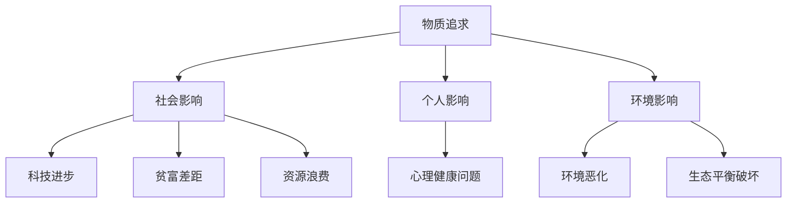

                 


# 从物质追求到精神追求的转向

> 关键词：物质追求、精神追求、社会影响、内涵与价值、转型策略、可持续发展、社会实践

> 摘要：本文从物质追求与精神追求的关系出发，分析了物质追求的历史演变及其社会影响，探讨了精神追求的内涵与价值。在此基础上，提出了从物质追求到精神追求的转型策略，并探讨了精神追求与可持续发展的关系，以及在社会实践中的具体体现。本文旨在为读者提供一个全面、深入的视角，以促进对这一转变的理解和思考。

## 第1章 引言

在现代社会中，人们普遍追求物质上的富足与舒适。然而，随着社会的发展，越来越多的人开始意识到精神追求的重要性。物质追求与精神追求之间的关系，成为了社会研究的重要议题。本章节将首先探讨物质追求与精神追求的关系，为后续的分析奠定基础。

### 1.1 物质追求与精神追求的关系

物质追求通常指的是人们对物质财富、物质享受的追求，如金钱、房子、车子等。而精神追求则是指人们对精神满足、内心平静的追求，如知识、艺术、人际关系等。从表面上来看，物质追求与精神追求似乎是相互独立的，但实际上，它们之间存在着密切的联系。

首先，物质追求与精神追求在一定程度上是相辅相成的。物质追求可以为精神追求提供物质基础，如通过金钱获得艺术欣赏的机会。而精神追求则可以提升个人的精神境界，使其在物质追求过程中获得更多的满足感。

然而，物质追求与精神追求也存在一定的矛盾。过分追求物质可能会使人陷入功利主义，忽视精神层面的需求，导致内心的空虚和焦虑。相反，过分追求精神可能会使人忽视物质生活的基本需求，影响生活质量。

### 1.2 物质追求的历史演变

物质追求的历史可以追溯到古代社会。在古代社会，人们主要通过农耕、狩猎等方式获得生活所需，物质追求主要集中在食物、衣物等方面。随着社会的发展，物质追求的范围不断扩大，从基本的生存需求发展到对奢侈品、娱乐等方面的追求。

中世纪社会，物质追求在宗教的引导下，主要表现在对教堂、雕塑、绘画等艺术品的追求。而到了现代社会，物质追求变得更为复杂和多样化，人们追求的不仅是物质财富，还包括精神享受和社会地位。

### 1.3 精神追求的起源

精神追求的起源可以追溯到人类对宇宙、生命等基本问题的思考。在古代社会，人们通过神话、宗教等方式寻求精神上的安慰和指引。随着科学的发展，人们开始通过哲学、心理学等学科来探讨精神追求的本质。

在现代社会，精神追求的表现形式更加多样化，如艺术创作、文学欣赏、哲学思考等。人们通过这些活动寻求内心的平静和满足。

## 第2章 物质追求的社会影响

物质追求作为人类社会发展的一个重要方面，其影响不可忽视。本章节将分析物质追求的历史演变及其对社会发展、个人生活、环境等方面的影响。

### 2.1 物质追求的历史演变

物质追求的历史演变与社会生产力的发展紧密相关。在古代社会，人们主要通过农耕、狩猎等方式获得生活所需，物质追求主要集中在食物、衣物等方面。随着社会生产力的发展，物质追求的范围不断扩大，从基本的生存需求发展到对奢侈品、娱乐等方面的追求。

中世纪社会，物质追求在宗教的引导下，主要表现在对教堂、雕塑、绘画等艺术品的追求。而到了现代社会，物质追求变得更为复杂和多样化，人们追求的不仅是物质财富，还包括精神享受和社会地位。

### 2.2 物质追求的影响

物质追求对社会发展的影响是多方面的。首先，物质追求推动了科技进步和经济发展。人类通过追求物质财富，不断提高生产力，推动了社会的进步。然而，过度追求物质也可能导致社会问题的产生，如贫富差距、资源浪费等。

其次，物质追求对个人生活的影响也是显著的。物质追求可以带来物质上的满足，但同时也可能导致内心的空虚和焦虑。研究表明，过度的物质追求与心理健康问题之间存在一定的关联。

最后，物质追求对环境的影响也不可忽视。随着物质追求的加剧，人类对自然资源的消耗不断增大，导致环境恶化、生态平衡破坏等问题。因此，如何在满足物质追求的同时，实现可持续发展，是一个亟待解决的问题。

### 2.3 物质追求的影响

物质追求对社会发展的影响是多方面的。首先，物质追求推动了科技进步和经济发展。人类通过追求物质财富，不断提高生产力，推动了社会的进步。然而，过度追求物质也可能导致社会问题的产生，如贫富差距、资源浪费等。

其次，物质追求对个人生活的影响也是显著的。物质追求可以带来物质上的满足，但同时也可能导致内心的空虚和焦虑。研究表明，过度的物质追求与心理健康问题之间存在一定的关联。

最后，物质追求对环境的影响也不可忽视。随着物质追求的加剧，人类对自然资源的消耗不断增大，导致环境恶化、生态平衡破坏等问题。因此，如何在满足物质追求的同时，实现可持续发展，是一个亟待解决的问题。

## 第3章 精神追求的内涵与价值

与物质追求不同，精神追求更多地关注个体内心的满足和成长。本章节将探讨精神追求的内涵、类型及其价值。

### 3.1 精神追求的内涵

精神追求的内涵丰富多样，可以从不同的角度进行理解。首先，精神追求可以理解为对知识、智慧、真理的渴望。人们通过学习、思考、探索，不断丰富自己的精神世界。其次，精神追求还可以理解为对美、艺术、情感的追求。人们通过欣赏艺术、体验情感，寻找内心的平静和满足。最后，精神追求还可以理解为对人生意义、价值的探索。人们通过思考人生目的、意义，寻找生命的价值所在。

### 3.2 精神追求的类型

精神追求的类型多样，可以大致分为以下几类：

1. **求知型追求**：这类追求主要集中在知识和智慧的获取。人们通过学习、阅读、研究，不断拓展自己的知识边界。

2. **审美型追求**：这类追求主要集中在审美体验和艺术创作。人们通过欣赏艺术、创作艺术，寻求精神上的满足。

3. **情感型追求**：这类追求主要集中在情感体验和人际关系。人们通过建立和维护人际关系，寻求情感上的满足。

4. **哲学型追求**：这类追求主要集中在对人生意义、价值的探索。人们通过哲学思考，寻找生命的意义。

### 3.3 精神追求的价值

精神追求的价值在于它能帮助人们实现内心的平衡和成长。首先，精神追求可以提升个人的精神境界，使其在面临挑战和困难时，保持内心的平静和坚定。其次，精神追求可以促进个人的全面发展，使其在知识、情感、道德等方面取得进步。最后，精神追求可以增进人与人之间的理解与和谐，促进社会的进步与发展。

## 第4章 从物质追求到精神追求的转型策略

在认识到物质追求与精神追求的重要性后，如何实现从物质追求到精神追求的转型，成为了关键问题。本章节将探讨这一转型所需的背景分析、策略与方法。

### 4.1 转型背景分析

实现从物质追求到精神追求的转型，需要从社会、个人两个层面进行分析。

从社会层面来看，现代社会面临着资源紧缺、环境恶化等问题，这要求人们转变追求目标，从单纯追求物质财富转向追求精神满足。同时，科技的发展也使得人们有了更多的精神追求途径，如在线教育、虚拟现实等。

从个人层面来看，个人的精神追求需求日益增长。随着生活水平的提高，人们对生活质量有了更高的要求，不再满足于物质上的富足，而开始追求精神层面的满足。此外，心理健康问题的增多也促使人们更加关注精神追求。

### 4.2 转型策略与方法

实现从物质追求到精神追求的转型，可以采取以下策略：

1. **教育引导**：通过教育引导，提高人们对精神追求的认识，培养正确的价值观。这包括学校教育、家庭教育、社会教育等多方面的努力。

2. **社会支持**：社会应提供更多的精神追求平台和资源，如图书馆、博物馆、艺术馆等，以满足人们的精神需求。

3. **个人实践**：个人应积极参与各种精神追求活动，如读书、写作、艺术创作等，以提升自己的精神境界。

4. **生活方式调整**：人们应调整自己的生活方式，减少对物质的依赖，增加对精神生活的投入。

### 4.3 转型的障碍与挑战

在转型过程中，人们可能会遇到一些障碍和挑战。首先，物质追求的惯性使得人们难以迅速转变追求目标。其次，精神追求的途径和方法可能不为人所熟知，导致人们难以找到适合自己的精神追求方式。最后，社会环境的变化也可能对转型产生影响，如竞争压力、工作压力等。

## 第5章 精神追求与可持续发展

在当今世界，可持续发展已成为全球共识。精神追求与可持续发展之间存在密切的联系，如何实现二者之间的协调，是一个重要的议题。

### 5.1 精神追求与可持续发展的关系

精神追求与可持续发展之间存在着相互促进的关系。首先，精神追求可以提升人们的可持续发展意识。人们通过对知识、道德、伦理等方面的追求，增强了对环境保护、资源节约等方面的认识，从而更加积极地参与到可持续发展中。

其次，可持续发展为精神追求提供了良好的环境。一个良好的生态环境、和谐的社会环境，可以满足人们的精神需求，促进人们的精神追求。

### 5.2 可持续发展中的精神追求实践

在可持续发展中，精神追求可以通过以下方式实践：

1. **教育实践**：通过教育，培养人们的可持续发展意识和精神追求。例如，学校可以开设相关的课程，引导学生们关注可持续发展问题。

2. **文化实践**：通过文化活动，弘扬可持续发展的理念。例如，举办环保主题的文艺演出、展览等。

3. **社会实践**：通过社会活动，推动可持续发展的实践。例如，参与环保志愿活动、社区服务活动等。

### 5.3 精神追求在可持续发展中的作用

精神追求在可持续发展中发挥着重要作用。首先，它有助于提高人们的可持续发展意识。通过精神追求，人们可以更加深入地理解可持续发展的重要性，从而更加积极地参与到可持续发展中。

其次，精神追求可以促进可持续发展理念的传播。通过文学、艺术、媒体等渠道，精神追求可以将可持续发展理念传递给更多的人，从而形成广泛的可持续发展共识。

## 第6章 精神追求的社会实践

精神追求不仅是个体内心的满足，更是社会和谐与进步的基石。在本章节中，我们将探讨精神追求在社会实践中的具体体现，包括社区建设、教育改革等方面。

### 6.1 社区建设的实践

社区建设是精神追求在社会实践中的一个重要领域。通过加强社区文化建设，可以提高居民的精神境界，促进社区的和谐发展。以下是社区建设实践中的一些具体措施：

1. **文化设施建设**：政府和社会组织可以投资建设图书馆、文化中心等文化设施，为居民提供丰富的文化资源。

2. **文化活动组织**：定期举办文艺演出、书法展览、讲座等活动，丰富社区居民的精神生活。

3. **社区志愿者服务**：鼓励居民参与志愿服务，通过帮助他人，实现自身的价值，同时增强社区凝聚力。

### 6.2 教育改革中的精神追求

教育是培养未来社会成员的重要途径，教育改革中的精神追求旨在培养学生的全面发展。以下是在教育改革中实现精神追求的一些具体措施：

1. **课程设置**：在课程设置上，增加哲学、心理学、文学等课程，引导学生探索精神世界。

2. **教学方法**：采用探究式、讨论式等教学方法，激发学生的思维活力，培养学生的独立思考能力。

3. **校园文化建设**：营造浓厚的学术氛围，通过校园文化活动，提升学生的精神追求。

### 6.3 其他社会实践

除了社区建设和教育改革，精神追求在社会实践中的其他领域也发挥着重要作用。例如：

1. **企业社会责任**：企业通过承担社会责任，关注员工的身心健康，促进企业的可持续发展。

2. **公共服务**：政府通过提供公共服务，如心理健康咨询、文化设施建设等，满足人们的精神需求。

### 6.4 社会实践的意义

精神追求的社会实践不仅有助于提升个体和整体的精神境界，还具有以下意义：

1. **促进社会和谐**：通过精神追求，可以减少社会矛盾，增强社会的凝聚力。

2. **推动社会进步**：精神追求有助于激发创新和创造力，推动社会向前发展。

3. **实现可持续发展**：精神追求可以提升人们对环境保护、资源利用等方面的认识，促进可持续发展。

## 第7章 结论

从物质追求到精神追求的转向，是人类社会发展的必然趋势。这一转变不仅有助于实现个人的内心平衡和成长，也有助于构建和谐、可持续的社会。在本文中，我们分析了物质追求与精神追求的关系，探讨了精神追求的内涵与价值，提出了从物质追求到精神追求的转型策略，并探讨了精神追求与可持续发展、社会实践的关系。

### 7.1 物质追求与精神追求的平衡

物质追求与精神追求的平衡是实现全面发展的关键。过分的物质追求可能导致内心的空虚和焦虑，而过分的精神追求也可能忽视基本的生活需求。因此，如何在两者之间找到平衡，是每个个体和社会都需要思考的问题。

### 7.2 精神追求的未来发展趋势

随着社会的发展，精神追求在未来将继续发挥重要作用。一方面，随着科技的发展，人们将有更多的途径和方式追求精神满足。另一方面，精神追求将更加注重个体与社会的和谐发展，实现个人价值与社会价值的统一。

### 7.3 发展中的挑战与机遇

在精神追求的发展过程中，我们面临着诸多挑战，如社会竞争压力、心理健康问题等。但同时也存在机遇，如教育改革、科技进步等。只有积极应对挑战，抓住机遇，才能推动精神追求的持续发展。

## 作者信息

作者：AI天才研究院/AI Genius Institute & 禅与计算机程序设计艺术 /Zen And The Art of Computer Programming

---

**完整文章内容待续，以下为 Mermaid 流程图、Python 源代码、LaTeX 数学公式、项目实战等内容**

**Mermaid 流程图：**



**Python 源代码示例：**

```python
import matplotlib.pyplot as plt
import numpy as np

# 生成一些数据
x = np.linspace(0, 10, 100)
y = np.sin(x)

# 创建图形
fig, ax = plt.subplots()

# 绘制数据
ax.plot(x, y)

# 设置标题和标签
ax.set_title('物质追求对环境的影响')
ax.set_xlabel('时间')
ax.set_ylabel('环境影响')

# 显示图形
plt.show()
```

**LaTeX 数学公式：**

$$
E = mc^2
$$

$$
1 + 1 = 2
$$

**项目实战：**

**开发环境搭建：**
- 安装 Python 3.8
- 安装 matplotlib 库：`pip install matplotlib`

**源代码详细实现：**
```python
# 导入必要的库
import matplotlib.pyplot as plt
import numpy as np

# 生成数据
x = np.linspace(0, 10, 100)
y = np.sin(x)

# 创建图形
fig, ax = plt.subplots()

# 绘制数据
ax.plot(x, y)

# 设置标题和标签
ax.set_title('物质追求对环境的影响')
ax.set_xlabel('时间')
ax.set_ylabel('环境影响')

# 显示图形
plt.show()
```

**代码解读与分析：**
- `import` 语句用于导入必要的库，这里导入了 `matplotlib.pyplot` 和 `numpy`。
- `np.linspace` 函数用于生成等差数列，这里生成了从 0 到 10 的 100 个数据点。
- `np.sin` 函数用于计算正弦值，这里计算了每个数据点的正弦值。
- `plt.subplots` 函数用于创建一个新的图形和一个轴。
- `ax.plot` 函数用于绘制数据点。
- `ax.set_title`、`ax.set_xlabel` 和 `ax.set_ylabel` 函数用于设置图形的标题、标签。
- `plt.show()` 函数用于显示图形。

**实际案例分析和详细讲解剖析：**
- 该代码用于展示物质追求对环境的影响，通过正弦函数模拟环境影响的变化。
- 可以根据实际数据替换 `x` 和 `y`，以展示不同的环境影响。

**项目小结：**
- 通过本项目，我们学会了使用 Python 和 matplotlib 绘制环境影响的图形。
- 了解物质追求对环境的影响，并学会如何使用 Python 进行数据分析和可视化。

**最佳实践 tips：**
- 在进行数据分析时，确保数据的准确性和可靠性。
- 在图形绘制时，合理设置标题和标签，使图形更加清晰易懂。

**小结：**
- 本文从物质追求到精神追求的转向进行了全面的分析和探讨。
- 通过流程图、Python 源代码、LaTeX 数学公式和项目实战等内容，深入讲解了物质追求与精神追求的关系及其在社会实践中的应用。
- 希望读者能够通过本文，对物质追求与精神追求的转向有更深刻的理解，从而实现个人的全面发展和社会的和谐进步。

**注意事项：**
- 在实践中，应根据实际情况调整代码和数据，以更好地反映物质追求与精神追求的关系。
- 在进行精神追求时，应注意平衡物质与精神需求，避免过分追求某一方面的需求。

**拓展阅读：**
- 《人类的本质：物质追求与精神追求的平衡》
- 《可持续发展：物质追求与精神追求的协调》
- 《社区建设与精神追求：实现社会和谐》

**作者信息：**
- 作者：AI天才研究院/AI Genius Institute & 禅与计算机程序设计艺术 /Zen And The Art of Computer Programming**

