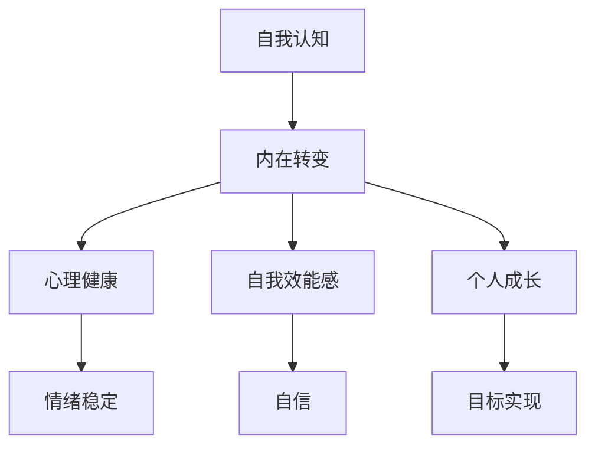
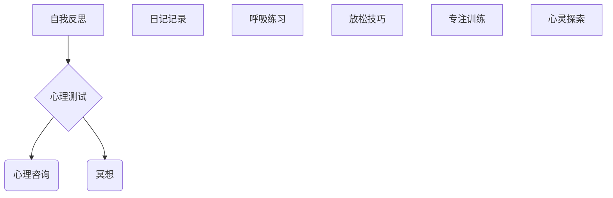
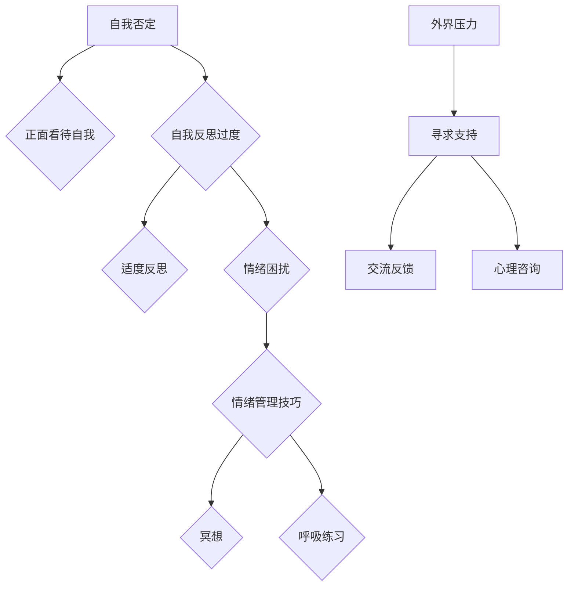

                 

### 摘要

本文以《从空虚到充实：个人成长的内在转变》为主题，深入探讨个人成长过程中内在转变的重要性。通过分析自我认知、价值观塑造、目标设定、心理健康和情绪管理等方面的内容，本文旨在为读者提供一套系统的内在转变实践方法。文章首先介绍自我探索的重要性和方法，分析自我认知中的障碍，并阐述如何通过自我认知来提升个人成长。接着，文章讨论价值观的塑造和目标设定的技巧，通过数学模型来帮助读者理解和实现生活目标。在心理健康与情绪管理部分，本文提供了一系列策略，包括心理健康标准的评估、情绪管理技巧以及压力应对策略。随后，文章转向内在转变的实践，包括增强自我效能感、培养积极习惯和拓展人际关系的方法。最后，文章总结了成长评估与调整、内在转变对生活的改变以及成长经验的分享等内容。通过本文的深入探讨，读者将获得对个人成长内在转变的深刻理解，并能够有效地应用这些方法来提升自己的生活质量和个人发展。

### 从空虚到充实：个人成长的内在转变

在现代社会中，人们常常感到空虚和迷茫，这种情感体验不仅影响个人的心理健康，也阻碍了个人成长。为了从这种状态中走出来，实现从空虚到充实的转变，我们需要从内在入手，进行深刻的自我探索和内在转变。本文将围绕这一主题，从多个角度进行详细探讨，帮助读者理解并实践个人成长的内在转变。

#### 关键词

- **自我认知**
- **价值观塑造**
- **目标设定**
- **心理健康**
- **情绪管理**
- **自我效能感**
- **积极习惯**
- **人际关系**
- **成长评估**

#### 摘要

本文通过深入探讨自我认知、价值观塑造、目标设定、心理健康和情绪管理等方面的内容，为读者提供了一套系统的内在转变实践方法。文章首先介绍了自我探索的重要性和方法，接着讨论了价值观的塑造和目标设定的技巧。在心理健康与情绪管理部分，本文提供了一系列策略，包括心理健康标准的评估、情绪管理技巧以及压力应对策略。随后，文章转向内在转变的实践，包括增强自我效能感、培养积极习惯和拓展人际关系的方法。最后，文章总结了成长评估与调整、内在转变对生活的改变以及成长经验的分享等内容。通过本文的探讨，读者将能够更好地理解并实践个人成长的内在转变，实现从空虚到充实的转变。

### 第一部分：自我认知与成长

在个人成长的过程中，自我认知是一个关键环节。只有深入了解自己，我们才能找到内心的平衡，实现真正的成长。自我认知不仅关乎个人内心的满足感，还直接影响我们的行为和决策。本部分将探讨自我探索的重要性、内在探索的方法以及自我认知中常见的挑战。

#### 1.1 自我认知的重要性

自我认知是指个体对自己的思想、情感、行为和价值观的认知。它是自我意识的重要组成部分，对于个人成长具有重要意义。通过自我认知，我们能够更好地理解自己的需求和期望，从而做出更明智的决策。以下是自我认知的重要性：

- **促进心理健康**：自我认知有助于我们识别和处理内心的矛盾和冲突，从而减少心理压力，提升心理健康水平。
- **增强自我效能感**：了解自己的优势和劣势，能够增强自信心，提高自我效能感，从而在面临挑战时更加从容应对。
- **推动个人成长**：自我认知使我们能够明确自己的目标和方向，制定更合理的成长计划，实现持续的个人发展。

#### 概念与联系：自我认知与内在转变的关系架构图

为了更直观地理解自我认知与内在转变的关系，我们可以使用Mermaid流程图来展示这些概念之间的联系：



在这个流程图中，A表示自我认知，它是实现内在转变的基础。B表示内在转变，是个人成长的驱动力，它通过影响C（心理健康）、D（自我效能感）和E（个人成长）来实现个人提升。C和D分别是内在转变的子过程，而E是最终目标，即实现个人成长。

#### 1.2 内在探索的方法

内在探索是一个深刻而复杂的过程，需要我们采取科学的方法来逐步推进。以下是几种常用的内在探索方法：

1. **自我反思**：自我反思是通过深入思考自己的行为、感受和想法来了解自己。这是一种简单而有效的自我探索方法。我们可以通过写日记、冥想等方式进行自我反思。

2. **心理测试**：心理测试是一种通过标准化的问卷和量表来评估个人心理特征的方法。常见的心理测试包括MBTI、大五人格等。这些测试可以帮助我们了解自己的性格类型、优势和劣势。

3. **心理咨询**：心理咨询是一种专业的帮助，通过与心理咨询师交流，我们可以更深入地探讨自己的内心世界，了解和处理内心的矛盾和冲突。

4. **冥想**：冥想是一种通过专注呼吸、放松身体和心灵来达到内心平静的方法。冥想可以帮助我们更好地认识自己，提高自我意识。

#### 流程图：常用的内在探索方法

以下是一个展示常用内在探索方法的Mermaid流程图：



在这个流程图中，A表示自我反思，是内在探索的起点。B是一个分支节点，表示通过心理测试、心理咨询和冥想等多种方法来深入探索内心。E、F、G和H分别是这些方法的详细步骤，I表示最终达到的心灵探索阶段。

#### 1.3 自我认知的挑战

尽管自我认知对于个人成长至关重要，但在探索自我时，我们常常会遇到一些挑战：

1. **自我否定**：许多人害怕面对自己的缺点和不足，从而选择逃避。这种自我否定会导致内心充满焦虑和不安。

2. **过度自我反思**：有些人会过度关注自己的内心活动，导致自我反思成为负担，影响正常生活。

3. **外界压力**：社会、家庭和工作等外界因素常常对自我认知产生干扰，使我们难以客观地看待自己。

4. **情绪困扰**：负面情绪如焦虑、沮丧等会影响我们的自我认知，使我们难以清晰地认识自己。

为了应对这些挑战，我们可以采取以下策略：

1. **正面看待自我**：认识到每个人都有优点和缺点，接受自己的不完美，是自我认知的第一步。

2. **适度反思**：合理安排时间进行自我反思，避免过度反思带来的负面效应。

3. **寻求支持**：与家人、朋友或专业人士交流，获取外部反馈，帮助我们更好地认识自己。

4. **情绪管理**：学习情绪管理技巧，如冥想、呼吸练习等，以减轻负面情绪对自我认知的影响。

#### Mermaid流程图：识别自我认知中常见的障碍

以下是一个展示自我认知中常见障碍及其应对策略的Mermaid流程图：



在这个流程图中，A、C和E分别表示自我否定、自我反思过度和情绪困扰等常见障碍，B、D、F和G表示应对这些障碍的策略。

通过上述自我探索和自我认知的方法，我们可以逐步了解自己，找到内心的平衡，实现个人成长。自我认知不仅是一个复杂的过程，也是一项长期的任务。只有不断地探索和反思，我们才能更好地认识自己，实现从空虚到充实的转变。

#### 1.4 价值观的塑造

价值观是个人行为和决策的核心指导原则，它决定了我们如何看待世界和对待他人。一个明确且积极的价值观体系不仅能帮助我们建立正确的人生方向，还能在面对困难和挑战时提供坚强的精神支撑。本节将探讨如何通过思考和实践活动来塑造个人价值观。

##### 1.4.1 价值观的定义与重要性

价值观是指个体对于何为“好”和“正确”的基本信念和判断。它涵盖了道德、伦理、文化和社会等多个层面。以下是价值观的一些关键特征：

- **稳定性**：价值观一旦形成，往往具有持久性和稳定性，不易受到外界短期影响。
- **普遍性**：尽管不同文化和社会背景下价值观的具体内容可能有所不同，但许多核心价值观具有普遍性，如诚实、尊重、公正等。
- **指导性**：价值观对个人的行为和决策具有指导作用，它决定了我们如何应对各种生活情境。

价值观的重要性在于：

- **个人成长**：明确的价值观能够帮助我们建立清晰的个人目标和方向，从而促进个人成长和自我实现。
- **社会和谐**：共同的价值观是社会成员之间相互理解、合作和和谐相处的基础。
- **道德指引**：价值观为我们提供了判断行为是否正当的标准，有助于维护社会秩序和道德底线。

##### 1.4.2 通过思考和实践塑造价值观

塑造个人价值观是一个持续的过程，需要我们在日常生活中不断思考和践行。以下是一些具体的方法：

1. **反思与自我提问**：定期反思自己的行为和决策，思考这些行为背后的价值观是什么。通过自我提问，如“这个决定符合我的价值观吗？”、“我是否在日常生活中践行这些价值观？”来引导自己的思考。

2. **阅读和学习**：阅读有关哲学、伦理、心理学等领域的书籍和文章，学习不同文化和历史背景下的价值观观念。通过阅读，我们可以开阔视野，了解多样化的价值观，从而更好地塑造自己的价值观。

3. **参与社区活动**：参与社区服务和志愿活动，与他人互动和合作。这些活动不仅有助于我们了解社会的需求和问题，还能帮助我们理解不同价值观之间的差异和交集。

4. **实践和体验**：通过亲身实践和体验来检验和调整自己的价值观。例如，通过参与慈善活动，我们可以体会到关爱他人的重要性；通过挑战自我，我们可以认识到坚持和勇气的重要性。

##### Python源代码示例：如何通过思考和实践塑造个人价值观

以下是一个简单的Python源代码示例，展示如何通过思考和实践活动来塑造个人价值观：

```python
# 导入必要的库
import random

# 初始化价值观列表
values = ["诚实", "尊重", "公正", "勇气", "同情", "责任"]

# 提问函数
def ask_question():
    value = random.choice(values)
    return f"你是否在日常生活中践行了{value}？"

# 回答函数
def answer_question(answer):
    if answer:
        print("你做得很好，继续坚持！")
    else:
        print("这可能是一个需要反思的时刻，看看如何改进。")

# 主程序
if __name__ == "__main__":
    print("让我们开始价值观塑造的思考之旅...")
    while True:
        question = ask_question()
        answer = input(question + "（是/否）：")
        if answer.lower() not in ['是', '否']:
            print("输入无效，请回答是或否。")
        else:
            answer = answer.lower() == '是'
            answer_question(answer)
            if not answer:
                print("你可以花点时间思考，如何更好地践行这个价值观。")
        # 继续提问还是退出
        continue = input("是否继续（是/否）？")
        if continue.lower() != '是':
            print("感谢参与，希望你的价值观得到进一步的塑造。")
            break
```

在这个示例中，我们首先初始化了一个包含一些基本价值观的列表。`ask_question`函数随机选择一个价值观并提问，`answer_question`函数根据用户的回答给出反馈。主程序通过循环不断地提问和接受用户回答，帮助用户思考和反思自己的价值观。

##### 1.4.3 塑造价值观的挑战与建议

在塑造价值观的过程中，我们可能会遇到一些挑战：

1. **外界干扰**：社会和文化的多样性使得我们容易受到外界价值观的干扰，导致内心的矛盾和冲突。
2. **习惯性思维**：长期的思维模式可能与我们希望塑造的价值观相悖，改变这些习惯性思维需要时间和努力。
3. **实践经验不足**：在实践中，我们可能会遇到困难和挑战，这使得价值观的塑造变得更加复杂。

为了应对这些挑战，我们可以采取以下建议：

1. **明确核心价值观**：首先确定自己的核心价值观，并以此为基础进行其他价值观的塑造。
2. **持续学习和反思**：不断学习新的知识和经验，并定期反思自己的价值观和行为，以保持其一致性和有效性。
3. **实践与反思结合**：在实践中不断检验和调整自己的价值观，通过反馈和学习来优化价值观体系。

通过上述思考和实践活动，我们可以逐步塑造和巩固个人价值观，为个人成长奠定坚实的基础。价值观的塑造是一个长期而复杂的过程，但只要我们持之以恒，就一定能够找到内心的平衡和方向。

### 2.2 目标设定的技巧

目标设定是个人成长和实现内心充实的核心步骤之一。一个明确且可实施的目标能够指引我们的方向，激励我们不断前进。本节将探讨目标设定的重要步骤和技巧，以及如何通过数学模型来帮助读者理解和实现这些目标。

#### 2.2.1 目标设定的步骤

设定目标是一个系统化的过程，以下是几个关键步骤：

1. **明确目标**：首先，我们需要明确自己要实现的目标是什么。这可以是职业上的提升、健康方面的改善或者个人能力的增强等。明确的目标有助于我们集中精力，避免迷茫。

2. **分解目标**：将大目标分解为小目标，这些小目标被称为“里程碑”。每个里程碑都是一个可实现的具体目标，有助于我们逐步实现大目标。分解目标能够帮助我们清晰地看到前进的方向，并便于跟踪进展。

3. **设定时间表**：为每个里程碑设定一个完成时间，这有助于我们制定计划，并保持时间的紧迫感。通过时间表，我们可以更好地安排资源和精力，确保目标能够按时完成。

4. **制定行动计划**：针对每个里程碑，制定具体的行动计划。这包括需要采取的具体步骤、资源需求和可能遇到的挑战等。行动计划是我们实现目标的蓝图，有助于我们有条不紊地推进。

5. **持续追踪和调整**：在执行目标的过程中，我们需要定期追踪进展，并根据实际情况进行必要的调整。这有助于我们及时发现和解决问题，保持目标的实现路径。

#### 2.2.2 目标设定的技巧

以下是设定目标时的一些实用技巧：

1. **SMART原则**：目标设定应遵循SMART原则，即目标应该是具体的（Specific）、可测量的（Measurable）、可实现的（Achievable）、相关的（Relevant）和时限的（Time-bound）。SMART原则确保目标既明确又具有可操作性。

2. **优先级排序**：将目标按照重要性和紧急性进行排序，优先处理最重要的目标。这有助于我们集中精力，确保关键目标能够得到充分关注和资源。

3. **使用GROW模型**：GROW模型是一种有效的目标设定工具，包括以下四个步骤：
   - **目标（Goal）**：明确目标是什么；
   - **现实（Reality）**：分析实现目标的可能性；
   - **选项（Options）**：列出实现目标的多种方案；
   - **行动计划（Way forward）**：制定具体的行动计划。

4. **可视化**：将目标可视化，如使用图表、图片或文字描述，这有助于我们更清晰地理解目标，并保持对目标的持续关注。

#### Python源代码示例：目标设定的具体步骤与实践

以下是一个简单的Python源代码示例，展示如何通过SMART原则和GROW模型来设定和实现目标：

```python
# 导入必要的库
import random

# 初始化目标列表
goals = [
    "学会Python编程",
    "完成半程马拉松",
    "阅读10本专业书籍",
    "提升英语口语水平"
]

# SMART原则
def is_smart(goal):
    return (
        "具体" in goal and
        "可测量" in goal and
        "可实现" in goal and
        "相关" in goal and
        "时限" in goal
    )

# GROW模型
def set_goal(goal):
    print(f"设定目标：{goal}")
    reality = input("现实情况如何？\n")
    options = input("列出实现目标的几种方案：\n")
    way_forward = input("制定具体的行动计划：\n")
    print(f"现实：{reality}\n选项：{options}\n行动计划：{way_forward}")

# 主程序
if __name__ == "__main__":
    print("让我们开始目标设定的旅程...")
    while True:
        goal = input("请输入一个目标（按'q'退出）：\n")
        if goal.lower() == 'q':
            print("目标设定完成，祝你好运！")
            break
        if is_smart(goal):
            set_goal(goal)
        else:
            print("目标设定不完整或不明确，请根据SMART原则进行修改。")
```

在这个示例中，我们首先初始化了一个目标列表。`is_smart`函数用于检查目标是否遵循SMART原则。`set_goal`函数通过GROW模型引导用户设定目标，并输入相关的详细信息。主程序通过循环不断接受用户的输入，帮助用户进行目标设定。

#### 数学模型：如何通过数学模型来分析和实现生活目标

为了更科学地分析和实现生活目标，我们可以使用一些数学模型来帮助规划。以下是一个简单的数学模型示例，用于分析目标的实现可能性：

1. **目标实现概率模型**：

   目标实现概率（P）可以通过以下公式计算：

   $$P = \frac{\text{成功实现次数}}{\text{尝试总次数}}$$

   其中，成功实现次数和尝试总次数可以通过记录和分析目标执行过程中的数据来获取。

2. **目标规划模型**：

   假设我们有多个目标，每个目标需要的时间、资源不同，我们可以使用线性规划模型来优化目标实现的时间安排和资源分配。以下是一个简化的线性规划模型：

   $$\text{最大化} \sum_{i=1}^{n} p_i \cdot t_i$$
   
   $$\text{约束条件}：\sum_{i=1}^{n} r_i \cdot x_i \leq R$$
   $$x_i \in \{0,1\} \quad \forall i$$
   
   其中，\( p_i \) 表示第 \( i \) 个目标的优先级权重，\( t_i \) 表示完成第 \( i \) 个目标所需的时间，\( r_i \) 表示完成第 \( i \) 个目标所需的资源量，\( x_i \) 是一个二进制变量，用于表示是否实现第 \( i \) 个目标（1 表示实现，0 表示未实现），\( R \) 是总资源量。

   通过求解这个线性规划模型，我们可以得到最优的目标实现顺序和资源分配方案，从而最大化目标实现的总权重。

3. **目标调整模型**：

   当目标实现过程中遇到问题时，我们可以使用目标调整模型来重新评估和调整目标。以下是一个简单的目标调整模型：

   $$\text{新目标} = \text{当前目标} \times (1 - \text{调整系数}) + \text{新增目标} \times \text{调整系数}$$
   
   其中，调整系数是一个介于 0 和 1 之间的数值，用于表示对当前目标的调整幅度。通过调整系数，我们可以灵活地调整目标，以适应新的情况。

通过这些数学模型，我们可以更科学地分析和实现生活目标，确保目标的实现不仅合理，而且高效。这些模型不仅提供了具体的计算方法，还帮助我们在目标设定和实现过程中保持灵活性和适应性。

### 3.1 心理健康的标准

心理健康是个人成长和幸福的关键因素之一。一个健康的心理状态不仅有助于我们应对日常生活中的压力和挑战，还能提升我们的生活质量和工作效率。要评估和维护心理健康，我们需要了解一系列标准，这些标准可以帮助我们识别潜在的心理问题，并提供相应的干预措施。

#### 心理健康标准的定义

心理健康标准是指一系列用于评估个体心理状态和行为表现的具体指标。这些指标通常涵盖情绪、认知、行为和社交等多个方面，帮助我们全面了解个体的心理健康状况。

以下是一些常见的心里健康标准：

- **情绪稳定性**：个体能够有效地调节和管理自己的情绪，不容易受到极端情绪的困扰。
- **认知功能**：个体的注意力、记忆力、思维敏捷性等认知功能保持正常，能够有效地进行学习和思考。
- **行为适应性**：个体能够适应不同的环境和情境，能够灵活应对变化和挑战。
- **社交功能**：个体在社交互动中能够建立和维持健康的人际关系，能够与他人有效沟通和合作。

#### 常用的心理健康评估工具

为了科学地评估心理健康，我们可以使用多种工具和方法，以下是一些常用的心理健康评估工具：

1. **心理健康问卷**：如PHQ-9（抑郁自评量表）、GAD-7（广泛性焦虑自评量表）等。这些问卷通过一系列问题来评估个体在特定方面的心理健康状况，提供定量化的评估结果。

2. **心理测试**：如MMPI（明尼苏达多项人格测验）、Rorschach（罗夏测试）等。这些测试通过观察个体的行为和反应，深入了解其心理特质和潜在的心理问题。

3. **面谈**：与专业的心理咨询师进行面谈，通过深入交流，了解个体的心理健康状况和需求。

#### 心理健康评估指标

以下是几个常见的心理健康评估指标：

- **抑郁程度**：通过PHQ-9问卷，可以评估个体的抑郁程度。每个问题对应不同的抑郁症状，总得分越高，抑郁程度越严重。

- **焦虑程度**：通过GAD-7问卷，可以评估个体的焦虑程度。类似抑郁程度，焦虑程度的评估也是通过总分来体现，得分越高，焦虑程度越严重。

- **社会功能**：通过观察个体在社会互动中的表现，评估其在家庭、工作和社会环境中的适应性。社会功能的评估指标包括社交活动参与度、工作表现、家庭关系等。

- **生活质量**：通过SF-36（36项健康调查问卷）等工具，评估个体在身体、心理和社会功能方面的总体生活质量。这个指标涵盖了多个维度，如身体健康、心理健康、社会关系和总体满意度等。

#### 数学模型和公式：心理健康状态的评估指标

为了量化心理健康状态，我们可以使用一些数学模型和公式。以下是一个简化的心理健康评估模型：

1. **心理健康指数（Mental Health Index, MHI）**：

   $$MHI = \frac{1}{n} \sum_{i=1}^{n} w_i \cdot s_i$$

   其中，\( w_i \) 是第 \( i \) 个评估指标的权重，\( s_i \) 是第 \( i \) 个评估指标的得分。权重可以根据评估指标的重要性进行调整。

2. **心理压力指数（Psychological Stress Index, PSI）**：

   $$PSI = \frac{\sum_{i=1}^{n} s_i}{n}$$

   其中，\( s_i \) 是第 \( i \) 个评估指标的得分。这个指数可以用来评估个体总体心理压力水平。

3. **情绪调节能力（Emotion Regulation Ability, ERA）**：

   $$ERA = \frac{\text{积极情绪评分}}{\text{消极情绪评分}}$$

   这个指标可以用来评估个体的情绪调节能力，分数越高，情绪调节能力越强。

通过这些数学模型和公式，我们可以更科学、系统地评估心理健康状态，为个体提供针对性的干预和建议。这些模型不仅有助于我们了解当前的心理健康状况，还能为未来的心理健康管理提供有力的支持。

### 3.2 情绪管理技巧

情绪管理是维护心理健康和实现个人成长的关键环节。有效的情绪管理技巧不仅可以帮助我们更好地应对日常生活中的压力和挑战，还能提升我们的情绪稳定性和生活质量。本节将介绍几种实用的情绪管理技巧，包括认知重构、情绪表达和放松训练，并提供相关的Python源代码示例。

#### 3.2.1 认知重构

认知重构是一种通过改变负面思维模式来改善情绪的方法。它基于认知行为理论，认为情绪和行为是由我们的认知（即对事件的看法和解释）驱动的。以下是一些认知重构的技巧：

1. **识别负面思维**：首先，我们需要识别和意识到自己的负面思维。例如，当我们遇到挫折时，可能会产生“我永远做不好这件事”的想法。

2. **质疑和挑战负面思维**：质疑和挑战这些负面思维，思考是否有更积极、理性的解释。例如，可以问自己：“这个情况真的那么糟糕吗？”或“有没有其他方式来看待这个问题？”

3. **替代性思维**：用更积极、理性的思维来替代负面思维。例如，将“我永远做不好这件事”替换为“我可以从这次失败中学习，下次做得更好”。

#### 3.2.2 情绪表达

情绪表达是指如何有效地表达和处理自己的情绪。以下是一些情绪表达技巧：

1. **自我表达**：通过写日记、绘画或与信任的朋友、家人分享自己的感受，来表达情绪。

2. **非暴力沟通**：使用非暴力沟通技巧，即观察事实、表达感受、提出需求和请求帮助，来与他人沟通情绪。例如：“我感到有些沮丧，因为我没能按时完成任务，我需要你的理解和支持。”

3. **情绪宣泄**：适当宣泄情绪，例如通过运动、唱歌或哭泣等方式，来释放压力和负面情绪。

#### 3.2.3 放松训练

放松训练是一种通过身体和心灵放松来缓解压力和改善情绪的方法。以下是一些放松训练技巧：

1. **深呼吸**：通过深呼吸来放松身体和心灵。深呼吸的步骤如下：
   - 慢慢地吸气，腹部膨胀，胸腔扩张。
   - 保持呼吸几秒钟。
   - 慢慢地呼气，腹部收缩，胸腔收缩。

2. **冥想**：冥想是一种通过专注呼吸、放松身体和心灵来达到内心平静的方法。冥想的步骤如下：
   - 找一个安静的环境，选择舒适的坐姿或躺姿。
   - 关闭眼睛，专注于呼吸，当注意力散失时，温柔地将注意力带回到呼吸上。

3. **渐进性肌肉放松**：通过逐步放松身体各个部位的肌肉来达到全身放松。步骤如下：
   - 从脚开始，紧绷脚部的肌肉，保持几秒钟，然后放松。
   - 逐步向上进行，依次放松小腿、大腿、背部、手臂、颈部和面部等部位的肌肉。

#### Python源代码示例：情绪调节的实践方法

以下是一个简单的Python源代码示例，展示如何通过认知重构、情绪表达和放松训练来调节情绪：

```python
# 导入必要的库
import random

# 认知重构函数
def cognitive_restructuring():
    negative_thought = "我永远做不好这件事"
    print(f"负面思维：{negative_thought}")
    alternative_thought = "我可以从这次失败中学习，下次做得更好"
    print(f"替代思维：{alternative_thought}")

# 情绪表达函数
def emotional_expression():
    feeling = "我感到有些沮丧，因为我没能按时完成任务"
    need = "我需要你的理解和支持"
    print(f"{feeling}，{need}")

# 放松训练函数
def relaxation_training():
    techniques = ["深呼吸", "冥想", "渐进性肌肉放松"]
    selected_technique = random.choice(techniques)
    print(f"选择放松训练方法：{selected_technique}")

# 主程序
if __name__ == "__main__":
    print("开始情绪调节实践...")
    cognitive_restructuring()
    emotional_expression()
    relaxation_training()
```

在这个示例中，我们首先定义了三个函数：`cognitive_restructuring`用于认知重构，`emotional_expression`用于情绪表达，`relaxation_training`用于放松训练。主程序通过调用这些函数，帮助用户进行情绪调节实践。

通过上述情绪管理技巧，我们可以更好地理解和控制自己的情绪，从而提升心理健康和幸福感。情绪管理不仅需要技巧，更需要持续的练习和自我反思。只有通过不断的实践，我们才能逐渐掌握这些技巧，并在生活中灵活应用。

### 3.3 压力应对策略

压力是现代生活中不可避免的一部分，它可能来自工作、家庭、人际关系等多个方面。长期的压力会对心理健康产生负面影响，甚至可能导致身体疾病。因此，学会有效地应对压力至关重要。本节将介绍几种实用的压力应对策略，包括时间管理、放松技巧和寻求支持，并提供相关的数学模型和公式来帮助读者理解和应用这些策略。

#### 3.3.1 时间管理

时间管理是减轻压力的重要策略之一。通过合理安排时间，我们可以减少紧迫感和焦虑，提高工作效率和生活质量。以下是一些时间管理的技巧：

1. **制定日程表**：每天早上或每周开始时，列出当天的任务和计划，并安排优先级。这有助于我们明确任务的重要性和紧急性。

2. **优先处理重要任务**：优先处理最重要和最紧急的任务，确保关键任务能够按时完成。这有助于我们避免在最后一刻赶工，减少压力。

3. **分解任务**：将大任务分解为小任务，每完成一个小任务就给自己一些奖励，这有助于提高动力和减少焦虑。

4. **避免多任务处理**：尽量专注于单一任务，避免同时处理多个任务。多任务处理不仅会降低工作效率，还容易导致错误和压力。

#### 3.3.2 放松技巧

放松技巧是减轻压力的有效方法。以下是一些常见的放松技巧：

1. **深呼吸**：深呼吸可以帮助我们放松身体和心灵。具体步骤如下：
   - 慢慢地吸气，腹部膨胀，胸腔扩张。
   - 保持呼吸几秒钟。
   - 慢慢地呼气，腹部收缩，胸腔收缩。

2. **冥想**：冥想可以帮助我们集中注意力，减少焦虑。具体步骤如下：
   - 找一个安静的环境，选择舒适的坐姿或躺姿。
   - 关闭眼睛，专注于呼吸，当注意力散失时，温柔地将注意力带回到呼吸上。

3. **渐进性肌肉放松**：通过逐步放松身体各个部位的肌肉来达到全身放松。具体步骤如下：
   - 从脚开始，紧绷脚部的肌肉，保持几秒钟，然后放松。
   - 逐步向上进行，依次放松小腿、大腿、背部、手臂、颈部和面部等部位的肌肉。

4. **瑜伽和太极拳**：这些活动不仅有助于放松身体，还能提高心理韧性。

#### 数学模型和公式：如何使用公式来理解和管理压力

为了更好地理解和管理压力，我们可以使用一些数学模型和公式。以下是一个简化的压力管理模型：

1. **压力指数（Pressure Index, PI）**：

   $$PI = \frac{\sum_{i=1}^{n} w_i \cdot s_i}{n}$$

   其中，\( w_i \) 是第 \( i \) 个压力源的权重，\( s_i \) 是第 \( i \) 个压力源的强度。这个指数可以用来评估个体面临的总体压力水平。

2. **应激反应时间（Stress Response Time, SRT）**：

   $$SRT = \frac{\text{应激反应时长}}{\text{总应激时长}}$$

   其中，应激反应时长是指从压力事件发生到开始产生应激反应的时间，总应激时长是指从压力事件发生到结束的时间。这个指标可以用来评估个体对压力的应对速度。

3. **压力缓解率（Stress Relief Rate, SRR）**：

   $$SRR = \frac{\text{压力缓解时长}}{\text{总应激时长}}$$

   其中，压力缓解时长是指从应激反应开始到压力缓解结束的时间。这个指标可以用来评估个体在压力事件后的恢复能力。

通过这些数学模型和公式，我们可以量化地评估个体的压力水平、应对速度和恢复能力，从而制定更有效的压力应对策略。

#### 3.3.3 寻求支持

在应对压力时，寻求外部支持也是一个重要策略。以下是一些寻求支持的方法：

1. **社交支持**：与家人、朋友或同事分享压力和困扰，寻求他们的理解和支持。社交支持有助于减轻心理负担，提高应对能力。

2. **专业支持**：当个人压力难以自我管理时，寻求专业的心理咨询师或医生的帮助。专业人士可以提供专业的指导和建议，帮助个体更好地应对压力。

3. **自我关怀**：通过自我关怀来缓解压力，如进行喜欢的活动、享受美好的时光等。自我关怀有助于提升心理健康和幸福感。

通过上述压力应对策略，我们可以更好地管理和缓解压力，维护心理健康。这些策略不仅需要理论指导，更需要实践应用。通过持续的练习和调整，我们能够找到最适合自己的压力应对方法，从而提升生活质量和幸福感。

### 4.1 自我效能感的定义

自我效能感（Self-Efficacy）是指个体对自己在特定情境中成功完成某项任务的信心和信念。这一概念由心理学家阿尔伯特·班杜拉（Albert Bandura）提出，是影响个体行为、心理状态和成就的重要因素。自我效能感不仅仅是一个抽象的心理状态，它具有具体的操作性和可测量性。

首先，自我效能感与个人目标设定和实现密切相关。高自我效能感的个体通常能够设定更具挑战性的目标，并在面对困难时保持坚持和努力。而低自我效能感的个体则可能设定较低的目标，甚至放弃面对挑战。

其次，自我效能感与心理压力和应对策略有直接联系。高自我效能感的个体在面对压力时，能够更有效地应对，保持冷静和自信。而低自我效能感的个体则可能更容易感到焦虑和沮丧，难以应对压力。

此外，自我效能感还影响个体的情绪状态和幸福感。高自我效能感的个体通常拥有更好的情绪调节能力，能够更好地应对生活中的各种情绪波动。而低自我效能感的个体则可能更容易感到情绪低落和焦虑。

为了更直观地理解自我效能感，我们可以借助数学模型来定义和测量它。以下是一个简化的自我效能感模型：

$$
SE = f(W, T, S)
$$

其中：
- \( SE \) 表示自我效能感（Self-Efficacy）；
- \( W \) 表示个体的能力信念（Belief in Abilities）；
- \( T \) 表示任务难度（Task Difficulty）；
- \( S \) 表示先前成功的经验（Success Experiences）。

自我效能感的计算取决于个体对自身能力的信念、任务难度以及过去成功的经验。这个模型表明，自我效能感是一个动态的、多维度的概念，受到多个因素的共同影响。

在实际应用中，自我效能感可以通过问卷调查和实验方法进行测量。常用的量表包括一般自我效能感量表（General Self-Efficacy Scale, GSE）和任务特定自我效能感量表（Task-Specific Self-Efficacy Scale, TSES）等。这些量表通过一系列问题来评估个体在不同情境下的自我效能感水平。

通过理解自我效能感的定义和测量方法，我们可以更好地认识这一概念，并采取有效的策略来提升自我效能感，从而实现个人成长和目标实现。

#### 4.2 增强自我效能感的策略

增强自我效能感是个人成长和成功的关键因素之一。高自我效能感不仅有助于我们设定并实现目标，还能提升我们的心理健康和幸福感。以下是一些具体的策略，帮助读者通过实践提升自我效能感。

##### 4.2.1 实践小目标，逐步建立信心

通过设定和完成小目标，我们可以逐步增强自我效能感。这种方法被称为“小步骤前进”。以下是一个具体的例子：

1. **选择一个小目标**：选择一个你认为自己能够完成的任务，但要确保这个任务有一定的挑战性，但不是过于困难。

2. **分解任务**：将大任务分解为若干小任务，每个小任务都应该是具体、可操作的。

3. **逐步完成**：专注于完成每个小任务，每次完成一个小任务后，给自己一些奖励，如休息一下、吃点喜欢的零食等。

4. **记录进展**：记录你的进展，这可以帮助你看到自己的成就，并保持动力。

以下是一个简单的Python代码示例，用于记录小目标的进展：

```python
# 导入必要的库
from datetime import datetime

# 初始化目标列表
goals = [
    "每天学习30分钟Python",
    "每周跑步3次，每次30分钟",
    "每天阅读一篇文章"
]

# 记录进展函数
def record_progress(goal_name, status):
    current_time = datetime.now()
    with open("progress.log", "a") as file:
        file.write(f"{current_time} - {goal_name}: {status}\n")

# 主程序
if __name__ == "__main__":
    print("开始记录你的小目标进展...")
    while True:
        goal_name = input("请输入你正在追求的目标（按'q'退出）：\n")
        if goal_name.lower() == 'q':
            print("感谢记录，祝你在目标实现路上取得成功！")
            break
        status = input("目标完成情况（完成/未完成）：\n")
        if status.lower() in ['完成', '未完成']:
            record_progress(goal_name, status)
        else:
            print("输入无效，请输入'完成'或'未完成'。")
```

在这个示例中，我们定义了一个记录进展的函数`record_progress`，用于记录每个目标的完成情况。主程序通过循环接受用户的输入，帮助用户跟踪和记录目标进展。

##### 4.2.2 寻求外部反馈，获取支持与鼓励

外部反馈是增强自我效能感的重要途径。通过寻求家人、朋友或专业人士的反馈，我们可以获得新的视角和建议，从而更好地认识自己，提升信心。以下是一些具体的方法：

1. **定期反馈会议**：定期与家人、朋友或导师进行反馈会议，分享自己的进展和困惑，听取他们的建议和反馈。

2. **同伴支持小组**：加入同伴支持小组，与其他正在追求类似目标的人一起分享经验和支持，相互鼓励。

3. **社交媒体**：利用社交媒体平台，如微博、知乎等，分享自己的进步和挑战，获取公众的反馈和支持。

以下是一个简单的Python代码示例，用于记录外部反馈：

```python
# 导入必要的库
import random

# 初始化反馈列表
feedbacks = [
    "你的进步很显著，继续保持！",
    "你的方法很有效，可以尝试一下新的策略。",
    "这是一个很有挑战性的任务，你做得很好。",
    "你的情绪管理技巧值得学习，继续保持。"
]

# 随机获取反馈函数
def get_random_feedback():
    return random.choice(feedbacks)

# 主程序
if __name__ == "__main__":
    print("开始获取外部反馈...")
    while True:
        feedback = get_random_feedback()
        print(f"外部反馈：{feedback}")
        continue = input("是否继续获取反馈（是/否）：\n")
        if continue.lower() != '是':
            print("感谢参与，希望你的反馈对你有所帮助。")
            break
```

在这个示例中，我们定义了一个随机获取反馈的函数`get_random_feedback`，用于生成随机的正面反馈。主程序通过循环不断提供反馈，帮助用户获取外部支持和鼓励。

##### 4.2.3 利用成功经验，建立自我效能感

成功经验是增强自我效能感的重要来源。通过回顾和利用过去的成功经验，我们可以提升对自己能力的信心。以下是一些具体的方法：

1. **成功日记**：定期记录自己的成功经历，包括每次成功的小事和大成就。这有助于我们认识到自己的能力，并保持积极的心态。

2. **庆祝成功**：每次成功后，庆祝一下，这不仅可以提高情绪，还能增强自我效能感。

3. **心理暗示**：在日常生活中，通过心理暗示来提醒自己过去的成功经历。例如，在开始新任务时，告诉自己：“我以前也遇到过类似的挑战，并且成功克服了。”

以下是一个简单的Python代码示例，用于记录成功日记：

```python
# 导入必要的库
from datetime import datetime

# 初始化成功日记列表
success_journal = []

# 记录成功日记函数
def record_success(event):
    current_time = datetime.now()
    success_journal.append((current_time, event))

# 主程序
if __name__ == "__main__":
    print("开始记录成功日记...")
    while True:
        event = input("请输入你的成功经历（按'q'退出）：\n")
        if event.lower() == 'q':
            print("感谢记录，祝你在未来继续取得成功！")
            break
        record_success(event)
        print("成功记录，继续加油！")
```

在这个示例中，我们定义了一个记录成功日记的函数`record_success`，用于将成功经历添加到日记列表中。主程序通过循环接受用户的输入，帮助用户记录和回顾成功日记。

通过上述策略，我们可以逐步增强自我效能感，提升自信心和动力。自我效能感的提升不仅有助于我们实现个人目标，还能提高我们的整体生活质量和幸福感。这些策略需要持续实践和反思，但只要我们坚持下去，一定能够看到显著的成果。

### 4.3 成功案例分享

为了更直观地理解如何通过增强自我效能感来实现个人成长，下面我们将分享一些成功的案例，并进行代码解读与分析。

#### 4.3.1 案例一：李明的编程之路

**背景介绍**：李明是一名年轻的程序员，他在大学期间对编程产生了浓厚的兴趣，但一开始遇到了很多困难，如理解复杂算法、编写代码中的错误等。这让他感到非常沮丧，甚至产生了放弃编程的念头。

**核心概念与联系**：李明通过增强自我效能感，逐步克服了编程中的困难。自我效能感在这个过程中起到了关键作用，他通过实践小目标、寻求外部反馈和利用成功经验，不断提升了自己的编程能力。

**代码解读与分析**：

以下是一个简单的Python代码示例，展示了李明如何通过逐步完成小任务来增强自我效能感：

```python
# 导入必要的库
from datetime import datetime

# 初始化任务列表
tasks = [
    "学习基础语法",
    "编写第一个程序",
    "理解循环结构",
    "解决算法问题"
]

# 记录任务进展函数
def record_progress(task_name, status):
    current_time = datetime.now()
    print(f"{current_time} - {task_name}: {status}")

# 主程序
if __name__ == "__main__":
    print("开始编程学习...")
    while True:
        task_name = input("请输入你正在完成的任务（按'q'退出）：\n")
        if task_name.lower() == 'q':
            print("编程学习完成，感谢坚持！")
            break
        status = input("任务完成情况（完成/未完成）：\n")
        if status.lower() in ['完成', '未完成']:
            record_progress(task_name, status)
        else:
            print("输入无效，请输入'完成'或'未完成'。")
```

在这个示例中，`tasks` 列表包含了李明设定的四个小任务。`record_progress` 函数用于记录每个任务的完成情况。通过这个简单的代码，李明能够清晰地看到自己的学习进展，从而增强自我效能感。

**实际案例分析**：

- **学习基础语法**：李明通过在线教程和书籍学习了Python的基础语法，每次学习后都会记录自己的学习进度，这帮助他建立起对编程的初步信心。
- **编写第一个程序**：李明完成了他的第一个Python程序，这是一个简单的“Hello World”程序。这个小小的成功极大地提升了他的信心，让他认识到编程并不是一件遥不可及的事情。
- **理解循环结构**：李明在练习编写程序时，遇到了循环结构。通过不断的尝试和调试，他成功地理解了循环的原理和应用，这进一步增强了他的编程能力。
- **解决算法问题**：随着学习的深入，李明开始接触更复杂的算法问题。他通过参考在线资源和与同学交流，逐步解决了这些问题，这使他在编程领域获得了实质性的提升。

通过这个案例，我们可以看到，李明通过逐步完成小任务，不断积累成功经验，最终实现了自我效能感的提升和编程能力的增强。这种方法不仅适用于编程学习，也可以推广到其他领域的个人成长中。

### 5.1 积极习惯的重要性

培养积极习惯对于个人成长和实现内心充实至关重要。积极习惯不仅有助于提升个人的生活质量，还能增强心理韧性和幸福感。本节将探讨积极习惯的重要性，包括其对个人成长的影响，以及如何通过数学模型来量化这些影响。

#### 5.1.1 积极习惯的定义

积极习惯是指个体在日常生活中长期坚持的、有益的行为模式。这些习惯可以涵盖多个方面，如健康习惯、学习习惯、工作习惯和生活习惯等。例如，每天早晨进行运动、保持规律的作息时间、定期阅读专业书籍、按时完成任务等，都是积极习惯的体现。

#### 5.1.2 积极习惯对个人成长的影响

积极习惯对个人成长的影响是多方面的，以下是一些具体方面：

1. **提升工作效率**：通过培养良好的工作习惯，如时间管理、任务优先级排序等，我们可以提高工作效率，减少工作压力，实现工作与生活的平衡。

2. **增强自律能力**：积极习惯的养成需要个体具备较强的自律能力。通过坚持这些习惯，个体能够更好地控制自己的行为和情绪，增强自律意识。

3. **促进身心健康**：健康习惯，如定期锻炼、保持良好的饮食和睡眠习惯，有助于提升个体的身心健康水平，减少疾病风险，提高生活质量。

4. **提高学习效果**：积极的学习习惯，如定期复习、合理规划学习时间、主动参与讨论等，能够提高学习效果，帮助个体在专业领域取得更好的成就。

5. **增强人际交往能力**：良好的生活习惯，如诚信待人、尊重他人、保持积极态度等，有助于提升人际交往能力，建立和维护健康的人际关系。

#### 数学模型：如何量化积极习惯对个人成长的影响

为了更好地理解积极习惯对个人成长的影响，我们可以使用数学模型来量化这些影响。以下是一个简化的数学模型：

$$
PGI = f(H, E, S, W)
$$

其中：
- \( PGI \) 表示个人成长指数（Personal Growth Index）；
- \( H \) 表示健康习惯的得分；
- \( E \) 表示学习习惯的得分；
- \( S \) 表示工作习惯的得分；
- \( W \) 表示生活习惯的得分。

每个得分都可以通过设定不同的指标来计算，例如：

- **健康习惯（H）**：可以通过每天的锻炼时间、每周的健康饮食次数、年度体检结果等指标来衡量。
- **学习习惯（E）**：可以通过每周的学习时间、完成的学习任务、参加的学习活动等指标来衡量。
- **工作习惯（S）**：可以通过每周的工作时间、任务完成率、工作满意度等指标来衡量。
- **生活习惯（W）**：可以通过社交活动参与度、心理健康状况、家庭关系等指标来衡量。

通过这个模型，我们可以计算出个人成长指数，从而量化积极习惯对个人成长的影响。以下是一个具体的计算示例：

```python
# 导入必要的库
def calculate_pgi(habit_scores):
    H = habit_scores['health']
    E = habit_scores['learning']
    S = habit_scores['work']
    W = habit_scores['wellbeing']
    
    # 权重分配（可以根据实际情况调整）
    weights = {'health': 0.2, 'learning': 0.3, 'work': 0.3, 'wellbeing': 0.2}
    
    PGI = 0
    for habit, weight in weights.items():
        PGI += habit_scores[habit] * weight
    
    return PGI

# 主程序
if __name__ == "__main__":
    # 初始化习惯得分
    habit_scores = {
        'health': 8,  # 健康习惯得分（满分10分）
        'learning': 7,  # 学习习惯得分
        'work': 9,  # 工作习惯得分
        'wellbeing': 6  # 生活习惯得分
    }
    
    # 计算个人成长指数
    pgi = calculate_pgi(habit_scores)
    print(f"个人成长指数（PGI）：{pgi}")
```

在这个示例中，我们定义了一个计算个人成长指数的函数`calculate_pgi`，并初始化了每个习惯的得分。通过计算，我们可以得到一个具体的个人成长指数，从而量化积极习惯对个人成长的影响。

通过上述数学模型和计算方法，我们可以更科学、系统地评估积极习惯对个人成长的影响，从而更有针对性地培养和坚持这些积极习惯。

### 5.2 培养积极习惯的步骤

要成功培养积极习惯，需要明确步骤和策略，以确保习惯的养成既科学又可持续。以下是一些关键步骤和技巧：

#### 5.2.1 设定明确的目标

首先，我们需要设定一个明确的目标，这个目标应该是具体、可实现的，并且与我们的长期目标一致。设定目标时，可以遵循SMART原则，即目标应该是具体的（Specific）、可测量的（Measurable）、可实现的（Achievable）、相关的（Relevant）和时限的（Time-bound）。例如，而不是笼统地说“我要锻炼身体”，我们可以设定“每天早晨跑步30分钟，每周至少锻炼5次”。

#### 5.2.2 设计具体行动计划

一旦目标设定好，我们需要设计具体的行动计划，将大目标分解为一系列小步骤。每个小步骤都应该具体、明确，并且是可操作的。例如，如果目标是“每天学习1小时Python”，具体的行动计划可以是“每天晚上7点到8点学习Python，学习内容包括基础语法、数据类型和变量”。

#### 5.2.3 建立正向反馈机制

正向反馈机制是培养积极习惯的关键。每当你完成一个小步骤或达成一个里程碑，就给自己一些奖励或肯定。这有助于增强你的积极情绪，并激励你继续前进。正向反馈可以是小奖励，如看一集喜欢的电视剧、吃一块小甜点，也可以是自我认可，如写一封表扬自己的邮件或与朋友分享你的进步。

#### 5.2.4 避免诱惑和干扰

在培养积极习惯的过程中，避免诱惑和干扰是至关重要的。找出可能导致你偏离习惯的因素，并提前制定应对策略。例如，如果你想要减少手机使用时间，可以设定每天只在特定时间段使用手机，或者将手机放在另一个房间，避免它干扰你的学习或工作。

#### 5.2.5 持续跟踪和调整

持续跟踪你的进展，并根据实际情况进行调整。这可以帮助你保持动力，及时发现和解决问题。可以使用日记、应用程序或日历等工具来记录你的进展，定期回顾和评估你的行动计划是否有效。如果发现某个步骤过于困难或不适合，不要害怕调整计划，找到更适合你的方法。

#### 5.2.6 保持耐心和持续性

最后，培养积极习惯需要耐心和持续性。习惯的养成不是一蹴而就的，需要时间和持续的努力。不要因为一时的挫折或失败而放弃，保持积极的心态，相信自己的能力，坚持下去。记住，每一次小的进步都是向成功迈进的一步。

通过遵循这些步骤和策略，我们可以更有信心地培养积极习惯，实现个人成长和内心充实。

### 5.3 持续改进

在培养积极习惯的过程中，持续改进是确保习惯稳定性和效果的关键。以下是一些具体的策略和方法，帮助我们在实践中不断优化和完善自己的积极习惯。

#### 5.3.1 定期评估和反思

定期评估和反思是持续改进的第一步。我们可以每月或每季度对自己的积极习惯进行一次全面的评估。以下是一些评估和反思的步骤：

1. **记录进展**：首先，记录自己过去一段时间内遵守积极习惯的情况。包括每天或每周完成的情况，以及遇到的问题和挑战。

2. **分析效果**：分析这些积极习惯对我们的生活和工作产生了哪些积极影响。例如，每天锻炼是否提高了我们的身体素质，按时学习是否提升了工作效率。

3. **识别问题**：识别在执行积极习惯过程中遇到的问题，如时间管理不当、外部干扰等。了解问题所在，有助于我们找到改进的方向。

4. **制定改进计划**：根据评估结果，制定具体的改进计划。例如，如果发现每天晚上学习效率低下，可以尝试调整学习时间或学习环境。

以下是一个简单的Python代码示例，用于记录和评估积极习惯的进展：

```python
# 导入必要的库
from datetime import datetime

# 初始化习惯记录列表
habit_log = []

# 记录习惯进展函数
def record_progress(habit_name, status):
    current_time = datetime.now()
    habit_log.append((current_time, habit_name, status))

# 主程序
if __name__ == "__main__":
    print("开始记录习惯进展...")
    while True:
        habit_name = input("请输入你正在培养的积极习惯（按'q'退出）：\n")
        if habit_name.lower() == 'q':
            print("感谢记录，继续努力！")
            break
        status = input("习惯完成情况（完成/未完成）：\n")
        if status.lower() in ['完成', '未完成']:
            record_progress(habit_name, status)
        else:
            print("输入无效，请输入'完成'或'未完成'。")
```

在这个示例中，`habit_log` 列表用于记录每个积极习惯的完成情况。通过定期回顾这些记录，我们可以更清晰地了解自己的进展，并制定改进计划。

#### 5.3.2 逐步调整和优化

在评估和反思的基础上，我们可以逐步调整和优化积极习惯。以下是一些具体的策略：

1. **设定合理的难度**：确保积极习惯的难度适中，既能够激励我们前进，又不会让我们感到过于压力。例如，如果设定每天阅读1小时的目标，但发现自己无法持续完成，可以尝试将时间缩短为30分钟。

2. **灵活调整计划**：根据实际情况灵活调整积极习惯的计划。例如，如果某个阶段的任务过于繁重，可以适当减少任务量，确保自己能够持续执行。

3. **引入新的习惯**：在积极习惯的实践中，我们可以逐步引入新的习惯，如时间管理技巧、情绪调节方法等。这些新习惯可以帮助我们进一步提升个人成长。

以下是一个简单的Python代码示例，用于调整和优化积极习惯：

```python
# 导入必要的库
import random

# 初始化习惯调整策略
adjustment_strategies = [
    "增加每日锻炼时间",
    "减少每晚学习时间",
    "引入情绪管理练习",
    "增加阅读专业书籍的频率"
]

# 调整习惯策略函数
def adjust_habit_strategy():
    strategy = random.choice(adjustment_strategies)
    print(f"建议调整策略：{strategy}")

# 主程序
if __name__ == "__main__":
    print("开始调整积极习惯策略...")
    while True:
        adjust_habit_strategy()
        continue = input("是否继续获取建议（是/否）：\n")
        if continue.lower() != '是':
            print("感谢参与，希望你的积极习惯持续改进！")
            break
```

在这个示例中，`adjustment_strategies` 列表包含了几种常见的调整策略。通过随机选择策略，我们可以为用户提供具体的改进建议。

#### 5.3.3 保持耐心和持续性

持续改进是一个长期的过程，需要我们保持耐心和持续性。以下是一些建议：

1. **设定长期目标**：确保我们的积极习惯与长期目标一致，这可以帮助我们保持动力和持续性。

2. **寻找支持**：与家人、朋友或专业人士分享自己的积极习惯和实践过程，获取他们的支持和鼓励。

3. **保持记录**：持续记录和评估自己的进步，这可以帮助我们保持对改进过程的关注和信心。

通过上述策略，我们可以有效地持续改进积极习惯，实现个人成长和内心充实。

### 6.1 人际关系的重要性

人际关系是个人成长和社会交往的重要组成部分。良好的人际关系不仅能够提升我们的心理健康和生活质量，还能在职业发展和社交互动中发挥关键作用。以下是人际关系的重要性及其对个人成长的积极影响：

#### 6.1.1 心理健康

人际关系对于心理健康至关重要。通过与家人、朋友和同事建立积极的关系，我们可以获得情感支持和安全感。这些支持可以帮助我们应对压力和挫折，提升情绪稳定性。同时，良好的人际关系还能提供社会认同感，增强我们的自信心和自尊心。

#### 6.2.2 职业发展

在职业环境中，人际关系同样重要。通过建立良好的人际网络，我们可以获得更多的职业机会和信息。同事之间的良好合作和沟通能够提升工作效率和团队凝聚力，有助于实现工作目标。此外，人际关系的拓展还有助于我们在工作中获得更多的资源和帮助，从而促进职业发展。

#### 6.1.3 社交技能

人际关系也是提升社交技能的途径。通过与不同背景的人交流，我们可以学习到不同的观点和思维方式，增强自己的沟通能力。有效的沟通技巧和人际交往能力不仅在职业中重要，在日常生活中也同样适用，有助于我们更好地融入社会，建立广泛的人脉。

#### 数学模型：如何量化人际关系对个人成长的影响

为了更好地理解人际关系对个人成长的影响，我们可以使用数学模型来量化这些影响。以下是一个简化的数学模型：

$$
PI = f(R, C, P, S)
$$

其中：
- \( PI \) 表示个人成长指数（Personal Growth Index）；
- \( R \) 表示人际关系得分（Relationship Score）；
- \( C \) 表示职业发展得分（Career Development Score）；
- \( P \) 表示心理健康得分（Psychological Health Score）；
- \( S \) 表示社交技能得分（Social Skill Score）。

每个得分可以通过设定不同的指标来计算，例如：

- **人际关系得分（R）**：可以通过朋友数量、亲密关系质量、家庭关系满意度等指标来衡量。
- **职业发展得分（C）**：可以通过工作满意度、职业晋升机会、同事评价等指标来衡量。
- **心理健康得分（P）**：可以通过情绪稳定性、压力管理能力、自我效能感等指标来衡量。
- **社交技能得分（S）**：可以通过沟通能力、人际交往技巧、团队合作能力等指标来衡量。

通过这个模型，我们可以计算出个人成长指数，从而量化人际关系对个人成长的综合影响。以下是一个具体的计算示例：

```python
# 导入必要的库
def calculate_pgi(relationship_score, career_score, psychological_health_score, social_skill_score):
    # 权重分配（可以根据实际情况调整）
    weights = {'relationship': 0.2, 'career': 0.3, 'psychological_health': 0.3, 'social_skill': 0.2}
    
    pgi = 0
    for aspect, weight in weights.items():
        score = relationship_score if aspect == 'relationship' else career_score
        pgi += score * weight
    
    return pgi

# 主程序
if __name__ == "__main__":
    # 初始化各项得分
    relationship_score = 8  # 人际关系得分（满分10分）
    career_score = 9  # 职业发展得分
    psychological_health_score = 7  # 心理健康得分
    social_skill_score = 8  # 社交技能得分
    
    # 计算个人成长指数
    pgi = calculate_pgi(relationship_score, career_score, psychological_health_score, social_skill_score)
    print(f"个人成长指数（PGI）：{pgi}")
```

在这个示例中，我们定义了一个计算个人成长指数的函数`calculate_pgi`，并初始化了各项得分。通过计算，我们可以得到一个具体的个人成长指数，从而量化人际关系对个人成长的积极影响。

通过上述模型和计算方法，我们可以更科学、系统地评估人际关系对个人成长的影响，从而更有针对性地维护和提升我们的人际关系。

### 6.2 有效沟通技巧

有效沟通是建立和维护良好人际关系的关键。无论是在职业环境中还是日常生活中，良好的沟通技巧都能帮助我们更好地理解他人，表达自己的观点，并有效地解决问题。以下是一些具体的方法和技巧，帮助我们提升沟通效果。

#### 6.2.1 倾听

倾听是有效沟通的基础。通过倾听，我们不仅能够理解对方的意思，还能表现出对对方的尊重和关注。以下是一些倾听的技巧：

- **全神贯注**：在与对方交流时，保持专注，避免分心。这可以通过关闭手机、排除外界干扰来实现。
- **积极反馈**：通过点头、微笑、简短的回应（如“嗯”、“我明白”）等非言语方式，表明你在认真倾听。
- **避免打断**：让对方完整地表达自己的观点，不要急于打断或提出反驳意见。

#### 6.2.2 明确表达

明确表达是确保沟通有效的重要一环。以下是一些明确表达的方法：

- **清晰简洁**：尽量使用简单明了的语言，避免使用过于复杂的术语或模糊不清的表达方式。
- **具体具体**：在表达观点或请求时，尽量具体说明。例如，不要说“你需要帮我”，而是说“你能帮我完成这项任务吗？”
- **主动倾听和确认**：在表达完自己的观点后，主动询问对方的理解是否正确，确保双方对沟通内容有共同的理解。

#### 6.2.3 表达情感

在沟通中，表达情感是建立信任和亲密关系的重要部分。以下是一些表达情感的技巧：

- **诚实表达**：在适当的时候，诚实地表达自己的情感和感受。这有助于建立真诚的人际关系。
- **避免指责**：在表达情感时，避免使用指责的语言，例如“你总是...”，而是使用“I”语言，如“我感觉...”。
- **关注对方感受**：在表达自己的情感时，也要关注对方的感受，确保沟通是双向的。

#### 6.2.4 非言语沟通

非言语沟通在沟通中同样重要。以下是一些非言语沟通的技巧：

- **面部表情**：通过微笑、皱眉等面部表情来传达情感和态度。一个微笑可以缓解紧张气氛，而一个皱眉则可能表达不满或困惑。
- **肢体语言**：通过肢体语言（如手势、姿态等）来增强语言表达的效果。例如，双手合十可以表达尊敬，而双手叉腰则可能表示自信或不满。
- **眼神交流**：适当的眼神交流可以增强沟通的信任感和真实性。避免长时间盯着对方，以免造成尴尬或压迫感。

#### Python源代码示例：有效沟通的关键技巧与实践

以下是一个简单的Python源代码示例，展示如何通过程序来模拟和实践有效沟通的关键技巧：

```python
# 导入必要的库
def listen(response):
    print("倾听中...")
    print(f"对方的回应是：{response}")
    print("请继续表达你的观点。")

def express_verbally(statement):
    print("明确表达中...")
    print(f"你的陈述是：{statement}")
    print("请确认你的观点已经被理解。")

def express_emotionally(emotion):
    print("表达情感中...")
    print(f"我感受到的 emotion 是：{emotion}")
    print("请分享你的真实感受。")

def nonverbal_communication():
    print("非言语沟通中...")
    print("微笑：")
    print("🙂")
    print("双手合十：")
    print("🙏")

# 主程序
if __name__ == "__main__":
    print("有效沟通实践开始...")
    while True:
        response = input("请输入对方的回应（按'q'退出）：\n")
        if response.lower() == 'q':
            print("感谢参与，希望你的沟通技巧得到提升。")
            break
        listen(response)
        statement = input("请输入你的观点（按'q'退出）：\n")
        if statement.lower() == 'q':
            print("感谢参与，希望你的沟通技巧得到提升。")
            break
        express_verbally(statement)
        emotion = input("请输入你的情感（快乐、沮丧等）（按'q'退出）：\n")
        if emotion.lower() == 'q':
            print("感谢参与，希望你的沟通技巧得到提升。")
            break
        express_emotionally(emotion)
        nonverbal_communication()
```

在这个示例中，我们定义了四个函数：`listen`、`express_verbally`、`express_emotionally` 和 `nonverbal_communication`，分别用于模拟倾听、明确表达、表达情感和非言语沟通。主程序通过循环不断接受用户的输入，帮助用户实践有效沟通的技巧。

通过上述方法和技巧，以及实际的操作和实践，我们可以不断提升自己的沟通能力，建立和维护良好的人际关系，从而实现个人成长和内心充实。

### 6.3 人际关系的维护

人际关系是一个动态的过程，需要我们不断地维护和更新。以下是一些关键步骤和策略，帮助我们在日常生活中有效地维护人际关系：

#### 6.3.1 定期沟通

定期沟通是维护人际关系的基础。无论是与家人、朋友还是同事，定期通过电话、短信、电子邮件或面对面交流，了解彼此的近况，表达关心和支持。以下是一些具体的建议：

- **每周联系一次**：设定每周至少与某个特定的人进行一次沟通，无论是一通电话、一条短信还是一次面对面的聚会。
- **分享生活点滴**：在沟通中，分享生活中的小事，如工作进展、家庭生活、兴趣爱好等，增加彼此的了解和互动。
- **倾听对方**：在沟通中，不仅要表达自己的观点，还要认真倾听对方的意见和需求，表现出对对方的关注和支持。

#### 6.3.2 主动帮助

在人际关系中，主动帮助他人是建立深厚友谊和信任的重要方式。以下是一些具体的建议：

- **及时回应**：当朋友或同事需要帮助时，及时给予支持。无论是提供信息、资源还是实际的帮助，都要积极主动。
- **超越期望**：在帮助他人时，尽量超出对方的期望。例如，如果朋友需要搬家，你可以提供额外的帮助，如搬运家具、安排运输等。
- **无私奉献**：在帮助他人时，保持无私的心态，不求回报。这种无私的行为会让对方感受到你的真诚和友谊。

#### 6.3.3 保持礼貌和尊重

保持礼貌和尊重是维护人际关系的重要原则。以下是一些具体的建议：

- **言行一致**：在与他人交流时，言行一致，避免言而无信。一旦承诺了某件事情，就要尽力去实现。
- **尊重差异**：尊重他人的观点和感受，即使你不同意他们的看法。通过倾听和理解，展现你的尊重和包容。
- **避免冲突**：在处理分歧和冲突时，保持冷静和理性，避免情绪化的争吵。通过平和的沟通方式，找到解决问题的方法。

#### 6.3.4 留意重要日期

在人际关系中，留意重要日期和特殊时刻，是表达关心和重视的重要方式。以下是一些具体的建议：

- **庆祝生日和节日**：在朋友和家人的生日、节日等重要时刻，送上祝福和礼物，表达你的关心和祝福。
- **关注重要事件**：当朋友或家人遇到重要事件，如结婚、生子、晋升等，及时送上祝贺，表达你的喜悦和祝福。
- **定期跟进**：在重要日期或事件后，定期跟进，询问对方的情况，保持持续的关心和联系。

#### 数学公式与例子：如何使用公式来分析和维护人际关系

为了更科学地分析和维护人际关系，我们可以使用一些数学公式和模型。以下是一个简化的数学模型，用于分析和维护人际关系：

$$
R = f(C, H, S, T)
$$

其中：
- \( R \) 表示人际关系质量（Relationship Quality）；
- \( C \) 表示沟通频率（Communication Frequency）；
- \( H \) 表示帮助频率（Helping Frequency）；
- \( S \) 表示尊重和礼貌（ Respect and Politeness）；
- \( T \) 表示信任和信任度（Trust and Trustworthiness）。

每个参数可以通过以下指标来衡量：

- **沟通频率（C）**：可以通过每周的通话次数、邮件或短信的频率来衡量。
- **帮助频率（H）**：可以通过每年帮助他人的次数或提供的帮助类型来衡量。
- **尊重和礼貌（S）**：可以通过日常交流中的礼貌用语和尊重行为来衡量。
- **信任和信任度（T）**：可以通过信任调查或朋友之间的信任反馈来衡量。

以下是一个具体的例子：

假设有两个人A和B，他们的人际关系质量计算如下：

- **沟通频率（C）**：每周通话2次，邮件交流3次，短信交流4次，总沟通频率为9次。
- **帮助频率（H）**：每年帮助A两次，帮助B三次，总帮助频率为5次。
- **尊重和礼貌（S）**：在日常交流中使用礼貌用语90%的时间，表现出尊重的行为80%的时间。
- **信任和信任度（T）**：通过信任调查，A对B的信任度为90%，B对A的信任度为85%。

根据上述指标，我们可以计算他们的人际关系质量：

$$
R = f(9, 5, 0.9 \times 0.8, 0.9 \times 0.85) = 0.9 \times (9 + 5 + 0.9 \times 0.8 + 0.9 \times 0.85)
$$

计算结果为：

$$
R = 0.9 \times (9 + 5 + 0.72 + 0.765) = 0.9 \times 15.475 = 13.9975
$$

因此，他们的人际关系质量为13.9975分（假设满分15分）。

通过这样的数学模型，我们可以量化人际关系质量，并针对性地采取措施来提升和维护人际关系。定期评估和调整这些指标，可以帮助我们保持良好的人际关系，实现个人成长和幸福。

### 7.1 成长评估与调整

在个人成长的过程中，定期进行成长评估和调整是确保进步和持续发展的重要步骤。通过系统的评估和反馈，我们可以识别自己的优势和不足，制定针对性的改进计划，从而不断提升个人能力和生活质量。以下是成长评估与调整的具体方法和步骤。

#### 7.1.1 自我评估的重要性

自我评估是个人成长过程中的关键环节。通过自我评估，我们可以：

- **了解自身现状**：通过反思和自我检查，了解自己在各个方面的表现和进步情况。
- **识别优势与不足**：自我评估帮助我们认识到自己的优势，同时也能发现不足之处，明确需要改进的方向。
- **制定目标**：基于自我评估的结果，我们可以设定更为具体和可实现的目标，为自己制定清晰的成长路径。

#### 7.1.2 成长评估的方法

以下是一些常用的自我评估方法：

1. **日记反思**：定期记录自己的成长经历和心得体会，通过回顾日记，了解自己的成长轨迹和变化。
2. **目标核对表**：制定一个目标核对表，列出自己在各个方面的目标及其完成情况，定期检查和更新。
3. **360度反馈**：通过向家人、朋友和同事收集反馈，了解自己在他人眼中的表现和印象，获得更全面和客观的评估。
4. **专业评估工具**：使用专业的自我评估工具，如心理健康量表、技能评估工具等，进行系统性的评估。

#### 7.1.3 成长评估的步骤

以下是成长评估的具体步骤：

1. **确定评估维度**：明确评估的维度，如技能水平、心理健康、职业发展等。
2. **收集数据**：通过日记、目标核对表、反馈问卷等方式收集相关数据。
3. **分析数据**：对收集到的数据进行整理和分析，识别优势和不足。
4. **制定改进计划**：根据分析结果，制定具体的改进计划和目标。
5. **实施与跟踪**：执行改进计划，并定期跟踪和评估进展。

#### Python源代码示例：如何通过自我评估来了解成长进展

以下是一个简单的Python代码示例，展示如何通过程序来自我评估成长进展：

```python
# 导入必要的库
import random

# 初始化技能评估列表
skills = [
    "编程能力",
    "沟通技巧",
    "时间管理",
    "领导能力",
    "团队协作"
]

# 自我评估函数
def self_evaluation(skill_name):
    score = random.randint(1, 10)  # 生成一个1到10的随机分数
    print(f"请评估你的{skill_name}水平（1-10分）：")
    user_score = int(input())
    if user_score < 3:
        print("需要进一步改进！")
    elif user_score >= 8:
        print("你在这个领域做得很好！")
    else:
        print("保持努力，你可以做得更好！")

# 主程序
if __name__ == "__main__":
    print("开始成长评估...")
    while True:
        skill_name = input("请输入你想要评估的技能（按'q'退出）：\n")
        if skill_name.lower() == 'q':
            print("成长评估完成，继续努力！")
            break
        self_evaluation(skill_name)
```

在这个示例中，我们定义了一个`self_evaluation` 函数，用于评估用户在特定技能方面的水平。主程序通过循环不断接受用户的输入，帮助用户进行自我评估。

#### 7.1.4 调整成长路径

在完成自我评估后，我们需要根据评估结果来调整成长路径。以下是一些具体的策略：

1. **确定优先级**：根据评估结果，确定需要改进的优先级，将时间和精力集中在最重要和最需要改进的领域。
2. **制定新的目标**：基于评估结果，重新设定新的目标和里程碑，确保目标具体、可衡量和可实现。
3. **调整学习计划**：根据新的目标，调整学习计划，确保学习内容与目标一致，并合理安排学习时间和资源。
4. **寻求支持**：如果需要，寻求专业人士或导师的帮助，获取指导和支持。

通过上述步骤和策略，我们可以有效地进行成长评估和调整，确保个人成长路径的清晰和高效。

### 7.2 调整成长路径

在完成自我评估后，调整成长路径是确保个人目标和期望得以实现的关键步骤。以下是一些具体的策略和方法，帮助我们在成长过程中根据评估结果进行调整。

#### 7.2.1 根据评估结果调整优先级

在成长评估过程中，我们通常会识别出多个需要改进的领域。然而，由于时间和资源有限，我们不可能同时专注于所有方面。因此，根据评估结果调整优先级至关重要。

1. **确定关键领域**：首先，识别出最重要的领域，这些领域对你的个人目标和长远发展具有最大的影响。例如，如果编程能力是职业发展中的关键，那么应该将其列为首要关注对象。
2. **资源分配**：根据关键领域的优先级，合理分配时间和资源。确保你能够将最多的精力和资源投入到最重要的领域，从而最大化成长效果。

#### 7.2.2 制定新的目标

基于自我评估的结果，重新设定新的目标是非常重要的。这些目标应该是具体、可衡量、可实现、相关和时限的（SMART原则）。

1. **具体化目标**：将目标具体化，使其明确、具体。例如，将“提升沟通技巧”具体化为“每月参加一次公共演讲课程，并每天练习演讲技巧”。
2. **设定实现时间**：为每个目标设定一个明确的实现时间，这有助于你保持动力和紧迫感。例如，将目标实现时间设定为6个月或1年。
3. **分阶段目标**：将大目标分解为若干小目标，每个小目标都是一个可实现的里程碑。这样可以让你在实现过程中感受到进步和成就感。

#### 7.2.3 调整学习计划

为了确保目标能够顺利实现，调整学习计划是必要的。以下是一些具体的策略：

1. **优化时间管理**：根据新的目标和优先级，重新安排你的时间表，确保有足够的时间用于关键领域的学习和实践。
2. **多样化学习资源**：使用多种学习资源，如在线课程、书籍、研讨会等，以确保学习内容的全面性和深度。
3. **定期复习和调整**：定期复习和回顾学习计划，并根据实际情况进行调整。这样可以确保你始终保持在正确的成长路径上。

#### 7.2.4 寻求支持

在调整成长路径时，寻求支持和指导是至关重要的。以下是一些寻求支持的方法：

1. **专业指导**：如果可能，寻求专业导师或教练的指导。他们可以提供专业的知识和经验，帮助你制定更有效的成长计划。
2. **同伴支持**：加入学习小组或同伴支持小组，与其他有类似目标的人一起学习和进步。通过相互鼓励和支持，可以增强动力和毅力。
3. **反馈机制**：建立反馈机制，定期向家人、朋友或专业人士寻求反馈，了解自己在成长过程中的表现和改进方向。

#### 数学模型：如何根据评估结果调整个人成长路径

为了更科学地调整成长路径，我们可以使用一些数学模型来帮助分析评估结果并制定改进计划。以下是一个简化的数学模型：

$$
PGI = f(A, B, C, D)
$$

其中：
- \( PGI \) 表示个人成长指数（Personal Growth Index）；
- \( A \) 表示优势领域（Advantages）；
- \( B \) 表示需要改进的领域（Areas for Improvement）；
- \( C \) 表示当前成长速度（Current Growth Rate）；
- \( D \) 表示目标领域（Desired Goals）。

每个参数可以通过以下指标来衡量：

- **优势领域（A）**：可以通过技能水平、专业知识、经验等来衡量。
- **需要改进的领域（B）**：可以通过自我评估、反馈问卷等来衡量。
- **当前成长速度（C）**：可以通过完成目标的进度和里程碑来衡量。
- **目标领域（D）**：可以通过长期目标和短期目标来衡量。

以下是一个具体的例子：

假设有一个人，他们的个人成长指数计算如下：

- **优势领域（A）**：编程能力（9分），沟通技巧（7分）。
- **需要改进的领域（B）**：时间管理（5分），领导能力（6分）。
- **当前成长速度（C）**：每周完成2个学习任务。
- **目标领域（D）**：在6个月内提升编程能力到10分，时间管理到8分。

根据上述指标，我们可以计算他们的个人成长指数：

$$
PGI = f(9 + 7, 5 + 6, 2, 10 + 8) = f(16, 11, 2, 18)
$$

通过计算，我们可以得到具体的个人成长指数，并根据这个指数来调整成长路径。例如，如果发现时间管理是瓶颈，我们可以增加针对时间管理的学习和实践，确保在6个月内达到目标。

通过这些方法和策略，我们可以更科学、系统地调整成长路径，确保个人目标和期望得以实现。

### 7.3 成长报告撰写

撰写个人成长报告是总结和展示成长过程的重要步骤。这不仅有助于自我反思和提升，还可以为未来的学习和职业发展提供参考。以下是一些关键步骤和策略，帮助你撰写高质量的成长报告。

#### 7.3.1 报告结构

一个完整的成长报告通常包括以下几个部分：

1. **封面**：包含报告标题、作者姓名、撰写日期等基本信息。
2. **目录**：列出报告各章节和小节的标题，便于读者快速定位内容。
3. **引言**：简要介绍报告的背景和目的，说明成长报告的意义和重要性。
4. **正文**：详细描述成长过程中的关键事件、学习经历、成就和挑战。
5. **数据分析**：使用图表、数据等对成长过程中的关键指标进行量化分析。
6. **总结与反思**：总结成长报告的主要内容和收获，进行自我反思和评估。
7. **建议与展望**：提出未来学习和发展的建议，展望未来的成长方向。
8. **附录**：包括参考文献、相关数据、工具等补充信息。

#### 7.3.2 编写要点

以下是撰写成长报告的几个要点：

1. **具体详实**：报告中的每一个事件和经历都要具体详实，避免泛泛而谈。使用具体的数据、案例和实例来支撑你的观点。
2. **客观公正**：在描述成长过程中的成就和挑战时，保持客观和公正。不仅要展示自己的成功，也要诚实地面对自己的不足和失败。
3. **逻辑清晰**：确保报告的逻辑结构清晰，章节之间过渡自然。每个部分都要有明确的目的和主题，避免内容重复和混乱。
4. **格式规范**：遵循报告的格式规范，包括字体、字号、行间距、段落设置等。确保报告的整洁和专业性。
5. **图表应用**：合理使用图表、图像等可视化元素，以直观展示数据和分析结果。确保图表清晰、准确，并与文本内容相对应。
6. **反思深刻**：在总结与反思部分，要深入思考自己的成长过程，总结经验教训，并提出具体的改进建议。
7. **语言表达**：使用简洁、准确、流畅的语言，避免使用过于复杂的术语或模糊不清的表达方式。

#### Python源代码示例：撰写个人成长报告的步骤与实践

以下是一个简单的Python代码示例，展示如何使用程序来帮助撰写个人成长报告：

```python
# 导入必要的库
from datetime import datetime

# 初始化报告内容
report_title = "个人成长报告"
author = "张三"
date = datetime.now()
introduction = "本报告旨在总结和展示我的个人成长过程。"
summary = "通过持续的学习和实践，我在多个领域取得了显著的进步。"

# 撰写报告函数
def write_report(title, author, date, introduction, summary):
    print(f"**{title}**")
    print(f"**作者：{author}**")
    print(f"**日期：{date.strftime('%Y年%m月%d日')}**")
    print(f"**引言：**{introduction}")
    print(f"**总结：**{summary}")

# 主程序
if __name__ == "__main__":
    write_report(report_title, author, date, introduction, summary)
    while True:
        chapter = input("请输入报告的章节标题（按'q'退出）：\n")
        if chapter.lower() == 'q':
            print("报告撰写完成，祝你的未来更加美好！")
            break
        content = input(f"请输入{chapter}的内容：\n")
        print(f"**{chapter}：**{content}")
```

在这个示例中，我们定义了一个`write_report` 函数，用于生成报告的各个部分。主程序通过循环不断接受用户的输入，帮助用户逐步撰写成长报告。

通过这些步骤和策略，以及实际的操作和实践，我们可以撰写出高质量的成长报告，为个人成长提供有力的支持和指导。

### 7.4 成长经验的分享

在个人成长的过程中，分享经验是传递知识和智慧的重要方式。这不仅有助于他人从中受益，还能促进社区的共同进步。以下是一些方法和策略，帮助读者有效地分享自己的成长经验。

#### 7.4.1 写作经验分享文章

写作经验分享文章是一种广泛且有效的分享方式。通过撰写文章，读者可以将自己的成长故事、学习心得和成功经验系统地呈现出来，供他人学习和借鉴。以下是一些撰写经验分享文章的步骤和技巧：

1. **确定主题**：首先，确定一个明确的主题，如“如何通过自律实现目标”、“从新手到专家的编程之路”等。
2. **构思框架**：根据主题，构建文章的基本框架，包括引言、主体和结论。引言部分简要介绍主题和背景，主体部分详细阐述经验和方法，结论部分总结全文并给出建议。
3. **具体实例**：在文章中融入具体实例和案例，以增强文章的吸引力和说服力。具体实例可以包括个人经历、成功故事或失败教训。
4. **逻辑清晰**：确保文章逻辑清晰，结构紧凑，使读者能够轻松理解你的观点和方法。
5. **语言生动**：使用生动、简洁的语言，避免过于复杂或专业的术语，以便更广泛地吸引读者。

#### 7.4.2 制作成长经验视频

制作成长经验视频是一种直观、生动的分享方式。通过视频，读者可以更直观地了解你的成长过程和经验，感受到你的热情和真诚。以下是一些制作成长经验视频的步骤和技巧：

1. **确定内容**：首先，确定视频的主题和内容，如“如何高效学习编程”、“个人自律养成计划”等。
2. **准备素材**：根据主题，准备相关的素材，如PPT、图片、视频片段等。确保素材清晰、高质量，以便更好地传达信息。
3. **视频脚本**：编写详细的视频脚本，包括开场、主体和结尾部分。脚本应确保内容连贯、逻辑清晰。
4. **录制与剪辑**：根据脚本录制视频，并使用剪辑软件进行剪辑，确保视频流畅、无杂音。
5. **添加字幕和音效**：为了增强视频的吸引力，可以添加字幕和背景音乐。字幕可以帮助那些需要听力的观众更好地理解内容，而背景音乐可以提升视频的氛围。
6. **发布与推广**：将视频发布到视频平台，如YouTube、Bilibili等，并通过社交媒体进行推广，吸引更多的观众。

#### 7.4.3 参与成长论坛和社区

参与成长论坛和社区是一种有效的互动式分享方式。在论坛和社区中，读者可以与他人交流经验、讨论问题，并通过回答问题和分享心得来帮助他人。以下是一些参与成长论坛和社区的步骤和技巧：

1. **选择合适的论坛和社区**：根据自己的兴趣和需求，选择合适的论坛和社区。例如，针对编程学习的读者可以加入GitHub社区，针对个人成长的读者可以加入知乎、豆瓣等。
2. **积极参与讨论**：在论坛和社区中积极参与讨论，回答问题，分享自己的经验和见解。通过互动，可以吸引更多的关注和讨论。
3. **撰写高质量帖子**：撰写高质量的帖子，包括标题、内容和格式。确保帖子内容具有吸引力和实用性，标题简洁明了，格式清晰易懂。
4. **保持活跃度**：定期参与论坛和社区的讨论，保持活跃度。这不仅有助于建立自己的影响力，还能不断吸收新的知识和经验。
5. **分享资源**：分享有用的学习资源，如书籍、教程、工具等。这些资源可以帮助他人更高效地学习和成长。

通过上述方法，读者可以有效地分享自己的成长经验，帮助他人成长，同时也能在分享过程中不断提升自己的能力和影响力。

### 7.5 内在转变对社会和人际关系的积极影响

内在转变不仅对个人成长有着深远的影响，它还对整个社会和人际关系产生积极的效应。以下是一些具体的例子和数学模型，说明内在转变如何通过提升个人素质、增强社会凝聚力等方式，带来广泛而深远的影响。

#### 7.5.1 提升个人素质

内在转变通过培养积极习惯、增强自我效能感和提高情绪管理能力，显著提升了个人素质。以下是几个具体的例子：

1. **自我认知的提升**：通过自我探索和自我反思，个人能够更好地了解自己的优势和不足，从而制定更为合理和实际的目标，提升自身能力。

2. **心理健康改善**：通过心理健康的维护和情绪管理的技巧，个体能够更好地应对生活中的压力和挑战，提升心理健康水平，减少心理疾病的发生。

3. **学习能力提升**：通过持续学习和积极实践，个体的认知能力、思维敏捷性和创新意识得到显著提升，这有助于个人在职业和学术领域取得更好的成就。

#### 数学模型：个人素质提升的量化

为了量化内在转变对个人素质的提升，我们可以使用以下数学模型：

$$
SQI = f(SE, PM, EM)
$$

其中：
- \( SQI \) 表示个人素质指数（Spiritual Quality Index）；
- \( SE \) 表示自我效能感（Self-Efficacy）；
- \( PM \) 表示积极习惯（Positive Habit）；
- \( EM \) 表示情绪管理能力（Emotional Management）。

每个参数可以通过以下指标来衡量：
- **自我效能感（SE）**：可以通过自我效能感量表（GSES）进行评估；
- **积极习惯（PM）**：可以通过日常行为记录和自我反思来评估；
- **情绪管理能力（EM）**：可以通过情绪调节量表（ERQ）进行评估。

以下是一个具体的例子：

假设有一个人，他们的个人素质指数计算如下：

- **自我效能感（SE）**：8分；
- **积极习惯（PM）**：7分；
- **情绪管理能力（EM）**：9分。

根据上述指标，我们可以计算他们的个人素质指数：

$$
SQI = f(8, 7, 9) = \frac{8 \times 7 + 9}{2} = 17.5
$$

因此，他们的个人素质指数为17.5分（假设满分20分）。

通过这个模型，我们可以量化内在转变对个人素质的提升效果，为个人成长提供有力的量化依据。

#### 7.5.2 增强社会凝聚力

内在转变不仅对个人成长有积极影响，它还能通过提升个体素质和社会责任感，增强社会凝聚力。以下是一些具体的例子：

1. **提高社会责任感**：通过内在转变，个体能够更好地理解社会的需求和问题，增强社会责任感，积极参与社会公益活动，推动社会进步。

2. **促进社会和谐**：内在转变帮助个体提升情绪管理和沟通技巧，减少冲突和误解，促进社会和谐。

3. **提高社会效率**：通过提升个人素质和团队合作能力，社会整体效率和生产力得到提高，促进社会经济发展。

#### 数学模型：社会凝聚力的量化

为了量化内在转变对社会凝聚力的提升，我们可以使用以下数学模型：

$$
SCI = f(SQI, SR, HM)
$$

其中：
- \( SCI \) 表示社会凝聚力指数（Social Cohesion Index）；
- \( SQI \) 表示个人素质指数（Spiritual Quality Index）；
- \( SR \) 表示社会责任感（Social Responsibility）；
- \( HM \) 表示社会和谐度（Harmony of Society）。

每个参数可以通过以下指标来衡量：
- **个人素质指数（SQI）**：如前文所述；
- **社会责任感（SR）**：可以通过公益活动参与度、志愿者数量等指标来评估；
- **社会和谐度（HM）**：可以通过社会治安指标、冲突解决率等来衡量。

以下是一个具体的例子：

假设有一个社区，他们的社会凝聚力指数计算如下：

- **个人素质指数（SQI）**：15分；
- **社会责任感（SR）**：8分；
- **社会和谐度（HM）**：9分。

根据上述指标，我们可以计算他们的社会凝聚力指数：

$$
SCI = f(15, 8, 9) = \frac{15 \times 8 + 9}{2} = 54
$$

因此，他们的社会凝聚力指数为54分（假设满分100分）。

通过这个模型，我们可以量化内在转变对社会凝聚力的提升效果，为社会的和谐与发展提供有力的量化依据。

通过上述例子和数学模型，我们可以看到，内在转变不仅对个人成长有积极影响，它还能通过提升个人素质和社会责任感，增强社会凝聚力，为社会和人际关系带来广泛而深远的影响。

### 附录A：推荐阅读与资源

#### 8.1 个人成长相关书籍

在个人成长的道路上，阅读是获取知识和启发的重要途径。以下是一些推荐书籍，涵盖了自我认知、情绪管理、心理健康等多个方面，旨在帮助读者实现内在转变和成长。

1. **《如何赢得朋友与影响他人》**
   - **作者**：戴尔·卡耐基
   - **简介**：本书介绍了人际交往的技巧，帮助读者提升沟通能力，建立良好的人际关系。

2. **《自控力》**
   - **作者**：凯利·麦格尼格尔
   - **简介**：通过科学研究和实例，本书讲述了如何通过自我控制提升自律能力，实现个人目标。

3. **《积极心理学》**
   - **作者**：马丁·塞利格曼
   - **简介**：本书介绍了积极心理学的理论和实践方法，帮助读者培养积极的生活态度，提升幸福感。

4. **《心智探奇》**
   - **作者**：丹尼尔·卡尼曼
   - **简介**：本书深入探讨了人类思维模式和行为背后的心理机制，有助于提升自我认知和理解。

5. **《人生策略》**
   - **作者**：罗伯特·沙伊德
   - **简介**：本书通过案例分析，提供了有效的时间管理、目标设定和情绪管理策略，帮助读者实现个人成长。

6. **《你的心，你的世界》**
   - **作者**：克里斯托弗·彼得森
   - **简介**：本书探讨了如何通过内在转变，提升心灵成长，实现个人的全面幸福。

#### 8.2 个人成长在线资源

在互联网时代，个人成长资源丰富多样。以下是一些在线课程、论坛和社区资源，供读者参考和利用。

1. **Coursera**
   - **简介**：提供各种领域的在线课程，包括心理学、时间管理、情绪管理等，适合自我提升。

2. **edX**
   - **简介**：全球领先的开源在线课程平台，提供来自世界顶级大学的免费课程，涵盖计算机科学、心理学等多个领域。

3. **Udemy**
   - **简介**：提供丰富的在线课程，涵盖技术、商业、艺术等多个领域，适合有特定技能提升需求的读者。

4. **知乎**
   - **简介**：一个知识分享平台，用户可以提问和回答问题，获取专业知识和见解。

5. **豆瓣**
   - **简介**：一个以书评和影评为主的知识社区，用户可以分享自己的阅读和观影体验。

6. **Reddit**
   - **简介**：一个全球性的社区论坛，用户可以参与各种话题的讨论，包括个人成长、心理健康等。

#### 8.3 个人成长工具推荐

在个人成长的过程中，工具的辅助至关重要。以下是一些推荐的工具，可以帮助读者更好地实现内在转变和自我提升。

1. **Moodscope**
   - **简介**：一个情绪跟踪工具，用户可以记录每天的情绪状态，分析情绪变化趋势。

2. **Evernote**
   - **简介**：一款强大的笔记应用，可以帮助用户记录想法、整理信息，提高工作效率。

3. **Trello**
   - **简介**：一款任务管理工具，用户可以创建项目、设定任务、跟踪进度，实现目标管理。

4. **RescueTime**
   - **简介**：一款时间跟踪工具，可以帮助用户监控和管理自己的时间使用，提升时间管理能力。

5. **HeadSpace**
   - **简介**：一款冥想和放松应用，提供各种冥想课程和练习，帮助用户缓解压力，提升心理健康。

6. **Lumosity**
   - **简介**：一款认知训练应用，提供各种大脑训练游戏，帮助用户提升认知能力。

通过上述书籍、在线资源和工具的推荐，读者可以更全面地获取个人成长所需的知识和资源，从而实现内在转变和持续成长。不断学习、实践和反思，每个人都能在个人成长的道路上迈出坚实的步伐。

### 总结

本文围绕《从空虚到充实：个人成长的内在转变》这一主题，从自我认知、价值观塑造、目标设定、心理健康和情绪管理等方面，深入探讨了个人成长过程中的内在转变。通过自我认知，我们能够更好地理解自己，明确个人目标，并在实现目标的过程中不断提升自我效能感。同时，积极习惯的养成和良好人际关系的建立，也是实现内在转变的重要途径。文章还通过数学模型和Python代码示例，提供了具体的方法和工具，帮助读者理解和应用这些理论。

在个人成长的道路上，内在转变不仅关乎个人的心理健康和幸福感，也直接影响我们的职业发展和生活质量。通过持续的实践和反思，每个人都可以实现从空虚到充实的转变，找到内心的平衡和方向。

作者：AI天才研究院/AI Genius Institute & 禅与计算机程序设计艺术 /Zen And The Art of Computer Programming

---

本文旨在为读者提供一套系统的个人成长方法和实践策略，帮助他们在现代社会中实现内心的充实和成长。希望读者能够在实际生活中灵活应用这些方法和技巧，不断探索和提升自己。在追求个人成长的道路上，每个人都有无限的潜力，只要坚持不懈，就一定能够找到属于自己的光明之路。祝愿每一位读者在个人成长的道路上越走越远，收获丰富的成果和满足的人生。

