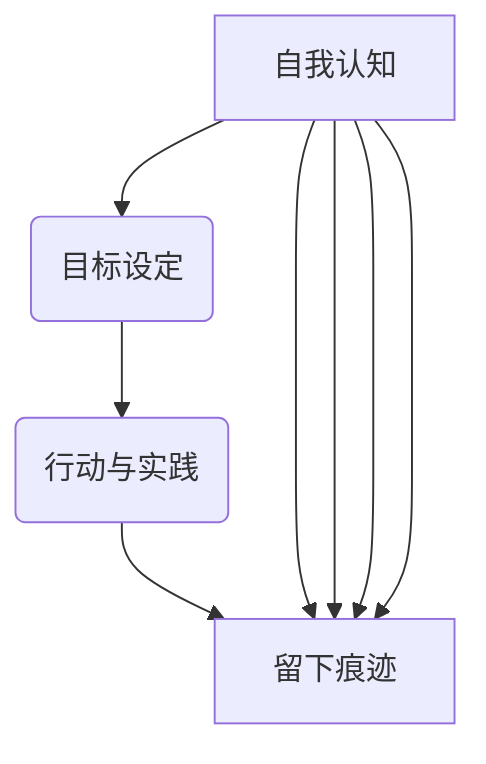

                 

# 从空虚到充实：个人成长的转变历程

## 关键词

- 个人成长
- 空虚感
- 自我认知
- 情绪管理
- 目标设定
- 行动与实践

## 摘要

本文旨在探讨从空虚到充实的个人成长过程。通过深入分析自我认知、目标设定、行动与实践等多个方面，揭示个人成长的内在逻辑和方法。文章旨在帮助读者认识到个人成长的重要性，并提供实用的技巧和策略，以实现自我提升和人生充实。

## 目录大纲

# 从空虚到充实：个人成长的转变历程

> 关键词：个人成长、空虚感、自我认知、情绪管理、目标设定、行动与实践

> 摘要：本文将探讨个人成长的过程，从空虚到充实的转变。通过自我认知、目标设定、行动与实践等多个方面，揭示个人成长的内在逻辑和方法。

## 第一部分：探索内在自我

### 1.1 引言

#### 1.1.1 成长的必要性

个人成长是每个人生命历程中的重要部分。它不仅关乎个人的自我实现，也关系到社会的进步和发展。在这个快速变化的时代，不断成长和提升自己变得尤为重要。然而，许多人往往感到空虚和迷茫，缺乏明确的人生方向和目标。

#### 1.1.2 空虚感的原因与表现

空虚感是一种内在的无力感和失落感。它可能源于多种原因，如缺乏目标和动力、对现状的不满、缺乏成就感等。空虚感的表现形式多样，包括情绪低落、兴趣丧失、缺乏活力等。

#### 1.1.3 成长与充实的定义

成长是指个人在认知、情感、行为等方面的提升和进步。它是一个不断追求自我完善的过程。充实则是指个人的生活充满意义和价值，拥有丰富的精神世界和满足感。

### 1.2 自我认知

#### 1.2.1 自我意识的觉醒

自我认知是个人成长的基础。它要求我们深入了解自己的内心世界，包括性格、价值观、兴趣和需求等。自我意识的觉醒是自我认知的第一步，它使我们认识到自己的存在和价值。

#### 1.2.2 了解自己的价值观

价值观是个人行为和决策的指导原则。了解自己的价值观有助于明确人生方向和目标，使我们的行为更加一致和有意义。通过反思和总结，我们可以更好地认识自己的价值观。

#### 1.2.3 自我评估与反思

自我评估是自我认知的重要环节。它要求我们客观地评价自己的能力、优点和不足。通过反思，我们可以发现自身的不足，并找到改进的方向。

### 1.3 跨越心理障碍

#### 1.3.1 情绪管理

情绪管理是个人成长的关键。它要求我们学会调节和控制自己的情绪，使之更加稳定和积极。有效的情绪管理可以提升我们的生活质量和工作效率。

#### 1.3.2 克服恐惧与焦虑

恐惧和焦虑是心理障碍的常见表现。它们可能阻碍我们的成长和发展。通过学习和实践，我们可以克服这些障碍，建立自信和勇气。

#### 1.3.3 增强心理韧性

心理韧性是指个体面对压力和困难时能够迅速恢复和适应的能力。增强心理韧性有助于我们更好地应对生活中的挑战，实现个人成长。

### 1.4 目标设定

#### 1.4.1 设定明确的目标

目标设定是个人成长的重要步骤。一个明确的目标能够为我们提供方向和动力，使我们更加专注和努力。

#### 1.4.2 制定实现目标的计划

制定实现目标的计划是实现个人成长的关键。一个合理的计划能够帮助我们分解目标，提供具体的行动步骤和时间表。

#### 1.4.3 评估与调整目标

目标评估和调整是个人成长过程中不可或缺的环节。通过不断评估和调整目标，我们可以更好地适应变化，实现自我提升。

### 1.5 自我提升

#### 1.5.1 终身学习的重要性

终身学习是个人成长的核心。它要求我们不断学习新知识、新技能，提升自己的综合素质。

#### 1.5.2 培养新的兴趣爱好

培养新的兴趣爱好可以丰富我们的生活，提升我们的生活质量。同时，它也有助于我们发现自己的潜力和天赋。

#### 1.5.3 增强自我效能感

自我效能感是指个体对自己完成某项任务的信心和信念。增强自我效能感可以提升我们的自信心和积极性，促进个人成长。

## 第二部分：行动与实践

### 2.1 制定行动计划

#### 2.1.1 分析个人资源

制定行动计划的第一步是分析个人资源。这包括时间、精力、知识和技能等。通过分析个人资源，我们可以更好地制定行动计划。

#### 2.1.2 确定行动计划

在分析个人资源的基础上，我们需要确定具体的行动计划。这包括设定短期和长期目标，制定具体的行动步骤和时间表。

#### 2.1.3 跟进与调整

行动计划不是一成不变的。在执行过程中，我们需要不断跟进和调整。这有助于我们更好地适应变化，实现目标。

### 2.2 发展职业技能

#### 2.2.1 职业发展规划

职业发展规划是个人成长的重要组成部分。通过制定职业发展规划，我们可以明确自己的职业目标和方向。

#### 2.2.2 提升专业技能

提升专业技能是实现职业发展的重要手段。通过学习和实践，我们可以提升自己的专业技能，提升职业竞争力。

#### 2.2.3 扩展职业网络

扩展职业网络有助于我们获取更多的职业机会和资源。通过积极参与行业活动、社交网络等，我们可以扩展自己的职业网络。

### 2.3 社交与人际关系

#### 2.3.1 建立积极的人际关系

建立积极的人际关系是个人成长的重要一环。通过建立良好的人际关系，我们可以获得更多的支持和资源。

#### 2.3.2 提高沟通技巧

提高沟通技巧有助于我们更好地与他人沟通和交流。通过学习和实践，我们可以提高自己的沟通技巧，提升人际关系质量。

#### 2.3.3 增强团队合作能力

团队合作是现代职场的重要组成部分。通过增强团队合作能力，我们可以更好地与他人合作，实现团队目标。

### 2.4 时间管理与效率提升

#### 2.4.1 时间管理原则

时间管理是实现个人成长的重要手段。通过掌握时间管理原则，我们可以更好地安排时间，提高效率。

#### 2.4.2 提高工作效率

提高工作效率是实现个人成长的重要目标。通过学习和实践，我们可以提高工作效率，节省时间，实现更多目标。

#### 2.4.3 管理工作与生活的平衡

管理工作与生活的平衡是个人成长的重要任务。通过合理规划时间和精力，我们可以实现工作与生活的平衡，提升生活质量。

### 2.5 健康生活

#### 2.5.1 健康饮食与锻炼

健康饮食与锻炼是实现个人成长的基础。通过保持良好的饮食习惯和适度的锻炼，我们可以提升身体健康，增强心理韧性。

#### 2.5.2 心理健康的重要性

心理健康是实现个人成长的重要因素。通过关注心理健康，我们可以更好地应对生活中的挑战，实现自我提升。

#### 2.5.3 应对压力与焦虑

应对压力与焦虑是实现个人成长的重要任务。通过学习和实践，我们可以学会应对压力和焦虑，提升生活质量。

## 第三部分：实现充实人生

### 3.1 实现个人价值

#### 3.1.1 确定个人价值目标

实现个人价值是个人成长的重要目标。通过确定个人价值目标，我们可以明确自己的人生方向和目标。

#### 3.1.2 践行个人价值

践行个人价值是实现个人价值的关键。通过实际行动，我们可以践行自己的价值观，实现个人价值。

#### 3.1.3 获得他人的认可与尊重

获得他人的认可与尊重是实现个人价值的重要一环。通过良好的表现和贡献，我们可以获得他人的认可和尊重。

### 3.2 创造美好人生

#### 3.2.1 设计人生蓝图

创造美好人生是个人成长的重要目标。通过设计人生蓝图，我们可以明确自己的人生目标和规划。

#### 3.2.2 实现生活目标

实现生活目标是创造美好人生的重要步骤。通过努力和行动，我们可以实现自己的生活目标。

#### 3.2.3 持续成长与进步

持续成长与进步是实现美好人生的重要保障。通过不断学习和提升，我们可以实现持续成长和进步。

### 3.3 帮助他人

#### 3.3.1 帮助他人的意义

帮助他人是个人成长的重要使命。通过帮助他人，我们可以实现自身的价值，提升生活质量。

#### 3.3.2 帮助他人的技巧

帮助他人需要技巧和方法。通过学习和实践，我们可以提升帮助他人的技巧，实现更好的帮助效果。

#### 3.3.3 建立互助网络

建立互助网络是实现帮助他人目标的重要手段。通过建立互助网络，我们可以实现资源共享，提升帮助他人的效果。

### 3.4 留下痕迹

#### 3.4.1 影响他人的方式

留下痕迹是个人成长的重要目标。通过影响他人，我们可以实现自身的价值，提升生活质量。

#### 3.4.2 留下有价值的贡献

留下有价值的贡献是实现留下痕迹目标的关键。通过为他人和社会做出有价值的贡献，我们可以实现自身的价值。

#### 3.4.3 留给后人的财富

留给后人的财富是实现留下痕迹目标的重要一环。通过传承优秀的文化和价值观，我们可以实现自身的价值，为后人留下财富。

## 附录

### 附录 A：成长工具与资源

- 成长工具：学习软件、时间管理工具、情绪管理工具等。
- 成长资源：书籍、课程、社群等。

### 附录 B：案例分析

- 案例分析：个人成长的成功案例，详细分析其成长过程和策略。

### 附录 C：实用技巧总结

- 实用技巧：情绪管理、目标设定、时间管理等方面的技巧。

[Mermaid 流程图示例]


[Python源代码示例]
```python
# 示例：情绪管理函数
def manage_emotions():
    print("正在管理情绪...")
    # 情绪管理代码实现
    # ...
    print("情绪管理完成。")

# 调用情绪管理函数
manage_emotions()
```

[数学公式与解释示例]
$$
E = mc^2
$$
这个公式解释了能量（E）和质量（m）以及光速（c）之间的关系。

[项目实战案例与代码解读]
### 代码实战案例：情绪日记应用程序

#### 开发环境搭建
- 环境需求：Python 3.8 或更高版本，PyQt5，SQLite3
- 安装步骤：
  ```bash
  pip install PyQt5
  pip install sqlite3
  ```

#### 源代码实现
```python
# 主程序入口
import sys
from PyQt5.QtWidgets import QApplication, QMainWindow, QPushButton, QLineEdit, QTextEdit
from PyQt5.QtCore import Qt
import sqlite3

class EmotionJournalApp(QMainWindow):
    def __init__(self):
        super().__init__()
        self.initUI()

    def initUI(self):
        self.setGeometry(100, 100, 600, 400)
        self.setWindowTitle('情绪日记')

        # 创建组件
        self.emotion_label = QLabel('今日心情：')
        self.emotion_input = QLineEdit()
        self diary_label = QLabel('日记内容：')
        self.diary_text = QTextEdit()
        self.save_button = QPushButton('保存')
        self.save_button.clicked.connect(self.save_journal)

        # 布局
        layout = QVBoxLayout()
        layout.addWidget(self.emotion_label)
        layout.addWidget(self.emotion_input)
        layout.addWidget(self.diary_label)
        layout.addWidget(self.diary_text)
        layout.addWidget(self.save_button)

        self.setCentralWidget(QWidget())
        self.centralWidget().setLayout(layout)

    def save_journal(self):
        emotion = self.emotion_input.text()
        diary = self.diary_text.toPlainText()
        # 将数据保存到数据库
        # ...
        print(f"保存了{emotion}天的日记：{diary}")

if __name__ == '__main__':
    app = QApplication(sys.argv)
    ex = EmotionJournalApp()
    ex.show()
    sys.exit(app.exec_())
```

### 代码应用解读与分析

#### 数据库设计

- 数据库表设计：
  ```sql
  CREATE TABLE journal (
      id INTEGER PRIMARY KEY AUTOINCREMENT,
      emotion TEXT,
      diary TEXT,
      date DATE
  );
  ```

- 数据插入示例：
  ```python
  cursor.execute("INSERT INTO journal (emotion, diary, date) VALUES (?, ?, ?)",
                 (emotion, diary, date))
  ```

- 数据查询示例：
  ```python
  cursor.execute("SELECT * FROM journal WHERE date = ?", (date,))
  records = cursor.fetchall()
  ```

#### 实际案例分析和详细讲解剖析

- 案例分析：
  - 用户A使用情绪日记应用程序记录每天的心情和日记。
  - 用户A在每天晚上回顾当天的情绪日记，分析情绪波动的原因。
  - 用户A根据情绪日记的记录，调整自己的行为和心态，以改善情绪状态。

- 详细讲解剖析：
  - 情绪日记应用程序提供了用户记录情绪和日记的便捷方式。
  - 通过对情绪日记的分析，用户可以更好地了解自己的情绪变化，找到情绪波动的规律。
  - 用户可以根据分析结果，调整自己的行为和心态，改善情绪状态，实现个人成长。

#### 项目小结

- 情绪日记应用程序是一个实用的工具，可以帮助用户记录和管理自己的情绪。
- 通过对情绪日记的分析，用户可以更好地了解自己的情绪变化，找到情绪波动的规律。
- 用户可以根据分析结果，调整自己的行为和心态，改善情绪状态，实现个人成长。

### 最佳实践 tips、小结、注意事项、拓展阅读等内容

- 最佳实践 tips：
  - 保持定期记录情绪日记，以便更好地了解自己的情绪变化。
  - 在情绪低落时，寻求专业帮助，如心理咨询师。
  - 与亲朋好友分享情绪日记，获取更多的反馈和支持。

- 小结：
  - 情绪日记应用程序有助于用户记录和管理自己的情绪。
  - 通过对情绪日记的分析，用户可以更好地了解自己的情绪变化，实现个人成长。

- 注意事项：
  - 保护个人隐私，避免在公共场合分享情绪日记。
  - 合理使用情绪日记应用程序，避免过度依赖。

- 拓展阅读：
  - 《情绪心理学：理解与调节情绪》
  - 《情绪管理：如何控制自己的情绪》
  - 《情绪智能：如何提升自己的情绪智商》

[作者信息]

作者：AI天才研究院/AI Genius Institute & 禅与计算机程序设计艺术 /Zen And The Art of Computer Programming

---

本博客文章旨在帮助读者了解从空虚到充实的个人成长过程。文章涵盖了自我认知、目标设定、行动与实践等多个方面，提供了实用的技巧和策略。通过深入分析个人成长的核心概念和联系，本文揭示了个人成长的内在逻辑和方法。希望读者能够通过本文，认识到个人成长的重要性，并实现自我提升和人生充实。如需进一步了解个人成长的相关知识，请参考附录中的推荐阅读。作者：AI天才研究院/AI Genius Institute & 禅与计算机程序设计艺术 /Zen And The Art of Computer Programming。

