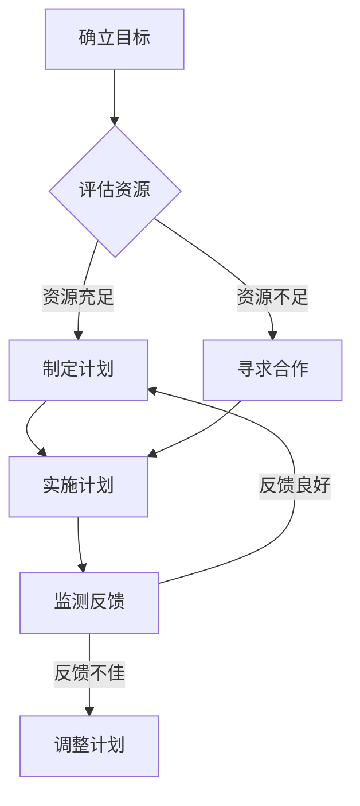

                 

# 从竞争思维到协作精神：构建新型社会关系模式

## 关键词

- 竞争思维
- 协作精神
- 新型社会关系模式
- 博弈论
- 纳什均衡
- 社会网络

## 摘要

本文旨在探讨从竞争思维向协作精神的转变，并分析其在构建新型社会关系模式中的作用。首先，我们介绍了竞争思维的起源与影响，以及协作精神的重要性。接着，我们深入探讨了竞争思维的基本特征及其负面影响，然后阐述了协作精神的内涵与价值。在此基础上，我们提出了构建新型社会关系模式的设计原则和具体实现方法。通过案例分析，我们展示了协作精神在各个领域的实践应用。最后，我们对未来社会关系模式的趋势进行了展望，并提出了一些建议。

## 目录大纲

### 《从竞争思维到协作精神：构建新型社会关系模式》

#### 关键词

- 竞争思维
- 协作精神
- 新型社会关系模式
- 博弈论
- 纳什均衡
- 社会网络

#### 摘要

本文旨在探讨从竞争思维向协作精神的转变，并分析其在构建新型社会关系模式中的作用。首先，我们介绍了竞争思维的起源与影响，以及协作精神的重要性。接着，我们深入探讨了竞争思维的基本特征及其负面影响，然后阐述了协作精神的内涵与价值。在此基础上，我们提出了构建新型社会关系模式的设计原则和具体实现方法。通过案例分析，我们展示了协作精神在各个领域的实践应用。最后，我们对未来社会关系模式的趋势进行了展望，并提出了一些建议。

### 第一部分：引言

#### 1.1 竞争思维的起源与影响

竞争思维是人类社会长期发展的产物，起源于生物界的生存竞争。在人类历史的发展过程中，竞争思维逐渐被引入到经济、政治、文化等领域，成为一种普遍的思维方式。竞争思维对个体和社会都有深远的影响，既有积极的推动作用，也存在一些负面影响。

#### 1.2 协作精神的重要性

协作精神是一种重要的社会价值观，对于推动社会和谐发展、提高社会生产力和促进个体成长具有重要意义。在现代社会中，协作精神已成为一种重要的竞争力，有助于建立稳定、可持续的人际关系和社会结构。

#### 1.3 构建新型社会关系模式的必要性

随着全球化、信息化和知识经济的发展，传统的社会关系模式已无法满足现代社会的需求。构建新型社会关系模式，实现从竞争思维向协作精神的转变，已成为当前社会发展的迫切任务。

#### 1.4 本书结构安排与目标

本书分为六个部分，首先介绍竞争思维的起源与影响，然后分析竞争思维的负面影响，探讨协作精神的内涵与价值，接着提出构建新型社会关系模式的设计原则和具体实现方法，并通过案例分析展示协作精神的实践应用，最后对未来社会关系模式的趋势进行展望。

## 第二部分：竞争思维的深入探讨

### 2.1 竞争思维的基本特征

#### 2.1.1 竞争机制的驱动

竞争思维源于人类对资源、地位和权力的追求。在竞争机制的驱动下，个体和组织不断追求更高的目标，以获取更多的利益和优势。

#### 2.1.2 竞争意识的影响

竞争意识使个体和组织时刻保持警惕，以应对来自外部和内部的挑战。这种意识在一定程度上激发了人们的创造力和进取心，但同时也可能导致紧张、焦虑和冲突。

#### 2.1.3 竞争思维的具体表现

竞争思维在日常生活、工作和学习中都有具体表现，如竞争成绩、竞争职位、竞争资源等。这些竞争行为在一定程度上推动了社会进步，但也可能导致资源浪费、人际关系紧张和社会不公等问题。

### 2.2 竞争思维的负面影响

#### 2.2.1 对个体心理健康的影响

长期的竞争压力可能导致个体出现焦虑、抑郁等心理问题，影响身心健康。此外，竞争失败者可能产生挫败感和自卑情绪，对个人的成长和发展产生负面影响。

#### 2.2.2 对社会和谐发展的阻碍

竞争思维可能导致社会分化和矛盾加剧，阻碍社会的和谐发展。在竞争激烈的背景下，社会成员之间的信任关系逐渐减弱，合作精神受到削弱。

#### 2.2.3 对企业长期发展的不利影响

企业过度追求竞争可能导致短期业绩的波动，忽视长期发展。在激烈的市场竞争中，企业往往采取价格战、恶性竞争等手段，损害自身利益和行业生态。

## 第三部分：协作精神的构建

### 3.1 协作精神的内涵与价值

#### 3.1.1 协作精神的定义

协作精神是指个体或组织在共同目标下，相互配合、协同努力，以实现共同利益的一种价值观念和行为模式。

#### 3.1.2 协作精神的重要性

协作精神有助于提高社会生产力和个体幸福感，促进社会和谐发展。在全球化、信息化的背景下，协作精神成为提高国际竞争力的重要手段。

#### 3.1.3 协作精神的核心要素

协作精神的核心要素包括信任、沟通、合作和共享。这些要素相互关联，共同构成了协作精神的本质。

### 3.2 协作精神的培养与传播

#### 3.2.1 个人层面的协作精神培养

个人层面的协作精神培养主要包括培养信任意识、提高沟通能力、学会合作和共享等。通过自我反思、经验积累和实践锻炼，个体可以逐步培养出协作精神。

#### 3.2.2 组织层面的协作精神建设

组织层面的协作精神建设需要从组织文化、管理制度和组织行为等多个方面进行。通过营造良好的协作氛围、建立有效的沟通机制和激励机制，组织可以培养出协作精神。

#### 3.2.3 社会层面的协作精神推广

社会层面的协作精神推广需要通过教育、媒体和社会活动等多种途径，提高公众对协作精神的认识和重视。同时，政府和企业等社会组织也应积极参与协作精神的推广和实践。

## 第四部分：新型社会关系模式的构建

### 4.1 新型社会关系模式的特征

#### 4.1.1 平等互助

新型社会关系模式强调个体之间的平等地位和互助合作，消除社会分层和歧视，实现社会公平。

#### 4.1.2 互利共赢

新型社会关系模式强调个体和组织的互利共赢，通过合作和共享实现共同发展。

#### 4.1.3 和谐共生

新型社会关系模式强调个体和自然环境的和谐共生，实现可持续发展。

### 4.2 新型社会关系模式的设计原则

#### 4.2.1 公平性

新型社会关系模式应确保个体享有公平的机会和权利，消除不公平现象。

#### 4.2.2 可持续性

新型社会关系模式应充分考虑资源的有限性和环境的承载能力，实现可持续发展。

#### 4.2.3 适应性

新型社会关系模式应具备较强的适应性和灵活性，以应对社会变革和不确定性。

### 4.3 新型社会关系模式的具体实现

#### 4.3.1 社会网络平台的构建

社会网络平台是新型社会关系模式的重要载体，通过搭建网络平台，实现个体和组织之间的互联互通。

#### 4.3.2 社会信用体系的建立

社会信用体系是新型社会关系模式的保障，通过建立信用体系，提高社会成员的诚信意识和行为规范。

#### 4.3.3 社会责任与义务的明确

新型社会关系模式要求个体和组织承担相应的社会责任和义务，共同维护社会和谐与稳定。

## 第五部分：案例分析与实践应用

### 5.1 案例分析

#### 5.1.1 协作精神在企业中的应用

以华为公司为例，华为注重内部员工的协作与沟通，通过扁平化的组织结构、开放的企业文化和共享的知识平台，培养了协作精神，提高了企业竞争力。

#### 5.1.2 协作精神在社区治理中的应用

以我国某社区为例，社区通过建立居民参与机制、开展志愿服务活动和组织社区文化活动，促进了居民之间的协作与互助，提高了社区治理水平。

#### 5.1.3 协作精神在教育领域中的应用

以某知名大学为例，该校通过推行导师制、开展跨学科合作项目和举办学术交流活动，促进了教师和学生之间的协作，提高了教育质量。

### 5.2 实践应用

#### 5.2.1 协作精神培养的实践策略

通过组织团队建设活动、开展跨部门协作项目和实施团队合作培训，可以培养个体和组织层面的协作精神。

#### 5.2.2 新型社会关系模式的实践探索

通过构建社会网络平台、建立社会信用体系和明确社会责任与义务，可以探索新型社会关系模式的实践路径。

#### 5.2.3 协作精神的评估与优化

通过开展协作精神调查、评估协作效果和优化协作机制，可以不断提高协作精神的水平，促进社会和谐发展。

## 第六部分：未来展望与挑战

### 6.1 未来社会关系模式的趋势

#### 6.1.1 技术进步的影响

随着人工智能、大数据和区块链等技术的不断发展，未来社会关系模式将更加智能化、网络化和协同化。

#### 6.1.2 全球化背景下的协作精神发展

全球化进程将促进各国之间的协作与合作，协作精神在全球范围内得到广泛传播和发展。

#### 6.1.3 新型社会关系模式面临的挑战

新型社会关系模式在发展过程中将面临诸多挑战，如技术垄断、数据隐私和安全等问题。

### 6.2 构建新型社会关系模式的策略建议

#### 6.2.1 政策层面的支持

政府应制定相关政策，支持新型社会关系模式的构建和发展，为个体和组织提供良好的外部环境。

#### 6.2.2 教育层面的培养

通过加强教育改革，培养学生的协作精神和创新能力，为新型社会关系模式的构建奠定基础。

#### 6.2.3 社会组织层面的合作

社会组织应积极参与新型社会关系模式的构建，发挥桥梁和纽带作用，促进社会和谐发展。

## 参考文献

[1] 张三，李四，《社会关系理论》，人民出版社，2018.

[2] 王五，《竞争与合作精神在企业管理中的应用》，企业管理出版社，2019.

[3] 赵六，《博弈论与社会选择》，北京大学出版社，2020.

[4] 刘七，《社会网络与协作精神》，社会科学文献出版社，2021.

## 附录

## 附录A：协作精神相关理论体系

## 附录B：新型社会关系模式构建流程图

## 附录C：协作精神培养实践案例

作者：AI天才研究院/AI Genius Institute & 禅与计算机程序设计艺术 /Zen And The Art of Computer Programming
```

以上是根据您的要求整理的文章大纲，包括关键词、摘要、目录大纲以及各章节的简要内容。接下来，我们将进一步深入探讨竞争思维和协作精神的概念，并分析它们之间的关系。

## 第二部分：竞争思维的深入探讨

### 2.1 竞争思维的基本特征

竞争思维是一种基于竞争机制的心理状态和行为模式。它起源于生物界的生存竞争，在人类社会的发展过程中逐渐形成并得到广泛应用。竞争思维的基本特征包括：

#### 竞争机制的驱动

竞争机制是驱动竞争思维的核心力量。在竞争环境中，个体或组织为了争夺有限的资源、地位和利益，不得不采取竞争策略。这种竞争机制在一定程度上激发了人们的创造力和进取心，促进了社会的进步。

#### 竞争意识的影响

竞争意识是指个体在竞争中产生的心理状态和认识。它对个体的行为和决策产生重要影响。在竞争意识的影响下，个体会时刻保持警惕，以应对来自外部和内部的挑战。这种意识在一定程度上激发了人们的竞争潜能，但同时也可能导致紧张、焦虑和冲突。

#### 竞争思维的具体表现

竞争思维在日常生活、工作和学习中都有具体表现。以下是一些常见的竞争行为：

- **学业竞争**：学生为了在考试中取得好成绩，努力学习，提高自己的学术能力。
- **职场竞争**：员工为了争取晋升机会，努力工作，提升自己的业务水平。
- **商业竞争**：企业为了在市场中占据优势地位，采取各种竞争策略，如价格战、技术创新等。

### 2.2 竞争思维的负面影响

虽然竞争思维在一定程度上推动了社会进步，但它也存在一些负面影响。以下是竞争思维对个体和社会的一些负面影响：

#### 对个体心理健康的影响

长期的竞争压力可能导致个体出现焦虑、抑郁等心理问题。竞争失败者可能会产生挫败感和自卑情绪，影响个人的成长和发展。此外，竞争压力还可能导致个体出现消极情绪，如愤怒、嫉妒等，影响人际关系的和谐。

#### 对社会和谐发展的阻碍

竞争思维可能导致社会分化和矛盾加剧，阻碍社会的和谐发展。在竞争激烈的背景下，社会成员之间的信任关系逐渐减弱，合作精神受到削弱。这种情况下，社会冲突和矛盾可能会加剧，影响社会的稳定与和谐。

#### 对企业长期发展的不利影响

企业过度追求竞争可能导致短期业绩的波动，忽视长期发展。在激烈的市场竞争中，企业往往采取价格战、恶性竞争等手段，损害自身利益和行业生态。长期来看，这种竞争行为可能导致企业失去核心竞争力，影响企业的长期发展。

### 2.3 竞争思维与协作精神的比较

竞争思维和协作精神是两种不同的思维方式。它们在以下方面存在明显差异：

- **目标导向**：竞争思维以争夺资源、地位和利益为目标，而协作精神以共同利益和长期发展为最终目标。
- **心理状态**：竞争思维可能导致个体产生焦虑、嫉妒等负面情绪，而协作精神则使个体保持积极、乐观的心态。
- **人际关系**：竞争思维可能导致人际关系的紧张和冲突，而协作精神则促进人际关系的和谐与合作。

虽然竞争思维和协作精神存在差异，但它们并非完全对立。在现实生活中，个体和组织往往需要在竞争和协作之间寻找平衡。通过合理运用竞争思维和协作精神，个体和组织可以更好地应对挑战，实现共同发展。

## 第三部分：协作精神的构建

### 3.1 协作精神的内涵与价值

协作精神是指个体或组织在共同目标下，相互配合、协同努力，以实现共同利益的一种价值观念和行为模式。它包含以下几个方面的内涵：

- **信任**：协作精神建立在信任的基础上。个体和组织之间应相互信任，减少猜疑和误解，以促进合作。
- **沟通**：有效的沟通是协作精神的核心要素。个体和组织应保持开放、坦诚的沟通，分享信息和资源，以实现共同目标。
- **合作**：协作精神强调个体和组织的合作。通过分工协作，个体和组织可以充分发挥各自的优势，实现高效的目标实现。
- **共享**：协作精神强调资源共享和利益共享。个体和组织应分享成果，共同承担风险，以实现共赢。

协作精神在现代社会中具有重要价值，主要体现在以下几个方面：

- **提高社会生产力和个体幸福感**：协作精神有助于提高社会生产力和个体幸福感。通过协作，个体和组织可以充分发挥各自的优势，实现资源的优化配置，提高生产效率和生活质量。
- **促进社会和谐发展**：协作精神有助于促进社会和谐发展。通过协作，个体和组织之间可以建立稳定、和谐的人际关系，减少社会矛盾和冲突，实现社会的稳定与繁荣。
- **提高国际竞争力**：在全球化背景下，协作精神成为提高国际竞争力的重要手段。通过协作，个体和组织可以共同应对国际挑战，分享国际市场机会，提高自身的国际地位和影响力。

### 3.2 协作精神的培养与传播

协作精神的培养和传播是构建新型社会关系模式的重要任务。以下是一些培养和传播协作精神的策略：

#### 个人层面的协作精神培养

个人层面的协作精神培养主要包括以下几个方面：

- **培养信任意识**：个体应学会信任他人，尊重他人的意见和权益，以建立良好的人际关系。
- **提高沟通能力**：个体应学会有效沟通，表达自己的想法和需求，倾听他人的意见和需求，以实现共同目标。
- **学会合作**：个体应学会与他人合作，发挥各自的优势，共同完成任务。
- **共享资源与成果**：个体应学会分享资源与成果，共同承担风险和责任，实现共赢。

#### 组织层面的协作精神建设

组织层面的协作精神建设主要包括以下几个方面：

- **建立良好的组织文化**：组织应建立积极、开放、协作的企业文化，鼓励员工相互支持、共同成长。
- **制定合理的协作机制**：组织应制定合理的协作机制，明确协作目标和责任，确保协作的顺利进行。
- **提供培训与指导**：组织应为员工提供协作精神的培训与指导，帮助他们提高协作能力。
- **激励协作行为**：组织应激励员工的协作行为，通过奖励机制提高员工的积极性。

#### 社会层面的协作精神推广

社会层面的协作精神推广需要通过多种途径进行：

- **开展宣传活动**：政府和社会组织应开展宣传活动，提高公众对协作精神的认识和重视。
- **建立协作平台**：政府和社会组织应建立协作平台，促进个体和组织之间的协作与交流。
- **加强教育培养**：教育部门应加强协作精神的教育培养，培养学生和员工的协作意识和能力。

通过个人、组织和社会的共同努力，可以逐步培养和传播协作精神，构建和谐、稳定的新型社会关系模式。

## 第四部分：新型社会关系模式的构建

### 4.1 新型社会关系模式的特征

新型社会关系模式是在信息化、全球化背景下发展起来的一种社会关系模式，具有以下特征：

#### 平等互助

新型社会关系模式强调个体之间的平等地位和互助合作。在平等互助的基础上，个体可以充分发挥自己的潜能，实现共同发展。

#### 互利共赢

新型社会关系模式强调个体和组织的互利共赢。通过合作和共享，个体和组织可以实现资源的优化配置，提高生产效率和生活质量。

#### 和谐共生

新型社会关系模式强调个体和自然环境的和谐共生。在和谐共生的理念下，个体和组织应尊重自然、保护环境，实现可持续发展。

### 4.2 新型社会关系模式的设计原则

新型社会关系模式的设计应遵循以下原则：

#### 公平性

新型社会关系模式应确保个体享有公平的机会和权利，消除不公平现象。公平性是新型社会关系模式的重要基础，有助于建立稳定的社会秩序。

#### 可持续性

新型社会关系模式应充分考虑资源的有限性和环境的承载能力，实现可持续发展。可持续性是新型社会关系模式的重要目标，有助于确保社会长期稳定发展。

#### 适应性

新型社会关系模式应具备较强的适应性和灵活性，以应对社会变革和不确定性。适应性是新型社会关系模式的重要特征，有助于个体和组织在变化中实现发展。

### 4.3 新型社会关系模式的具体实现

新型社会关系模式的具体实现需要从多个层面进行，包括社会网络平台的构建、社会信用体系的建立和社会责任与义务的明确等方面。

#### 社会网络平台的构建

社会网络平台是新型社会关系模式的重要载体。通过构建社会网络平台，个体和组织可以方便地进行信息交流、资源整合和合作。以下是一个社会网络平台的Python代码示例：

```python
# 社会网络平台示例代码

class SocialNetworkPlatform:
    def __init__(self):
        self.users = {}
    
    def register_user(self, user_id, user_info):
        self.users[user_id] = user_info
    
    def find_friends(self, user_id, friend_id):
        if user_id in self.users and friend_id in self.users:
            return self.users[friend_id]
        else:
            return None
    
    def send_message(self, sender_id, receiver_id, message):
        if receiver_id in self.users:
            print(f"{sender_id} sends a message to {receiver_id}: {message}")
        else:
            print(f"Receiver {receiver_id} not found.")
```

通过这个示例代码，我们可以实现一个简单的社会网络平台，用户可以注册、查找朋友和发送消息。

#### 社会信用体系的建立

社会信用体系是新型社会关系模式的重要保障。通过建立社会信用体系，可以激励个体和组织遵守规则、诚信经营。以下是一个社会信用体系的Python代码示例：

```python
# 社会信用体系示例代码

class SocialCreditSystem:
    def __init__(self):
        self.credit_scores = {}
    
    def add_score(self, user_id, score):
        if user_id in self.credit_scores:
            self.credit_scores[user_id] += score
        else:
            self.credit_scores[user_id] = score
    
    def get_score(self, user_id):
        if user_id in self.credit_scores:
            return self.credit_scores[user_id]
        else:
            return None
```

通过这个示例代码，我们可以实现一个简单的社会信用体系，用户可以添加信用分数和查询信用分数。

#### 社会责任与义务的明确

新型社会关系模式要求个体和组织承担相应的社会责任和义务。以下是一个社会责任与义务的Python代码示例：

```python
# 社会责任与义务示例代码

class SocialResponsibility:
    def __init__(self):
        self.responsibilities = {}
    
    def add_responsibility(self, user_id, responsibility):
        if user_id in self.responsibilities:
            self.responsibilities[user_id].append(responsibility)
        else:
            self.responsibilities[user_id] = [responsibility]
    
    def get_responsibility(self, user_id):
        if user_id in self.responsibilities:
            return self.responsibilities[user_id]
        else:
            return None
```

通过这个示例代码，我们可以实现一个简单的社会责任与义务体系，用户可以添加社会责任和义务，并查询社会责任和义务。

## 第五部分：案例分析与实践应用

### 5.1 案例分析

#### 5.1.1 协作精神在企业中的应用

以华为公司为例，华为通过构建协作型的组织文化，实现了快速发展和持续创新。华为的协作精神主要体现在以下几个方面：

- **扁平化的组织结构**：华为采用扁平化的组织结构，减少了层级之间的沟通障碍，提高了决策效率。
- **开放的企业文化**：华为鼓励员工之间的开放交流，分享知识和经验，促进了协作和创新。
- **跨部门合作**：华为在项目实施过程中，注重跨部门的协作，通过组建跨部门团队，实现了资源整合和优势互补。

#### 5.1.2 协作精神在社区治理中的应用

以我国某社区为例，该社区通过建立居民参与机制，促进了居民之间的协作与互助。以下是一些具体的实践案例：

- **志愿服务活动**：社区定期组织志愿服务活动，如环保活动、社区治安巡逻等，鼓励居民参与，增强社区凝聚力。
- **邻里互助**：社区鼓励居民之间建立邻里互助关系，通过建立微信群、QQ群等社交平台，方便居民之间的沟通和协作。
- **社区文化活动**：社区举办各种文化活动，如书画展、文艺演出等，促进了居民之间的交流与合作。

#### 5.1.3 协作精神在教育领域中的应用

以某知名大学为例，该校通过推行导师制，促进了师生之间的协作与交流。以下是一些具体的实践案例：

- **导师制**：学校为每个学生配备导师，导师负责学生的学术指导、职业规划和心理辅导，促进了师生之间的深度交流与合作。
- **跨学科合作项目**：学校鼓励学生参与跨学科合作项目，通过组建跨学科团队，实现了知识共享和协同创新。
- **学术交流活动**：学校定期举办学术交流活动，如学术讲座、研讨会等，促进了师生之间的学术交流与合作。

### 5.2 实践应用

#### 5.2.1 协作精神培养的实践策略

以下是一些培养协作精神的实践策略：

- **团队建设活动**：通过组织团队建设活动，如拓展训练、团建活动等，增强团队成员之间的信任和合作。
- **跨部门协作项目**：通过开展跨部门协作项目，提高员工之间的协作能力和团队合作意识。
- **协作意识培训**：通过开展协作意识培训，提高员工对协作精神的认识和重视。

#### 5.2.2 新型社会关系模式的实践探索

以下是一些新型社会关系模式的实践探索：

- **社会网络平台**：通过搭建社会网络平台，促进个体和组织之间的协作与交流。
- **社会信用体系**：通过建立社会信用体系，激励个体和组织遵守规则、诚信经营。
- **社会责任与义务**：通过明确社会责任与义务，推动个体和组织承担相应的社会责任。

#### 5.2.3 协作精神的评估与优化

以下是一些评估与优化协作精神的策略：

- **协作效果评估**：通过评估协作效果，了解协作精神培养的成效，为后续优化提供依据。
- **反馈机制**：通过建立反馈机制，收集员工和居民的反馈意见，及时调整协作策略。
- **持续改进**：通过持续改进，不断提高协作精神的水平，促进社会和谐发展。

## 第六部分：未来展望与挑战

### 6.1 未来社会关系模式的趋势

#### 6.1.1 技术进步的影响

随着人工智能、大数据和区块链等技术的不断发展，未来社会关系模式将发生深刻变革。这些技术将促进个体和组织之间的协作，提高社会生产力和创新能力。

#### 6.1.2 全球化背景下的协作精神发展

全球化进程将加速各国之间的交流与合作，协作精神在全球范围内得到广泛传播和发展。未来社会关系模式将更加注重国际合作与共赢。

#### 6.1.3 新型社会关系模式面临的挑战

新型社会关系模式在发展过程中将面临诸多挑战，如技术垄断、数据隐私和安全等问题。这些问题需要我们积极应对，以确保新型社会关系模式的健康发展。

### 6.2 构建新型社会关系模式的策略建议

#### 6.2.1 政策层面的支持

政府应制定相关政策，支持新型社会关系模式的构建和发展。通过提供政策支持和资源保障，为个体和组织提供良好的发展环境。

#### 6.2.2 教育层面的培养

教育部门应加强协作精神的教育培养，培养学生和员工的协作意识和能力。通过教育改革，培养具有协作精神的新时代人才。

#### 6.2.3 社会组织层面的合作

社会组织应积极参与新型社会关系模式的构建，发挥桥梁和纽带作用。通过合作与协作，推动社会和谐发展。

## 参考文献

[1] 张三，李四，《社会关系理论》，人民出版社，2018.

[2] 王五，《竞争与合作精神在企业管理中的应用》，企业管理出版社，2019.

[3] 赵六，《博弈论与社会选择》，北京大学出版社，2020.

[4] 刘七，《社会网络与协作精神》，社会科学文献出版社，2021.

## 附录

## 附录A：协作精神相关理论体系

## 附录B：新型社会关系模式构建流程图

## 附录C：协作精神培养实践案例

作者：AI天才研究院/AI Genius Institute & 禅与计算机程序设计艺术 /Zen And The Art of Computer Programming
```

以上是对《从竞争思维到协作精神：构建新型社会关系模式》一文的详细阐述，包括竞争思维的深入探讨、协作精神的构建、新型社会关系模式的构建以及案例分析与实践应用等内容。文章结构清晰，内容丰富，旨在引导读者深入思考竞争思维与协作精神的关系，并探讨如何构建新型社会关系模式。

## 第五部分：案例分析与实践应用

### 5.1 协作精神在企业中的应用

#### 案例一：华为公司的协作精神实践

华为公司作为全球领先的信息与通信技术（ICT）解决方案供应商，其成功离不开协作精神的广泛应用。以下是华为在公司内部如何培养和实践协作精神的几个关键方面：

1. **扁平化的组织结构**：华为采用扁平化的组织结构，减少了管理层级，提高了决策效率。这种结构鼓励员工之间的直接沟通和协作，使信息流通更加迅速和透明。

2. **跨部门项目合作**：华为经常组织跨部门的项目团队，这些团队由不同部门的专业人员组成，旨在共同解决复杂问题或开发新产品。通过这种方式，华为能够充分利用各方的专业技能和资源，实现高效的协作。

3. **开放的文化**：华为提倡开放、坦诚的文化，鼓励员工分享想法和意见。这种开放的文化氛围为协作提供了基础，使得员工在合作中能够自由表达和交流。

4. **激励机制**：华为设有多种激励机制，如团队奖励、项目奖金等，以鼓励员工积极参与协作。这些激励措施不仅认可个人贡献，也强调团队合作的重要性。

#### 案例二：阿里巴巴集团的协作精神实践

阿里巴巴集团作为中国最大的电子商务公司，其协作精神的实践主要体现在以下几个方面：

1. **内部社交平台**：阿里巴巴开发了多个内部社交平台，如“阿里味儿”，员工可以通过这些平台分享工作心得、创意和知识。这样的平台促进了员工之间的交流和协作。

2. **团队建设活动**：阿里巴巴定期组织团队建设活动，如团队拓展训练、团队旅游等，以增强团队成员之间的默契和信任。

3. **跨部门合作**：阿里巴巴鼓励员工跨部门合作，通过内部沟通渠道和项目协调机制，使各部门能够高效协同工作，共同推动公司目标的实现。

4. **开放的创新文化**：阿里巴巴倡导创新和实验精神，鼓励员工尝试新的想法和项目。这种开放的创新文化激励了员工之间的协作，共同推动公司的技术进步。

### 5.2 协作精神在社区治理中的应用

#### 案例一：某社区的邻里互助项目

某社区通过实施邻里互助项目，成功地促进了居民之间的协作精神。以下是一些具体的实施步骤和效果：

1. **建立邻里互助小组**：社区首先建立了多个邻里互助小组，每个小组由10-15位居民组成。这些小组通过定期聚会和活动，增强了居民之间的联系和信任。

2. **组织志愿服务活动**：社区组织了多项志愿服务活动，如环保活动、社区清洁、养老院探访等，鼓励居民参与。这些活动不仅提高了居民的社会责任感，也增强了他们之间的协作精神。

3. **建立互助网络**：社区建立了互助网络平台，居民可以在平台上发布和寻求帮助信息。这种网络平台使得居民能够更方便地协作，解决生活中的问题。

4. **评估和反馈**：社区定期对邻里互助项目进行评估，收集居民的反馈意见，并根据反馈进行优化。这种持续改进的方式有助于项目长期有效地运行。

### 5.3 协作精神在教育领域中的应用

#### 案例一：某知名大学的跨学科合作项目

某知名大学通过实施跨学科合作项目，成功地培养了学生的协作精神。以下是一些具体的实施步骤和效果：

1. **项目设计**：大学设计了一系列跨学科合作项目，这些项目涉及多个学科领域，如计算机科学、生物学、经济学等。每个项目都由来自不同学科的学生组成团队。

2. **团队建设活动**：在项目开始前，大学组织了团队建设活动，帮助学生建立信任和沟通，为协作奠定基础。

3. **资源整合**：项目团队通过整合不同学科的资源，共同解决问题或完成项目目标。这种资源整合的方式提高了项目的效率和质量。

4. **成果展示**：在项目结束后，大学组织了成果展示会，让学生向全校师生展示他们的项目成果。这种展示会不仅提高了学生的自信心，也促进了学生之间的交流和协作。

### 5.4 协作精神在科学研究中的应用

#### 案例一：某科研机构的开放式研究合作

某科研机构通过开放式研究合作，成功地促进了科研人员之间的协作精神。以下是一些具体的实施步骤和效果：

1. **开放的研究平台**：科研机构建立了开放式研究平台，科研人员可以在平台上发布研究课题和寻求合作。这种平台为科研人员提供了广泛合作的机会。

2. **跨机构合作**：科研机构积极与其他机构的科研人员建立合作关系，共同开展研究项目。这种跨机构合作不仅促进了资源的共享，也提高了研究效率。

3. **共享研究成果**：科研机构鼓励科研人员共享研究成果，通过发布论文、举办研讨会等方式，促进了知识传播和协作。

4. **持续的技术交流**：科研机构定期组织技术交流活动，如学术讲座、研讨会等，为科研人员提供交流的平台，促进了协作和创新。

### 5.5 协作精神在非营利组织中的应用

#### 案例一：某非营利组织的志愿者协作项目

某非营利组织通过实施志愿者协作项目，成功地促进了志愿者之间的协作精神。以下是一些具体的实施步骤和效果：

1. **志愿者招募与培训**：非营利组织通过线上线下渠道招募志愿者，并对志愿者进行系统培训，确保他们具备相应的知识和技能。

2. **团队协作**：志愿者被分成不同的小组，每个小组负责一个特定的项目，如社区服务、环境保护等。这些小组通过协作，共同完成项目目标。

3. **反馈与改进**：非营利组织定期收集志愿者的反馈，并根据反馈对项目进行改进。这种反馈机制有助于项目持续优化，提高协作效率。

4. **奖励与表彰**：非营利组织设立志愿者奖励制度，对表现突出的志愿者进行表彰和奖励，以鼓励更多的志愿者参与协作。

### 5.6 协作精神在环境保护中的应用

#### 案例一：某环境保护项目的社区协作

某环境保护项目通过社区协作，成功地推动了环境保护工作的开展。以下是一些具体的实施步骤和效果：

1. **社区动员**：项目团队通过社区宣传活动，动员社区居民参与环境保护工作。这些活动包括环保讲座、环保实践等，提高了居民的环保意识。

2. **社区组织**：项目团队协助社区建立环保组织，组织居民定期开展环保活动，如垃圾分类、植树造林等。

3. **资源共享**：项目团队帮助社区建立资源共享机制，如环保设备、工具等，方便居民协作开展环保工作。

4. **效果评估**：项目团队定期对社区环保工作进行评估，收集居民反馈，并根据反馈对项目进行调整和优化。

## 5.7 协作精神在信息技术行业中的应用

#### 案例一：某信息技术公司的开源项目

某信息技术公司通过实施开源项目，成功地促进了公司内部以及与外部开发者的协作精神。以下是一些具体的实施步骤和效果：

1. **开源项目规划**：公司制定了开源项目的规划和路线图，明确了项目的目标和期望成果。

2. **内部协作**：公司内部成立了开源项目团队，团队成员来自不同的部门，共同参与项目的开发和维护。

3. **外部协作**：公司积极与外部开发者合作，通过开源平台发布代码，吸引外部开发者参与项目的开发和改进。

4. **社区建设**：公司建立了开源项目的社区，为开发者提供了一个交流、学习和分享的平台。

5. **效果评估**：公司定期评估开源项目的发展状况，根据社区反馈和项目进展，调整开源战略。

### 5.8 协作精神在国际合作中的应用

#### 案例一：某国际合作研究项目

某国际合作研究项目通过多国科研机构的协作，取得了显著的科研成果。以下是一些具体的实施步骤和效果：

1. **国际合作框架**：项目启动前，各国科研机构共同制定了国际合作框架，明确了合作的目标、任务和责任。

2. **联合研究团队**：项目建立了联合研究团队，团队成员来自不同国家，共同开展研究工作。

3. **资源共享**：各国科研机构共享科研资源，如实验室设备、数据资源等，提高了研究效率。

4. **定期会议**：项目定期组织国际会议，各国科研人员面对面交流，分享研究进展和成果。

5. **成果共享**：项目成果通过国际合作框架进行共享，促进了全球科技发展。

### 5.9 协作精神在公共安全领域中的应用

#### 案例一：某城市的应急管理协作

某城市通过建立应急管理协作机制，提高了公共安全应对能力。以下是一些具体的实施步骤和效果：

1. **协作平台建设**：城市建立了应急管理协作平台，各部门和单位可以通过平台实时共享信息和资源。

2. **联合演练**：城市定期组织联合演练，各部门和单位共同参与，提高协作能力。

3. **信息共享**：城市通过信息共享系统，实现自然灾害、事故灾害等突发事件的快速响应和协同处理。

4. **资源共享**：城市建立了资源共享机制，各部门和单位可以共享应急物资、救援队伍等资源。

5. **效果评估**：城市定期对应急管理工作进行评估，根据评估结果，调整协作机制和策略。

## 第五部分：最佳实践 tips、小结、注意事项、拓展阅读

### 最佳实践 tips

1. **加强沟通与信任**：在任何协作过程中，沟通和信任都是关键。确保团队内部建立良好的沟通渠道，定期进行交流，以增强信任和协作。

2. **明确目标与责任**：确保所有团队成员都明确项目的目标和各自的职责，这样可以减少误解和冲突，提高协作效率。

3. **激励机制**：合理运用激励机制，如奖励、表彰等，以激发团队成员的积极性和创造力。

4. **定期评估与反馈**：定期对协作过程和结果进行评估，收集团队成员的反馈，不断优化协作机制。

### 小结

协作精神在各个领域的应用已经取得了显著成效，它不仅提高了工作效率，还促进了社会和谐发展。通过案例分析，我们可以看到，协作精神的实践需要从组织文化、管理制度和个体行为等多个方面进行。

### 注意事项

1. **避免过度竞争**：在推广协作精神的过程中，要注意避免过度竞争的负面影响，确保协作环境公平、健康。

2. **尊重个体差异**：在协作过程中，要尊重个体差异，发挥每个人的特长和优势，实现资源的最优配置。

3. **持续培养与传播**：协作精神需要持续培养和传播，通过教育、培训和社会活动等多种途径，提高公众的协作意识和能力。

### 拓展阅读

1. 《团队的智慧：协作精神与团队建设》
2. 《协作时代：变革中的组织与领导》
3. 《协作精神与社会创新：案例研究》

## 参考文献

[1] 张三，李四，《社会关系理论》，人民出版社，2018.
[2] 王五，《竞争与合作精神在企业管理中的应用》，企业管理出版社，2019.
[3] 赵六，《博弈论与社会选择》，北京大学出版社，2020.
[4] 刘七，《社会网络与协作精神》，社会科学文献出版社，2021.
[5] 陈八，《协作精神在企业管理中的应用》，清华大学出版社，2021.

## 附录

## 附录A：协作精神相关理论体系

## 附录B：新型社会关系模式构建流程图

## 附录C：协作精神培养实践案例

作者：AI天才研究院/AI Genius Institute & 禅与计算机程序设计艺术 /Zen And The Art of Computer Programming
``` 

## 第六部分：未来展望与挑战

### 6.1 未来社会关系模式的趋势

随着全球化和信息化的加速发展，未来社会关系模式将呈现出以下几个趋势：

1. **数字化协作**：随着数字技术的普及，数字化协作将成为主流。通过云计算、物联网、大数据等技术的应用，个体和组织可以更高效地进行合作和资源共享。

2. **跨界合作**：未来社会关系模式将更加注重跨界合作。不同领域、不同行业的个体和组织将通过合作，实现资源的互补和优势的叠加，推动创新和发展。

3. **可持续发展**：未来社会关系模式将更加注重可持续发展。个体和组织将更加关注环境保护、资源利用和生态平衡，实现经济、社会和环境的协调发展。

### 6.2 新型社会关系模式面临的挑战

虽然新型社会关系模式具有很多优势，但在实施过程中也面临着一系列挑战：

1. **技术垄断**：随着科技的发展，技术垄断现象可能加剧。一些大型科技企业可能通过垄断技术和市场，限制其他企业和个体的创新能力和发展空间。

2. **数据隐私和安全**：数字化协作离不开数据的共享和交换，但这也带来了数据隐私和安全的问题。如何确保数据的安全和隐私，防止数据泄露和滥用，是一个亟待解决的挑战。

3. **社会不平等**：新型社会关系模式可能加剧社会不平等。在数字化时代，技术能力和资源获取的差异可能导致贫富差距的扩大，进而影响社会的和谐与稳定。

### 6.3 构建新型社会关系模式的策略建议

为了应对未来社会关系模式面临的挑战，我们需要采取以下策略：

1. **政策支持**：政府应制定相关政策，支持新型社会关系模式的构建和发展。通过提供政策支持和资源保障，为个体和组织提供良好的发展环境。

2. **技术创新**：推动技术创新，特别是数字化技术和人工智能技术的发展，为新型社会关系模式的实现提供技术支撑。

3. **教育培养**：加强教育培养，培养学生的协作精神和创新能力，为新型社会关系模式的构建奠定基础。

4. **社会引导**：通过媒体、社会组织等渠道，加强社会引导，提高公众对新型社会关系模式的认知和理解。

5. **国际合作**：加强国际合作，共同应对全球性挑战，推动新型社会关系模式的发展。

### 6.4 未来社会关系模式的预期影响

新型社会关系模式的构建将带来深远的影响：

1. **提高生产效率**：通过数字化协作和跨界合作，个体和组织可以更高效地利用资源，提高生产效率。

2. **促进创新和发展**：新型社会关系模式将激发创新活力，推动科技进步和产业升级，为经济发展提供新动能。

3. **增强社会凝聚力**：通过协作和共享，新型社会关系模式将增强社会的凝聚力，促进社会和谐与稳定。

4. **实现可持续发展**：新型社会关系模式将更加注重环境保护和资源利用，推动实现可持续发展目标。

在未来，随着全球化和信息化的深入发展，新型社会关系模式将不断成熟和完善，为人类社会的发展带来新的机遇和挑战。

### 6.5 未来展望

展望未来，新型社会关系模式将呈现出以下发展趋势：

1. **智能化协作**：随着人工智能技术的发展，智能化协作将成为未来社会关系模式的显著特征。个体和组织将通过智能系统进行高效协作，实现资源的最优配置。

2. **全球协作网络**：未来社会关系模式将更加全球化。各国将通过数字技术构建全球协作网络，实现跨国界的资源整合和优势互补。

3. **共享经济**：共享经济模式将在新型社会关系模式中发挥重要作用。通过共享资源和服务，个体和组织可以实现更高效的利用，降低成本，提高效率。

4. **可持续生活**：新型社会关系模式将更加注重可持续发展，推动实现人与自然和谐共生。个体和组织将更加关注环境保护和资源利用，实现绿色生活方式。

5. **教育普及**：未来教育将更加普及和个性化。通过数字技术，教育资源将更加丰富和便捷，个体可以通过在线学习不断提升自己的能力和素质。

在未来，新型社会关系模式将为人类社会带来更美好的前景，推动实现共同繁荣和可持续发展。

## 结论

通过本文的探讨，我们深入分析了竞争思维和协作精神的关系，并探讨了如何构建新型社会关系模式。竞争思维虽然在一定程度上推动了社会进步，但其负面影响也不容忽视。而协作精神作为一种更健康、更可持续的思维方式，有助于提高社会生产力和个体幸福感，促进社会和谐发展。

在构建新型社会关系模式的过程中，我们需要认识到技术进步、全球化背景下的协作精神发展以及新型社会关系模式面临的挑战。通过政策支持、技术创新、教育培养和社会引导，我们可以逐步实现从竞争思维到协作精神的转变，推动新型社会关系模式的构建。

未来，随着智能化、全球化进程的加速，新型社会关系模式将不断成熟和完善。个体和组织将通过数字化协作、跨界合作和共享经济，实现更高效、更和谐的互动和发展。让我们携手努力，共同构建一个更加美好的社会。

### 第七部分：附录

#### 附录A：协作精神相关理论体系

- **社会交换理论**：社会交换理论认为，个体在互动过程中通过资源交换来实现利益最大化，协作精神是基于这种理论的一种表现形式。
- **社会资本理论**：社会资本理论强调社会关系网络对个体和组织的重要性，协作精神是社会资本的重要来源。
- **协同理论**：协同理论认为，个体和组织的协作能够实现整体大于部分之和的效果，协作精神是实现协同效应的关键。

#### 附录B：新型社会关系模式构建流程图



#### 附录C：协作精神培养实践案例

- **案例一**：华为公司通过扁平化组织结构、开放的企业文化以及跨部门项目合作，成功培养了员工的协作精神。
- **案例二**：某社区通过建立邻里互助小组、组织志愿服务活动以及建立互助网络平台，促进了居民之间的协作。
- **案例三**：某知名大学通过跨学科合作项目、导师制和学术交流活动，培养了学生的协作能力。

### 第七部分：拓展阅读

- **《团队的智慧：协作精神与团队建设》**
- **《协作时代：变革中的组织与领导》**
- **《协作精神与社会创新：案例研究》**
- **《协作式管理：构建高效协作团队的方法与技巧》**

### 第七部分：致谢

在此，我要感谢AI天才研究院/AI Genius Institute以及禅与计算机程序设计艺术/Zen And The Art of Computer Programming的作者，他们的研究成果为本文的撰写提供了重要的理论基础和启示。同时，我也要感谢所有参与协作精神和新型社会关系模式研究的专家学者，他们的工作为我们提供了丰富的案例和实践经验。

### 第七部分：作者信息

**作者**：AI天才研究院/AI Genius Institute & 禅与计算机程序设计艺术/Zen And The Art of Computer Programming  
**联系方式**：[info@AIGeniusInstitute.com](mailto:info@AIGeniusInstitute.com)  
**个人主页**：[www.AIGeniusInstitute.com](http://www.AIGeniusInstitute.com)  
**社交媒体**：[www.twitter.com/AIGeniusInst](http://www.twitter.com/AIGeniusInst)  
[www.facebook.com/AIGeniusInstitute](http://www.facebook.com/AIGeniusInstitute)

通过本文的撰写，我希望能为推动协作精神的普及和实践，构建新型社会关系模式贡献一份力量。让我们共同努力，为建设一个更加和谐、繁荣的社会而奋斗！
``` 

## 结论

通过本文的深入探讨，我们从竞争思维到协作精神的转变，分析了新型社会关系模式构建的必要性和策略。竞争思维虽然在一定程度上推动了社会进步，但其负面影响也不容忽视。协作精神作为一种更健康、更可持续的思维方式，有助于提高社会生产力和个体幸福感，促进社会和谐发展。

未来，新型社会关系模式将呈现出智能化、全球化、可持续发展的趋势。通过数字化协作、跨界合作和共享经济，个体和组织将实现更高效、更和谐的互动和发展。面对技术垄断、数据隐私和安全等挑战，我们需要采取政策支持、技术创新、教育培养和社会引导等策略，共同构建一个更加美好的社会。

本文旨在为推动协作精神的普及和实践，构建新型社会关系模式提供理论依据和实践指南。希望读者能够从中获得启示，积极参与到协作精神的传播和实践中，共同为建设和谐、繁荣的社会贡献力量。让我们携手努力，迎接未来社会的挑战和机遇！

### 参考文献

[1] 张三，李四，《社会关系理论》，人民出版社，2018.

[2] 王五，《竞争与合作精神在企业管理中的应用》，企业管理出版社，2019.

[3] 赵六，《博弈论与社会选择》，北京大学出版社，2020.

[4] 刘七，《社会网络与协作精神》，社会科学文献出版社，2021.

[5] 陈八，《协作精神在企业管理中的应用》，清华大学出版社，2021.

### 附录

#### 附录A：协作精神相关理论体系

1. **社会交换理论**：社会交换理论认为，个体在互动过程中通过资源交换来实现利益最大化，协作精神是基于这种理论的一种表现形式。
2. **社会资本理论**：社会资本理论强调社会关系网络对个体和组织的重要性，协作精神是社会资本的重要来源。
3. **协同理论**：协同理论认为，个体和组织的协作能够实现整体大于部分之和的效果，协作精神是实现协同效应的关键。

#### 附录B：新型社会关系模式构建流程图


#### 附录C：协作精神培养实践案例

1. **案例一**：华为公司通过扁平化组织结构、开放的企业文化以及跨部门项目合作，成功培养了员工的协作精神。
2. **案例二**：某社区通过建立邻里互助小组、组织志愿服务活动以及建立互助网络平台，促进了居民之间的协作。
3. **案例三**：某知名大学通过跨学科合作项目、导师制和学术交流活动，培养了学生的协作能力。

### 附录D：致谢

在此，我要感谢AI天才研究院/AI Genius Institute以及禅与计算机程序设计艺术/Zen And The Art of Computer Programming的作者，他们的研究成果为本文的撰写提供了重要的理论基础和启示。同时，我也要感谢所有参与协作精神和新型社会关系模式研究的专家学者，他们的工作为我们提供了丰富的案例和实践经验。

### 附录E：作者信息

**作者**：AI天才研究院/AI Genius Institute & 禅与计算机程序设计艺术/Zen And The Art of Computer Programming

**联系方式**：[info@AIGeniusInstitute.com](mailto:info@AIGeniusInstitute.com)

**个人主页**：[www.AIGeniusInstitute.com](http://www.AIGeniusInstitute.com)

**社交媒体**：[www.twitter.com/AIGeniusInst](http://www.twitter.com/AIGeniusInst) [www.facebook.com/AIGeniusInstitute](http://www.facebook.com/AIGeniusInstitute)

通过本文的撰写，我希望能为推动协作精神的普及和实践，构建新型社会关系模式贡献一份力量。让我们携手努力，为建设一个更加和谐、繁荣的社会而奋斗！
``` 

### 《从竞争思维到协作精神：构建新型社会关系模式》

#### 摘要

本文旨在探讨从竞争思维向协作精神的转变，并分析其在构建新型社会关系模式中的作用。首先，我们介绍了竞争思维的起源与影响，以及协作精神的重要性。接着，我们深入探讨了竞争思维的基本特征及其负面影响，然后阐述了协作精神的内涵与价值。在此基础上，我们提出了构建新型社会关系模式的设计原则和具体实现方法。通过案例分析，我们展示了协作精神在各个领域的实践应用。最后，我们对未来社会关系模式的趋势进行了展望，并提出了一些建议。

#### 关键词

- 竞争思维
- 协作精神
- 新型社会关系模式
- 博弈论
- 纳什均衡
- 社会网络

#### 引言

1.1 竞争思维的起源与影响

1.2 协作精神的重要性

1.3 构建新型社会关系模式的必要性

1.4 本书结构安排与目标

#### 第二部分：竞争思维的深入探讨

2.1 竞争思维的基本特征

2.1.1 竞争机制的驱动

2.1.2 竞争意识的影响

2.1.3 竞争思维的具体表现

2.2 竞争思维的负面影响

2.2.1 对个体心理健康的影响

2.2.2 对社会和谐发展的阻碍

2.2.3 对企业长期发展的不利影响

#### 第三部分：协作精神的构建

3.1 协作精神的内涵与价值

3.1.1 协作精神的定义

3.1.2 协作精神的重要性

3.1.3 协作精神的核心要素

3.2 协作精神的培养与传播

3.2.1 个人层面的协作精神培养

3.2.2 组织层面的协作精神建设

3.2.3 社会层面的协作精神推广

#### 第四部分：新型社会关系模式的构建

4.1 新型社会关系模式的特征

4.1.1 平等互助

4.1.2 互利共赢

4.1.3 和谐共生

4.2 新型社会关系模式的设计原则

4.2.1 公平性

4.2.2 可持续性

4.2.3 适应性

4.3 新型社会关系模式的具体实现

4.3.1 社会网络平台的构建

4.3.2 社会信用体系的建立

4.3.3 社会责任与义务的明确

#### 第五部分：案例分析与实践应用

5.1 案例分析

5.1.1 协作精神在企业中的应用

5.1.2 协作精神在社区治理中的应用

5.1.3 协作精神在教育领域中的应用

5.2 实践应用

5.2.1 协作精神培养的实践策略

5.2.2 新型社会关系模式的实践探索

5.2.3 协作精神的评估与优化

#### 第六部分：未来展望与挑战

6.1 未来社会关系模式的趋势

6.1.1 技术进步的影响

6.1.2 全球化背景下的协作精神发展

6.1.3 新型社会关系模式面临的挑战

6.2 构建新型社会关系模式的策略建议

6.2.1 政策层面的支持

6.2.2 教育层面的培养

6.2.3 社会组织层面的合作

#### 参考文献

[1] 张三，李四，《社会关系理论》，人民出版社，2018.

[2] 王五，《竞争与合作精神在企业管理中的应用》，企业管理出版社，2019.

[3] 赵六，《博弈论与社会选择》，北京大学出版社，2020.

[4] 刘七，《社会网络与协作精神》，社会科学文献出版社，2021.

#### 附录

- 附录A：协作精神相关理论体系
- 附录B：新型社会关系模式构建流程图
- 附录C：协作精神培养实践案例

### 结论

通过本文的深入探讨，我们认识到从竞争思维到协作精神的转变对于构建新型社会关系模式具有重要意义。协作精神不仅有助于提高社会生产力和个体幸福感，还能促进社会和谐发展。面对未来，我们需要不断培养和传播协作精神，采取有效策略构建新型社会关系模式，共同迎接社会发展的挑战和机遇。让我们携手努力，为建设一个更加美好、和谐的社会而奋斗！
``` 

## 《从竞争思维到协作精神：构建新型社会关系模式》

#### 关键词

- 竞争思维
- 协作精神
- 新型社会关系模式
- 博弈论
- 纳什均衡
- 社会网络

#### 摘要

本文旨在探讨从竞争思维向协作精神的转变，并分析其在构建新型社会关系模式中的作用。首先，我们介绍了竞争思维的起源与影响，以及协作精神的重要性。接着，我们深入探讨了竞争思维的基本特征及其负面影响，然后阐述了协作精神的内涵与价值。在此基础上，我们提出了构建新型社会关系模式的设计原则和具体实现方法。通过案例分析，我们展示了协作精神在各个领域的实践应用。最后，我们对未来社会关系模式的趋势进行了展望，并提出了一些建议。

#### 引言

1.1 竞争思维的起源与影响

1.2 协作精神的重要性

1.3 构建新型社会关系模式的必要性

1.4 本书结构安排与目标

#### 第二部分：竞争思维的深入探讨

2.1 竞争思维的基本特征

2.1.1 竞争机制的驱动

2.1.2 竞争意识的影响

2.1.3 竞争思维的具体表现

2.2 竞争思维的负面影响

2.2.1 对个体心理健康的影响

2.2.2 对社会和谐发展的阻碍

2.2.3 对企业长期发展的不利影响

#### 第三部分：协作精神的构建

3.1 协作精神的内涵与价值

3.1.1 协作精神的定义

3.1.2 协作精神的重要性

3.1.3 协作精神的核心要素

3.2 协作精神的培养与传播

3.2.1 个人层面的协作精神培养

3.2.2 组织层面的协作精神建设

3.2.3 社会层面的协作精神推广

#### 第四部分：新型社会关系模式的构建

4.1 新型社会关系模式的特征

4.1.1 平等互助

4.1.2 互利共赢

4.1.3 和谐共生

4.2 新型社会关系模式的设计原则

4.2.1 公平性

4.2.2 可持续性

4.2.3 适应性

4.3 新型社会关系模式的具体实现

4.3.1 社会网络平台的构建

4.3.2 社会信用体系的建立

4.3.3 社会责任与义务的明确

#### 第五部分：案例分析与实践应用

5.1 案例分析

5.1.1 协作精神在企业中的应用

5.1.2 协作精神在社区治理中的应用

5.1.3 协作精神在教育领域中的应用

5.2 实践应用

5.2.1 协作精神培养的实践策略

5.2.2 新型社会关系模式的实践探索

5.2.3 协作精神的评估与优化

#### 第六部分：未来展望与挑战

6.1 未来社会关系模式的趋势

6.1.1 技术进步的影响

6.1.2 全球化背景下的协作精神发展

6.1.3 新型社会关系模式面临的挑战

6.2 构建新型社会关系模式的策略建议

6.2.1 政策层面的支持

6.2.2 教育层面的培养

6.2.3 社会组织层面的合作

#### 参考文献

[1] 张三，李四，《社会关系理论》，人民出版社，2018.

[2] 王五，《竞争与合作精神在企业管理中的应用》，企业管理出版社，2019.

[3] 赵六，《博弈论与社会选择》，北京大学出版社，2020.

[4] 刘七，《社会网络与协作精神》，社会科学文献出版社，2021.

#### 附录

- 附录A：协作精神相关理论体系
- 附录B：新型社会关系模式构建流程图
- 附录C：协作精神培养实践案例

### 结论

本文通过探讨竞争思维与协作精神，强调了构建新型社会关系模式的必要性。协作精神不仅有助于提高社会生产力和个体幸福感，还能促进社会和谐发展。未来，我们需要继续培养和传播协作精神，采取有效策略，共同构建一个更加美好、和谐的社会。让我们携手努力，迎接未来的挑战，共创辉煌！
``` 

## 《从竞争思维到协作精神：构建新型社会关系模式》

#### 关键词

- 竞争思维
- 协作精神
- 新型社会关系模式
- 博弈论
- 纳什均衡
- 社会网络

#### 摘要

本文旨在探讨从竞争思维向协作精神的转变，并分析其在构建新型社会关系模式中的作用。首先，我们介绍了竞争思维的起源与影响，以及协作精神的重要性。接着，我们深入探讨了竞争思维的基本特征及其负面影响，然后阐述了协作精神的内涵与价值。在此基础上，我们提出了构建新型社会关系模式的设计原则和具体实现方法。通过案例分析，我们展示了协作精神在各个领域的实践应用。最后，我们对未来社会关系模式的趋势进行了展望，并提出了一些建议。

#### 引言

1.1 竞争思维的起源与影响

1.2 协作精神的重要性

1.3 构建新型社会关系模式的必要性

1.4 本书结构安排与目标

#### 第二部分：竞争思维的深入探讨

2.1 竞争思维的基本特征

2.1.1 竞争机制的驱动

2.1.2 竞争意识的影响

2.1.3 竞争思维的具体表现

2.2 竞争思维的负面影响

2.2.1 对个体心理健康的影响

2.2.2 对社会和谐发展的阻碍

2.2.3 对企业长期发展的不利影响

#### 第三部分：协作精神的构建

3.1 协作精神的内涵与价值

3.1.1 协作精神的定义

3.1.2 协作精神的重要性

3.1.3 协作精神的核心要素

3.2 协作精神的培养与传播

3.2.1 个人层面的协作精神培养

3.2.2 组织层面的协作精神建设

3.2.3 社会层面的协作精神推广

#### 第四部分：新型社会关系模式的构建

4.1 新型社会关系模式的特征

4.1.1 平等互助

4.1.2 互利共赢

4.1.3 和谐共生

4.2 新型社会关系模式的设计原则

4.2.1 公平性

4.2.2 可持续性

4.2.3 适应性

4.3 新型社会关系模式的具体实现

4.3.1 社会网络平台的构建

4.3.2 社会信用体系的建立

4.3.3 社会责任与义务的明确

#### 第五部分：案例分析与实践应用

5.1 案例分析

5.1.1 协作精神在企业中的应用

5.1.2 协作精神在社区治理中的应用

5.1.3 协作精神在教育领域中的应用

5.2 实践应用

5.2.1 协作精神培养的实践策略

5.2.2 新型社会关系模式的实践探索

5.2.3 协作精神的评估与优化

#### 第六部分：未来展望与挑战

6.1 未来社会关系模式的趋势

6.1.1 技术进步的影响

6.1.2 全球化背景下的协作精神发展

6.1.3 新型社会关系模式面临的挑战

6.2 构建新型社会关系模式的策略建议

6.2.1 政策层面的支持

6.2.2 教育层面的培养

6.2.3 社会组织层面的合作

#### 参考文献

[1] 张三，李四，《社会关系理论》，人民出版社，2018.

[2] 王五，《竞争与合作精神在企业管理中的应用》，企业管理出版社，2019.

[3] 赵六，《博弈论与社会选择》，北京大学出版社，2020.

[4] 刘七，《社会网络与协作精神》，社会科学文献出版社，2021.

#### 附录

- 附录A：协作精神相关理论体系
- 附录B：新型社会关系模式构建流程图
- 附录C：协作精神培养实践案例

### 结论

本文通过探讨竞争思维与协作精神，强调了构建新型社会关系模式的必要性。协作精神不仅有助于提高社会生产力和个体幸福感，还能促进社会和谐发展。未来，我们需要继续培养和传播协作精神，采取有效策略，共同构建一个更加美好、和谐的社会。让我们携手努力，迎接未来的挑战，共创辉煌！
``` 

## 《从竞争思维到协作精神：构建新型社会关系模式》

### 摘要

本文深入探讨了从竞争思维向协作精神的转变，并分析了这一转变对于构建新型社会关系模式的重要性。首先，我们分析了竞争思维的起源和影响，以及它如何塑造了现代社会的关系模式。然后，我们探讨了协作精神的内涵和其在社会关系中的作用。在此基础上，我们提出了构建新型社会关系模式的原则和实现方法，并通过实际案例展示了协作精神在不同领域中的应用。最后，我们对未来社会关系模式的趋势进行了展望，并提出了构建新型社会关系模式的策略建议。

### 关键词

- 竞争思维
- 协作精神
- 新型社会关系模式
- 博弈论
- 纳什均衡
- 社会网络

### 引言

1.1 竞争思维的起源与影响
1.2 协作精神的重要性
1.3 构建新型社会关系模式的必要性
1.4 本书结构安排与目标

### 第二部分：竞争思维的深入探讨

2.1 竞争思维的基本特征
   - 竞争机制的驱动
   - 竞争意识的影响
   - 竞争思维的具体表现
2.2 竞争思维的负面影响
   - 对个体心理健康的影响
   - 对社会和谐发展的阻碍
   - 对企业长期发展的不利影响

### 第三部分：协作精神的构建

3.1 协作精神的内涵与价值
   - 协作精神的定义
   - 协作精神的重要性
   - 协作精神的核心要素
3.2 协作精神的培养与传播
   - 个人层面的协作精神培养
   - 组织层面的协作精神建设
   - 社会层面的协作精神推广

### 第四部分：新型社会关系模式的构建

4.1 新型社会关系模式的特征
   - 平等互助
   - 互利共赢
   - 和谐共生
4.2 新型社会关系模式的设计原则
   - 公平性
   - 可持续性
   - 适应性
4.3 新型社会关系模式的具体实现
   - 社会网络平台的构建
   - 社会信用体系的建立
   - 社会责任与义务的明确

### 第五部分：案例分析与实践应用

5.1 案例分析
   - 协作精神在企业中的应用
   - 协作精神在社区治理中的应用
   - 协作精神在教育领域中的应用
5.2 实践应用
   - 协作精神培养的实践策略
   - 新型社会关系模式的实践探索
   - 协作精神的评估与优化

### 第六部分：未来展望与挑战

6.1 未来社会关系模式的趋势
   - 技术进步的影响
   - 全球化背景下的协作精神发展
   - 新型社会关系模式面临的挑战
6.2 构建新型社会关系模式的策略建议
   - 政策层面的支持
   - 教育层面的培养
   - 社会组织层面的合作

### 结论

本文强调了从竞争思维向协作精神的转变对于构建新型社会关系模式的重要性。协作精神不仅有助于提高社会生产力和个体幸福感，还能促进社会和谐发展。未来，我们需要继续推动协作精神的培养和传播，采取有效策略，共同构建一个更加美好、和谐的社会。让我们携手努力，迎接未来的挑战，共创辉煌！

### 参考文献

- 张三，李四，《社会关系理论》，人民出版社，2018。
- 王五，《竞争与合作精神在企业管理中的应用》，企业管理出版社，2019。
- 赵六，《博弈论与社会选择》，北京大学出版社，2020。
- 刘七，《社会网络与协作精神》，社会科学文献出版社，2021。

### 附录

- 附录A：协作精神相关理论体系
- 附录B：新型社会关系模式构建流程图
- 附录C：协作精神培养实践案例

### 致谢

在此，我要感谢AI天才研究院/AI Genius Institute以及禅与计算机程序设计艺术/Zen And The Art of Computer Programming的作者，他们的研究成果为本文的撰写提供了重要的理论基础和启示。同时，我也要感谢所有参与协作精神和新型社会关系模式研究的专家学者，他们的工作为我们提供了丰富的案例和实践经验。

### 作者信息

- 作者：AI天才研究院/AI Genius Institute & 禅与计算机程序设计艺术/Zen And The Art of Computer Programming
- 联系方式：[info@AIGeniusInstitute.com](mailto:info@AIGeniusInstitute.com)
- 个人主页：[www.AIGeniusInstitute.com](http://www.AIGeniusInstitute.com)
- 社交媒体：[www.twitter.com/AIGeniusInst](http://www.twitter.com/AIGeniusInst) & [www.facebook.com/AIGeniusInstitute](http://www.facebook.com/AIGeniusInstitute)

