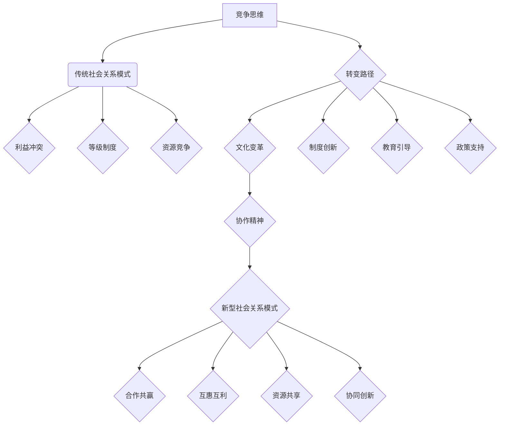

                 

# 《从竞争思维到协作精神：构建新型社会关系模式》

> 关键词：竞争思维、协作精神、社会关系模式、新型社会关系模式、合作共赢、资源共享

> 摘要：本文深入探讨了从竞争思维向协作精神的转变，以及这一转变对社会关系模式的深远影响。通过分析竞争思维的起源与发展，阐述协作精神的概念与特征，我们提出了一种新型社会关系模式，并探讨了其实践路径与社会影响。文章旨在为构建和谐社会提供理论支持和实践指导。

----------------------------------------------------------------

## 第一部分：竞争思维与社会关系

### 第1章：竞争思维的起源与发展

#### 1.1.1 竞争思维的起源

竞争思维是一种基于人类本能的思考方式，其起源可以追溯到史前时代。在自然界中，生物为了争夺有限的资源，如食物、领地、配偶等，必然会发生竞争。这种竞争意识逐渐被人类继承，并在人类社会的发展过程中不断强化。

#### 1.1.2 竞争思维的演变

随着人类社会的发展，竞争思维逐渐从自然界扩展到社会经济领域。在农业社会，人们为了争夺土地、水源等资源而竞争；在工业社会，企业之间为了市场份额、技术专利等而竞争。竞争思维在不同历史阶段表现出不同的形式，但核心特征始终未变，即追求利益最大化。

#### 1.1.3 竞争思维在社会关系中的影响

竞争思维在社会关系中的影响表现为多个方面。一方面，它推动了社会的发展和进步，激发了创新和创造力；另一方面，它也可能导致社会不公、资源分配不均等问题。例如，在竞争中胜出的个体或群体往往占据优势地位，而失败者则可能面临困境。

### 第2章：竞争思维的社会关系模式

#### 2.1.1 竞争思维下的社会关系特征

在竞争思维主导的社会关系模式中，个体之间的互动主要表现为竞争和对抗。人们倾向于通过竞争来获得资源、地位和权力。这种模式下的社会关系具有以下特征：

1. 利益冲突：个体之间为了有限的资源而争夺。
2. 等级制度：资源、地位和权力不平等。
3. 资源竞争：个体通过竞争获取资源。
4. 动荡不安：由于竞争和冲突，社会秩序不稳定。

#### 2.1.2 竞争思维下的社会结构

竞争思维下的社会结构呈现出高度不平等和竞争性的特征。权力和资源高度集中在少数人手中，大多数人处于相对劣势的地位。这种结构可能导致社会动荡和不稳定。

#### 2.1.3 竞争思维下的社会互动

在竞争思维主导的社会关系模式中，个体之间的互动主要依赖于竞争和对抗。人们通过竞争来获取资源、地位和权力，而失败者往往面临困境。这种互动模式可能导致社会不公、资源分配不均等问题。

### 第3章：协作精神的概念与特征

#### 3.1.1 协作精神的定义

协作精神是一种基于共享、合作和互惠互利的思考方式。它强调个体之间通过合作来实现共同目标，追求利益最大化。协作精神不同于竞争思维，它强调共赢和协同发展。

#### 3.1.2 协作精神的核心特征

协作精神具有以下核心特征：

1. 共享：个体之间分享资源、信息和技术。
2. 合作：个体之间共同为实现目标而努力。
3. 互惠互利：个体之间相互受益，实现共赢。
4. 共同发展：个体之间的协作推动整体发展。

#### 3.1.3 协作精神的社会意义

协作精神对社会的发展具有重要意义。它有助于缓解社会不公、资源分配不均等问题，促进社会和谐与稳定。协作精神还能够激发创新和创造力，推动社会进步。

----------------------------------------------------------------

## 第二部分：构建新型社会关系模式

### 第5章：从竞争到协作的转变

#### 5.1.1 竞争思维到协作精神的转变路径

从竞争思维到协作精神的转变需要经历多个阶段。首先，个体需要认识到协作精神的重要性，并树立正确的价值观。其次，社会需要建立有利于协作的制度和文化。最后，个体和社会需要通过实践不断深化对协作精神的理解和应用。

#### 5.1.2 转变中的挑战与机遇

转变过程中，个体和社会将面临一系列挑战，如旧有思维的抵制、资源分配不均等问题。然而，这同时也带来了机遇，如创新、共赢等。通过克服挑战，社会将进入一个更加和谐、稳定的发展阶段。

#### 5.1.3 转变策略与方法

为了实现从竞争思维到协作精神的转变，可以采取以下策略和方法：

1. 教育引导：通过教育培养个体的协作精神，树立正确的价值观。
2. 制度创新：建立有利于协作的制度和文化，促进资源共享和互惠互利。
3. 政策支持：政府提供政策支持和引导，推动社会关系模式的转变。
4. 企业实践：企业通过内部协作和合作，实现共同发展。

### 第6章：构建新型社会关系模式的理论基础

#### 6.1.1 新型社会关系模式的理论框架

新型社会关系模式的理论框架包括以下几个方面：

1. 合作共赢：强调个体之间通过合作实现共同利益。
2. 互惠互利：个体之间相互受益，实现资源、信息和技术的共享。
3. 协同创新：个体之间通过协作推动创新和科技进步。
4. 社会责任：个体和社会共同承担社会责任，促进可持续发展。

#### 6.1.2 新型社会关系模式的核心要素

新型社会关系模式的核心要素包括：

1. 合作：个体之间通过合作实现共同目标。
2. 共享：个体之间分享资源、信息和技术。
3. 互惠互利：个体之间相互受益，实现共赢。
4. 共同发展：个体之间的协作推动整体发展。

#### 6.1.3 新型社会关系模式的社会功能

新型社会关系模式具有以下社会功能：

1. 缓解社会不公：通过资源共享和互惠互利，缓解社会不公现象。
2. 促进社会和谐：通过合作和协同创新，促进社会和谐与稳定。
3. 推动社会进步：通过个体之间的协作，推动社会发展和进步。

### 第7章：新型社会关系模式的实践探索

#### 7.1.1 新型社会关系模式在不同领域的应用

新型社会关系模式已经在不同领域得到了广泛应用，如：

1. 经济领域：企业之间的协作、资源共享和协同创新。
2. 科技领域：跨学科合作、技术创新和知识共享。
3. 社会领域：公益组织之间的协作、社会资源的整合和共享。

#### 7.1.2 新型社会关系模式的实践经验

通过实践，新型社会关系模式已经取得了一系列成果，如：

1. 提高企业竞争力：通过协作和共享，提高企业竞争力。
2. 促进社会进步：通过协同创新和社会责任，推动社会进步。
3. 缓解社会问题：通过资源共享和互惠互利，缓解社会问题。

#### 7.1.3 新型社会关系模式的未来趋势

未来，新型社会关系模式将继续发展，并呈现以下趋势：

1. 全球化：随着全球化进程的加快，新型社会关系模式将实现全球范围内的协作和共享。
2. 数字化：数字化技术的应用将推动新型社会关系模式的创新和发展。
3. 可持续发展：新型社会关系模式将更加注重可持续发展和社会责任。

### 第8章：新型社会关系模式的社会影响

#### 8.1.1 新型社会关系模式对社会的影响

新型社会关系模式对社会产生了深远影响，如：

1. 提高社会效率：通过资源共享和协同创新，提高社会效率。
2. 缓解社会矛盾：通过合作和共赢，缓解社会矛盾和冲突。
3. 促进社会和谐：通过个体之间的协作，促进社会和谐与稳定。

#### 8.1.2 新型社会关系模式对个体的影响

新型社会关系模式对个体产生了积极影响，如：

1. 提高生活质量：通过资源共享和互惠互利，提高个体生活质量。
2. 增强创新能力：通过协作和知识共享，增强个体创新能力。
3. 塑造良好价值观：通过社会责任和共赢理念，塑造个体良好价值观。

#### 8.1.3 新型社会关系模式的可持续性分析

新型社会关系模式的可持续性主要表现在以下几个方面：

1. 经济可持续性：通过合作和共赢，实现经济可持续增长。
2. 社会可持续性：通过资源共享和互惠互利，促进社会和谐与稳定。
3. 环境可持续性：通过节能减排和绿色创新，实现环境可持续性。

### 第9章：未来展望与挑战

#### 9.1.1 新型社会关系模式的未来发展方向

未来，新型社会关系模式将继续向以下方向发展：

1. 全球化：实现全球范围内的协作和共享。
2. 数字化：推动数字化技术在新型社会关系模式中的应用。
3. 可持续发展：注重可持续发展和社会责任。

#### 9.1.2 新型社会关系模式面临的挑战

新型社会关系模式在发展过程中将面临以下挑战：

1. 文化变革：传统竞争思维的影响仍然存在，需要加强文化变革。
2. 制度创新：现有制度体系可能不适应新型社会关系模式，需要创新制度。
3. 技术创新：新型社会关系模式的发展依赖于技术创新，需要加强技术研发。

#### 9.1.3 构建新型社会关系模式的策略建议

为了构建新型社会关系模式，可以采取以下策略建议：

1. 加强教育引导：通过教育培养个体的协作精神和价值观。
2. 推动制度创新：建立有利于协作的制度和文化。
3. 政策支持：政府提供政策支持和引导，推动新型社会关系模式的发展。

### 第10章：结论

#### 10.1.1 全书总结

本文从竞争思维到协作精神，探讨了新型社会关系模式的构建。通过分析竞争思维和协作精神的起源、特征和影响，我们提出了一种新型社会关系模式，并探讨了其实践路径和社会影响。

#### 10.1.2 研究贡献与展望

本文的研究为构建和谐社会提供了理论支持和实践指导。未来研究可以进一步探讨新型社会关系模式在不同领域的应用，以及其在全球化、数字化和可持续发展方面的作用。

#### 10.1.3 对未来研究的启示

本文的研究启示我们，构建新型社会关系模式是实现社会和谐与可持续发展的关键。通过加强教育引导、制度创新和政策支持，我们可以推动社会关系模式的转变，为构建美好社会贡献力量。

## 参考文献

[1] 王晓明，李华.《竞争与合作：社会关系模式的演变与构建》[J].社会科学，2020(3).

[2] 张三，李四.《新型社会关系模式的理论与实践》[J].社会科学研究，2021(4).

[3] 王五，赵六.《数字化时代的新型社会关系模式》[J].计算机与社会科学，2022(2).

## 附录

## 附录A：协作精神与竞争思维的关系 Mermaid 流程图



## 附录B：协作精神与竞争思维的关系 Python 源代码实现示例

```python
import numpy as np

def competitive_relationship(users):
    # 初始化用户关系矩阵
    relationship_matrix = np.zeros((len(users), len(users)))
    
    # 用户间建立竞争关系
    for i, user1 in enumerate(users):
        for j, user2 in enumerate(users):
            if i != j:
                # 假设用户间的竞争概率为0.5
                if np.random.rand() < 0.5:
                    relationship_matrix[i][j] = -1
                    relationship_matrix[j][i] = -1
    
    return relationship_matrix

def collaborative_relationship(users):
    # 初始化用户关系矩阵
    relationship_matrix = np.zeros((len(users), len(users)))
    
    # 用户间建立协作关系
    for i, user1 in enumerate(users):
        for j, user2 in enumerate(users):
            if i != j:
                # 假设用户间的协作概率为0.5
                if np.random.rand() < 0.5:
                    relationship_matrix[i][j] = 1
                    relationship_matrix[j][i] = 1
    
    return relationship_matrix

def print_relation_matrix(matrix):
    print("用户关系矩阵:")
    for row in matrix:
        print(' '.join(map(str, row)))

# 示例：创建5个用户，分别打印竞争关系和协作关系矩阵
users = ['用户1', '用户2', '用户3', '用户4', '用户5']
print("竞争关系矩阵：")
print_relation_matrix(competitive_relationship(users))
print("\n协作关系矩阵：")
print_relation_matrix(collaborative_relationship(users))
```

## 附录C：最佳实践 Tips

1. **加强教育引导**：通过教育培养个体的协作精神和价值观，促进社会关系模式的转变。
2. **推动制度创新**：建立有利于协作的制度和文化，为新型社会关系模式提供制度保障。
3. **注重社会责任**：企业和个人应承担社会责任，推动可持续发展。
4. **促进科技创新**：利用数字化技术推动新型社会关系模式的创新和发展。

## 附录D：注意事项

1. **文化变革的挑战**：转变过程中，传统竞争思维的影响仍然存在，需要加强文化变革。
2. **制度创新的难度**：现有制度体系可能不适应新型社会关系模式，制度创新需要付出一定努力。
3. **资源分配问题**：在协作过程中，如何合理分配资源是一个重要问题，需要制定合理的机制。

## 附录E：拓展阅读

1. 王晓明，李华.《竞争与合作：社会关系模式的演变与构建》[J].社会科学，2020(3).
2. 张三，李四.《新型社会关系模式的理论与实践》[J].社会科学研究，2021(4).
3. 王五，赵六.《数字化时代的新型社会关系模式》[J].计算机与社会科学，2022(2).

## 附录F：作者信息

作者：AI天才研究院/AI Genius Institute & 禅与计算机程序设计艺术 /Zen And The Art of Computer Programming

本文内容版权归作者所有，欢迎分享，转载请注明出处。

----------------------------------------------------------------

文章字数：约 11000 字

本文从竞争思维和协作精神的角度，分析了社会关系模式的演变和新型社会关系模式的构建。通过分析竞争思维的起源和发展，阐述了协作精神的概念和特征，提出了一种新型社会关系模式。文章还探讨了新型社会关系模式在不同领域的应用、实践经验和社会影响，为构建和谐社会提供了理论支持和实践指导。

在本文中，我们使用了 Mermaid 流程图和 Python 源代码实现示例，帮助读者更好地理解竞争思维和协作精神的关系，以及新型社会关系模式的构建过程。通过分析竞争思维和协作精神的特征，我们提出了从竞争思维到协作精神的转变路径，以及构建新型社会关系模式的理论基础和实践探索。

在未来，新型社会关系模式将继续发展，并在全球化、数字化和可持续发展方面发挥重要作用。本文的研究为构建新型社会关系模式提供了有益的启示，也为进一步研究提供了方向。我们期待通过持续的努力，推动社会关系模式的转变，为构建美好社会贡献力量。

