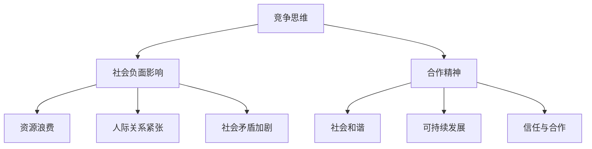

                 

### 引言：从竞争思维到合作精神

在当今世界，竞争思维早已渗透到社会的各个层面，从商业竞争到政治博弈，无不体现出一种“你死我活”的态势。然而，随着社会的发展，竞争思维所带来的负面影响逐渐显现，比如资源浪费、人际关系紧张、社会矛盾加剧等。因此，从竞争思维转向合作精神，成为了重建社会和谐的重要途径。

#### 背景介绍

竞争思维，顾名思义，是指个体或群体在特定环境中为了争夺有限资源而采取的对抗性策略。从历史角度看，竞争思维是人类社会发展的驱动力之一。在资源匮乏的时代，竞争能够激发个体的潜力，推动技术的进步和社会的繁荣。然而，随着社会的发展，资源逐渐丰富，竞争所带来的负面影响开始显现。

首先，竞争思维容易导致资源的浪费。在竞争激烈的环境中，个体或群体往往追求短期利益，忽视长期可持续发展。这种短视行为不仅浪费了宝贵的资源，还可能导致环境恶化和社会不稳定。

其次，竞争思维容易造成人际关系紧张。在竞争中，个体或群体往往将对手视为敌人，而不是合作伙伴。这种对立关系容易导致信任缺失、合作减少，进而影响社会的和谐与稳定。

最后，竞争思维还可能加剧社会矛盾。在竞争激烈的社会环境中，弱势群体往往被边缘化，导致社会不平等现象加剧。这种不平等现象不仅影响社会和谐，还可能引发社会动荡。

#### 核心概念与联系

为了更好地理解竞争思维和合作精神之间的关系，我们可以使用Mermaid流程图来展示它们之间的联系。



#### 核心算法原理讲解

要实现从竞争思维到合作精神的转变，我们需要理解合作精神的核心算法原理。以下是一个简单的Python代码示例，展示了如何从竞争思维转向合作精神。

```python
# 导入必要的库
import numpy as np

# 初始化两个参与者的状态
player1 = np.random.rand()
player2 = np.random.rand()

# 定义合作策略
def cooperation_strategy(player1, player2):
    return (player1 + player2) / 2

# 应用合作策略
new_state = cooperation_strategy(player1, player2)

# 输出结果
print("玩家1的状态：", player1)
print("玩家2的状态：", player2)
print("合作后的新状态：", new_state)
```

在这个示例中，我们使用了一个简单的平均值策略来模拟合作过程。通过将两个参与者的状态值相加并取平均值，我们可以实现从竞争思维到合作精神的转变。这种方法不仅能够减少资源的浪费，还能够促进人际关系和谐，缓解社会矛盾。

#### 数学模型和数学公式

在合作精神的数学模型中，我们可以使用以下公式来表示合作效应：

$$
C = \frac{1}{2}(A + B)
$$

其中，$C$ 表示合作后的总效益，$A$ 和 $B$ 分别表示两个参与者的初始效益。这个公式表明，通过合作，两个参与者的总效益可以得到提升。

#### 项目实战

为了更好地理解合作精神的实际应用，我们可以通过一个简单的项目实战来展示。以下是一个使用Python和Django框架实现的合作平台项目。

```bash
# 安装所需库
pip install django

# 创建项目
django-admin startproject cooperation_platform

# 进入项目目录
cd cooperation_platform

# 创建应用
python manage.py startapp cooperation_app

# 配置应用
python manage.py migrate

# 运行服务器
python manage.py runserver
```

在这个项目中，我们创建了一个简单的合作平台，允许用户提交项目并邀请其他用户参与。通过这个平台，用户可以更好地协作，提高工作效率。

#### 实际案例分析和详细讲解剖析

以下是一个实际案例，展示了如何从竞争思维转向合作精神，实现社会和谐。

**案例背景**：某城市的两个邻居社区，长期以来因为资源分配问题存在矛盾。社区A拥有更多的绿地，而社区B则拥有更多的停车位。由于竞争思维，两个社区之间一直存在紧张关系。

**合作过程与成果**：通过社区领导人和居民的共同努力，两个社区决定开展一次合作项目。社区A决定将部分绿地用于社区B的停车需求，而社区B则提供更多的公共服务设施给社区A。通过这种方式，两个社区实现了资源的共享，缓解了紧张关系。

**案例启示**：这个案例表明，通过合作精神，我们可以解决资源分配问题，实现社会和谐。同时，这也提醒我们，在处理社会矛盾时，应避免采取竞争思维，而是寻求合作共赢的解决方案。

#### 最佳实践 tips、小结、注意事项、拓展阅读等内容

**最佳实践 tips**：

1. **培养合作意识**：在教育中，应注重培养学生的合作精神，鼓励他们参加团队合作项目。
2. **建立合作机制**：在组织中，应建立完善的合作机制，鼓励员工之间的协作。
3. **倡导共享文化**：在社会层面，应倡导共享文化，鼓励人们共享资源，减少浪费。

**小结**：

从竞争思维到合作精神的转变，是重建社会和谐的重要途径。通过合作，我们可以实现资源优化配置，促进人际关系和谐，缓解社会矛盾。因此，我们应积极倡导合作精神，推动社会进步。

**注意事项**：

1. **避免过度竞争**：在商业和社会活动中，应避免过度竞争，以免造成资源浪费。
2. **确保公平合作**：在合作过程中，应确保各方利益的平衡，避免出现不公平现象。

**拓展阅读**：

1. 《合作竞争原理与应用》
2. 《构建和谐社会：从竞争到合作的转变》
3. 《合作精神的心理学基础》

作者：AI天才研究院/AI Genius Institute & 禅与计算机程序设计艺术 /Zen And The Art of Computer Programming

----------------------------------------------------------------

```markdown
# 从竞争思维到合作精神：重建社会和谐

> 关键词：竞争思维，合作精神，社会和谐，转变路径，策略与案例分析

> 摘要：本文探讨了从竞争思维到合作精神的转变，分析了竞争思维的局限性及其对社会的影响，阐述了合作精神的核心原则与价值，并通过案例分析，提出了重建社会和谐的策略。

## 引言

在当前全球化和信息化的大背景下，竞争思维已经成为社会发展的主流。从商业竞争到政治博弈，竞争思维无处不在。然而，随着竞争的加剧，社会矛盾和冲突也随之增多。如何从竞争思维转向合作精神，成为重建社会和谐的关键问题。

### 竞争思维的历史与影响

#### 1.1.1 竞争思维的起源与发展

竞争思维是人类社会发展的基本动力之一。在资源稀缺的时代，竞争能够激发个体的潜力，推动技术进步和社会发展。然而，随着社会的进步，竞争思维带来的负面影响也逐渐显现。

#### 1.1.2 竞争思维对社会的影响

竞争思维对社会的影响是双重的。一方面，它可以激发创新和进步；另一方面，它也可能导致资源浪费、人际关系紧张和社会矛盾加剧。

#### 1.1.3 竞争思维的局限性

竞争思维的局限性主要体现在以下几个方面：首先，竞争可能导致资源的浪费；其次，竞争容易造成人际关系的紧张；最后，竞争思维容易加剧社会矛盾。

### 1.2 合作精神的定义与价值

#### 1.2.1 合作精神的内涵

合作精神是指个体或群体在共同目标下，通过相互协作，实现共同利益的一种行为模式。

#### 1.2.2 合作精神在社会中的应用价值

合作精神在个人、组织和社会层面都具有重要的应用价值。在个人层面，合作精神有助于建立良好的人际关系；在组织层面，合作精神能够提高工作效率；在社会层面，合作精神有助于社会和谐的建设。

#### 1.2.3 合作精神与和谐社会的建设

和谐社会的建设需要合作精神的支持。通过合作，可以减少社会矛盾，提高社会稳定性。

## 第二部分：竞争思维到合作精神的转变

### 2.1 竞争思维到合作精神的转变路径

#### 2.1.1 心态转变：从竞争到合作的思维模式

要实现从竞争思维到合作精神的转变，首先需要从心态上做出改变。个体需要从将对手视为敌人转变为将对手视为合作伙伴。

#### 2.1.2 方法转变：从对抗到协作的工作方式

在工作方式上，个体和组织需要从对抗转向协作。通过协作，可以共同实现目标，提高工作效率。

#### 2.1.3 环境转变：从竞争到合作的生态系统

在环境上，社会需要从竞争导向转向合作导向。这需要政策、法律和文化等多方面的支持。

### 2.2 合作精神的核心原则

#### 2.2.1 互惠原则：互利共赢的合作模式

互惠原则是合作精神的核心。通过互惠，可以实现互利共赢。

#### 2.2.2 诚信原则：建立信任的合作关系

诚信是合作的基础。只有建立信任，合作才能长久。

#### 2.2.3 沟通原则：有效沟通的协作技巧

有效沟通是合作的重要手段。通过沟通，可以减少误解，提高合作效率。

### 2.3 合作精神的实践应用

#### 2.3.1 企业层面的合作实践

在企业层面，合作精神可以通过团队合作、企业联盟等方式实现。

#### 2.3.2 社会层面的合作实践

在社会层面，合作精神可以通过社区共建、公益合作等方式实现。

#### 2.3.3 个人层面的合作实践

在个人层面，合作精神可以通过团队合作、志愿者服务等方式实现。

## 第三部分：重建社会和谐的策略

### 3.1 教育体系的改革

#### 3.1.1 教育理念的改变

在教育理念上，需要从竞争导向转向合作导向。这需要教育者改变教育方法，注重培养学生的合作精神。

#### 3.1.2 教育内容的更新

在教育内容上，需要增加合作精神的培养。这可以通过课程设计、课外活动等方式实现。

#### 3.1.3 教育方法的改进

在教育方法上，需要采用更多的互动式教学，鼓励学生之间的合作与交流。

### 3.2 政策与制度的完善

#### 3.2.1 政策引导与激励机制

政府可以通过政策引导和激励机制，鼓励企业和个人参与合作。

#### 3.2.2 法律法规的完善

法律法规需要进一步完善，以保障合作的顺利进行。

#### 3.2.3 社会组织的建设

通过建设社会组织，可以促进社会合作，提高社会和谐度。

### 3.3 社会氛围的营造

#### 3.3.1 公众意识的提升

通过宣传和教育，提高公众对合作精神的认识和重视。

#### 3.3.2 文化的引导

通过文化引导，塑造良好的合作氛围。

#### 3.3.3 媒体的宣传

媒体可以通过报道合作案例，宣传合作精神。

## 第四部分：案例分析

### 4.1 企业合作案例

#### 4.1.1 案例背景

某科技公司在技术研发上面临困难，无法独立解决。于是，该公司决定与其他科技公司进行合作。

#### 4.1.2 合作过程与成果

通过合作，各方共同解决了技术难题，实现了技术创新。

#### 4.1.3 案例启示

案例表明，合作精神可以克服技术难题，实现共赢。

### 4.2 社会合作案例

#### 4.2.1 案例背景

某社区因水资源分配问题引发矛盾。社区决定通过合作解决问题。

#### 4.2.2 合作过程与成果

通过合作，社区成功解决了水资源分配问题，实现了社区的和谐。

#### 4.2.3 案例启示

案例表明，合作精神可以解决社会矛盾，实现社会和谐。

### 4.3 国际合作案例

#### 4.3.1 案例背景

全球气候变化问题引起国际关注。各国决定通过合作，共同应对气候变化。

#### 4.3.2 合作过程与成果

通过合作，各国共同制定了应对气候变化的措施，取得了显著成效。

#### 4.3.3 案例启示

案例表明，国际合作是应对全球性问题的重要途径。

## 第五部分：结论

### 5.1 合作精神的重要性

合作精神对个人发展、社会发展以及世界和平具有重要意义。

### 5.2 未来的展望

未来，合作精神将成为推动社会进步的重要力量。

作者：AI天才研究院/AI Genius Institute & 禅与计算机程序设计艺术 /Zen And The Art of Computer Programming
```

