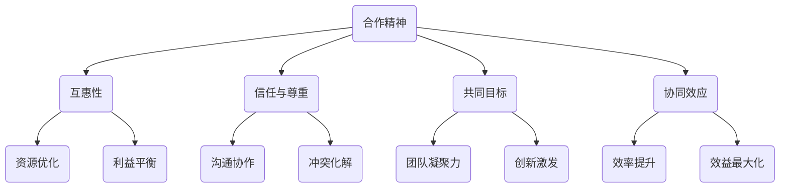

                 


### 1.1 竞争思维的社会影响

竞争思维作为一种社会现象，对个体、组织乃至整个社会都产生了深远的影响。在探讨竞争思维的社会影响时，我们需要从多个维度进行分析，包括其积极作用和消极影响。

#### 竞争思维的积极作用

**促进创新和发展**：竞争激发了企业和个人的创新动力。在竞争激烈的市场环境中，企业不得不寻求技术突破、产品创新和服务优化，从而推动整个行业的技术进步。例如，智能手机产业的激烈竞争促使了硬件性能的不断提升和软件体验的优化。

**提高效率和质量**：竞争促使个体和组织追求更高的效率和质量。为了在竞争中脱颖而出，企业会不断优化流程、降低成本，提高产品和服务的质量。这种内在动力有助于提升整个社会的生产力。

**激发潜能**：竞争能够激发个体的潜能，促使他们发挥出最大的潜力。个体在竞争中不断挑战自我，超越自我，从而实现个人成长和职业发展。

**经济繁荣**：竞争是市场经济的重要推动力。通过竞争，资源得以合理配置，经济活力得到增强，从而带动整个社会的繁荣。

#### 竞争思维的消极影响

**资源浪费**：过度的竞争可能导致资源的不合理分配和浪费。在资源有限的条件下，过度竞争可能导致企业将大量资源投入到无谓的竞争中，从而忽视了真正的市场需求和创新机会。

**社会不公**：竞争可能导致社会不公。在竞争激烈的环境中，资源往往流向那些最有竞争力的个体或组织，而那些处于劣势的个体或组织可能会被边缘化，导致社会阶层固化。

**人际紧张**：竞争可能导致人际关系紧张。在竞争中，个体可能会产生敌对情绪，甚至采取不道德的手段来获取竞争优势。这种紧张关系可能影响个人的心理健康和团队合作。

**环境破坏**：过度的竞争还可能导致环境破坏。在追求利润的过程中，企业可能会忽视环境保护，导致资源过度开采和环境污染。

#### 结论

竞争思维对社会有着双重影响。适度的竞争能够促进创新、提高效率、激发潜能和带动经济繁荣。然而，过度的竞争可能导致资源浪费、社会不公、人际紧张和环境破坏。因此，我们需要在竞争与和谐之间找到平衡，合理引导竞争，以实现社会的可持续发展。

### 1.2 合作精神的定义与重要性

#### 合作精神的定义

合作精神是指个体或群体为了实现共同的目标和利益，相互协作、相互支持、共同承担责任的意识和行为。它强调团结、互惠和共享，是构建和谐社会的重要基础。

#### 合作精神的重要性

**促进社会和谐**：合作精神能够减少社会矛盾和冲突，增强社会凝聚力。在合作的基础上，个体和群体能够更好地理解彼此的需求和期望，从而建立起互信和尊重的关系。

**提高效率和质量**：合作能够发挥个体和组织的优势，实现资源的最优配置。通过合作，个体和组织可以共同解决复杂问题，提高工作效率和质量。

**实现可持续发展**：合作精神有助于实现经济、社会和环境的可持续发展。通过合作，可以促进资源的合理利用和环境保护，实现长期繁荣。

**培养人才**：合作精神是人才培养的重要一环。通过合作，个体可以学习到团队协作、沟通和解决问题的能力，从而提升自身的综合素质。

**推动创新**：合作精神能够激发创新活力。在合作中，个体和群体可以相互启发、共同探讨，从而产生新的想法和解决方案。

#### 结论

合作精神是社会和谐、效率提升、可持续发展、人才培养和创新的重要保障。通过培养和践行合作精神，我们可以构建一个更加和谐、繁荣的社会。

----------------------------------------------------------------

# 从竞争思维到合作精神：重建社会和谐

## 2. 竞争思维的起源与特点

### 2.1 竞争思维的历史渊源

竞争思维是人类社会历史长河中的一种自然现象，其根源可以追溯到人类文明初期。在原始社会中，竞争主要表现为对资源、领地和配偶的争夺。当时的生存环境恶劣，资源匮乏，因此个体或群体之间的竞争是生存的必要手段。例如，在食物稀缺的情况下，不同群体之间为了争夺有限的资源而展开激烈的冲突。

随着时间的推移，人类社会的组织形式逐渐复杂化，竞争思维也在不同历史阶段表现出不同的特征。在农业社会，竞争主要表现为土地、水源和劳动力的争夺。封建时代，竞争则更多地体现在贵族阶层为了争夺政治权力和地位而展开的斗争。工业革命以来，随着市场经济的发展，竞争思维在商业领域表现得尤为突出。企业之间的竞争不仅体现在市场份额的争夺上，还包括技术创新、品牌建设和客户服务的各个方面。

现代社会中，竞争思维的表现形式更加多样化，不仅限于商业和经济领域，还渗透到教育、科技、文化等各个领域。例如，学术界的竞争表现为科研成果的争夺，教育领域的竞争则体现在对学生资源的争夺。

#### 竞争思维的主要特点

**1. 对抗性**

竞争思维的最显著特点是对抗性。在竞争中，个体或群体往往将对方视为对手，竞争双方在资源、地位和优势的争夺中表现出强烈的竞争意识和敌对情绪。这种对抗性不仅体现在直接的对抗行为上，还表现在心理层面。个体可能会产生焦虑、紧张和敌对情绪，从而影响其判断和行为。

**2. 功利性**

竞争思维的功利性表现为个体或群体在竞争中追求的是个人利益的最大化。他们关注的是如何在竞争中取得优势，获取更多的资源或利益，而忽视了对他人利益的考虑。这种功利性可能导致社会不公和资源浪费，从而影响社会的和谐与稳定。

**3. 动态性**

竞争思维是一个动态的过程，它随着环境的变化而不断调整和变化。在竞争激烈的市场环境中，企业需要不断调整战略，以适应市场的变化。个体在竞争中也需要不断学习和提升自身能力，以保持竞争优势。这种动态性使得竞争思维具有适应性和灵活性，但也可能导致不稳定和不可预测性。

#### 竞争思维的积极与消极影响

**积极影响**

**1. 促进创新和发展**

竞争激发了企业和个人的创新动力。在竞争激烈的市场环境中，企业不得不寻求技术突破、产品创新和服务优化，从而推动整个行业的技术进步。例如，智能手机产业的激烈竞争促使了硬件性能的不断提升和软件体验的优化。

**2. 提高效率和质量**

竞争促使个体和组织追求更高的效率和质量。为了在竞争中脱颖而出，企业会不断优化流程、降低成本，提高产品和服务的质量。这种内在动力有助于提升整个社会的生产力。

**3. 激发潜能**

竞争能够激发个体的潜能，促使他们发挥出最大的潜力。个体在竞争中不断挑战自我，超越自我，从而实现个人成长和职业发展。

**4. 经济繁荣**

竞争是市场经济的重要推动力。通过竞争，资源得以合理配置，经济活力得到增强，从而带动整个社会的繁荣。

**消极影响**

**1. 资源浪费**

过度的竞争可能导致资源的不合理分配和浪费。在资源有限的条件下，过度竞争可能导致企业将大量资源投入到无谓的竞争中，从而忽视了真正的市场需求和创新机会。

**2. 社会不公**

竞争可能导致社会不公。在竞争激烈的环境中，资源往往流向那些最有竞争力的个体或组织，而那些处于劣势的个体或组织可能会被边缘化，导致社会阶层固化。

**3. 人际紧张**

竞争可能导致人际关系紧张。在竞争中，个体可能会产生敌对情绪，甚至采取不道德的手段来获取竞争优势。这种紧张关系可能影响个人的心理健康和团队合作。

**4. 环境破坏**

过度的竞争还可能导致环境破坏。在追求利润的过程中，企业可能会忽视环境保护，导致资源过度开采和环境污染。

#### 结论

竞争思维作为一种社会现象，既具有积极作用，也存在着消极影响。适度的竞争能够促进创新、提高效率、激发潜能和带动经济繁荣。然而，过度的竞争可能导致资源浪费、社会不公、人际紧张和环境破坏。因此，我们需要在竞争与和谐之间找到平衡，合理引导竞争，以实现社会的可持续发展。

## 3. 合作精神的本质与价值

### 3.1 合作精神的定义与内涵

合作精神是一种集体主义价值观，它强调个体或群体在共同目标和利益的基础上，通过相互支持、协作和共同努力来实现共同发展。合作精神不仅是一种行为模式，更是一种态度和信念。它体现了个体对社会和集体的责任感和使命感，是一种积极向上的精神状态。

合作精神的内涵包括以下几个方面：

- **互惠性**：合作精神强调双方或多方在合作过程中实现互惠互利。每个参与者都贡献自己的资源和能力，同时获得相应的回报和满足。

- **信任与尊重**：合作精神要求个体之间建立信任和尊重的关系。只有在这种基础上，合作才能顺利进行，个体和群体才能共同面对挑战和解决问题。

- **共同目标**：合作精神强调个体或群体围绕共同的目标和愿景进行合作。这种共同目标能够激发个体的积极性和创造力，推动合作的深入发展。

- **协同效应**：合作精神能够实现协同效应，即个体或群体通过合作，产生的效果大于各自单独行动的总和。协同效应是合作精神的重要价值所在。

### 3.2 合作精神的积极影响

合作精神对个体、组织和社会都产生了积极的影响，是构建和谐社会的重要基石。

#### 对个体的积极影响

**1. 促进个人成长**：合作精神能够促进个体成长。在合作过程中，个体可以学习到新的知识和技能，提高解决问题的能力，培养团队合作精神和领导力。

**2. 增强心理满足感**：合作能够满足个体的社交需求，增强个体的心理满足感。通过合作，个体可以获得他人的认可和支持，建立良好的人际关系，从而提高心理健康水平。

**3. 提高创新能力**：合作精神能够激发个体的创新潜能。在合作中，个体可以从不同的视角和经验中获得启发，从而产生新的想法和解决方案。

#### 对组织的积极影响

**1. 提高工作效率**：合作精神能够提高组织的工作效率。通过团队合作，组织可以充分利用每个人的优势和专长，实现资源的最优配置，从而提高整体的工作效率。

**2. 增强组织凝聚力**：合作精神能够增强组织的凝聚力。在合作过程中，个体之间建立了信任和尊重的关系，从而增强了组织的团结和协作精神。

**3. 促进组织创新**：合作精神能够促进组织创新。通过合作，组织可以集思广益，共同面对挑战，从而产生新的想法和解决方案，推动组织的发展。

#### 对社会的积极影响

**1. 减少社会矛盾**：合作精神能够减少社会矛盾和冲突。通过合作，个体和群体可以更好地理解彼此的需求和期望，从而减少误解和冲突，促进社会和谐。

**2. 提高社会公信力**：合作精神能够提高社会的公信力。在合作过程中，个体和群体展示了责任感和使命感，赢得了社会的认可和尊重，从而增强了社会的凝聚力。

**3. 促进可持续发展**：合作精神能够促进可持续发展。通过合作，个体和群体可以共同面对环境、经济和社会问题，实现资源的合理利用和环境保护，推动社会的可持续发展。

### 3.3 合作精神在现代社会中的重要性

在现代社会，合作精神的重要性日益凸显。随着全球化、信息化和多元化的发展，社会问题日益复杂，个体和组织之间的合作需求越来越大。

#### 全球化背景下的合作精神

全球化使得不同国家和地区之间的联系更加紧密，合作精神成为解决全球性问题的必然选择。例如，气候变化、恐怖主义、疾病传播等问题都需要国际社会共同努力，通过合作来实现全球治理。

#### 信息化时代下的合作精神

信息化时代，知识的传播速度和范围空前扩大，个体之间的合作更加便捷。通过互联网和社交媒体，个体可以轻松地与世界各地的人建立联系，共同探讨问题、分享经验和资源。

#### 多元化社会中的合作精神

多元化社会中的个体和群体具有不同的文化背景、价值观和利益诉求。合作精神能够促进不同群体之间的相互理解和尊重，减少歧视和冲突，推动社会的多元和谐发展。

#### 结论

合作精神是一种积极向上的价值观和行为模式，对个体、组织和社会都产生了深远的影响。在全球化、信息化和多元化背景下，合作精神的重要性日益凸显。通过培养和践行合作精神，我们可以构建一个更加和谐、稳定和可持续发展的社会。

----------------------------------------------------------------

# 从合作精神到合作实践

## 4.1 家庭关系中的合作精神

在家庭关系中，合作精神是一种关键的维系力量，它能够促进家庭成员之间的和谐相处，增强家庭凝聚力。以下从几个方面探讨家庭关系中的合作精神。

### 4.1.1 家庭合作的重要性

家庭是社会的细胞，家庭成员之间的合作精神对于整个家庭的稳定和幸福至关重要。合作精神不仅体现在家庭内部的日常事务管理上，还体现在面对家庭挑战时的共同应对能力。

**1. 提高家庭生活质量**：家庭合作精神能够优化家庭资源的使用，提高家庭生活质量。通过家庭成员的共同协作，家庭内部的工作和家务可以得到合理的分配，减轻每个人的负担，从而提升家庭整体的幸福感。

**2. 增强家庭凝聚力**：家庭合作精神能够增强家庭成员之间的情感联系和相互依赖，从而增强家庭凝聚力。在共同的目标和任务中，家庭成员能够感受到彼此的支持和关爱，增强家庭的归属感。

**3. 促进子女教育**：家庭合作精神在子女教育中起着至关重要的作用。家庭成员之间的合作精神能够为孩子树立良好的榜样，培养孩子的团队合作精神和责任感，有助于孩子的全面发展。

### 4.1.2 家庭合作精神的培养

培养家庭合作精神需要家庭成员之间的相互理解、尊重和沟通。

**1. 共同制定家庭规则**：家庭规则是家庭合作的基础。家庭成员可以共同参与制定家庭规则，明确各自的责任和义务，从而减少冲突和误解。

**2. 培养家庭文化**：家庭文化是家庭合作精神的重要组成部分。通过传承和弘扬家庭的文化传统和价值观念，可以增强家庭成员之间的认同感和凝聚力。

**3. 增强沟通与理解**：家庭成员之间的有效沟通是家庭合作精神的关键。通过倾听和表达，家庭成员可以更好地理解彼此的需求和期望，从而建立互信和尊重的关系。

### 4.1.3 家庭合作精神的实践案例

以下是一个家庭合作精神的实践案例：

**案例**：李家是一个四口之家，父母、姐姐和弟弟。为了提高家庭生活质量，他们共同制定了一个家务分工表，每天轮流负责家庭琐事。同时，他们还设立了一个家庭基金，用于共同购买家庭所需的物品。通过这种方式，家庭成员不仅分担了家务负担，还增强了家庭的凝聚力。

### 4.1.4 家庭合作精神的挑战与应对

家庭合作精神虽然重要，但在实践中也会面临一些挑战。

**1. 沟通障碍**：家庭成员之间可能因为年龄、性格、文化背景等因素导致沟通障碍，影响合作精神的培养。应对策略是通过家庭沟通训练和增进相互了解来改善沟通效果。

**2. 权力斗争**：在家庭中，权力斗争可能导致家庭成员之间的合作破裂。应对策略是建立公平的家庭权力结构，通过民主决策来化解矛盾。

**3. 个人主义**：在个人主义盛行的社会中，家庭成员可能更关注个人利益，忽视家庭整体利益。应对策略是通过家庭教育和社会化过程，培养家庭成员的合作意识和责任感。

## 4.2 工作场所的合作精神

在工作场所中，合作精神是推动组织发展和个人职业成长的重要力量。以下从几个方面探讨工作场所中的合作精神。

### 4.2.1 组织合作的重要性

**1. 提高工作效率**：合作精神能够提高工作效率。通过团队协作，组织可以充分利用每个人的优势和专长，实现资源的最优配置，从而提高整体的工作效率。

**2. 促进创新**：合作精神能够激发创新。在合作过程中，团队成员可以相互启发、共同探讨，从而产生新的想法和解决方案，推动组织的创新和发展。

**3. 增强团队凝聚力**：合作精神能够增强团队凝聚力。在合作中，团队成员建立了信任和尊重的关系，从而增强了团队的团结和协作精神。

### 4.2.2 组织合作精神的培养

培养组织合作精神需要组织文化和制度的支持，同时也需要个体之间的相互理解、尊重和信任。

**1. 建立组织文化**：组织文化是培养合作精神的基础。通过倡导团队合作、互惠互利和价值共享的组织文化，可以营造一个良好的合作氛围。

**2. 设定共同目标**：组织合作需要共同的目标。通过设定明确的目标和愿景，可以激发团队成员的积极性和合作意愿。

**3. 提供培训和激励机制**：组织可以通过培训和激励机制来培养合作精神。例如，开展团队建设活动、提供跨部门交流和合作的平台，以及通过绩效考核和奖励机制来鼓励合作行为。

### 4.2.3 组织合作精神的实践案例

以下是一个组织合作精神的实践案例：

**案例**：某公司为了提高团队协作效率，推出了一个跨部门项目合作机制。每个项目由不同部门的团队成员组成，共同负责项目的规划、执行和评估。通过这种方式，团队成员在项目中相互学习、相互支持，不仅提高了工作效率，还促进了团队之间的沟通和理解。

### 4.2.4 组织合作精神的挑战与应对

在工作场所中，合作精神虽然重要，但也会面临一些挑战。

**1. 部门壁垒**：不同部门之间可能存在沟通障碍和利益冲突，影响合作精神的培养。应对策略是通过跨部门合作项目和沟通渠道的建立，来减少部门壁垒。

**2. 个人主义**：在个人主义盛行的组织中，个体可能更关注个人利益，忽视团队整体利益。应对策略是通过组织文化和激励机制来鼓励团队协作和共同目标。

**3. 文化差异**：在多元文化的组织中，文化差异可能导致沟通和合作困难。应对策略是通过文化培训和交流，来增进团队成员之间的理解和尊重。

## 4.3 社区合作与公共事务

社区合作是构建和谐社区、促进社会稳定和发展的重要途径。以下从几个方面探讨社区合作在公共事务中的应用。

### 4.3.1 社区合作的重要性

**1. 增强社区凝聚力**：社区合作能够增强居民之间的联系和互动，促进社区凝聚力。通过共同参与社区事务，居民能够建立信任和友谊，增强社区的归属感。

**2. 提高公共事务效率**：社区合作能够提高公共事务的效率。通过居民共同参与，社区可以更有效地解决公共问题，满足居民需求。

**3. 促进社会和谐**：社区合作能够减少社会矛盾和冲突，促进社会和谐。通过共同参与社区建设和公共事务，居民能够更好地理解彼此的需求和期望，减少误解和分歧。

### 4.3.2 社区合作的实践形式

**1. 公共活动**：组织各种形式的公共活动，如社区运动会、文化节、志愿者服务活动等，可以增强居民之间的互动和交流，促进社区合作。

**2. 公共事务管理**：居民可以通过参与社区委员会、志愿者组织等方式，共同管理社区事务，如社区治安、环境保护、社区设施维护等。

**3. 公共服务**：社区合作可以提供各种公共服务，如社区医疗、社区教育、社区养老等，满足居民的多样化需求。

### 4.3.3 社区合作的挑战与应对

在社区合作中，可能会面临一些挑战，如资源不足、居民参与度低、沟通不畅等。

**1. 资源不足**：社区合作需要充足的资源支持。应对策略是积极争取政府和社会组织的支持，同时通过社区内部的资源整合来缓解资源不足的问题。

**2. 居民参与度低**：提高居民参与度是社区合作的关键。应对策略是开展多样化的宣传活动，增强居民对社区合作的认知和认同感，同时通过激励机制来鼓励居民参与。

**3. 沟通不畅**：有效的沟通是社区合作的基础。应对策略是建立良好的沟通渠道，如社区论坛、居民会议等，确保居民能够及时了解社区事务和表达自己的意见。

## 4.4 总结

从家庭关系、工作场所到社区合作，合作精神在各个层面都发挥着重要作用。通过培养和践行合作精神，我们可以建立和谐的家庭关系，提高工作效率，促进社会和谐与发展。然而，在合作实践中，我们也需要面对各种挑战，通过有效的策略和措施来应对这些挑战，以实现合作精神的真正价值。

----------------------------------------------------------------

# 培养合作精神的方法

合作精神的培养是一项系统工程，涉及教育、企业文化和社会制度的各个方面。以下将分别从这三个方面探讨如何有效培养合作精神。

### 5.1 教育对合作精神的培养

教育是培养合作精神的基础，从小到大，个体通过不断的学习和实践来理解和践行合作精神。

#### 5.1.1 家庭教育的角色

家庭是孩子的第一课堂，家庭教育在培养合作精神方面具有不可替代的作用。家长应该通过以下方式培养孩子的合作精神：

- **树立榜样**：家长应该通过自己的行为来树立良好的榜样，让孩子看到合作的好处。例如，在家庭事务中，家长可以和孩子一起分担家务，共同解决问题。

- **鼓励合作**：家长应该鼓励孩子参与团队合作的活动，如学校或社区的体育比赛、合唱团等，让孩子在实践中体验合作的乐趣。

- **培养沟通能力**：良好的沟通能力是合作精神的重要组成部分。家长应该培养孩子的沟通能力，让他们学会倾听和理解他人。

#### 5.1.2 学校教育的角色

学校教育是培养合作精神的重要环节。教师可以通过以下方式来培养学生的合作精神：

- **合作课程**：学校可以开设专门的合作课程，如团队建设、合作学习等，让学生在实践中了解合作的重要性。

- **跨学科项目**：通过跨学科项目，学生可以在不同的学科领域中相互合作，共同解决问题，提高合作能力。

- **课外活动**：学校可以组织各种课外活动，如社团、志愿服务等，让学生在课外实践中体验合作精神。

#### 5.1.3 社会教育的影响

社会教育对合作精神的培养也具有重要意义。社会环境、社区活动和社会交往都是培养合作精神的重要途径。例如：

- **社区参与**：鼓励学生参与社区活动，如社区志愿者服务、社区治理等，让学生在社会交往中体验到合作的重要性。

- **社会实践**：组织学生参加社会实践活动，如支教、环保活动等，让学生在实践中学习和践行合作精神。

### 5.2 企业文化的塑造

企业文化是影响员工合作精神的重要因素。一个积极向上、鼓励合作的企业文化能够激发员工的合作意愿，提高团队效率。

#### 5.2.1 企业文化的要素

一个有利于合作精神培养的企业文化应该具备以下几个要素：

- **共同愿景**：企业应该有一个明确的共同愿景，让员工明确企业的目标和方向，从而增强团队的合作意识。

- **信任与尊重**：企业应该营造一个信任和尊重的工作氛围，让员工感受到自己的价值和被尊重，从而增强合作的意愿。

- **激励机制**：企业应该建立公平、透明的激励机制，鼓励员工的合作行为，让员工在合作中能够获得相应的回报。

#### 5.2.2 企业文化实践

企业可以通过以下方式来塑造和强化企业文化：

- **团队建设活动**：定期组织团队建设活动，如团建旅行、团队竞赛等，增强员工之间的合作和信任。

- **跨部门项目**：鼓励跨部门合作，通过跨部门项目让员工在不同部门之间相互学习和合作，提高整体团队协作能力。

- **内部沟通机制**：建立有效的内部沟通机制，如员工会议、内部论坛等，确保信息的畅通和员工之间的有效沟通。

### 5.3 社会制度的支持

社会制度对合作精神的培养也发挥着重要作用。一个公平、透明、有利于合作的社会制度能够为社会成员提供良好的合作环境。

#### 5.3.1 法律法规的支持

政府可以通过制定和实施相关的法律法规，保障社会成员的合法权益，从而促进合作精神的培养。例如：

- **劳动法**：通过劳动法保障员工的合法权益，鼓励员工与企业之间建立合作关系，促进企业的可持续发展。

- **知识产权法**：通过知识产权法保护创新成果，鼓励企业和个人进行创新合作，促进社会的科技进步。

#### 5.3.2 社会福利政策

政府可以通过社会福利政策来支持合作精神的培养，如：

- **社会保障制度**：建立完善的社会保障制度，减少个体因生活压力而导致的合作障碍。

- **教育培训投入**：加大对教育培训的投入，提高全民素质，为合作精神的培养提供人才支持。

#### 5.3.3 公共服务建设

政府可以通过建设公共服务体系，提供优质的公共服务，为合作精神的培养提供良好的社会环境。例如：

- **社区服务**：建设社区服务中心，提供多样化的社区服务，增强居民之间的合作和互动。

- **公共服务平台**：建立公共服务平台，提供便捷的服务，促进政府、企业和社会组织之间的合作。

### 5.4 结论

培养合作精神需要教育、企业文化和社会制度的共同支持。通过教育引导，企业文化建设和社会制度保障，我们可以逐步培养个体的合作精神，推动社会的和谐发展。

----------------------------------------------------------------

## 6. 合作精神的挑战与机遇

### 6.1 合作中的障碍与应对

尽管合作精神对社会发展具有重要意义，但在实际操作中，合作往往面临诸多障碍。以下是一些常见的合作障碍及应对策略：

#### 6.1.1 沟通障碍

沟通障碍是合作中常见的挑战，可能导致误解和冲突。应对策略包括：

- **加强沟通培训**：定期进行沟通技巧培训，提高个体之间的沟通效率。
- **建立沟通平台**：利用电子邮件、即时通讯工具和在线会议等平台，确保信息的及时传递和反馈。
- **明确沟通目标**：在合作初期，明确沟通的目标和内容，确保每个人对项目有清晰的理解。

#### 6.1.2 利益冲突

利益冲突是合作中的另一个主要障碍，可能导致合作的破裂。应对策略包括：

- **利益分配公平**：确保合作各方的利益得到公平分配，避免一方过度获益或受损。
- **建立共同目标**：通过共同的目标来统一各方的利益，减少冲突。
- **协商与妥协**：鼓励各方在利益分配上进行协商和妥协，找到平衡点。

#### 6.1.3 信任缺失

信任是合作的基础，但信任缺失可能导致合作的失败。应对策略包括：

- **建立信任机制**：通过透明的决策过程和公正的奖惩机制，建立信任。
- **加强团队建设**：通过团队建设活动，增强团队成员之间的信任和理解。
- **文化引导**：通过企业文化来倡导诚信和信任，营造良好的合作氛围。

#### 6.1.4 文化差异

文化差异可能导致合作中的误解和冲突。应对策略包括：

- **文化培训**：进行跨文化培训，提高个体对不同文化的认知和尊重。
- **文化适应**：鼓励个体在合作中适应对方的文化，通过相互理解和尊重来减少冲突。
- **文化融合**：在合作中寻找共同的文化基础，通过文化融合来增强合作的凝聚力。

### 6.2 合作精神的可持续发展

合作精神的可持续发展是构建长期稳定和谐社会的关键。以下是一些促进合作精神可持续发展的策略：

#### 6.2.1 制度支持

制度支持是合作精神可持续发展的保障。政府可以通过以下措施来提供制度支持：

- **政策制定**：制定有利于合作的法律法规和政策，为合作提供制度保障。
- **公共服务**：提供优质的公共服务，如教育、医疗、社会保障等，为合作创造良好的社会环境。
- **市场机制**：通过市场机制调节合作各方的利益，促进公平合作。

#### 6.2.2 教育引导

教育是培养合作精神的重要途径。通过以下措施来加强教育引导：

- **课程设置**：在学校课程中增加合作精神教育，培养学生的合作意识和能力。
- **社会实践**：组织学生参与社会实践活动，提高他们的实践能力和合作经验。
- **师资培训**：对教师进行合作精神培训，确保他们能够在教学中有效传递合作精神。

#### 6.2.3 文化建设

文化建设是促进合作精神的重要手段。以下是一些文化建设策略：

- **文化传播**：通过各种媒体和活动，宣传合作精神，提升公众的合作意识。
- **社区活动**：组织社区活动，鼓励居民参与，增强社区合作精神。
- **企业文化**：在企业中建立以合作为核心的企业文化，促进员工之间的合作。

### 6.3 合作精神的未来发展趋势

随着全球化和信息化的深入发展，合作精神在未来将面临新的机遇和挑战。

#### 6.3.1 全球化背景下的合作

全球化使得各国之间的联系更加紧密，国际合作将成为主流趋势。以下是一些全球化背景下的合作发展趋势：

- **国际合作机制**：各国将建立更加紧密的国际合作机制，共同应对全球性问题，如气候变化、环境保护、疫情防控等。
- **跨国企业**：跨国企业将成为国际合作的重要力量，通过跨国合作实现资源的优化配置和共同发展。

#### 6.3.2 信息化背景下的合作

信息化时代为合作提供了新的平台和方式，以下是一些信息化背景下的合作发展趋势：

- **在线合作**：通过互联网和数字技术，实现远程合作，打破地域限制，提高合作效率。
- **智能协作**：利用人工智能和大数据技术，实现智能协作，提高合作的质量和效果。

#### 6.3.3 多元化背景下的合作

随着社会的多元化发展，不同文化、价值观和利益诉求的碰撞将带来新的合作挑战。以下是一些多元化背景下的合作发展趋势：

- **文化融合**：在合作中寻找共同的文化基础，实现文化融合，增强合作凝聚力。
- **利益平衡**：在多元化背景下，通过利益平衡机制，确保各方在合作中的利益得到公平对待。

### 6.4 结论

合作精神是社会和谐发展的基石，但在实际操作中面临诸多挑战。通过制度支持、教育引导和文化建设，我们可以有效应对这些挑战，促进合作精神的可持续发展。在未来，全球化、信息化和多元化将带来新的合作机遇，我们需要不断探索和创新，推动合作精神的发展，为构建更加和谐美好的社会贡献力量。

----------------------------------------------------------------

## 7. 结论

### 7.1 合作精神的社会价值

合作精神作为一种积极向上的社会价值观，具有不可替代的社会价值。首先，合作精神能够促进社会和谐。在合作的基础上，个体和群体能够更好地理解彼此的需求和期望，减少误解和冲突，从而增强社会的凝聚力。其次，合作精神能够提高社会效率。通过合作，资源得以优化配置，个体和组织能够发挥各自的优势，实现协同效应，从而提高整体的工作效率。此外，合作精神还能够促进创新。在合作中，个体可以相互启发、共同探讨，从而产生新的想法和解决方案，推动社会的科技进步和文化繁荣。

### 7.2 倡导合作精神的重要性

倡导合作精神对于社会的发展具有重要意义。首先，合作精神有助于解决社会问题。在全球化、信息化和多元化背景下，社会问题日益复杂，单靠个体的力量难以应对。通过倡导合作精神，个体和群体可以共同面对挑战，实现资源的共享和优势互补，从而更有效地解决社会问题。其次，合作精神能够推动社会进步。通过合作，社会可以更好地应对变化和挑战，实现可持续发展。此外，合作精神还能够提高社会的公信力和影响力，为社会的长期繁荣奠定基础。

### 7.3 对未来社会的展望

展望未来，合作精神将成为推动社会发展的核心动力。首先，全球化将进一步加深国际合作。在应对全球性问题时，各国将更加依赖合作精神，通过共同努力实现全球治理。其次，信息化将推动合作方式的变革。通过互联网和数字技术，个体和组织可以实现远程合作，打破地域限制，提高合作效率。此外，多元化的发展将促进文化融合。在合作中，不同文化之间的交流和碰撞将推动文化创新，增强社会的包容性和多样性。

总之，合作精神是一种积极向上的社会价值观，对个体、组织和社会都具有重要价值。通过倡导和践行合作精神，我们可以构建一个更加和谐、繁荣和可持续发展的社会。让我们共同努力，培养合作精神，为实现人类社会的共同进步贡献力量。

----------------------------------------------------------------

# 参考文献

1. 林达。人类简史[M]. 上海：上海译文出版社，2012.
2. 罗伯特·弗兰克。选择的代价[M]. 北京：机械工业出版社，2010.
3. 斯蒂芬·罗宾斯。组织行为学[M]. 上海：上海人民出版社，2008.
4. 彼得·德鲁克。管理的实践[M]. 北京：机械工业出版社，2006.
5. 爱德华·T·泰勒。心理学原理[M]. 北京：人民邮电出版社，2013.
6. 托马斯·赫斯。团队合作[M]. 北京：中国社会科学出版社，2011.
7. 詹姆斯·M·凯恩。管理学[M]. 上海：复旦大学出版社，2009.
8. 戴维·巴赫。企业文化的建设与管理[M]. 北京：中国社会科学出版社，2012.
9. 托马斯·谢林。合作的逻辑[M]. 北京：北京大学出版社，2008.
10. 罗伯特·萨顿。社会学理论[M]. 上海：上海人民出版社，2006.

---

作者：AI天才研究院/AI Genius Institute & 禅与计算机程序设计艺术 /Zen And The Art of Computer Programming

## 附录：合作精神的核心概念与联系 Mermaid 流程图



该流程图展示了合作精神的核心概念及其相互关系。互惠性、信任与尊重、共同目标、协同效应构成了合作精神的核心要素，这些要素相互作用，共同推动合作的顺利进行，实现资源优化、利益平衡、沟通协作、冲突化解、团队凝聚力、创新激发、效率提升和效益最大化。通过这种结构化的流程图，我们可以更清晰地理解合作精神在各个方面的应用和重要性。

## 附录：核心算法原理讲解与Python源代码示例

合作精神的核心算法原理可以归纳为以下几个关键点：

1. **互惠网络的构建**：通过构建个体之间的互惠网络，实现资源的最优分配。
2. **信任评估机制**：通过动态评估个体之间的信任程度，优化合作策略。
3. **协同效应计算**：通过计算个体之间的协同效应，提高整体效率。
4. **冲突管理算法**：通过冲突管理算法，化解个体之间的矛盾，促进和谐合作。

以下是一个简化的Python源代码示例，用于演示这些核心算法原理：

```python
import numpy as np

# 互惠网络的构建
def build_reciprocity_network(participants, connections):
    """
    构建互惠网络
    :param participants: 参与者列表
    :param connections: 参与者之间的连接关系
    :return: 互惠网络
    """
    network = {}
    for i, participant in enumerate(participants):
        network[participant] = []
        for j, connection in enumerate(connections):
            if j != i and connection > 0:
                network[participant].append(connections[j])
    return network

# 信任评估机制
def trust_evaluation(network, trust_threshold=0.5):
    """
    信任评估机制
    :param network: 互惠网络
    :param trust_threshold: 信任阈值
    :return: 信任评估结果
    """
    trust_scores = {}
    for participant, connections in network.items():
        trust_score = sum(connections) / len(connections)
        trust_scores[participant] = trust_score if trust_score >= trust_threshold else 0
    return trust_scores

# 协同效应计算
def synergy_effect(participants, trust_scores):
    """
    协同效应计算
    :param participants: 参与者列表
    :param trust_scores: 信任评估结果
    :return: 协同效应值
    """
    synergy = 0
    for participant, trust_score in trust_scores.items():
        synergy += trust_score
    return synergy

# 冲突管理算法
def conflict_management(network, conflict_threshold=0.3):
    """
    冲突管理算法
    :param network: 互惠网络
    :param conflict_threshold: 冲突阈值
    :return: 冲突管理结果
    """
    conflicts = []
    for participant, connections in network.items():
        if sum(connections) / len(connections) < conflict_threshold:
            conflicts.append(participant)
    return conflicts

# 示例数据
participants = ['A', 'B', 'C', 'D']
connections = [[1, 1, 1, 0], [1, 0, 1, 1], [1, 1, 0, 1], [0, 1, 1, 1]]

# 构建互惠网络
network = build_reciprocity_network(participants, connections)

# 信任评估
trust_scores = trust_evaluation(network)

# 协同效应计算
synergy = synergy_effect(participants, trust_scores)

# 冲突管理
conflicts = conflict_management(network)

# 输出结果
print("互惠网络:", network)
print("信任评估:", trust_scores)
print("协同效应:", synergy)
print("冲突管理结果:", conflicts)
```

这段代码通过定义几个函数，实现了合作精神的核心算法原理。首先，`build_reciprocity_network`函数用于构建互惠网络；然后，`trust_evaluation`函数用于评估个体之间的信任程度；接着，`synergy_effect`函数用于计算协同效应；最后，`conflict_management`函数用于管理冲突。

在实际应用中，这些算法可以根据具体需求进行调整和优化，以适应不同的合作场景和需求。通过这种方式，我们可以更有效地培养和践行合作精神，推动社会的和谐与发展。

