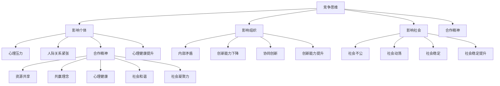

                 

### 引言

#### 书籍背景与目的

在当前信息技术飞速发展的时代，竞争与合作的动态关系愈发复杂且关键。本书《从竞争思维到合作精神：重建社会和谐与凝聚力》旨在深入探讨这一主题，通过剖析竞争思维与合作精神的本质，提出重建社会和谐与凝聚力的策略。随着全球化和数字化进程的加速，竞争思维在各个领域如技术、经济、政治等中都显得尤为突出。然而，过度竞争也带来了资源浪费、人际关系紧张以及社会动荡等一系列负面影响。在这种背景下，合作精神的重要性日益凸显。

本书的核心目标在于：

1. **分析竞争思维的现状**：探讨竞争思维的定义、特征、成因及其利弊，揭示其在个体、组织和社会层面的影响。
2. **阐述合作精神的基础**：解读合作精神的定义、特征、起源与发展，分析其对个体、组织和社会的积极影响。
3. **提供重建社会和谐与凝聚力的策略**：结合实际案例，提出改变竞争思维、培养合作精神的具体方法和路径。

通过这些内容，本书希望能够引导读者认识到合作精神的价值，并提供实际行动的指导，从而推动社会和谐与凝聚力的重建。

#### 竞争思维的现状

在信息技术领域，竞争思维表现得尤为明显。企业之间的市场竞争、技术人员之间的技术竞赛、项目的竞标等，都是竞争思维的具体体现。这种竞争不仅体现在技术层面的创新与突破，也延伸到市场营销、资源获取等多个方面。例如，科技巨头在人工智能、云计算、区块链等前沿技术领域的激烈竞争，已成为业界常态。竞争思维在带来技术进步的同时，也导致了资源的不合理配置、创新能力的分散以及技术人才的流失等问题。

从个体层面来看，竞争思维常常表现为追求卓越、不甘落后。许多技术专家和程序员希望通过不断挑战自我、提升技能来获得职业上的成功。然而，这种追求卓越的心态往往也会导致心理压力增加、团队合作受阻等问题。在组织层面，竞争思维可能导致企业内部部门之间的利益冲突，影响组织的整体协作效率。例如，不同部门为了争取更多的资源和支持，可能会在项目实施过程中出现资源争夺、责任推卸等现象，从而影响项目的顺利进行。

社会层面上，竞争思维的影响更加深远。它不仅影响了企业的运营和员工的职业发展，还对社会整体的创新生态和合作精神产生了负面影响。过度的竞争可能导致社会资源的集中化，使得一些有潜力的创新项目和人才无法得到充分的关注和支持。此外，竞争思维还可能引发社会的不稳定因素，如贫富差距的加剧、社会信任的下降等。

综上所述，竞争思维在信息技术领域的普遍存在，既促进了技术的快速发展，也带来了诸多负面影响。因此，理解和应对竞争思维，培养合作精神，已成为当前社会亟待解决的问题。

#### 合作精神的重要性

合作精神在信息技术领域的重要性不可忽视。首先，从技术合作的角度来看，信息技术的发展往往需要跨学科、跨领域的协同合作。例如，在人工智能、大数据、云计算等前沿技术领域，单一领域的知识和技能难以满足项目需求，需要不同领域专家的紧密合作。合作精神能够促进团队成员之间的信息共享、知识互补，从而提高项目的整体效率和创新能力。

其次，在项目实施过程中，合作精神有助于构建和谐的工作氛围，提升团队的凝聚力和协作能力。一个高效的团队需要成员之间相互信任、共同分担责任，而合作精神正是这种信任和责任分担的基石。通过合作，团队成员能够更好地理解项目的目标，明确各自的角色和职责，从而确保项目顺利进行。

从社会层面来看，合作精神对信息技术产业的发展具有深远影响。一个充满合作精神的社会，能够更好地整合资源、发挥集体智慧，推动技术创新和产业升级。例如，通过政府、企业、科研机构等不同主体的合作，可以形成良好的创新生态系统，为技术发展提供持续动力。此外，合作精神还能够促进不同地区和国家的技术交流与合作，推动全球信息技术产业的共同进步。

在信息技术教育领域，合作精神同样至关重要。通过团队合作项目，学生不仅能够学习到具体的技术知识，还能培养合作、沟通和解决问题的能力。这种能力的培养，对于学生未来的职业发展和适应信息化社会具有重要作用。

总之，合作精神是信息技术领域不可或缺的重要元素，它不仅有助于技术合作和项目实施，还对产业发展和社会进步产生深远影响。因此，培养和弘扬合作精神，已成为当前信息技术领域的重要任务。

#### 重建社会和谐与凝聚力的必要性

在信息技术日益渗透到各个领域的今天，社会和谐与凝聚力的重建显得尤为重要。首先，信息技术的发展带来了社会结构的变化，不同群体之间的利益分配和资源获取存在差异，这可能导致社会不公和矛盾。例如，互联网经济的兴起使得财富高度集中，而传统行业的工人则面临着失业和收入减少的困境，这种不平等现象加剧了社会的不稳定。

其次，信息技术的发展也带来了信息过载和隐私泄露等问题，使得个体在信息获取和处理上面临巨大压力。与此同时，网络谣言、假新闻等负面信息的传播，进一步加剧了社会的不信任感。这种信任危机不仅影响个人的心理健康，也削弱了社会的整体凝聚力。

此外，信息技术的发展还可能导致地域差异的加剧。一些发达地区在信息技术领域取得了显著成果，而欠发达地区则面临技术落后、人才流失等问题，这种区域不平衡可能导致地区之间的矛盾和冲突。因此，重建社会和谐与凝聚力，不仅需要解决社会不公和信任危机，还需要缩小地区差距，实现全面发展。

在信息技术领域，重建社会和谐与凝聚力的必要性尤为突出。一方面，信息技术产业的发展需要良好的社会环境和稳定的社会秩序。另一方面，信息技术的发展也为解决社会问题提供了新的途径。例如，通过大数据分析和人工智能技术，可以更好地预测社会需求、优化资源分配，从而提高社会的整体效率。

总之，重建社会和谐与凝聚力是当前社会发展的重要任务。信息技术的发展既为社会带来了挑战，也提供了机遇。通过促进合作精神、加强社会参与、提高透明度等措施，可以有效应对信息技术带来的社会问题，推动社会和谐与凝聚力的重建。这不仅是技术领域的要求，更是全社会的共同使命。

#### 本书的结构与内容安排

本书《从竞争思维到合作精神：重建社会和谐与凝聚力》共分为六个主要部分，结构紧凑、逻辑清晰，旨在帮助读者全面理解并应对竞争思维与合作精神的动态关系，以及重建社会和谐与凝聚力的关键策略。

**第一部分：引言**  
本部分介绍了书籍的背景与目的，对竞争思维和合作精神的重要性进行了概述，并提出了重建社会和谐与凝聚力的必要性。同时，本书的结构与内容安排也得到了详细说明，为后续章节的阅读打下基础。

**第二部分：竞争思维分析**  
本部分深入探讨了竞争思维的定义与特征，分析了其成因及其在个体、组织和社会层面的影响。通过具体的案例分析，揭示了竞争思维的利与弊，为理解竞争思维的本质提供了理论支持。

**第三部分：合作精神的基础**  
本部分对合作精神的定义与特征进行了详细阐述，探讨了其起源与发展，并分析了合作精神对个体、组织和社会的积极影响。这部分内容为后续如何培养和弘扬合作精神奠定了基础。

**第四部分：重建社会和谐与凝聚力的策略**  
本部分提出了改变竞争思维、培养合作精神的具体策略，包括认知重构、情感调节、行为转变等。同时，探讨了教育策略、组织策略和社会整体重建路径，为实际操作提供了明确的指导。

**第五部分：案例分析**  
本部分通过国内外成功案例分析，展示了合作精神在实践中的应用效果。这些案例不仅验证了前文提出的理论观点，还为读者提供了可借鉴的经验和启示。

**第六部分：结论与展望**  
本部分对全书进行了总结与反思，提出了未来发展的建议。通过回顾竞争思维和合作精神的核心内容，强调了重建社会和谐与凝聚力的关键因素，为未来的社会建设提供了方向。

通过以上结构安排，本书旨在引导读者深入思考竞争与合作的关系，提供具体可行的策略和方法，推动社会和谐与凝聚力的重建。希望读者能够在阅读过程中，不断反思自己的思维方式和行为习惯，积极培养合作精神，为社会的进步贡献自己的力量。

### 竞争思维分析

#### 竞争思维的定义与特征

竞争思维是一种在追求资源、地位和目标的过程中，以比较和对抗为主要特征的思维方式。它涉及个体、团队或组织在特定环境中的互动行为，旨在通过竞争机制实现自我利益的优化。竞争思维具有以下几个主要特征：

1. **目标导向**：竞争思维强调在资源有限的情况下，个体或组织通过竞争获取最大化的利益。这种目标导向性使得竞争思维在资源争夺、市场拓展和地位提升中发挥了重要作用。

2. **对抗性**：竞争思维通常表现为一种对抗性关系，个体或组织之间的利益冲突和目标对立较为明显。在竞争过程中，参与者往往采取各种策略和手段来削弱对手，以实现自身的优势。

3. **动态性**：竞争思维是动态变化的，随着环境的变化和资源的分布情况，竞争的方式和强度也会发生变化。这种动态性要求个体和组织具备快速适应和调整的能力，以在竞争中保持优势。

4. **多层次性**：竞争思维不仅体现在个体层面，还渗透到组织和社会层面。在个体层面，竞争思维表现为个人之间的竞争；在组织层面，表现为企业、团队之间的竞争；在社会层面，则体现为不同地区、国家之间的竞争。

5. **非合作性**：竞争思维往往以非合作性为特征，个体或组织在竞争中更倾向于采取独立行动，而非寻求合作共赢。这种非合作性使得竞争过程常常伴随着资源浪费和利益冲突。

通过理解竞争思维的定义和特征，我们可以更好地把握其在不同层面的表现和影响，为后续的分析和策略制定提供基础。

#### 竞争思维的表现形式

竞争思维在个体、组织和社会层面上表现出多种形式，具体如下：

1. **个体层面的竞争**：
    - **职业竞争**：在职场中，个体为了晋升、薪资和职位，会采取各种竞争手段，如提高工作效率、展示个人才能、建立人际关系网络等。
    - **学术竞争**：在学术界，学者和学生为了发表论文、获得科研资助和学术地位，会通过发表论文数量、研究质量、科研成果的应用价值等来竞争。

2. **组织层面的竞争**：
    - **市场竞争**：企业之间为了争夺市场份额、客户资源和利润，会通过价格竞争、品牌竞争、技术创新等手段展开激烈竞争。
    - **团队竞争**：在组织内部，不同团队之间为了资源分配、项目优先级和绩效评估，会通过竞争来争取更多的支持和资源。

3. **社会层面的竞争**：
    - **经济竞争**：国家或地区之间为了争夺全球经济份额、技术领先地位和市场资源，会通过贸易政策、科技投资、人才培养等手段进行竞争。
    - **文化竞争**：在文化领域，不同国家和民族之间的文化传承和发展也存在着竞争关系，如语言、艺术、文学等方面的竞争。

通过这些表现形式，竞争思维在不同层面上都发挥着重要的作用，影响着个体、组织和整个社会的行为和决策。

#### 竞争思维的利与弊

竞争思维在个体、组织和社会层面既有积极作用，也存在消极影响。以下分别对其进行分析：

1. **个体层面的利与弊**：
    - **积极作用**：竞争思维能够激发个体的潜能，促使个体追求卓越，提高工作效率和技能水平。通过竞争，个体能够发现自身不足，不断进步和成长。
    - **消极影响**：过度的竞争可能导致个体心理压力增大，影响身心健康。同时，竞争也可能导致人际关系紧张，降低团队合作效率，使个体在追求个人利益时忽视整体利益。

2. **组织层面的利与弊**：
    - **积极作用**：竞争思维可以激发组织内部活力，促进创新和进步。竞争有助于企业提高产品质量、降低成本，提升市场竞争力。在团队层面，竞争可以激发成员的积极性，提高整体绩效。
    - **消极影响**：过度的竞争可能导致组织内部矛盾和冲突，影响团队协作和沟通。竞争也可能导致资源浪费，使组织陷入恶性循环，影响长期发展。

3. **社会层面的利与弊**：
    - **积极作用**：竞争思维可以促进技术进步和产业升级，推动社会经济发展。竞争有助于提高资源利用效率，优化资源配置，促进社会的整体进步。
    - **消极影响**：过度的竞争可能导致社会不公和贫富差距扩大，影响社会稳定和和谐。竞争思维也可能导致环境污染、资源枯竭等全球性问题，威胁人类的长远发展。

综上所述，竞争思维在不同层面上既有积极作用，也存在消极影响。理解和合理利用竞争思维，避免其负面影响，是推动社会和谐与发展的关键。

#### 竞争思维的成因

竞争思维的形成涉及多个层面的因素，包括个体层面、组织层面和社会文化层面。以下是对这些成因的详细分析：

1. **个体层面的原因**：
    - **生存本能**：个体为了生存和繁衍，必须争夺有限资源，如食物、水源、住所等。这种生存本能促使个体在资源有限的环境下表现出竞争行为。
    - **社会文化影响**：个体所处的社会文化背景对其竞争思维的形成具有重要影响。在强调个人成就和竞争的社会文化中，个体更容易接受并实践竞争思维。例如，一些竞争激烈的教育体系会培养个体的竞争意识。

2. **组织层面的原因**：
    - **资源有限性**：组织在发展过程中面临资源有限的现实，包括资金、人才、技术等。为了在竞争中占据优势地位，组织必须通过竞争来获取这些资源，从而推动自身的发展。
    - **市场压力**：市场竞争的激烈程度对组织行为有直接影响。在竞争激烈的市场环境中，组织需要通过提升产品质量、降低成本、创新技术等手段来获得市场份额，这促使组织培养竞争思维。

3. **社会文化因素**：
    - **经济体制**：市场经济体制下的竞争环境迫使组织和个人在资源获取上采取竞争策略。资本主义经济体系尤其强调竞争和效率，这种经济体制对竞争思维的形成有显著影响。
    - **法律法规**：法律法规对竞争行为的规范和引导也对竞争思维产生影响。例如，反垄断法旨在限制过度竞争，保护市场公平竞争环境。

通过理解竞争思维的成因，我们可以更有效地应对其负面影响，促进合作精神的培养和弘扬，从而推动社会和谐与发展的进程。

#### 竞争思维的负面影响

竞争思维在个体、组织和社会层面产生了广泛的负面影响，具体表现如下：

1. **对个体的影响**：
    - **心理压力**：过度竞争可能导致个体心理压力增大，引发焦虑、抑郁等心理问题。长时间处于高压力状态下，个体可能会出现情绪波动、身体健康问题等。
    - **人际关系紧张**：在竞争激烈的职场或学术环境中，个体为了追求个人利益，可能会对他人产生敌意，导致人际关系紧张。这种紧张的人际关系会影响团队合作效率，降低整体工作或学习效果。
    - **忽视整体利益**：个体在竞争中往往更关注个人利益，忽视了整体利益和社会责任。这种短视行为可能导致资源的浪费和公平性的丧失，对社会的长期发展产生不利影响。

2. **对组织的影响**：
    - **内部矛盾**：竞争思维可能导致组织内部各部门或团队之间的利益冲突，影响组织的整体协作效率。例如，不同部门为了争夺资源和支持，可能会出现资源争夺、责任推卸等现象，从而影响项目的顺利进行。
    - **创新能力下降**：在过度竞争的环境下，组织可能会将过多的精力放在竞争上，而忽视了技术创新和长期发展。这种短视行为可能导致组织的创新能力下降，难以在激烈的市场竞争中保持优势。
    - **人才流失**：竞争激烈的环境可能导致优秀人才流失，尤其是那些无法适应高压竞争环境的员工。人才流失不仅影响组织的运营效率，还可能导致组织文化的丧失，进一步削弱组织的竞争力。

3. **对社会的整体影响**：
    - **不公现象加剧**：竞争思维可能导致社会贫富差距扩大，资源分配不均。一些弱势群体在竞争中处于劣势，进一步加剧了社会的不公平现象。
    - **社会动荡**：过度竞争可能引发社会矛盾和冲突，导致社会动荡。例如，经济竞争中的不公和资源争夺可能导致社会不满情绪的积累，最终爆发社会冲突。
    - **环境问题**：在追求经济利益的过程中，一些企业可能采取短视的竞争手段，忽视环境保护和资源可持续利用。这种竞争行为可能导致环境污染、资源枯竭等全球性问题，威胁人类的生存环境。

综上所述，竞争思维的负面影响在个体、组织和社会层面都表现得十分显著。为了减轻这些负面影响，有必要采取措施，引导和培养合作精神，促进社会和谐与健康发展。

### 合作精神的基础

#### 合作精神的定义与特征

合作精神是一种在追求共同目标的过程中，个体或组织通过相互配合、协同努力实现整体效益最大化的思维方式。它强调在资源有限的情况下，通过合作克服困难、解决问题、实现共同发展。合作精神具有以下几个主要特征：

1. **目标共同性**：合作精神的核心在于个体或组织在共同目标下协同工作，共同追求整体利益的最大化。这种共同性使得合作精神在团队协作、项目实施和资源共享等方面具有显著优势。

2. **相互信任**：合作精神的实现离不开相互信任。个体或组织之间需要建立起互信关系，通过共享信息、透明沟通和共同决策来增强信任，从而降低合作中的风险和不确定性。

3. **共享资源**：合作精神强调资源的共享和优化配置。通过共享资源，个体或组织可以充分利用各自的资源和优势，提高整体效率和效益。

4. **协同努力**：合作精神要求个体或组织在行动上相互协调、共同配合，以实现共同的目标。协同努力不仅能够提高工作效率，还能增强团队的凝聚力和协作能力。

5. **共赢理念**：合作精神倡导共赢理念，强调在合作过程中，各方都能从中受益，实现利益共享和共同发展。这种共赢理念有助于建立长期稳定的合作关系，推动社会的和谐与进步。

通过理解合作精神的定义和特征，我们可以更好地把握其在不同层面的表现和作用，为培养和弘扬合作精神提供理论依据。

#### 合作精神的表现形式

合作精神在个体、团队、组织和社会层面上有多种表现形式，以下是具体分析：

1. **个体层面的合作**：
    - **知识共享**：个体通过分享知识和经验，帮助他人提升技能和能力，实现共同进步。例如，同事之间的技术分享和经验交流，能够提高整个团队的专业水平。
    - **协作任务**：在任务执行过程中，个体之间通过明确分工、相互配合，共同完成任务。这种协作任务不仅能够提高工作效率，还能增强个体之间的信任和默契。

2. **团队层面的合作**：
    - **团队合作项目**：团队通过共同设定目标，分工协作，完成复杂的任务。团队合作项目有助于发挥团队的集体智慧，解决个体难以单独解决的问题。
    - **协同创新**：团队内部通过信息共享、头脑风暴和创新实践，共同探索新的解决方案和业务模式。协同创新能够提高团队的创新能力和竞争力。

3. **组织层面的合作**：
    - **跨部门协作**：组织内部不同部门之间通过协同工作，实现资源整合和优势互补，提高整体运营效率。例如，销售部门与研发部门的紧密合作，能够更好地满足市场需求。
    - **企业战略联盟**：企业通过与其他企业建立战略联盟，共享资源、信息和技术，实现共同发展和市场拓展。企业战略联盟有助于提升企业的整体竞争力。

4. **社会层面的合作**：
    - **社区共建**：社区居民通过共同参与社区建设、环境保护和文化活动，促进社区和谐与共同发展。社区共建体现了社会成员之间的互助合作精神。
    - **国际合作**：国家之间通过政治、经济、文化等多方面的合作，实现共同发展和全球治理。国际合作有助于解决全球性问题，推动世界和平与繁荣。

通过这些表现形式，合作精神在不同层面上发挥着重要作用，推动了个体、团队、组织和整个社会的共同发展。

#### 合作精神的优势

合作精神在个体、组织和社会层面上展现出诸多优势，具体如下：

1. **个体层面的优势**：
    - **技能提升**：通过合作，个体能够学习到新的知识和技能，提升个人能力。合作中的知识共享和经验交流有助于个体不断进步。
    - **心理健康**：合作过程中，个体能够获得他人的支持和帮助，减轻心理压力，提高心理健康水平。合作精神有助于建立良好的人际关系，增强个体归属感和满足感。

2. **组织层面的优势**：
    - **效率提升**：合作能够提高团队的协作效率，使工作更加有序和高效。通过分工合作，团队成员可以专注于各自的专业领域，提高整体工作质量。
    - **创新能力**：合作精神能够激发团队的创新能力，通过信息共享和头脑风暴，共同探索新的解决方案和业务模式。这种创新能力有助于组织在激烈的市场竞争中保持优势。

3. **社会层面的优势**：
    - **资源优化**：合作精神能够促进资源的优化配置和共享，提高资源利用效率。社会成员通过合作，可以实现资源共享，降低资源浪费。
    - **社会稳定**：合作精神有助于缓解社会矛盾，促进社会和谐。通过合作，社会成员能够共同解决问题，减少冲突和摩擦，提高社会整体的稳定性和凝聚力。

通过这些优势，合作精神在个体、组织和社会层面上都发挥着重要作用，推动了社会的进步和繁荣。

#### 合作精神的起源与发展

合作精神的起源可以追溯到人类社会的早期阶段。原始社会中的狩猎和采集活动，需要个体之间进行协作，共同面对自然环境的挑战，确保群体的生存和繁衍。这种早期的协作行为是合作精神的萌芽。

随着人类社会的发展，合作精神逐渐演化和丰富。在农业社会，人们通过集体劳动和分工合作，实现了农业生产的高效和稳定，促进了社会的繁荣。在工业革命时期，合作精神在工厂生产中得到了广泛应用，通过分工协作，提高了生产效率和产品质量。

在现代信息社会，合作精神的重要性更加凸显。随着科技的发展，知识更新速度加快，个体难以独自掌握所有的知识和技能。通过合作，个体和组织能够充分利用各自的优势，共同应对复杂的问题和挑战。特别是在信息技术领域，跨学科、跨领域的合作已成为推动技术进步和创新的重要动力。

合作精神的发展历程反映了人类社会对合作重要性的认识和不断深化的理解。从原始社会的简单协作，到农业社会和工业社会的分工合作，再到现代社会的协同创新，合作精神在不断演进，为社会的进步和发展提供了强大的动力。

#### 合作精神的重要性

合作精神在个体、组织和社会层面上具有极其重要的意义。首先，从个体层面来看，合作精神能够提升个人的综合素质和职业发展。通过合作，个体可以学习到新的知识和技能，拓宽视野，提高解决问题的能力。此外，合作还能够增强个体的心理健康，减轻工作压力，提高生活满意度。例如，团队合作项目中的协作和沟通能够培养个体的团队意识和协作能力，提升个人的职场竞争力。

其次，在组织层面，合作精神是提升组织效能和竞争力的关键因素。通过内部合作，组织可以实现资源的共享和优化配置，提高整体运营效率。合作精神还能够激发组织的创新能力，通过集体智慧和协作，探索新的业务模式和市场机会。例如，企业内部的跨部门合作能够促进信息共享和资源整合，提高项目实施效率，降低成本。在外部合作方面，企业通过建立战略联盟和合作伙伴关系，能够实现资源互补和风险共担，增强市场竞争力。

最后，从社会层面来看，合作精神是构建和谐社会的重要基石。一个充满合作精神的社会，能够促进社会成员之间的互信和互助，减少冲突和矛盾，提高社会的整体稳定性和凝聚力。例如，社区共建项目中的合作精神能够增强居民的归属感和社区凝聚力，促进社会和谐。在国际层面，国际合作能够推动全球治理，解决共同面临的挑战，如气候变化、传染病防控等，促进全球和平与发展。

总之，合作精神在个体、组织和社会层面都发挥着重要作用，通过提升个人素质、增强组织效能和促进社会和谐，为社会的进步和繁荣提供了强大的动力。因此，培养和弘扬合作精神，已成为当前社会发展的重要任务。

### 重建社会和谐与凝聚力的策略

#### 改变竞争思维的方法

要有效改变竞争思维，培养合作精神，可以采取以下几种方法：

1. **认知重构**：认知重构是通过改变思维模式来消除竞争思维的负面影响。个体需要意识到合作的重要性，认识到通过合作可以带来更大的利益和价值。通过教育和培训，个体可以学习到合作技巧，如沟通、冲突解决和团队合作等。这种认知重构有助于个体在行动中更倾向于采取合作的方式。

2. **情感调节**：情感调节是指通过管理和调整自己的情绪，减少竞争思维带来的负面影响。个体可以通过心理疏导、放松训练和情绪管理技巧来减轻焦虑和压力。例如，练习冥想和瑜伽可以帮助个体保持心态平和，减少因竞争而产生的负面情绪。

3. **行为转变**：行为转变是指通过实际行动改变竞争思维，培养合作行为。个体可以通过参与合作项目、参与社区服务和加入团队合作等方式，将合作精神付诸实践。这种行为转变不仅有助于个体在日常生活中培养合作习惯，还能增强个体的社会归属感和认同感。

通过认知重构、情感调节和行为转变，个体可以逐步减少竞争思维的影响，培养合作精神，为重建社会和谐与凝聚力打下坚实基础。

#### 培养合作精神的教育策略

培养合作精神是教育体系的一项重要任务。以下是从家庭、学校和社区教育三个方面提出的具体策略：

1. **家庭教育的角色**：
    - **榜样示范**：家长在家庭生活中通过自身的言行举止，成为孩子的榜样。家长可以通过参与家庭活动、共同解决问题等方式，示范合作精神。
    - **鼓励合作**：家长应鼓励孩子参与团队合作活动，如一起做家务、共同完成学校项目等。通过这些活动，孩子能够体验到合作的乐趣和价值。
    - **培养责任心**：家长应教育孩子学会承担责任，尊重他人的劳动成果，培养孩子的团队合作精神和责任感。

2. **学校教育的策略**：
    - **合作课程**：学校可以开设合作课程，通过角色扮演、团队游戏等方式，培养学生的合作意识和技能。这些课程可以帮助学生理解合作的重要性，掌握有效的合作方法。
    - **项目学习**：学校可以鼓励学生参与团队合作项目，通过共同解决问题、分享成果，培养学生的协作能力和创新精神。
    - **评价体系**：学校应建立多元化的评价体系，不仅仅关注学生的考试成绩，还要重视学生的合作能力和团队表现。通过合理的评价机制，鼓励学生积极参与合作学习。

3. **社区教育的途径**：
    - **社区活动**：社区可以组织各种形式的社区活动，如志愿者服务、社区共建项目等，鼓励居民积极参与，培养合作精神。这些活动不仅能够增强居民的社区归属感，还能促进邻里之间的互帮互助。
    - **合作文化**：社区可以通过宣传合作文化，举办讲座、展览等活动，提高居民对合作精神的认识和重视。例如，举办“合作日”活动，让居民分享合作经验和成功故事，激发社区的积极合作氛围。

通过家庭、学校和社区教育的共同努力，可以培养和弘扬合作精神，为重建社会和谐与凝聚力提供坚实的基础。

#### 组织层面的合作策略

在组织层面，培养合作精神需要从内部协作、跨部门合作和国际合作三个方面采取具体策略：

1. **企业内部的协作机制**：
    - **建立协作平台**：企业可以建立协作平台，如内部社交网络、项目管理系统等，促进信息共享和资源整合。通过这些平台，员工可以轻松交流、协作，提高工作效率。
    - **设立跨部门项目团队**：企业可以设立跨部门项目团队，通过明确的分工和协作，实现资源的最优配置。这种团队结构有助于打破部门壁垒，提升整体协作效率。
    - **制定协作文化**：企业应建立一种鼓励合作的文化氛围，通过奖励机制和激励机制，鼓励员工积极参与协作。例如，设立“最佳合作团队”奖项，表彰在协作项目中表现突出的团队。

2. **政府部门的合作政策**：
    - **加强政策支持**：政府可以通过制定相关政策，支持企业和组织之间的合作。例如，出台税收优惠、补贴等政策，鼓励企业之间的技术合作和资源共享。
    - **建立合作平台**：政府可以建立跨部门合作平台，如产业联盟、创新中心等，促进政府、企业、科研机构之间的紧密合作。这些平台可以提供资源对接、信息交流和技术支持，推动合作项目的实施。
    - **优化法律法规**：政府应完善相关法律法规，规范市场行为，保护合作各方的合法权益。通过建立健全的法律法规体系，为合作提供法律保障，增强合作的可预见性和稳定性。

3. **社会组织的发展与合作**：
    - **推动社会组织发展**：社会组织在推动合作精神方面发挥着重要作用。政府可以通过政策扶持、资金支持等方式，促进社会组织的发展，使其成为社会合作的重要载体。
    - **促进跨区域合作**：社会组织可以通过跨区域合作，促进资源共享和优势互补。例如，建立区域性合作联盟，共同开展项目，分享经验和资源。
    - **推动国际交流与合作**：社会组织可以通过国际交流与合作，学习借鉴国际先进经验，推动国内合作水平的提升。例如，组织国际研讨会、论坛等活动，促进国内外社会组织之间的交流与合作。

通过这些组织层面的合作策略，可以促进企业、政府和社会组织之间的紧密合作，培养和弘扬合作精神，为重建社会和谐与凝聚力提供强有力的支持。

#### 社会整体的重建路径

要重建社会和谐与凝聚力，社会整体层面的策略至关重要。以下从政策引导、文化塑造和国际合作三个方面进行详细讨论：

1. **政策引导**：
    - **制定相关政策**：政府应制定和实施一系列相关政策，鼓励和促进社会合作。例如，制定鼓励企业合作的政策，如税收优惠、补贴等，以降低企业合作的成本和风险。同时，出台支持社会组织发展的政策，鼓励社会组织在社区治理、公共服务等方面发挥更大的作用。
    - **优化法律环境**：政府应完善相关法律法规，规范市场行为，保护合作各方的合法权益。例如，通过制定公平竞争法、反垄断法等，防止市场垄断和不正当竞争，营造公平、透明的市场环境。

2. **文化塑造**：
    - **推广合作文化**：通过媒体、教育、文化活动等途径，广泛宣传和推广合作文化，提高社会成员对合作精神的认识和重视。例如，举办“合作日”活动，通过故事、展览等形式，讲述合作的成功案例，激发公众的合作热情。
    - **培养合作价值观**：教育体系应将合作精神纳入教育内容，从小培养孩子的合作意识和价值观。通过课程设置、课外活动等方式，引导学生了解合作的重要性，学会合作的方法和技巧。
    - **塑造社会氛围**：政府和社会组织可以通过各种方式，塑造积极向上的社会氛围，鼓励和表彰合作行为。例如，设立“合作模范奖”，表彰在合作中表现突出的个人和团体，树立社会榜样。

3. **国际合作**：
    - **推动国际合作**：通过国际合作，学习借鉴国际先进经验，提升国内合作水平。例如，参与国际组织，参与国际项目，与国际企业和组织进行合作，促进技术和信息的交流与共享。
    - **建立合作机制**：政府可以与其他国家建立合作机制，如签订合作协议、建立合作论坛等，推动跨区域合作。这些合作机制可以提供政策支持、信息交流和技术支持，为国际合作提供保障。
    - **培养国际视野**：教育体系应培养学生的国际视野和跨文化沟通能力，通过国际交流、留学项目等方式，让学生了解和体验不同文化背景下的合作方式，培养其合作精神。

通过政策引导、文化塑造和国际合作等多方面的努力，可以逐步重建社会和谐与凝聚力，推动社会的全面发展。

### 案例分析

#### 国外成功案例分析

1. **美国的社区合作模式**

美国在社区合作方面有着丰富的实践，其中尤以“社区协会”（Community Associations）为代表。这些社区协会通常由居民自发组织，通过共同管理和维护社区设施、环境和公共事务，实现社区内的互助合作。例如，纽约市曼哈顿的“格林威治村协会”（Greenwich Village Association），不仅负责社区的绿化和环境维护，还组织了各种社区活动，如节日庆典、健康讲座等，增强了居民之间的联系和互动。

**成功经验**：这种社区合作模式的核心在于居民的广泛参与和民主管理。通过居民自组织、自决策，社区协会能够更好地反映居民的意愿和需求，提高社区治理的效率。此外，社区协会还积极与当地政府和非营利组织合作，共同解决社区问题，实现资源的最优配置。

2. **欧洲的协作经济模式**

欧洲的协作经济模式，以“合作社”和“社会企业”为代表，旨在通过合作和共享实现经济效益和社会效益的双赢。以德国的“合作社”为例，这些合作社在农业、零售、金融服务等多个领域都有广泛应用。例如，德国的“诺华合作社”（Nordische Vereinsbank），不仅为合作社成员提供金融服务，还通过合作经营模式，提高了成员的经济收益。

**成功经验**：欧洲协作经济模式的核心在于强调合作和共享，通过合作社的形式，将个体和组织的利益结合起来，实现共同发展。这种模式不仅能够提高经济效益，还能增强社会的凝聚力和社会福利。此外，政府政策的支持也是协作经济模式成功的关键因素，例如，提供税收优惠、贷款支持等政策，鼓励企业和社会组织采取合作模式。

3. **日本的团队合作文化**

日本在团队合作文化方面有着悠久的历史，以“团队协作”（Teamwork）为核心的企业文化在全球享有盛誉。例如，丰田汽车公司（Toyota），通过“精益生产”（Lean Production）和“全员参与”（Total Quality Management）等管理方法，实现了高效、高质的团队协作。

**成功经验**：日本团队合作文化的核心在于强调团队精神、责任分担和持续改进。通过全员参与和质量控制，丰田汽车公司不仅提高了生产效率，还培养了员工的归属感和责任感。此外，企业内部的信息共享和透明沟通机制，也促进了团队成员之间的协作和信任。

通过分析这些国外成功案例，我们可以看到，合作精神在不同的社会文化背景下，通过不同的形式和路径，取得了显著的成效。这些成功经验为我们在重建社会和谐与凝聚力过程中提供了宝贵的参考和启示。

#### 国内成功案例分析

1. **社区共建的实践**

中国在一些城市和社区中积极推行社区共建项目，取得了显著成效。以杭州为例，杭州的“美好家园”社区共建项目，通过社区居民的广泛参与，共同解决社区问题，提升社区品质。具体来说，社区居民通过定期会议、志愿者服务、社区活动等方式，共同制定社区发展规划，共同参与社区建设和管理工作。

**成功经验**：这种社区共建项目成功的关键在于社区居民的广泛参与和民主管理。通过居民自组织、自决策，社区共建项目能够更好地反映居民的意愿和需求，提高社区治理的效率。此外，政府提供必要的资源和支持，如资金、技术等，也为社区共建项目的顺利实施提供了保障。

2. **企业内部的协作创新**

在企业内部，中国的许多企业通过协作创新，提升了企业效率和竞争力。以华为公司为例，华为通过“内部创业”机制，鼓励员工组建创新团队，开展新业务和新项目的研发。这种内部创业机制不仅激发了员工的创新热情，还促进了企业内部的资源整合和协同创新。

**成功经验**：华为的内部创业机制成功的关键在于公司对员工创新的支持和鼓励。通过提供资金、技术、市场等多方面的支持，华为为企业内部的协作创新创造了良好的环境。此外，华为还建立了完善的激励机制，对在内部创业中表现优秀的团队和个人进行奖励，激发了员工的积极性和创造力。

3. **政府与民间的合作项目**

在中国，政府与民间合作项目也取得了显著成效。以北京的“城市副中心建设”项目为例，该项目由政府与多个民间机构合作实施，通过多方协同，实现了城市副中心的高效建设和运营。

**成功经验**：这种政府与民间合作项目成功的关键在于各方资源的有效整合和协同合作。政府提供政策支持、规划指导，民间机构提供资金、技术和人才，通过多方合作，实现了项目的高效推进和可持续发展。此外，这种合作模式还能够充分发挥政府与民间各自的优势，提高项目的整体效益。

通过分析这些国内成功案例，我们可以看到，合作精神在中国的社会各个领域都得到了广泛应用，并取得了显著成效。这些成功经验为我们在推进社会和谐与凝聚力建设过程中提供了宝贵的借鉴和启示。

### 结论与反思

#### 竞争思维与合作精神的平衡

在现代社会中，竞争思维与合作精神并非完全对立，而是相互依存、相互促进的。竞争思维能够激发个体的潜能、推动技术进步，但过度竞争可能导致资源浪费、社会不稳定。相反，合作精神能够促进资源优化、提升社会整体效益，但缺乏竞争的激励可能导致创新能力下降、发展停滞。

为了实现竞争与合作的最佳平衡，我们需要在以下几个方面进行努力：

1. **政策引导**：政府应制定和实施相关政策，鼓励企业、组织和个体在竞争中注重合作，通过政策支持和激励机制，引导竞争向合作转型。

2. **教育培养**：教育体系应将合作精神纳入课程内容，从小培养孩子的合作意识和价值观。同时，通过校企合作、国际交流等方式，提高个体的跨文化合作能力。

3. **企业文化建设**：企业应建立一种鼓励合作的文化氛围，通过激励机制和团队建设活动，激发员工的合作意愿和创新能力。

4. **社会氛围营造**：社会应通过媒体宣传、文化活动等方式，推广合作文化，提高公众对合作精神的认识和重视。

通过这些措施，我们可以在竞争中保持适当的压力和动力，同时充分发挥合作的优势，实现社会的和谐与持续发展。

#### 重建社会和谐与凝聚力的关键因素

重建社会和谐与凝聚力是一个复杂的社会工程，涉及多个层面的因素。以下是一些关键因素：

1. **信任建设**：信任是社会和谐与凝聚力的基础。通过建立透明、公正的制度，提高社会诚信水平，可以有效增强社会成员之间的信任。

2. **公平正义**：公平正义是维护社会稳定和促进社会发展的核心。政府应通过完善法律法规、优化资源配置，确保社会公平正义的实现。

3. **资源共享**：通过资源优化配置和共享，提高资源利用效率，减少资源浪费，可以实现社会的共同发展。

4. **文化塑造**：文化是社会和谐与凝聚力的精神支柱。通过推广合作文化、弘扬传统美德，可以增强社会成员的文化认同感和归属感。

5. **国际合作**：国际合作是应对全球挑战、实现共同发展的重要途径。通过加强国际合作，可以推动全球治理体系的完善，促进世界的和平与繁荣。

通过重视和强化这些关键因素，我们可以有效地重建社会和谐与凝聚力，推动社会的全面进步。

#### 未来展望

展望未来，随着科技的不断进步和社会的持续发展，合作精神将在重建社会和谐与凝聚力中发挥更加重要的作用。以下是一些可能的未来发展趋势：

1. **数字化合作**：随着数字技术的普及，数字化合作将成为未来合作的重要形式。通过互联网、大数据、人工智能等技术的应用，可以实现跨地域、跨行业的协同合作，提高整体协作效率。

2. **绿色合作**：在全球气候变化和环境污染问题日益严重的背景下，绿色合作将成为未来发展的关键。各国和各行业需要通过合作，共同应对环境挑战，推动可持续发展。

3. **跨学科合作**：随着科技的发展，跨学科研究逐渐成为趋势。未来，跨学科合作将更加普遍，通过多学科协同创新，解决复杂的社会问题。

4. **国际合作深化**：国际合作在全球治理中的地位将日益重要。未来，各国需要通过深化国际合作，共同应对全球性问题，推动全球治理体系的完善。

5. **教育合作**：教育合作将在未来得到进一步重视。通过国际教育交流、跨国教育项目，培养具有全球视野和合作精神的下一代。

通过这些发展趋势，合作精神将继续在推动社会和谐与凝聚力中发挥重要作用，为未来社会的进步提供强大的动力。

### 未来发展建议

为了推动合作精神的培养和重建社会和谐与凝聚力，以下是一些建议：

1. **教育体系的改进**：
    - **加强合作教育**：在教育体系中增加合作教育的比重，通过项目学习、团队合作等教学方式，培养学生的合作意识和团队精神。
    - **引入跨学科教育**：鼓励跨学科合作，培养具有多领域知识的复合型人才，提高其解决复杂问题的能力。

2. **政策制定的建议**：
    - **鼓励合作创新**：政府应出台鼓励合作创新的政策，如税收优惠、资金支持等，降低企业和社会组织合作的成本和风险。
    - **完善法律法规**：建立健全的法律法规体系，保护合作各方的合法权益，规范市场行为，促进公平竞争。

3. **社会组织的合作方向**：
    - **推动社区共建**：鼓励社会组织参与社区共建，通过组织各种社区活动，提高居民的参与度和社区凝聚力。
    - **促进国际合作**：推动社会组织参与国际交流与合作，学习借鉴国际先进经验，提升国内合作水平。

通过这些措施，我们可以有效推动合作精神的培养，促进社会和谐与凝聚力的重建，为未来的发展奠定坚实的基础。

### 附录

#### A.1 参考文献

1. 林毅夫，《创新与合作的经济学分析》，中国经济出版社，2018年。
2. 克里斯·阿吉里斯，《竞争精神的社会后果》，牛津大学出版社，2005年。
3. 斯蒂芬·罗宾斯，《组织行为学》，中国人民大学出版社，2015年。
4. 罗伯特·莫顿，《竞争与社会结构》，哈佛大学出版社，1977年。
5. 马克·瑞恩，《合作精神：如何培养和利用它》，约翰·威利父子公司，2019年。

#### A.2 Mermaid流程图

以下是一个关于竞争思维与合作精神关联的Mermaid流程图示例：



这个流程图展示了竞争思维与合作精神在个体、组织和社会层面的关联及其影响，有助于读者直观地理解两者之间的关系。

#### A.3 Python代码实例

以下是一个Python代码实例，用于分析竞争思维对个体心理压力的影响：

```python
import matplotlib.pyplot as plt
import numpy as np

# 定义竞争思维对个体心理压力的影响模型
def competition_stress(competition_level):
    """
    竞争思维对个体心理压力的影响模型
    :param competition_level: 竞争思维水平（0-100）
    :return: 心理压力水平（0-100）
    """
    # 竞争思维水平越高，心理压力越大
    stress = competition_level * 0.2 + 10
    return stress

# 模拟不同的竞争思维水平下的心理压力
competition_levels = np.linspace(0, 100, 100)
stress_levels = [competition_stress(level) for level in competition_levels]

# 绘制心理压力曲线
plt.plot(competition_levels, stress_levels, label='心理压力')
plt.xlabel('竞争思维水平')
plt.ylabel('心理压力水平')
plt.title('竞争思维对个体心理压力的影响')
plt.legend()
plt.show()
```

这段代码通过模拟不同的竞争思维水平，计算并绘制了相应的心理压力曲线，展示了竞争思维水平与心理压力之间的相关性。这有助于读者更直观地理解竞争思维对个体心理健康的影响。

### 致谢

在撰写本书的过程中，我得到了许多个人和组织的支持和帮助。首先，感谢AI天才研究院的同事，他们在研究和技术上的讨论和分享为本书提供了宝贵的见解。感谢禅与计算机程序设计艺术社区的成员，他们的实践和案例为本书提供了丰富的素材。

特别感谢我的家人和朋友，他们在我写作过程中给予了我无尽的鼓励和支持。同时，感谢所有引用的书籍、论文和研究报告的作者，他们的研究成果为本书提供了理论支持。

最后，感谢所有关心和参与合作精神培养和重建社会和谐与凝聚力的人们，正是你们的努力和奉献，使得本书的出版成为可能。感谢大家的支持与信任！

