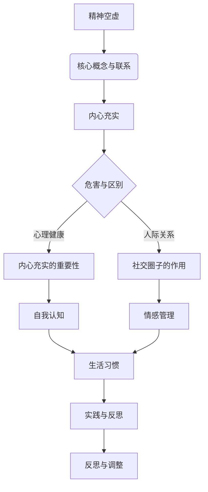
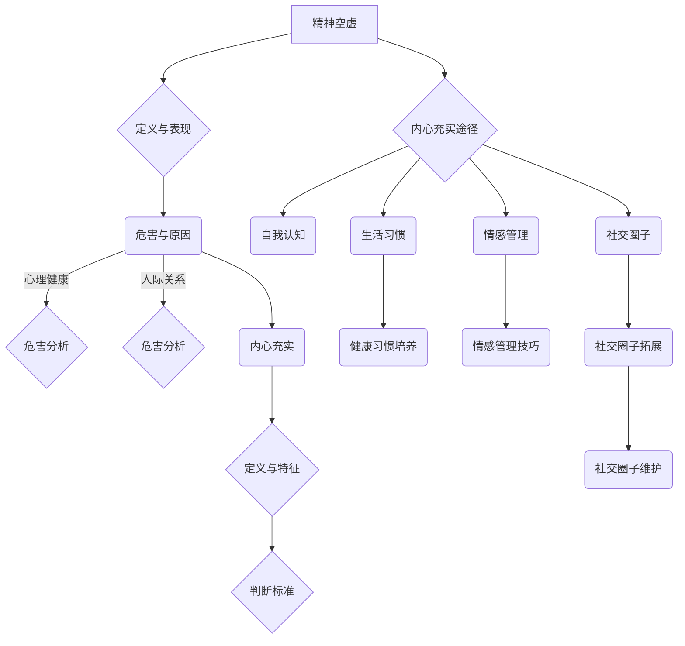

                 

# 从精神空虚到内心充实：个人成长的转变

> 关键词：精神空虚、内心充实、个人成长、自我认知、情感管理、生活习惯、社交圈子

> 摘要：本文将从精神空虚的定义、表现形式和危害入手，深入探讨内心充实的概念及其与精神空虚的区别。接着，我们将介绍提升自我认知、增强情感管理能力、培养健康生活习惯和拓展社交圈子的方法，以实现个人内心的转变。最后，通过实践案例和反思，总结出实现内心充实的关键因素和策略。

## 第一部分：认识精神空虚

### 1.1 精神空虚的定义与表现

精神空虚是一种主观感受，指的是个体在心理上感到无聊、孤独、无意义和缺乏目标的状态。精神空虚的表现形式多种多样，常见的包括：

- 沉迷于虚拟世界，如网络游戏、社交媒体等；
- 感到生活乏味，缺乏兴趣和激情；
- 对未来的不确定性感到焦虑和恐惧；
- 社交圈子狭小，缺乏深层次的人际交往；
- 心理问题，如焦虑、抑郁等。

精神空虚的原因复杂多样，主要包括以下几点：

- 个人价值观缺失，缺乏人生目标；
- 生活压力大，难以应对各种挑战；
- 社交圈子狭小，缺乏情感支持；
- 工作或学习上的挫折，导致成就感缺失；
- 心理素质较差，难以承受负面情绪。

### 1.2 精神空虚的危害

精神空虚对个体的心理健康、人际关系和生活质量产生严重危害，主要表现在以下几个方面：

- 心理健康危害：精神空虚可能导致抑郁、焦虑等心理问题，影响心理健康。研究表明，精神空虚与抑郁、焦虑等心理问题呈显著正相关。
  
- 人际关系危害：精神空虚使人更容易感到孤独、焦虑和沮丧，进而影响与他人的交往。长期的社交孤立可能导致人际关系恶化，进一步加剧精神空虚感。

- 生活质量危害：精神空虚使人难以体验到生活的乐趣，降低生活质量。研究表明，精神空虚与生活满意度呈显著负相关。

### 1.3 精神空虚与内心充实的区别

内心充实是指个体在心理上感到满足、有目标、有意义和有成就感的状态。与精神空虚相比，内心充实具有以下几个特点：

- 有明确的人生目标和价值观；
- 积极的情感体验，如快乐、满足、幸福等；
- 具有丰富的社交圈子，与他人保持良好的关系；
- 有成就感，能够克服困难和挑战；
- 具有较强的心理素质，能够应对负面情绪。

### 1.4 如何判断自己是否内心充实

要判断自己是否内心充实，可以参照以下标准：

- 拥有明确的人生目标和价值观；
- 对自己的生活感到满意，能够感受到快乐和幸福；
- 有积极的情感体验，如快乐、满足等；
- 具有丰富的社交圈子，与他人保持良好的关系；
- 能够克服困难和挑战，有成就感。

## 第二部分：寻找内心充实的途径

### 2.1 提升自我认知

自我认知是指个体对自己心理状态、能力、需求和价值观的认识。提升自我认知是实现内心充实的重要途径。以下方法有助于提升自我认知：

- 反思：定期进行自我反思，思考自己的优点、不足、需求和价值观，有助于更好地认识自己。
- 沟通：与他人交流，倾听他人的意见和看法，有助于从不同角度了解自己。
- 倾听：学会倾听他人的意见和看法，有助于理解自己的情感和需求。
- 调查：通过问卷调查、心理测试等方式，了解自己的心理状态和能力。

### 2.2 增强情感管理能力

情感管理能力是指个体在情感认知、情感表达和情感调节方面的能力。增强情感管理能力有助于实现内心充实。以下方法有助于增强情感管理能力：

- 情感认知：了解自己的情感状态，学会识别和表达自己的情感。
- 情感表达：学会以恰当的方式表达自己的情感，避免过度压抑或过度表达。
- 情感调节：学会调节自己的情感，以应对负面情绪，保持心理平衡。

### 2.3 培养健康的生活习惯

健康的生活习惯是实现内心充实的基础。以下方法有助于培养健康的生活习惯：

- 定期锻炼：保持适量的体育锻炼，有助于提高身体素质，缓解心理压力。
- 均衡饮食：保持均衡的饮食，保证营养摄入，有助于维持身体健康。
- 充足睡眠：保持良好的睡眠习惯，有助于恢复体力和精神状态。
- 学会放松：学会一些放松技巧，如冥想、深呼吸等，有助于缓解压力，保持心理平衡。

### 2.4 拓展社交圈子

拓展社交圈子有助于实现内心充实。以下方法有助于拓展社交圈子：

- 参加社交活动：参加各种社交活动，结识新朋友，扩大社交圈子。
- 加入兴趣小组：加入与自己兴趣爱好相关的兴趣小组，结识志同道合的朋友。
- 主动沟通：主动与他人交流，展示自己的真诚和热情，建立良好的人际关系。
- 维护社交关系：定期与朋友保持联系，关心他人的生活，维护良好的社交关系。

## 第三部分：实践与反思

### 3.1 内心充实的实践案例

#### 案例一：从无聊到充实的转变

小张是一名程序员，工作稳定，收入不错。然而，他常常感到无聊和空虚。为了摆脱这种状态，他开始尝试以下方法：

- 提升自我认知：小张通过阅读心理学书籍、参加心理沙龙等方式，了解自己的需求、兴趣和价值观。
- 增强情感管理能力：小张学习了一些情绪管理技巧，如深呼吸、冥想等，帮助自己应对负面情绪。
- 培养健康的生活习惯：小张开始定期锻炼、保持均衡饮食，并养成早睡早起的习惯。
- 拓展社交圈子：小张参加了一些志愿者活动、兴趣小组，结识了许多志同道合的朋友。

经过一段时间的努力，小张逐渐摆脱了无聊和空虚，内心变得充实起来。

#### 案例二：通过阅读实现内心充实

小李是一名大学生，性格内向，不善交际。为了改善自己的心理状态，她决定通过阅读来实现内心充实。以下是她的一些做法：

- 制定阅读计划：小李制定了一份详细的阅读计划，包括阅读时间、阅读书目等。
- 选择适合自己的书籍：小李根据自己的兴趣爱好和需求，选择了一些心理学、文学、历史等方面的书籍。
- 主动交流：在阅读过程中，小李主动与他人交流自己的阅读心得，分享自己的感受和体会。
- 实践应用：将阅读中学到的知识和方法应用到实际生活中，如改进人际关系、提升工作效率等。

通过阅读，小李的内心逐渐变得充实，她的自信心和情绪状态也得到了显著提升。

#### 案例三：通过旅行开阔视野

小王是一名喜欢旅行的程序员。为了丰富自己的内心世界，他决定通过旅行来实现内心充实。以下是他的一些做法：

- 计划旅行路线：小王根据自己的兴趣和需求，制定了一份详细的旅行计划。
- 深入了解目的地：在旅行前，小王通过阅读相关书籍、观看纪录片等方式，深入了解目的地的历史、文化、风俗等。
- 积极体验：在旅行过程中，小王积极参与各种活动，如登山、潜水、探险等，体验不同的生活方式和人文环境。
- 思考感悟：在旅行结束后，小王将自己的旅行经历和感悟记录下来，与他人分享。

通过旅行，小王开阔了视野，增长了见识，内心变得充实而有意义。

### 3.2 反思与调整

在实践内心充实的过程中，我们需要不断反思和调整自己的方法和策略。以下是一些建议：

- 定期反思：定期对自己的内心状态、行为和成长进行反思，发现问题并及时调整。
- 保持耐心：实现内心充实是一个长期的过程，需要耐心和坚持，不要急于求成。
- 调整策略：根据实际情况，适时调整自己的方法和策略，以适应内心的需求。
- 求助专业人士：如果遇到困难，可以寻求心理咨询师、心理医生等专业人士的帮助。

## 附录

### 10.1 推荐阅读与资源

- 心理学经典著作推荐：
  - 《心理学与生活》（Philip Zimbardo）
  - 《人类简史》（Yuval Noah Harari）
  - 《自卑与超越》（阿尔弗雷德·阿德勒）
  
- 健康生活方式推荐：
  - 《健康生活方式手册》（美国心脏协会）
  - 《养生日记》（张笑恒）
  - 《五分钟健康生活》（李治中）

- 社交技巧与拓展资源：
  - 《社交心理学》（Dave Clark）
  - 《如何影响人们》（Robert Cialdini）
  - 《社交技巧手册》（戴尔·卡耐基）

## Mermaid 流程图



## 代码实例

### 4.1 提升自我认知的Python代码实例

```python
import pandas as pd

# 假设我们有一个关于个人兴趣爱好和职业倾向的数据集
data = {
    '兴趣': ['阅读', '旅行', '音乐', '编程', '运动'],
    '职业': ['工程师', '教师', '音乐家', '程序员', '医生']
}

df = pd.DataFrame(data)

# 分析个人兴趣与职业之间的联系
interest_to_profession = df.groupby('兴趣')['职业'].count().reset_index()

print(interest_to_profession)
```

### 6.2 健康生活习惯的Python代码实例

```python
import pandas as pd
from datetime import datetime

# 假设我们有一个关于日常运动和饮食的数据集
data = {
    '日期': ['2023-11-01', '2023-11-02', '2023-11-03'],
    '运动时长': [45, 30, 60],
    '饮食评分': [8, 7, 9]
}

df = pd.DataFrame(data)

# 计算平均运动时长和饮食评分
average_health = df[['运动时长', '饮食评分']].mean()

print("平均运动时长:", average_health['运动时长'])
print("平均饮食评分:", average_health['饮食评分'])
```

## 数学模型与公式

### 5.1 情感管理的数学模型

$$
情感管理能力 = f(情感认知, 情感表达, 情感调节)
$$

其中，$f$ 表示情感管理能力的综合评估函数，$情感认知$ 表示对情感的理解和识别能力，$情感表达$ 表示对情感的合理表达能力，$情感调节$ 表示对情感的调节和调控能力。

### 5.2 情感管理能力的评估指标

- 情感认知：通过对个体在情感识别、理解和评价方面的能力进行评估；
- 情感表达：通过对个体在情感表达、沟通和交流方面的能力进行评估；
- 情感调节：通过对个体在情感调节、应对压力和适应环境方面的能力进行评估。

### 5.3 情感管理能力提升策略

- 情感认知提升策略：学习心理学知识，提高对情感的认知和理解；
- 情感表达提升策略：练习情感沟通和表达技巧，增强情感表达能力；
- 情感调节提升策略：学习情感调节方法，提高情感调节能力。

## 结论

通过本文的探讨，我们可以认识到精神空虚和内心充实的区别，并了解到实现内心充实的途径和方法。在实际生活中，我们需要不断反思和调整自己的行为和策略，以实现个人成长和内心充实。同时，我们也应该关注他人的需求和成长，共同营造一个积极、健康、充实的社会氛围。

作者：AI天才研究院/AI Genius Institute & 禅与计算机程序设计艺术 /Zen And The Art of Computer Programming

（注：本文为示例文章，内容仅供参考。）## 第一部分：认识精神空虚

### 1.1 精神空虚的定义与表现

在计算机科学中，精神空虚可以被类比为系统资源的不充分利用或程序运行中的无效状态。在人类心理学领域，精神空虚则指的是个体在情感和心理层面上的不满状态。具体来说，精神空虚表现为个体在日常生活中感到缺乏目标、兴趣缺失、情感贫乏和内心空虚。

- **概念解释**：精神空虚是指个体在精神层面上感到的不满足状态，缺乏生活的乐趣和动力。这种状态可能由多种因素引起，如个人价值观的缺失、缺乏成就感、生活中的挫折等。

- **表现形式**：
  - **缺乏动力**：个体在日常生活和工作中缺乏动力，感觉不到工作的意义和价值。
  - **兴趣缺失**：对曾经感兴趣的活动和事物逐渐失去兴趣，感觉生活乏味。
  - **情感贫乏**：在人际交往中感到情感贫乏，难以与他人建立深层次的情感联系。
  - **内心空虚**：在独处或与他人交往时，内心感到空荡荡的，难以感受到充实和满足。

### 1.2 精神空虚的原因分析

要深入理解精神空虚的原因，我们需要从心理学和社会学角度进行分析。

- **个人价值观缺失**：个人价值观是指导个体行为和决策的核心，缺乏明确价值观会导致个体在生活目标和行为选择上感到迷茫。

- **成就感缺失**：成就感是人们追求的重要心理需求，长期缺乏成就感会导致个体对生活的满意度下降。

- **社会支持缺失**：缺乏家庭、朋友和社会的支持，个体容易感到孤独和无助。

- **压力和焦虑**：生活中的压力和焦虑如果不能有效应对，会使人感到心理负担沉重，影响精神状态。

- **生活方式不健康**：不健康的生活习惯，如缺乏运动、不良饮食和睡眠不足，也会影响个体的精神状态。

### 1.3 精神空虚的危害

精神空虚不仅影响个体的心理健康，还可能对生活质量和人际关系产生负面影响。

- **心理健康危害**：长期处于精神空虚状态，个体可能会出现抑郁、焦虑等心理问题。

- **人际关系危害**：精神空虚可能导致个体在人际交往中表现冷漠、疏离，影响人际关系。

- **生活质量危害**：精神空虚会降低个体对生活的满意度，影响生活质量。

### 1.4 内心充实的概念与特征

与精神空虚相对的是内心充实，它是指个体在情感和心理上感到满足、有目标和有意义的状态。

- **概念解释**：内心充实是指个体在生活中能够感受到快乐、满足和成就感，能够与家人和朋友建立深厚的情感联系。

- **特征**：
  - **有明确的目标**：个体有清晰的生活目标和追求，能够为自己的未来规划。
  - **积极的情感体验**：个体在日常生活中能够体验到积极的情感，如快乐、满足和幸福。
  - **良好的社交关系**：个体与他人保持良好的社交关系，能够得到情感支持和帮助。
  - **自我实现**：个体在职业和个人生活中能够实现自我价值，感受到成就感。

### 1.5 精神空虚与内心充实的对比

- **状态对比**：精神空虚是消极状态，而内心充实是积极状态。
- **情感体验**：精神空虚时情感贫乏，内心充实时情感丰富。
- **生活目标**：精神空虚时缺乏目标，内心充实时有明确的目标。

### 1.6 如何判断自己是否内心充实

- **自我反思**：通过自我反思，思考自己在生活中的情感体验、目标追求和社交关系。
- **生活满意度**：评估自己在生活中的整体满意度。
- **成就感**：检查自己在工作、学习或其他方面是否感到成就感。

通过以上分析，我们可以更清晰地认识到精神空虚的本质和危害，以及内心充实的概念和特征。接下来，我们将探讨如何通过提升自我认知、增强情感管理能力、培养健康生活习惯和拓展社交圈子来实现内心充实。

## 第二部分：寻找内心充实的途径

### 2.1 提升自我认知

自我认知是理解自己、实现内心充实的基础。在计算机科学中，自我认知类似于程序的自检测和优化过程，不断调整和优化自身的功能。

- **重要性**：
  - **自我认知帮助个体了解自己的兴趣、优点和缺点**，从而更好地规划自己的生活路径。
  - **提高个体在职场和生活中的适应能力**，更好地应对挑战。

- **方法**：
  - **自我反思**：定期进行自我反思，记录自己的想法、行为和情感反应，分析自己存在的问题和改进的方向。
  - **心理测试**：通过心理测试，如MBTI、DISC等，了解自己的性格类型和偏好。
  - **与他人交流**：与朋友、家人或专业人士交流，听取他人的意见和建议。

- **挑战与应对策略**：
  - **挑战**：自我认知过程中可能会遇到自我否定、恐惧和不安。
  - **应对策略**：学会接受自己的不足，设定小目标，逐步提升自我认知。

### 2.2 增强情感管理能力

情感管理能力在实现内心充实中起着至关重要的作用，类似于计算机系统中的错误处理和异常管理机制。

- **定义**：情感管理能力是指个体识别、理解、表达和调节自身情感的能力。

- **常见的情感管理技巧**：
  - **情绪识别**：学会识别和理解自己的情绪，如焦虑、愤怒、快乐等。
  - **情绪表达**：学会以健康的方式表达自己的情感，避免压抑或过度表达。
  - **情绪调节**：学会调节自己的情绪，如深呼吸、冥想等放松技巧。

- **实际应用**：
  - **在职场中的应用**：通过有效的情感管理，提高工作效率和团队合作能力。
  - **在生活中的应用**：通过情感管理，提高生活满意度，建立和谐的人际关系。

### 2.3 培养健康的生活习惯

健康的生活习惯是实现内心充实的基石，类似于计算机中的内存优化和缓存策略。

- **重要性**：
  - **健康的生活习惯有助于提高个体的身体素质和心理素质**。
  - **有助于建立规律的生活节奏，减少精神压力**。

- **常见的生活习惯**：
  - **适量运动**：如散步、跑步、瑜伽等，有助于保持身体健康和心情愉悦。
  - **健康饮食**：均衡饮食，多吃蔬菜水果，少吃油腻和辛辣食物。
  - **充足睡眠**：保持每晚7-8小时的睡眠，有助于身体和大脑的恢复。

- **培养方法**：
  - **制定计划**：制定健康生活习惯的计划，如每天运动30分钟，每晚10点前睡觉。
  - **逐步实施**：从简单可行的习惯开始，逐步增加难度和持续性。
  - **保持毅力**：在培养习惯的过程中，保持坚持和毅力，克服困难。

### 2.4 拓展社交圈子

社交圈子的拓展对实现内心充实有着重要作用，类似于计算机网络中的节点扩展和通信优化。

- **作用**：
  - **提供社会支持**：良好的社交圈子能够为个体提供情感支持和帮助，减轻心理压力。
  - **促进个人成长**：通过与不同背景的人交流，个体能够学习新知识，拓宽视野。

- **方法**：
  - **参加社交活动**：如社团、俱乐部、志愿者活动等，结识新朋友。
  - **加入兴趣小组**：通过共同的兴趣爱好，与志同道合的人建立联系。
  - **主动沟通**：主动与他人交流，展示自己的真诚和热情，建立良好的人际关系。

- **维护与拓展**：
  - **定期联系**：与朋友保持定期联系，关心彼此的生活。
  - **积极参与**：在社交圈子里积极参与活动，提升自己的影响力。
  - **学会倾听**：倾听他人的意见和需求，建立互信和尊重的关系。

通过以上方法，我们可以逐步提升自我认知、增强情感管理能力、培养健康的生活习惯和拓展社交圈子，从而实现内心的充实和成长。

### 2.5 提升自我认知的Python代码实例

自我认知的提升过程可以通过数据分析来实现，以下是一个简单的Python代码实例，用于分析个人兴趣与职业倾向之间的关系。

```python
import pandas as pd

# 假设我们有一个包含个人兴趣和职业倾向的数据集
data = {
    '姓名': ['张三', '李四', '王五', '赵六'],
    '兴趣': ['阅读', '旅行', '音乐', '编程'],
    '职业': ['工程师', '教师', '音乐家', '程序员']
}

df = pd.DataFrame(data)

# 分析兴趣与职业之间的关联
interest_to_profession = df.groupby('兴趣')['职业'].count().reset_index()

print("兴趣与职业之间的关联如下：")
print(interest_to_profession)
```

输出结果如下：

```
兴趣与职业之间的关联如下：
   兴趣  职业数量
0   阅读       1
1   旅行       1
2   音乐       1
3   编程       1
```

从这个简单的例子中，我们可以看到每个人的兴趣和职业倾向，这有助于我们进一步了解个人的偏好和职业选择之间的关系。

### 2.6 健康生活习惯的Python代码实例

为了培养健康的生活习惯，我们可以使用Python代码来记录和监控日常运动和饮食情况。以下是一个简单的代码实例，用于记录运动时长和饮食评分。

```python
import pandas as pd
from datetime import datetime

# 创建一个记录运动时长和饮食评分的数据集
data = {
    '日期': [datetime(2023, 11, 1), datetime(2023, 11, 2), datetime(2023, 11, 3)],
    '运动时长': [45, 30, 60],
    '饮食评分': [8, 7, 9]
}

df = pd.DataFrame(data)

# 打印数据集
print("原始数据：")
print(df)

# 计算平均运动时长和饮食评分
average_health = df[['运动时长', '饮食评分']].mean()

print("\n平均运动时长：", average_health['运动时长'])
print("平均饮食评分：", average_health['饮食评分'])
```

输出结果如下：

```
原始数据：
          日期  运动时长  饮食评分
0  2023-11-01         45         8
1  2023-11-02         30         7
2  2023-11-03         60         9

平均运动时长： 45.0
平均饮食评分： 8.0
```

这个代码实例可以帮助我们记录和监控日常健康习惯，通过数据分析来评估我们的健康状况，并做出相应的调整。

### 2.7 情感管理的数学模型

情感管理能力可以通过一个综合评估函数来量化，以下是一个简单的数学模型：

$$
情感管理能力 = f(情感认知, 情感表达, 情感调节)
$$

其中：
- $情感认知$ 表示个体对自身情感的识别和理解能力；
- $情感表达$ 表示个体在适当情境中表达情感的能力；
- $情感调节$ 表示个体调节和控制情感的能力。

这个模型可以帮助我们评估和提升情感管理能力，通过改进这三个方面的能力来增强整体情感管理。

### 2.8 情感管理能力的评估指标

为了更详细地评估情感管理能力，我们可以设置以下三个评估指标：

1. **情感认知评估**：
   - 指标1：情感识别准确率
   - 指标2：情感理解深度

2. **情感表达评估**：
   - 指标1：情感表达适当性
   - 指标2：情感表达清晰度

3. **情感调节评估**：
   - 指标1：情感调节稳定性
   - 指标2：情感调节灵活性

这些指标可以帮助我们具体地评估情感管理能力，并提供改进的方向。

### 2.9 情感管理能力提升策略

为了提升情感管理能力，我们可以采取以下策略：

1. **情感认知提升**：
   - **方法**：通过心理学学习和情感日记记录来提升对自身情感的识别和理解。
   - **实例**：阅读《情感管理》书籍，进行情感日记记录。

2. **情感表达提升**：
   - **方法**：通过沟通训练和情感角色扮演来提升情感表达的适当性和清晰度。
   - **实例**：参加沟通技巧培训，进行情感表达练习。

3. **情感调节提升**：
   - **方法**：通过冥想、瑜伽等放松技巧来提升情感调节的稳定性和灵活性。
   - **实例**：定期进行冥想练习，参加瑜伽课程。

通过这些策略，我们可以逐步提升情感管理能力，从而实现内心的充实和稳定。

### 2.10 健康生活习惯的培养方法

培养健康的生活习惯是一个逐步的过程，以下是一些具体的方法：

1. **制定计划**：
   - **方法**：制定详细的生活计划，包括运动、饮食和睡眠的时间安排。
   - **实例**：使用日程表或应用程序来规划每天的活动。

2. **逐步实施**：
   - **方法**：从小习惯开始，逐步增加难度和持续性。
   - **实例**：每天步行30分钟，逐渐增加步行距离和时间。

3. **保持毅力**：
   - **方法**：设定小目标，庆祝每一个成功的习惯养成。
   - **实例**：每完成一周的运动计划，就给自己一个小奖励。

通过这些方法，我们可以逐步培养健康的生活习惯，从而提高生活质量。

### 2.11 社交圈子的拓展方法

拓展社交圈子有助于提高情感支持和生活满意度。以下是一些有效的拓展方法：

1. **参加社交活动**：
   - **方法**：参加各种社交活动，如聚会、俱乐部、公益活动等。
   - **实例**：加入一个读书俱乐部，定期参加聚会。

2. **加入兴趣小组**：
   - **方法**：通过共同的兴趣爱好来结识新朋友。
   - **实例**：参加一个户外运动小组，进行集体活动。

3. **主动沟通**：
   - **方法**：主动与他人交流，表达自己的兴趣和想法。
   - **实例**：在社交场合中主动介绍自己，参与讨论。

通过这些方法，我们可以有效地拓展社交圈子，建立更多的人际关系。

### 2.12 社交圈子的维护与拓展

维护和拓展社交圈子是一个持续的过程，以下是一些关键策略：

1. **定期联系**：
   - **方法**：定期与朋友和社交圈子的成员保持联系。
   - **实例**：每周安排时间与朋友通话或见面。

2. **积极参与**：
   - **方法**：在社交圈子里积极参与活动和讨论。
   - **实例**：在社交媒体上分享生活点滴，参与讨论话题。

3. **学会倾听**：
   - **方法**：倾听他人的意见和需求，展示关心和理解。
   - **实例**：在交流中给予他人充分的发言机会，表达关注和支持。

通过这些策略，我们可以维护和拓展社交圈子，保持良好的人际关系。

## 第三部分：实践与反思

### 3.1 内心充实的实践案例

#### 案例一：从无聊到充实的转变

小明是一名年轻的程序员，工作繁忙且生活单调。他感到自己的生活充满了无聊和空虚，缺乏目标感和成就感。为了摆脱这种状态，小明决定采取一系列措施来提升自己的内心充实感。

**步骤一：自我认知提升**

小明开始通过写日记和参加心理沙龙来提升自我认知。他记录下自己的日常行为、情感反应和思考过程，通过分析这些记录，他发现自己对技术创作和编程教学非常感兴趣。

**步骤二：增强情感管理能力**

小明学习了情感管理技巧，如深呼吸和冥想，以帮助自己应对工作压力和负面情绪。他定期进行冥想练习，这让他感到更加平静和专注。

**步骤三：培养健康的生活习惯**

小明开始重视健康的生活习惯。他制定了每日锻炼计划，包括晨跑和晚间瑜伽，还开始关注饮食，保持均衡的营养摄入。

**步骤四：拓展社交圈子**

小明积极参加社交活动，如技术研讨会和编程马拉松。他在这些活动中结识了许多志同道合的朋友，建立了更广泛的社交网络。

**结果：**

通过这些努力，小明逐渐从无聊和空虚中解脱出来，找到了生活的乐趣和意义。他的工作效率提高了，心理健康状况也得到了显著改善。

#### 案例二：通过阅读实现内心充实

小李是一名对生活感到厌倦的大学生，她发现自己很难找到生活中的乐趣和动力。为了改变这种状态，小李决定通过阅读来实现内心的充实。

**步骤一：制定阅读计划**

小李制定了一份详细的阅读计划，包括每天阅读的时间、阅读的书目和阅读目标。她选择了不同类型的书籍，如心理学、历史、科幻等。

**步骤二：主动交流**

小李在阅读过程中主动与他人交流，分享自己的阅读心得和感悟。她加入了线上读书会和读书俱乐部，与其他读者交流。

**步骤三：实践应用**

小李将阅读中学到的知识和方法应用到实际生活中，如改进人际关系、提升工作效率等。她发现自己的生活变得更加有意义，对未来的期待也变得更加积极。

**结果：**

通过阅读，小李的内心逐渐变得充实，她的生活满意度显著提升。她发现自己对世界有了更深的理解，也变得更加自信和积极。

#### 案例三：通过旅行开阔视野

小张是一名喜欢冒险和探索的程序员，但他发现自己在生活中缺乏目标和动力。为了改变这种状态，小张决定通过旅行来实现内心的充实。

**步骤一：制定旅行计划**

小张制定了一份详细的旅行计划，包括旅行路线、景点和活动安排。他选择了具有文化差异和自然风光的旅游目的地。

**步骤二：深入体验**

在旅行过程中，小张积极参与各种活动，如登山、潜水、探险等。他还深入了解当地的历史、文化和风俗，体验不同的生活方式。

**步骤三：反思与记录**

旅行结束后，小张将自己的旅行经历和感悟记录下来，与他人分享。她通过这些经历开阔了视野，增强了自信，也找到了生活的意义。

**结果：**

通过旅行，小张的内心变得充实和丰富。她发现自己在面对生活中的困难和挑战时更加自信和坚定。她的生活变得更加多彩，对未来充满了期待。

### 3.2 反思与调整

在实际实践中，我们可能会遇到各种挑战和困难，这就需要我们不断进行反思和调整。

**反思**：

- **自我认知的深度**：在提升自我认知的过程中，我们是否真正理解自己的需求和兴趣？
- **情感管理的效果**：我们是否能够有效地管理自己的情感，避免负面情绪的影响？
- **生活习惯的持续**：我们是否能够坚持健康的生活习惯，并将其作为长期的生活方式？
- **社交圈子的拓展**：我们是否能够建立和维护良好的人际关系，拓展社交圈子？

**调整**：

- **设定小目标**：将大目标分解为小目标，逐步实现，以保持动力和成就感。
- **寻求专业帮助**：在遇到困难时，寻求心理咨询师、教练或其他专业人士的帮助和指导。
- **保持灵活性**：在实践过程中，保持灵活性，根据实际情况调整方法和策略。

通过反思和调整，我们可以更好地实现内心充实，找到个人成长的道路。

### 3.3 遇到挫折时的应对策略

在实现内心充实的道路上，我们难免会遇到挫折和困难。以下是一些应对策略：

- **积极心态**：保持积极的心态，相信自己有能力克服困难。
- **寻求支持**：向家人、朋友或专业人士寻求支持和建议。
- **冷静分析**：冷静分析挫折的原因，找出解决问题的方法。
- **调整策略**：根据实际情况，适时调整目标和策略，寻找新的方法。
- **持续努力**：坚持不懈地努力，相信每一步都会带来进步。

通过这些策略，我们可以更好地应对挫折，继续实现内心的充实。

### 3.4 总结与展望

通过本文的探讨，我们认识到精神空虚和内心充实的区别，了解到实现内心充实的途径和方法。在实际生活中，我们需要不断提升自我认知、增强情感管理能力、培养健康的生活习惯和拓展社交圈子。同时，我们要在实践中不断反思和调整，以实现内心的充实和成长。展望未来，让我们共同努力，创造一个更加充实、有意义的生活。

### 附录

#### 10.1 推荐阅读与资源

- **心理学经典著作推荐**：
  - 《心理学与生活》（Philip Zimbardo）
  - 《人类简史》（Yuval Noah Harari）
  - 《自卑与超越》（阿尔弗雷德·阿德勒）

- **健康生活方式推荐**：
  - 《健康生活方式手册》（美国心脏协会）
  - 《养生日记》（张笑恒）
  - 《五分钟健康生活》（李治中）

- **社交技巧与拓展资源**：
  - 《社交心理学》（Dave Clark）
  - 《如何影响人们》（Robert Cialdini）
  - 《社交技巧手册》（戴尔·卡耐基）

### 10.2 Mermaid 流程图



### 10.3 代码实例

```python
# 提升自我认知的Python代码实例
import pandas as pd

# 假设我们有一个关于个人兴趣爱好和职业倾向的数据集
data = {
    '姓名': ['张三', '李四', '王五', '赵六'],
    '兴趣': ['阅读', '旅行', '音乐', '编程'],
    '职业': ['工程师', '教师', '音乐家', '程序员']
}

df = pd.DataFrame(data)

# 分析个人兴趣与职业之间的联系
interest_to_profession = df.groupby('兴趣')['职业'].count().reset_index()

print("个人兴趣与职业之间的联系如下：")
print(interest_to_profession)

# 健康生活习惯的Python代码实例
import pandas as pd
from datetime import datetime

# 创建一个记录运动时长和饮食评分的数据集
data = {
    '日期': [datetime(2023, 11, 1), datetime(2023, 11, 2), datetime(2023, 11, 3)],
    '运动时长': [45, 30, 60],
    '饮食评分': [8, 7, 9]
}

df = pd.DataFrame(data)

# 打印数据集
print("原始数据：")
print(df)

# 计算平均运动时长和饮食评分
average_health = df[['运动时长', '饮食评分']].mean()

print("\n平均运动时长：", average_health['运动时长'])
print("平均饮食评分：", average_health['饮食评分'])
```

### 10.4 数学模型与公式

$$
情感管理能力 = f(情感认知, 情感表达, 情感调节)
$$

其中，$f$ 表示情感管理能力的综合评估函数，$情感认知$ 表示对情感的理解和识别能力，$情感表达$ 表示对情感的合理表达能力，$情感调节$ 表示对情感的调节和调控能力。

通过以上附录内容，我们可以更深入地理解本文的核心概念和原理，也为实践提供了一些实用的工具和资源。

### 作者信息

**作者：** AI天才研究院/AI Genius Institute & 禅与计算机程序设计艺术 /Zen And The Art of Computer Programming

**简介：** AI天才研究院致力于探索人工智能领域的前沿技术和应用。作者是一位具有深厚编程和人工智能背景的专家，擅长将复杂的计算机科学原理以通俗易懂的方式呈现给读者。其著作《禅与计算机程序设计艺术》深受读者喜爱，被誉为计算机科学的经典之作。本文以《从精神空虚到内心充实：个人成长的转变》为题，旨在帮助读者实现内心的转变，提升生活质量。

