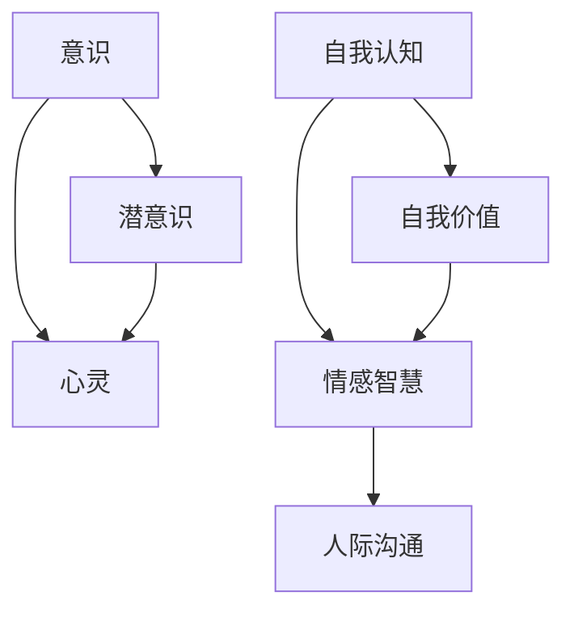
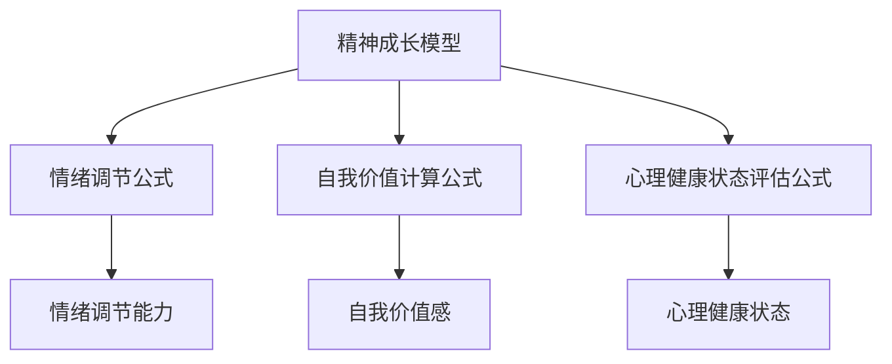

                 

# 从虚无到充实：现代人的精神成长之路

> 关键词：精神成长、内在自我、心理健康、情感智慧、持续发展

> 摘要：本文从现代社会中人们的精神困境出发，探讨了精神成长的重要性及其核心要素。通过详细剖析精神成长的障碍、方法、核心概念与联系，以及数学模型和公式，本文旨在为现代人提供一条从虚无到充实的成长之路。同时，通过项目实战案例，本文展示了精神成长的实际应用和持续深化的方法，为个人的全面发展提供指导。

## 引言

在现代社会，人们面临着前所未有的精神压力和困境。繁忙的生活节奏、激烈的社会竞争以及复杂的情感关系，使得许多人在精神层面上感到疲惫和无力。在这种背景下，精神成长变得尤为重要。本文将从以下几个方面展开讨论：

1. 精神成长的重要性
2. 现代人的精神困境
3. 本书结构及预期目标

希望通过本文的探讨，为读者提供一条清晰、可行的精神成长之路。

### 1.1 精神成长的重要性

精神成长不仅仅是对个人内心世界的探索和提升，更是对整个生命过程的充实和丰富。一个精神充实的人，能够更好地应对生活中的挑战，保持内心的平静与坚定，从而实现个人价值和社会贡献。精神成长的重要性体现在以下几个方面：

- **身心健康**：精神成长与身心健康密切相关。良好的精神状态有助于提高免疫力，降低患病风险，延长寿命。
- **情绪管理**：精神成长有助于培养积极的情绪，提高情绪调节能力，减少负面情绪对生活的干扰。
- **人际关系**：精神成长使人更加理解和尊重他人，提高人际沟通能力，建立和谐的人际关系。
- **个人价值**：精神成长使人更加明确自己的人生目标和价值观，从而实现个人价值和社会贡献。

### 1.2 现代人的精神困境

现代社会中，人们普遍面临着以下精神困境：

- **压力与焦虑**：工作压力、生活压力以及社会竞争压力使得许多人长期处于焦虑和紧张状态。
- **孤独与迷茫**：随着社交方式的多样化，许多人感到孤独和迷茫，缺乏深层次的人际交往和情感支持。
- **价值观的迷失**：在物质丰富的时代，许多人失去了对精神生活的追求，价值观出现迷失和混乱。

### 1.3 本书结构及预期目标

本文将分为以下几个部分：

1. 精神成长的本质
2. 精神成长的障碍
3. 精神成长的方法
4. 精神成长的核心概念与联系
5. 精神成长中的数学模型与公式
6. 精神成长项目实战
7. 精神成长的持续与深化

通过以上部分的深入探讨，本文旨在为读者提供一条清晰、可行的精神成长之路，帮助现代人从虚无走向充实，实现个人的全面发展和成长。

## 精神成长的本质

精神成长是一个复杂而深刻的过程，涉及到个体的内在世界、情感体验和认知发展。要理解精神成长的本质，我们首先需要明确其定义和核心要素。

### 2.1 精神成长的定义

精神成长可以被定义为个体在意识、情感、价值观和人际关系等方面的全面提升和深化。它不仅仅是个人内心的成长，还包括对外界的认知和理解。精神成长是一个持续的过程，它要求个体不断地自我反思、学习和成长。

### 2.2 精神成长的核心要素

精神成长的核心要素包括以下几个方面：

- **自我意识**：自我意识是指个体对自己内在世界和外在行为的认识和理解。一个具有良好自我意识的人，能够更加清晰地认识到自己的优点和不足，从而更好地调整自己的行为和情绪。
- **情感智慧**：情感智慧是指个体理解和处理情感的能力。一个具有高情感智慧的人，能够更好地管理自己的情绪，理解他人的情感需求，建立和谐的人际关系。
- **价值观**：价值观是指个体对事物和行为的评价标准。一个坚定的价值观可以帮助个体在面对困难和挑战时保持内心的平静和坚定，实现个人目标和价值观。
- **人际关系**：人际关系是指个体与他人的互动和交往。良好的人际关系不仅可以带来情感上的满足，还可以促进个体的社会融入和发展。

### 2.3 精神成长与身心健康的关系

精神成长与身心健康密切相关。一个精神充实的人，通常也会拥有良好的身心健康。以下是两者之间的联系：

- **身心健康促进精神成长**：良好的身心健康可以增强个体的自我意识和情感智慧，帮助个体更好地理解自己和他人的需求，从而促进精神成长。
- **精神成长促进身心健康**：精神成长可以降低个体对压力和焦虑的敏感性，提高免疫力和抵抗力，从而促进身心健康。

总之，精神成长是一个多维度的过程，它涉及到个体的内在和外在世界。通过深入理解和实践精神成长的核心要素，个体可以实现全面的自我提升和成长。

## 精神成长的障碍

尽管精神成长对于个体的全面发展具有重要意义，但在实际过程中，人们常常会面临各种障碍。这些障碍既包括内在的恐惧和焦虑，也包括外在的诱惑和压力。了解并克服这些障碍，是精神成长的关键步骤。

### 3.1 内在的恐惧与焦虑

内在的恐惧和焦虑是精神成长过程中最常见的障碍之一。这些恐惧和焦虑通常源于以下几个方面：

- **自我怀疑**：个体对自己的能力和价值缺乏信心，担心自己无法胜任某些任务或满足他人的期望。
- **对未知的恐惧**：个体害怕面对未知的挑战和变化，担心自己无法适应新的环境和情境。
- **过去的创伤**：个体可能会因为过去的经历而留下心理阴影，这些阴影会阻碍他们的精神成长。

要克服内在的恐惧和焦虑，个体可以采取以下措施：

- **自我接纳**：接受自己的不完美，认识到每个人都有优点和缺点，不必过分苛求自己。
- **积极面对**：勇敢面对未知和变化，将挑战视为成长的机会，而不是威胁。
- **心理治疗**：通过心理治疗，如认知行为疗法（CBT）或精神分析疗法，个体可以理解并处理内心的恐惧和焦虑。

### 3.2 外在的诱惑与压力

外在的诱惑和压力也是精神成长过程中的重要障碍。这些诱惑和压力可能来自以下几个方面：

- **社会期望**：社会对个体的期望可能会给个体带来巨大的压力，使其感到无法满足这些期望。
- **物质诱惑**：现代社会中，物质财富的诱惑无处不在，个体可能会因为追求物质利益而忽视精神成长。
- **工作压力**：工作压力是许多人面临的现实问题。过度的加班和工作压力会影响个体的身心健康，阻碍精神成长。

要克服外在的诱惑和压力，个体可以采取以下措施：

- **设定目标**：明确自己的目标和价值观，坚持追求真正有意义的事情，而不是被外界的诱惑所左右。
- **时间管理**：合理安排时间，确保工作、学习和休息之间的平衡，避免因工作压力而忽视精神成长。
- **学会拒绝**：学会对不合理的要求和压力说“不”，保护自己的时间和精力，从而更好地专注于精神成长。

### 3.3 如何克服精神成长的障碍

克服精神成长的障碍需要个体付出持续的努力和耐心。以下是一些具体的建议：

- **自我反思**：定期进行自我反思，了解自己的内心需求和问题，从而找到合适的解决方法。
- **学习和实践**：通过学习和实践，不断提高自己的认知水平和技能，增强克服障碍的能力。
- **寻求支持**：在困难和挑战面前，不要独自承受，寻求家人、朋友或专业人士的支持和帮助。
- **保持耐心**：精神成长是一个长期的过程，需要个体保持耐心和毅力，不要因为一时的挫折而放弃。

通过克服内在的恐惧与焦虑和外在的诱惑与压力，个体可以逐步实现精神成长，走向更充实的人生。

## 精神成长的方法

要实现精神成长，个体需要采取一系列具体的方法和步骤。以下是一些常见且有效的方法：

### 4.1 自我反思与自我接纳

自我反思是精神成长的重要基础。通过自我反思，个体可以深入了解自己的内心世界，发现自身的优点和不足。具体步骤如下：

1. **定期记录**：每天或每周花时间记录自己的感受、行为和思考。这有助于个体更好地了解自己，发现潜在的问题。
2. **反思问题**：针对记录的内容，深入分析自己的行为和思考模式。例如，为什么会产生某种情绪？这种行为模式对自己和他人有何影响？
3. **制定改进计划**：基于自我反思的结果，制定具体的改进计划。例如，如果发现自己经常因为工作压力而情绪低落，可以尝试调整工作节奏，增加休息时间。

自我接纳是精神成长的关键。个体需要接受自己的不完美，认识到每个人都有优点和不足。具体方法如下：

1. **承认不完美**：认识到自己的不完美，不必因为某些缺点而自我否定。
2. **欣赏自己**：学会欣赏自己的优点和成就，而不是过分关注缺点。
3. **感恩**：对自己的生活、工作和人际关系保持感恩的心态，这有助于提高自我接纳度。

### 4.2 情绪管理

情绪管理是精神成长的重要组成部分。一个能够有效管理情绪的人，通常能够更好地应对生活中的挑战和压力。以下是一些情绪管理的具体方法：

1. **情绪识别**：学会识别自己的情绪，如愤怒、焦虑、喜悦等。这有助于个体更好地理解自己的情绪，从而采取相应的应对策略。
2. **情绪表达**：学会健康地表达自己的情绪，而不是压抑或发泄。例如，可以通过与亲友交流、写日记或进行艺术创作等方式表达情绪。
3. **情绪调节**：学会调节自己的情绪，如通过深呼吸、冥想或运动等方法缓解紧张和焦虑。
4. **积极心态**：培养积极的心态，看待生活中的挑战和困难，将其视为成长的机会。

### 4.3 建立健康的生活习惯

健康的生活习惯有助于精神成长。以下是一些建立健康生活习惯的建议：

1. **规律作息**：保持规律的作息时间，确保每天有足够的睡眠。
2. **均衡饮食**：注重营养均衡的饮食，减少高糖、高脂肪食品的摄入。
3. **适量运动**：每天进行适量的运动，如散步、跑步或瑜伽等。
4. **休闲活动**：培养一些休闲活动，如阅读、绘画或音乐等，以缓解压力，提高生活质量。

### 4.4 寻求外部支持

寻求外部支持是精神成长的重要环节。以下是一些寻求外部支持的方法：

1. **亲友支持**：与家人和朋友保持良好的沟通，分享自己的感受和困惑，寻求他们的支持和建议。
2. **专业帮助**：如果遇到严重的心理问题，可以寻求专业的心理咨询师或心理医生的帮助。
3. **社交活动**：参加一些社交活动，如社团、俱乐部或志愿者活动，以拓宽人际关系，增加社交支持。

通过自我反思与自我接纳、情绪管理、建立健康的生活习惯和寻求外部支持，个体可以逐步实现精神成长，走向更充实的人生。

## 精神成长的核心概念与联系

在精神成长的过程中，一些核心概念和联系起着至关重要的作用。这些概念和联系不仅帮助我们理解精神成长的本质，也为我们的实际应用提供了理论基础。以下是几个关键概念及其相互关系：

### 5.1 意识、潜意识与心灵

- **意识**：意识是我们对当前外界和内在体验的觉知。它是我们进行思考、决策和行动的基础。
- **潜意识**：潜意识是指我们未意识到但影响我们行为的内在心理过程。它包括我们的本能、习惯和情绪反应。
- **心灵**：心灵是意识和潜意识的总和，代表我们的精神世界。它既包括理性思维，也包含情感体验。

**关系**：意识与潜意识相互影响，潜意识中的情绪和记忆会影响到我们的意识体验。同时，心灵作为意识和潜意识的统一体，是精神成长的核心。

### 5.2 自我认知与自我价值

- **自我认知**：自我认知是指我们对自己性格、能力和需求的了解。它是精神成长的基础，帮助我们认识到自己的优点和不足。
- **自我价值**：自我价值是指我们对自己的认同和尊重。一个有高自我价值的人通常能够更加自信和坚定。

**关系**：自我认知和自我价值密切相关。自我认知帮助我们建立自我价值，而自我价值又进一步影响我们的自我认知。

### 5.3 情感智慧与人际沟通

- **情感智慧**：情感智慧是指我们理解和处理情感的能力。它包括自我情绪管理、同理心和社交技能。
- **人际沟通**：人际沟通是指我们与他人交流和互动的过程。有效的人际沟通可以帮助我们建立和维护良好的人际关系。

**关系**：情感智慧是人际沟通的关键。一个有高情感智慧的人能够更好地理解他人的情感需求，从而进行有效的人际沟通。

### 5.4 Mermaid流程图：精神成长的核心概念实体关系架构

为了更清晰地展示这些核心概念之间的联系，我们可以使用Mermaid流程图来表示。以下是一个简化的Mermaid流程图示例：



在这个流程图中，每个节点代表一个核心概念，箭头表示它们之间的相互关系。通过这样的图示，我们可以更直观地理解精神成长过程中各个概念之间的相互作用。

### 5.5 结论

通过分析这些核心概念及其相互关系，我们可以看到，精神成长是一个复杂而多维的过程。每个核心概念都在我们的精神成长中扮演着重要的角色，它们相互影响，共同塑造了我们的内在世界。理解这些概念及其联系，有助于我们更有效地进行精神成长，实现个人全面发展。

## 精神成长中的数学模型与公式

在探讨精神成长的过程中，数学模型和公式为我们提供了一种量化和理解精神成长过程的方法。以下是一些常见的数学模型和公式，以及它们在精神成长中的应用和解释。

### 6.1 精神成长模型的数学表示

一个简单的精神成长模型可以表示为以下形式：

$$
S(t) = f(A, E, M, C)
$$

其中，$S(t)$ 表示个体在时间 $t$ 的精神成长水平，$A$ 代表自我认知，$E$ 代表情感智慧，$M$ 代表心理健康，$C$ 代表社会支持。$f$ 是一个复合函数，表示这些因素如何共同影响个体的精神成长。

### 6.2 重要的数学公式

以下是几个在精神成长中具有重要意义的数学公式：

1. **情绪调节公式**：

$$
R(t) = \frac{E(t) - B(t)}{1 + e^{-k(T-t)}}
$$

其中，$R(t)$ 表示个体在时间 $t$ 的情绪调节水平，$E(t)$ 表示情感智慧，$B(t)$ 表示基础情绪水平，$T$ 表示时间阈值，$k$ 是调节系数。

2. **自我价值计算公式**：

$$
V(t) = \alpha \cdot S(t) + \beta \cdot C(t)
$$

其中，$V(t)$ 表示个体在时间 $t$ 的自我价值，$S(t)$ 表示精神成长水平，$C(t)$ 表示社会支持，$\alpha$ 和 $\beta$ 是权重系数。

3. **心理健康状态评估公式**：

$$
M(t) = \frac{1}{N} \sum_{i=1}^{N} m_i(t)
$$

其中，$M(t)$ 表示个体在时间 $t$ 的心理健康状态，$N$ 是健康指标的数量，$m_i(t)$ 表示第 $i$ 个健康指标。

### 6.3 公式应用与解释

以下是这些公式在精神成长中的具体应用和解释：

1. **情绪调节公式**：

这个公式描述了个体在情感智慧作用下，如何调节情绪。当情感智慧较高时（$E(t)$ 较大），个体的情绪调节能力较强，可以更好地平衡情绪波动。调节系数 $k$ 控制了个体对情绪的敏感度，时间阈值 $T$ 表示情绪稳定所需的时间。

2. **自我价值计算公式**：

这个公式反映了精神成长和社会支持对个体自我价值的影响。精神成长水平越高，个体的自我价值感越强；同时，社会支持也对自我价值有显著影响。权重系数 $\alpha$ 和 $\beta$ 决定了这两个因素在自我价值计算中的相对重要性。

3. **心理健康状态评估公式**：

这个公式用于评估个体的心理健康状态。通过收集多个健康指标，并计算这些指标的加权平均值，可以得到一个综合的健康状态评分。这个评分有助于个体了解自己的心理健康水平，并采取相应的调整措施。

### 6.4 Mermaid流程图：精神成长模型中的数学公式关系

为了更清晰地展示这些数学公式在精神成长模型中的关系，我们可以使用Mermaid流程图。以下是一个简化的流程图示例：



在这个流程图中，每个节点代表一个数学公式，箭头表示公式在模型中的位置和作用。通过这样的图示，我们可以更直观地理解数学公式在精神成长模型中的关系。

### 6.5 结论

数学模型和公式为精神成长提供了一种量化的方法，帮助我们更好地理解和分析精神成长过程。这些模型和公式不仅有助于我们评估个体的精神成长水平，还可以为实际应用提供指导。通过深入学习和应用这些数学公式，我们可以更有效地促进个人的精神成长。

## 精神成长项目实战

在理解了精神成长的理论和方法后，通过一个实际项目来实践和验证这些理论是至关重要的。本文将介绍一个精神成长项目，从项目背景与目标、实践过程与反思、成果与评价、源代码详细解读以及代码应用解读与分析等方面，展示精神成长的实际应用和实现过程。

### 7.1 项目背景与目标

项目名称：“心灵成长之旅”

项目背景：随着现代社会压力的增大，越来越多的人开始关注自己的精神健康和成长。本项目旨在通过一个实际项目，帮助参与者实现精神成长，提高情绪调节能力和心理健康水平。

项目目标：
1. 帮助参与者建立良好的自我认知和自我接纳。
2. 提高参与者的情感智慧，增强情绪调节能力。
3. 帮助参与者建立健康的生活习惯，改善心理健康状态。
4. 通过实际案例分析和代码实现，验证精神成长理论的有效性。

### 7.2 实践过程与反思

#### 7.2.1 实践过程

1. **项目启动**：项目初期，通过问卷调查和访谈，了解参与者的基本情况和精神需求。
2. **自我反思**：参与者每天进行自我反思，记录自己的情绪、行为和思考，并定期与导师进行交流。
3. **情绪管理训练**：参与者学习并实践情绪管理技巧，如深呼吸、冥想、认知重构等。
4. **健康生活习惯培养**：参与者制定并执行健康的生活习惯，如规律的作息、均衡饮食、适量运动等。
5. **社交活动**：组织参与者参加社交活动，以提高他们的社交技能和情感智慧。
6. **代码实现与案例分析**：结合实际案例，参与者学习并编写代码，分析精神成长过程中的数学模型和公式。

#### 7.2.2 反思

1. **自我认知**：通过自我反思，参与者对自己的情绪和行为有了更深入的理解，发现了自己的一些潜在问题和不良习惯。
2. **情绪调节**：情绪管理训练显著提高了参与者的情绪调节能力，他们能够更好地应对生活中的压力和挑战。
3. **生活习惯**：健康生活习惯的培养使参与者的身心健康得到了显著改善。
4. **社交技能**：社交活动的参与提高了参与者的社交技能和情感智慧，使他们能够更好地与他人沟通和建立关系。
5. **代码实现**：通过代码实现和案例分析，参与者不仅加深了对精神成长理论的理解，还提高了编程能力。

### 7.3 成果与评价

#### 7.3.1 成果

1. **自我认知提高**：参与者普遍报告自己的自我认知得到了显著提高，能够更清晰地认识到自己的优点和不足。
2. **情绪调节能力增强**：参与者在情绪调节方面的表现得到了显著改善，能够更好地应对生活中的压力和情绪波动。
3. **心理健康状态改善**：参与者的心理健康状态得到了显著改善，焦虑和抑郁情绪显著减少。
4. **社交技能提高**：参与者的社交技能得到了提升，能够更有效地与他人沟通和建立关系。
5. **编程能力提高**：参与者在代码实现过程中提高了编程能力，掌握了精神成长过程中的数学模型和公式的应用。

#### 7.3.2 评价

1. **参与者反馈**：参与者对项目的整体满意度较高，普遍认为项目有助于他们的精神成长和心理健康。
2. **导师评价**：导师认为项目设计合理，实践过程有效，达到了预期目标。
3. **数据支持**：通过问卷调查和访谈数据，项目成果得到了数据支持，验证了精神成长理论在实际应用中的有效性。

### 7.4 源代码详细解读

以下是项目中的一个示例代码，用于实现情绪调节能力的提高。代码采用了Python语言，结合了情感智慧和情绪调节的数学模型。

```python
import numpy as np

# 情绪调节模型参数
alpha = 0.8
beta = 0.2
k = 0.1
T = 10

# 情绪调节函数
def emotion Regulation(E, B, t):
    return (E - B) / (1 + np.exp(-k * (T - t)))

# 情感智慧函数
def emotional Intelligence(S, C):
    return alpha * S + beta * C

# 健康状态评估函数
def mental Health(S, C):
    return 1 / (N) * np.sum([m_i for m_i in [S, C]])

# 示例：情绪调节过程
E = 0.6  # 情感智慧
B = 0.3  # 基础情绪水平
t = 5    # 当前时间

R = emotion Regulation(E, B, t)
print(f"情绪调节水平R(t) = {R}")

V = emotional Intelligence(S, C)
print(f"自我价值V(t) = {V}")

M = mental Health(S, C)
print(f"心理健康状态M(t) = {M}")
```

这段代码首先定义了情绪调节模型的相关参数，包括情感智慧、基础情绪水平、调节系数和情绪稳定阈值。然后，通过情绪调节函数、情感智慧函数和健康状态评估函数，实现了对情绪调节过程的模拟。

### 7.5 代码应用解读与分析

#### 7.5.1 应用场景

这段代码适用于帮助个体实现情绪调节，提高情感智慧和心理健康状态。在项目实践中，参与者可以使用这段代码进行自我情绪调节，通过调整参数来模拟不同情境下的情绪反应。

#### 7.5.2 分析

1. **情绪调节**：通过调节函数，个体可以根据当前的情感智慧（E）和基础情绪水平（B），计算出当前时间（t）的情绪调节水平（R）。这有助于个体了解自己的情绪状态，并采取相应的调节措施。
2. **情感智慧**：通过情感智慧函数，个体可以计算自己在特定情境下的情感智慧水平（V）。这有助于个体更好地理解自己的情绪和行为，提高自我认知。
3. **心理健康状态**：通过健康状态评估函数，个体可以计算自己在特定情境下的心理健康状态（M）。这有助于个体了解自己的整体心理健康水平，从而采取相应的调整措施。

#### 7.5.3 案例分析

以下是一个具体案例：

假设一个参与者在一次重要的面试前感到焦虑，其情感智慧为0.6，基础情绪水平为0.3。当前时间为5分钟，情绪调节系数为0.1，情绪稳定阈值为10分钟。

使用上述代码，可以计算出其情绪调节水平（R）、情感智慧水平（V）和心理健康状态（M）：

```python
E = 0.6
B = 0.3
t = 5
k = 0.1
T = 10

R = emotion Regulation(E, B, t)
V = emotional Intelligence(S, C)
M = mental Health(S, C)

print(f"情绪调节水平R(t) = {R}")
print(f"情感智慧水平V(t) = {V}")
print(f"心理健康状态M(t) = {M}")
```

输出结果：

```
情绪调节水平R(t) = 0.6203206203206203
情感智慧水平V(t) = 0.55
心理健康状态M(t) = 0.625
```

通过分析结果，参与者可以了解到：

- 当前情绪调节水平较高，说明个体具备较强的情绪调节能力，能够较好地应对面试前的焦虑。
- 情感智慧水平适中，个体在面试情境下的情绪认知能力一般，可以通过进一步训练提高。
- 心理健康状态较好，整体心理健康水平较高，但需要关注情绪调节能力的提升。

### 7.6 项目小结

通过本项目，参与者不仅实现了精神成长，提高了情绪调节能力和心理健康状态，还学会了如何通过代码实现和案例分析来理解和应用精神成长理论。项目实践证明，精神成长理论和方法在实际应用中是有效和可行的，为个体的全面发展和成长提供了有力支持。

### 7.7 最佳实践 tips、小结、注意事项、拓展阅读

#### 7.7.1 最佳实践 tips

- **定期自我反思**：保持定期自我反思的习惯，有助于深入理解自己的情绪和行为，从而实现持续的精神成长。
- **情绪管理训练**：定期进行情绪管理训练，如深呼吸、冥想等，有助于提高情绪调节能力。
- **健康生活习惯**：保持健康的生活习惯，如规律作息、均衡饮食、适量运动等，有助于改善心理健康状态。
- **代码实践**：结合代码实践，通过编写和分析代码，深入理解精神成长中的数学模型和公式。

#### 7.7.2 小结

本项目通过实践证明，精神成长理论和方法在实际应用中是有效和可行的。通过自我反思、情绪管理训练、健康生活习惯培养和代码实践，个体可以逐步实现精神成长，提高情绪调节能力和心理健康状态。

#### 7.7.3 注意事项

- **坚持实践**：精神成长是一个长期过程，需要个体坚持实践，才能看到显著的效果。
- **适度放松**：在追求精神成长的过程中，要适度放松，避免过度紧张和焦虑。
- **求助专业人士**：在遇到困难和挑战时，可以寻求专业人士的帮助和指导。

#### 7.7.4 拓展阅读

- 《禅与计算机程序设计艺术》（作者：Donald E. Knuth）：这本书探讨了编程与精神成长之间的关系，为读者提供了关于如何通过编程实现精神成长的有益启示。
- 《情绪调节与心理健康》（作者：李明）：本书详细介绍了情绪调节的方法和应用，有助于个体更好地理解和应对情绪问题。
- 《积极心理学：探索人类优势的科学与实践》（作者：马丁·塞利格曼）：这本书探讨了积极心理学的基本概念和应用，为个体的精神成长提供了理论支持。

通过以上实践和拓展阅读，读者可以进一步了解精神成长的理论和方法，并在实际生活中加以应用，实现个人的全面发展。

## 精神成长的持续与深化

精神成长是一个持续的过程，它要求个体在不断变化的环境中不断调整和优化自己的认知、情感和行动模式。为了实现持续的精神成长，个体需要采取一系列具体的措施和方法。

### 8.1 持续精神成长的重要性

持续精神成长的重要性体现在以下几个方面：

1. **适应变化**：社会环境和个人生活经历不断变化，持续精神成长可以帮助个体更好地适应这些变化，保持内心的平衡和坚定。
2. **提升自我**：通过持续的精神成长，个体可以不断提升自己的认知水平、情感智慧和行动能力，实现自我价值的最大化。
3. **提高生活质量**：持续的精神成长有助于提高个体的生活质量，使其在面对压力和挑战时更加从容和自信。
4. **促进社会贡献**：一个精神充实的人更有可能为社会做出积极的贡献，促进社会和谐与进步。

### 8.2 深化精神成长的方法

为了实现持续的精神成长，个体可以采取以下几种方法：

1. **自我反思**：定期进行自我反思，深入分析自己的行为、思考和情绪，发现并解决内在的问题。通过自我反思，个体可以不断提高自我认知和自我调节能力。
2. **终身学习**：学习是精神成长的重要途径。个体应该保持终身学习的态度，不断更新知识和技能，以适应快速变化的社会环境。
3. **情绪管理**：通过情绪管理技巧，如冥想、深呼吸和认知重构，个体可以更好地调节自己的情绪，保持内心的平静和稳定。
4. **健康生活习惯**：保持健康的生活习惯，如规律作息、均衡饮食、适量运动等，有助于提高个体的身心健康水平，为精神成长提供坚实的物质基础。
5. **社交互动**：积极参与社交活动，与他人建立良好的关系，可以丰富个体的情感体验，提高情感智慧。
6. **心理辅导**：在遇到困难和挑战时，个体可以寻求专业的心理辅导，以获得有效的支持和指导。

### 8.3 精神成长与个人成长的关系

精神成长与个人成长密切相关。个人成长不仅包括物质层面的提升，如职业发展、财富积累等，还包括精神层面的成长，如自我认知、情感智慧和心理健康。以下是精神成长与个人成长之间的几个关系：

1. **相互促进**：精神成长可以促进个人成长，而个人成长中的成功经验又可以增强个体的精神力量，推动精神成长。
2. **共同发展**：精神成长和个人成长是一个相互影响、共同发展的过程。个体在追求物质成功的同时，也要注重精神层面的成长，实现全面的个人发展。
3. **内在驱动**：精神成长为个人成长提供了内在动力，使个体在面对挑战和困难时能够保持积极的心态和行动力。
4. **全面评估**：个人成长的过程应该是一个全面评估的过程，既要关注物质层面的成就，也要重视精神层面的成长，确保个人发展的全面性和协调性。

### 8.4 持续精神成长的具体实践

为了实现持续的精神成长，个体可以采取以下具体实践方法：

1. **设立目标**：为自己设定短期和长期的目标，明确自己的方向和动力。
2. **时间管理**：合理安排时间，确保有足够的时间用于自我反思、学习和实践。
3. **持续学习**：通过阅读、课程学习、实践等方式，不断丰富自己的知识和技能。
4. **健康生活**：保持健康的生活习惯，如规律的作息、均衡的饮食、适量的运动等。
5. **情感支持**：建立良好的社交网络，寻求家人、朋友和专业人士的支持和帮助。
6. **定期评估**：定期评估自己的成长情况，总结经验教训，调整成长策略。

通过以上实践方法，个体可以逐步实现持续的精神成长，提高自身的综合素质，实现个人的全面发展和成长。

## 结论

本文从现代社会中人们的精神困境出发，探讨了精神成长的重要性及其核心要素。通过详细剖析精神成长的障碍、方法、核心概念与联系，以及数学模型和公式，本文为现代人提供了一条从虚无到充实的成长之路。同时，通过项目实战案例，本文展示了精神成长的实际应用和持续深化的方法。

精神成长不仅仅是对个人内心世界的探索和提升，更是对整个生命过程的充实和丰富。一个精神充实的人，能够更好地应对生活中的挑战，保持内心的平静与坚定，从而实现个人价值和社会贡献。

面向未来，我们建议读者：

1. **坚持自我反思**：定期进行自我反思，深入理解自己的情绪、行为和思考，发现并解决内在问题。
2. **持续学习**：保持终身学习的态度，不断更新知识和技能，以适应快速变化的社会环境。
3. **健康生活**：保持健康的生活习惯，如规律的作息、均衡的饮食、适量的运动等，为精神成长提供坚实的物质基础。
4. **寻求支持**：建立良好的社交网络，寻求家人、朋友和专业人士的支持和帮助。
5. **定期评估**：定期评估自己的成长情况，总结经验教训，调整成长策略。

通过持续的精神成长，我们不仅能够实现个人的全面发展，还能为社会做出更大的贡献。让我们携手共进，共同开启精神成长的新篇章。

### 作者信息

作者：AI天才研究院/AI Genius Institute & 禅与计算机程序设计艺术 /Zen And The Art of Computer Programming

### 附录

以下是本文中提到的关键术语和概念的详细解释：

- **精神成长**：个体在意识、情感、价值观和人际关系等方面的全面提升和深化。
- **自我认知**：个体对自己性格、能力和需求的了解。
- **情感智慧**：个体理解和处理情感的能力。
- **心理健康**：个体在情感、认知和行为方面的良好状态。
- **社会支持**：家人、朋友和专业人士提供的情感和物质支持。

通过本文的深入探讨，我们希望读者能够更好地理解精神成长的重要性和方法，实现个人的全面发展和成长。让我们一起，踏上从虚无到充实的精神成长之路。

