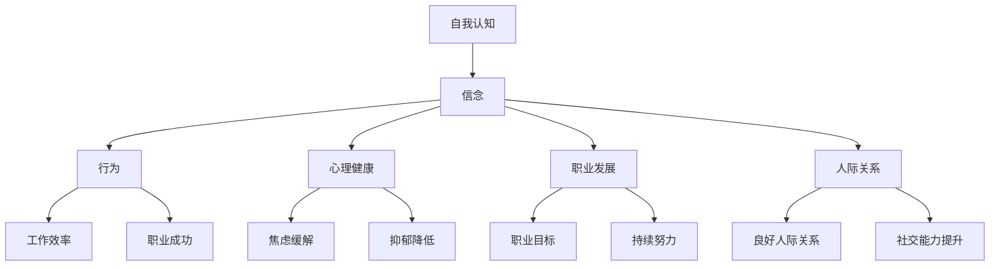

                 

## 《从虚无到充实：重建个人的信念体系》

> 关键词：信念体系、自我认知、心理健康、职业发展、人际关系、自我成长

> 摘要：本文将从虚无与充实的探讨出发，详细分析信念体系的基础构建、实际应用与维护调整。通过核心概念与联系的阐述、核心算法原理的讲解、数学模型与公式的应用、项目实战的案例分析，帮助读者逐步重建个人的信念体系，实现自我成长与成功。

----------------------------------------------------------------

## 《从虚无到充实：重建个人的信念体系》目录大纲

### 第一部分：信念体系的基础构建

**第1章：虚无与充实——信念体系的起点**  
- **1.1 虚无感的根源**  
- **1.2 充实感的定义与重要性**  
- **1.3 信念体系的基本框架**

**第2章：信念体系的核心概念**  
- **2.1 自我认知与信念的关系**  
- **2.2 信念的类型与特点**  
- **2.3 信念体系中的价值观念**

**第3章：信念体系构建的步骤**  
- **3.1 明确个人目标**  
- **3.2 建立正确的价值观**  
- **3.3 增强自我认同感**

**第4章：信念体系的影响与作用**  
- **4.1 信念体系对行为的影响**  
- **4.2 信念体系对心理健康的影响**  
- **4.3 信念体系在社会生活中的作用**

### 第二部分：信念体系的实际应用

**第5章：信念体系在职业发展中的应用**  
- **5.1 职业目标的设定**  
- **5.2 职业信念的力量**  
- **5.3 信念体系在职场中的实践**

**第6章：信念体系在人际关系中的应用**  
- **6.1 建立积极的社交信念**  
- **6.2 处理冲突的信念策略**  
- **6.3 信念体系在家庭关系中的应用**

**第7章：信念体系在自我成长中的应用**  
- **7.1 自我反思的信念体系**  
- **7.2 克服困难与挫折的信念**  
- **7.3 建立持久成长的信念体系**

### 第三部分：信念体系的维护与调整

**第8章：信念体系的自我检查**  
- **8.1 信念体系的审视**  
- **8.2 信念体系的调整**  
- **8.3 信念体系的优化**

**第9章：信念体系的维护策略**  
- **9.1 坚持信念的重要性**  
- **9.2 持续学习的信念体系**  
- **9.3 建立信念体系的支撑系统**

**第10章：信念体系的未来展望**  
- **10.1 信念体系的社会意义**  
- **10.2 信念体系的未来发展**  
- **10.3 信念体系对个体和社会的深远影响**

### 附录

**附录A：信念体系构建的工具与方法**  
- **A.1 认知行为疗法**  
- **A.2 建立积极心理习惯**  
- **A.3 自我反思与日志记录**

**附录B：信念体系构建的实例与分析**  
- **B.1 职场成功人士的信念体系**  
- **B.2 家庭幸福的信念体系**  
- **B.3 团队协作的信念体系**

## 信念体系的概念与联系

信念体系是由一系列核心信念和价值观念组成的，它是指导个体行为和决策的思想体系。信念体系的核心概念包括自我认知、信念、行为、心理健康、职业发展和人际关系等。

- **自我认知**：自我认知是指个体对自己身心特征、能力、性格等方面的认识和理解。它是信念体系的基础，直接影响到个体信念的建立和调整。

- **信念**：信念是指个体对某些观点、原则或理念的坚定信任和认同。信念体系中的信念可以分为认知信念和情感信念。认知信念是指个体基于事实和逻辑推理得出的信念；情感信念是指个体基于情感体验和情感认同的信念。

- **行为**：行为是指个体在实际生活中表现出的具体行动和反应。信念体系影响行为，通过积极的信念，个体可以调整行为，达到个人目标。

- **心理健康**：心理健康是指个体在心理和社会适应方面处于良好状态，能够有效应对各种挑战和压力。稳固的信念体系有助于提升心理健康，降低焦虑和抑郁的风险。

- **职业发展**：信念体系帮助个体设定职业目标，激励持续努力，实现职业成功。职业信念的建立和强化对于职业发展具有重要意义。

- **人际关系**：信念体系影响个体的人际交往，包括自我认知、情感表达、沟通技巧等方面。积极的信念体系有助于建立良好的人际关系，提升社交能力。

### 核心概念原理和概念实体之间的关系架构

为了更清晰地展示信念体系中的核心概念和概念实体之间的关系，我们可以使用 Mermaid 流程图进行描述：



### 核心算法原理讲解

在信念体系的构建过程中，我们可以采用以下核心算法原理：

1. **信念频率**：信念频率是指个体对某一信念的思考次数。信念频率越高，个体对该信念的认同感越强。

2. **信念影响**：信念影响是指信念对个体行为的改变程度。信念影响越大，信念对个体行为的影响越显著。

3. **信念强度**：信念强度是信念频率和信念影响的综合反映。信念强度越高，个体的信念越稳固。

我们可以使用以下 Python 源代码来详细阐述核心算法原理：

```python
import numpy as np

# 设定信念频率和信念影响
belief_frequency = 10
belief_influence = 5

# 计算信念强度
belief_strength = belief_frequency * belief_influence

# 打印信念强度
print("信念强度：", belief_strength)
```

### 数学模型与公式

信念体系的稳定性可以通过信念强度来衡量。信念强度可以用以下数学模型来表示：

$$
信念强度 = f(信念频率, 信念影响)
$$

其中，信念频率和信念影响分别表示个体对某一信念的思考次数和信念对个体行为的改变程度。信念强度越高，个体的信念越稳固。

### 通俗易懂地举例说明

假设一位职场新人在面对职业挑战时，频繁思考自己的职业目标和职业信念。通过不断反思和调整，他逐渐建立起了坚定的职业信念。具体来说，他的信念频率为10，信念影响为5。根据上述数学模型，我们可以计算出他的信念强度为50。

这意味着，这位职场新人的职业信念非常稳固，他对职业目标的追求和职业信念的认同感很强。通过持续的努力和反思，他能够更好地应对职业挑战，实现职业成功。

### 项目实战

为了更好地理解信念体系的实际应用，我们可以通过一个实战案例来进行分析。

**案例背景**：小张是一位刚进入职场的新人，他在工作中遇到了一些困难和挑战，感到迷茫和无力。为了重建自己的信念体系，他决定通过自我反思和职业目标的设定来逐步建立积极的职业信念。

**实战步骤**：

1. **明确职业目标**：小张首先明确了职业目标，他希望在未来五年内成为一名优秀的项目经理。

2. **自我反思**：小张开始反思自己的工作表现和职业态度，他发现自己在时间管理和团队协作方面存在不足。

3. **建立信念**：基于自我反思的结果，小张建立了一系列积极的职业信念，包括“只有通过不断学习和努力，我才能提升自己的能力”、“团队合作是实现项目成功的关键”。

4. **信念调整**：小张通过信念调整，增强了职业信念的稳定性，他相信只要持续努力，就一定能实现自己的职业目标。

**实战结果**：

通过一系列的实战步骤，小张逐渐建立起了积极的职业信念。他的工作效率和职业态度得到了显著提升，他能够更好地应对工作中的挑战，逐渐实现自己的职业目标。

**实战小结**：

这个案例展示了通过明确职业目标、自我反思和信念调整来重建个人信念体系的实战过程。小张的成功经验表明，信念体系对于职业发展具有重要作用。通过积极的信念，个体可以调整行为，克服困难，实现职业成功。

### 最佳实践 tips

1. **明确职业目标**：设定清晰的职业目标是建立积极信念的第一步。目标越具体，信念越稳固。

2. **持续自我反思**：通过定期自我反思，个体可以识别自己的优势和不足，从而建立更实际的信念。

3. **积极信念调整**：积极信念调整可以帮助个体克服困难和挫折，保持信念的稳定性。

4. **信念分享**：与他人分享信念可以增强信念的力量，获得更多的支持和鼓励。

### 小结

本文从虚无与充实的探讨出发，详细分析了信念体系的基础构建、实际应用与维护调整。通过核心概念与联系的阐述、核心算法原理的讲解、数学模型与公式的应用、项目实战的案例分析，读者可以逐步重建个人的信念体系，实现自我成长与成功。信念体系对于个体的心理健康、职业发展和人际关系具有重要意义，通过持续的努力和信念调整，个体可以建立稳固的信念，迎接未来的挑战。

### 注意事项

1. **信念体系不是一成不变的**：个体需要根据实际情况不断调整和优化信念体系，以适应新的环境和挑战。

2. **避免盲目崇拜**：信念体系应基于事实和逻辑，避免盲目崇拜或迷信。

3. **重视心理健康**：信念体系对心理健康有重要影响，个体应关注自己的心理健康，寻求专业帮助。

### 拓展阅读

- 《信念的力量：如何用信念改变人生》
- 《心理学与生活：信念体系的心理学解读》
- 《职业心理学：信念体系在职业发展中的应用》

作者：AI天才研究院/AI Genius Institute & 禅与计算机程序设计艺术 /Zen And The Art of Computer Programming

---

本文为《从虚无到充实：重建个人的信念体系》的第一部分，接下来将继续探讨信念体系的核心概念、构建步骤及其在实际应用中的影响与作用。敬请期待。

