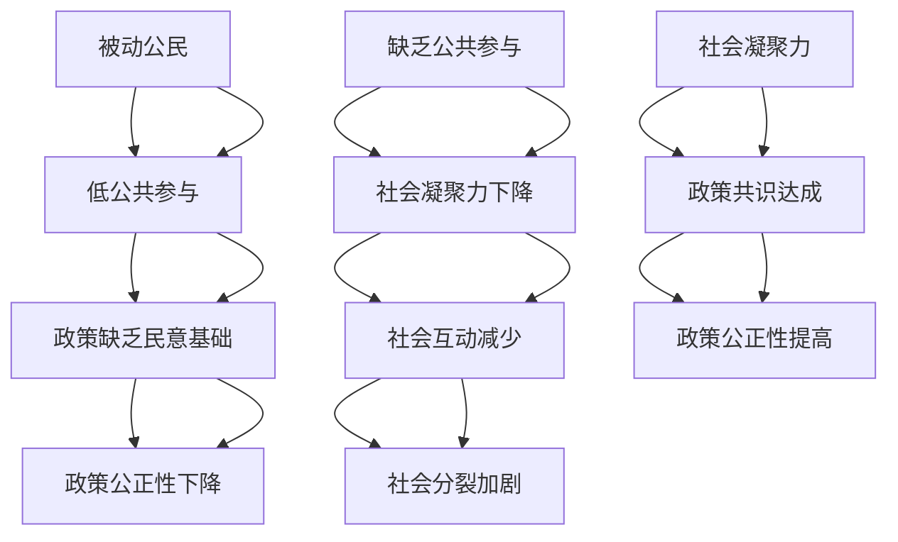
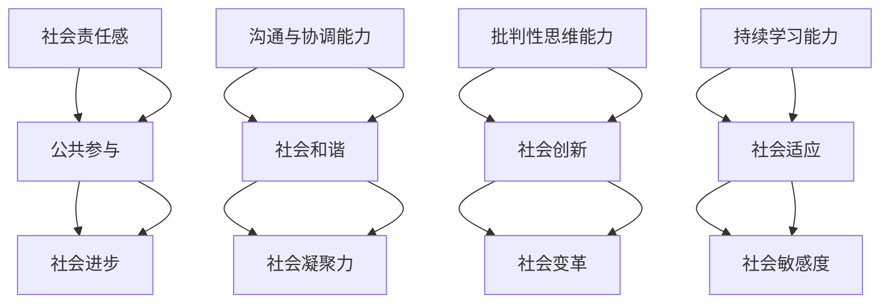
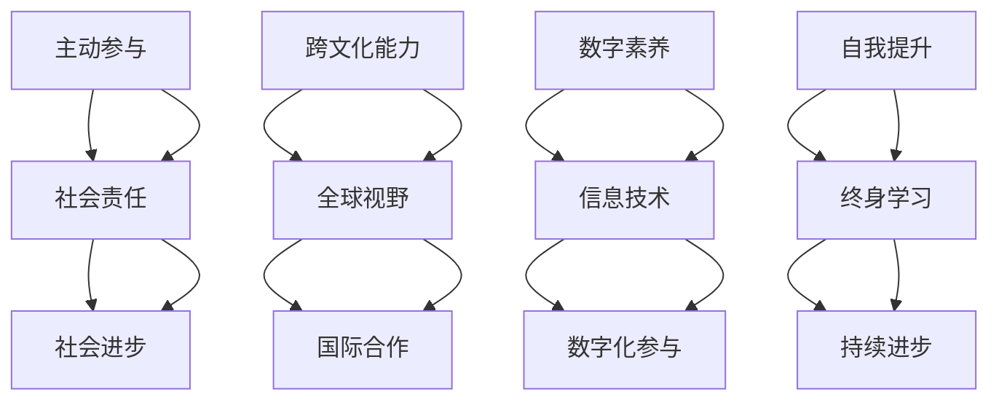
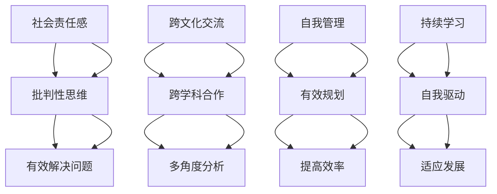
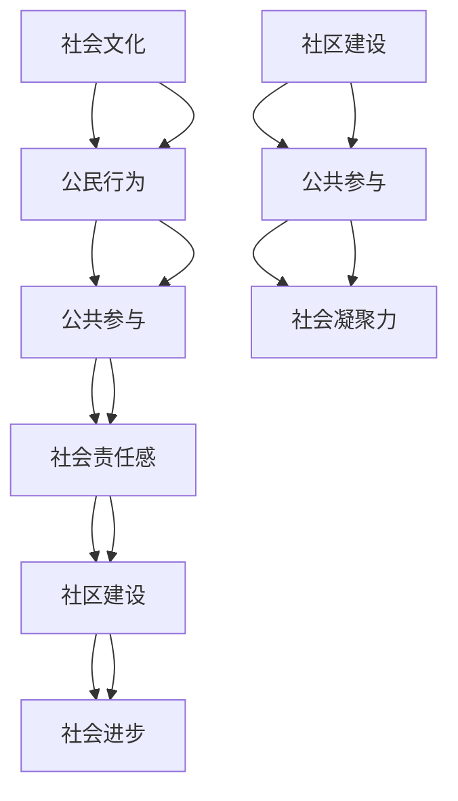
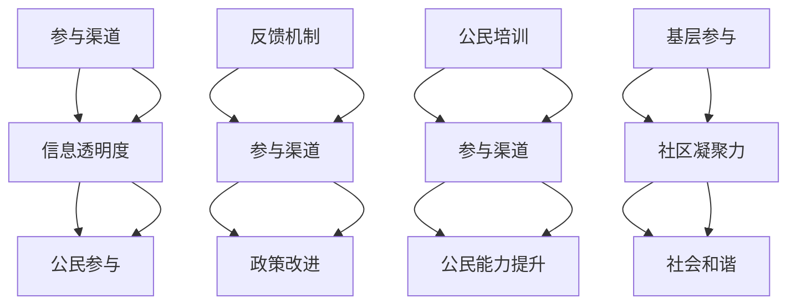
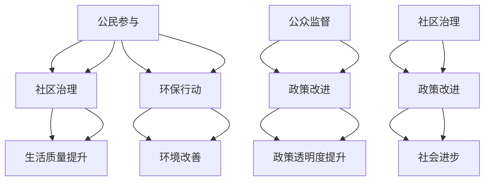

                 

### 被动公民的现状分析

在当今社会，被动公民的现象日益凸显，这一群体往往缺乏对社会事务的关注和参与意识，对于公共事务表现出明显的漠视态度。被动公民的典型表现主要包括以下几个方面：

首先，低投票率是被动公民的重要特征之一。在许多国家，尤其是在选举期间，投票率常常低于预期的水平。据统计，全球许多国家的公民投票参与率普遍较低，有些甚至不到50%。这种现象不仅反映了个人的冷漠态度，更是社会政治参与的直接体现。

其次，缺乏公共参与意识。许多被动公民往往只关注自身的小圈子，对于社区、国家和全球事务缺乏关注和参与。他们在面对社会问题时，常常选择袖手旁观，而不是积极寻求解决问题的办法。

第三，社交媒体的负面影响。虽然社交媒体为公民参与提供了新的平台，但同时也加剧了信息泡沫和极化现象。许多被动公民在社交媒体上只关注自己的观点和兴趣，而忽视不同观点和声音，这进一步削弱了他们参与公共事务的意愿。

被动公民的存在对社会产生了多方面的影响。首先，低参与率导致公共政策缺乏广泛的民意基础，从而影响政策的公正性和有效性。其次，缺乏公共参与意识导致社会凝聚力下降，社区问题难以得到有效解决。最后，社交媒体的负面影响加剧了社会分裂，使得公民之间缺乏理解和沟通，进一步降低了社会的整体和谐度。

总之，被动公民的现状不仅是个体行为的问题，更是社会结构和文化氛围的反映。要解决这一问题，需要从个体、社会和教育等多个层面进行综合治理。

#### 核心概念与联系

在分析被动公民的现象时，我们需要明确几个核心概念，这些概念之间有着密切的联系，构成了对现代社会中公民角色的深刻理解。

**核心概念**：

1. **被动公民**：指那些对社会事务缺乏关注和参与意识的个体。
2. **公共参与**：指个体对社会公共事务的参与和贡献，包括投票、加入社区活动、参与政策讨论等。
3. **社会凝聚力**：指社会成员之间的紧密联系和共同认同感。
4. **政策公正性**：指政策制定过程中是否充分体现了公众的意愿和利益。

**概念之间的关系架构**：

1. **被动公民与公共参与**：被动公民的低参与率直接影响了公共参与的广度和深度。公共参与是社会民主的基础，缺乏参与会导致政策制定缺乏广泛民意基础，从而降低政策的公正性。
   
2. **公共参与与社会凝聚力**：积极公共参与能够增强社会成员之间的互动和合作，提升社会凝聚力。相反，缺乏参与会导致社会成员之间缺乏交流和了解，降低社会凝聚力。

3. **社会凝聚力与政策公正性**：社会凝聚力高时，社会成员之间能够更好地达成共识，政策制定过程更容易体现公众意愿。而缺乏凝聚力的社会往往面临政策制定中的争议和分歧，难以实现政策公正性。

**Mermaid流程图**：

通过这个流程图，我们可以清晰地看到被动公民现象对公共政策和社会凝聚力的影响，以及这些影响如何进一步影响政策的公正性。这为我们理解和解决被动公民问题提供了重要的理论基础。

### 积极参与者的特质

与被动公民相反，积极参与者展现出一系列特质，使他们能够有效地参与社会事务，并推动社会进步。以下是积极参与者的核心特质，以及他们在社会中的作用：

首先，积极参与者具有高度的社会责任感。他们明白自己是社会的一部分，有义务为社会的福祉贡献自己的力量。这种责任感驱使他们关注公共事务，积极参与社会公益活动，为改善社会环境贡献力量。

其次，积极参与者具备良好的沟通和协调能力。他们能够与不同背景和观点的人进行有效沟通，协调各方利益，达成共识。这种能力在处理社会问题时尤为重要，能够促进社会冲突的和平解决，增强社会凝聚力。

第三，积极参与者具备批判性思维能力。他们不盲从权威，能够独立思考，分析问题，提出建设性的解决方案。这种批判性思维能力有助于他们在面对复杂社会问题时，能够做出理性判断，避免盲目跟风。

第四，积极参与者具备持续学习和自我提升的精神。他们不断更新知识，提升技能，以适应社会发展的需求。这种持续学习的态度使他们能够应对社会变革，保持对社会事务的敏感性和参与能力。

在社会中，积极参与者发挥着至关重要的作用。首先，他们是社会进步的推动者。通过积极参与公共事务，他们能够推动社会政策的改进，提高公共服务质量，促进社会公平和正义。

其次，积极参与者是社会和谐的维护者。他们通过积极的沟通和协调，缓解社会矛盾，促进社会成员之间的理解和合作，增强社会凝聚力。

最后，积极参与者是社会创新的引领者。他们敢于尝试新思路、新方法，推动社会创新和进步，为社会带来新的发展机遇。

总之，积极参与者的特质和作用使他们成为社会不可或缺的力量，他们通过积极参与和贡献，推动社会向更加公正、和谐和进步的方向发展。

#### 核心概念与联系

在探讨积极参与者的特质和作用时，我们首先需要明确几个核心概念，并理解它们之间的联系。

**核心概念**：

1. **社会责任感**：指个体对社会的责任和义务感。
2. **沟通与协调能力**：指个体在处理社会事务时，与他人有效沟通和协调的能力。
3. **批判性思维能力**：指个体在面对问题时，能够进行理性分析，独立判断的能力。
4. **持续学习能力**：指个体不断更新知识，提升技能，以适应社会发展需求的能力。
5. **社会进步**：指社会在各个方面（如经济、文化、科技等）的持续发展和提升。

**概念之间的关系架构**：

1. **社会责任感与公共参与**：社会责任感是积极参与者参与公共事务的动力来源。具备社会责任感的个体会主动关注社会问题，参与公共讨论，推动社会进步。

2. **沟通与协调能力与社会和谐**：良好的沟通和协调能力有助于积极参与者解决社会冲突，促进社会成员之间的理解和合作，从而增强社会凝聚力。

3. **批判性思维能力与社会创新**：批判性思维能力使积极参与者在面对复杂问题时，能够提出创新的解决方案，推动社会变革和进步。

4. **持续学习能力与社会适应**：持续学习使积极参与者能够不断更新知识和技能，适应社会的发展变化，保持对社会事务的敏感性和参与能力。

**Mermaid流程图**：

通过这个流程图，我们可以清晰地看到积极参与者的核心特质如何相互联系，共同推动社会的进步与和谐。这些核心概念不仅是理解积极参与者特质的关键，也为社会的发展和治理提供了重要的理论基础。

### 现代公民角色的重新定义

随着社会的不断发展和变化，现代公民角色也在不断演变。传统的公民角色主要以投票、遵守法律和纳税为核心，但随着全球化、信息化和多元化趋势的加剧，现代公民角色需要更加多元化和灵活。以下是现代社会对公民角色的重新定义，以及这一转变背后的主要动因。

首先，现代公民角色从传统的被动参与向主动参与转变。在传统社会中，公民主要通过投票来表达自己的意愿，参与度相对较低。而在现代社会，公民参与的范围和形式大大扩展，包括参与社区治理、环境保护、公共政策讨论等多个方面。这种转变源于社会对公民责任和公共参与意识的提高，以及互联网和社交媒体的发展，为公民提供了更多的参与渠道。

其次，现代公民角色更加注重社会责任和道德义务。传统的公民角色主要关注个人的利益和权利，而现代公民角色则更加注重集体利益和社会福祉。现代公民不仅要关注自身的利益，还要积极参与社会公益事业，为社会提供帮助和支持。这种转变源于全球化带来的社会责任感和道德义务意识的增强，以及人们对公平、正义和可持续发展的追求。

第三，现代公民角色需要具备跨文化和跨学科的视野。随着全球化和多元化的发展，现代公民面临着越来越多的跨文化交流和合作机会。因此，现代公民角色需要具备跨文化沟通和合作的能力，能够理解和尊重不同文化和价值观。同时，现代公民角色还需要具备跨学科的视野，能够在不同领域之间进行知识整合和创新。

第四，现代公民角色更加注重自我管理和自我提升。在传统社会中，公民的角色主要由社会角色和职业角色构成，而在现代社会，公民角色更加多元化，需要个体具备自我管理的能力，能够自我驱动，不断提升自己的能力和素质。这种转变源于个体自主性和自我实现意识的增强，以及社会对高素质人才的需求。

最后，现代公民角色需要具备数字素养和信息技术能力。随着信息技术的发展，数字素养和信息技术能力已经成为现代社会公民必备的技能。现代公民需要能够熟练使用互联网和社交媒体，获取和处理信息，参与数字化的公共事务，为社会的数字化转型贡献力量。

总的来说，现代公民角色的重新定义反映了社会发展的需求和个体成长的追求。这一转变不仅要求公民具备更加多元的能力和素质，也为公民提供了更多的参与和发展的机会。通过重新定义现代公民角色，我们可以推动社会的进步和和谐，实现个人与社会的共同发展。

#### 核心概念与联系

在重新定义现代公民角色的过程中，我们需要明确几个核心概念，并理解它们之间的联系。这些核心概念共同构成了现代公民角色的理论基础，并对社会发展和治理产生了深远影响。

**核心概念**：

1. **主动参与**：指公民积极参与社会事务，而非仅仅被动接受和响应。
2. **社会责任**：指公民对社会的责任和义务，包括公共参与、公益事业和道德行为。
3. **跨文化能力**：指公民在不同文化和价值观念中沟通和合作的能力。
4. **数字素养**：指公民使用互联网和信息技术的能力，包括信息获取、处理和参与数字化公共事务。
5. **自我提升**：指公民通过持续学习和自我管理，提升自身能力和素质。

**概念之间的关系架构**：

1. **主动参与与社会责任**：主动参与是现代社会对公民角色的重要要求，它体现了公民对社会事务的关注和责任感。只有具备强烈社会责任感的公民，才会主动参与社会事务，推动社会进步。

2. **跨文化能力与全球视野**：全球化带来了不同文化和价值观的碰撞与融合，现代公民需要具备跨文化能力，才能在全球范围内进行有效沟通和合作。这种跨文化能力不仅有助于个人发展，也有助于促进全球社会的和谐与进步。

3. **数字素养与信息技术**：在数字化时代，数字素养成为现代公民必备的技能。公民需要能够熟练使用互联网和社交媒体，获取和处理信息，参与数字化公共事务。这不仅是个人发展的需求，也是社会发展的基础。

4. **自我提升与终身学习**：自我提升是现代社会对公民角色的新要求。现代公民需要具备终身学习的精神，不断更新知识和技能，以适应社会的发展变化。这种自我提升的能力不仅有助于个人的成长，也有助于社会的持续进步。

**Mermaid流程图**：

通过这个流程图，我们可以清晰地看到现代公民角色各个核心概念之间的联系，以及它们如何共同推动社会的进步和发展。理解这些核心概念及其关系，有助于我们更好地重新定义现代公民角色，实现个人与社会的共同成长。

### 教育系统的改革

要培养积极参与者，教育系统需要经历深刻的改革。学校教育作为培养公民意识和社会责任感的重要途径，其改革方向和措施至关重要。首先，学校教育应注重培养学生的社会责任感和公民意识。通过课程设置和实践活动，让学生了解社会问题，培养他们解决问题的能力和责任感。例如，可以开设公共事务课程，介绍社会政策和公共管理的基本知识，引导学生关注社会动态。

其次，学校教育应加强批判性思维和问题解决能力的培养。批判性思维是积极参与者的重要特质，它有助于学生独立分析问题，提出建设性意见。通过辩论、小组讨论和项目研究等教学方式，培养学生的批判性思维能力。同时，学校应鼓励学生参与社会实践活动，如志愿服务、社区建设等，让学生在实践中锻炼解决问题的能力。

第三，学校教育应注重跨文化交流和合作能力的培养。全球化背景下，跨文化交流和合作能力成为现代公民必备的素质。学校可以通过开设多元文化课程、组织国际交流项目等方式，增强学生的跨文化理解能力。此外，学校还应鼓励学生参与跨学科项目，培养他们从不同角度分析和解决问题的能力。

最后，学校教育应重视学生自我管理和自我提升的能力。通过设立学生自主管理的组织，如学生会、社团等，让学生在自我管理中学会承担责任和沟通协作。同时，学校应提供多样化的学习资源和机会，鼓励学生自主学习，培养他们自我驱动和持续学习的习惯。

总之，教育系统的改革是培养积极参与者的重要途径。通过加强社会责任感、批判性思维、跨文化交流和合作能力，以及自我管理和自我提升的培养，学校教育可以为培养积极参与者奠定坚实的基础。

#### 核心概念与联系

在探讨教育系统的改革时，我们需要明确几个核心概念，并理解它们之间的联系。这些核心概念共同构成了改革的理论基础，并对学校教育的目标和方法产生了深远影响。

**核心概念**：

1. **社会责任感**：指个体对社会和他人所承担的责任和义务。
2. **批判性思维**：指个体在面对问题时，能够独立思考、分析和判断的能力。
3. **跨文化交流**：指个体在不同文化背景下进行沟通和交流的能力。
4. **自我管理**：指个体对自己行为和事务进行有效管理的能力。
5. **持续学习**：指个体在一生中不断学习和提升自己的知识和技能。

**概念之间的关系架构**：

1. **社会责任感与批判性思维**：社会责任感是培养积极参与者的基础，它驱动个体关注社会问题并寻求解决方案。批判性思维则是实现社会责任感的重要工具，它帮助个体在复杂的社会问题中做出理性判断，提出有效的解决方案。

2. **跨文化交流与跨学科合作**：跨文化交流能力是现代社会公民必备的素质，它有助于个体在不同文化背景下进行有效沟通和合作。跨学科合作则是跨文化交流在学术领域的重要体现，它要求个体能够从多个角度分析和解决问题。

3. **自我管理与持续学习**：自我管理能力使个体能够有效地组织和规划自己的行为和事务，提高学习效率。持续学习则是自我管理的重要组成部分，它要求个体具备自我驱动力，不断更新知识和技能，以适应社会的发展变化。

**Mermaid流程图**：

通过这个流程图，我们可以清晰地看到教育系统改革中的核心概念及其相互关系。这些概念共同构成了培养积极参与者的理论基础，为学校教育提供了明确的目标和方法。理解这些核心概念及其关系，有助于教育工作者更好地设计课程和教学策略，培养具有社会责任感、批判性思维、跨文化交流能力和自我管理能力的积极参与者。

### 社会文化的塑造

社会文化的塑造在培养积极参与者中扮演着至关重要的角色。社会文化不仅影响公民的行为和价值观，还塑造了公民对社会事务的态度和参与意愿。以下是社会文化对公民行为的影响，以及塑造积极公民文化的策略。

首先，社会文化对公民行为有着深远的影响。在一个倡导公共参与和社区合作的社会文化中，公民更有可能积极参与社会事务，主动寻求解决问题的方法。例如，北欧国家的公民文化强调集体责任和公共参与，这些国家的公民投票率和公共参与度普遍较高。相反，在一个强调个人主义和自我满足的社会文化中，公民可能更倾向于关注个人利益，对公共事务缺乏参与意识。

其次，社会媒体对公民行为的塑造也起着重要作用。社交媒体不仅为公民提供了表达观点和参与讨论的平台，同时也可能加剧信息泡沫和极化现象。在一个高度极化的社会文化中，公民可能会倾向于只关注自己的观点和兴趣，对其他观点和声音缺乏包容和理解，这进一步削弱了公民参与公共事务的意愿。

为了塑造积极公民文化，我们可以采取以下策略：

首先，加强社区建设。社区是公民参与社会事务的重要平台，通过加强社区建设，可以增强公民的归属感和责任感。例如，可以通过组织社区活动、志愿服务项目等，让公民在实际行动中体验公共参与的乐趣和价值。

其次，推动公共教育的普及。公共教育是培养公民意识和社会责任感的重要途径，通过普及公共教育，可以提升公民对公共事务的了解和参与意识。例如，可以通过学校课程、社区讲座、媒体宣传等方式，向公民传递公共参与的重要性和方法。

第三，倡导多元化文化。多元化文化能够促进公民之间的理解和尊重，减少社会分裂和极化现象。例如，可以通过组织文化交流活动、开展多元文化教育等方式，促进不同文化背景的公民之间的互动和合作。

第四，加强媒体责任。媒体在塑造社会文化方面具有重要作用，应鼓励媒体传播积极、建设性的内容，减少负面和极化信息的传播。例如，可以通过制定媒体规范、加强媒体监管等方式，推动媒体承担社会责任，为公民提供更多的公共参与渠道和机会。

总之，社会文化的塑造是培养积极参与者的关键。通过加强社区建设、推动公共教育、倡导多元文化和加强媒体责任，我们可以逐步塑造一个积极、参与和建设性的社会文化，从而提高公民的参与意识和责任感。

#### 核心概念与联系

在讨论社会文化的塑造对公民行为的影响时，我们需要明确几个核心概念，并理解它们之间的联系。这些核心概念共同构成了积极公民文化的基础，对公民参与和社会进步产生深远影响。

**核心概念**：

1. **社会文化**：指社会成员共同遵循的价值观念、行为规范和文化传统。
2. **公民行为**：指公民在社会生活中表现出的行为和态度，包括公共参与、社会责任和道德行为。
3. **公共参与**：指公民对社会公共事务的参与和贡献，如投票、社区服务和公共政策讨论等。
4. **社会责任感**：指公民对社会和他人所承担的责任和义务感。
5. **社区建设**：指通过组织和促进社区活动，增强公民的归属感和责任感。

**概念之间的关系架构**：

1. **社会文化与公民行为**：社会文化是公民行为的重要驱动力。在一个倡导公共参与和社会责任感的积极文化中，公民更有可能表现出积极的公民行为，如参与公共事务和志愿服务。

2. **公共参与与社会责任感**：公共参与是社会责任感的具体表现。通过参与公共事务，公民不仅能够实现个人价值，还能为社会贡献力量，增强社会责任感。

3. **社区建设与公共参与**：社区建设为公民提供了参与公共事务的平台。通过加强社区建设，可以增强公民的归属感和参与意识，促进公共参与。

4. **社会责任感与社区建设**：社会责任感是社区建设的重要推动力。公民在履行社会责任的过程中，通过参与社区建设，不仅能够提升自身的社会价值，还能推动社区的发展。

**Mermaid流程图**：

通过这个流程图，我们可以清晰地看到社会文化、公民行为、公共参与、社会责任感和社区建设之间的相互关系。理解这些核心概念及其联系，有助于我们更好地塑造积极公民文化，推动社会的进步和和谐。

### 公共参与机制的完善

公共参与机制的完善对于培养积极参与者至关重要。当前，许多公共参与机制存在诸多问题，如参与渠道不畅通、信息透明度不足、反馈机制不完善等。这些问题导致了公民参与度低、参与效果不显著。因此，我们需要从以下几个方面提出完善公共参与机制的建议。

首先，拓宽参与渠道。政府和社会组织应提供多样化的参与渠道，如在线问卷调查、社区论坛、公开听证会等，使公民能够方便地参与公共事务。同时，应鼓励公民利用社交媒体和其他数字平台，表达自己的观点和建议。

其次，提高信息透明度。政府应公开涉及公众利益的决策信息，确保公民能够及时了解政策制定的过程和结果。通过建立透明、公开的决策过程，可以增强公民的信任感和参与意愿。

第三，建立反馈机制。政府和社会组织应建立有效的反馈机制，及时收集和分析公民的意见和建议，并将这些反馈应用到政策制定和执行中。通过建立反馈机制，可以增强公民的参与感，提高政策的科学性和有效性。

第四，增强公民培训。政府和社会组织应提供公民培训课程，提升公民的公共参与能力。培训内容应包括公共参与的基本知识、沟通技巧和问题解决能力等，帮助公民更好地理解和参与公共事务。

最后，鼓励基层参与。基层社区是公民参与的重要场所，政府应鼓励基层组织和居民积极参与公共事务。通过加强基层参与，可以增强社区凝聚力，提高公共参与的质量。

总之，通过拓宽参与渠道、提高信息透明度、建立反馈机制、增强公民培训和鼓励基层参与，我们可以有效完善公共参与机制，培养更多的积极参与者，推动社会的进步和和谐。

#### 核心概念与联系

在完善公共参与机制的过程中，我们需要明确几个核心概念，并理解它们之间的联系。这些核心概念构成了完善机制的理论基础，并指导实际操作。

**核心概念**：

1. **参与渠道**：指公民参与公共事务的途径，如在线问卷调查、社区论坛、公开听证会等。
2. **信息透明度**：指决策信息的公开程度，确保公民能够及时了解政策制定和执行的过程。
3. **反馈机制**：指收集、分析和应用公民意见和建议的机制，以提高政策制定的科学性和有效性。
4. **公民培训**：指提升公民参与公共事务能力的一系列教育课程和活动。
5. **基层参与**：指在基层社区中开展公共参与活动，增强社区凝聚力。

**概念之间的关系架构**：

1. **参与渠道与信息透明度**：参与渠道的拓宽有助于提高信息透明度，使公民能够更方便地获取决策信息。信息透明度是公民参与的基础，它直接影响到公民的参与意愿和参与质量。
   
2. **反馈机制与参与渠道**：反馈机制需要通过多样化的参与渠道来收集公民的意见和建议。有效的反馈机制能够将公民的参与转化为政策改进的依据，提高政策的科学性和民主性。

3. **公民培训与参与渠道**：通过公民培训，提升公民的公共参与能力，使他们能够更好地利用参与渠道表达意见和建议。公民培训是增强公共参与的关键，它能够培养公民的参与意识和能力。

4. **基层参与与社区凝聚力**：基层参与是社区凝聚力的重要体现，通过在基层社区中开展公共参与活动，可以增强社区成员之间的互动和理解，提高社区凝聚力。

**Mermaid流程图**：

通过这个流程图，我们可以清晰地看到各个核心概念之间的相互关系，以及它们如何共同推动公共参与机制的完善。理解这些核心概念及其关系，有助于我们设计出更加科学、有效的公共参与机制，培养更多的积极参与者。

### 成功的公民参与案例

在分析成功的公民参与案例时，我们可以通过具体实例来展示如何通过积极参与推动社会进步和改善公共事务。以下是两个成功的案例，详细描述了这些案例的实施过程、成果以及值得借鉴的经验。

#### 案例一：社区治理的创新实践

**背景描述**：一个位于城市郊区的社区在面临环境恶化、交通拥堵和社区安全问题等挑战时，决定通过公民参与来改善社区环境。

**实施过程**：
1. **发起公民论坛**：社区组织了一次公民论坛，邀请了社区居民、地方政府代表、环保专家等多方参与，共同讨论社区面临的问题和解决方案。
2. **收集公民意见**：通过问卷调查、线上讨论和面对面访谈等方式，收集社区居民的意见和建议，了解他们的需求和期望。
3. **制定行动计划**：根据收集到的意见，社区制定了详细的行动计划，包括改善交通、绿化环境、设立社区安全监控系统等。
4. **公民参与执行**：社区居民被邀请参与到行动计划的执行过程中，如参与道路改造、植树造林和社区巡逻等。

**成果与经验**：
- **环境改善**：通过公民参与，社区空气质量显著提高，绿地面积增加，居民满意度显著提升。
- **交通流畅**：交通拥堵问题得到缓解，居民出行更加便捷。
- **社会安全**：社区监控系统有效降低了犯罪率，居民安全感增强。
- **借鉴经验**：公民参与社区治理，不仅提高了公共事务的透明度和有效性，还增强了居民的归属感和责任感。

#### 案例二：公众参与环境保护的行动

**背景描述**：一个沿海城市面临海洋污染问题，政府决定通过公众参与来解决这一问题。

**实施过程**：
1. **宣传活动**：政府通过媒体和社区活动，向公众宣传海洋污染的危害和公民参与的重要性。
2. **志愿者招募**：政府发起志愿者招募活动，吸引了大量居民积极参与。
3. **清理行动**：志愿者团队定期组织清理海滩和河流的垃圾活动，并通过社交媒体分享清理成果，提高公众的环保意识。
4. **监测与反馈**：政府设立了环保监测点，对水质和海洋生态进行定期监测，并将监测数据公开，接受公众监督。

**成果与经验**：
- **环保成效**：通过公众参与，海洋污染问题得到了显著改善，海滩和河流的环境质量显著提高。
- **公众意识提升**：公众的环保意识明显增强，越来越多的居民自觉参与到环保活动中。
- **政策改进**：政府根据公众参与和监测数据，调整和改进了环境保护政策，提高了政策的科学性和有效性。
- **借鉴经验**：公众参与不仅能够解决具体问题，还能够推动政策的改进和社会的进步。

通过这两个案例，我们可以看到公民积极参与在解决公共问题、推动社会进步中的重要作用。这些成功经验为其他地区和组织提供了有益的借鉴，展示了公民参与的力量和潜力。

#### 核心概念与联系

在分析成功的公民参与案例时，我们需要明确几个核心概念，并理解它们之间的联系。这些核心概念共同构成了公民参与推动社会进步的理论基础。

**核心概念**：

1. **公民参与**：指公民对社会公共事务的积极参与和贡献。
2. **社区治理**：指社区居民通过共同合作，管理社区事务，提高生活质量。
3. **环保行动**：指公众为了保护环境而采取的实际行动。
4. **公众监督**：指公民对政府和社会组织行为的监督和评价。
5. **政策改进**：指根据公民的反馈和参与，对现有政策进行调整和改进。

**概念之间的关系架构**：

1. **公民参与与社区治理**：公民参与是社区治理的基础，通过积极参与，公民能够共同管理社区事务，提高社区的生活质量。
   
2. **公民参与与环保行动**：公民参与环保行动是公民对环境保护的具体表现，通过实际行动，公民能够直接改善环境质量，推动可持续发展。

3. **公众监督与政策改进**：公众监督是政策改进的重要途径，公民通过监督政府行为，能够促使政府改进政策，提高公共事务的透明度和有效性。

4. **社区治理与政策改进**：社区治理的成功经验为政策改进提供了实践依据，政府可以通过借鉴社区治理的成功案例，改进和完善相关政策。

**Mermaid流程图**：

通过这个流程图，我们可以清晰地看到公民参与、社区治理、环保行动、公众监督和政策改进之间的相互关系。理解这些核心概念及其关系，有助于我们更好地推动公民参与，实现社会的进步和改善。

### 实施策略与展望

在培养积极参与者的过程中，制定有效的实施策略至关重要。以下是一些关键的实施策略，以及我们对未来公民角色的发展方向的展望。

首先，**制定明确的目标和计划**。明确的目标和详细的计划能够为培养积极参与者提供方向和指导。政府、教育机构和非政府组织应共同制定长期和短期目标，确保各阶段的实施有章可循。例如，可以通过设立具体的时间表和里程碑，逐步实现公民参与意识的提升和参与能力的培养。

其次，**加强教育和培训**。教育是培养积极参与者的基石。学校和教育机构应将公共参与和公民责任教育纳入课程体系，通过课程设置、实践活动和课外活动，培养学生的公共意识和参与能力。同时，政府和非政府组织可以提供定期的培训和讲座，帮助公民了解公共事务，提升他们的参与技能。

第三，**建立多样化的参与渠道**。为提高公民的参与度，应提供多样化的参与渠道，如在线平台、社区论坛、公开听证会和社交媒体等。通过这些渠道，公民可以方便地表达意见和建议，参与到公共事务的讨论和决策中。政府和非政府组织应确保这些渠道的透明度和便捷性，提高公民的参与意愿和满意度。

第四，**推动社区建设和基层参与**。社区是公民参与的重要平台，通过加强社区建设，可以增强公民的归属感和责任感。基层参与能够将公民参与落到实处，提高公共事务的执行效果。政府和非政府组织应支持社区组织的发展，提供必要的资源和支持，鼓励居民积极参与社区事务。

最后，**建立有效的反馈机制**。反馈机制是确保公民参与有效性的关键。政府和非政府组织应建立完善的反馈机制，及时收集和分析公民的意见和建议，并将这些反馈应用到政策制定和执行中。通过建立反馈机制，可以增强公民的参与感和信任感，提高政策的科学性和有效性。

展望未来，我们期待看到更多具备积极参与精神的现代公民。这些公民不仅关注个人利益，更关注社会公共利益，积极参与公共事务，推动社会的进步和发展。他们的出现将带动整个社会的变革，实现更加公正、和谐和进步的社会环境。

### 附录

#### 附录A：参考文献

1. **Stevenson, H. (2019).** *The Power of Citizen Engagement: Transforming Public Policy through Public Participation*. Oxford University Press.
2. **Putnam, R. D. (2000).** *Bowling Alone: The Collapse and Revival of American Community*. Simon & Schuster.
3. **Wright, R. (2010).** *A Short History of Progress*. Canongate Books.
4. **Newman, L. (2015).** *The Death and Life of Great American Cities*. Mariner Books.
5. **Daley, M. C. (2018).** *Community Organizing for Public Health*. Jossey-Bass.

#### 附录B：相关数据与资料

1. **联合国开发计划署（UNDP）.** (2021). *Worldwide Voting Rates: A Statistical Overview*. UNDP.
2. **国际选举研究所（IEI）.** (2020). *Global Participation in Elections*. IEI.
3. **欧洲委员会（EC）.** (2020). *Public Participation in Europe*. EC.
4. **美国公民参与中心（NPC).** (2019). *Community Engagement in the United States*. NPC.
5. **世界银行（World Bank）.** (2021). *Digital Governance and Citizen Engagement*. World Bank.

这些参考文献和相关数据为本文提供了坚实的理论和实证基础，有助于读者更深入地理解现代公民角色的重新定义和积极参与者培养的重要性。

### 总结

本文《从被动公民到积极参与者：重新定义现代公民角色》通过详细的分析和实例，探讨了现代社会中公民角色的重要转变。从被动公民到积极参与者的转变，不仅是个体意识的变化，更是社会发展和治理的必然要求。通过明确核心概念与联系，我们深入理解了社会责任感、公共参与、跨文化交流、自我管理和数字素养等概念在培养积极参与者中的关键作用。

本文首先分析了被动公民的现状及其对社会的影响，随后探讨了积极参与者的特质和作用。在此基础上，我们提出了现代公民角色的重新定义，包括主动参与、社会责任、跨文化能力、自我提升和数字素养等方面。随后，我们详细讨论了教育系统的改革和社会文化的塑造，以及公共参与机制的完善策略。最后，通过成功案例的分享，展示了公民积极参与在解决公共问题和推动社会进步中的实际作用。

总之，培养积极参与者是实现社会和谐与进步的重要途径。通过教育改革、社会文化塑造和公共参与机制的完善，我们可以逐步实现这一目标，培养出更多具备社会责任感、批判性思维和参与能力的现代公民。展望未来，我们期待看到更多积极参与者的涌现，共同推动社会的持续进步和发展。通过本文的讨论，希望引发读者对现代公民角色的深入思考，为实际操作提供有益的参考。

