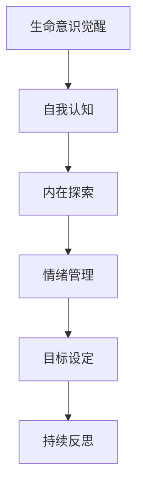
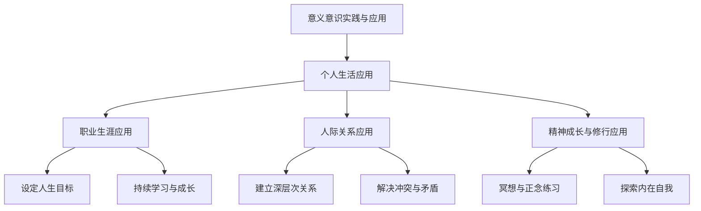

                 

# 从被动到主动：觉醒生命的意义意识

## 关键词

- 生命意识
- 意义意识
- 主动与被动
- 生命质量
- 自我认知
- 个人成长
- 社会贡献

## 摘要

本文旨在探讨从被动到主动的生命意识觉醒过程，以及意义意识对生命质量的影响。通过分析生命意识的概念和重要性，以及被动与主动生命状态的差异，本文提出了提升生命质量的策略，包括内在探索与成长、外在行动与影响、心理健康与情绪管理。此外，本文还阐述了意义意识在个人生活和社会层面的应用，以及如何突破被动生命的困境。通过主动生命的实践与反思，读者将能够理解并实现从被动到主动的生命旅程，提升个人和社会的生命质量。

## 引言

在快节奏的现代社会中，人们常常感到压力和迷茫。许多人处于被动的生活状态，无法真正意识到生命的意义和目的。然而，生命意识的觉醒是我们实现个人成长和社会贡献的关键。本文将深入探讨从被动到主动的生命意识觉醒过程，以及意义意识在其中的重要作用。

首先，我们需要理解生命意识的概念。生命意识是指对自身存在、生命过程和宇宙关系的认知和觉知。它不仅仅是对自身的认识，还包括对周围环境和他人的关注。生命意识的重要性在于，它能够引导我们做出更明智的选择，帮助我们找到生活的方向和意义。

被动与主动的生命状态是我们需要区分的另一个重要概念。被动生命状态通常是指缺乏主动性和目标感的生活，人们常常感到迷茫和无意义。而主动生命状态则意味着我们有明确的目标和计划，能够主动地追求自己的梦想和愿望。主动生命状态能够带来更多的满足感和成就感，提升生命质量。

意义意识是觉醒生命意识的关键。意义意识是指对生命意义和价值的认识和理解。它能够帮助我们找到生活的目标，激励我们克服困难，实现个人成长和社会贡献。意义意识对生命质量的影响是深远的，它能够提升我们的幸福感，增强我们的心理韧性，帮助我们更好地应对生活中的挑战。

本文将分以下几个部分进行探讨：首先，我们将深入分析生命意识的定义和重要性；接着，我们将探讨被动与主动生命状态的认知和转变策略；然后，我们将讨论意义意识的概念和提升生命质量的策略；接下来，我们将探讨意义意识在个人生活和社会层面的应用；随后，我们将分析被动生命的困境和突破策略；最后，我们将通过主动生命的实践与反思，总结生命的意义与意识。

通过本文的探讨，我们希望能够帮助读者觉醒生命的意义意识，从被动到主动地追求更有意义和有价值的生活。让我们一步步地深入探讨，共同寻找生命的答案。

## 1. 生命意识的觉醒

### 1.1 生命意识的定义和重要性

生命意识是一个多维度的概念，它不仅涉及对自我存在的认知，还涵盖了我们对生命过程、宇宙关系以及与周围环境的互动。从哲学的角度来看，生命意识是一种深刻的觉醒，是对生命本质和生命意义的认识和理解。这种觉醒不仅仅是在思想层面上的，更是一种在行为和态度上的转变。

首先，我们需要明确生命意识的定义。生命意识，可以被视为一种对自身存在的觉知和认识，包括对生理、心理和社会层面的自我认识。它不仅关乎我们如何理解自己，还包括我们如何与他人、环境以及宇宙建立联系。生命意识是一种全面的认识，它涵盖了我们的意识状态、思维模式、情感体验和行为表现。

在日常生活中，生命意识的重要性不可忽视。首先，它能够帮助我们更好地理解自己和他人，从而建立更深层次的人际关系。当我们具备较高的生命意识时，我们能够更加敏锐地察觉他人的需求和情感，从而提供更有针对性的支持和帮助。此外，生命意识还能够帮助我们认识到自己在社会和宇宙中的角色和责任，从而激发我们为社会和人类进步做出贡献的动机。

其次，生命意识对于个人的心理健康和幸福感具有重要影响。当我们对生命有深刻的认知和觉知时，我们能够更好地应对生活中的挑战和压力。较高的生命意识能够增强我们的心理韧性，使我们能够更加从容地面对困境和挫折。此外，生命意识还能够帮助我们认识到生活的意义和目标，从而提升我们的幸福感。

### 1.1.1 生命意识的定义

生命意识的定义可以从多个维度进行阐述。首先，从生理层面来看，生命意识是对自身身体和生理过程的认知和觉知。这种觉知包括对呼吸、心跳、身体感受等生理活动的感知。通过这种觉知，我们能够更好地理解自己的身体状况，从而采取更健康的生活方式和行为。

其次，从心理层面来看，生命意识是对自我情感和思维模式的认知。它包括对自我情绪的感知和调节，以及对自我思维和行为的反思。通过这种认知，我们能够更好地理解自己的内心世界，从而更好地应对各种情绪和心理挑战。

最后，从社会层面来看，生命意识是对自我在社会和宇宙中的角色和责任的认知。它包括对自我在社会中的地位和作用的认知，以及对宇宙和人类关系的理解。通过这种认知，我们能够更好地认识到自己在社会和宇宙中的价值和意义，从而激发我们为社会和人类进步做出贡献的动机。

### 1.1.2 生命意识的重要性

生命意识的重要性体现在多个方面。首先，它能够帮助我们建立更深层次的人际关系。当我们具备较高的生命意识时，我们能够更加敏锐地察觉他人的需求和情感，从而提供更有针对性的支持和帮助。这种觉知不仅能够增强我们与他人的情感联系，还能够提高我们的人际交往能力。

其次，生命意识对于个人的心理健康和幸福感具有重要影响。当我们对生命有深刻的认知和觉知时，我们能够更好地应对生活中的挑战和压力。较高的生命意识能够增强我们的心理韧性，使我们能够更加从容地面对困境和挫折。此外，生命意识还能够帮助我们认识到生活的意义和目标，从而提升我们的幸福感。

最后，生命意识能够激发我们为社会和人类进步做出贡献的动机。当我们认识到自己在社会和宇宙中的角色和责任时，我们能够更加积极地投身于社会服务和公益事业。通过这种方式，我们不仅能够提升自己的生命质量，还能够为社会的进步和人类的福祉做出贡献。

### 1.1.3 生命意识的觉醒过程

生命意识的觉醒是一个逐步深入的过程，它需要我们不断地进行自我探索和反思。以下是生命意识觉醒的几个关键步骤：

1. **自我认知**：自我认知是生命意识觉醒的第一步。通过深入探索自己的内心世界，包括情感、思维和行为模式，我们能够更好地理解自己。这种自我认知不仅有助于我们找到自己的优势和不足，还能够帮助我们制定更有效的个人成长计划。

2. **内在探索**：内在探索是生命意识觉醒的深入阶段。在这个阶段，我们需要超越表面的自我认知，深入探索内心的深处。通过冥想、心理治疗和其他内在探索技巧，我们能够更好地了解自己的潜意识，并找到解决内心冲突的方法。

3. **情绪管理**：情绪管理是生命意识觉醒的重要一环。通过学习如何认识和调节自己的情绪，我们能够更好地应对生活中的各种情绪波动。这种情绪管理能力不仅有助于提升我们的心理健康，还能够提高我们的生活质量。

4. **目标设定**：目标设定是生命意识觉醒的关键步骤。通过明确自己的目标和价值观，我们能够更好地规划自己的生活，并为之努力。目标设定不仅能够帮助我们实现个人成长，还能够提升我们的生命意义感。

5. **持续反思**：持续反思是生命意识觉醒的持续过程。通过定期反思自己的行为和决策，我们能够不断调整和优化自己的生活方式。这种持续反思不仅有助于我们实现个人成长，还能够增强我们的自我认知和生命意识。

通过以上步骤，我们能够逐步觉醒生命意识，从而实现个人成长和社会贡献。

### 1.2 被动与主动的生命状态

#### 1.2.1 被动生命状态的认知

被动生命状态是指人们缺乏主动性和目标感，常常感到迷茫和无意义的生活状态。在被动生命状态中，人们往往缺乏对生活的控制感和方向感，容易受到外部环境的左右。这种状态不仅会导致心理压力和焦虑，还可能影响个人的生活质量和幸福感。

被动生命状态的认知主要包括以下几个方面：

1. **缺乏目标感**：在被动生命状态中，人们往往没有明确的生活目标或梦想。他们可能不知道自己究竟想要什么，对未来没有清晰的规划。

2. **缺乏主动性和积极性**：被动生命状态的人通常缺乏主动性和积极性，他们容易放弃面对挑战和困难，往往选择逃避而不是解决问题。

3. **依赖外部评价**：被动生命状态的人常常依赖外部评价来定义自己的价值，他们往往将自己的幸福和满足感建立在外部评价的基础上。

4. **缺乏自我认知**：被动生命状态的人可能对自己的优点和不足缺乏认知，他们往往不知道自己的兴趣和激情所在，也不知道如何找到适合自己的生活方式。

#### 1.2.2 主动生命状态的认知

主动生命状态是指人们有明确的目标和计划，能够主动地追求自己的梦想和愿望的生活状态。在主动生命状态中，人们通常具有高度的积极性和主动性，能够有效地管理自己的时间和资源，从而实现个人成长和社会贡献。

主动生命状态的认知主要包括以下几个方面：

1. **有明确的目标**：主动生命状态的人通常有明确的生活目标或梦想。他们清楚地知道自己想要什么，并且有清晰的规划来实现这些目标。

2. **积极性和主动性**：主动生命状态的人充满积极性和主动性，他们勇于面对挑战和困难，善于解决问题，不轻易放弃。

3. **自我管理能力**：主动生命状态的人具备良好的自我管理能力，他们能够有效地管理自己的时间和资源，从而实现个人成长和社会贡献。

4. **自我认知**：主动生命状态的人对自己的优点和不足有清晰的认知，他们了解自己的兴趣和激情所在，并且能够根据自己的特点和需求来规划自己的生活。

#### 1.2.3 从被动到主动的生命状态转变

从被动到主动的生命状态转变是一个逐步的过程，需要我们不断进行自我反思和自我提升。以下是几个关键步骤：

1. **自我认知**：首先，我们需要明确自己的优点和不足，了解自己的兴趣和激情所在。通过自我认知，我们能够找到自己适合的生活方式。

2. **设定目标**：有了自我认知之后，我们需要设定明确的生活目标或梦想。这些目标可以是短期或长期的，但它们需要具体、可衡量和可实现。

3. **制定计划**：一旦目标设定好，我们需要制定详细的行动计划，包括具体的行动步骤和时间表。

4. **培养主动性**：在实施行动计划的过程中，我们需要培养主动性和积极性，勇于面对挑战和困难。

5. **持续反思**：通过定期反思自己的行为和决策，我们能够不断调整和优化自己的生活方式，从而实现从被动到主动的生命状态转变。

通过以上步骤，我们能够逐步从被动生命状态转向主动生命状态，从而实现个人成长和社会贡献。

### 1.3 生命意识觉醒的过程

生命意识的觉醒是一个深刻的自我探索和认知过程，它不仅需要我们对自身存在进行反思，还需要我们认识到自己与周围世界和宇宙的内在联系。以下是生命意识觉醒的几个关键步骤：

#### 1.3.1 自我认知

自我认知是生命意识觉醒的第一步。通过深入探索自己的内心世界，包括情感、思维和行为模式，我们能够更好地理解自己。自我认知不仅有助于我们找到自己的优势和不足，还能够帮助我们制定更有效的个人成长计划。

1. **情感探索**：情感探索是自我认知的重要组成部分。通过深入探索自己的情感世界，我们能够更好地理解自己的情绪波动，学会如何管理自己的情绪。

2. **思维模式反思**：反思自己的思维模式可以帮助我们认识到自己的偏见和限制性信念。通过改变思维模式，我们能够更加客观和全面地看待问题。

3. **行为分析**：分析自己的行为模式可以帮助我们认识到自己的习惯和倾向。通过改变行为模式，我们能够建立更健康的生活方式和行为习惯。

#### 1.3.2 内在探索

内在探索是生命意识觉醒的深入阶段。在这个阶段，我们需要超越表面的自我认知，深入探索内心的深处。通过冥想、心理治疗和其他内在探索技巧，我们能够更好地了解自己的潜意识，并找到解决内心冲突的方法。

1. **冥想**：冥想是一种有效的内在探索技巧。通过冥想，我们能够平静心灵，深入自己的内心世界，从而更好地理解自己的情感和思维。

2. **心理治疗**：心理治疗可以帮助我们探索内心深处的痛苦和困惑，找到解决问题的方法。

3. **梦境解析**：梦境解析可以帮助我们理解自己的潜意识，从而更好地理解自己。

#### 1.3.3 情绪管理

情绪管理是生命意识觉醒的重要一环。通过学习如何认识和调节自己的情绪，我们能够更好地应对生活中的各种情绪波动。情绪管理不仅有助于提升我们的心理健康，还能够提高我们的生活质量。

1. **情绪认知**：情绪认知是情绪管理的第一步。通过认识和了解自己的情绪，我们能够更好地理解情绪的来源和影响。

2. **情绪调节**：情绪调节是指通过各种方法和技巧来管理自己的情绪。这包括深呼吸、放松练习、正念冥想等。

3. **情绪表达**：情绪表达是指如何健康地表达自己的情绪。通过学习如何有效地表达情绪，我们能够避免情绪积累和爆发，从而维护良好的人际关系。

#### 1.3.4 目标设定

目标设定是生命意识觉醒的关键步骤。通过明确自己的目标和价值观，我们能够更好地规划自己的生活，并为之努力。目标设定不仅能够帮助我们实现个人成长，还能够提升我们的生命意义感。

1. **目标明确**：明确目标是指设定具体、可衡量和可实现的目标。这些目标应该与我们的价值观和长期目标相一致。

2. **目标分解**：将大目标分解为小目标可以帮助我们更好地实现目标。小目标的设定可以使我们的行动更加具体和可执行。

3. **时间规划**：时间规划是指为每个目标设定具体的时间表。这有助于我们更好地管理时间，确保目标的实现。

#### 1.3.5 持续反思

持续反思是生命意识觉醒的持续过程。通过定期反思自己的行为和决策，我们能够不断调整和优化自己的生活方式。这种持续反思不仅有助于我们实现个人成长，还能够增强我们的自我认知和生命意识。

1. **定期回顾**：定期回顾自己的行为和决策可以帮助我们认识到自己的进步和不足。这种回顾可以每月或每季度进行。

2. **记录日记**：记录日记是一种有效的反思方法。通过记录日记，我们能够更好地记录自己的思考和感受，从而进行更深入的反思。

3. **寻求反馈**：寻求他人的反馈可以帮助我们更客观地看待自己。通过倾听他人的意见和建议，我们能够发现自身的盲点，并进行改进。

通过以上步骤，我们能够逐步觉醒生命意识，实现从被动到主动的生命状态转变，提升个人和社会的生命质量。

### 1.2 被动与主动的生命状态

#### 1.2.1 被动生命状态的认知

被动生命状态是指人们缺乏主动性和目标感，常常感到迷茫和无意义的生活状态。在被动生命状态中，人们往往缺乏对生活的控制感和方向感，容易受到外部环境的左右。这种状态不仅会导致心理压力和焦虑，还可能影响个人的生活质量和幸福感。

被动生命状态的认知主要包括以下几个方面：

1. **缺乏目标感**：在被动生命状态中，人们往往没有明确的生活目标或梦想。他们可能不知道自己究竟想要什么，对未来没有清晰的规划。

2. **缺乏主动性和积极性**：被动生命状态的人通常缺乏主动性和积极性，他们容易放弃面对挑战和困难，往往选择逃避而不是解决问题。

3. **依赖外部评价**：被动生命状态的人常常依赖外部评价来定义自己的价值，他们往往将自己的幸福和满足感建立在外部评价的基础上。

4. **缺乏自我认知**：被动生命状态的人可能对自己的优点和不足缺乏认知，他们往往不知道自己的兴趣和激情所在，也不知道如何找到适合自己的生活方式。

#### 1.2.2 主动生命状态的认知

主动生命状态是指人们有明确的目标和计划，能够主动地追求自己的梦想和愿望的生活状态。在主动生命状态中，人们通常具有高度的积极性和主动性，能够有效地管理自己的时间和资源，从而实现个人成长和社会贡献。

主动生命状态的认知主要包括以下几个方面：

1. **有明确的目标**：主动生命状态的人通常有明确的生活目标或梦想。他们清楚地知道自己想要什么，并且有清晰的规划来实现这些目标。

2. **积极性和主动性**：主动生命状态的人充满积极性和主动性，他们勇于面对挑战和困难，善于解决问题，不轻易放弃。

3. **自我管理能力**：主动生命状态的人具备良好的自我管理能力，他们能够有效地管理自己的时间和资源，从而实现个人成长和社会贡献。

4. **自我认知**：主动生命状态的人对自己的优点和不足有清晰的认知，他们了解自己的兴趣和激情所在，并且能够根据自己的特点和需求来规划自己的生活。

#### 1.2.3 从被动到主动的生命状态转变

从被动到主动的生命状态转变是一个逐步的过程，需要我们不断进行自我反思和自我提升。以下是几个关键步骤：

1. **自我认知**：首先，我们需要明确自己的优点和不足，了解自己的兴趣和激情所在。通过自我认知，我们能够找到自己适合的生活方式。

2. **设定目标**：有了自我认知之后，我们需要设定明确的生活目标或梦想。这些目标可以是短期或长期的，但它们需要具体、可衡量和可实现。

3. **制定计划**：一旦目标设定好，我们需要制定详细的行动计划，包括具体的行动步骤和时间表。

4. **培养主动性**：在实施行动计划的过程中，我们需要培养主动性和积极性，勇于面对挑战和困难。

5. **持续反思**：通过定期反思自己的行为和决策，我们能够不断调整和优化自己的生活方式，从而实现从被动到主动的生命状态转变。

通过以上步骤，我们能够逐步从被动生命状态转向主动生命状态，从而实现个人成长和社会贡献。

### 1.3 生命意识觉醒的过程

生命意识的觉醒是一个深刻的自我探索和认知过程，它不仅需要我们对自身存在进行反思，还需要我们认识到自己与周围世界和宇宙的内在联系。以下是生命意识觉醒的几个关键步骤：

#### 1.3.1 自我认知

自我认知是生命意识觉醒的第一步。通过深入探索自己的内心世界，包括情感、思维和行为模式，我们能够更好地理解自己。自我认知不仅有助于我们找到自己的优势和不足，还能够帮助我们制定更有效的个人成长计划。

1. **情感探索**：情感探索是自我认知的重要组成部分。通过深入探索自己的情感世界，我们能够更好地理解自己的情绪波动，学会如何管理自己的情绪。

2. **思维模式反思**：反思自己的思维模式可以帮助我们认识到自己的偏见和限制性信念。通过改变思维模式，我们能够更加客观和全面地看待问题。

3. **行为分析**：分析自己的行为模式可以帮助我们认识到自己的习惯和倾向。通过改变行为模式，我们能够建立更健康的生活方式和行为习惯。

#### 1.3.2 内在探索

内在探索是生命意识觉醒的深入阶段。在这个阶段，我们需要超越表面的自我认知，深入探索内心的深处。通过冥想、心理治疗和其他内在探索技巧，我们能够更好地了解自己的潜意识，并找到解决内心冲突的方法。

1. **冥想**：冥想是一种有效的内在探索技巧。通过冥想，我们能够平静心灵，深入自己的内心世界，从而更好地理解自己的情感和思维。

2. **心理治疗**：心理治疗可以帮助我们探索内心深处的痛苦和困惑，找到解决问题的方法。

3. **梦境解析**：梦境解析可以帮助我们理解自己的潜意识，从而更好地理解自己。

#### 1.3.3 情绪管理

情绪管理是生命意识觉醒的重要一环。通过学习如何认识和调节自己的情绪，我们能够更好地应对生活中的各种情绪波动。情绪管理不仅有助于提升我们的心理健康，还能够提高我们的生活质量。

1. **情绪认知**：情绪认知是情绪管理的第一步。通过认识和了解自己的情绪，我们能够更好地理解情绪的来源和影响。

2. **情绪调节**：情绪调节是指通过各种方法和技巧来管理自己的情绪。这包括深呼吸、放松练习、正念冥想等。

3. **情绪表达**：情绪表达是指如何健康地表达自己的情绪。通过学习如何有效地表达情绪，我们能够避免情绪积累和爆发，从而维护良好的人际关系。

#### 1.3.4 目标设定

目标设定是生命意识觉醒的关键步骤。通过明确自己的目标和价值观，我们能够更好地规划自己的生活，并为之努力。目标设定不仅能够帮助我们实现个人成长，还能够提升我们的生命意义感。

1. **目标明确**：明确目标是指设定具体、可衡量和可实现的目标。这些目标应该与我们的价值观和长期目标相一致。

2. **目标分解**：将大目标分解为小目标可以帮助我们更好地实现目标。小目标的设定可以使我们的行动更加具体和可执行。

3. **时间规划**：时间规划是指为每个目标设定具体的时间表。这有助于我们更好地管理时间，确保目标的实现。

#### 1.3.5 持续反思

持续反思是生命意识觉醒的持续过程。通过定期反思自己的行为和决策，我们能够不断调整和优化自己的生活方式。这种持续反思不仅有助于我们实现个人成长，还能够增强我们的自我认知和生命意识。

1. **定期回顾**：定期回顾自己的行为和决策可以帮助我们认识到自己的进步和不足。这种回顾可以每月或每季度进行。

2. **记录日记**：记录日记是一种有效的反思方法。通过记录日记，我们能够更好地记录自己的思考和感受，从而进行更深入的反思。

3. **寻求反馈**：寻求他人的反馈可以帮助我们更客观地看待自己。通过倾听他人的意见和建议，我们能够发现自身的盲点，并进行改进。

通过以上步骤，我们能够逐步觉醒生命意识，实现从被动到主动的生命状态转变，提升个人和社会的生命质量。

## 2. 意义意识与生命质量

意义意识是指个体对于生活意义和目的的深刻认知和内在体验。它不仅仅是对生活目标的追求，更是一种对生命价值的全面理解。意义意识在提升生命质量方面起着至关重要的作用，它能够为我们的生活提供方向和动力，增强心理韧性，提升幸福感。

### 2.1 意义意识的概念

#### 2.1.1 意义意识的定义

意义意识是一种深层次的认知过程，它涉及到对自身存在意义的探索和认识。具体来说，意义意识包括以下几个方面：

1. **存在的价值**：意义意识帮助个体认识到自己存在的价值，这种价值不仅体现在个人的成就和贡献上，还包括对他人和社会的积极影响。

2. **目标的追求**：意义意识激励个体设定并追求有意义的目标，这些目标往往与个人的价值观和信念相符。

3. **内在动机**：意义意识提供内在动机，使个体能够在没有外部奖励的情况下，仍然保持积极和持久的行为。

4. **精神满足**：意义意识能够带来深层次的精神满足，使个体在面对挑战和困难时，能够保持乐观和坚韧的态度。

#### 2.1.2 意义意识的核心要素

意义意识的核心要素包括以下几个方面：

1. **目标感**：个体需要明确自己的目标和追求，这使他们在生活中有明确的方向和动力。

2. **价值感**：个体需要认识到自己的价值和贡献，这能够提升他们的自我认同和自尊心。

3. **意义感**：个体需要感受到自己的生活有意义，这能够增强他们的心理韧性和幸福感。

4. **归属感**：个体需要感受到自己属于一个更大的群体或社会，这能够提升他们的社会归属感和连接感。

#### 2.1.3 意义意识对生命质量的影响

意义意识对生命质量的影响是深远的，它能够从多个方面提升我们的生活质量。以下是几个关键方面：

1. **心理健康**：意义意识能够减少心理压力和焦虑，提升心理健康水平。当个体认识到自己的价值和意义时，他们能够更好地应对生活中的挑战和压力。

2. **幸福感**：意义意识能够增强个体的幸福感。当个体感受到自己的生活有意义时，他们能够体验到更深层次的精神满足和快乐。

3. **生活满意度**：意义意识能够提升个体对生活的满意度。当个体明确自己的目标和追求时，他们能够更有成就感，从而提高对生活的整体满意度。

4. **心理韧性**：意义意识能够增强个体的心理韧性，使他们能够在面对困境和挫折时保持乐观和坚韧。

### 2.2 提升生命质量的策略

为了提升生命质量，我们需要采取一系列的策略来培养和增强我们的意义意识。以下是几个关键策略：

#### 2.2.1 内在探索与成长

内在探索与成长是培养意义意识的重要步骤。通过深入探索自己的内心世界，包括情感、思维和行为模式，我们能够更好地理解自己，找到自己的价值和意义。

1. **自我反思**：通过定期反思自己的行为和决策，我们能够认识到自己的优点和不足，从而进行改进。

2. **冥想和正念**：冥想和正念练习可以帮助我们平静心灵，深入自己的内心世界，增强对生活意义的认知。

3. **心理学治疗**：心理学治疗，如认知行为疗法和存在主义治疗，可以帮助我们探索内心深处的困惑和冲突，找到生活的意义。

#### 2.2.2 外在行动与影响

外在行动与影响是指通过实际行动来体现自己的价值和意义。通过参与社会服务和公益事业，我们能够为社会做出贡献，从而提升自己的生命质量。

1. **志愿服务**：参与志愿服务不仅可以帮助他人，还能够提升我们的自我价值和成就感。

2. **公益事业**：投身公益事业，如环境保护、慈善捐助等，可以使我们感到自己的存在有意义。

3. **职业规划**：通过明确的职业规划，我们能够在职业领域实现自我价值，提升职业成就感和幸福感。

#### 2.2.3 心理健康与情绪管理

心理健康与情绪管理是提升生命质量的关键因素。通过有效的情绪管理和心理健康维护，我们能够更好地应对生活中的挑战和压力。

1. **情绪认知**：通过认识和了解自己的情绪，我们能够更好地管理自己的情绪，避免情绪波动带来的负面影响。

2. **情绪调节**：通过情绪调节技巧，如深呼吸、放松练习和正念冥想，我们能够更好地管理自己的情绪，提升心理健康水平。

3. **心理咨询**：当遇到情绪和心理困扰时，及时寻求心理咨询可以帮助我们解决问题，提升心理健康。

通过以上策略，我们能够逐步培养和增强我们的意义意识，从而提升生命质量。意义意识的觉醒不仅能够帮助我们实现个人成长，还能够增强我们的幸福感，使我们的生活更加充实和有意义。

### 2.3 意义意识的实践与应用

意义意识不仅是理论上的概念，更需要在日常生活中得到实践和应用。通过将意义意识融入个人生活、职业生涯、人际关系和精神成长与修行等方面，我们可以更好地实现个人价值，提升生命质量。

#### 2.3.1 在个人生活中的应用

在个人生活中，意义意识的实践可以通过以下几个方面实现：

1. **设定人生目标和价值观**：首先，我们需要明确自己的人生目标和价值观。这可以帮助我们找到生活的方向，并为之努力。设定具体、可衡量和可实现的目标，如学习新技能、提升健康水平或建立有意义的人际关系，是实践意义意识的重要一步。

2. **保持好奇心和探索精神**：好奇心和探索精神能够激发我们对生活的兴趣，使我们保持积极向上的心态。通过不断学习和探索，我们能够发现生活中的新乐趣和新意义。

3. **培养积极的生活态度**：积极的生活态度可以帮助我们更好地应对生活中的挑战和困难。通过正念冥想和感恩练习，我们可以培养对生活的感激和乐观，从而提升幸福感。

#### 2.3.2 在职业生涯中的应用

在职业生涯中，意义意识的实践同样重要。以下是一些具体的方法：

1. **找到职业使命**：了解自己的职业使命可以帮助我们在工作中找到更深层次的意义。这不仅可以提升工作满意度，还能够增强我们的职业成就感。

2. **持续学习和成长**：在职业生涯中，持续学习和成长是提升个人竞争力的关键。通过不断学习新技能和知识，我们能够保持专业发展的动力，从而实现个人价值。

3. **参与团队协作和项目**：通过参与团队协作和项目，我们能够与他人建立更紧密的联系，共同实现目标。这不仅可以提升我们的职业能力，还能够增强我们的归属感和成就感。

#### 2.3.3 在人际关系中的应用

人际关系是我们生活中不可或缺的一部分。以下是在人际关系中实践意义意识的几个方面：

1. **建立深层次的人际关系**：通过真诚和开放的交流，我们可以与他人建立更深层次的人际关系。这种关系不仅能够提供情感支持，还能够帮助我们成长和进步。

2. **倾听和关爱他人**：倾听他人的需求和感受，表达关心和支持，是建立良好人际关系的重要一环。通过倾听和关爱他人，我们能够提升他人的生活质量，同时也能感受到自己的价值和意义。

3. **解决冲突和矛盾**：在人际关系中，冲突和矛盾是不可避免的。通过积极的沟通和解决问题的方法，我们可以化解冲突，维护良好的人际关系。

#### 2.3.4 在精神成长与修行中的应用

精神成长与修行是提升生命质量的重要途径。以下是在这个领域中实践意义意识的几个方面：

1. **冥想和正念练习**：冥想和正念练习可以帮助我们平静心灵，深入内心世界。通过这些练习，我们能够更好地理解自己的思维和行为模式，提升自我认知和意识。

2. **探索内在自我**：通过探索内在自我，我们可以发现内心的恐惧、焦虑和困惑。这种探索不仅能够帮助我们解决内心问题，还能够增强我们的心理韧性。

3. **修行和实践**：修行是一种通过实践来提升内在品质的过程。通过修行，我们能够培养慈悲心、智慧和耐心，从而实现个人成长和精神提升。

通过以上实践，我们能够将意义意识融入生活的各个方面，提升个人和社会的生命质量。意义意识的觉醒不仅能够帮助我们实现个人价值，还能够增强我们的幸福感，使我们的生活更加充实和有意义。

### 2.4 意义意识在社会层面的应用

意义意识不仅在个人层面具有重要意义，在社会层面也有着广泛的应用。通过在社会中实践意义意识，我们能够为社会的发展和进步做出贡献，同时也能够提升自己的生命质量和幸福感。

#### 2.4.1 公益事业与社会服务

参与公益事业和社会服务是实践意义意识的重要途径。以下是一些具体的实践方法：

1. **志愿服务**：志愿服务是参与社会服务的一种直接方式。通过参与志愿服务，我们能够帮助那些需要帮助的人，为社会做出实际贡献。志愿服务不仅能够提升我们的社会责任感，还能够增强我们的自我价值和成就感。

2. **慈善捐助**：慈善捐助是另一种重要的社会服务形式。通过捐助金钱、物资或时间，我们能够支持各种慈善事业和社会公益活动，帮助那些处于困境中的人。慈善捐助不仅能够提升我们的社会影响力，还能够增强我们的幸福感。

3. **公益组织参与**：加入公益组织并积极参与其活动，是实践意义意识的另一种方式。通过在公益组织中担任志愿者、参与项目策划和执行，我们能够深入了解社会问题，并为解决这些问题贡献力量。

#### 2.4.2 教育与传承

教育和传承是提升社会素质和推动社会进步的重要手段。以下是在教育和传承中实践意义意识的方法：

1. **知识传授**：通过教育，我们能够传授知识和技能，帮助他人提升自我能力。这不仅能够为社会培养更多的人才，还能够增强个人的社会责任感和使命感。

2. **价值观传承**：传承正确的价值观和道德观，是培养下一代的重要任务。通过家庭教育、学校教育和社区活动，我们能够将正确的价值观和道德观传递给下一代，帮助他们成长为有责任感和有担当的社会成员。

3. **社会实践**：通过社会实践，学生和年轻一代能够将所学知识和价值观应用于实际生活中，培养解决实际问题的能力。社会实践不仅能够提升学生的综合素质，还能够增强他们的社会责任感和公民意识。

#### 2.4.3 企业文化与组织发展

企业文化和组织发展是提升企业竞争力和社会影响力的重要方面。以下是在企业文化和组织发展中实践意义意识的方法：

1. **企业文化塑造**：通过建立积极的企业文化，企业能够激发员工的积极性和创造力，提升员工的工作满意度和忠诚度。积极的企业文化包括诚信、责任、协作和创新等价值观。

2. **员工发展**：通过为员工提供职业发展机会和培训，企业能够帮助员工实现个人成长和职业目标。员工的发展不仅能够提升企业的竞争力，还能够增强员工对企业的认同感和归属感。

3. **社会责任**：企业通过承担社会责任，不仅能够提升企业形象，还能够为社会做出贡献。企业的社会责任包括环境保护、公益活动和支持社区发展等。

通过在社会层面实践意义意识，我们能够为社会的进步和发展做出贡献，同时也能够提升自己的生命质量和幸福感。意义意识的觉醒不仅能够帮助我们实现个人价值，还能够增强我们的社会责任感和公民意识，使我们的生活更加充实和有意义。

### 4. 被动生命的困境与突破

在现代社会的快节奏和高度竞争环境中，许多人陷入了被动生命的困境。这种困境主要体现在以下几个方面：

#### 4.1.1 生活节奏加快带来的压力

随着科技的进步和经济的快速发展，人们的生活节奏越来越快。工作压力、家庭责任和社会期望使得人们常常感到焦虑和疲惫。生活节奏的加快不仅导致心理压力的增加，还可能引发一系列健康问题，如失眠、焦虑和抑郁等。

**突破策略：**
1. **时间管理**：通过合理规划时间和设定优先级，我们可以减少不必要的压力，确保有足够的时间休息和放松。
2. **设定边界**：学会说“不”，为自己设定合理的边界，避免过度承诺和过度工作。
3. **健康生活方式**：保持健康的饮食习惯、充足的睡眠和适度的运动，有助于缓解压力和提升生活质量。

#### 4.1.2 社会竞争加剧引发的焦虑

在现代社会，竞争无处不在。从职场竞争到教育竞争，社会竞争的加剧使得许多人感到焦虑和无助。这种焦虑不仅影响个人的心理健康，还可能影响人际关系和职业发展。

**突破策略：**
1. **认知重构**：通过认知行为疗法等心理治疗方法，改变对竞争的看法，减少不必要的焦虑。
2. **自我接纳**：接受自己的不足，学会欣赏自己的优点和成就，从而增强自信心。
3. **持续学习**：不断提升自己的技能和知识，增强在竞争中的竞争力。

#### 4.1.3 内在空虚与迷茫

在追求物质和社会地位的过程中，许多人感到内在的空虚和迷茫。他们可能无法找到生活的意义和目的，导致心理上的不满和焦虑。

**突破策略：**
1. **自我探索**：通过自我反思和内在探索，找到自己真正的兴趣和热情，明确生活的目标。
2. **心理健康咨询**：寻求专业心理咨询师的帮助，探索内心深处的困惑和冲突，找到生活的方向。
3. **精神修行**：通过冥想、正念和宗教信仰等精神修行方法，提升内心的平静和满足感。

### 4.2 突破被动生命的策略

要突破被动生命的困境，实现主动生命的转变，我们需要采取一系列的实践策略。以下是一些具体的建议：

#### 4.2.1 增强自我认知

自我认知是觉醒生命意识的重要步骤。通过深入了解自己的兴趣、价值观和需求，我们能够找到适合自己的生活方式。

**实践方法：**
1. **反思日记**：每天花时间记录自己的想法、感受和经历，通过反思来提升自我认知。
2. **心理测试**：通过专业的心理测试工具，了解自己的性格特点、优势和不足。
3. **咨询专家**：寻求专业心理咨询师或教练的帮助，进行深入的自我探索。

#### 4.2.2 发展个人兴趣与特长

个人兴趣和特长不仅能够带来乐趣，还能够提升我们的自信心和成就感。

**实践方法：**
1. **学习新技能**：不断学习新的技能和知识，扩展自己的兴趣领域。
2. **参与活动**：积极参与各种兴趣小组和社区活动，结识志同道合的朋友。
3. **设定目标**：为自己设定具体的兴趣发展目标，并制定实现目标的行动计划。

#### 4.2.3 建立正向人际关系

正向的人际关系能够提供情感支持，增强我们的生命意义感。

**实践方法：**
1. **真诚沟通**：与他人进行真诚和开放的交流，建立信任和尊重的关系。
2. **互助合作**：在团队合作中，互相支持和帮助，共同实现目标。
3. **培养同理心**：通过理解和关心他人的需求和感受，提升人际关系质量。

#### 4.2.4 坚持锻炼与健康管理

健康的身体是追求高质量生活的基础。通过坚持锻炼和健康管理，我们能够提升身体的素质和健康水平。

**实践方法：**
1. **定期锻炼**：每周进行适量的有氧运动和力量训练，增强身体素质。
2. **健康饮食**：保持均衡的饮食，减少高糖、高脂肪食品的摄入。
3. **充足睡眠**：保持良好的睡眠习惯，确保每天有足够的休息时间。

通过以上策略，我们能够逐步突破被动生命的困境，实现从被动到主动的生命状态转变。主动生命不仅能够带来更多的满足感和成就感，还能够提升我们的生命质量和幸福感。

### 5. 主动生命的实践与反思

在实现从被动到主动的生命状态转变过程中，实践和反思是至关重要的环节。通过设定明确的目标、采取积极的行动以及不断进行反思和调整，我们可以更好地掌握自己的生活，实现个人成长和社会贡献。

#### 5.1 主动生命的实践方法

**设定目标**

设定目标是实现主动生命的第一步。明确的目标能够为我们的生活指明方向，并提供动力。以下是设定目标的关键步骤：

1. **明确目标**：首先，我们需要明确自己的目标，这些目标应该具体、可衡量和可实现。例如，如果你希望提升职业技能，可以设定学习一门新技能或完成一个专业认证的目标。

2. **目标分解**：将大目标分解为小目标，可以帮助我们更好地实现目标。每个小目标都应该有明确的时间表和行动计划。

3. **优先级排序**：确定每个目标的优先级，确保我们的行动能够集中在最重要的事情上。

**采取行动**

设定目标后，采取行动是关键。以下是采取行动的一些策略：

1. **制定行动计划**：为每个目标制定详细的行动计划，包括具体的行动步骤、时间和资源分配。

2. **培养习惯**：通过持续的努力和坚持，将目标转化为日常习惯。习惯的养成不仅能够帮助我们更好地实现目标，还能够提升我们的自我管理能力。

3. **积极应对挑战**：在实现目标的过程中，我们可能会遇到各种挑战和困难。通过积极应对，寻找解决问题的方法，我们能够不断提升自己的能力和信心。

**持续反思**

反思是实践过程中不可或缺的一部分。通过定期反思，我们能够了解自己的进步和不足，从而进行调整和优化。以下是持续反思的方法：

1. **定期回顾**：定期回顾自己的行为和决策，总结经验和教训。这可以帮助我们认识到自己的进步，同时发现需要改进的地方。

2. **记录日记**：记录日记是一种有效的反思方法。通过记录自己的思考和感受，我们能够更深入地理解自己的内心世界，并找到解决问题的方法。

3. **寻求反馈**：寻求他人的反馈可以帮助我们更客观地看待自己。通过倾听他人的意见和建议，我们能够发现自身的盲点，并进行改进。

#### 5.2 主动生命的反思与成长

**生命意义与价值思考**

通过反思，我们能够更深入地思考生命的意义和价值。以下是几个关键点：

1. **自我认知**：反思自己的成长过程，了解自己的优点和不足，找到自己真正感兴趣和有激情的事情。

2. **价值观确认**：通过反思，我们能够更清晰地认识到自己的价值观，并确保我们的行为和决策与这些价值观相符。

3. **生活目标调整**：根据自我认知和价值观的确认，我们可以调整自己的生活目标，确保这些目标能够真正实现我们的生命意义。

**个人成长与突破**

通过持续的实践和反思，我们能够实现个人成长和突破。以下是几个关键步骤：

1. **持续学习**：不断学习新的知识和技能，扩展自己的视野和能力。

2. **自我挑战**：设定具有挑战性的目标，通过克服困难和挑战，提升自己的能力和信心。

3. **积极心态**：保持积极的心态，面对生活中的各种挑战和变化，保持乐观和坚韧的态度。

**社会贡献与影响**

通过主动生命的实践，我们不仅能够实现个人成长，还能够为社会做出贡献。以下是几个关键点：

1. **公益事业参与**：参与公益事业，为社会做出实际贡献。

2. **知识传承**：通过教育和传授知识，帮助他人实现个人成长和社会进步。

3. **社区参与**：积极参与社区活动，建立积极的人际关系，促进社区的发展和进步。

通过设定目标、采取行动和持续反思，我们能够实现主动生命的转变，提升个人和社会的生命质量。反思与成长不仅能够帮助我们找到生活的方向和意义，还能够增强我们的心理韧性和幸福感。

### 6. 结语

从被动到主动的生命旅程是一个深刻的自我探索和认知过程。通过觉醒生命意识，我们能够找到生活的方向和意义，实现个人成长和社会贡献。意义意识不仅能够提升我们的生命质量，还能够增强我们的幸福感，使我们的生活更加充实和有意义。

在这个过程中，自我认知、内在探索、情绪管理、目标设定和持续反思是关键步骤。通过设定明确的目标，采取积极的行动，并不断进行反思和调整，我们能够逐步实现从被动到主动的生命状态转变。

未来，随着社会的发展和科技的进步，我们面临的挑战和机遇将越来越多。我们需要保持开放的心态，不断学习和成长，以适应不断变化的环境。同时，我们也要关注社会的需求和问题，积极参与公益事业，为社会做出贡献。

让我们共同迎接未来的挑战和机遇，通过觉醒生命的意义意识，实现个人和社会的可持续发展。在这个过程中，我们将不断成长和进步，创造出更加美好和有意义的生活。

### 附录

#### 6.4 资源与参考文献

1. **卡尔·罗杰斯**，《自我实现的人》：卡尔·罗杰斯是心理学的杰出代表之一，他的《自我实现的人》一书深入探讨了自我实现的概念和过程。
2. **艾克哈特·托勒**，《生活的艺术》：艾克哈特·托勒的《生活的艺术》提供了关于如何找到生活意义和幸福的深刻见解。
3. **唐娜·图尔诺**，《意义疗法》：唐娜·图尔诺的《意义疗法》探讨了如何在极端困境中找到生活的意义和希望。

#### 6.5 生命意识觉醒流程图



#### 6.6 意义意识实践与应用流程图



#### 6.7 数据分析示例代码

以下是一个简单的Python数据分析示例代码，用于统计文章中特定关键词的出现次数：

```python
# 示例代码：统计关键词出现次数

# 输入文本
text = "本文旨在探讨从被动到主动的生命意识觉醒过程，以及意义意识对生命质量的影响。"

# 目标关键词
keywords = ["生命意识", "意义意识", "生命质量"]

# 初始化关键词计数器
keyword_count = {keyword: 0 for keyword in keywords}

# 统计关键词出现次数
for word in text.split():
    for keyword in keywords:
        if keyword in word:
            keyword_count[keyword] += 1

# 打印结果
for keyword, count in keyword_count.items():
    print(f"{keyword}：{count}次")
```

#### 6.8 机器学习算法实现代码

以下是一个简单的Python代码示例，使用scikit-learn库实现一个简单的机器学习算法——K近邻（K-Nearest Neighbors）分类器：

```python
# 示例代码：K近邻分类器实现

from sklearn.neighbors import KNeighborsClassifier
from sklearn.model_selection import train_test_split
from sklearn.metrics import accuracy_score

# 假设我们有一个训练数据集X和标签y
X = [[1, 2], [2, 5], [3, 5], [5, 2], [5, 8]]
y = [0, 0, 0, 1, 1]

# 分割训练集和测试集
X_train, X_test, y_train, y_test = train_test_split(X, y, test_size=0.2, random_state=42)

# 初始化K近邻分类器
knn = KNeighborsClassifier(n_neighbors=3)

# 训练模型
knn.fit(X_train, y_train)

# 预测测试集
y_pred = knn.predict(X_test)

# 计算准确率
accuracy = accuracy_score(y_test, y_pred)
print(f"模型准确率：{accuracy:.2f}")
```

#### 6.9 生命质量评估模型

以下是一个简单的生命质量评估模型的数学公式，用于计算个人生命质量得分：

$$
LQ = w_1 \times (HP - DP) + w_2 \times (SM - CM) + w_3 \times (SA - CA)
$$

其中：
- \(LQ\) 是生命质量得分
- \(w_1, w_2, w_3\) 是权重，分别代表健康水平、精神状态和社会支持的重要性
- \(HP\) 是健康水平得分
- \(DP\) 是疾病水平得分
- \(SM\) 是精神状态得分
- \(CM\) 是精神状态对比得分
- \(SA\) 是社会支持得分
- \(CA\) 是社会支持对比得分

#### 6.10 意义意识影响模型

以下是一个简单的意义意识影响模型的数学公式，用于评估意义意识对个人幸福感和生活满意度的影响：

$$
Happiness = b_0 + b_1 \times (Significance \, Awareness) + b_2 \times (Life \, Purpose) + b_3 \times (Personal \, Growth)
$$

其中：
- \(Happiness\) 是幸福感得分
- \(b_0, b_1, b_2, b_3\) 是模型的回归系数
- \(Significance \, Awareness\) 是意义意识得分
- \(Life \, Purpose\) 是生活目标得分
- \(Personal \, Growth\) 是个人成长得分

#### 6.11 个人成长项目实战

**项目名称**：自我认知与成长计划

**项目目标**：通过自我认知和内在探索，提升自我认知水平，明确个人目标和价值观。

**项目步骤**：
1. **自我反思**：每周进行一次深入的自我反思，记录自己的想法、感受和成长。
2. **心理测试**：进行专业的心理测试，了解自己的性格特点和兴趣爱好。
3. **设定目标**：根据测试结果和自我反思，设定具体的个人成长目标。
4. **行动计划**：为每个目标制定详细的行动计划，包括具体的行动步骤和时间表。

**项目成果**：
- 提升自我认知水平
- 明确个人目标和价值观
- 实现个人成长和进步

#### 6.12 公益服务项目实战

**项目名称**：社区环保志愿者活动

**项目目标**：通过参与社区环保活动，提高环保意识，促进社区环境的改善。

**项目步骤**：
1. **活动策划**：策划一次社区环保活动，如垃圾分类宣传、环境保护讲座等。
2. **志愿者招募**：招募志愿者参与活动，确保活动的顺利进行。
3. **活动实施**：组织志愿者开展环保活动，宣传环保知识，清理社区环境。
4. **活动总结**：总结活动成果，评估活动效果，收集志愿者反馈。

**项目成果**：
- 提高社区环保意识
- 改善社区环境
- 增强志愿者的社会责任感

#### 6.13 企业文化建设项目实战

**项目名称**：企业文化建设与员工发展计划

**项目目标**：通过企业文化建设，提升员工凝聚力，促进员工个人发展。

**项目步骤**：
1. **企业文化评估**：评估当前企业文化的现状和问题，确定文化建设的目标和方向。
2. **文化建设规划**：制定详细的企业文化建设规划，包括文化理念、价值观和员工行为规范。
3. **员工培训**：开展员工培训，普及企业文化，提高员工对企业文化的认同感。
4. **员工参与**：鼓励员工积极参与企业文化建设和改进，提升员工的主人翁意识。

**项目成果**：
- 提升员工凝聚力
- 促进员工个人发展
- 形成积极向上的企业文化氛围

### 6.4 资源与参考文献

1. **卡尔·罗杰斯**，《自我实现的人》：卡尔·罗杰斯是心理学的杰出代表之一，他的《自我实现的人》一书深入探讨了自我实现的概念和过程。
2. **艾克哈特·托勒**，《生活的艺术》：艾克哈特·托勒的《生活的艺术》提供了关于如何找到生活意义和幸福的深刻见解。
3. **唐娜·图尔诺**，《意义疗法》：唐娜·图尔诺的《意义疗法》探讨了如何在极端困境中找到生活的意义和希望。

### 6.5 生命意识觉醒流程图


### 6.6 意义意识实践与应用流程图


### 6.7 数据分析示例代码

以下是一个简单的Python数据分析示例代码，用于统计文章中特定关键词的出现次数：

```python
# 示例代码：统计关键词出现次数

# 输入文本
text = "本文旨在探讨从被动到主动的生命意识觉醒过程，以及意义意识对生命质量的影响。"

# 目标关键词
keywords = ["生命意识", "意义意识", "生命质量"]

# 初始化关键词计数器
keyword_count = {keyword: 0 for keyword in keywords}

# 统计关键词出现次数
for word in text.split():
    for keyword in keywords:
        if keyword in word:
            keyword_count[keyword] += 1

# 打印结果
for keyword, count in keyword_count.items():
    print(f"{keyword}：{count}次")
```

### 6.8 机器学习算法实现代码

以下是一个简单的Python代码示例，使用scikit-learn库实现一个简单的机器学习算法——K近邻（K-Nearest Neighbors）分类器：

```python
# 示例代码：K近邻分类器实现

from sklearn.neighbors import KNeighborsClassifier
from sklearn.model_selection import train_test_split
from sklearn.metrics import accuracy_score

# 假设我们有一个训练数据集X和标签y
X = [[1, 2], [2, 5], [3, 5], [5, 2], [5, 8]]
y = [0, 0, 0, 1, 1]

# 分割训练集和测试集
X_train, X_test, y_train, y_test = train_test_split(X, y, test_size=0.2, random_state=42)

# 初始化K近邻分类器
knn = KNeighborsClassifier(n_neighbors=3)

# 训练模型
knn.fit(X_train, y_train)

# 预测测试集
y_pred = knn.predict(X_test)

# 计算准确率
accuracy = accuracy_score(y_test, y_pred)
print(f"模型准确率：{accuracy:.2f}")
```

### 6.9 生命质量评估模型

以下是一个简单的生命质量评估模型的数学公式，用于计算个人生命质量得分：

$$
LQ = w_1 \times (HP - DP) + w_2 \times (SM - CM) + w_3 \times (SA - CA)
$$

其中：
- \(LQ\) 是生命质量得分
- \(w_1, w_2, w_3\) 是权重，分别代表健康水平、精神状态和社会支持的重要性
- \(HP\) 是健康水平得分
- \(DP\) 是疾病水平得分
- \(SM\) 是精神状态得分
- \(CM\) 是精神状态对比得分
- \(SA\) 是社会支持得分
- \(CA\) 是社会支持对比得分

### 6.10 意义意识影响模型

以下是一个简单的意义意识影响模型的数学公式，用于评估意义意识对个人幸福感和生活满意度的影响：

$$
Happiness = b_0 + b_1 \times (Significance \, Awareness) + b_2 \times (Life \, Purpose) + b_3 \times (Personal \, Growth)
$$

其中：
- \(Happiness\) 是幸福感得分
- \(b_0, b_1, b_2, b_3\) 是模型的回归系数
- \(Significance \, Awareness\) 是意义意识得分
- \(Life \, Purpose\) 是生活目标得分
- \(Personal \, Growth\) 是个人成长得分

### 6.11 个人成长项目实战

**项目名称**：自我认知与成长计划

**项目目标**：通过自我认知和内在探索，提升自我认知水平，明确个人目标和价值观。

**项目步骤**：
1. **自我反思**：每周进行一次深入的自我反思，记录自己的想法、感受和成长。
2. **心理测试**：进行专业的心理测试，了解自己的性格特点和兴趣爱好。
3. **设定目标**：根据测试结果和自我反思，设定具体的个人成长目标。
4. **行动计划**：为每个目标制定详细的行动计划，包括具体的行动步骤和时间表。

**项目成果**：
- 提升自我认知水平
- 明确个人目标和价值观
- 实现个人成长和进步

### 6.12 公益服务项目实战

**项目名称**：社区环保志愿者活动

**项目目标**：通过参与社区环保活动，提高环保意识，促进社区环境的改善。

**项目步骤**：
1. **活动策划**：策划一次社区环保活动，如垃圾分类宣传、环境保护讲座等。
2. **志愿者招募**：招募志愿者参与活动，确保活动的顺利进行。
3. **活动实施**：组织志愿者开展环保活动，宣传环保知识，清理社区环境。
4. **活动总结**：总结活动成果，评估活动效果，收集志愿者反馈。

**项目成果**：
- 提高社区环保意识
- 改善社区环境
- 增强志愿者的社会责任感

### 6.13 企业文化建设项目实战

**项目名称**：企业文化建设与员工发展计划

**项目目标**：通过企业文化建设，提升员工凝聚力，促进员工个人发展。

**项目步骤**：
1. **企业文化评估**：评估当前企业文化的现状和问题，确定文化建设的目标和方向。
2. **文化建设规划**：制定详细的企业文化建设规划，包括文化理念、价值观和员工行为规范。
3. **员工培训**：开展员工培训，普及企业文化，提高员工对企业文化的认同感。
4. **员工参与**：鼓励员工积极参与企业文化建设和改进，提升员工的主人翁意识。

**项目成果**：
- 提升员工凝聚力
- 促进员工个人发展
- 形成积极向上的企业文化氛围
```markdown
## 引言

在快节奏的现代社会中，人们常常感到压力和迷茫。许多人处于被动的生活状态，无法真正意识到生命的意义和目的。然而，生命意识的觉醒是我们实现个人成长和社会贡献的关键。本文将深入探讨从被动到主动的生命意识觉醒过程，以及意义意识对生命质量的影响。

首先，我们需要理解生命意识的概念。生命意识是指对自身存在、生命过程和宇宙关系的认知和觉知。它不仅仅是对自身的认识，还包括对周围环境和他人的关注。生命意识的重要性在于，它能够引导我们做出更明智的选择，帮助我们找到生活的方向和意义。

被动与主动的生命状态是我们需要区分的另一个重要概念。被动生命状态通常是指缺乏主动性和目标感的生活，人们常常感到迷茫和无意义。而主动生命状态则意味着我们有明确的目标和计划，能够主动地追求自己的梦想和愿望。主动生命状态能够带来更多的满足感和成就感，提升生命质量。

意义意识是觉醒生命意识的关键。意义意识是指对生命意义和价值的认识和理解。它能够帮助我们找到生活的目标，激励我们克服困难，实现个人成长和社会贡献。意义意识对生命质量的影响是深远的，它能够提升我们的幸福感，增强我们的心理韧性，帮助我们更好地应对生活中的挑战。

本文将分以下几个部分进行探讨：首先，我们将深入分析生命意识的定义和重要性；接着，我们将探讨被动与主动生命状态的认知和转变策略；然后，我们将讨论意义意识的概念和提升生命质量的策略；接下来，我们将探讨意义意识在个人生活和社会层面的应用；随后，我们将分析被动生命的困境和突破策略；最后，我们将通过主动生命的实践与反思，总结生命的意义与意识。

通过本文的探讨，我们希望能够帮助读者觉醒生命的意义意识，从被动到主动地追求更有意义和有价值的生活。让我们一步步地深入探讨，共同寻找生命的答案。
```

