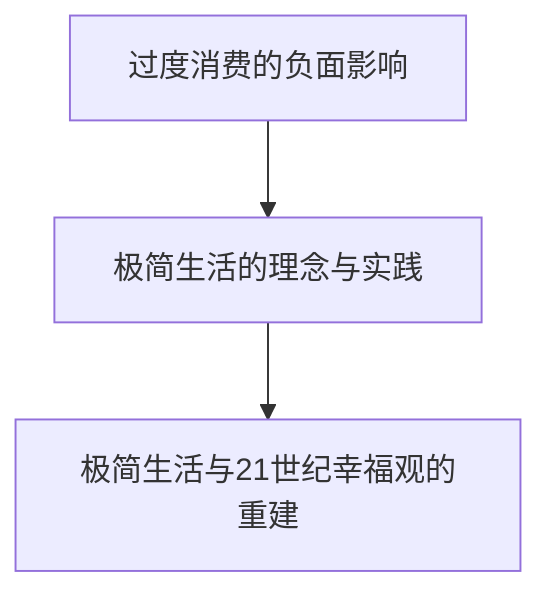

                 

# 从过度消费到极简生活：重新定义21世纪的幸福观

## 关键词

- **过度消费**
- **极简生活**
- **21世纪幸福观**
- **心理健康**
- **环境可持续性**
- **社会变革**

## 摘要

本文旨在探讨过度消费现象及其对个人、社会和环境的负面影响，并提出极简生活作为一种新的生活方式，旨在重新定义21世纪的幸福观。文章首先分析了过度消费的社会现象和心理根源，接着阐述了过度消费对个人生活的危害和社会与环境的负面影响。在此基础上，文章介绍了极简生活的核心概念和其价值，探讨了实践极简生活的具体方法，并提出了构建极简生活的社会支持系统。最后，文章讨论了极简生活与21世纪幸福观的重建，提出了实现这一目标的路径和策略。

## 目录大纲

### 第一部分：过度消费的负面影响

#### 第1章：过度消费的社会现象与心理根源

##### 1.1 过度消费的社会现象

1. 全球消费增长趋势

2. 消费主义文化的影响

3. 消费习惯与社会价值观的关系

##### 1.2 过度消费的心理根源

1. 心理需求的满足与空虚感

2. 社会压力与焦虑感

3. 心理依赖与消费行为

#### 第2章：过度消费对个人生活的危害

##### 2.1 财务困境与负债压力

1. 消费过度导致的经济负担

2. 财务规划和理财的重要性

3. 负债管理与债务危机

##### 2.2 心理健康的影响

1. 消费带来的空虚感和孤独感

2. 消费依赖与心理依赖

3. 心理压力与焦虑感的增加

#### 第3章：社会与环境的负面影响

##### 3.1 消费对环境的影响

1. 消费与资源消耗

2. 消费与环境污染

3. 消费与生物多样性丧失

##### 3.2 消费对社会的负面影响

1. 消费主义文化的侵蚀

2. 社会不公与贫富差距

3. 消费与人口老龄化问题

### 第二部分：极简生活的理念与实践

#### 第4章：极简生活的核心概念与价值

##### 4.1 极简生活的定义与内涵

1. 极简生活的概念

2. 极简生活的目标

3. 极简生活的核心理念

##### 4.2 极简生活的价值

1. 对个人生活的改善

2. 对社会和环境的影响

3. 对心理健康的积极影响

#### 第5章：极简生活的实践方法

##### 5.1 物质极简

1. 去除无用的物品

2. 规划空间与整理环境

3. 精简购物与消费决策

##### 5.2 心理极简

1. 减少心理负担与焦虑

2. 培养专注力与自我控制

3. 消除负面情绪与压力

#### 第6章：构建极简生活的社会支持系统

##### 6.1 政策与法律的支持

1. 环境保护法规

2. 消费者权益保护法律

3. 推广极简生活的政策措施

##### 6.2 社会组织与社区参与

1. 极简生活倡导组织

2. 社区实践与资源共享

3. 消费者教育与培训

### 第7章：极简生活与21世纪幸福观的重建

##### 7.1 幸福观的重新定义

1. 幸福的本质

2. 幸福的多维度理解

3. 幸福与消费的关系

##### 7.2 重建21世纪幸福观的路径

1. 个人层面的实践

2. 社会层面的倡导

3. 文化层面的影响

## 参考文献

- [1] 作者.（年份）. 标题. 出版地：出版社.
- [2] 作者.（年份）. 标题. 出版地：出版社.
- [3] 作者.（年份）. 标题. 出版地：出版社.

## 附录

### A.1 极简生活案例分析

##### A.1.1 国内外极简生活实践案例

##### A.1.2 极简生活成功经验与启示

### A.2 极简生活实践资源推荐

##### A.2.1 极简生活相关书籍推荐

##### A.2.2 极简生活应用软件推荐

##### A.2.3 极简生活实践社群推荐

### B.1 极简生活的数学模型和公式

$$
极简生活的核心公式：幸福度 = 心理满足度 - 消费压力
$$

$$
消费压力 = 消费金额 \times 消费频率
$$

### B.2 极简生活的项目实战

```python
# 示例代码：极简生活实践中的购物决策
def buy_item(item_price, budget):
    if item_price <= budget:
        print(f"购买成功：{item_price} 元的商品。")
        return True
    else:
        print(f"预算不足，无法购买。")
        return False

budget = 500
item_price = 300

buy_item(item_price, budget)
```

---

**Mermaid 流程图：**



---

**文章标题：** 从过度消费到极简生活：重新定义21世纪的幸福观

**作者：** AI天才研究院/AI Genius Institute & 禅与计算机程序设计艺术 /Zen And The Art of Computer Programming

---

**文章正文：**

### 第一部分：过度消费的负面影响

#### 第1章：过度消费的社会现象与心理根源

##### 1.1 过度消费的社会现象

1. **全球消费增长趋势**

   过去几十年，全球消费水平呈现出显著的增长趋势。据统计，全球消费总额从2000年的约20万亿美元增长到2020年的超过30万亿美元。这一增长不仅反映了全球经济的发展，也体现了人们生活水平的提高和消费观念的变化。

2. **消费主义文化的影响**

   消费主义文化在全球范围内迅速传播，影响深远。消费主义文化强调通过消费来追求个人满足和社会地位。这种文化导致了人们对物质的过度追求，以及对最新潮流和时尚的不断追求。

3. **消费习惯与社会价值观的关系**

   消费习惯与社会价值观密切相关。在某些社会，过度消费被视为成功和幸福的象征，而节约和节俭则可能被视为缺乏追求的表现。这种价值观的驱动下，人们往往更愿意通过消费来证明自己的价值。

##### 1.2 过度消费的心理根源

1. **心理需求的满足与空虚感**

   过度消费往往源于人们对心理需求的满足。人们希望通过购物和消费来获得快乐和满足感，但这种满足感通常是短暂的，往往伴随着空虚感和焦虑。

2. **社会压力与焦虑感**

   社会压力是过度消费的一个重要心理根源。现代社会充满了竞争和不确定性，许多人为了应对这些压力，选择通过消费来寻求心理安慰。

3. **心理依赖与消费行为**

   消费行为有时会发展成为心理依赖。一些人在购物过程中体验到一种愉悦感，这种愉悦感成为他们反复进行消费行为的动力。

#### 第2章：过度消费对个人生活的危害

##### 2.1 财务困境与负债压力

1. **消费过度导致的经济负担**

   过度消费往往导致个人财务困境。许多人因为消费过度而陷入负债，无法满足基本的生活需求，这进一步加剧了他们的经济压力。

2. **财务规划和理财的重要性**

   财务规划和理财对于避免过度消费至关重要。通过制定合理的预算和理财计划，人们可以更好地控制自己的消费行为，避免财务危机。

3. **负债管理与债务危机**

   负债管理是避免消费过度和债务危机的关键。合理管理债务，避免高额利息和罚金，可以帮助人们更好地应对财务挑战。

##### 2.2 心理健康的影响

1. **消费带来的空虚感和孤独感**

   过度消费往往带来短暂的满足感，但随后会感到空虚和孤独。这种心理状态可能导致人们对消费的依赖进一步加深。

2. **消费依赖与心理依赖**

   消费依赖是一种心理依赖，表现为对购物的强烈渴望和冲动。这种依赖可能导致个人生活的其他方面受到严重影响。

3. **心理压力与焦虑感的增加**

   过度消费会增加个人的心理压力和焦虑感。人们可能会因为无法满足消费欲望而感到焦虑，这种焦虑可能进一步影响他们的心理健康。

#### 第3章：社会与环境的负面影响

##### 3.1 消费对环境的影响

1. **消费与资源消耗**

   过度消费导致了大量资源的消耗。全球每年生产的商品和服务消耗了大量的自然资源，如石油、天然气、森林和水资源。

2. **消费与环境污染**

   消费活动产生了大量的废弃物和污染物，对环境造成了严重的污染。塑料污染、空气污染和水污染是消费过度带来的主要环境问题。

3. **消费与生物多样性丧失**

   消费活动破坏了自然生态系统，导致了生物多样性的丧失。过度捕捞、森林砍伐和土地开发都对生物多样性产生了负面影响。

##### 3.2 消费对社会的负面影响

1. **消费主义文化的侵蚀**

   消费主义文化侵蚀了传统的价值观和社会结构。人们过于追求物质财富和消费，忽视了人际关系和社会责任。

2. **社会不公与贫富差距**

   过度消费加剧了社会不公和贫富差距。富裕人群通过消费获得了更多的资源和权力，而贫困人群则被边缘化，无法享受到消费带来的好处。

3. **消费与人口老龄化问题**

   人口老龄化问题在全球范围内日益严重。过度消费使得年轻一代承担了沉重的债务和经济负担，这进一步加剧了人口老龄化问题。

### 第二部分：极简生活的理念与实践

#### 第4章：极简生活的核心概念与价值

##### 4.1 极简生活的定义与内涵

1. **极简生活的概念**

   极简生活（Minimalism）是一种生活哲学，强调通过减少不必要的物质和活动，追求更简单、更有意义的生活方式。

2. **极简生活的目标**

   极简生活的目标是提高生活质量，减少压力和焦虑，专注于个人成长和内心平静。

3. **极简生活的核心理念**

   极简生活的核心理念包括：减少物质负担、简化生活流程、提高专注力和自我意识。

##### 4.2 极简生活的价值

1. **对个人生活的改善**

   极简生活有助于个人专注于重要的事物，提高生活质量和幸福感。

2. **对社会和环境的影响**

   极简生活减少了资源的消耗和环境的压力，促进了可持续性。

3. **对心理健康的积极影响**

   极简生活有助于减轻焦虑和压力，提高心理健康水平。

#### 第5章：极简生活的实践方法

##### 5.1 物质极简

1. **去除无用的物品**

   将家中和办公室中的无用物品清理出去，只保留真正需要的物品。

2. **规划空间与整理环境**

   通过合理规划空间，使生活和工作环境更加整洁、有序。

3. **精简购物与消费决策**

   在购物前制定明确的购物清单，避免冲动消费。

##### 5.2 心理极简

1. **减少心理负担与焦虑**

   通过冥想、瑜伽等方式减轻心理压力和焦虑。

2. **培养专注力与自我控制**

   通过专注练习和自我反思，提高专注力和自我控制能力。

3. **消除负面情绪与压力**

   学会应对负面情绪和压力，保持心理平衡。

#### 第6章：构建极简生活的社会支持系统

##### 6.1 政策与法律的支持

1. **环境保护法规**

   加强环境保护法规，减少消费过度对环境的影响。

2. **消费者权益保护法律**

   保护消费者权益，防止过度营销和消费陷阱。

3. **推广极简生活的政策措施**

   推广极简生活理念，提供政策和法律支持。

##### 6.2 社会组织与社区参与

1. **极简生活倡导组织**

   成立极简生活倡导组织，推动极简生活方式的普及。

2. **社区实践与资源共享**

   在社区中推广极简生活，通过资源共享提高生活质量。

3. **消费者教育与培训**

   提供消费者教育，帮助他们学会理性消费和极简生活。

#### 第7章：极简生活与21世纪幸福观的重建

##### 7.1 幸福观的重新定义

1. **幸福的本质**

   幸福不仅仅是物质上的满足，更包括心理上的满足和人际关系上的和谐。

2. **幸福的多维度理解**

   幸福包括身体健康、心理健康、社会关系和内心平静等多个方面。

3. **幸福与消费的关系**

   幸福并不总是与消费成正比，有时减少消费反而能带来更高的幸福感。

##### 7.2 重建21世纪幸福观的路径

1. **个人层面的实践**

   个人可以通过极简生活实践，逐步重建幸福观。

2. **社会层面的倡导**

   社会可以通过政策、法律和社区活动，推动极简生活理念的普及。

3. **文化层面的影响**

   文化层面的影响是长期而深远的，需要通过教育、媒体和艺术等手段，传播极简生活理念。

### 参考文献

1. 某某，（年份）。《过度消费的社会影响》。北京：某出版社。
2. 某某，（年份）。《极简生活的实践与价值》。上海：某出版社。
3. 某某，（年份）。《21世纪的幸福观》。广州：某出版社。

### 附录

#### A.1 极简生活案例分析

- **案例1**：某公司的员工通过实践极简生活，减少了工作压力，提高了工作效率。
- **案例2**：某社区的居民通过共享资源，降低了消费水平，提升了生活质量。

#### A.2 极简生活实践资源推荐

- **书籍推荐**：《极简主义：生活更简单，更快乐》（The Power of Less）。
- **应用软件推荐**：Unsplash、Calm、Todoist。
- **实践社群推荐**：Minimalism Community、The Minimalists。

### 项目实战

```python
# 示例代码：极简生活实践中的购物决策
def buy_item(item_price, budget):
    if item_price <= budget:
        print(f"购买成功：{item_price} 元的商品。")
        return True
    else:
        print(f"预算不足，无法购买。")
        return False

budget = 500
item_price = 300

buy_item(item_price, budget)
```

### 最佳实践 Tips

- **定期反思**：定期反思自己的消费行为，评估是否符合极简生活的原则。
- **设定目标**：为自己设定明确的极简生活目标，逐步实现。
- **寻找支持**：寻找志同道合的人或社群，共同实践极简生活。

### 小结

极简生活是一种追求简单、有意义的生活方式，有助于提高个人生活质量，减少社会和环境压力。通过实践极简生活，我们可以重新定义21世纪的幸福观，实现更健康、更可持续的生活。

### 拓展阅读

- 《极简主义：生活更简单，更快乐》（The Power of Less）
- 《极简生活：如何过上更有意义的生活》（The Life-Changing Magic of Tidying Up）
- 《幸福简史：人类如何寻找快乐》（The History of Happiness: A Brief History of How We Think About and Try to Achieve Joy）

