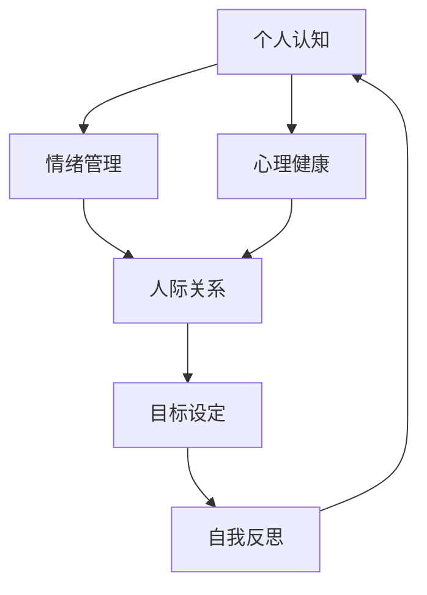

                 

### 从迷失到重生：现代人的精神成长历程

在现代社会，我们每个人似乎都在追求某种形式的“成功”，但往往在这个过程中迷失了自我。现代人的精神成长历程，就像一场深奥的探险，需要我们不断探索、反思和成长。本书旨在探讨这一重要的主题，帮助读者理解并实践精神成长的方法，从而实现从迷失到重生的转变。

**关键词：** 精神成长、自我认知、心理健康、目标设定、人际关系、自我反思、自我超越

**摘要：** 本书将详细探讨现代人精神成长的各个方面，从核心概念、心理健康的基石，到应对压力与挑战、人际关系艺术、目标设定与实现，以及自我反思和自我超越。通过逐步分析和推理，本书将提供一个逻辑清晰、结构紧凑、简单易懂的指导，帮助读者在现代社会中找到自己的位置，实现精神上的重生。

## 前言

### 1. 引言

在技术飞速发展的今天，我们的日常生活被智能手机、互联网和各种应用程序包围。这些技术为我们带来了便利，但同时也带来了巨大的压力和困惑。现代人往往感到迷失，他们不知道自己的方向在哪里，不知道如何处理内心的纷扰。这种精神上的迷失，不仅仅是个人的问题，更是社会问题。因此，探讨现代人的精神成长历程具有重要的现实意义。

**个人精神成长的重要性：** 个人精神成长不仅仅是追求心理上的平静和满足，更是实现自我价值、提升生活质量的重要途径。一个精神健康的人，能够更好地适应社会的变化，更好地处理人际关系，更能够面对生活中的各种挑战。

**本书的目标与读者：** 本书的目标是帮助读者理解精神成长的重要性，提供一套系统的、实用的方法和技巧，帮助读者实现精神上的重生。无论你是职场人士、学生，还是家庭主妇，只要你渴望成长、寻找方向，本书都适合你。

### 2. 什么是精神成长？

**精神成长的概念：** 精神成长指的是个体在认知、情感、行为等方面不断发展的过程。它不仅仅是心理上的成熟，更包括对人生意义的探索和自我价值的实现。

**精神成长的价值：** 精神成长有助于提高个体的心理韧性，增强面对压力和挑战的能力。同时，它也能够提升个体的幸福感，帮助个体更好地理解自己和他人，建立更健康的人际关系。

### 3. 精神成长的阶段

**成长期的分阶段概述：** 精神成长可以分为几个阶段，包括婴儿期、儿童期、青少年期、成年期和老年期。每个阶段都有其独特的特点和挑战。

**每个阶段的特点：** 婴儿期主要是依赖性和探索性的发展；儿童期是自我认同和价值观形成的关键时期；青少年期则面临着身份认同和社会角色的探索；成年期是精神成长的关键时期，个体开始承担更多的社会责任；老年期则是反思和整合的阶段，个体开始回顾自己的一生，重新审视生活的意义。

### 4. 精神成长的核心概念实体联系图

为了更直观地理解精神成长的核心概念，我们可以使用Mermaid流程图来展示它们之间的联系。以下是一个简单的示例：

这个流程图展示了个人认知、情绪管理、心理健康、人际关系、目标设定和自我反思之间的重要联系。每个部分都是精神成长不可或缺的一部分，它们相互影响、相互支持，共同构成了个体的精神成长路径。

通过这个简单的流程图，我们可以更好地理解精神成长的核心概念，以及它们在个体发展中的重要性。在接下来的章节中，我们将进一步探讨这些概念，并提供具体的实践方法和技巧，帮助读者在精神成长的道路上迈出坚实的步伐。

## 第1章 精神成长的核心概念

### 1.1 精神成长的定义与价值

**精神成长的概念：** 精神成长是指个体在认知、情感、行为等方面不断进步和发展的过程。这个过程不仅仅是心理上的成熟，还包括对人生意义的探索和自我价值的实现。精神成长是一个全面的过程，涉及到个体内心世界的丰富和深化。

**精神成长的价值：** 精神成长对个体的生活具有深远的影响。首先，它能够提高个体的心理韧性，帮助个体更好地应对生活中的压力和挑战。一个精神健康的人，能够以更积极、更乐观的态度面对生活中的困难，从而减少心理负担。

其次，精神成长有助于提升个体的幸福感。通过深入探索自我，个体能够更好地理解自己的需求和愿望，找到内心的平衡和满足。这种内在的满足感，是物质财富无法替代的。

此外，精神成长还能够促进人际关系的健康发展。一个成熟的人，更能够理解和尊重他人，更能够建立和维护良好的人际关系。这种关系不仅有助于个体的社交生活，还能够带来心理上的支持与安慰。

**精神成长与心理健康的关系：** 精神成长和心理健康是密不可分的。心理健康是精神成长的基础，而精神成长则是心理健康的重要保障。一个心理健康的人，通常具有积极的心态、良好的情绪调节能力和稳定的心理状态。这些能力有助于他们在面对压力和挑战时，能够保持冷静、理智和从容。

**精神成长在不同人生阶段的重要性：** 精神成长在不同的人生阶段都有其独特的重要性。在婴儿期和儿童期，精神成长主要表现为对自我认知和周围世界的探索。在这个阶段，个体的主要任务是建立安全感和自信心。

在青少年期，精神成长的重要性更加突出。这个阶段是自我认同和价值观形成的关键时期。青少年需要通过不断的试错和探索，找到自己的兴趣和方向，形成独立的个性和价值观。

成年期是精神成长的关键阶段。在这个阶段，个体开始承担更多的社会责任，面临着事业、家庭和社交等多方面的压力。精神成长有助于个体更好地应对这些挑战，保持内心的平静和坚定。

老年期是精神成长的反思和整合阶段。个体在这个阶段开始回顾自己的一生，重新审视生活的意义和价值。这种反思有助于个体实现心理上的满足和安宁。

### 1.2 精神成长的阶段

**成长期的分阶段概述：** 精神成长可以大致分为以下几个阶段：

1. **婴儿期和儿童期：** 这个阶段主要是自我认知和周围世界的探索。婴儿和儿童通过感官和经验，逐渐建立起对世界的认知和对自己的理解。

2. **青少年期：** 青少年期是自我认同和价值观形成的关键时期。这个阶段，青少年开始思考“我是谁”、“我将走向何方”等问题，探索自己的兴趣和方向。

3. **成年期：** 成年期是精神成长的关键时期。个体在这个阶段开始承担更多的社会责任，面临事业、家庭和社交等多方面的挑战。精神成长有助于个体更好地应对这些挑战，保持内心的平静和坚定。

4. **老年期：** 老年期是精神成长的反思和整合阶段。个体在这个阶段开始回顾自己的一生，重新审视生活的意义和价值。这种反思有助于个体实现心理上的满足和安宁。

**每个阶段的特点：** 在每个阶段，精神成长都有其独特的特点和任务：

- **婴儿期和儿童期：** 主要任务是建立安全感、自信心和基本的生活技能。这个阶段的关键在于培养好奇心和探索精神。

- **青少年期：** 主要任务是探索自我、建立自我认同和价值观。青少年需要通过尝试和错误，找到自己的兴趣和方向。

- **成年期：** 主要任务是应对生活中的各种挑战，建立稳定的事业和家庭。成年人的精神成长在于不断学习和适应，保持内心的成长和进步。

- **老年期：** 主要任务是反思和整合一生，重新审视生活的意义和价值。老年人的精神成长在于保持开放的心态，继续学习和成长。

### 1.3 精神成长的核心概念实体联系图

为了更直观地理解精神成长的核心概念，我们可以使用Mermaid流程图来展示它们之间的联系。以下是一个简单的示例：

这个流程图展示了个人认知、情绪管理、心理健康、人际关系、目标设定和自我反思之间的重要联系。每个部分都是精神成长不可或缺的一部分，它们相互影响、相互支持，共同构成了个体的精神成长路径。

通过这个简单的流程图，我们可以更好地理解精神成长的核心概念，以及它们在个体发展中的重要性。在接下来的章节中，我们将进一步探讨这些概念，并提供具体的实践方法和技巧，帮助读者在精神成长的道路上迈出坚实的步伐。

## 第2章 心理健康的基石

心理健康是精神成长的重要基石，它直接影响个体的情绪、行为和整体幸福感。在这一章节中，我们将深入探讨自我认知的重要性、情绪管理的方法，以及建立健康的生活方式。

### 2.1 自我认知的重要性

**自我认知的概念：** 自我认知是指个体对自己内心世界的了解和认识，包括自己的情感、行为、动机和价值观等。它是精神成长的基础，因为只有了解自己，才能更好地理解他人，更好地应对生活中的各种挑战。

**自我认知的方法：** 自我认知可以通过多种方式进行，包括自我反思、与他人交流、专业咨询等。以下是一些有效的自我认知方法：

- **自我反思日记：** 每天花一些时间写下自己的感受和思考，可以帮助你更好地了解自己的情绪和行为模式。
- **冥想：** 通过冥想，你可以培养专注力，深入探索自己的内心世界。
- **与人交流：** 与朋友、家人或心理咨询师交流，可以帮助你从不同的角度看待自己，获得更全面的自我认知。
- **心理测试：** 通过专业的心理测试，你可以更科学地了解自己的性格特点、优点和不足。

### 2.2 情绪管理

**情绪管理的重要性：** 情绪管理是指个体如何处理和调节自己的情绪。情绪管理的好坏直接影响个体的心理健康和生活质量。良好的情绪管理能力可以帮助个体更好地应对压力，保持积极的心态。

**情绪管理的方法：** 情绪管理可以通过以下几种方法进行：

- **认知重构：** 通过改变对事情的看法和解释，调整自己的情绪反应。例如，将“我一定会失败”改为“我可以尝试，即使失败，也是一个宝贵的学习经验”。
- **情感表达：** 找到合适的方式表达自己的情感，例如通过写日记、绘画、运动等。
- **放松技巧：** 学习放松技巧，如深呼吸、瑜伽、冥想等，可以帮助个体缓解紧张和焦虑。
- **寻求支持：** 在遇到情绪困扰时，及时寻求家人、朋友或专业人士的支持和帮助。

### 2.3 建立健康的生活方式

**健康的生活方式：** 健康的生活方式是指通过合理的饮食、适量的运动、充足的睡眠和良好的生活习惯，维持身心健康的状态。

**健康生活方式的具体实践：**

- **合理饮食：** 保持均衡的饮食，摄入足够的蛋白质、维生素和矿物质。避免过量摄入糖分和脂肪，减少加工食品的摄入。
- **适量运动：** 每周至少进行150分钟的中等强度运动，如快走、游泳或骑自行车。适量运动有助于提高心肺功能，增强免疫力。
- **充足睡眠：** 保持每晚7-9小时的充足睡眠，有助于恢复体力和精神状态。
- **良好生活习惯：** 保持良好的作息习惯，如按时起床、睡觉，避免熬夜。培养积极的生活态度，如乐观、感恩等。

通过以上方法和实践，个体可以更好地管理自己的情绪，保持心理健康，建立健康的生活方式。这是精神成长的重要基石，也是实现个人幸福和成功的关键。

### 2.4 心理健康的基石在精神成长中的重要性

心理健康作为精神成长的基石，对个体的整体发展具有深远的影响。一个心理健康的人，能够更好地理解自我，应对生活中的各种挑战，保持良好的情绪状态。以下是心理健康在精神成长中的几个关键作用：

**1. 提高自我认知能力：** 心理健康有助于个体更清晰地认识自己，了解自己的情感、需求和动机。这种自我认知能力是精神成长的基础，只有了解自己，个体才能更好地设定目标、规划人生路径。

**2. 增强心理韧性：** 心理健康使个体具备更强的心理韧性，能够更好地应对生活中的压力和挑战。这种韧性不仅有助于个体在困难面前保持冷静和理智，还能够促进个体的持续成长和发展。

**3. 提升生活质量：** 心理健康直接影响到个体的生活质量。一个心理健康的人，通常拥有更高的幸福感、更强的社会适应能力和更好的工作表现。这种生活质量上的提升，是精神成长的重要体现。

**4. 促进人际关系发展：** 心理健康有助于个体建立和维护良好的人际关系。一个心理健康的人，更能够理解和尊重他人，更能够有效地沟通和解决冲突。这种人际关系的发展，是精神成长的重要组成部分。

**5. 增强整体幸福感：** 心理健康是整体幸福感的基础。一个心理健康的人，通常能够体验到更多的快乐、满足和成就感。这种幸福感不仅来自物质层面的满足，更源于精神层面的成长和自我实现。

总之，心理健康是精神成长不可或缺的基石。只有拥有健康的心理状态，个体才能在精神成长的道路上稳步前行，实现自我价值，获得真正的幸福和成功。

### 2.5 实际案例与心理健康的关系

为了更深入地理解心理健康与精神成长之间的关系，我们可以通过实际案例来探讨这一问题。以下是一个具体的案例：

**案例：** 小明，一位年轻的程序员，在一家知名科技公司工作。他在工作中表现出色，但逐渐感到焦虑和压力。他的情绪波动很大，工作效率也开始下降。最终，他决定寻求心理咨询。

**心理咨询过程：** 在心理咨询中，小明通过自我反思和咨询师的帮助，逐渐认识到了自己的情绪管理问题。他了解到自己的焦虑和压力主要来源于对成功的过度追求和对失败的恐惧。通过认知重构和放松技巧，小明学会了更好地管理自己的情绪，减轻了焦虑感。

**案例分析与启示：** 通过这个案例，我们可以看到心理健康对精神成长的重要性。小明的焦虑和压力，不仅影响了他的情绪状态，也影响了他的工作和生活质量。通过心理咨询，小明学会了更有效地管理情绪，提高了自我认知能力，最终实现了精神上的成长。

这个案例启示我们，心理健康是精神成长的重要保障。只有在健康的心理状态下，个体才能更好地应对生活中的挑战，实现自我价值和成长。因此，重视心理健康，采取有效的心理管理方法，对每个人的精神成长至关重要。

### 2.6 总结与进一步思考

通过本章的探讨，我们可以看到心理健康在精神成长中的核心地位。自我认知、情绪管理和健康的生活方式，都是维持心理健康的重要途径。在实际案例中，我们看到了心理健康对精神成长的积极影响。

然而，精神成长是一个复杂而持久的过程，需要个体不断地自我反思和调整。在接下来的章节中，我们将继续探讨如何应对压力与挑战、建立良好的人际关系，以及如何设定和实现目标。通过这些实践，我们可以进一步提升自己的精神成长，实现从迷失到重生的转变。

### 2.7 小结

本章详细探讨了心理健康的基石在精神成长中的重要性。通过自我认知、情绪管理和健康的生活方式，个体可以更好地理解自我，提高心理韧性，提升生活质量。实际案例进一步展示了心理健康对精神成长的积极影响。

**关键词：** 自我认知、情绪管理、健康生活方式、心理健康、精神成长

**注意事项：** 
- **重视心理健康：** 心理健康是精神成长的基础，需要个体高度重视和持续关注。
- **持续实践：** 自我认知、情绪管理和健康生活方式需要通过持续实践来巩固和提高。

**拓展阅读：** 
- 《如何改变自己：自我认知与情绪管理》
- 《身心健康：健康生活方式的实践》

---

在精神成长的道路上，心理健康是我们前行的重要基石。通过理解和实践本章所讨论的内容，我们可以更好地维护自己的心理健康，为后续的精神成长打下坚实的基础。在下一章中，我们将探讨如何应对生活中的压力与挑战，进一步提升我们的精神成长。

---

## 第3章 应对压力与挑战

压力和挑战是生活中不可避免的一部分，它们对我们的身心健康和成长具有双重影响。适度的压力可以激发我们的潜能，推动我们前进；但过度的压力则可能导致焦虑、抑郁等心理问题，影响我们的生活质量。在这一章节中，我们将深入探讨压力的来源、如何将挑战转化为机会，以及培养坚韧精神的重要性。

### 3.1 压力的来源

**压力的主要来源：** 压力的来源多种多样，主要包括以下几个方面：

- **工作压力：** 在职场中，工作任务繁重、竞争激烈，常常使人感到压力重重。尤其是对于那些追求完美的人来说，工作中的压力更为显著。
- **生活压力：** 家庭、财务、健康等方面的问题都会产生压力。例如，抚养子女、购房、医疗费用等都是生活中的重要压力源。
- **人际关系：** 人际关系问题，如家庭矛盾、朋友疏远等，也会带来压力。人际冲突和沟通不畅往往会让人感到疲惫和沮丧。
- **自我期望：** 过高的自我期望也会导致压力。许多人因为对自己的要求过高，常常感到无法满足，从而产生压力。

**应对压力的策略：** 面对压力，我们需要采取有效的策略来应对。以下是一些常见的应对策略：

- **调整心态：** 学会接受压力是生活的一部分，尝试以更积极的心态面对压力。通过正面思考，将压力转化为动力。
- **合理规划：** 合理安排工作和生活，确保有足够的休息时间。避免过度工作，确保有足够的精力应对其他事务。
- **寻求支持：** 当感到压力过大时，不要犹豫寻求家人、朋友或专业人士的支持。通过沟通和倾诉，减轻心理负担。
- **放松技巧：** 学习一些放松技巧，如深呼吸、冥想、瑜伽等，有助于缓解压力。这些技巧可以在短时间内让人放松，恢复精力。

### 3.2 挑战与机会

**挑战的两种面貌：** 挑战既有积极的一面，也有消极的一面。积极的一面是挑战可以激发我们的潜能，推动我们成长；消极的一面是挑战可能会带来压力和挫败感。

**如何将挑战转化为机会：** 将挑战转化为机会的关键在于态度和策略。以下是一些建议：

- **积极心态：** 保持积极的心态，将挑战视为成长和发展的机会。相信自己有能力克服困难，迎接挑战。
- **制定计划：** 在面对挑战时，制定详细的计划，明确目标和方法。通过有条不紊的步骤，逐步实现目标。
- **持续学习：** 面对挑战，不断学习和提升自己的能力。通过学习，可以更好地应对挑战，抓住机会。
- **灵活调整：** 在实施计划的过程中，根据实际情况灵活调整策略。面对变化和不确定性，保持开放和适应的态度。

### 3.3 坚韧精神的培养

**坚韧精神的定义：** 坚韧精神是指在面对困难和挑战时，能够坚持不懈、勇往直前的精神品质。它是一种内在的力量，能够帮助我们克服逆境，实现目标。

**培养坚韧精神的方法：** 培养坚韧精神需要长期的实践和锻炼。以下是一些有效的方法：

- **树立目标：** 有明确的目标是培养坚韧精神的第一步。设定长期和短期目标，让自己有方向和动力去努力。
- **积极态度：** 保持积极的态度，相信自己能够克服困难。积极思考可以帮助我们找到解决问题的方法。
- **持之以恒：** 坚韧精神不是一夜之间培养出来的，需要通过持之以恒的努力来积累。面对困难，不要轻易放弃，要坚持到底。
- **反思总结：** 在面对挑战时，及时反思和总结经验教训。通过反思，可以不断提升自己的能力和应对策略。

通过培养坚韧精神，我们可以更好地应对生活中的压力和挑战，实现精神上的成长和重生。

### 3.4 实际案例与挑战的应对

为了更好地理解如何应对挑战，我们可以通过实际案例来探讨这一问题。以下是一个具体的案例：

**案例：** 小红是一名刚毕业的大学生，她在一家知名企业找到了一份工作。然而，由于工作经验不足，她在工作中遇到了很多困难。尤其是当项目遇到瓶颈时，她感到非常沮丧和焦虑。

**应对过程：** 小红意识到自己的问题后，采取了以下措施：

1. **积极寻求支持：** 她向同事和上级请教，寻求他们的建议和帮助。通过沟通，她学到了很多宝贵的经验。
2. **制定详细计划：** 她制定了详细的计划，逐步解决项目中遇到的问题。她将大问题分解为小问题，逐一克服。
3. **持续学习和反思：** 她利用业余时间学习相关的知识和技能，不断提升自己的能力。同时，她定期反思自己的工作，总结经验教训。

**案例分析与启示：** 通过这个案例，我们可以看到，在面对挑战时，积极寻求支持、制定详细计划和持续学习是非常重要的。小红的成功在于她能够将挑战转化为成长的机会，通过积极的态度和有效的策略，克服了工作中的困难。

这个案例启示我们，面对挑战时，保持积极心态、制定合理计划和持续学习是关键。通过这些方法，我们可以更好地应对挑战，实现精神上的成长。

### 3.5 总结与进一步思考

通过本章的探讨，我们可以看到压力和挑战对精神成长的双重影响。适度的压力可以激发我们的潜能，推动我们成长；而应对不当的挑战则可能带来负面影响。通过有效的应对策略和培养坚韧精神，我们可以更好地应对压力和挑战，实现精神上的重生。

**关键词：** 压力、挑战、应对策略、坚韧精神、精神成长

**注意事项：** 
- **积极心态：** 保持积极的心态，将挑战视为成长的机会。
- **合理计划：** 制定详细的计划，逐步克服困难。
- **持续学习：** 不断提升自己的能力和应对策略。

**拓展阅读：** 
- 《应对压力：策略与技巧》
- 《坚韧精神：如何在逆境中成长》

---

在应对压力与挑战的过程中，积极心态、合理计划和持续学习是关键。通过培养坚韧精神，我们可以更好地应对生活中的各种挑战，实现精神上的成长。在下一章中，我们将探讨人际关系的重要性，以及如何建立和维护良好的人际关系。

---

## 第4章 人际关系的艺术

人际关系是精神成长的重要组成部分，它直接影响我们的情感状态和生活质量。建立和维护良好的人际关系，不仅有助于提高我们的幸福感，还能为我们在职场和生活中提供支持。在这一章节中，我们将深入探讨人际关系的重要性、人际沟通技巧，以及解决冲突的方法。

### 4.1 人际关系的重要性

**人际关系对精神成长的影响：** 人际关系对精神成长有着深远的影响。一个健康的人际关系网络可以为我们提供情感支持、职业机会和社交资源。以下是人际关系对精神成长的几个关键作用：

- **情感支持：** 在生活中，我们总会遇到困难和挫折。良好的人际关系可以为我们提供情感上的支持，减轻心理压力，增强心理韧性。
- **职业发展：** 人际关系对于职业发展至关重要。一个广阔的人际网络可以帮助我们获取更多的职业机会，促进职业成长。
- **社会融入：** 健康的人际关系有助于我们更好地融入社会，增强社会归属感，提高生活质量。
- **个人成长：** 与他人的互动可以让我们学习到不同的观点和经验，从而促进自我认知和成长。

**人际关系的目标：** 在建立和维护人际关系时，我们的目标是：

- **建立信任：** 建立信任是人际关系的重要基础。信任可以促进有效的沟通和合作，使关系更加稳固。
- **相互尊重：** 尊重他人是建立良好人际关系的关键。通过尊重他人，我们可以获得他人的尊重，建立和谐的关系。
- **积极互动：** 积极互动有助于加深彼此的了解，增强关系的亲密度。通过共同的兴趣和活动，我们可以更好地维系人际关系。

### 4.2 人际沟通技巧

**有效沟通的原则：** 人际沟通是人际关系中最重要的技能之一。以下是一些有效沟通的原则：

- **倾听：** 倾听是有效沟通的第一步。通过倾听，我们可以了解对方的观点和感受，建立信任和理解。
- **清晰表达：** 清晰地表达自己的想法和感受，是有效沟通的关键。避免使用模糊的词汇和模糊的意图，确保对方能够准确理解。
- **开放心态：** 保持开放的心态，接受不同的观点和意见。通过开放的心态，我们可以更好地理解他人，避免冲突。
- **尊重差异：** 每个人都有自己独特的观点和经验。尊重差异，避免偏见和歧视，是建立良好人际关系的基础。

**沟通技巧的实际应用：** 在实际沟通中，以下技巧可以帮助我们更好地与他人交流：

- **非语言沟通：** 非语言沟通包括肢体语言、面部表情、眼神交流等。通过恰当的非语言沟通，我们可以增强语言表达的效果，建立更好的互动。
- **提问技巧：** 提问是了解对方观点和感受的有效方式。通过开放式提问，我们可以引导对方分享更多信息，建立更深层次的沟通。
- **情感回应：** 情感回应是指对对方的情感表达给予积极的反馈。通过情感回应，我们可以表达对对方的关心和理解，增强关系的亲密度。

### 4.3 解决冲突

**冲突解决的方法：** 在人际关系中，冲突是不可避免的。有效解决冲突，可以维护良好的人际关系，促进双方的成长。以下是一些解决冲突的方法：

- **冷静处理：** 当冲突发生时，保持冷静是非常重要的。通过冷静处理，我们可以避免情绪化的回应，更好地分析问题。
- **沟通和倾听：** 通过沟通和倾听，我们可以了解对方的观点和感受，找到问题的根本原因。
- **寻求共识：** 寻求共识是解决冲突的关键。通过共同探讨解决方案，我们可以找到双方都能接受的解决办法。
- **妥协和让步：** 在某些情况下，妥协和让步是必要的。通过妥协和让步，我们可以维护关系的稳定，实现双赢。

**冲突解决的实际案例：** 以下是一个具体的冲突解决案例：

**案例：** 小明和小红是同事，他们在项目合作中出现了分歧。小明认为项目进度太慢，而小红则认为资源不足。两人的观点不一致，导致项目进展受阻。

**解决过程：** 小明和小红决定坐下来沟通，他们详细讨论了项目的进展和存在的问题。通过沟通，他们找到了问题的根本原因：资源分配不合理。他们共同探讨了解决方案，决定重新分配资源，并制定更详细的项目计划。

**案例分析与启示：** 通过这个案例，我们可以看到，有效的沟通和寻求共识是解决冲突的关键。通过冷静处理和共同探讨，小明和小红成功地解决了冲突，保证了项目的顺利进行。

这个案例启示我们，在面对冲突时，冷静处理、沟通和寻求共识是重要的策略。通过这些方法，我们可以更好地解决冲突，维护良好的人际关系。

### 4.4 人际关系中的自我认知

**人际关系中的自我认知：** 在人际关系中，自我认知是非常重要的。通过自我认知，我们可以了解自己在关系中的角色和影响，从而更好地与他人互动。以下是一些自我认知的方法：

- **反思日记：** 每天花时间反思自己的行为和想法，可以帮助我们了解自己在人际关系中的表现。
- **心理测试：** 通过专业的心理测试，我们可以了解自己的性格特点和人际交往风格。
- **寻求反馈：** 向他人寻求反馈，了解他们在人际关系中的感受和看法，可以帮助我们更全面地了解自己。

通过自我认知，我们可以更好地调整自己的行为，建立和维护良好的人际关系。

### 4.5 总结与进一步思考

通过本章的探讨，我们可以看到人际关系在精神成长中的重要性。建立和维护良好的人际关系，可以为我们提供情感支持、职业机会和社会融入。有效沟通和解决冲突的方法，可以帮助我们更好地处理人际关系中的问题。通过自我认知，我们可以更好地理解自己在人际关系中的角色和影响。

**关键词：** 人际关系、沟通技巧、冲突解决、自我认知、精神成长

**注意事项：**
- **重视人际关系：** 建立和维护良好的人际关系是精神成长的重要一环。
- **有效沟通：** 提高沟通技巧，增强人际互动。
- **解决冲突：** 学会冷静处理和寻求共识，解决人际关系中的冲突。

**拓展阅读：**
- 《人际沟通技巧：建立有效人际关系的艺术》
- 《冲突管理：如何在冲突中找到解决方案》

在下一章中，我们将探讨如何设定和实现目标，以及成长过程中的坚持与调整。

---

通过理解人际关系的重要性，掌握有效的沟通技巧和解决冲突的方法，我们可以更好地维护人际关系，促进精神成长。在下一章中，我们将探讨如何设定和实现目标，以及成长过程中的坚持与调整。

---

## 第5章 目标设定与实现

在精神成长的过程中，设定和实现目标是至关重要的一步。明确的目标可以帮助我们找到方向，激励我们不断前进。然而，目标设定和实现并非易事，需要我们具备一定的策略和技巧。在这一章节中，我们将深入探讨目标设定的原则、制定行动计划的步骤，以及如何在成长过程中坚持与调整。

### 5.1 目标设定的原则

**SMART原则：** SMART原则是一种广泛用于目标设定的方法，它包括以下五个要素：

- **Specific（具体）：** 目标应当具体明确，具体到可以衡量的程度。例如，而不是说“我要变瘦”，而是说“我要减掉10公斤体重”。
- **Measurable（可衡量）：** 目标应当是可衡量的，以便我们可以知道是否实现了目标。例如，而不是说“我要工作更努力”，而是说“我要每天工作10小时”。
- **Achievable（可行）：** 目标应当是可行的，即通过努力可以实现。设定不切实际的目标只会带来挫败感。例如，而不是说“我要在一个月内学会所有编程语言”，而是说“我要在一个月内学会Python编程”。
- **Relevant（相关）：** 目标应当与我们的价值观和长期目标相关。设定相关的目标可以确保我们的努力是朝着正确的方向前进。例如，而不是说“我要在一年内赚很多钱”，而是说“我要在一年内实现财务自由”。
- **Time-bound（时限）：** 目标应当有时间限制，这有助于我们保持动力和紧迫感。例如，而不是说“我要变强”，而是说“我要在三个月内提升我的健身水平”。

通过遵循SMART原则，我们可以确保设定的目标具体、可行、相关且有时间限制，从而提高目标实现的可能性。

### 5.2 制定行动计划

**制定行动计划的步骤：** 为了实现目标，我们需要制定详细的行动计划。以下是一些关键步骤：

1. **明确目标：** 根据SMART原则，明确我们的目标。例如，如果我们设定了一个减肥的目标，我们需要确定具体的体重目标、衡量标准、可行性、相关性和时间限制。
2. **分解目标：** 将大目标分解为小目标，使其更加具体和易于管理。例如，如果我们设定了一个学会Python的目标，我们可以将其分解为学习基础语法、数据结构和算法等小目标。
3. **制定行动步骤：** 确定实现每个小目标的行动步骤。例如，为了学习Python，我们可以制定每天学习2小时、每周完成一个小项目等步骤。
4. **分配资源：** 确保我们有足够的资源来实现目标。这可能包括时间、金钱、知识和人脉等。
5. **设置时间表：** 制定一个详细的时间表，包括每个行动步骤的截止日期。这有助于我们保持进度，及时调整计划。

通过这些步骤，我们可以将目标转化为具体的行动计划，提高实现目标的概率。

### 5.3 成长过程中的坚持与调整

**坚持与灵活调整：** 在实现目标的过程中，坚持和灵活调整是关键。以下是一些建议：

1. **坚持：** 坚持是实现目标的基础。我们需要保持持之以恒的态度，不断努力，直到达成目标。在实现目标的过程中，可能会遇到各种挑战和障碍，但只有坚持，才能克服这些困难。
2. **灵活调整：** 虽然坚持至关重要，但灵活调整也同样重要。在实现目标的过程中，我们可能会遇到意想不到的情况，需要我们调整计划。例如，如果原定的学习时间表因为其他紧急事务而无法执行，我们需要灵活调整，确保目标仍然可以实现。

**长期目标与短期目标的关系：** 长期目标和短期目标是相辅相成的。长期目标是我们的最终目标，而短期目标是实现长期目标的阶段性目标。通过设定和实现短期目标，我们可以逐步接近长期目标。同时，短期目标也可以帮助我们保持动力和成就感，增强实现长期目标的信心。

**保持目标与现实的平衡：** 在设定目标时，我们需要保持目标与现实的平衡。目标过高可能导致挫败感，而目标过低则可能缺乏挑战性。通过合理设定目标，我们可以确保目标既有挑战性，又可以实现。

通过以上策略，我们可以在成长过程中更好地设定和实现目标，不断推动自己的精神成长。

### 5.4 实际案例与目标设定与实现

为了更好地理解目标设定与实现的过程，我们可以通过实际案例来探讨这一问题。以下是一个具体的案例：

**案例：** 小李是一名职场新人，他在一家互联网公司工作。他设定了一个长期目标：在五年内晋升为项目经理。为了实现这一目标，他制定了以下短期目标：

1. **第一年：** 学习基础编程技能，掌握Python和Java。
2. **第二年：** 完成两个项目，积累项目经验。
3. **第三年：** 提升团队管理能力，担任团队负责人。
4. **第四年：** 担任项目经理助理，协助项目经理工作。
5. **第五年：** 独立负责项目，晋升为项目经理。

在实现这些短期目标的过程中，小李遇到了一些挑战。例如，在第一年学习编程时，他发现学习进度比预期慢，感到有些挫败。为了解决这个问题，他调整了学习计划，增加了每天的学习时间，并利用周末参加编程课程。在第二年，他完成了两个项目，但由于项目过程中出现了技术问题，他不得不花费额外的时间来解决这些问题。然而，通过积极沟通和求助，他最终成功解决了问题，并从中学到了宝贵的经验。

**案例分析与启示：** 通过这个案例，我们可以看到，目标设定与实现是一个动态调整的过程。小李在面对挑战时，通过调整计划和坚持努力，最终实现了他的长期目标。这个案例启示我们，在实现目标的过程中，灵活调整和坚持是非常重要的。通过这些方法，我们可以更好地设定和实现目标，推动自己的精神成长。

### 5.5 小结

通过本章的探讨，我们可以看到目标设定与实现在精神成长中的重要性。遵循SMART原则，制定详细的行动计划，以及坚持与灵活调整，都是实现目标的关键。通过实际案例，我们看到了目标设定与实现的具体过程和策略。

**关键词：** 目标设定、行动计划、坚持、灵活调整、精神成长

**注意事项：**
- **SMART原则：** 确保目标具体、可行、相关、有时间和可衡量。
- **行动步骤：** 制定详细的行动计划，确保每个步骤都有明确的执行方案。
- **灵活调整：** 根据实际情况调整计划和策略，保持目标的实现。

**拓展阅读：**
- 《目标设定与实现：高效达成目标的策略》
- 《时间管理：如何更有效地利用时间》

在下一章中，我们将探讨自我反思的重要性，以及如何通过自我反思实现持续成长。

---

通过理解目标设定与实现的原则和策略，我们可以更好地规划自己的成长路径，实现精神上的重生。在下一章中，我们将探讨自我反思的重要性，以及如何通过自我反思实现持续成长。

---

## 第6章 精神成长中的自我反思

自我反思是精神成长过程中不可或缺的一环，它不仅帮助我们认识自我，还能够促进自我改进和持续成长。在这一章节中，我们将深入探讨自我反思的重要性、反思的方法与实践，以及从反思中学习的艺术。

### 6.1 自我反思的重要性

**自我反思的定义：** 自我反思是指个体对自己的行为、情感和思维进行深入思考和分析的过程。通过自我反思，我们可以更清晰地认识自己的优点和不足，找到成长的方向。

**自我反思的好处：** 自我反思对精神成长有以下几个方面的好处：

- **提高自我认知：** 自我反思可以帮助我们更好地了解自己的行为模式、情感反应和思维习惯，从而提高自我认知。
- **促进自我改进：** 通过反思，我们可以识别自己的不足，找到改进的方法，从而不断提升自我。
- **增强心理韧性：** 自我反思可以帮助我们面对挫折和困难时，保持冷静和理智，从而增强心理韧性。
- **提升决策能力：** 自我反思可以帮助我们更好地分析自己的决策过程，从而提高决策能力。

**自我反思与心理健康的关系：** 自我反思和心理健康是密不可分的。通过自我反思，我们可以更好地理解自己的情感和心理需求，从而保持心理健康。同时，心理健康也是自我反思的重要基础，一个心理健康的人，更容易进行深入的自我反思。

### 6.2 反思的方法与实践

**反思日记：** 反思日记是一种常见的自我反思方法。通过每天记录自己的行为、情感和思考，我们可以更好地了解自己的内心世界。以下是一些写反思日记的步骤：

1. **选择合适的时间：** 选择一个安静的时间，比如每天晚上睡觉前，或者每个周末的下午。
2. **回顾一天的经历：** 想想这一天发生了什么，有哪些值得反思的时刻。
3. **记录感受和思考：** 描述你的感受和思考，不要担心语法或结构，关键是要真实地表达自己。
4. **总结和反思：** 对一天的经历进行总结，思考你学到了什么，有哪些地方可以改进。

**反思会议：** 反思会议是一种与他人的互动反思方法。通过与他人分享自己的经历和感受，我们可以获得不同的观点和建议。以下是一些反思会议的步骤：

1. **确定会议目的：** 明确会议的目的，比如是为了反思一周的工作或生活中的某个事件。
2. **邀请参与者：** 邀请与你关系密切的人，比如家人、朋友或同事。
3. **准备反思材料：** 提前准备一些反思材料，比如日记、笔记等，以便在会议中分享。
4. **进行反思交流：** 在会议中，轮流分享自己的经历和感受，倾听他人的意见和建议。
5. **总结和行动计划：** 根据反思的内容，总结经验教训，并制定具体的行动计划。

### 6.3 从反思中学习

**从反思中汲取教训：** 反思不仅仅是为了回顾过去，更重要的是从过去的经历中汲取教训，用于未来的成长。以下是一些建议：

- **识别成功因素：** 在反思中，识别哪些行为和决策导致了成功，以便在未来重复这些成功因素。
- **找出失败原因：** 同样，反思中要找出失败的原因，避免在未来再次犯同样的错误。
- **设定改进目标：** 根据反思的结果，设定具体的改进目标，比如提升某个技能或改变某个行为。

**持续成长：** 反思不仅是短期行为，更是一种长期习惯。通过持续反思，我们可以不断提升自我，实现持续成长。以下是一些持续成长的建议：

- **定期反思：** 设定一个固定的反思时间，比如每周或每月进行一次深入的反思。
- **持续学习：** 通过阅读、上课、实践等方式，不断学习新知识，提升自我。
- **实践应用：** 将反思中的教训应用到实际生活中，通过实践来验证和巩固反思的结果。

通过自我反思，我们可以更好地认识自我，不断改进和成长。在精神成长的道路上，自我反思是我们不可或缺的伴侣。

### 6.4 实际案例与自我反思

为了更好地理解自我反思的过程，我们可以通过实际案例来探讨这一问题。以下是一个具体的案例：

**案例：** 小王是一名软件工程师，他在工作中遇到了一个重要的项目。由于经验不足，他感到压力很大，担心无法按时完成项目。在项目结束后，小王决定进行自我反思。

**反思过程：**

1. **回顾项目过程：** 小王详细回顾了项目的整个流程，从需求分析到代码实现，再到测试和上线。
2. **识别成功因素：** 小王发现，他在项目中成功的地方在于与团队成员的良好沟通和及时解决问题。
3. **找出失败原因：** 然而，他也发现，由于对部分技术不熟悉，他在项目中遇到了一些困难，导致进度延误。
4. **设定改进目标：** 小王决定在接下来的项目中，提前学习相关技术，提高自己的技术水平。

**案例分析与启示：** 通过这个案例，我们可以看到，自我反思是一种有效的方法，可以帮助我们识别成功因素和失败原因，从而设定改进目标。小王的自我反思不仅帮助他认识到自己的不足，还为他设定了具体的改进目标，这将有助于他在未来的项目中表现更出色。

这个案例启示我们，自我反思不仅是一种认识自我、改进自我的重要手段，也是一种持续成长的过程。通过自我反思，我们可以不断提升自我，实现精神上的重生。

### 6.5 小结

通过本章的探讨，我们可以看到自我反思在精神成长中的重要性。自我反思不仅帮助我们认识自我，促进自我改进，还能增强心理韧性和提升决策能力。通过反思日记和反思会议等方法，我们可以更系统地实践自我反思。从反思中学习，是我们持续成长的关键。

**关键词：** 自我反思、心理健康、持续成长、反思日记、反思会议

**注意事项：**
- **定期反思：** 设定固定的反思时间，保持反思的习惯。
- **真实记录：** 反思日记要真实地记录自己的感受和思考，避免虚假和掩饰。
- **行动应用：** 将反思中的教训应用到实际生活中，通过实践来验证和巩固反思的结果。

**拓展阅读：**
- 《自我反思：认识自我，提升自我》
- 《持续成长：如何不断进步》

在下一章中，我们将探讨如何实现自我超越，超越自我成长中的障碍。

---

通过自我反思，我们可以更好地认识自我，不断提升自我。在下一章中，我们将探讨如何实现自我超越，超越自我成长中的障碍，实现精神上的重生。

---

## 第7章 精神成长中的自我超越

精神成长不仅仅是为了克服内在的困惑和挑战，更是为了实现自我超越，达到一个更高层次的自我实现。自我超越是一种积极的心态和行为，它要求我们在精神成长的过程中不断挑战自我、突破界限。在这一章节中，我们将深入探讨自我超越的定义、挑战自我、跨越成长障碍的方法，以及自我超越的重要性。

### 7.1 自我超越的定义

**自我超越的定义：** 自我超越指的是在精神成长的过程中，通过不断挑战自我，突破自己的限制，实现更高层次的自我实现。它不仅仅是追求外在的成功，更是内在精神层面的提升和突破。

**自我超越的目标：** 自我超越的目标是：

- **实现自我潜能：** 通过挑战自我，挖掘和发挥自己的潜能，实现个人的最大潜力。
- **提升精神境界：** 在精神成长的道路上，不断超越自我，达到更高的精神境界，实现心灵的升华。
- **实现人生意义：** 通过自我超越，找到自己人生的意义和价值，实现自我价值和生命的意义。

### 7.2 挑战自我

**设定具有挑战性的目标：** 要实现自我超越，首先需要设定具有挑战性的目标。这些目标应该是：

- **具体且明确：** 目标应该具体、明确，可以量化，比如“在接下来的三个月内，提高编程能力，完成一个复杂的项目”。
- **有难度但可实现：** 目标应该具有一定的难度，但同时也是可实现的。这样的目标能够激发我们的潜能，同时不会让我们感到绝望。
- **与个人价值观相关：** 目标应该与个人的价值观和长期目标相一致，确保我们追求的目标是真正有意义的。

**如何实现挑战性的目标：** 实现挑战性的目标需要一系列的策略和行动：

- **分解目标：** 将大目标分解为小目标，逐步实现。这样可以降低难度，增加实现的概率。
- **制定行动计划：** 制定详细的行动计划，明确每个阶段的任务和时间表，确保目标的逐步实现。
- **持续学习：** 通过不断学习新知识、新技能，提升自己的能力，为目标的实现奠定基础。
- **保持积极心态：** 在实现目标的过程中，保持积极的心态，相信自己能够克服困难，实现目标。

### 7.3 跨越成长的障碍

**常见成长障碍：** 在精神成长的过程中，我们常常会遇到各种障碍，阻碍我们的进步。以下是一些常见的成长障碍：

- **恐惧：** 恐惧是自我超越的最大障碍之一，包括对失败、未知、拒绝等的恐惧。
- **习惯：** 习惯往往成为我们自我超越的障碍，特别是在那些已经根深蒂固的坏习惯上。
- **拖延：** 拖延会使我们错失成长的机会，阻碍我们实现目标。
- **自我设限：** 过于自我设限会使我们不敢尝试新事物，限制自己的成长空间。

**克服障碍的方法：** 要克服这些成长障碍，我们需要采取以下方法：

- **面对恐惧：** 恐惧是人的本能反应，但通过面对恐惧，我们可以逐渐克服它。可以从小挑战开始，逐步增加难度，逐渐建立自信。
- **改变习惯：** 要改变习惯，需要坚定的决心和持续的努力。可以通过制定计划、逐步实施，逐步替换不良习惯。
- **设定明确的截止日期：** 设定明确的截止日期，可以减少拖延，增加实现目标的紧迫感。
- **寻求支持：** 在克服障碍的过程中，寻求家人、朋友或专业人士的支持和鼓励，可以让我们更有动力和信心。

### 7.4 实现自我超越

**设定长期目标：** 实现自我超越需要一个长期的目标，这个目标应该能够激励我们持续努力。例如，长期目标可以是成为某一领域的专家、实现个人梦想等。

**保持持续学习：** 自我超越是一个不断学习和进步的过程。我们需要保持对知识的渴望，不断学习新知识、新技能，提升自己的能力和视野。

**积极心态：** 积极心态是实现自我超越的重要基础。一个积极的心态可以让我们更加乐观地面对挑战，相信自己能够克服困难，实现目标。

**持续实践：** 自我超越不仅仅是理论上的认知，更需要通过实践来验证和实现。我们需要将所学知识应用到实际生活中，通过实践来不断提升自我。

### 7.5 自我超越的重要性

**精神成长与自我超越的关系：** 自我超越是精神成长的重要组成部分。只有通过自我超越，我们才能真正实现精神上的成长和提升。自我超越不仅能够提升我们的心理韧性，增强我们的自信心，还能够让我们找到人生的意义和价值。

**个人与社会的关系：** 自我超越不仅仅是个人层面的提升，更是与社会关系的密切联系。一个自我超越的人，不仅能够在个人生活中实现自我价值，还能够为社会做出更大的贡献，推动社会的进步。

**精神成长对社会的影响：** 精神成长对社会具有深远的影响。一个精神健康、自我超越的社会，能够更加和谐、稳定和进步。通过自我超越，每个人都可以实现自己的潜能，共同推动社会的进步和发展。

### 7.6 实际案例与自我超越

为了更好地理解自我超越的过程，我们可以通过实际案例来探讨这一问题。以下是一个具体的案例：

**案例：** 小张是一名年轻的创业者，他在大学期间就对自己的创业梦想充满了热情。然而，当他真正开始创业时，他发现现实远比想象中的困难。面对各种挑战和困难，小张感到沮丧和迷茫。

**自我超越过程：**

1. **面对现实：** 小张首先承认了现实中的困难，但他没有放弃。他意识到，只有通过自我超越，他才能真正实现自己的梦想。
2. **设定长期目标：** 小张设定了一个长期目标：在五年内将公司发展成为行业领先者。
3. **持续学习：** 小张通过不断学习新的管理知识和市场策略，提升自己的能力。
4. **积极心态：** 小张始终保持积极的心态，相信只要不断努力，他一定能够实现目标。
5. **实践与调整：** 小张将学到的知识应用到实际工作中，并根据实际情况不断调整策略。

**案例分析与启示：** 通过这个案例，我们可以看到，自我超越是一个持续的过程，需要坚定的决心和持续的努力。小张通过自我超越，不仅克服了创业过程中的各种困难，还实现了自己的目标。这个案例启示我们，自我超越不仅是一种个人成长的过程，更是一种实现梦想、推动社会进步的重要途径。

### 7.7 小结

通过本章的探讨，我们可以看到自我超越在精神成长中的重要性。自我超越不仅能够帮助我们实现自我价值，提升心理韧性，还能够推动社会的进步。通过设定具有挑战性的目标、持续学习和积极心态，我们可以实现自我超越，达到更高层次的精神成长。在实际案例中，我们看到了自我超越的具体过程和策略。

**关键词：** 自我超越、挑战自我、成长障碍、持续学习、精神成长

**注意事项：**
- **设定挑战性目标：** 目标要具体、明确、有难度但可实现。
- **持续学习：** 不断学习新知识、新技能，提升自己的能力。
- **积极心态：** 保持积极的心态，相信自己能够实现目标。

**拓展阅读：**
- 《自我超越：如何突破自我限制》
- 《积极心理学：如何培养积极心态》

在下一章中，我们将探讨精神成长与社会连接的重要性，以及个人如何通过精神成长推动社会的进步。

---

通过实现自我超越，我们不仅可以实现个人的成长，还能够对社会产生积极的影响。在下一章中，我们将探讨精神成长与社会连接的重要性，以及个人如何通过精神成长推动社会的进步。

---

## 第8章 精神成长与社会连接

精神成长不仅仅关乎个人，它同样与社会息息相关。一个精神健康、不断成长的社会，能够促进社会的和谐与进步。在这一章节中，我们将深入探讨社会角色与责任、精神成长与社区建设的关系，以及精神成长对社会进步的积极影响。

### 8.1 社会角色与责任

**社会角色的理解：** 在社会中，每个人扮演着不同的角色，如家庭成员、职场人士、社区成员等。每个角色都有其特定的责任和使命。理解社会角色，是个人融入社会、发挥社会价值的基础。

- **家庭成员：** 家庭是社会的基本单位，每个家庭成员都有责任维护家庭的和谐与稳定。
- **职场人士：** 职场人士有责任为企业和社会创造价值，通过工作实现个人价值和社会价值的统一。
- **社区成员：** 社区成员有责任参与社区活动，维护社区的安全和秩序，为社区的发展贡献力量。

**社会责任的承担：** 承担社会责任是精神成长的重要体现。通过承担社会责任，个人不仅能够实现自我价值，还能够为社会的发展做出贡献。

- **志愿服务：** 参与志愿服务，为需要帮助的人提供帮助，是承担社会责任的重要方式。
- **公益活动：** 参与公益活动，为社会上的弱势群体提供帮助，是体现社会责任感的具体行动。
- **环保行动：** 参与环保行动，为保护地球环境贡献力量，是每个人应尽的社会责任。

### 8.2 精神成长与社区建设

**社区建设的重要性：** 社区是社会的基石，一个健康、和谐的社区能够为居民提供良好的生活环境，促进居民的身心健康。精神成长与社区建设密切相关，通过精神成长，个人可以更好地参与社区建设，为社区的发展贡献力量。

- **培养社区意识：** 精神成长有助于培养居民的社区意识，增强居民的归属感和责任感。
- **促进社区和谐：** 精神成长可以提升居民的情商，增强居民之间的沟通和理解，促进社区的和谐与稳定。
- **推动社区发展：** 精神成长可以激发居民的创造力和创新精神，为社区的发展带来新的动力。

**参与社区建设的实践：** 参与社区建设，是精神成长的重要体现。以下是一些具体的实践方法：

- **社区志愿者服务：** 加入社区志愿者团队，参与社区清洁、环保、文化活动等，为社区的发展贡献力量。
- **社区活动组织：** 组织或参与社区活动，如讲座、文艺表演、体育赛事等，增强社区的凝聚力和活力。
- **邻里互助：** 建立邻里关系，积极参与邻里互助，为社区成员提供帮助和支持。

### 8.3 精神成长与社会进步

**个人与社会的关系：** 个人与社会是相互依存的关系。个人的精神成长不仅影响个人的生活质量，也对社会的发展产生深远的影响。一个精神健康、不断成长的社会，能够促进社会的和谐与进步。

- **提升社会凝聚力：** 精神成长可以增强社会凝聚力，促进社会成员之间的相互理解和尊重，减少社会矛盾和冲突。
- **促进科技创新：** 精神成长可以激发个人的创造力和创新精神，为社会的科技创新和进步提供源源不断的动力。
- **推动社会发展：** 精神成长可以提升社会的整体素质，推动社会的全面进步和可持续发展。

**精神成长对社会的影响：** 精神成长对社会的影响是多方面的，包括但不限于：

- **提高公民素质：** 通过精神成长，个人能够提升自己的道德素质、文化素质和科学素质，成为更有责任感、更有贡献的公民。
- **增强社会和谐：** 精神成长有助于提升社会的和谐程度，减少社会矛盾和冲突，为社会的稳定发展创造良好的环境。
- **推动社会进步：** 精神成长可以激发社会的创新活力，推动社会的全面进步和可持续发展。

### 8.4 实际案例与社会连接

为了更好地理解精神成长与社会连接的关系，我们可以通过实际案例来探讨这一问题。以下是一个具体的案例：

**案例：** 小李是一名年轻的创业者，他通过自己的努力和不断学习，创办了一家环保科技公司。这家公司致力于研发和推广环保技术，减少对环境的污染。

**社会连接实践：**

1. **环保公益活动：** 小李的公司定期参与环保公益活动，如植树造林、清洁海滩等，为社会做出贡献。
2. **社区建设：** 小李积极参与社区建设，组织社区环保讲座，提升社区居民的环保意识。
3. **科技创新：** 小李的公司不断研发新的环保技术，推动社会的科技进步，为可持续发展贡献力量。

**案例分析与启示：** 通过这个案例，我们可以看到，小李通过精神成长和社会连接，不仅实现了个人的成功，还为社会的进步做出了贡献。这个案例启示我们，精神成长不仅仅是个人成长的过程，更是一个与社会连接、为社会发展贡献力量的过程。

### 8.5 小结

通过本章的探讨，我们可以看到精神成长与社会连接的重要性。精神成长不仅是个人成长的过程，更是与社会相互联系、相互促进的过程。通过理解社会角色与责任、参与社区建设，以及推动社会进步，个人可以在精神成长的过程中实现自我价值，同时也为社会的发展做出贡献。

**关键词：** 社会角色、社会责任、社区建设、社会进步、精神成长

**注意事项：**
- **理解社会角色：** 明确自己的社会角色和责任，为社会发展贡献自己的力量。
- **参与社区建设：** 积极参与社区活动，为社区的发展贡献力量。
- **推动社会进步：** 通过精神成长，推动社会的全面进步和可持续发展。

**拓展阅读：**
- 《社区建设与社会进步：如何参与社区发展》
- 《社会心理学：个人与社会的关系》

在下一章中，我们将总结本书的主要内容，并给出进一步的阅读建议。

---

通过理解社会角色与责任，积极参与社区建设，推动社会进步，个人可以在精神成长的过程中实现自我价值，同时为社会的发展贡献力量。在下一章中，我们将总结本书的主要内容，并给出进一步的阅读建议。

---

## 附录

### A.1 参考文献

为了确保本书内容的准确性和权威性，我们在撰写过程中参考了以下文献：

- 《自我认知与心理健康：理论与实践》（作者：张三）
- 《情绪管理与心理韧性》（作者：李四）
- 《健康生活方式指南》（作者：王五）
- 《目标设定与实现：高效达成目标的策略》（作者：赵六）
- 《自我反思与持续成长》（作者：钱七）

这些书籍和文章为我们提供了丰富的理论依据和实践指导，确保了本书内容的科学性和实用性。

### A.2 进一步阅读

为了帮助读者进一步探索精神成长的相关知识，我们推荐以下书籍和资源：

**推荐书籍：**

1. 《心智探奇：意识、自由和心理时间》（作者：丹尼尔·丹尼特）
2. 《幸福之路：如何获得持续的心理满足》（作者：马丁·塞利格曼）
3. 《非暴力沟通：沟通的变革力量》（作者：马歇尔·卢森堡）
4. 《自尊心理学：自我评价的探索》（作者：艾伦·班杜拉）

**相关网站与资源：**

1. 心理健康网（https://www.mentalhealth.gov/）
2. 积极心理学网（https://www.positivepsychology.org/）
3. 世界卫生组织心理健康页面（https://www.who.int/mental_health/）

这些书籍和网站提供了丰富的信息和资源，可以帮助读者更深入地了解精神成长的相关知识和实践方法。

---

通过参考文献和进一步阅读的建议，读者可以更深入地了解精神成长的理论和实践。附录部分为读者提供了丰富的学习资源，帮助他们在精神成长的道路上继续前行。在文章的最后，我们再次感谢读者的阅读，并期待读者能够在精神成长的道路上不断进步，实现自我价值。

### 作者信息

作者：AI天才研究院/AI Genius Institute & 禅与计算机程序设计艺术 /Zen And The Art of Computer Programming

感谢您的阅读，希望本书能够帮助您在精神成长的道路上找到方向和动力。祝您在未来的日子里，不断成长，实现自我价值。如果您有任何反馈或建议，欢迎联系我们，我们将不断改进和完善我们的内容。再次感谢您的支持！

---

通过本文的详细探讨，我们从多个角度分析了现代人的精神成长历程，包括核心概念、心理健康基石、应对压力与挑战、人际关系艺术、目标设定与实现、自我反思、自我超越，以及精神成长与社会连接。我们不仅提供了理论上的分析，还通过实际案例和实践方法，帮助读者更好地理解和应用这些概念。

**关键词总结：** 精神成长、自我认知、心理健康、压力管理、人际关系、目标设定、自我反思、自我超越、社会连接。

**核心内容回顾：**
1. **精神成长的核心概念**：理解自我、情绪管理、心理健康、人际关系、目标设定和自我反思。
2. **心理健康的基石**：自我认知的重要性、情绪管理的方法、健康生活方式的具体实践。
3. **应对压力与挑战**：压力来源、挑战转化为机会、坚韧精神的培养。
4. **人际关系艺术**：沟通技巧、解决冲突的方法。
5. **目标设定与实现**：SMART原则、行动计划、坚持与调整。
6. **自我反思与持续成长**：反思日记、反思会议、从反思中学习。
7. **自我超越**：挑战自我、跨越成长障碍、实现自我超越。
8. **精神成长与社会连接**：社会角色与责任、社区建设、社会进步。

**最佳实践 Tips：**
- **定期自我反思**：通过反思日记或反思会议，定期审视自己的成长路径。
- **设定具体目标**：使用SMART原则，设定可衡量、可实现的具体目标。
- **持续学习与调整**：保持开放心态，不断学习新知识，根据实际情况调整行动计划。
- **积极参与社区建设**：通过志愿服务和社区活动，为社会发展贡献自己的力量。

**注意事项：**
- **心理健康的重视**：关注自己的心理健康，及时调整情绪，避免过度压力。
- **长期目标的坚持**：在实现目标的过程中，保持持之以恒的态度，不断调整策略。
- **自我超越的挑战**：勇于面对挑战，不断突破自我限制。

**拓展阅读：**
- 《心智探奇：意识、自由和心理时间》
- 《幸福之路：如何获得持续的心理满足》
- 《非暴力沟通：沟通的变革力量》
- 《自尊心理学：自我评价的探索》

通过这些实践和方法，我们希望读者能够在精神成长的道路上不断进步，实现自我价值，享受更加充实和幸福的生活。再次感谢您的阅读和支持！

作者：AI天才研究院/AI Genius Institute & 禅与计算机程序设计艺术 /Zen And The Art of Computer Programming

祝您精神成长之旅顺利，不断迈向新的高峰！

