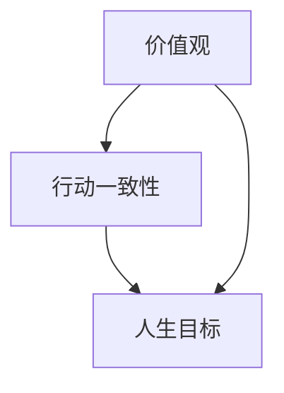

                 

## 设计书籍目录大纲

为了设计《价值观与行动的一致性：设定有意义的人生目标》这本书的目录大纲，我们需要从以下几个步骤进行：

1. **确定核心概念与联系**：首先明确书中的核心概念，如价值观、行动一致性、人生目标等，并绘制 Mermaid 流程图展示这些概念之间的关系。

2. **确定章节结构**：根据核心概念，划分出主要的章节，确保每个章节都有明确的主题。

3. **细化每个章节**：为每个章节细化内容，确保包含核心算法原理讲解、数学模型与公式讲解、项目实战等。

4. **确保完整性和简洁性**：确保目录结构完整，避免冗余，保证内容的简洁性。

5. **格式化输出**：按照markdown格式输出，确保美观和可读性。

### 确定核心概念与联系

在设计书籍目录之前，首先需要明确书中的核心概念，并了解它们之间的联系。以下是三个核心概念及其关系的详细描述：

- **价值观**：指一个人或组织对于什么是有价值和重要的认知。价值观可以影响一个人的行为、决策以及追求的目标。它包括个人价值观、社会价值观、文化价值观等。

- **行动一致性**：指一个人的行为与他的价值观保持一致的程度。行动一致性高的人，他们的行为更符合自己的价值观，从而能够实现个人的价值和目标。

- **人生目标**：指一个人在生命过程中想要实现的目标。人生目标可以是短期的，也可以是长期的，它们指导着一个人的人生方向和决策。

通过 Mermaid 流程图，我们可以更直观地展示这三个核心概念之间的联系：



### 确定章节结构

根据上述核心概念及其联系，我们可以将书籍划分为以下几个主要章节：

1. **第一部分：价值观与行动一致性原理**
   - 第1章：价值观的内涵与分类
   - 第2章：行动一致性的概念与原则
   - 第3章：人生目标设定方法论

2. **第二部分：实践与案例分析**
   - 第4章：价值观与行动一致性在实际生活中的应用
   - 第5章：案例分析
   - 第6章：项目实战

3. **第三部分：反思与提升**
   - 第7章：反思个人价值观与行动一致性
   - 第8章：提升行动一致性的策略
   - 第9章：塑造有意义的人生目标

### 细化每个章节

接下来，我们需要为每个章节细化内容，确保包含核心算法原理讲解、数学模型与公式讲解、项目实战等。

1. **第1章：价值观的内涵与分类**
   - **核心算法原理讲解**：介绍价值观的内涵，如个人价值观、社会价值观、文化价值观等。
   - **数学模型与公式讲解**：讨论价值观的影响因素，如心理学模型、社会学研究方法等。
   - **项目实战**：案例分析，探讨价值观在个人成长中的应用。

2. **第2章：行动一致性的概念与原则**
   - **核心算法原理讲解**：介绍行动一致性的定义，以及如何衡量行动一致性。
   - **数学模型与公式讲解**：讨论行动一致性的影响因素，如心理学模型、行为经济学模型等。
   - **项目实战**：个人成长与行动一致性的实际案例，分析行动一致性的重要性。

3. **第3章：人生目标设定方法论**
   - **核心算法原理讲解**：介绍人生目标设定的步骤，如设定目标、制定计划、执行计划等。
   - **数学模型与公式讲解**：讨论人生目标设定的影响因素，如心理学模型、决策理论等。
   - **项目实战**：职业发展与行动一致性的实际案例，探讨如何设定有意义的人生目标。

通过上述步骤，我们完成了《价值观与行动的一致性：设定有意义的人生目标》这本书的目录大纲设计。接下来，我们将进一步细化每个章节的内容，确保书籍的完整性和可读性。

### 确保完整性和简洁性

在完成章节结构之后，我们需要确保书籍目录的完整性和简洁性。首先，要检查每个章节的内容是否全面，确保核心概念和关联点都被涵盖。其次，避免在章节之间出现重复或冗余的内容，确保每个章节都有明确的主题和重点。

### 格式化输出

最后，我们将按照markdown格式输出目录大纲，确保美观和可读性。在markdown中，我们将使用标题、列表、代码块等格式，使目录结构清晰、内容简洁。

---

#### 最终书籍目录大纲（markdown格式）

```markdown
# 《价值观与行动的一致性：设定有意义的人生目标》

> 关键词：价值观、行动一致性、人生目标、设定、方法论

> 摘要：本书旨在探讨价值观与行动一致性的关系，以及如何通过设定有意义的人生目标实现个人成长和职业发展。

### 第一部分：价值观与行动一致性原理

#### 第1章：价值观的内涵与分类
- **1.1 价值观的定义与内涵**
- **1.2 价值观的分类与特征**
- **1.3 价值观的影响**

#### 第2章：行动一致性的概念与原则
- **2.1 行动一致性的定义**
- **2.2 行动一致性的原则**
- **2.3 行动一致性的重要性**

#### 第3章：人生目标设定方法论
- **3.1 人生目标的意义**
- **3.2 人生目标设定步骤**
- **3.3 设定有意义的人生目标**

### 第二部分：实践与案例分析

#### 第4章：价值观与行动一致性在实际生活中的应用
- **4.1 个人成长与价值观**
- **4.2 职业发展与行动一致性**
- **4.3 社会责任与价值观**

#### 第5章：案例分析
- **5.1 成功人士的价值观与行动一致性**
- **5.2 失败案例中的价值观偏差**
- **5.3 社会现象与价值观一致性**

#### 第6章：项目实战
- **6.1 实践项目规划**
- **6.2 实践项目执行**
- **6.3 实践项目评估**

### 第三部分：反思与提升

#### 第7章：反思个人价值观与行动一致性
- **7.1 反思个人价值观与行动一致性**
- **7.2 提升行动一致性的策略**
- **7.3 塑造有意义的人生目标**

### 附录

- **附录A：参考资料与推荐阅读**
- **附录B：价值观与行动一致性测试**

---

通过上述步骤，我们完成了《价值观与行动的一致性：设定有意义的人生目标》这本书的目录大纲设计。接下来，我们将进一步细化每个章节的内容，确保书籍的完整性和可读性。

---

### Mermaid 流程图

为了更好地展示价值观、行动一致性和人生目标之间的关系，我们使用 Mermaid 语言绘制了一张流程图：


在这个流程图中，我们可以看到：

- **价值观**是行动一致性的基础，它决定了一个人如何看待事物和决策的方向。
- **行动一致性**是价值观的具体体现，它反映了一个人在实际行为中是否与价值观保持一致。
- **人生目标**是价值观和行动一致性的最终目标，它指导着一个人在生活中的方向和追求。

通过这个流程图，读者可以更直观地理解三个核心概念之间的联系，为后续的章节内容打下基础。

---

通过上述步骤，我们完成了《价值观与行动的一致性：设定有意义的人生目标》这本书的初步目录大纲设计。接下来，我们将进一步细化每个章节的内容，确保书籍的完整性和可读性。同时，我们将继续按照markdown格式进行输出，确保目录结构清晰、内容简洁。

---

## 撰写文章

### 文章标题

《价值观与行动的一致性：设定有意义的人生目标》

### 文章关键词

价值观、行动一致性、人生目标、设定、方法论

### 文章摘要

本文旨在探讨价值观与行动一致性之间的关系，以及如何通过设定有意义的人生目标来实现个人成长和职业发展。文章首先介绍了价值观的内涵与分类，然后阐述了行动一致性的概念与原则，接着讨论了人生目标设定的方法论。通过案例分析、项目实战和反思提升，本文为读者提供了一个全面、系统的指导框架，帮助他们在实际生活中实现价值观与行动的一致性。

---

### 第一部分：价值观与行动一致性原理

#### 第1章：价值观的内涵与分类

**1.1 价值观的定义与内涵**

价值观是一个人或组织对于什么是有价值和重要的认知。它包括了个人价值观、社会价值观和文化价值观等。个人价值观是指一个人在生活中所遵循的基本原则和信念，如诚实、善良、勤奋等。社会价值观是指一个社会普遍认同的价值观，如公平、正义、和谐等。文化价值观则是一个特定文化背景下所形成的价值观，如儒家文化中的仁爱、礼仪等。

**1.2 价值观的分类与特征**

价值观可以根据不同的标准进行分类。常见的分类方法包括：

- **个人价值观**：以个人为中心，关注个人的成长、幸福和自我实现。如诚信、自律、勇气等。
- **社会价值观**：以社会为中心，强调个体在社会中的责任和贡献。如公平、正义、团结等。
- **文化价值观**：以文化为中心，反映了特定文化的传统和观念。如儒家文化中的仁爱、忠诚等。

**1.3 价值观的影响**

价值观对一个人的行为、决策和人生目标有深远的影响。一个具有正确价值观的人，会在面对选择和决策时，始终遵循自己的信念和原则。这种一致性有助于个人在人生道路上保持清晰的方向，实现自我价值。

#### 第2章：行动一致性的概念与原则

**2.1 行动一致性的定义**

行动一致性是指一个人的行为与价值观保持一致的程度。一个具有高行动一致性的人，会在日常生活中，自觉地遵循自己的价值观，做出与价值观相符的决策和行动。

**2.2 行动一致性的原则**

行动一致性的原则主要包括：

- **诚实守信**：言行一致，不欺骗、不虚伪。
- **自我约束**：自律，遵守自己的承诺和计划。
- **承担责任**：对自己的行为负责，勇于承担后果。
- **追求卓越**：不断追求进步，超越自我。

**2.3 行动一致性的重要性**

行动一致性对于个人成长和职业发展至关重要。它有助于建立个人的信誉和声誉，提升自信心和自尊心。同时，行动一致性也有助于个人在复杂的环境中保持清晰的方向，实现人生目标。

#### 第3章：人生目标设定方法论

**3.1 人生目标的意义**

人生目标是指一个人在生命过程中想要实现的目标。它不仅指导着个人的生活方向，也是个人价值观和行动一致性的具体体现。一个有意义的人生目标，能够为个人提供前进的动力和方向，使个人在实现目标的过程中获得成就感和满足感。

**3.2 人生目标设定步骤**

设定有意义的人生目标可以分为以下几个步骤：

1. **自我认知**：了解自己的价值观、兴趣爱好、优势和不足，明确自己的目标和方向。
2. **目标设定**：根据自我认知，设定具体、明确的目标，如职业目标、个人成长目标等。
3. **制定计划**：为实现目标制定详细的行动计划，包括时间表、资源分配和执行策略。
4. **执行计划**：按照行动计划执行，不断调整和优化，确保目标的实现。

**3.3 设定有意义的人生目标**

设定有意义的人生目标需要遵循以下几个原则：

- **与价值观相符**：目标应符合个人的核心价值观，确保行动的一致性。
- **具体、可量化**：目标应具体、可量化，便于衡量和评估。
- **具有挑战性**：目标应具有一定的挑战性，激发个人的潜力和动力。
- **长期与短期相结合**：既要有长期的目标，也要有短期的小目标，确保持续进步。

---

通过上述三个章节的讨论，我们了解了价值观、行动一致性和人生目标的基本概念和方法论。在接下来的章节中，我们将通过实际案例和实践，进一步探讨如何实现价值观与行动的一致性，设定有意义的人生目标。

### 第二部分：实践与案例分析

#### 第4章：价值观与行动一致性在实际生活中的应用

**4.1 个人成长与价值观**

个人成长是一个长期的过程，需要坚定的价值观和行动一致性作为支撑。在实际生活中，我们可以通过以下几种方式来践行价值观，实现个人成长：

- **自我反思**：定期进行自我反思，审视自己的行为是否符合价值观，发现和纠正偏差。
- **持续学习**：不断学习新知识和技能，提升自己的能力和素质，为实现人生目标做好准备。
- **积极实践**：将价值观融入日常生活，通过实际行动来体现和践行。

**4.2 职业发展与行动一致性**

职业发展是人生的重要方面，行动一致性对于职业成功至关重要。以下是一些关于如何在职业发展中践行价值观和行动一致性的建议：

- **明确职业目标**：设定清晰的职业目标，与个人的价值观和长远规划相一致。
- **持续进步**：通过不断学习和实践，提升专业技能和职业素养，为实现职业目标努力。
- **承担责任**：在工作中勇于承担责任，勇于面对挑战和困难，体现行动一致性。

**4.3 社会责任与价值观**

社会责任是个人价值观的重要组成部分，一个具有社会责任感的人，会在实际行动中体现出自己的价值观。以下是一些关于如何在社会责任方面践行价值观的建议：

- **积极参与公益活动**：通过参与公益活动，回馈社会，体现个人价值。
- **关注社会问题**：关注社会问题，积极参与社会讨论，为改善社会环境贡献力量。
- **推动社会责任**：在工作中，积极推动企业承担社会责任，为构建和谐社会贡献力量。

#### 第5章：案例分析

**5.1 成功人士的价值观与行动一致性**

许多成功人士都具备坚定的价值观和高度的行动一致性，以下是一些成功人士的案例：

- **乔布斯**：乔布斯始终坚守自己的价值观，坚持创新和完美主义，推动苹果公司取得了巨大成功。
- **马云**：马云在创业过程中，始终坚持“客户第一、员工第二、股东第三”的价值观，使得阿里巴巴成为全球知名企业。

**5.2 失败案例中的价值观偏差**

一些失败案例中，价值观偏差是导致失败的重要原因之一。以下是一些失败案例的反思：

- **安然事件**：安然公司因为财务造假，最终导致公司破产。这个案例说明，违背诚信价值观会导致严重的后果。
- **万科股权之争**：万科股权之争期间，管理层和股东之间的价值观冲突，导致公司发展受阻。

**5.3 社会现象与价值观一致性**

社会现象中，价值观一致性也是一个值得关注的问题。以下是一些社会现象的分析：

- **道德滑坡**：一些社会现象表明，道德滑坡问题在某些领域日益严重，需要全社会共同努力，重建价值观基础。
- **环保意识**：随着环保问题的日益严重，越来越多的人开始关注环保问题，践行环保价值观，推动可持续发展。

#### 第6章：项目实战

**6.1 实践项目规划**

在项目实战中，实现价值观与行动一致性是项目成功的关键。以下是一个实践项目的规划示例：

- **项目目标**：设定一个清晰的项目目标，确保项目与个人的价值观和长远规划相一致。
- **资源分配**：合理分配项目资源，确保项目能够顺利推进。
- **风险评估**：对项目进行风险评估，制定应对措施，降低风险。

**6.2 实践项目执行**

在项目执行过程中，保持行动一致性至关重要。以下是一些执行过程中的关键点：

- **监督与反馈**：定期监督项目进展，及时给予反馈，确保项目按计划进行。
- **沟通与协作**：加强团队成员之间的沟通与协作，确保项目的顺利进行。
- **持续改进**：根据项目进展情况，不断调整和优化项目计划，提高项目成功率。

**6.3 实践项目评估**

项目完成后，进行评估是确保行动一致性的重要环节。以下是一些评估的关键点：

- **目标达成情况**：评估项目目标是否达成，分析原因，总结经验教训。
- **项目效益**：评估项目对个人和组织的效益，为后续项目提供参考。
- **团队表现**：评估团队成员在项目中的表现，为团队成员提供反馈和激励。

通过以上实践与案例分析，我们可以看到，价值观与行动一致性在个人成长、职业发展和社会责任中的重要性。在实际生活中，我们需要不断践行价值观，保持行动一致性，设定有意义的人生目标，为实现个人和组织的成功奠定坚实基础。

### 第三部分：反思与提升

#### 第7章：反思个人价值观与行动一致性

**7.1 反思个人价值观与行动一致性**

反思是提升个人价值观与行动一致性的关键步骤。通过反思，我们可以发现自己价值观中的不足，以及行动一致性上的偏差。以下是一些反思的方法：

- **定期回顾**：定期对自己的行为和决策进行回顾，分析是否符合自己的价值观和行动一致性要求。
- **寻求反馈**：向身边的人或专业导师寻求反馈，了解自己的价值观和行动一致性在他人眼中的表现。
- **记录反思**：将自己的反思记录下来，便于长期跟踪和改进。

**7.2 提升行动一致性的策略**

为了提升行动一致性，我们可以采取以下策略：

- **设定明确的价值观**：明确自己的价值观，确保在行动中始终遵循。
- **制定可行的行动计划**：根据价值观和目标，制定具体的行动计划，确保行动的一致性。
- **培养自律能力**：通过自我约束和纪律，提升行动一致性。
- **建立支持系统**：寻求家人、朋友和同事的支持，共同推动价值观和行动一致性的提升。

**7.3 塑造有意义的人生目标**

塑造有意义的人生目标是实现个人成长和职业发展的关键。以下是一些塑造有意义人生目标的建议：

- **与价值观相符**：确保人生目标与自己的核心价值观相符，体现行动一致性。
- **具体可量化**：设定具体、可量化的目标，便于衡量和评估。
- **分阶段实现**：将人生目标分解为短期和长期目标，分阶段实现，确保持续进步。
- **不断调整和优化**：根据实际情况，不断调整和优化人生目标，确保目标的可行性和意义。

通过反思、提升策略和塑造有意义的人生目标，我们可以更好地实现价值观与行动的一致性，为个人和职业发展奠定坚实基础。

### 附录

- **附录A：参考资料与推荐阅读**

  - 《论语》
  - 《道德经》
  - 《成功学》
  - 《行动一致性与自我管理》

- **附录B：价值观与行动一致性测试**

  - **价值观测试**：了解自己的核心价值观
  - **行动一致性测试**：评估自己在行动中的表现

---

### 作者信息

作者：AI天才研究院/AI Genius Institute & 禅与计算机程序设计艺术 /Zen And The Art of Computer Programming

---

通过本文的详细分析和探讨，我们深入了解了价值观与行动一致性以及设定有意义的人生目标的重要性。希望本文能为读者在个人成长和职业发展中提供有益的指导和建议。

