                 

### 价值观的演变：从传统到现代的思想变迁

#### 关键词：
- 价值观演变
- 传统价值观
- 现代价值观
- 社会变迁
- 文化多样性
- 科技发展

> 摘要：本文旨在探讨价值观从传统到现代的演变过程。通过分析传统价值观的起源与演变，以及现代社会科技发展、全球化对传统价值观的挑战和变迁，进一步探讨现代价值观的基本特征、争议与未来。最后，本文从历史意义和未来挑战两个角度，深入探讨价值观演变对人类社会和个体发展的影响。

# 价值观的演变：从传统到现代的思想变迁

## 目 录

### 第一部分：传统价值观的起源与演变

### 第1章：传统价值观的起源

### 第2章：传统价值观在不同文化中的表现

### 第3章：传统价值观在现代社会的挑战与变迁

### 第二部分：现代价值观的形成与发展

### 第4章：现代价值观的基本特征

### 第5章：现代价值观在不同文化中的发展

### 第6章：现代价值观的争议与未来

### 第7章：价值观的演变与人类发展

### 附录

#### 附录A：主要术语解释

#### 附录B：主要研究文献推荐

## 第一部分：传统价值观的起源与演变

### 第1章：传统价值观的起源

#### 1.1 传统价值观的基本概念

传统价值观是历史长河中形成的，体现了一个社会或文化对于道德、行为准则和社会关系的共识。它的定义多种多样，但核心要素通常包括对家庭、社会、宗教、道德和文化的重视。

##### 1.1.1 传统价值观的定义

传统价值观可以定义为一种社会共识，它包含了人们对理想生活、社会角色、道德行为等的理解和期望。它不仅仅是一套行为规范，更是社会结构和文化传承的重要组成部分。

##### 1.1.2 传统价值观的核心要素

传统价值观的核心要素包括：

- **家庭与社会的责任**：传统价值观强调家庭的重要性，家庭被视为社会的基本单位。成员之间有着明确的角色和责任，例如父母对孩子的抚养教育、夫妻间的相互支持等。
- **宗教与信仰**：在许多传统社会中，宗教信仰是价值观的重要组成部分。宗教不仅提供了生活的道德指南，还影响了社会的法律和习俗。
- **道德规范**：传统价值观通常包含一套明确的道德规范，如诚实、善良、勤奋、忠诚等，这些规范对社会成员的行为有指导作用。
- **文化传承**：传统价值观强调文化的重要性，包括语言、艺术、传统习俗等，这些文化元素被视为社会连续性的象征。

##### 1.1.3 传统价值观的历史演变

传统价值观并非一成不变，它在不同的历史时期和社会背景下有着不同的表现。以下是几个关键的历史演变阶段：

- **古代文明**：在古代，传统价值观多由统治阶级和宗教机构所塑造。例如，古希腊的价值观强调理性和个人尊严，而古埃及的价值观则强调来世和死后生命。
- **中世纪**：在中世纪欧洲，宗教对传统价值观的影响尤为显著。天主教教会不仅规范了社会行为，还影响了人们的信仰和生活方式。
- **文艺复兴**：文艺复兴时期，人们开始重新发现古希腊和古罗马的文化遗产，强调个人的自由和理性，传统价值观开始发生变化。

#### 1.2 传统社会的价值观体系

传统社会的价值观体系是复杂而多元的，不同文化和地区有着不同的特点。以下是几种不同文化中传统价值观的表现：

##### 2.1 东方传统价值观

- **中国传统价值观**：中国传统文化强调家庭、社会和谐和道德修养。儒家思想强调仁爱、孝道、忠诚等价值观，而道家则强调自然和谐与个人的道德修养。
- **日本传统价值观**：日本文化中的传统价值观强调集体主义、礼仪和尊重。武士道精神强调忠诚、勇气和荣誉。
- **印度传统价值观**：印度文化中的传统价值观强调家庭、宗教和社会责任。印度教和佛教对印度文化有着深远的影响。

##### 2.2 西方传统价值观

- **古希腊价值观**：古希腊价值观强调理性和个人自由。柏拉图和亚里士多德等哲学家对西方文化有着深远的影响。
- **中世纪欧洲价值观**：中世纪欧洲的价值观受宗教影响较大，强调信仰、忠诚和等级制度。
- **文艺复兴时期价值观**：文艺复兴时期，人们开始强调个人的能力和自由，科学和艺术得到了极大的发展。

### 第2章：传统价值观在不同文化中的表现

传统价值观在不同的文化中有着不同的表现形式和内涵。以下将分别探讨中国传统价值观、日本传统价值观和印度传统价值观。

#### 2.1 中国传统价值观

中国传统价值观源远流长，主要受到儒家思想和道家思想的影响。儒家思想强调“仁、义、礼、智、信”的五常，强调个人对社会和家庭的责任，倡导孝道、忠诚和礼仪。道家思想则主张“无为而治”，强调顺应自然和道德修养。

- **家庭观念**：在中国传统价值观中，家庭是社会的基本单位，强调家庭成员之间的相互责任和尊重。孝道是家庭观念的核心，子女有责任照顾和尊敬父母。
- **社会观念**：中国传统价值观强调社会和谐与集体利益。人们被教育要遵守社会规范，尊重长辈，关心他人，为社会做出贡献。
- **道德观念**：中国传统价值观强调道德修养，倡导诚实、善良、勤奋和忠诚。这些道德规范在日常生活中有着广泛的应用。

#### 2.2 日本传统价值观

日本传统价值观强调集体主义、礼仪和尊重。武士道精神是日本文化中的重要组成部分，强调忠诚、勇气、荣誉和自我克制。

- **家庭观念**：日本传统价值观强调家庭的重要性，家庭成员之间有着紧密的联系和责任。父母对孩子的教育非常重视，强调尊老爱幼和家庭的团结。
- **社会观念**：日本传统价值观强调集体主义，个人行为应当符合社会和集体的利益。在社会中，人们被教育要尊重他人、遵守社会规范，并积极参与社区活动。
- **道德观念**：日本传统价值观强调道德修养，倡导诚实、正直、勤奋和忠诚。这些道德规范在工作和日常生活中有着重要的指导作用。

#### 2.3 印度传统价值观

印度传统价值观受到印度教和佛教的影响，强调家庭、宗教和社会责任。印度教传统价值观强调轮回、业力和因果报应，佛教则强调无我、涅槃和慈悲。

- **家庭观念**：印度传统价值观强调家庭的重要性，家庭是社会的基本单位。家庭成员之间有着紧密的联系和责任，特别是对子女的教育和抚养。
- **社会观念**：印度传统价值观强调社会和谐与分工合作。人们被教育要尊重不同的社会角色和职责，并为社会做出贡献。
- **道德观念**：印度传统价值观强调道德修养，倡导诚实、善良、宽容和无私。这些道德规范在日常生活中有着广泛的指导作用。

### 第3章：传统价值观在现代社会的挑战与变迁

随着科技的发展和社会变革，传统价值观面临着前所未有的挑战和变迁。科技发展改变了人们的生活方式和社会结构，全球化进一步推动了文化的交流与融合，这些因素共同影响了传统价值观的演变。

#### 3.1 科技发展对社会价值观的影响

科技的发展对社会价值观产生了深远的影响。一方面，科技为人们提供了更多的机会和自由，另一方面，它也带来了一些新的挑战。

- **隐私与安全**：科技的进步使个人信息的收集和使用变得更容易，这引发了对隐私和安全的担忧。传统价值观中对个人隐私的重视与现代科技的发展之间的冲突日益明显。
- **人际关系**：社交媒体和移动通信的普及改变了人们之间的人际关系。虽然科技让人们更加方便地联系，但也可能导致人与人之间的疏离和沟通障碍。
- **工作与生活平衡**：科技的发展使工作变得更加高效，但也可能导致工作与生活之间的界限变得模糊，传统价值观中对工作与生活的平衡提出了新的挑战。

#### 3.2 社会变革对传统价值观的挑战

社会变革带来了许多新的社会结构和生活方式，这些变革对传统价值观提出了挑战。

- **家庭结构的变化**：随着社会的进步，家庭结构越来越多样化，传统的家庭模式（如核心家庭）不再占据主导地位。这引发了对传统家庭价值观的重新审视和调整。
- **性别角色的转变**：社会对性别角色的期望逐渐发生变化，女性在家庭和社会中的地位不断提高。这挑战了传统价值观中对性别角色的刻板印象。
- **人口老龄化**：人口老龄化对社会价值观产生了深远的影响，特别是对家庭、医疗和社会福利系统提出了新的挑战。

#### 3.3 科技与价值观的互动关系

科技的发展与价值观的变迁是相互关联的。一方面，科技的发展可能会影响人们的价值观；另一方面，人们的价值观也可能影响科技的应用和发展。

- **科技伦理**：随着科技的发展，人们开始关注科技伦理问题。例如，人工智能的发展引发了关于机器是否能够拥有道德和价值观的讨论。
- **可持续发展**：科技的进步为可持续发展提供了新的可能性，但同时也带来了资源消耗和环境污染等问题。这要求人们重新审视传统的价值观，并探索新的可持续发展的价值观。

### 3.4 全球化对传统价值观的影响

全球化是一个不可逆转的趋势，它不仅改变了人们的经济生活方式，也深刻影响了人们的价值观。

- **文化多样性**：全球化促进了文化的交流与融合，不同文化之间的互动增加了人们对其他文化的了解和尊重。这有助于文化多样性的发展，但也可能对某些传统价值观造成冲击。
- **价值观冲突**：全球化带来了不同价值观之间的碰撞和冲突。例如，西方的个人主义价值观与东方的集体主义价值观之间的差异可能会引起文化冲突。
- **全球价值观**：全球化也在一定程度上促进了全球价值观的形成。例如，人权、民主和可持续发展等价值观得到了越来越多国家和地区的认同。

#### 3.5 全球化对传统价值观的挑战

全球化不仅带来了机遇，也带来了挑战，特别是对传统价值观的挑战。

- **文化认同**：全球化可能导致某些地区和民族的文化认同感减弱，传统价值观受到冲击。这引发了对文化保护和传承的讨论。
- **经济发展与道德冲突**：全球化带来了经济发展的机遇，但也可能导致一些国家和地区在道德和伦理方面面临挑战。例如，跨国公司的行为可能引发对环境和社会责任的担忧。
- **社会不平等**：全球化也可能加剧社会不平等，特别是发展中国家和发达国家之间的差距。这挑战了传统价值观中对公平和正义的追求。

#### 3.6 全球化与传统价值观的适应与变迁

面对全球化的挑战，传统价值观需要适应和变迁。

- **传统价值观的适应**：传统价值观需要适应全球化带来的新变化。例如，一些传统价值观可能需要调整以适应多元文化的环境。
- **传统价值观的变迁**：全球化也可能导致某些传统价值观的变迁。例如，随着经济全球化和文化多元化的发展，家庭结构和社会关系可能发生变化，传统价值观需要与时俱进。
- **文化融合与创新**：全球化为不同文化之间的融合和创新提供了机会。传统价值观可以与其他文化元素结合，形成新的价值观体系。

## 第二部分：现代价值观的形成与发展

### 第4章：现代价值观的基本特征

随着社会的发展和科技的进步，现代价值观逐渐形成，并在全球范围内产生广泛影响。现代价值观的基本特征主要包括以下方面：

#### 4.1 个体自主与平等

现代价值观强调个体的自主性和平等权利。个体自主意味着每个人都有权根据自己的意愿和目标生活，不受外部强制和压迫。平等则体现在法律面前人人平等，不论性别、种族、宗教或社会地位，每个人都应享有平等的机会和权利。

#### 4.2 科学理性与实证主义

科学理性和实证主义是现代价值观的重要基础。科学理性强调通过观察、实验和逻辑推理来认识世界，追求客观真理。实证主义则主张通过经验和实证证据来验证知识和理论。

#### 4.3 社会进步与可持续发展

现代价值观强调社会的进步和可持续发展。社会进步意味着不断追求社会公正、公平和繁荣，消除贫困、不平等和歧视。可持续发展则强调满足当代人的需求，同时不损害后代人满足自身需求的能力，追求经济、社会和环境的和谐发展。

### 第5章：现代价值观在不同文化中的发展

现代价值观在全球范围内传播和发展，不同文化对现代价值观的理解和接受程度有所不同。以下是现代价值观在西方社会和东方社会的发展情况。

#### 5.1 现代价值观在西方社会的发展

西方社会在现代社会价值观的形成和发展中起到了关键作用。西方现代价值观的起源可以追溯到古希腊时期，尤其是苏格拉底、柏拉图和亚里士多德等哲学家的思想对西方文化产生了深远影响。

- **启蒙时代**：启蒙时代是西方现代价值观形成的重要阶段，强调理性、自由和平等。启蒙思想家如伏尔泰、卢梭和洛克等人的思想对现代价值观的塑造产生了重要影响。
- **人权与民主**：西方社会重视人权和民主，认为每个人都应享有自由和平等的权利。人权观念和民主制度在西方国家得到了广泛实践和发展。
- **科技与经济**：西方社会在科技和经济领域取得了巨大成就，现代价值观强调通过科技和经济手段实现社会进步和发展。

#### 5.2 现代价值观在东方社会的发展

东方社会，特别是东亚地区，对现代价值观的接受和发展也具有独特性。

- **儒家文化的影响**：儒家思想强调家庭、社会和谐和个人道德修养，与现代社会价值观中的个体自主和平等存在一定冲突。然而，随着社会的发展，儒家思想也在不断适应现代价值观，强调个体发展和社会责任的平衡。
- **集体主义与个人主义**：东方社会在集体主义和个人主义之间寻求平衡。虽然家庭和社会关系仍然受到重视，但现代价值观中的个体自主和平等也在逐渐得到认同。
- **经济发展与现代化**：东方社会在经济发展和现代化进程中，逐步接受了现代价值观的一些要素，如科学理性、经济自由和市场机制。

### 第6章：现代价值观的争议与未来

现代价值观在全球范围内得到了广泛认同，但也面临着诸多争议和挑战。以下将讨论现代价值观的争议以及未来发展的展望。

#### 6.1 个体自由与社会责任

现代价值观强调个体自由，但也引发了对社会责任的讨论。一些人认为，个体自由可能导致社会的不稳定和混乱，需要通过社会责任来平衡。这种争论涉及到个人权利与社会义务之间的关系，是现代价值观的一个重要议题。

#### 6.2 经济发展与环境保护

现代价值观强调经济发展，但同时也带来了环境问题。如何在经济发展和环境保护之间找到平衡，是现代价值观面临的挑战之一。可持续发展理念提出了在经济、社会和环境之间实现和谐发展的目标，但具体实施仍需进一步探索。

#### 6.3 文化多样性保护与融合

全球化促进了文化多样性的发展，但也可能导致某些文化被边缘化。如何在文化多样性保护与文化融合之间找到平衡，是现代价值观面临的另一个重要议题。

#### 6.4 现代价值观的未来展望

现代价值观的未来发展受到多种因素的影响，包括科技进步、全球化、社会变迁等。以下是一些可能的未来发展趋势：

- **科技与价值观的融合**：随着科技的发展，价值观的表达和传播方式也在发生变化。未来，科技可能为价值观的发展提供新的工具和平台。
- **全球价值观的形成**：全球化使得不同文化之间的交流更加频繁，全球价值观可能逐渐形成。这些价值观可能会超越国界和文化的限制，成为全球社会共识的一部分。
- **价值观的多元性**：尽管全球价值观可能逐渐形成，但价值观的多元性仍将得到保持。不同文化和社会可能根据自身特点和需求，形成独特的价值观体系。

### 第7章：价值观的演变与人类发展

价值观的演变是人类社会发展的重要体现，它对人类社会和个体发展产生了深远的影响。以下从历史意义和未来挑战两个角度，探讨价值观的演变对人类社会和个体发展的影响。

#### 7.1 价值观演变的历史意义

价值观的演变在人类历史中具有重要意义。首先，价值观的演变推动了社会进步。在不同历史时期，新的价值观体系不断出现，推动了社会的变革和发展。例如，启蒙时代的理性主义和自由主义价值观促进了科学、艺术和思想的繁荣，推动了现代化进程。

其次，价值观的演变影响了个体发展。价值观为个体提供了行为准则和道德规范，帮助个体在社会中找到自己的定位。例如，在传统社会中，家庭和社会责任感是重要的价值观，这帮助个体建立家庭和社会关系，实现个人价值。

最后，价值观的演变促进了文化传承。价值观是一个文化体系的核心，它通过代代相传，保持了文化的连续性和稳定性。例如，儒家思想在中国文化中的地位，使得中国文化得以传承和发扬。

#### 7.2 价值观演变对人类社会和个体发展的影响

价值观的演变对人类社会和个体发展产生了深远的影响。首先，价值观的演变推动了社会变革。随着社会的发展，新的价值观体系不断出现，挑战和取代旧的价值观体系。这种变革促进了社会的进步和发展，使人类社会逐步走向现代化。

其次，价值观的演变影响了个体发展。价值观为个体提供了行为准则和道德规范，帮助个体在社会中找到自己的定位。例如，现代价值观强调个体自主和平等，使个体能够更好地实现个人价值。

最后，价值观的演变促进了文化传承。价值观是一个文化体系的核心，它通过代代相传，保持了文化的连续性和稳定性。例如，儒家思想在中国文化中的地位，使得中国文化得以传承和发扬。

#### 7.3 全球化背景下的价值观冲突

全球化加速了不同文化之间的交流与碰撞，引发了价值观的冲突。不同文化背景下的价值观差异可能导致误解、矛盾和冲突。如何在全球化的背景下，尊重不同文化的价值观，实现文化共存与和谐，是当前面临的挑战之一。

#### 7.4 科技发展带来的价值观挑战

科技的快速发展给价值观带来了新的挑战。例如，人工智能、大数据和互联网技术的应用，引发了对隐私、安全和社会责任的讨论。如何应对科技发展带来的价值观挑战，是未来需要关注的重要议题。

#### 7.5 人类未来的价值观发展路径

面对全球化、科技发展和环境问题等挑战，人类未来的价值观发展路径可能包括以下几个方面：

- **包容与多元**：未来价值观可能更加包容和多元，尊重不同文化的价值观，实现文化共存与和谐。
- **可持续发展**：未来价值观可能更加重视可持续发展，追求经济、社会和环境的和谐发展。
- **个体自主与集体责任**：未来价值观可能在个体自主和集体责任之间找到平衡，既尊重个体的自由和权利，也强调个体的社会责任。

### 附录

#### 附录A：主要术语解释

- **传统价值观**：指一个社会或文化对道德、行为准则和社会关系的共识。
- **现代价值观**：指在现代社会背景下形成，强调个体自主、平等、科学理性、社会进步和可持续发展的一套价值观体系。
- **全球化**：指全球范围内的经济、政治、文化和社会的相互联系和相互依赖。
- **文化多样性**：指不同文化在交流与碰撞中，保持各自特色和差异的现象。

#### 附录B：主要研究文献推荐

1. 鲁迅.《文化偏至论》.
2. 恩格斯.《家庭、私有制和国家的起源》.
3. 霍布斯.《利维坦》.
4. 康德.《道德形而上学》.
5. 福山.《信任：社会美德与创立现代经济制度》.
6. 布迪厄.《文化资本：文化理论引论》.
7. 罗伯特·阿克塞尔罗德.《合作的进化》.
8. 哈贝马斯.《公共领域的结构转型》.
9. 贝克尔.《人类行为的经济理论》.
10. 诺内特&塞尔兹尼克.《转变的社会制度：秩序与变革的理论》.

#### 附录C：流程图

```mermaid
graph TD
    A[传统价值观的起源] --> B(1.1 传统价值观的基本概念)
    B --> C(1.1.1 传统价值观的定义)
    B --> D(1.1.2 传统价值观的核心要素)
    B --> E(1.1.3 传统价值观的历史演变)
    A --> F(1.2 传统社会的价值观体系)
    F --> G(1.2.1 家庭与社会关系)
    F --> H(1.2.2 信仰与道德规范)
    F --> I(1.2.3 生活方式与价值取向)
    A --> J(1.3 传统价值观在现代社会的挑战与变迁)
    J --> K(3.1 科技发展对社会价值观的影响)
    J --> L(3.2 全球化对传统价值观的影响)
    J --> M(3.3 科技与价值观的互动关系)
    N[现代价值观的形成与发展] --> O(4.1 个体自主与平等)
    O --> P(4.2 科学理性与实证主义)
    O --> Q(4.3 社会进步与可持续发展)
    N --> R(5.1 现代价值观在西方社会的发展)
    R --> S(5.1.1 现代西方价值观的起源)
    R --> T(5.1.2 现代西方价值观的演变)
    R --> U(5.1.3 现代西方价值观的挑战与未来)
    N --> V(5.2 现代价值观在东方社会的发展)
    V --> W(5.2.1 现代中国价值观的形成)
    V --> X(5.2.2 现代日本价值观的演变)
    V --> Y(5.2.3 现代印度价值观的变革)
    Z[现代价值观的争议与未来] --> AA(6.1 个体自由与社会责任)
    AA --> BB(6.2 经济发展与环境保护)
    AA --> CC(6.3 文化多样性保护与融合)
    Z --> DD(6.4 现代价值观的未来展望)
    EE[价值观的演变与人类发展] --> FF(7.1 价值观演变的历史意义)
    FF --> GG(7.2 价值观演变对人类社会和个体发展的影响)
    FF --> HH(7.3 全球化背景下的价值观冲突)
    FF --> II(7.4 科技发展带来的价值观挑战)
    FF --> JJ(7.5 人类未来的价值观发展路径)
```

通过以上内容，我们深入探讨了价值观从传统到现代的演变过程，分析了传统价值观的起源与演变、传统价值观在不同文化中的表现、传统价值观在现代社会的挑战与变迁，以及现代价值观的形成与发展。同时，我们也讨论了现代价值观的争议与未来，以及价值观的演变对人类社会和个体发展的影响。最后，通过流程图总结了整个文章的内容，帮助读者更清晰地理解价值观的演变过程。希望本文能够为读者提供有价值的思考和启示。

