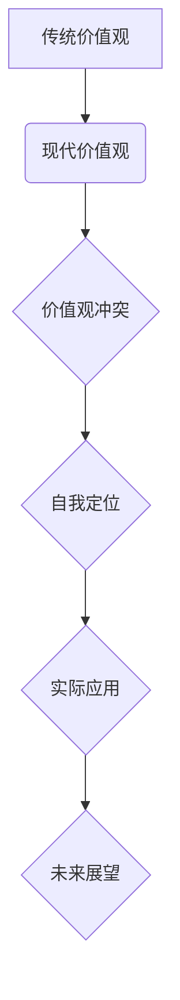

                 

# 传统vs现代：价值观冲突中的自我定位

> 关键词：传统价值观、现代价值观、价值观冲突、自我定位、策略与方法

> 摘要：本文从传统价值观与现代价值观的起源、发展、冲突及自我定位的角度，探讨了在价值观冲突中如何进行自我定位。通过案例分析、策略与方法阐述，帮助读者理解并掌握在价值观冲突中实现自我定位的实用技巧。

## 引言

### 1.1.1 传统价值观与现代价值观的起源与发展

传统价值观与现代价值观是人类文明发展过程中逐步形成的。传统价值观起源于古代，以其独特的文化背景和社会环境为基础，形成了独特的价值观念体系。例如，儒家思想强调仁、义、礼、智、信等核心价值；道家追求天人合一，强调自然与和谐。这些传统价值观在长期的社会实践中积淀下来，成为民族精神的重要组成部分。

现代价值观则是在现代社会背景下产生的，受到科技、经济、文化等多方面因素的影响。随着全球化进程的加快，现代价值观越来越强调多元文化、个性化发展、社会责任等。例如，现代社会强调个人自由、平等、公正等价值，这些价值观念在法律、教育、媒体等领域得到广泛应用。

### 1.1.2 价值观冲突的表象与内在原因

价值观冲突是现代社会中普遍存在的问题。表象上看，价值观冲突表现为个人、群体或社会之间的矛盾和分歧。例如，在职场中，员工可能因对工作态度、目标、方法等有不同的看法而产生冲突；在家庭中，家庭成员可能因对生活方式、教育方式、消费观念等有不同的期望而产生矛盾。

价值观冲突的内在原因主要有以下几点：

1. **文化差异**：不同文化背景下的价值观存在差异，当人们相互接触和交流时，容易产生冲突。
2. **社会变革**：社会变革导致传统价值观与现代价值观之间的冲突，使人们面临选择和困惑。
3. **个人成长**：个人成长过程中，受不同环境、教育、经历等因素的影响，可能导致价值观的多样性和冲突。
4. **利益冲突**：个体或群体之间的利益差异也可能导致价值观冲突。

### 1.1.3 自我定位的重要性与挑战

自我定位在价值观冲突中具有重要意义。自我定位是指个体在价值观冲突中，根据自己的价值观和目标，明确自己在社会、职业、家庭等方面的角色和位置。正确的自我定位有助于个体在冲突中保持冷静和理智，避免盲目跟风或被他人影响，从而更好地解决问题。

然而，自我定位也面临一定挑战：

1. **信息过载**：现代社会信息量巨大，个体难以全面了解各种价值观，可能导致定位不准确。
2. **环境压力**：社会环境对个体价值观的影响不可忽视，个体在定位过程中可能受到外部压力，导致定位偏离。
3. **个人成长**：个体在成长过程中，可能需要不断调整自我定位，以适应不断变化的环境和需求。

### 1.1.4 文章结构

本文将分为七个章节，依次探讨以下内容：

- 第1章：引言，介绍传统价值观与现代价值观的起源与发展，以及价值观冲突的表象与内在原因。
- 第2章：传统价值观解析，分析传统价值观的基本概念、内涵、优缺点。
- 第3章：现代价值观解读，探讨现代价值观的基本概念、内涵、优缺点。
- 第4章：价值观冲突案例分析，分析职场和家庭中的价值观冲突案例。
- 第5章：自我定位的策略与方法，介绍自我定位的重要性、策略和方法。
- 第6章：实际应用中的自我定位，探讨职场和生活自我定位的方法与案例。
- 第7章：未来展望，分析传统价值观与现代价值观的未来趋势，以及个人价值观的自我定位与未来发展。

通过本文的探讨，希望读者能够更好地理解价值观冲突，掌握自我定位的策略与方法，从而在现代社会中找到自己的位置。## 第2章：传统价值观解析

### 2.1.1 传统价值观的基本概念与内涵

传统价值观是指在一定历史和文化背景下，经过长期实践和社会积淀而形成的一系列核心价值观念。这些价值观往往具有独特的地域和文化特色，对人们的思想、行为和社会制度产生深远影响。传统价值观的基本概念和内涵可以概括为以下几个方面：

1. **家庭观念**：传统价值观强调家庭的重要性，认为家庭是社会的基本单位，强调家庭成员之间的亲情、责任和和谐。例如，儒家思想中的“孝道”即强调子女对父母的尊敬和照顾。

2. **道德伦理**：传统价值观强调道德伦理的重要性，提倡诚信、仁爱、忠诚、正直等道德品质。例如，道家思想中的“无为而治”和“道法自然”强调顺应自然和道德自律。

3. **社会责任**：传统价值观强调个人对社会的责任和义务，认为个人应当为社会的发展和进步贡献力量。例如，儒家思想中的“仁者爱人”和“以德治国”强调个人应当具备高尚的道德情操，为国家和社会的繁荣稳定做出贡献。

4. **集体主义**：传统价值观强调集体利益高于个人利益，认为个人应当服从集体，为集体的发展服务。例如，马克思主义中的“共产主义”和“集体主义”强调个人应当为整个社会的共同利益而奋斗。

5. **宗教信仰**：在某些传统价值观中，宗教信仰占有重要地位，认为宗教是引导人们行为和思想的重要力量。例如，基督教中的“上帝”和“天堂”观念对人们的道德观念和人生目标产生深远影响。

### 2.1.2 传统价值观的核心要素

传统价值观的核心要素主要包括以下几个方面：

1. **伦理道德**：伦理道德是传统价值观的核心内容，强调个体在社会中的行为规范和道德准则。例如，儒家思想中的“五常”（仁、义、礼、智、信）和道家思想中的“无为而治”都是伦理道德的重要体现。

2. **家庭观念**：家庭观念是传统价值观的重要组成部分，强调家庭在个体成长和社会稳定中的重要作用。例如，儒家思想中的“孝道”和“家庭和谐”都是家庭观念的重要体现。

3. **社会责任**：社会责任是传统价值观的另一个核心要素，强调个人对社会和他人的责任和义务。例如，儒家思想中的“以德治国”和“忠臣良民”都是社会责任的重要体现。

4. **宗教信仰**：宗教信仰在一些传统价值观中占据重要地位，认为宗教是引导人们行为和思想的重要力量。例如，基督教中的“上帝”和“天堂”观念都是宗教信仰的重要体现。

### 2.1.3 传统价值观的优缺点

传统价值观在长期的社会实践中具有其独特的价值和意义，但也存在一些不足之处。

#### 优点：

1. **稳定性和连续性**：传统价值观经过长期的社会实践和积淀，具有稳定性和连续性，对社会的稳定和发展起到积极作用。

2. **道德约束**：传统价值观强调伦理道德和社会责任，对个体行为进行规范和约束，有利于维护社会秩序和道德底线。

3. **文化传承**：传统价值观承载着丰富的文化传统和历史记忆，有助于文化传承和民族精神的培育。

4. **集体主义精神**：传统价值观强调集体利益高于个人利益，有助于培养个体的集体主义精神，促进社会和谐与团结。

#### 缺点：

1. **僵化与保守**：传统价值观在某些情况下可能过于僵化和保守，不利于社会进步和创新。

2. **缺乏灵活性**：传统价值观在某些问题上可能缺乏灵活性和适应性，难以应对现代社会复杂多变的环境。

3. **忽视个体权益**：传统价值观在某些方面可能忽视个体权益和个性化需求，导致个体在价值观冲突中处于被动地位。

4. **过度强调集体主义**：在某些情况下，过度强调集体主义可能导致个体独立性和创新精神的削弱。

### 2.1.4 传统价值观的演变与适应

随着社会的发展和变化，传统价值观也在不断演变和适应。现代社会中，传统价值观需要与时俱进，与现代社会的要求相结合，以更好地适应现代社会的发展。

1. **与现代价值观的融合**：传统价值观可以与现代价值观进行融合，例如，在家庭观念上，可以强调家庭成员之间的平等和尊重，同时保持传统家庭伦理的底线。

2. **重视个体权益**：传统价值观需要更加重视个体权益和个性化需求，以适应现代社会对个体自由和平等的追求。

3. **创新与传承**：传统价值观需要在创新和传承之间找到平衡，既要保持传统价值观的核心要素，又要适应现代社会的发展需求。

4. **全球化背景下的适应**：在全球化背景下，传统价值观需要适应不同文化和价值观的碰撞和融合，以更好地融入全球社会。

总之，传统价值观在现代社会中仍然具有重要的价值和意义，但需要与时俱进，不断进行适应和调整，以更好地服务于现代社会的发展。## 第3章：现代价值观解读

### 3.1.1 现代价值观的基本概念与内涵

现代价值观是在现代社会背景下形成的，受到科技进步、经济全球化、文化多样性等多种因素影响的一套价值观念体系。它与传统价值观相比，具有更强的时代性和适应性。现代价值观的基本概念与内涵主要包括以下几个方面：

1. **个人主义**：现代价值观强调个人自由和权利，认为个人应该有自主选择和追求幸福的能力。这与传统价值观中的集体主义有所不同，后者强调个人应当服从集体利益。

2. **平等观念**：现代价值观倡导平等，无论是在性别、种族、社会地位等方面，都应该享有平等的机会和权利。这种平等观念有助于消除社会不公和歧视。

3. **多元化**：现代价值观尊重文化的多样性，认为不同的文化和价值观念可以共存并相互尊重。这与传统价值观中的单一文化观念形成鲜明对比。

4. **社会责任感**：尽管现代价值观强调个人自由，但也不忽视个人对社会的责任。现代价值观认为，个人应当承担起对家庭、社区和社会的责任，促进社会的和谐与进步。

5. **可持续发展**：现代价值观强调环境保护和可持续发展，认为人类的发展不应以牺牲环境为代价。这种观念与传统价值观中的资源浪费和环境破坏形成强烈对比。

### 3.1.2 现代价值观的核心要素

现代价值观的核心要素主要包括以下几方面：

1. **自由与自主**：现代价值观强调个体的自由和自主，认为个人有权决定自己的生活方式和职业选择。这种自由不仅体现在思想观念上，也体现在实际行动中。

2. **平等与公正**：现代价值观主张平等和公正，认为每个人都应当享有平等的待遇和机会。这种价值观在法律、教育、就业等领域有广泛的应用。

3. **创新与进步**：现代价值观鼓励创新和进步，认为科技发展和社会进步是推动人类文明向前发展的关键因素。这种观念促使人们不断探索和尝试新事物。

4. **多元文化**：现代价值观尊重文化多样性，认为不同的文化背景和价值观念可以共存并相互学习。这种观念有助于消除偏见和歧视，促进文化交流和理解。

5. **环境保护**：现代价值观强调环境保护和可持续发展，认为人类的发展应该与自然环境和谐共存。这种观念促使人们关注生态问题，采取环保行动。

### 3.1.3 现代价值观的优缺点

现代价值观在现代社会中具有积极意义，但同时也存在一定的局限性。

#### 优点：

1. **促进社会进步**：现代价值观强调个人自由、平等和公正，有助于消除社会不公，推动社会进步。

2. **增强文化多样性**：现代价值观尊重多元文化，有助于不同文化之间的交流和理解，促进文化多样性。

3. **激发创新精神**：现代价值观鼓励创新和进步，有利于科技发展和经济繁荣。

4. **提高生活质量**：现代价值观强调个人自主和追求幸福，有助于提高人们的生活质量。

#### 缺点：

1. **个人主义过度**：过度强调个人自由可能导致社会团结和合作精神的削弱。

2. **忽视集体利益**：过分追求个人利益可能导致忽视集体利益，影响社会的整体和谐。

3. **价值观混乱**：现代价值观的多元化可能导致价值观的混乱，使人们在面对道德和伦理问题时感到困惑。

4. **环境问题**：现代价值观虽然强调环境保护，但在实际操作中，环境问题依然严峻，需要进一步加强环保意识。

### 3.1.4 现代价值观的演变与挑战

随着社会的不断发展和变化，现代价值观也在不断演变和适应。以下是一些现代价值观的演变趋势和面临的挑战：

1. **技术进步与价值观冲突**：科技的快速发展带来新的伦理和道德问题，例如人工智能、基因编辑等，如何平衡科技进步和价值观冲突成为一大挑战。

2. **全球化背景下的价值观融合**：全球化进程加速，不同文化之间的价值观碰撞和融合更加频繁，如何在保持文化多样性的同时，实现价值观的兼容成为重要课题。

3. **可持续发展与价值观转变**：面对全球气候变化和环境危机，现代价值观需要进一步强调环境保护和可持续发展，这要求人们转变传统的消费和生产方式。

4. **个体自由与社会责任**：如何在保障个体自由的同时，加强社会责任感，成为现代社会的一个重要问题。

总之，现代价值观在现代社会中具有重要的地位和作用，但也面临着一系列的挑战和演变。通过不断调整和适应，现代价值观将更好地服务于人类社会的发展。## 第4章：价值观冲突案例分析

### 4.1.1 案例一：职场价值观冲突

#### 4.1.1.1 案例背景

在某大型跨国企业中，有一位年轻的技术工程师小李。小李在大学期间接受了严格的现代教育，深受个人主义和自由观念的影响。他追求创新和自由，不喜欢被束缚在既定的框架内。然而，公司文化却深受传统价值观的影响，强调团队协作、稳定性和对权威的尊重。小李在工作中与上级和同事之间产生了严重的价值观冲突。

#### 4.1.1.2 冲突原因分析

小李与上级的冲突主要体现在以下几个方面：

1. **工作方法**：小李喜欢尝试新的技术和方法，希望在工作中引入创新，而上级则倾向于遵循传统的稳定工作方法，认为创新带来的风险不可控。
2. **时间管理**：小李习惯于灵活的工作时间，认为这样可以提高工作效率，而上级则要求严格的工作时间表，认为按时完成任务是员工的责任。
3. **决策方式**：小李倾向于自主决策，希望有更多的自主权，而上级则强调团队协作，认为决策应该经过集体讨论和共识。

小李与同事的冲突则主要表现在：

1. **沟通方式**：小李喜欢直接沟通，直言不讳，而同事则更倾向于委婉表达，担心直接沟通会得罪人。
2. **合作态度**：小李习惯于独立工作，不喜欢过多干涉，而同事则认为团队合作是完成任务的关键，希望小李能够更多地参与团队活动。

#### 4.1.1.3 冲突解决策略

为了解决价值观冲突，小李采取了以下策略：

1. **沟通与理解**：小李主动与上级和同事进行沟通，了解他们的价值观和期望，同时也表达了自己的观点和需求。通过沟通，双方建立了更多的理解，减少了冲突。
2. **平衡创新与稳定**：小李在保持创新精神的同时，也注意遵循公司的传统工作方法，以实现创新与稳定的平衡。例如，在提出新方案时，小李会先进行详细论证，确保方案的可行性和风险可控。
3. **调整个人行为**：小李逐渐调整自己的沟通方式和合作态度，学会了在尊重他人价值观的基础上表达自己的观点。例如，在与同事沟通时，小李会使用更委婉的语言，避免直接冲突。
4. **寻求共同目标**：小李与上级和同事共同探讨工作目标，找到双方都能接受的方法，以实现共同目标。例如，在项目规划时，小李会与团队一起制定目标，确保每个人都明确自己的职责和任务。

通过上述策略，小李成功解决了与上级和同事之间的价值观冲突，不仅提高了工作效率，也促进了团队和谐。这个案例表明，在职场中，通过沟通和理解，可以在价值观冲突中找到解决之道。

### 4.1.2 案例二：家庭价值观冲突

#### 4.1.2.1 案例背景

张先生和李女士是一对结婚多年的夫妻。张先生是一个传统的家庭观念者，认为家庭是生活的重心，强调家庭成员之间的亲情和责任。李女士则是一个现代价值观的倡导者，注重个人自由和发展，认为家庭不应成为束缚个人发展的枷锁。随着时间的推移，张先生和李女士在家庭观念上产生了严重的冲突。

#### 4.1.2.2 冲突原因分析

张先生和李女士的冲突主要体现在以下几个方面：

1. **家庭角色分工**：张先生希望按照传统的家庭角色分工，李女士则认为夫妻双方应该有平等的参与家务和育儿的机会。
2. **教育方式**：张先生倾向于传统的教育方式，注重孩子的成绩和纪律，而李女士则更强调孩子的个性和创造力。
3. **生活方式**：张先生喜欢稳定和规律的生活，而李女士则喜欢自由和变化，希望有更多的时间去追求自己的兴趣爱好。

#### 4.1.2.3 冲突解决策略

为了解决家庭价值观冲突，张先生和李女士采取了以下策略：

1. **沟通与理解**：张先生和李女士定期进行沟通，表达彼此的期望和需求，同时也试图理解对方的观点。通过沟通，双方找到了更多的共同点，减少了冲突。
2. **共同决策**：在家庭事务中，张先生和李女士开始更多地共同参与决策，尊重彼此的意见，确保决策能够平衡双方的需求。
3. **寻求专业帮助**：张先生和李女士咨询了家庭咨询师，通过专业的建议和指导，学会了更好地处理家庭冲突。
4. **制定家庭规则**：张先生和李女士一起制定了家庭规则，明确各自的角色和责任，同时也为孩子的教育方式达成了一致。

通过上述策略，张先生和李女士成功解决了家庭价值观冲突，不仅增强了夫妻关系，也提升了家庭幸福感。这个案例表明，在家庭生活中，通过沟通和理解，可以在价值观冲突中找到和谐相处之道。

### 总结

通过以上两个案例的分析，我们可以看到，价值观冲突在职场和家庭中都是普遍存在的问题。然而，通过沟通、理解和共同决策，可以在冲突中找到解决问题的方法。这些案例为我们提供了宝贵的经验，帮助我们在面对价值观冲突时，找到自我定位的策略和方法。## 第5章：自我定位的策略与方法

### 5.1.1 自我认知的重要性

自我认知是进行有效自我定位的基础。它是指个体对自己内在特质、外在行为、价值观和目标的认知过程。自我认知不仅帮助我们了解自己的优势和劣势，还能够明确自己的目标和价值观，从而在复杂的社会环境中找到自己的位置。

#### 5.1.1.1 自我认知的概念与层次

自我认知可以分为以下几个层次：

1. **表面层次**：指对个人外在特征、行为和习惯的了解。例如，知道自己是一个善于沟通的人。
2. **心理层次**：指对个人心理状态、情绪和动机的认知。例如，了解自己为什么对某个工作或领域有特别的兴趣。
3. **社会层次**：指对个人在社会中的角色和地位的认识。例如，了解自己在家庭、职场或社区中的角色。
4. **存在层次**：指对个人存在的意义和价值的认知。例如，思考自己为什么活着，想要实现什么样的目标。

#### 5.1.1.2 自我认知的方法与工具

以下是一些常用的自我认知方法和工具：

1. **自我反思**：通过回顾自己的经历、行为和情绪，深入思考自己的内在特质和价值观。
2. **心理测试**：通过心理测试工具，如MBTI（迈尔斯-布里格斯性格类型指标）、DISC测试等，了解自己的性格类型和行为模式。
3. **他人反馈**：向信任的朋友、家人或同事寻求反馈，了解他人对自己的看法。
4. **教练辅导**：通过专业的教练辅导，深入挖掘自己的潜力和目标，获得专业的指导和建议。

### 5.1.2 价值观冲突中的自我定位

在价值观冲突中，自我定位是关键的一步。以下是一些策略和方法，帮助个体在价值观冲突中找到自己的定位。

#### 5.1.2.1 自我定位的策略

1. **明确价值观**：首先，个体需要明确自己的核心价值观。这可以通过自我反思、阅读相关书籍、参与讨论等方式实现。
2. **识别冲突点**：在明确核心价值观后，个体需要识别冲突的具体点。例如，在职场中，可能与同事或上级的价值观存在冲突。
3. **分析冲突原因**：深入分析冲突的原因，是文化差异、个人成长阶段，还是利益冲突等。
4. **寻求共识**：在冲突中，个体需要尝试寻找与对方共同的价值观或目标，以此作为解决冲突的基础。

#### 5.1.2.2 自我定位的方法

1. **沟通与理解**：通过积极沟通，了解对方的价值观和立场，寻找共同点和差异。
2. **调整行为**：根据对方的价值观和需求，适当调整自己的行为和态度，以减少冲突。
3. **协商与妥协**：在冲突无法完全避免时，个体需要学会协商和妥协，寻找双方都能接受的解决方案。
4. **设定界限**：在保护自己价值观的前提下，设定合理的界限，避免过度妥协或牺牲。

#### 5.1.2.3 自我定位的案例分析

1. **案例一**：一位年轻的职场新人，在入职后发现公司文化与自己所认同的价值观存在较大差异。通过自我反思和与同事的沟通，她明确了自身的价值观，并找到了与公司文化的共同点。在冲突中，她选择了调整自己的行为和态度，与同事建立了良好的合作关系。

2. **案例二**：一位家庭主妇，在与丈夫的育儿观念上存在冲突。通过家庭咨询和心理辅导，她认识到自己需要更好地了解和理解丈夫的价值观，并尝试寻找双方都能接受的育儿方法。在冲突中，她学会了与丈夫进行有效沟通，最终找到了和谐的育儿方式。

### 5.1.3 自我定位的案例分析

#### 5.1.3.1 案例一：职场中的自我定位

**案例背景**：小王是一名年轻的技术工程师，在一家创业公司工作。公司文化强调创新和自由，而小王则受到传统教育的影响，认为工作应该遵循规范和流程。

**冲突原因**：小王在项目中提出了一些创新的方案，但上级认为这些方案风险较高，不符合公司传统的做法。

**解决策略**：

1. **自我反思**：小王首先反思自己的创新方案是否符合公司的核心价值观，是否真的能够为公司带来价值。
2. **沟通与理解**：小王与上级进行了沟通，了解上级对项目风险的担忧，同时也表达了自己的创新理念。
3. **调整方案**：小王在上级的建议下，对创新方案进行了调整，降低了风险，并确保方案的可行性和稳定性。
4. **共同目标**：小王和上级共同讨论项目的目标，找到了双方都能接受的解决方案。

**结果**：通过上述策略，小王成功解决了与上级的价值观冲突，不仅提高了项目成功率，也增强了与上级的信任和合作关系。

#### 5.1.3.2 案例二：家庭中的自我定位

**案例背景**：小明和他的妻子在育儿观念上存在冲突。小明认为孩子应该遵循严格的教育纪律，而妻子则认为应该尊重孩子的个性和兴趣。

**冲突原因**：在孩子的教育过程中，小明和妻子对作业完成、兴趣爱好培养等方面存在分歧。

**解决策略**：

1. **自我认知**：小明认识到自己需要更好地了解和理解妻子的观点，同时也反思自己的教育方式。
2. **家庭沟通**：小明和妻子进行了多次沟通，表达彼此的观点和需求，尝试找到共同点。
3. **共同决策**：小明和妻子开始共同参与孩子的教育决策，尊重彼此的意见，确保决策的合理性和科学性。
4. **专业咨询**：在冲突严重时，小明和妻子寻求了家庭咨询师的帮助，获得了专业的建议和指导。

**结果**：通过上述策略，小明和他的妻子成功解决了育儿观念的冲突，建立了更和谐的亲子关系，孩子也在良好的教育环境中健康成长。

### 5.1.4 结论

通过以上案例的分析，我们可以看到，在价值观冲突中，自我定位的重要性不言而喻。通过自我反思、沟通和理解，个体可以在冲突中找到自己的位置，实现个人与环境的和谐共处。在职场和家庭中，有效的自我定位不仅能够提高工作效率和幸福感，也能够促进个人和社会的进步。## 第6章：实际应用中的自我定位

### 6.1.1 职场自我定位

#### 6.1.1.1 职场自我定位的重要性

在职场中，自我定位的重要性不言而喻。正确的自我定位有助于个人充分发挥自己的优势，实现职业目标，提升职业满意度。以下是从三个方面探讨职场自我定位的重要性：

1. **个人发展**：通过自我定位，个体可以明确自己的职业发展方向，选择适合自己的岗位和职责，从而在职业生涯中实现持续的个人成长和进步。
2. **团队协作**：自我定位有助于个体在团队中找到自己的角色和定位，与团队成员更好地协作，提高团队效率和业绩。
3. **职业规划**：自我定位是制定职业规划的重要基础，通过明确自己的职业目标和发展路径，个体可以更有针对性地制定职业规划，避免盲目追求。

#### 6.1.1.2 职场自我定位的方法

以下是几种有效的职场自我定位方法：

1. **自我评估**：通过自我反思，评估自己的技能、兴趣、价值观和个性特点，明确自己的优势和劣势。可以使用工具如MBTI、DISC测试等，帮助自己更好地了解自己。
2. **职业规划咨询**：寻求专业的职业规划咨询师的帮助，通过专业的测试和辅导，帮助自己找到适合自己的职业路径。
3. **岗位调研**：了解不同岗位的要求和职责，对比自己的优势和兴趣，找到适合自己的岗位。
4. **实践与反馈**：在职场中不断实践，通过反馈和调整，逐步找到自己的定位。可以参加各种培训和学习机会，增加实践经验。

#### 6.1.1.3 职场自我定位的案例分析

**案例一**：李先生是一名软件工程师，他在工作中发现自己对新技术和应用场景有浓厚的兴趣，而公司的项目更多是传统技术的应用。通过自我评估和职业规划咨询，李先生意识到自己需要转型到更具创新性的岗位。于是，他主动学习新技术，参与开源项目，并最终成功转型到一家专注于新技术研发的公司，实现了个人职业目标的提升。

**案例二**：张女士是一名市场营销专员，她在工作中发现自己对数字营销有特别的天赋和兴趣。通过岗位调研和自我评估，张女士决定将职业目标定为数字营销领域。她积极参加相关培训和行业活动，逐渐积累了丰富的数字营销经验和人脉资源，最终成为公司数字营销部门的负责人。

### 6.1.2 生活自我定位

#### 6.1.2.1 生活自我定位的重要性

生活自我定位同样至关重要。它帮助个体在繁忙的生活中找到自己的平衡点，实现个人目标和生活满意度。以下是生活自我定位的三个重要性方面：

1. **身心健康**：正确的自我定位有助于个体保持身心健康，避免因追求不切实际的目标而带来的压力和焦虑。
2. **家庭和谐**：生活自我定位有助于个体在家庭中找到自己的角色和责任，促进家庭成员之间的理解和沟通，维护家庭和谐。
3. **个人成长**：通过生活自我定位，个体可以明确自己的兴趣爱好、目标和价值观，从而有针对性地进行个人成长和发展。

#### 6.1.2.2 生活自我定位的方法

以下是几种有效的自我定位方法：

1. **生活反思**：定期反思自己的生活方式、行为和决策，评估哪些方面是适合自己的，哪些方面需要改进。
2. **设定目标**：根据个人的兴趣、价值观和实际情况，设定短期和长期的生活目标，明确自己的生活方向。
3. **时间管理**：合理安排时间，确保有足够的时间用于个人爱好、家庭生活和职业发展。
4. **寻求反馈**：向信任的家人、朋友或专业人士寻求反馈，了解他们对自己的看法和建议，从而更好地了解自己。

#### 6.1.2.3 生活自我定位的案例分析

**案例一**：王女士是一名职业女性，她在工作中非常出色，但家庭生活却相对疏忽。通过生活反思和与家人的沟通，她意识到需要调整生活重心，确保家庭和职业之间的平衡。她开始设定家庭目标，如每周与家人共度一晚，定期参加家庭聚会等，从而改善了家庭关系，也提高了工作效率。

**案例二**：赵先生是一名热爱运动的年轻人，但工作压力让他很少有时间进行锻炼。通过设定生活目标和时间管理，赵先生决定每天晚上下班后进行一小时的运动。他发现，适量的运动不仅缓解了工作压力，也提升了身体素质和工作效率。

### 6.1.3 结论

通过以上分析，我们可以看到，在职场和生活自我定位中，个体需要明确自己的价值观、兴趣和目标，通过自我评估、沟通和实践，找到适合自己的定位。这不仅有助于个人发展，也能够提升生活质量和幸福感。在自我定位的过程中，保持开放的心态、积极的态度和持续的努力是关键。## 第7章：未来展望

### 7.1.1 传统价值观与现代价值观的未来趋势

随着社会的不断发展，传统价值观与现代价值观之间的碰撞与融合将成为一个不可逆转的趋势。未来，传统价值观与现代价值观将呈现以下趋势：

1. **融合与创新**：传统价值观在现代社会中将继续传承和发扬，但会与现代价值观进行融合与创新。例如，家庭观念在现代社会中仍然具有重要地位，但家庭结构和角色分工将更加多样化和灵活。
2. **多元化**：随着全球化进程的加速，不同文化之间的交流将更加频繁，价值观的多元化将越来越明显。人们将更加尊重和理解不同文化背景下的价值观，形成包容性的社会价值观体系。
3. **可持续发展**：面对全球性挑战，如气候变化、资源枯竭等，可持续发展观念将得到更广泛的认同和实践。传统价值观中的环保意识和现代价值观中的科技创新将共同推动可持续发展。

### 7.1.2 个人价值观的自我定位与未来发展

在未来的社会环境中，个人价值观的自我定位将变得更加重要。以下是从三个角度探讨个人价值观的自我定位与未来发展：

1. **职业发展**：随着职业角色的多样化和职业边界的模糊化，个人需要在职业中找到自己的独特定位。这要求个体不仅要具备专业技能，还需要有清晰的职业价值观，能够在不同职业角色中保持一致性和连续性。
2. **生活规划**：在未来，个人生活规划将更加注重个性化与多元化。个体需要在生活中找到平衡点，确保职业、家庭、兴趣爱好等方面得到合理的关注和投入。这需要个体有清晰的自我认知和生活目标。
3. **社会责任**：随着社会问题的日益复杂，个人将承担更多的社会责任。个体需要在自我定位中明确自己的社会责任，积极参与社会公益事业，推动社会进步。

### 7.1.3 未来价值观的自我定位策略

为了在未来的社会环境中实现有效的自我定位，个体可以采取以下策略：

1. **持续学习**：在不断变化的社会环境中，持续学习和更新知识是必不可少的。个体需要保持学习的热情和动力，适应新技术、新理念和新趋势。
2. **反思与调整**：定期进行自我反思，评估自己的价值观、行为和决策，及时调整和优化。这有助于个体在自我定位中保持灵活性和适应性。
3. **跨文化交流**：积极参与跨文化交流和互动，拓宽视野，增进对不同文化和价值观的理解和尊重。这有助于个体在多元文化环境中找到自己的定位。
4. **价值观实践**：将个人价值观付诸实践，通过行动体现自己的价值观，为社会做出贡献。这不仅可以提升个体的自我价值感，也有助于塑造积极的社会形象。

### 7.1.4 结论

未来，传统价值观与现代价值观将不断融合与创新，个人价值观的自我定位将在职业发展、生活规划和责任承担中发挥重要作用。通过持续学习、反思与调整、跨文化交流和价值观实践，个体可以在未来的社会中找到自己的位置，实现个人与社会的和谐发展。## 附录

### 附录A：相关资源与参考书籍

1. **《文化冲突与价值观冲突》（作者：斯蒂芬·罗宾斯）**：详细探讨了文化冲突和价值观冲突的根源、表现形式及其对组织和社会的影响。
2. **《自我认知与自我定位》（作者：彼得·席勒）**：介绍了自我认知的重要性和自我定位的策略与方法，有助于个体在复杂的社会环境中找到自己的位置。
3. **《现代价值观与可持续发展》（作者：约瑟夫·M·斯蒂格利茨）**：分析了现代价值观在可持续发展中的角色和作用，为个体和组织提供了指导。
4. **《职场心理学》（作者：理查德·格里芬）**：探讨了职场中的价值观冲突以及如何通过沟通和协作解决冲突，提高职场效率。

### 附录B：Mermaid 流程图示例

## Mermaid 流程图示例解析

这个流程图展示了从传统价值观到未来展望的演变过程。

1. **传统价值观（A）**：起点，代表历史上形成的价值观念体系。
2. **现代价值观（B）**：传统价值观的发展，受到现代社会的各种因素影响。
3. **价值观冲突（C）**：现代价值观与传统价值观之间的碰撞和冲突。
4. **自我定位（D）**：个体在价值观冲突中寻找自己的位置和定位。
5. **实际应用（E）**：自我定位在现实生活中的应用和体现。
6. **未来展望（F）**：基于自我定位，对未来价值观的展望和预期。

通过这个流程图，我们可以清晰地看到价值观从传统到现代，再到未来的演变过程，以及个体如何在这个过程中找到自己的定位。## 目录大纲总结

本文从传统价值观与现代价值观的起源、发展、冲突及自我定位的角度，详细探讨了在价值观冲突中如何进行自我定位。通过以下章节，读者可以逐步了解：

- **第1章：引言**：介绍了传统价值观与现代价值观的起源与发展，以及价值观冲突的表象与内在原因。
- **第2章：传统价值观解析**：分析了传统价值观的基本概念、内涵、优缺点。
- **第3章：现代价值观解读**：探讨了现代价值观的基本概念、内涵、优缺点。
- **第4章：价值观冲突案例分析**：通过职场和家庭中的价值观冲突案例，展示了冲突的原因和解决策略。
- **第5章：自我定位的策略与方法**：介绍了自我认知的重要性、策略和方法，以及在价值观冲突中的自我定位。
- **第6章：实际应用中的自我定位**：探讨了职场和生活自我定位的方法与案例。
- **第7章：未来展望**：分析了传统价值观与现代价值观的未来趋势，以及个人价值观的自我定位与未来发展。

本书结构清晰，内容丰富，旨在为读者提供实用的指导，帮助他们在价值观冲突中找到自己的定位。通过深入分析和具体案例，本文为读者提供了全面的视角，有助于理解并应对现代社会中的价值观冲突。## 作者信息

作者：AI天才研究院/AI Genius Institute & 禅与计算机程序设计艺术 /Zen And The Art of Computer Programming

本文旨在帮助读者理解传统价值观与现代价值观之间的冲突，并提供实用的自我定位策略与方法。作者在计算机编程和人工智能领域拥有丰富的经验，对价值观冲突及其解决方法有着深刻的见解。通过本文的探讨，作者希望引导读者在复杂的社会环境中找到自己的定位，实现个人与社会的和谐发展。## 总结

本文通过详细探讨传统价值观与现代价值观的起源、发展、冲突及自我定位，旨在帮助读者理解并应对现代社会中的价值观冲突。在文章中，我们分析了传统价值观的基本概念、内涵、优缺点，探讨了现代价值观的核心要素和演变趋势，并通过实际案例展示了价值观冲突的解决策略。同时，我们提出了自我定位的重要性、策略与方法，帮助读者在职场和生活实际中找到自己的位置。

### 最佳实践 Tips

1. **持续自我反思**：定期反思自己的行为、决策和价值观，有助于明确自己的定位和目标。
2. **多元文化学习**：积极参与跨文化交流和学习，增强对不同价值观的理解和尊重。
3. **沟通与理解**：在价值观冲突中，保持开放的心态，积极沟通和理解对方的观点，有助于找到共识。
4. **设定清晰目标**：为自己设定短期和长期的目标，有助于在价值观冲突中保持方向和动力。

### 小结

本文通过对价值观冲突和自我定位的深入分析，为读者提供了理解和管理价值观冲突的实用工具和方法。通过自我反思、多元文化学习和有效沟通，读者可以更好地应对价值观冲突，找到适合自己的定位，实现个人成长和社会和谐。

### 注意事项

1. 价值观冲突是普遍存在的，不必过于焦虑，通过合理的方法和策略，可以有效地解决冲突。
2. 在实际应用中，自我定位是一个动态调整的过程，需要根据环境和情况的变化进行适应和调整。

### 拓展阅读

- **《文化冲突与价值观冲突》**：斯蒂芬·罗宾斯著，详细探讨文化冲突和价值观冲突的根源和解决方法。
- **《自我认知与自我定位》**：彼得·席勒著，介绍自我认知的重要性和自我定位的策略与方法。
- **《现代价值观与可持续发展》**：约瑟夫·M·斯蒂格利茨著，分析现代价值观在可持续发展中的角色和作用。

通过阅读这些书籍，读者可以进一步深化对价值观冲突和自我定位的理解，提升应对能力和实践智慧。

