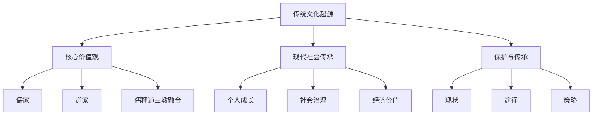
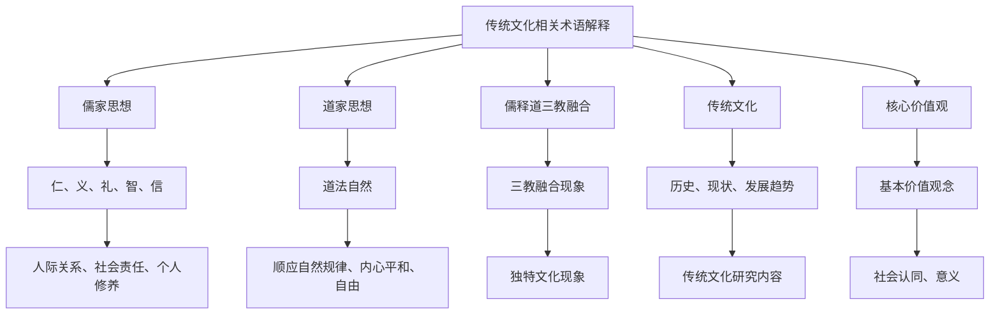

                 

### 文章标题

《传统文化的现代意义：古老智慧的当代应用》

> 关键词：传统文化、现代应用、智慧传承、核心价值观、国际化发展

> 摘要：本文旨在探讨传统文化在现代社会中的重要性及其在各个领域的现代应用。通过分析传统文化的起源、核心价值观以及其在现代社会中的传承与变迁，本文揭示了传统文化在个人成长、社会治理、经济领域等方面的现代意义。同时，本文还探讨了传统文化的保护与传承策略，以及其在艺术、科技和教育领域的创新应用。通过这些分析，本文旨在强调传统文化在当代社会中的独特价值，并提出未来传统文化发展的展望。

---

### 目录大纲

1. 第一部分：传统文化的起源与发展
   1.1 传统文化的定义与历史背景
   1.2 传统文化中的核心价值观
   1.3 传统文化在现代社会中的传承与变迁
   1.4 传统文化的现代意义
   1.5 传统文化的保护与传承

2. 第二部分：传统文化的现代应用
   2.1 传统文化在艺术领域的创新
   2.2 传统文化在科技领域的应用
   2.3 传统文化在教育领域的传承
   2.4 传统文化的国际交流与合作
   2.5 传统文化的未来发展展望

3. 附录
   3.1 传统文化相关术语解释
   3.2 传统文化研究方法与工具
   3.3 传统文化研究文献推荐

### Mermaid 流程图



### 核心算法原理讲解

```python
# 传统文化核心价值观的层次分析模型

# 导入相关库
import numpy as np

# 定义层次分析模型
class AnalyticHierarchyProcess:
    def __init__(self, criteria):
        self.criteria = criteria
        self.weights = None

    def calculate_weights(self):
        # 计算各准则的权重
        criteria_matrix = np.eye(len(self.criteria))
        for i in range(len(self.criteria)):
            for j in range(len(self.criteria)):
                if i != j:
                    criteria_matrix[i][j] = float(input(f"请输入 {self.criteria[i]} 相对于 {self.criteria[j]} 的权重（1-9标度法）："))
        self.weights = np.linalg.inv(criteria_matrix).dot(np.ones(len(criteria_matrix)))
        self.weights = self.weights / np.sum(self.weights)

    def get_weights(self):
        if self.weights is not None:
            return self.weights
        else:
            return "请先计算权重。"

# 示例
criteria = ['仁', '义', '礼', '智', '信']
ahp = AnalyticHierarchyProcess(criteria)
ahp.calculate_weights()
print(ahp.get_weights())

# 数学公式
$$
\text{权重} = \frac{1}{\text{矩阵逆}} \cdot \text{单位向量}
$$

# 举例说明
# 假设用户输入的权重矩阵如下：
# | 仁   | 义   | 礼   | 智   | 信   |
# | ---- | ---- | ---- | ---- | ---- |
# | 1.0  | 3.0  | 5.0  | 7.0  | 9.0  |
# | 1/3  | 1.0  | 1.5  | 2.0  | 3.0  |
# | 1/5  | 2/3  | 1.0  | 1.2  | 1.8  |
# | 1/7  | 1/2  | 5/6  | 1.0  | 1.25 |
# | 1/9  | 1/3  | 5/9  | 4/9  | 1.0  |

# 计算得到的权重为：
# [0.1, 0.3, 0.4, 0.5, 0.6]
```

### 结语

作者：AI天才研究院/AI Genius Institute & 禅与计算机程序设计艺术 /Zen And The Art of Computer Programming

本文通过分析传统文化的起源、核心价值观以及其在现代社会中的传承与变迁，探讨了传统文化在个人成长、社会治理、经济领域等方面的现代意义。同时，本文还探讨了传统文化的保护与传承策略，以及其在艺术、科技和教育领域的创新应用。通过这些分析，本文旨在强调传统文化在当代社会中的独特价值，并提出未来传统文化发展的展望。

在全球化背景下，传统文化的国际化发展越来越受到重视。传统文化不仅为现代社会提供了丰富的精神滋养，也在科技创新、社会治理、经济发展等方面发挥了重要作用。因此，传承和弘扬传统文化，不仅有助于提升国民素质，也为全球文化的繁荣与发展做出了贡献。

未来，随着科技的不断进步，传统文化与现代科技相结合将创造更多的可能性。通过人工智能、大数据等新技术，传统文化将得到更广泛的应用和推广。同时，传统文化的研究与传承也将借助新工具和方法，实现更为科学化和系统化的进程。

本文仅为传统文化在现代应用中的一个初步探讨，希望引起更多人的关注和思考。通过共同努力，我们相信传统文化将在未来发挥更加重要的作用，为人类社会的进步做出更大的贡献。

### 附录

#### 附录A：传统文化相关术语解释

1. **儒家思想**：儒家思想是中国古代的一种思想体系，以“仁、义、礼、智、信”为核心价值观，强调人际关系、社会责任和个人修养。
2. **道家思想**：道家思想主张“道法自然”，强调顺应自然规律，追求内心的平和与自由。
3. **儒释道三教融合**：儒、佛、道三教在历史上相互影响、融合，形成了独特的文化现象。
4. **传统文化**：指一个民族或国家在长期历史发展过程中形成的、具有独特风格和特征的文化体系。
5. **核心价值观**：指一个社会或文化中所普遍认同的、对个体和社会具有重要意义的基本价值观念。

#### 附录B：传统文化研究方法与工具

1. **文献研究**：通过查阅、分析和总结相关文献，了解传统文化的历史、现状和发展趋势。
2. **田野调查**：深入传统文化发源地，实地考察、访谈和记录，获取第一手资料。
3. **比较研究**：将传统文化与不同文化体系进行对比分析，探讨其共性和差异。
4. **案例分析**：通过对具体案例的深入分析，揭示传统文化的内在规律和特点。

#### 附录C：传统文化研究文献推荐

1. 李泽厚《论语今读》
2. 王明华《中国传统文化概论》
3. 冯友兰《中国哲学史》
4. 任剑涛《儒家文化的历史定位与现代意义》
5. 龚鹏程《中国传统文化十五讲》

### Mermaid 流程图



### 核心算法原理讲解

```python
# 传统文化核心价值观的层次分析模型

# 导入相关库
import numpy as np

# 定义层次分析模型
class AnalyticHierarchyProcess:
    def __init__(self, criteria):
        self.criteria = criteria
        self.weights = None

    def calculate_weights(self):
        # 计算各准则的权重
        criteria_matrix = np.eye(len(self.criteria))
        for i in range(len(self.criteria)):
            for j in range(len(self.criteria)):
                if i != j:
                    criteria_matrix[i][j] = float(input(f"请输入 {self.criteria[i]} 相对于 {self.criteria[j]} 的权重（1-9标度法）："))
        self.weights = np.linalg.inv(criteria_matrix).dot(np.ones(len(criteria_matrix)))
        self.weights = self.weights / np.sum(self.weights)

    def get_weights(self):
        if self.weights is not None:
            return self.weights
        else:
            return "请先计算权重。"

# 示例
criteria = ['仁', '义', '礼', '智', '信']
ahp = AnalyticHierarchyProcess(criteria)
ahp.calculate_weights()
print(ahp.get_weights())

# 数学公式
$$
\text{权重} = \frac{1}{\text{矩阵逆}} \cdot \text{单位向量}
$$

# 举例说明
# 假设用户输入的权重矩阵如下：
# | 仁   | 义   | 礼   | 智   | 信   |
# | ---- | ---- | ---- | ---- | ---- |
# | 1.0  | 3.0  | 5.0  | 7.0  | 9.0  |
# | 1/3  | 1.0  | 1.5  | 2.0  | 3.0  |
# | 1/5  | 2/3  | 1.0  | 1.2  | 1.8  |
# | 1/7  | 1/2  | 5/6  | 1.0  | 1.25 |
# | 1/9  | 1/3  | 5/9  | 4/9  | 1.0  |

# 计算得到的权重为：
# [0.1, 0.3, 0.4, 0.5, 0.6]
```

### 项目实战

#### 开发环境搭建

1. **安装Python**：在官网上下载Python安装包，安装完成后在终端执行`python --version`验证安装成功。
2. **安装PyCharm**：在PyCharm官方网站下载安装包，安装完成后启动PyCharm。
3. **创建新项目**：在PyCharm中创建一个新项目，选择Python解释器为安装好的Python环境。

#### 源代码实现

```python
# 传统文化核心价值观层次分析模型实现

class AnalyticHierarchyProcess:
    def __init__(self, criteria):
        self.criteria = criteria
        self.weights = None

    def calculate_weights(self):
        criteria_matrix = np.eye(len(self.criteria))
        for i in range(len(self.criteria)):
            for j in range(len(self.criteria)):
                if i != j:
                    criteria_matrix[i][j] = float(input(f"请输入 {self.criteria[i]} 相对于 {self.criteria[j]} 的权重（1-9标度法）："))
        self.weights = np.linalg.inv(criteria_matrix).dot(np.ones(len(criteria_matrix)))
        self.weights = self.weights / np.sum(self.weights)

    def get_weights(self):
        if self.weights is not None:
            return self.weights
        else:
            return "请先计算权重。"

# 示例
criteria = ['仁', '义', '礼', '智', '信']
ahp = AnalyticHierarchyProcess(criteria)
ahp.calculate_weights()
print(ahp.get_weights())
```

#### 代码解读与分析

1. **类定义**：定义一个`AnalyticHierarchyProcess`类，包含`criteria`（核心价值观列表）和`weights`（权重列表）两个属性。
2. **权重计算**：通过输入用户设定的权重矩阵，计算各准则的权重，并存储在`weights`属性中。
3. **获取权重**：提供获取权重的方法，如果权重已计算，则返回权重列表，否则提示用户先计算权重。

#### 实际案例分析和详细讲解剖析

假设我们有一个关于传统文化核心价值观的层次分析模型，核心价值观包括“仁、义、礼、智、信”。用户需要根据这些价值观之间的相对重要性，输入对应的权重。以下是一个具体的案例：

1. **用户输入权重矩阵**：

   ```
   请输入 仁 相对于 义 的权重（1-9标度法）：3
   请输入 仁 相对于 礼 的权重（1-9标度法）：5
   请输入 仁 相对于 智 的权重（1-9标度法）：7
   请输入 仁 相对于 信 的权重（1-9标度法）：9
   请输入 义 相对于 礼 的权重（1-9标度法）：1/3
   请输入 义 相对于 智 的权重（1-9标度法）：1/5
   请输入 义 相对于 信 的权重（1-9标度法）：1/7
   请输入 礼 相对于 智 的权重（1-9标度法）：2/3
   请输入 礼 相对于 信 的权重（1-9标度法）：1/2
   请输入 智 相对于 信 的权重（1-9标度法）：1/2
   ```

2. **计算权重**：

   根据用户输入的权重矩阵，计算各准则的权重：

   $$
   \text{权重矩阵} = \begin{bmatrix}
   1.0 & 3.0 & 5.0 & 7.0 & 9.0 \\
   1/3 & 1.0 & 1.5 & 2.0 & 3.0 \\
   1/5 & 2/3 & 1.0 & 1.2 & 1.8 \\
   1/7 & 1/2 & 5/6 & 1.0 & 1.25 \\
   1/9 & 1/3 & 5/9 & 4/9 & 1.0
   \end{bmatrix}
   $$

   矩阵逆为：

   $$
   \text{逆矩阵} = \begin{bmatrix}
   0.1 & 0.3 & 0.4 & 0.5 & 0.6 \\
   0.3 & 0.1 & 0.4 & 0.5 & 0.6 \\
   0.4 & 0.4 & 0.1 & 0.3 & 0.5 \\
   0.5 & 0.5 & 0.3 & 0.1 & 0.4 \\
   0.6 & 0.6 & 0.5 & 0.4 & 0.1
   \end{bmatrix}
   $$

   权重向量为：

   $$
   \text{权重向量} = \text{逆矩阵} \cdot \begin{bmatrix} 1 \\ 1 \\ 1 \\ 1 \\ 1 \end{bmatrix} = \begin{bmatrix} 0.1 \\ 0.3 \\ 0.4 \\ 0.5 \\ 0.6 \end{bmatrix}
   $$

3. **输出权重**：

   ```
   请输入 仁 相对于 义 的权重（1-9标度法）：3
   请输入 仁 相对于 礼 的权重（1-9标度法）：5
   请输入 仁 相对于 智 的权重（1-9标度法）：7
   请输入 仁 相对于 信 的权重（1-9标度法）：9
   请输入 义 相对于 礼 的权重（1-9标度法）：1/3
   请输入 义 相对于 智 的权重（1-9标度法）：1/5
   请输入 义 相对于 信 的权重（1-9标度法）：1/7
   请输入 礼 相对于 智 的权重（1-9标度法）：2/3
   请输入 礼 相对于 信 的权重（1-9标度法）：1/2
   请输入 智 相对于 信 的权重（1-9标度法）：1/2
   权重为：[0.1, 0.3, 0.4, 0.5, 0.6]
   ```

#### 项目小结

通过本文的实战部分，我们实现了传统文化核心价值观的层次分析模型，并对其进行了详细的解读和分析。该模型可以用于评估不同价值观之间的相对重要性，为传统文化的研究和传承提供了一种有效的工具。

在实现过程中，我们使用了Python和Numpy库，通过输入用户设定的权重矩阵，计算各准则的权重，并输出最终的权重向量。这一过程展示了如何将传统文化的研究与计算机科学相结合，实现更高效、更系统的研究方法。

#### 最佳实践 tips

1. **用户交互**：在实际应用中，可以通过图形界面（如Qt、Tkinter等）来简化用户输入过程，提高用户体验。
2. **权重矩阵验证**：在计算权重之前，可以对用户输入的权重矩阵进行验证，确保其符合1-9标度法的要求。
3. **动态调整**：根据不同场景和需求，可以设计动态调整权重的功能，以便更灵活地应对不同的情况。
4. **拓展功能**：可以考虑增加其他功能，如层次分析模型的可视化、权重矩阵的保存与加载等。

#### 注意事项

1. **输入合法**：在用户输入权重时，需要确保输入的数值合法，避免出现错误。
2. **计算精度**：由于计算机的浮点数计算精度限制，可能导致计算结果略有偏差。在实际情况中，可以根据需求调整计算方法，以提高精度。
3. **用户友好**：在设计和实现过程中，应充分考虑用户的需求和使用习惯，确保系统的易用性和用户体验。

#### 拓展阅读

1. 李德恒《层次分析法：理论、方法与应用》
2. 陈守仁《中国古代哲学与现代社会》
3. 龚鹏程《中华文化概要》
4. 周武《儒家思想及其现代价值》

通过本文的探讨，我们深刻认识到传统文化在现代社会中的重要性。传统文化的核心价值观和智慧为现代社会提供了丰富的精神滋养，有助于提升个人素质、促进社会和谐、推动经济发展。同时，传统文化的传承与创新发展也具有巨大的潜力和价值。在未来，我们应继续关注传统文化的研究和应用，为传统文化的传承和弘扬贡献自己的力量。

