                 

# 《倾听内心的声音：直觉能力的培养》

> 关键词：直觉能力、心理发展、认知提升、技术实践、灵性成长

> 摘要：
本文旨在探讨直觉能力的重要性及其培养方法。直觉作为一种超越常规逻辑思维的认知能力，不仅对个人决策、心理健康和创造力具有重要意义，还在科技和灵性领域发挥着不可忽视的作用。通过分析直觉的本质、发展过程及其应用场景，本文为读者提供了一条提升直觉能力的路径，旨在帮助读者在日常生活和工作中更好地倾听内心的声音。

## 引言

直觉，作为一种自然而然的认知过程，常常被描述为一种“第六感”或“内在的声音”。在日常生活中，直觉可以帮助我们快速做出决策、识别潜在的风险以及发现创新的想法。然而，直觉并非无源之水，它实际上是大脑长期积累的知识、经验和情感的综合体现。本文将围绕直觉能力的培养展开，从理解直觉的本质、直觉能力的发展、直觉技巧与实践、直觉与科学、直觉与灵性等多个方面进行探讨，旨在为读者提供一个全面而深入的直觉能力培养指南。

本文的结构如下：

1. **理解直觉**：介绍直觉的本质、类型及其与心理健康的关系。
2. **直觉的发展**：探讨儿童、青少年和成年人直觉能力的培养。
3. **直觉技巧与实践**：详细讲解直觉感知训练、直觉判断技巧及直觉在具体场景中的应用。
4. **直觉与科学**：分析直觉在科学探索、心理学和哲学中的作用。
5. **直觉与灵性**：探讨直觉与灵性的联系及其在冥想和心灵成长中的应用。
6. **直觉能力的障碍与克服**：分析直觉能力的障碍及其克服方法。
7. **直觉能力在日常生活中的应用**：介绍直觉在日常生活中的作用及其应用案例。
8. **直觉能力提升的实践策略**：提供提升直觉能力的具体实践策略。
9. **结语**：总结直觉能力的培养方法，并展望个人直觉能力的提升。

## 第1章：理解直觉

### 直觉的本质

直觉是一种超越常规逻辑推理的认知过程，它依赖于大脑的快速计算和模式识别能力。与理性思维不同，直觉通常不需要经过详细的推理和验证，而是在瞬间形成判断或洞察。直觉的产生与大脑的不同区域密切相关，包括前额叶皮层、颞叶和扣带回等。这些区域协同工作，使得直觉能够在复杂和不确定的情况下迅速作出反应。

### 直觉与理性的关系

直觉与理性思维并非相互排斥，而是相辅相成的。理性思维依赖于逻辑和证据，通过逐步推理得出结论。而直觉则是在缺乏充分证据或时间紧迫的情况下，依靠快速计算和模式识别形成判断。直觉可以帮助我们迅速识别潜在的危险、捕捉到新的机会或灵感。然而，直觉也可能受到错误信息或心理偏见的影响，因此在使用直觉时，需要结合理性的分析进行综合判断。

### 直觉的来源

直觉的来源多种多样，主要包括以下几个方面：

1. **经验积累**：长期积累的经验和知识是直觉的重要来源。通过不断地实践和学习，大脑能够形成复杂的模式识别能力，从而在类似情境中快速作出判断。
2. **情感因素**：情感因素在直觉中起着重要作用。强烈的情感反应往往能够帮助我们迅速作出决策，尤其是在面临紧急情况时。
3. **潜意识**：潜意识中储存的大量信息和模式识别能力也是直觉的重要来源。当我们面临复杂问题时，大脑会自动调用这些潜意识中的信息进行快速计算。
4. **文化背景**：不同的文化背景和价值观也会影响直觉的形成。某些文化可能更强调逻辑和理性，而另一些文化则可能更倾向于情感和直觉。

### 直觉能力的类型

直觉能力可以分为多种类型，每种类型都有其独特的特点和表现形式：

1. **情感直觉**：情感直觉使我们能够感知他人的情绪和心理状态，从而在人际交往中做出更恰当的回应。例如，在面试中，面试官可以通过直觉感知候选人的自信心和真实动机。
2. **知识直觉**：知识直觉是指我们在面对特定问题时，能够迅速找到相关知识和解决方案。这种直觉通常源于长期的学习和实践。
3. **创造性直觉**：创造性直觉帮助我们产生新的想法和创意。在艺术创作和科学研究等领域，创造性直觉起着至关重要的作用。

### 直觉与心理健康的联系

直觉与心理健康之间存在着密切的联系。一方面，良好的直觉能力可以帮助我们更好地应对压力和挑战，提高生活质量。另一方面，心理健康的维护也有助于直觉能力的发挥。以下是一些具体的关系：

1. **直觉与情感管理**：直觉可以帮助我们识别和管理自己的情绪。例如，当我们感到焦虑或愤怒时，直觉可能会提示我们采取放松或调整心态的方法。
2. **直觉与创造力**：直觉与创造力密切相关。在创新过程中，直觉能够帮助我们迅速捕捉到新的灵感或思路。
3. **直觉与决策**：直觉在决策中起着重要作用。在面对复杂问题时，直觉可以帮助我们迅速作出决策，避免过度分析而导致的选择困难。

通过理解直觉的本质、类型及其与心理健康的关系，我们可以更好地认识到直觉的重要性，并学会如何培养和发展直觉能力。下一章将深入探讨直觉能力的发展过程，从儿童、青少年到成年人的不同阶段，帮助读者了解如何在不同的人生阶段培养和提升直觉能力。

### 直觉能力的类型

直觉作为一种复杂的认知能力，可以分为多种不同的类型，每种类型都有其独特的特点和表现形式。以下将详细讨论情感直觉、知识直觉和创造性直觉：

#### 情感直觉

情感直觉是指我们能够感知和理解他人情绪和心理状态的能力。这种直觉在人际交往中具有重要意义。例如，在商业谈判中，销售人员可以通过情感直觉感知客户的情绪变化，从而调整自己的策略，提高成交率。在日常生活中，情感直觉帮助我们更好地处理人际关系，建立信任和合作关系。

情感直觉的例子包括：

- **情境识别**：通过他人的表情、语调、身体语言等非语言信号，识别其情绪状态。
- **情绪共鸣**：在他人情绪低落时，能够迅速感受到并表达关心和支持。
- **情境反应**：在紧急情况下，快速作出反应，如避开潜在的冲突或危险。

#### 知识直觉

知识直觉是指我们在面对特定问题时，能够迅速调用相关知识和经验进行判断和决策的能力。知识直觉通常是基于长期的学习和实践积累，因此它在不同领域的专业工作者中尤为重要。例如，医生在面对复杂的病例时，可以通过知识直觉迅速诊断并提出有效的治疗方案。

知识直觉的例子包括：

- **经验积累**：通过不断学习和实践，积累丰富的专业知识。
- **快速联想**：在复杂问题中，迅速将相关信息进行联想，形成解决方案。
- **直觉判断**：在面对紧急情况时，迅速作出正确的判断和决策。

#### 创造性直觉

创造性直觉是指我们能够产生新颖、独特想法和创意的能力。在艺术创作、科学研究和商业创新等领域，创造性直觉起着至关重要的作用。例如，科学家在实验中可能会通过创造性直觉捕捉到重要的发现，而企业家则可能通过创造性直觉开发出革命性的产品。

创造性直觉的例子包括：

- **灵感闪现**：在思考问题时，突然产生新的想法或解决方案。
- **跨领域思考**：从不同领域获取灵感，形成创新性的思路。
- **直觉创意**：在创作过程中，不受常规思维限制，自由表达自己的想法。

#### 情感直觉、知识直觉与创造性直觉的联系

情感直觉、知识直觉和创造性直觉并非孤立的，它们之间存在紧密的联系。情感直觉可以增强人际交往和团队合作的能力，知识直觉可以提供解决问题的坚实基础，而创造性直觉则能够推动创新和进步。在实际应用中，这三种直觉类型常常相互结合，共同发挥重要作用。

例如，在企业管理中，领导者可能需要通过情感直觉感知员工的情绪和心理状态，通过知识直觉了解市场动态和竞争态势，并通过创造性直觉提出创新的战略和方案。这种综合运用不同类型的直觉，有助于提高决策质量，推动企业的发展。

通过了解情感直觉、知识直觉和创造性直觉的不同类型及其具体例子，我们可以更好地认识到直觉的多样性和复杂性。在下一章中，我们将进一步探讨如何在不同的人生阶段培养和提升直觉能力。

### 直觉与心理健康的联系

直觉能力不仅是一种认知工具，它在维护和提升心理健康方面也起着重要作用。直觉与情感管理、创造力和决策能力之间的紧密联系，使得培养和提升直觉能力对个人的整体心理健康至关重要。

#### 直觉与情感管理

情感管理是指个体识别、理解并有效地处理自己的情绪的能力。直觉在情感管理中发挥着至关重要的作用。例如，在压力较大的工作环境中，直觉可以帮助我们迅速识别潜在的情感问题，从而及时采取应对措施，如调整心态、寻求支持或采取放松技巧。直觉还能够帮助我们更好地理解他人的情绪，促进人际关系的和谐。

直觉在情感管理中的具体作用包括：

- **情绪预知**：直觉可以帮助我们预知情绪变化的信号，如紧张、焦虑或沮丧，从而提前采取预防措施。
- **情感调节**：通过直觉，我们可以快速找到调节情绪的方法，如深呼吸、冥想或与他人交流。
- **情境适应**：直觉使我们能够迅速适应不同的情感情境，如从悲伤中恢复或从兴奋中冷静下来。

#### 直觉与创造力

创造力是直觉的重要表现之一。直觉能够帮助我们在面临创新挑战时迅速捕捉到新的想法和解决方案。在艺术创作、科学研究和商业创新等领域，直觉是激发创造性思维的重要源泉。

直觉在创造力中的具体作用包括：

- **灵感闪现**：直觉能够突然带来灵感，使我们产生新的创意或思路。
- **跨界思维**：直觉可以促进跨领域思考，帮助我们从不同角度审视问题，从而找到创新的解决方案。
- **直觉判断**：在创作过程中，直觉可以帮助我们迅速判断哪个想法更有潜力，从而节省时间和精力。

#### 直觉与决策

决策是生活中不可避免的一部分，无论是个人生活中的小事，还是职业发展中的重大决策，都需要我们进行明智的选择。直觉在这个过程中发挥着关键作用，尤其是在时间紧迫或信息不充分的情况下。

直觉在决策中的具体作用包括：

- **快速反应**：直觉可以帮助我们迅速评估复杂情境，从而作出快速反应。
- **风险识别**：直觉能够帮助我们识别潜在的风险和机会，从而在决策中作出更为明智的选择。
- **直觉信任**：有时，直觉会告诉我们某个决策是正确的，尽管没有明确的数据或证据支持。这种直觉信任可以增强我们的决策信心。

#### 直觉与心理健康的关系

直觉与心理健康之间存在着密切的关系。心理健康不仅影响我们的情绪和创造力，还影响我们的决策能力和整体生活质量。以下是直觉与心理健康之间的几个关键联系：

- **情绪稳定**：良好的直觉能力可以帮助我们更好地管理情绪，保持情绪稳定，从而提升心理健康水平。
- **心理适应**：直觉使我们能够快速适应环境变化，从而提高心理韧性。
- **自我认知**：直觉在自我认知中起到重要作用，通过直觉，我们可以更好地了解自己的需求和欲望，从而实现个人成长。

综上所述，直觉能力在心理健康中起着不可忽视的作用。通过培养和提升直觉能力，我们可以更好地管理情绪、提高创造力、做出明智的决策，从而提升整体心理健康水平。下一章将探讨如何在不同的人生阶段培养和提升直觉能力。

### 第2章：直觉的发展

直觉能力并非一成不变，而是可以通过系统的培养和实践逐步发展和提升。在不同的年龄阶段，直觉能力的发展过程和培养方式有所不同。本章将探讨儿童、青少年和成年人直觉能力的培养，以及不同阶段所需的具体策略和途径。

#### 儿童直觉能力的培养

在儿童阶段，直觉能力的培养主要集中在激发好奇心和探索精神，为未来直觉能力的发展打下基础。以下是一些培养儿童直觉能力的策略：

1. **家庭环境的培养**：家庭是儿童最早接触世界的场所，因此家庭环境对直觉能力的发展至关重要。父母可以通过以下方式促进儿童直觉能力的培养：

   - **鼓励探索**：为孩子提供安全的环境，鼓励他们探索未知，培养好奇心。
   - **故事讲述**：通过讲故事、阅读和讨论，帮助儿童理解情感和道德，提升情感直觉。
   - **游戏互动**：通过角色扮演、益智游戏等互动活动，培养儿童的创造性直觉和决策能力。

2. **教育方式的调整**：学校教育在儿童直觉能力的发展中也起着重要作用。教师可以采取以下措施：

   - **项目式学习**：通过项目式学习，鼓励学生自主探索和解决问题，培养他们的直觉能力。
   - **跨学科教学**：跨学科教学有助于学生从不同角度理解问题，促进创造性直觉的发展。
   - **情感教育**：在课程中加入情感教育，帮助学生识别和理解自己的情感，提升情感直觉。

#### 青少年直觉能力的发展

青少年阶段是直觉能力发展的关键时期，这个阶段的个体开始面临更多的社会挑战和决策机会。以下是一些培养青少年直觉能力的策略：

1. **学校教育的角色**：学校在青少年直觉能力的发展中扮演着重要角色。以下措施可以促进直觉能力的发展：

   - **批判性思维训练**：通过批判性思维课程，培养学生的逻辑思维和分析能力，为直觉判断提供基础。
   - **实践活动**：组织社会实践活动，如志愿服务、科学实验等，增强学生的知识直觉和决策能力。
   - **心理辅导**：提供心理辅导，帮助学生理解和管理自己的情绪，提高情感直觉。

2. **社交经验的作用**：青少年在社交互动中学习如何识别他人的情绪和意图，这是情感直觉的重要来源。以下是一些促进社交经验发展的策略：

   - **社交技能培训**：通过社交技能培训，如沟通技巧、情绪管理等，提高学生的社交直觉。
   - **团队合作**：参与团队活动，如小组项目、体育竞赛等，培养团队合作和领导能力，增强直觉感知。
   - **跨文化交流**：鼓励跨文化交流，帮助学生理解不同文化背景下的情绪和行为，提升跨文化直觉。

#### 成年人直觉能力的提升

成年人的直觉能力发展更多依赖于持续的学习和实践。以下是一些提升成年人直觉能力的策略：

1. **持续学习的价值**：成年后，学习新知识和技能是提升直觉能力的重要途径。以下是一些具体方法：

   - **专业培训**：参加专业培训课程，提高专业知识和技能，增强知识直觉。
   - **在线学习**：利用在线教育资源，如课程、研讨会等，持续学习新知识。
   - **实践经验**：通过实践项目、实习等，将所学知识应用于实际场景，提升直觉能力。

2. **体验式学习的方法**：体验式学习是一种通过实际体验和反思来提升直觉能力的方法。以下是一些具体方法：

   - **冥想和反思**：通过冥想和反思，提高自我意识和情绪管理能力，增强情感直觉。
   - **艺术创作**：参与艺术创作，如绘画、音乐、写作等，激发创造性直觉。
   - **户外探险**：参与户外探险活动，如登山、潜水等，增强直觉感知和决策能力。

总之，直觉能力的培养是一个长期而持续的过程，不同年龄阶段的个体需要采取不同的策略和途径。通过家庭环境、学校教育、社交经验和持续学习等多种方式，我们可以有效地培养和提升直觉能力，从而在日常生活和工作中更好地倾听内心的声音。

### 第3章：直觉技巧与实践

直觉作为一种认知能力，不仅需要我们理解其本质和类型，更需要通过具体的技巧和实践来提升。本章将详细讲解直觉感知的训练、直觉判断的技巧以及直觉在具体场景中的应用。

#### 直觉感知的训练

直觉感知是指我们通过感官和情感体验来获取信息的能力。以下是几种提升直觉感知的技巧：

1. **增强注意力**：
   - **练习专注**：通过冥想、专注力训练等，提高注意力的集中程度。
   - **减少干扰**：在学习和工作时，尽量减少外界干扰，如关闭社交媒体通知，创造一个专注的环境。

2. **提高情绪敏感度**：
   - **情感觉察**：通过日记、情感觉察练习等，增强对自身和他人情绪的感知。
   - **情绪调节**：学习情绪调节技巧，如深呼吸、正念冥想等，帮助我们在面对压力时保持冷静。

3. **培养开放心态**：
   - **保持好奇心**：对周围事物保持好奇心，乐于接受新的观点和信息。
   - **多角度思考**：尝试从不同角度和立场思考问题，拓宽思维视野。

#### 直觉判断的技巧

直觉判断是指我们在面对复杂情境时，通过直觉快速作出决策的能力。以下是一些提高直觉判断的技巧：

1. **直觉与逻辑思维的结合**：
   - **逻辑分析**：在直觉判断的基础上，进行逻辑分析，确保决策的合理性和可行性。
   - **验证假设**：对于直觉得出的结论，通过实际操作或数据分析进行验证。

2. **直觉决策的步骤**：
   - **情景分析**：首先，对当前情境进行分析，识别关键问题和潜在风险。
   - **直觉判断**：根据以往的经验和直觉，迅速作出初步判断。
   - **逻辑验证**：对直觉判断进行逻辑分析和验证，确保决策的合理性。

3. **直觉误判的识别与处理**：
   - **反思**：定期反思直觉决策的结果，识别误判的原因。
   - **调整策略**：根据反思结果，调整直觉判断的方法和策略。

#### 直觉运用的场景

直觉在不同的场景中有着广泛的应用，以下是一些具体的场景：

1. **职场中的直觉应用**：
   - **项目管理**：项目经理可以通过直觉感知团队成员的情绪和动力，及时调整项目计划。
   - **风险评估**：在市场分析中，直觉可以帮助我们快速识别潜在的风险和机会。

2. **艺术创作中的直觉运用**：
   - **灵感来源**：艺术创作者可以通过直觉捕捉灵感，产生独特的创意。
   - **情感表达**：直觉可以帮助艺术家更好地表达内心的情感和体验。

3. **生活决策中的直觉指导**：
   - **购物决策**：在购物时，直觉可以帮助我们快速判断商品的质量和价值。
   - **人际关系**：在处理人际关系时，直觉可以帮助我们更好地理解他人的意图和需求。

通过以上技巧和实践，我们可以逐步提升直觉能力，使其在日常生活中的各个场景中发挥更大的作用。下一章将探讨直觉在科学、心理学和哲学领域中的应用，进一步揭示直觉的多维度价值。

### 第4章：直觉与科学

直觉作为一种重要的认知能力，不仅在日常生活中发挥作用，也在科学探索中具有独特的价值。直觉在科学实验、科学研究以及心理学和哲学领域中的应用，为我们提供了对直觉能力的全新认识和理解。

#### 直觉与科学探索

科学探索依赖于理性和逻辑思维，但在某些情况下，直觉也能发挥重要作用。例如，在科学实验中，直觉可以帮助科学家迅速识别异常现象或潜在的假设。以下是直觉在科学探索中的几个应用：

1. **实验设计**：
   - **快速假设**：在实验设计阶段，科学家可能会凭借直觉迅速提出假设，从而节省时间和资源。
   - **情境预判**：直觉可以帮助科学家预判实验过程中可能出现的情境，从而提前制定应对策略。

2. **数据解读**：
   - **异常识别**：在分析实验数据时，直觉可以帮助科学家快速识别出异常数据点，从而进行进一步调查。
   - **模式识别**：直觉能够帮助科学家从大量数据中快速识别出潜在的规律或模式。

#### 直觉在科学研究中的应用

直觉不仅在科学探索中发挥作用，还在科学研究中为研究者提供了宝贵的洞察力。以下是一些具体应用：

1. **理论构建**：
   - **直觉假设**：科学家有时会通过直觉提出新的理论或假设，这些假设随后通过实验验证得到证实。
   - **跨学科思维**：直觉可以帮助科学家在跨学科研究中，从不同领域获取灵感，提出创新性的理论。

2. **研究创新**：
   - **突破性发现**：科学家在研究过程中，凭借直觉可能会产生突破性的发现，例如新的材料、新的方法或新的应用。
   - **研究灵感**：直觉可以激发科学家的研究灵感，推动科学研究的进展。

#### 直觉与心理学

直觉在心理学领域中的应用同样广泛。心理学研究依赖于实验和数据分析，但直觉在理解人类行为和情感方面也起着重要作用。以下是直觉在心理学中的应用：

1. **行为预测**：
   - **情感直觉**：心理学家可以通过情感直觉预测个体的行为，例如在面试中预测求职者的成功概率。
   - **情绪识别**：直觉帮助心理学家快速识别个体的情绪状态，从而更好地理解他们的行为动机。

2. **心理咨询**：
   - **直觉诊断**：在心理咨询中，咨询师可能会通过直觉快速识别来访者的情感和心理问题，从而制定更有效的治疗计划。
   - **情境分析**：直觉帮助咨询师从不同角度分析来访者的情境，提供更具针对性的建议。

#### 直觉与哲学

直觉在哲学思考中也具有独特的价值。哲学探讨人类存在、知识、真理等根本性问题，直觉在其中发挥着重要作用。以下是直觉在哲学中的应用：

1. **知识获取**：
   - **直觉认识**：哲学家认为直觉是人类获取知识的一种途径，与理性思维相辅相成。
   - **直观真理**：某些哲学家认为，直觉可以直接感知真理，例如柏拉图的理念论。

2. **道德判断**：
   - **直觉道德**：直觉在道德判断中起着重要作用，例如直觉道德理论认为，道德原则是普遍且直接感知的。
   - **情境直觉**：哲学家通过直觉分析不同道德情境，探讨道德原则的应用。

综上所述，直觉在科学、心理学和哲学领域具有广泛的应用。直觉不仅为科学探索提供了新的视角，还在心理学和哲学思考中发挥着重要作用。通过深入理解直觉的应用，我们可以更好地认识到直觉的多维度价值，并在各个领域中充分发挥直觉能力。下一章将探讨直觉与灵性的联系，进一步揭示直觉在个人成长和精神层面的重要性。

### 第5章：直觉与灵性

直觉与灵性之间存在着深刻的联系，两者共同构成了个人成长和精神提升的重要途径。在这一章中，我们将探讨直觉与灵性的联系，以及冥想和心灵成长在提升直觉能力中的作用。

#### 直觉与灵性的联系

灵性是指超越物质世界的内在体验和精神层面。直觉作为人类的一种内在认知能力，能够在灵性体验中发挥重要作用。直觉与灵性的联系主要体现在以下几个方面：

1. **直觉感知**：灵性体验往往涉及到超越常规感知的经验，例如冥想时的内在平静或宗教体验中的神秘感受。直觉能够帮助个体感知这些超越常规的现象，从而拓展我们对世界的认知。

2. **直觉连接**：灵性强调个体与宇宙之间的连接。直觉作为一种内在的声音，能够引导个体与更高层次的力量相连接，从而获得更深层次的理解和洞察力。

3. **直觉指导**：灵性实践中的许多决策和行动都依赖于直觉。例如，宗教领袖或灵性导师可能会通过直觉来指导信徒或学生，从而实现个人的灵性成长。

#### 直觉与冥想

冥想是一种传统的灵性实践，通过专注和内省来提升自我意识和心灵深度。直觉在冥想中发挥着重要作用，以下是一些具体的应用：

1. **冥想对直觉的影响**：
   - **心灵平静**：冥想能够帮助个体达到内心的平静和宁静，从而提高直觉感知能力。
   - **内在探索**：通过冥想，个体能够更深入地探索自己的内在世界，发现隐藏的直觉信息。

2. **冥想技巧的实践**：
   - **呼吸冥想**：通过深呼吸，个体可以放松身心，提高直觉感知能力。
   - **专注冥想**：通过专注于一个物体、声音或呼吸，个体可以培养集中注意力的能力，从而增强直觉判断。

3. **冥想与直觉的结合**：
   - **直觉引导**：在冥想过程中，个体可能会通过直觉感知到特定的信息或引导，从而实现灵性成长。
   - **直觉实践**：通过冥想，个体可以培养对直觉的信任，并将其应用于日常生活和决策中。

#### 直觉与心灵成长

心灵成长是指个体在精神层面实现提升和成长的过程。直觉在这一过程中发挥着关键作用，以下是一些具体的应用：

1. **直觉在自我认知中的作用**：
   - **自我探索**：直觉帮助个体探索内心的真实感受和需求，从而实现自我认知的提升。
   - **内在智慧**：直觉能够引导个体发现内在的智慧和洞察力，从而在心灵成长中取得突破。

2. **直觉在个人成长中的应用**：
   - **情感管理**：直觉帮助个体更好地管理自己的情绪，提高情感智慧和心理健康。
   - **创造性思维**：直觉能够激发个体的创造性思维，从而在艺术、科学和商业等领域实现创新。

3. **直觉与人生指导**：
   - **生活决策**：直觉在日常生活决策中发挥着重要作用，帮助个体做出更加明智和符合内在需求的决策。
   - **灵性指导**：直觉可以为个体提供灵性指导，帮助他们在面对人生挑战时找到方向和力量。

总之，直觉与灵性之间存在着深刻的联系，直觉在冥想和心灵成长中发挥着不可替代的作用。通过培养和提升直觉能力，个体可以更好地探索内在世界，实现精神层面的成长和提升。在下一章中，我们将探讨直觉能力的障碍及其克服方法，帮助读者在直觉培养过程中克服困难和挑战。

### 第6章：直觉能力的障碍与克服

尽管直觉能力在个人成长和决策中具有重要作用，但许多因素可能会阻碍直觉能力的发挥。了解这些障碍并采取有效的方法克服它们，对于提升直觉能力至关重要。以下将详细探讨直觉能力的障碍及其克服方法。

#### 直觉能力的障碍

1. **社会文化的影响**：

   社会文化环境往往对直觉能力的发展产生深远影响。在一些文化背景下，理性思维和科学方法被过分强调，而直觉则可能被视为不科学或不可信。这种文化观念可能导致个体对自己的直觉产生怀疑，从而限制直觉能力的发挥。

2. **教育背景的局限**：

   传统教育体系往往注重知识的传授和逻辑推理的培养，而忽视了直觉能力的培养。缺乏系统性的直觉训练和指导，使得个体在直觉能力的发展过程中可能遇到困难。

3. **心理障碍的干扰**：

   心理障碍，如焦虑、压力和恐惧，可能会干扰直觉的发挥。这些心理状态可能导致个体在决策过程中过于依赖理性思维，而忽视直觉的指引。

4. **情绪因素**：

   强烈的情绪，如愤怒、悲伤或焦虑，可能会影响直觉的准确性。情绪波动较大的个体可能在直觉判断时出现偏差，从而影响直觉能力的发挥。

5. **信息过载**：

   在信息爆炸的时代，个体可能会面临大量信息的选择和决策。信息过载可能导致个体在直觉判断时感到困惑和压力，从而影响直觉的发挥。

#### 克服直觉障碍的方法

1. **增强自我意识**：

   自我意识是指个体对自己内在感受和情绪的认知。通过提高自我意识，个体可以更好地理解自己的直觉，并在直觉引导下作出更加明智的决策。以下是一些增强自我意识的方法：

   - **情绪日记**：记录自己的情绪变化，帮助自己更好地理解情绪对直觉的影响。
   - **正念冥想**：通过正念冥想，提高对内在感受和情绪的觉察，增强自我意识。

2. **调整心态**：

   心态的调整对于克服直觉障碍至关重要。以下是一些有助于调整心态的方法：

   - **接受不确定性**：学会接受不确定性和模糊性，不要过分追求完美和确定性。
   - **培养信任**：建立对自己直觉的信任，不要轻易否定直觉的指引。

3. **寻求专业指导**：

   在直觉能力培养过程中，寻求专业人士的指导可以帮助个体更好地理解直觉，并克服直觉障碍。以下是一些寻求专业指导的方法：

   - **心理咨询**：通过心理咨询，个体可以学会如何管理情绪和心理障碍，从而提高直觉能力。
   - **灵性导师**：寻求灵性导师的指导，学习灵性实践和直觉培养的方法。

4. **持续学习和实践**：

   直觉能力的发展需要通过持续的学习和实践。以下是一些有助于持续学习和实践的方法：

   - **跨学科学习**：通过跨学科学习，拓宽知识面，增强直觉能力。
   - **体验式学习**：通过参与实际项目或实践活动，将直觉能力应用于实际问题，从而提升直觉能力。

5. **情绪管理**：

   情绪管理是克服直觉障碍的重要一环。以下是一些有助于情绪管理的方法：

   - **情绪调节技巧**：学习情绪调节技巧，如深呼吸、正念冥想等，帮助自己在面对压力和情绪波动时保持冷静。
   - **健康生活方式**：保持健康的饮食、充足的睡眠和适量的运动，有助于情绪稳定和直觉能力的提升。

通过了解直觉能力的障碍及其克服方法，我们可以更好地培养和提升直觉能力，使其在日常生活和工作中发挥更大的作用。在下一章中，我们将探讨直觉能力在日常生活中的应用，分享具体的案例和实践经验。

### 第7章：直觉能力在日常生活中的应用

直觉能力作为一种重要的认知工具，在日常生活中的应用非常广泛。从生活决策到人际关系处理，再到创意思维的激发，直觉能力都在发挥着关键作用。以下将详细介绍直觉能力在日常生活中的具体应用，并通过案例进行分析。

#### 生活决策的指导

在日常生活中，直觉常常作为我们做出快速决策的依据。例如，在购物时，直觉可以帮助我们判断商品的质量和价值，避免购买到不满意的物品。以下是一个具体案例：

**案例**：一位消费者在超市购买牛奶。她之前从未尝试过这种品牌的牛奶，但当她拿起产品时，直觉告诉她这种牛奶可能不适合她的口味。虽然她没有明确的数据支持这个判断，但她最终选择了另一种品牌。几天后，她发现这种牛奶确实不合口味，她的直觉判断得到了验证。

这个案例展示了直觉在生活决策中的重要作用。尽管直觉不一定总是正确的，但它在帮助我们快速做出决策时提供了宝贵的参考。

#### 人际关系的处理

直觉在处理人际关系时也非常重要。它可以帮助我们更好地理解他人的情绪和心理状态，从而做出更恰当的回应。以下是一个具体案例：

**案例**：一位经理在面试新员工时，直觉告诉他这位应聘者可能缺乏团队合作精神。虽然经理没有找到具体的证据来支持这个判断，但他仍然决定不录用这位应聘者。几个月后，这位经理发现他的直觉是正确的，这位应聘者在工作中确实表现出了不合作的态度。

这个案例说明了直觉在人际关系中的价值。通过直觉，经理能够迅速识别潜在的问题，从而做出更明智的决策。

#### 创意思维的激发

直觉在创意思维和艺术创作中也发挥着重要作用。它可以帮助我们捕捉到新的灵感，从而激发创意思维。以下是一个具体案例：

**案例**：一位艺术家在创作一幅画作时，直觉告诉他应该使用一种从未尝试过的颜色组合。虽然艺术家对此感到困惑，但他还是决定跟随直觉。结果，这幅画作获得了极大的成功，成为他的代表作之一。

这个案例展示了直觉在创意思维中的力量。艺术家通过直觉捕捉到新的灵感，从而创作出独特的艺术作品。

#### 其他应用

除了上述案例，直觉能力在日常生活中的应用还包括：

- **职业选择**：在面临职业选择时，直觉可以帮助我们识别最适合自己的职业方向。
- **健康保健**：在健康管理中，直觉可以帮助我们识别身体的异常状况，从而及时采取措施。
- **财务管理**：在财务管理中，直觉可以帮助我们识别潜在的投资机会和风险。

### 直觉应用案例分析

以下是一些直觉应用的具体案例：

**案例1**：一位投资者在股市波动时，直觉告诉他应该卖出部分股票。尽管市场趋势显示股票价格还将上涨，但投资者最终选择了相信直觉。结果，不久后市场发生了大幅下跌，这位投资者成功避开了损失。

**案例2**：一位医生在诊断患者时，直觉告诉他应该进行进一步的检查。尽管常规检查结果正常，但医生还是坚持了直觉，最终发现患者实际上患有罕见的疾病。

**案例3**：一位创业者在公司成立初期，直觉告诉他应该专注于一个小市场而不是一个大市场。虽然直觉与市场研究的数据相矛盾，但创业者最终选择了相信直觉。结果，这个小市场为公司带来了巨大的成功。

通过这些案例，我们可以看到直觉在日常生活中的重要作用。尽管直觉并不是万能的，但它在帮助我们做出决策和解决问题时提供了宝贵的参考。

### 项目实战

以下是一个项目实战案例，展示如何开发一个基于直觉能力的应用：

**项目**：开发一个生活决策辅助应用，帮助用户在日常生活中做出更好的决策。

**开发环境**：Python、Flask框架、SQLite数据库

**源代码实现**：

```python
# 导入所需库
import sqlite3
from flask import Flask, request, render_template

# 创建Flask应用
app = Flask(__name__)

# 数据库连接
conn = sqlite3.connect('decisions.db')
c = conn.cursor()

# 创建表
c.execute('''CREATE TABLE IF NOT EXISTS decisions (id INTEGER PRIMARY KEY, context TEXT, decision TEXT)''')
conn.commit()

# 提交决策
@app.route('/submit_decision', methods=['POST'])
def submit_decision():
    context = request.form['context']
    decision = request.form['decision']
    c.execute("INSERT INTO decisions (context, decision) VALUES (?, ?)", (context, decision))
    conn.commit()
    return "Decision submitted successfully!"

# 查看历史决策
@app.route('/view_decisions')
def view_decisions():
    c.execute("SELECT * FROM decisions")
    rows = c.fetchall()
    return render_template('decisions.html', decisions=rows)

# 主函数
if __name__ == '__main__':
    app.run(debug=True)
```

**代码解读**：

- **数据库连接**：使用SQLite数据库存储用户提交的决策。
- **表创建**：创建一个名为“decisions”的表，用于存储决策的上下文和结果。
- **提交决策**：通过提交表单，将用户的决策存储到数据库中。
- **查看历史决策**：展示用户的历史决策，以便进行分析和反思。

通过这个项目，用户可以记录自己在生活中的决策，并分析直觉的准确性。这个应用不仅帮助用户提升直觉能力，还提供了一个反思和改进的途径。

### 项目小结

通过这个项目，我们可以看到直觉能力在日常生活中的重要性。直觉不仅可以指导我们做出更好的生活决策，还可以提升人际交往和创意思维。然而，直觉并不是万能的，我们需要结合理性分析和经验来综合判断。通过不断实践和反思，我们可以逐步提升直觉能力，使其在日常生活中发挥更大的作用。

### 最佳实践 tips

1. **记录直觉决策**：通过记录自己的直觉决策，可以更好地分析和反思直觉的准确性。
2. **结合理性分析**：在依赖直觉的同时，不要忽视理性分析和经验的重要性。
3. **保持开放心态**：对新的观点和信息保持开放，这有助于拓展直觉的视野。
4. **定期冥想**：通过冥想，可以增强自我意识和情绪管理能力，从而提高直觉感知。

通过这些最佳实践，我们可以更好地培养和提升直觉能力，使其在日常生活中的应用更加有效。

### 小结

直觉能力在日常生活中的应用非常广泛，从生活决策到人际关系处理，再到创意思维的激发，直觉都发挥着关键作用。通过了解和培养直觉能力，我们可以更好地应对日常生活中的各种挑战，提升生活质量。在下一章中，我们将探讨如何提升直觉能力，提供一些具体的实践策略。

### 第8章：直觉能力提升的实践策略

提升直觉能力并非一蹴而就，需要通过系统的实践和策略来实现。本章将介绍一些具体的实践策略，包括冥想练习、创造性思维训练、心理疏导与情绪管理，以及长期实践的重要性。

#### 冥想练习

冥想是提升直觉能力的一种有效方法。通过冥想，我们可以提高自我意识、减少心理压力，从而增强直觉感知能力。以下是一些冥想练习的建议：

1. **呼吸冥想**：
   - **方法**：找一个安静的地方，坐下或躺下，闭上眼睛，专注于呼吸。吸气时感受胸腔的扩张，呼气时感受身体的放松。
   - **时间**：每天至少练习10分钟，逐步增加至30分钟。

2. **正念冥想**：
   - **方法**：在日常生活中，如吃饭、洗澡、散步时，专注于当前的活动，感受身体和情绪的变化。
   - **时间**：每天至少练习10分钟，逐步增加。

3. **指导冥想**：
   - **方法**：通过跟随音频或书籍的指导，进行冥想练习。
   - **资源**：可使用应用程序或在线资源，如“冥想森林”、“冥想指南”等。

#### 创造性思维训练

创造性思维训练有助于激发直觉，提高创意生成和解决问题的能力。以下是一些创造性思维训练的方法：

1. **头脑风暴**：
   - **方法**：在不受限制的环境下，迅速写下所有与主题相关的想法，不评价其好坏。
   - **时间**：每次练习15-30分钟。

2. **思维导图**：
   - **方法**：使用思维导图软件，将主题作为中心，向外发散相关的想法和概念。
   - **工具**：可以使用在线工具，如“MindMeister”、“XMind”等。

3. **跨学科学习**：
   - **方法**：学习不同领域的知识，拓展思维视野，从而激发创造性思维。
   - **资源**：参加跨学科课程、阅读跨学科书籍等。

#### 心理疏导与情绪管理

情绪管理是提升直觉能力的重要一环。以下是一些心理疏导与情绪管理的方法：

1. **情绪日记**：
   - **方法**：记录每天的情绪变化，分析情绪的起因和影响。
   - **工具**：可以使用日记本或在线应用程序，如“Moodfit”等。

2. **认知行为疗法**：
   - **方法**：通过认知行为疗法，识别和改变负面思维模式，从而改善情绪状态。
   - **资源**：可寻求心理咨询师的帮助，或参加相关的训练课程。

3. **放松技巧**：
   - **方法**：练习深呼吸、渐进性肌肉放松等放松技巧，缓解压力和焦虑。
   - **资源**：在线视频教程、冥想应用程序等。

#### 长期实践的重要性

直觉能力的提升需要长期坚持和实践。以下是一些长期实践的建议：

1. **每日练习**：
   - **建议**：每天安排固定的时间进行冥想、创造性思维训练和情绪管理练习。
   - **目标**：建立习惯，使其成为日常生活的一部分。

2. **持续学习**：
   - **建议**：不断学习新的知识和技能，保持好奇心和开放心态。
   - **资源**：参加在线课程、读书、参加讲座等。

3. **反思与调整**：
   - **建议**：定期反思自己的直觉判断，分析成功和失败的原因，根据反馈调整训练方法。
   - **工具**：使用日记、思维导图等工具记录和反思。

通过以上实践策略，我们可以逐步提升直觉能力，使其在日常生活中发挥更大的作用。长期坚持和实践是关键，通过持续的努力，我们能够更好地倾听内心的声音，做出更加明智的决策。

### 第9章：结语

通过本文的探讨，我们深入了解了直觉能力的重要性及其培养方法。直觉作为一种超越常规逻辑思维的认知能力，在个人决策、心理健康、创造力和灵性成长中发挥着不可忽视的作用。从理解直觉的本质、类型和发展过程，到直觉技巧与实践，再到直觉在科学、心理学和哲学中的应用，我们逐步揭示了直觉的多维度价值。

直觉能力的培养需要系统的方法和长期的实践。通过冥想练习、创造性思维训练、心理疏导与情绪管理，我们可以逐步提升直觉能力，使其在日常生活中的各个场景中发挥更大的作用。同时，我们也要认识到直觉并非万能，需要结合理性分析和经验进行综合判断。

在个人直觉能力的反思与展望中，我们鼓励读者在日常生活中不断实践和反思，通过持续的努力，提升自己的直觉能力。倾听内心的声音，不仅可以更好地应对日常生活中的挑战，还能带来更深层次的心灵成长和自我认知。

未来的研究中，可以进一步探讨直觉能力在不同文化背景和教育体系下的表现和培养方法，以及直觉在人工智能和科技领域中的应用。通过跨学科的合作和研究，我们有望揭示直觉能力的更深层次机制，为人类的发展和进步提供新的视角和工具。

### 附录

#### 附录A：直觉能力的培养Mermaid流程图

```mermaid
graph TD
    A[理解直觉] --> B[直觉的本质]
    B --> C[直觉与理性的关系]
    B --> D[直觉的来源]
    A --> E[直觉能力的类型]
    E --> F[情感直觉]
    E --> G[知识直觉]
    E --> H[创造性直觉]
    A --> I[直觉与心理健康的联系]
    I --> J[直觉与情感管理]
    I --> K[直觉与创造力]
    I --> L[直觉与决策]
    B --> M[直觉的发展]
    M --> N[儿童直觉能力的培养]
    M --> O[青少年直觉能力的发展]
    M --> P[成年人直觉能力的提升]
    B --> Q[直觉技巧与实践]
    Q --> R[直觉感知的训练]
    Q --> S[直觉判断的技巧]
    Q --> T[直觉运用的场景]
    B --> U[直觉与科学]
    U --> V[直觉与科学探索]
    U --> W[直觉在科学研究中的应用]
    B --> X[直觉与心理学]
    X --> Y[直觉与心理现象的关系]
    X --> Z[直觉在心理咨询中的运用]
    B --> AA[直觉与哲学]
    AA --> BB[直觉与哲学思考]
    AA --> CC[直觉在哲学问题解决中的角色]
    B --> DD[直觉与灵性]
    DD --> EE[直觉与灵性的联系]
    DD --> FF[直觉与冥想]
    DD --> GG[直觉与心灵成长]
    C --> HH[直觉能力的障碍与克服]
    HH --> II[直觉能力的障碍]
    HH --> JJ[克服直觉障碍的方法]
    C --> KK[直觉能力在日常生活中的应用]
    KK --> LL[生活决策的指导]
    KK --> MM[人际关系的处理]
    KK --> NN[创意思维的激发]
    C --> OO[直觉能力提升的实践策略]
    OO --> PP[冥想练习]
    OO --> QQ[创造性思维训练]
    OO --> RR[心理疏导与情绪管理]
    C --> SS[结语]
    SS --> TT[直觉能力培养总结]
    SS --> UU[个人直觉能力的反思与展望]
```



#### 附录B：直觉能力测试与评估工具

1. **梅尔津直觉测验（Meyers-Briggs Type Indicator, MBTI）**：通过评估个人的性格类型，帮助了解直觉和感知偏好。
2. **直觉商数（Intuition Quotient, IQ）测试**：专门用于评估直觉能力的测试工具，涵盖直觉感知和直觉判断。
3. **罗森伯格自我评定量表（Rosenberg Self-Esteem Scale）**：通过评估自尊水平，间接反映直觉能力的发展。

#### 附录C：直觉能力培养资源推荐

1. **书籍**：
   - 《直觉：如何信任并利用你的内在智慧》（Trust Your Vibes: How to Trust Your Gut, Make Peace with Your Past, and Create Your Dream Life） by Heather McCullough
   - 《直觉的力量》（The Power of Intuition: How to Use Your Gut Feelings to Make Right Choices） by Ph.D. Dustin Ronco

2. **在线课程**：
   - Coursera上的《冥想与正念实践》（Meditation and Mindfulness for Well-being and Peak Performance）
   - edX上的《创造性思维》（Creative Thinking and Innovation）

3. **应用程序**：
   - “冥想森林”（Calm） - 提供冥想和放松指导。
   - “Headspace” - 提供各种冥想课程和训练。

通过使用这些测试工具和资源，读者可以更好地了解和提升自己的直觉能力。

### 参考文献

1. 《直觉：如何信任并利用你的内在智慧》（Trust Your Vibes: How to Trust Your Gut, Make Peace with Your Past, and Create Your Dream Life） by Heather McCullough.
2. 《直觉的力量》（The Power of Intuition: How to Use Your Gut Feelings to Make Right Choices） by Ph.D. Dustin Ronco.
3. 《冥想与正念实践》（Meditation and Mindfulness for Well-being and Peak Performance）on Coursera.
4. 《创造性思维》（Creative Thinking and Innovation）on edX.
5. 《梅尔津直觉测验》（Meyers-Briggs Type Indicator, MBTI）手册.
6. 《罗森伯格自我评定量表》（Rosenberg Self-Esteem Scale）.
7. Calm, Headspace, and other meditation apps.

作者：AI天才研究院/AI Genius Institute & 禅与计算机程序设计艺术 /Zen And The Art of Computer Programming

---

本文通过详细探讨直觉能力的重要性、类型、培养方法及其在日常生活、科学和灵性中的应用，为读者提供了一个全面而深入的直觉能力培养指南。通过系统的学习和实践，我们可以逐步提升直觉能力，使其在个人成长和决策中发挥更大的作用。在未来的探索中，让我们继续深入挖掘直觉的潜力，为人类的发展和进步贡献智慧。

