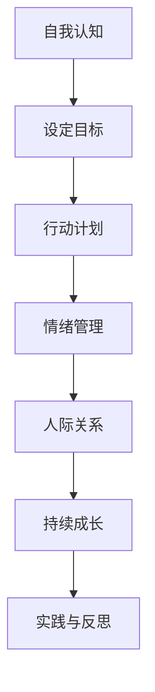

                 

### 做自己人生的主角：自我引导的艺术

**关键词**：自我引导、人生规划、目标设定、情绪管理、人际关系、持续成长

> **摘要**：在快速变化的现代社会中，如何做自己人生的主角、有效引导自己的生活与职业发展，成为了一个关键问题。本文通过详细探讨自我认知、目标设定、行动计划、情绪管理、人际关系以及持续成长等六大方面，为读者提供了实用的自我引导策略和方法，帮助他们在人生旅途中找到方向、实现目标。

---

## 引言

在人工智能和自动化技术飞速发展的今天，人们的生活和职业环境发生了翻天覆地的变化。在这个充满不确定性和机遇的时代，如何做自己人生的主角、有效地引导自己的生活与职业发展，成为了一个值得深入探讨的问题。自我引导不仅是个人成长和成功的关键，也是社会进步和创新的基石。

### 什么是自我引导？

自我引导（Self-Guidance）指的是个体通过自我认知、目标设定、计划执行和持续调整，主动地规划和实现自己的生活目标和职业目标。它要求个体具备高度的自主性、自我管理能力和反思能力，能够在复杂多变的环境中找到自己的方向和目标。

### 为什么自我引导重要？

1. **提高个人效能**：通过自我引导，个体能够更清晰地了解自己的优势和劣势，从而更有效地分配时间和资源，提升个人工作和生活的效能。
2. **促进职业发展**：在职业领域，自我引导可以帮助个人设定清晰的职业目标，制定可行的行动计划，并在执行过程中不断调整和优化，从而实现职业上的持续进步。
3. **增强心理健康**：自我引导不仅有助于实现目标，还能提高个体的心理弹性，帮助他们在面对挑战和困难时保持积极和乐观。
4. **推动社会创新**：自我引导的个体通常具备较强的创新精神和解决问题的能力，他们的积极行动和创造性思维可以推动社会的进步和发展。

本文将围绕自我引导的六大方面展开讨论，包括自我认知、目标设定、行动计划、情绪管理、人际关系和持续成长。每个部分都将结合实际案例和实用的工具方法，帮助读者深入理解自我引导的原理和技巧，从而在实际生活中应用并取得成功。

### 自我认知

自我认知是指个体对自己内在和外在的认知过程。它是自我引导的基础，因为只有真正了解自己，个体才能设定合理的目标，并采取有效的行动来实现这些目标。

#### 1.1.1 自我认知的定义

自我认知（Self-Awareness）是指个体对自己内在心理状态、性格特质、能力水平、价值观和动机等的深刻理解。它不仅仅是对自己的外在形象的认知，更重要的是对内在感受和思维模式的洞察。

#### 1.1.2 自我认知的重要性

1. **明确个人定位**：自我认知可以帮助个体明确自己的优势和劣势，从而在职业和生活选择中做出更加合适和明智的决策。
2. **设定合理目标**：只有了解自己的真实需求和能力，个体才能设定切实可行的目标，并制定有效的行动计划。
3. **提升决策能力**：通过自我认知，个体能够在面对选择时更加自信和果断，减少决策的盲目性和错误率。
4. **增强心理弹性**：自我认知有助于个体在面对挫折和挑战时保持积极心态，增强心理弹性。

#### 1.1.3 自我认知的维度

1. **外在形象**：包括外貌、衣着、举止等外在特征，这些都是他人对个体印象的直接来源。
2. **内在特质**：包括性格、兴趣、价值观等内在特点，这些特质决定了个体的行为模式和思维习惯。
3. **情感状态**：个体的情感状态包括快乐、悲伤、愤怒等，它们不仅影响个体的心理状态，还直接影响到行为和决策。

#### 1.1.4 自我认知的方法

1. **反思日记**：通过每天记录自己的想法、感受和行为，个体可以更好地了解自己的内心世界。
2. **第三方反馈**：通过询问家人、朋友或同事对自己的看法，个体可以获得更客观的自我认知。
3. **职业性格测试**：例如MBTI、DISC等性格测试，可以帮助个体了解自己的性格特点和潜在的优势与弱点。

### 总结

自我认知是自我引导的基础，它不仅帮助个体明确自己的优势和劣势，还为设定合理的目标和采取有效的行动提供了重要的依据。通过多种方法进行自我认知，个体可以更加全面和深入地了解自己，从而在人生旅途中找到自己的方向和目标。

---

### 设定目标

在自我认知的基础上，设定目标是自我引导的重要一环。明确的目标不仅为个体提供了前进的方向，还能激发内在的动力，帮助个体更加专注和高效地实现自己的愿望。

#### 2.1.1 目标设定的原则

1. **清晰性**：目标必须明确具体，避免模糊和抽象。例如，“我要成为一个成功的程序员”不如“我将在五年内成为拥有五年开发经验的资深程序员”具体。
2. **可行性**：目标必须符合个体的实际能力、资源和环境条件。设定过高或不切实际的目标只会导致挫败和放弃。
3. **时效性**：目标应该有明确的时间框架，如短期目标、中期目标和长期目标。这有助于个体更好地规划时间和资源，并逐步实现长远目标。

#### 2.1.2 目标设定的步骤

1. **自我评估**：在设定目标之前，个体需要对自己进行全面评估，包括能力、兴趣、价值观和资源等。这有助于确定目标是否符合自己的实际情况。
2. **确定目标**：在自我评估的基础上，个体可以明确自己的短期、中期和长期目标。短期目标通常是指一年内的目标，中期目标是指三年内的目标，长期目标则是指五年或更长时间的目标。
3. **制定计划**：为了实现目标，个体需要制定详细的行动计划。这包括分解目标、分配任务、设定时间表和制定评估指标。

#### 2.1.3 目标管理的工具

1. **SMART法则**：SMART法则是一种常用的目标设定工具，它要求目标具有以下五个特征：具体（Specific）、可衡量（Measurable）、可实现（Achievable）、相关（Relevant）和时限性（Time-bound）。
2. **记事本**：使用记事本记录目标、计划和进度，有助于个体随时查看和调整自己的行动计划。
3. **时间管理软件**：如Trello、Asana等时间管理工具，可以帮助个体更好地规划和跟踪自己的任务和目标。

### 实际案例

假设一个程序员小张，他希望在五年内成为技术领域的专家。他的目标设定和计划如下：

1. **自我评估**：小张通过自我反思和他人反馈，发现自己具备良好的编程能力和逻辑思维，但对新兴技术了解不足。
2. **确定目标**：
   - 短期目标（1年内）：学习并掌握至少三种新兴技术，如人工智能、区块链和大数据。
   - 中期目标（3年内）：参与至少两个重要的项目，积累实际经验。
   - 长期目标（5年内）：成为技术团队的核心成员，并在某个技术领域达到专家水平。
3. **制定计划**：
   - 分解目标：将每个目标分解为具体的任务和时间节点。
   - 任务分配：制定详细的学习计划，包括阅读书籍、参加线上课程和实践项目。
   - 时间规划：为每个任务设定时间表，确保按计划进行。

### 总结

设定目标是自我引导的重要环节，它为个体提供了明确的方向和动力。通过遵循清晰性、可行性和时效性等原则，并使用SMART法则和有效的目标管理工具，个体可以更好地实现自己的目标，从而在人生旅途中不断前进。

---

### 行动计划

一旦设定了明确的目标，接下来就需要制定并执行切实可行的行动计划，以确保目标的实现。行动计划不仅包括任务的分解和时间的规划，还需要考虑到执行过程中的各种因素和挑战。

#### 3.1.1 行动计划的构成

1. **目标分解**：将大目标分解为具体、可操作的小任务，使得每个任务都有明确的目标和时间节点。
2. **任务分配**：根据个人能力和资源，将任务分配给合适的团队成员或个人，确保每个人都知道自己的职责和任务。
3. **时间规划**：为每个任务设定具体的时间表，确保在规定的时间内完成。

#### 3.1.2 行动计划的执行

1. **克服拖延**：拖延是执行计划过程中常见的障碍。通过设定明确的时间表、创建工作清单和设置提醒，可以帮助个体克服拖延，提高执行力。
2. **增强自律**：自律是执行计划的关键。个体可以通过设定明确的任务优先级、制定日常计划和坚持自我监督，来增强自律能力。
3. **保持积极性**：在执行计划的过程中，保持积极的心态非常重要。可以通过设定奖励机制、寻找支持和与他人分享进展，来保持积极性和动力。

#### 3.1.3 行动计划的调整

1. **遇到挑战**：在执行计划的过程中，可能会遇到各种挑战和困难。面对挑战时，需要保持冷静，分析问题的原因，并寻找有效的解决方案。
2. **风险评估**：在制定行动计划时，需要对可能出现的风险进行评估，并制定应对措施。这样可以降低风险对计划执行的影响。
3. **适时调整**：在执行过程中，根据实际情况和反馈，及时调整计划。调整可以是局部的，也可以是整体性的，目的是确保计划能够顺利实施并达到预期目标。

### 实际案例

假设一家初创公司想要在一年内推出一款新的产品。他们的行动计划如下：

1. **目标分解**：
   - 短期目标（1个月内）：完成产品原型设计和技术验证。
   - 中期目标（3个月内）：完成产品测试和优化。
   - 长期目标（6个月内）：正式上线产品并推广。
2. **任务分配**：
   - 团队成员1：负责产品原型设计。
   - 团队成员2：负责技术验证和测试。
   - 团队成员3：负责市场推广和用户反馈收集。
3. **时间规划**：
   - 每周召开一次项目进度会议，确保每个任务按计划进行。
   - 设定每月的关键节点，如产品原型完成、测试完成等，以便及时调整和优化计划。

在执行过程中，他们遇到了技术难题和资金不足的挑战。为了克服这些挑战，团队采取了以下措施：

1. **克服拖延**：通过创建工作清单和设置每日任务提醒，确保团队成员按时完成任务。
2. **增强自律**：通过设立明确的任务优先级，团队成员能够更高效地工作，并坚持自我监督。
3. **保持积极性**：通过设定奖励机制，如达成关键节点后的庆祝活动，团队保持了高昂的士气。
4. **遇到挑战**：在技术验证过程中，团队遇到了难以解决的问题。他们通过请教专家、查阅资料和团队协作，最终找到了解决方案。
5. **风险评估**：在制定计划时，团队考虑了可能出现的资金问题，并制定了详细的融资计划，确保在关键时刻有足够的资金支持。
6. **适时调整**：在项目推进过程中，团队根据市场反馈和实际进展，对计划进行了几次调整，确保最终能够顺利上线产品。

### 总结

行动计划是确保目标实现的关键。通过明确目标、分解任务、合理分配资源和时间规划，个体或团队可以有条不紊地推进项目。在执行过程中，要积极应对挑战和困难，通过增强自律、保持积极性和适时调整，确保计划能够顺利实施并达到预期目标。

---

### 情绪管理

情绪管理（Emotional Management）是指个体通过认识、理解和调节自己的情绪，以保持心理平衡和积极态度的过程。在自我引导中，情绪管理扮演着至关重要的角色，因为它直接影响个体的身心健康、人际关系和工作效率。

#### 4.1.1 情绪的类型

1. **快乐**：快乐是一种积极的情绪状态，通常与成功、满足和幸福相关。快乐的情绪有助于提升个体自信心和动力。
2. **伤心**：伤心是一种消极的情绪状态，通常与失去、挫折和孤独相关。适度的伤心有助于个体反思和成长，但过度的伤心则可能导致情绪低落和健康问题。
3. **愤怒**：愤怒是一种强烈的情绪反应，通常与不公平、威胁和挑战相关。适度的愤怒可以激发个体采取行动，但过度的愤怒则可能导致冲动行为和冲突。
4. **平静**：平静是一种稳定、平和的情绪状态，通常与冷静、理智和自我控制相关。平静有助于个体在压力下保持清晰的思维和决策能力。

#### 4.1.2 情绪的影响

1. **对身心健康的影响**：情绪管理不良可能导致心理压力、焦虑和抑郁等心理健康问题。长期的情绪困扰还可能引发身体疾病，如心脏病、高血压和免疫系统问题。
2. **对人际关系的影响**：情绪管理不当可能导致冲突、误解和疏远，损害与家人、朋友和同事的关系。有效的情绪管理有助于建立和谐的人际关系，增强人际信任和合作。
3. **对工作效率的影响**：情绪管理直接影响个体的工作效率和职业成就。情绪低落或愤怒可能导致注意力分散、决策失误和生产力下降。相反，积极的情绪状态有助于提高工作效率、创造力和团队合作。

#### 4.1.3 情绪管理的技巧

1. **深呼吸**：深呼吸是一种简单而有效的情绪调节方法，可以帮助个体缓解紧张和焦虑。通过缓慢、深呼吸，可以降低心跳和血压，提高心理平衡感。
2. **正念冥想**：正念冥想是一种专注于当下、消除杂念的练习。它有助于个体培养专注力和自我意识，提高情绪调节能力。
3. **沟通表达**：有效的沟通表达是情绪管理的重要组成部分。通过开放、真诚的沟通，个体可以表达自己的情绪和需求，避免误解和冲突。

### 实际案例

小王是一名软件开发工程师，他经常在工作中遇到紧张和压力。为了改善情绪管理，他采取了以下措施：

1. **深呼吸**：每次感到紧张时，小王会停下来进行深呼吸，通过几次深呼吸来缓解紧张情绪。
2. **正念冥想**：每天晚上，小王会花10分钟时间进行正念冥想，专注于呼吸和当下的感受，帮助自己放松和减压。
3. **沟通表达**：在与同事或领导沟通时，小王学会了倾听和表达自己的情绪，通过清晰、具体的语言来传达自己的想法和感受，避免误解和冲突。

这些措施不仅帮助小王改善了情绪状态，还提高了工作效率和职业满意度。

### 总结

情绪管理是自我引导中不可或缺的一环。通过认识情绪的类型、理解情绪的影响，并掌握有效的情绪管理技巧，个体可以更好地调节自己的情绪，保持心理平衡，从而在身心健康、人际关系和工作效率等方面取得更好的结果。

---

### 人际关系

人际关系（Interpersonal Relationships）是人类社会中不可或缺的一部分，它们不仅影响个体的心理健康和幸福感，还对职业发展和生活品质有着重要影响。在自我引导中，有效地建立和维护人际关系是关键的一环。

#### 5.1.1 人际关系的类型

1. **同事**：与工作相关的人际关系，包括工作中的合作和竞争。同事关系的好坏直接影响到工作效率和团队氛围。
2. **朋友**：非工作关系的朋友，可以是家人、朋友或志同道合的人。朋友关系提供了情感支持和社交互动，有助于减轻压力和提升幸福感。
3. **家人**：包括父母、兄弟姐妹和配偶等家庭成员。家庭关系是人生中最基本的人际关系，对个体的成长和幸福感有着深远的影响。
4. **社交圈**：包括社区、兴趣爱好群体等。社交圈提供了多元化的社交体验，有助于个体拓展视野和建立新的人际网络。

#### 5.1.2 人际关系的原则

1. **尊重**：尊重他人是建立良好人际关系的基础。尊重他人的观点、感受和隐私，能够增强互信和理解。
2. **包容**：在人际关系中，包容意味着接纳他人的不同，包括文化、信仰和价值观。包容有助于减少冲突和误解，建立和谐的关系。
3. **诚实**：诚实是人际关系的基石。诚实不仅有助于建立信任，还能在出现分歧时提供解决方案。

#### 5.1.3 人际关系的维护

1. **定期沟通**：与重要的人际关系保持定期沟通，可以增进了解，减少误解和疏远。无论是面对面的交流，还是通过电话、短信或社交媒体，定期的沟通都是维护关系的有效方式。
2. **互帮互助**：在人际关系中，互帮互助能够增强信任和合作。在对方需要帮助时伸出援手，不仅能够提升关系质量，还能在自己需要帮助时得到支持。
3. **保持真诚**：真诚是人际关系中最重要的特质之一。保持真诚的态度，不做作、不虚伪，能够让关系更加稳固和长久。

### 实际案例

小张是一位项目经理，他意识到良好的人际关系对其工作成效至关重要。为了维护和管理好人际关系，他采取了以下措施：

1. **定期沟通**：每周都会安排时间与团队成员进行一对一的沟通，了解他们的工作和生活状况，听取他们的意见和建议。
2. **互帮互助**：在团队成员遇到困难时，小张总是第一个伸出援手，提供帮助和支持。这不仅提升了团队的凝聚力，还增加了团队成员对他的信任和尊重。
3. **保持真诚**：在与同事和团队成员交流时，小张始终保持真诚和开放的态度，不隐瞒自己的观点和想法，这有助于建立信任和良好的沟通氛围。

这些措施使小张的人际关系得到了显著改善，团队工作更加高效和和谐，个人职业发展也取得了很大的成功。

### 总结

人际关系是自我引导中不可忽视的一环。通过遵循尊重、包容和诚实等原则，并采取定期沟通、互帮互助和保持真诚等维护措施，个体可以建立和维护良好的人际关系，从而在职业和生活方面获得更多的支持和帮助。

---

### 持续成长

在快速变化的现代社会中，持续成长（Continuous Growth）已经成为个人和职业发展的重要驱动力。通过不断学习新知识和技能，个体可以提升自己的竞争力，适应不断变化的环境，实现更高的人生目标。

#### 6.1.1 学习的动力

1. **目标驱动**：明确的学习目标可以激发个体学习的动力。当个体设定了明确的职业或个人发展目标时，他们会更有动力去学习和掌握相关的知识和技能，以实现这些目标。
2. **兴趣驱动**：对某一领域或学科的浓厚兴趣可以驱动个体进行深入学习和研究。兴趣不仅使学习过程更加愉快，还能帮助个体保持持续的学习动力。
3. **成就驱动**：通过学习新知识和技能，个体可以获得成就感。成就感不仅能够提升自信，还能激发个体继续学习和成长的欲望。

#### 6.1.2 学习的方法

1. **阅读书籍**：阅读是获取知识的重要途径。通过阅读专业书籍、技术文献和行业报告，个体可以快速掌握新的知识和理论。
2. **参加课程**：参加线上或线下的专业课程可以帮助个体系统性地学习新知识和技能。专业课程通常由经验丰富的讲师授课，能够提供深入的理论和实践指导。
3. **实践操作**：理论知识和实践经验相结合，是学习过程中不可或缺的一环。通过实际操作，个体可以更好地理解和应用所学的知识和技能。

#### 6.1.3 持续成长的意义

1. **提升个人能力**：持续学习可以提升个体的知识水平和技能，使其在专业领域更具竞争力，从而在职场中获得更好的发展机会。
2. **增强自信心**：通过不断学习和取得成就，个体可以增强自信心，更加自信地面对挑战和变化。
3. **提高生活质量**：持续学习不仅有助于职业发展，还能丰富个人的生活，提升生活质量。通过学习新的兴趣爱好和技能，个体可以更好地享受生活，实现个人价值。

### 实际案例

李华是一名年轻的软件工程师，他深知持续成长的重要性。为了不断提升自己的专业技能，他采取了以下措施：

1. **阅读书籍**：李华定期阅读专业书籍和技术文献，了解最新的技术趋势和最佳实践。
2. **参加课程**：他参加了多个线上课程，包括编程、人工智能和项目管理等，系统性地学习新知识和技能。
3. **实践操作**：李华在工作之余，通过参与开源项目和实际项目，将所学知识应用到实践中，提升自己的实际操作能力。

通过这些措施，李华在短时间内取得了显著的进步，不仅在技术上更加熟练，还在团队中赢得了更多的信任和尊重。

### 总结

持续成长是个人和职业发展的重要保障。通过明确学习目标、采用多种学习方法和积极参与实践，个体可以不断提升自己的知识和技能，实现个人和职业的持续成长。

---

### 实践与反思

在实践中应用所学的知识和技能，并通过反思来不断改进和提升自己，是自我引导过程中至关重要的一环。这种循环过程不仅能够验证所学知识的有效性，还能帮助个体在实践中发现问题、总结经验，最终实现持续成长和自我完善。

#### 7.1.1 实践的重要性

1. **知识的验证**：通过实践，个体可以将理论知识应用到实际问题中，验证其有效性和可行性。这种实际操作的过程不仅可以加深对知识的理解，还能发现理论中的不足和局限性。
2. **技能的提升**：实践是提升技能的关键途径。通过不断尝试和练习，个体可以逐渐掌握新技能，提高自己的专业水平和工作效率。
3. **问题的解决**：在实践过程中，个体会面临各种问题和挑战。通过解决问题，个体可以积累宝贵的经验，提升自己的问题解决能力和创新思维。

#### 7.1.2 反思的方法

1. **日记反思**：通过记录每日的学习和工作日志，个体可以反思自己的行为、思维过程和结果，发现问题和改进点。
2. **他评反馈**：通过向同事、导师或专业顾问请教，获取外部反馈，可以帮助个体更客观地认识自己的优势和不足，并找到改进的方向。
3. **经验总结**：在实践结束后，个体可以对整个过程进行回顾和总结，提炼经验教训，形成系统性的认知和知识体系。

#### 7.1.3 实践与反思的循环

1. **形成正向循环**：通过不断实践和反思，个体可以形成正向循环，即通过实践发现问题、反思总结、调整计划，再实践，从而不断改进和提升自己。
2. **不断迭代**：实践与反思的过程是不断迭代和优化的过程。每一次实践和反思都可以为下一次实践提供宝贵的经验和教训，从而实现持续成长。
3. **达成目标**：通过实践与反思的循环，个体可以逐步实现自己的目标和愿景，不断提升自己的能力和成就。

### 实际案例

张晓是一名软件工程师，他深知实践与反思的重要性。在一次项目开发过程中，他采取了以下步骤：

1. **实践**：在项目开发过程中，张晓积极应用所学的新技术和方法，不断尝试和改进，最终实现了项目的成功交付。
2. **反思**：项目结束后，张晓通过日记反思和团队讨论，总结了项目中的经验和教训，包括哪些方法有效、哪些需要改进，以及如何避免类似的问题。
3. **调整计划**：根据反思的结果，张晓调整了后续项目的开发计划，并采取了一些新的措施，如引入自动化测试和优化代码质量。
4. **再次实践**：在新的项目中，张晓应用了改进后的方法和措施，进一步提高了项目效率和代码质量。

通过实践与反思的循环，张晓在专业技能和工作效率上取得了显著提升。

### 总结

实践与反思是自我引导过程中不可或缺的环节。通过不断实践和反思，个体可以验证所学知识的有效性、提升技能和解决问题，最终实现持续成长和自我完善。这种循环过程不仅有助于实现个人和职业目标，还能为未来的发展奠定坚实基础。

---

## 附录

### 附录A：实用工具和资源

#### A.1 自我认知工具
- **自我评估问卷**：一种通过一系列问题来了解自身能力、兴趣和价值观的工具。
- **个人发展计划**：一个详细记录个人目标、行动计划和进度跟踪的工具。

#### A.2 目标设定工具
- **SMART目标设定模板**：一种用于制定明确、具体和可行的目标的工具。
- **时间管理工具**：如Trello、Asana等，用于规划和管理任务和时间。

#### A.3 情绪管理资源
- **正念冥想应用程序**：如Headspace、Calm等，提供正念冥想指导。
- **情绪日记模板**：一个用于记录每日情绪和体验的工具。

#### A.4 人际关系指南
- **沟通技巧手册**：提供有效沟通策略和技巧的指南。
- **人际关系改善建议**：包括冲突解决、倾听技巧和建立信任的建议。

#### A.5 学习资源
- **在线课程平台**：如Coursera、Udemy等，提供各种学科和技能的课程。
- **学习社区**：如Reddit、Stack Overflow等，为学习者提供交流和分享的平台。

### 结论

通过本文的探讨，我们详细介绍了自我认知、目标设定、行动计划、情绪管理、人际关系和持续成长等六大方面的自我引导策略和方法。自我引导不仅是实现个人和职业目标的必要手段，也是提升生活质量、增强心理弹性和推动社会创新的关键。希望读者能够将这些方法和工具应用到实际生活中，逐步实现自己的人生目标。

### 建议

1. **制定个人计划**：根据本文的内容，为自己设定一个详细的个人发展计划，包括自我认知、目标设定、行动计划等。
2. **实践和反思**：将所学的方法应用到实际生活中，定期进行反思和总结，不断优化自己的计划和行为。

### 致谢

感谢所有参与本文讨论和审阅的朋友和专家，他们的宝贵意见和建议为本文的完善提供了重要支持。

---

### Mermaid 流程图

通过这个流程图，我们可以清晰地看到自我引导的各个环节如何相互关联和促进，从而帮助我们在实际应用中更好地理解和实践自我引导的艺术。

