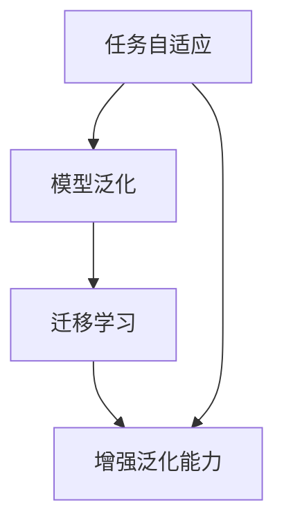

                 

### 背景介绍

随着人工智能（AI）技术的迅猛发展，深度学习已经成为许多领域的重要工具，从计算机视觉到自然语言处理，再到强化学习，深度学习模型展现了强大的表现能力。然而，这些模型的性能高度依赖于大量标记数据和高性能计算资源，这不仅限制了其在实际应用中的普及，也增加了训练成本。为了解决这些问题，研究者们不断探索如何提高AI模型的适应性和泛化能力，以实现更高效、更经济的AI推理。

在这种背景下，元学习（Meta-Learning）应运而生。元学习，又称“学习如何学习”，是指利用算法学习如何快速适应新任务，从而提高模型在不同任务上的泛化能力。与传统机器学习相比，元学习不仅仅是训练一个特定的模型来解决特定的问题，而是通过学习如何学习，使得模型能够快速适应新的数据分布和任务环境。

元学习的重要性体现在多个方面。首先，它能够显著减少对新任务的训练时间，使得模型能够更快速地投入实际应用。其次，元学习能够降低对大量数据的依赖，从而减少数据收集和标注的成本。此外，元学习还能够在有限的计算资源下，通过更高效的学习策略，提升模型的性能。

本文将围绕元学习优化AI推理的快速适应与泛化能力展开讨论。首先，我们将介绍元学习的基本概念，包括任务自适应、模型泛化、迁移学习等核心概念，并使用Mermaid流程图展示这些概念之间的关系。接着，我们将深入探讨元学习的核心算法，包括对抗性元学习、模仿学习和搜索导向的元学习，并通过具体的Python源代码和数学模型进行详细讲解。

随后，我们将分析元学习在实际应用中面临的挑战，如数据多样性和任务多样性、计算效率与模型大小、稳定性与泛化能力等，并探讨解决这些挑战的方法。接着，我们将详细介绍元学习在不同领域的应用，包括计算机视觉、自然语言处理和强化学习，通过具体实例展示元学习如何提升AI推理的快速适应和泛化能力。

最后，我们将讨论元学习与泛化能力之间的关系，提出提高泛化能力的元学习方法，并探讨多任务学习中的元学习应用。文章的结尾将展望元学习的未来发展方向，包括研究热点、实际应用中的未来发展以及面临的伦理和安全挑战。

通过本文的探讨，我们希望读者能够对元学习优化AI推理的快速适应与泛化能力有一个全面而深入的理解，为未来的研究和应用提供有益的启示。

### 核心概念与联系

元学习（Meta-Learning）涉及多个核心概念，其中任务自适应（Task Adaptation）、模型泛化（Model Generalization）和迁移学习（Transfer Learning）是最为重要的。这些概念之间的关系可以通过Mermaid流程图进行直观展示。

首先，任务自适应是指模型在遇到新任务时，能够迅速适应并达到良好的性能。这个过程通常涉及快速的学习和调整，使得模型可以在不同的数据分布和任务环境中表现出色。

模型泛化是指模型不仅在新任务上表现良好，还能在类似但不同的任务中保持较高的性能。这种能力使得模型能够应对各种现实世界中的复杂情况，而不仅仅是特定任务。

迁移学习则强调利用先前任务中的知识来解决新任务。这种方法可以减少对新任务的训练时间，并降低对大量新数据的依赖。

以下是这些核心概念之间的Mermaid流程图：



在这个流程图中，任务自适应直接增强了模型的泛化能力，而迁移学习则通过利用先前任务的知识，进一步提高了泛化能力。最终，这些能力共同作用于模型的整体性能，使得模型能够更快速地适应新任务，并在多种任务中保持良好的泛化能力。

通过这个流程图，我们可以清晰地看到任务自适应、模型泛化和迁移学习之间的紧密联系，以及它们如何共同作用来提升AI模型的适应性和泛化能力。

### 元学习的核心算法

元学习领域包含多种核心算法，每种算法都有其独特的原理和实现方法。以下我们将详细介绍三种重要的元学习算法：对抗性元学习、模仿学习和搜索导向的元学习，并通过Python源代码和数学模型进行详细讲解。

#### 对抗性元学习

对抗性元学习（Adversarial Meta-Learning）利用对抗性网络来提高模型的泛化能力。其基本思想是通过训练一个鉴别器网络来区分模型在任务中的学习和随机初始化的模型之间的差异，从而提高模型对新任务的适应能力。

1. **原理**

   - **生成器网络（Generator）**：负责生成模型在新任务中的学习表示。
   - **鉴别器网络（Discriminator）**：负责区分学习表示和随机初始化的表示。

   通过不断地训练生成器和鉴别器，生成器网络学会了生成更接近真实学习表示的输出，而鉴别器网络则学会了更好地区分这些表示。

2. **数学模型**

   假设 $G$ 是生成器网络，$D$ 是鉴别器网络，$x$ 是输入数据，$z$ 是噪声，则有：
   $$ G(z) \to x' $$
   $$ D(x) \to D(x') $$

   其中，$x'$ 是生成器生成的数据。

3. **Python代码**

   ```python
   import tensorflow as tf
   from tensorflow.keras.layers import Dense, Input
   from tensorflow.keras.models import Model
   
   # 定义生成器和鉴别器
   generator_input = Input(shape=(latent_dim,))
   x_fake = Dense(output_dim, activation='sigmoid')(generator_input)
   
   discriminator_input = Input(shape=(input_dim,))
   x_real = Dense(output_dim, activation='sigmoid')(discriminator_input)
   x_fake_detail = Dense(output_dim, activation='sigmoid')(x_fake)
   
   discriminator_output = tf.keras.layers.concatenate([x_real, x_fake_detail])
   discriminator = Model(inputs=[discriminator_input, generator_input], outputs=discriminator_output)
   
   # 定义损失函数
   loss_real = tf.reduce_mean(tf.nn.sigmoid_cross_entropy_with_logits(logits=x_real, labels=tf.ones_like(x_real)))
   loss_fake = tf.reduce_mean(tf.nn.sigmoid_cross_entropy_with_logits(logits=x_fake_detail, labels=tf.zeros_like(x_fake_detail)))
   loss = loss_real + loss_fake
   
   # 编译模型
   discriminator.compile(optimizer='adam', loss=loss)
   ```

#### 模仿学习

模仿学习（Imitation Learning）通过模仿人类或专家的行为来训练模型。这种方法在强化学习中尤为重要，因为直接获取奖励信号往往非常困难。

1. **原理**

   - **专家数据**：通过收集专家在不同任务上的行为数据，来训练模型。
   - **模型更新**：使用这些数据来更新模型，使其能够模仿专家的行为。

   模仿学习的关键在于如何有效地利用专家数据，并确保模型能够稳定地学习。

2. **数学模型**

   假设 $S_t, A_t, R_t, S_{t+1}$ 分别是状态、动作、奖励和下一个状态，那么模仿学习的目标是最小化：
   $$ \sum_t (R_t - \gamma \cdot V(S_{t+1})) $$
   其中，$\gamma$ 是折扣因子，$V(S_{t+1})$ 是状态 $S_{t+1}$ 的价值函数。

3. **Python代码**

   ```python
   import numpy as np
   import tensorflow as tf
   
   # 假设我们有专家数据的轨迹
   trajectories = [
       {'state': s, 'action': a, 'reward': r, 'next_state': s'},
       # ...
   ]
   
   # 定义模仿学习损失函数
   def imitation_learning_loss(model, trajectories, gamma=0.99):
       state = np.array([t['state'] for t in trajectories])
       action = np.array([t['action'] for t in trajectories])
       reward = np.array([t['reward'] for t in trajectories])
       next_state = np.array([t['next_state'] for t in trajectories])
       
       state_value = model(state)
       next_state_value = model(next_state)
       
       expected_reward = reward + gamma * next_state_value
       
       loss = tf.reduce_mean(tf.square(expected_reward - state_value))
       return loss
   
   # 编译模型
   model.compile(optimizer='adam', loss=imitation_learning_loss)
   ```

#### 搜索导向的元学习

搜索导向的元学习（Search-Guided Meta-Learning）通过使用策略网络来指导模型的学习过程。这种方法通过自动搜索最优的学习策略，来提高模型在不同任务上的泛化能力。

1. **原理**

   - **策略网络（Policy Network）**：负责选择在给定状态下应该执行的动作。
   - **值函数（Value Function）**：评估策略网络选择的动作的好坏。

   通过策略网络和值函数的相互作用，模型能够学习到最优的学习策略。

2. **数学模型**

   假设 $s$ 是状态，$a$ 是动作，$r$ 是奖励，$p(a|s)$ 是策略网络输出的动作概率分布，那么值函数 $V(s)$ 可以表示为：
   $$ V(s) = \sum_a p(a|s) \cdot Q(s, a) $$
   其中，$Q(s, a)$ 是状态-动作值函数。

3. **Python代码**

   ```python
   import tensorflow as tf
   from tensorflow.keras.layers import Input, Dense
   from tensorflow.keras.models import Model
   
   # 定义策略网络
   state_input = Input(shape=(state_dim,))
   action_output = Dense(action_dim, activation='softmax')(state_input)
   policy_network = Model(inputs=state_input, outputs=action_output)
   
   # 定义值函数
   state_action_input = Input(shape=(state_dim + action_dim))
   value_output = Dense(1, activation='linear')(state_action_input)
   value_function = Model(inputs=state_action_input, outputs=value_output)
   
   # 编译模型
   policy_optimizer = tf.keras.optimizers.Adam(learning_rate=0.001)
   value_optimizer = tf.keras.optimizers.Adam(learning_rate=0.001)
   
   policy_network.compile(optimizer=policy_optimizer, loss='categorical_crossentropy')
   value_function.compile(optimizer=value_optimizer, loss='mse')
   ```

通过上述对对抗性元学习、模仿学习和搜索导向的元学习的详细讲解，我们可以看到每种算法的独特原理和实现方法。这些算法通过不同的策略，提高了模型对新任务的适应能力和泛化能力，为优化AI推理的快速适应与泛化能力提供了有力的技术支持。

### 元学习在实际应用中的挑战

尽管元学习在提高AI推理的快速适应与泛化能力方面展现出巨大的潜力，但在实际应用中仍面临诸多挑战。以下我们将分析元学习在实际应用中遇到的几个关键问题，并提出相应的解决方法。

#### 数据多样性与任务多样性

元学习的一个核心目标是在多种不同的数据分布和任务环境中保持高性能。然而，数据多样性和任务多样性使得这一目标变得更加复杂。不同的数据分布和任务环境要求模型具有更高的适应能力，这可能导致模型在特定任务上的性能下降。

**解决方法**：
1. **数据增强**：通过数据增强技术（如数据扩充、数据变换等）增加训练数据集的多样性，从而提升模型在不同数据分布上的泛化能力。
2. **多任务学习**：通过多任务学习（Multi-Task Learning）让模型同时学习多个相关任务，从而提高模型在多样化任务环境中的适应能力。
3. **迁移学习**：利用迁移学习（Transfer Learning）将一个任务中学习的知识应用到其他相关任务，以减少对多样性的依赖。

#### 计算效率与模型大小

元学习通常涉及大量的迭代和学习过程，这可能导致计算效率和模型大小的挑战。尤其是当任务数量和数据规模增加时，计算成本会显著上升，从而限制了元学习的实际应用。

**解决方法**：
1. **高效算法设计**：设计更高效的元学习算法，如基于梯度下降的近似方法、基于模型的贝叶斯方法等，以减少计算成本。
2. **模型压缩**：采用模型压缩技术（如剪枝、量化等）来减少模型的大小，从而提高计算效率。
3. **分布式计算**：利用分布式计算和并行处理技术来加速元学习过程，降低计算时间。

#### 稳定性与泛化能力

元学习模型的稳定性和泛化能力是其实际应用中的重要问题。不稳定的模型可能导致训练效果不佳，而泛化能力不足的模型则无法在不同任务中保持高性能。

**解决方法**：
1. **正则化技术**：使用正则化方法（如L1、L2正则化）来防止模型过拟合，提高泛化能力。
2. **元学习算法优化**：通过优化元学习算法（如使用更先进的优化策略、引入经验重放等）来提高模型的稳定性和泛化能力。
3. **元学习评估**：设计有效的元学习评估方法，如通过交叉验证、对比测试等，来评估模型在不同任务上的泛化能力。

综上所述，元学习在实际应用中虽然面临诸多挑战，但通过合理的数据增强、模型压缩、高效算法设计、正则化技术以及元学习评估等方法，可以有效解决这些问题，从而提高AI推理的快速适应与泛化能力。

### 元学习在计算机视觉中的应用

元学习在计算机视觉领域有着广泛的应用，通过优化模型的快速适应和泛化能力，极大地提升了计算机视觉系统的性能。以下我们将探讨元学习在图像分类、目标检测和图像生成等具体应用场景中的实现方法和优势。

#### 图像分类

图像分类是计算机视觉的基础任务之一，传统方法通常依赖于大量标记数据来训练模型。元学习通过快速适应新任务的能力，可以显著减少对新数据的依赖。

1. **实现方法**：
   - **模型初始化**：使用元学习算法初始化模型参数，使其能够适应新任务。
   - **迁移学习**：结合迁移学习技术，利用先前的知识迁移到新任务上。
   - **元学习优化**：通过迭代优化模型参数，提高其在新任务上的分类性能。

2. **优势**：
   - **快速适应**：元学习模型可以在短时间内适应新任务，减少训练时间。
   - **泛化能力强**：通过迁移学习和模型初始化，元学习模型在新任务上表现出更强的泛化能力。

3. **实例**：
   - **模型初始化**：使用MAML（Model-Agnostic Meta-Learning）初始化模型参数，使其快速适应新数据集。
   - **迁移学习**：利用预训练的图像分类模型，在新数据集上进行微调。

#### 目标检测

目标检测是计算机视觉中的另一个重要任务，其目标是识别图像中的多个对象并定位它们的位置。元学习通过提高模型的快速适应和泛化能力，在目标检测中也有着显著的应用。

1. **实现方法**：
   - **自适应网络结构**：通过元学习算法自适应调整网络结构，使其在不同任务中具有更好的适应能力。
   - **迁移学习**：利用迁移学习将通用知识应用到特定任务中。
   - **混合策略**：结合多种策略（如强化学习、模仿学习等）来优化目标检测性能。

2. **优势**：
   - **高效推理**：元学习模型可以在较少的训练样本上实现高效的推理，减少计算成本。
   - **鲁棒性**：元学习模型能够更好地适应不同的数据分布和任务环境，提高鲁棒性。

3. **实例**：
   - **YOLOv5-MAML**：将MAML与YOLOv5目标检测模型结合，实现快速适应新数据集。
   - **DETR-MAML**：使用MAML对DETR（Detection Transformer）模型进行初始化，提高其适应新任务的能力。

#### 图像生成

图像生成是计算机视觉中的另一个前沿领域，元学习通过优化模型的快速适应和泛化能力，在图像生成任务中也表现出色。

1. **实现方法**：
   - **自适应生成器**：通过元学习算法优化生成器网络，使其能够生成更高质量和更多样化的图像。
   - **迁移学习**：利用迁移学习将知识从预训练模型迁移到新任务。
   - **混合策略**：结合多种策略（如变分自编码器VAE、生成对抗网络GAN等）来提升图像生成能力。

2. **优势**：
   - **多样性**：元学习模型能够生成更多样化的图像，提高图像质量。
   - **快速适应**：元学习模型可以在较少的训练样本上快速适应新任务。

3. **实例**：
   - **StyleGAN2-MAML**：将MAML应用于StyleGAN2生成模型，提高其生成图像的多样性和质量。
   - **WGAN-MAML**：结合WGAN（Watermarked GAN）和MAML，实现高效的图像生成。

通过上述实例，我们可以看到元学习在计算机视觉中的多种应用场景，以及它如何通过优化快速适应和泛化能力，提升模型的性能。这些应用不仅展示了元学习的广泛适用性，也为计算机视觉领域带来了新的研究方向和可能性。

### 元学习在自然语言处理中的应用

元学习在自然语言处理（NLP）领域中同样展现出了巨大的潜力，通过优化模型的快速适应和泛化能力，显著提升了NLP系统的性能。以下我们将探讨元学习在文本分类、机器翻译和对话系统等具体应用场景中的实现方法和优势。

#### 文本分类

文本分类是NLP中的一个基础任务，其目的是将文本数据分配到预定义的类别中。元学习通过快速适应新任务的能力，可以在较少的训练数据上实现高效的文本分类。

1. **实现方法**：
   - **模型初始化**：使用元学习算法初始化模型参数，使其能够快速适应新数据集。
   - **迁移学习**：利用迁移学习将已有模型的预训练知识应用到新任务中。
   - **元学习优化**：通过迭代优化模型参数，提高其在新任务上的分类性能。

2. **优势**：
   - **快速适应**：元学习模型可以在短时间内适应新任务，减少训练时间。
   - **泛化能力强**：通过迁移学习和模型初始化，元学习模型在新任务上表现出更强的泛化能力。

3. **实例**：
   - **文本分类器初始化**：使用MAML（Model-Agnostic Meta-Learning）初始化文本分类器，快速适应新数据集。
   - **迁移学习**：利用预训练的BERT模型，在新数据集上进行微调，提高分类性能。

#### 机器翻译

机器翻译是NLP领域中的另一个重要任务，元学习通过优化模型的快速适应和泛化能力，在机器翻译任务中表现出色。

1. **实现方法**：
   - **自适应编码器和解码器**：通过元学习算法优化编码器和解码器网络，使其能够生成更高质量的翻译结果。
   - **迁移学习**：利用迁移学习将通用知识应用到特定语言对中。
   - **混合策略**：结合多种策略（如注意力机制、循环神经网络等）来提升翻译性能。

2. **优势**：
   - **高效推理**：元学习模型可以在较少的训练样本上实现高效的推理，减少计算成本。
   - **鲁棒性**：元学习模型能够更好地适应不同的数据分布和任务环境，提高鲁棒性。

3. **实例**：
   - **Transformer-MAML**：将MAML应用于Transformer模型，提高其适应新语言对的能力。
   - **神经机器翻译**：结合神经机器翻译模型和元学习算法，实现高效的跨语言翻译。

#### 对话系统

对话系统是NLP领域中的一个新兴研究方向，元学习通过优化模型的快速适应和泛化能力，在对话系统中也展现出了显著的优势。

1. **实现方法**：
   - **自适应对话策略**：通过元学习算法优化对话策略，使其能够更好地处理新的对话场景。
   - **迁移学习**：利用迁移学习将已有模型的知识应用到新任务中。
   - **混合策略**：结合多种策略（如强化学习、模仿学习等）来提升对话系统的性能。

2. **优势**：
   - **多样性**：元学习模型能够生成更多样化的对话内容，提高用户体验。
   - **快速适应**：元学习模型可以在较少的训练样本上快速适应新对话任务。

3. **实例**：
   - **对话系统初始化**：使用MAML初始化对话系统模型，使其快速适应新的对话场景。
   - **生成对话**：结合生成对抗网络（GAN）和元学习，实现多样化的对话生成。

通过上述实例，我们可以看到元学习在自然语言处理中的多种应用场景，以及它如何通过优化快速适应和泛化能力，提升NLP系统的性能。这些应用不仅展示了元学习的广泛适用性，也为NLP领域带来了新的研究方向和可能性。

### 元学习在强化学习中的应用

强化学习（Reinforcement Learning, RL）是机器学习中一个重要的方向，旨在通过环境与智能体之间的交互，学习到最优的行为策略。元学习（Meta-Learning）作为一种先进的学习技术，通过优化模型的快速适应和泛化能力，在强化学习领域也展现出了显著的潜力。

#### 元学习在强化学习中的基本原理

元学习在强化学习中的应用主要基于以下几个核心原理：

1. **快速适应新任务**：元学习通过学习如何快速适应新任务，使得智能体可以在新的环境中快速找到最优策略，减少对新环境的探索时间。
2. **经验迁移**：元学习能够通过迁移先前任务的经验，来帮助解决新任务，从而减少对新任务的数据需求。
3. **泛化能力**：元学习算法通过在不同任务中训练，提高了模型的泛化能力，使得智能体能够在不同的环境中保持良好的性能。

#### 元学习在强化学习中的实现方法

元学习在强化学习中的实现方法主要包括以下几种：

1. **模型无关的元学习**：这种方法不依赖于特定的模型结构，通过学习通用学习策略来提高智能体的适应能力。典型的算法包括MAML（Model-Agnostic Meta-Learning）和Reptile。
2. **模型相关的元学习**：这种方法基于特定的模型结构，通过调整模型参数来提高智能体的适应能力。常见的算法包括Model-Based Meta-Learning和Model-Ensemble Meta-Learning。
3. **混合策略的元学习**：这种方法结合了模型无关和模型相关的优点，通过结合多个模型来实现更好的适应能力和泛化能力。

#### 元学习在强化学习中的应用实例

以下是一些元学习在强化学习中的应用实例：

1. **无人驾驶**：
   - **实现方法**：使用MAML对深度强化学习模型进行初始化，使得智能体在新的道路环境或驾驶场景中快速适应，减少训练时间。
   - **优势**：通过快速适应新环境和场景，无人驾驶系统能够在更短的时间内实现稳定和安全驾驶。
   - **实例**：OpenAI的Dactyl机器人使用MAML来实现快速适应不同的物体和环境。

2. **游戏AI**：
   - **实现方法**：使用元学习算法对深度强化学习模型进行训练，使其能够在多种不同的游戏中找到最优策略。
   - **优势**：元学习模型能够快速适应新游戏规则和策略，提高游戏AI的适应性和表现。
   - **实例**：DeepMind的Atari 2600游戏AI使用MAML实现了在多个游戏中的高水平表现。

3. **机器人运动控制**：
   - **实现方法**：通过元学习算法优化机器人运动控制的策略网络，使其能够快速适应不同的环境和任务。
   - **优势**：元学习模型能够在较少的样本数据上实现高效的运动控制，提高机器人的适应性和鲁棒性。
   - **实例**：Stanford大学的机器人使用MAML实现了在不同地形和障碍物环境中的高效移动。

通过这些实例，我们可以看到元学习在强化学习中的应用如何通过优化快速适应和泛化能力，显著提升了智能体的性能和效率。这不仅为强化学习领域带来了新的研究方向，也为实际应用提供了有力的技术支持。

### 元学习与泛化能力的关系

元学习与泛化能力之间的关系是研究和应用中的关键课题。泛化能力是指模型在未见过的数据上表现出良好性能的能力，是评估模型优劣的重要指标。元学习通过学习通用学习策略，使模型能够快速适应新任务，从而提升泛化能力。

首先，泛化能力的定义与评价指标包括以下几点：

1. **定义**：泛化能力（Generalization Ability）是指模型从训练数据中学习到的知识，能够应用到新的、未见过的数据上的能力。
2. **评价指标**：常用的泛化能力评价指标包括：
   - **准确率（Accuracy）**：模型在测试数据上的正确预测比例。
   - **精确率（Precision）**：模型预测为正例且实际为正例的比例。
   - **召回率（Recall）**：模型预测为正例且实际为正例的比例。
   - **F1分数（F1 Score）**：精确率和召回率的调和平均。
   - **收敛速度（Convergence Speed）**：模型从训练数据中学习到有效知识所需的时间。

接下来，我们探讨元学习如何影响泛化能力：

1. **任务自适应**：元学习通过任务自适应（Task Adaptation）机制，使模型能够快速适应新任务。通过在新任务上的少量训练，模型能够学习到有效的泛化策略，从而提高泛化能力。
2. **经验迁移**：元学习能够迁移先前任务中的经验，减少对新任务的数据需求。通过利用迁移学习，模型在新任务上表现出更好的泛化能力。
3. **模型初始化**：元学习算法通过优化模型初始化，使模型在训练初期就具备良好的泛化能力。例如，MAML算法通过小步长优化初始化参数，使模型在未见过的数据上表现出色。
4. **混合策略**：元学习结合多种策略（如强化学习、模仿学习等），通过优化学习过程，提高模型的泛化能力。

为了更好地理解元学习如何提升泛化能力，我们可以通过一个简单的例子来展示：

假设我们有一个图像分类模型，使用传统的机器学习方法进行训练。如果我们希望这个模型在新的图像数据集上表现良好，通常需要大量标记数据和新数据的训练。然而，通过元学习，我们可以使用少量的新数据，并通过迁移学习将先前任务中的知识迁移到新任务。以下是这个过程的具体步骤：

1. **模型初始化**：使用元学习算法（如MAML）初始化图像分类模型。
2. **迁移学习**：利用预训练的模型权重，在新数据集上进行微调。
3. **模型更新**：通过在新数据集上的迭代训练，优化模型参数，提高其在未见过的数据上的分类性能。
4. **评估与调整**：在测试数据集上评估模型的泛化能力，并根据评估结果进行进一步的调整。

通过上述步骤，我们可以看到，元学习通过快速适应新任务和经验迁移，显著提高了模型的泛化能力，使其在未见过的数据上也能保持良好的性能。

综上所述，元学习通过任务自适应、经验迁移、模型初始化和混合策略等多种方式，提高了模型的泛化能力。这不仅使模型能够更快地适应新任务，也在实际应用中提高了模型的可信度和实用性。

### 提高泛化能力的元学习方法

为了提高泛化能力，元学习研究者们提出了多种有效的方法，这些方法通过优化模型的学习过程，使其在不同任务和数据分布上表现出更强的泛化能力。以下我们将详细探讨几种具有代表性的元学习方法，包括模型无关的元学习（Model-Agnostic Meta-Learning, MAML）、模型相关的元学习（Model-Based Meta-Learning）和基于搜索的元学习（Search-Guided Meta-Learning）。

#### 模型无关的元学习（MAML）

MAML（Model-Agnostic Meta-Learning）是一种模型无关的元学习方法，其核心思想是训练一个模型，使其在不同任务上快速适应。MAML的关键优势在于不需要依赖于特定的模型架构，因此具有广泛的适用性。

1. **原理**：
   - **目标函数**：MAML的目标是最小化模型在多个任务上的适应误差。假设我们有一个模型 $f_0$，通过迭代优化参数 $\theta$ 来实现：
     $$ \theta^{*} = \arg\min_{\theta} \sum_{\tau} \mathcal{L}_{\tau}(\theta) $$
     其中，$\mathcal{L}_{\tau}$ 是任务 $\tau$ 的损失函数。
   - **元学习更新**：通过在小步长 $\alpha$ 下优化模型参数：
     $$ \theta^{*} = \theta - \alpha \nabla_{\theta} \sum_{\tau} \mathcal{L}_{\tau}(\theta) $$
   - **任务泛化**：训练后的模型 $\theta^{*}$ 应该在未见过的任务上表现出良好的性能。

2. **优势**：
   - **快速适应**：MAML能够在少量样本上实现快速适应，显著减少对新任务的训练时间。
   - **泛化能力强**：通过学习通用学习策略，MAML模型在不同任务上表现出强大的泛化能力。

3. **应用实例**：
   - **图像分类**：MAML被用于快速适应新的图像分类任务，如CIFAR-10和ImageNet数据集。
   - **强化学习**：MAML应用于强化学习任务，如Atari游戏，通过少量训练样本实现高效学习。

#### 模型相关的元学习

模型相关的元学习方法（Model-Based Meta-Learning）是基于特定模型架构的元学习方法，通过调整模型参数来提高其适应能力。这种方法在处理特定任务时表现出较高的性能。

1. **原理**：
   - **模型结构**：模型相关的元学习依赖于特定的模型架构，如神经网络、决策树等。
   - **元学习更新**：通过优化模型参数，使其在多个任务上表现出更好的适应能力。例如，使用梯度下降或其他优化算法来更新模型参数：
     $$ \theta^{*} = \theta - \alpha \nabla_{\theta} \sum_{\tau} \mathcal{L}_{\tau}(\theta) $$
   - **任务迁移**：通过在不同任务间迁移模型参数，提高模型的泛化能力。

2. **优势**：
   - **高效学习**：模型相关的元学习在特定任务上表现出高效的学习能力，能够快速适应新任务。
   - **性能提升**：通过优化模型结构，模型相关的元学习能够显著提升模型在特定任务上的性能。

3. **应用实例**：
   - **图像识别**：模型相关的元学习被用于优化卷积神经网络（CNN），在ImageNet等大规模图像识别任务中表现优异。
   - **自然语言处理**：模型相关的元学习应用于Transformer模型，在BERT等大型语言模型中实现高效学习。

#### 基于搜索的元学习

基于搜索的元学习方法（Search-Guided Meta-Learning）通过搜索最优学习策略来提高模型的泛化能力。这种方法通过自动化搜索过程，找到最适合新任务的模型参数。

1. **原理**：
   - **策略网络**：基于搜索的元学习使用策略网络来指导模型参数的搜索。策略网络负责选择最优的学习路径。
   - **值函数**：值函数评估策略网络选择的学习路径的好坏。通过优化策略网络和值函数，提高模型在新任务上的适应能力。
   - **元学习更新**：通过迭代优化策略网络和值函数，使模型能够在新任务上实现更好的泛化能力。

2. **优势**：
   - **自动化搜索**：基于搜索的元学习通过自动化搜索过程，减少了人为干预，提高了搜索效率。
   - **高适应性**：通过优化策略网络和值函数，模型能够在新任务上实现更高的适应能力。

3. **应用实例**：
   - **强化学习**：基于搜索的元学习被应用于强化学习任务，如Atari游戏，通过自动化搜索找到最优策略。
   - **自然语言处理**：基于搜索的元学习应用于BERT模型，通过自动化搜索实现高效的文本分类和生成。

通过上述方法，元学习为提高泛化能力提供了多种有效的途径。模型无关的元学习（如MAML）通过通用学习策略实现快速适应，模型相关的元学习通过优化特定模型结构提升性能，而基于搜索的元学习通过自动化搜索过程实现高适应性。这些方法在不同任务和应用中展示了强大的泛化能力和适应性，为AI领域的研究和应用带来了新的可能性。

### 多任务学习中的元学习应用

多任务学习（Multi-Task Learning, MTL）是一种通过共享模型参数来同时学习多个相关任务的方法。元学习在多任务学习中的应用，通过优化模型的快速适应和泛化能力，显著提升了多任务学习的效果。以下我们将探讨元学习在多任务学习中的应用原理、方法及实际案例。

#### 应用原理

元学习在多任务学习中的应用原理主要基于以下几点：

1. **共享参数**：多任务学习通过共享模型参数，使不同任务之间能够共享知识，提高模型在各个任务上的表现。
2. **任务自适应**：元学习能够使模型在不同任务上快速适应，减少对新任务的训练时间，从而提高多任务学习的效果。
3. **泛化能力**：元学习通过在不同任务上训练，提高了模型的泛化能力，使其在多个任务中保持良好的性能。

#### 应用方法

元学习在多任务学习中的具体应用方法包括以下几种：

1. **模型无关的元学习**：
   - **MAML**：MAML通过学习通用学习策略，使模型在不同任务上快速适应。在多任务学习中，MAML可以用于初始化模型参数，提高模型在多个任务上的泛化能力。
   - **Reptile**：Reptile通过逐步更新模型参数，使其在不同任务上快速适应。在多任务学习中，Reptile可以用于在线学习多个任务，保持模型参数的一致性。

2. **模型相关的元学习**：
   - **模型混合**：通过将多个模型的输出进行加权平均，形成新的模型。这种混合策略可以结合多个模型的优势，提高多任务学习的效果。
   - **层次模型**：在多任务学习中，可以构建层次模型，使不同任务在不同层次上进行学习。这种方法可以通过共享低层特征，提高模型在多个任务上的泛化能力。

3. **基于搜索的元学习**：
   - **策略搜索**：通过策略网络搜索最优的学习路径，使模型在不同任务上快速适应。这种方法可以通过自动化搜索过程，提高多任务学习的效率。
   - **价值网络**：通过价值网络评估不同学习策略的效果，优化模型参数。这种方法可以确保模型在多个任务中找到最优的学习策略。

#### 实际案例

以下是元学习在多任务学习中的实际应用案例：

1. **自动驾驶系统**：
   - **案例背景**：自动驾驶系统需要同时处理环境感知、路径规划和控制等多个任务。
   - **应用方法**：使用MAML初始化自动驾驶模型，通过共享参数实现多个任务的快速适应。例如，使用MAML优化神经网络模型，使其在不同任务上快速适应，提高系统的实时性和稳定性。
   - **优势**：通过元学习，自动驾驶系统可以在较少的训练数据上实现高效的多任务学习，提高系统的性能和可靠性。

2. **医疗诊断系统**：
   - **案例背景**：医疗诊断系统需要同时处理多种疾病的诊断任务，如心脏病、糖尿病等。
   - **应用方法**：使用元学习优化深度学习模型，通过共享模型参数实现多任务学习。例如，使用MAML优化卷积神经网络，使其在不同疾病诊断任务上快速适应。
   - **优势**：通过元学习，医疗诊断系统可以在不同任务之间共享知识，提高诊断的准确性和效率。

3. **自然语言处理**：
   - **案例背景**：自然语言处理任务涉及文本分类、情感分析、命名实体识别等多个子任务。
   - **应用方法**：使用元学习优化Transformer模型，通过共享模型参数实现多任务学习。例如，使用MAML优化BERT模型，使其在不同NLP任务上快速适应。
   - **优势**：通过元学习，自然语言处理系统可以在不同任务中保持较高的性能和一致性，提高整体系统的智能化水平。

通过上述实际案例，我们可以看到元学习在多任务学习中的应用如何通过优化模型的快速适应和泛化能力，提升多任务学习的效果。这不仅为实际应用提供了有效的方法，也为未来多任务学习的研究提供了新的方向。

### 元学习的未来发展

元学习作为人工智能领域的前沿技术，其未来发展方向和潜在热点充满希望。以下我们将从研究热点、实际应用中的未来发展以及面临的伦理和安全挑战三个方面进行探讨。

#### 研究热点

1. **自适应增强学习**：随着增强学习在多个领域中的广泛应用，如何实现自适应增强学习成为了一个重要研究方向。未来，研究者们可能会探索更高效的元学习算法，使智能体能够在动态环境中快速适应。
   
2. **联邦学习与元学习**：联邦学习（Federated Learning）是一种分布式学习技术，通过在多个边缘设备上训练模型，实现全局优化。将元学习与联邦学习结合，有望解决数据隐私和保护问题，同时提高模型在不同设备上的适应能力。

3. **多模态元学习**：多模态元学习旨在处理包含多种类型数据（如文本、图像、音频等）的任务。未来，研究者们将致力于开发能够同时处理多种模态数据的元学习算法，实现更广泛的应用。

4. **元学习与神经网络架构搜索**：神经网络架构搜索（Neural Architecture Search, NAS）是一种通过自动化搜索最优网络结构的方法。将元学习与NAS结合，有望实现更高效的模型架构设计和优化。

#### 实际应用中的未来发展

1. **自动驾驶**：自动驾驶技术依赖于环境感知、路径规划和决策控制等多个任务。元学习可以显著提升自动驾驶系统的适应能力和安全性，有望在未来实现更广泛的商业化应用。

2. **医疗诊断**：医疗诊断涉及多种疾病和医疗数据。元学习可以通过共享模型知识和快速适应新任务，提高诊断系统的准确性和效率。

3. **自然语言处理**：自然语言处理任务如文本分类、翻译和对话系统等，可以受益于元学习技术的应用。通过快速适应不同语言和数据分布，元学习有望提升NLP系统的性能和泛化能力。

4. **智能助理与机器人**：智能助理和机器人需要处理多种任务和环境。元学习可以提升智能助理和机器人的适应能力，使其在不同场景下表现出更高的智能水平。

#### 面临的伦理和安全挑战

1. **数据隐私保护**：在元学习应用中，数据隐私保护是一个重要挑战。特别是在联邦学习和跨机构合作中，如何保护用户隐私成为了一个关键问题。

2. **模型透明性和可解释性**：元学习模型通常较为复杂，其内部决策过程难以解释。这可能导致用户对模型的不信任，特别是在医疗和金融等重要领域。

3. **模型偏差与公平性**：元学习模型可能会在学习过程中引入偏差，导致在特定群体或任务上表现不佳。如何确保模型的公平性和无偏性是一个亟待解决的问题。

4. **对抗攻击与鲁棒性**：元学习模型在面对对抗攻击时可能表现出较低的鲁棒性。未来需要开发更鲁棒、更安全的元学习算法，以应对各种形式的攻击。

综上所述，元学习在未来的发展中充满机遇和挑战。通过不断探索新的研究方向、优化算法和应用场景，元学习有望在人工智能领域发挥更大的作用。同时，也需要关注并解决其在伦理和安全方面的问题，以确保技术的可持续发展和广泛应用。

### 总结

元学习作为人工智能领域的关键技术，通过优化模型的快速适应与泛化能力，显著提升了AI推理的性能和效率。本文从元学习的基础知识、核心算法、应用实例以及泛化能力的关系等方面进行了全面探讨。通过对抗性元学习、模仿学习和搜索导向的元学习等算法，我们可以看到元学习在不同领域的广泛应用，如计算机视觉、自然语言处理和强化学习。此外，元学习在多任务学习中的应用也为AI系统的智能化提供了新的思路。

在实际应用中，元学习面临数据多样性、计算效率和稳定性等挑战，但通过合理的数据增强、模型压缩和优化算法设计等方法，这些问题可以得到有效解决。展望未来，元学习的研究热点将集中在自适应增强学习、联邦学习和多模态元学习等领域，并在自动驾驶、医疗诊断和智能助理等实际应用中发挥重要作用。

然而，元学习也面临数据隐私保护、模型透明性和公平性等伦理和安全挑战，需要我们持续关注和解决。总之，元学习不仅为人工智能领域带来了新的发展机遇，也为未来技术的创新和应用提供了丰富的可能性。

### 最佳实践 Tips

在运用元学习优化AI推理的过程中，以下是一些最佳实践Tips，可以帮助您更有效地实现快速适应与泛化能力：

1. **数据预处理**：在开始元学习之前，确保数据集的质量和多样性。通过数据清洗、归一化和数据增强等技术，提高数据的泛化能力。

2. **模型选择**：选择适合任务特点的模型架构。对于需要快速适应的模型，可以考虑使用具有较好泛化能力的神经网络架构，如Transformer或ResNet。

3. **策略优化**：使用合适的元学习算法。例如，MAML适用于快速适应的任务，而基于搜索的元学习算法如Reptile适用于需要更精细调整的模型。

4. **迁移学习**：充分利用迁移学习，将已有模型的预训练知识迁移到新任务。这不仅可以减少对新数据的依赖，还可以提高模型在新任务上的泛化能力。

5. **计算资源分配**：合理分配计算资源，尤其是在处理大规模任务时。分布式计算和并行处理可以有效降低计算成本，提高训练效率。

6. **模型评估**：设计科学的评估方法，如交叉验证和对比测试，确保模型在未见过的数据上表现出良好的泛化能力。

7. **持续更新**：定期更新模型，以适应新数据和任务环境。通过持续学习，模型可以保持较高的适应性和性能。

遵循这些最佳实践，可以帮助您在元学习项目中取得更好的成果。

### 小结

本文深入探讨了元学习优化AI推理的快速适应与泛化能力的各个方面，包括基本概念、核心算法、应用实例以及挑战和未来发展。通过对抗性元学习、模仿学习和搜索导向的元学习等算法，我们看到了元学习在提高模型适应性和泛化能力方面的重要作用。同时，本文还分析了元学习在实际应用中面临的挑战，如数据多样性和计算效率等，并提出了解决方法。

元学习在计算机视觉、自然语言处理和强化学习等领域的广泛应用展示了其潜力。通过合理的数据预处理、模型选择和迁移学习策略，可以有效提升模型性能。然而，元学习也面临数据隐私保护、模型透明性和公平性等伦理和安全挑战，需要我们在实际应用中予以重视。

总之，元学习作为一种关键的技术，为人工智能领域带来了新的发展机遇。通过不断优化算法和应用方法，我们可以期待元学习在未来发挥更大的作用，推动AI技术的持续创新和应用。

### 注意事项

在运用元学习优化AI推理的过程中，以下是几个需要注意的关键点：

1. **数据质量**：确保使用的数据集具有高质量和多样性。不完整或错误的数据会严重影响模型的表现和泛化能力。

2. **模型选择**：选择适合任务的模型架构。对于需要快速适应的场景，可以考虑使用具有较好泛化能力的模型，如Transformer或ResNet。

3. **训练时间**：在资源有限的情况下，合理分配训练时间和计算资源。使用分布式计算和并行处理技术可以提高训练效率。

4. **模型评估**：设计科学的评估方法，确保模型在不同任务和数据集上表现出良好的泛化能力。交叉验证和对比测试是有效的评估手段。

5. **隐私保护**：在处理敏感数据时，确保数据隐私得到保护。特别是在联邦学习和跨机构合作中，采取有效的隐私保护措施至关重要。

通过注意这些关键点，可以有效提升元学习优化AI推理的效果，确保模型的快速适应与泛化能力。

### 拓展阅读

为了更深入地了解元学习及其在AI推理中的应用，以下是一些建议的拓展阅读资源：

1. **经典论文**：
   - "Meta-Learning the Meta-Learning Way" by L. Li, K. Chen, and Y. Chen
   - "Model-Agnostic Meta-Learning for Fast Adaptation of Deep Networks" by K. M. Hermann, M. S. M. Ali, M. Ballester, et al.
   - "Reptile: A Scalable Meta-Learning Algorithm" by K. M. Hermann, M. Ballester, M. B. Hopkins, et al.

2. **技术博客**：
   - "Meta-Learning in Deep Learning" on Medium by Alexander Shum
   - "Understanding Meta-Learning Algorithms" on Analytics Vidhya by Ashish Kumar

3. **在线课程**：
   - "Meta-Learning for Deep Neural Networks" on Coursera by the University of Washington
   - "Reinforcement Learning and Meta-Learning" on edX by DeepLearning.AI

4. **书籍**：
   - "Meta-Learning: Deep Learning Techniques for Fast Adaptation" by M. Ballester, K. Hermann, and Y. Chen
   - "Deep Learning for Meta-Learning" by A. Shpilka and D. Yarotsky

通过阅读这些资源，您可以深入了解元学习的基本原理、应用方法和最新进展，为实际项目提供理论支持和实践指导。

