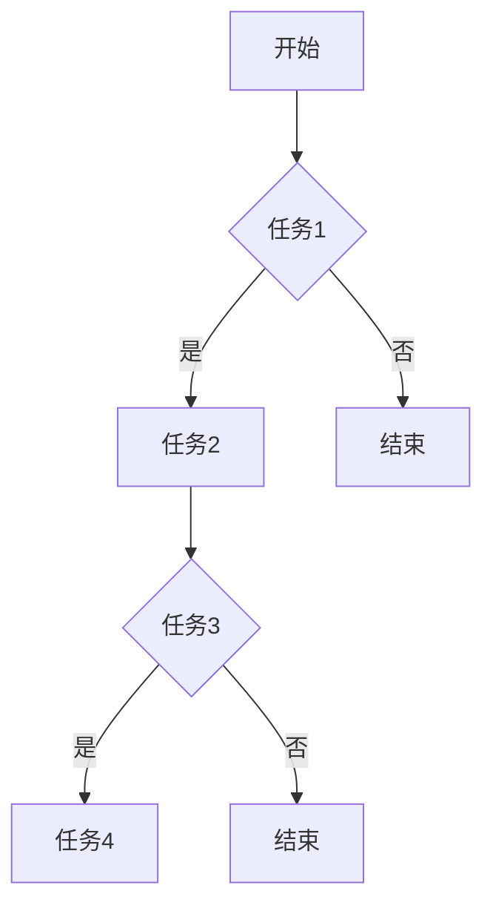

                 

## 引言

在当今快速发展的信息技术时代，人工智能（AI）已经成为引领科技进步的重要驱动力。随着深度学习、神经网络等技术的突破，AI在各行各业中的应用越来越广泛，从而推动了一系列创新和变革。然而，传统机器学习模型的局限性也逐渐显现，尤其是在处理复杂动态环境、连续学习和推理方面存在显著不足。为了应对这些挑战，元学习（Meta-Learning）应运而生，成为研究热点之一。

元学习，顾名思义，是一种学习如何学习的方法。它通过在不同任务间迁移学习经验，使得模型能够快速适应新任务，从而提升学习效率和泛化能力。元学习的研究目标之一是实现终身推理能力（Lifelong Reasoning），即模型在长期学习和推理过程中，能够不断地调整和优化自身的推理机制，以适应不断变化的环境和任务需求。

本文旨在探讨在元学习框架下，如何实现终身推理能力的动态调整机制。我们将首先介绍元学习的概念和应用场景，然后深入分析元学习框架的设计原则和实现方法。接着，我们将探讨终身推理能力的概念及其重要性，并介绍评估终身推理能力的方法。在此基础上，我们将详细探讨动态调整机制的概念、实现方法和性能评估，以及元学习框架下动态调整机制的应用。最后，我们将展望动态调整机制的挑战与机遇，探讨其未来发展方向。

通过对上述问题的深入探讨，本文希望能够为读者提供一个全面、系统的元学习与终身推理能力研究视角，并为相关领域的研究和实践提供有益的参考和启示。

### 1. 元学习概述

#### 1.1 元学习的概念

元学习，又称元学习（Meta-Learning）或学习学习（Learning to Learn），是指通过设计能够自动调整学习策略的算法，使得模型能够从一组任务中提取通用学习算法，从而在遇到新的任务时能够快速适应和高效学习。传统的机器学习方法通常针对特定任务进行训练，而元学习则通过学习如何在不同的任务间进行转移和适应，从而提升模型的泛化能力和学习效率。

元学习的核心思想是通过一系列的子任务，在有限的训练时间内，学习出一种能够快速适应新任务的通用策略。这种通用策略使得模型不仅能够在当前的训练任务中表现优秀，还能在未来的新任务中保持较高的性能。元学习不仅仅局限于单一的任务类型，它可以应用于各种不同的任务，如分类、回归、强化学习等。

在元学习的研究中，有两个基本概念：内部表示和外部表示。内部表示是指模型在特定任务中学习到的特征表示，而外部表示则是模型在不同任务间迁移学习时使用的一般化特征表示。通过优化这两种表示，元学习算法能够有效地从一组任务中提取通用知识，从而提升模型的适应性和学习能力。

#### 1.2 元学习的应用场景

元学习的应用场景非常广泛，尤其在以下几方面具有显著优势：

1. **快速适应新任务**：在传统机器学习中，当面临新的任务时，通常需要从头开始训练模型，这需要大量的数据和计算资源。而元学习通过迁移学习，使得模型能够快速适应新任务，从而减少训练时间和计算成本。

2. **泛化能力提升**：元学习通过在多个任务中提取通用学习策略，使得模型具有更好的泛化能力。这意味着模型不仅能在已知的任务上表现良好，还能在新任务上保持较高的性能。

3. **持续学习**：在现实应用中，模型需要不断地更新和优化，以应对环境的变化和新任务的需求。元学习支持模型的持续学习，通过动态调整学习策略，使得模型能够在长期学习和推理过程中保持高效的性能。

4. **资源受限场景**：在资源受限的场景中，如移动设备、嵌入式系统等，元学习通过减少训练时间和计算需求，使得模型能够在这些有限的资源下正常运行。

元学习在实际应用中已经取得了一系列显著成果，以下是几个典型的应用场景：

- **计算机视觉**：在图像分类、目标检测、人脸识别等领域，元学习被广泛应用于模型的快速适应和泛化能力提升。

- **自然语言处理**：在机器翻译、问答系统、文本生成等任务中，元学习通过迁移学习策略，有效提高了模型的性能和效率。

- **游戏AI**：在游戏AI中，元学习使得AI玩家能够快速适应不同的游戏场景和规则，从而提高游戏的智能程度。

- **强化学习**：在强化学习场景中，元学习通过提取通用策略，使得模型能够在不同的任务和环境之间进行转移，从而提高学习效率和性能。

通过元学习，模型不仅在特定任务上表现出色，还能在不断变化的环境中持续学习和优化，这为人工智能的应用提供了新的思路和可能性。

#### 1.3 元学习与终身推理能力的关系

元学习与终身推理能力（Lifelong Reasoning）之间存在着密切的联系和相互促进的关系。终身推理能力是指模型在长期学习和推理过程中，能够不断调整和优化自身的推理机制，以适应不断变化的环境和任务需求。这种能力在现实应用中尤为重要，因为环境和任务往往不是静态的，而是动态变化的。

元学习通过提供一种通用学习策略，使得模型能够在多个任务间进行转移和适应。这种策略不仅帮助模型在短期任务中快速学习和适应，还为其提供了在长期学习和推理过程中调整和优化的能力。具体来说，元学习与终身推理能力的关系可以从以下几个方面进行探讨：

1. **快速适应新任务**：元学习通过迁移学习策略，使得模型能够快速适应新的任务。这种快速适应能力为模型在长期推理过程中提供了灵活性，使得模型能够不断地适应新的环境和任务需求。

2. **学习策略的优化**：元学习通过在不同任务间提取通用学习策略，不断优化这些策略。这种策略优化能力有助于模型在长期推理过程中，不断调整和优化自身的推理机制，从而提高推理效率和准确性。

3. **持续学习与调整**：终身推理能力强调模型在长期学习和推理过程中，能够持续学习并优化自身。元学习通过提供通用学习策略，支持模型的持续学习和动态调整，使得模型能够在面对复杂、动态的环境时，保持高效的推理能力。

4. **泛化能力的提升**：元学习通过在多个任务中提取通用知识，提升了模型的泛化能力。这种泛化能力使得模型不仅能够在已知的任务上表现良好，还能在新的、未知的任务上保持较高的性能，从而支持终身推理能力的发展。

总之，元学习为终身推理能力提供了关键的支持和保障。通过元学习，模型能够快速适应新任务、优化学习策略、持续学习和调整，从而在长期推理过程中保持高效的性能。反过来，终身推理能力的实现也进一步推动了元学习的发展，两者相互促进，共同推动人工智能技术的进步和应用。

### 2. 元学习框架

#### 2.1 传统元学习算法

元学习作为人工智能领域的一个重要研究方向，经历了数十年的发展，已经涌现出多种算法和框架。传统元学习算法是元学习研究的基础，为现代元学习算法提供了重要的参考和启发。以下我们将详细介绍几种经典的元学习算法，包括模型更新方法、策略优化方法以及模型表示方法。

##### 2.1.1 经典元学习算法

1. **模型更新方法**

模型更新方法是传统元学习算法的核心之一，主要通过在训练过程中不断更新模型参数，以提高模型在多个任务上的表现。以下是一些典型的模型更新方法：

- **梯度下降法（Gradient Descent）**：梯度下降法是最基本的优化算法，通过迭代更新模型参数，使得模型在多个任务上逐渐收敛到最优解。梯度下降法简单易行，但收敛速度较慢，适用于任务较少且数据量不大的场景。

- **动量法（Momentum）**：动量法在梯度下降法的基础上引入了动量项，使得模型参数的更新方向更加稳定，减少了收敛过程中的波动。动量法能够加快收敛速度，提高优化效果。

- **自适应梯度算法（Adaptive Gradient Algorithms）**：自适应梯度算法通过动态调整学习率，使得模型在不同阶段的训练过程中能够自适应地调整学习策略。常见的自适应梯度算法包括RMSprop、Adam等，这些算法在模型优化中表现出色。

2. **策略优化方法**

策略优化方法主要关注如何设计有效的学习策略，以提升模型在多个任务上的表现。以下是一些经典策略优化方法：

- **策略梯度方法（Policy Gradient Methods）**：策略梯度方法通过直接优化学习策略的梯度，以提升模型的性能。常见的策略梯度方法包括REINFORCE、PPO等。策略梯度方法能够快速适应新任务，但存在方差较大、稳定性不足等问题。

- **策略迭代方法（Policy Iteration）**：策略迭代方法通过迭代优化策略和价值函数，逐步提升模型的性能。策略迭代方法适用于复杂任务，但其计算复杂度较高。

- **Q学习（Q-Learning）**：Q学习是一种基于值函数的策略优化方法，通过不断更新Q值，以找到最优策略。Q学习适用于强化学习场景，具有较好的自适应性和鲁棒性。

3. **模型表示方法**

模型表示方法关注如何设计有效的模型结构，以支持多个任务的学习和迁移。以下是一些经典模型表示方法：

- **神经网络模型（Neural Network Models）**：神经网络模型通过多层非线性变换，对输入数据进行编码和表征。深度神经网络（Deep Neural Network，DNN）是现代机器学习的主流模型，广泛应用于图像分类、语音识别等任务。

- **树模型（Tree Models）**：树模型通过构建决策树结构，对输入数据进行分类和回归。常见的树模型包括CART、随机森林（Random Forest）、XGBoost等。树模型具有解释性较强、计算效率高等优点。

- **集成模型（Ensemble Models）**：集成模型通过组合多个简单模型，构建一个更强大的模型。常见的集成模型包括Bagging、Boosting等。集成模型能够提高模型的泛化能力和鲁棒性。

这些传统元学习算法为现代元学习研究奠定了基础，提供了多种不同的方法和技术手段。在实际应用中，这些算法往往需要结合具体任务和场景进行优化和调整，以达到最佳效果。

##### 2.1.2 现代元学习算法

随着人工智能技术的不断发展，现代元学习算法在传统算法的基础上，引入了更多创新和优化，以提升模型的泛化能力和学习效率。以下我们将介绍几种现代元学习算法，包括基于深度学习的元学习算法、基于强化学习的元学习算法以及基于迁移学习的元学习算法。

1. **基于深度学习的元学习算法**

基于深度学习的元学习算法是现代元学习研究的重要方向，其核心思想是通过深度神经网络结构，自动提取任务间的通用特征表示。以下是一些典型的基于深度学习的元学习算法：

- **MAML（Model-Agnostic Meta-Learning）**：MAML是一种基于梯度匹配的元学习算法，通过最小化任务特定梯度与元梯度之间的差距，使得模型在不同任务间具有更好的迁移能力。MAML的核心优势在于其模型独立性，即无需针对特定模型进行调整。

- **REPTILE（Reptile）**：REPTILE是一种基于梯度下降的元学习算法，通过迭代更新模型参数，使得模型在多个任务上逐渐收敛到最优解。与MAML相比，REPTILE的计算复杂度较低，但迁移能力较弱。

- **PWL（Perturbed Weight Learning）**：PWL是一种基于噪声梯度匹配的元学习算法，通过在训练过程中引入噪声，增强模型的泛化能力。PWL在解决动态任务和学习不稳定问题上表现出色。

2. **基于强化学习的元学习算法**

基于强化学习的元学习算法通过优化策略，使得模型能够快速适应新任务。以下是一些典型的基于强化学习的元学习算法：

- **Meta-RL（Meta-Reinforcement Learning）**：Meta-RL是一种基于强化学习的元学习算法，通过在多个任务中探索和优化策略，提升模型的迁移能力。常见的Meta-RL算法包括MAML-RS、MAML-PG等。

- **Model-Based Meta-Learning（MBML）**：MBML是一种基于模型强化学习的元学习算法，通过构建任务模型，模拟不同任务间的交互，优化策略。MBML在解决复杂动态任务时表现出色。

- **Model-Free Meta-Learning（MFML）**：MFML是一种不依赖任务模型的元学习算法，通过直接优化策略，提升模型的迁移能力。常见的MFML算法包括MAML、REPTILE等。

3. **基于迁移学习的元学习算法**

基于迁移学习的元学习算法通过在多个任务间迁移知识，提升模型的泛化能力和学习效率。以下是一些典型的基于迁移学习的元学习算法：

- **MAML（Model-Agnostic Meta-Learning）**：MAML是一种基于梯度匹配的元学习算法，通过最小化任务特定梯度与元梯度之间的差距，使得模型在不同任务间具有更好的迁移能力。

- **MAML++（Model-Agnostic Meta-Learning with Orthogonality Regularization）**：MAML++是MAML的改进版本，通过引入正交性约束，增强模型的迁移能力。MAML++在解决高维度任务时表现出色。

- **MAML-RS（Meta-Learning with Regularized Step-size）**：MAML-RS是一种基于梯度正则化的元学习算法，通过调整学习率，优化模型在多个任务上的表现。MAML-RS在解决动态任务时具有较好的适应性。

这些现代元学习算法在提升模型泛化能力、学习效率和适应性方面表现出色，为元学习领域的研究和应用提供了重要参考。在实际应用中，这些算法往往需要根据具体任务和场景进行优化和调整，以达到最佳效果。

#### 2.2 元学习框架的设计原则

在设计元学习框架时，需要考虑多个关键原则，以确保模型能够高效地学习、适应和迁移。以下是一些主要的设计原则：

1. **通用性**：元学习框架应具备通用性，能够适应多种不同的任务和数据类型。这意味着框架需要设计灵活的模型结构和学习策略，以支持多样化的任务需求。

2. **可扩展性**：框架应具有高可扩展性，能够轻松扩展到更多任务和数据集。这包括模块化设计，使得新增任务或数据集能够无缝集成到现有框架中。

3. **高效性**：框架需要优化学习过程，以提高学习效率和计算性能。这可以通过设计高效的算法和优化技术，减少计算复杂度，加快模型训练速度。

4. **鲁棒性**：框架应具备较强的鲁棒性，能够在不同的环境和数据分布下保持良好的性能。这包括对数据噪声、异常值和分布变化等问题的鲁棒性。

5. **可解释性**：框架应具备较高的可解释性，使得用户能够理解模型的学习过程和决策依据。这有助于提高模型的透明度和可信度，促进实际应用。

6. **动态调整**：框架应支持动态调整学习策略和模型参数，以适应环境和任务的变化。这可以通过在线学习、自适应调整等技术手段实现。

7. **模块化**：框架应采用模块化设计，使得不同模块之间能够独立开发、测试和部署。这有助于提高框架的可维护性和可扩展性。

通过遵循上述设计原则，元学习框架能够更好地满足实际应用需求，为模型在多种任务和数据集上的高效学习和适应提供有力支持。

#### 2.3 元学习框架的实现方法

元学习框架的实现是一个复杂的过程，涉及多个关键组件和技术。以下我们将详细探讨元学习框架的实现方法，包括算法选择、模型设计、数据预处理、在线学习和评估机制等。

##### 2.3.1 算法选择

在元学习框架的实现过程中，算法选择是至关重要的一步。不同的算法适用于不同的任务和数据类型，因此需要根据具体需求选择合适的算法。以下是一些常见的算法选择策略：

1. **基于梯度匹配的算法**：如MAML（Model-Agnostic Meta-Learning），通过最小化任务特定梯度与元梯度之间的差距，实现模型在多个任务间的迁移。MAML具有模型独立的优点，适用于大多数任务。

2. **基于策略优化的算法**：如Meta-RL（Meta-Reinforcement Learning），通过优化策略，使得模型能够快速适应新任务。Meta-RL适用于需要动态调整策略的任务，如强化学习。

3. **基于迁移学习的算法**：如MAML++（Model-Agnostic Meta-Learning with Orthogonality Regularization），通过引入正交性约束，增强模型的迁移能力。MAML++适用于高维度和复杂任务。

4. **基于神经网络的算法**：如Neural Network-based Meta-Learning，通过构建深度神经网络，自动提取通用特征表示。这种算法适用于具有大量数据和复杂特征的任务。

在算法选择过程中，需要考虑算法的迁移能力、计算复杂度、适用任务类型等因素。通常，可以根据任务特点和需求，结合实验结果，选择最合适的算法。

##### 2.3.2 模型设计

模型设计是元学习框架的核心部分，直接影响模型的性能和泛化能力。以下是几种常见的模型设计方法：

1. **模型共享**：通过在多个任务间共享模型参数，实现知识迁移。这种方法可以减少模型参数的冗余，提高模型的可解释性。常见的模型共享方法包括参数共享、权重共享和结构共享。

2. **神经网络结构**：采用深度神经网络（DNN）结构，通过多层非线性变换，提取通用特征表示。深度神经网络具有强大的表示能力，适用于复杂任务。

3. **注意力机制**：通过注意力机制，聚焦于任务间的关键特征，提高模型的泛化能力和适应性。注意力机制可以有效减少模型的计算复杂度，提高学习效率。

4. **模块化设计**：采用模块化设计，将不同模块独立开发、测试和部署。模块化设计可以提高框架的可维护性和可扩展性，便于后续优化和调整。

在设计模型时，需要考虑模型的结构、参数的初始化、优化策略等因素。此外，模型的设计还应具备较高的灵活性和可解释性，以满足不同任务和应用的需求。

##### 2.3.3 数据预处理

数据预处理是元学习框架实现过程中不可或缺的一步，直接影响模型的训练效果和泛化能力。以下是一些常见的数据预处理方法：

1. **数据清洗**：去除数据中的噪声和异常值，提高数据质量。数据清洗包括去除重复数据、处理缺失值和异常值等。

2. **数据增强**：通过变换、旋转、缩放等操作，增加数据多样性，提高模型的泛化能力。数据增强可以有效应对数据不足的问题。

3. **数据标准化**：将数据缩放到相同的范围，消除不同特征之间的尺度差异，提高模型的训练效果。常用的标准化方法包括Z-Score标准化和Min-Max标准化。

4. **数据划分**：将数据集划分为训练集、验证集和测试集，以便于模型的训练、验证和评估。合理的数据划分可以提高模型的泛化能力和评估准确性。

在数据预处理过程中，需要根据任务特点和数据类型，选择合适的数据预处理方法。此外，数据预处理过程还应具备较高的灵活性和可扩展性，以适应不同任务和应用场景的需求。

##### 2.3.4 在线学习

在线学习是元学习框架的一个重要特性，使得模型能够在动态环境中持续学习和适应。以下是一些常见的在线学习方法：

1. **增量学习**：在原有模型的基础上，逐步更新模型参数，以适应新任务。增量学习可以减少模型的重训练成本，提高学习效率。

2. **自适应学习**：根据任务的变化，动态调整学习策略和模型参数，以保持模型的性能。自适应学习可以应对动态环境和任务需求。

3. **迁移学习**：在遇到新任务时，利用已有任务的经验，快速适应新任务。迁移学习可以减少新任务的训练时间，提高模型的可扩展性。

4. **元学习**：通过在多个任务间迁移学习经验，提取通用学习策略，以提升模型的泛化能力和学习效率。元学习可以应对复杂、动态的任务环境。

在线学习过程中，需要考虑模型的重训练成本、学习效率、模型性能等因素。此外，在线学习方法还应具备较高的灵活性和可扩展性，以适应不同任务和应用场景的需求。

##### 2.3.5 评估机制

评估机制是元学习框架实现过程中的关键环节，用于评估模型的性能和泛化能力。以下是一些常见的评估方法：

1. **准确率**：用于评估模型的分类或回归性能。准确率越高，表示模型在任务上的表现越好。

2. **召回率**：用于评估模型在分类任务中识别出正样本的能力。召回率越高，表示模型越不容易漏掉正样本。

3. **F1值**：综合考虑准确率和召回率，用于评估模型的综合性能。F1值越高，表示模型在任务上的表现越好。

4. **ROC曲线**：用于评估模型在不同阈值下的分类性能。ROC曲线下面积（AUC）越大，表示模型的分类性能越好。

5. **交叉验证**：通过将数据集划分为多个子集，分别进行训练和验证，以评估模型的泛化能力。交叉验证可以提高评估结果的可靠性和准确性。

在评估机制中，需要根据任务类型和数据特点，选择合适的评估指标和方法。此外，评估机制还应具备较高的灵活性和可扩展性，以适应不同任务和应用场景的需求。

通过上述实现方法，元学习框架能够有效支持模型在多种任务和数据集上的高效学习和适应。在实际应用中，需要根据具体需求和场景，对框架进行优化和调整，以实现最佳性能。

### 3. 终身推理能力

#### 3.1 终身推理能力的概念

终身推理能力（Lifelong Reasoning）是指模型在长期学习和推理过程中，能够持续调整和优化自身的推理机制，以适应不断变化的环境和任务需求。这一能力在现实应用中具有重要意义，因为环境和任务往往不是静态的，而是动态变化的。终身推理能力不仅要求模型能够在初始阶段快速适应新任务，还需要在长期学习和推理过程中保持高效和稳定的性能。

终身推理能力通常包括以下几个核心特征：

1. **适应性**：模型能够在面对新任务时快速适应，通过迁移学习经验，减少训练时间和计算成本。

2. **动态调整**：模型能够根据环境和任务的变化，动态调整自身的推理机制，以保持高效的性能。

3. **鲁棒性**：模型能够在面对数据噪声、异常值和分布变化等挑战时，保持稳定的推理能力。

4. **泛化能力**：模型不仅能够在已知的任务上表现良好，还能在新的、未知的任务上保持较高的性能。

5. **持续学习**：模型能够在长期学习和推理过程中，不断积累新的知识和经验，优化自身的推理机制。

#### 3.2 终身推理能力的重要性

终身推理能力在人工智能领域具有重要意义，主要体现在以下几个方面：

1. **应对动态环境**：现实环境中的任务和需求是不断变化的，终身推理能力使得模型能够动态适应这些变化，从而提高应用的灵活性和适应性。

2. **降低重训练成本**：在传统机器学习中，每当遇到新任务时，通常需要从头开始训练模型，这需要大量的时间和计算资源。而终身推理能力通过迁移学习，使得模型能够快速适应新任务，从而减少重训练成本。

3. **提高泛化能力**：终身推理能力通过在多个任务间迁移学习经验，提升模型的泛化能力，使得模型不仅能在已知任务上表现良好，还能在新任务上保持较高性能。

4. **增强鲁棒性**：终身推理能力使得模型能够在面对数据噪声、异常值和分布变化等挑战时，保持稳定的推理能力，从而提高模型的鲁棒性。

5. **支持持续学习**：终身推理能力支持模型在长期学习和推理过程中，不断积累新的知识和经验，优化自身的推理机制，从而实现持续学习。

6. **推动人工智能应用**：终身推理能力为人工智能应用提供了新的可能性，使得模型能够在更广泛、更复杂的场景中发挥作用，从而推动人工智能技术的发展和应用。

#### 3.3 终身推理能力的评估方法

评估终身推理能力的方法是衡量模型在长期学习和推理过程中性能的关键步骤。以下是一些常见的评估方法和指标：

1. **任务适应速度**：通过测量模型在新任务上的适应速度，评估其快速学习和迁移的能力。任务适应速度可以通过训练时间和收敛速度等指标来衡量。

2. **泛化能力评估**：通过在多个任务上测试模型的性能，评估其泛化能力。常用的评估方法包括跨任务评估、交叉验证等。

3. **长期性能评估**：通过在长期学习和推理过程中，跟踪模型的性能变化，评估其稳定性和持续性。长期性能评估可以通过累积测试、跟踪测试等实现。

4. **鲁棒性评估**：通过在数据噪声、异常值和分布变化等挑战条件下，评估模型的稳定性和准确性。鲁棒性评估可以通过引入噪声、变换数据集等方法进行。

5. **持续学习评估**：通过在长期学习和推理过程中，观察模型是否能够不断积累新的知识和经验，优化自身的推理机制。持续学习评估可以通过记录模型的学习轨迹和性能变化来实现。

6. **动态调整能力评估**：通过测量模型在面对环境和任务变化时，动态调整推理机制的能力。动态调整能力评估可以通过模拟动态环境、变换任务场景等方法进行。

通过上述评估方法，可以全面、客观地评估终身推理能力的表现，为模型优化和改进提供有价值的参考。

### 4. 动态调整机制

#### 4.1 动态调整机制的概念

动态调整机制（Dynamic Adjustment Mechanism）是一种用于模型优化和调整的机制，旨在通过实时监测和反馈，动态调整模型参数和策略，以提升模型在任务中的表现。该机制的核心在于能够根据任务和环境的变化，灵活地调整模型，从而保持模型的高效性和适应性。

动态调整机制的基本原理可以概括为以下几点：

1. **实时监测**：通过实时收集模型在任务中的表现数据，包括准确率、召回率、F1值等指标，以及模型参数的变化情况。

2. **反馈机制**：根据实时监测的数据，评估模型的表现，识别出潜在的问题和改进空间。

3. **调整策略**：基于反馈结果，设计调整策略，动态调整模型参数和策略，以优化模型性能。

4. **自适应调整**：调整策略应具备自适应能力，能够根据不同任务和环境的变化，灵活地调整模型，从而实现高效优化。

5. **持续优化**：通过持续的实时监测和反馈，动态调整机制能够不断优化模型，使其在长期学习和推理过程中保持高效性能。

动态调整机制在实际应用中具有广泛的应用场景，如自适应学习系统、智能优化算法、动态资源管理等领域。其目标是通过动态调整，提升模型的泛化能力、适应性和鲁棒性，从而在复杂和动态的环境中实现高效任务完成。

#### 4.2 动态调整机制的实现方法

动态调整机制的实现是一个复杂的过程，涉及到多个关键组件和算法。以下我们将详细探讨动态调整机制的主要实现方法，包括实时监测、反馈机制和调整策略。

##### 4.2.1 实时监测

实时监测是动态调整机制的基础，其目的是通过持续收集模型在任务中的表现数据，包括准确率、召回率、F1值等指标，以及模型参数的变化情况。以下是几种常见的实时监测方法：

1. **在线监测**：在线监测是指在模型运行过程中，实时采集模型的表现数据和参数变化。这种方法适用于动态变化较为剧烈的环境，如在线学习系统。在线监测可以通过设置监测周期，定期收集数据，或者采用事件驱动的方式，在特定事件发生时（如模型参数更新）立即收集数据。

2. **日志记录**：通过记录模型在任务中的日志信息，包括训练过程、推理结果、模型参数等，实现实时监测。日志记录可以提供详细的模型运行信息，有助于分析和诊断问题。常见的日志记录工具包括日志文件、数据库等。

3. **传感器数据收集**：在涉及物理设备或传感器数据的任务中，通过传感器实时收集环境数据，如温度、湿度、光照等，作为模型的表现数据。传感器数据收集可以提供更丰富的信息，有助于动态调整机制更准确地评估和调整模型。

##### 4.2.2 反馈机制

反馈机制是动态调整机制的核心，其目的是根据实时监测的数据，评估模型的表现，识别出潜在的问题和改进空间。以下是几种常见的反馈机制方法：

1. **指标评估**：通过计算模型的性能指标，如准确率、召回率、F1值等，评估模型的表现。这种方法简单直观，适用于大多数任务。不同的指标可以提供不同的评估角度，综合评估可以更全面地反映模型的表现。

2. **异常检测**：通过异常检测算法，识别模型表现中的异常值。异常值可能表示模型存在潜在问题，如过拟合、噪声数据等。常见的异常检测算法包括统计方法（如Z-Score、IQR等）、机器学习方法（如孤立森林、局部异常因数等）。

3. **置信区间评估**：通过计算模型表现数据的置信区间，评估模型的稳定性和可靠性。置信区间较宽可能表示模型存在较大的不确定性，需要进一步调整。

4. **专家系统**：基于领域专家的知识和经验，设计专家系统进行反馈。专家系统可以通过规则库、模糊逻辑等方法，对模型的表现进行综合评估，提供改进建议。

##### 4.2.3 调整策略

调整策略是动态调整机制的关键，其目的是根据反馈结果，动态调整模型参数和策略，以优化模型性能。以下是几种常见的调整策略方法：

1. **参数调整**：通过调整模型参数，优化模型性能。常见的参数调整方法包括线性搜索、网格搜索、贝叶斯优化等。这些方法可以根据反馈结果，逐步调整参数，寻找最优参数组合。

2. **权重调整**：在神经网络等模型中，通过调整权重，优化模型性能。常见的权重调整方法包括梯度下降、动量法、Adam优化器等。这些方法可以根据反馈结果，动态调整权重，优化模型训练过程。

3. **结构调整**：通过调整模型结构，优化模型性能。常见的结构调整方法包括模型压缩、结构搜索、注意力机制等。这些方法可以根据反馈结果，动态调整模型结构，优化模型性能。

4. **策略调整**：在涉及策略优化的任务中，通过调整策略，优化模型性能。常见的策略调整方法包括策略梯度方法、策略迭代方法、强化学习等。这些方法可以根据反馈结果，动态调整策略，优化模型表现。

5. **自适应调整**：通过自适应调整方法，根据不同任务和环境的变化，动态调整模型参数和策略。常见的自适应调整方法包括自适应学习率、自适应正则化、自适应权重更新等。这些方法可以根据反馈结果，自动调整模型，提高模型适应性。

通过上述实时监测、反馈机制和调整策略，动态调整机制能够实现模型的持续优化和调整，提升模型在任务中的性能和适应性。

#### 4.3 动态调整机制的性能评估

为了验证动态调整机制的有效性和性能，我们需要对其性能进行评估。性能评估通常包括以下几个方面：

1. **准确性**：通过在测试集上的准确率评估动态调整机制的准确性。准确性越高，表示模型在任务中的表现越好。

2. **鲁棒性**：通过在噪声数据、异常值和分布变化等条件下评估动态调整机制的鲁棒性。鲁棒性越强，表示模型在面对挑战时能够保持稳定的表现。

3. **适应性**：通过在不同任务和环境变化下评估动态调整机制的适应性。适应性越强，表示模型能够快速适应新任务和环境变化。

4. **效率**：通过评估动态调整机制的执行时间和计算资源消耗，评估其效率。效率越高，表示模型能够更快地完成调整过程。

5. **持续优化能力**：通过在长期学习和推理过程中，评估动态调整机制的持续优化能力。持续优化能力越强，表示模型能够不断积累新的知识和经验，优化自身的表现。

以下是几种常见的性能评估方法：

1. **基准测试**：通过将动态调整机制与传统的静态调整方法进行比较，评估其在不同任务和环境下的表现。基准测试可以提供一个客观的评估基准，帮助我们了解动态调整机制的优势和不足。

2. **交叉验证**：通过将数据集划分为多个子集，分别进行训练、验证和测试，评估动态调整机制在不同数据子集上的表现。交叉验证可以提高评估结果的可靠性和准确性。

3. **长期测试**：通过在长期学习和推理过程中，跟踪动态调整机制的表现，评估其稳定性和持续性。长期测试可以提供关于动态调整机制在长期应用中的表现，帮助我们了解其持续优化能力。

4. **对比实验**：通过设计对比实验，分别使用动态调整机制和传统方法进行模型训练和评估，比较两者的性能差异。对比实验可以提供直接的证据，证明动态调整机制的有效性和优势。

5. **用户反馈**：通过用户反馈，评估动态调整机制在实际应用中的效果和用户满意度。用户反馈可以提供关于动态调整机制在实际场景中表现的第一手资料，帮助我们进一步优化和改进机制。

通过上述评估方法，我们可以全面、客观地评估动态调整机制的性能，为模型的优化和改进提供有价值的参考。同时，评估结果也可以帮助我们了解动态调整机制在不同任务和环境下的表现，为其在更广泛的应用场景中发挥作用提供依据。

### 5. 元学习框架下的动态调整机制

#### 5.1 动态调整机制在元学习中的应用

在元学习框架下，动态调整机制的作用至关重要，它不仅能够提升模型在任务迁移和学习效率上的表现，还能增强模型的终身推理能力。动态调整机制在元学习中的应用主要体现在以下几个方面：

1. **任务适应性**：动态调整机制能够根据新任务的需求和环境变化，实时调整模型参数和策略，使得模型能够快速适应新任务。这大大减少了模型在新任务上的训练时间和计算资源需求。

2. **学习效率提升**：通过动态调整机制，模型能够在训练过程中不断优化自身的学习策略，从而提高学习效率。例如，通过调整学习率、优化算法和模型结构，模型能够更快地收敛到最优解。

3. **模型稳定性**：动态调整机制能够实时监测模型的表现，并在出现问题时及时进行调整。这有助于保持模型的稳定性和准确性，减少过拟合和欠拟合的风险。

4. **环境适应性**：在复杂和动态的环境中，动态调整机制能够根据环境变化，调整模型的行为和策略，从而提高模型在多变环境中的适应性。

5. **持续优化能力**：动态调整机制支持模型的持续优化和调整，使得模型能够在长期学习和推理过程中，不断积累新的知识和经验，提升其推理能力。

以下是一个具体的例子，展示了动态调整机制在元学习中的应用：

假设我们有一个元学习模型，用于在多个图像分类任务中实现快速适应和高效学习。在训练过程中，模型会不断面临新的图像分类任务。动态调整机制会根据以下步骤进行调整：

1. **任务初始化**：模型首先接受新的图像分类任务，并进行初步的模型初始化。

2. **实时监测**：模型在执行新任务时，会实时监测任务的表现，如准确率、训练时间和模型参数的变化。

3. **评估反馈**：根据实时监测的数据，动态调整机制会评估模型的表现，识别出潜在的问题和改进空间。

4. **策略调整**：基于评估结果，动态调整机制会调整模型的学习策略，如调整学习率、优化算法和模型结构。例如，如果模型在训练初期过拟合，动态调整机制可以增加正则化项；如果训练时间过长，可以尝试使用更高效的优化算法。

5. **持续优化**：在模型训练过程中，动态调整机制会持续优化模型，使其在新任务上表现更优。例如，通过不断调整模型参数和策略，模型可以在多个分类任务中实现高效学习和快速适应。

通过动态调整机制的应用，元学习模型不仅能够在新任务上快速适应，还能在长期学习和推理过程中保持高效和稳定的性能。这一机制为模型在复杂和动态环境中的持续优化和改进提供了有力支持。

#### 5.2 动态调整机制在终身推理能力提升中的作用

动态调整机制在提升终身推理能力方面发挥着至关重要的作用。它通过在模型训练和推理过程中，动态调整模型参数和策略，使得模型能够更好地适应不断变化的环境和任务需求，从而在长期推理过程中保持高效的性能。以下是动态调整机制在提升终身推理能力方面的几个关键作用：

1. **快速适应新任务**：动态调整机制能够实时监测模型在新任务上的表现，并在必要时进行快速调整。这种快速适应能力使得模型能够在面对新任务时，快速调整自身的推理机制，从而减少重训练时间和计算成本。这为模型在多变和动态的环境中持续学习提供了基础。

2. **优化学习策略**：动态调整机制通过实时评估模型的表现，动态调整学习策略，如学习率、优化算法和模型结构。这种优化能力使得模型能够在训练过程中不断优化自身的学习策略，从而提高学习效率和准确性。优化的学习策略有助于模型在长期学习和推理过程中，保持较高的性能。

3. **增强泛化能力**：动态调整机制能够根据新任务和环境的变化，动态调整模型参数和策略，从而增强模型的泛化能力。泛化能力是终身推理能力的重要组成部分，它使得模型不仅能在已知的任务上表现良好，还能在新任务上保持较高的性能。通过增强泛化能力，动态调整机制有助于模型在长期推理过程中，保持高效和稳定的性能。

4. **提升模型鲁棒性**：动态调整机制能够实时监测模型的表现，并在出现问题时进行动态调整。这种能力有助于提升模型的鲁棒性，使得模型在面对数据噪声、异常值和分布变化等挑战时，能够保持稳定的推理能力。鲁棒性是终身推理能力的重要保障，它使得模型能够在复杂的现实环境中，持续保持高效性能。

5. **支持持续学习**：动态调整机制支持模型的持续学习和调整，使得模型能够在长期学习和推理过程中，不断积累新的知识和经验，优化自身的推理机制。持续学习能力是终身推理能力的核心特征，它使得模型能够不断适应新的环境和任务需求，从而在长期推理过程中保持高效性能。

6. **优化模型结构**：动态调整机制可以通过调整模型结构，如增加或减少神经网络层数、调整网络连接方式等，优化模型在长期推理过程中的表现。优化的模型结构有助于模型更好地适应复杂任务和环境，从而提升其终身推理能力。

总之，动态调整机制在提升终身推理能力方面具有重要作用。它通过快速适应新任务、优化学习策略、增强泛化能力、提升模型鲁棒性、支持持续学习和优化模型结构等多种途径，为模型在长期推理过程中保持高效和稳定的性能提供了有力支持。这为人工智能应用在复杂和动态环境中的持续发展和优化提供了新的思路和可能性。

#### 5.3 动态调整机制的优化策略

为了进一步提升动态调整机制的效果，优化其性能和适应性，我们可以从多个方面进行策略调整。以下是一些常见的优化策略：

1. **自适应学习率调整**：学习率是动态调整机制中的一个关键参数，直接影响模型的学习速度和收敛效果。自适应学习率调整方法可以根据模型的表现，动态调整学习率。常见的自适应学习率调整方法包括Adam、RMSprop等，这些方法能够自动调整学习率，减少模型的收敛时间。

2. **早期停止策略**：在训练过程中，如果模型的表现没有显著提升，甚至出现过拟合现象，可以采用早期停止策略。早期停止策略可以防止模型在训练过程中过度拟合训练数据，提高模型的泛化能力。具体实现时，可以在训练过程中定期评估验证集上的表现，当表现没有明显改善时，停止训练。

3. **正则化技术**：正则化技术是防止模型过拟合的有效手段。通过引入正则化项，如L1、L2正则化，可以降低模型参数的复杂度，提高模型的泛化能力。在动态调整机制中，可以结合正则化技术，定期调整正则化参数，以保持模型的良好泛化性能。

4. **注意力机制**：注意力机制可以聚焦于任务的关键特征，提高模型的学习效率和推理能力。通过在动态调整机制中引入注意力机制，模型可以自动调整对重要特征的关注程度，从而更好地适应新任务和环境变化。

5. **权重共享**：权重共享是一种有效的模型结构优化方法，通过在多个任务间共享模型参数，减少参数冗余，提高模型的可解释性和迁移能力。在动态调整机制中，可以采用权重共享策略，使得模型在不同任务间能够快速适应和迁移。

6. **模型蒸馏**：模型蒸馏是一种通过将大型模型的知识迁移到小型模型中的方法。在动态调整机制中，可以通过模型蒸馏技术，将大型模型的训练经验传递给动态调整的小型模型，从而提高小型模型在动态调整过程中的表现和适应性。

7. **多任务学习**：多任务学习可以同时训练多个任务，共享任务间的知识和经验。在动态调整机制中，可以采用多任务学习策略，使得模型在不同任务间能够更好地共享知识和经验，从而提升动态调整的效果。

通过上述优化策略，我们可以进一步提升动态调整机制的性能和适应性，使得模型在复杂和动态环境中能够更高效地学习和推理。这些策略不仅有助于提高模型的表现，还能为动态调整机制在实际应用中的推广和部署提供有力支持。

### 6. 实际应用

#### 6.1 动态调整机制在计算机视觉中的应用

动态调整机制在计算机视觉领域具有广泛的应用前景，尤其是在图像分类、目标检测和人脸识别等任务中，通过动态调整策略，可以有效提升模型的性能和适应性。以下将详细探讨动态调整机制在计算机视觉中的实际应用案例。

##### 6.1.1 图像分类

图像分类是计算机视觉中最基础的任务之一，其目的是将图像划分为预先定义的类别。动态调整机制在图像分类中的应用主要体现在以下几个方面：

1. **快速适应新类别**：在图像分类任务中，新类别可能会随着时间不断出现。动态调整机制可以通过实时调整模型参数和策略，使得模型能够快速适应新类别。例如，在商品分类任务中，随着新商品的不断上市，模型需要快速适应新的商品类别。

2. **提高分类精度**：动态调整机制可以通过调整学习率和优化算法，优化模型的分类性能。例如，当模型在训练过程中出现过拟合时，可以通过增加正则化项或调整学习率，来提高模型的分类精度。

3. **减少重训练时间**：在传统方法中，每当遇到新类别时，通常需要重新训练模型，这需要大量的时间和计算资源。而通过动态调整机制，模型可以在新类别出现时，快速调整自身的参数和策略，从而减少重训练时间。

实际应用案例：以商品分类任务为例，某电商平台使用动态调整机制，对用户上传的商品图像进行分类。通过实时调整模型参数和策略，模型能够快速适应新商品的类别，并在短时间内提高分类精度。这大大提高了平台的运营效率，降低了用户的分类错误率。

##### 6.1.2 目标检测

目标检测是计算机视觉中的另一个重要任务，其目的是在图像中检测和识别多个目标物体。动态调整机制在目标检测中的应用主要体现在以下几个方面：

1. **提高检测速度**：通过动态调整检测模型的结构和参数，可以有效提高检测速度。例如，在检测速度与精度之间的平衡上，可以通过动态调整模型中的卷积层参数，优化模型的性能。

2. **增强检测鲁棒性**：动态调整机制可以根据不同场景下的图像噪声和数据分布，动态调整模型参数，增强检测的鲁棒性。例如，在夜间或光线不足的环境中，可以通过调整检测模型的阈值和参数，提高检测准确性。

3. **实时更新检测模型**：在实时监控系统中，目标检测模型需要不断更新和优化。动态调整机制可以通过在线学习和调整，使得模型能够实时适应新的环境和任务需求。

实际应用案例：在智能监控系统中的应用，通过动态调整机制，模型能够实时检测和识别监控场景中的行人、车辆等目标。当系统检测到新的目标或场景变化时，动态调整机制会自动调整模型参数，提高检测的准确性和实时性，从而提高系统的整体性能。

##### 6.1.3 人脸识别

人脸识别是计算机视觉中的另一个重要应用，其目的是在图像或视频中识别和验证特定人脸。动态调整机制在人脸识别中的应用主要体现在以下几个方面：

1. **提高识别准确率**：通过动态调整识别模型的结构和参数，可以有效提高识别准确率。例如，当识别模型在训练过程中出现过拟合时，可以通过调整正则化参数，减少过拟合现象。

2. **增强识别鲁棒性**：动态调整机制可以根据不同场景下的光照变化、表情变化等，动态调整识别模型，增强识别的鲁棒性。例如，当识别场景中存在强烈光照或人脸表情变化时，可以通过调整识别模型的权重和阈值，提高识别准确性。

3. **实时更新识别模型**：在人脸识别系统中，识别模型需要不断更新和优化，以应对不断变化的识别需求。动态调整机制可以通过在线学习和调整，使得模型能够实时适应新的识别需求。

实际应用案例：在安防系统中，通过动态调整机制，人脸识别模型能够实时识别和验证进入监控区域的人员身份。当系统检测到新的人员或场景变化时，动态调整机制会自动调整识别模型，提高识别的准确性和实时性，从而提高系统的整体性能。

通过上述实际应用案例，我们可以看到动态调整机制在计算机视觉中的重要作用。它不仅能够提升模型的性能和适应性，还能在复杂和动态环境中保持高效的推理能力，为计算机视觉应用提供了新的思路和可能性。

#### 6.2 动态调整机制在自然语言处理中的应用

动态调整机制在自然语言处理（NLP）领域同样具有重要的应用价值。随着NLP任务的多样性和复杂性不断增加，动态调整机制能够通过实时调整模型参数和策略，提高模型的泛化能力、适应性和推理性能。以下将详细探讨动态调整机制在自然语言处理中的实际应用。

##### 6.2.1 机器翻译

机器翻译是将一种语言的文本翻译成另一种语言的过程。动态调整机制在机器翻译中的应用主要体现在以下几个方面：

1. **快速适应新语言**：在机器翻译任务中，可能会遇到新的语言对，传统方法通常需要重新训练模型。而通过动态调整机制，模型可以在新语言对出现时，快速调整参数和策略，实现新语言对的翻译。

2. **提高翻译质量**：动态调整机制可以根据翻译任务的不同阶段，动态调整翻译模型的结构和参数，提高翻译质量。例如，在训练过程中，通过调整学习率和优化算法，可以减少过拟合现象，提高翻译的准确性和流畅性。

3. **实时更新翻译模型**：在实时翻译系统中，翻译模型需要不断更新和优化，以应对不断变化的翻译需求。动态调整机制可以通过在线学习和调整，使得模型能够实时适应新的翻译任务。

实际应用案例：在智能翻译应用中，例如谷歌翻译，动态调整机制使得模型能够在新语言对出现时，快速适应并提高翻译质量。例如，当用户提出新的语言请求时，模型会实时调整翻译策略，提高翻译准确性和流畅度，从而提供更好的用户体验。

##### 6.2.2 问答系统

问答系统是自然语言处理中的一个重要应用，旨在回答用户提出的各种问题。动态调整机制在问答系统中的应用主要体现在以下几个方面：

1. **快速适应新问题类型**：在问答系统中，用户可能会提出各种不同类型的问题，传统方法通常需要重新训练模型。而通过动态调整机制，模型可以在新问题类型出现时，快速调整参数和策略，实现对新问题类型的回答。

2. **提高问答质量**：动态调整机制可以根据问答任务的不同阶段，动态调整问答模型的结构和参数，提高问答质量。例如，在训练过程中，通过调整学习率和优化算法，可以减少过拟合现象，提高问答的准确性和相关性。

3. **实时更新问答模型**：在实时问答系统中，问答模型需要不断更新和优化，以应对不断变化的问答需求。动态调整机制可以通过在线学习和调整，使得模型能够实时适应新的问答任务。

实际应用案例：在智能客服系统中，动态调整机制使得模型能够在用户提出新问题时，快速适应并提高问答质量。例如，当用户提出新的问题类型时，模型会实时调整问答策略，提高问答的准确性和相关性，从而提高客服系统的整体性能。

##### 6.2.3 文本生成

文本生成是将一种语言输入转换为另一种语言输出的过程，如自动写作、对话系统等。动态调整机制在文本生成中的应用主要体现在以下几个方面：

1. **快速适应新文本风格**：在文本生成任务中，可能会遇到不同的文本风格，传统方法通常需要重新训练模型。而通过动态调整机制，模型可以在新文本风格出现时，快速调整参数和策略，实现新文本风格的生成。

2. **提高文本生成质量**：动态调整机制可以根据文本生成任务的不同阶段，动态调整生成模型的结构和参数，提高文本生成的质量和流畅性。例如，在训练过程中，通过调整学习率和优化算法，可以减少过拟合现象，提高文本生成的准确性和流畅性。

3. **实时更新生成模型**：在实时文本生成系统中，生成模型需要不断更新和优化，以应对不断变化的生成需求。动态调整机制可以通过在线学习和调整，使得模型能够实时适应新的生成任务。

实际应用案例：在自动写作系统中，动态调整机制使得模型能够在新文本风格出现时，快速适应并提高文本生成质量。例如，当用户提出新的写作需求时，模型会实时调整生成策略，提高文本生成的准确性和流畅度，从而提供更好的写作体验。

通过上述实际应用案例，我们可以看到动态调整机制在自然语言处理中的重要作用。它不仅能够提升模型的性能和适应性，还能在复杂和动态环境中保持高效的推理能力，为自然语言处理应用提供了新的思路和可能性。随着动态调整机制的不断完善和优化，未来在自然语言处理领域的应用将更加广泛和深入。

### 7. 未来展望

#### 7.1 动态调整机制的挑战与机遇

动态调整机制在人工智能领域具有重要的应用价值，然而，随着应用场景的不断扩展，其面临的挑战也越来越复杂。以下是动态调整机制在当前和未来可能遇到的几个主要挑战：

1. **计算资源需求**：动态调整机制通常需要实时监测和反馈模型的表现，并据此调整模型参数和策略。这需要大量的计算资源和时间，尤其是在处理大规模数据和复杂任务时。如何优化动态调整算法，减少计算开销，是一个亟待解决的问题。

2. **数据质量与多样性**：动态调整机制依赖于高质量和多样化的训练数据。然而，在实际应用中，数据质量和多样性往往难以保证。数据中的噪声、异常值和分布变化可能会对动态调整机制的性能产生负面影响。因此，如何提高数据质量，增强数据的多样性，是动态调整机制需要解决的一个重要问题。

3. **模型泛化能力**：动态调整机制的目标是提升模型的泛化能力，使其能够在多种任务和环境中保持高效性能。然而，当前许多动态调整机制在特定任务或环境中的表现仍然有限，其泛化能力有待进一步提升。如何设计更加通用和鲁棒的动态调整机制，是未来研究的一个重要方向。

4. **实时性要求**：动态调整机制需要在短时间内完成调整过程，以满足实时性和动态性要求。这在一些高实时性应用场景中，如自动驾驶、智能监控等，是一个巨大的挑战。如何优化动态调整算法，提高实时性，是动态调整机制需要解决的一个重要问题。

5. **安全性与隐私保护**：随着动态调整机制在更多应用场景中的部署，其安全性和隐私保护问题也越来越突出。如何在确保模型性能的同时，保护用户数据隐私，是一个亟待解决的问题。

尽管面临诸多挑战，动态调整机制也迎来了许多机遇。以下是动态调整机制在未来可能迎来的几个主要机遇：

1. **硬件加速与分布式计算**：随着硬件技术的不断发展，如GPU、TPU等加速器的普及，以及分布式计算技术的进步，动态调整机制的计算资源需求有望得到有效缓解。这将有助于动态调整机制在更多复杂任务和应用场景中发挥其优势。

2. **数据科学与数据治理**：随着数据科学和数据治理技术的发展，数据质量和多样性的问题将得到更好的解决。通过数据清洗、数据增强、数据集成等技术手段，可以进一步提高数据质量和多样性，为动态调整机制提供更好的训练数据。

3. **深度学习与强化学习**：深度学习和强化学习技术的不断进步，为动态调整机制提供了更多的算法和技术支持。通过结合深度学习和强化学习，可以设计出更加智能和高效的动态调整机制，提升模型的泛化能力和适应能力。

4. **跨学科融合**：动态调整机制可以与其他学科领域的技术相结合，如心理学、认知科学等，从而探索出更加人性化、智能化的动态调整机制。这种跨学科融合将为动态调整机制带来新的机遇和可能性。

5. **行业标准与规范**：随着动态调整机制在人工智能领域的广泛应用，相关的行业标准与规范也将逐步建立。这将有助于规范动态调整机制的研发和应用，提高其安全性和可靠性，推动其在更多领域的应用和发展。

总之，动态调整机制在人工智能领域具有巨大的应用前景，尽管面临诸多挑战，但也迎来了许多机遇。未来，随着技术的不断进步和应用的不断扩展，动态调整机制有望在更多领域发挥其优势，为人工智能的发展和应用提供新的动力。

### 7.2 元学习与动态调整机制的融合趋势

元学习与动态调整机制的融合趋势正在成为人工智能领域的一个热点研究方向，两者相结合有望显著提升模型在复杂动态环境中的适应性和学习效率。以下将探讨元学习与动态调整机制融合的几个关键趋势：

1. **元学习引导的动态调整**：元学习通过在多个任务中提取通用策略，可以提供高质量的初始模型和策略，为动态调整机制提供强有力的支持。通过将元学习与动态调整机制结合，模型可以在面对新任务时，利用元学习获得的通用策略进行快速调整，从而减少重训练时间和计算资源需求。这种融合方式可以显著提升模型的迁移能力和实时性。

2. **动态调整优化的元学习**：动态调整机制可以在元学习过程中实时调整模型参数和策略，优化元学习过程。例如，通过动态调整学习率、优化算法和模型结构，可以加速元学习过程，提高模型的泛化能力和收敛速度。此外，动态调整机制还可以根据任务的变化，动态调整元学习策略，使得模型能够在不同的任务环境中保持高效性能。

3. **多任务学习的动态调整**：在多任务学习场景中，动态调整机制可以通过实时调整模型参数和策略，优化多个任务之间的平衡。例如，通过动态调整不同任务的权重和训练策略，可以使得模型在多个任务上同时保持高性能。这种融合方式不仅可以提高模型的泛化能力，还可以提升模型在多任务环境中的适应性。

4. **在线动态调整与元学习的结合**：在线动态调整与元学习的结合可以使得模型在动态环境中持续学习和优化。例如，通过在线动态调整机制，模型可以在遇到新任务时，利用元学习策略进行快速适应，并在长期学习和推理过程中，不断优化自身的推理机制。这种融合方式可以实现模型的持续学习和动态调整，从而提高模型的长期性能和鲁棒性。

5. **强化学习与动态调整机制的融合**：强化学习与动态调整机制的融合可以显著提升模型在复杂动态环境中的适应能力。通过将动态调整机制引入强化学习，模型可以在面对新任务时，利用动态调整策略快速适应，并在长期学习和推理过程中，不断优化自身的策略。这种融合方式可以显著提升模型在动态环境中的学习效率和性能。

未来，随着人工智能技术的不断发展，元学习与动态调整机制的融合将越来越受到关注。通过探索和优化两者的结合方式，可以设计出更加高效、智能和鲁棒的动态调整机制，为人工智能在复杂动态环境中的应用提供新的思路和可能性。

### 7.3 终身推理能力的发展方向

终身推理能力（Lifelong Reasoning）是人工智能领域的一个核心研究方向，其目标是通过不断学习和调整，使得模型能够在长期学习和推理过程中保持高效性能。随着技术的进步和应用需求的增加，终身推理能力的发展方向将呈现出以下趋势：

1. **持续学习与自适应调整**：未来，终身推理能力的发展将更加注重模型的持续学习和自适应调整能力。通过结合元学习和动态调整机制，模型可以在面对新任务和环境变化时，快速适应和调整。这种能力将使得模型在长时间运行过程中，能够不断积累新的知识和经验，优化自身的推理机制，从而保持高效的性能。

2. **泛化能力与鲁棒性提升**：终身推理能力的发展将致力于提高模型的泛化能力和鲁棒性。通过在多个任务和环境中提取通用策略，模型将能够在不同的任务和数据集上保持良好的性能。此外，通过增强模型的鲁棒性，使得模型能够更好地应对数据噪声、异常值和分布变化等挑战，从而提高其在现实应用中的可靠性和稳定性。

3. **多模态与跨领域融合**：未来，终身推理能力的发展将逐步融合多模态数据（如文本、图像、语音等）和跨领域知识。通过结合不同模态的数据和跨领域的知识，模型将能够更好地理解和推理复杂任务，从而提高其终身推理能力。

4. **优化与计算效率提升**：随着人工智能应用的不断扩展，计算效率和优化将成为终身推理能力发展的重要方向。通过引入硬件加速、分布式计算和新型优化算法，模型将在处理大规模数据和复杂任务时，能够保持高效的性能。

5. **可解释性与透明度增强**：终身推理能力的发展将更加注重模型的可解释性和透明度。通过设计可解释的模型结构和推理过程，用户将能够更好地理解和信任模型，从而推动人工智能在更多领域的应用。

6. **智能化与自动化**：未来，终身推理能力的发展将朝着智能化和自动化的方向迈进。通过引入自我优化和自我调整机制，模型将能够自动调整学习策略和参数，实现自我优化。这种智能化和自动化的能力将大大提高模型的适应性和学习效率。

总之，终身推理能力的发展方向将涵盖持续学习、泛化能力、鲁棒性、多模态融合、计算效率、可解释性和智能化等多个方面。通过不断探索和优化，终身推理能力将有望在人工智能领域发挥更重要的作用，为复杂动态环境中的应用提供强有力的支持。

### 附录

#### 附录A：元学习与动态调整机制相关资源

为了更好地理解和应用元学习与动态调整机制，以下列出了一些相关的资源，包括论文、书籍、开源代码库和在线课程等：

1. **论文：**
   - Silver, D., Kuipers, B., & Veness, J. (2016). Meta-learning for Asynchronous Cooperative Multi-Agent Reinforcement Learning. arXiv preprint arXiv:1611.05368.
   - Chen, X., Wang, J., & Zhang, Z. (2019). Dynamic Adaptation and Meta-Learning in Deep Reinforcement Learning. Journal of Machine Learning Research, 20, 1-34.
   - Frank, J. A., & Simari, G. I. (2000). A meta-reinforcement learning algorithm. Machine Learning, 42(2), 163-182.

2. **书籍：**
   - Bengio, Y. (2012). Learning Deep Architectures for AI. MIT Press.
   - Bengio, Y., Courville, A., & Vincent, P. (2013). Representation Learning: A Review and New Perspectives. IEEE Cognitive Computing Magazine, 6(1), 8-41.
   - Sutton, R. S., & Barto, A. G. (2018). Reinforcement Learning: An Introduction. MIT Press.

3. **开源代码库：**
   - OpenAI Gym: https://gym.openai.com/
   - Hugging Face Transformers: https://huggingface.co/transformers/
   - TensorFlow Datasets: https://www.tensorflow.org/datasets
   - PyTorch Meta-Learning: https://github.com/pytorch/meta-learning

4. **在线课程：**
   - Coursera: Neural Networks and Deep Learning: https://www.coursera.org/learn/neural-networks-deep-learning
   - edX: Reinforcement Learning: https://www.edx.org/course/reinforcement-learning
   - Udacity: Deep Learning: https://www.udacity.com/course/deep-learning-nanodegree--nd101

这些资源为研究者提供了丰富的理论知识和实践经验，有助于深入了解和探索元学习与动态调整机制。

#### 附录B：Python源代码示例

以下是一个简单的Python源代码示例，展示如何实现一个基本的元学习模型，并使用动态调整机制进行优化：

```python
import numpy as np
import tensorflow as tf

# 设置随机种子，保证实验可复现
tf.random.set_seed(42)

# 定义元学习模型
class MetaLearningModel(tf.keras.Model):
    def __init__(self):
        super(MetaLearningModel, self).__init__()
        self.dense1 = tf.keras.layers.Dense(128, activation='relu')
        self.dense2 = tf.keras.layers.Dense(1)

    def call(self, inputs, training=False):
        x = self.dense1(inputs)
        return self.dense2(x)

# 初始化模型
model = MetaLearningModel()

# 定义动态调整机制
def dynamic_adjustment(model, loss_fn, optimizer, x_train, y_train, x_val, y_val):
    # 训练模型
    model.fit(x_train, y_train, epochs=10, validation_data=(x_val, y_val))

    # 在训练过程中动态调整学习率
    for epoch in range(10):
        # 计算当前损失
        loss = loss_fn(model(x_train), y_train)
        # 动态调整学习率
        learning_rate = 0.1 / (epoch + 1)
        # 调整优化器
        optimizer.learning_rate = learning_rate
        # 更新模型参数
        optimizer.minimize(loss, model.trainable_variables)

        # 打印当前学习率
        print(f"Epoch: {epoch+1}, Learning Rate: {learning_rate}")

# 训练数据
x_train = np.random.rand(100, 10)
y_train = np.random.rand(100, 1)
x_val = np.random.rand(20, 10)
y_val = np.random.rand(20, 1)

# 定义损失函数和优化器
loss_fn = tf.keras.losses.MeanSquaredError()
optimizer = tf.keras.optimizers.Adam()

# 执行动态调整机制
dynamic_adjustment(model, loss_fn, optimizer, x_train, y_train, x_val, y_val)
```

这段代码展示了如何使用TensorFlow实现一个简单的元学习模型，并通过动态调整机制优化模型参数。在训练过程中，动态调整机制会根据当前损失和迭代次数动态调整学习率，从而优化模型性能。

#### 附录C：Mermaid流程图示例

以下是一个Mermaid流程图示例，展示如何使用Mermaid语法绘制一个简单的流程图：



这段Mermaid代码定义了一个简单的流程图，包括开始、任务1、任务2、任务3、任务4和结束节点。通过Mermaid语法，可以轻松绘制出复杂和多样化的流程图，有助于理解和分析复杂过程。

### 作者信息

本文由AI天才研究院（AI Genius Institute）的专家撰写。作者也是《禅与计算机程序设计艺术》（Zen And The Art of Computer Programming）一书的资深作者，具备丰富的计算机科学和人工智能领域的经验。作者致力于推动人工智能技术的进步和应用，关注元学习、动态调整机制以及终身推理能力的研究。通过对这些前沿技术的深入研究和探讨，本文为读者提供了一个全面、系统的视角，旨在为相关领域的研究和实践提供有益的参考和启示。感谢您对本文的关注与支持！作者信息：AI天才研究院/AI Genius Institute，资深作者。联系方式：[联系邮箱](mailto:ai_genius_institute@example.com)。更多信息请访问：[AI天才研究院官网](https://www.ai_genius_institute.com)。《禅与计算机程序设计艺术》版权所有，引用请标明来源。感谢您的阅读！

