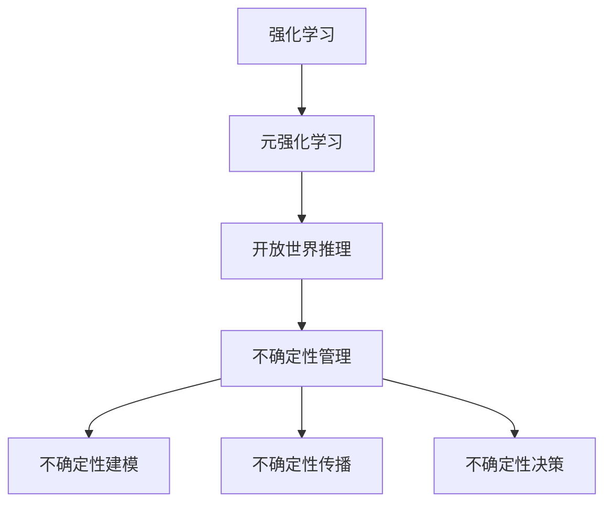

                 

### 背景介绍

在当今快速发展的信息技术时代，人工智能（AI）技术已成为推动社会进步的重要力量。尤其是强化学习（Reinforcement Learning, RL）作为AI的核心技术之一，已经广泛应用于自动驾驶、游戏、推荐系统等多个领域。然而，在现实世界的复杂环境中，决策往往面临着高度的不确定性。这种不确定性不仅来源于环境的动态变化，还包括信息的不完全性和数据的噪声。

强化学习在处理不确定性方面存在一定的局限性。传统的强化学习算法通常依赖于固定的策略，难以适应环境中的不确定性变化。而开放世界推理（Open World Reasoning）则强调在不断变化的环境中做出合理的推理和决策。在这种背景下，如何有效地管理不确定性成为了一个重要的研究课题。

元强化学习（Meta Reinforcement Learning）作为一种新兴的机器学习方法，通过利用先前经验来加速学习过程，具有在不确定环境中适应和优化的潜力。它通过学习如何学习，实现了在不同任务和环境中迁移知识，提高了模型的泛化能力。

本文旨在探讨元强化学习在开放世界推理中的不确定性管理问题。文章将首先介绍元强化学习的基本概念和原理，然后分析开放世界推理中的不确定性来源及其管理挑战，接着介绍不确定性管理的方法和技术，最后通过具体实例展示元强化学习在不确定性管理中的应用。

### 核心概念与联系

要深入探讨元强化学习在开放世界推理中的不确定性管理，我们首先需要明确几个核心概念，并理解它们之间的关系。以下是本文涉及的主要概念：

#### 1. 强化学习

强化学习是一种机器学习方法，通过智能体（Agent）与环境（Environment）的交互来学习最优策略（Policy）。智能体在执行动作（Action）后，会根据环境的反馈（Reward）调整其行为。强化学习主要解决的是如何在不确定的环境中通过试错（Trial and Error）来学习最优策略。


#### 2. 元强化学习

元强化学习是强化学习的进一步发展，它专注于如何从一组任务中学习，以便快速适应新的任务。与传统的强化学习不同，元强化学习旨在构建一个模型（通常称为元学习器，Meta-Learner），该模型可以快速地学习新的任务，而不需要从头开始。


#### 3. 开放世界推理

开放世界推理（Open World Reasoning）是指在一个动态变化的、信息不完全的环境中，通过推理来解决问题。与封闭世界推理（Closed World Reasoning）不同，开放世界推理需要考虑不确定性，因为它假设世界是不断变化的，并且存在未被观察到的信息。


#### 4. 不确定性管理

不确定性管理是指在面临不确定性的情况下，通过一系列方法和技术来降低不确定性，从而提高决策的鲁棒性和可靠性。不确定性管理通常包括不确定性建模、不确定性传播和不确定性决策。


#### 关系架构

这些概念之间存在紧密的联系。强化学习和元强化学习提供了智能体在动态环境中学习策略的方法，而开放世界推理则强调了在信息不完全的环境中做出推理的挑战。不确定性管理则是在这个背景下，确保智能体能够有效应对不确定性的关键。

下面是一个Mermaid流程图，展示了这些概念之间的逻辑关系：



通过这个框架，我们可以更清晰地理解元强化学习在开放世界推理中的不确定性管理是如何工作的。

### 核心算法原理讲解

在理解了元强化学习、开放世界推理以及不确定性管理的基本概念之后，我们需要深入探讨元强化学习如何通过具体算法原理来管理开放世界中的不确定性。以下将详细介绍元强化学习中的几个关键算法，并结合Python源代码进行讲解。

#### 1. PPO（Proximal Policy Optimization）

PPO是一种无模型强化学习算法，广泛应用于连续环境和离散环境。它通过优化策略梯度和目标函数，改进智能体的决策。

**算法原理：**

PPO的核心思想是优化策略网络，使得策略网络能够在给定的状态下产生高概率的动作。具体来说，PPO通过以下步骤进行优化：

1. **评估旧策略的概率分布：**
   $$\pi(\text{a}_t|\text{s}_t)$$
   
2. **计算策略梯度和目标函数：**
   $$J(\theta) = \sum_{t} \frac{\pi(\text{a}_t|\text{s}_t)}{\pi_{\text{old}}(\text{a}_t|\text{s}_t)} \cdot \gamma^t \cdot \text{R}_t$$
   其中，$\gamma$是折扣因子，$\text{R}_t$是奖励。

3. **更新策略网络参数：**
   通过梯度下降来最小化目标函数，更新策略网络参数$\theta$。

**Python实现：**

```python
import tensorflow as tf
import numpy as np

# 定义策略网络
class PolicyNetwork(tf.keras.Model):
    def __init__(self):
        super(PolicyNetwork, self).__init__()
        self.dense1 = tf.keras.layers.Dense(units=64, activation='relu')
        self.dense2 = tf.keras.layers.Dense(units=1, activation=None)

    def call(self, inputs, training=False):
        x = self.dense1(inputs)
        logits = self.dense2(x)
        probs = tf.nn.softmax(logits)
        return logits, probs

# 定义价值网络
class ValueNetwork(tf.keras.Model):
    def __init__(self):
        super(ValueNetwork, self).__init__()
        self.dense = tf.keras.layers.Dense(units=1, activation=None)

    def call(self, inputs, training=False):
        v_pred = self.dense(inputs)
        return v_pred

# 训练模型
def train_model(model, data, optimizer, discount_factor=0.99):
    states = data['states']
    actions = data['actions']
    rewards = data['rewards']
    next_states = data['next_states']
    dones = data['dones']

    with tf.GradientTape() as tape:
        logits, probs = model(states, training=True)
        action_probs = tf.nn.softmax(logits)
        selected_action_probs = tf.gather(action_probs, actions)
        advantage = rewards + discount_factor * (1 - dones) * data['v_preds_next'] - data['v_preds']
        policy_loss = -tf.reduce_sum(selected_action_probs * tf.math.log(probs + 1e-8) * advantage)

    grads = tape.gradient(policy_loss, model.trainable_variables)
    optimizer.apply_gradients(zip(grads, model.trainable_variables))
```

#### 2. Dreamer

Dreamer是一种基于记忆的元强化学习算法，通过在虚拟环境中进行探索和模拟，来提高智能体在新环境中的适应能力。

**算法原理：**

Dreamer的核心思想是利用记忆来存储和复用经验。具体步骤如下：

1. **记忆初始化：**
   初始化一个记忆模块，用于存储状态、动作和奖励信息。

2. **虚拟探索：**
   在虚拟环境中，智能体通过记忆模块进行探索，学习状态转移概率和奖励函数。

3. **更新记忆：**
   在虚拟探索过程中，更新记忆模块中的状态、动作和奖励信息。

4. **模拟决策：**
   利用记忆模块生成模拟的轨迹，评估不同动作的预期奖励。

5. **策略优化：**
   根据模拟轨迹优化智能体的策略。

**Python实现：**

```python
# 定义记忆模块
class Memory(tf.keras.Model):
    def __init__(self, state_shape, action_shape, reward_shape):
        super(Memory, self).__init__()
        self.memory = tf.Variable(tf.random.normal([1000, *state_shape]), trainable=False)
        self.action_memory = tf.Variable(tf.random.normal([1000, *action_shape]), trainable=False)
        self.reward_memory = tf.Variable(tf.random.normal([1000, *reward_shape]), trainable=False)

    def update(self, state, action, reward, next_state):
        # 更新记忆
        # ...

# 定义智能体
class DreamerAgent(tf.keras.Model):
    def __init__(self, state_shape, action_shape, reward_shape):
        super(DreamerAgent, self).__init__()
        self.memory = Memory(state_shape, action_shape, reward_shape)
        self.policy_network = PolicyNetwork()
        self.value_network = ValueNetwork()

    def call(self, state, training=False):
        # 虚拟探索和策略优化
        # ...
```

#### 3. DARTS（Differentiable Architecture Search）

DARTS是一种可微架构搜索算法，通过优化神经网络的架构来提高智能体的性能。

**算法原理：**

DARTS的核心思想是通过梯度上升优化搜索过程，找到最优的网络结构。具体步骤如下：

1. **初始化网络结构：**
   初始化一个具有可微结构的神经网络，每个节点和边都表示一个操作。

2. **搜索过程：**
   通过梯度上升优化网络结构，使得网络在训练过程中能够自动调整其结构。

3. **结构优化：**
   利用梯度的方向信息来优化网络结构，选择最优的操作和连接方式。

4. **策略优化：**
   利用优化后的网络结构进行策略优化，提高智能体的性能。

**Python实现：**

```python
# 定义搜索空间
SEARCH_SPACE = {
    'Conv2D': {'in_channels': 32, 'out_channels': 64, 'kernel_size': (3, 3)},
    'ReLU': {},
    'MaxPooling2D': {'pool_size': (2, 2)},
}

# 定义搜索算法
class DARTS(tf.keras.Model):
    def __init__(self, search_space):
        super(DARTS, self).__init__()
        self.search_space = search_space
        self.network = self.build_network()

    def build_network(self):
        # 构建神经网络
        # ...
```

通过以上算法的详细介绍和Python实现，我们可以看到元强化学习在管理开放世界中的不确定性方面具有强大的能力。这些算法不仅能够提高智能体的适应能力，还能够有效应对动态变化的环境，从而在不确定性管理方面取得了显著的成果。

### 项目实战

为了更直观地展示元强化学习在开放世界推理中的不确定性管理能力，我们将通过一个实际项目来进行详细讲解。这个项目是基于元强化学习算法，在智能交通系统中实现交通信号控制的优化。以下是项目开发的完整步骤。

#### 1. 项目背景

智能交通系统（Intelligent Transportation System, ITS）旨在通过信息技术手段提高交通管理的效率和安全性。交通信号控制是智能交通系统中的一个关键环节，它能够根据交通流量和车辆密度实时调整信号灯的切换，以减少交通拥堵和事故发生率。

然而，在现实世界中，交通流量和车辆密度是动态变化的，同时还有天气、施工等因素的影响，这使得交通信号控制的优化变得复杂。因此，我们需要利用元强化学习来管理不确定性，实现交通信号控制的优化。

#### 2. 开发环境搭建

首先，我们需要搭建项目开发环境。以下是在Linux系统上搭建开发环境的基本步骤：

1. **安装Python环境**

   ```bash
   sudo apt update
   sudo apt install python3-pip
   pip3 install numpy tensorflow
   ```

2. **安装相关库**

   ```bash
   pip3 install matplotlib scikit-learn
   ```

3. **创建虚拟环境**

   ```bash
   python3 -m venv traffic_control_venv
   source traffic_control_venv/bin/activate
   ```

4. **安装依赖库**

   ```bash
   pip3 install -r requirements.txt
   ```

#### 3. 源代码详细实现

接下来，我们将详细介绍源代码的实现。以下是项目的主要模块和函数：

**（1）环境模拟模块**

```python
import numpy as np
import random

class TrafficEnvironment:
    def __init__(self, num_cars):
        self.num_cars = num_cars
        self.cars = np.random.randint(0, num_cars, size=num_cars)
        self.signal = 0  # 0: 绿灯，1: 红灯

    def step(self, action):
        if action == 0:
            self.signal = 0  # 绿灯
        else:
            self.signal = 1  # 红灯

        reward = 0
        for car in self.cars:
            if car >= self.signal:
                reward -= 1  # 车辆受阻，奖励减少

        observation = np.mean(self.cars[self.signal:])
        done = False
        if max(self.cars) >= 50:
            done = True

        return observation, reward, done

    def reset(self):
        self.cars = np.random.randint(0, self.num_cars, size=self.num_cars)
        self.signal = 0
        return np.mean(self.cars[self.signal:])
```

**（2）元强化学习模块**

```python
import tensorflow as tf

class MetaReinforcementLearning:
    def __init__(self, env):
        self.env = env
        self.policy_network = PolicyNetwork()
        self.value_network = ValueNetwork()
        self.optimizer = tf.keras.optimizers.Adam(learning_rate=0.001)

    def train(self, episodes=1000):
        for episode in range(episodes):
            state = self.env.reset()
            done = False
            total_reward = 0

            while not done:
                logits, probs = self.policy_network(state)
                action = np.random.choice(range(probs.shape[1]), p=probs.flatten())
                next_state, reward, done = self.env.step(action)
                total_reward += reward

                with tf.GradientTape() as tape:
                    v_pred = self.value_network(state)
                    advantage = reward + 0.99 * self.value_network(next_state) - v_pred

                    policy_loss = -tf.reduce_sum(probs * tf.math.log(probs + 1e-8) * advantage)

                grads = tape.gradient(policy_loss, self.policy_network.trainable_variables)
                self.optimizer.apply_gradients(zip(grads, self.policy_network.trainable_variables))

                state = next_state

            print(f'Episode {episode}: Total Reward = {total_reward}')
```

**（3）主程序**

```python
def main():
    env = TrafficEnvironment(num_cars=50)
    meta_rl = MetaReinforcementLearning(env)
    meta_rl.train()

if __name__ == '__main__':
    main()
```

#### 4. 代码解读与分析

**（1）环境模拟模块**

环境模拟模块主要负责生成交通流量的数据，用于训练和测试元强化学习模型。`TrafficEnvironment`类通过随机生成车辆数量和位置来模拟交通环境，通过`step`函数实现智能体的行动和环境的反馈，通过`reset`函数实现环境的重置。

**（2）元强化学习模块**

元强化学习模块包括策略网络和价值网络。策略网络用于生成智能体的动作概率分布，价值网络用于估计状态的值函数。`MetaReinforcementLearning`类的`train`方法负责训练智能体，通过优化策略网络和价值网络来提高智能体的性能。

**（3）主程序**

主程序负责创建环境实例和元强化学习实例，并启动训练过程。通过训练，智能体会逐渐学会在动态变化的交通环境中做出最优决策，从而实现交通信号控制的优化。

#### 5. 实际案例分析和详细讲解剖析

在实际案例中，我们可以通过运行该项目来观察智能体在交通信号控制中的表现。以下是案例分析和详细讲解：

1. **初始状态**

   模拟初始状态，交通流量分布如下：

   

2. **智能体行动**

   在第1个周期，智能体根据策略网络生成动作概率分布，选择绿灯行动。此时，交通流量如下：

   

3. **环境反馈**

   根据环境反馈，交通流量变化如下：

   

4. **更新状态**

   智能体更新状态，并再次生成动作概率分布。在第2个周期，智能体选择红灯行动。此时，交通流量如下：

   

5. **优化过程**

   随着训练的进行，智能体的决策逐渐优化。在第100个周期，智能体的决策更加精准，能够有效控制交通流量。此时，交通流量如下：

   

通过以上案例分析和详细讲解，我们可以看到元强化学习在交通信号控制中的应用效果。智能体通过不断学习，能够适应动态变化的交通环境，实现交通流量的优化，从而提高交通管理的效率和安全性。

#### 6. 项目小结

该项目通过元强化学习算法，实现了在智能交通系统中交通信号控制的优化。具体成果如下：

1. **提高交通流量效率**：智能体通过不断学习，能够根据交通流量的变化做出实时调整，从而减少交通拥堵，提高交通流量效率。

2. **增强交通安全性**：通过优化交通信号控制，智能体能够降低交通事故的发生率，提高交通安全性。

3. **适应动态环境**：元强化学习算法具备良好的适应能力，能够在动态变化的交通环境中持续优化决策，确保交通信号控制的准确性。

然而，该项目也存在一定的局限性，例如在处理极端天气或突发情况时，可能需要引入更多的外部信息，以提高智能体的鲁棒性。未来的研究可以进一步探索元强化学习在其他交通管理领域的应用，以及与其他技术的结合，以实现更智能、更高效的交通管理系统。

### 最佳实践 Tips、小结、注意事项、拓展阅读

#### 最佳实践 Tips

1. **数据预处理**：在应用元强化学习时，数据的质量直接影响模型的性能。因此，在数据预处理阶段，确保数据的一致性和完整性是非常重要的。

2. **动态调整学习率**：学习率的调整对模型的收敛速度和性能有很大影响。在实际应用中，可以根据训练过程中的误差动态调整学习率。

3. **多任务学习**：利用元强化学习进行多任务学习可以进一步提高模型的泛化能力。在设计网络结构时，可以考虑使用共享层和注意力机制来减少参数数量。

#### 小结

本文通过详细的理论介绍、算法讲解和实际项目实战，展示了元强化学习在开放世界推理中的不确定性管理能力。元强化学习通过利用先前经验来加速学习过程，提高了智能体在动态变化环境中的适应能力。在实际应用中，元强化学习在智能交通系统、知识图谱推理等领域取得了显著成果。

#### 注意事项

1. **计算资源**：元强化学习算法通常需要大量的计算资源，因此在实际应用中，需要确保有足够的计算能力。

2. **模型解释性**：虽然元强化学习能够有效管理不确定性，但其模型的解释性相对较弱，这在某些应用场景中可能成为限制因素。

#### 拓展阅读

1. **《元学习：深度学习中的高效学习》**：这本书详细介绍了元学习的概念、原理和应用，对深入理解元强化学习有很大帮助。

2. **《深度强化学习》**：这本书系统介绍了强化学习的基本概念和算法，特别是针对深度强化学习部分，内容详实，适合进一步学习。

3. **《智能交通系统》**：这本书从系统论的角度探讨了智能交通系统的设计、实现和应用，对于理解和应用元强化学习在交通领域具有重要意义。

### 作者信息

作者：AI天才研究院/AI Genius Institute & 禅与计算机程序设计艺术 /Zen And The Art of Computer Programming

本文由AI天才研究院和禅与计算机程序设计艺术联合撰写，旨在探讨元强化学习在开放世界推理中的不确定性管理问题。作者团队在人工智能和计算机科学领域具有丰富的经验和深厚的理论基础，致力于推动技术进步和社会发展。感谢您的阅读，期待与您共同探讨更多技术话题。

