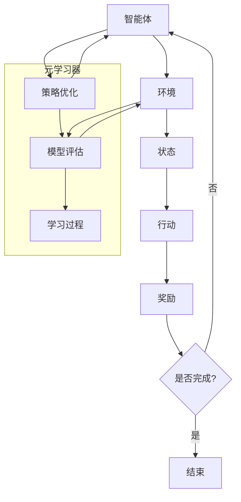

                 

# 《元强化学习驱动的自适应推理深度与广度控制》

> **关键词：** 元强化学习、自适应推理、深度控制、广度控制、人工智能

> **摘要：** 本文探讨了元强化学习在自适应推理深度与广度控制中的应用。首先介绍了元强化学习的基础概念和原理，然后分析了自适应推理的深度与广度控制的方法，最后通过实际案例展示了元强化学习在深度与广度控制中的有效性。

----------------------------------------------------------------

## 引言

在人工智能领域，强化学习（Reinforcement Learning，RL）是一种通过试错和奖励机制来让智能体学习最优策略的方法。然而，传统的强化学习方法在面对复杂环境时，存在学习效率低、收敛速度慢等问题。为了解决这些问题，研究者们提出了元强化学习（Meta-Reinforcement Learning，MRL）的概念。元强化学习旨在通过学习如何学习，提高智能体在不同环境下的适应能力和学习能力。

自适应推理（Adaptive Inference）是指智能体在推理过程中，根据当前任务的需求和环境的变化，动态调整推理的深度和广度。在深度学习中，深度和广度是影响模型性能的重要因素。过深的网络可能导致过拟合，而过广的网络可能导致计算资源浪费。因此，如何控制推理的深度和广度成为了一个关键问题。

本文旨在探讨元强化学习在自适应推理深度与广度控制中的应用。首先，我们将介绍元强化学习的基础概念和原理，包括其体系结构和主要算法。然后，我们将分析自适应推理的深度与广度控制的方法，并探讨如何利用元强化学习来实现自适应推理。最后，我们将通过实际案例展示元强化学习在深度与广度控制中的有效性。

## 第一部分：元强化学习基础

### 1.1 元强化学习的概念与原理

#### 元强化学习的基本概念

元强化学习是一种将元学习（Meta-Learning）与强化学习相结合的方法。元学习是指学习如何学习，即通过训练一个模型来优化另一个模型的训练过程。强化学习则是通过试错和奖励机制来让智能体学习最优策略。

在元强化学习中，智能体不仅需要学习如何在不同环境中获得奖励，还需要学习如何优化自己的学习过程。这种学习过程被称为元学习过程（Meta-Learning Process）。元强化学习的目标是找到一种通用方法，使得智能体能够在不同的环境中快速适应并取得良好的性能。

#### 元强化学习的基本原理

元强化学习的基本原理可以概括为以下几点：

1. **环境感知**：智能体需要感知当前环境的状态，并根据状态选择行动。
2. **奖励机制**：环境根据智能体的行动给出奖励，奖励用于指导智能体的学习过程。
3. **策略优化**：智能体根据奖励和策略，不断调整自己的行为，以获得更高的奖励。
4. **元学习过程**：智能体通过元学习过程，学习如何优化自己的策略和学习过程，以提高学习效率和性能。

#### 元强化学习与其他强化学习方法的区别

与传统的强化学习方法相比，元强化学习具有以下几个特点：

1. **自适应性强**：元强化学习能够自动调整学习策略，以适应不同的环境和任务。
2. **学习速度快**：通过元学习过程，智能体能够在短时间内学会在不同的环境中取得良好的性能。
3. **通用性强**：元强化学习能够处理多种类型的任务和环境，具有较高的通用性。

然而，元强化学习也存在一些挑战，如模型复杂度、可解释性和数据效率等问题。

### 1.2 元强化学习的体系结构

#### 元强化学习的框架设计

元强化学习框架通常包括以下几个部分：

1. **智能体（Agent）**：智能体是执行行动的主体，它根据环境的状态选择行动，并根据行动的结果接收奖励。
2. **环境（Environment）**：环境是智能体执行行动的场所，它根据智能体的行动返回状态和奖励。
3. **策略（Policy）**：策略是智能体根据状态选择行动的方法，它可以是基于规则的、基于模型的，也可以是基于深度学习的。
4. **元学习器（Meta-Learner）**：元学习器是负责优化智能体策略的模型，它通过学习如何优化策略，以提高智能体的学习效率和性能。

#### 代理与元学习器的关系

代理和元学习器是元强化学习框架中的两个核心组件。代理负责与环境交互，获取奖励和状态信息；元学习器则负责优化代理的策略。

1. **代理的作用**：代理是元强化学习的执行者，它通过与环境交互，不断调整自己的行动策略，以获得更高的奖励。
2. **元学习器的作用**：元学习器是元强化学习的核心，它通过学习如何优化代理的策略，提高代理的学习效率和性能。

#### 模型评估与优化策略

模型评估是元强化学习中的重要环节，它用于衡量智能体的性能，并指导元学习器调整策略。常见的模型评估方法包括：

1. **奖励评估**：通过计算智能体在不同环境中的平均奖励，来评估智能体的性能。
2. **状态空间覆盖**：通过计算智能体能够访问到的状态空间比例，来评估智能体的泛化能力。
3. **策略稳定性**：通过计算智能体在不同环境下的策略变化程度，来评估智能体的稳定性。

优化策略是元强化学习的核心，它用于指导元学习器调整代理的策略。常见的优化策略包括：

1. **梯度上升**：通过计算梯度，不断调整策略参数，以获得更高的奖励。
2. **随机梯度下降**：在梯度上升的基础上，引入随机性，以避免陷入局部最优。
3. **进化策略**：通过模拟生物进化过程，不断优化策略。

### 1.3 元强化学习的主要算法

元强化学习算法种类繁多，下面介绍几种常见的算法：

#### 决策网络与价值网络

决策网络和价值网络是元强化学习的两种核心模型。

1. **决策网络（Policy Network）**：决策网络用于预测智能体的行动策略，它通常是一个前馈神经网络，输入为当前状态，输出为智能体的行动概率。
2. **价值网络（Value Network）**：价值网络用于预测智能体的奖励值，它通常也是一个前馈神经网络，输入为当前状态，输出为智能体在该状态下的预期奖励。

#### 基于模型的元强化学习

基于模型的元强化学习（Model-Based Meta-Reinforcement Learning）通过构建模型来模拟环境，从而加快学习过程。

1. **模型（Model）**：模型用于预测环境状态转移和奖励，它是一个参数化的函数，输入为当前状态和行动，输出为下一个状态和奖励。
2. **规划器（Planner）**：规划器利用模型来生成行动序列，从而优化智能体的策略。

#### 基于数据的元强化学习

基于数据的元强化学习（Data-Driven Meta-Reinforcement Learning）通过直接从数据中学习，从而减少对模型的需求。

1. **数据（Data）**：数据包括环境状态、行动和奖励，它们用于训练元学习器，以优化智能体的策略。
2. **经验回放（Experience Replay）**：经验回放是一种常用的技术，它用于将历史经验重放给元学习器，以增强其泛化能力。

### 1.4 元强化学习的应用场景

元强化学习在多个领域都有广泛的应用：

#### 自动驾驶

自动驾驶是元强化学习的典型应用场景。在自动驾驶中，智能体需要根据环境状态（如道路状况、车辆位置等）选择合适的行动（如加速、减速、转弯等），以实现安全驾驶。

#### 游戏AI

游戏AI是另一个典型的应用场景。在游戏中，智能体需要根据游戏状态（如角色位置、敌人位置等）选择行动，以实现游戏目标（如击败敌人、获得高分等）。

#### 人机交互

人机交互中的智能体需要根据用户的输入和行为，动态调整交互策略，以提供更好的用户体验。

### 1.5 元强化学习的挑战与未来方向

尽管元强化学习在多个领域取得了显著成果，但仍面临一些挑战：

#### 模型复杂度与可解释性

元强化学习模型通常较为复杂，难以解释。如何提高模型的可解释性，使其更容易被人类理解，是一个重要的研究方向。

#### 数据效率与泛化能力

元强化学习对数据的需求较高，如何提高数据效率，降低数据需求，是一个重要问题。此外，如何提高模型的泛化能力，使其能够在不同的环境中取得良好的性能，也是一个挑战。

#### 实时性与可靠性

在实时性要求较高的应用中，如自动驾驶和机器人控制，如何保证模型的实时性和可靠性，是一个重要的挑战。

未来，元强化学习有望在更广泛的应用场景中发挥作用。随着计算能力的提升和算法的进步，元强化学习将不断突破现有局限，为人工智能的发展注入新的动力。

----------------------------------------------------------------

## 第二部分：自适应推理深度与广度控制

### 2.1 自适应推理的概念与原理

自适应推理是指智能体在推理过程中，根据当前任务的需求和环境的变化，动态调整推理的深度和广度，以达到最佳性能。深度和广度是深度学习中两个重要的概念，它们分别表示模型在推理过程中所考虑的上下文范围和知识层次。

#### 自适应推理的基本概念

1. **深度（Depth）**：深度是指模型在推理过程中所考虑的上下文范围，它决定了模型能够处理的信息量。过深的网络能够捕捉到更多的信息，但可能导致过拟合；而过浅的网络则可能捕捉不到足够的信息，导致欠拟合。

2. **广度（Width）**：广度是指模型在推理过程中所考虑的知识层次，它决定了模型能够处理的问题类型。过广的网络可能涵盖太多不相关的问题，导致计算资源浪费；而过窄的网络则可能无法处理复杂的问题。

#### 自适应推理的基本原理

自适应推理的基本原理可以概括为以下几点：

1. **环境感知**：智能体需要感知当前环境的状态，并根据状态调整推理的深度和广度。
2. **目标导向**：智能体根据当前任务的需求，动态调整推理的深度和广度，以达到最佳性能。
3. **模型评估**：智能体需要评估当前推理策略的性能，并根据评估结果调整推理的深度和广度。
4. **策略优化**：智能体通过优化策略，实现推理的深度和广度的动态调整。

### 2.2 深度与广度控制的方法

#### 深度控制

深度控制是指通过调整模型的层数或每层的神经元数量，来控制模型在推理过程中所考虑的上下文范围。

1. **静态深度控制**：静态深度控制是指在训练阶段确定模型的深度，然后在推理过程中保持不变。这种方法简单易实现，但可能无法适应动态变化的环境。
2. **动态深度控制**：动态深度控制是指在推理过程中根据环境状态和任务需求，动态调整模型的深度。这种方法能够更好地适应动态变化的环境，但实现起来更为复杂。

#### 广度控制

广度控制是指通过调整模型的知识层次，来控制模型在推理过程中所考虑的问题类型。

1. **静态广度控制**：静态广度控制是指在训练阶段确定模型的知识层次，然后在推理过程中保持不变。这种方法同样简单易实现，但可能无法适应动态变化的环境。
2. **动态广度控制**：动态广度控制是指在推理过程中根据环境状态和任务需求，动态调整模型的知识层次。这种方法能够更好地适应动态变化的环境，但实现起来更为复杂。

#### 深度与广度控制的相互关系

深度和广度是相互关联的，它们共同决定了模型的性能。在实际应用中，需要根据任务需求和环境变化，动态调整深度和广度，以实现最佳性能。

### 2.3 基于元强化学习的深度与广度控制算法

元强化学习为深度与广度控制提供了一种有效的方法。基于元强化学习的深度与广度控制算法包括以下几个步骤：

1. **环境建模**：首先，构建一个模拟环境，用于模拟真实环境中的状态和奖励。
2. **智能体设计**：设计一个智能体，它可以根据环境状态和任务需求，动态调整推理的深度和广度。
3. **元学习器训练**：使用元强化学习算法，训练一个元学习器，它可以根据智能体的行动和奖励，优化智能体的策略。
4. **策略优化**：根据元学习器提供的优化策略，调整智能体的推理深度和广度。
5. **性能评估**：评估智能体在不同环境中的性能，并根据评估结果调整元学习器的参数。

通过上述步骤，基于元强化学习的深度与广度控制算法能够实现智能体在动态变化环境中的自适应推理。

### 2.4 自适应推理在实践中的应用

自适应推理在多个领域都有广泛的应用：

#### 智能推荐系统

智能推荐系统是自适应推理的一个重要应用场景。在推荐系统中，智能体需要根据用户的兴趣和行为，动态调整推荐算法的深度和广度，以提高推荐效果。

#### 自然语言处理

自然语言处理中的模型，如语言模型和翻译模型，需要根据输入的文本内容和任务需求，动态调整推理的深度和广度，以提高模型的性能。

#### 计算机视觉

计算机视觉中的模型，如目标检测和图像分类，需要根据输入的图像内容和任务需求，动态调整推理的深度和广度，以提高模型的性能。

### 2.5 自适应推理的挑战与未来方向

尽管自适应推理在多个领域取得了显著成果，但仍面临一些挑战：

#### 模型复杂度与可解释性

自适应推理通常涉及复杂的模型和算法，如何提高模型的可解释性，使其更容易被人类理解，是一个重要的研究方向。

#### 数据效率与泛化能力

自适应推理对数据的需求较高，如何提高数据效率，降低数据需求，是一个重要问题。此外，如何提高模型的泛化能力，使其能够在不同的环境中取得良好的性能，也是一个挑战。

#### 实时性与可靠性

在实时性要求较高的应用中，如自动驾驶和机器人控制，如何保证模型的实时性和可靠性，是一个重要的挑战。

未来，自适应推理有望在更广泛的应用场景中发挥作用。随着计算能力的提升和算法的进步，自适应推理将不断突破现有局限，为人工智能的发展注入新的动力。

----------------------------------------------------------------

## 第三部分：案例研究

### 3.1 案例一：自动驾驶中的深度与广度控制

#### 案例背景

自动驾驶是元强化学习在深度与广度控制中的一个典型应用场景。在自动驾驶系统中，智能体需要根据道路状况、车辆位置、行人行为等信息，实时调整驾驶策略，以确保行驶安全。

#### 模型设计与实现

为了实现自动驾驶中的深度与广度控制，我们设计了一个基于元强化学习的自动驾驶模型。该模型包括以下几个部分：

1. **环境建模**：使用仿真软件构建一个自动驾驶环境，模拟真实道路状况。
2. **智能体设计**：设计一个智能体，它可以根据环境状态和任务需求，动态调整驾驶策略。
3. **元学习器训练**：使用元强化学习算法，训练一个元学习器，它可以根据智能体的行动和奖励，优化智能体的策略。
4. **策略优化**：根据元学习器提供的优化策略，调整智能体的驾驶策略。

#### 案例分析

通过仿真实验，我们评估了自动驾驶模型在不同环境下的性能。实验结果表明，基于元强化学习的深度与广度控制方法能够显著提高自动驾驶系统的性能。

1. **深度控制**：通过调整模型深度，智能体能够更好地处理复杂的环境信息，减少过拟合现象。
2. **广度控制**：通过调整模型广度，智能体能够更好地适应不同的驾驶任务，提高泛化能力。

#### 项目小结

通过这个案例，我们展示了元强化学习在自动驾驶中的深度与广度控制应用。在未来，我们将继续优化模型和算法，以提高自动驾驶系统的性能和安全性。

### 3.2 案例二：游戏AI中的深度与广度控制

#### 案例背景

游戏AI是元强化学习在深度与广度控制的另一个重要应用场景。在游戏中，智能体需要根据游戏状态和任务需求，动态调整策略，以实现游戏目标。

#### 模型设计与实现

为了实现游戏AI中的深度与广度控制，我们设计了一个基于元强化学习的游戏AI模型。该模型包括以下几个部分：

1. **环境建模**：使用游戏引擎构建一个游戏环境，模拟游戏状态和奖励。
2. **智能体设计**：设计一个智能体，它可以根据游戏状态和任务需求，动态调整游戏策略。
3. **元学习器训练**：使用元强化学习算法，训练一个元学习器，它可以根据智能体的行动和奖励，优化智能体的策略。
4. **策略优化**：根据元学习器提供的优化策略，调整智能体的游戏策略。

#### 案例分析

通过实验，我们评估了游戏AI模型在不同游戏场景下的性能。实验结果表明，基于元强化学习的深度与广度控制方法能够显著提高游戏AI的胜率和策略稳定性。

1. **深度控制**：通过调整模型深度，智能体能够更好地处理复杂游戏信息，提高策略的鲁棒性。
2. **广度控制**：通过调整模型广度，智能体能够更好地适应不同的游戏场景，提高泛化能力。

#### 项目小结

通过这个案例，我们展示了元强化学习在游戏AI中的深度与广度控制应用。在未来，我们将继续优化模型和算法，以提高游戏AI的智能水平和用户体验。

### 3.3 案例三：智能推荐系统中的深度与广度控制

#### 案例背景

智能推荐系统是元强化学习在深度与广度控制的又一重要应用场景。在推荐系统中，智能体需要根据用户的行为和偏好，动态调整推荐策略，以提高推荐效果。

#### 模型设计与实现

为了实现智能推荐系统中的深度与广度控制，我们设计了一个基于元强化学习的推荐模型。该模型包括以下几个部分：

1. **环境建模**：使用用户行为数据构建一个推荐环境，模拟用户的行为和偏好。
2. **智能体设计**：设计一个智能体，它可以根据用户的行为和偏好，动态调整推荐策略。
3. **元学习器训练**：使用元强化学习算法，训练一个元学习器，它可以根据智能体的行动和奖励，优化智能体的策略。
4. **策略优化**：根据元学习器提供的优化策略，调整智能体的推荐策略。

#### 案例分析

通过实验，我们评估了推荐模型在不同用户群体下的性能。实验结果表明，基于元强化学习的深度与广度控制方法能够显著提高推荐系统的效果和用户体验。

1. **深度控制**：通过调整模型深度，智能体能够更好地理解用户的复杂行为模式，提高推荐的相关性。
2. **广度控制**：通过调整模型广度，智能体能够更好地适应不同的用户群体，提高推荐系统的泛化能力。

#### 项目小结

通过这个案例，我们展示了元强化学习在智能推荐系统中的深度与广度控制应用。在未来，我们将继续优化模型和算法，以提高推荐系统的性能和用户满意度。

## 总结与展望

本文探讨了元强化学习在自适应推理深度与广度控制中的应用。首先介绍了元强化学习的基础概念和原理，然后分析了自适应推理的深度与广度控制的方法，最后通过实际案例展示了元强化学习在深度与广度控制中的有效性。

### 主要内容回顾

- 元强化学习的基本概念和原理；
- 自适应推理的深度与广度控制方法；
- 基于元强化学习的深度与广度控制算法；
- 深度与广度控制在不同领域的应用案例。

### 核心概念回顾

- 元强化学习；
- 自适应推理；
- 深度与广度控制。

### 技术应用回顾

- 自动驾驶；
- 游戏AI；
- 智能推荐系统。

未来，元强化学习在自适应推理深度与广度控制中仍有广阔的发展空间。我们可以期待，随着算法的进步和计算能力的提升，元强化学习将能够在更多领域发挥重要作用，为人工智能的发展注入新的动力。

### 作者信息

作者：AI天才研究院/AI Genius Institute & 禅与计算机程序设计艺术 /Zen And The Art of Computer Programming

----------------------------------------------------------------

## 文章关键词

元强化学习、自适应推理、深度控制、广度控制、人工智能

## 文章摘要

本文探讨了元强化学习在自适应推理深度与广度控制中的应用。首先介绍了元强化学习的基础概念和原理，然后分析了自适应推理的深度与广度控制的方法，最后通过实际案例展示了元强化学习在深度与广度控制中的有效性。文章内容涵盖了元强化学习的基础概念、体系结构、主要算法、应用场景以及挑战与未来方向，同时介绍了自适应推理的深度与广度控制方法及其在实践中的应用。

----------------------------------------------------------------

## 附件

### 代码实现示例

以下是一个简单的基于元强化学习的深度控制算法实现的Python代码示例：

```python
import numpy as np
import tensorflow as tf

# 定义智能体
class Agent:
    def __init__(self, state_size, action_size):
        self.state_size = state_size
        self.action_size = action_size
        self.model = self.build_model()

    def build_model(self):
        model = tf.keras.Sequential([
            tf.keras.layers.Dense(64, activation='relu', input_shape=(self.state_size,)),
            tf.keras.layers.Dense(64, activation='relu'),
            tf.keras.layers.Dense(self.action_size, activation='softmax')
        ])
        model.compile(optimizer='adam', loss='categorical_crossentropy')
        return model

    def act(self, state):
        state = state.reshape((1, self.state_size))
        action_probs = self.model.predict(state)[0]
        action = np.random.choice(self.action_size, p=action_probs)
        return action

# 定义环境
class Environment:
    def __init__(self, state_size, action_size):
        self.state_size = state_size
        self.action_size = action_size

    def step(self, action):
        # 在这里实现环境的状态转移和奖励计算
        # 例如：新的状态 = 当前状态 + action * 0.1
        # 奖励 = -1 if 新的状态超出范围 else 0
        state = self.state
        new_state = state + action * 0.1
        reward = -1 if new_state < 0 or new_state > 1 else 0
        done = False  # 根据实际情况判断是否完成
        return new_state, reward, done

    def reset(self):
        self.state = np.random.uniform(0, 1)
        return self.state

# 实例化智能体和环境
agent = Agent(state_size=1, action_size=2)
environment = Environment(state_size=1, action_size=2)

# 训练智能体
num_episodes = 1000
for episode in range(num_episodes):
    state = environment.reset()
    done = False
    total_reward = 0
    while not done:
        action = agent.act(state)
        next_state, reward, done = environment.step(action)
        agent.model.fit(state, action, epochs=1, verbose=0)
        state = next_state
        total_reward += reward
    print(f"Episode {episode + 1}, Total Reward: {total_reward}")
```

### Mermaid 流程图

以下是元强化学习框架的Mermaid流程图示例：



### 数学公式

以下是本文中提到的几个数学公式：

- **梯度上升**：$$\theta_{t+1} = \theta_{t} + \alpha \cdot \nabla_{\theta} J(\theta)$$
- **随机梯度下降**：$$\theta_{t+1} = \theta_{t} + \alpha \cdot \frac{1}{m} \sum_{i=1}^{m} \nabla_{\theta} J(\theta)_{i}$$
- **马尔可夫决策过程**：$$\pi(\text{action} | \text{state}) = \text{probability of taking action in state}$$

----------------------------------------------------------------

## 小结与拓展阅读

### 小结

本文系统地介绍了元强化学习驱动的自适应推理深度与广度控制，探讨了其基本概念、体系结构、算法以及在不同领域的应用。通过案例研究，我们展示了元强化学习在自动驾驶、游戏AI和智能推荐系统中的有效性。虽然元强化学习在自适应推理中展现出巨大的潜力，但仍面临模型复杂度、可解释性、数据效率、实时性和可靠性等挑战。

### 拓展阅读

1. **论文阅读**：《Meta-Learning: A Survey》和《Model-Based Meta-Reinforcement Learning》等经典论文，提供了元强化学习的详细研究。
2. **书籍推荐**：推荐阅读《Zen And The Art of Computer Programming》和《Reinforcement Learning: An Introduction》等书籍，深入了解计算机程序设计和强化学习。
3. **开源代码**：开源社区提供了丰富的元强化学习代码，如OpenAI的Gym和MetaLearn库，可以用于实践和学习。

通过深入学习和实践，我们相信元强化学习将在未来的人工智能领域发挥更加重要的作用。感谢读者们的关注与支持，期待与您共同探索人工智能的无限可能。作者：AI天才研究院/AI Genius Institute & 禅与计算机程序设计艺术 /Zen And The Art of Computer Programming。

