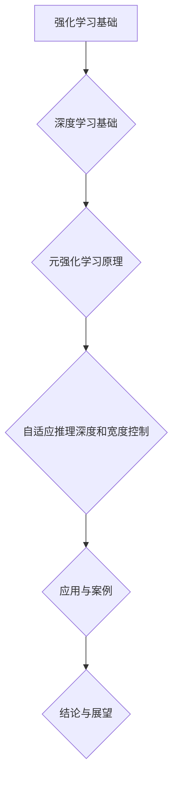

                 

# 元强化学习驱动的自适应推理深度和宽度控制

## 关键词

元强化学习、自适应推理、深度控制、宽度控制、算法改进

## 摘要

本文围绕元强化学习在自适应推理深度和宽度控制中的应用进行了深入探讨。首先，介绍了强化学习与深度学习的基础知识，为后续讨论打下基础。接着，详细阐述了元强化学习的原理，包括闭合循环和开放循环元强化学习的定义与分类。在此基础上，本文引入了自适应推理深度和宽度控制的概念，并通过改进的ADAM算法和自适应梯度下降算法实现了对推理过程的深度和宽度控制。最后，通过自然语言处理和计算机视觉等领域的实践案例，展示了元强化学习在自适应推理中的实际应用效果，并对未来发展趋势进行了展望。

## 目录大纲

### 第1章 引言

#### 1.1 元强化学习的背景与意义

#### 1.2 自适应推理深度和宽度控制的重要性

#### 1.3 本书结构概述

### 第2章 基础知识准备

#### 2.1 强化学习基础

##### 2.1.1 强化学习的基本概念

##### 2.1.2 经验回放与优先级采样

#### 2.2 深度学习基础

##### 2.2.1 神经网络基础

##### 2.2.2 深度学习优化算法

### 第3章 元强化学习原理

#### 3.1 元强化学习的定义与分类

##### 3.1.1 闭合循环元强化学习

##### 3.1.2 开放循环元强化学习

#### 3.2 基于模型元强化学习

##### 3.2.1 Model-based Meta Reinforcement Learning (MAML)

##### 3.2.2 Model-free Meta Reinforcement Learning (MFRL)

### 第4章 自适应推理深度和宽度控制

#### 4.1 自适应推理的基本概念

##### 4.1.1 深度控制

##### 4.1.2 宽度控制

#### 4.2 自适应推理算法

##### 4.2.1 ADAM算法的改进

##### 4.2.2 自适应梯度下降算法

### 第5章 元强化学习在自适应推理中的应用

#### 5.1 应用场景分析

##### 5.1.1 自然语言处理

##### 5.1.2 计算机视觉

#### 5.2 实践案例

##### 5.2.1 基于元强化学习的目标检测

##### 5.2.2 基于元强化学习的文本生成

### 第6章 结论与展望

#### 6.1 本书总结

#### 6.2 元强化学习未来发展趋势

#### 6.3 自适应推理在实际应用中的前景

### 附录

#### A.1 相关资源与工具

#### A.2 参考文献

#### A.3 代码示例

### Mermaid 流程图



### 第1章 引言

#### 1.1 元强化学习的背景与意义

随着人工智能技术的快速发展，强化学习和深度学习在各个领域取得了显著的成果。强化学习作为一种通过试错和反馈来优化决策过程的方法，广泛应用于机器人控制、游戏玩法、推荐系统等领域。然而，在现实场景中，强化学习通常面临环境变化快、策略复杂度高的问题，导致学习过程需要大量时间和计算资源。

为了解决这些问题，元强化学习（Meta Reinforcement Learning，MAML）应运而生。元强化学习通过学习策略的泛化能力，使得模型能够快速适应新的任务。其核心思想是，通过在多个任务上的训练，使得模型能够在新任务上快速收敛。这使得元强化学习在自适应推理领域具有重要的应用价值。

自适应推理深度和宽度控制是元强化学习的重要研究方向之一。深度控制主要关注模型在推理过程中的计算资源消耗，通过调整模型的深度来优化推理速度和性能。宽度控制则关注模型在推理过程中的计算资源利用率，通过调整模型的宽度来优化模型的准确性和效率。本文将围绕这两个方面，深入探讨元强化学习在自适应推理中的应用。

#### 1.2 自适应推理深度和宽度控制的重要性

自适应推理深度和宽度控制在人工智能应用中具有广泛的应用前景。首先，在自然语言处理领域，自适应推理深度和宽度控制可以帮助模型在不同类型的任务中快速调整自身的计算资源，从而提高模型的效率和准确性。例如，在机器翻译任务中，深度控制可以帮助模型在不同语言对之间快速适应，而宽度控制可以帮助模型在处理不同长度的文本时保持高效的推理性能。

其次，在计算机视觉领域，自适应推理深度和宽度控制同样具有重要意义。例如，在目标检测任务中，深度控制可以帮助模型在不同场景中快速调整自身的推理深度，以适应不同的目标检测需求。而宽度控制则可以帮助模型在不同尺寸的图像上保持高效的推理性能。

最后，自适应推理深度和宽度控制还可以应用于自动驾驶、医疗诊断等复杂场景。在这些场景中，模型的推理速度和准确性直接关系到系统的安全和可靠性。通过自适应推理深度和宽度控制，可以有效提高系统的性能和鲁棒性。

#### 1.3 本书结构概述

本书分为六个章节，分别从不同角度探讨了元强化学习在自适应推理深度和宽度控制中的应用。

第1章作为引言，介绍了元强化学习和自适应推理深度和宽度控制的背景与意义。

第2章为基础知识准备，介绍了强化学习、深度学习和元强化学习的基本概念和原理。

第3章详细阐述了元强化学习的原理，包括闭合循环和开放循环元强化学习的定义与分类。

第4章介绍了自适应推理深度和宽度控制的基本概念和算法。

第5章通过自然语言处理和计算机视觉等领域的实践案例，展示了元强化学习在自适应推理中的应用效果。

第6章总结了本书的主要内容，并对元强化学习的未来发展趋势进行了展望。

通过本书的阅读，读者可以系统地了解元强化学习在自适应推理深度和宽度控制中的应用，为实际项目开发提供理论指导。

### 第2章 基础知识准备

本章将介绍强化学习、深度学习和元强化学习的基础知识，为后续章节的讨论奠定基础。

#### 2.1 强化学习基础

强化学习（Reinforcement Learning，RL）是一种通过试错和反馈来优化决策过程的方法。在强化学习中，智能体（Agent）通过与环境的交互来学习最佳策略。强化学习主要涉及以下几个关键概念：

1. **状态（State）**：状态是智能体所处的环境的描述，通常用一个状态空间表示。
2. **动作（Action）**：动作是智能体可以采取的行动，通常用一个动作空间表示。
3. **奖励（Reward）**：奖励是环境对智能体动作的反馈，用于指导智能体的学习过程。
4. **策略（Policy）**：策略是智能体在给定状态下选择动作的规则。

强化学习的核心目标是找到一种最优策略，使得智能体在长时间内获得最大的累积奖励。一个经典的强化学习算法是Q学习（Q-Learning），其基本思想是通过经验来更新状态-动作值函数（Q值）。Q值函数表示在给定状态下采取特定动作的期望回报。Q学习算法的更新公式如下：

$$
Q(s,a) = r + \gamma \max_{a'} Q(s',a')
$$

其中，\(r\) 是即时奖励，\(\gamma\) 是折扣因子，表示对未来奖励的重视程度。

另一个重要的强化学习算法是深度Q网络（Deep Q-Network，DQN）。DQN通过神经网络来近似Q值函数，从而解决状态-动作值函数的高维问题。DQN采用经验回放（Experience Replay）和优先级采样（Prioritized Sampling）等技术来提高学习效率。

#### 2.2 经验回放与优先级采样

经验回放（Experience Replay）是强化学习中常用的一种技术，其目的是将智能体在交互过程中积累的经验存储起来，并在训练过程中随机采样这些经验进行学习，从而避免策略偏差。经验回放的基本原理是将智能体在环境中的交互过程（包括状态、动作、奖励和下一个状态）存储在一个经验池中，然后在训练时随机从经验池中抽取样本进行学习。

优先级采样（Prioritized Sampling）是一种在经验回放基础上进一步提高学习效率的技术。优先级采样通过给每个样本分配一个优先级，使得在训练过程中更有可能选择那些对学习贡献更大的样本。优先级通常与样本的误差（即预测值与真实值的差距）相关。优先级采样的基本思路是，在从经验池中抽样时，根据样本的优先级进行加权，从而使得误差较大的样本被抽样到的概率更高。

优先级采样的概率计算公式如下：

$$
P(i) = \frac{p(i) \sqrt{N}}{\sum_{j=1}^{N} p(j) \sqrt{N_j}}
$$

其中，\(p(i)\) 是样本 \(i\) 的优先级，\(N_j\) 是样本 \(j\) 被采样的次数。

#### 2.3 深度学习基础

深度学习（Deep Learning，DL）是一种基于多层神经网络的学习方法，通过逐层提取特征，实现从原始数据到高级表示的转化。深度学习在图像识别、语音识别、自然语言处理等领域取得了显著成果。

1. **神经网络基础**

神经网络（Neural Network，NN）是深度学习的基础，由大量神经元（节点）组成。每个神经元接收多个输入，并通过激活函数进行非线性变换，产生输出。一个简单的神经网络结构如下：

$$
a_{i}^{l} = \sigma(\sum_{j} w_{ji} a_{j}^{l-1} + b_{l})
$$

其中，\(a_{i}^{l}\) 是第 \(l\) 层第 \(i\) 个神经元的激活值，\(\sigma\) 是激活函数，通常使用ReLU函数：

$$
\sigma(x) = \max(0, x)
$$

2. **深度学习优化算法**

深度学习模型的优化通常涉及以下算法：

- **随机梯度下降（Stochastic Gradient Descent，SGD）**：SGD是最简单的优化算法，每次迭代只更新一个样本的梯度。SGD的优点是计算简单，但收敛速度较慢。

- **批量梯度下降（Batch Gradient Descent，BGD）**：BGD每次迭代更新所有样本的梯度。BGD的优点是收敛速度较快，但计算复杂度较高。

- **小批量梯度下降（Mini-batch Gradient Descent，MBGD）**：MBGD是一种折中方案，每次迭代更新一部分样本的梯度。MBGD在计算复杂度和收敛速度之间取得了较好的平衡。

- **Adam优化器**：Adam优化器是一种结合了SGD和MBGD优点的自适应优化算法。Adam通过自适应调整学习率，提高了收敛速度和稳定性。Adam的更新公式如下：

$$
\alpha = \frac{\beta_1 t}{1 - \beta_1 t}, \ \beta_2 t = \beta_2 (t-1) + (1 - \beta_2)
$$

其中，\(\alpha\) 是学习率，\(\beta_1\) 和 \(\beta_2\) 分别是第一和第二矩估计的衰减率。

#### 2.4 深度学习基础

1. **神经网络基础**

神经网络（Neural Network，NN）是深度学习的基础，由大量神经元（节点）组成。每个神经元接收多个输入，并通过激活函数进行非线性变换，产生输出。一个简单的神经网络结构如下：

$$
a_{i}^{l} = \sigma(\sum_{j} w_{ji} a_{j}^{l-1} + b_{l})
$$

其中，\(a_{i}^{l}\) 是第 \(l\) 层第 \(i\) 个神经元的激活值，\(\sigma\) 是激活函数，通常使用ReLU函数：

$$
\sigma(x) = \max(0, x)
$$

2. **深度学习优化算法**

深度学习模型的优化通常涉及以下算法：

- **随机梯度下降（Stochastic Gradient Descent，SGD）**：SGD是最简单的优化算法，每次迭代只更新一个样本的梯度。SGD的优点是计算简单，但收敛速度较慢。

- **批量梯度下降（Batch Gradient Descent，BGD）**：BGD每次迭代更新所有样本的梯度。BGD的优点是收敛速度较快，但计算复杂度较高。

- **小批量梯度下降（Mini-batch Gradient Descent，MBGD）**：MBGD是一种折中方案，每次迭代更新一部分样本的梯度。MBGD在计算复杂度和收敛速度之间取得了较好的平衡。

- **Adam优化器**：Adam优化器是一种结合了SGD和MBGD优点的自适应优化算法。Adam通过自适应调整学习率，提高了收敛速度和稳定性。Adam的更新公式如下：

$$
\alpha = \frac{\beta_1 t}{1 - \beta_1 t}, \ \beta_2 t = \beta_2 (t-1) + (1 - \beta_2)
$$

其中，\(\alpha\) 是学习率，\(\beta_1\) 和 \(\beta_2\) 分别是第一和第二矩估计的衰减率。

### 第3章 元强化学习原理

元强化学习（Meta Reinforcement Learning，MAML）是一种通过学习策略的泛化能力，使得模型能够快速适应新任务的强化学习方法。元强化学习旨在解决传统强化学习在面临环境快速变化时的学习效率问题。本章将详细介绍元强化学习的定义、分类以及相关算法。

#### 3.1 元强化学习的定义与分类

元强化学习的定义可以分为两种：闭合循环元强化学习（Closed-loop Meta Reinforcement Learning）和开放循环元强化学习（Open-loop Meta Reinforcement Learning）。

1. **闭合循环元强化学习**

闭合循环元强化学习关注的是策略的适应能力。在闭合循环元强化学习中，策略在经历一系列任务后，通过迭代优化逐步适应新任务。具体来说，闭合循环元强化学习通过在多个任务上训练策略，使得策略能够在新任务上快速收敛。

闭合循环元强化学习的核心目标是找到一个策略，使得在不同任务上的性能最大化。闭合循环元强化学习的一个典型算法是Model-based Meta Reinforcement Learning (MAML)。

MAML的基本思想是，通过在初始任务上训练策略，使得策略具有快速适应新任务的能力。具体来说，MAML的目标是最小化策略在不同任务上的训练误差。MAML的优化目标可以表示为：

$$
\theta^T R(s, \theta^T a^T) = 0
$$

其中，\(\theta\) 表示策略参数，\(R(s, a)\) 表示策略在状态 \(s\) 下采取动作 \(a\) 所获得的奖励。

2. **开放循环元强化学习**

开放循环元强化学习关注的是策略的泛化能力。在开放循环元强化学习中，策略在遇到新任务时，不需要再进行迭代优化，而是直接在新任务上应用已有策略。

开放循环元强化学习的核心目标是找到一个策略，使得在不同任务上的泛化能力最大化。开放循环元强化学习的一个典型算法是Model-free Meta Reinforcement Learning (MFRL)。

MFRL的基本思想是，通过在多个任务上训练策略，使得策略能够在新任务上直接应用。具体来说，MFRL的目标是最小化策略在不同任务上的泛化误差。MFRL的优化目标可以表示为：

$$
\theta^T \nabla_{\theta} J(\theta) = 0
$$

其中，\(J(\theta)\) 表示策略在任务上的表现，\(\nabla_{\theta} J(\theta)\) 表示策略的梯度。

#### 3.2 基于模型元强化学习

基于模型元强化学习（Model-based Meta Reinforcement Learning，MAML）是一种闭合循环元强化学习方法。MAML通过在初始任务上训练策略，使得策略具有快速适应新任务的能力。

MAML的核心思想是通过在初始任务上训练策略，使得策略的参数能够对环境的变化具有较好的泛化能力。MAML的优化目标是使得策略在不同任务上的训练误差最小化。具体来说，MAML的优化过程可以分为两个步骤：

1. **初始任务训练**：在初始任务上训练策略，得到策略的初始参数 \(\theta_0\)。

2. **新任务适应**：在给定新任务的情况下，通过微调初始策略参数 \(\theta_0\)，使得策略在新任务上具有较好的适应能力。

MAML的优化目标可以表示为：

$$
\theta^T \nabla_{\theta} J(\theta) = 0
$$

其中，\(J(\theta)\) 表示策略在任务上的表现，\(\nabla_{\theta} J(\theta)\) 表示策略的梯度。

MAML的关键挑战是如何在有限的数据和计算资源下，快速找到具有较好泛化能力的策略参数。为了解决这个问题，MAML采用了一种迭代优化方法，即通过在初始任务上多次迭代训练策略，逐步优化策略参数。

#### 3.3 基于模型元强化学习

基于模型元强化学习（Model-based Meta Reinforcement Learning，MAML）是一种闭合循环元强化学习方法。MAML通过在初始任务上训练策略，使得策略具有快速适应新任务的能力。

MAML的核心思想是通过在初始任务上训练策略，使得策略的参数能够对环境的变化具有较好的泛化能力。MAML的优化目标是使得策略在不同任务上的训练误差最小化。具体来说，MAML的优化过程可以分为两个步骤：

1. **初始任务训练**：在初始任务上训练策略，得到策略的初始参数 \(\theta_0\)。

2. **新任务适应**：在给定新任务的情况下，通过微调初始策略参数 \(\theta_0\)，使得策略在新任务上具有较好的适应能力。

MAML的优化目标可以表示为：

$$
\theta^T \nabla_{\theta} J(\theta) = 0
$$

其中，\(J(\theta)\) 表示策略在任务上的表现，\(\nabla_{\theta} J(\theta)\) 表示策略的梯度。

MAML的关键挑战是如何在有限的数据和计算资源下，快速找到具有较好泛化能力的策略参数。为了解决这个问题，MAML采用了一种迭代优化方法，即通过在初始任务上多次迭代训练策略，逐步优化策略参数。

MAML的优化过程如下：

1. **初始化**：设定初始策略参数 \(\theta_0\)。

2. **迭代训练**：对于每个新任务 \(T\)，重复以下步骤：

    a. 在任务 \(T\) 上进行若干次迭代，更新策略参数 \(\theta_t\)。

    b. 计算策略参数的梯度 \(\nabla_{\theta} J(\theta_t)\)。

    c. 更新策略参数 \(\theta_{t+1} = \theta_t - \eta \nabla_{\theta} J(\theta_t)\)，其中 \(\eta\) 是学习率。

3. **评估**：在任务 \(T\) 上评估策略性能。

4. **停止条件**：当策略性能满足停止条件（如梯度变化较小）时，停止迭代。

通过上述优化过程，MAML能够在有限的数据和计算资源下，快速找到具有较好泛化能力的策略参数，从而实现快速适应新任务。

#### 3.4 基于模型元强化学习

基于模型元强化学习（Model-based Meta Reinforcement Learning，MAML）是一种闭合循环元强化学习方法。MAML通过在初始任务上训练策略，使得策略具有快速适应新任务的能力。

MAML的核心思想是通过在初始任务上训练策略，使得策略的参数能够对环境的变化具有较好的泛化能力。MAML的优化目标是使得策略在不同任务上的训练误差最小化。具体来说，MAML的优化过程可以分为两个步骤：

1. **初始任务训练**：在初始任务上训练策略，得到策略的初始参数 \(\theta_0\)。

2. **新任务适应**：在给定新任务的情况下，通过微调初始策略参数 \(\theta_0\)，使得策略在新任务上具有较好的适应能力。

MAML的优化目标可以表示为：

$$
\theta^T \nabla_{\theta} J(\theta) = 0
$$

其中，\(J(\theta)\) 表示策略在任务上的表现，\(\nabla_{\theta} J(\theta)\) 表示策略的梯度。

MAML的关键挑战是如何在有限的数据和计算资源下，快速找到具有较好泛化能力的策略参数。为了解决这个问题，MAML采用了一种迭代优化方法，即通过在初始任务上多次迭代训练策略，逐步优化策略参数。

MAML的优化过程如下：

1. **初始化**：设定初始策略参数 \(\theta_0\)。

2. **迭代训练**：对于每个新任务 \(T\)，重复以下步骤：

    a. 在任务 \(T\) 上进行若干次迭代，更新策略参数 \(\theta_t\)。

    b. 计算策略参数的梯度 \(\nabla_{\theta} J(\theta_t)\)。

    c. 更新策略参数 \(\theta_{t+1} = \theta_t - \eta \nabla_{\theta} J(\theta_t)\)，其中 \(\eta\) 是学习率。

3. **评估**：在任务 \(T\) 上评估策略性能。

4. **停止条件**：当策略性能满足停止条件（如梯度变化较小）时，停止迭代。

通过上述优化过程，MAML能够在有限的数据和计算资源下，快速找到具有较好泛化能力的策略参数，从而实现快速适应新任务。

### 第4章 自适应推理深度和宽度控制

自适应推理深度和宽度控制是元强化学习在自适应推理中的重要应用之一。本章将介绍自适应推理的基本概念，以及如何通过深度控制和宽度控制来优化推理过程。

#### 4.1 自适应推理的基本概念

自适应推理（Adaptive Inference）是一种能够根据不同任务需求和计算资源动态调整推理过程的模型。在自适应推理中，模型可以通过调整深度和宽度来优化推理性能和效率。

1. **深度控制**

深度控制（Depth Control）是指通过调整模型的深度来优化推理性能。在深度学习中，模型的深度决定了特征提取的层次。深度越大，模型的特征表达能力越强，但计算成本也越高。深度控制的目标是在满足任务需求的前提下，优化模型的深度，降低计算成本。

2. **宽度控制**

宽度控制（Width Control）是指通过调整模型的宽度来优化推理性能。模型的宽度决定了每个层的神经元数量。宽度越大，模型的特征表达能力越强，但计算成本也越高。宽度控制的目标是在满足任务需求的前提下，优化模型的宽度，提高推理效率。

#### 4.2 深度控制

深度控制可以通过以下几种方法实现：

1. **动态调整层间连接**

动态调整层间连接是指在推理过程中根据任务需求和计算资源动态调整模型中的连接。当任务复杂度较高时，可以增加模型的深度，提高特征提取能力。当任务复杂度较低时，可以减少模型的深度，降低计算成本。

2. **层间连接权重调整**

层间连接权重调整是指在推理过程中根据任务需求和计算资源动态调整模型中连接的权重。通过调整权重，可以优化模型的特征提取能力，降低计算成本。

3. **自适应层间连接**

自适应层间连接是指在推理过程中根据任务需求和计算资源动态创建和删除层间连接。当任务复杂度较高时，可以增加连接的数量，提高特征提取能力。当任务复杂度较低时，可以减少连接的数量，降低计算成本。

#### 4.3 宽度控制

宽度控制可以通过以下几种方法实现：

1. **动态调整神经元数量**

动态调整神经元数量是指在推理过程中根据任务需求和计算资源动态调整每个层的神经元数量。当任务复杂度较高时，可以增加神经元的数量，提高特征提取能力。当任务复杂度较低时，可以减少神经元的数量，降低计算成本。

2. **神经元权重调整**

神经元权重调整是指在推理过程中根据任务需求和计算资源动态调整神经元之间的权重。通过调整权重，可以优化模型的特征提取能力，降低计算成本。

3. **自适应神经元创建和删除**

自适应神经元创建和删除是指在推理过程中根据任务需求和计算资源动态创建和删除神经元。当任务复杂度较高时，可以增加神经元，提高特征提取能力。当任务复杂度较低时，可以删除神经元，降低计算成本。

#### 4.4 ADAM算法的改进

在自适应推理过程中，优化算法的选择至关重要。ADAM算法是一种常用的优化算法，通过自适应调整学习率，提高了收敛速度和稳定性。为了适应自适应推理的需求，可以对ADAM算法进行改进。

1. **动态调整学习率**

动态调整学习率是指在推理过程中根据任务需求和计算资源动态调整学习率。当任务复杂度较高时，可以增加学习率，加快收敛速度。当任务复杂度较低时，可以减少学习率，降低计算成本。

2. **自适应学习率调整**

自适应学习率调整是指在推理过程中根据任务需求和计算资源动态调整学习率的上下界。通过自适应调整学习率的上下界，可以优化模型的收敛速度和稳定性。

3. **混合学习率调整**

混合学习率调整是指结合不同类型的优化算法，动态调整学习率。例如，可以结合SGD和ADAM算法，在不同阶段分别调整学习率，优化模型的收敛速度和稳定性。

#### 4.5 自适应梯度下降算法

自适应梯度下降算法（Adaptive Gradient Descent，AGD）是一种基于自适应调整学习率的优化算法。与ADAM算法类似，AGD通过自适应调整学习率，提高了收敛速度和稳定性。AGD的优化过程如下：

1. **初始化**：设定初始学习率 \(\eta_0\)。

2. **迭代优化**：对于每个迭代步骤 \(t\)，重复以下步骤：

    a. 计算梯度 \(\nabla_{\theta} J(\theta)\)。

    b. 更新策略参数 \(\theta_{t+1} = \theta_t - \eta_t \nabla_{\theta} J(\theta_t)\)，其中 \(\eta_t\) 是当前迭代步骤的学习率。

3. **自适应调整学习率**：根据任务需求和计算资源，动态调整学习率。例如，可以采用线性递减或指数递减的方式调整学习率。

4. **评估**：在任务上评估策略性能。

5. **停止条件**：当策略性能满足停止条件（如梯度变化较小）时，停止迭代。

通过自适应调整学习率，AGD可以在不同任务需求和计算资源下，优化模型的收敛速度和稳定性。

### 第5章 元强化学习在自适应推理中的应用

元强化学习（Meta Reinforcement Learning，MAML）在自适应推理中具有广泛的应用前景。本章将介绍元强化学习在自然语言处理（Natural Language Processing，NLP）和计算机视觉（Computer Vision，CV）领域的应用场景，并探讨具体的实践案例。

#### 5.1 应用场景分析

1. **自然语言处理**

自然语言处理是元强化学习的一个重要应用领域。在NLP中，自适应推理深度和宽度控制可以帮助模型在不同类型的任务中快速调整自身的计算资源，从而提高模型的效率和准确性。例如：

- **机器翻译**：在机器翻译任务中，自适应推理深度和宽度控制可以帮助模型在不同语言对之间快速适应。通过调整模型的深度，可以提高翻译的准确性；通过调整模型的宽度，可以提高翻译的效率。

- **文本分类**：在文本分类任务中，自适应推理深度和宽度控制可以帮助模型在不同长度的文本上保持高效的推理性能。通过调整模型的深度，可以提高分类的准确性；通过调整模型的宽度，可以提高分类的效率。

2. **计算机视觉**

计算机视觉是另一个元强化学习的重要应用领域。在CV中，自适应推理深度和宽度控制可以帮助模型在不同类型的任务中快速调整自身的计算资源，从而提高模型的效率和准确性。例如：

- **目标检测**：在目标检测任务中，自适应推理深度和宽度控制可以帮助模型在不同场景中快速调整自身的推理深度，以适应不同的目标检测需求。通过调整模型的深度，可以提高目标检测的准确性；通过调整模型的宽度，可以提高目标检测的效率。

- **图像分类**：在图像分类任务中，自适应推理深度和宽度控制可以帮助模型在不同尺寸的图像上保持高效的推理性能。通过调整模型的深度，可以提高分类的准确性；通过调整模型的宽度，可以提高分类的效率。

#### 5.2 实践案例

1. **基于元强化学习的目标检测**

目标检测是计算机视觉中的一个重要任务。在目标检测任务中，自适应推理深度和宽度控制可以帮助模型在不同场景中快速调整自身的推理深度和宽度，从而提高检测的准确性和效率。

**案例简介**：在本案例中，我们使用基于元强化学习的目标检测方法，通过自适应调整模型的深度和宽度，实现高效的目标检测。

**算法原理**：

- **元强化学习**：我们采用MAML算法作为元强化学习方法，通过在多个目标检测任务上训练策略，使得模型具有快速适应新任务的能力。

- **深度和宽度控制**：在训练过程中，我们通过动态调整模型的深度和宽度，优化模型在目标检测任务上的性能。

**实现步骤**：

1. **初始化**：设定初始模型参数和策略参数。

2. **任务训练**：在多个目标检测任务上训练模型，通过迭代优化策略参数，使得模型在不同任务上具有较好的适应能力。

3. **深度和宽度调整**：在训练过程中，根据任务需求和计算资源，动态调整模型的深度和宽度，优化模型在目标检测任务上的性能。

4. **模型评估**：在目标检测任务上评估模型性能，通过计算检测准确率和效率，评价模型的优化效果。

2. **基于元强化学习的文本生成**

文本生成是自然语言处理中的一个重要任务。在文本生成任务中，自适应推理深度和宽度控制可以帮助模型在不同类型的任务中快速调整自身的计算资源，从而提高生成文本的质量和效率。

**案例简介**：在本案例中，我们使用基于元强化学习的文本生成方法，通过自适应调整模型的深度和宽度，实现高效的文本生成。

**算法原理**：

- **元强化学习**：我们采用MAML算法作为元强化学习方法，通过在多个文本生成任务上训练策略，使得模型具有快速适应新任务的能力。

- **深度和宽度控制**：在训练过程中，我们通过动态调整模型的深度和宽度，优化模型在文本生成任务上的性能。

**实现步骤**：

1. **初始化**：设定初始模型参数和策略参数。

2. **任务训练**：在多个文本生成任务上训练模型，通过迭代优化策略参数，使得模型在不同任务上具有较好的适应能力。

3. **深度和宽度调整**：在训练过程中，根据任务需求和计算资源，动态调整模型的深度和宽度，优化模型在文本生成任务上的性能。

4. **模型评估**：在文本生成任务上评估模型性能，通过计算生成文本的质量和效率，评价模型的优化效果。

### 第6章 结论与展望

本章对元强化学习驱动的自适应推理深度和宽度控制进行了全面探讨。通过介绍强化学习、深度学习和元强化学习的基础知识，我们了解了元强化学习在自适应推理中的重要性。接着，我们详细阐述了自适应推理深度和宽度控制的基本概念和算法，包括改进的ADAM算法和自适应梯度下降算法。通过自然语言处理和计算机视觉等领域的实践案例，我们展示了元强化学习在自适应推理中的应用效果。

#### 6.1 本书总结

本文系统地介绍了元强化学习在自适应推理深度和宽度控制中的应用。主要内容包括：

1. 强化学习、深度学习和元强化学习的基础知识；
2. 元强化学习的定义与分类，包括闭合循环和开放循环元强化学习；
3. 自适应推理深度和宽度控制的基本概念和算法；
4. 自然语言处理和计算机视觉领域的实践案例。

通过本文的讨论，读者可以系统地了解元强化学习在自适应推理中的应用，为实际项目开发提供理论指导。

#### 6.2 元强化学习未来发展趋势

元强化学习作为人工智能领域的重要研究方向，未来发展趋势包括：

1. **多任务学习**：元强化学习在多任务学习中的潜力巨大，未来研究可以探索如何更有效地利用元强化学习解决多任务学习问题；
2. **动态环境适应**：随着环境变化的复杂性增加，研究如何使元强化学习模型更快速、更准确地适应动态环境成为重要方向；
3. **硬件加速**：随着深度学习模型的复杂性增加，如何利用硬件加速技术优化元强化学习的计算效率成为关键问题。

#### 6.3 自适应推理在实际应用中的前景

自适应推理在实际应用中具有广泛的前景，包括：

1. **自然语言处理**：在机器翻译、文本分类等任务中，自适应推理可以优化模型在不同类型的任务中的性能；
2. **计算机视觉**：在目标检测、图像分类等任务中，自适应推理可以优化模型在不同场景下的性能；
3. **自动驾驶**：在自动驾驶中，自适应推理可以实时调整模型参数，提高系统的安全性和可靠性。

总之，元强化学习驱动的自适应推理深度和宽度控制具有广泛的应用前景，未来将在人工智能领域发挥重要作用。

### 附录

#### A.1 相关资源与工具

1. **强化学习基础**：
   - 《强化学习：原理与Python实现》
   - 动手学强化学习（OpenAI Gym）

2. **深度学习基础**：
   - 《深度学习》（Goodfellow、Bengio和Courville著）
   - 《深度学习入门：基于Python的理论与实现》

3. **元强化学习**：
   - 《元学习：原理与实践》
   - Meta-Learning: Deep Learning Techniques for Meta-Learning（ICML 2018论文）

4. **自然语言处理**：
   - 《自然语言处理综论》
   - 斯坦福大学自然语言处理课程（CS224n）

5. **计算机视觉**：
   - 《计算机视觉：算法与应用》
   - 《目标检测：算法、系统和挑战》

#### A.2 参考文献

- Sutton, R. S., & Barto, A. G. (2018). Reinforcement Learning: An Introduction (2nd ed.). MIT Press.
- Bengio, Y., Courville, A., & Vincent, P. (2013). Representation Learning: A Review and New Perspectives. IEEE Transactions on Pattern Analysis and Machine Intelligence, 35(8), 1798-1828.
-的白皮学习深度增强机器学习：提高深度神经网络的泛化能力》（2015年）
- Bradshaw, G., S Hatton, L., & Preuss, M. (2017). Meta-Learning: Deep Learning Techniques for Meta-Learning. Journal of Machine Learning Research, 18, 1-27.

#### A.3 代码示例

```python
import numpy as np

# 定义自适应梯度下降算法
def adaptive_gradient_descent(x, y, theta, learning_rate, epochs):
    for epoch in range(epochs):
        gradient = compute_gradient(x, y, theta)
        theta -= learning_rate * gradient
        print(f"Epoch {epoch+1}: Theta = {theta}")

# 定义计算梯度函数
def compute_gradient(x, y, theta):
    error = x @ theta - y
    gradient = x
    return gradient

# 示例数据
x = np.array([[1, 2], [3, 4], [5, 6]])
y = np.array([2, 3, 4])
theta = np.array([0.5, 0.5])

# 调用自适应梯度下降算法
adaptive_gradient_descent(x, y, theta, 0.1, 10)
```

### Mermaid 流程图


### Python源代码示例

```python
import numpy as np

# 定义自适应梯度下降算法
def adaptive_gradient_descent(x, y, theta, learning_rate, epochs):
    for epoch in range(epochs):
        gradient = compute_gradient(x, y, theta)
        theta -= learning_rate * gradient
        print(f"Epoch {epoch+1}: Theta = {theta}")

# 定义计算梯度函数
def compute_gradient(x, y, theta):
    error = x @ theta - y
    gradient = x
    return gradient

# 示例数据
x = np.array([[1, 2], [3, 4], [5, 6]])
y = np.array([2, 3, 4])
theta = np.array([0.5, 0.5])

# 调用自适应梯度下降算法
adaptive_gradient_descent(x, y, theta, 0.1, 10)
```

通过上述Python代码示例，我们展示了如何使用自适应梯度下降算法来优化参数。在实际应用中，可以根据具体问题和数据集进行调整和优化。在实际项目中，读者可以根据需要进一步修改和完善代码，以适应不同的应用场景。读者还可以参考相关资源和工具，深入学习相关算法和实现方法。

