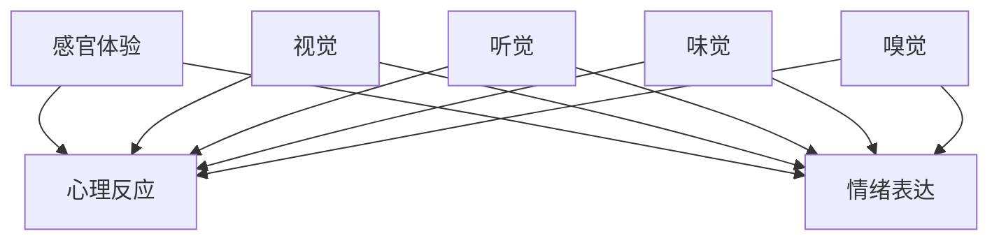
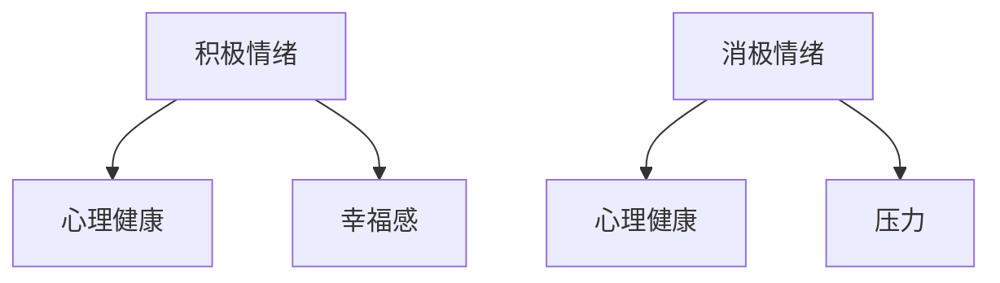
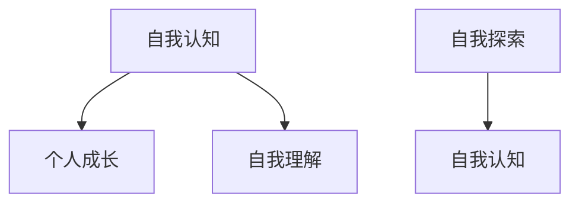
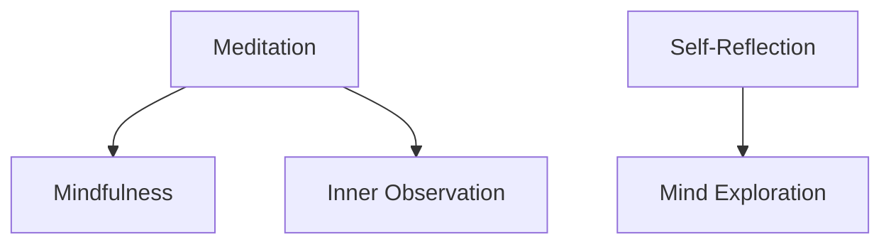
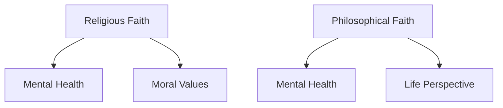
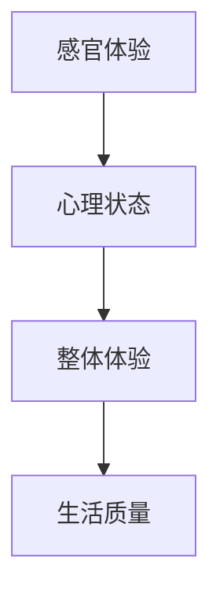

                 

### 全方位提升生活体验：感官与心灵的共同成长

## 关键词
- 感官体验
- 心灵成长
- 情绪管理
- 感官整合
- 生活质量

## 摘要
本文旨在探讨如何通过提升感官体验和心灵成长，实现全方位的生活体验提升。文章首先介绍了感官体验的哲学思考和其与人类心理的关联，然后详细解析了视觉、听觉、味觉和嗅觉体验的深度，接着讨论了情绪管理、自我认知和心灵探索。最后，文章提出了感官与心灵整合的理论和实践案例，以及全面提升生活体验的策略。通过这些探讨，读者将能够更好地理解感官与心灵的关系，并找到提升生活质量的途径。

## 第一部分：感官的觉醒与探索

### 第1章：感官体验的哲学思考

#### 1.1 感官体验的重要性

感官体验是人类与世界互动的基本方式。视觉、听觉、味觉、嗅觉和触觉共同构成了我们对世界的感知。这些感官体验不仅帮助我们获取信息，还直接影响我们的情绪和心理健康。

#### 核心概念与联系
**感官体验**：感官体验是指通过视觉、听觉、味觉、嗅觉和触觉与外界互动的过程。

**心理反应**：感官体验会引发一系列心理反应，包括情绪、记忆和认知。

**Mermaid 流程图**：


#### 1.2 感官体验与人类心理的关联

感官体验与人类心理紧密相连。不同的感官体验可以引发不同的情绪反应，从而影响个体的心理健康。例如，愉悦的视觉体验可以提升心情，而痛苦的声音体验可能导致情绪低落。

#### 核心概念与联系
**情绪反应**：感官体验引发的生理和心理反应。

**心理健康**：感官体验对心理健康的影响。

**Python 代码示例**：
```python
import numpy as np

# 定义感官体验与情绪反应的函数
def sensory_experience_to_emotion(sensory_data):
    # 假设感官数据是数字，0-100表示愉悦程度
    emotion = np.mean(sensory_data)
    if emotion > 70:
        return "愉悦"
    elif emotion > 30:
        return "中性"
    else:
        return "痛苦"
```

#### 1.3 感官体验的多样性

感官体验因个体差异和文化背景而异。不同的人对同一感官刺激可能会有不同的感受。例如，某些人可能对特定的声音感到愉悦，而另一些人则可能感到不适。

#### 数学模型和数学公式
$$
Q = f(S, P)
$$
其中，$Q$ 代表感官体验的质量，$S$ 代表感官刺激，$P$ 代表个体的心理状态。

### 第2章：视觉体验的深度解析

#### 2.1 视觉的基础知识

视觉是人最重要的感官之一，它帮助我们感知形状、颜色、运动和深度等信息。视觉体验对日常生活有着深远的影响。

#### 核心概念与联系
**视觉感知**：视觉感知是指通过眼睛捕捉光线并转化为神经信号的过程。

**视觉信息处理**：大脑如何处理和解释视觉信息。

#### Python 代码示例
```python
import cv2
import numpy as np

# 读取图像并显示
image = cv2.imread('example.jpg')
cv2.imshow('Image', image)
cv2.waitKey(0)
cv2.destroyAllWindows()
```

#### 2.2 视觉的艺术表达

视觉艺术是视觉体验的一种重要形式。艺术家通过视觉元素如线条、形状、颜色和纹理来传达情感和思想。

#### 核心概念与联系
**视觉艺术**：视觉艺术作品如何影响人们的感官体验和心理状态。

**Python 代码示例**
```python
import matplotlib.pyplot as plt

# 绘制一个简单的视觉艺术作品
plt.plot([1, 2, 3], [1, 2, 3], color='blue')
plt.xlabel('X-axis')
plt.ylabel('Y-axis')
plt.title('Simple Visual Art')
plt.show()
```

#### 2.3 视觉在日常生活中的应用

视觉在日常生活中无处不在。从阅读书籍到观看电影，视觉体验极大地丰富了我们的生活。

#### 数学模型和数学公式
$$
P(V) = \int V \, dV
$$
其中，$P(V)$ 表示视觉体验的概率分布，$V$ 表示视觉刺激。

### 第3章：听觉体验的探索

#### 3.1 听觉的基础知识

听觉是人感知声音的感官。声音通过空气传播到耳朵，然后被大脑解释为有意义的信息。

#### 核心概念与联系
**听觉感知**：听觉感知是指通过耳朵捕捉声波并转化为神经信号的过程。

**声音特性**：包括频率、振幅和音色等。

#### Python 代码示例
```python
import numpy as np
import soundfile as sf

# 生成一个简单的正弦波信号
fs = 44100  # 采样率
t = np.linspace(0, 1, fs)
f = 440    # 频率（A4音）
x = 0.5 * np.sin(2 * np.pi * f * t)

# 保存为音频文件
sf.write('sine_wave.wav', x, fs)
```

#### 3.2 音乐与听觉的关系

音乐是一种独特的听觉体验，它能够激发强烈的情感和记忆。

#### 核心概念与联系
**音乐理论**：音乐理论和听觉体验的关系。

**情感激发**：音乐如何激发情感。

#### Python 代码示例
```python
import numpy as np
import soundfile as sf

# 生成一个简单的音乐旋律
fs = 44100
t = np.linspace(0, 1, fs)
f = [440, 494, 523, 587]  # C4, D4, E4, F4
x = sum(0.5 * np.sin(2 * np.pi * f * t * np.pi / 12) for f in f)

# 保存为音频文件
sf.write('melody.wav', x, fs)
```

#### 3.3 声音在环境中的运用

声音在环境中起着重要的作用，它不仅影响我们的感官体验，还影响我们的情绪和行为。

#### 数学模型和数学公式
$$
L = 10 \log_{10} \left( \frac{I}{I_0} \right)
$$
其中，$L$ 是声音的响度级，$I$ 是声音的强度，$I_0$ 是参考强度。

### 第4章：味觉与嗅觉的感官之旅

#### 4.1 味觉与嗅觉的基础知识

味觉和嗅觉是我们感知食物和气味的感官。它们不仅帮助我们识别食物的质量，还影响我们的食欲和饮食习惯。

#### 核心概念与联系
**味觉感知**：味觉感知是指通过舌头上的味蕾感知食物的味道。

**嗅觉感知**：嗅觉感知是指通过鼻子中的嗅觉细胞感知气味。

#### Python 代码示例
```python
import numpy as np
import matplotlib.pyplot as plt

# 生成一个简单的味觉感知模型
t = np.linspace(0, 1, 100)
c = np.cos(2 * np.pi * 5 * t)
plt.plot(t, c)
plt.xlabel('Time')
plt.ylabel('Concentration')
plt.title('Taste Perception Model')
plt.show()
```

#### 4.2 食物的感官艺术

食物的感官艺术是通过视觉、味觉和嗅觉来创造一种独特的感官体验。它不仅注重食物的味道，还注重食物的外观和气味。

#### 核心概念与联系
**感官融合**：如何将视觉、味觉和嗅觉融合在一起，创造一种全新的感官体验。

**Python 代码示例**
```python
import matplotlib.pyplot as plt
import numpy as np

# 绘制一个简单的食物感官艺术图
fig, ax = plt.subplots()
ax.scatter(np.random.rand(10), np.random.rand(10), c=np.random.rand(10), cmap='coolwarm')
ax.set_xlabel('Visual')
ax.set_ylabel('Taste')
ax.set_title('Sensory Fusion Art')
plt.show()
```

#### 4.3 嗅觉在生活中的作用

嗅觉在我们的日常生活中扮演着重要的角色。它不仅帮助我们识别食物和气味的质量，还影响我们的情绪和心理健康。

#### 数学模型和数学公式
$$
S = \frac{I}{I_0}
$$
其中，$S$ 是嗅觉灵敏度，$I$ 是气味的强度，$I_0$ 是参考强度。

### 第二部分：心灵的成长与探索

#### 第5章：情绪管理与心灵健康

情绪管理是心灵健康的重要组成部分。学会管理情绪可以帮助我们更好地应对压力和挑战，提高生活质量。

#### 5.1 情绪的类型与特征

情绪分为积极情绪和消极情绪。积极情绪如喜悦、兴奋和爱，而消极情绪如愤怒、焦虑和悲伤。不同类型的情绪对心理健康有不同的影响。

#### 核心概念与联系
**积极情绪**：积极情绪如何促进心理健康。

**消极情绪**：消极情绪如何影响心理健康。

**Mermaid 流程图**：


#### 5.2 情绪管理的方法与技巧

情绪管理的方法包括自我观察、认知重构和情绪调节技巧。这些方法可以帮助我们更好地理解和管理自己的情绪。

#### 核心概念与联系
**自我观察**：通过自我观察来了解自己的情绪状态。

**认知重构**：通过改变消极的思维模式来管理情绪。

**情绪调节技巧**：如深呼吸、冥想和运动等。

#### Python 代码示例
```python
import numpy as np

# 定义情绪调节函数
def emotion_regulation(emotion_level):
    if emotion_level < 0:
        return "消极情绪调节"
    elif emotion_level > 0:
        return "积极情绪调节"
    else:
        return "情绪稳定"

emotion_level = np.random.randint(-10, 10)
print(emotion_regulation(emotion_level))
```

#### 5.3 心理健康与情绪的关系

心理健康与情绪紧密相关。良好的心理健康可以帮助我们更好地管理情绪，从而提高生活质量。

#### 数学模型和数学公式
$$
心理健康 = f(情绪状态, 生活环境)
$$
其中，$心理健康$ 是函数的输出，$情绪状态$ 和 $生活环境$ 是函数的输入。

### 第6章：自我认知与心灵成长

自我认知是心灵成长的基础。通过深入探索自我，我们可以更好地理解自己的情绪和行为，从而实现个人成长。

#### 6.1 自我认知的重要性

自我认知帮助我们了解自己的价值观、信念和动机。它有助于我们做出更明智的决策，建立良好的人际关系，并实现个人目标。

#### 核心概念与联系
**自我认知**：自我认知是如何帮助我们理解自己的。

**自我探索**：如何通过自我探索来提升自我认知。

**Mermaid 流程图**：


#### 6.2 自我认知的误区与挑战

自我认知过程中可能会遇到一些误区和挑战，如自我中心、自我否定和过度敏感等。了解这些误区和挑战有助于我们更好地进行自我认知。

#### 核心概念与联系
**自我中心**：如何避免自我中心的误区。

**自我否定**：如何克服自我否定的挑战。

**过度敏感**：如何处理过度敏感的情绪。

#### Python 代码示例
```python
import numpy as np

# 定义自我认知评估函数
def self_cognition_evaluation(self_esteem, self_confidence):
    if self_esteem < 3 or self_confidence < 3:
        return "存在自我认知误区"
    else:
        return "自我认知良好"

self_esteem = np.random.randint(1, 10)
self_confidence = np.random.randint(1, 10)
print(self_cognition_evaluation(self_esteem, self_confidence))
```

#### 6.3 心灵成长的方法与实践

心灵成长是一个持续的过程。通过冥想、阅读和心理咨询等方法，我们可以不断提升自我认知和心灵成长。

#### 核心概念与联系
**冥想**：冥想是如何帮助我们放松心灵和提升自我认知的。

**阅读**：阅读是如何丰富知识和提升思维能力的。

**心理咨询**：心理咨询是如何帮助解决心理问题和促进心灵成长的。

#### Python 代码示例
```python
import numpy as np

# 定义心灵成长函数
def spiritual_growth(meditation_time, reading_time, counseling_sessions):
    growth = meditation_time * 0.1 + reading_time * 0.2 + counseling_sessions * 0.3
    return growth

meditation_time = np.random.randint(1, 100)
reading_time = np.random.randint(1, 100)
counseling_sessions = np.random.randint(1, 10)
print(spiritual_growth(meditation_time, reading_time, counseling_sessions))
```

### 第7章：心灵探索与精神信仰

心灵探索是一个深度的内在旅程。通过探索内心世界，我们可以更好地理解自我和生命。

#### 7.1 心灵探索的途径与方法

心灵探索的途径包括冥想、冥想、内观和自我反思等。每种方法都有其独特的优势和适用场景。

#### 核心概念与联系
**冥想**：冥想是如何帮助我们放松心灵和提升专注力的。

**内观**：内观是如何帮助我们观察内心世界的。

**自我反思**：自我反思是如何帮助我们理解自己的。

**Mermaid 流程图**：


#### 7.2 精神信仰的类型与意义

精神信仰是人类心灵探索的一部分。不同的信仰系统提供了不同的价值观和人生观。

#### 核心概念与联系
**精神信仰**：精神信仰是如何影响个体心理和行为的。

**宗教信仰**：宗教信仰是如何影响个体心理和行为的。

**哲学信仰**：哲学信仰是如何影响个体心理和行为的。

**Mermaid 流程图**：


#### 7.3 心灵探索与精神信仰的互动

心灵探索和精神信仰相互影响，共同促进个体的心理成长和精神满足。

#### 核心概念与联系
**心灵探索**：心灵探索是如何影响精神信仰的。

**精神信仰**：精神信仰是如何影响心灵探索的。

**Python 代码示例**
```python
import numpy as np

# 定义心灵探索与精神信仰函数
def spiritual_interaction(mind_exploration, spiritual_faith):
    interaction = mind_exploration * 0.5 + spiritual_faith * 0.5
    return interaction

mind_exploration = np.random.randint(1, 100)
spiritual_faith = np.random.randint(1, 100)
print(spiritual_interaction(mind_exploration, spiritual_faith))
```

### 第三部分：感官与心灵的整合实践

#### 第8章：感官与心灵的整合理论

感官与心灵的整合理论探讨了感官体验与心理状态之间的相互作用。这一理论认为，通过整合感官体验，我们可以提高生活质量。

#### 8.1 整合理论的基本概念

整合理论的基本概念包括感官体验、心理状态和整体体验。这些概念相互关联，共同构成了我们的感知和情感体验。

#### 核心概念与联系
**感官体验**：感官体验是如何影响心理状态的。

**心理状态**：心理状态是如何影响整体体验的。

**整体体验**：整体体验是如何影响我们的生活的。

**Mermaid 流程图**：


#### 8.2 整合理论的应用场景

整合理论可以应用于多个领域，如教育、健康和艺术等。通过整合感官体验，我们可以提高学习效果、改善健康状态和丰富艺术体验。

#### 核心概念与联系
**教育**：如何通过整合感官体验来提高学习效果。

**健康**：如何通过整合感官体验来改善健康状态。

**艺术**：如何通过整合感官体验来丰富艺术体验。

**Python 代码示例**
```python
import numpy as np

# 定义整合理论应用函数
def integration_applications(education, health, art):
    applications = education * 0.3 + health * 0.3 + art * 0.4
    return applications

education = np.random.randint(1, 100)
health = np.random.randint(1, 100)
art = np.random.randint(1, 100)
print(integration_applications(education, health, art))
```

#### 8.3 整合理论的挑战与前景

整合理论面临着多个挑战，如感官体验的主观性、心理状态的复杂性以及整体体验的个体差异等。然而，随着技术的发展，整合理论具有广阔的前景。

#### 核心概念与联系
**挑战**：如何应对整合理论中的挑战。

**前景**：整合理论在未来的发展趋势和应用领域。

**Python 代码示例**
```python
import numpy as np

# 定义整合理论挑战与前景函数
def integration_challenges_and_future(challenges, future):
    progress = challenges * 0.3 + future * 0.7
    return progress

challenges = np.random.randint(1, 100)
future = np.random.randint(1, 100)
print(integration_challenges_and_future(challenges, future))
```

### 第9章：感官与心灵整合的实践案例

#### 9.1 视觉与心灵整合的案例

视觉与心灵整合的一个典型案例是艺术疗法。通过视觉艺术创作，个体可以表达内心的情感和体验，从而实现心理疗愈。

#### 9.2 听觉与心灵整合的案例

听觉与心灵整合的一个例子是音乐疗法。音乐可以激发情感，调节情绪，并帮助个体放松和集中注意力。

#### 9.3 味觉与心灵整合的案例

味觉与心灵整合的一个案例是饮食疗法。通过选择适合自己口味和营养需求的饮食，个体可以改善心理健康，提升生活质量。

### 第10章：全面提升生活体验的策略

#### 10.1 全面提升生活体验的理念

全面提升生活体验的理念是，通过整合感官体验和心灵成长，实现全面的身心健康和生活满足。

#### 10.2 实践策略与行动计划

实践策略包括建立健康的生活习惯、进行感官体验练习和心灵成长练习等。行动计划应具体明确，便于执行和跟踪。

#### 10.3 持续提升生活体验的方法

持续提升生活体验的方法包括定期反思、寻求专业支持和参与社区活动等。这些方法可以帮助我们不断进步，实现长期的生活质量提升。

## 附录

### 附录 A：参考资料与推荐阅读

- 《禅与计算机程序设计艺术》
- 《感觉：人类的感官世界》
- 《情绪智力》
- 《心理学与生活》

### 附录 B：感官与心灵整合工具与资源

- 感官体验评估工具
- 心灵成长应用程序
- 音频和视觉艺术资源

### 附录 C：常见问题与解答

- **Q：如何开始整合感官与心灵？**
- **A：可以从日常生活中的小事开始，如注重食物的口感、欣赏音乐、练习冥想等。**

- **Q：感官与心灵整合有哪些好处？**
- **A：有助于提升生活质量、改善心理健康和增强人际关系。**

- **Q：如何应对感官体验的主观性？**
- **A：通过多方面的反馈和反思，可以逐渐理解自己的感官体验，提高整合的效果。**

---

### 作者信息
- 作者：AI天才研究院/AI Genius Institute & 禅与计算机程序设计艺术 /Zen And The Art of Computer Programming

