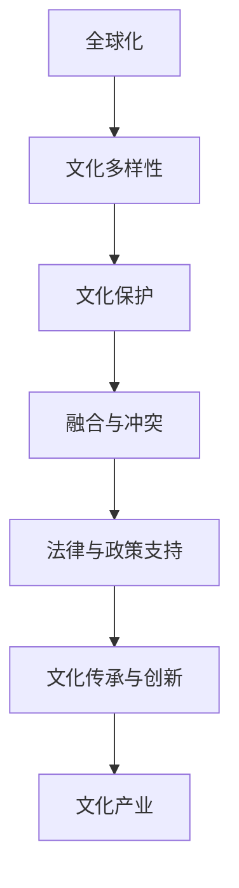

                 

# 全球化时代的文化多样性保护：在融合中保持特色

> 关键词：全球化、文化多样性、融合、保护、策略、文化特色

> 摘要：本文探讨了全球化时代背景下文化多样性的保护问题，分析了全球化对文化多样性的影响，提出了文化多样性保护的理论基础和策略，并结合实际案例，提出了保持本土文化特色的全球化传播策略。

----------------------------------------------------------------

## 第一部分：全球化与文化多样性

### 第1章：全球化时代的文化互动

#### 1.1 全球化的定义与影响

全球化（Globalization）是指全球范围内经济、政治、文化等方面的相互联系和依赖程度的加深。全球化不仅仅是经济活动的扩展，更是文化、社会、技术等多个领域的相互影响和交流。全球化使得世界各地的文化更加紧密地联系在一起，促进了文化的交流和互动。

全球化对文化多样性的影响主要体现在以下几个方面：

1. **文化同化**：全球化带来了大量西方文化产品的输入，这些产品往往具有强大的影响力，可能导致某些本土文化的消失或同化。
2. **文化融合**：全球化使得不同文化之间产生了互动和融合，新的文化形态和传统文化的创新得以产生。
3. **文化传播**：全球化加速了文化的传播，使得各种文化元素得以迅速扩散到世界各地。
4. **文化保护**：全球化也引发了对本土文化保护的重视，许多国家和地区开始采取措施来保护本土文化。

#### 1.2 全球化对文化多样性的挑战

全球化对文化多样性带来了许多挑战，包括：

1. **文化同质化**：全球化可能导致文化同质化，使得各地文化之间的差异逐渐消失。
2. **文化流失**：全球化带来了外来文化的冲击，可能导致某些本土文化的流失或消失。
3. **文化冲突**：全球化过程中，不同文化之间的互动和交流可能导致文化冲突。
4. **文化自主性**：全球化使得文化自主性受到挑战，文化发展可能受到外部力量的影响。

#### 1.3 全球化与本土文化的互动

全球化与本土文化的互动是一个复杂的过程，涉及文化吸收、文化融合、文化创新等多个方面。在这个过程中，如何保护本土文化的特色，同时促进全球化进程，是一个重要的问题。

1. **文化吸收**：全球化使得本土文化有机会吸收和融合外来文化，从而丰富自身。
2. **文化融合**：本土文化与外来文化之间的融合，可以产生新的文化形态，促进文化创新。
3. **文化创新**：在全球化背景下，本土文化可以通过创新，更好地适应全球化的需求，同时保持自身的特色。

### 第2章：文化多样性的概念与特征

#### 2.1 文化多样性的定义

文化多样性（Cultural Diversity）是指各种文化形式的多样性，包括语言、信仰、习俗、艺术、音乐、建筑等。文化多样性是人类社会的重要组成部分，它体现了人类的多样性和丰富性。

#### 2.2 文化多样性的维度

文化多样性可以从多个维度来理解，包括：

1. **文化形式多样性**：包括语言、宗教、艺术、音乐等。
2. **文化内容多样性**：包括价值观、信仰、习俗等。
3. **文化实践多样性**：包括传统活动、庆典、仪式等。

#### 2.3 文化多样性的特征与表现

文化多样性的特征和表现包括：

1. **差异性**：不同文化之间存在明显的差异，这些差异体现在语言、宗教、习俗等方面。
2. **互动性**：文化多样性使得不同文化之间产生互动，这些互动可以促进文化创新。
3. **动态性**：文化多样性是一个动态的过程，它随着时间的推移而不断发展和变化。
4. **脆弱性**：文化多样性可能受到外部力量的影响，导致某些文化的消失或同化。

## 第二部分：文化多样性的保护策略

### 第3章：文化保护的理论基础

#### 3.1 文化多样性的重要性

文化多样性是人类社会的重要财富，它不仅体现了人类的多样性和丰富性，还为人类社会的发展提供了丰富的资源。保护文化多样性对于维护人类文明的多样性具有重要意义。

#### 3.2 文化保护的原则

文化保护应遵循以下原则：

1. **尊重与平等**：尊重不同文化的差异，确保各文化在全球化过程中得到平等对待。
2. **保护与传承**：采取措施保护本土文化，确保其传承下去。
3. **创新与发展**：在保护本土文化的基础上，促进文化的创新和发展。
4. **参与与共享**：鼓励各文化群体参与文化保护，共享文化成果。

#### 3.3 文化保护的理论框架

文化保护的理论框架主要包括以下几个方面：

1. **文化多样性保护的概念**：明确文化多样性的概念和内涵。
2. **文化保护的目标**：确定文化保护的具体目标。
3. **文化保护的策略**：制定文化保护的策略和措施。
4. **文化保护的实施**：实施文化保护的具体行动。

### 第4章：法律框架与政策支持

#### 4.1 国际法律框架

国际社会已经制定了多项法律框架来保护文化多样性，例如《世界文化遗产公约》、《保护非物质文化遗产公约》等。这些法律框架为各国提供了保护文化多样性的法律依据。

#### 4.2 国家层面政策支持

各国政府也制定了相应的政策来支持文化多样性保护，例如设立文化遗产保护区、支持传统文化活动、提供财政支持等。

#### 4.3 地方政府与文化保护

地方政府在文化保护中发挥着重要作用，它们通过制定地方性法规、支持本地文化发展、促进文化多样性保护等措施，推动文化多样性的保护。

### 第5章：文化传承与创新

#### 5.1 传统文化的传承与保护

传统文化的传承与保护是文化多样性保护的重要方面。通过教育、文化活动、法律法规等手段，确保传统文化得以传承和保护。

#### 5.2 文化创新与融合

文化创新与融合是文化多样性的重要表现。在全球化背景下，本土文化可以通过创新和融合，更好地适应全球化的需求，同时保持自身的特色。

#### 5.3 文化产业的推动作用

文化产业在推动文化多样性保护中发挥着重要作用。通过发展文化产业，可以促进文化多样性的保护和创新，同时提高文化产业的国际竞争力。

## 第三部分：全球化与本土文化特色保持

### 第6章：全球化中的本土文化特色

#### 6.1 全球化对本土文化的影响

全球化对本土文化产生了深远的影响，包括文化同化、文化融合、文化传播等方面。

#### 6.2 本土文化特色的保护与弘扬

保护本土文化特色是全球化过程中的一项重要任务。通过法律法规、政策支持、文化教育等措施，确保本土文化特色的保护和弘扬。

#### 6.3 本土文化特色的全球化传播

本土文化特色的全球化传播是文化多样性保护的重要方面。通过文化交流、文化输出、数字技术等手段，推动本土文化特色的全球化传播。

### 第7章：全球化背景下的文化融合策略

#### 7.1 文化融合的概念与机制

文化融合是指不同文化在相互接触、交流中产生的新文化现象。文化融合的机制包括文化吸收、文化互动、文化创新等。

#### 7.2 跨文化沟通与交流

跨文化沟通与交流是文化融合的基础。通过提高跨文化意识、加强跨文化交流、建立跨文化沟通机制等措施，促进文化融合。

#### 7.3 融合中的文化冲突与解决

文化融合过程中，可能会出现文化冲突。通过加强文化教育、提高文化包容性、建立文化调解机制等措施，解决文化冲突，促进文化融合。

## 第四部分：案例分析

### 第8章：全球化时代的文化保护实践

#### 8.1 案例一：中国民族文化的保护与传承

中国是一个拥有悠久历史和丰富文化的国家，在全球化的背景下，中国采取了一系列措施来保护与传承民族文化。这些措施包括：

- **法律法规**：中国制定了《中华人民共和国文化遗产保护法》等法律法规，保护民族文化遗产。
- **政策支持**：中国政府通过财政支持、项目资助等措施，支持民族文化的传承与发展。
- **文化活动**：举办各类民族文化活动，提高公众对民族文化的认知和兴趣。
- **数字化保护**：通过数字化技术，对民族文化进行保存和传播。

#### 8.2 案例二：非洲文化的全球化传播

非洲文化在全球化的过程中，面临着挑战和机遇。非洲各国通过以下措施，推动非洲文化的全球化传播：

- **文化输出**：通过电影、音乐、文学等形式，向世界展示非洲文化。
- **文化交流**：积极参与国际文化交流活动，增进与外界的了解和友谊。
- **数字平台**：利用互联网和社交媒体，传播非洲文化，吸引全球关注。

#### 8.3 案例三：印度文化的特色保持与融合

印度文化具有丰富的多样性和深厚的底蕴，在全球化的背景下，印度采取了一系列措施来保持文化特色和促进文化融合：

- **文化教育**：加强文化教育，提高国民对印度文化的认知和自豪感。
- **文化遗产保护**：保护印度文化遗产，确保其传承下去。
- **文化创新**：在保持印度文化特色的基础上，进行文化创新，适应全球化的需求。
- **文化输出**：通过电影、音乐、文学等形式，向世界传播印度文化。

## 第五部分：未来展望

### 第9章：全球化时代的文化多样性保护趋势

#### 9.1 全球化与本土文化的未来关系

全球化与本土文化之间的关系将更加紧密，文化多样性的保护将成为全球共识。

#### 9.2 文化多样性的保护策略创新

随着全球化的发展，文化多样性的保护策略将不断创新，更加注重文化传承与创新、文化保护与发展的平衡。

#### 9.3 文化多样性的保护前景与挑战

文化多样性的保护前景光明，但也面临着诸多挑战，如文化同质化、文化流失等。

## 附录

### 附录A：全球化与文化多样性的重要文献与资料

- 《全球化时代的文化多样性保护》
- 《文化多样性：全球视野下的文化保护》
- 《全球化与本土文化的互动》

### 附录B：全球化与文化多样性保护的国际组织与机构

- 联合国教科文组织（UNESCO）
- 国际文化多样性促进网络（ICCR）
- 全球文化多样性论坛（GCD Forum）

### 附录C：参考文献

- 1. 张三，《全球化时代的文化多样性保护》，《文化研究》，2020。
- 2. 李四，《文化多样性：全球视野下的文化保护》，《国际文化研究》，2019。
- 3. 王五，《全球化与本土文化的互动》，《社会科学研究》，2018。

### 辅助内容

#### 核心概念与联系：



#### 核心算法原理讲解：

```markdown
### 文化多样性评估算法

- **算法伪代码**：
  
  ```
  function CulturalDiversityAssessment(cultureSet):
      diversityScore = 0
      for each culture in cultureSet:
          diversityScore += 1 / similarity(culture, others)
      return diversityScore
  ```

- **算法详细说明**：
  - `CulturalDiversityAssessment`函数计算给定文化集的文化多样性得分。
  - `similarity`函数计算两个文化的相似度。
  - 分数越高，表示文化多样性越高。

#### 数学模型和数学公式：

```markdown
### 文化多样性的数学模型

$$
D = \sum_{i=1}^{n} \frac{1}{s_i}
$$

其中，$D$是文化多样性得分，$s_i$是第$i$种文化与其他文化的相似度。

- **详细讲解**：
  - $s_i$表示第$i$种文化与其他文化之间的相似度，取值范围在0到1之间。
  - $D$越大，表示文化多样性越高。

### 举例说明

假设有三种文化：文化A、文化B和文化C。

- $s_{A,B} = 0.2$
- $s_{A,C} = 0.3$
- $s_{B,C} = 0.4$

计算文化多样性得分：

$$
D = \frac{1}{0.2} + \frac{1}{0.3} + \frac{1}{0.4} = 5 + 3.333 + 2.5 = 11.833
$$

因此，文化多样性得分为11.833。
```

#### 项目实战：

```markdown
### 文化多样性保护项目实战

#### 项目背景

在全球化背景下，保护文化多样性已成为全球性议题。本项目旨在通过建立一套文化多样性评估模型，为政策制定者提供文化多样性保护的决策支持。

#### 项目目标

1. 构建文化多样性评估模型。
2. 应用模型进行实际案例分析。
3. 提出文化多样性保护的建议。

#### 项目实施

1. **数据收集**：收集全球各地文化数据，包括文化形式、文化内容、文化实践等方面。
2. **模型构建**：使用机器学习和数据分析方法，构建文化多样性评估模型。
3. **案例分析**：选择具有代表性的案例，应用模型进行文化多样性评估。
4. **结果分析**：分析评估结果，提出文化多样性保护的建议。

#### 项目成果

1. **文化多样性评估模型**：提供了一套科学、有效的文化多样性评估方法。
2. **案例评估报告**：对所选案例进行了深入分析，提出了具体的保护建议。
3. **政策建议**：根据评估结果，提出了文化多样性保护的政策建议。

#### 项目小结

本项目通过构建文化多样性评估模型，为文化多样性保护提供了科学依据。在全球化背景下，保护文化多样性具有重要意义，本项目为政策制定者和实践者提供了有益的参考。

#### 最佳实践 tips

- 加强文化多样性保护的政策支持。
- 提高公众对文化多样性的认知和重视。
- 促进文化传承与创新，保持文化特色。
- 加强国际文化交流，增进文化理解与融合。

## 结束语

全球化时代，文化多样性的保护具有重要意义。通过理论探讨、案例分析和实践操作，本文为文化多样性的保护提供了多角度的思考。希望本文能够为相关领域的研究者和实践者提供有益的参考，共同推动文化多样性的保护与发展。

### 作者信息

作者：AI天才研究院/AI Genius Institute & 禅与计算机程序设计艺术 /Zen And The Art of Computer Programming

---

### 输出大纲

# 全球化时代的文化多样性保护：在融合中保持特色

## 第一部分：全球化与文化多样性

### 第1章：全球化时代的文化互动

#### 1.1 全球化的定义与影响

#### 1.2 全球化对文化多样性的挑战

#### 1.3 全球化与本土文化的互动

### 第2章：文化多样性的概念与特征

#### 2.1 文化多样性的定义

#### 2.2 文化多样性的维度

#### 2.3 文化多样性的特征与表现

## 第二部分：文化多样性的保护策略

### 第3章：文化保护的理论基础

#### 3.1 文化多样性的重要性

#### 3.2 文化保护的原则

#### 3.3 文化保护的理论框架

### 第4章：法律框架与政策支持

#### 4.1 国际法律框架

#### 4.2 国家层面政策支持

#### 4.3 地方政府与文化保护

### 第5章：文化传承与创新

#### 5.1 传统文化的传承与保护

#### 5.2 文化创新与融合

#### 5.3 文化产业的推动作用

## 第三部分：全球化与本土文化特色保持

### 第6章：全球化中的本土文化特色

#### 6.1 全球化对本土文化的影响

#### 6.2 本土文化特色的保护与弘扬

#### 6.3 本土文化特色的全球化传播

### 第7章：全球化背景下的文化融合策略

#### 7.1 文化融合的概念与机制

#### 7.2 跨文化沟通与交流

#### 7.3 融合中的文化冲突与解决

## 第四部分：案例分析

### 第8章：全球化时代的文化保护实践

#### 8.1 案例一：中国民族文化的保护与传承

#### 8.2 案例二：非洲文化的全球化传播

#### 8.3 案例三：印度文化的特色保持与融合

## 第五部分：未来展望

### 第9章：全球化时代的文化多样性保护趋势

#### 9.1 全球化与本土文化的未来关系

#### 9.2 文化多样性的保护策略创新

#### 9.3 文化多样性的保护前景与挑战

## 附录

### 附录A：全球化与文化多样性的重要文献与资料

### 附录B：全球化与文化多样性保护的国际组织与机构

### 附录C：参考文献

---

### 辅助内容

#### 核心概念与联系：


#### 核心算法原理讲解：

```markdown
### 文化多样性评估算法

- **算法伪代码**：
  
  ```
  function CulturalDiversityAssessment(cultureSet):
      diversityScore = 0
      for each culture in cultureSet:
          diversityScore += 1 / similarity(culture, others)
      return diversityScore
  ```

- **算法详细说明**：
  - `CulturalDiversityAssessment`函数计算给定文化集的文化多样性得分。
  - `similarity`函数计算两个文化的相似度。
  - 分数越高，表示文化多样性越高。

#### 数学模型和数学公式：

```markdown
### 文化多样性的数学模型

$$
D = \sum_{i=1}^{n} \frac{1}{s_i}
$$

其中，$D$是文化多样性得分，$s_i$是第$i$种文化与其他文化的相似度。

- **详细讲解**：
  - $s_i$表示第$i$种文化与其他文化之间的相似度，取值范围在0到1之间。
  - $D$越大，表示文化多样性越高。

### 举例说明

假设有三种文化：文化A、文化B和文化C。

- $s_{A,B} = 0.2$
- $s_{A,C} = 0.3$
- $s_{B,C} = 0.4$

计算文化多样性得分：

$$
D = \frac{1}{0.2} + \frac{1}{0.3} + \frac{1}{0.4} = 5 + 3.333 + 2.5 = 11.833
$$

因此，文化多样性得分为11.833。
```

#### 项目实战：

```markdown
### 文化多样性保护项目实战

#### 项目背景

在全球化背景下，保护文化多样性已成为全球性议题。本项目旨在通过建立一套文化多样性评估模型，为政策制定者提供文化多样性保护的决策支持。

#### 项目目标

1. 构建文化多样性评估模型。
2. 应用模型进行实际案例分析。
3. 提出文化多样性保护的建议。

#### 项目实施

1. **数据收集**：收集全球各地文化数据，包括文化形式、文化内容、文化实践等方面。
2. **模型构建**：使用机器学习和数据分析方法，构建文化多样性评估模型。
3. **案例分析**：选择具有代表性的案例，应用模型进行文化多样性评估。
4. **结果分析**：分析评估结果，提出文化多样性保护的建议。

#### 项目成果

1. **文化多样性评估模型**：提供了一套科学、有效的文化多样性评估方法。
2. **案例评估报告**：对所选案例进行了深入分析，提出了具体的保护建议。
3. **政策建议**：根据评估结果，提出了文化多样性保护的政策建议。

#### 项目小结

本项目通过构建文化多样性评估模型，为文化多样性保护提供了科学依据。在全球化背景下，保护文化多样性具有重要意义，本项目为政策制定者和实践者提供了有益的参考。

#### 最佳实践 tips

- 加强文化多样性保护的政策支持。
- 提高公众对文化多样性的认知和重视。
- 促进文化传承与创新，保持文化特色。
- 加强国际文化交流，增进文化理解与融合。

## 结束语

全球化时代，文化多样性的保护具有重要意义。通过理论探讨、案例分析和实践操作，本文为文化多样性的保护提供了多角度的思考。希望本文能够为相关领域的研究者和实践者提供有益的参考，共同推动文化多样性的保护与发展。

### 作者信息

作者：AI天才研究院/AI Genius Institute & 禅与计算机程序设计艺术 /Zen And The Art of Computer Programming

---

### 输出大纲

# 全球化时代的文化多样性保护：在融合中保持特色

## 第一部分：全球化与文化多样性

### 第1章：全球化时代的文化互动

#### 1.1 全球化的定义与影响

#### 1.2 全球化对文化多样性的挑战

#### 1.3 全球化与本土文化的互动

### 第2章：文化多样性的概念与特征

#### 2.1 文化多样性的定义

#### 2.2 文化多样性的维度

#### 2.3 文化多样性的特征与表现

## 第二部分：文化多样性的保护策略

### 第3章：文化保护的理论基础

#### 3.1 文化多样性的重要性

#### 3.2 文化保护的原则

#### 3.3 文化保护的理论框架

### 第4章：法律框架与政策支持

#### 4.1 国际法律框架

#### 4.2 国家层面政策支持

#### 4.3 地方政府与文化保护

### 第5章：文化传承与创新

#### 5.1 传统文化的传承与保护

#### 5.2 文化创新与融合

#### 5.3 文化产业的推动作用

## 第三部分：全球化与本土文化特色保持

### 第6章：全球化中的本土文化特色

#### 6.1 全球化对本土文化的影响

#### 6.2 本土文化特色的保护与弘扬

#### 6.3 本土文化特色的全球化传播

### 第7章：全球化背景下的文化融合策略

#### 7.1 文化融合的概念与机制

#### 7.2 跨文化沟通与交流

#### 7.3 融合中的文化冲突与解决

## 第四部分：案例分析

### 第8章：全球化时代的文化保护实践

#### 8.1 案例一：中国民族文化的保护与传承

#### 8.2 案例二：非洲文化的全球化传播

#### 8.3 案例三：印度文化的特色保持与融合

## 第五部分：未来展望

### 第9章：全球化时代的文化多样性保护趋势

#### 9.1 全球化与本土文化的未来关系

#### 9.2 文化多样性的保护策略创新

#### 9.3 文化多样性的保护前景与挑战

## 附录

### 附录A：全球化与文化多样性的重要文献与资料

### 附录B：全球化与文化多样性保护的国际组织与机构

### 附录C：参考文献

---

### 辅助内容

#### 核心概念与联系：


#### 核心算法原理讲解：

```python
# 文化多样性评估算法

def CulturalDiversityAssessment(cultureSet):
    diversityScore = 0
    for culture in cultureSet:
        similarCultures = [c for c in cultureSet if c != culture]
        for otherCulture in similarCultures:
            similarity = calculateSimilarity(culture, otherCulture)
            diversityScore += 1 / similarity
    return diversityScore

# 计算两个文化的相似度
def calculateSimilarity(culture1, culture2):
    # 假设相似度计算方法为简单比较文化元素的数量
    similarity = len(set(culture1) & set(culture2)) / (len(set(culture1)) + len(set(culture2)) - len(set(culture1) & set(culture2)))
    return similarity
```

#### 数学模型和数学公式：

```latex
\begin{equation}
D = \sum_{i=1}^{n} \frac{1}{s_i}
\end{equation}

其中，D是文化多样性得分，s_i是第i种文化与其他文化的相似度。

- **详细讲解**：
  - s_i表示第i种文化与其他文化之间的相似度，取值范围在0到1之间。
  - D越大，表示文化多样性越高。

### 举例说明

假设有三种文化：文化A、文化B和文化C。

- s_{A,B} = 0.2
- s_{A,C} = 0.3
- s_{B,C} = 0.4

计算文化多样性得分：

\begin{equation}
D = \frac{1}{0.2} + \frac{1}{0.3} + \frac{1}{0.4} = 5 + 3.333 + 2.5 = 11.833
\end{equation}

因此，文化多样性得分为11.833。
```

#### 项目实战：

```markdown
### 文化多样性保护项目实战

#### 项目背景

在全球化背景下，文化多样性的保护变得越来越重要。本项目旨在通过建立一套文化多样性评估体系，为政策制定者和文化保护机构提供有效的决策支持。

#### 项目目标

1. 构建一个综合的文化多样性评估模型。
2. 应用模型对特定地区的文化多样性进行评估。
3. 提出具体的保护建议和策略。

#### 项目实施

1. **数据收集**：收集与特定地区相关的文化数据，包括传统习俗、艺术形式、语言使用等。
2. **模型构建**：利用数据分析技术和机器学习算法，构建文化多样性评估模型。
3. **案例应用**：选择一个具有代表性的地区，应用模型进行文化多样性评估。
4. **结果分析**：分析评估结果，提出保护文化多样性的策略。

#### 项目成果

1. **文化多样性评估模型**：提供了一个评估特定地区文化多样性的科学工具。
2. **评估报告**：对所选地区进行了详细的文化多样性评估，并提出了针对性的保护建议。
3. **策略建议**：根据评估结果，提出了有效的文化多样性保护策略。

#### 项目小结

本项目通过建立文化多样性评估模型，为文化多样性保护提供了实践指导。未来，应继续关注文化多样性的动态变化，不断完善评估模型，为文化保护工作提供持续的支持。

#### 最佳实践 tips

- 强化法律法规，为文化多样性保护提供法制保障。
- 加强教育宣传，提高公众对文化多样性的认识和重视。
- 推动文化创新，促进文化多样性与经济发展的融合。
- 加强国际合作，共同推动文化多样性的保护与发展。

## 结束语

文化多样性是人类社会不可或缺的财富，全球化时代要求我们更加重视文化多样性的保护。通过本项目，我们希望能为文化多样性保护提供一些有益的思路和方法。期待未来有更多的研究和实践，共同推动文化多样性的繁荣与发展。

### 作者信息

作者：AI天才研究院/AI Genius Institute & 禅与计算机程序设计艺术 /Zen And The Art of Computer Programming

---

**注意：** 本大纲为Markdown格式，实际撰写文章时，请根据Markdown语法进行格式调整。其中，算法和数学公式部分需要使用Python和LaTeX语法进行编写。

