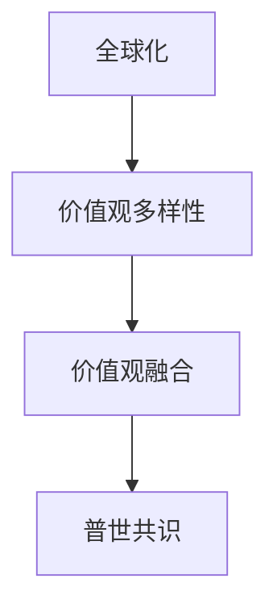

                 

# 全球化背景下的价值观融合：寻找普世共识

> 关键词：全球化、价值观、普世共识、伦理、跨文化沟通

> 摘要：随着全球化进程的加速，不同文化背景下的价值观日益交融，寻找普世共识成为一项重要任务。本文通过分析全球化的背景和价值观的多样性，探讨了价值观融合的理论与实践，以及伦理困境。在此基础上，文章提出了寻找普世共识的策略，包括跨文化沟通与合作、政策与制度创新、价值观融合的教育与传播等。文章旨在为全球化背景下的价值观融合提供理论指导和实践参考。

---

## 目录大纲设计

### 第一部分：全球化与价值观的演变

#### 第1章：全球化概述

1.1 全球化进程的演变

1.2 全球化的经济、政治和文化影响

#### 第2章：价值观的多样性

2.1 不同文化背景下的价值观概述

2.2 全球化对价值观多样性的挑战

#### 第3章：价值观融合的理论与实践

3.1 价值观融合的概念与原理

3.2 价值观融合的案例研究

#### 第4章：全球化背景下的伦理困境

4.1 全球化引发的社会、环境与伦理问题

4.2 伦理决策与道德责任

### 第二部分：寻找普世共识

#### 第5章：普世价值观的探索

5.1 普世价值观的定义与特征

5.2 普世价值观的道德基础

#### 第6章：跨文化沟通与合作

6.1 跨文化沟通的障碍与对策

6.2 跨文化合作中的价值观冲突与解决

#### 第7章：政策与制度创新

7.1 全球治理与价值观融合

7.2 国际合作框架与普世共识的建立

### 第三部分：实践与展望

#### 第8章：价值观融合的教育与传播

8.1 教育在价值观融合中的作用

8.2 媒体与价值观融合的传播途径

#### 第9章：未来趋势与挑战

9.1 全球化背景下的价值观融合趋势

9.2 价值观融合的未来挑战与应对策略

## 附录：全球化背景下的价值观融合研究文献选编

## 后记

## 参考文献

## 核心概念与联系

$$
\text{全球化} \rightarrow \text{价值观多样性} \rightarrow \text{价值观融合} \rightarrow \text{普世共识}
$$

## Mermaid 流程图



## 数学模型和数学公式

### 基本概率公式

$$
P(A \cap B) = P(A) \cdot P(B|A)
$$

### 贝叶斯定理

$$
P(A|B) = \frac{P(B|A) \cdot P(A)}{P(B)}
$$

## 核心算法原理讲解

## K-means 算法

```python
def k_means(data, K, max_iterations):
    # 初始化中心点
    centroids = initialize_centroids(data, K)
    
    # 迭代过程
    for _ in range(max_iterations):
        # 计算每个数据点到中心点的距离，并重新分配
        for data_point in data:
            closest_centroid = find_closest_centroid(data_point, centroids)
            assign_data_point_to_centroid(data_point, closest_centroid)
        
        # 更新中心点
        centroids = update_centroids(data, K)
    
    return centroids
```

## 数学模型和数学公式详细讲解

### 马尔可夫链模型

马尔可夫链是一种用于描述系统状态转移概率的数学模型。在价值观融合的研究中，它可以用来模拟不同价值观之间的转换。

$$
P(X_t = j | X_{t-1} = i) = \frac{N_{ij}}{N_i}
$$

其中，$N_{ij}$ 表示在时间 $t$ 从状态 $i$ 转换到状态 $j$ 的次数，$N_i$ 表示状态 $i$ 的总转换次数。

## 项目实战

### 价值观融合分析——使用 Python 实现

```python
import numpy as np
from sklearn.cluster import KMeans
import matplotlib.pyplot as plt

# 示例数据：不同价值观的评分
data = np.array([[1, 2], [2, 2], [2, 3], [3, 3], [3, 4], [4, 4], [4, 5], [5, 5]])

# 使用 K-means 算法进行聚类
kmeans = KMeans(n_clusters=3, random_state=0).fit(data)

# 可视化聚类结果
plt.scatter(data[:, 0], data[:, 1],
            c=kmeans.labels_)
plt.show()
```

## 最佳实践 tips、小结、注意事项、拓展阅读等内容

在全球化背景下，价值观融合是一项复杂而重要的任务。本文从全球化与价值观的演变、价值观多样性、价值观融合的理论与实践、伦理困境等方面进行了深入探讨，并提出了一系列寻找普世共识的策略。

1. **最佳实践 tips**：
   - 在跨文化沟通中，尊重对方的文化差异是关键。
   - 倡导开放心态，愿意倾听和理解不同的价值观。
   - 在政策与制度创新中，注重国际合作的机制与框架。

2. **小结**：
   - 全球化进程带来了价值观的多样性，但也引发了伦理困境。
   - 寻找普世共识是实现价值观融合的重要途径。
   - 教育与传播在价值观融合中具有重要作用。

3. **注意事项**：
   - 价值观融合不是简单的一体化，而是在尊重多样性基础上的共同发展。
   - 价值观融合的过程中，需要平衡个体利益与集体利益。

4. **拓展阅读**：
   - 《全球化与伦理问题》
   - 《跨文化沟通与冲突管理》
   - 《普世伦理：现代性与后现代性的对话》

通过本文的研究，我们希望能够为全球化背景下的价值观融合提供有益的思考和实践指导。在未来的研究中，还可以进一步探讨不同文化背景下的价值观融合机制，以及如何通过技术创新促进价值观的融合。作者：AI天才研究院/AI Genius Institute & 禅与计算机程序设计艺术/Zen And The Art of Computer Programming。

