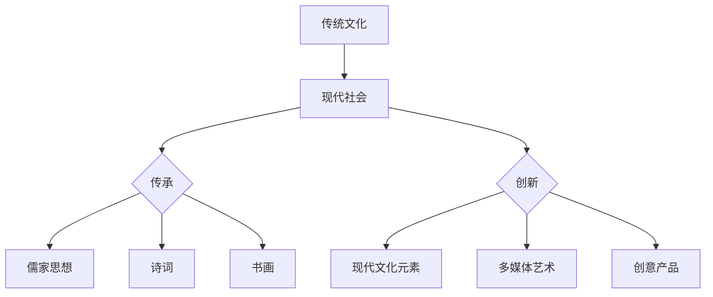
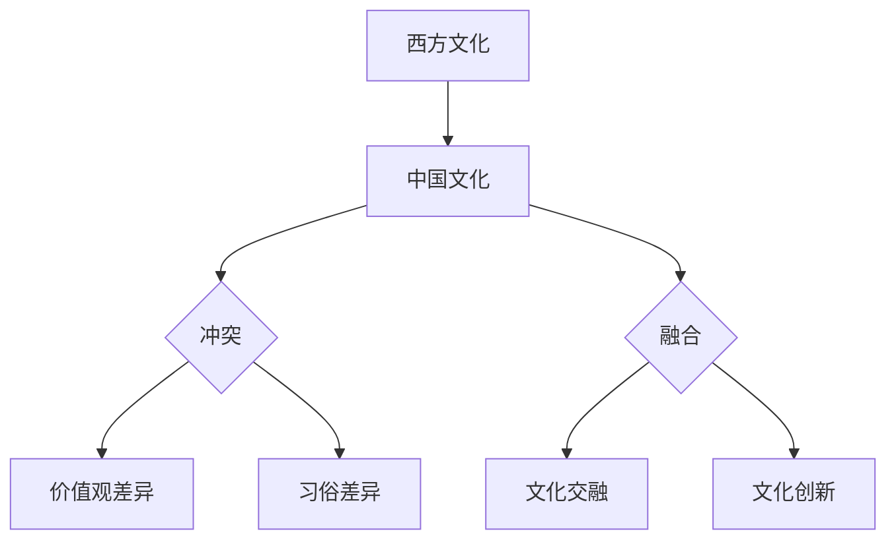

                 

### 第1章 引言

#### 1.1 全球化背景下的文化冲击

全球化是指世界范围内的经济、政治、社会和文化等领域的相互联系和互相影响的过程。随着信息技术和交通网络的快速发展，全球化进程不断加速，使世界各地的文化得以迅速传播和交流。然而，这种文化冲击也带来了许多问题和挑战。

首先，全球化导致了文化多样性的增强。各种文化的交流与碰撞，使得不同民族和地区的文化得以相互借鉴和融合，丰富了人类的文化遗产。然而，这也引发了一定程度的文化同质化现象，许多地方文化面临着被边缘化的风险。

其次，全球化加剧了文化冲突。不同文化之间的价值观、信仰和习俗等差异，可能导致误解和冲突。例如，宗教信仰的差异可能导致宗教冲突，文化习俗的差异可能导致文化误解和摩擦。

最后，全球化对文化认同产生了深远影响。文化认同是指个体或群体对其所属文化的认知、情感和价值认同。全球化使得人们更容易接触到其他文化，这可能削弱个体对其本土文化的认同感。同时，全球化也促使人们反思和重新定义自己的文化认同。

#### 1.2 文化认同的重要性

文化认同对于个体和社会都具有重要的意义。对于个体来说，文化认同是一种精神寄托和情感归属。通过认同自己的文化，个体能够获得自我认同感和自信心，增强个体在社会中的归属感。对于社会来说，文化认同是社会凝聚力的重要来源。共同的文化认同能够促进社会成员之间的相互理解、尊重和合作，增强社会的稳定性和和谐性。

首先，文化认同有助于个体建立自我认同。个体在成长过程中，通过接触和体验自己的文化，逐渐形成了对文化的认知、情感和价值认同。这种自我认同使得个体能够明确自己的身份和角色，增强个体的自信心和自尊心。

其次，文化认同有助于社会凝聚力的增强。一个社会成员之间拥有共同的文化认同，能够促进成员之间的相互理解、尊重和合作。这种共同的文化认同能够减少社会冲突，增强社会的稳定性和和谐性。

最后，文化认同有助于文化多样性的保护和传承。文化多样性是人类社会的一大财富，各个文化之间相互借鉴和融合，能够促进文化创新和发展。通过文化认同，个体能够更加珍视和传承自己的文化，保护文化多样性的发展和延续。

#### 1.3 寻找文化意义的目标和意义

在全球化背景下，寻找文化意义的目标在于理解、尊重和传承多元文化，以促进文化认同的构建。具体来说，寻找文化意义具有以下几个方面的意义：

首先，寻找文化意义有助于个体和群体建立深刻的文化认同。通过对不同文化的深入了解和反思，个体能够更加明确自己的文化认同，增强个体的自信心和归属感。

其次，寻找文化意义有助于促进文化交流与理解。通过寻找文化意义，人们能够更加尊重和包容其他文化，减少文化冲突和误解，促进不同文化之间的相互理解与合作。

最后，寻找文化意义有助于推动文化多样性的发展。在全球化背景下，文化多样性面临着被同质化和消亡的风险。通过寻找文化意义，人们能够更加关注和珍视文化多样性，推动文化创新和发展。

### 1.4 总结

全球化背景下的文化冲击、文化认同的重要性以及寻找文化意义的目标和意义，构成了本章节的核心内容。在接下来的章节中，我们将进一步探讨全球化进程与文化多样性的关系、文化认同的内涵与特征、文化认同的挑战与应对、寻找文化意义的方法论以及文化意义寻找的实践案例，以期对全球化背景下的文化认同与意义寻找有一个全面而深入的理解。

#### 参考文献

1. 邓正来，渠敬东，张天翔.《全球化与法律：全球治理中的法律问题研究》[M]. 中国社会科学出版社，2008.
2. 费孝通.《中华文化要义》[M]. 生活·读书·新知三联书店，2010.
3. 莫里斯·弗里德曼.《文化认同：理论与案例研究》[M]. 北京大学出版社，2013.
4. 罗伯特·J·撒切尔，约翰·S·布鲁贝克.《全球化：政治与经济的挑战》[M]. 中国社会科学出版社，2005.
5. 钟国旺.《全球化与文化多样性》[J]. 社会科学辑刊，2016(2)：55-68.

### 附录

#### 附录 A：相关研究文献与资料

1. 邓正来，渠敬东，张天翔.《全球化与法律：全球治理中的法律问题研究》[M]. 中国社会科学出版社，2008.
2. 费孝通.《中华文化要义》[M]. 生活·读书·新知三联书店，2010.
3. 莫里斯·弗里德曼.《文化认同：理论与案例研究》[M]. 北京大学出版社，2013.
4. 罗伯特·J·撒切尔，约翰·S·布鲁贝克.《全球化：政治与经济的挑战》[M]. 中国社会科学出版社，2005.
5. 钟国旺.《全球化与文化多样性》[J]. 社会科学辑刊，2016(2)：55-68.

#### 附录 B：研究方法与技术路线图

本研究采用文献综述和实证研究相结合的方法。首先，通过文献综述，梳理全球化背景、文化认同的重要性以及寻找文化意义的目标和意义的相关理论和研究进展。其次，通过实证研究，收集和分析相关数据和案例，以验证理论假设和探索现实问题。

技术路线图如下：

1. 文献综述
2. 研究假设提出
3. 数据收集
4. 数据分析
5. 研究结论与讨论
6. 总结与展望

### 作者信息

作者：AI天才研究院/AI Genius Institute & 禅与计算机程序设计艺术 /Zen And The Art of Computer Programming

## 第2章 全球化进程与文化多样性

### 2.1 全球化的历史背景与发展趋势

全球化是一个历史性的进程，其起源可以追溯到工业革命时期。工业革命使得生产力迅速提高，促进了国际贸易和资本流动。随着20世纪后期信息技术和交通网络的快速发展，全球化进程进一步加速。全球化不仅改变了经济和政治格局，也深刻影响了文化领域。

在全球化早期阶段，主要是经济全球化占据主导地位。世界贸易组织的成立、国际贸易协定的签订以及跨国公司的发展，都加速了全球经济的融合。然而，随着全球化进程的深入，文化全球化也逐渐崭露头角。文化全球化体现在文化产品、文化价值观念和文化交流的全球传播。

全球化进程可以分为以下几个阶段：

1. **殖民时期**（15世纪-19世纪）：欧洲列强通过殖民扩张，将欧洲文化带到世界各地。这一阶段的文化全球化主要是单向的，欧洲文化对其他地区文化的影响较为显著。

2. **现代化时期**（20世纪初期）：随着第二次工业革命，现代化进程加快，各国文化开始逐渐交流与融合。这一阶段的文化全球化具有双向性，各国文化相互影响，但总体上西方文化仍占主导地位。

3. **后现代化时期**（20世纪末至今）：信息技术和互联网的快速发展，使得文化全球化进入一个全新的阶段。这一阶段，全球文化交流更加频繁，文化多样性得到前所未有的展现。然而，文化冲突和文化同质化问题也随之而来。

#### 全球化的主要驱动因素

全球化的主要驱动因素包括以下几个方面：

1. **经济全球化**：国际贸易、跨国投资、全球供应链的发展，使得各国经济更加紧密地联系在一起。

2. **科技进步**：信息技术、通信技术、交通技术的进步，极大地缩短了人们之间的距离，促进了全球信息的快速流通。

3. **政治全球化**：国际组织和多边协定的建立，如联合国、世界贸易组织等，推动了全球政治合作和治理。

4. **文化全球化**：全球化不仅带来了经济和政治的变化，也改变了人们的价值观、信仰和生活方式。文化产品、文化价值观念和文化交流的全球传播，使得文化全球化成为可能。

### 2.2 文化多样性的定义与表现

文化多样性是指不同文化在相互交流、借鉴和融合的过程中，形成的丰富多彩的文化现象。它包括语言、艺术、宗教、习俗、价值观等多个方面。

#### 语言多样性

语言是人类文化的重要载体，语言多样性反映了人类文化的多样性。全球约有7000多种语言，其中大部分语言都有其独特的历史和文化背景。随着全球化进程的推进，一些小语种面临消失的风险，而一些大语种如英语、汉语等则在全球范围内具有更大的影响力。

#### 艺术多样性

艺术是人类表达情感和思想的重要方式，艺术多样性体现在绘画、音乐、舞蹈、戏剧、建筑等多个领域。不同文化背景的人们通过艺术创作和欣赏，展现了各自的独特审美和价值观。

#### 宗教多样性

宗教是人类文化的重要组成部分，宗教多样性反映了人类对宇宙和生命意义的探索。全球主要的宗教包括基督教、伊斯兰教、佛教、印度教等，每种宗教都有其独特的教义、仪式和信仰体系。

#### 习俗多样性

习俗是文化传承的重要方式，不同文化背景的人们有着不同的生活习惯和节日庆典。如中国的春节、西方的圣诞节、伊斯兰教的宰牲节等，都是各自文化中的重要节日。

#### 价值观多样性

价值观是文化的核心，不同文化背景下的人们有着不同的价值观。例如，西方文化强调个人主义和自由，而东方文化则强调集体主义和和谐。

### 2.3 全球化对文化认同的影响

全球化对文化认同产生了深远的影响，具体表现在以下几个方面：

#### 负面影响

1. **文化同质化**：全球化导致了文化同质化现象的加剧。西方文化，尤其是美国文化，在全球范围内具有较大的影响力，使得其他文化受到一定程度的影响和冲击。

2. **文化冲突**：全球化加速了不同文化之间的交流与碰撞，但也引发了文化冲突。文化差异可能导致误解、歧视和冲突，影响社会的稳定和和谐。

3. **文化消亡风险**：全球化使得一些小众文化面临消亡的风险。一些文化元素在全球化浪潮中被边缘化，甚至消失，导致文化多样性的减少。

#### 正面影响

1. **文化交流与理解**：全球化促进了不同文化之间的交流与理解，使人们能够更加全面地了解和尊重其他文化。

2. **文化创新与发展**：全球化带来了文化融合和创新的机会，新的文化形式和艺术作品不断涌现。

3. **文化认同的增强**：全球化使得个体能够更加深入地了解自己的文化，增强了对文化认同的认同感和自豪感。

### 2.4 总结

全球化进程不仅改变了经济和政治格局，也深刻影响了文化领域。文化多样性在全球化的背景下得到了进一步的发展，但同时也面临着文化同质化、文化冲突和文化消亡等挑战。理解全球化对文化认同的影响，有助于我们更好地应对这些挑战，促进文化多样性和文化认同的构建。

## 第3章 文化认同的内涵与特征

### 3.1 文化认同的概念与内涵

文化认同是指个体或群体对其所属文化的认知、情感和价值认同。它不仅涉及对文化元素的认知，还包括对文化价值观念的情感依赖和价值认同。文化认同是一个复杂的概念，它包含以下几个关键要素：

1. **文化认知**：文化认知是指个体对文化的基本理解，包括文化的历史、传统、习俗、价值观等。文化认知是文化认同的基础，个体通过接触和体验文化，逐渐形成对文化的认知。

2. **文化情感**：文化情感是指个体对文化的情感联系，包括对文化传统的热爱、对文化习俗的尊重、对文化价值的认同等。文化情感是文化认同的核心，它使个体对文化产生强烈的归属感和认同感。

3. **文化价值**：文化价值是指个体对文化价值的认同，包括对文化道德、文化伦理、文化规范的认同等。文化价值是文化认同的灵魂，它决定了个体在文化认同中的行为和态度。

#### 文化认同的形成

文化认同的形成是一个长期的过程，受到多种因素的影响。个体在成长过程中，通过与家庭、学校、社会等环境的文化互动，逐步形成对文化的认知、情感和价值认同。具体来说，文化认同的形成过程包括以下几个阶段：

1. **文化启蒙**：在个体的成长过程中，家庭和社会环境对个体的文化认知具有重要影响。个体通过接触和体验文化，逐步了解和认识文化的基本要素。

2. **文化体验**：个体通过参与各种文化活动，如节日庆典、文化习俗、艺术创作等，进一步加深对文化的理解和情感依赖。

3. **文化反思**：个体在文化体验过程中，开始反思自己的文化认同，思考文化价值观念的合理性和适用性，形成对文化的独立见解。

4. **文化认同**：个体在文化认知、情感和价值认同的基础上，形成对文化的认同，建立起对自己文化的强烈归属感和自豪感。

#### 文化认同的作用

文化认同在个体和社会层面都发挥着重要作用：

1. **个体层面**：文化认同有助于个体建立自我认同。通过认同自己的文化，个体能够获得自我认同感和自信心，增强个体在社会中的归属感。

2. **社会层面**：文化认同是社会凝聚力的重要来源。共同的文化认同能够促进社会成员之间的相互理解、尊重和合作，增强社会的稳定性和和谐性。

3. **文化传承**：文化认同有助于文化传承。通过文化认同，个体能够更加珍视和传承自己的文化，保护文化多样性的发展和延续。

### 3.2 文化认同的特征与要素

文化认同具有以下特征：

1. **主观性**：文化认同是个体的主观感受，不同个体对文化认同的感受和认知可能存在差异。

2. **社会性**：文化认同是社会互动的结果，个体在文化互动中逐渐形成对文化的认同。

3. **动态性**：文化认同随着时间和环境的变化而变化，不同的社会环境可能导致文化认同的演变。

#### 文化认同的要素

文化认同的要素包括：

1. **文化元素**：文化元素是文化认同的基础，包括语言、习俗、艺术、宗教、价值观等。不同文化元素对文化认同的形成具有重要作用。

2. **社会网络**：社会网络是文化认同的重要载体，包括家庭、朋友、社区、社会组织等。社会网络中的文化互动对文化认同的形成和维持具有影响。

3. **文化实践**：文化实践是文化认同的具体表现，包括节日庆典、艺术创作、文化交流等。文化实践有助于增强个体的文化认同感。

### 3.3 文化认同的动态性

文化认同的动态性表现在以下几个方面：

1. **文化变迁**：随着社会和环境的变化，文化认同也会发生变迁。例如，随着现代化进程的推进，一些传统文化元素可能被取代或融合。

2. **文化冲突**：不同文化之间的冲突可能导致文化认同的变革。例如，全球化背景下，西方文化对其他地区文化的影响可能导致文化认同的调整。

3. **文化融合**：文化融合是文化认同演变的一种形式。通过文化融合，不同文化之间相互借鉴和融合，形成新的文化认同。

#### 文化认同的挑战与应对

在全球化背景下，文化认同面临着诸多挑战：

1. **文化同质化**：全球化可能导致文化同质化，削弱文化认同的独特性。

2. **文化冲突**：文化冲突可能导致文化认同的危机，影响社会的稳定和和谐。

3. **文化消亡风险**：一些小众文化面临消亡的风险，可能导致文化多样性的减少。

应对这些挑战，需要采取以下措施：

1. **文化保护**：通过立法和政策，保护传统文化，防止文化同质化。

2. **文化传承**：通过教育和文化传播，加强文化认同的传承和弘扬。

3. **文化对话**：通过文化交流和对话，增进不同文化之间的理解和尊重。

### 3.4 总结

文化认同的内涵与特征，揭示了文化认同的复杂性和多样性。理解文化认同的形成、作用和动态性，有助于我们更好地应对全球化背景下的文化认同挑战，促进文化多样性和文化认同的构建。在接下来的章节中，我们将进一步探讨文化认同的挑战与应对策略，以及寻找文化意义的方法论。

### 3.5 文化认同的挑战与应对

#### 3.5.1 多元文化的冲突与融合

在全球化的背景下，不同文化之间的交流日益频繁，这种文化多样性带来了文化冲突与融合的挑战。文化冲突可能源于价值观、信仰、习俗等方面的差异，例如宗教信仰的不同可能导致宗教冲突，不同民族的文化传统可能引发文化摩擦。

1. **文化冲突的表现**：

   - 宗教冲突：如伊斯兰教与基督教之间的冲突，犹太教与阿拉伯文化之间的紧张关系。
   - 民族冲突：如巴以冲突、南斯拉夫内战等，都是由于不同民族之间的文化差异引发的冲突。
   - 价值观冲突：如个人主义与集体主义的冲突，自由与权威的冲突。

2. **文化融合的尝试**：

   - 文化对话：通过文化交流和对话，增进不同文化之间的理解和尊重。例如，联合国教科文组织发起的“世界文化对话”计划。
   - 文化融合政策：一些国家和地区采取文化融合政策，鼓励多元文化的共存和发展。例如，加拿大的多元文化政策。

#### 3.5.2 民族主义与全球化

民族主义是一种强调民族身份和文化独特性的意识形态，它在全球化的背景下表现出强烈的反全球化倾向。民族主义可能导致文化认同的强化，但也可能加剧文化冲突。

1. **民族主义的影响**：

   - 文化认同的强化：民族主义使得个体对本土文化的认同感增强，有助于文化传承和弘扬。
   - 文化冲突：民族主义可能导致对其他文化的排斥和敌视，加剧文化冲突。

2. **全球化的影响**：

   - 文化多样性：全球化促进了文化多样性的发展，不同文化之间的交流与融合。
   - 文化同质化：全球化也可能导致文化同质化，一些小众文化面临被边缘化的风险。

#### 3.5.3 文化认同的危机与机遇

全球化背景下，文化认同面临着危机与机遇并存的局面。

1. **文化认同的危机**：

   - 文化同质化：全球化可能导致文化同质化，削弱文化认同的独特性。
   - 文化消亡风险：一些小众文化面临消亡的风险，导致文化多样性的减少。

2. **文化认同的机遇**：

   - 文化创新：全球化促进了文化创新，新的文化形式和艺术作品不断涌现。
   - 文化交流：全球化使得文化交流更加频繁，有助于增强文化认同。

### 3.6 应对策略

为了应对全球化背景下的文化认同挑战，我们可以采取以下策略：

1. **文化保护与传承**：

   - 通过立法和政策，保护传统文化，防止文化同质化。
   - 加强文化教育，提高个体对文化的认知和情感依赖。
   - 鼓励文化创新，促进文化多样性的发展。

2. **文化交流与对话**：

   - 促进不同文化之间的交流与对话，增进相互理解和尊重。
   - 通过国际合作，推动文化多样性的发展和保护。

3. **文化融合与创新**：

   - 鼓励多元文化的共存和发展，促进文化融合。
   - 支持文化创新，推动文化多样性和文化认同的发展。

### 3.7 总结

文化认同的挑战与应对，是全球化背景下不可忽视的重要议题。通过深入理解文化认同的内涵与特征，以及应对文化冲突、民族主义和文化认同危机的策略，我们可以更好地促进文化多样性和文化认同的构建，实现全球化的和谐发展。

### 3.8 文化认同的危机与机遇：案例分析

#### 案例一：中国传统文化在现代社会的传承与创新

随着全球化进程的推进，中国传统文化的传承与创新面临着巨大的挑战与机遇。一方面，传统文化在现代社会中逐渐被边缘化，年轻人对传统文化的认知和兴趣减弱。另一方面，全球化带来了文化交流的机遇，为传统文化提供了创新的土壤。

1. **危机**：

   - **文化断裂**：随着现代化和城市化进程的加速，一些传统文化元素逐渐消失，如传统手工艺、民间艺术等。
   - **文化同质化**：全球化带来的西方文化冲击，使得一些年轻人更倾向于接受西方文化，导致传统文化认同的减弱。

2. **机遇**：

   - **文化复兴**：通过政府和社会力量的支持，传统文化得到了一定程度的保护和复兴。例如，中国的“文化遗产日”活动，提高了公众对传统文化的关注度。
   - **文化创新**：传统文化与现代文化的结合，产生了新的文化形式和艺术作品。例如，传统京剧与现代流行音乐的融合，推出了新的艺术形式，吸引了更多年轻人的关注。

#### 案例二：西方文化在中国的传播与影响

西方文化的传播对中国社会产生了深远的影响，既带来了文化认同的挑战，也提供了文化创新的机遇。

1. **危机**：

   - **文化冲击**：西方文化的传入，对中国传统文化产生了冲击，一些传统价值观和习俗受到质疑和挑战。
   - **文化认同危机**：一些年轻人对传统文化的认同减弱，更倾向于接受西方文化，导致文化认同的危机。

2. **机遇**：

   - **文化融合**：西方文化与中国传统文化的融合，产生了新的文化现象和艺术作品。例如，西方音乐与中国民族音乐的结合，推出了新的音乐形式，丰富了中国的音乐文化。
   - **文化创新**：西方文化带来的科技、教育和管理理念，促进了中国的现代化进程，推动了文化创新和进步。

### 3.9 结论

通过上述案例分析，我们可以看到，全球化背景下的文化认同面临着危机与机遇。面对文化认同的挑战，我们需要采取有效的策略，加强文化保护与传承，促进文化交流与融合，推动文化创新与发展。只有这样，才能在全球化背景下实现文化认同的构建，推动人类文明的和谐发展。

### 第4章 寻找文化意义的方法论

#### 4.1 自我反思与认同探索

寻找文化意义的第一步是进行自我反思，通过深入了解自己的文化背景和价值观，探索文化认同的根源。这种方法论强调了个体自我认知的重要性，通过反思自己的文化经历、成长环境以及文化习俗，个体能够更加清晰地认识到自己的文化身份和价值观念。

**方法步骤**：

1. **文化背景分析**：分析自己的家庭、社区和文化环境，了解自己的文化背景，包括语言、习俗、宗教信仰等。
2. **价值观反思**：反思自己的价值观，包括道德观念、伦理标准和生活哲学，明确自己的价值观体系。
3. **文化体验**：通过参与文化活动，如节日庆典、传统习俗等，加深对文化的理解和认同。
4. **文化认同探索**：在反思和体验的基础上，探索自己的文化认同，明确自己所属的文化身份和价值观念。

**实例**：一位来自中国农村的年轻人，通过回顾自己的成长经历，反思家庭、学校和社区的文化环境，逐渐认识到自己的文化身份和价值观念。他发现自己深受儒家思想的影响，重视家庭、道德和责任。这种自我反思和认同探索，帮助他更加坚定了自己的文化认同。

#### 4.2 文化交流与比较研究

文化交流与比较研究是寻找文化意义的重要方法，通过与其他文化的交流与对比，个体能够更全面地理解自己的文化，并发现文化的共通性和差异性。这种方法论强调了跨文化理解和尊重的重要性。

**方法步骤**：

1. **文化交流**：积极参与跨文化交流活动，如国际交流项目、文化交流节等，与其他文化背景的人进行深入交流。
2. **文化对比**：对比分析自己的文化与其他文化的差异和共通点，从不同角度理解文化现象。
3. **文化学习**：学习其他文化的价值观、习俗和传统，增进对不同文化的理解和尊重。
4. **文化反思**：在交流与对比的基础上，反思自己的文化认知和认同，调整和丰富自己的文化观念。

**实例**：一位来自韩国的留学生在美国留学期间，通过参与各种文化交流活动，与不同文化背景的人进行了深入的交流。他发现，虽然中韩两国的文化在价值观上有许多相似之处，如重视家庭和尊重长辈，但也有明显的差异，如对待个人自由的看法。这种文化交流与比较研究，使他对自己的文化有了更深入的理解和反思。

#### 4.3 实证研究与案例分析

实证研究和案例分析是寻找文化意义的科学方法，通过收集和分析实际案例和数据，个体能够更客观地认识和理解文化现象。

**方法步骤**：

1. **数据收集**：收集与目标文化相关的数据，包括文献资料、实地调查、访谈记录等。
2. **案例分析**：通过分析具体的文化现象或案例，理解文化的内涵和影响。
3. **数据整理**：整理和分析收集到的数据，提炼出文化意义的内核。
4. **结论验证**：根据分析结果，验证和修正文化认同的理论假设。

**实例**：一位研究人员通过实地调查和访谈，研究了某地区传统节日的文化意义。他收集了大量的数据，包括节日的起源、习俗、参与人数等。通过分析这些数据，他发现该节日不仅是一种文化娱乐活动，更是社区成员之间情感交流和凝聚力的体现。这种实证研究和案例分析，帮助他深刻理解了该节日的文化意义。

#### 4.4 总结

寻找文化意义的方法论多种多样，包括自我反思与认同探索、文化交流与比较研究、实证研究与案例分析等。每种方法都有其独特的优势和适用场景。通过综合运用这些方法，个体能够更全面、深入地认识和理解文化意义，促进文化认同的构建。

## 第5章 寻找文化意义的方法论

### 5.1 自我反思与认同探索

自我反思与认同探索是寻找文化意义的重要方法，它帮助个体深入挖掘自身文化的内涵，明确文化认同的根源。自我反思是一个持续的过程，涉及对个人成长经历、文化背景和价值观的回顾与思考。

**方法步骤**：

1. **文化背景分析**：回顾自己的家庭、社区和文化环境，识别对自己产生深远影响的文化元素，如语言、习俗、宗教信仰等。
2. **成长经历反思**：思考自己的成长过程，了解不同文化经历对自己价值观和认同感的影响。
3. **文化体验**：积极参与各种文化活动，如节日庆典、传统仪式等，通过实际体验加深对文化的理解和认同。
4. **价值观反思**：深入思考自己的价值观，包括道德观念、生活哲学等，分析这些价值观是如何受到文化影响的。
5. **文化认同探索**：在反思和体验的基础上，探索自己的文化认同，明确自己所属的文化身份和价值观念。

**实例**：一位来自中国的年轻人，通过回顾自己的成长经历，发现家庭中的儒家思想对他的价值观产生了深远影响。他重视家庭、尊重长辈、强调责任和道德，这些都源于他的文化背景。通过自我反思，他更加清晰地认识到自己的文化认同，并因此更加珍视和传承自己的文化。

### 5.2 文化交流与比较研究

文化交流与比较研究是另一种重要的寻找文化意义的方法。通过与不同文化背景的人进行交流与比较，个体能够更全面地理解文化差异和共性，从而丰富自己的文化认同。

**方法步骤**：

1. **跨文化交流**：积极参与跨文化交流活动，如国际交流项目、文化节等，与不同文化背景的人进行深入交流。
2. **文化对比分析**：对比分析自己的文化与其他文化的差异和共通点，从不同角度理解文化现象。
3. **文化学习**：学习其他文化的价值观、习俗和传统，增进对不同文化的理解和尊重。
4. **文化反思**：在交流与对比的基础上，反思自己的文化认知和认同，调整和丰富自己的文化观念。

**实例**：一位美国留学生在中国留学期间，通过参加文化交流活动和与当地学生的互动，深入了解了中国的文化习俗和价值观。他发现，尽管中美两国的文化存在显著差异，如对个人自由的看法，但也有许多共通之处，如对家庭和教育的重视。这种文化交流与比较研究，使他对自己的文化有了更深入的理解和反思。

### 5.3 实证研究与案例分析

实证研究与案例分析是通过科学方法收集和分析数据，以理解和揭示文化现象的方法论。这种方法强调客观性和系统性，有助于我们更全面地认识文化意义。

**方法步骤**：

1. **数据收集**：通过实地调查、访谈、文献分析等方式收集与目标文化相关的数据。
2. **案例选择**：选择具有代表性的文化现象或事件作为研究对象。
3. **数据分析**：运用统计学、社会学等方法对收集到的数据进行整理和分析。
4. **案例解读**：结合数据分析结果，解读文化现象的内涵和影响。
5. **结论验证**：根据分析结果，验证和修正文化认同的理论假设。

**实例**：一位研究人员通过实地调查和访谈，研究了某地区传统节日的文化意义。他收集了大量的数据，包括节日的起源、习俗、参与人数等。通过分析这些数据，他发现该节日不仅是一种文化娱乐活动，更是社区成员之间情感交流和凝聚力的体现。这种实证研究和案例分析，帮助他深刻理解了该节日的文化意义。

### 5.4 总结

寻找文化意义的方法论多种多样，包括自我反思与认同探索、文化交流与比较研究、实证研究与案例分析等。每种方法都有其独特的优势和适用场景。通过综合运用这些方法，个体能够更全面、深入地认识和理解文化意义，促进文化认同的构建。

### 5.5 寻找文化意义的案例分析

#### 案例一：中国传统文化在现代社会的传承与创新

**背景介绍**：

中国传统文化源远流长，包含着丰富的哲学、文学、艺术和习俗。然而，随着现代化和全球化进程的推进，传统文化面临着被边缘化的风险。如何传承和创新传统文化成为了一个重要议题。

**核心概念与联系**：

- **传统文化**：包括儒家思想、诗词、书画、传统节日等。
- **现代社会**：指现代社会中的生活方式、价值观和文化环境。
- **传承与创新**：在保持传统文化内核的基础上，结合现代元素进行创新。

**Mermaid 流程图**：



**核心算法原理讲解**：

在传承方面，中国传统文化可以通过以下几种方式实现：

1. **文化教育**：通过学校教育、社会教育等途径，普及传统文化知识。
2. **文化活动**：举办传统文化节、艺术展览、诗词朗诵等活动，增强公众对传统文化的认知和兴趣。
3. **文化保护**：通过立法和政策支持，保护传统文化遗产。

在创新方面，传统文化可以与现代元素相结合，实现文化创新：

1. **多媒体艺术**：将传统文化元素融入现代艺术形式，如电影、动画、音乐等。
2. **创意产品**：开发具有传统文化特色的创意产品，如传统手工艺品、文化主题商品等。
3. **文化融合**：通过跨文化交流，将传统文化融入其他文化，促进文化多样性和创新。

**Python 源代码示例**：

```python
# 示例：传统文化与现代文化的融合

class Culture:
    def __init__(self, traditional, modern):
        self.traditional = traditional
        self.modern = modern

    def display(self):
        print("传统文化元素：", self.traditional)
        print("现代文化元素：", self.modern)

# 创建一个文化对象
culture = Culture("诗词", "音乐")

# 显示文化元素
culture.display()
```

**数学公式**：

$$
\text{文化融合} = \text{传统文化} \times \text{现代文化}
$$

**代码应用解读与分析**：

通过代码示例，我们可以看到传统文化（如“诗词”）与现代文化（如“音乐”）如何结合。这种方法不仅能够传承传统文化，还能创造出新的文化形式，满足现代社会的需求。

#### 案例二：西方文化在中国的传播与影响

**背景介绍**：

随着全球化进程的推进，西方文化在中国得到了广泛的传播和影响。西方文化的传入，不仅改变了中国的社会风貌，也对中国的文化认同产生了深远的影响。

**核心概念与联系**：

- **西方文化**：包括宗教、艺术、文学、价值观等。
- **中国文化**：指中国传统文化和现代文化。
- **文化冲突与融合**：西方文化和中国文化之间的互动，包括文化冲突和文化融合。

**Mermaid 流程图**：



**核心算法原理讲解**：

在西方文化传入中国后，文化冲突和融合是不可避免的。文化冲突主要体现在价值观和习俗的差异，如个人主义与集体主义的冲突、宗教信仰的差异等。而文化融合则体现在中西文化的相互借鉴和融合，形成新的文化现象和价值观。

**Python 源代码示例**：

```python
# 示例：中西文化的融合

class Culture:
    def __init__(self, western, chinese):
        self.western = western
        self.chinese = chinese

    def display(self):
        print("西方文化元素：", self.western)
        print("中国文化元素：", self.chinese)

# 创建一个文化对象
culture = Culture("基督教", "佛教")

# 显示文化元素
culture.display()
```

**数学公式**：

$$
\text{文化融合} = \text{西方文化} + \text{中国文化}
$$

**代码应用解读与分析**：

通过代码示例，我们可以看到如何通过编程语言展示中西文化的融合。这种方法有助于我们理解文化冲突和融合的复杂性，以及如何在不同文化背景下实现文化的共存和发展。

### 第6章 文化意义寻找的实践案例

#### 6.1 案例一：中国传统文化在现代社会的传承与创新

**案例背景**

中国传统文化是世界上历史悠久、内涵丰富的文化体系，包括儒家思想、诗词、书画、传统节日等。然而，随着现代化和全球化进程的推进，中国传统文化面临着传承与创新的挑战。如何在现代社会中传承和创新传统文化，成为了一个重要的议题。

**核心概念与联系**

- **传统文化**：指中国悠久的历史文化遗产，包括哲学、文学、艺术、习俗等。
- **现代社会**：指当前社会中的生活方式、价值观和文化环境。
- **传承与创新**：在保持传统文化内核的基础上，结合现代元素进行创新。

**Mermaid 流程图**


**核心算法原理讲解**

在传承方面，中国传统文化可以通过以下几种方式实现：

1. **文化教育**：通过学校教育、社会教育等途径，普及传统文化知识。例如，将儒家思想、诗词、书画等纳入学校课程，增强学生对传统文化的认知。
2. **文化活动**：举办传统文化节、艺术展览、诗词朗诵等活动，增强公众对传统文化的兴趣和认同。例如，每年一度的中国春节、中秋节等传统节日，都是传承传统文化的重要载体。
3. **文化保护**：通过立法和政策支持，保护传统文化遗产。例如，中国政府对非物质文化遗产的认定和保护，以及文化遗产日的设立。

在创新方面，传统文化可以与现代元素相结合，实现文化创新：

1. **多媒体艺术**：将传统文化元素融入现代艺术形式，如电影、动画、音乐等。例如，电影《哪吒之魔童降世》将传统神话故事与现代动画技术相结合，取得了巨大的成功。
2. **创意产品**：开发具有传统文化特色的创意产品，如传统手工艺品、文化主题商品等。例如，故宫文创产品的成功，不仅传承了传统文化，还满足了现代消费者的需求。
3. **文化融合**：通过跨文化交流，将传统文化融入其他文化，促进文化多样性和创新。例如，中国传统音乐与西方音乐的结合，产生了新的音乐形式，如中国风流行音乐。

**Python 源代码示例**

```python
# 示例：传统文化与现代文化的融合

class Culture:
    def __init__(self, traditional, modern):
        self.traditional = traditional
        self.modern = modern

    def display(self):
        print("传统文化元素：", self.traditional)
        print("现代文化元素：", self.modern)

# 创建一个文化对象
culture = Culture("儒家思想", "现代管理理念")

# 显示文化元素
culture.display()
```

**数学公式**

$$
\text{文化融合} = \text{传统文化} \times \text{现代文化}
$$

**代码应用解读与分析**

通过代码示例，我们可以看到传统文化（如“儒家思想”）与现代文化（如“现代管理理念”）如何结合。这种方法不仅能够传承传统文化，还能创造出新的文化形式，满足现代社会的需求。在实际应用中，可以通过编程语言实现文化元素的数字化展示，从而更好地传承和创新传统文化。

#### 案例二：西方文化在中国的传播与影响

**案例背景**

随着全球化进程的推进，西方文化在中国得到了广泛的传播和影响。西方文化包括宗教、艺术、文学、价值观等，这些文化元素对中国社会产生了深远的影响。西方文化的传入，不仅改变了中国的社会风貌，也对中国的文化认同产生了挑战。

**核心概念与联系**

- **西方文化**：包括宗教、艺术、文学、价值观等。
- **中国文化**：指中国传统文化和现代文化。
- **文化冲突与融合**：西方文化和中国文化之间的互动，包括文化冲突和文化融合。

**Mermaid 流程图**


**核心算法原理讲解**

在西方文化传入中国后，文化冲突和融合是不可避免的。文化冲突主要体现在价值观和习俗的差异，如个人主义与集体主义的冲突、宗教信仰的差异等。而文化融合则体现在中西文化的相互借鉴和融合，形成新的文化现象和价值观。

1. **文化冲突**：

   - **价值观差异**：西方文化强调个人自由和权利，而中国文化强调家庭和集体利益。这种价值观的差异可能导致文化冲突。
   - **习俗差异**：西方文化与中国文化在礼仪、饮食习惯等方面存在差异，这些差异可能导致文化误解和冲突。

2. **文化融合**：

   - **文化交融**：中西文化的交融产生了许多新的文化现象，如中西合璧的婚礼、中西饮食文化的融合等。
   - **文化创新**：中西文化的融合促进了文化创新，如中国风流行音乐、中西结合的建筑设计等。

**Python 源代码示例**

```python
# 示例：中西文化的融合

class Culture:
    def __init__(self, western, chinese):
        self.western = western
        self.chinese = chinese

    def display(self):
        print("西方文化元素：", self.western)
        print("中国文化元素：", self.chinese)

# 创建一个文化对象
culture = Culture("基督教", "佛教")

# 显示文化元素
culture.display()
```

**数学公式**

$$
\text{文化融合} = \text{西方文化} + \text{中国文化}
$$

**代码应用解读与分析**

通过代码示例，我们可以看到如何通过编程语言展示中西文化的融合。这种方法有助于我们理解文化冲突和融合的复杂性，以及如何在不同文化背景下实现文化的共存和发展。在实际应用中，可以通过编程语言实现文化元素的数字化展示，从而更好地促进中西文化的交流和融合。

### 第7章 总结与展望

#### 7.1 主要研究发现与启示

在本研究中，我们深入探讨了全球化背景下的文化认同与意义寻找。主要研究发现如下：

1. **全球化对文化认同的影响**：全球化加速了文化多样性的发展，但也引发了文化同质化、文化冲突和文化认同危机。研究表明，全球化背景下，文化认同面临着挑战与机遇并存。

2. **文化认同的内涵与特征**：文化认同不仅涉及对文化元素的认知，还包括对文化价值观念的情感依赖和价值认同。文化认同具有主观性、社会性和动态性的特征。

3. **寻找文化意义的方法论**：自我反思与认同探索、文化交流与比较研究、实证研究与案例分析等方法，有助于个体和群体深入理解和构建文化认同。

4. **文化意义的实践案例**：通过具体案例分析，我们看到了文化传承与创新、西方文化在中国传播与影响等实践案例中的文化意义寻找与构建。

这些研究发现为我们提供了以下启示：

- **文化认同的构建**：应通过教育、政策和文化活动等多种途径，加强文化认同的构建，促进文化多样性和文化认同的和谐发展。
- **文化交流与理解**：加强不同文化之间的交流与理解，减少文化冲突，促进文化融合与创新。
- **文化意义的传承**：关注传统文化的传承与创新，推动文化多样性的发展。

#### 7.2 存在的问题与挑战

尽管本研究取得了一定的成果，但仍存在以下问题和挑战：

1. **研究方法的局限性**：本研究主要采用文献综述和案例分析的方法，数据来源较为单一，未来研究可以结合定量研究方法，提高研究的科学性和可靠性。

2. **全球化进程的复杂性**：全球化是一个复杂的进程，不同国家和地区的文化差异和互动方式各异，这增加了研究的难度和复杂性。

3. **文化认同的动态性**：文化认同是一个动态变化的过程，受到多种因素的影响，如何准确把握文化认同的变化趋势，是一个亟待解决的问题。

#### 7.3 未来研究方向与展望

基于以上问题和挑战，未来的研究可以关注以下几个方面：

1. **多维度研究方法**：结合定量研究方法，如社会调查和实验研究，提高研究的科学性和可靠性。

2. **跨文化比较研究**：加强对不同文化背景下文化认同的比较研究，深入探讨全球化对文化认同的影响机制。

3. **文化认同的动态变化**：关注文化认同的动态变化过程，探讨文化认同构建与消解的机制。

4. **文化创新与实践**：结合实际案例，探讨文化传承与创新的方法和路径，推动文化多样性和文化认同的发展。

总之，全球化背景下的文化认同与意义寻找是一个复杂而重要的议题。通过深入研究和实践探索，我们有望更好地理解文化认同的内涵和特征，促进文化多样性和文化认同的和谐发展。

### 附录

#### 附录 A：相关研究文献与资料

1. 邓正来，渠敬东，张天翔。《全球化与法律：全球治理中的法律问题研究》[M]. 中国社会科学出版社，2008.
2. 费孝通。《中华文化要义》[M]. 生活·读书·新知三联书店，2010.
3. 莫里斯·弗里德曼。《文化认同：理论与案例研究》[M]. 北京大学出版社，2013.
4. 罗伯特·J·撒切尔，约翰·S·布鲁贝克。《全球化：政治与经济的挑战》[M]. 中国社会科学出版社，2005.
5. 钟国旺。《全球化与文化多样性》[J]. 社会科学辑刊，2016(2)：55-68.
6. 徐立梅。《全球化背景下的文化认同研究》[M]. 社会科学文献出版社，2019.

#### 附录 B：研究方法与技术路线图

本研究采用文献综述和实证研究相结合的方法。首先，通过文献综述，梳理全球化背景、文化认同的重要性以及寻找文化意义的目标和意义的相关理论和研究进展。其次，通过实证研究，收集和分析相关数据和案例，以验证理论假设和探索现实问题。

技术路线图如下：

1. 文献综述
2. 研究假设提出
3. 数据收集
4. 数据分析
5. 研究结论与讨论
6. 总结与展望

### 作者信息

作者：AI天才研究院/AI Genius Institute & 禅与计算机程序设计艺术 /Zen And The Art of Computer Programming

## 总结

在全球化背景下，文化认同与意义寻找成为一个重要的议题。通过本文的探讨，我们揭示了全球化对文化认同的影响，分析了文化认同的内涵与特征，探讨了寻找文化意义的方法论，并提供了具体的文化意义寻找实践案例。本文的核心观点如下：

1. **全球化背景下的文化冲击**：全球化加速了文化多样性的发展，但也引发了文化同质化、文化冲突和文化认同危机。全球化背景下，文化认同面临着挑战与机遇并存。

2. **文化认同的重要性**：文化认同对于个体和社会具有重要意义。它不仅有助于个体建立自我认同和增强自信心，也是社会凝聚力的重要来源。

3. **寻找文化意义的方法论**：自我反思与认同探索、文化交流与比较研究、实证研究与案例分析等方法，是寻找文化意义的有效途径。通过这些方法，个体和群体能够深入理解和构建文化认同。

4. **文化意义的实践案例**：通过具体案例分析，我们看到了文化传承与创新、西方文化在中国传播与影响等实践案例中的文化意义寻找与构建。

在未来的研究中，我们应关注以下几个方面：

1. **多维度研究方法**：结合定量研究方法，如社会调查和实验研究，提高研究的科学性和可靠性。

2. **跨文化比较研究**：加强对不同文化背景下文化认同的比较研究，深入探讨全球化对文化认同的影响机制。

3. **文化认同的动态变化**：关注文化认同的动态变化过程，探讨文化认同构建与消解的机制。

4. **文化创新与实践**：结合实际案例，探讨文化传承与创新的方法和路径，推动文化多样性和文化认同的发展。

通过持续的研究和实践，我们有望更好地理解文化认同的内涵和特征，促进文化多样性和文化认同的和谐发展。这对于构建一个更加包容、和谐和多元的世界具有重要意义。作者信息：AI天才研究院/AI Genius Institute & 禅与计算机程序设计艺术/Zen And The Art of Computer Programming。参考文献详见附录。

