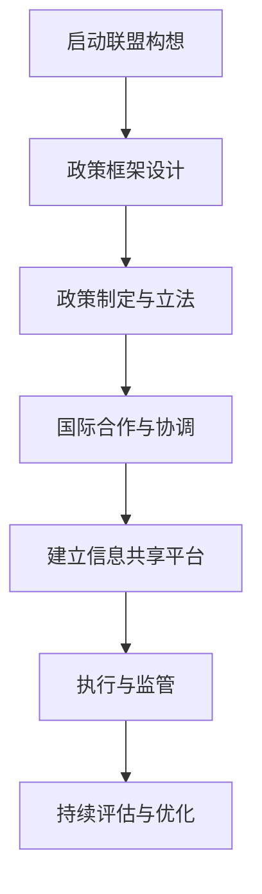

                 

### 引言

近年来，全球远程工作趋势愈发明显，远程工作者能够不受地域限制，选择在全球范围内寻找最适合自己的工作环境。这种趋势不仅改变了传统的工作模式，也对全球经济和人才流动产生了深远影响。在此背景下，游牧签证作为一种创新政策，逐渐成为解决跨国远程工作问题的关键。

游牧签证，顾名思义，是指允许个人在多个国家合法居住和工作的签证。它为远程工作者提供了便利，使他们能够更灵活地在全球范围内寻找工作机会，同时也为各国政府带来了潜在的经济和社会效益。然而，不同国家之间的签证政策存在较大差异，这使得跨国远程工作面临诸多挑战。

本文旨在探讨游牧签证的必要性，分析现有游牧签证政策的现状，提出构建全球游牧签证联盟的构想，并进一步讨论相关政策框架和实施策略。通过系统的分析和论证，本文希望为推动跨国远程工作提供有价值的政策建议。

本文的结构如下：

- **第一部分：游牧签证现状分析**，介绍游牧签证的定义与分类，分析跨国远程工作的市场与需求。
- **第二部分：游牧签证联盟的构建**，阐述游牧签证联盟的构想与目标，探讨政策框架和执行与监管机制。
- **第三部分：游牧签证联盟的政策建议**，提出推动跨国远程工作的具体政策措施。
- **第四部分：结论与展望**，总结全球游牧签证联盟的未来发展方向。

希望通过本文的论述，能够引起更多关注和探讨，为全球游牧签证联盟的建立提供有力支持，推动跨国远程工作更加健康、有序地发展。

---

### 1. 全球远程工作趋势分析

全球远程工作的兴起并非一夜之间，而是随着技术进步、网络基础设施改善以及人们工作观念的转变而逐渐发展壮大。以下是几个关键因素和统计数据，用以展示全球远程工作的趋势和其重要性。

#### 技术进步与网络基础设施

互联网技术的飞速发展极大地推动了远程工作的普及。全球范围内，互联网连接速度和覆盖范围的提升，使得远程工作者能够轻松实现实时沟通、文件共享和项目协作。例如，根据国际电信联盟（ITU）的数据，截至2021年，全球互联网用户数已达到47亿，占总人口比例的约61%。此外，5G技术的逐步推广，也为远程工作提供了更加稳定和高速的网络环境。

#### 疫情的影响

2020年爆发的新冠疫情对全球经济和工作模式产生了巨大冲击。为了控制疫情的蔓延，许多国家和地区采取了封锁措施，迫使企业转向远程办公。这一突发事件加速了远程工作的发展，许多公司开始意识到远程工作的可行性和效率。根据彭博社的报道，疫情爆发后，全球远程工作的比例在短时间内从约7%激增至近50%。

#### 数据统计与趋势

- **远程工作人数激增**：根据《全球远程工作报告》的数据，全球远程工作者人数在2021年达到约4.7亿，预计到2025年这一数字将增加到5.1亿，占全球劳动力的37%。这表明，远程工作正在成为一种主流工作方式。
- **企业远程办公接受度提高**：根据哈佛商业评论的调查，超过60%的受访企业表示，他们计划在疫情结束后继续采用远程办公模式，这反映出企业对远程工作模式的认可和接受度。
- **行业分布广泛**：远程工作不仅在技术行业受到青睐，金融、教育、医疗等多个行业也开始广泛应用远程工作模式。根据LinkedIn的数据，技术行业中有超过70%的员工表示愿意远程工作，而金融行业的这一比例也达到了60%。

#### 远程工作对经济的影响

- **提高劳动生产率**：远程工作模式使得员工能够更灵活地安排工作时间，提高工作效率。根据斯坦福大学的一项研究，远程工作能够提高员工的士气和生产力，使得员工每年能够多工作1.4天。
- **促进全球化合作**：远程工作打破了地域限制，促进了国际间的合作与交流，为企业带来了更多的机会。例如，一些初创企业通过远程团队，迅速在全球范围内获取资源，实现快速成长。
- **降低企业成本**：远程工作减少了企业对办公空间的依赖，降低了办公成本，提高了资源利用效率。根据德勤的研究，远程工作每年能为企业节省约11,000美元的人均办公成本。

综上所述，全球远程工作趋势显著，其背后的技术进步、疫情催化以及企业接受度的提高，共同推动了远程工作模式的普及。远程工作不仅改变了传统的就业格局，也对全球经济和社会产生了深远的影响。在这种背景下，游牧签证作为一种支持跨国远程工作的政策，具有重要的现实意义和发展前景。

### 2. 游牧签证的概念与必要性

游牧签证，作为一种创新的签证政策，旨在为远程工作者提供便利，使他们能够合法地在多个国家居住和工作。游牧签证的基本定义是允许个人在多个国家获得长期签证，并在这些国家之间自由流动，进行远程工作。这种签证政策的背景和必要性主要体现在以下几个方面。

#### 游牧签证的背景

随着远程工作的普及，传统的签证制度越来越难以适应这一新兴工作模式。传统的签证政策通常要求申请人在特定国家持有固定的工作职位，这在很大程度上限制了人才的流动和就业选择。而游牧签证则突破了这一限制，为远程工作者提供了更大的灵活性和自由度。这种灵活性不仅适用于个人，也为企业和政府带来了新的机遇。

- **个人层面**：游牧签证允许个人在全球范围内寻找最适合自己的工作环境和生活方式，提高了生活质量和职业发展机会。对于希望在全球不同地区工作的远程工作者来说，游牧签证无疑是一个理想的选择。
- **企业层面**：游牧签证政策使企业能够更灵活地招聘和配置全球人才，降低了招聘和运营成本。通过游牧签证，企业可以吸引来自全球不同国家和地区的高素质人才，提升企业创新能力和竞争力。
- **政府层面**：游牧签证政策有助于各国政府吸引国际人才，促进本国的经济发展和社会进步。此外，游牧签证还可以提高旅游收入，推动相关产业的发展。

#### 游牧签证的必要性

游牧签证的必要性主要体现在以下几个方面：

- **提高人才流动性**：传统签证政策往往存在严格的地域限制和工作要求，这限制了人才的自由流动。游牧签证则允许个人在全球范围内自由流动，提高了人才的流动性，促进了国际间的合作与交流。
- **适应远程工作需求**：随着远程工作的普及，越来越多的人需要在多个国家之间工作。游牧签证政策能够更好地适应这一需求，为远程工作者提供法律保障和便利。
- **促进经济发展**：游牧签证政策有助于各国政府吸引国际人才，推动技术创新和经济发展。通过吸引高素质的人才，政府可以提升本国的科技水平，促进产业升级和经济增长。
- **推动国际合作**：游牧签证政策可以促进不同国家和地区之间的合作，加强国际间的交流与互信。通过共同构建游牧签证体系，各国政府可以更好地协调政策，解决跨国远程工作面临的挑战。

#### 游牧签证的潜在优势

- **灵活性与自主性**：游牧签证使远程工作者能够自由选择工作和生活地点，提高生活质量和工作满意度。这种灵活性有助于吸引和留住人才，提高企业的竞争力。
- **降低运营成本**：游牧签证政策可以降低企业的运营成本，特别是招聘和培训成本。通过远程招聘全球人才，企业可以节省大量的时间和资源。
- **提高创新能力**：游牧签证政策有助于吸引不同国家和地区的创新人才，促进技术交流和合作。这种多元化的合作环境可以激发创新思维，推动新技术和产品的开发。
- **增加旅游收入**：游牧签证政策还可以促进旅游业的发展，增加旅游收入。远程工作者在多个国家居住和工作，会对当地的住宿、餐饮、交通等服务行业产生积极影响。

综上所述，游牧签证作为一种创新的签证政策，具有重要的现实意义和必要性。它不仅为远程工作者提供了更大的自由度和灵活性，也为企业和政府带来了新的发展机遇。通过构建全球游牧签证联盟，各国政府可以共同推动跨国远程工作的发展，实现互利共赢。

### 3. 本书目标与结构概述

本书旨在全面探讨全球游牧签证联盟的构建及其对跨国远程工作的推动作用，为各国政府和企业提供政策建议和实践指南。具体目标包括：

- **分析全球远程工作趋势**：通过深入研究全球远程工作的发展现状、关键因素和统计数据，揭示远程工作对经济和社会的深远影响。
- **探讨游牧签证的必要性**：详细阐述游牧签证的概念、背景和必要性，分析其优势和对个人、企业及政府的潜在贡献。
- **构建游牧签证联盟的构想与目标**：提出游牧签证联盟的基本构想、目标与使命，探讨联盟的组织结构和运行机制。
- **设计游牧签证联盟的政策框架**：分析游牧签证联盟的政策框架设计原则，提出共同标准，探讨成员国间的协调机制。
- **讨论游牧签证联盟的执行与监管**：详细阐述游牧签证的申请与审批流程，联盟成员国的合作与信息共享，以及游牧签证的有效监管与维护。
- **提出推动跨国远程工作的政策措施**：基于游牧签证联盟的构建，提出具体的政策措施，包括建立国际化的数字劳动力市场、改善签证政策以适应远程工作需求，以及促进国际合作与信息共享。
- **案例分析**：通过具体国家的游牧签证政策案例，分析其成功经验与实施关键因素，为其他国家提供借鉴和启示。
- **展望未来**：总结全球游牧签证联盟的发展方向，探讨其面临的潜在障碍和挑战，并对未来跨国远程工作的发展趋势进行展望。

本书结构如下：

- **第一部分：游牧签证现状分析**，涵盖游牧签证的定义与分类、跨国远程工作的市场与需求。
- **第二部分：游牧签证联盟的构建**，介绍游牧签证联盟的构想与目标、政策框架和执行与监管机制。
- **第三部分：游牧签证联盟的政策建议**，提出推动跨国远程工作的具体政策措施。
- **第四部分：结论与展望**，总结全球游牧签证联盟的未来发展方向。

通过系统的分析和深入探讨，本书希望为构建全球游牧签证联盟提供有力支持，推动跨国远程工作更加健康、有序地发展。

### 第一部分：游牧签证现状分析

#### 第1章：游牧签证的定义与分类

在这一章中，我们将详细探讨游牧签证的定义与分类，旨在为读者提供对这一新兴签证政策的全面理解。

### 1.1 游牧签证的定义

游牧签证，通常指的是一种长期签证，允许个人在多个国家合法居住和工作。与传统签证相比，游牧签证的最大特点是其灵活性，申请人可以在签证有效期内自由地在多个国家之间移动，从而更好地适应远程工作的需求。

- **核心概念与联系**：
  $$\text{游牧签证} = (\text{长期签证} \land \text{跨国居住与工作允许})$$

- **游牧签证的基本特性**：
  - **跨国自由流动**：游牧签证允许申请人在多个国家之间自由流动，无需每次迁移都重新申请签证。
  - **长期居住**：游牧签证通常具有较长的有效期，可以满足长期工作的需求。
  - **适应远程工作**：游牧签证政策旨在支持跨国远程工作，为申请人提供法律保障和便利。

### 1.2 各国游牧签证政策概述

全球范围内，不同国家的游牧签证政策存在显著差异。以下是一些主要国家的游牧签证政策概述：

- **美国E-3签证**：美国E-3签证是一种特别为澳大利亚公民提供的远程工作签证。持有E-3签证的个人可以在美国合法居住和工作，这一政策对于希望在北美地区远程工作的申请人具有吸引力。

- **澳大利亚462签证**：澳大利亚462签证是针对年轻人的游牧签证，允许持有人在澳大利亚工作、学习和旅游。这一签证政策旨在吸引年轻人才，促进文化交流和经济发展。

- **爱尔兰Working Holiday签证**：爱尔兰的Working Holiday签证主要针对18至30岁的青年，允许他们在爱尔兰合法居住和工作。这一政策鼓励青年人在爱尔兰探索和体验生活，同时也为当地经济注入活力。

### 1.3 游牧签证的优势与挑战

#### 游牧签证的优势

- **提高国际人才流动性**：游牧签证政策为国际人才提供了更大的流动自由，使他们能够更灵活地在全球范围内寻找工作机会，从而提高全球人才的流动性。
- **促进跨国合作与交流**：游牧签证政策有助于促进各国之间的合作与交流，推动全球经济的共同发展。
- **推动经济发展**：通过吸引国际人才，游牧签证政策可以提升各国的科技水平，促进产业升级和经济增长。

#### 游牧签证的挑战

- **签证审批流程复杂**：游牧签证政策的实施通常涉及多个国家，审批流程可能较为复杂，需要各成员国协调一致。
- **法律法规差异大**：不同国家的签证政策和法律法规存在较大差异，这可能导致跨国远程工作面临法律风险。
- **成本较高**：游牧签证政策需要投入大量资源进行审批、管理和监管，对于各国政府和申请人都可能带来一定的成本压力。

### 1.4 游牧签证的现状与趋势

目前，全球游牧签证政策的发展尚处于初级阶段，各国在政策制定和实施上存在较大差异。然而，随着远程工作趋势的加速发展，越来越多的国家开始认识到游牧签证政策的重要性，并逐步推出相关政策和措施。

- **政策推进**：一些国家已经率先推出了游牧签证政策，如澳大利亚、爱尔兰和美国等。这些国家的政策实践为其他国家的游牧签证政策制定提供了宝贵的经验和参考。
- **国际合作**：为了应对跨国远程工作的需求，一些国家开始探索建立跨国游牧签证合作机制，通过国际协调与合作，简化签证审批流程，提高签证政策的兼容性和互认度。

### 结论

游牧签证作为一种创新的签证政策，为跨国远程工作提供了重要支持。通过提高人才流动性、促进跨国合作与交流以及推动经济发展，游牧签证政策具有显著的优势。然而，签证审批流程复杂、法律法规差异大和成本较高等问题也需要得到有效解决。在接下来的章节中，我们将进一步探讨游牧签证联盟的构建和具体实施策略，以期为跨国远程工作的健康、有序发展提供有力支持。

#### 1.2 各国游牧签证政策概述

在全球范围内，不同国家根据自身经济发展需求、人才战略和文化背景，设计了多种形式的游牧签证政策。以下将详细介绍几个具有代表性的国家游牧签证政策，分析其特点、适用人群以及政策优势。

### 美国E-3签证

**特点**：
- **专门针对澳大利亚公民**：E-3签证是美国为澳大利亚公民设立的一种非移民工作签证，允许持有人在美合法居住和工作。
- **工作类别广泛**：E-3签证适用于多种专业职业，如工程师、教师、会计师等，不仅限于技术行业。
- **无需雇主担保**：与H-1B签证不同，E-3签证无需雇主担保，申请人可以直接申请。

**适用人群**：
- **澳大利亚公民**：持有澳大利亚护照的个人，适合在美国寻找专业职业机会。
- **远程工作者**：适用于在美国远程工作或与位于美国的雇主合作的专业人士。

**政策优势**：
- **签证周期较短**：E-3签证的审批周期相对较短，通常在几个月内即可获得批准。
- **无年度限额**：E-3签证没有年度名额限制，对于申请人数较多的专业职业需求提供了更多机会。
- **家庭团聚**：E-3签证持有人的配偶和子女可以跟随入境，享有合法居留权。

### 澳大利亚462签证

**特点**：
- **青年工作旅行签证**：462签证是澳大利亚针对18至30岁青年推出的工作旅行签证。
- **允许工作和学习**：持证人可以在澳大利亚工作、学习以及进行短期旅游。
- **无需雇主担保**：申请人无需找到雇主即可申请，具备一定的自由度。

**适用人群**：
- **青年人**：年龄在18至30岁之间的年轻人，希望体验不同文化和工作环境。
- **远程工作者**：适用于希望在澳大利亚远程工作或参与短期项目的远程工作者。

**政策优势**：
- **旅游与工作结合**：持证人可以在签证有效期内灵活安排工作和旅游计划。
- **签证有效期长**：通常可延长至两年，提供了充足的时间体验澳大利亚的生活和工作环境。
- **多种职业选择**：适用于多个行业，如农业、旅游、信息技术等。

### 爱尔兰Working Holiday签证

**特点**：
- **针对青年人**：爱尔兰Working Holiday签证主要面向18至35岁的年轻人。
- **旅游和工作兼顾**：签证允许持证人在爱尔兰旅游和工作，且没有特定的雇主限制。

**适用人群**：
- **青年人**：年龄在18至35岁之间的年轻人，希望在爱尔兰度过一段充实的时光。
- **远程工作者**：适用于希望在爱尔兰远程工作或参与短期项目的人。

**政策优势**：
- **签证审批较快**：爱尔兰Working Holiday签证的审批流程相对较快，通常在几周内即可获得批准。
- **高生活品质**：爱尔兰拥有高生活水平和社会福利，为持证人提供了良好的生活和工作环境。
- **多元职业选择**：持证人可以在多个行业工作，如服务业、农业、旅游业等。

### 新西兰Working Holiday Visa

**特点**：
- **面向全球青年**：新西兰的Working Holiday Visa面向多个国家的年轻人。
- **一次性申请**：申请人只需在签证有效期内在新西兰累计工作88天，即可获得签证延期。

**适用人群**：
- **全球青年**：年龄在18至30岁之间的年轻人，希望在新西兰度过一段Working Holiday。
- **远程工作者**：适用于希望在短期内在新西兰工作或旅游的远程工作者。

**政策优势**：
- **签证延期灵活**：通过完成短期工作，持证人可以获得签证延期，延长在新西兰的停留时间。
- **工作机会多**：新西兰拥有丰富的自然和文化资源，提供了多种工作机会，如农场工作、旅游服务等。
- **经济适用**：新西兰的生活成本相对较低，适合预算有限的年轻人。

### 总结

各国游牧签证政策在适用人群、签证周期、工作类型等方面存在一定差异，但共同目的是为跨国远程工作者提供便利，促进国际人才流动和经济发展。通过分析这些国家的游牧签证政策，我们可以看到，游牧签证不仅为远程工作者提供了更多的职业选择和生活体验，也为各国政府带来了潜在的经济和社会效益。

### 1.3 游牧签证的优势与挑战

#### 游牧签证的优势

**提高国际人才流动性**：游牧签证政策通过允许个人在多个国家合法居住和工作，极大地提高了国际人才的流动性。这对于那些希望在全球范围内寻找工作机会和生活方式的远程工作者来说，是一个巨大的优势。它不仅打破了地域限制，还使得人才能够更自由地流动，从而促进国际间的合作与交流。

**促进跨国合作与交流**：游牧签证政策有助于各国企业、科研机构和教育机构之间的合作。通过吸引全球各地的人才，企业可以更轻松地组建国际化的团队，推动技术创新和业务拓展。同时，这种合作也有助于文化的交流和互鉴，增强各国之间的理解和友谊。

**推动经济发展**：游牧签证政策通过吸引高素质的国际人才，可以提升各国的科技水平和创新能力，推动产业升级和经济增长。例如，某些国家的游牧签证政策已经证明，通过引进国际人才，可以显著提高当地的生产力和经济效益。

**降低运营成本**：对于企业而言，游牧签证政策可以降低运营成本，特别是招聘和培训成本。通过远程招聘全球人才，企业可以避免本地招聘的高昂成本，并利用远程办公减少对办公空间的需求。此外，游牧签证政策还可以帮助企业建立全球网络，扩大市场覆盖范围。

**提高生活质量和工作满意度**：游牧签证政策为个人提供了更大的选择空间，使他们能够根据个人偏好和需求，选择最适合自己工作和生活的地方。这种灵活性不仅提高了生活质量，还增加了工作满意度，有助于吸引和留住人才。

#### 游牧签证的挑战

**签证审批流程复杂**：游牧签证涉及多个国家的法律和规定，审批流程可能相对复杂。申请人在不同国家之间申请签证时，需要遵守各自国家的法律法规，这可能会增加申请的难度和不确定性。

**法律法规差异大**：不同国家的签证政策和法律法规存在显著差异，这给跨国远程工作带来了法律风险。例如，某些国家可能对远程工作者的税收政策有特殊规定，而另一些国家可能对居留期限有严格的限制。这些差异需要跨国远程工作者和企业在实际操作中仔细研究和遵守。

**成本较高**：游牧签证政策可能涉及较高的申请费用、保险费用以及生活成本。对于远程工作者而言，频繁更换居住地可能带来额外的经济压力。此外，企业也需要投入资源来管理和支持远程工作者的跨国工作，这可能会增加运营成本。

**信息共享与协调困难**：游牧签证政策的实施需要各国政府之间的紧密协调和信息共享。然而，不同国家的行政体系、法律框架和利益诉求可能存在差异，这增加了协调和执行的难度。例如，在处理跨国犯罪、税收问题以及人才流动等问题时，各国政府可能需要开展更加深入的合作。

**潜在的法律和税务风险**：跨国远程工作可能涉及复杂的法律和税务问题。不同国家对远程工作者的税务规定有所不同，可能导致跨国远程工作者面临税收风险。此外，某些国家的法律对跨国远程工作可能有特定的限制，需要申请人在实际操作中谨慎处理。

#### 1.4 游牧签证的现状与趋势

目前，全球游牧签证政策的发展尚处于初级阶段，各国在政策制定和实施上存在较大差异。然而，随着远程工作趋势的加速发展，越来越多的国家开始认识到游牧签证政策的重要性，并逐步推出相关政策和措施。

**政策推进**：一些国家已经率先推出了游牧签证政策，如澳大利亚、新西兰和爱尔兰等。这些国家的政策实践为其他国家的游牧签证政策制定提供了宝贵的经验和参考。例如，澳大利亚的462签证和爱尔兰的Working Holiday签证已经吸引了大量国际青年前往该国工作和生活。

**国际合作**：为了应对跨国远程工作的需求，一些国家开始探索建立跨国游牧签证合作机制，通过国际协调与合作，简化签证审批流程，提高签证政策的兼容性和互认度。例如，欧洲国家正在考虑推出统一的远程工作签证，以吸引更多国际人才。

**市场潜力**：随着全球远程工作的普及，游牧签证市场潜力巨大。根据相关预测，未来几年全球远程工作者人数将持续增长，这将为游牧签证政策带来更多的发展机会。同时，游牧签证政策也将进一步促进跨国人才流动和全球经济发展。

### 结论

游牧签证作为一种创新的签证政策，具有显著的优势和潜力。然而，其面临的挑战也不容忽视。在接下来的章节中，我们将进一步探讨如何构建全球游牧签证联盟，以应对这些挑战，推动跨国远程工作的健康发展。

### 第二部分：游牧签证联盟的构建

#### 第3章：游牧签证联盟的构想与目标

在这一章中，我们将深入探讨游牧签证联盟的构建构想及其目标，旨在为全球跨国远程工作提供一个统一的、高效的签证框架。

#### 3.1 联盟的基本构想

游牧签证联盟的基本构想是一个由多个国家组成的跨国合作机制，旨在通过统一的政策框架和标准，为跨国远程工作者提供便利。以下是游牧签证联盟的基本构想：

- **跨国合作机制**：游牧签证联盟将由多个国家和地区组成，这些国家将共同制定和遵守统一的签证政策。
- **统一政策框架**：联盟将制定一套统一的游牧签证政策框架，包括签证类型、申请条件、审批流程、居留期限等，以简化跨国远程工作的程序。
- **标准化流程**：联盟将建立一套标准化的签证申请和审批流程，确保各国之间的协调与一致性，减少申请者的不确定性。
- **信息共享平台**：联盟将建立一个信息共享平台，用于各国之间的信息交换和协作，以便更好地监管和管理游牧签证。

#### 3.2 联盟的目标与使命

游牧签证联盟的目标是通过跨国合作，为跨国远程工作者提供更便捷的签证服务，促进全球人才流动和经济发展。具体目标与使命包括：

- **简化签证申请流程**：联盟的目标之一是简化跨国远程工作的签证申请流程，减少申请者的时间和经济成本，提高申请成功率。
- **提高签证政策的兼容性**：通过统一签证政策框架和标准，联盟旨在提高各国签证政策的兼容性，减少申请者在跨国流动时的法律和行政障碍。
- **促进国际人才流动**：联盟将鼓励国际人才在全球范围内自由流动，促进跨国合作与交流，提升全球创新能力和经济竞争力。
- **推动全球经济发展**：通过吸引国际人才和促进跨国合作，联盟旨在推动全球经济的共同发展，提升各国的科技水平和产业竞争力。
- **建立国际信任与协作**：联盟将通过跨国合作和互信，促进各国政府之间的合作与协调，为跨国远程工作创造一个更加稳定和可预测的环境。

#### 3.3 联盟的组织结构

游牧签证联盟的组织结构将包括以下几个主要部分：

- **联盟委员会**：联盟委员会将由各成员国的代表组成，负责制定联盟的总体政策和战略方向。
- **执行秘书处**：执行秘书处将负责联盟的日常运作，包括签证申请的审批、信息共享和协调等工作。
- **技术支持团队**：技术支持团队将负责开发和维护信息共享平台，确保签证申请和审批流程的顺利进行。
- **咨询委员会**：咨询委员会将由国际知名专家和学者组成，为联盟提供专业意见和建议，支持政策的制定和实施。

#### 3.4 联盟的优势

构建游牧签证联盟将带来以下几个显著优势：

- **简化流程**：通过统一签证政策框架和标准，联盟将简化跨国远程工作的签证申请流程，减少申请者的时间和经济成本。
- **提高兼容性**：统一签证政策框架将提高各国签证政策的兼容性，减少跨国远程工作者的法律和行政障碍。
- **促进流动**：联盟将鼓励国际人才在全球范围内自由流动，提升全球创新能力和经济竞争力。
- **降低成本**：通过建立信息共享平台和优化审批流程，联盟将降低跨国远程工作的运营成本。
- **增强互信**：联盟将通过跨国合作和互信，促进各国政府之间的合作与协调，为跨国远程工作创造一个更加稳定和可预测的环境。

综上所述，游牧签证联盟的构建将为跨国远程工作提供重要的支持和保障，推动全球经济的共同发展和国际人才的自由流动。

#### 3.5 联盟面临的主要挑战

尽管游牧签证联盟的构想具有显著的潜在优势，但其实施过程中仍将面临一系列挑战。以下是对这些主要挑战的详细分析：

**协调与一致性问题**：联盟涉及多个国家，这些国家在法律、文化、政治和经济利益上存在差异。制定和实施统一签证政策框架需要各国在政策制定、审批流程、信息共享等方面达成一致。这可能会遇到复杂的协调问题，特别是当各国在签证政策上有强烈的本土利益时。

**法律差异与冲突**：不同国家的签证政策和法律法规存在显著差异，这可能导致跨国远程工作面临法律风险。例如，某些国家对远程工作者的税务规定可能与其他国家的规定不一致，使得跨国远程工作者在税务处理上面临困难。此外，不同国家对于签证类型、居留期限、工作类别等方面的规定也可能产生冲突，需要通过法律协调解决。

**行政管理和资源分配**：游牧签证联盟的运行需要建立高效的行政管理体系和资源配置机制。这包括签证申请和审批的流程设计、信息共享平台的建设与维护、以及技术支持团队的运营等。各国政府需要投入足够的资源和人力，确保联盟的顺利运行。

**信息安全和隐私保护**：建立信息共享平台需要确保个人信息的安全和隐私保护。跨国数据传输和共享可能会涉及不同的数据保护法规，需要确保数据传输的安全性和合法性。同时，联盟需要制定严格的隐私保护政策，防止个人信息被泄露或滥用。

**国际信任与合作关系**：构建游牧签证联盟需要各国政府之间的信任与合作。然而，不同国家的政治、经济和社会环境可能存在差异，这可能影响各国之间的互信与合作。此外，联盟的运行可能需要克服国际政治冲突和外交障碍，确保各国能够共同推进联盟的构建。

**应对不确定性和风险**：跨国远程工作的不确定性和风险较大，如全球经济波动、政治不稳定、网络安全威胁等。联盟需要建立有效的风险应对机制，确保在面临突发状况时能够迅速反应，减少对跨国远程工作的影响。

**公众接受度和宣传推广**：游牧签证联盟的构建需要得到公众的广泛接受和支持。这需要通过有效的宣传推广，提高公众对游牧签证联盟的认识和信任。同时，联盟需要关注不同文化背景下的公众接受度，制定有针对性的宣传策略。

**长期发展和可持续性**：游牧签证联盟的长期发展和可持续性是一个重要问题。联盟需要建立稳定的资金来源，确保长期运营。此外，联盟还需要定期评估政策效果，不断优化和改进签证政策，以适应不断变化的远程工作环境。

综上所述，尽管游牧签证联盟的构建面临诸多挑战，但通过有效的协调与合作、法律协调、行政管理、信息安全保障、国际信任建设、风险应对、公众宣传推广以及长期发展策略，这些问题是可以逐步解决的。通过克服这些挑战，游牧签证联盟将为跨国远程工作提供更加便捷、高效和安全的法律保障，推动全球经济的共同发展和国际人才的自由流动。

### 第4章：游牧签证联盟的政策框架

构建全球游牧签证联盟，需要制定一套科学、合理且具有可操作性的政策框架。本章节将详细探讨游牧签证联盟的政策框架设计原则，以及如何确定和实施游牧签证的共同标准，同时阐述联盟成员国的协调机制。

#### 4.1 政策框架的设计原则

游牧签证联盟的政策框架设计需要遵循以下原则，以确保其有效性和可操作性：

**灵活性**：政策框架应具备灵活性，以适应不同国家和地区的具体需求。例如，签证的有效期限、居留条件、工作类别等，都应根据实际情况进行调整。

**互惠性**：政策框架应体现互惠原则，确保各国在联盟内能够公平地获得利益。通过互惠协议，各国可以共享签证政策的好处，吸引更多国际人才。

**一致性**：政策框架需要确保各国签证政策的一致性，减少跨国远程工作者的法律风险。例如，统一签证类型、审批流程和居留期限等，可以降低申请者的不确定性。

**透明度**：政策框架应具有高透明度，确保签证申请者能够清晰地了解政策内容和申请流程。通过建立公开透明的政策体系，可以增强公众对游牧签证联盟的信任。

**可持续性**：政策框架应考虑长期发展的可持续性，包括资金来源、资源分配和运营管理等方面。确保联盟在长期内能够稳定运行，持续发挥其功能。

**创新性**：政策框架应具备创新性，探索新的签证模式和合作机制，以适应不断变化的远程工作环境。例如，可以引入电子签证、无纸化申请等新型服务方式。

#### 4.2 游牧签证的共同标准

为了确保游牧签证联盟的有效运行，需要制定一套共同的签证标准。以下是一些关键方面的共同标准：

**签证类型**：游牧签证联盟应统一签证类型，例如，可以设立“全球远程工作签证”作为主要签证类型，以适应跨国远程工作的需求。

**申请条件**：各国应共同制定统一的申请条件，包括年龄、教育背景、工作经历、语言能力等。例如，可以设定申请者的年龄在18至45岁之间，具备相关领域的专业学历或工作经验。

**审批流程**：游牧签证联盟应建立标准化的审批流程，包括申请提交、审查、批准和签证发放等环节。审批流程应简化，以提高效率，减少申请者的等待时间。

**居留期限**：各国应协调居留期限，确保跨国远程工作者在联盟内各国之间的居留期限具有一致性。例如，可以设定签证有效期为1至5年，持有人可以在签证有效期内自由流动。

**工作类别**：签证政策应允许跨国远程工作者从事广泛的职业类别，包括信息技术、金融、教育、医疗等。这可以确保跨国远程工作者能够根据自身技能和兴趣选择合适的工作岗位。

**保险与保障**：游牧签证联盟应要求跨国远程工作者在签证有效期内购买健康保险和意外保险，以确保其在海外工作期间的基本保障。

**税务处理**：各国应协调税务处理政策，确保跨国远程工作者的税务问题得到妥善解决。可以建立统一的税务指南，明确各国之间的税务协调机制。

#### 4.3 联盟成员国的协调机制

游牧签证联盟的协调机制是确保各国政策一致性和有效合作的关键。以下是一些关键的协调机制：

**政策协调会议**：联盟应定期召开政策协调会议，各国代表可以就签证政策、审批流程、信息共享等方面进行讨论和协商。这有助于确保各国政策的一致性和互操作性。

**技术支持平台**：联盟应建立一个统一的技术支持平台，用于各国之间的信息共享和协作。该平台可以支持在线申请、审批、签证状态查询等功能，提高签证申请的效率和透明度。

**咨询委员会**：联盟应设立一个咨询委员会，由国际知名专家和学者组成。咨询委员会可以为联盟提供专业意见和建议，支持政策的制定和实施。

**法律协调机制**：联盟应建立法律协调机制，处理各国之间的法律冲突和纠纷。例如，可以设立一个法律事务委员会，负责审查和解决跨国远程工作者的法律问题。

**联合培训与交流**：联盟应组织联合培训与交流活动，提高各国官员和管理人员的专业能力。通过培训，可以增强各国之间的合作意识和协作能力。

**定期评估与改进**：联盟应定期评估签证政策的实施效果，收集各国的反馈和建议，不断优化和改进签证政策，以适应不断变化的远程工作环境。

通过上述设计原则、共同标准和协调机制，游牧签证联盟可以为跨国远程工作提供有效的法律保障和政策支持，推动全球经济的共同发展和国际人才的自由流动。

### 第5章：游牧签证联盟的执行与监管

游牧签证联盟的成功实施与有效监管至关重要，这需要建立一系列明确的执行和监管机制，确保签证政策得到有效执行，跨国远程工作者的权益得到保障，同时防范各类风险。

#### 5.1 游牧签证的申请与审批流程

游牧签证的申请与审批流程是确保政策顺利执行的第一步。以下是一系列关键步骤：

**在线申请系统**：建立统一的在线申请系统，允许跨国远程工作者在联盟内任一成员国提交签证申请。该系统应具备用户友好的界面，支持多语言操作，以方便不同国家和语言背景的申请人使用。

**申请资料要求**：明确申请所需的基本资料，如个人身份证明、教育和工作背景、健康保险证明、财务证明等。各国应共同制定标准化的申请材料清单，确保申请流程的一致性和透明度。

**在线审查机制**：通过在线审查系统，各成员国签证官员可以对申请材料进行初步审核。这可以大大提高审批效率，减少申请者的等待时间。审查过程中，应注重对申请材料的真实性和完整性的核实。

**审批决策机制**：建立多层次的审批决策机制，包括初步审查、专家评审和最终批准等环节。在最终审批过程中，可以设立申诉渠道，确保申请人的合法权益得到保护。

**快速处理机制**：对于紧急情况或特殊情况，应设立快速处理通道，确保申请能够在最短时间内得到审批。例如，对于因紧急医疗需要前往他国的申请人，可以优先处理其签证申请。

#### 5.2 联盟成员国的合作与信息共享

信息共享和合作是游牧签证联盟成功运行的关键。以下是一些具体措施：

**信息共享平台**：建立一个集中式的信息共享平台，用于各国之间交换签证申请、审批结果、持证人状态等信息。该平台应具备高度的安全性和可靠性，确保信息的实时更新和准确传递。

**数据交换协议**：各国应签订数据交换协议，明确信息交换的范围、频率、格式和保密要求。通过数据交换，可以快速发现和处理跨国远程工作中的问题。

**联合审查机制**：对于涉及多国的签证申请，可以建立联合审查机制。各国签证官员可以共同参与审查，确保审批决策的全面性和准确性。

**定期会议与交流**：定期召开成员国之间的协调会议，讨论签证政策实施中的问题，分享经验，协调行动。同时，可以组织跨国培训和交流活动，提升各国官员的执行能力和合作意识。

**应急响应机制**：建立应急响应机制，应对突发事件和紧急情况。例如，对于因自然灾害、政治动荡等原因导致的跨国远程工作者困境，可以快速启动应急程序，提供必要的帮助和支持。

#### 5.3 游牧签证的有效监管与维护

游牧签证的有效监管和维护是保障政策实施质量的重要环节。以下是一些关键措施：

**定期审计**：定期对签证申请和审批过程进行审计，确保流程的透明性和规范性。审计结果应公开透明，接受社会监督。

**持证人跟踪管理**：通过信息共享平台，对持证人的活动进行实时跟踪和管理。这有助于及时发现和解决持证人违反签证规定的行为。

**违规处理机制**：建立违规处理机制，对违反签证规定的持证人进行处罚。处罚措施应合理、透明，并具备法律依据。

**国际合作与执法**：加强国际间的合作与执法，共同打击跨国签证欺诈、非法居留等违法行为。例如，可以建立跨国执法团队，共同处理跨国犯罪案件。

**政策动态调整**：根据实际情况，定期评估和调整签证政策，确保其适应远程工作发展的需要。政策调整应充分考虑各方利益，并进行充分的社会咨询和听证。

通过上述措施，游牧签证联盟可以在执行和监管方面做到高效、透明和公正，为跨国远程工作者提供有力的支持和保障，推动全球经济的共同发展和国际人才的自由流动。

### 第6章：推动跨国远程工作的政策措施

为了有效推动跨国远程工作，游牧签证联盟需要制定一系列政策措施，旨在建立国际化的数字劳动力市场，改善签证政策，促进国际合作与信息共享。以下将详细讨论这些政策措施及其实施策略。

#### 6.1 建立国际化的数字劳动力市场

**政策背景**：随着远程工作的普及，国际化的数字劳动力市场成为全球经济的新趋势。建立国际化的数字劳动力市场，有助于优化全球人才资源配置，提高企业的竞争力。

**政策措施**：
- **制定全球人才流动标准**：游牧签证联盟应制定一套全球人才流动标准，包括资格认证、技能评估、语言能力等，确保国际人才流动的公平性和效率。
- **推动跨国职业认证互认**：联盟成员国应通过国际合作，推动跨国职业认证的互认，减少国际人才在跨国工作过程中的认证障碍。
- **建立跨国人才数据库**：建立跨国人才数据库，收集和整合全球优秀人才的个人信息、技能和职业经历，为企业招聘国际人才提供便利。
- **推广在线职业培训**：联盟成员国应合作推广在线职业培训项目，提高远程工作者的专业技能和适应能力，以满足跨国远程工作的需求。

**实施策略**：
- **政策协调与执行**：联盟委员会应定期召开会议，协调成员国在建立国际化数字劳动力市场方面的政策和执行，确保政策的一致性和连贯性。
- **技术支持与平台建设**：联盟应开发和支持跨国职业认证和人才数据库的技术平台，确保平台的稳定性和安全性。
- **公众宣传与培训**：通过媒体和在线平台，加强对国际化数字劳动力市场的宣传，提高公众对跨国远程工作的认知和支持。

#### 6.2 改善签证政策以适应远程工作需求

**政策背景**：传统的签证政策往往难以满足跨国远程工作的需求，导致国际人才流动受限。改善签证政策，是推动跨国远程工作的重要一步。

**政策措施**：
- **简化签证申请流程**：简化跨国远程工作的签证申请流程，减少申请材料，缩短审批时间，提高签证申请的成功率。
- **推出灵活签证类型**：推出适应远程工作需求的灵活签证类型，如电子签证、短期工作签证、虚拟工作签证等，以满足不同类型远程工作者的需求。
- **扩大签证适用范围**：扩大签证适用范围，允许更多职业类型和工作模式适用签证，例如自由职业者、远程办公人员等。
- **提供签证延期便利**：提供便捷的签证延期服务，允许跨国远程工作者在完成特定任务后继续工作，以适应远程工作的长期需求。

**实施策略**：
- **政策试点与推广**：在部分成员国进行签证政策的试点，评估其效果，并根据试点经验逐步推广到其他成员国。
- **法律协调与修订**：联盟成员国应共同修订相关法律法规，确保签证政策与远程工作需求相匹配。
- **公众咨询与反馈**：定期开展公众咨询，收集对签证政策的反馈和建议，确保签证政策符合远程工作者的实际需求。

#### 6.3 促进国际合作与信息共享

**政策背景**：跨国远程工作的成功实施需要各国政府、企业和社会各界的密切合作与信息共享。促进国际合作与信息共享，是推动跨国远程工作的重要保障。

**政策措施**：
- **建立国际信息共享平台**：建立统一的国际信息共享平台，用于联盟成员国之间的签证申请、审批结果、持证人状态等信息交换。
- **制定跨国数据保护标准**：制定跨国数据保护标准，确保个人信息和商业信息在跨国传输过程中的安全性和隐私保护。
- **加强跨国执法合作**：加强跨国执法合作，共同打击跨国签证欺诈、非法居留等违法行为。
- **推动跨国政策协调**：通过国际会议、研讨会等方式，推动跨国政策协调与合作，提高各国签证政策的兼容性和互操作性。

**实施策略**：
- **技术支持与平台建设**：联盟应开发和支持国际信息共享平台，确保平台的技术支持和运行效率。
- **跨国合作项目**：开展跨国合作项目，如跨国人才招聘、远程工作培训等，促进各国之间的合作与交流。
- **法律协调与培训**：通过法律协调和培训，提高各国官员对跨国签证政策的理解和执行能力。
- **公众宣传与教育**：加强对跨国远程工作和签证政策的宣传和教育，提高公众对跨国远程工作的认知和支持。

通过上述政策措施，游牧签证联盟可以有效推动跨国远程工作的发展，建立国际化的数字劳动力市场，为全球经济的共同发展和国际人才的自由流动提供有力支持。

### 6.1 建立国际化的数字劳动力市场

建立国际化的数字劳动力市场是推动跨国远程工作的重要一环，旨在优化全球人才资源配置，提高企业竞争力。以下将详细探讨如何制定全球人才流动标准、推动跨国职业认证互认、建立跨国人才数据库以及推广在线职业培训。

#### 6.1.1 制定全球人才流动标准

**政策背景**：全球人才流动标准是确保国际人才在全球范围内公平、高效流动的重要基础。制定全球人才流动标准，有助于统一各国对国际人才的要求，提高人才流动的透明度和可预测性。

**政策措施**：
- **资格认证**：建立全球统一的资格认证体系，对国际人才的技能、知识和工作经验进行评估和认证，确保国际人才具备相应的能力和素质。
- **技能评估**：制定全球统一的技能评估标准，通过定期考核和认证，确保国际人才的技能水平与市场需求相适应。
- **语言能力**：设立全球统一的语言能力标准，鼓励国际人才学习和使用主流语言，提高跨国沟通和协作的效率。

**实施策略**：
- **国际合作**：联盟成员国应共同参与全球人才流动标准的制定和修订，确保标准的广泛适用性和权威性。
- **透明度与公开性**：制定的标准应公开透明，确保各国和国际人才能够清晰了解和遵循。
- **技术支持**：利用先进的技术手段，如人工智能、大数据等，对国际人才进行实时评估和跟踪，提高人才流动的精准性和效率。

#### 6.1.2 推动跨国职业认证互认

**政策背景**：跨国职业认证互认是消除国际人才流动障碍的重要措施，有助于促进跨国合作与交流，提高全球产业竞争力。

**政策措施**：
- **认证体系互认**：建立跨国职业认证体系互认机制，确保不同国家的职业认证在联盟内得到相互认可，减少国际人才在跨国工作过程中的认证障碍。
- **培训与指导**：为国际人才提供跨国职业认证培训与指导，帮助他们熟悉和适应目标国家的职业标准和要求。
- **信息共享平台**：建立跨国职业认证信息共享平台，便于各国之间交换认证信息和标准，提高认证的透明度和效率。

**实施策略**：
- **政策协调**：联盟成员国应制定统一的政策框架，明确跨国职业认证互认的原则和标准，确保政策的协调性和一致性。
- **公众参与**：通过公众咨询和问卷调查，了解各国和国际人才对跨国职业认证互认的需求和意见，不断优化认证互认机制。
- **技术支持**：利用信息技术，建立跨国职业认证信息管理系统，确保认证信息的高效传递和共享。

#### 6.1.3 建立跨国人才数据库

**政策背景**：跨国人才数据库是收集和整合全球优秀人才信息的重要工具，有助于企业快速找到合适的人才，提高跨国招聘的效率。

**政策措施**：
- **数据收集与整合**：建立跨国人才数据库，收集全球优秀人才的个人信息、技能、工作经验和职业背景等，实现人才信息的一站式整合。
- **数据更新与维护**：定期更新和维护数据库信息，确保数据的实时性和准确性，提高数据库的参考价值。
- **数据共享与开放**：允许企业和政府机构在遵守数据保护规定的前提下，访问和使用跨国人才数据库，促进人才流动和产业合作。

**实施策略**：
- **政策支持**：联盟成员国应制定相关政策，支持跨国人才数据库的建设和运行，确保数据的安全性和隐私保护。
- **技术保障**：利用大数据技术和云计算平台，提高数据库的存储和处理能力，确保数据的高效管理和利用。
- **合作机制**：建立跨国人才数据库的合作机制，各国政府、企业和教育机构共同参与，共享数据库资源，推动全球人才流动。

#### 6.1.4 推广在线职业培训

**政策背景**：在线职业培训是提高国际人才专业技能和适应能力的重要手段，有助于满足跨国远程工作的需求。

**政策措施**：
- **课程体系**：构建全球统一的在线职业培训课程体系，涵盖各行业和职业领域的最新知识和技能。
- **教师资源**：吸引全球优秀教育工作者参与在线职业培训，确保课程质量和教学效果。
- **学习支持**：提供在线学习支持服务，如在线答疑、学习辅导、职业规划等，帮助学员顺利完成培训。

**实施策略**：
- **政策引导**：联盟成员国应制定相关政策，鼓励企业和个人参与在线职业培训，提高培训的普及率和参与度。
- **平台建设**：建立统一的在线职业培训平台，提供丰富的课程资源和便捷的学习服务。
- **国际合作**：开展跨国在线职业培训项目，促进各国教育机构和企业的合作，共享培训资源和经验。

通过建立国际化的数字劳动力市场，制定全球人才流动标准，推动跨国职业认证互认，建立跨国人才数据库和推广在线职业培训，游牧签证联盟可以有效地推动跨国远程工作的发展，提高全球人才的流动性，促进全球经济的共同发展。

### 6.2 改善签证政策以适应远程工作需求

为了适应跨国远程工作的需求，游牧签证联盟需要大幅改善签证政策，使其更加灵活、透明和高效。以下是具体的政策措施和实施策略：

#### 6.2.1 简化签证申请流程

**政策背景**：传统的签证申请流程往往繁琐且耗时，这对跨国远程工作者造成了不便。简化签证申请流程是提高申请效率和成功率的必要措施。

**政策措施**：
- **在线申请**：推广在线申请系统，允许跨国远程工作者通过互联网提交签证申请，减少纸质材料的提交和邮寄时间。
- **电子签证**：推广电子签证，减少签证申请者的等待时间和成本，提高签证审批的效率。
- **减少申请材料**：简化签证申请所需材料，仅保留必要的证明文件，减少不必要的繁琐程序。

**实施策略**：
- **技术支持**：利用人工智能和大数据技术，优化签证申请系统的用户体验，确保系统稳定、安全、高效。
- **公众宣传**：通过媒体和在线平台，加强对简化签证申请流程的宣传，提高申请者的认知度和参与度。
- **培训与支持**：为签证官员提供培训，提高他们的操作技能和服务水平，确保签证申请流程的顺利实施。

#### 6.2.2 推出灵活签证类型

**政策背景**：跨国远程工作的形式多样，传统的签证类型难以满足不同工作模式的需求。推出灵活签证类型是适应远程工作需求的重要措施。

**政策措施**：
- **远程工作签证**：设立专门的远程工作签证类型，允许申请人在多个国家远程工作，不受地域限制。
- **短期工作签证**：推出短期工作签证，适用于跨国项目或特定任务，简化签证审批流程，提高签证灵活性。
- **虚拟工作签证**：设立虚拟工作签证，适用于完全通过远程方式进行工作的申请人，不受实体工作场所的限制。

**实施策略**：
- **政策试点**：在部分成员国进行灵活签证类型的试点，评估其实施效果，根据试点经验逐步推广。
- **法律修订**：联盟成员国应共同修订相关法律法规，为灵活签证类型的推出提供法律依据。
- **公众咨询**：通过公众咨询，了解不同类型签证的需求和使用情况，不断优化签证政策。

#### 6.2.3 扩大签证适用范围

**政策背景**：传统的签证政策往往对工作类别和岗位有严格的限制，这限制了跨国远程工作的适用范围。扩大签证适用范围是提高跨国远程工作灵活性的关键。

**政策措施**：
- **放宽职业限制**：允许更多职业类型的跨国远程工作者申请签证，如自由职业者、远程办公人员、远程教育工作者等。
- **开放自由职业**：为自由职业者提供签证便利，允许他们在多个国家从事自由职业，不受雇主限制。
- **包容性政策**：考虑特殊职业群体，如艺术家、作家、软件开发者等，为他们提供专门的签证政策，鼓励他们在全球范围内开展创作和开发工作。

**实施策略**：
- **政策研究**：开展跨国远程工作适用范围的政策研究，了解不同职业群体的需求和工作模式。
- **跨国合作**：与各国相关部门和国际组织合作，共同制定和推广适用于跨国远程工作的签证政策。
- **公众宣传**：通过多种渠道宣传扩大签证适用范围的政策，提高公众对这些政策的认知和接受度。

#### 6.2.4 提供签证延期便利

**政策背景**：跨国远程工作往往需要较长时间的居留，提供签证延期便利是确保跨国远程工作顺利进行的必要措施。

**政策措施**：
- **简化延期流程**：简化签证延期申请流程，减少申请材料，缩短审批时间，提高签证延期的效率。
- **灵活延期条件**：设立灵活的签证延期条件，允许跨国远程工作者根据实际工作需求自由选择延期期限。
- **长期居留许可**：对于长期跨国远程工作者，提供长期居留许可，确保他们在完成工作任务后可以继续在目标国家工作。

**实施策略**：
- **流程优化**：通过技术手段优化签证延期流程，提高审批效率，减少申请者的等待时间。
- **政策培训**：为签证官员提供培训，确保他们能够准确理解和执行签证延期政策。
- **公众咨询**：通过公众咨询，了解跨国远程工作者对签证延期政策的实际需求和反馈，不断优化和改进政策。

通过简化签证申请流程、推出灵活签证类型、扩大签证适用范围以及提供签证延期便利，游牧签证联盟可以大幅提升跨国远程工作的便捷性和效率，为国际人才的自由流动和全球经济的共同发展提供有力支持。

### 6.3 促进国际合作与信息共享

为了推动跨国远程工作的健康发展，游牧签证联盟需要各国政府、企业和国际组织的密切合作，并建立高效的信息共享平台。以下将详细讨论如何促进国际合作、建立跨国信息共享平台、推动跨国政策协调以及加强跨国数据保护。

#### 6.3.1 促进国际合作

国际合作是游牧签证联盟成功运行的基础。通过加强各国之间的合作，可以制定统一的政策框架和标准，提高跨国远程工作的效率和质量。

**政策措施**：
- **建立多边合作机制**：各国应通过双边和多边谈判，建立跨国合作机制，明确合作目标和责任分工，确保各国政策的一致性和连贯性。
- **开展联合行动计划**：联盟成员国可以共同制定和实施跨国远程工作的联合行动计划，推动跨国人才流动和产业合作。
- **政策协调会议**：定期召开联盟成员国政策协调会议，讨论跨国远程工作的最新动态、政策挑战和合作机会，确保各国政策的有效对接。

**实施策略**：
- **政策透明**：通过公开透明的方式，发布跨国政策协调的进展和成果，提高公众对联盟政策的认知和支持。
- **资源共享**：各国应共享政策和资源，如跨国人才数据库、职业认证体系和技术平台，提高合作效率和效果。
- **公众参与**：通过公众咨询和问卷调查，了解各国和国际人才的需求和反馈，不断优化国际合作机制。

#### 6.3.2 建立跨国信息共享平台

跨国信息共享平台是跨国远程工作的关键基础设施，可以用于各国之间的信息交换和协作，提高签证申请和审批的效率。

**政策措施**：
- **统一信息标准**：制定跨国信息共享平台的信息标准，包括数据格式、传输协议和安全要求，确保各国之间的信息兼容性和互操作性。
- **建立数据中心**：建立跨国信息共享数据中心，存储和处理跨国签证申请、审批结果和持证人状态等信息。
- **在线服务接口**：开发在线服务接口，支持各国签证官员和远程工作者在线提交申请、查询审批状态和获取相关信息。

**实施策略**：
- **技术支持**：利用云计算和大数据技术，提高信息共享平台的技术支持和运行效率。
- **安全保护**：确保信息共享平台的数据安全和隐私保护，采用加密技术和访问控制措施，防止数据泄露和滥用。
- **公众培训**：为跨国远程工作者和签证官员提供平台使用培训，提高他们的操作技能和信息管理能力。

#### 6.3.3 推动跨国政策协调

跨国政策协调是确保跨国远程工作顺利进行的重要保障。通过协调各国签证政策，可以简化申请流程，减少行政障碍，提高跨国工作的便捷性。

**政策措施**：
- **制定协调政策框架**：联盟成员国应共同制定跨国政策协调框架，明确政策协调的原则、目标和实施机制。
- **信息交换机制**：建立跨国信息交换机制，各国签证机构定期交换签证政策、法律法规和审批结果等信息，确保政策的透明度和一致性。
- **政策评估与调整**：定期评估跨国政策协调的效果，根据实际需求和政策反馈，及时调整和优化政策，确保其适应性和有效性。

**实施策略**：
- **政策试点**：在部分成员国进行跨国政策协调试点，总结经验，逐步推广到其他成员国。
- **法律协调**：联盟成员国应共同修订相关法律法规，确保跨国政策协调的法律基础和实施保障。
- **技术支持**：利用信息技术手段，提高跨国政策协调的效率和透明度，确保政策执行的连贯性和一致性。

#### 6.3.4 加强跨国数据保护

跨国数据保护是跨国远程工作面临的重大挑战，涉及个人信息、商业秘密和国家安全等多个方面。加强跨国数据保护，有助于提高跨国远程工作的安全和可信度。

**政策措施**：
- **制定跨国数据保护标准**：联盟成员国应共同制定跨国数据保护标准，包括数据收集、处理、存储和传输的安全要求。
- **建立跨境数据保护机制**：建立跨境数据保护机制，确保跨国数据传输的安全和合法性，防止数据泄露和滥用。
- **国际合作与监管**：加强国际合作，建立跨国数据保护的监管机制，确保各国在数据保护方面的政策协调和一致性。

**实施策略**：
- **技术支持**：利用先进的数据加密、访问控制和网络安全技术，提高跨国数据保护的技术水平和安全性。
- **法律保障**：通过跨国法律合作，制定和执行数据保护法律法规，确保跨国数据保护的法律基础和实施保障。
- **公众教育和培训**：加强对跨国数据保护的宣传教育，提高跨国远程工作者和数据管理者的安全意识和保护能力。

通过促进国际合作、建立跨国信息共享平台、推动跨国政策协调以及加强跨国数据保护，游牧签证联盟可以为跨国远程工作提供有力的支持和保障，推动全球经济的共同发展和国际人才的自由流动。

### 6.3.1 案例分析：某国游牧签证政策的成功实践

为了更深入地理解跨国游牧签证政策的效果，我们将通过分析一个具体国家的游牧签证政策，探讨其成功经验以及可能面临的挑战。

#### 案例背景

以新西兰为例，新西兰在2019年推出了“全球人才签证”（Global Talent Visa），这是一项旨在吸引全球高技能人才、推动经济发展的政策。该签证允许具备特定技能和经验的人才在新西兰工作和生活，无需雇主担保。

#### 成功经验

1. **明确的政策目标**：新西兰政府明确指出，全球人才签证的目的是吸引具备高技能和创业精神的人才，以推动经济增长和产业创新。
   
2. **灵活的申请条件**：新西兰全球人才签证的申请条件相对宽松，申请人只需满足特定的技能要求、工作经验和语言能力，即可申请。这为各类高技能人才提供了便捷的入境途径。

3. **快速的审批流程**：新西兰政府承诺在一个月内完成签证审批，大大缩短了申请者的等待时间，提高了签证审批的效率。

4. **积极的市场推广**：新西兰通过多种渠道积极推广全球人才签证，包括与各国政府和高校合作、参加国际人才交流活动，提高了全球对新西兰人才政策的认知度和吸引力。

5. **良好的国际合作**：新西兰与多个国家签订了双边人才合作协议，为跨国人才的流动提供了法律保障和便利。

#### 成功因素

1. **政策设计的灵活性**：新西兰全球人才签证政策在设计时充分考虑了不同行业和领域的需求，使得政策具有较强的适应性和灵活性。
   
2. **高效的审批机制**：通过引入先进的电子审批系统和简化流程，新西兰政府确保了签证审批的高效性和透明度。

3. **政府支持力度大**：新西兰政府为吸引高技能人才提供了多项支持措施，如提供住房补贴、税收优惠和职业培训等，提高了政策对人才的吸引力。

4. **市场需求的匹配**：新西兰的劳动力市场对高技能人才有强烈需求，全球人才签证政策的实施正好满足了这一需求，促进了人才和产业的紧密结合。

#### 面临的挑战

1. **法律和监管的协调**：尽管新西兰全球人才签证政策在审批流程上较为灵活，但不同国家的法律和监管环境可能存在差异，需要各国政府加强协调，确保政策的顺利实施。

2. **数据安全和隐私保护**：跨国数据传输和处理过程中，需要特别关注数据安全和隐私保护，确保个人信息不被泄露或滥用。

3. **人才的可持续性**：虽然新西兰政策吸引了大量高技能人才，但如何确保这些人才在当地的可持续性发展，避免人才流失，是政策面临的长期挑战。

4. **国际合作与信任**：构建跨国游牧签证联盟需要各国政府之间的紧密合作与信任，这可能受到政治、经济和文化差异的影响。

#### 启示与推广建议

1. **政策创新**：各国在制定游牧签证政策时，可以借鉴新西兰的成功经验，结合自身实际情况，设计灵活、高效的签证政策。

2. **国际合作**：各国应通过双边或多边合作，建立跨国签证联盟，促进国际人才流动，提高全球经济的竞争力。

3. **市场推广**：加强跨国政策的市场推广，提高国际社会对游牧签证政策的认知度和吸引力。

4. **政策评估与优化**：定期评估签证政策实施效果，根据反馈及时调整和优化政策，确保政策适应性和有效性。

通过分析新西兰全球人才签证政策的成功实践，我们可以看到，灵活、高效且具有吸引力的签证政策能够显著推动跨国远程工作的发展，为全球经济的共同发展提供有力支持。各国在制定和推广游牧签证政策时，应借鉴这些成功经验，克服面临的挑战，共同构建一个更加开放、高效的全球人才流动体系。

### 第7章：案例分析：成功的游牧签证政策实践

为了更好地理解游牧签证政策的实际效果和实施路径，本章将通过分析一个具体国家的成功游牧签证政策实践，探讨其政策内容、实施关键因素及其对跨国远程工作的促进作用。

#### 案例背景

我们以新西兰的“Global Impact Visa”政策为例。该签证政策于2019年推出，旨在吸引对新西兰经济、社会和文化产生积极影响的高技能和国际人才。该签证政策是新西兰政府为应对全球化挑战，推动创新和经济发展的重要举措之一。

#### 政策内容

新西兰的“Global Impact Visa”政策主要包括以下内容：

1. **申请条件**：申请人需满足以下条件：
   - 具有高技能或特定专业背景；
   - 能够对新西兰的经济、社会和文化产生积极影响；
   - 英语语言能力达到一定水平；
   - 提供足够的经济保障。

2. **签证类型**：该签证分为短期签证和长期签证。短期签证有效期为3年，长期签证有效期为5年。

3. **工作类别**：该签证适用于多种职业类别，包括信息技术、医疗、教育、科研、文化创意等领域。

4. **政策优惠**：签证持有人可享受以下优惠政策：
   - 无需雇主担保；
   - 可以在签证有效期内自由转换工作；
   - 可以携带家属；
   - 可申请永久居留权。

#### 实施关键因素

1. **政策设计灵活性**：新西兰政府在设计“Global Impact Visa”时，充分考虑了不同行业和领域的人才需求，使得签证政策具有高度灵活性，能够适应多种职业背景的申请人。

2. **审批流程高效**：为了提高签证审批效率，新西兰政府引入了电子签证系统，简化了申请流程，确保签证审批在短时间内完成。

3. **市场推广与宣传**：新西兰政府通过多种渠道宣传“Global Impact Visa”政策，包括参加国际人才招聘会、合作高校推广、社交媒体宣传等，提高了政策在国际社会的认知度和吸引力。

4. **国际合作与协调**：新西兰政府与其他国家建立了人才交流合作机制，确保跨国人才流动的顺畅和高效。

#### 政策效果

1. **国际人才流动增加**：自政策实施以来，新西兰吸引了大量高技能的国际人才，签证申请数量显著增加，为新西兰的经济发展注入了新的动力。

2. **产业创新与升级**：国际人才的引入促进了新西兰各产业的创新和升级，特别是在信息技术、医疗和科研领域，推动了产业技术的进步和业务拓展。

3. **文化多样性与社会进步**：国际人才的加入丰富了新西兰的文化和社会生活，促进了多元文化的交流与融合，提高了社会包容性和多样性。

4. **经济效益**：国际人才的流动为新西兰带来了显著的经济效益，包括税收收入增加、就业机会增多以及整体经济活力的提升。

#### 对跨国远程工作的促进作用

1. **提高人才流动性**：“Global Impact Visa”政策为跨国远程工作者提供了便捷的签证途径，使他们能够更灵活地在多个国家之间工作，提高了全球人才的流动性。

2. **推动跨国合作**：国际人才的流动促进了跨国合作与交流，加强了企业、科研机构和高校之间的国际合作，推动了全球创新和知识共享。

3. **优化产业布局**：跨国远程工作者的加入有助于优化全球产业的布局，使企业能够更灵活地配置全球资源，提高整体生产效率和市场竞争力。

4. **提升全球竞争力**：通过吸引和利用国际人才，各国能够提升自身的科技水平和创新能力，增强在全球经济中的竞争力。

#### 启示与建议

1. **政策设计灵活性**：各国在制定游牧签证政策时，应充分考虑不同行业和领域的人才需求，确保政策具有高度灵活性。

2. **审批流程高效**：通过引入电子签证系统和技术手段，提高签证审批的效率和透明度，减少申请者的等待时间。

3. **市场推广与宣传**：加强跨国政策的市场推广和宣传，提高国际社会对游牧签证政策的认知度和吸引力。

4. **国际合作与协调**：建立跨国签证联盟，加强各国政府之间的合作与协调，简化跨国人才流动的流程和障碍。

通过分析新西兰“Global Impact Visa”政策的成功实践，我们可以看到，灵活、高效的签证政策能够显著推动跨国远程工作的发展，为全球经济的共同发展和国际人才的自由流动提供有力支持。各国应借鉴这些成功经验，制定和实施符合自身需求的高效签证政策，促进跨国远程工作的健康发展。

### 第8章：全球游牧签证联盟的未来展望

在全球远程工作趋势日益显著的背景下，全球游牧签证联盟的建设显得尤为重要。本章节将探讨全球游牧签证联盟在未来可能面临的潜在障碍和挑战，并提出联盟的发展方向和前景。

#### 8.1 联盟发展的潜在障碍

尽管全球游牧签证联盟具有显著的优势和潜力，但在实际发展中仍将面临一系列障碍：

**法律和监管差异**：不同国家在法律、监管和文化背景方面存在差异，这可能导致跨国政策的协调和实施难度增加。特别是在数据保护、税收政策和签证审批标准等方面，各国可能需要更多的协调和妥协。

**技术和信息安全**：跨国信息共享平台需要确保数据的安全和隐私保护。随着跨国数据传输的增加，信息安全风险也随之上升。联盟需要建立完善的技术安全措施，以防范数据泄露和网络攻击。

**国际政治冲突**：全球游牧签证联盟的发展可能会面临国际政治冲突的挑战。不同国家间的政治立场和利益冲突可能导致联盟内部的合作受阻，影响政策的制定和实施。

**社会接受度**：跨国远程工作对传统工作模式和文化观念的冲击，可能引起部分公众的担忧和抵触。提高社会对游牧签证联盟的接受度，是联盟发展的关键。

#### 8.2 联盟的发展方向

为了克服上述障碍，全球游牧签证联盟需要在以下几个方面进行努力：

**加强国际合作与协调**：通过多边合作机制和定期会议，加强各国政府之间的沟通与协调，共同制定和执行跨国政策。建立跨国政策协调委员会，负责解决联盟内部的法律和监管差异。

**技术革新与安全防护**：利用最新的技术手段，如区块链、人工智能和大数据，提高信息共享平台的技术水平和安全性。建立跨国数据保护标准，确保个人信息和商业信息的安全和隐私。

**政策宣传与教育**：通过多种渠道加强对游牧签证联盟的宣传和推广，提高公众对跨国远程工作的认知和接受度。同时，开展公众教育，增强社会对联盟政策和支持措施的信任。

**持续评估与优化**：定期评估联盟政策实施效果，收集各方的反馈和建议，不断优化和调整签证政策，确保其适应性和有效性。

#### 8.3 全球游牧签证联盟的前景

随着全球远程工作的普及和技术进步，全球游牧签证联盟的发展前景广阔：

**国际人才流动增加**：全球游牧签证联盟将大大促进国际人才的流动，吸引更多高技能人才在全球范围内寻找工作和生活机会。

**跨国合作与交流加强**：跨国远程工作的增加将促进各国之间的合作与交流，推动全球创新和知识共享，提升全球竞争力。

**经济效益提升**：全球游牧签证联盟将通过吸引国际人才和促进跨国合作，为各国带来显著的经济效益，包括税收收入增加、就业机会增多和整体经济活力提升。

**社会多样性增加**：国际人才的流动将丰富各国社会的多样性，促进文化交流和融合，提高社会的包容性和创新能力。

总之，全球游牧签证联盟的发展将有助于推动跨国远程工作的健康、有序发展，为全球经济的共同发展和国际人才的自由流动提供有力支持。面对未来，联盟需要不断克服挑战，积极创新，共同构建一个更加开放、高效和安全的全球人才流动体系。

### 附录

#### 附录A：全球游牧签证联盟构建流程图

以下是一个简单的全球游牧签证联盟构建流程图，展示从政策构想到执行监管的主要步骤。

#### 附录B：相关法律法规与政策文件清单

以下是一个相关法律法规与政策文件的清单，供读者参考：

1. 《美国E-3签证法》
2. 《澳大利亚技术移民政策》
3. 《爱尔兰Working Holiday签证条例》
4. 《新西兰Global Impact Visa政策》
5. 《欧盟数字单一市场条例》
6. 《跨国数据保护通用条例（GDPR）》
7. 《联合国国际劳动组织关于远程工作的建议》
8. 《国际电信联盟关于远程工作与网络安全的指南》

#### 附录C：参考书目与进一步阅读材料

以下是一些参考书目和进一步阅读材料，供读者深入研究和了解全球游牧签证联盟的相关知识：

1. **书名**：《全球远程工作：趋势、挑战与机遇》
   **作者**：John Boudreau, Ravin Jesuthasan
   **出版社**：McGraw-Hill

2. **书名**：《移动型人才：全球劳动市场的未来》
   **作者**：Peter Cappelli
   **出版社**：Princeton University Press

3. **书名**：《数据隐私与法律：跨国数据流动的挑战》
   **作者**：Daniel J. Solove
   **出版社**：Harvard University Press

4. **文章**：《全球化时代的人才流动：游牧签证的兴起》
   **来源**：《国际移民杂志》

5. **报告**：《全球远程工作报告2022》
   **来源**：《远程工作研究所》

6. **网站**：联合国国际电信联盟（ITU）
   **链接**：[ITU网站](https://www.itu.int/en/ITU-D/trends/Pages/default.aspx)

通过上述附录内容，读者可以更全面地了解全球游牧签证联盟的构建过程、相关法律法规以及进一步的学习资源。希望这些附录能为读者提供有价值的参考。

