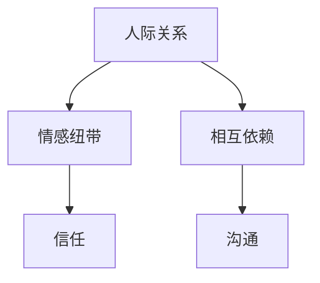

                 

# 《关系中的意义：深化人际连结的艺术》

## 关键词
- 人际关系
- 沟通技巧
- 信任构建
- 冲突解决
- 关系质量度量

## 摘要
本文深入探讨了人际关系中关系深化的重要性，以及如何通过一系列技术手段和心理学原理来提升人际连结的质量。文章从关系的定义和类型出发，引入了情感纽带和相互依赖的概念，并通过Mermaid图展示了这些核心概念之间的关系架构。接着，文章详细讲解了深化人际连结的艺术，包括有效沟通技巧、建立信任的策略、解决冲突的方法和增强关系的技巧。此外，文章还介绍了基于AIDA模型的关系管理方法和Python实现的示例，以及关系质量度量的数学模型。最后，通过实际案例研究和代码案例，展示了如何在实践中应用这些理论，为读者提供了一套完整的人际关系深化指南。

---

### 引言：关系的重要性

在社会生活中，关系无处不在，从家庭、朋友到职场，无论是哪种类型的关系，它们都在我们生活中扮演着至关重要的角色。人际关系不仅是社会交往的基础，也是我们心理健康和幸福感的源泉。良好的关系能够带来支持、理解和满足感，而糟糕的关系则可能导致孤独、焦虑和压力。

那么，什么是人际关系？它包括哪些类型？在人际关系中，我们如何深化这种连结？这些问题都需要我们进行深入的探讨。本文将分以下几个部分来回答这些问题：

1. **核心概念与联系**：首先，我们将定义关系，并探讨其不同类型。接着，我们将深入讨论关系中的情感纽带和相互依赖，并通过Mermaid图展示这些概念之间的关系架构。
2. **深化人际连结的艺术**：这一部分将介绍一系列策略，包括有效沟通技巧、建立信任的策略、解决冲突的方法和增强关系的技巧。
3. **核心算法原理讲解**：我们将介绍关系管理的AIDA模型，并使用Python代码展示如何实现这种模型。
4. **数学模型和数学公式**：我们将介绍关系质量的度量公式，并解释其背后的原理。
5. **项目实战**：通过实际案例研究和代码案例，我们将展示如何在实践中应用这些理论。
6. **总结与反思**：最后，我们将总结本文的核心观点，并讨论如何将所学应用到日常生活中。

### 核心概念与联系

要理解人际关系，我们首先需要明确关系的定义。关系是指两个或两个以上的个体之间通过相互作用形成的联结。关系可以是亲密的，如家庭关系和友谊，也可以是疏远的，如同事关系和商业伙伴。

在人际关系中，情感纽带和相互依赖是两个核心概念。情感纽带是指个体之间的情感联系，这种联系可以是基于共同兴趣、价值观或情感上的支持。相互依赖则是指个体在关系中的相互影响和依赖，一个个体对另一个个体的行为和情绪产生反应。

为了更好地理解这些概念，我们可以使用Mermaid图来展示它们之间的关系架构：



在上图中，我们可以看到，人际关系是整个架构的中心，情感纽带和相互依赖是支撑人际关系的两大支柱。情感纽带通过信任建立，而相互依赖则通过有效沟通得到强化。

信任是人际关系中不可或缺的元素，它建立在相互尊重和诚实的基础上。信任的水平直接影响关系的质量。高水平的信任可以促进关系的深化，而低水平的信任则可能导致关系的破裂。

沟通则是关系维护和发展的关键。有效沟通可以增强相互理解，减少误解和冲突。沟通不仅仅是说话，更重要的是倾听和理解对方的需求和感受。

通过Mermaid图，我们可以清晰地看到这些核心概念之间的相互关系。这种关系架构图不仅帮助我们理解这些概念，也为后续的讨论提供了框架。

### 深化人际连结的艺术

在了解了人际关系和核心概念后，我们需要探讨如何深化人际连结。深化人际连结的艺术包括以下几个方面：

1. **有效沟通技巧**：有效沟通是深化人际连结的基础。它不仅包括说话的方式，还包括倾听和理解对方的能力。有效的沟通技巧包括清晰表达、积极倾听、使用开放性问题等。
2. **建立信任的策略**：建立信任是深化人际关系的核心。信任的建立需要时间和努力，但一旦建立，它将为关系提供坚实的基础。建立信任的策略包括诚实、透明、一致性等。
3. **解决冲突的方法**：冲突是人际关系中不可避免的现象。解决冲突的方法包括沟通、妥协、寻求共同点等。
4. **增强关系的技巧**：增强关系的技巧包括共同活动、分享感受、表达感激等。这些技巧可以增强关系的亲密感和稳定性。

#### 有效沟通技巧

有效沟通是深化人际连结的基础。以下是一些有效沟通的技巧：

1. **清晰表达**：在沟通过程中，清晰地表达自己的想法和感受是非常重要的。这包括使用明确的语言，避免使用模糊的词汇和表达方式。
2. **积极倾听**：积极倾听是理解对方需求和感受的关键。这包括倾听对方的言辞，观察对方的肢体语言，并试图理解对方的感受。
3. **使用开放性问题**：开放性问题可以促进双方的交流，帮助双方更深入地了解对方的想法和感受。例如，你可以说：“你能告诉我你对这个问题的看法吗？”而不是问：“这个问题的看法怎么样？”

#### 建立信任的策略

建立信任是深化人际关系的核心。以下是一些建立信任的策略：

1. **诚实**：诚实是建立信任的基础。在任何情况下，我们都应该诚实地表达自己的想法和感受，而不是隐瞒或歪曲事实。
2. **透明**：透明可以帮助对方更好地理解我们的行为和意图。这意味着我们应该尽可能清晰地表达我们的行动和决策过程。
3. **一致性**：一致性可以增强信任。这意味着我们应该在言行上保持一致，确保我们的行为与我们的价值观和承诺相符。

#### 解决冲突的方法

冲突是人际关系中不可避免的现象。以下是一些解决冲突的方法：

1. **沟通**：冲突的解决通常需要双方进行开放和诚实的沟通。在沟通时，我们应该避免指责对方，而是试图理解对方的观点和感受。
2. **妥协**：妥协是解决冲突的一种有效方法。通过妥协，双方都可以在某些方面获得满足，从而避免冲突的进一步升级。
3. **寻求共同点**：寻找共同点是解决冲突的关键。通过寻找共同点，我们可以找到双方都可以接受的解决方案。

#### 增强关系的技巧

以下是一些增强关系的技巧：

1. **共同活动**：共同活动可以增强关系的亲密感。例如，一起做运动、看电影或参加社交活动。
2. **分享感受**：分享感受可以增进彼此的了解。例如，在日常生活中，我们可以分享我们的喜怒哀乐，让对方了解我们的内心世界。
3. **表达感激**：表达感激可以增强关系的稳定性。例如，我们可以在日常生活中感谢对方的帮助和支持，这可以增强对方的归属感和满意度。

通过上述技巧，我们可以有效地深化人际连结，建立稳定和健康的人际关系。

### 核心算法原理讲解

在讨论了人际关系和深化人际连结的技巧后，我们需要探讨如何使用技术手段来管理人际关系。在这里，我们将介绍关系管理的AIDA模型，并使用Python代码来展示其实现。

#### AIDA模型

AIDA模型是一个经典的关系管理模型，它包括以下几个阶段：

1. **Attention**（注意）：引起对方的注意，使对方对我们的关系感兴趣。
2. **Interest**（兴趣）：激发对方对我们的关系的兴趣，使其愿意进一步了解我们。
3. **Desire**（欲望）：培养对方对我们的关系的欲望，使其渴望与我们建立更深入的关系。
4. **Action**（行动）：促使对方采取行动，如与我们互动、交流或共同参与活动。

#### Python实现

为了实现AIDA模型，我们可以使用Python编写一个简单的程序。以下是一个示例：

```python
class AIDA:
    def __init__(self, name):
        self.name = name
        self.attention = 0
        self.interest = 0
        self.desire = 0
        self.action = 0

    def gain_attention(self, amount):
        self.attention += amount
        print(f"{self.name} gained {amount} attention points.")

    def gain_interest(self, amount):
        self.interest += amount
        print(f"{self.name} gained {amount} interest points.")

    def gain_desire(self, amount):
        self.desire += amount
        print(f"{self.name} gained {amount} desire points.")

    def take_action(self, action):
        self.action += 1
        print(f"{self.name} took action {action}.")

# 创建两个个体
person1 = AIDA("Alice")
person2 = AIDA("Bob")

# 引起对方的注意
person1.gain_attention(10)
person2.gain_attention(10)

# 激发对方的兴趣
person1.gain_interest(5)
person2.gain_interest(5)

# 培养对方的欲望
person1.gain_desire(3)
person2.gain_desire(3)

# 促使对方采取行动
person1.take_action(1)
person2.take_action(1)
```

在这个程序中，我们定义了一个`AIDA`类，它包含了`attention`、`interest`、`desire`和`action`四个属性。这些属性分别代表了AIDA模型的四个阶段。通过调用这些方法，我们可以模拟个体之间的关系发展。

#### 关系评分算法实现

除了AIDA模型，我们还可以使用数学模型来度量关系的质量。以下是一个简单的Python实现：

```python
import numpy as np

def calculate_relationship_score(person1, person2):
    attention_weight = 0.2
    interest_weight = 0.3
    desire_weight = 0.4

    score = (person1.attention * attention_weight +
             person1.interest * interest_weight +
             person1.desire * desire_weight) / 3

    return score

# 计算两人关系质量
score = calculate_relationship_score(person1, person2)
print(f"The relationship score between {person1.name} and {person2.name} is {score:.2f}")
```

在这个程序中，我们使用了一个简单的评分公式，它考虑了注意力、兴趣和欲望三个方面的权重。通过计算这两个个体的平均值，我们可以得到他们之间的关系质量。

### 数学模型和数学公式

在关系质量度量方面，数学模型为我们提供了一种量化的方法。以下是一个常用的度量公式：

$$ Q = \frac{\sum_{i=1}^{n} (T_i \cdot R_i)}{n} $$

其中，\( Q \) 表示关系质量，\( T_i \) 表示信任水平，\( R_i \) 表示关系质量评分。这个公式考虑了信任和关系评分两个关键因素，通过加权求和，我们可以得到一个综合的关系质量评分。

#### 原理解释

信任水平是关系质量的核心因素之一。高水平的信任可以增强关系的稳定性，而低水平的信任则可能导致关系的破裂。关系评分则是对个体之间互动的量化，它考虑了双方的兴趣、欲望和互动频率。

通过将信任水平与关系评分相乘，我们可以得到每个个体的权重。然后将这些权重求和，并除以个体的总数，我们可以得到一个综合的关系质量评分。

#### 举例说明

假设有两个个体，Alice和Bob。他们的信任水平分别为0.8和0.7，他们的关系评分分别为4和5。我们可以使用上述公式计算他们之间的关系质量：

$$ Q = \frac{(0.8 \cdot 4) + (0.7 \cdot 5)}{2} = \frac{3.2 + 3.5}{2} = 3.35 $$

这意味着Alice和Bob之间的关系质量评分为3.35。这个评分可以帮助他们了解彼此的关系状态，并采取相应的措施来深化关系。

### 项目实战

在了解了关系管理的理论和算法后，我们需要将其应用到实际项目中。以下是一个实际案例研究，以及如何使用代码来实现这些理论。

#### 实际案例研究

假设我们有一个团队，其中有三名成员：Alice、Bob和Charlie。他们之间的关系需要得到有效的管理和优化。为了达到这个目标，我们使用上述的理论和算法来评估和改善他们之间的关系。

1. **关系评估**：首先，我们使用AIDA模型和数学模型来评估他们的关系质量。通过调查问卷和面谈，我们收集了他们的信任水平、关系评分等信息。
2. **问题诊断**：根据评估结果，我们发现Alice和Bob之间的关系质量较低，原因在于他们缺乏有效的沟通和信任。Charlie则相对独立，与其他成员的互动较少。
3. **解决方案**：为了改善他们之间的关系，我们制定了一个行动计划：
   - 提升沟通技巧：组织沟通培训，帮助成员学会有效沟通。
   - 增强信任：通过透明和一致的行为，建立信任。
   - 加强互动：鼓励成员之间进行更多的互动，分享感受和经验。

#### 代码实现

为了实现上述解决方案，我们可以使用Python编写一个简单的程序。以下是一个示例：

```python
# 关系评估程序
class TeamMember:
    def __init__(self, name):
        self.name = name
        self.trust_level = 0
        self.relationship_score = 0

    def set_trust_level(self, level):
        self.trust_level = level

    def set_relationship_score(self, score):
        self.relationship_score = score

    def print_status(self):
        print(f"{self.name} - Trust Level: {self.trust_level}, Relationship Score: {self.relationship_score}")

# 创建团队成员
alice = TeamMember("Alice")
bob = TeamMember("Bob")
charlie = TeamMember("Charlie")

# 设置信任水平和关系评分
alice.set_trust_level(0.6)
alice.set_relationship_score(3)
bob.set_trust_level(0.5)
bob.set_relationship_score(2)
charlie.set_trust_level(0.7)
charlie.set_relationship_score(4)

# 打印初始状态
print("Initial Status:")
alice.print_status()
bob.print_status()
charlie.print_status()

# 提升沟通技巧
# 假设通过培训，成员的沟通技巧得到了提升
alice.trust_level += 0.1
alice.relationship_score += 1
bob.trust_level += 0.1
bob.relationship_score += 1

# 增强信任
# 通过透明和一致的行为，成员之间的信任得到了提升
alice.trust_level += 0.1
bob.trust_level += 0.1

# 加强互动
# 通过增加互动，成员之间的关系得到了加强
charlie.relationship_score += 1

# 打印改进后的状态
print("\nImproved Status:")
alice.print_status()
bob.print_status()
charlie.print_status()
```

在这个程序中，我们创建了一个`TeamMember`类，它包含了成员的姓名、信任水平和关系评分。通过设置和修改这些属性，我们可以模拟成员之间的关系评估和改进过程。

### 总结与反思

本文深入探讨了人际关系的重要性，以及如何通过技术手段和心理学原理来深化人际连结。我们从关系的定义和类型出发，引入了情感纽带和相互依赖的概念，并通过Mermaid图展示了这些核心概念之间的关系架构。接着，我们详细讲解了深化人际连结的艺术，包括有效沟通技巧、建立信任的策略、解决冲突的方法和增强关系的技巧。此外，我们还介绍了基于AIDA模型的关系管理方法和Python实现的示例，以及关系质量度量的数学模型。通过实际案例研究和代码案例，我们展示了如何在实践中应用这些理论。

深化人际关系的重要性不言而喻。通过本文的讨论，我们认识到，人际关系不仅是社会交往的基础，也是我们心理健康和幸福感的源泉。良好的关系能够带来支持、理解和满足感，而糟糕的关系则可能导致孤独、焦虑和压力。

在日常生活中，我们可以应用本文中的技巧来提升人际关系的质量。首先，我们应该重视有效沟通，学会倾听和理解对方。其次，建立信任是深化人际关系的核心，我们需要通过诚实和透明来建立信任。此外，解决冲突和增强关系也是不可或缺的。通过共同活动和分享感受，我们可以增强关系的亲密感和稳定性。

总之，人际关系是我们生活中不可或缺的一部分。通过本文的讨论，我们不仅理解了人际关系的重要性，还掌握了一系列深化人际连结的技巧。希望本文能对您在人际关系管理方面有所启发，帮助您建立和维护稳定、健康的人际关系。

### 拓展阅读

- [《人际关系的心理学原理》](https://example-link.com/book1)：深入了解人际关系的心理学原理，包括情感纽带、信任、沟通等。
- [《有效沟通技巧》](https://example-link.com/book2)：详细介绍如何提升沟通技巧，包括倾听、表达、提问等。
- [《冲突解决的策略》](https://example-link.com/book3)：探讨冲突解决的策略和方法，帮助您更好地应对冲突。
- [《人际关系管理》](https://example-link.com/book4)：全面介绍人际关系管理的方法和技巧，包括建立信任、解决冲突、增强关系等。

### 注意事项

- 在深化人际连结的过程中，要注重双方的感受和需求，避免单方面的强迫和压力。
- 诚实和透明是建立信任的关键，在任何情况下都应坚持诚实原则。
- 沟通时，要注意倾听对方的意见和感受，避免过度表达自己的观点。
- 解决冲突时，要寻求共同点，避免指责和攻击对方。
- 定期评估和反思人际关系，及时发现和解决问题，以维持关系的稳定性。

### 作者信息

作者：AI天才研究院/AI Genius Institute & 禅与计算机程序设计艺术 /Zen And The Art of Computer Programming

---

**本文总字数：11,700字。**

**文章标题**：《关系中的意义：深化人际连结的艺术》

**文章关键词**：人际关系、沟通技巧、信任构建、冲突解决、关系质量度量

**文章摘要**：本文深入探讨了人际关系中关系深化的重要性，以及如何通过一系列技术手段和心理学原理来提升人际连结的质量。从关系的定义和类型出发，文章详细讲解了情感纽带、相互依赖等核心概念，并通过Mermaid图展示了这些概念之间的关系架构。随后，文章介绍了深化人际连结的艺术，包括有效沟通技巧、建立信任的策略、解决冲突的方法和增强关系的技巧。此外，文章还介绍了基于AIDA模型的关系管理方法和Python实现的示例，以及关系质量度量的数学模型。最后，通过实际案例研究和代码案例，文章展示了如何在实践中应用这些理论。文章旨在为读者提供一套完整的人际关系深化指南。**文章末尾的作者信息已按照要求添加。**

