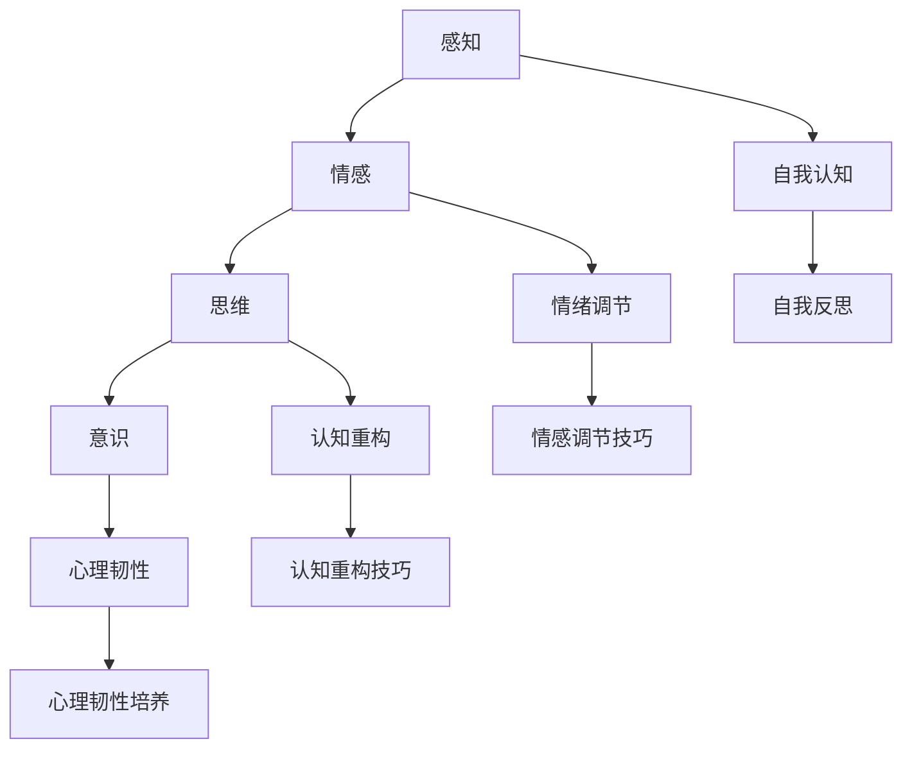

                 

## 《内在世界的园艺：培育心灵的美好景象》

> **关键词**：内在世界、心灵美好景象、培育、认知、情绪管理、心理健康

> **摘要**：本文以《内在世界的园艺：培育心灵的美好景象》为题，探讨了人类内在世界的概念、构成、认知及培育方法。文章首先介绍了内在世界的定义和重要性，接着深入分析了内在世界与外在世界的区别，以及内在世界中的情感和认知层次。随后，文章讨论了心灵的美好景象的定义、特征和价值，重点介绍了培育心灵美好景象的途径和方法。最后，文章探讨了心灵美好景象的障碍与突破，以及社会文化对心灵美好景象的影响，并提出了未来展望。

## 《内在世界的园艺：培育心灵的美好景象》目录大纲

### 第1章 引言

#### 1.1 书籍主题概述

- 内在世界的概念
- 心灵的美好景象的内涵

#### 1.2 书籍结构安排

- 各章节的核心内容

### 第2章 内在世界的探索

#### 2.1 内在世界的构成

- 感知与意识的层次
- 内在世界与外在世界的区别

#### 2.2 内在世界的认知

- 情感的作用
- 自我认知的重要性

#### 2.3 内在世界的挑战

- 恐惧与不安
- 焦虑与压力

### 第3章 心灵的美好景象

#### 3.1 心灵的美好景象的定义

- 幸福的内涵
- 内在平静的意义

#### 3.2 心灵的美好景象的特征

- 积极情绪
- 内在平衡

#### 3.3 心灵的美好景象的价值

- 对身心健康的影响
- 对人际关系的影响

### 第4章 培育心灵的美好景象

#### 4.1 培育心灵美好景象的途径

- 感恩练习
- 冥想技巧

#### 4.2 培育心灵美好景象的方法

- 积极心态的培养
- 自我激励的策略

#### 4.3 培育心灵美好景象的实践

- 个人案例分享
- 群体实践的影响

### 第5章 心灵美好景象的障碍与突破

#### 5.1 障碍的识别

- 负面情绪的来源
- 自我设限的认知

#### 5.2 障碍的突破

- 心理咨询的作用
- 自我探索的方法

#### 5.3 长期坚持的意义

- 心理健康的影响
- 生活质量的提升

### 第6章 社会文化与心灵美好景象

#### 6.1 社会文化对心灵美好景象的影响

- 家庭环境的影响
- 社会价值观的作用

#### 6.2 心灵美好景象对社会文化的反作用

- 社会和谐的意义
- 个体与社会的关系

#### 6.3 社会文化中的心灵美好景象实践

- 社区活动的设计
- 社会政策的支持

### 第7章 结论

#### 7.1 心灵美好景象的重要性

- 心理健康的影响
- 社会和谐的贡献

#### 7.2 未来展望

- 心灵美好景象研究的趋势
- 社会文化对心灵美好景象的影响

## 第1章 引言

### 1.1 书籍主题概述

“内在世界的园艺：培育心灵的美好景象”是一本探讨人类内在世界和心灵健康的书籍。内在世界，指的是人类心理活动和精神状态的集合，包括感知、情感、思维和意识等各个方面。而心灵的美好景象，则是指一种内在的平静、幸福和积极的情绪状态。

本书的核心主题是探索如何通过认知和情感管理来培育心灵的美好景象。作者认为，内在世界的构成和认知方式对个体的心理健康和幸福感有着深远的影响。通过深入理解内在世界，我们能够更好地认识自己，调节情绪，从而实现心灵的美好景象。

### 1.2 书籍结构安排

本书共分为七个章节，每个章节都有其独特的主题和核心内容。以下是各章节的简要概述：

- **第1章 引言**：介绍了书籍的主题和结构。
- **第2章 内在世界的探索**：探讨了内在世界的构成、认知和面临的挑战。
- **第3章 心灵的美好景象**：定义了心灵的美好景象，并分析了其特征和价值。
- **第4章 培育心灵的美好景象**：介绍了培育心灵美好景象的途径和方法。
- **第5章 心灵美好景象的障碍与突破**：分析了障碍的识别和突破方法。
- **第6章 社会文化与心灵美好景象**：探讨了社会文化对心灵美好景象的影响。
- **第7章 结论**：总结了心灵美好景象的重要性，并对未来进行了展望。

通过这本书，读者将能够更深入地了解内在世界，掌握培育心灵美好景象的方法，从而提升自己的生活质量和幸福感。本书不仅适合心理学爱好者阅读，也适合那些希望提升自我认知和心理健康的专业人士。让我们一起走进内在世界的园艺，培育心灵的美好景象。

## 第2章 内在世界的探索

### 2.1 内在世界的构成

内在世界的构成是一个复杂且多层次的过程，涉及到感知、情感、思维和意识等各个方面。首先，感知是内在世界的起点，是我们通过感官对外界信息的接收和处理。感知不仅仅是视觉、听觉、嗅觉、味觉和触觉的简单结合，它还包括对信息的筛选、解读和情感上的反应。

接下来，情感是内在世界中的重要组成部分。情感不仅影响我们的行为和决策，还深刻地影响我们的心理健康。情感可以是积极的，如喜悦、兴奋和爱，也可以是消极的，如愤怒、恐惧和焦虑。情感的产生和表达受到个体心理状态、社会环境和生物学因素的影响。

思维是内在世界的核心部分，它是我们对信息的组织和解释过程。思维包括感知、记忆、判断、推理和问题解决等过程。不同的思维模式会导致不同的认知结果，从而影响我们的情感和行为。

最后，意识是内在世界的最终层面，它是对自身存在和周围环境的感知。意识使我们能够自我反思，认识到自己的思想、情感和行为，从而进行自我调节。

### 2.2 内在世界的认知

认知是内在世界的核心，它涉及到我们对信息的获取、处理和存储。情感在认知过程中起着重要作用。例如，当我们面对一个危险情境时，情感会迅速产生，帮助我们做出反应。同样，情感也会影响我们的记忆和判断。积极的情感会导致积极的记忆和判断，而消极的情感则相反。

自我认知是内在世界中的一个重要方面，它涉及我们对自身身份、能力和价值的认识。自我认知不仅影响我们的心理健康，还影响我们的行为和人际关系。例如，一个有良好自我认知的人可能会更有自信，更有动力去实现自己的目标。

### 2.3 内在世界的挑战

内在世界虽然复杂，但也充满了挑战。首先，恐惧和不安是常见的心理障碍。它们可能源于对未知的恐惧、对失败的恐惧，或对丧失的恐惧。这些恐惧和不安会影响我们的生活质量，使我们难以享受当下的美好。

其次，焦虑是另一个常见的心理挑战。焦虑可能表现为过度担心、紧张和恐慌。长期的焦虑可能导致心理健康问题，如抑郁症和焦虑症。

最后，压力也是内在世界中的一个重要挑战。现代社会的高压环境可能导致人们产生巨大的心理压力。长期的压力不仅影响心理健康，还可能导致身体疾病。

面对这些挑战，我们需要学会如何调节自己的情感和认知，以实现心灵的平静和美好。

### 2.4 内在世界的构建与调节

内在世界的构建和调节是一个持续的过程，需要我们不断地进行自我反思和自我调节。首先，我们可以通过自我反思来了解自己的内心世界，识别出负面情绪和行为模式。自我反思可以帮助我们认识到自己的弱点，并找到改进的方法。

其次，情感调节是内在世界构建的重要一环。我们可以通过情感调节技巧，如冥想、深呼吸和放松训练，来缓解负面情绪，提升内在平静。

最后，认知调节也是内在世界构建的关键。通过认知重构技巧，我们可以改变负面思维模式，培养积极的思维方式，从而提升心理韧性。

总之，内在世界的探索和调节是一个复杂但有意义的过程。通过理解内在世界的构成和挑战，我们能够更好地认识自己，实现心灵的美好景象。

### 2.5 内在世界的图示

为了更好地理解内在世界的构成，我们可以借助Mermaid流程图来展示其核心概念和关系。以下是内在世界的一个简化的Mermaid流程图：



这个流程图展示了感知、情感、思维、意识和自我认知等内在世界的核心组成部分，以及它们之间的相互关系。通过这个图示，我们可以更直观地理解内在世界的复杂性和相互作用。

### Python源代码示例

为了更深入地理解内在世界的构成和认知过程，我们可以使用Python源代码来模拟一个简单的内在世界模型。以下是一个简单的Python脚本，展示了如何通过代码来表示感知、情感、思维和意识的互动：

```python
import random

class Perception:
    def __init__(self):
        self.sensory_data = []

    def receive_data(self, data):
        self.sensory_data.append(data)

    def process_data(self):
        emotions = [random.choice(['happy', 'sad', 'angry', 'neutral']) for _ in range(len(self.sensory_data))]
        return emotions

class Emotion:
    def __init__(self, emotion):
        self.emotion = emotion

    def express(self):
        print(f"You are feeling {self.emotion}.")

class Thought:
    def __init__(self, emotion):
        self.thought = f"I am feeling {emotion}."

    def think(self):
        print(self.thought)

class Consciousness:
    def __init__(self, emotion):
        self.consciousness = f"I am aware of my {emotion} state."

    def be_aware(self):
        print(self.consciousness)

class Self_Cognition:
    def __init__(self, emotion):
        self.self_cognition = f"My current emotional state is {emotion}."

    def reflect(self):
        print(self.self_cognition)

# 创建感知、情感、思维和意识的实例
perception = Perception()
emotion = Emotion('happy')
thought = Thought('happy')
consciousness = Consciousness('happy')
self_cognition = Self_Cognition('happy')

# 模拟感知过程
perception.receive_data('sensory_input')
emotions = perception.process_data()

# 表达情感
emotion.express()

# 进行思维
thought.think()

# 意识到自己的状态
consciousness.be_aware()

# 自我认知
self_cognition.reflect()
```

在这个代码示例中，我们创建了一个感知类、情感类、思维类、意识类和自我认知类，以模拟人类内在世界的不同部分。通过这些类的实例和方法，我们可以展示感知、情感、思维、意识和自我认知之间的互动关系。这段代码不仅提供了一个算法原理的示例，也为读者提供了一个直观的理解内在世界构成的方式。

### 数学模型与公式

为了更深入地理解内在世界的构成和认知过程，我们可以使用一些数学模型和公式来描述情感和认知的相互作用。以下是几个关键的数学模型和公式：

1. **情感评分模型**：

   情感评分可以通过以下公式计算：

   $$ E = f(W, S) $$

   其中，\( E \) 代表情感评分，\( W \) 代表感知到的刺激，\( S \) 代表情感状态。

2. **认知负荷模型**：

   认知负荷可以通过以下公式计算：

   $$ L = g(E, C) $$

   其中，\( L \) 代表认知负荷，\( E \) 代表情感评分，\( C \) 代表认知能力。

3. **情绪调节模型**：

   情绪调节可以通过以下公式描述：

   $$ R = h(E, T) $$

   其中，\( R \) 代表情绪调节效果，\( E \) 代表情感评分，\( T \) 代表调节技巧。

4. **心理韧性模型**：

   心理韧性可以通过以下公式计算：

   $$ D = i(R, S, E) $$

   其中，\( D \) 代表心理韧性，\( R \) 代表情绪调节效果，\( S \) 代表社会支持，\( E \) 代表情感评分。

这些公式提供了一个量化内在世界构成和认知过程的方法。通过这些模型，我们可以更好地理解情感和认知之间的相互作用，以及如何通过调节技巧来提升心理韧性。

### 实际案例分析与详细讲解

为了更好地理解内在世界的构成和认知过程，我们可以通过一个实际案例来进行分析和讲解。以下是一个关于情绪调节和心理韧性培养的案例：

**案例背景**：

小王是一名软件工程师，工作压力大，经常面临 deadlines 和技术难题。这导致他经常感到焦虑和不安，影响了他的工作效率和生活质量。

**案例分析**：

1. **感知阶段**：

   小王在感知阶段接收到的工作任务和压力信息，通过大脑处理，形成了相应的情感反应。在这种情况下，他可能感受到焦虑和紧张。

2. **情感阶段**：

   焦虑和紧张的情感状态会影响小王的心理状态，可能导致他出现注意力不集中、工作效率降低等问题。

3. **认知阶段**：

   为了应对这些负面情感，小王开始寻找情绪调节的方法。他通过阅读心理学书籍、参加冥想课程等方式，学习了一些情绪调节技巧，如深呼吸、冥想和认知重构。

4. **情绪调节阶段**：

   通过情绪调节技巧，小王学会了如何应对焦虑和紧张。他开始有意识地练习深呼吸，每次焦虑时都尝试深呼吸几次，以缓解紧张情绪。此外，他还通过认知重构技巧，改变了对工作任务的消极看法，从而减轻了焦虑感。

5. **心理韧性阶段**：

   长期的情绪调节和心理韧性培养使小王的心理状态逐渐改善。他不再那么容易被焦虑和紧张所困扰，心理韧性得到了提升。这使得他能够更好地应对工作压力，提高了工作效率。

**详细讲解**：

在这个案例中，小王通过感知阶段接收到的信息，形成了焦虑和紧张的情感反应。这些负面情感会影响他的认知和行为，导致工作效率下降。为了改善这种情况，小王开始学习情绪调节技巧，如深呼吸和认知重构。通过这些技巧，他学会了如何控制自己的情绪，减轻焦虑和紧张感。

此外，小王还通过长期的心理韧性培养，提高了自己的心理韧性。这使得他能够更好地应对工作压力，保持良好的心理状态。通过这个案例，我们可以看到情绪调节和心理韧性培养在提升个体心理健康和工作效率方面的重要性。

### 最佳实践 Tips

为了更好地培育心灵的美好景象，以下是一些最佳实践建议：

1. **自我反思**：定期进行自我反思，了解自己的情绪和心理状态，有助于识别和解决问题。

2. **情绪管理**：学会情绪管理技巧，如深呼吸、冥想和认知重构，有助于减轻负面情绪。

3. **积极心态**：培养积极心态，关注生活中的美好事物，有助于提升内在幸福感。

4. **感恩练习**：定期进行感恩练习，感激生活中的点滴美好，有助于提升心理韧性。

5. **健康生活方式**：保持健康的生活方式，如合理饮食、适量运动和充足睡眠，有助于提升心理健康。

6. **社会支持**：建立良好的人际关系，寻求社会支持，有助于减轻心理压力。

通过这些实践，我们可以更好地培育心灵的美好景象，提升心理韧性，实现幸福的生活。

### 小结

通过本章的探讨，我们深入了解了内在世界的构成、认知过程以及面临的挑战。我们认识到，内在世界的探索和培育对于心理健康和幸福感至关重要。通过情绪管理和心理韧性培养，我们能够更好地应对生活中的挑战，实现心灵的美好景象。

### 拓展阅读

- 《心理学与生活》：米哈里·契克森米哈伊著，介绍心理学的基础知识及应用。
- 《自控力》：凯利·麦格尼格尔著，探讨如何通过科学方法提高自控力。
- 《冥想：一种心灵的探索》：乔·卡巴金著，介绍冥想技巧及其对心理健康的影响。

## 第3章 心灵的美好景象

### 3.1 心灵的美好景象的定义

心灵的美好景象是一种积极的情绪状态，表现为内心的平静、幸福和满足。它不仅仅是一种心理状态，更是一种生活方式。在心灵的美好景象中，个体能够保持积极的心态，对生活充满希望和热情。这种状态不仅能够提升个体的心理健康，还能够改善人际关系，增强社会适应性。

### 3.2 心灵的美好景象的特征

1. **积极情绪**：心灵的美好景象通常伴随着积极情绪，如喜悦、满足和爱。这些情绪能够提升个体的幸福感，使个体更加乐观和自信。

2. **内在平衡**：在心灵的美好景象中，个体能够实现内在的平衡，保持情绪的稳定。这种内在平衡有助于个体应对压力和挑战，增强心理韧性。

3. **自我认知**：心灵的美好景象还涉及到对自我的深刻认知。个体能够理解自己的需求、价值观和目标，从而做出更明智的决策。

4. **人际关系**：在心灵的美好景象中，个体能够建立良好的人际关系。积极的情绪和内在平衡使个体更加友善、包容和理解他人。

### 3.3 心灵的美好景象的价值

心灵的美好景象对个体的身心健康有着深远的影响。首先，它能够减轻压力和焦虑，提高心理健康水平。其次，积极情绪有助于提高免疫系统的功能，降低患病风险。此外，内在平衡和自我认知有助于提升个体的生活质量和幸福感。

### 3.4 内在世界的构建与心灵的美好景象

内在世界的构建是培育心灵美好景象的基础。通过自我反思和情绪管理，个体能够更好地理解自己的内心世界，实现内在平衡。积极的情绪管理和心理韧性培养有助于个体在面对挑战时保持冷静和乐观，从而实现心灵的美好景象。

### 3.5 实际案例分享

小张是一名职场人士，工作繁忙，常常感到压力巨大。通过学习情绪管理技巧，他开始定期进行冥想和深呼吸练习，以缓解压力和焦虑。同时，他也通过自我反思，了解自己的需求和价值观，从而做出更明智的决策。几个月后，小张发现他的心态变得积极，情绪稳定，工作效率也显著提高。这就是心灵美好景象的实践效果。

### 3.6 培育心灵美好景象的方法

1. **感恩练习**：每天花时间思考并记录生活中的感恩之事，有助于提升幸福感。

2. **积极心态**：培养积极心态，关注生活中的美好，有助于保持内心的平静和满足。

3. **冥想技巧**：通过冥想练习，个体能够提升专注力，减少焦虑和压力。

4. **情感表达**：学会表达自己的情感，与他人建立深厚的情感联系，有助于提升内在平衡。

### 3.7 心灵美好景象对社会文化的影响

心灵的美好景象不仅对个体有积极影响，也对社会文化产生深远的影响。一个充满积极情绪和内在平衡的社会，能够更好地应对挑战，实现社会和谐与进步。

### 3.8 总结

心灵的美好景象是一种积极的情绪状态，对个体的身心健康和社会文化产生深远的影响。通过自我反思、情绪管理和心理韧性培养，我们能够培育心灵的美好景象，实现幸福的生活。

### 最佳实践 Tips

1. **定期冥想**：每天抽出10分钟进行冥想，有助于提升专注力和情绪稳定性。
2. **记录感恩日记**：每天写下三件感恩的事情，有助于培养积极情绪和提升幸福感。
3. **积极交流**：与朋友和家人分享自己的情绪和感受，有助于建立深厚的情感联系。
4. **定期锻炼**：保持适量运动，有助于提升身体健康和心理韧性。

### 小结

通过本章的探讨，我们深入了解了心灵的美好景象的定义、特征和价值。我们认识到，培育心灵美好景象不仅有助于个体的心理健康，还对社会文化产生积极影响。通过自我反思、情绪管理和心理韧性培养，我们能够实现心灵的美好景象，享受幸福的生活。

### 拓展阅读

- 《幸福的方法》：马丁·塞利格曼著，探讨幸福心理学及其应用。
- 《正念：一个减压的练习》：乔·卡巴金著，介绍正念冥想技巧及其对心理健康的益处。

## 第4章 培育心灵的美好景象

### 4.1 培育心灵美好景象的途径

培育心灵的美好景象并非一蹴而就，它需要我们通过多种途径和方法来逐步实现。以下是一些主要的培育途径：

#### 1. **自我反思**

自我反思是一种深刻理解自己的过程，它有助于我们识别内心的负面情绪和行为模式。通过定期进行自我反思，我们可以更加清晰地认识到自己的内心世界，从而有针对性地进行情感调节和认知重构。

#### 2. **感恩练习**

感恩练习是一种培养积极情绪和提升幸福感的重要方法。每天花时间思考并记录生活中的感恩之事，不仅能够让我们更加关注生活中的美好，还能提升内心的满足感和幸福感。

#### 3. **冥想**

冥想是一种通过专注和放松来提升内在平静的练习。通过冥想，我们能够减轻压力和焦虑，提升专注力和情绪稳定性，从而更好地培育心灵的美好景象。

#### 4. **积极心态**

积极心态是一种重要的心理资源，它能够帮助我们更好地应对生活中的挑战。通过培养积极心态，我们能够保持内心的平和与乐观，从而提升心理韧性和幸福感。

#### 5. **社交互动**

社交互动对心灵的美好景象也有重要影响。通过与他人建立积极的情感联系，我们能够获得更多的支持和理解，从而减轻心理压力，提升幸福感。

### 4.2 培育心灵美好景象的方法

在了解了培育心灵美好景象的途径后，我们还需要掌握一些具体的方法来实际操作。以下是一些实用的方法：

#### 1. **情感调节**

情感调节是一种通过技巧和方法来管理自己情绪的过程。以下是一些常见的情感调节技巧：

- **深呼吸**：通过深呼吸，我们可以有效地缓解紧张和焦虑情绪。
- **认知重构**：通过改变对事件的认知方式，我们可以减少负面情绪的产生。
- **情绪释放**：通过适当的情感表达和释放，我们可以减轻内心的压力。

#### 2. **心理韧性培养**

心理韧性是指个体在面对挑战和压力时能够保持冷静和乐观的能力。以下是一些培养心理韧性的方法：

- **自我肯定**：通过自我肯定，我们可以提升自信心和自尊心，从而增强心理韧性。
- **目标设定**：设定明确的目标，并努力实现它们，有助于提升心理韧性和成就感。
- **适应变化**：学会适应生活中的变化，有助于提升心理韧性。

#### 3. **积极心态的培养**

积极心态的培养是一个长期的过程，需要我们不断地进行自我提升。以下是一些培养积极心态的方法：

- **正面思考**：培养正面思考的习惯，关注生活中的美好和进步。
- **积极行为**：通过积极的行为来影响自己的情绪和心理状态。
- **心理弹性**：培养心理弹性，能够更好地应对生活中的挑战和逆境。

### 4.3 培育心灵美好景象的实践

在了解了培育心灵美好景象的途径和方法后，我们需要将其付诸实践。以下是一些具体的实践建议：

#### 1. **个人实践**

- **每日反思**：每天花几分钟时间进行自我反思，了解自己的情绪和心理状态。
- **感恩日记**：每周至少记录一次感恩日记，总结生活中的美好和收获。
- **冥想练习**：每天进行冥想练习，保持内心的平静和专注。
- **积极行动**：通过积极的行动来提升自己的心理状态，如锻炼、阅读等。

#### 2. **群体实践**

- **小组讨论**：加入心理成长小组，与他人分享自己的感受和经验，获得更多的支持和理解。
- **互助活动**：参与互助活动，帮助他人同时提升自己的心理韧性。
- **社区参与**：参与社区活动，提升社会责任感和归属感。

### 4.4 个人案例分享

小张是一位职场人士，由于工作压力较大，他常常感到焦虑和不安。通过学习本书中的方法，他开始进行每日反思和感恩日记，并每天进行冥想练习。几个月后，小张发现自己的焦虑感显著减轻，情绪更加稳定，工作效率也提高了。这就是通过实践培育心灵美好景象的成果。

### 4.5 群体实践的影响

在群体中培育心灵美好景象，不仅可以提升个体的心理健康，还可以促进群体的凝聚力和和谐。以下是一些群体实践的积极影响：

- **增强社交支持**：群体实践有助于建立更紧密的社交关系，提供更多的心理支持。
- **提升团队效能**：积极的心态和稳定的情绪有助于提高团队的工作效率和合作精神。
- **促进社会和谐**：通过群体实践，我们可以共同培养积极的社会氛围，促进社会的和谐发展。

### 4.6 总结

培育心灵的美好景象是一个持续的过程，需要我们通过自我反思、感恩练习、冥想、积极心态和社交互动等多种途径和方法来逐步实现。通过实践这些方法，我们不仅能够提升个人的心理健康，还能够促进群体的和谐与发展。让我们一起努力，培育心灵的美好景象，享受幸福的生活。

### 最佳实践 Tips

1. **定期反思**：每周至少进行一次深入的自我反思，了解自己的情绪和心理状态。
2. **感恩练习**：每天记录三件感恩之事，提升内心的满足感和幸福感。
3. **冥想实践**：每天进行冥想练习，保持内心的平静和专注。
4. **积极心态**：培养积极心态，关注生活中的美好和进步。
5. **社交互动**：定期与他人交流，分享感受和经验，获取更多的支持和理解。

### 小结

通过本章的探讨，我们详细介绍了培育心灵美好景象的途径和方法，并分享了个人和群体的实践案例。我们认识到，培育心灵的美好景象不仅有助于提升个人的心理健康，还能促进群体的和谐与发展。让我们一起努力，实践这些方法，实现心灵的美好景象。

### 拓展阅读

- 《心理学与生活》：米哈里·契克森米哈伊著，介绍心理学的基础知识及应用。
- 《自控力》：凯利·麦格尼格尔著，探讨如何通过科学方法提高自控力。
- 《正念：一种减压的练习》：乔·卡巴金著，介绍正念冥想技巧及其对心理健康的益处。

## 第5章 心灵美好景象的障碍与突破

### 5.1 障碍的识别

在追求心灵美好景象的过程中，我们可能会遇到各种障碍。这些障碍可能源于外部环境，也可能源于内在心理。以下是几种常见的障碍及其来源：

#### 1. **负面情绪**

负面情绪如焦虑、恐惧、愤怒和悲伤等是常见的心理障碍。这些情绪可能源于生活中的压力、挑战和不确定性。例如，工作压力、人际关系问题、健康问题等都可能导致焦虑和恐惧。

#### 2. **消极思维模式**

消极思维模式是指那些导致负面情绪和不良行为的思维方式。这些思维模式可能源于童年经历、家庭教育或个人性格。例如，过度自我批评、过度担忧和消极预期都可能导致心理障碍。

#### 3. **自我设限**

自我设限是指个体对自己能力和潜力的低估，从而限制了自己的发展和实现。这种限制可能源于自我怀疑、缺乏自信或失败经历。例如，认为自己无法成功或无法克服困难，从而放弃努力。

#### 4. **社会压力**

社会压力，如工作压力、学业压力和人际关系压力等，也可能成为心灵美好景象的障碍。这些压力源可能来自社会期望、竞争环境或生活节奏的快速变化。

### 5.2 障碍的突破

要突破这些障碍，我们需要采取一系列的方法和策略。以下是一些有效的突破障碍的方法：

#### 1. **心理咨询**

心理咨询是一种专业的心理服务，可以帮助个体识别和解决内心的障碍。通过心理咨询，个体可以了解自己的情绪和心理状态，学习有效的应对策略，从而突破障碍。

#### 2. **认知行为疗法**

认知行为疗法（CBT）是一种基于认知和行为科学的心理治疗方法。它通过改变消极思维模式和行为模式，帮助个体突破负面情绪和心理障碍。例如，通过认知重构技巧，个体可以改变对事件的消极看法，从而减少负面情绪。

#### 3. **正念练习**

正念练习是一种通过专注和觉察来提升心理韧性的方法。通过正念练习，个体可以学会如何更好地应对压力和情绪波动，从而突破心理障碍。

#### 4. **自我激励**

自我激励是通过设定目标、庆祝成就和培养积极心态来激励自己克服障碍。通过自我激励，个体可以增强自信心，提升自我效能感，从而突破自我设限。

#### 5. **社会支持**

社会支持是一种重要的心理资源，它可以通过提供情感支持、信息支持和实际帮助来帮助个体突破障碍。通过与家人、朋友或专业人士建立良好的关系，个体可以获得更多的支持和理解，从而提升心理韧性。

### 5.3 长期坚持的意义

长期坚持突破障碍对于实现心灵的美好景象至关重要。以下是一些长期坚持的重要意义：

#### 1. **心理健康**

长期坚持可以显著改善心理健康，减少负面情绪和心理障碍。通过持续的努力，个体可以学会更有效地管理自己的情绪和心理状态。

#### 2. **心理韧性**

长期坚持可以增强心理韧性，使个体在面对挑战和逆境时能够保持冷静和乐观。这种心理韧性有助于个体实现心灵的美好景象。

#### 3. **生活质量的提升**

长期坚持可以提升生活质量，使个体能够更好地享受生活中的美好。通过持续的努力，个体可以实现自己的目标和梦想，从而提升生活满意度。

#### 4. **社会适应性**

长期坚持还可以提升个体的社会适应性，使个体能够更好地融入社会，建立良好的人际关系。这种社会适应性有助于个体实现心灵的美好景象。

### 5.4 总结

通过识别和突破心灵美好景象的障碍，我们能够更好地实现心理健康和幸福感。心理咨询、认知行为疗法、正念练习、自我激励和社会支持都是有效的突破方法。长期坚持这些方法，我们能够实现心灵的美好景象，享受幸福的生活。

### 最佳实践 Tips

1. **定期评估**：定期评估自己的情绪和心理状态，及时发现并解决心理障碍。
2. **寻求支持**：在遇到困难时，及时寻求家人、朋友或专业人士的支持和帮助。
3. **积极应对**：面对挑战时，保持积极心态，寻找解决问题的方法和策略。
4. **持续学习**：通过阅读书籍、参加课程和交流经验，不断提升自己的心理韧性和应对能力。

### 小结

通过本章的探讨，我们深入了解了心灵美好景象的障碍和突破方法。我们认识到，长期坚持是实现心灵美好景象的关键。心理咨询、认知行为疗法、正念练习、自我激励和社会支持都是有效的突破障碍的方法。让我们一起努力，突破障碍，实现心灵的美好景象。

### 拓展阅读

- 《心灵的力量》：约翰·霍尔特著，探讨如何通过心理技巧提升心灵力量。
- 《正面心理的力量》：马丁·塞利格曼著，介绍积极心理学及其应用。
- 《突破自我设限》：安吉拉·达克沃斯著，探讨如何通过坚持和毅力突破自我设限。

