                 

### 文章标题：内在丰盈感的培育：建设丰富的精神世界

在快节奏的现代生活中，人们往往被物质追求和外部成就所驱动，而忽略了内在的精神满足与丰盈感。内在丰盈感，指的是个体在精神层面所获得的满足与富足，它不仅仅是情感上的愉悦，更是对生活深度和广度的感知。本文旨在探讨如何培育内在丰盈感，帮助读者建立丰富的精神世界。

### 关键词

- 内在丰盈感
- 精神满足
- 自我认知
- 情绪管理
- 人际关系
- 心理调适

### 摘要

本文将分为三个主要部分。第一部分将介绍内在丰盈感的基础理论，包括定义、核心要素及其意义。第二部分将探讨内在丰盈感的实践方法，从个人成长、家庭与社会关系处理，到精神世界的丰富与拓展。第三部分将通过成功人士的案例，展示内在丰盈感培育的实际效果，并展望未来趋势。文章末尾将附上实用工具与资源推荐。

## 第一部分：内在丰盈感的基础理论

### 第1章：内在丰盈感的定义与意义

#### 1.1 内在丰盈感的定义

内在丰盈感（Intrinsic Fulfillment）是指个体在内心深处感受到的满足与充实，这种感受源自于个人价值观的认同、自我成长、情感共鸣以及精神追求。与外在成就感不同，内在丰盈感不依赖于外界的认可与物质回报，而是来源于内心深处的自我认知与自我实现。

#### 1.2 内在丰盈感与幸福感的区别

幸福感（Happiness）通常是指短暂的、基于外在条件的快乐感受，如获得物质奖励、取得成功、与人交往等。幸福感往往是即时性的，容易受到外界环境的影响。而内在丰盈感则是一种深层次的、持久的满足感，它基于个体对自我价值的认同、对生活的深刻理解以及内在情感的平衡。

#### 1.3 内在丰盈感的重要性

内在丰盈感对个人成长具有重要意义。首先，它有助于提升自我认知，使个体更加了解自己的价值观、兴趣与潜能。其次，内在丰盈感能带来持久的动力，促使个体不断追求自我提升和成长。此外，内在丰盈感还有助于减轻压力，提升情感稳定性，从而提高生活质量。

### 第2章：内在丰盈感的核心要素

#### 2.1 自我认知

自我认知是内在丰盈感的基础。它指的是个体对自己内在世界和外显行为的理解。通过自我认知，个体可以明确自己的价值观、兴趣、优势与劣势。这有助于个体做出更符合内心期望的选择，从而实现自我价值的认同与实现。

**核心概念与联系：**

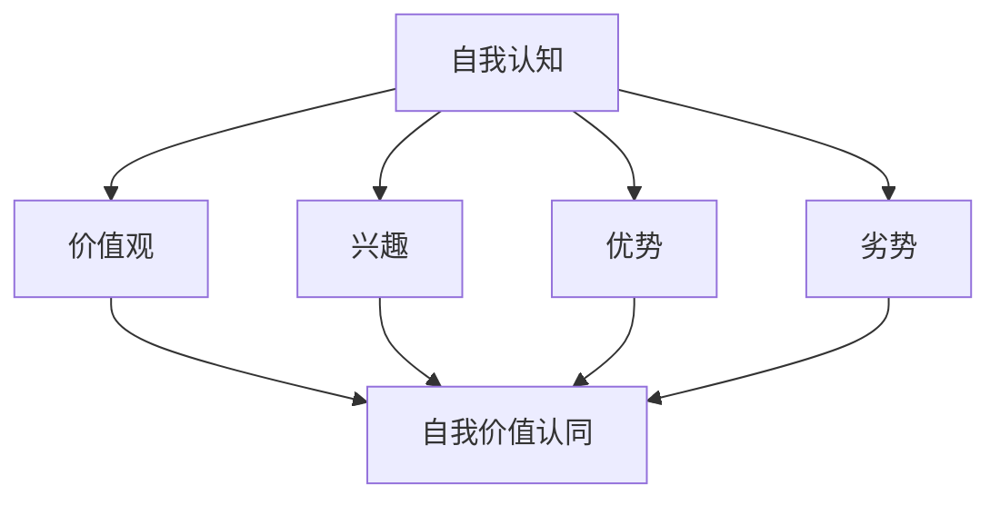

#### 2.2 情绪管理

情绪管理是内在丰盈感的重要组成部分。情绪管理不仅包括对负面情绪的调节，还包括对积极情绪的培育。通过有效的情绪管理，个体能够保持心理平衡，提高应对压力的能力，从而在日常生活中获得更多的内在满足感。

**核心概念与联系：**

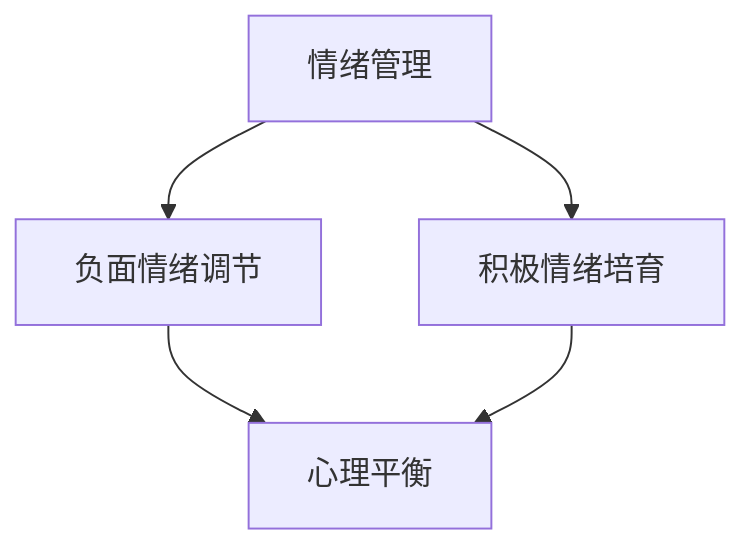

#### 2.3 人际关系

健康的人际关系是内在丰盈感的重要支撑。良好的人际关系能够为个体提供情感支持、鼓励与认同，从而增强内在满足感。同时，通过建立和维持健康的人际关系，个体也能够更好地了解自己，促进自我认知的发展。

**核心概念与联系：**

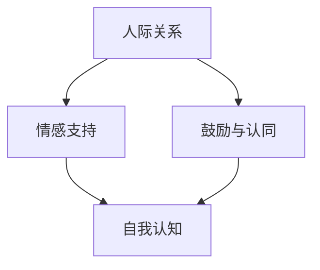

### 第3章：内在丰盈感的培育方法

#### 3.1 心理调适

心理调适是培育内在丰盈感的重要方法之一。它包括认知行为疗法、冥想、正念练习等多种方法。通过心理调适，个体能够更好地管理情绪、减轻压力，从而提升内在的满足感和幸福感。

**核心概念与联系：**

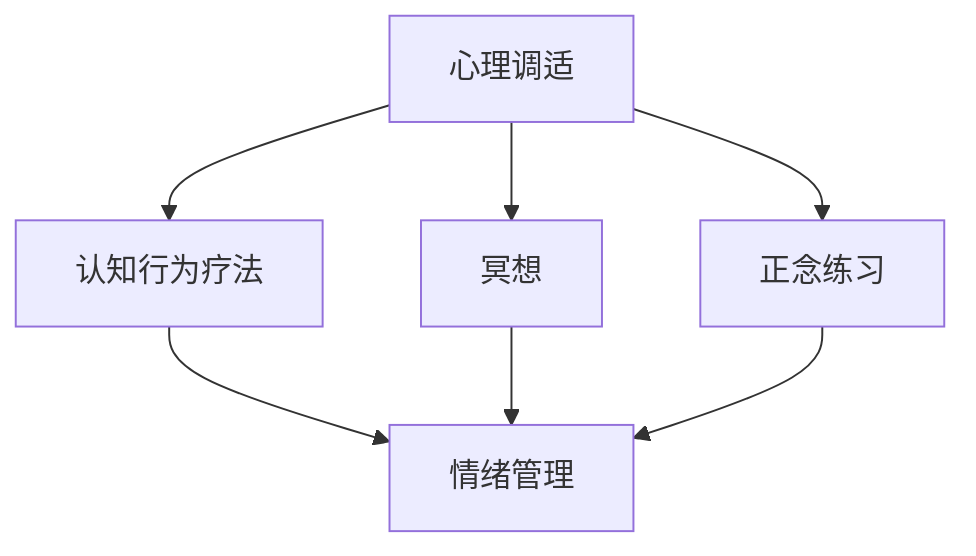

#### 3.2 生活习惯

健康的生活习惯对于培育内在丰盈感至关重要。良好的生活习惯包括规律的作息、健康的饮食、适量的运动等。这些习惯能够提升个体的身体和心理状态，从而为内在丰盈感的培育提供良好的基础。

**核心概念与联系：**

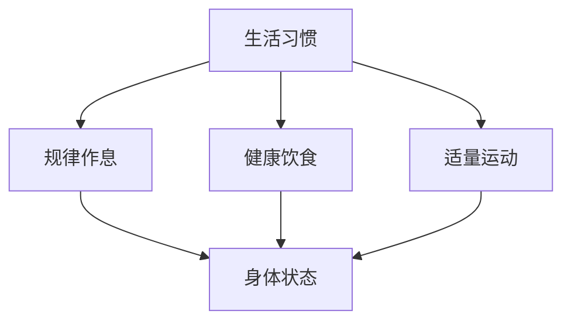

#### 3.3 精神追求

精神追求是内在丰盈感的重要来源。它包括对知识的渴望、对艺术的欣赏、对信仰的坚持等。通过精神追求，个体能够拓展自己的内心世界，提升自我价值和幸福感。

**核心概念与联系：**

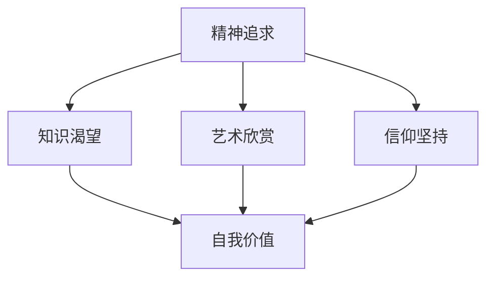

## 第二部分：实践中的内在丰盈感培育

### 第4章：个人成长与自我实现

#### 4.1 职业发展

职业发展是实现内在丰盈感的重要途径之一。通过制定清晰的职业规划，不断提升职业技能，个体能够在职业领域获得成就感和满足感。

**核心概念与联系：**

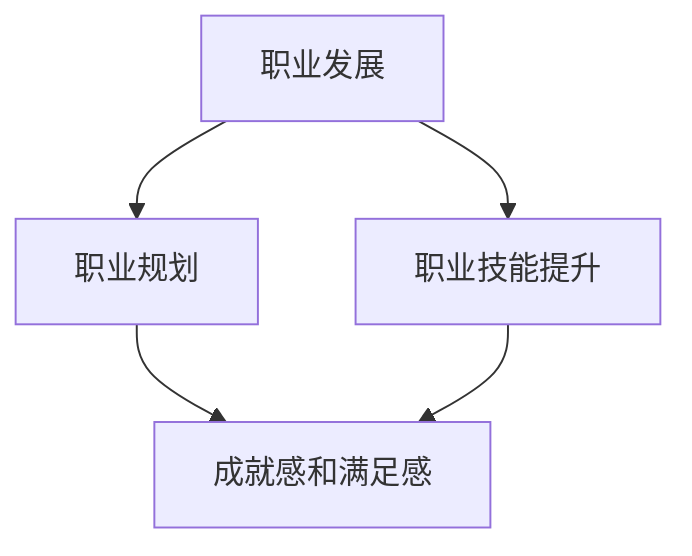

#### 4.2 学业成就

学业成就对内在丰盈感的培育同样具有重要影响。通过改进学习方法，积极参与学术研究，个体能够在学业领域获得成就感和满足感。

**核心概念与联系：**

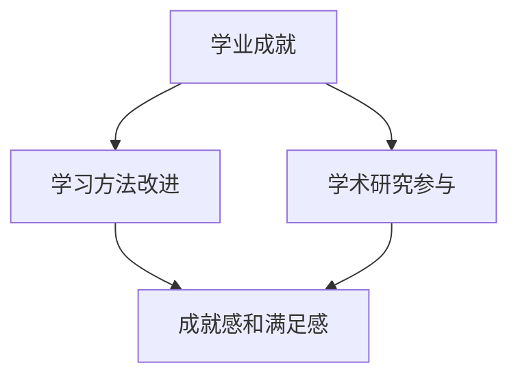

### 第5章：家庭与社会关系的处理

#### 5.1 家庭关系

家庭关系是内在丰盈感的重要支撑。通过有效的家庭沟通，解决家庭矛盾，个体能够在家庭中获得情感支持和满足感。

**核心概念与联系：**

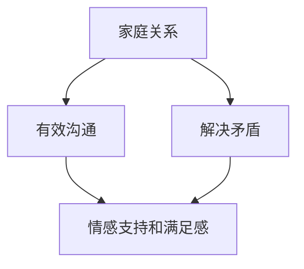

#### 5.2 社会互动

社会互动对于内在丰盈感的培育同样具有重要影响。通过培养社交技能，承担社会责任，个体能够在社会中获得认同感和满足感。

**核心概念与联系：**

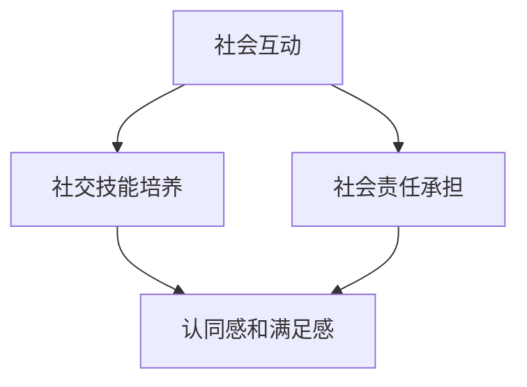

### 第6章：精神世界的丰富与拓展

#### 6.1 文化艺术

文化艺术是丰富精神世界的重要途径。通过提升艺术品位，积极参与文化活动，个体能够拓展自己的精神视野，获得内心的满足感。

**核心概念与联系：**

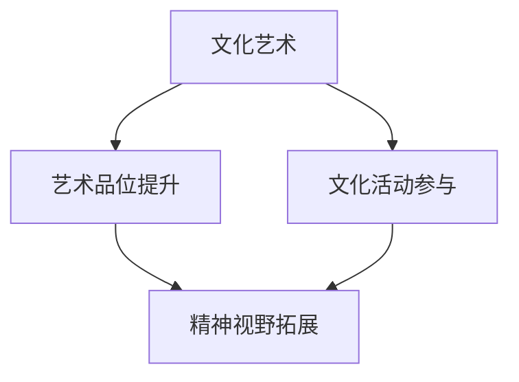

#### 6.2 心灵成长

心灵成长是内在丰盈感的重要组成部分。通过培养内在的平静与和谐，个体能够提升自我认知，实现内心的满足感。

**核心概念与联系：**

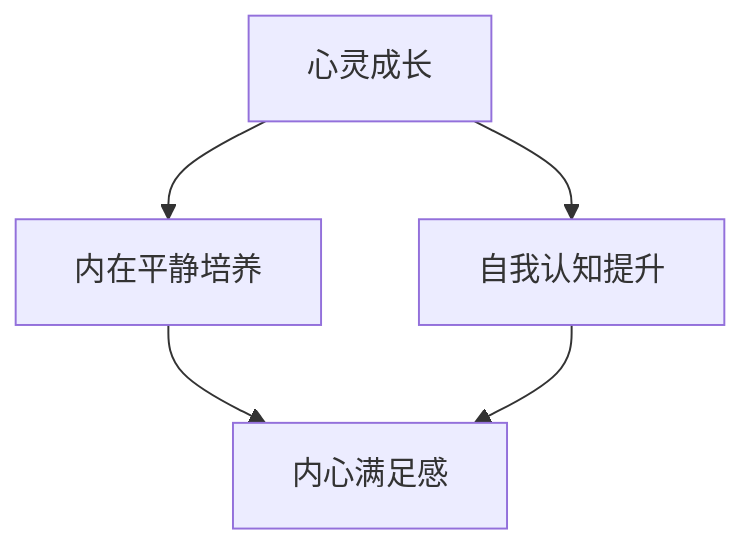

## 第三部分：内在丰盈感培育的案例与实践

### 第7章：成功人士的内在丰盈感培育经验

#### 7.1 成功人士的内在丰盈感培育方法

成功人士通常通过自我认知、情绪管理和精神追求等途径培育内在丰盈感。以下是一些成功人士的内在丰盈感培育方法：

1. **自我认知**：通过自我反思和心理咨询，成功人士能够深入了解自己的价值观、兴趣和潜能，从而做出更符合内心期望的选择。
2. **情绪管理**：成功人士善于调节情绪，通过冥想、运动等方式保持心理平衡，提高应对压力的能力。
3. **精神追求**：成功人士通常对知识、艺术和信仰有深厚的追求，通过不断学习和探索，拓展自己的精神世界。

**核心概念与联系：**

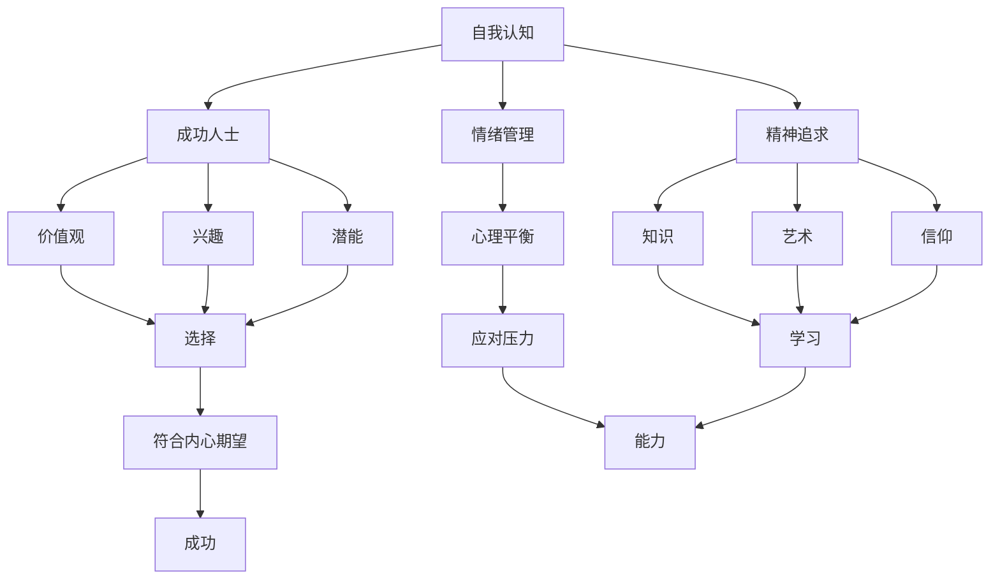

#### 7.2 内在丰盈感培育的实践成果

通过有效的内在丰盈感培育，成功人士不仅实现了个人的成长和自我实现，还为社会做出了积极贡献。以下是一些实际案例：

1. **企业家**：通过自我认知和情绪管理，企业家能够在商业领域中保持清晰的头脑和稳定的情绪，从而做出明智的决策，推动企业的发展。
2. **学者**：通过精神追求，学者能够不断拓展自己的学术视野，取得突破性的研究成果，为社会进步做出贡献。
3. **艺术家**：通过艺术创作，艺术家能够表达自己的内心世界，触动他人的情感，从而丰富社会的精神文化。

**核心概念与联系：**

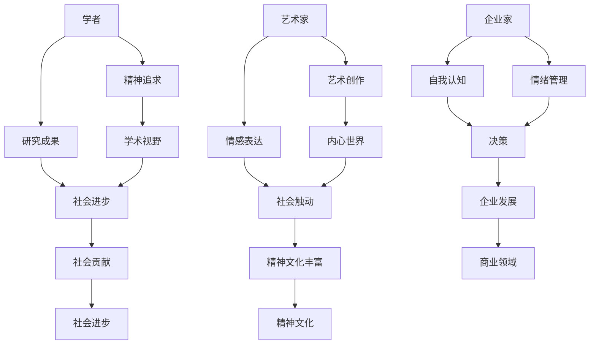

### 第8章：内在丰盈感培育的未来趋势

#### 8.1 社会发展与内在丰盈感

随着社会的不断发展，人们对内在丰盈感的追求将越来越强烈。这不仅是个人成长的必然趋势，也是社会进步的体现。以下是一些未来趋势：

1. **心理健康重视**：随着心理健康问题的日益突出，社会对内在丰盈感培育的关注将进一步提升。心理咨询服务、心理教育等将成为主流。
2. **数字科技赋能**：人工智能、虚拟现实等技术将赋能内在丰盈感培育，为个体提供更加个性化、高效的支持。
3. **终身学习**：随着知识的快速更新，终身学习将成为常态。个体通过不断学习，不断提升自我，实现内在丰盈感。

**核心概念与联系：**

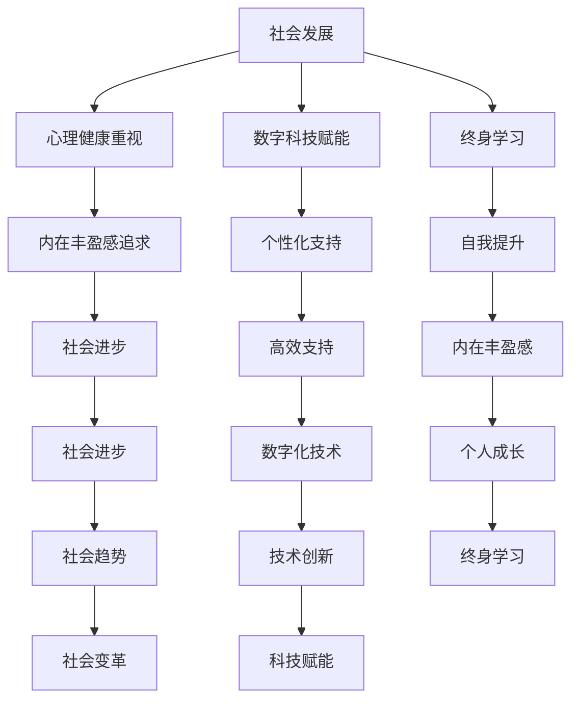

#### 8.2 内在丰盈感培育的前景展望

未来，内在丰盈感培育将呈现出以下几个趋势：

1. **跨学科融合**：心理学、教育学、哲学等学科将相互融合，为内在丰盈感培育提供更加全面的理论支持和实践方法。
2. **技术创新**：虚拟现实、人工智能等技术的应用将使内在丰盈感培育更加个性化和高效化。
3. **社会支持**：政府、企业和社会组织将加大对内在丰盈感培育的投入和支持，推动社会整体的内在精神素质提升。

**核心概念与联系：**

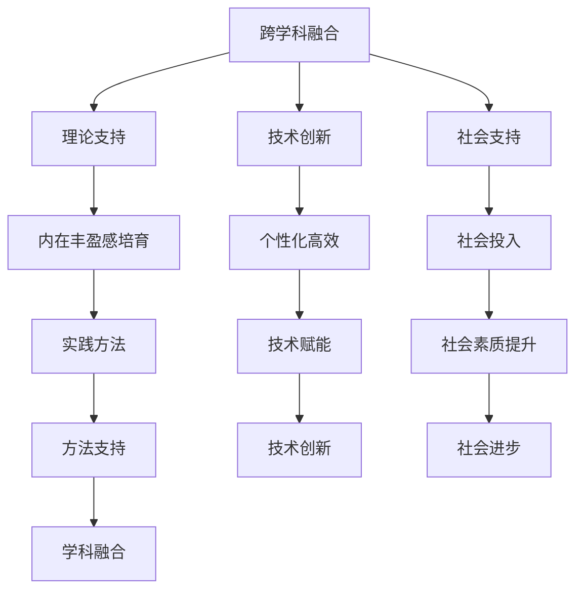

## 附录：内在丰盈感培育的实用工具与资源

### 附录1：内在丰盈感培育的实用书籍推荐

1. **《自控力》**：作者凯利·麦格尼格尔，通过科学研究介绍如何提升自控力，从而实现自我管理和成长。
2. **《如何赢得朋友与影响他人》**：作者戴尔·卡耐基，经典的人际关系指南，帮助读者建立和维护健康的人际关系。
3. **《当下的力量》**：作者埃克哈特·托勒，探讨如何通过正念冥想等方式，提升内在平静与和谐。

### 附录2：内在丰盈感培育的心理咨询与治疗机构推荐

1. **中国心理学会心理咨询师工作委员会**：提供专业、权威的心理咨询服务。
2. **北京回龙观医院心理咨询中心**：具有丰富的心理治疗经验和专业的治疗团队。

### 附录3：内在丰盈感培育的在线资源平台推荐

1. **Coursera**：提供各种在线课程，包括心理学、冥想和自我管理等。
2. **YouTube**：有许多免费的心理健康和冥想教程，可以帮助读者在家练习。
3. **Reddit**：有一个专门的心理学板块，可以获取各种心理健康相关的信息和资源。

## 总结

内在丰盈感是现代社会中个体追求的重要目标。通过培育自我认知、情绪管理和精神追求，个体能够实现内心的满足与富足。随着社会的不断发展，人们对内在丰盈感的追求将愈发强烈。因此，培育内在丰盈感不仅对个人成长具有重要意义，也是社会进步的体现。让我们一起努力，建设丰富的精神世界，追求更加丰盈的人生。

### 作者信息

作者：AI天才研究院/AI Genius Institute & 禅与计算机程序设计艺术 /Zen And The Art of Computer Programming

这篇文章从内在丰盈感的定义、核心要素、实践方法等多个角度进行了深入探讨，结合实际案例和实践经验，为读者提供了全面、系统的指导。希望这篇文章能够帮助读者理解并培育自己的内在丰盈感，建设一个更加丰富、和谐的精神世界。

