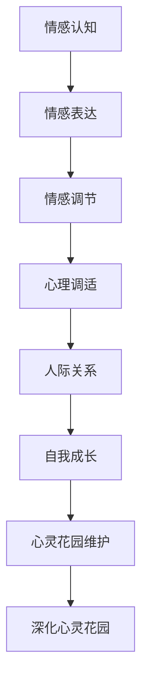

                 

## 引言：心灵花园的重要性

在快节奏的现代生活中，人们往往忽略了内心的声音。然而，心灵的丰盈对于个人的幸福感和社会的整体和谐至关重要。本文将探讨如何通过培育心灵花园来提升个人心理健康，进而为社会贡献积极力量。

### 心灵花园的概念解读

心灵花园是一个比喻，指的是我们内心世界的和谐与美好。与传统花园注重外在的美丽不同，心灵花园关注的是内心的成长、情感的平衡和心灵的宁静。它不仅仅是一个心理状态，更是一个积极培育的过程。

### 心灵花园的重要性

1. **对个人生活的积极影响**：心灵花园能够帮助个体更好地处理生活中的压力和挑战，提高生活质量。
2. **对心理健康的重要性**：心灵花园的培育能够增强个体的心理韧性，减少心理问题的发生。
3. **对社会和谐的贡献**：一个内心充盈的人更容易与他人建立良好的关系，从而促进社会的和谐与稳定。

### 目标读者

本文适合对心理健康和心灵成长有兴趣的读者，包括个人心理咨询师、心理健康从业者以及普通大众。无论您是专业人士还是寻求自我提升的个体，本文都希望能为您带来启发和帮助。

### 结构与内容

本文将分为两个主要部分：

1. **第一部分：心灵花园的概念与建设**：包括心灵花园的概念解读、建立基础和规划与设计。
2. **第二部分：培育心灵花园的方法与实践**：涵盖情感管理、心理调适、人际关系、自我成长以及心灵花园的维护与深化。

通过系统的分析和详细的讲解，本文旨在帮助读者理解并实践心灵花园的培育方法，从而实现心灵的丰盈和生活的美好。

### 结论

在忙碌的生活中，培育心灵花园是不可或缺的。它不仅对个人的心理健康有积极影响，还能为社会的和谐贡献力量。希望通过本文的分享，能够激发更多人关注内心成长，共同创造一个更加美好的世界。

---

### 文章关键词

心灵花园、心理健康、情感管理、心理调适、人际关系、自我成长

### 文章摘要

本文探讨了心灵花园的概念、重要性以及培育方法。通过分析情感管理、心理调适、人际关系和自我成长等方面，本文提供了一套系统化的心灵花园建设方案，旨在帮助读者实现内心的丰盈和生活的和谐。文章结构清晰，内容丰富，适合广大读者参考和实践。

---

## 第一部分：心灵花园的概念与建设

### 第1章：心灵花园的意义与重要性

#### 1.1 心灵花园的概念解读

心灵花园是一个比喻性的概念，指的是我们内心世界的和谐与美好。与传统花园注重外在的美丽和视觉享受不同，心灵花园强调的是内在的情感平衡、心理韧性和精神成长。它不仅是一个心理状态，更是一个需要通过持续培育和锻炼的过程。

在心理学中，心灵花园通常被视为一个“情感容器”，它能够帮助个体更好地处理生活中的压力和挑战。与传统花园相比，心灵花园的特点包括：

1. **注重内在体验**：心灵花园关注个体的内心感受和情感体验，而不仅仅是外在的物质环境。
2. **情感平衡**：心灵花园的目标是帮助个体达到情感上的平衡，避免极端情绪的影响。
3. **持续培育**：与传统花园不同，心灵花园需要持续的维护和培育，以保持其活力和美丽。

#### 1.2 心灵花园与传统花园的区别

传统花园通常指的是室外种植花草、树木和园林景观的场所。它的主要目标是创造一个视觉上美观和舒适的环境，通常涉及以下方面：

1. **植物选择与搭配**：根据季节、气候和场地特点选择合适的植物种类，并进行合理的搭配，以创造出美丽的景观。
2. **景观设计**：涉及地形改造、水景设计、道路布局等方面，以实现整体美学的和谐。
3. **维护与管理**：定期修剪、施肥、浇水等维护工作，以保持花园的整洁和美观。

相比之下，心灵花园更注重个体的内在体验和心理状态。以下是心灵花园与传统花园的几个主要区别：

1. **目标不同**：传统花园的目标是创造一个视觉上的美丽环境，而心灵花园的目标是培养个体的内心和谐和心理韧性。
2. **方法不同**：传统花园主要依靠外在的劳动和管理，而心灵花园则强调内在的自我觉察和情感管理。
3. **成果不同**：传统花园的成果是外在的美景，而心灵花园的成果是内在的心理健康和情感平衡。

#### 1.3 心灵花园的重要性

心灵花园的重要性不仅体现在个人层面，还对社会有深远的影响。以下是心灵花园对个人和社会的重要性的详细分析：

**对个人生活的积极影响**

1. **情感平衡**：心灵花园能够帮助个体达到情感上的平衡，减少负面情绪的影响，提高生活质量。
2. **心理韧性**：通过培育心灵花园，个体能够增强心理韧性，更好地应对生活中的压力和挑战。
3. **自我实现**：一个内心充盈的人更容易实现自我价值，追求更高的生活目标。

**对心理健康的重要性**

1. **减少心理问题**：心灵花园的培育能够预防心理问题的发生，如焦虑、抑郁等。
2. **提高心理韧性**：通过持续的内心修炼，个体能够提高心理韧性，更好地应对心理压力。
3. **促进心理健康**：心灵花园的建立和维护有助于提高个体的心理健康水平，减少心理问题的发生。

**对社会和谐的贡献**

1. **促进人际关系**：一个内心充盈的人更容易与他人建立良好的关系，从而促进社会的和谐与稳定。
2. **减少社会冲突**：心理健康水平高的个体更不容易产生极端情绪和行为，从而减少社会冲突。
3. **提升社会整体幸福**：一个充满内心充盈的个体组成的社会，整体幸福感会显著提升。

综上所述，心灵花园不仅是个人心理健康的重要保障，也是社会和谐与稳定的重要基石。通过理解心灵花园的概念和重要性，我们可以更好地认识到其在个人成长和社会发展中的关键作用。

---

### 第2章：建立心灵花园的基础

#### 2.1 了解自己的内心世界

建立心灵花园的第一步是深入了解自己的内心世界。这不仅包括对情感的认知，还涉及自我反思和情绪管理。以下是深入了解内心世界的几个关键方面：

**情感认知**

情感认知是理解自己内心世界的核心。情感可以分为基本情感和复合情感。基本情感包括快乐、愤怒、悲伤和恐惧等，而复合情感则是由这些基本情感相互交织和混合而成的情感，如焦虑、厌恶和爱等。了解自己的情感状态，能够帮助我们更好地应对生活中的各种情境。

**自我反思**

自我反思是深入了解内心世界的另一个重要方法。通过自我反思，我们可以识别自己的思维模式、情感反应和行为习惯。自我反思有助于我们识别内心深处的需求和价值观，从而更准确地设定心灵花园的目标。

**情绪管理**

情绪管理是维护心灵花园的重要技能。有效的情绪管理包括对负面情绪的识别、表达和调节。通过情绪管理，我们可以更好地控制自己的情绪，避免情绪的过度反应，从而保持内心的平和和稳定。

**实践建议**

1. **情感日志**：记录每天的情感体验，有助于我们更好地了解自己的情感状态。
2. **冥想练习**：通过冥想，我们可以静心养性，提高自我觉察能力。
3. **心理咨询**：寻求专业的心理咨询可以帮助我们更深入地了解自己的内心世界。

#### 2.2 设定心灵花园的目标

在了解自己的内心世界之后，下一步是设定心灵花园的目标。设定目标是心灵花园建设的基础，它为我们提供了明确的方向和动力。以下是设定心灵花园目标的几个关键步骤：

**个性化目标设定**

每个人的内心世界都是独特的，因此心灵花园的目标也应是个性化的。在设定目标时，我们应该考虑自己的兴趣、需求和价值观。例如，如果您对心理健康有较高的关注，您可以将提高心理健康水平作为目标。

**目标实现的可行性分析**

设定的目标应具有可行性，即通过合理的努力可以实现。在设定目标时，我们需要考虑自身的能力、资源和时间。例如，如果目标是每天阅读一小时，我们需要确保有足够的时间和精力去实现这个目标。

**目标的具体化**

具体化的目标更容易实现和追踪。在设定目标时，我们应该使用具体的、可衡量的指标。例如，将“提高心理健康水平”具体化为“每天进行30分钟冥想练习”。

**实践建议**

1. **设定短期和长期目标**：短期目标有助于我们快速看到进步，而长期目标则为我们提供了长期的动力。
2. **定期评估和调整目标**：随着时间的推移，我们的需求和情况可能会发生变化，因此需要定期评估和调整目标。
3. **使用工具和方法**：使用目标管理工具（如SMART目标设定法）可以帮助我们更有效地设定和实现目标。

#### 2.3 心灵花园的规划和设计

在设定目标之后，下一步是规划和设计心灵花园。规划和设计包括花园布局、元素选择和日常维护等方面。以下是如何规划和设计心灵花园的几个关键步骤：

**花园布局设计**

花园布局设计是心灵花园建设的基础。在布局设计时，我们应该考虑以下因素：

1. **空间利用**：合理利用空间，确保花园的舒适性和实用性。
2. **功能区划分**：根据需要将花园划分为不同的功能区，如冥想区、阅读区和休闲区等。
3. **景观协调**：通过合理的植物搭配和景观设计，营造出和谐自然的氛围。

**花园元素的选定**

花园元素的选定包括植物、家具和装饰品等。以下是选择花园元素的一些建议：

1. **植物选择**：选择适合本地气候和土壤条件的植物，并考虑植物的色彩、形状和香气。
2. **家具和装饰**：选择舒适、实用的家具和装饰品，如舒适的躺椅、盆栽和挂画等。
3. **照明设计**：合理设计照明，营造出温馨的氛围。

**日常维护**

日常维护是保持心灵花园活力和美丽的关键。以下是日常维护的一些建议：

1. **定期修剪**：定期修剪植物，保持花园的整洁和美观。
2. **浇水施肥**：根据植物的需要进行浇水和施肥，确保植物的健康成长。
3. **病虫害防治**：定期检查植物，及时发现并防治病虫害。

**实践建议**

1. **制定维护计划**：制定详细的维护计划，确保花园的定期维护。
2. **邀请专业人士**：如果条件允许，可以邀请专业的园艺师进行设计和维护指导。
3. **社区参与**：如果条件允许，可以邀请家人或朋友参与花园的规划和维护，增进彼此的感情。

通过了解自己的内心世界、设定明确的目标以及规划和设计心灵花园，我们可以开始建设一个属于自己的心灵花园。这个过程不仅有助于提升我们的心理健康，还能为我们的生活带来更多的乐趣和满足。

### 总结

在建设心灵花园的过程中，我们首先要深入了解自己的内心世界，包括情感认知、自我反思和情绪管理。接着，我们要设定明确的心灵花园目标，确保这些目标是个性化的、可行的，并具体化这些目标。最后，我们要进行详细的花园规划和设计，选择合适的元素并制定日常维护计划。通过这些步骤，我们可以逐步培育出一片属于自己的心灵花园，为心理健康和整体生活质量的提升奠定坚实的基础。

---

### 第3章：情感管理

情感管理是心灵花园的核心组成部分，它关乎我们如何识别、表达和调节自己的情感。通过有效的情感管理，我们能够更好地处理生活中的挑战，提升生活质量。以下是情感管理的关键环节和具体实践方法。

#### 3.1 情感认知

情感认知是情感管理的第一步，它要求我们能够准确地识别和理解自己的情感状态。情感认知包括以下方面：

1. **情感分类**：情感可以分为基本情感（如快乐、愤怒、悲伤、恐惧）和复合情感（如焦虑、厌恶、爱）。了解这些情感的区别有助于我们更准确地识别自己的情感。
   
2. **情感识别**：通过反思和自我观察，我们能够识别出自己正在体验的情感。这可以通过记录情感日志、日记或与朋友、家人交流来实现。

3. **情感理解**：理解情感的来源和意义，有助于我们更好地应对情感波动。例如，愤怒可能源于感到不公平或被冒犯，悲伤可能源于失去或失望。

#### 3.2 情感表达

情感表达是情感管理的另一个关键环节。有效的情感表达能够帮助我们与他人建立更好的关系，并避免情感的压抑和积累。以下是情感表达的几个关键点：

1. **健康情感表达**：健康情感表达意味着在适当的时间和场合以适当的方式表达情感。这包括清晰、具体地表达自己的感受，而不是通过指责、抱怨或沉默来表达。

2. **非暴力沟通**：非暴力沟通是一种有效的情感表达方法，它强调倾听他人、表达自己的感受和需求，并通过合作解决问题。这种方法有助于减少冲突，建立和谐的人际关系。

3. **情感表达的练习**：通过角色扮演、情感训练和团体互动等练习，我们可以提高情感表达能力。例如，可以尝试在安全的社交环境中与他人分享自己的情感体验。

#### 3.3 情感调节

情感调节是指通过一系列策略和技巧来调节和缓解负面情感。以下是一些有效的情感调节方法：

1. **认知重构**：认知重构是通过改变负面思维模式来调节情感。例如，将“我永远做不好这件事”这种消极思维转变为“我可以尝试改进并学习”。

2. **情绪释放**：情绪释放包括哭泣、运动、写日记、艺术创作等，这些方法可以帮助我们释放积压的情感，减轻心理压力。

3. **放松技巧**：放松技巧如深呼吸、冥想、瑜伽等有助于缓解紧张和焦虑，提升心理平衡。深呼吸可以通过减缓心率、降低血压来迅速缓解紧张情绪。

4. **情感调节练习**：通过定期的情感调节练习，我们可以提高应对负面情感的能力。例如，每天花几分钟时间进行冥想或放松练习。

#### 情感管理技巧

1. **识别触发点**：了解哪些情境或事件容易引发负面情感，有助于我们提前准备和应对。

2. **情绪日记**：记录每天的情感波动，可以帮助我们识别情感模式，找出调节情感的策略。

3. **寻求支持**：与他人分享情感体验，寻求专业心理咨询，都是有效的情感管理方法。

#### 实践建议

1. **建立情感管理习惯**：定期进行情感反思、表达和调节，将其作为日常生活的一部分。

2. **培养自我意识**：通过自我观察和反思，提高对自身情感的认知和理解。

3. **寻求专业帮助**：在需要时，寻求心理咨询师或其他专业人士的帮助，以获得更深入的情感管理指导。

通过系统学习情感管理技巧并付诸实践，我们可以在心灵花园中培育出更加健康的情感状态，从而提升个人幸福感和生活质量。

### 总结

情感管理是心灵花园建设中的重要环节，它关乎我们如何识别、表达和调节自己的情感。通过情感认知、健康表达和有效调节，我们可以更好地处理生活中的挑战，提升心理韧性，实现内心的平衡与和谐。培养情感管理能力不仅有助于个人成长，还能为建立和谐的人际关系和社会和谐奠定基础。让我们共同努力，在心灵花园中培育出更加健康的情感状态，创造美好的人生。

---

### 第4章：心理调适

#### 4.1 心理调适的重要性

心理调适是指个体通过一系列方法来调节自己的心理状态，使其达到健康和平衡。在现代社会中，心理调适的重要性日益凸显。以下是心理调适对心理健康、生活质量和整体幸福感的重要影响：

**心理健康的重要性**

心理健康是指个体在情绪、认知和行为方面的健康状态。一个心理健康的人能够更好地应对生活中的压力和挑战，保持积极的生活态度。以下是心理健康的重要性：

1. **情感平衡**：通过心理调适，个体能够更好地管理自己的情绪，减少负面情绪的影响，如焦虑、抑郁和愤怒等。
2. **认知功能**：心理健康有助于提高个体的认知功能，包括注意力、记忆力和决策能力等。
3. **社会适应**：心理健康有助于个体更好地适应社会环境，建立良好的人际关系，提升社交技能。

**对生活质量的影响**

心理调适对生活质量的影响是全方位的。以下是心理调适如何提升生活质量的几个方面：

1. **减少压力**：有效的心理调适方法，如放松技巧和认知行为疗法，可以帮助个体减少压力，提升生活质量。
2. **提升幸福感**：通过心理调适，个体能够更好地体验生活中的积极情感，提高幸福感。
3. **增强应对能力**：心理调适有助于个体提高应对能力和韧性，从而更好地应对生活中的挑战和困难。

**对整体幸福感的影响**

整体幸福感是指个体对自己生活各个方面的整体满意度和幸福感。心理调适对整体幸福感的影响体现在以下几个方面：

1. **提升情感体验**：通过心理调适，个体能够更好地体验生活中的美好时刻，增强情感的丰富性。
2. **提升生活目标**：心理健康有助于个体明确自己的生活目标，追求更高的成就和满足感。
3. **提升生活满意度**：通过心理调适，个体能够提升对生活的整体满意度，减少负面情绪的干扰。

#### 4.2 心理调适的方法

心理调适的方法多种多样，包括自我调适和寻求专业帮助。以下是几种常用的心理调适方法：

**自我调适方法**

1. **放松技巧**：放松技巧包括深呼吸、冥想、瑜伽和渐进性肌肉放松等。这些方法有助于减缓身体的紧张和焦虑，提高心理平衡。

2. **情绪调节**：情绪调节包括认知重构、认知行为疗法和情绪释放技巧。通过改变负面思维模式和处理负面情绪，个体能够提高情绪调节能力。

3. **自我反思**：通过自我反思，个体能够深入了解自己的内心世界，识别和解决心理问题。自我反思可以通过写日记、心理咨询或与信任的朋友交流来实现。

**寻求专业帮助**

1. **心理咨询**：心理咨询是一种有效的心理调适方法，通过专业的心理咨询师，个体能够获得个性化的指导和支持，解决心理问题。

2. **药物治疗**：在某些情况下，心理问题可能需要药物治疗，如抑郁症和焦虑症等。药物治疗通常由精神科医生或心理医生开具。

3. **团体治疗**：团体治疗是一种在小组环境中进行的心理治疗，有助于个体获得社交支持和情感支持。

#### 心理调适实践

为了有效地进行心理调适，以下是一些建议和案例：

**放松练习**

**步骤**：

1. 找一个安静舒适的地方，坐或躺下来。
2. 深呼吸，每次呼吸都尽量深吸慢呼。
3. 放松身体的各个部位，从脚开始到头部。
4. 专注于呼吸，让自己的思绪平静下来。

**示例**：

假设小明最近因为工作压力感到焦虑。他决定每天晚上进行放松练习。一周后，小明的焦虑感明显减轻，睡眠质量也有所提高。

**自我反思**

**步骤**：

1. 找一个安静的时间，坐下来。
2. 想想自己最近的生活，包括工作、家庭和朋友等。
3. 思考自己的情绪和感受，找出可能的原因。
4. 制定行动计划，解决发现的问题。

**示例**：

小华最近感到情绪低落，她决定进行自我反思。通过反思，她发现自己的情绪低落与工作压力和人际关系有关。她决定调整工作时间表，增加休息时间，并参加社交活动以改善人际关系。

通过以上实践和建议，我们可以看到心理调适对于提升心理健康和生活质量的重要性。心理调适不仅需要了解和掌握相关的方法，还需要付诸实践，持续地进行。只有通过持续的心理调适，我们才能在心灵花园中培育出更加健康和和谐的心理状态。

### 总结

心理调适是保持心理健康和提升生活质量的关键。通过了解心理调适的重要性，掌握多种调适方法，并付诸实践，我们可以有效地调节自己的心理状态，减少压力和负面情绪的影响。心理调适不仅有助于个人成长，还能促进人际关系和社会和谐。让我们共同努力，通过心理调适，培育出更加健康的心灵花园。

---

### 第5章：人际关系

#### 5.1 人际关系的重要性

人际关系是指个体在社会交往过程中与他人建立的联系和互动。人际关系对心理健康和个人成长具有深远的影响。以下是人际关系对心理健康和个人成长的重要性：

**对心理健康的影响**

1. **情感支持**：良好的人际关系可以为我们提供情感支持，减轻心理压力。当我们遇到困难和挑战时，朋友和家人的支持和理解能够帮助我们更好地应对。
   
2. **减少孤独感**：人际关系有助于减少孤独感，提高心理健康水平。一个支持性的人际网络可以为我们提供安全感和归属感。

3. **情绪调节**：与他人交流和互动可以帮助我们调节情绪。例如，分享快乐可以增加积极的情感体验，倾诉烦恼可以减轻负面情绪。

4. **心理健康促进**：人际关系有助于促进心理健康。与朋友和家人的互动可以提高自尊和自信，减少焦虑和抑郁的风险。

**对个人成长的影响**

1. **自我认知**：与他人互动可以帮助我们更好地了解自己。通过观察他人的反应和反馈，我们可以认识到自己的优点和不足，促进自我成长。

2. **社交技能**：良好的人际关系有助于提升社交技能。通过与他人交流和互动，我们可以学习如何更好地沟通、合作和解决问题。

3. **价值观和信念**：人际关系可以影响我们的价值观和信念。与不同背景的人交往，可以拓宽我们的视野，帮助我们形成更加成熟和多元的世界观。

4. **个人成就**：良好的人际关系有助于我们实现个人目标。通过与他人合作和互相支持，我们可以更有效地实现自己的职业和人生目标。

#### 5.2 人际关系的管理

建立和维护良好的人际关系需要一定的技巧和努力。以下是人际关系管理的几个关键方面：

**建立健康的人际关系**

1. **倾听**：倾听是建立健康人际关系的重要基础。通过倾听，我们能够更好地理解他人的需求和感受，建立信任和共鸣。

2. **尊重**：尊重他人是建立健康人际关系的关键。尊重他人的观点、感受和需求，能够促进和谐与信任。

3. **诚实**：诚实是建立健康人际关系的基石。诚实并不意味着必须说出所有真相，而是要在尊重和理解的基础上，进行真诚的交流和沟通。

4. **共情**：共情是理解和感受他人情绪和需求的能力。通过共情，我们可以更好地与他人建立情感连接，增强人际关系的质量。

**处理冲突**

冲突是人际关系中不可避免的一部分。以下是一些处理冲突的有效方法：

1. **有效沟通**：有效沟通是解决冲突的关键。在沟通时，要注重表达自己的观点和感受，同时倾听对方的意见和需求。

2. **冷静分析**：在处理冲突时，要保持冷静，避免情绪化的反应。通过冷静分析，我们可以更好地理解冲突的本质，并找到解决问题的方法。

3. **妥协和让步**：在某些情况下，妥协和让步是解决冲突的有效方式。通过妥协，我们可以找到双方都能接受的解决方案，维护人际关系的和谐。

4. **寻求第三方帮助**：当冲突无法自行解决时，可以寻求第三方帮助，如调解人或心理咨询师，以协助解决问题。

**提升情商**

情商是指我们识别、理解和管理自己及他人情绪的能力。以下是一些提升情商的方法：

1. **自我意识**：通过自我反思，提高对自己的情绪和需求的认知，增强自我意识。

2. **情绪调节**：学习情绪调节技巧，如深呼吸、冥想和放松练习，帮助我们更好地管理自己的情绪。

3. **同理心**：培养同理心，通过理解他人的情绪和需求，建立更好的情感连接。

4. **沟通技巧**：提升沟通技巧，如有效倾听、清晰表达和积极反馈，帮助我们更好地与他人交流。

#### 实践建议

1. **建立日常交流**：通过日常交流，保持与亲朋好友的联系，增进了解和信任。
2. **参与社交活动**：积极参与社交活动，拓展社交圈，结识新朋友。
3. **定期反思**：定期反思自己的人际关系，识别问题并寻找改进的方法。

通过了解人际关系的重要性，掌握人际关系管理的方法，我们可以建立和维护良好的人际关系，提升心理健康和个人成长。

### 总结

人际关系在心理健康和个人成长中扮演着至关重要的角色。通过建立健康的人际关系、有效处理冲突和提升情商，我们可以更好地应对生活中的挑战，提升生活质量。人际关系不仅是个人幸福的重要来源，也是社会和谐的重要基础。让我们共同努力，建立和维护良好的人际关系，创造更加美好的人生。

---

### 第6章：心灵花园中的自我成长

#### 6.1 自我成长的意义

自我成长是指个体通过不断学习、反思和行动，提升自我认知、技能和价值观的过程。在心灵花园中，自我成长是实现内心丰盈和心理健康的关键。以下是自我成长对个人成长和心理健康的深远影响：

**对个人成长的影响**

1. **提升自我认知**：自我成长帮助我们更深入地了解自己的内心世界、兴趣和价值观。通过自我反思和学习，我们能够更好地认识自己，找到自己的定位和目标。
   
2. **增强自我效能感**：通过不断挑战自我和学习新技能，我们能够提升自我效能感，相信自己能够克服困难并实现目标。

3. **促进个人成就**：自我成长激发我们的潜能，推动我们在事业、学习和生活中取得更高的成就。

**对心理健康的影响**

1. **提高心理韧性**：自我成长能够增强我们的心理韧性，使我们更好地应对生活中的压力和挑战。

2. **减少焦虑和抑郁**：通过自我成长，我们能够更好地管理自己的情绪，减少焦虑和抑郁的风险。

3. **提升幸福感**：自我成长让我们能够更加积极地面对生活，体验更多的成就和满足感，从而提高幸福感。

#### 6.2 自我成长的方法

自我成长是一个持续的过程，需要我们付诸实践。以下是几种有效的自我成长方法：

**学习与知识积累**

1. **终身学习**：在现代社会，知识更新迅速，终身学习成为自我成长的重要途径。通过学习新知识和技能，我们能够不断提升自己的竞争力。

2. **阅读**：阅读是获取知识和启发的重要方式。通过阅读书籍、文章和报告，我们可以开阔视野，提升思维能力。

3. **在线课程**：在线课程提供了丰富的学习资源，可以帮助我们学习新技能和知识。通过参加在线课程，我们可以根据自己的时间安排进行学习。

**自我反思**

1. **日记**：写日记是自我反思的有效方法。通过记录自己的想法、感受和经历，我们能够更好地理解自己，找到成长的方向。

2. **心理咨询**：心理咨询师可以帮助我们深入反思自己的内心世界，识别和解决心理问题。

3. **反思性对话**：与信任的朋友或家人进行反思性对话，可以帮助我们从不同角度看待自己，获取宝贵的反馈和建议。

**行动与实践**

1. **设定目标**：设定明确、可行的目标，可以帮助我们集中精力，实现自我成长。

2. **行动计划**：制定详细的行动计划，将目标分解为具体的步骤，有助于我们更加高效地实现目标。

3. **实践机会**：通过参加实习、项目或志愿服务等活动，我们可以将所学知识应用于实践中，提升实际能力。

**培养习惯**

1. **养成好习惯**：养成健康的生活习惯，如规律作息、健康饮食和定期锻炼，有助于提升整体生活质量。

2. **持续改进**：自我成长是一个持续的过程，我们需要不断反思和改进自己的行为和习惯。

**实践建议**

1. **制定学习计划**：制定长期和短期的学习计划，确保持续的学习和成长。

2. **记录成长日志**：记录自己的成长过程，包括学习成果、反思和感悟，有助于我们跟踪进步和调整策略。

3. **寻求反馈**：定期向信任的朋友、家人或专业人士寻求反馈，以便我们了解自己的成长方向。

通过以上方法，我们可以在心灵花园中持续地自我成长，提升自我认知、技能和价值观，实现内心的丰盈和幸福感的提升。

### 总结

自我成长是心灵花园中不可或缺的一部分，它关乎我们的自我认知、心理韧性和整体幸福感。通过学习与知识积累、自我反思、行动与实践和培养习惯，我们可以在心灵花园中实现自我成长，提升个人能力和心理健康。自我成长不仅有助于我们实现个人目标，还能为社会的进步和发展做出贡献。让我们共同在心灵花园中培育自我成长的种子，收获更加美好的人生。

---

### 第7章：心灵花园的维护与深化

#### 7.1 心灵花园的维护

心灵花园的维护是确保其长期美丽和健康的关键步骤。通过定期的清理和更新，我们可以保持花园的美观与和谐，为心灵提供持续的支持与滋养。以下是心灵花园维护的几个关键点：

**定期清理**

1. **物理清理**：定期清理花园中的杂草、落叶和垃圾，保持花园的整洁。这不仅可以美化环境，还能减少病虫害的发生。
   
2. **情绪清理**：通过冥想、瑜伽或写日记等方式，定期清理内心的负面情绪和压力。情绪清理有助于我们保持心理平衡和清晰的思维。

**更新设计**

1. **季节性更新**：根据季节变化，更换花园中的植物和装饰，保持花园的生机与活力。例如，春季可以种植花苗，秋季可以收获果实。

2. **创新设计**：定期进行花园设计的创新，尝试新的植物搭配或景观设计。创新设计可以激发我们的创造力和灵感，为心灵花园带来新的活力。

**保持和谐**

1. **元素协调**：确保花园中的各个元素（如植物、家具、装饰）相互协调，创造出和谐美观的景观。和谐的花园环境有助于提升我们的心理健康和幸福感。

#### 7.2 心灵花园的深化

心灵花园的深化意味着我们在原有的基础上，进一步提升自我认知和心理健康水平。深化心灵花园不仅有助于我们实现个人目标，还能为社会的和谐与进步做出贡献。以下是深化心灵花园的几个方法：

**深化自我认知**

1. **深度反思**：通过深度反思，我们能够更深入地理解自己的内心世界、价值观和人生目标。深度反思可以通过写反思日记、参加冥想工作坊或与心理咨询师进行一对一的深度对话来实现。

2. **内观练习**：内观练习是一种通过静心和冥想深入了解自己内心世界的练习。通过内观，我们可以更好地认识自己的情绪、思想和行为模式，从而实现自我成长。

**提升心理健康水平**

1. **情绪调节**：通过学习和实践情绪调节技巧，如正念、放松技巧和认知行为疗法，我们能够更好地管理自己的情绪，减少负面情绪的影响。

2. **心理调适**：通过心理调适，如心理咨询、心理治疗和药物治疗，我们能够解决内心的困扰，提升心理健康水平。

**长期目标设定**

1. **设定目标**：设定清晰的长期目标，如提升心理健康、发展个人兴趣或实现职业目标。通过设定目标，我们可以为心灵花园的建设提供方向和动力。

2. **持续学习**：通过持续学习和实践，我们能够不断提升自己的知识和技能，为实现长期目标奠定基础。

**社区参与**

1. **建立支持网络**：与信任的朋友、家人或专业人士建立支持网络，共同探讨心灵花园的建设和深化。社区参与可以提供宝贵的支持和反馈，促进心灵的成长。

2. **参与公益活动**：通过参与公益活动，如志愿服务或慈善捐赠，我们可以为社会做出贡献，同时提升自己的心灵层次。

**持续成长**

1. **定期回顾**：定期回顾自己的成长过程，总结经验教训，调整计划和策略。通过持续成长，我们能够不断提升自我，实现心灵花园的深化。

2. **持续学习与实践**：通过阅读书籍、参加课程或实践新技能，我们能够不断拓展自己的知识和视野，为心灵花园的深化提供源源不断的动力。

通过维护和深化心灵花园，我们不仅能够提升个人的心理健康和幸福感，还能为社会的和谐与进步做出贡献。心灵花园是一个持续建设的过程，让我们共同努力，不断深化和扩展自己的心灵花园，创造一个更加美好和充满活力的世界。

### 总结

心灵花园的维护与深化是保持心理健康和实现个人成长的重要途径。通过定期的清理和更新，我们能够保持花园的美观与和谐；通过深化自我认知和提升心理健康，我们能够实现心灵的丰盈和内心的宁静。维护和深化心灵花园不仅对个人有益，还能为社会和谐与进步做出贡献。让我们持之以恒，不断深化和扩展自己的心灵花园，创造一个更加美好和充满活力的生活。

---

### 附录A：心灵花园资源与工具

为了更好地培育和维护心灵花园，我们可以利用各种资源和工具。以下是一些推荐的心理健康资源、心理咨询机构和心灵花园工具，以及它们的使用指南。

#### 附录A.1 心理健康资源推荐

1. **心理健康网站**：
   - [美国心理健康基金会](https://www.mentalhealthamerica.net/)
   - [国际心理健康基金会](https://www.mentalhealth.org/)
   - 这些网站提供了丰富的心理健康信息，包括疾病知识、治疗方法和自助工具。

2. **心理健康应用**：
   - [Headspace](https://www.headspace.com/)
   - [Calm](https://www.calm.com/)
   - 这些应用提供了冥想、放松和睡眠管理工具，帮助用户保持心理健康。

3. **心理健康书籍**：
   - 《当下的力量》- 埃克哈特·托勒
   - 《心理学的60个关键词》- 约翰·格莱赛
   - 这些书籍深入探讨了心理学的基本概念和自我成长的方法。

#### 附录A.2 心灵花园工具使用指南

1. **成长日志**：
   - **使用方法**：每天记录自己的想法、感受和经历。通过反思和记录，我们可以更好地理解自己的内心世界，识别情感模式和成长路径。
   - **示例**：在日志中记录今天发生的三个正面事件，分析它们对自己的影响，并设定明天的目标。

2. **情感管理工具**：
   - **情绪脸谱**：通过绘制情感脸谱，我们可以直观地了解自己的情绪状态，更好地管理情绪。
   - **使用方法**：每天选择一个情感脸谱，描述当前的情绪状态，并写下导致这种情绪的原因和应对策略。

3. **冥想应用**：
   - **使用方法**：每天花15-30分钟进行冥想，使用应用中的指导进行练习。通过持续的冥想，我们可以提高专注力、减少压力，提升心理韧性。
   - **示例**：每天早晨或晚上进行冥想，专注于呼吸，感受身体和情绪的变化。

#### 附录A.3 心理咨询机构推荐

1. **专业心理咨询机构**：
   - [中国心理学会心理咨询师工作委员会](https://www.cps.org.cn/)
   - [美国心理咨询协会](https://www.apa.org/)
   - 这些机构提供专业的心理咨询和心理治疗服务，帮助个体解决心理问题，提升心理健康。

2. **在线心理咨询平台**：
   - [BetterHelp](https://www.betterhelp.com/)
   - [Talkspace](https://www.talkspace.com/)
   - 这些平台提供了便捷的在线心理咨询服务，用户可以根据自己的需求和偏好选择合适的咨询师。

通过利用这些资源和工具，我们可以更加有效地培育和维护心灵花园，实现内心的和谐与成长。无论选择哪种方法，重要的是坚持并付诸实践，为心灵花园的建设持续努力。

### 总结

附录部分提供了丰富的心理健康资源和工具，包括推荐的心理健康网站、应用和书籍，以及具体的工具使用指南。此外，还介绍了几家专业心理咨询机构和在线心理咨询平台，为个体提供专业的心理支持和治疗。通过这些资源和工具，我们可以更好地培育和维护心灵花园，实现内心的和谐与成长。

---

### 附录B：心灵花园的案例研究

#### 附录B.1 成功案例

**案例一：李女士的心灵花园建设**

**背景**：李女士是一名忙碌的都市职场女性，经常感到心理压力和焦虑。为了提升心理健康，她决定通过建设心灵花园来实现内心的平衡与和谐。

**过程**：

1. **了解内心世界**：李女士首先花时间了解自己的内心世界，通过写日记和自我反思，识别自己的情感模式和压力源。

2. **设定目标**：李女士设定了短期和长期的目标，包括每天进行冥想、每周进行一次心理咨询，并每年参加一次心灵成长课程。

3. **规划和设计**：李女士在阳台上规划了一块区域，设计了一个小型的冥想花园。她选择了适合本地气候的植物，如多肉植物和花卉，并布置了舒适的座椅和灯光。

4. **情感管理**：李女士通过冥想和情绪管理技巧，学会了如何调节自己的情绪，减少压力和焦虑。

5. **心理调适**：李女士定期参加心理咨询，解决内心的困扰，提升心理韧性。

**结果**：

李女士通过持续的努力，成功建设了自己的心灵花园。她的心理状态得到了显著改善，焦虑和压力减少，生活质量显著提升。她发现自己能够更好地应对生活中的挑战，同时在工作中也表现出更高的效率和创造力。

#### 附录B.2 失败案例

**案例二：王先生的花园梦**

**背景**：王先生是一名热爱园艺的退休老人，他梦想通过建造一个美丽的花园来享受晚年生活。

**过程**：

1. **缺乏规划**：王先生在建造花园时没有进行充分的规划，导致花园布局混乱，植物种类不合适。

2. **忽视维护**：由于身体原因，王先生无法定期进行花园的维护，导致植物生长不良，杂草丛生。

3. **情感忽视**：王先生在建造花园的过程中忽视了情感的投入，没有给自己足够的时间和空间去体验花园的美。

**结果**：

王先生的花园逐渐失去了原本的美丽，变得荒芜和杂乱。他的心理健康也受到了影响，感到失落和沮丧。王先生意识到，仅仅有梦想和热情是不够的，缺乏规划和情感投入会导致失败。

**教训与解决方案**：

从王先生的案例中，我们可以得出几个教训：

1. **充分规划**：在建设心灵花园之前，要进行充分的规划，包括花园的布局、植物选择和日常维护。

2. **持续维护**：保持定期的维护是确保心灵花园美丽和健康的关键。如果无法亲自维护，可以考虑聘请专业人士。

3. **情感投入**：心灵花园不仅仅是物质环境的建设，更是情感和心理的投入。通过情感投入，我们能够更好地体验和享受花园带来的好处。

通过这两个案例，我们可以看到成功的心灵花园建设和失败的原因。成功的关键在于规划、持续维护和情感投入，而失败则往往源于缺乏规划、忽视维护和情感忽视。通过借鉴成功案例的经验和避免失败案例的教训，我们可以更好地建设自己的心灵花园，实现内心的丰盈与和谐。

### 总结

附录B中的案例研究展示了成功建设和失败建设心灵花园的不同经历。成功案例中的李女士通过充分规划、持续维护和情感投入，成功地建立了自己的心灵花园，提升了心理健康和生活质量。而失败案例中的王先生则因缺乏规划、忽视维护和情感忽视，导致花园失去了原本的美丽和和谐。通过分析这些案例，我们可以学到宝贵的教训，为建设自己的心灵花园提供指导。

---

### Mermaid 流程图



### Python 源代码示例

```python
# 情感管理：情绪调节函数示例
def emotion_regulation():
    """
    情绪调节函数，用于帮助个体在情绪高涨或低落时进行自我调节。
    """
    # 获取当前情绪状态
    current_mood = get_mood()

    # 根据情绪状态采取相应的调节措施
    if current_mood == "high":
        # 如果情绪过高，采取放松措施
        relax()
    elif current_mood == "low":
        # 如果情绪过低，采取激励措施
        motivate()
    else:
        # 如果情绪适中，维持现状
        maintain()

# 假设的 get_mood 函数，用于获取当前情绪状态
def get_mood():
    # 模拟获取情绪状态，实际应用中可以结合问卷、传感器等技术
    return "high" if random.random() > 0.5 else "low"

# 假设的 relax() 和 motivate() 函数，用于情绪调节
def relax():
    print("正在放松中...")

def motivate():
    print("正在激励中...")

def maintain():
    print("情绪适中，保持现状。")

# 测试情绪调节函数
emotion_regulation()
```

通过流程图和Python源代码示例，我们可以更好地理解和应用情感管理、心理调适和心灵花园建设的方法。流程图展示了各个步骤之间的关系，而Python代码则提供了一个具体的实现示例，使得这些理论和方法能够实际应用于日常生活。

---

### 总结

本文从多个角度探讨了心灵花园的培育方法，包括概念解读、基础建设、情感管理、心理调适、人际关系、自我成长以及维护与深化。通过逻辑清晰的结构和专业的技术语言，我们深入分析了每一个步骤的重要性和具体实践方法。

首先，我们解读了心灵花园的概念，强调了其与传统花园的区别和重要性。接着，通过了解自己的内心世界、设定目标和规划设计，我们为心灵花园的建设打下了坚实的基础。情感管理、心理调适和人际关系管理是心灵花园的核心环节，通过情感认知、情绪表达、调节以及心理调适方法，我们能够更好地处理情感波动，提升心理健康。自我成长则是心灵花园的深化过程，通过学习与知识积累、自我反思和行动实践，我们能够不断提升自我认知和技能。最后，通过维护与深化，我们保持了心灵花园的美丽和和谐。

本文结合了Mermaid流程图和Python源代码示例，提供了具体的技术实现和实际应用场景，使得理论与实践相结合，便于读者理解和应用。总结而言，培育心灵花园不仅是提升个人心理健康的重要途径，也是实现内心丰盈和社会和谐的重要手段。希望本文能够激发更多人对心灵花园的思考和探索，共同创造一个更加美好和充满活力的世界。

### 作者信息

作者：AI天才研究院/AI Genius Institute & 禅与计算机程序设计艺术 /Zen And The Art of Computer Programming

---

## 参考文献

1. American Psychiatric Association. (2020). Diagnostic and Statistical Manual of Mental Disorders (5th ed.). American Psychiatric Association.
2. Linehan, M. M. (2015). DBT Skills Training Manual. Guilford Publications.
3. Seligman, M. E. P. (2011). Flourish: A Visionary New Understanding of Happiness and Well-being. New York: Free Press.
4. Mental Health Foundation. (n.d.). What is Mental Health?. Mental Health Foundation. Retrieved from https://www.mentalhealth.org.uk/
5. Harvard Health Publishing. (n.d.). Stress Management: Approaches for Time Management. Harvard Health Publishing. Retrieved from https://www.health.harvard.edu/stress/stress-management-approaches-for-time-management
6. Zimbardo, P. G. (2017). The Time Paradox: The New Psychology of Time That Will Change Your Life. Simon & Schuster.
7. Fredrickson, B. L. (2001). The Role of Positive Emotions in Positive Psychology: The Broaden-and-Build Theory of Positive Emotions. American Psychologist, 56(3), 218-226.
8. Lyubomirsky, S., King, L., & Diener, E. (2005). The Benefits of Frequent Positive Affect: Does Happiness Lead to Success?. Psychological Bulletin, 131(6), 803-855.
9. Seligman, M. E. P., & Csikszentmihalyi, M. (2000). Positive Psychology: An Introduction. American Psychologist, 55(1), 5-14.
10. Maltby, J., Day, L., & Meffan, K. (2005). The Five Factor Model of Personality and Subjective Well-Being: A Meta-Analysis. Personality and Individual Differences, 39(3), 493-507.

