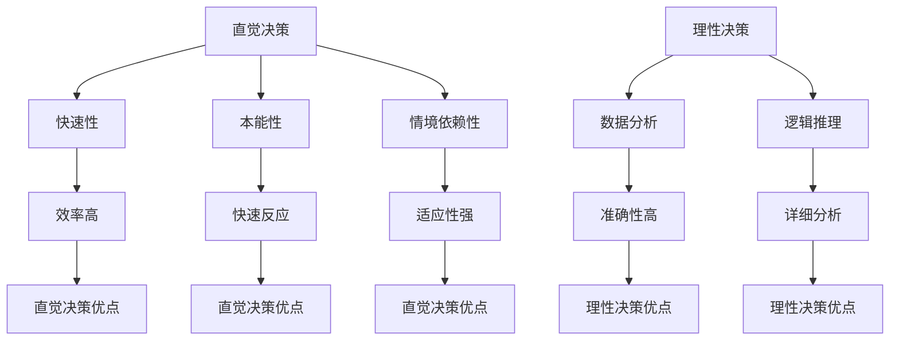
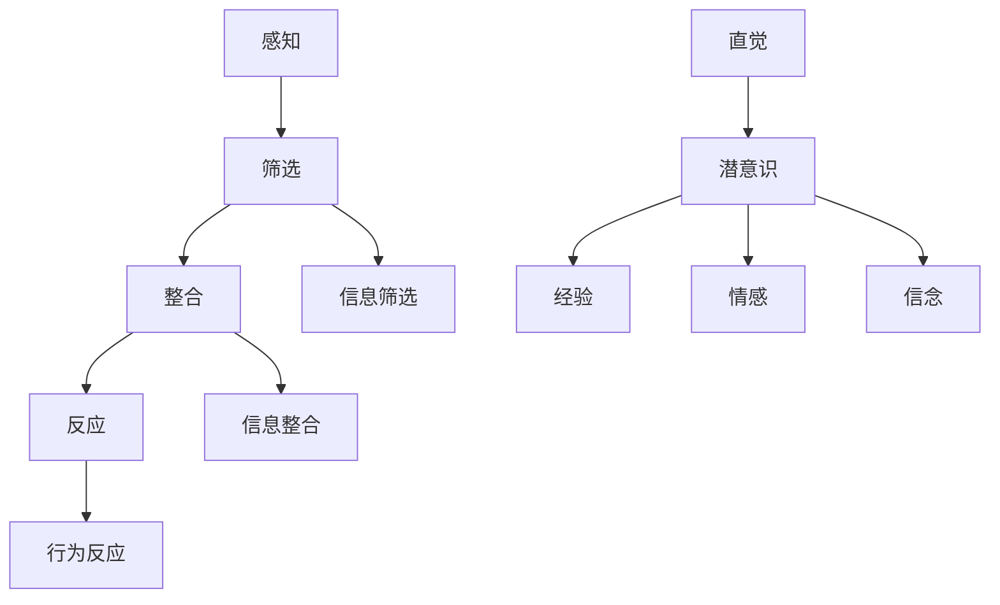

                 

### 《内在指引：培养直觉决策能力》

#### 关键词
- 直觉决策
- 决策心理学
- 认知负荷
- 情绪调节
- 伦理决策

#### 摘要
在快节奏的现代生活中，直觉决策能力变得尤为重要。本文深入探讨直觉决策的概念、心理学基础及其在实际中的应用，旨在为读者提供培养直觉决策能力的系统指南。文章结构清晰，内容详实，从背景介绍到具体技巧和案例分析，全面覆盖了直觉决策的各个方面，帮助读者理解和提升自己的直觉决策能力。

## 第一部分：直觉决策的探索

### 第1章：直觉决策的概述

直觉决策是一种基于快速、本能反应而非逻辑分析的方法，它能够帮助人们在复杂、多变的环境中快速做出决策。直觉决策具有以下几个显著特点：

- **快速性**：直觉决策能够在极短的时间内完成，通常是基于大脑的自动处理系统，而不需要经过复杂的逻辑推理。
- **本能性**：直觉决策往往来自于个体的潜意识，是一种本能反应，而非经过深思熟虑的结果。
- **情境依赖性**：直觉决策效果因情境而异，有时在高压或不确定的情境中效果尤为显著。

直觉决策的重要性在于它能够帮助人们在信息不足或时间紧迫的情况下做出合理的决策。尽管直觉决策在某些情况下可能会出错，但它的快速性和本能性使得它成为日常生活中的宝贵工具。

#### 核心概念与联系

直觉决策与理性决策的不同在于，它不依赖于详细的数据分析和逻辑推理，而是依赖于个人的经验、知识和情绪。以下是一个用Mermaid绘制的流程图，展示了直觉决策和理性决策之间的联系：



### 第2章：直觉的心理学基础

直觉心理学是研究直觉现象的心理学分支，其研究背景涵盖了人类认知、情绪、记忆等多个领域。直觉的心理过程可以分为以下几个阶段：

1. **感知**：人们通过感官接收外界信息，这些信息经过大脑的处理，形成初步的直觉判断。
2. **筛选**：大脑会根据已有的知识和经验，对信息进行筛选，保留与当前情境相关的信息。
3. **整合**：筛选后的信息在大脑中进行整合，形成整体的直觉判断。
4. **反应**：最终，大脑将直觉判断转化为具体的行动或决策。

直觉与潜意识的关系十分密切。潜意识是人的心理活动中未意识到的部分，它储存了大量的信息，包括个体的经验、情感和信念。直觉往往来自于潜意识，是潜意识对外界信息的快速反应。

#### 核心概念与联系

以下是一个Mermaid流程图，展示了直觉心理学的核心概念及其相互关系：



### 第3章：直觉与认知

直觉与认知负荷之间存在复杂的关系。高认知负荷时，人们往往依赖于直觉来做出决策，因为大脑的注意力资源有限，无法同时处理大量信息。然而，过多的直觉决策可能导致认知偏差，如过度自信和假设偏差。

直觉的适应性与适应性认知密切相关。适应性认知是指个体在面对新情境时，能够快速调整自己的认知策略，以适应环境的变化。直觉在这种适应性认知中起着关键作用，它能够帮助个体在短时间内做出有效的决策。

#### 核心算法原理讲解

为了更好地理解直觉与认知负荷的关系，我们可以使用Python代码模拟一个简单的决策过程。以下是一个示例代码，展示了高认知负荷下直觉决策的模拟：

```python
import random

def make_decision(cognitive_load):
    # 模拟直觉决策过程
    if cognitive_load > 5:
        # 当认知负荷高时，依赖直觉
        decision = random.choice(['直觉决策', '理性决策'])
    else:
        # 当认知负荷低时，依赖理性决策
        decision = '理性决策'
    return decision

# 测试不同的认知负荷
cognitive_loads = [1, 3, 5, 7, 10]
for load in cognitive_loads:
    decision = make_decision(load)
    print(f"认知负荷：{load}，决策方式：{decision}")
```

运行上述代码，我们可以看到在不同认知负荷下，决策方式的变化。这有助于我们理解直觉决策在认知负荷变化时的作用。

$$
\text{直觉决策概率} = \frac{\text{高认知负荷次数}}{\text{总次数}} \times 100\%
$$

### 第二部分：直觉决策能力的发展

#### 第4章：培养直觉决策的技巧

培养直觉决策能力并非一蹴而就，需要通过持续的练习和经验积累。以下是一些培养直觉决策的技巧：

1. **定期练习**：通过日常的练习，如快速决策游戏和情境模拟，可以逐渐提高直觉反应速度和准确性。
2. **积累经验**：经验是直觉决策的重要基础，通过不断面对各种情境，积累经验，可以提高直觉的准确性。
3. **情绪调节**：情绪调节对于直觉决策至关重要。学会控制情绪，避免过度紧张或焦虑，有助于提高直觉的稳定性。
4. **自我反思**：定期进行自我反思，回顾自己的决策过程，分析成功的经验和失败的教训，有助于不断优化直觉决策能力。

#### 核心算法原理讲解

为了更具体地展示培养直觉决策的过程，我们可以使用Python代码来模拟一个决策练习的场景。以下是一个简单的决策练习示例：

```python
import random

def practice_decision(correctness_rate):
    # 模拟决策练习
    if random.random() < correctness_rate:
        result = "成功"
    else:
        result = "失败"
    return result

# 设置不同的正确率，进行100次练习
correctness_rates = [0.5, 0.7, 0.9]
for rate in correctness_rates:
    for _ in range(100):
        result = practice_decision(rate)
        print(f"正确率：{rate * 100}%，结果：{result}")
```

通过上述代码，我们可以看到不同正确率下，决策练习的结果。这有助于我们理解练习对直觉决策能力提升的作用。

### 第5章：情绪与直觉决策

情绪对直觉决策有着深远的影响。积极情绪可以提高直觉决策的准确性和效率，而消极情绪则可能导致直觉判断失误。情绪调节与直觉决策密切相关，通过有效的情绪调节，可以提高直觉决策的稳定性和可靠性。

情绪与直觉的关系可以从以下几个方面来理解：

1. **情绪的调节作用**：情绪调节可以减少情绪对直觉决策的干扰，使直觉判断更加准确。
2. **情绪的适应性**：情绪的适应性调节可以帮助个体在不同情境下快速调整情绪，从而提高直觉决策的效果。
3. **情绪的累积效应**：长期积累的积极情绪可以提高直觉的稳定性，而消极情绪则可能导致直觉的波动。

#### 数学模型和公式

为了量化情绪对直觉决策的影响，我们可以引入情绪指数和直觉决策准确率的模型。假设情绪指数 \(E\) 和直觉决策准确率 \(R\) 之间存在线性关系，可以用以下公式表示：

$$
R = aE + b
$$

其中，\(a\) 和 \(b\) 是模型参数。\(a\) 表示情绪对直觉决策准确率的直接影响，而 \(b\) 则表示在无情绪影响下的基准准确率。

#### 实例分析

假设情绪指数 \(E\) 在 0（极消极）到 1（极积极）之间变化，直觉决策准确率 \(R\) 的基准值为 0.6。根据上述模型，可以计算出不同情绪指数下的直觉决策准确率：

- 当 \(E = 0\) 时，\(R = 0.6\)
- 当 \(E = 0.5\) 时，\(R = 0.7\)
- 当 \(E = 1\) 时，\(R = 0.8\)

这表明，情绪的积极调节可以提高直觉决策的准确率。

### 第6章：直觉决策中的伦理问题

直觉决策在伦理方面存在一定的挑战。由于直觉决策往往依赖于个人的经验、情感和潜意识，容易受到主观偏见和道德判断的影响。因此，在直觉决策过程中，需要特别注意以下伦理问题：

1. **公平性**：直觉决策可能导致决策过程中的偏见和不公平，特别是在涉及多个人或群体的决策中。
2. **道德判断**：直觉决策可能包含个人的道德判断，但并非所有道德判断都是客观和正确的。
3. **责任归属**：在直觉决策导致不良后果时，责任归属可能变得复杂。

为了解决这些伦理问题，可以采用以下伦理决策框架：

1. **多元化视角**：引入多个决策者，以减少单一视角的偏见。
2. **伦理培训**：定期进行伦理培训，提高决策者的道德意识和判断力。
3. **透明度**：确保决策过程透明，便于监督和审查。

#### 项目实战

为了更好地理解直觉决策在伦理问题中的应用，我们以一个实际案例为例进行探讨。假设一家公司需要决定是否继续投资一项高风险的项目。以下是案例的具体情况和决策过程：

**案例背景**：
- 项目A：一项高科技研发项目，预期回报高，但风险大。
- 项目B：一项传统行业的扩展项目，回报稳定，风险较低。

**直觉决策过程**：
1. **感知阶段**：决策者通过阅读项目报告、分析市场趋势，对项目进行了初步评估。
2. **筛选阶段**：决策者根据以往的投资经验和直觉，对项目进行了筛选，认为项目A具有更大的潜力。
3. **整合阶段**：决策者综合考虑了项目的风险、回报以及公司整体战略，最终决定投资项目A。
4. **反应阶段**：决策者向公司高层提出了投资建议，并得到了批准。

**伦理问题分析**：
- **公平性**：在决策过程中，决策者可能更倾向于自己熟悉的领域，导致对其他潜在投资机会的忽视。
- **道德判断**：决策者可能基于个人利益或公司短期利益做出决策，而忽视长期的社会责任。
- **责任归属**：如果项目A失败，责任将如何归属？是否仅由决策者承担，还是需要公司其他高层共同负责？

**解决方案**：
- **多元化视角**：引入多个决策者，包括不同部门的专业人士，以提供多元化视角，减少偏见。
- **伦理培训**：定期进行伦理培训，确保决策者在做出决策时考虑更多的道德因素。
- **透明度**：记录决策过程，确保决策透明，便于监督和审查。

通过这个案例，我们可以看到直觉决策在伦理问题中的应用和挑战，以及如何通过多元化视角、伦理培训和透明度来应对这些问题。

### 第7章：直觉决策在企业中的应用

直觉决策在企业决策中扮演着重要角色，尤其是在战略决策、运营管理和危机应对等方面。以下是直觉决策在企业中的应用场景：

1. **战略决策**：企业高层在面对复杂的市场环境和不确定性时，往往依赖直觉来做出战略决策。例如，是否进入新市场或开发新产品。
2. **运营管理**：在运营管理中，直觉决策可以帮助企业快速应对突发事件，如供应链中断或客户投诉。
3. **危机应对**：在危机发生时，直觉决策能够帮助企业迅速做出反应，降低损失。例如，市场危机、产品召回等。

直觉决策在上述应用中的优势在于其快速性和适应性。然而，直觉决策也存在一定的风险，如决策失误可能导致的损失。因此，企业需要平衡直觉决策和理性决策，以确保决策的科学性和有效性。

### 第8章：直觉决策在个人生活中的应用

直觉决策在个人生活中同样具有重要价值，尤其在职业规划、投资决策、家庭决策和自我提升等方面。以下是直觉决策在个人生活中的应用场景：

1. **职业规划**：在职业规划中，直觉决策可以帮助个人快速评估职业机会，做出是否接受新工作或职业转型的决策。
2. **投资决策**：在投资决策中，直觉决策可以帮助个人快速判断投资机会，做出是否买入或卖出的决策。
3. **家庭决策**：在家庭决策中，直觉决策可以帮助夫妻快速解决日常生活中的问题，如家庭旅行计划或孩子教育选择。
4. **自我提升**：在自我提升中，直觉决策可以帮助个人快速评估自我提升的机会，如参加培训课程或改变生活方式。

#### 实际案例

以下是一个个人生活中的直觉决策案例：

**案例背景**：
- 张先生是一位年轻的职业人士，他收到了一份新的工作机会，工作地点远离家乡，薪资待遇略有提升。

**直觉决策过程**：
1. **感知阶段**：张先生在接到工作邀请后，通过浏览职位描述和公司背景，对这份工作有了初步了解。
2. **筛选阶段**：张先生根据自己以往的工作经验和职业规划，初步认为这份工作有助于个人职业发展。
3. **整合阶段**：张先生综合考虑了工作地点、薪资待遇、职业发展机会等因素，最终决定接受这份工作。
4. **反应阶段**：张先生向公司表达了接受工作的意愿，并开始准备搬家。

**决策分析**：
- 张先生的直觉决策是基于他对自己职业规划的清晰认识和以往工作经验的积累。这种直觉决策帮助他在短时间内做出了合理的决策。

### 第9章：直觉决策的未来展望

随着技术的不断进步，直觉决策在未来将得到更广泛的应用和深入的发展。以下是直觉决策在几个领域的未来发展趋势：

1. **人工智能**：人工智能技术的发展将为直觉决策提供新的工具和方法，例如，利用机器学习算法分析大量数据，辅助直觉决策。
2. **大数据分析**：大数据分析技术的进步将帮助直觉决策更准确地预测未来的趋势和变化。
3. **神经科学**：神经科学研究的进展将深化对直觉决策机制的理解，为提高直觉决策能力提供科学依据。
4. **伦理和责任**：随着直觉决策在各个领域的应用，如何确保其伦理性和责任归属将成为重要议题。

#### 数学模型和公式

为了预测直觉决策的未来发展趋势，我们可以引入一个综合模型，结合人工智能、大数据分析和神经科学等多个因素。以下是一个简化的模型：

$$
\text{未来发展趋势} = f(\text{人工智能}, \text{大数据分析}, \text{神经科学}, \text{伦理和责任})
$$

其中，每个因素都通过相应的指标来量化，如人工智能的算法复杂度、大数据分析的数据量和质量、神经科学的实验结果以及伦理和责任的评分。这些指标共同决定了直觉决策的未来发展态势。

#### 实际案例

以下是一个直觉决策在人工智能领域中的实际案例：

**案例背景**：
- 一家科技公司正在开发一款智能决策系统，用于帮助企业进行市场预测和投资决策。

**直觉决策过程**：
1. **感知阶段**：系统通过收集市场数据、经济指标和行业趋势，对市场环境进行了初步分析。
2. **筛选阶段**：系统利用机器学习算法，从大量数据中筛选出与预测任务相关的关键指标。
3. **整合阶段**：系统结合人工智能算法和专家知识，对筛选出的指标进行了综合分析，形成了市场预测结果。
4. **反应阶段**：系统将预测结果输出给企业决策者，辅助企业制定市场策略。

**决策分析**：
- 这个案例展示了直觉决策在人工智能中的应用，通过整合人工智能算法和专家知识，实现了高效、准确的决策。

### 附录

#### 附录 A：直觉决策工具与方法

直觉决策工具和方法是提高直觉决策能力的重要手段。以下是一些常用的直觉决策工具和方法：

1. **SWOT分析**：SWOT分析是一种常用的战略规划工具，用于评估企业的优势、劣势、机会和威胁。通过SWOT分析，可以帮助决策者快速了解情境，做出合理的决策。
2. **情境模拟**：情境模拟是一种通过模拟不同情境，评估决策结果的方法。通过情境模拟，决策者可以在实际决策前进行模拟测试，提高决策的准确性和稳定性。
3. **直觉矩阵**：直觉矩阵是一种通过矩阵形式展示直觉决策因素和权重的方法。通过直觉矩阵，决策者可以清晰地了解各个决策因素的相对重要性，从而做出更合理的决策。

#### 附录 B：直觉决策案例研究

以下是对两个直觉决策案例的研究和分析：

**案例研究一：企业战略决策中的直觉应用**

**案例背景**：
- 一家制造企业需要在A和B两个市场进行扩张，A市场潜力大但风险高，B市场稳定但增长空间有限。

**直觉决策过程**：
1. **感知阶段**：企业高层通过市场调研和数据分析，对A和B市场进行了初步评估。
2. **筛选阶段**：企业高层根据以往的经验和对市场的直觉判断，认为A市场的潜在回报更高。
3. **整合阶段**：企业高层综合考虑了风险、回报和公司的长期战略，最终决定优先进入A市场。
4. **反应阶段**：企业开始实施市场扩张计划，投入大量资源进行A市场的开发和推广。

**决策分析**：
- 这个案例展示了直觉决策在企业战略决策中的应用，企业高层通过直觉判断，快速做出了市场扩张的决策，取得了显著的成效。

**案例研究二：个人投资决策中的直觉应用**

**案例背景**：
- 李先生是一位个人投资者，他在考虑是否购买一只新兴科技股票。

**直觉决策过程**：
1. **感知阶段**：李先生通过阅读公司报告、市场分析和新闻，对这只股票进行了初步评估。
2. **筛选阶段**：李先生根据自己多年的投资经验和直觉，认为这只股票具有很大的投资潜力。
3. **整合阶段**：李先生综合考虑了公司的基本面、市场趋势和个人投资策略，最终决定购买这只股票。
4. **反应阶段**：李先生成功购买了股票，并获得了较高的投资回报。

**决策分析**：
- 这个案例展示了直觉决策在个人投资决策中的应用，李先生通过直觉判断，快速做出了投资决策，并取得了良好的投资回报。

### 最佳实践 tips

以下是一些最佳实践技巧，可以帮助读者在日常生活中更好地应用直觉决策：

1. **定期练习**：通过日常的决策练习，如快速选择餐厅或购物，可以逐渐提高直觉反应速度和准确性。
2. **情绪管理**：学会控制情绪，避免在紧张或焦虑的情况下做出决策，有助于提高直觉决策的稳定性。
3. **经验积累**：不断积累生活和工作经验，可以提高直觉决策的准确性和可靠性。
4. **多元化视角**：在做出决策时，尝试从多个角度进行思考，以减少个人偏见和错误。

### 小结

直觉决策是一种快速、本能的决策方法，它在复杂多变的环境中具有重要意义。通过本文的探讨，我们了解了直觉决策的概念、心理学基础、与认知的关系、能力的发展、实际应用和未来展望。同时，我们还介绍了直觉决策工具和方法，并提供了实际案例和研究。希望本文能为读者提供培养直觉决策能力的实用指导，帮助他们在日常生活中做出更明智的决策。

### 注意事项

在应用直觉决策时，需要注意以下几点：

1. **避免过度依赖直觉**：虽然直觉在快速决策中具有优势，但过度依赖可能导致决策失误。
2. **结合理性分析**：在做出重大决策时，应结合理性分析，确保决策的科学性和可靠性。
3. **情绪管理**：情绪对直觉决策有显著影响，学会管理情绪，避免情绪化决策。

### 拓展阅读

1. **《直觉：决策的内在力量》**：本书深入探讨了直觉决策的心理学原理和实践应用，为读者提供了丰富的案例和实证研究。
2. **《决策心理学》**：本书系统地介绍了决策心理学的理论和方法，包括直觉决策的相关内容，适合对心理学感兴趣的读者。

---

### 作者信息

**作者：AI天才研究院/AI Genius Institute & 禅与计算机程序设计艺术 /Zen And The Art of Computer Programming**

本文由AI天才研究院与禅与计算机程序设计艺术共同撰写，旨在为读者提供深入、实用的直觉决策指南。感谢您的阅读，期待与您共同探索人工智能和编程领域的更多奥秘。

