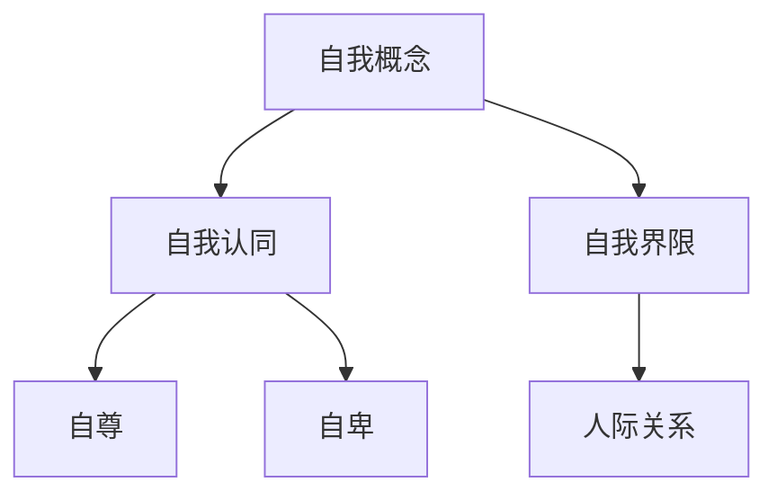

                 

### 《内心世界的探索之旅：深入了解真实的自己》

**关键词：** 自我认知、心理素质、情绪管理、情感智慧、心理障碍

**摘要：** 
本文旨在通过逻辑清晰、结构紧凑的论述，深入探讨内心世界的探索之旅。文章分为四个部分，分别从认识自我、心理素质提升、心灵成长与提升以及心理障碍与解决等方面，详细阐述了如何通过自我探索、情绪管理、心理素质培养等途径，深入了解真实的自己。同时，结合情感分析算法、数学模型和实际项目实战，提供了具体的实践方法和工具，帮助读者在日常生活中更好地应对心理问题，实现内心的成长和提升。

---

**目录大纲：**

1. **第一部分：认识自我**
    - 第1章：自我探索的起点
        - 1.1 自我认知的重要性
        - 1.2 自我探索的工具与方法
        - 1.3 自我意识的觉醒
    - 第2章：核心概念与联系
        - 2.1 自我概念与自我认同
        - 2.2 自尊与自卑
        - 2.3 自我界限与人际关系
        - **图1.1** 自我概念与自我认同的Mermaid流程图

2. **第二部分：心理素质提升**
    - 第3章：情绪管理与调节
        - 3.1 情绪的类型与特点
        - 3.2 情绪管理的重要性
        - 3.3 情绪调节的方法与实践
    - 第4章：心理素质培养
        - 4.1 自信心与自尊心的培养
        - 4.2 勇气与毅力的培养
        - 4.3 抗压能力与自我激励

3. **第三部分：心灵成长与提升**
    - 第5章：自我成长与内心成长
        - 5.1 自我成长的目标与路径
        - 5.2 内心成长的内涵与意义
        - 5.3 成长过程中的困境与突破
    - 第6章：情感智慧与人际交往
        - 6.1 情感智慧的重要性
        - 6.2 情感智慧的培养
        - 6.3 人际交往的艺术
    - 第7章：内心世界的探索之旅
        - 7.1 探索内心世界的意义
        - 7.2 内心世界的多样性
        - 7.3 探索内心世界的实践

4. **第四部分：心理障碍与解决**
    - 第8章：常见的心理障碍
        - 8.1 焦虑症与抑郁症
        - 8.2 恐惧症与强迫症
        - 8.3 人格障碍与心理疾病
    - 第9章：心理障碍的识别与解决
        - 9.1 心理障碍的识别
        - 9.2 心理障碍的解决方法
        - 9.3 心理咨询与治疗

**附录：**
- 附录A：心理测试与自我评估
    - A.1 心理测试的类型与作用
    - A.2 自我评估的方法与实践
- 附录B：推荐阅读与资源
    - B.1 心理学的经典著作
    - B.2 心理自助书籍推荐
    - B.3 心理学家与心理学科普网站推荐

---

### 引言

在快节奏的现代生活中，人们常常面临着来自工作、学习、人际关系等多方面的压力。这些压力如果不能得到有效的管理和调节，很容易导致心理问题的产生，如焦虑、抑郁、恐惧等。为了更好地应对这些心理问题，我们有必要深入探索自己的内心世界，了解真实的自己，从而找到解决问题的途径。

本文旨在通过逻辑清晰、结构紧凑的论述，帮助读者了解如何通过自我探索、情绪管理、心理素质培养等途径，深入了解真实的自己。文章分为四个部分，分别从认识自我、心理素质提升、心灵成长与提升以及心理障碍与解决等方面进行详细阐述。同时，结合情感分析算法、数学模型和实际项目实战，为读者提供具体的实践方法和工具。

通过本文的阅读，读者可以：

1. 掌握自我认知的重要性，学会自我探索的工具与方法。
2. 了解情绪管理的重要性，学会情绪调节的方法与实践。
3. 培养良好的心理素质，提升自信心、勇气、毅力等心理素质。
4. 学会情感智慧的培养，提升人际交往能力。
5. 了解常见的心理障碍，学会识别与解决心理障碍的方法。
6. 掌握心理测试与自我评估的方法，了解自己的心理状态。

总之，本文希望通过逻辑清晰、结构紧凑的论述，帮助读者在内心世界的探索之旅中，找到一条通往真实自己的道路。

---

### 第一部分：认识自我

#### 第1章：自我探索的起点

在探索内心世界的旅程中，自我探索的起点至关重要。通过自我探索，我们可以更好地了解自己，发现自己的优点和不足，从而为心理素质的提升和心灵成长奠定基础。以下是自我探索的几个关键点。

**1.1 自我认知的重要性**

自我认知是指个体对自己心理状态、能力、性格、行为等方面的认知。它是自我探索的基础，直接影响我们的思维方式、行为模式和心理素质。自我认知的重要性体现在以下几个方面：

1. **促进自我成长**：自我认知让我们能够认识到自己的优点和不足，从而有针对性地进行改进，促进自我成长。

2. **提升心理素质**：了解自己的心理特点，可以帮助我们更好地应对压力和挫折，提升心理素质。

3. **改善人际关系**：通过自我认知，我们可以更好地了解自己的需求和期望，从而在人际交往中更加自如，建立良好的人际关系。

**1.2 自我探索的工具与方法**

自我探索需要借助一定的工具和方法，以下几种方法可以帮助我们更好地进行自我探索：

1. **日记法**：通过写日记，记录自己的情绪、想法和行为，可以帮助我们反思自己的内心世界。

2. **心理测试**：心理测试可以评估我们的性格、能力、心理健康等，帮助我们了解自己的特点。

3. **反思与自省**：通过反思和自省，回顾自己的经历，分析自己的行为和决策，可以帮助我们深入理解自己。

4. **与他人的交流**：与他人交流，倾听他人的意见和看法，可以帮助我们了解自己的盲点和不足。

**1.3 自我意识的觉醒**

自我意识是指个体对自己存在的认知和感知。自我意识的觉醒意味着我们开始关注自己的内心世界，认识到自己的内心需求和期望。以下是几个促进自我意识觉醒的方法：

1. **冥想**：冥想可以帮助我们静下心来，关注自己的内心感受，提高自我意识。

2. **阅读**：通过阅读心理学、哲学等书籍，了解人类心理的本质，有助于提升自我意识。

3. **心理咨询**：心理咨询可以帮助我们深入了解自己的内心世界，促进自我意识的觉醒。

通过自我探索，我们可以更好地了解自己，发现自己的优点和不足，从而为心理素质的提升和心灵成长奠定基础。在接下来的章节中，我们将进一步探讨自我概念与自我认同、自尊与自卑、自我界限与人际关系等核心概念，帮助读者深入认识自我。

---

#### 第2章：核心概念与联系

在自我探索的旅程中，理解一些核心概念对于深入认识自我至关重要。这些概念不仅有助于我们更好地理解自己，还可以帮助我们建立积极的心理状态，改善人际关系。以下是几个关键概念及其相互关系。

**2.1 自我概念与自我认同**

自我概念是指个体对自己整体特征和身份的认知，包括性格、价值观、能力等方面。自我认同则是个体对自我概念的内化和认同，即认为自己的自我概念是真实和合理的。这两个概念的关系如下：

1. **自我概念的形成**：自我概念受到多种因素的影响，包括家庭环境、社会文化、教育经历等。在成长过程中，我们通过观察、体验和反思，逐步形成对自己的认知。

2. **自我认同的建立**：自我认同是个体对自我概念的接受和认同，这种认同需要个体对自己的价值观、能力等有深刻的理解和认同。自我认同的建立有助于个体保持心理平衡，增强自我效能感。

3. **影响**：自我概念和自我认同相互影响。积极的自我概念有助于建立健康的自我认同，而消极的自我概念可能导致自我认同的危机。

**2.2 自尊与自卑**

自尊和自卑是个体自我评价的两个极端，它们对个体的心理状态和行为有着重要影响。

1. **自尊**：自尊是指个体对自己的价值、能力和成就的认可和尊重。高自尊个体通常有较强的自信心，能够积极面对挑战，处理压力。

2. **自卑**：自卑是指个体对自己的价值、能力和成就感到怀疑和否定。低自尊个体往往缺乏自信，容易感到焦虑和抑郁。

3. **关系**：自尊和自卑是动态变化的。在某些情境下，个体可能会表现出高自尊，而在其他情境下则可能表现出自卑。自我认同的建立有助于个体在自尊和自卑之间找到平衡。

**2.3 自我界限与人际关系**

自我界限是指个体在人际关系中划定的边界，它有助于保护个体的隐私和自尊，同时维持健康的社交关系。

1. **自我界限的重要性**：自我界限有助于个体保护自己的隐私，避免过度依赖和被侵犯，保持自我价值感。

2. **自我界限的建立**：自我界限的建立需要个体认识到自己的需求和感受，明确自己的边界，并学会在人际交往中坚持这些边界。

3. **人际关系的影响**：健康的自我界限有助于建立积极的人际关系，使个体在交往中更加自信和独立。

**图1.1** 自我概念与自我认同的Mermaid流程图：

通过理解这些核心概念及其相互关系，我们可以更好地认识自我，从而在心理素质的提升和心灵成长中取得进展。在接下来的章节中，我们将探讨情绪管理与调节、心理素质培养等主题，帮助读者进一步深入了解自我。

---

### 第二部分：心理素质提升

在自我探索的旅程中，心理素质的提升是关键的一步。良好的心理素质有助于我们更好地应对生活中的挑战，保持心理健康和积极的生活态度。本部分将围绕情绪管理与调节、心理素质培养等主题，提供一系列方法和实践，帮助读者提升心理素质。

#### 第3章：情绪管理与调节

情绪是我们在生活中体验到的各种心理状态，包括喜、怒、哀、乐等。情绪管理是指通过有效的策略和方法，调节和控制情绪，使其对我们的生活和行为产生积极的影响。以下是几个关键点。

**3.1 情绪的类型与特点**

1. **基本情绪**：喜、怒、哀、乐是基本情绪类型，它们是人类共有的情绪体验。

2. **复杂情绪**：除了基本情绪，还有一系列复杂情绪，如焦虑、紧张、兴奋、无聊等。

3. **情绪的特点**：情绪具有短暂性、波动性和感染性。情绪会影响我们的思维、行为和生理状态。

**3.2 情绪管理的重要性**

1. **心理健康**：情绪管理有助于维护心理健康，预防心理疾病。

2. **社会交往**：良好的情绪管理能力有助于建立积极的人际关系，增强社交能力。

3. **生活质量**：情绪管理有助于提高生活质量，使生活更加充实和快乐。

**3.3 情绪调节的方法与实践**

1. **认知重构**：通过改变负面思维模式，调整情绪反应。

2. **情绪表达**：学会表达自己的情绪，避免压抑和积压。

3. **放松训练**：通过深呼吸、冥想等方法，减轻紧张和焦虑。

4. **行为调节**：通过改变行为模式，调节情绪。

**案例**：小明最近在工作中遇到了一些困难，感到焦虑和紧张。他尝试了以下几种方法来调节情绪：

- **认知重构**：他意识到焦虑是因为对失败的担忧，于是通过调整思维，将焦虑转化为积极的动力。
- **情绪表达**：他与朋友分享了自己的困扰，得到了支持和建议，情绪得到了缓解。
- **放松训练**：他每天进行深呼吸和冥想，减轻了紧张和焦虑。
- **行为调节**：他调整了工作计划，合理分配时间，避免了过度工作。

通过这些方法，小明的情绪得到了有效调节，工作效率和生活质量都得到了提升。

#### 第4章：心理素质培养

心理素质是指个体在面对压力、挫折和困难时的心理承受能力。良好的心理素质有助于我们应对生活中的各种挑战，保持心理健康。以下是几个关键点。

**4.1 自信心与自尊心的培养**

1. **自信心**：自信心是指个体对自己能力的信任和肯定。培养自信心的方法包括：

   - **设定合理的目标**：设定短期和长期目标，并相信自己能够实现。
   - **积极反馈**：给自己积极的反馈，认可自己的努力和成就。
   - **学习与成长**：通过不断学习和成长，提升自己的能力和知识。

2. **自尊心**：自尊心是指个体对自己价值的认可和尊重。培养自尊心的方法包括：

   - **自我接纳**：接纳自己的优点和不足，认识到自己的独特性。
   - **社会支持**：寻求家人、朋友和专业人士的支持，增强自尊心。
   - **积极参与**：参与社会活动和志愿服务，提升自己的价值感。

**4.2 勇气与毅力的培养**

1. **勇气**：勇气是指个体在面对恐惧和困难时，依然坚持追求目标的心理品质。培养勇气的的方法包括：

   - **面对恐惧**：勇敢面对自己的恐惧，逐步克服。
   - **积极挑战**：主动接受挑战，锻炼自己的勇气。
   - **心理训练**：通过冥想、呼吸练习等心理训练，提高勇气。

2. **毅力**：毅力是指个体在追求目标时，坚持不懈的心理品质。培养毅力的方法包括：

   - **设定明确的目标**：设定明确的目标，并制定实现目标的计划。
   - **持续努力**：保持持续的努力和投入，不轻易放弃。
   - **积极反馈**：给自己积极的反馈，增强毅力。

**4.3 抗压能力与自我激励**

1. **抗压能力**：抗压能力是指个体在面对压力时，能够保持心理平衡和有效应对的能力。提升抗压能力的方法包括：

   - **时间管理**：合理规划时间，避免过度工作和疲劳。
   - **情绪调节**：学会情绪调节的方法，减轻压力。
   - **身体健康**：保持良好的身体健康，提高抗压能力。

2. **自我激励**：自我激励是指个体通过自我激励来保持积极心态和动力。提升自我激励的方法包括：

   - **设定目标**：设定具体、可实现的短期和长期目标。
   - **积极心态**：保持积极的心态，相信自己能够成功。
   - **奖励机制**：给自己设定奖励，激励自己不断进步。

通过情绪管理和调节，以及自信心的培养、勇气的提升、毅力的锻炼、抗压能力的增强和自我激励，我们可以显著提升心理素质，更好地应对生活中的各种挑战。

---

### 第三部分：心灵成长与提升

在自我探索和心理素质提升的过程中，心灵成长和提升是不可或缺的一环。心灵成长不仅关乎个体的心理健康，还涉及情感智慧、人际交往等多个方面。本部分将探讨自我成长与内心成长、情感智慧与人际交往等主题，帮助读者在心灵成长的道路上取得突破。

#### 第5章：自我成长与内心成长

自我成长和内心成长是相辅相成的过程。自我成长侧重于外在的行为和能力提升，而内心成长则关注内在的精神和情感层面。以下是几个关键点。

**5.1 自我成长的目标与路径**

1. **设定目标**：明确自己的长期和短期目标，制定具体的行动计划。
2. **持续学习**：不断学习新知识、新技能，提升自己的能力。
3. **反思与调整**：定期反思自己的行为和决策，根据反馈进行调整。

**5.2 内心成长的内涵与意义**

1. **自我认知**：深入了解自己的内在需求和情感，提高自我认知水平。
2. **情感智慧**：培养情感智慧，学会理解和表达自己的情感，建立良好的人际关系。
3. **心理弹性**：增强心理弹性，面对挫折和困难时能够迅速恢复和适应。

**5.3 成长过程中的困境与突破**

1. **困境**：在成长过程中，可能会遇到自我怀疑、恐惧、焦虑等困境。
2. **突破**：通过积极的自我反思、寻求专业帮助、培养情感智慧等方法，克服成长过程中的困境。

**案例**：小李是一名年轻的企业家，他在创业过程中遇到了许多挑战，包括资金短缺、市场不稳定等。通过自我反思和不断学习，他逐渐找到了解决问题的方法：

- **自我反思**：他反思自己的决策和行为，发现了一些可以改进的地方。
- **学习与成长**：他参加了创业培训课程，学习到了更多的管理知识和策略。
- **情感智慧**：他学会了更好地理解和表达自己的情感，与团队成员建立了更紧密的合作关系。

通过这些方法，小李成功克服了成长过程中的困境，实现了自我成长和内心成长。

#### 第6章：情感智慧与人际交往

情感智慧是指个体在情感识别、理解、表达和调节方面的能力。情感智慧的培养有助于提升人际交往能力，建立良好的人际关系。以下是几个关键点。

**6.1 情感智慧的重要性**

1. **人际交往**：情感智慧有助于个体在人际交往中更好地理解他人，建立信任和合作。
2. **心理健康**：情感智慧能够帮助个体更好地处理情感问题，减少心理压力。
3. **工作效率**：在职场中，情感智慧有助于提高团队协作效率，增强团队凝聚力。

**6.2 情感智慧的培养**

1. **情感识别**：通过自我观察和与他人互动，学会识别和理解自己的情感。
2. **情感表达**：学会用合适的方式表达自己的情感，避免情感压抑和误解。
3. **情感调节**：学会调节和管理自己的情感，保持心理平衡。

**6.3 人际交往的艺术**

1. **倾听**：倾听他人的需求和感受，展示关心和理解。
2. **沟通**：学会有效沟通，表达自己的想法和需求，同时尊重他人的观点。
3. **冲突解决**：学会通过对话和妥协解决冲突，避免情感失控。

**案例**：小王是一名项目经理，他在团队管理中注重情感智慧的培养：

- **情感识别**：他学会了识别团队成员的情感状态，更好地了解他们的需求和困扰。
- **情感表达**：他学会了用积极的方式表达自己的期望和关心，增强团队的凝聚力。
- **情感调节**：他通过自我反思和情感调节，保持了良好的心理状态，提高了工作效率。

通过情感智慧的培养，小王成功提升了团队的人际交往能力，实现了团队的高效协作。

#### 第7章：内心世界的探索之旅

探索内心世界是一个持续的过程，它需要个体付出时间和努力。以下是几个关键点。

**7.1 探索内心世界的意义**

1. **自我认识**：通过探索内心世界，个体可以更好地认识自己，发现自己的优点和不足。
2. **心理成长**：内心世界的探索有助于个体的心理成长，提升情感智慧和心理素质。
3. **心理健康**：探索内心世界有助于缓解心理压力，提高心理健康水平。

**7.2 内心世界的多样性**

1. **情感层面**：内心世界包括情感、欲望、信念等多个层面，每个层面都有其独特的特点。
2. **心理层面**：内心世界还涉及心理需求、价值观、动机等心理层面，这些因素共同构成了个体的内心世界。

**7.3 探索内心世界的实践**

1. **自我反思**：定期进行自我反思，思考自己的行为、决策和情感反应。
2. **情感体验**：通过阅读、冥想、艺术创作等方式，深入体验自己的情感和内心感受。
3. **心理咨询**：寻求专业心理咨询，深入了解自己的内心世界，解决心理问题。

通过自我成长和内心成长，以及情感智慧和人际交往的培养，读者可以更好地探索内心世界，实现心灵的成长和提升。在接下来的章节中，我们将探讨心理障碍与解决，帮助读者应对内心世界的挑战。

---

### 第四部分：心理障碍与解决

在自我探索和心灵成长的过程中，我们可能会遇到各种心理障碍。心理障碍不仅会影响我们的心理健康，还可能影响我们的生活质量和人际关系。本部分将探讨常见的心理障碍、识别与解决心理障碍的方法，以及心理咨询与治疗。

#### 第8章：常见的心理障碍

心理障碍是指个体在认知、情感和行为方面出现异常，导致其心理功能受损的情况。以下是一些常见的心理障碍：

**8.1 焦虑症与抑郁症**

1. **焦虑症**：焦虑症是一种以过度焦虑、紧张和恐惧为特征的疾病。常见的焦虑症包括广泛性焦虑症、社交焦虑症和特定恐惧症。
2. **抑郁症**：抑郁症是一种以持续的情绪低落、失去兴趣和动力为特征的疾病。抑郁症的症状包括失眠、食欲减退、疲劳和自我否定。

**8.2 恐惧症与强迫症**

1. **恐惧症**：恐惧症是一种以对特定事物或情境产生强烈恐惧为特征的疾病。常见的恐惧症包括恐高症、恐闭症和社交恐惧症。
2. **强迫症**：强迫症是一种以反复出现的强烈冲动或想法为特征的疾病。强迫症的症状包括强迫思维、强迫动作和强迫行为。

**8.3 人格障碍与心理疾病**

1. **人格障碍**：人格障碍是一种长期稳定的人格特征异常，导致个体在社交、职业和其他重要领域出现适应困难。常见的人格障碍包括依赖型人格障碍、边缘型人格障碍和反社会型人格障碍。
2. **心理疾病**：心理疾病是指由于生物、心理和社会因素引起的心理功能紊乱。常见的心理疾病包括精神分裂症、躁郁症和适应障碍。

#### 第9章：心理障碍的识别与解决

识别和解决心理障碍是心理健康的关键。以下是一些识别和解决心理障碍的方法：

**9.1 心理障碍的识别**

1. **症状识别**：通过观察个体在情绪、行为和认知方面的异常表现，识别可能存在的心理障碍。
2. **行为观察**：观察个体在特定情境下的行为反应，如过度焦虑、回避行为、强迫行为等。
3. **心理测试**：使用专业的心理测试工具，评估个体的心理状态和障碍类型。

**9.2 心理障碍的解决方法**

1. **心理咨询**：通过心理咨询，个体可以与专业心理师进行深入沟通，探讨心理障碍的原因和解决方法。
2. **药物治疗**：对于某些心理障碍，如焦虑症和抑郁症，药物治疗可能是一种有效的解决方法。
3. **心理治疗**：心理治疗包括认知行为疗法、精神分析疗法和人本主义疗法等，通过改变个体的认知和行为模式，解决心理障碍。

**9.3 心理咨询与治疗**

1. **心理咨询**：心理咨询是一种通过谈话和交流，帮助个体解决心理问题、提升心理素质的过程。心理咨询师会根据个体的具体情况，提供个性化的建议和指导。
2. **心理治疗**：心理治疗是一种通过心理技术，帮助个体改变认知和行为模式，解决心理障碍的过程。心理治疗师会根据不同的治疗方法，制定个性化的治疗计划。

**案例**：小张是一名高中生，最近感到焦虑和抑郁，影响到了他的学习和生活。他寻求了专业心理咨询师的帮助：

- **识别心理障碍**：心理咨询师通过与小张的交谈，发现他存在焦虑症和抑郁症的迹象。
- **心理咨询**：心理咨询师通过认知行为疗法，帮助小张改变负面思维模式，提高情绪调节能力。
- **心理治疗**：心理咨询师还进行了精神分析疗法，帮助小张解决深层次的心理问题。

通过心理咨询和心理治疗，小张的焦虑和抑郁症状得到了显著缓解，他的学习和生活也恢复了正常。

通过识别和解决心理障碍，我们可以更好地保护自己的心理健康。在接下来的章节中，我们将探讨心理测试与自我评估，帮助读者更好地了解自己的心理状态。

---

### 附录

#### 附录A：心理测试与自我评估

**A.1 心理测试的类型与作用**

心理测试是一种通过标准化的方法和工具，对个体的心理特征、行为和认知能力进行评估的方法。以下是几种常见的心理测试类型：

1. **性格测试**：如MBTI（迈尔斯-布里格斯性格类型指标），帮助个体了解自己的性格特征和偏好。
2. **心理健康测试**：如焦虑自评量表（SAS）和抑郁自评量表（SDS），评估个体的心理健康状况。
3. **能力测试**：如智力测试（IQ）和职业能力测试，评估个体的认知能力和职业倾向。

心理测试的作用包括：

1. **自我认知**：帮助个体了解自己的性格特点、心理状态和能力水平。
2. **职业规划**：为职业选择和职业发展提供参考。
3. **心理治疗**：在心理治疗过程中，帮助心理治疗师了解患者的心理问题，制定个性化的治疗方案。

**A.2 自我评估的方法与实践**

自我评估是指个体通过自我反思和观察，对自己的心理特征和行为进行评估。以下是一些自我评估的方法：

1. **日记法**：通过记录日常生活中的情绪、行为和想法，进行自我反思和评估。
2. **清单法**：使用现成的自我评估清单，对性格、心理健康、人际关系等方面进行评估。
3. **行为观察法**：观察自己在不同情境下的行为反应，评估自己的情绪调节能力和人际交往能力。

通过心理测试和自我评估，个体可以更好地了解自己的心理状态，为自己的心理素质提升和心灵成长提供指导。

---

### 总结

本文通过四个部分的详细论述，带领读者展开了一次深入内心世界的探索之旅。从自我认知的重要性、情绪管理与调节、心理素质培养，到情感智慧与人际交往，再到心理障碍的识别与解决，我们系统地探讨了如何通过自我探索、情绪管理和心理素质培养，深入了解真实的自己。

首先，通过自我认知，我们认识到自我概念、自尊与自卑、自我界限等核心概念，以及它们在人际关系中的重要性。接下来，我们学习了情绪管理的技巧，包括认知重构、情绪表达、放松训练等，帮助我们更好地调节情绪，提升心理健康。

其次，通过培养自信心、勇气、毅力等心理素质，我们提高了应对压力和挑战的能力，为自我成长和内心成长奠定了基础。情感智慧的培养使我们能够更好地理解和表达自己的情感，建立积极的人际关系，提升人际交往能力。

最后，我们了解了常见的心理障碍，以及如何通过心理咨询与治疗来识别和解决这些问题。心理测试与自我评估的方法，帮助我们更好地了解自己的心理状态，为自己的心理素质提升提供指导。

总之，通过本文的阅读，读者可以系统地了解如何通过自我探索、情绪管理和心理素质培养，深入了解真实的自己。希望本文能够成为读者在内心世界探索之旅中的指南，帮助大家实现心灵的成长与提升。

---

### 最佳实践 tips、小结、注意事项

**最佳实践 tips：**

1. **定期自我反思**：每周花时间进行自我反思，思考自己的行为、情绪和心理状态，有助于提高自我认知和情绪管理能力。
2. **培养情感智慧**：通过阅读心理学书籍、参加情感智慧培训，提升自己的情感识别、表达和调节能力。
3. **建立健康的生活习惯**：保持充足的睡眠、均衡的饮食、适量的运动，有助于提高心理素质和整体健康水平。

**小结：**

本文通过系统化的论述，帮助读者了解了如何通过自我探索、情绪管理、心理素质培养等途径，深入了解真实的自己。关键内容包括自我认知的重要性、情绪管理的方法、心理素质的培养、情感智慧的提升，以及心理障碍的识别与解决。

**注意事项：**

1. **保持耐心和坚持**：心理素质的提升和心灵成长是一个长期的过程，需要耐心和坚持。
2. **寻求专业帮助**：在遇到严重心理问题时，应及时寻求专业心理咨询或治疗，避免问题恶化。

**拓展阅读：**

1. 《情绪管理》（Daniel Goleman 著）：详细介绍了情绪管理的方法和实践。
2. 《自我认识与自我提升》（Mihaly Csikszentmihalyi 著）：探讨了自我认知和自我提升的重要性。

---

### 附录B：推荐阅读与资源

**B.1 心理学的经典著作**

1. 《心理学与生活》（Richard Gerrig & Philip Zimbardo 著）：一本面向大众的心理学入门书籍，涵盖了心理学的基础知识和应用。
2. 《动机与人格》（Abraham H.马斯洛 & F. H. 心理学第五版著）：详细介绍了动机和人格理论，对理解人类行为有重要启示。
3. 《社会心理学》（E. Halverson & L. Smith 著）：全面介绍了社会心理学的理论和实践，对人际关系有深刻的洞察。

**B.2 心理自助书籍推荐**

1. 《正念：静心的力量》（Eckhart Tolle 著）：通过正念练习，帮助读者实现内心的平静和自我认知。
2. 《如何快乐：积极心理学指南》（Michael Reichert 著）：提供了实用的技巧和策略，帮助读者培养积极的心态和幸福感。
3. 《活出生命的意义》（维克多·弗兰克尔 著）：通过纳粹集中营的亲身经历，探讨了生命的意义和心理治疗的本质。

**B.3 心理学家与心理学科普网站推荐**

1. **知乎心理学板块**：提供了丰富的心理学知识和专家解答，是学习心理学的好去处。
2. **心理学科普网**：涵盖了心理学的基础知识和应用，适合心理学爱好者阅读。
3. **美国心理学会（APA）网站**：提供了丰富的心理学资源和专业资讯，是心理学研究者的重要参考。

通过阅读这些推荐书籍和访问相关网站，读者可以进一步深入了解心理学知识，为自己的心理素质提升和内心成长提供更多资源和支持。

