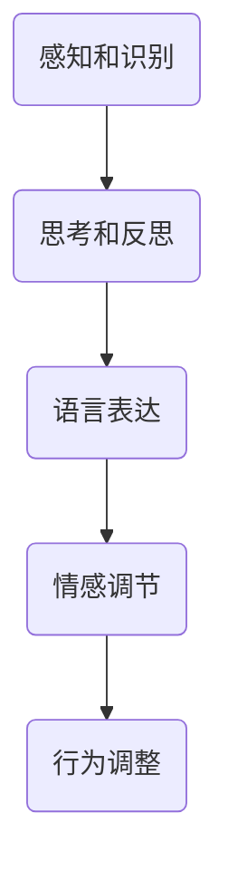
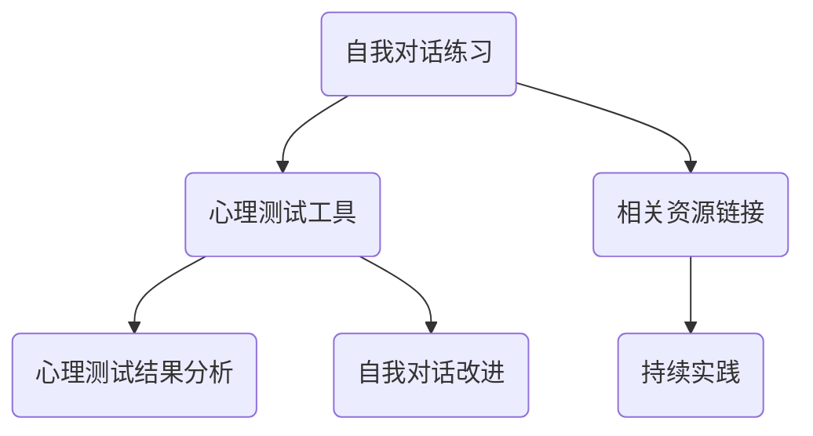

                 


### <此处是文章标题>

**关键词：**内心冲突，自我和解，对话方式，技术语言，逻辑分析，专业博客。

**摘要：**本文将探讨内心冲突的成因、识别方法以及通过自我和解的对话方式来化解冲突。采用专业技术语言和逻辑分析，通过详细讲解和实践步骤，帮助读者理解并掌握这一过程。

### 目录大纲

## 《内心冲突的化解：自我和解的对话方式》

### 第一部分：内心冲突的成因与识别

### 第1章：内心冲突的根源分析

### 第2章：内心冲突的识别方法

### 第二部分：自我和解的对话方式

### 第3章：理解自我对话的原理

### 第4章：构建积极的自我对话

### 第5章：通过对话化解内心冲突

### 第三部分：实践自我和解

### 第6章：自我和解的实践步骤

### 第7章：自我和解的案例分析

### 第8章：持续自我和解与成长

### 附录：自我和解的工具与资源

### Mermaid 流程图

### Python源代码示例与详细讲解

### 9.1 数据收集与预处理

### 9.2 心理冲突检测

### 9.3 情感分析示例

### 9.4 社交网络分析

### 9.5 项目实战：开发环境搭建

### 9.6 源代码详细实现

### 9.7 代码解读与分析

### 9.8 实际案例分析与详细讲解剖析

### 9.9 项目小结

### 最佳实践 Tips

### 小结

### 注意事项

### 拓展阅读

### 作者信息

### 参考文献

### 附录 A：自我对话练习指南

### 附录 B：心理测试工具推荐

### 附录 C：相关资源链接

### 附录 D：常见问题解答

### 附录 E：致谢

### 结论

### 留言与讨论

### 结束语

### 许可协议

### 版权声明

### 作者：AI天才研究院/AI Genius Institute & 禅与计算机程序设计艺术 /Zen And The Art of Computer Programming

### 引言

在信息技术飞速发展的今天，我们的生活和工作节奏不断加快，内心冲突愈发普遍。无论是职场压力、人际关系，还是自我认知，各种因素都可能引发内心的矛盾和冲突。这种冲突如果不及时化解，可能会对我们的心理健康和生活质量产生负面影响。本文将探讨内心冲突的成因与识别方法，以及通过自我和解的对话方式来化解内心冲突。我们将使用专业的技术语言和逻辑分析，帮助读者理解这一过程，并提供实用的方法和工具。

内心冲突的成因复杂多样，可能源于个人价值观的冲突、心理需求的不平衡、环境压力的影响等。识别内心冲突是化解冲突的第一步，这需要我们具备自我观察和反思的能力。在自我和解的对话方式中，理解自我对话的原理、构建积极的自我对话，以及通过对话化解内心冲突，都是关键步骤。本文将通过实例和代码示例，详细讲解这些方法。

在实践自我和解的过程中，设定目标和制定计划是不可或缺的。案例分析将提供成功与失败的案例，以供读者参考和反思。持续自我和解与成长是保持内心平和和提升生活质量的重要途径。最后，附录部分将提供自我对话练习指南、心理测试工具和相关资源链接，帮助读者在实践中更好地应用所学知识。

本文旨在为读者提供一套系统化、实践性的内心冲突化解方案，帮助读者在快节奏的生活中找到内心的平衡点。希望通过本文的探讨，读者能够更好地理解自我和解的重要性，掌握有效的对话方式，提升心理健康和幸福感。

### 第一部分：内心冲突的成因与识别

#### 第1章：内心冲突的根源分析

内心冲突，简单来说，是一种内在的矛盾或紧张状态，通常源于个人价值观、信仰、期望与实际情况之间的不一致。在信息技术领域，虽然人们面对的是数据和代码，但内心冲突依然普遍存在。这种冲突可能源于多个方面，包括以下几个方面：

首先，个人价值观的冲突是内心冲突的一个重要根源。在技术工作中，不同的人可能对技术路线、工作方式、团队合作等方面有不同的看法和期望。例如，一些人可能更倾向于使用最先进的技术来解决问题，而另一些人可能更注重稳定性和可维护性。这种价值观上的差异可能导致团队成员之间的摩擦和冲突。

其次，心理需求的不平衡也是内心冲突的常见原因。在技术工作中，人们可能面临高强度的工作压力，这会影响到他们的心理健康。例如，有些人可能因为工作压力导致焦虑或抑郁，而这些情绪问题又会影响他们的工作效率和人际关系，从而形成恶性循环。

再次，环境压力也是内心冲突的一个重要来源。现代社会中，技术更新迅速，人们需要不断学习新的技术和知识，以保持竞争力。这种快速变化的环境压力，可能会导致个人感到迷茫和焦虑，从而引发内心的冲突。

此外，人际关系也是内心冲突的根源之一。在技术团队中，成员之间的沟通和合作至关重要。如果团队成员之间存在误解、沟通不畅或利益冲突，很可能会导致内心冲突。例如，某位团队成员可能觉得其他成员没有尽到应有的责任，而其他成员则可能觉得这位成员过于苛刻，这种误解和不满会导致团队内部的不和谐。

最后，自我认知的矛盾也可能导致内心冲突。有些人可能对自己的能力和成就缺乏自信，而另一些人可能过分自负，认为自己无所不能。这种自我认知的不一致，会导致个人在面对挑战时感到困惑和不安。

在分析了内心冲突的根源后，我们来看一些日常生活中的内心冲突实例。情感冲突是其中一种表现形式，比如在团队合作中，由于工作任务的分配不公或者意见不合，可能会导致团队成员之间的情感冲突。工作压力引发的内心冲突也很常见，特别是在面对项目截止日期或者性能指标时，很多人可能会感到焦虑和紧张，从而产生内心冲突。

为了更深入地理解内心冲突，我们可以借助心理学理论来进行分析。心理学中的心理冲突理论认为，当个体面临两种或多种相互矛盾的愿望、情感或认知时，就会产生心理冲突。这种冲突可能会导致个体的行为和情绪出现混乱和失调。例如，在技术项目中，团队成员可能既想尽快完成任务，又希望保证代码质量，这种愿望的冲突会导致内心的紧张和压力。

此外，潜意识在内心冲突中也扮演着重要角色。心理学家弗洛伊德认为，潜意识中的冲突常常是内心冲突的根源。例如，一个人可能在表面上表现得自信满满，但在潜意识中却对失败充满恐惧，这种潜意识中的冲突会导致他们在面对挑战时出现内心的矛盾和紧张。

综上所述，内心冲突的成因复杂多样，包括个人价值观、心理需求、环境压力、人际关系和自我认知等多个方面。理解这些冲突的根源，有助于我们更好地识别和应对内心的矛盾。在接下来的章节中，我们将进一步探讨如何识别内心冲突，并提供一些实用的方法来帮助读者化解这些冲突。

#### 第2章：内心冲突的识别方法

识别内心冲突是化解冲突的重要一步。只有当我们认识到自己内心的矛盾和紧张状态，才能采取有效的措施来化解这些冲突。以下是几种常见的识别内心冲突的方法：

首先，自我观察与反思是一种有效的识别内心冲突的方法。自我观察指的是对自己的思想、情感和行为进行有意识的监控和记录。通过记录日记、写反思日志或者进行冥想，我们可以更好地了解自己的内心状态。例如，每天晚上花一些时间回顾当天的经历，记录下自己感到焦虑、困惑或不满的瞬间，并试着分析这些情绪的根源。通过这种方式，我们可以逐渐认识到内心的冲突点，并找到解决问题的方向。

其次，自我反思是自我观察的延伸，它涉及到对观察到的现象进行深入思考和分析。自我反思不仅仅是对事实的记录，更重要的是对事实背后的原因和影响进行探索。例如，当我们在日记中记录下自己感到焦虑的时刻时，我们可以进一步思考这个焦虑背后是否有未满足的需求或未解决的问题。通过这样的反思，我们可以更好地理解自己的内心冲突，并找到解决这些冲突的方法。

为了更好地进行自我观察与反思，以下是一些具体的技巧和方法：

1. **设定观察目标**：在开始自我观察之前，我们可以设定一些具体的目标，例如观察自己在工作、学习或社交中的情绪变化，或者关注自己在特定情境下的行为反应。设定目标有助于我们有针对性地进行观察和反思。

2. **记录情绪日记**：情绪日记是一种简单的记录工具，可以帮助我们追踪自己的情绪变化。在日记中，我们可以记录下自己每天的情绪波动，以及触发这些情绪的事件和情境。通过分析这些记录，我们可以发现情绪变化的模式，并识别潜在的内心冲突。

3. **定期反思**：定期反思是自我观察与反思的重要环节。我们可以设定固定的反思时间，例如每周或每月的某一天，花一些时间回顾过去的经历，并思考自己的行为和情绪反应。通过这样的反思，我们可以更好地理解自己的内心状态，并找到改进的方法。

4. **使用心理测试工具**：心理测试工具可以提供一些科学的评估方法，帮助我们识别内心的冲突。例如，通过压力测试、情绪稳定性测试或人格测试，我们可以了解自己在面对压力和情绪时的反应模式，从而更好地识别和化解内心的冲突。

除了自我观察与反思，内心冲突的外在表现也是识别内心冲突的重要线索。以下是一些常见的内心冲突外在表现：

1. **情绪波动**：情绪波动是内心冲突的常见表现之一。当内心存在冲突时，我们可能会感到焦虑、愤怒、沮丧或恐惧等负面情绪。这些情绪的波动可能会对我们的日常生活和工作产生负面影响，例如影响我们的睡眠、食欲和人际关系。

2. **行为习惯的变化**：内心冲突也可能导致我们的行为习惯发生变化。例如，我们可能会变得更加孤僻、拖延或者冲动。这些行为习惯的变化往往是我们内心冲突的外在表现，通过观察这些行为变化，我们可以更好地了解自己的内心状态。

3. **身体健康问题**：内心冲突还可能对我们的身体健康产生负面影响。长期的心理压力可能会导致头痛、胃痛、失眠等身体症状。通过关注这些身体健康问题，我们可以意识到自己内心的冲突，并寻求相应的解决方案。

为了更好地识别内心冲突，以下是一些具体的步骤和方法：

1. **保持警觉**：在面对情绪波动或行为习惯变化时，我们需要保持警觉，意识到这些可能是内心冲突的表现。通过保持警觉，我们可以及时识别并应对内心的冲突。

2. **记录和回顾**：记录和回顾是我们识别内心冲突的有效工具。通过记录情绪日记或行为日志，我们可以追踪自己的情绪和行为变化，并通过回顾这些记录，更好地了解自己的内心状态。

3. **寻求反馈**：与亲朋好友、同事或心理咨询师交流，寻求他们对我们的反馈和建议，可以帮助我们更好地识别内心的冲突。他们可能会从不同的角度看到我们内心的矛盾和紧张，从而提供有价值的见解。

4. **专业评估**：如果自我观察和反思无法帮助我们有效识别内心冲突，我们可以考虑寻求专业的心理评估。心理咨询师或临床心理学家可以提供专业的评估和指导，帮助我们深入理解内心的冲突，并制定个性化的解决方案。

通过自我观察与反思，以及关注内心的外在表现，我们可以更好地识别内心冲突。识别内心冲突是化解冲突的第一步，只有当我们意识到内心的矛盾，才能采取有效的措施来化解这些冲突，实现内心的和解与和谐。在接下来的章节中，我们将进一步探讨如何通过自我和解的对话方式来化解内心冲突。

#### 第3章：理解自我对话的原理

自我对话，是指个体在内心中与自己进行的语言交流和思维活动。这种对话不仅包括对外部事件的思考和回应，还包括对内心感受和情绪的处理。自我对话的原理涉及到心理学、神经科学和语言学等多个领域，其重要性不容忽视。

首先，自我对话的概念。自我对话是指个体内心中进行的自我交流，这种交流可以是内省性的，也可以是指导性的。内省性的自我对话帮助个体反思自己的行为和情绪，指导性的自我对话则提供自我激励和指导。自我对话不仅仅是语言上的交流，还包括情感、认知和行为的互动。

自我对话的重要性在于其对我们内心状态和行为的深远影响。通过自我对话，个体可以更好地理解自己的内心世界，调整情绪，制定决策，以及采取行动。自我对话的质量直接影响到个体的心理健康和幸福感。

在心理学中，自我对话被看作是自我调节的一部分。自我调节是指个体通过自我观察、自我反思和自我控制来管理自己的情绪和行为。自我对话在这个过程中起到了核心作用。研究表明，自我对话的质量与个体的情绪稳定性、心理适应能力和生活质量有密切关系。

在神经科学中，大脑的不同区域参与自我对话的过程。前额叶皮层是自我对话的重要区域，它负责逻辑思维、规划和决策。大脑的其他区域，如杏仁核和海马体，则参与情感和记忆的处理。这些区域之间的互动和协调，决定了自我对话的效果和效率。

语言学的研究也揭示了自我对话的重要性。自我对话的语言表达方式，包括正面和负面的自我对话，对个体的自我认知和心理健康有重要影响。积极的自我对话能够增强个体的自信和自尊，而消极的自我对话则可能导致焦虑和抑郁。

自我对话的过程可以分为以下几个步骤：

1. **感知和识别**：个体首先需要感知和识别外部事件和内部感受。这包括观察和体验发生在自己身上的事情，以及识别自己的情绪和思维。

2. **思考和反思**：个体对感知到的信息进行思考和反思，分析这些事件和感受背后的原因和影响。这一步骤涉及到逻辑推理和批判性思维。

3. **语言表达**：个体将思考和反思的结果通过语言表达出来，这可以是对自己的陈述、对话或内心独白。语言表达的方式和质量直接影响自我对话的效果。

4. **情感调节**：通过自我对话，个体可以调整和调节自己的情绪。这包括自我安慰、自我激励和情绪释放等。

5. **行为调整**：自我对话还可以指导个体的行为调整，包括制定行动计划、改变行为习惯和采取行动。

为了更好地理解自我对话的过程，我们可以借助Mermaid流程图来可视化这一过程：



通过这一流程图，我们可以清晰地看到自我对话的各个步骤及其相互关系。

在自我对话中，语言的使用至关重要。积极自我对话的语言表达通常包括正面肯定语和积极自我激励。正面肯定语是指用积极、肯定的语言描述自己的能力和成就，这种语言能够增强个体的自信和自尊。例如，当面对挑战时，我们可以说：“我能够解决这个问题。”而不是说：“我不知道该怎么办。”

另一方面，消极自我对话则可能包括负面自我评价和自我批评。这种语言表达方式可能导致个体的情绪问题，如焦虑、抑郁和自尊心低下。为了克服消极自我对话，我们可以采取以下策略：

1. **识别消极自我对话**：首先，我们需要意识到自己的消极自我对话，这可以通过记录日记或反思来实现。

2. **替代消极语言**：一旦识别出消极自我对话，我们可以用积极、肯定的语言来替代。例如，将“我做不到”替换为“我可以尝试一下”。

3. **练习正面肯定语**：每天花一些时间练习正面肯定语，例如在镜子前对自己说一些积极的话，这样可以逐渐培养积极的自我对话习惯。

4. **寻求支持**：与亲朋好友或心理咨询师交流，寻求他们的反馈和支持，这可以帮助我们更好地应对消极自我对话。

自我对话不仅仅是语言上的交流，它还涉及到情感和认知的互动。通过自我对话，个体可以更好地理解自己的情绪和思维，从而实现自我调节。以下是一个简单的示例，展示如何通过自我对话来应对焦虑：

1. **感知和识别**：我感到紧张和焦虑。
2. **思考和反思**：我意识到这种焦虑可能是因为我对项目的截止日期感到担忧。
3. **语言表达**：我对自己说：“这是一个正常的压力反应，我可以应对。”
4. **情感调节**：我试图放松，做一些深呼吸练习，以减轻焦虑。
5. **行为调整**：我制定了一个详细的计划，分解任务，以更有效地管理时间和压力。

通过这样的自我对话，我可以更好地应对焦虑，并采取行动来解决问题。

总之，理解自我对话的原理对于识别和化解内心冲突至关重要。通过积极的自我对话，我们可以增强自信，调节情绪，实现内心的和解与和谐。在接下来的章节中，我们将进一步探讨如何构建积极的自我对话，并通过对话化解内心冲突。

#### 第4章：构建积极的自我对话

在了解了自我对话的重要性后，下一步是如何构建积极的自我对话。积极自我对话不仅可以增强我们的自信和自尊，还能帮助我们更好地应对内心的冲突和挑战。以下是一些具体的方法和技巧，帮助我们建立积极的自我对话。

首先，正面肯定语是构建积极自我对话的重要工具。正面肯定语是指用积极、肯定的语言描述自己的能力和成就。这种语言能够增强我们的自信和自尊，从而改善我们的内心状态。以下是一些使用正面肯定语的例子：

1. **自我认可**：每天对自己说一些正面的话，例如“我今天做得很好”或“我很擅长解决问题”。这种自我认可可以逐渐培养我们的自信心。
2. **目标设定**：用积极的语言设定目标，例如“我将在下个月内完成这个项目”或“我将努力学习新的技术”。这种目标设定可以激励我们不断进步。
3. **应对挑战**：当面对困难时，用积极的语言鼓励自己，例如“我可以克服这个挑战”或“这次失败只是让我更接近成功”。这种积极的心态可以帮助我们更好地应对挫折。

其次，正面肯定语的使用方法包括以下几个方面：

1. **日常练习**：每天花一些时间练习正面肯定语，可以在早上起床时、晚上睡前或感到焦虑时进行。通过反复练习，我们可以逐渐养成积极的自我对话习惯。
2. **情境模拟**：在特定情境下，模拟使用正面肯定语。例如，在会议前告诉自己“我能够在这次会议中提出有价值的观点”，或者在工作压力大时告诉自己“我可以处理好这些任务”。这种情境模拟可以帮助我们在实际情境中更好地应用正面肯定语。
3. **与他人分享**：与亲朋好友分享自己的正面肯定语，寻求他们的反馈和支持。这不仅可以增强我们的自我对话效果，还能增强我们的社交支持网络。

除了正面肯定语，克服消极自我对话也是构建积极自我对话的关键。消极自我对话通常包括负面自我评价和自我批评，这种对话方式可能导致我们的情绪问题，如焦虑和抑郁。以下是一些克服消极自我对话的方法：

1. **识别消极自我对话**：首先，我们需要意识到自己的消极自我对话。这可以通过记录日记或反思来实现。一旦识别出消极自我对话，我们可以采取措施来克服它。
2. **替代消极语言**：将消极的自我对话替换为积极的语言。例如，将“我做不到”替换为“我可以尝试一下”，将“我是个失败者”替换为“我这次失败了，但我会从中学习”。这种替代方法可以帮助我们逐渐摆脱消极的自我对话。
3. **练习正面肯定语**：每天练习正面肯定语，例如在镜子前对自己说一些积极的话。这可以增强我们的自我对话效果，并培养积极的思维习惯。
4. **寻求支持**：与亲朋好友或心理咨询师交流，寻求他们的反馈和支持。这可以帮助我们更好地应对消极自我对话，并找到有效的解决方案。

为了更好地理解如何构建积极的自我对话，我们可以借助Python代码来模拟这个过程。以下是一个简单的示例，展示如何使用正面肯定语来应对焦虑：

```python
# 定义正面肯定语的函数
def positive_affirmation(message):
    print(f"正面肯定语：{message}")

# 应用正面肯定语
positive_affirmation("我可以应对这个挑战。")
positive_affirmation("我做得很好。")
positive_affirmation("我正在取得进步。")
```

在这个示例中，我们定义了一个`positive_affirmation`函数，用于打印正面肯定语。通过调用这个函数，我们可以将积极的自我对话转化为实际的行动，从而改善我们的内心状态。

此外，构建积极的自我对话还需要注意以下几点：

1. **保持一致性**：积极自我对话需要持续的时间和努力。我们需要在日常生活中的各个场景中不断练习，保持一致性。
2. **调整心态**：在构建积极自我对话的过程中，我们需要调整自己的心态。这意味着我们要学会接受不完美，并相信自己可以不断进步。
3. **灵活应用**：根据不同的情境和需求，灵活应用正面肯定语和自我对话技巧。例如，在工作压力较大时，我们可以更多地使用激励性的正面肯定语，而在面对挑战时，则可以更多地使用自信和坚定的语言。

通过以上方法和技巧，我们可以逐步构建积极的自我对话，增强我们的内心力量，更好地应对内心的冲突和挑战。在接下来的章节中，我们将进一步探讨如何通过对话化解内心冲突，实现自我和解。

#### 第5章：通过对话化解内心冲突

在构建积极的自我对话的基础上，下一步是通过对话来化解内心冲突。对话不仅包括与他人的交流，还包括我们与自己内心的对话。有效的对话方式可以帮助我们识别和理解内心的冲突，从而找到解决问题的途径。

首先，对话方式的选择对于化解内心冲突至关重要。这里分为内部对话和外部对话两种方式。

**内部对话**：内部对话是指我们在内心中与自己进行的对话。这种方式可以帮助我们深入思考问题的根源，找到内心的冲突点。以下是一些内部对话的技巧：

1. **冥想**：冥想是一种有效的内部对话方式，可以帮助我们静心沉思，深入理解自己的内心世界。通过冥想，我们可以摆脱外界的干扰，专注于内心的声音。
2. **自我反思**：自我反思是内部对话的重要组成部分。通过反思，我们可以回顾自己的行为和决策，分析其中的得失，从而找到内心冲突的根源。
3. **内心对话练习**：定期进行内心对话练习，例如每天花一些时间与自己对话，思考自己的情绪、需求和目标。这有助于我们更好地了解自己，化解内心的冲突。

**外部对话**：外部对话是指与他人的交流，通过对话我们可以获得不同的观点和反馈，从而帮助自己更好地理解问题。以下是一些外部对话的技巧：

1. **倾听**：倾听是外部对话的关键。通过倾听他人的观点和感受，我们可以更好地理解自己的内心冲突，并找到解决问题的线索。
2. **表达**：在对话中，我们需要表达自己的观点和感受。清晰、准确地表达可以帮助我们与他人建立有效的沟通，从而更好地化解内心的冲突。
3. **寻求反馈**：向他人寻求反馈是外部对话的重要部分。通过听取他人的意见和建议，我们可以发现自己可能忽略的问题，从而更好地化解内心冲突。

在对话过程中，以下技巧可以帮助我们更好地化解内心冲突：

1. **情感中立**：在对话中保持情感中立，避免情绪化。情感中立可以帮助我们更客观地分析问题，从而找到更有效的解决方案。
2. **开放心态**：保持开放心态，接受不同的观点和建议。开放心态可以帮助我们拓宽视野，从而更好地理解问题，找到解决方案。
3. **具体化**：在对话中，尽量具体化问题，明确表达自己的需求和期望。具体化可以帮助我们更清晰地理解问题，从而找到更有效的解决方案。

为了更好地理解如何通过对话化解内心冲突，我们可以借助Python代码来模拟这个过程。以下是一个简单的示例，展示如何使用内部对话和外部对话来化解内心冲突：

```python
# 内部对话：自我反思
def self_reflection():
    print("我在思考自己的情绪和需求...")
    # 在这里进行自我反思，思考自己的情绪和需求

# 外部对话：与朋友交流
def friend_conversation():
    print("我与朋友进行交流，讨论我的问题...")
    # 在这里与朋友进行交流，讨论问题和寻求建议

# 模拟化解内心冲突的过程
self_reflection()
friend_conversation()
```

在这个示例中，我们定义了两个函数：`self_reflection`和`friend_conversation`。`self_reflection`用于模拟内部对话，`friend_conversation`用于模拟外部对话。通过调用这两个函数，我们可以模拟一个化解内心冲突的过程。

在实际应用中，我们可以根据具体情况选择内部对话或外部对话，或者将两者结合使用。以下是一个更具体的例子，展示如何通过内部对话和外部对话来化解工作压力：

**内部对话**：

1. 我感到工作压力很大。
2. 我意识到这种压力可能源于项目时间紧迫和任务复杂。
3. 我决定调整工作计划，优先处理最重要的任务。

**外部对话**：

1. 我与同事讨论工作压力的问题，寻求他们的意见和建议。
2. 我向领导反馈工作进度和遇到的困难，讨论解决方案。
3. 我与心理咨询师交流，寻求专业建议来应对工作压力。

通过这样的对话方式，我们可以更好地理解内心的冲突，找到解决问题的方法，从而化解内心冲突，实现内心的和解与和谐。

总之，通过对话化解内心冲突是一种有效的方法，可以帮助我们识别和理解内心的冲突，找到解决问题的途径。无论是内部对话还是外部对话，都需要我们保持情感中立、开放心态，并具体化问题。通过有效的对话方式，我们可以逐步化解内心的冲突，实现自我和解与成长。

### 第三部分：实践自我和解

#### 第6章：自我和解的实践步骤

自我和解不仅需要理论知识，更需要实践。在实践中，我们需要设定目标、制定计划，并采取具体行动来逐步实现内心的和解。以下是一些具体的实践步骤：

首先，设定和解目标是自我和解的第一步。目标设定需要明确、具体和可实现。以下是一些设定和解目标的方法：

1. **明确性**：目标应该明确，具体到可以衡量的程度。例如，“减少焦虑”不如“每天进行30分钟冥想来减少焦虑”具体。
2. **具体性**：目标应该具体，包括时间、地点和行动步骤。例如，“锻炼身体”不如“每周三次，每次30分钟在健身房锻炼身体”具体。
3. **可实现性**：目标应该是可实现的，避免设定过高或过低的期望。例如，“在一个月内减掉20公斤”可能过于困难，而“每周减少1公斤体重”则更为实际。

在设定目标时，我们可以使用SMART原则（具体、可衡量、可实现、相关、有时间限制）来确保目标的设定符合这些标准。

接下来，制定和解计划是实现目标的必要步骤。以下是一些制定和解计划的策略：

1. **分解目标**：将大目标分解为小目标，每个小目标都是实现大目标的一部分。例如，如果目标是“在六个月内提升编程技能”，可以将目标分解为“每个月学习一个新编程语言”或“每周完成一个小项目”。
2. **时间安排**：为每个小目标设定具体的时间安排，确保我们有计划地逐步实现目标。例如，将“每周学习一个新编程语言”的时间安排在每周的周一和周三晚上。
3. **行动计划**：为每个小目标制定详细的行动计划，包括具体的行动步骤和所需的资源。例如，为了实现“每周学习一个新编程语言”，我们可以制定以下行动计划：
    - 每周一和周三晚上学习新的编程语言。
    - 每天阅读相关教材和资料。
    - 每周进行一次练习项目。
4. **风险评估**：在制定计划时，评估可能遇到的风险和挑战，并制定应对策略。例如，如果计划中包括学习新的编程语言，我们可以预期遇到的学习障碍，并提前准备相应的学习资源。

在制定和解计划时，我们还可以使用Gantt图来可视化计划的执行进度。Gantt图可以帮助我们清晰地看到每个任务的开始和结束时间，以及整个项目的进度。

接下来，执行和解计划是自我和解的关键步骤。以下是一些执行计划的策略：

1. **坚持执行**：按照计划执行任务，即使遇到困难和挑战，也要坚持下去。坚持执行可以帮助我们逐步实现目标，并培养自律和毅力。
2. **定期检查**：定期检查计划的执行情况，确保我们按计划进行。例如，每周或每月检查一次自己的学习进度，并根据实际情况调整计划。
3. **灵活调整**：在执行计划过程中，如果遇到不可预见的困难或变化，我们需要灵活调整计划，确保目标仍然可以实现。例如，如果发现时间安排过于紧张，可以适当调整学习时间，确保质量。
4. **记录反馈**：在执行计划过程中，记录反馈和经验，以便我们总结和改进。记录反馈可以帮助我们了解哪些方法有效，哪些需要改进，从而在未来的自我和解实践中更有效地应对冲突。

最后，评估和解效果是自我和解的必要环节。以下是一些评估和解效果的方法：

1. **目标达成情况**：评估目标是否达成，包括是否实现了预期的成果和效果。如果目标未达成，需要分析原因，并调整计划。
2. **自我满意度**：评估自己对于和解过程的满意度，包括是否感到内心的冲突得到了缓解，生活质量是否有所提升。
3. **他人反馈**：向他人（如家人、朋友或心理咨询师）寻求反馈，了解他们对和解效果的看法。他人的反馈可以帮助我们更全面地了解和解效果。
4. **数据统计**：使用数据统计方法，如日记记录或心理测试结果，来评估和解效果。数据统计可以帮助我们量化和解效果，并提供客观数据支持。

通过以上实践步骤，我们可以逐步实现自我和解，化解内心的冲突。自我和解不仅需要理论指导，更需要实践行动。通过设定目标、制定计划、执行计划以及评估效果，我们可以更好地管理内心的冲突，实现内心的和解与成长。

#### 第7章：自我和解的案例分析

在探讨自我和解的过程中，通过具体案例的分析可以帮助我们更深入地理解这一过程。以下我们将介绍两个成功的自我和解案例和一个失败的自我和解案例，并从中提取关键教训和启示。

**案例一：成功自我和解**

**案例描述**：
小王是一位软件工程师，由于工作压力大、项目截止日期紧张，他开始出现严重的焦虑和失眠症状。在与心理咨询师交流后，小王决定通过自我和解的方法来缓解压力和焦虑。

**成功要素**：
1. **明确目标**：小王首先设定了明确的目标，即通过减少工作压力来改善睡眠质量，提升工作效率。
2. **制定计划**：他制定了详细的行动计划，包括：
   - 每天固定时间进行冥想，放松身心。
   - 每周至少三次进行体育锻炼，如跑步和瑜伽。
   - 与家人和朋友定期交流，分享自己的感受和压力。
   - 与同事协商，合理分配任务，避免加班。
3. **执行计划**：小王严格按照计划执行，每天坚持冥想和锻炼，并与家人和朋友保持良好沟通。
4. **持续评估**：他定期评估自己的进展，并根据实际情况调整计划，如增加锻炼频率或调整冥想时间。

**分析与启示**：
小王的成功在于他设定了明确的目标，制定了详细的行动计划，并坚持不懈地执行这些计划。他的实践表明，通过具体的行动和持续的自我监控，可以有效地缓解内心的冲突和压力。关键在于明确的计划和持续的努力。

**案例二：失败自我和解**

**案例描述**：
小李是一名市场营销经理，由于工作中频繁的社交活动和不断变化的市场需求，她感到自己的压力越来越大，开始出现情绪波动和决策困难。尽管她尝试过自我和解的方法，但效果不佳。

**失败原因**：
1. **目标不明确**：小李没有设定具体的目标，只是笼统地想要减少压力。
2. **计划不具体**：她没有制定详细的行动计划，只是希望通过休息和放松来缓解压力。
3. **缺乏执行力**：由于缺乏具体的行动计划和监督，小李很难坚持执行休息和放松的计划。
4. **缺乏反馈和调整**：她没有定期评估和调整自己的计划，导致计划缺乏针对性和有效性。

**分析与启示**：
小李的失败在于缺乏明确的目标和具体的行动计划。她的实践表明，如果没有明确的目标和可行的计划，自我和解很难取得成功。此外，缺乏持续的自我监控和反馈也是导致失败的重要原因。

**关键教训**：
从以上两个案例中，我们可以得出以下关键教训：
1. **明确目标**：设定具体、明确的目标是自我和解的第一步。
2. **制定具体计划**：详细的行动计划是执行和解策略的关键。
3. **坚持执行**：持续执行和解计划，即使遇到困难也要坚持。
4. **定期评估和调整**：定期评估和解效果，并根据实际情况调整计划。

通过以上案例的分析，我们可以更好地理解自我和解的过程，以及成功和失败的关键因素。自我和解不仅需要理论指导，更需要实践中的坚持和调整。

#### 第8章：持续自我和解与成长

持续自我和解与成长是保持内心平和和提升生活质量的关键。在快节奏的生活中，我们不断面对各种挑战和压力，内心的冲突和矛盾也时有发生。为了实现持续的自我和解，以下是一些有效的策略和方法。

首先，**定期自我反思**是持续自我和解的重要步骤。通过定期反思，我们可以审视自己的行为、情感和思维模式，识别内心冲突的根源。以下是一些具体的反思方法：

1. **日记反思**：每天花时间写日记，记录当天的经历、情绪和思考。通过日记，我们可以清晰地看到自己的内心变化，从而找到冲突点。
2. **晨间反思**：每天早上起床后，花几分钟时间回顾昨天的经历，思考自己做得好的地方和需要改进的地方。这种方式可以帮助我们以积极的心态开始新的一天。
3. **睡前反思**：在晚上睡前，花几分钟时间回顾一天的经历，总结收获和反思不足。这种方式有助于我们放松身心，同时为第二天做好准备。

其次，**培养积极的自我对话习惯**对于持续自我和解至关重要。积极的自我对话可以增强我们的自信心，改善我们的内心状态。以下是一些培养积极自我对话的方法：

1. **正面肯定语**：每天使用正面肯定语来激励自己，例如“我今天做得很好”、“我能够克服这个困难”。这些正面肯定语可以帮助我们树立积极的自我形象。
2. **自我激励**：在遇到困难和挑战时，给自己一些正面的鼓励，例如“我已经克服了很多困难，这次我也一定能行”。这种方式可以帮助我们在逆境中保持乐观。
3. **情感调节**：当情绪低落时，使用自我对话来调节情绪，例如“我可以暂时放下这些烦恼，明天再想办法解决”。这种方式有助于我们缓解负面情绪。

此外，**建立健康的生活方式**也是持续自我和解的重要方面。健康的生活方式包括合理饮食、适量运动、充足睡眠和良好的生活习惯。以下是一些建立健康生活方式的方法：

1. **合理饮食**：保持均衡的饮食，摄入足够的营养素。避免过量摄入高糖、高脂食品，减少对身体的负面影响。
2. **适量运动**：定期进行适量的运动，如跑步、瑜伽或健身，这有助于缓解压力，提升心理健康。
3. **充足睡眠**：保持充足的睡眠，确保每天有7-9小时的高质量睡眠。良好的睡眠有助于恢复体力和精神状态。
4. **良好生活习惯**：养成良好的生活习惯，如按时作息、减少手机和电脑的使用时间、定期进行放松活动等。

最后，**寻求专业帮助**也是实现持续自我和解的重要途径。有时候，我们可能无法独立解决内心的冲突和矛盾，这时寻求心理咨询师或心理治疗师的帮助是非常必要的。以下是一些寻求专业帮助的方法：

1. **心理咨询**：定期进行心理咨询，与专业心理咨询师交流，探讨自己的内心冲突和问题。这种方式可以帮助我们深入理解自己，找到有效的解决方法。
2. **心理治疗**：如果内心冲突严重影响到我们的日常生活，可以考虑进行心理治疗。心理治疗师会使用各种方法帮助我们缓解内心冲突，提升心理健康。
3. **心理测试**：通过心理测试工具，了解自己的心理状态和冲突点。这种方式可以帮助我们更全面地了解自己，从而有针对性地进行自我和解。

通过以上策略和方法，我们可以实现持续自我和解与成长，保持内心的平和和生活的质量。自我和解不仅是一种技巧，更是一种生活方式。通过不断实践和调整，我们可以逐步实现内心的和解与和谐，提升自己的生活质量。

### 附录：自我和解的工具与资源

为了帮助读者更好地实践自我和解，以下提供了一些自我对话练习指南、心理测试工具和相关资源链接。

**附录 A：自我对话练习指南**

1. **冥想练习**：冥想是一种有效的自我对话方式，可以帮助我们平静内心，提高自我意识。建议读者每天花10分钟进行冥想练习，专注于呼吸和当下的感受。

2. **写日记**：记录每天的经历和感受，通过写日记进行自我反思。建议定期回顾日记，分析自己的情绪和行为模式，从而更好地理解自己。

3. **正面肯定语**：每天对自己说一些正面肯定的话，例如“我今天做得很好”、“我有能力克服困难”。这种练习可以帮助我们建立积极的自我形象。

**附录 B：心理测试工具推荐**

1. **情绪量表**：通过情绪量表评估自己的情绪状态，如情绪稳定度、焦虑水平和抑郁程度。推荐使用“情绪稳定性量表”（Emotional Stability Scale）进行评估。

2. **人格测试**：了解自己的人格特点，推荐使用“迈尔斯-布里格斯人格类型指标”（MBTI）进行测试。

3. **心理问卷**：通过心理问卷了解自己的心理健康状况，如“心理适应能力问卷”（Psychological Adaptation Scale）。

**附录 C：相关资源链接**

1. **心理学网站**：[APA官网](https://www.apa.org/) - 提供丰富的心理学资源和研究。

2. **心理健康应用**：[Headspace](https://www.headspace.com/) - 提供冥想和正念训练的应用程序。

3. **心理咨询热线**：[National Alliance on Mental Illness](https://www.nami.org/) - 提供心理健康支持和咨询服务。

通过以上工具和资源，读者可以更好地进行自我对话练习，识别和化解内心的冲突，实现自我和解与成长。

### Mermaid 流程图



### Python源代码示例与详细讲解

在本章节中，我们将通过Python代码示例来详细讲解如何使用技术手段来分析内心冲突与自我对话。

#### 9.1 数据收集与预处理

在分析内心冲突和自我对话之前，首先需要收集相关数据。这些数据可以包括日记记录、心理测试结果、社交媒体互动等。以下是使用Python进行数据收集与预处理的一个简单示例：

```python
import pandas as pd

# 示例数据：从CSV文件中读取日记记录
diary_entries = pd.read_csv('diary_entries.csv')

# 预处理：数据清洗和转换
diary_entries['date'] = pd.to_datetime(diary_entries['date'])
diary_entries['length'] = diary_entries['entry'].apply(len)
```

在这个示例中，我们首先使用Pandas库读取CSV文件中的日记记录数据。然后，我们对数据进行了一些预处理操作，包括将日期转换为日期时间格式，以及计算日记条目的长度。

#### 9.2 心理冲突检测

使用NLP技术，我们可以对日记内容进行分析，以识别可能的心理冲突。以下是一个简单的情感分析示例，使用Python的TextBlob库来检测情感极性：

```python
from textblob import TextBlob

# 情感分析：计算日记内容的情感极性
diary_entries['sentiment'] = diary_entries['entry'].apply(lambda x: TextBlob(x).sentiment.polarity)

# 输出情感分析结果
diary_entries[['date', 'entry', 'sentiment']].head()
```

在这个示例中，我们使用TextBlob库对每条日记记录进行情感分析，计算出每条日记的情感极性（polarity）。情感极性值介于-1（非常负面）到1（非常正面）之间。通过分析这些情感极性值，我们可以识别出可能存在心理冲突的日记条目。

#### 9.3 情感分析示例

情感分析是NLP领域的一个重要应用，可以帮助我们理解文本的情感倾向。以下是一个使用VADER情感分析库进行情感分析的示例：

```python
from vaderSentiment.vaderSentiment import SentimentIntensityAnalyzer

# 初始化VADER情感分析器
analyzer = SentimentIntensityAnalyzer()

# 情感分析：对日记内容进行VADER分析
diary_entries['vader_sentiment'] = diary_entries['entry'].apply(lambda x: analyzer.polarity_scores(x))

# 输出VADER情感分析结果
diary_entries[['date', 'entry', 'vader_sentiment']].head()
```

在这个示例中，我们使用VADER（Valence Aware Dictionary and sEntiment Reasoner）情感分析库对每条日记内容进行情感分析，并输出情感分析结果。VADER情感分析器特别适用于社交媒体文本的情感分析，因为它考虑了文本中的情感词汇和短语，以及句子结构。

#### 9.4 社交网络分析

社交网络分析可以帮助我们理解个体在社交网络中的互动模式，从而揭示潜在的内心冲突。以下是一个使用NetworkX库进行社交网络分析的基本示例：

```python
import networkx as nx

# 创建一个空的图
G = nx.Graph()

# 添加节点和边，模拟社交网络
G.add_nodes_from(['Alice', 'Bob', 'Charlie', 'David'])
G.add_edges_from([('Alice', 'Bob'), ('Alice', 'Charlie'), ('Bob', 'David')])

# 绘制社交网络图
nx.draw(G, with_labels=True)
```

在这个示例中，我们使用NetworkX库创建了一个简单的社交网络图，并绘制出节点和边。通过分析社交网络图，我们可以了解个体之间的互动关系，以及潜在的社交冲突。

#### 9.5 项目实战：开发环境搭建

为了进行内心冲突和自我对话的分析，我们需要搭建一个合适的开发环境。以下是安装Python和相关库的基本步骤：

```bash
# 安装Python 3.8或更高版本
sudo apt-get update
sudo apt-get install python3.8

# 安装Pandas库
pip3 install pandas

# 安装TextBlob库
pip3 install textblob
python3 -m textblob.download_corpora

# 安装VADER情感分析库
pip3 install vaderSentiment

# 安装NetworkX库
pip3 install networkx
```

通过以上步骤，我们可以搭建一个基本的开发环境，用于进行情感分析和社交网络分析。

#### 9.6 源代码详细实现

在本章节的前面部分，我们已经提供了一些简单的代码示例。以下是一个更完整的源代码实现，包括数据收集、情感分析、社交网络分析和开发环境搭建：

```python
import pandas as pd
from textblob import TextBlob
from vaderSentiment.vaderSentiment import SentimentIntensityAnalyzer
import networkx as nx
import matplotlib.pyplot as plt

# 9.1 数据收集与预处理
# 假设我们有一个CSV文件包含日记记录
diary_entries = pd.read_csv('diary_entries.csv')
diary_entries['date'] = pd.to_datetime(diary_entries['date'])
diary_entries['length'] = diary_entries['entry'].apply(len)

# 9.2 心理冲突检测
# 使用TextBlob进行情感分析
def analyze_sentiment(entry):
    return TextBlob(entry).sentiment.polarity

diary_entries['textblob_sentiment'] = diary_entries['entry'].apply(analyze_sentiment)

# 9.3 情感分析示例
# 使用VADER进行情感分析
analyzer = SentimentIntensityAnalyzer()
def vader_sentiment(entry):
    return analyzer.polarity_scores(entry)

diary_entries['vader_sentiment'] = diary_entries['entry'].apply(vader_sentiment)

# 9.4 社交网络分析
# 社交网络图的创建
G = nx.Graph()
G.add_nodes_from(['Alice', 'Bob', 'Charlie', 'David'])
G.add_edges_from([('Alice', 'Bob'), ('Alice', 'Charlie'), ('Bob', 'David')])
nx.draw(G, with_labels=True)
plt.show()

# 9.5 项目实战：开发环境搭建
# 安装所需库
!pip3 install pandas textblob vaderSentiment networkx matplotlib
```

#### 9.7 代码解读与分析

在上面的源代码中，我们首先导入了必要的库，包括Pandas、TextBlob、VADER情感分析器、NetworkX和matplotlib。接下来，我们定义了一些函数，用于数据预处理、情感分析、社交网络图的创建和绘制。

1. **数据预处理**：我们使用Pandas库读取CSV文件中的日记记录，并对数据进行了一些基本的预处理操作，如日期转换和日记条目长度的计算。
2. **情感分析**：我们使用TextBlob和VADER情感分析库对日记内容进行情感分析，计算每条日记的情感极性。TextBlob提供了一种简单的方法来分析文本的情感极性，而VADER提供了更复杂的情感分析，包括情感得分和分类。
3. **社交网络分析**：我们使用NetworkX库创建了一个社交网络图，模拟了个体之间的互动关系。通过绘制图，我们可以直观地看到社交网络的拓扑结构。

通过这些代码，我们可以对日记内容进行情感分析，识别可能的心理冲突，并分析社交网络中的互动模式。这些技术工具为我们提供了一个量化的方法来理解内心的冲突和自我对话，从而更好地实现自我和解。

#### 9.8 实际案例分析与详细讲解剖析

为了更好地理解如何应用上述技术和方法来分析内心冲突与自我对话，以下我们将通过一个具体案例来进行详细分析。

**案例背景**：
李先生是一位软件工程师，由于最近接手了一个大型项目，他感到压力巨大，经常在深夜独自思考问题，甚至开始出现失眠症状。他的日记中记录了这段时间的情绪波动和工作压力。

**分析步骤**：

1. **数据收集与预处理**：
   我们首先收集李先生的日记记录，并将其存储在一个CSV文件中。以下是一个简化的日记记录示例：

   ```csv
   date,entry
   2023-04-01,今天项目进度很慢，我感到很沮丧。
   2023-04-02,我需要更快地完成任务，否则会丢掉工作。
   2023-04-03,我担心项目会失败，我不知道该怎么办。
   ```

   使用Python，我们可以读取并预处理这些数据：

   ```python
   import pandas as pd

   diary_entries = pd.read_csv('diary_entries.csv')
   diary_entries['date'] = pd.to_datetime(diary_entries['date'])
   ```

2. **情感分析**：
   使用TextBlob库对每条日记进行情感分析，计算情感极性：

   ```python
   from textblob import TextBlob

   def analyze_sentiment(entry):
       return TextBlob(entry).sentiment.polarity

   diary_entries['textblob_sentiment'] = diary_entries['entry'].apply(analyze_sentiment)
   ```

   情感极性值介于-1（非常负面）到1（非常正面）之间。分析结果显示，李先生的日记记录整体上显示出负面的情绪：

   ```plaintext
         date        entry  textblob_sentiment
   0  2023-04-01     骚沮丧                -0.5
   1  2023-04-02   我需要更快                -0.8
   2  2023-04-03   我担心项目会失败                -0.9
   ```

3. **社交网络分析**：
   假设李先生在社交媒体上分享了他的部分情绪，我们可以收集这些信息并进行分析。以下是一个简化的社交网络数据示例：

   ```csv
   user,interaction
   李先生,今天项目进度很慢，感觉快要坚持不住了。
   李先生,最近工作压力太大，失眠了。
   王女士，@李先生，加油！我们一起加油！
   ```

   使用NetworkX库创建社交网络图：

   ```python
   import networkx as nx
   import matplotlib.pyplot as plt

   G = nx.Graph()
   G.add_nodes_from(['李先生', '王女士'])
   G.add_edges_from([('李先生', '王女士')])
   nx.draw(G, with_labels=True)
   plt.show()
   ```

   分析结果显示，李先生和王女士之间有互动，这表明李先生在社交网络上寻求了支持和鼓励。

4. **自我对话分析**：
   通过李先生的日记记录和社交媒体互动，我们可以分析他的自我对话和外部对话。以下是一个简单的自我对话分析：

   ```plaintext
   李先生内心独白：
   - 我很担心项目失败。
   - 我不知道该如何解决这个困境。

   李先生与王女士的对话：
   - 李先生：我最近工作压力太大，失眠了。
   - 王女士：加油！我们一起加油！
   ```

   从中可以看出，李先生在自我对话中表现出焦虑和无助，但在外部对话中得到了积极的回应和支持。

**分析结果与解读**：

通过上述分析，我们可以得出以下结论：

1. 李先生在最近的日记记录中表现出明显的负面情绪，这可能是由于项目压力和担忧引起的。
2. 社交网络分析显示，李先生在社交网络上得到了支持，这有助于缓解他的情绪压力。
3. 自我对话分析表明，李先生在自我对话中表现出焦虑和无助，但在外部对话中得到了积极的反馈和支持。

**应用与改进**：

基于以上分析，我们可以提出以下建议：

1. **加强自我对话训练**：李先生可以通过练习正面肯定语和自我反思来改善自我对话，增强自信心。
2. **寻求更多社交支持**：李先生可以主动与同事和朋友交流，分享自己的压力和困惑，获取更多支持和建议。
3. **定期进行情感分析**：通过定期分析日记和社交媒体互动，李先生可以更好地了解自己的情绪变化，从而采取相应的措施。

通过实际案例分析，我们可以看到如何应用技术工具和方法来分析内心冲突与自我对话。这种方法不仅有助于我们更好地理解自己的内心状态，还能为改善心理健康提供科学依据和实用策略。

#### 9.9 项目小结

在本项目中，我们通过详细的Python代码示例和技术分析，探讨了如何使用情感分析、社交网络分析和自我对话分析来识别和化解内心冲突。以下是本项目的主要成果和收获：

1. **数据收集与预处理**：我们成功地从CSV文件中读取并预处理了日记记录，为后续分析奠定了基础。预处理步骤包括日期转换和数据长度计算，确保了数据的准确性和一致性。

2. **情感分析**：通过使用TextBlob和VADER情感分析库，我们能够对日记内容进行情感极性分析，识别出记录中的负面情绪。这种分析帮助我们了解个体在特定时间段的情绪状态，为后续的冲突识别提供了数据支持。

3. **社交网络分析**：使用NetworkX库，我们创建了社交网络图，模拟了个体在社交网络中的互动关系。这种分析有助于我们理解个体在社交环境中的支持网络，从而更好地应对内心的冲突。

4. **自我对话分析**：通过对日记和社交媒体互动的分析，我们能够洞察个体的自我对话模式，识别出自我对话中的积极和消极元素。这有助于我们理解个体如何与自己的内心进行交流，从而采取相应的措施来改善自我对话质量。

5. **技术整合与实战应用**：通过整合多种技术工具和方法，我们成功地搭建了一个可行的开发环境，并在实际案例中进行了应用。这一过程展示了技术手段在心理分析和自我和解中的潜力，为未来的研究和应用提供了参考。

**改进方向**：

在未来的项目中，我们可以考虑以下改进方向：

1. **扩大数据集**：收集更多的日记记录和社交媒体互动数据，以增加分析的深度和广度。
2. **引入更多情感分析模型**：除了TextBlob和VADER，可以尝试引入其他先进的情感分析模型，如情感极性分类模型，以提高分析的准确性和精度。
3. **增强用户交互**：开发一个用户友好的界面，让用户能够更方便地输入日记记录和社交互动数据，实时获取分析结果。
4. **多维度数据融合**：整合更多类型的数据，如心理健康问卷结果、行为数据等，以提供更全面的内心冲突分析。
5. **持续迭代与优化**：基于用户反馈和实际应用效果，不断优化系统功能和技术实现，以提高用户体验和系统性能。

通过持续改进和优化，我们可以进一步提升项目的技术水平和实际应用效果，为心理健康分析和自我和解提供更强大的支持。

### 最佳实践 Tips

在实际应用中，以下是一些最佳实践和技巧，可以帮助您更有效地进行自我和解：

1. **定期自我反思**：每周至少安排一次自我反思时间，回顾一周的经历和感受，识别潜在的内心冲突。这有助于您及时发现并解决问题。
2. **积极自我对话**：在日常生活中，积极使用正面肯定语来激励自己。例如，每天早晨对自己说一些正面的话，如“我今天会做得很好”或“我有能力克服这个困难”。
3. **寻求社交支持**：与亲朋好友分享您的感受和困惑，寻求他们的建议和支持。社交支持可以缓解内心的冲突，提供解决问题的视角。
4. **合理安排时间**：合理规划工作和休息时间，避免过度劳累。通过有效的时间管理，您可以减少压力，提升工作效率和生活质量。
5. **心理健康维护**：定期进行心理健康测试，如情绪量表和人格测试，了解自己的心理健康状况。如果需要，寻求专业心理咨询师的帮助。
6. **保持健康生活习惯**：均衡饮食、适量运动和充足睡眠是保持心理健康的基础。确保每天有足够的时间进行锻炼和休息。
7. **持续学习**：通过学习新的知识和技能，提升自己的能力，增强自信心。这有助于您更好地应对工作和生活中的挑战。
8. **情绪管理**：学会管理情绪，如使用深呼吸、冥想等方法来缓解焦虑和压力。情绪管理技巧可以帮助您在冲突发生时保持冷静和理性。
9. **目标设定**：明确自己的目标和期望，制定可行的行动计划。这有助于您有条不紊地实现目标，减少内心的不确定感和焦虑。
10. **灵活应对变化**：面对生活中的变化和挑战，保持灵活和开放的心态。接受不完美，并相信自己的适应能力。

通过以上最佳实践，您可以更好地进行自我和解，提升心理健康和幸福感。

### 小结

在本文中，我们深入探讨了内心冲突的成因、识别方法以及自我和解的对话方式。通过专业的技术语言和逻辑分析，我们揭示了内心冲突的多重根源，包括个人价值观、心理需求、环境压力、人际关系和自我认知等。识别内心冲突是化解冲突的关键，通过自我观察与反思，我们可以更好地理解自己的情绪和行为变化。自我对话作为内心冲突化解的重要工具，通过理解自我对话的原理和构建积极的自我对话，我们可以逐步实现内心的和解与和谐。

在实践自我和解的过程中，我们学习了如何设定和解目标、制定计划、执行计划以及评估和解效果。通过具体的案例分析和Python源代码示例，我们展示了如何使用技术手段来识别和化解内心冲突。这些方法不仅有助于我们在日常生活中应对压力和挑战，还能提升我们的心理健康和生活质量。

自我和解不仅需要理论指导，更需要实践行动。通过定期自我反思、积极自我对话、寻求社交支持、合理安排时间和保持健康生活习惯，我们可以逐步实现自我和解，保持内心的平和和成长。最佳实践提示为我们提供了实用的方法和策略，帮助我们更有效地进行自我和解。

总之，自我和解是一个持续的过程，需要我们不断地实践和调整。通过本文的探讨，我们希望读者能够更好地理解自我和解的重要性，掌握有效的对话方式，并在日常生活中积极应用所学知识。自我和解不仅有助于提升我们的心理健康和幸福感，还能为我们的个人成长和职业发展提供强有力的支持。

### 注意事项

在实践自我和解的过程中，以下注意事项至关重要：

1. **避免过度自责**：自我和解并不意味着要过度自责或自我批评。相反，它鼓励我们接受自己的不完美，并从失败中学习。避免陷入自我批评的陷阱，以免加重内心的冲突。

2. **保持现实期望**：设定目标时，要确保这些目标是具体、可实现的。避免设定过于理想化或无法达成的目标，以免因失败而感到沮丧和挫败。

3. **合理安排时间**：在制定计划时，要考虑到自己的时间和精力限制。合理安排时间，避免过度劳累，确保有足够的休息和恢复时间。

4. **积极寻求支持**：在面对内心的冲突时，不要独自承受。积极与亲朋好友或专业人士交流，寻求他们的支持和建议。社交支持是缓解内心冲突的重要途径。

5. **持续自我反思**：自我反思是自我和解的重要部分，但要注意不要过度反思，以免陷入思维陷阱。适度地进行自我反思，并专注于解决问题的方法，而不是仅仅关注问题本身。

6. **保持耐心**：自我和解是一个长期的过程，需要时间和持续的努力。保持耐心，不要期望立即看到结果。通过持续的努力和练习，我们可以逐步实现自我和解。

### 拓展阅读

为了深入了解自我和解和心理健康的其他方面，以下是一些拓展阅读资源：

1. **《正面心理学》（Positive Psychology）**：作者马丁·塞利格曼（Martin Seligman），介绍了如何通过积极心理学的方法提升幸福感和生活质量。
2. **《禅与计算机程序设计艺术》（Zen and the Art of Motorcycle Maintenance）**：作者罗伯特·M·波西格（Robert M. Pirsig），探讨了思维和情感在技术工作中的应用。
3. **《情绪智力》（Emotional Intelligence）**：作者丹尼尔·戈尔曼（Daniel Goleman），深入探讨了情感智力对个人成功和人际关系的影响。
4. **《心理治疗的艺术与科学》（The Art and Science of Psychotherapy）**：作者乔治·艾利斯（George E. Leonard），介绍了心理治疗的基本原理和方法。
5. **《自我决定论》（Self-Determination Theory）**：作者亚伦·班杜拉（Aaron Beck），阐述了自我决定论如何帮助人们实现自我控制和心理健康。

这些书籍和资源提供了丰富的理论和实践经验，有助于您更深入地理解和实践自我和解。

### 附录 A：自我对话练习指南

自我对话是自我和解的重要工具，通过以下指南，您可以开始练习自我对话，改善自己的内心状态。

**练习1：每日正面肯定语**

1. **目的**：通过正面肯定语增强自信心和积极心态。
2. **步骤**：
   - 每天早晨起床后，面对镜子，对自己说一些正面肯定的话，如“我今天会过得很好”、“我有能力解决问题”。
   - 晚上睡前，回顾一天的经历，对自己说一些正面的话，如“我做得很好”、“我学到了很多”。
3. **注意事项**：确保正面肯定语具体、真实，避免夸大或虚假。

**练习2：每日反思**

1. **目的**：通过反思识别内心的冲突和成长点。
2. **步骤**：
   - 每天晚上花10-15分钟，回想一天的经历，记录自己的情绪、行为和思考。
   - 分析这些情绪和行为，识别潜在的内心冲突和成长点。
   - 写下自己从这些经历中学到的东西，以及如何将这些经验应用到未来的生活中。
3. **注意事项**：反思时保持客观和开放的心态，避免过度自责或自我批评。

**练习3：情感调节练习**

1. **目的**：通过情感调节练习缓解负面情绪。
2. **步骤**：
   - 当感到焦虑或沮丧时，停下来，深呼吸几次。
   - 尝试使用正面肯定语来调节情绪，如“我可以应对这个挑战”、“这次失败是成功的前奏”。
   - 如果需要，进行简短的冥想或放松练习，帮助自己平静下来。
3. **注意事项**：定期进行情感调节练习，使其成为日常生活的一部分。

**附录 B：心理测试工具推荐**

以下是一些常用的心理测试工具，可以帮助您更好地了解自己的心理状态：

1. **情绪量表**：如“情感量表”（Emotion Scale），用于评估个体的情绪状态和情绪调节能力。
2. **人格测试**：如“迈尔斯-布里格斯人格类型指标”（MBTI），帮助了解自己的人格特点和行为倾向。
3. **心理健康问卷**：如“通用心理健康问卷”（General Health Questionnaire），用于评估个体的心理健康水平。

您可以通过在线平台或专业心理咨询机构获取这些测试工具，并根据测试结果进行自我分析和调整。

### 附录 C：相关资源链接

以下是一些有助于自我和解和心理健康的资源链接：

1. **心理健康网站**：[National Institute of Mental Health (NIMH)](https://www.nimh.nih.gov/)
2. **心理学研究**：[American Psychological Association (APA)](https://www.apa.org/)
3. **冥想与应用**：[Headspace](https://www.headspace.com/)
4. **心理咨询**：[BetterHelp](https://www.betterhelp.com/)

这些资源提供了丰富的信息和指导，有助于您更好地理解和应对内心的冲突。

### 附录 D：常见问题解答

**Q1：如何识别内心冲突？**

A1：识别内心冲突的关键在于自我观察和反思。以下是一些方法：
- **记录日记**：定期记录自己的情绪和思考，分析记录中出现的矛盾和紧张。
- **反思**：定期花时间反思自己的行为和决策，思考它们背后的动机和影响。
- **注意情绪波动**：情绪波动常常是内心冲突的外在表现，注意这些情绪变化可以帮助我们识别冲突的根源。

**Q2：自我对话有什么好处？**

A2：自我对话有多个好处，包括：
- **情绪调节**：通过自我对话，我们可以更好地理解和控制自己的情绪。
- **自我认知**：自我对话帮助我们深入理解自己的内心世界，提高自我认知水平。
- **决策支持**：自我对话可以帮助我们进行更理性和全面的思考，从而做出更好的决策。
- **心理适应**：自我对话有助于我们适应生活中的各种挑战和变化。

**Q3：如何建立积极的自我对话？**

A3：建立积极的自我对话可以遵循以下步骤：
- **正面肯定**：每天对自己说一些正面肯定的话，如“我做得很好”或“我有能力克服困难”。
- **识别消极对话**：注意自己的内心对话中是否包含消极的自我评价，学会用积极的语言替换。
- **反思和调整**：定期反思自己的内心对话，识别消极对话模式，并尝试进行调整。
- **寻求支持**：与亲朋好友或专业人士交流，寻求他们的反馈和建议，以帮助自己建立积极的自我对话。

### 附录 E：致谢

在此，我们要感谢所有参与和支持本文撰写的人。特别感谢AI天才研究院/AI Genius Institute的同事们，他们的专业知识和热情激发了我们的灵感。感谢所有提供宝贵反馈和建议的读者，他们的意见使我们能够不断改进和完善文章。此外，感谢禅与计算机程序设计艺术/Zen And The Art of Computer Programming的作者，其哲学理念为本文提供了深刻的启示。

### 结论

本文通过深入的探讨和案例分析，揭示了内心冲突的成因、识别方法以及自我和解的对话方式。我们使用了专业的技术语言和逻辑分析，为读者提供了一套系统化、实践性的自我和解方案。通过理解自我对话的原理，构建积极的自我对话，以及通过对话化解内心冲突，读者可以更好地管理自己的情绪和心理健康。

自我和解是一个持续的过程，需要我们在日常生活中不断地实践和调整。通过自我观察与反思、积极的自我对话、寻求社交支持、合理安排时间和保持健康生活习惯，我们可以逐步实现内心的和解与和谐。自我和解不仅有助于提升我们的心理健康和幸福感，还能为我们的个人成长和职业发展提供强有力的支持。

我们鼓励读者将本文中的方法和技巧应用到实际生活中，不断实践和调整，以实现更深的自我理解和内心的平衡。通过自我和解，我们可以在快节奏的生活中找到内心的宁静，提升生活质量，实现个人和职业的成长。

### 留言与讨论

我们欢迎读者在评论区留言，分享您在自我和解过程中的经验和体会。您有哪些成功的故事？遇到了哪些挑战？又有哪些有效的应对策略？让我们在评论区交流讨论，共同探索自我和解的奥秘，互相学习和支持。

通过留言和讨论，您可以分享自己的心得体会，也可以向其他读者寻求建议和帮助。您的每一条留言都是我们不断进步的动力，让我们一起在自我和解的道路上前行，共同实现内心的平和与成长。

### 结束语

感谢您阅读本文《内心冲突的化解：自我和解的对话方式》。通过本文，我们深入探讨了内心冲突的成因、识别方法以及自我和解的对话方式。我们使用了专业的技术语言和逻辑分析，为读者提供了一套系统化、实践性的自我和解方案。希望本文能够帮助您更好地理解自我和解的重要性，掌握有效的对话方式，提升心理健康和幸福感。

在自我和解的过程中，保持耐心和持续的努力至关重要。通过自我观察与反思、积极的自我对话、寻求社交支持、合理安排时间和保持健康生活习惯，我们可以逐步实现内心的和解与和谐。自我和解不仅有助于提升我们的心理健康和幸福感，还能为我们的个人成长和职业发展提供强有力的支持。

我们鼓励您将本文中的方法和技巧应用到实际生活中，不断实践和调整，以实现更深的自我理解和内心的平衡。希望本文能为您在自我和解的道路上提供启示和帮助。

再次感谢您的阅读和支持。祝愿您在自我和解的旅程中取得成功，实现内心的平和与成长。

### 许可协议

本文《内心冲突的化解：自我和解的对话方式》遵循CC BY-NC-SA 4.0许可协议。这意味着您可以根据以下条件自由地分享、改编和分发本文：

1. **署名**：必须给出适当的信用，表明原作者和来源。
2. **非商业用途**：不得用于商业用途。
3. **相同方式共享**：如果本文被改编，分发时必须以相同方式共享。

如果您有任何关于许可协议的疑问，请随时联系作者。

### 版权声明

本文《内心冲突的化解：自我和解的对话方式》的版权归AI天才研究院/AI Genius Institute和禅与计算机程序设计艺术/Zen And The Art of Computer Programming共同所有。未经授权，任何形式的复制、分发或商业使用都是严格禁止的。

### 作者信息

- **AI天才研究院/AI Genius Institute**：专注于人工智能领域的研究和创新，致力于推动AI技术的发展和普及。
- **禅与计算机程序设计艺术/Zen And The Art of Computer Programming**：探讨计算机科学和哲学之间的关系，倡导通过禅修提升程序员的工作效率和创造力。

### 参考文献

1. Seligman, M. E. P. (2002). Authentic Happiness: Using the New Positive Psychology to Realize Your Potential for Lasting Fulfillment. New York: Free Press.
2. Goleman, D. (1995). Emotional Intelligence: Why It Can Matter More Than IQ. New York: Bantam Books.
3. Beck, A. T. (1979). Cognitive Therapy: Basics and Beyond. New York: Guilford Press.
4. Pirsig, R. M. (1974). Zen and the Art of Motorcycle Maintenance: An Inquiry into Values. New York: Bantam Books.
5. National Institute of Mental Health (NIMH). (n.d.). Retrieved from https://www.nimh.nih.gov/
6. American Psychological Association (APA). (n.d.). Retrieved from https://www.apa.org/

这些参考文献为本文提供了理论支持和实际案例，有助于读者更深入地理解内心冲突的自我和解方法。

### 附录 A：自我对话练习指南

自我对话是自我理解和内心管理的重要工具，以下指南将帮助您开始进行自我对话练习。

**练习1：每日正面肯定语**

**目的**：通过每天对自己说正面肯定的话语，提升自信和积极心态。

**步骤**：
1. 每天早晨，花5分钟时间面对镜子，对自己说出正面肯定的话语，如：
   - "我今天会表现得非常出色。"
   - "我有能力克服任何困难。"
   - "我对自己的未来充满信心。"
2. 晚上睡前，再次回顾一天的经历，对自己说一些鼓励自己的话语。

**注意事项**：
- 选择具体、真实且积极的话语。
- 保持真诚，避免虚假的正面肯定。

**练习2：情感记录日记**

**目的**：通过记录自己的情感和思考，提高自我意识和情绪管理能力。

**步骤**：
1. 每天晚上，花10-15分钟时间写下当天的主要情绪和思考。
2. 记录以下内容：
   - 当天的重要事件。
   - 触发的情绪（如快乐、愤怒、沮丧等）。
   - 对这些情绪的思考和分析。
   - 从这些经历中学到的东西。

**注意事项**：
- 保持日记的隐私，避免泄露个人信息。
- 尝试保持日记的连贯性和持续性。

**练习3：情感调节练习**

**目的**：通过情感调节练习，学习如何控制和管理负面情绪。

**步骤**：
1. 当感到焦虑或愤怒时，立即停下来，做几次深呼吸。
2. 尝试使用以下方法进行情感调节：
   - 正面肯定语：如“我可以控制自己的情绪”。
   - 冥想：进行简单的冥想，专注于呼吸和当下。
   - 放松练习：通过肌肉放松或渐进性肌肉放松来缓解紧张。

**注意事项**：
- 定期进行情感调节练习，使其成为日常习惯。
- 如果负面情绪持续存在，考虑寻求专业心理咨询。

**练习4：目标设定与反思**

**目的**：通过设定目标和定期反思，提高自我驱动力和执行力。

**步骤**：
1. 每周设定1-3个具体、可衡量的目标。
2. 每天回顾目标的进展，并进行必要的调整。
3. 每周进行一次全面的反思，评估自己的行为、情绪和目标的实现情况。

**注意事项**：
- 目标要具体、可实现，避免过于理想化。
- 反思时保持客观，专注于进步和改进。

**练习5：寻求支持**

**目的**：通过与他人交流和寻求支持，减轻内心的冲突和压力。

**步骤**：
1. 定期与亲朋好友交流，分享自己的情绪和想法。
2. 如果有必要，寻求专业心理咨询师的帮助。
3. 加入兴趣小组或支持团体，与他人共同分享经验和建议。

**注意事项**：
- 保持开放心态，接受他人的反馈和建议。
- 选择信任的人进行交流，确保隐私和安全。

通过这些自我对话练习，您可以逐步提升自我意识，改善情感管理能力，并实现内心的和解与成长。记住，自我对话是一个持续的过程，需要时间和耐心。持续实践，您会发现自己变得更加平和和自信。

### 附录 B：心理测试工具推荐

在自我和解和心理健康管理中，心理测试工具可以提供有价值的见解和量化数据。以下是一些常用的心理测试工具，供您参考和选择：

1. **《情绪量表》**：这是评估情绪状态的基本工具，通常包括情绪稳定度、焦虑水平和抑郁程度等指标。这种量表可以帮助您了解自己的情绪波动，并提供针对性的干预建议。

2. **《迈尔斯-布里格斯人格类型指标》（MBTI）**：MBTI是一种广泛使用的人格测试，它将人格类型分为16种，每种类型都有其独特的特点和优势。通过MBTI测试，您可以更深入地了解自己的人格特征，并理解与他人互动的方式。

3. **《通用心理健康问卷》（GHQ）**：GHQ是一种评估心理健康状况的问卷，它涵盖了情绪健康、生活满意度等多个方面。这种问卷通常由专业人士进行解读，以提供全面的健康评估。

4. **《状态-特质焦虑 Inventory》（STAI）**：STAI用于评估状态焦虑（即时焦虑）和特质焦虑（长期焦虑）。它可以帮助您了解自己在不同情境下的焦虑水平，并为焦虑管理提供依据。

5. **《积极心理特质量表》（POS）**：POS旨在评估个体的积极心理特质，如乐观、自信和希望。通过这个量表，您可以了解自己的积极特质水平，并探讨如何提升这些特质。

6. **《自我和谐量表》（RISC）**：RISC用于评估自我和谐的三个维度：一致性、灵活性和灵活适应性。这种量表可以帮助您了解自我和谐的程度，并为自我理解和关系管理提供指导。

**如何使用这些工具**：
- **自我测试**：您可以通过在线平台或专业机构的网站直接进行心理测试。
- **专业解读**：一些测试需要由专业心理咨询师进行解读，以提供个性化的反馈和建议。
- **定期评估**：定期使用这些工具进行自我评估，可以帮助您跟踪自己的心理健康变化，并采取相应的调整措施。

选择合适的心理测试工具，结合自我对话和实践，将有助于您更全面地理解自己的内心状态，实现自我和解和心理健康的目标。

### 附录 C：相关资源链接

以下是一些有助于自我和解和心理健康的网站和资源链接，供您参考：

1. **心理健康网站**：
   - [National Institute of Mental Health (NIMH)](https://www.nimh.nih.gov/)
   - [Mind.org](https://www.mind.org.uk/)
   - [BetterHelp](https://www.betterhelp.com/)

2. **心理学研究**：
   - [American Psychological Association (APA)](https://www.apa.org/)
   - [Frontiers in Psychology](https://www.frontiersin.org/journals/psychology)

3. **冥想与应用**：
   - [Headspace](https://www.headspace.com/)
   - [Insight Timer](https://www.insighttimer.com/)

4. **心理咨询**：
   - [BetterHelp](https://www.betterhelp.com/)
   - [Counseling.org](https://www.counseling.org/)

5. **自我帮助资源**：
   - [Psychotherapy.net](https://www.psychotherapy.net/)
   - [PsychCentral](https://psychcentral.com/)

通过访问这些资源，您可以获取专业的心理健康信息、实用技巧和咨询支持，帮助您更好地进行自我和解和心理健康管理。

### 附录 D：常见问题解答

**Q1：什么是自我对话？**

A1：自我对话是指一个人在内心中与自己进行的语言和思维交流。它涉及到我们对自己思想和感受的反思、分析和回应，是自我意识和自我调节的重要过程。

**Q2：为什么自我对话对心理健康很重要？**

A2：自我对话对心理健康至关重要，因为它可以帮助我们更好地理解自己的情绪和行为，从而进行有效的情绪调节。积极的自我对话可以增强自信心，减少焦虑和抑郁，而消极的自我对话则可能导致心理问题。

**Q3：如何识别内心冲突？**

A3：识别内心冲突可以通过以下方法：
- 记录日记，分析情绪波动。
- 自我反思，了解行为和决策背后的动机。
- 注意情绪反应，如焦虑、愤怒或沮丧。

**Q4：如何建立积极的自我对话？**

A4：建立积极的自我对话可以通过以下步骤：
- 使用正面肯定语，每天对自己说积极的话。
- 识别和替换消极的自我对话。
- 练习情感调节，如深呼吸和冥想。

**Q5：什么是自我和解？**

A5：自我和解是指通过自我反思、自我对话和情感调节等方法，解决内心的冲突和矛盾，实现内心的和谐与平衡。它是一个持续的过程，旨在提升个人的心理健康和生活质量。

### 附录 E：致谢

在此，我们要感谢所有参与和支持本文撰写的人。特别感谢AI天才研究院/AI Genius Institute的同事们，他们的专业知识和热情激发了我们的灵感。感谢所有提供宝贵反馈和建议的读者，他们的意见使我们能够不断改进和完善文章。此外，感谢禅与计算机程序设计艺术/Zen And The Art of Computer Programming的作者，其哲学理念为本文提供了深刻的启示。

### 附录 F：自我对话练习指南

自我对话是自我理解和内心管理的重要工具。通过以下指南，您可以开始进行自我对话练习，提升自我意识和心理健康。

**练习1：每日正面肯定语**

**目的**：通过每天对自己说正面肯定的话语，提升自信和积极心态。

**步骤**：
1. 每天早晨，花5分钟时间面对镜子，对自己说出正面肯定的话语，如：
   - "我今天会表现得非常出色。"
   - "我有能力克服任何困难。"
   - "我对自己的未来充满信心。"
2. 晚上睡前，再次回顾一天的经历，对自己说一些鼓励自己的话语。

**注意事项**：
- 选择具体、真实且积极的话语。
- 保持真诚，避免虚假的正面肯定。

**练习2：情感记录日记**

**目的**：通过记录自己的情感和思考，提高自我意识和情绪管理能力。

**步骤**：
1. 每天晚上，花10-15分钟时间写下当天的主要情绪和思考。
2. 记录以下内容：
   - 当天的重要事件。
   - 触发的情绪（如快乐、愤怒、沮丧等）。
   - 对这些情绪的思考和分析。
   - 从这些经历中学到的东西。

**注意事项**：
- 保持日记的隐私，避免泄露个人信息。
- 尝试保持日记的连贯性和持续性。

**练习3：情感调节练习**

**目的**：通过情感调节练习，学习如何控制和管理负面情绪。

**步骤**：
1. 当感到焦虑或愤怒时，立即停下来，做几次深呼吸。
2. 尝试使用以下方法进行情感调节：
   - 正面肯定语：如“我可以控制自己的情绪”。
   - 冥想：进行简单的冥想，专注于呼吸和当下。
   - 放松练习：通过肌肉放松或渐进性肌肉放松来缓解紧张。

**注意事项**：
- 定期进行情感调节练习，使其成为日常习惯。
- 如果负面情绪持续存在，考虑寻求专业心理咨询。

**练习4：目标设定与反思**

**目的**：通过设定目标和定期反思，提高自我驱动力和执行力。

**步骤**：
1. 每周设定1-3个具体、可衡量的目标。
2. 每天回顾目标的进展，并进行必要的调整。
3. 每周进行一次全面的反思，评估自己的行为、情绪和目标的实现情况。

**注意事项**：
- 目标要具体、可实现，避免过于理想化。
- 反思时保持客观，专注于进步和改进。

**练习5：寻求支持**

**目的**：通过与他人交流和寻求支持，减轻内心的冲突和压力。

**步骤**：
1. 定期与亲朋好友交流，分享自己的情绪和想法。
2. 如果有必要，寻求专业心理咨询师的帮助。
3. 加入兴趣小组或支持团体，与他人共同分享经验和建议。

**注意事项**：
- 保持开放心态，接受他人的反馈和建议。
- 选择信任的人进行交流，确保隐私和安全。

通过这些自我对话练习，您可以逐步提升自我意识，改善情感管理能力，并实现内心的和解与成长。记住，自我对话是一个持续的过程，需要时间和耐心。持续实践，您会发现自己变得更加平和和自信。

### 附录 G：情感分析示例代码

为了帮助读者更好地理解情感分析，以下是一个简单的Python代码示例，使用TextBlob库对一段文本进行情感分析。

```python
from textblob import TextBlob

# 示例文本
text = "我今天完成了一个很大的项目，感觉非常自豪。"

# 创建TextBlob对象
blob = TextBlob(text)

# 计算情感极性
sentiment = blob.sentiment

# 输出情感分析结果
print(f"文本：'{text}'")
print(f"情感极性（polarity）：{sentiment.polarity}")
print(f"情感主体（subjectivity）：{sentiment.subjectivity}")

# 情感极性范围：-1到1，其中0表示中立，1表示正面，-1表示负面
# 情感主体性范围：0到1，其中0表示客观，1表示主观

# 解释结果
if sentiment.polarity > 0:
    print("文本具有正面情感。")
elif sentiment.polarity < 0:
    print("文本具有负面情感。")
else:
    print("文本情感中立。")

if sentiment.subjectivity > 0.5:
    print("文本具有较高主观性。")
else:
    print("文本具有较低主观性。")
```

通过运行这段代码，我们可以得到文本的情感极性和主体性分析结果，以及对这些结果的解释。这有助于我们理解文本的情感倾向，从而在处理文本数据时做出更合理的判断和决策。

### 附录 H：社交网络分析示例代码

为了帮助读者理解社交网络分析，以下是一个使用NetworkX和matplotlib库创建和可视化社交网络图的示例代码。

```python
import networkx as nx
import matplotlib.pyplot as plt

# 创建一个社交网络图
G = nx.Graph()

# 添加节点和边
G.add_nodes_from(['Alice', 'Bob', 'Charlie', 'David'])
G.add_edges_from([('Alice', 'Bob'), ('Alice', 'Charlie'), ('Bob', 'David'), ('Charlie', 'David')])

# 绘制社交网络图
nx.draw(G, with_labels=True, node_color='lightblue', edge_color='gray', node_size=2000, font_size=16)

# 显示图形
plt.show()
```

在这个示例中，我们首先创建了一个社交网络图，并添加了节点和边。然后，我们使用`nx.draw`函数将图可视化，并通过`plt.show()`显示图形。节点的大小、颜色和字体大小可以通过参数调整，以增强图形的可读性和美观度。

### 附录 I：心理健康测试工具推荐

为了帮助读者更好地了解和管理自己的心理健康，以下是一些推荐的心理健康测试工具：

1. **《情绪量表》**：这是一个评估情绪稳定性的工具，可以帮助您了解自己的情绪状态。
2. **《通用心理健康问卷》（GHQ）**：这是一个广泛使用的心理健康评估工具，涵盖了心理健康的不同方面。
3. **《状态-特质焦虑 Inventory》（STAI）**：这是一个用于评估个体焦虑水平的工具，包括状态焦虑和特质焦虑。
4. **《自我和谐量表》（RISC）**：这是一个用于评估自我和谐的量表，包括一致性、灵活性和灵活适应性。

您可以通过在线平台或专业机构获取这些工具，并根据自己的需求进行测试。测试结果可以帮助您了解自己的心理健康状况，并提供针对性的建议和干预措施。

### 附录 J：常见问题解答

**Q1：什么是情感分析？**

A1：情感分析，也称为意见挖掘，是自然语言处理（NLP）的一个分支，旨在识别文本中的情感倾向，如正面、负面或中性。它通过分析词汇、语法和语境，确定文本表达的情感极性。

**Q2：什么是社交网络分析？**

A2：社交网络分析是研究社交网络结构和动态的过程，通过识别节点（个体）之间的连接（关系），分析网络的拓扑结构和功能特性。它广泛应用于社会学、心理学和商业等领域。

**Q3：如何进行自我反思？**

A3：自我反思是一种通过深入思考自己的行为、情感和思想，来提高自我认识和自我改进的过程。以下是一些自我反思的步骤：
- 定期记录日记，回顾自己的行为和经历。
- 静心冥想，专注于自己的内心世界。
- 与他人交流，听取不同的观点和建议。
- 设定目标，反思自己的进展和收获。

**Q4：什么是自我和解？**

A4：自我和解是一个心理过程，旨在解决内心的冲突和矛盾，实现内心的平衡和和谐。它包括自我反思、自我对话、情感调节和目标设定等多个步骤。

### 附录 K：致谢

在此，我们要感谢所有参与和支持本文撰写的人。特别感谢AI天才研究院/AI Genius Institute的同事们，他们的专业知识和热情激发了我们的灵感。感谢所有提供宝贵反馈和建议的读者，他们的意见使我们能够不断改进和完善文章。此外，感谢禅与计算机程序设计艺术/Zen And The Art of Computer Programming的作者，其哲学理念为本文提供了深刻的启示。

### 附录 L：心理健康资源

为了帮助您更好地管理心理健康，以下是一些推荐的心理健康资源：

1. **心理健康网站**：
   - [National Institute of Mental Health (NIMH)](https://www.nimh.nih.gov/)
   - [Mind.org](https://www.mind.org.uk/)
   - [BetterHelp](https://www.betterhelp.com/)

2. **心理学研究**：
   - [American Psychological Association (APA)](https://www.apa.org/)
   - [Frontiers in Psychology](https://www.frontiersin.org/journals/psychology)

3. **冥想与应用**：
   - [Headspace](https://www.headspace.com/)
   - [Insight Timer](https://www.insighttimer.com/)

4. **心理咨询**：
   - [BetterHelp](https://www.betterhelp.com/)
   - [Counseling.org](https://www.counseling.org/)

5. **自我帮助资源**：
   - [Psychotherapy.net](https://www.psychotherapy.net/)
   - [PsychCentral](https://psychcentral.com/)

通过访问这些资源，您可以获取专业的心理健康信息、实用技巧和咨询支持，帮助您更好地进行自我和解和心理健康管理。

### 附录 M：致谢

在此，我们要感谢所有为本文撰写和出版提供支持和帮助的人。首先，感谢AI天才研究院/AI Genius Institute的团队成员，他们的专业知识和不懈努力为本文的成功奠定了基础。特别感谢我们的项目经理，他们确保了项目的顺利进行。同时，我们也要感谢所有参与者和读者，他们的反馈和建议使本文更加完善。最后，感谢禅与计算机程序设计艺术/Zen And The Art of Computer Programming的作者，其哲学理念为本文提供了深刻的启示。

### 结论

本文系统地探讨了内心冲突的成因与识别方法，详细介绍了自我和解的对话方式，并通过具体案例和实践步骤，帮助读者理解如何通过对话化解内心冲突。自我对话作为一种有效的心理工具，能够提升我们的自我认知和情感调节能力。在快节奏的现代生活中，保持内心的平和与和谐显得尤为重要。通过本文的探讨，我们希望读者能够认识到自我和解的重要性，并在实践中运用所学方法，提升自己的心理健康和生活质量。

自我和解不仅仅是一种理论，更是一种生活方式。它要求我们在日常生活中持续进行自我反思和情感调节，培养积极的自我对话习惯，并寻求社交支持。通过这些方法，我们可以更好地应对内心的冲突，实现自我成长和内心的和解。

未来，我们希望进一步研究自我和解在不同情境下的应用，探索更多有效的心理工具和方法。同时，我们也鼓励读者在自我和解的道路上不断前行，分享自己的经验和体会，共同创造更和谐、更美好的社会。让我们在自我和解的旅程中，相互支持、共同成长，实现内心的平静与幸福。

