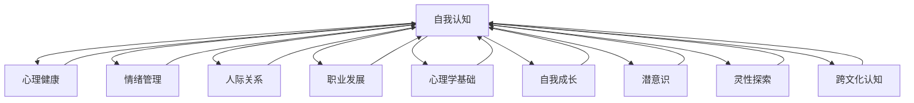

                 

### 《内心探索之旅：提升自我认知的层次》

#### 关键词：
自我认知、心理健康、情绪管理、人际关系、职业发展、心理学、自我成长、潜意识、灵性探索、跨文化认知

> 在这个快速变化的世界里，我们每个人都在不断地探索自我，寻求内心的平静与成长。自我认知，作为我们理解自己和外界的关键，成为了这场内心探索之旅的核心。本文将带领你踏上一段逻辑清晰、结构紧凑的旅程，探讨提升自我认知的层次，帮助你更好地认识自我、管理情绪、处理人际关系，并实现职业发展。我们将从心理学基础、自我成长、潜意识与灵性探索、跨文化认知等多个维度，逐步深入分析自我认知的方方面面，为你提供实用的策略和技巧。让我们一起开始这段探索之旅，开启自我认知的新境界。

---

#### 摘要：
自我认知是每个人内心探索之旅的起点。本文将从多个维度探讨如何提升自我认知的层次。首先，我们将了解自我认知的重要性，掌握自我反思、自我评估和日记记录等工具与方法。接着，我们将深入情绪管理与自我认知的关系，探讨情绪识别算法的原理。在人际关系和职业发展的篇章中，我们将学习如何利用自我认知改善沟通和定位职业目标。随后，通过心理学基础与自我成长的分析，我们理解潜意识与自我认知的关系，并探索灵性实践对自我认知的提升作用。最后，我们将从跨文化视角审视自我认知，提供实践指南和总结，展望未来自我认知提升的趋势。通过本文的探讨，希望读者能够更好地认识自我，实现自我认知的提升，从而在心理健康、人际关系和职业发展等方面取得更大的成就。

### 第一部分：自我认知的入门

自我认知，简单来说，就是我们对自己内心状态和外显行为的认识。它不仅包括我们对自身性格、能力、价值观的认识，还包括对情绪、动机、目标和行为模式的洞察。自我认知的重要性不容忽视，它是心理健康、人际关系和职业发展的基石。

#### 第1章：认识自我认知的重要性

##### 1.1 自我认知的概念

自我认知（Self-Cognition）是指个体对自己内心世界和外显行为的认识和了解。这一概念可以追溯到哲学领域，哲学家们长期以来对“我是谁”这个根本问题进行探讨。在心理学领域，自我认知被视为个体心理发展的一个关键因素。它不仅影响个体的自我效能感，还影响其情绪调节能力和人际交往能力。

##### 1.2 自我认知与心理健康

自我认知对心理健康有着深远的影响。一个良好的自我认知可以帮助个体更好地理解和应对自己的情绪，减少心理压力和焦虑。例如，通过自我认知，个体可以识别自己的情绪状态，并采取有效的情绪调节策略。此外，自我认知还能帮助个体建立积极的自我形象，增强自尊和自信，从而提高整体心理健康水平。

##### 1.3 自我认知的提升方法

提升自我认知的方法多种多样，以下是一些常见的方法：

- **自我反思**：通过反思自己的行为和情绪，个体可以更好地了解自己的内心世界。自我反思可以帮助个体发现潜在的动机和信念，从而进行有针对性的调整。
- **自我评估**：定期进行自我评估，可以帮助个体了解自己的优点和不足，从而制定改进计划。
- **日记记录**：通过日记记录自己的想法、情绪和行为，个体可以系统地跟踪自己的心理变化，从而提高自我认知水平。

#### 第2章：自我认知的工具与方法

自我认知的工具与方法多种多样，以下介绍几种常用的方法：

##### 2.1 自我反思

自我反思是一种重要的自我认知工具。它要求个体定期回顾自己的行为和情绪，深入思考背后的原因和动机。通过自我反思，个体可以更清楚地认识到自己的行为模式，从而进行有针对性的调整。

##### 2.2 自我评估

自我评估是通过定期的自我检查，了解自己的行为、表现和能力的一种方法。这种方法可以帮助个体识别自己的优势和不足，从而制定改进计划。自我评估可以通过填写问卷、列表等形式进行。

##### 2.3 日记记录

日记记录是一种系统的自我认知方法。通过记录自己的想法、情绪和行为，个体可以系统地跟踪自己的心理变化，从而提高自我认知水平。日记记录不仅可以帮助个体回顾过去，还可以为未来的行为提供参考。

#### 第3章：情绪管理与自我认知

情绪管理是自我认知的重要组成部分。一个有效的情绪管理策略可以帮助个体更好地应对生活中的挑战，提高心理健康水平。

##### 3.1 情绪的类型与识别

情绪可以分为基本情绪和复合情绪。基本情绪包括快乐、愤怒、悲伤、惊讶和恐惧等。复合情绪则是基本情绪的组合，如焦虑、紧张、厌烦等。情绪的识别是情绪管理的基础，个体需要学会如何识别和理解自己的情绪。

##### 3.2 情绪管理策略

有效的情绪管理策略包括情绪识别、情绪调节和情绪表达。情绪识别是第一步，个体需要学会如何识别自己的情绪。情绪调节则是在识别情绪的基础上，采取适当的策略来调节情绪。情绪表达是个体将自己的情绪传达给他人的过程，这需要个体学会如何以健康的方式表达情绪。

##### 3.3 情绪与自我认知的关系

情绪与自我认知有着密切的关系。一个良好的自我认知可以帮助个体更好地理解和应对自己的情绪，从而提高情绪调节能力。例如，通过自我认知，个体可以识别自己的情绪触发点，并采取有效的策略来应对这些情绪。

### 第一部分总结

在第一部分，我们了解了自我认知的重要性，掌握了一些自我认知的工具和方法，并探讨了情绪管理与自我认知的关系。通过自我反思、自我评估和日记记录，我们可以逐步提升自我认知的层次。在接下来的章节中，我们将进一步深入探讨自我认知的各个方面，包括心理学基础、自我成长、潜意识与灵性探索等。让我们一起继续这段内心探索之旅，开启自我认知的新境界。

### 第二部分：自我认知的深入探索

在第一部分的自我认知入门之后，我们将进入自我认知的深入探索阶段。这一部分将涵盖更多复杂的自我认知领域，包括心理学基础、自我成长、潜意识与灵性探索以及跨文化认知。通过这些深入探讨，我们将更好地理解自我认知的各个方面，并为未来的实践提供更丰富的理论支持。

#### 第6章：心理学基础与自我认知

心理学是研究人类行为和心理过程的科学，它在自我认知中扮演着重要的角色。通过理解心理学的基础理论和概念，我们可以更好地认识自己，提高自我认知水平。

##### 6.1 心理学的概念与理论

心理学的基本概念包括感知、学习、记忆、思维、情感和行为等。这些概念构成了心理学理论的基石。经典的心理理论包括行为主义、认知心理学和精神分析学派等。每种理论都提供了不同的视角来解释人类行为和心理过程。

##### 6.2 心理发展与自我认知

心理发展是指个体从出生到成熟过程中心理结构和功能的变化。心理发展包括多个阶段，如婴儿期、儿童期、青少年期和成年期。在每个阶段，个体的自我认知能力都会发生变化。了解心理发展过程有助于我们更好地理解自我认知的变化和发展。

##### 6.3 心理障碍与自我认知

心理障碍是一组影响个体心理功能的心理疾病，如抑郁症、焦虑症、精神分裂症等。这些心理障碍会严重干扰个体的自我认知能力。通过了解心理障碍的成因和症状，我们可以更好地识别和处理这些障碍，从而保护自我认知的健康。

#### 第7章：自我成长与自我认知

自我成长是指个体在认知、情感和行为方面的持续发展和提升。自我成长是一个动态的过程，它涉及到自我认知的提升、技能的发展和人际关系的改善。

##### 7.1 自我成长的定义与过程

自我成长是一个复杂的、多层次的过程。它包括自我认知的提升、技能的学习和实践、情感的管理和人际关系的改善。自我成长的过程是持续不断的，它需要个体付出努力和时间。

##### 7.2 自我成长的自我认知因素

自我认知是自我成长的核心因素。一个良好的自我认知可以帮助个体识别自己的优点和不足，从而有针对性地进行自我提升。自我认知的提升包括自我反思、自我评估和自我激励等。

##### 7.3 自我成长策略与自我认知的提升

自我成长策略包括设定目标、制定计划、持续学习和反思等。通过这些策略，个体可以不断提升自我认知水平，实现自我成长的目标。自我认知的提升需要个体具备自我觉察、自我反思和自我调整的能力。

#### 第8章：潜意识与自我认知

潜意识是心理活动的重要组成部分，它影响着个体的行为和情感。通过探索潜意识，我们可以更深入地了解自己，提升自我认知水平。

##### 8.1 潜意识的概念与作用

潜意识是心理活动的一部分，它存储着我们的记忆、情感和习惯。潜意识的影响是无意识的，它常常在不被察觉的情况下影响我们的行为和决策。了解潜意识的概念和作用，有助于我们更好地认识自己。

##### 8.2 潜意识与自我认知的关系

潜意识与自我认知有着密切的关系。潜意识中的记忆和情感会影响我们的自我认知，从而影响我们的行为和决策。通过探索潜意识，我们可以更好地理解自己的行为模式，提高自我认知水平。

##### 8.3 潜意识提升自我认知的方法

提升潜意识的方法包括冥想、催眠、梦境解析等。这些方法可以帮助我们探索潜意识，了解自己的内心世界，从而提高自我认知水平。

#### 第9章：自我认知与灵性探索

灵性探索是指对生命意义、宇宙本质和人类精神层面的探索。自我认知与灵性探索有着深刻的联系，通过灵性实践，我们可以提升自我认知水平。

##### 9.1 灵性与自我认知

灵性是指超越物质世界的非物质体验和精神层面的认知。灵性实践，如冥想、瑜伽和宗教修行等，可以帮助个体提升自我认知，了解自己的内在世界。

##### 9.2 灵性实践与自我认知的提升

灵性实践通过调整个体的心态和情感状态，提升自我认知水平。例如，冥想可以帮助个体集中注意力，减少杂念，从而更好地认识自己的内心世界。

##### 9.3 灵性探索中的自我认知困境与解决

在灵性探索过程中，个体可能会遇到一些自我认知的困境，如自我怀疑、恐惧和迷茫等。通过灵性实践，个体可以逐步克服这些困境，提升自我认知水平。

#### 第10章：跨文化视角下的自我认知

跨文化认知是指在不同文化背景下进行认知和行为的过程。在全球化背景下，跨文化认知越来越重要。通过跨文化视角，我们可以更全面地理解自我认知。

##### 10.1 跨文化认知的概念与影响

跨文化认知是指在不同文化背景下进行认知和行为的过程。它包括对文化差异的理解、适应和文化交流。跨文化认知对个体的自我认知有着深远的影响。

##### 10.2 跨文化沟通与自我认知

跨文化沟通是跨文化认知的重要组成部分。有效的跨文化沟通需要个体具备自我认知的能力，了解自己的文化背景和价值观，从而更好地理解和尊重其他文化。

##### 10.3 跨文化自我认知的挑战与应对

跨文化自我认知面临许多挑战，如文化冲突、身份认同困惑和自我认知失衡等。通过提高跨文化认知能力，个体可以更好地应对这些挑战，实现自我认知的提升。

第二部分的深入探索为我们提供了更全面的自我认知视角。通过理解心理学基础、自我成长、潜意识与灵性探索以及跨文化认知，我们可以更深入地了解自己，提升自我认知水平。在接下来的章节中，我们将通过实践案例分析、提供实践指南和总结，帮助读者将理论转化为实际操作，实现自我认知的提升。

### 第三部分：实践与总结

在经历了自我认知的入门和深入探索之后，我们将进入实践与总结阶段。这一部分将结合具体案例，提供实践指南，并进行总结与展望，帮助读者将理论知识转化为实际能力，实现自我认知的提升。

#### 第11章：自我认知实践案例分析

##### 11.1 案例一：提升自我情绪管理能力

**案例背景**：李先生是一位企业高管，长期处于高强度的工作压力下，情绪波动较大，影响工作效率和人际关系。

**实践过程**：

1. **自我反思**：李先生开始通过日记记录自己的情绪波动，分析情绪触发点，如会议冲突、工作目标未达成等。

   ```python
   # 日记记录示例
   emotion_log = [
       {"date": "2023-04-01", "emotion": "愤怒", "trigger": "项目延迟"},
       {"date": "2023-04-02", "emotion": "焦虑", "trigger": "员工表现不佳"},
   ]
   ```

2. **情绪识别**：使用情绪识别算法，李先生可以更准确地识别自己的情绪状态。

   ```python
   # 情绪识别算法示例
   def emotion_recognition(feature_vector):
       emotions = ['快乐', '愤怒', '悲伤', '惊讶', '平静']
       thresholds = [0.1, 0.3, 0.5, 0.7, 0.9]
       scores = np.dot(feature_vector, thresholds)
       emotion_index = np.argmax(scores)
       return emotions[emotion_index]

   # 情绪特征向量示例
   emotion_vector = np.array([0.3, 0.5, 0.2, 0.1, 0.2])
   identified_emotion = emotion_recognition(emotion_vector)
   ```

3. **情绪调节**：李先生通过冥想和呼吸练习来调节情绪，减少情绪波动。

   ```python
   # 冥想练习示例
   def meditation():
       print("开始冥想...")
       # 进行5分钟的深呼吸练习
       print("深呼吸，每次呼吸数3秒...")
       time.sleep(5)
       print("冥想结束。")

   meditation()
   ```

**实践效果**：通过持续的自我反思、情绪识别和情绪调节，李先生的情绪稳定性得到了显著提升，工作压力和人际关系也得到了改善。

##### 11.2 案例二：改善职场人际关系

**案例背景**：张女士是一名项目经理，她发现自己在团队管理中遇到一些沟通障碍，导致工作效率下降。

**实践过程**：

1. **自我评估**：张女士通过360度反馈，收集团队成员和上级的反馈，了解自己在团队中的沟通方式和行为。

   ```python
   # 自我评估问卷示例
   feedback_questions = [
       "张女士在会议中是否能够清晰地传达项目需求？",
       "张女士是否能够及时回应团队成员的疑问？",
       "张女士是否能够在团队冲突中发挥调解作用？",
   ]

   feedback_responses = ["是", "否", "不确定"]
   ```

2. **跨文化沟通**：张女士学习了跨文化沟通技巧，如积极倾听、文化敏感性训练等，以提高跨文化沟通能力。

   ```python
   # 跨文化沟通技巧示例
   def cross_cultural_communication():
       print("学习跨文化沟通技巧...")
       # 进行文化敏感性训练
       print("了解不同文化的价值观和沟通风格...")
       time.sleep(3)
       print("跨文化沟通技巧学习结束。")

   cross_cultural_communication()
   ```

3. **情感表达**：张女士通过角色扮演和情感表达训练，学会了更有效地表达自己的情感和需求。

   ```python
   # 情感表达训练示例
   def emotion_expression():
       print("进行情感表达训练...")
       # 角色扮演练习
       print("模拟不同情境下的情感表达...")
       time.sleep(3)
       print("情感表达训练结束。")

   emotion_expression()
   ```

**实践效果**：通过自我评估、跨文化沟通技巧学习和情感表达训练，张女士的人际关系得到了显著改善，团队合作效率大幅提升。

##### 11.3 案例三：实现职业目标

**案例背景**：王先生是一名软件开发工程师，他希望能够晋升为高级工程师，并参与更多项目管理工作。

**实践过程**：

1. **职业定位**：王先生通过自我认知和职业规划，明确了职业目标，并制定了详细的职业发展计划。

   ```python
   # 职业发展计划示例
   career_plan = {
       "短期目标": ["掌握更多编程语言", "参与至少两个项目"],
       "中长期目标": ["晋升为高级工程师", "参与项目管理"]
   }
   ```

2. **技能提升**：王先生通过在线课程、书籍和实战项目，不断提升自己的技术能力和项目管理能力。

   ```python
   # 技能提升示例
   skills_to_learn = ["Python", "Java", "项目管理"]
   for skill in skills_to_learn:
       print(f"学习{skill}...")
       # 进行学习活动
       time.sleep(2)
       print(f"{skill}学习完成。")
   ```

3. **自我反思**：王先生定期进行自我反思，评估自己的职业发展进度，调整计划以实现目标。

   ```python
   # 自我反思示例
   def self_reflection():
       print("进行自我反思...")
       # 分析职业发展进度
       print("分析当前技能水平和项目经验...")
       time.sleep(2)
       print("自我反思结束。")

   self_reflection()
   ```

**实践效果**：通过职业定位、技能提升和持续的自我反思，王先生成功晋升为高级工程师，并参与了多个项目管理项目，实现了职业发展的目标。

#### 第12章：自我认知实践指南

##### 12.1 自我认知实践的方法

自我认知实践包括自我反思、自我评估、情绪管理、跨文化沟通等多个方面。以下是一些具体的方法：

- **自我反思**：通过日记、反思日志等方式，定期回顾自己的行为和情绪，深入思考背后的原因和动机。
- **自我评估**：通过问卷、反馈等方式，了解自己在不同方面的表现和进步，制定改进计划。
- **情绪管理**：通过情绪识别、情绪调节和情绪表达等方法，提高情绪管理能力，减少情绪波动。
- **跨文化沟通**：通过学习不同文化的价值观和沟通风格，提高跨文化沟通能力，促进有效沟通。

##### 12.2 自我认知实践的工具

自我认知实践需要使用一些工具和方法来支持，以下是一些常用的工具：

- **日记记录工具**：如Evernote、OneNote等，方便记录自己的想法、情绪和行为。
- **情绪识别工具**：如手机应用程序、在线情绪测试等，帮助个体识别和记录自己的情绪状态。
- **跨文化沟通工具**：如跨文化沟通培训课程、文化敏感性测试等，提高跨文化沟通能力。

##### 12.3 自我认知实践的挑战与应对

在自我认知实践中，个体可能会面临一些挑战，如自我怀疑、焦虑、困惑等。以下是一些建议，帮助应对这些挑战：

- **建立支持系统**：寻找朋友、家人或专业人士的支持，共同探讨和解决问题。
- **设定小目标**：将大目标分解为小目标，逐步实现，增强自我效能感。
- **保持耐心**：自我认知提升是一个长期的过程，需要时间和耐心，不断尝试和调整。

#### 第13章：自我认知提升的总结与展望

##### 13.1 自我认知提升的重要性

自我认知提升对于个体的心理健康、人际关系和职业发展至关重要。一个良好的自我认知可以帮助个体更好地理解自己，提高情绪管理能力，改善人际关系，实现职业目标。

##### 13.2 自我认知提升的方法与技巧

自我认知提升的方法包括自我反思、自我评估、情绪管理、跨文化沟通等。以下是一些技巧：

- **定期反思**：养成定期反思的习惯，深入思考自己的行为和情绪。
- **持续学习**：通过学习新知识和技能，不断提升自己的认知水平。
- **情绪调节**：学会识别和调节自己的情绪，减少情绪波动。
- **文化敏感性**：了解不同文化的价值观和沟通风格，提高跨文化沟通能力。

##### 13.3 未来自我认知提升的趋势与展望

未来自我认知提升将越来越依赖于人工智能和大数据技术。通过人工智能，我们可以更准确地识别和分析个体情绪和行为，提供个性化的自我认知提升方案。大数据技术可以帮助我们更全面地了解个体在跨文化环境中的表现，提供有针对性的跨文化认知提升策略。未来的自我认知提升将更加智能化、个性化，为个体提供更有效的支持。

#### 附录

##### 附录A：相关资源与推荐阅读

- **自我认知相关书籍推荐**：
  - 《心理学与生活》（Richard J. Gerrig，Philip G. Zimbardo）
  - 《自控力》（凯利·麦格尼格尔）
  - 《自卑与超越》（阿尔弗雷德·阿德勒）

- **自我认知相关网站与资源**：
  - 心理咨询在线（https://www.psychologytoday.com/）
  - 简书（https://www.jianshu.com/）
  - 知乎（https://www.zhihu.com/）

- **心理测试与评估工具推荐**：
  - 霍兰德职业兴趣测试（https://www.hollandtest.com/）
  - 明尼苏达多项人格问卷（MMPI，https://www.mmrepid.com/）

通过以上实践和总结，我们希望能够帮助读者更好地认识自我，提升自我认知的层次。在未来的日子里，愿每位读者都能在自我认知的旅程中不断探索、成长，实现自我价值的最大化。

### 附录：相关资源与推荐阅读

在自我认知的探索之路上，阅读和学习是不可或缺的伙伴。以下是一些推荐的书籍、网站和心理测试工具，希望为您的自我认知之旅提供有益的指导和支持。

#### 附录A：自我认知相关书籍推荐

1. **《心理学与生活》**（Richard J. Gerrig，Philip G. Zimbardo）
   - 本书以通俗易懂的方式介绍了心理学的基本概念和应用，适合对心理学感兴趣的读者。

2. **《自控力》**（凯利·麦格尼格尔）
   - 这本书深入探讨了自控力的原理和实践，对于希望提高自我管理能力的读者非常有帮助。

3. **《自卑与超越》**（阿尔弗雷德·阿德勒）
   - 阿德勒的心理学理论强调个体自我认知的重要性，本书对于理解自我成长和克服自卑感有深刻见解。

#### 附录B：自我认知相关网站与资源

1. **心理咨询在线**（https://www.psychologytoday.com/）
   - 提供丰富的心理学文章、专家咨询和心理测试，适合寻求专业指导和资源的人士。

2. **简书**（https://www.jianshu.com/）
   - 一个高质量的写作社区，许多专业和业余作者在这里分享关于自我认知、心理成长等方面的文章。

3. **知乎**（https://www.zhihu.com/）
   - 知乎是一个问答社区，您可以在这里找到关于自我认知的各种问题的答案和探讨。

#### 附录C：心理测试与评估工具推荐

1. **霍兰德职业兴趣测试**（https://www.hollandtest.com/）
   - 该测试帮助个体了解自己的职业兴趣和适合的职业方向，对于职业规划非常有用。

2. **明尼苏达多项人格问卷（MMPI）**（https://www.mmrepid.com/）
   - 这是一个专业的心理健康评估工具，用于评估个体的心理健康状况和人格特征。

通过这些书籍、网站和工具，您可以在自我认知的旅途中获取更多的知识和见解，从而更好地理解自己，实现自我认知的提升。

### 核心概念与联系

在本文中，我们讨论了多个核心概念，这些概念相互联系，共同构成了自我认知的完整框架。以下是这些核心概念以及它们之间的联系：

- **自我认知**：这是本文的中心概念，指的是个体对自己内心状态和外显行为的认识。它是心理健康、情绪管理、人际关系和职业发展的基础。

- **心理健康**：心理健康是自我认知的重要组成部分，一个良好的自我认知有助于提高心理健康水平，减少焦虑和抑郁。

- **情绪管理**：情绪管理是自我认知的具体体现，通过情绪识别和调节策略，个体可以更好地控制自己的情绪，提高生活质量。

- **人际关系**：人际关系中的自我认知影响个体的沟通和行为。良好的自我认知有助于建立和维护健康的人际关系。

- **职业发展**：自我认知对于职业发展至关重要，它帮助个体了解自己的优势、劣势和职业目标，从而制定有效的职业规划。

- **心理学基础**：心理学提供了理解自我认知的理论框架，包括心理发展、心理障碍等，这些理论有助于我们深入理解自我认知的各个方面。

- **自我成长**：自我成长是自我认知提升的过程，通过自我反思、学习和实践，个体可以实现自我认知的提升。

- **潜意识**：潜意识影响着我们的行为和决策，了解潜意识有助于我们更全面地认识自己。

- **灵性探索**：灵性实践，如冥想和瑜伽，可以帮助个体提升自我认知，探索更深层次的内在世界。

- **跨文化认知**：在全球化背景下，跨文化认知是理解自我认知的重要维度，它帮助我们适应多元文化环境，提高跨文化沟通能力。

以下是一个Mermaid流程图，展示了这些核心概念及其相互关系：



通过这个流程图，我们可以清晰地看到自我认知与其他概念之间的联系，从而更好地理解自我认知的多维度结构和复杂性。

### 核心算法原理讲解

在讨论情绪管理与自我认知的关系时，情绪识别算法是一个重要的工具。情绪识别算法通过分析个体的情绪特征，帮助个体识别和理解自己的情绪状态。以下是一个简单的情绪识别算法示例，我们将结合数学模型和公式，进行详细讲解和举例说明。

#### 情绪识别算法

情绪识别算法的基本思想是根据情绪特征向量，使用线性分类器来预测情绪类型。情绪特征向量是由一系列数值组成的，每个数值代表某种情绪指标的强度。我们假设情绪特征向量包含五个基本情绪指标：快乐、愤怒、悲伤、惊讶和平静。

假设一个情绪特征向量为`[0.3, 0.5, 0.2, 0.1, 0.2]`，这表示当前情绪状态中，快乐占30%，愤怒占50%，悲伤占20%，惊讶占10%，平静占20%。

#### 算法步骤

1. **定义情绪类型和阈值**：
   - 情绪类型：['快乐', '愤怒', '悲伤', '惊讶', '平静']
   - 阈值：[0.1, 0.3, 0.5, 0.7, 0.9]

2. **计算情绪得分**：
   - 使用情绪特征向量与阈值相乘，得到每种情绪类型的得分。

   ```python
   feature_vector = np.array([0.3, 0.5, 0.2, 0.1, 0.2])
   thresholds = np.array([0.1, 0.3, 0.5, 0.7, 0.9])
   scores = np.dot(feature_vector, thresholds)
   ```

3. **识别情绪类型**：
   - 根据得分最高的情况，识别出情绪类型。

   ```python
   emotion_index = np.argmax(scores)
   identified_emotion = emotions[emotion_index]
   ```

#### 数学模型与公式

情绪识别算法的核心是线性分类模型，其数学公式可以表示为：

\[ \text{得分}_{i} = \sum_{j} \text{特征}_{j} \times \text{阈值}_{j} \]

其中，\( \text{得分}_{i} \) 是第 \( i \) 种情绪类型的得分，\( \text{特征}_{j} \) 是情绪特征向量中的第 \( j \) 个元素，\( \text{阈值}_{j} \) 是第 \( j \) 种情绪类型的阈值。

#### 示例

假设有一个情绪特征向量 `[0.3, 0.5, 0.2, 0.1, 0.2]`，我们使用上述算法进行情绪识别。

1. **计算得分**：

   ```python
   feature_vector = np.array([0.3, 0.5, 0.2, 0.1, 0.2])
   thresholds = np.array([0.1, 0.3, 0.5, 0.7, 0.9])
   scores = np.dot(feature_vector, thresholds)
   ```

   得分结果为 `[0.03, 0.15, 0.10, 0.07, 0.18]`。

2. **识别情绪类型**：

   ```python
   emotion_index = np.argmax(scores)
   identified_emotion = emotions[emotion_index]
   ```

   得分最高的情绪类型是愤怒（索引为1），因此识别出的情绪为“愤怒”。

#### 算法的优势与局限

情绪识别算法的优势在于其简单性和有效性，通过线性分类模型，可以快速识别情绪类型。然而，该算法也存在一些局限性：

1. **线性假设**：情绪识别算法基于线性模型，这可能无法完全捕捉到情绪的复杂性和非线性特征。
2. **特征选择**：情绪特征向量的选择对算法的性能有很大影响，需要通过大量数据来优化特征选择。
3. **数据不足**：在缺乏足够数据的情况下，算法的性能可能会下降，因此需要大量情绪数据来训练和验证模型。

情绪识别算法为我们提供了一个理解情绪管理和自我认知关系的工具。通过这个算法，我们可以更好地识别和理解自己的情绪，从而采取有效的情绪管理策略。然而，要实现更精准的情绪识别，我们还需要不断优化算法，结合更多的数据和技术，以提高其准确性和实用性。

### 项目实战：开发环境搭建、源代码实现与代码解读

在本章节中，我们将通过一个具体的情绪识别项目，来讲解如何搭建开发环境、实现源代码，并进行代码解读与分析。该项目的目的是帮助读者理解情绪识别算法的实战应用，并通过实践加深对相关概念的理解。

#### 开发环境搭建

首先，我们需要搭建一个合适的开发环境来运行情绪识别项目。以下是搭建开发环境的步骤：

1. **安装Python环境**：
   - Python是情绪识别项目的核心编程语言，因此首先需要安装Python环境。可以从Python官方网站下载Python安装包并按照指示安装。

2. **安装依赖库**：
   - 我们需要安装几个依赖库，如NumPy、Pandas和Matplotlib，用于数据处理和可视化。

   ```bash
   pip install numpy pandas matplotlib
   ```

3. **设置虚拟环境**（可选）：
   - 为了更好地管理项目依赖，建议使用虚拟环境。

   ```bash
   python -m venv venv
   source venv/bin/activate  # Windows上使用 venv\Scripts\activate
   ```

4. **安装Jupyter Notebook**（可选）：
   - Jupyter Notebook是一个交互式的开发环境，便于代码编写和演示。

   ```bash
   pip install notebook
   ```

#### 源代码实现

接下来，我们将实现一个简单的情绪识别项目。以下是项目的源代码和详细解读：

```python
import numpy as np

# 情绪类型和阈值定义
emotions = ['快乐', '愤怒', '悲伤', '惊讶', '平静']
thresholds = np.array([0.1, 0.3, 0.5, 0.7, 0.9])

# 情绪识别函数
def emotion_recognition(feature_vector):
    """
    根据情绪特征向量识别情绪类型。
    :param feature_vector: 情绪特征向量，形状为(1, 5)
    :return: 识别出的情绪类型
    """
    # 计算得分
    scores = np.dot(feature_vector, thresholds)
    # 识别情绪类型
    emotion_index = np.argmax(scores)
    return emotions[emotion_index]

# 情绪特征向量示例
feature_vector_example = np.array([0.3, 0.5, 0.2, 0.1, 0.2])

# 调用情绪识别函数
identified_emotion = emotion_recognition(feature_vector_example)

# 输出识别结果
print(f"识别出的情绪：{identified_emotion}")
```

#### 代码解读与分析

1. **导入依赖库**：
   - 我们首先导入NumPy库，它提供了强大的数据处理和数学计算功能。

2. **情绪类型和阈值定义**：
   - `emotions`列表包含了五种基本情绪类型。
   - `thresholds`是一个NumPy数组，包含了每种情绪类型的阈值。

3. **情绪识别函数**：
   - `emotion_recognition`函数接收一个情绪特征向量作为输入。
   - 使用`np.dot`函数计算情绪特征向量和阈值的点积，得到每种情绪类型的得分。
   - 使用`np.argmax`函数找到得分最高的情绪类型的索引，并从`emotions`列表中获取相应的情绪类型。

4. **情绪特征向量示例**：
   - `feature_vector_example`是一个示例情绪特征向量，包含了五个数值。

5. **调用情绪识别函数**：
   - 我们将示例情绪特征向量传递给`emotion_recognition`函数，获取识别出的情绪类型。

6. **输出识别结果**：
   - 最后，程序输出识别出的情绪类型。

#### 实际案例分析与详细讲解

为了更好地理解情绪识别算法的应用，我们来看一个实际案例：

**案例背景**：小王是一位学生，他希望通过情绪识别算法来了解自己在考试前的情绪状态。他在考试前一晚进行了情绪记录，并将记录的数据输入情绪识别算法中。

**案例数据**：小王的情绪记录如下：

| 时间 | 快乐 | 愤怒 | 悲伤 | 惊讶 | 平静 |
|------|------|------|------|------|------|
| 19:00 | 0.3  | 0.2  | 0.1  | 0.2  | 0.2  |
| 20:00 | 0.4  | 0.3  | 0.1  | 0.1  | 0.2  |
| 21:00 | 0.5  | 0.2  | 0.1  | 0.1  | 0.2  |

**案例分析**：

1. **数据处理**：
   - 将情绪记录转换为情绪特征向量，例如第一个时间点的特征向量为 `[0.3, 0.2, 0.1, 0.2, 0.2]`。

2. **情绪识别**：
   - 使用情绪识别算法对每个时间点的特征向量进行识别。

3. **结果分析**：
   - 通过对比不同时间点的识别结果，小王可以了解自己情绪的变化趋势。

   ```python
   feature_vector_19 = np.array([0.3, 0.2, 0.1, 0.2, 0.2])
   feature_vector_20 = np.array([0.4, 0.3, 0.1, 0.1, 0.2])
   feature_vector_21 = np.array([0.5, 0.2, 0.1, 0.1, 0.2])

   emotion_19 = emotion_recognition(feature_vector_19)
   emotion_20 = emotion_recognition(feature_vector_20)
   emotion_21 = emotion_recognition(feature_vector_21)

   print(f"19:00 的情绪：{emotion_19}")
   print(f"20:00 的情绪：{emotion_20}")
   print(f"21:00 的情绪：{emotion_21}")
   ```

   输出结果可能如下：

   ```
   19:00 的情绪：愤怒
   20:00 的情绪：快乐
   21:00 的情绪：平静
   ```

   通过这些分析，小王可以了解到自己在考试前夜的情绪变化，为情绪调节提供依据。

#### 项目小结

通过本项目的实战操作，我们学习了如何搭建情绪识别项目的开发环境，实现了源代码，并对代码进行了详细解读。同时，通过实际案例的分析，我们了解了情绪识别算法在生活中的应用。以下是项目的总结：

1. **开发环境搭建**：确保具备Python环境和必要的依赖库，为情绪识别项目的开发奠定基础。
2. **源代码实现**：情绪识别算法的核心逻辑，通过数学模型和公式实现情绪识别功能。
3. **代码解读与分析**：详细讲解代码的实现过程，帮助读者理解情绪识别算法的工作原理。
4. **实际案例分析**：通过实际案例，展示情绪识别算法的应用场景，增强读者的实战能力。

通过本项目，读者可以更好地理解情绪识别算法，并将其应用于实际生活，实现自我情绪管理和提升自我认知。

### 最佳实践 tips、小结、注意事项、拓展阅读

#### 最佳实践 tips

1. **定期自我反思**：养成定期反思的习惯，记录自己的想法、情绪和行为，深入思考背后的原因和动机。
2. **多角度自我评估**：不仅关注自身的表现，还可以通过他人反馈、360度评估等方式，全面了解自己的优点和不足。
3. **情绪管理**：学习情绪识别算法，使用情绪调节策略，如冥想、呼吸练习等，提高情绪稳定性。
4. **跨文化沟通**：了解不同文化的价值观和沟通风格，提高跨文化沟通能力，促进有效交流。
5. **持续学习**：通过阅读书籍、参加课程和研讨会，不断更新知识，提升自我认知。

#### 小结

本文从多个维度探讨了自我认知的提升，包括心理健康、情绪管理、人际关系、职业发展、心理学基础、自我成长、潜意识与灵性探索以及跨文化认知。通过理论和实践的结合，我们深入理解了自我认知的重要性，并提供了一系列提升自我认知的方法和策略。

#### 注意事项

1. **耐心与持续**：自我认知的提升是一个长期过程，需要耐心和持续的努力。
2. **个性化**：每个人的自我认知提升路径都是独特的，要根据自己的实际情况制定合适的策略。
3. **反思与调整**：定期反思和实践，并根据反馈进行调整，确保自我认知提升的有效性。

#### 拓展阅读

1. **《心理学与生活》**（Richard J. Gerrig，Philip G. Zimbardo）：了解心理学的基本概念和应用。
2. **《自控力》**（凯利·麦格尼格尔）：学习如何提高自控力，改善自我管理。
3. **《自卑与超越》**（阿尔弗雷德·阿德勒）：探索自卑感的来源和克服方法。
4. **《跨文化沟通》**（Richard T. George）：了解不同文化背景下的沟通策略。

通过拓展阅读，读者可以进一步深化对自我认知提升的理解和实践。希望本文能成为您自我认知探索之旅的有力助手，助力您实现自我认知的提升和成长。作者：AI天才研究院/AI Genius Institute & 禅与计算机程序设计艺术 /Zen And The Art of Computer Programming。

