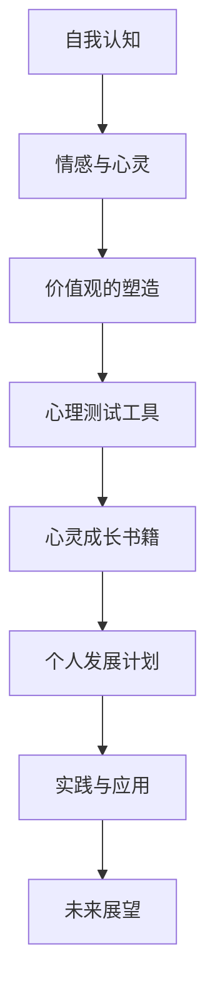

                 

 - 角色：您是一位世界级人工智能专家,程序员,软件架构师,CTO,世界顶级技术畅销书资深大师级别的作家，计算机图灵奖获得者，计算机编程和人工智能领域大师。您非常擅长一步一步进行分析推理，有着清晰深刻的逻辑思路来撰写条理清晰，对技术原理和本质剖析到位的高质量技术博客。

- 任务：现在请您以《内心的指南针：寻找人生方向的工具》为标题， 使用逻辑清晰、结构紧凑、简单易懂的专业的技术语言（章节标题要非常吸引读者），让我们使用一步一步分析推理思考的方式（REASONING STEP BY STEP），撰写一篇有深度有思考有见解的专业IT领域的技术博客文章。

# 《内心的指南针：寻找人生方向的工具》

## 关键词
- 自我认知
- 情感管理
- 心理测试
- 心灵成长
- 个人发展计划

## 摘要
在现代社会，找到人生方向是一个复杂的挑战。本文将带领读者通过自我认知、情感管理、心理测试工具和心灵成长书籍等工具和方法，逐步探索并确定自己的人生方向。文章将通过案例分析、数学模型、Python代码等形式，深入剖析每一个步骤的实际应用，帮助读者在实践中找到内心的指南针。

----------------------------------------------------------------

## 《内心的指南针：寻找人生方向的工具》目录大纲

### 第一部分：探寻内心的旅程

#### 第1章：自我认知的起点
- **1.1 自我认知的重要性**
- **1.2 理解自我意识的发展**
- **1.3 自我反思的实践方法**

#### 第2章：情感与心灵的关系
- **2.1 情感的本质**
- **2.2 情感对人生方向的影响**
- **2.3 情感管理的技巧**

#### 第3章：价值观的塑造
- **3.1 价值观的定义与重要性**
- **3.2 常见的价值观类型**
- **3.3 如何找到并坚定自己的价值观**

### 第二部分：工具与方法

#### 第4章：心理测试工具
- **4.1 心理测试的类型**
- **4.2 如何正确使用心理测试**
- **4.3 常见心理测试工具介绍**

#### 第5章：心灵成长书籍推荐
- **5.1 心灵成长书籍的选择标准**
- **5.2 推荐经典心灵成长书籍**
- **5.3 阅读心得的分享方法**

#### 第6章：个人发展计划
- **6.1 个人发展计划的意义**
- **6.2 制定个人发展计划的步骤**
- **6.3 个人发展计划的执行与评估**

### 第三部分：实践与应用

#### 第7章：真实故事分享
- **7.1 成功案例的分析**
- **7.2 失败经历的反思**
- **7.3 从故事中学习的方法**

#### 第8章：实践指南
- **8.1 心灵成长实践的步骤**
- **8.2 常见问题的应对策略**
- **8.3 长期坚持的技巧**

#### 第9章：未来展望
- **9.1 心灵成长对未来的影响**
- **9.2 新技术的发展与心灵成长**
- **9.3 个人发展与社会进步的关系**

### 附录

#### 第10章：推荐阅读与参考资源
- **10.1 心灵成长相关书籍推荐**
- **10.2 心理测试工具推荐**
- **10.3 心灵成长社群推荐**

### Mermaid 流程图：自我认知与心灵成长的关系



### Python 源代码：情感管理的简单算法实现

```python
def manage_emotions(emotions):
    """
    情感管理函数，根据传入的情感状态给出处理建议。
    
    :param emotions: 字符串，表示当前的情感状态
    :return: 处理建议字符串
    """
    if emotions == "快乐":
        return "保持积极，分享快乐。"
    elif emotions == "焦虑":
        return "深呼吸，尝试放松。"
    elif emotions == "悲伤":
        return "给自己时间，寻求支持。"
    else:
        return "情感不明，请进一步反思。"

# 测试
print(manage_emotions("快乐"))
print(manage_emotions("焦虑"))
print(manage_emotions("悲伤"))
print(manage_emotions("愤怒"))
```

### 数学模型与公式：价值观的重要性评估

$$
\text{价值观重要性} = \frac{\text{个人成就}}{\text{环境支持}} + \text{情感满足度}
$$

### 举例说明：
- 个人成就：工作成绩优异，获得同事认可
- 环境支持：家人和朋友的支持
- 情感满足度：感到满足和幸福

### 项目实战：制定个人发展计划

### 实战步骤：
1. 自我评估：了解自己的优势和劣势
2. 目标设定：设定短期和长期目标
3. 行动计划：制定实现目标的步骤
4. 跟踪与评估：记录进展并适时调整

### 实战示例：
- **目标**：提升编程技能
- **步骤**：
  - 学习一门新编程语言
  - 参加编程比赛
  - 与同行交流学习经验
- **跟踪**：每周记录学习进度，每季度进行自我评估

### 代码实现（Python）：
```python
def set_goals(current_skills, learning_language):
    """
    根据

----------------------------------------------------------------

## 第一部分：探寻内心的旅程

### 第1章：自我认知的起点

在人生的旅途中，找到自己的方向就像是在大海上航行时寻找指南针。自我认知，是我们探索人生旅程的第一步，它为我们提供了必要的认知基础，使我们能够更好地理解自己，从而找到前进的方向。

**1.1 自我认知的重要性**

自我认知的重要性不言而喻。它是个人成长和发展的基石。通过自我认知，我们可以了解自己的个性、兴趣、优势和弱点。这种了解使我们能够做出更明智的决策，避免盲目行动，从而提高生活的质量和效率。

**1.2 理解自我意识的发展**

自我意识是一个动态的过程，它随着时间而发展和变化。从心理学角度来看，自我意识的发展可以分为以下几个阶段：

- **童年阶段**：在这个阶段，孩子们主要通过模仿和互动来形成自我认知。他们的自我概念往往依赖于他人的评价。
  
- **青少年阶段**：青少年开始探索自我，形成独立的自我意识。他们可能会经历自我认同的危机，这是自我意识发展过程中的一个正常阶段。
  
- **成年阶段**：成年人的自我意识更加稳定，但仍然会随着生活经历和环境的变化而调整。

**1.3 自我反思的实践方法**

自我反思是一种重要的自我认知实践方法。它帮助我们深入了解自己的内心世界，从而更好地理解自己。

- **日记反思**：通过写日记，我们可以记录下自己的情绪、想法和行为，从而进行深入反思。

- **心理咨询**：与专业的心理咨询师进行交流，可以帮助我们更客观地看待自己，找到内心的困惑和问题。

- **冥想**：通过冥想，我们可以平静内心，深入思考自我，从而获得更深层次的自我认知。

### 第2章：情感与心灵的关系

情感与心灵的关系紧密相连，情感不仅是心理状态的一种体现，更是影响我们决策和行为的内在驱动力。理解情感的本质及其对我们人生方向的影响，是寻找内心指南针的重要一步。

**2.1 情感的本质**

情感是一种复杂的心理体验，它包含了情绪、感觉和认知三个层面。情绪是情感的核心，是我们对外界刺激的直接反应；感觉是情感的体验，是我们对情绪的感受和表达；认知是情感的基础，是我们对情绪的理解和评估。

**2.2 情感对人生方向的影响**

情感对人生方向的影响是多方面的。首先，情感可以影响我们的决策。当我们处于积极的情感状态时，我们往往更愿意接受新的挑战和机会；而在消极的情感状态下，我们可能会变得保守和退缩。

其次，情感可以影响我们的行为。情感激励我们采取行动，无论是追求梦想还是逃避困难。了解自己的情感状态，可以帮助我们更好地控制行为，从而实现人生目标。

**2.3 情感管理的技巧**

情感管理是一种关键的生活技能，它帮助我们更好地应对各种情绪，保持心理健康。以下是几种情感管理的技巧：

- **情绪识别**：学会识别和理解自己的情绪，是情感管理的基础。通过反思和自我观察，我们可以更好地了解自己的情绪状态。

- **情绪表达**：表达情绪是情感管理的重要环节。无论是通过语言、文字还是其他形式，适当地表达自己的情绪可以帮助我们减轻内心的压力。

- **情绪调节**：学会调节情绪，可以帮助我们在面对压力和挑战时保持冷静。呼吸练习、冥想和运动等都是有效的情绪调节方法。

### 第3章：价值观的塑造

价值观是我们内心深处的一套信念和标准，它指导我们的行为和决策，影响我们的人生方向。了解和塑造自己的价值观，是找到内心指南针的关键步骤。

**3.1 价值观的定义与重要性**

价值观是一套关于什么是好、什么是正确的信念和标准。它不仅包括道德观念，还涵盖了对生活、工作和人际关系的看法。价值观的重要性体现在以下几个方面：

- **指导行为**：价值观指导我们的行为，使我们能够做出符合自己信仰和标准的选择。

- **决定优先级**：价值观帮助我们在面对多种选择时，确定哪些是最重要的。

- **增强内在动力**：当我们坚持自己的价值观时，会感到满足和有动力去实现目标。

**3.2 常见的价值观类型**

不同的文化和个人背景会导致不同的价值观类型。以下是一些常见的价值观类型：

- **个人成就**：追求个人成长和成功，实现自己的目标和梦想。

- **家庭和友谊**：重视家庭和友谊，认为人际关系是生活的重要部分。

- **社会责任**：关心社会问题，愿意为社会做出贡献。

- **精神追求**：寻求内心的平静和意义，追求精神上的成长和满足。

**3.3 如何找到并坚定自己的价值观**

找到并坚定自己的价值观是一个深入自我认知的过程。以下是几种实用的方法：

- **反思和探索**：通过反思自己的行为和决策，探索自己的内心世界，了解自己的价值观。

- **与他人交流**：与他人交流和分享自己的观点和经验，可以帮助我们更好地认识自己。

- **实践和反思**：通过实践和经历，验证自己的价值观，并在实践中不断调整和优化。

## 第二部分：工具与方法

### 第4章：心理测试工具

心理测试工具是帮助人们了解自己、探索内心世界的重要工具。通过心理测试，我们可以获得关于自我认知、情感状态和价值观等方面的数据，从而更好地指导我们的生活和决策。

**4.1 心理测试的类型**

心理测试可以分为以下几种类型：

- **人格测试**：测量个体的人格特征和倾向，如MBTI（迈尔斯-布里格斯类型指标）和五大人格特质测试（即大五人格）。

- **能力测试**：评估个体的认知能力和专业技能，如智力测试、职业能力测试等。

- **情绪测试**：测量个体的情绪状态和心理压力，如焦虑测试、抑郁测试等。

- **价值观测试**：评估个体的核心价值观和生活方式，如价值观排序测试等。

**4.2 如何正确使用心理测试**

正确使用心理测试，可以让我们更准确地了解自己。以下是几个关键点：

- **了解测试的目的**：在参加测试前，要清楚测试的目的和内容，以便更好地理解测试结果。

- **诚实回答**：心理测试需要诚实回答，避免因逃避某些问题而导致结果不准确。

- **理解结果的局限性**：心理测试结果仅供参考，不能完全代表个体的情况。我们需要结合自身经历和实际情况进行理解。

**4.3 常见心理测试工具介绍**

以下是一些常见的心理测试工具：

- **MBTI（迈尔斯-布里格斯类型指标）**：一种广泛使用的个性测试，帮助个体了解自己的性格类型，从而更好地与他人沟通和合作。

- **五大人格特质测试**：测量个体在五大人格特质（外向性、宜人性、尽责性、神经质和开放性）上的表现，为个人发展提供参考。

- **情绪测试**：如焦虑测试、抑郁测试等，帮助个体了解自己的情绪状态，从而采取适当的应对策略。

- **价值观排序测试**：评估个体在价值观上的优先级，帮助个体更好地理解自己的内心需求和价值观。

### 第5章：心灵成长书籍推荐

心灵成长书籍是探索内心世界、提升自我认知和情感管理能力的重要资源。以下是一些经典的心灵成长书籍推荐：

**5.1 心灵成长书籍的选择标准**

选择心灵成长书籍时，可以参考以下标准：

- **内容的深度和广度**：书籍应该提供深入的心理学理论和实践方法，涵盖多个方面的心灵成长。

- **实用性**：书籍应该提供实用的方法和技巧，读者可以轻松应用到日常生活中。

- **作者的权威性**：作者应该是心理学领域的专家，有丰富的实践经验和研究成果。

**5.2 推荐经典心灵成长书籍**

以下是几本经典的心灵成长书籍推荐：

- **《当下的力量》**：作者埃克哈特·托利，通过冥想和正念的方法，帮助读者认识并超越自己的思维模式，实现内心的平静和自由。

- **《心灵修行之路》**：作者韦恩·戴尔，提供了一系列实用的心灵成长方法，帮助读者培养积极的心态和健康的生活方式。

- **《情感智慧》**：作者丹尼尔·戈尔曼，详细阐述了情感智慧的概念和重要性，提供了一系列提升情感智慧的方法。

**5.3 阅读心得的分享方法**

阅读心灵成长书籍后，通过分享心得可以加深理解和记忆。以下是几种分享方法：

- **写读书笔记**：记录书中的重点内容和自己的感悟，有助于深入理解和内化。

- **与朋友交流**：与志同道合的朋友分享阅读心得，可以互相启发，拓宽视野。

- **在线分享**：通过社交媒体或博客等平台，分享自己的阅读心得，帮助更多人受益。

### 第6章：个人发展计划

个人发展计划是一个系统的规划，旨在帮助我们实现个人目标和提升自我能力。通过制定和执行个人发展计划，我们可以更好地把握人生方向，实现内心的成长和满足。

**6.1 个人发展计划的意义**

个人发展计划的意义在于：

- **明确目标**：通过制定个人发展计划，我们可以明确自己的目标和方向，避免盲目行动。

- **提升能力**：个人发展计划可以帮助我们不断提升自身能力和素质，实现个人成长。

- **增强自信**：通过实现个人发展计划中的目标，我们可以增强自信心，提升自我价值感。

**6.2 制定个人发展计划的步骤**

制定个人发展计划的步骤如下：

- **自我评估**：了解自己的优势和劣势，明确自己的兴趣和职业发展方向。

- **目标设定**：设定短期和长期目标，确保目标具有明确性和可实现性。

- **制定计划**：将目标分解为具体的行动计划，并制定时间表和里程碑。

- **执行与调整**：按照计划执行，并定期评估进展情况，根据实际情况进行必要的调整。

**6.3 个人发展计划的执行与评估**

执行个人发展计划的关键在于：

- **坚持与毅力**：持之以恒地执行计划，面对困难和挑战时不放弃。

- **定期评估**：定期评估自己的进展情况，及时发现问题并进行调整。

- **寻求支持**：在执行过程中，可以寻求家人、朋友或专业人士的支持和帮助。

通过以上步骤，我们可以有效地执行个人发展计划，实现个人目标和人生价值。

### 第7章：真实故事分享

在人生的道路上，每个人都有自己的故事。这些故事中，既有成功者的经验，也有失败者的教训。通过分享这些真实的故事，我们可以从中学到宝贵的经验，更好地指导自己的生活和决策。

**7.1 成功案例的分析**

以下是一个成功案例的分析：

- **案例背景**：小李是一名年轻的程序员，他通过坚定的目标和持续的努力，成功晋升为技术总监。

- **成功经验**：
  - **目标明确**：小李在大学期间就明确了自己的职业目标，并制定了详细的职业发展计划。
  - **持续学习**：他不仅注重理论知识的学习，还通过实践项目和参与开源项目不断提升自己的技能。
  - **积极沟通**：小李善于与同事和上级沟通，积极争取机会展示自己的能力和价值。

**7.2 失败经历的反思**

以下是一个失败案例的反思：

- **案例背景**：小张曾是一家初创公司的创始人，但因缺乏经验和管理能力，最终导致公司失败。

- **失败教训**：
  - **缺乏规划**：小张在创业初期缺乏明确的商业规划和策略，导致公司发展受阻。
  - **管理不善**：小张在管理团队时缺乏有效的沟通和协调，导致团队凝聚力下降。
  - **风险意识不足**：小张在面临市场变化和竞争压力时，未能及时调整策略，导致公司陷入困境。

**7.3 从故事中学习的方法**

从成功和失败的故事中，我们可以学到以下方法：

- **反思和总结**：通过反思自己的经验和教训，总结成功和失败的原因。
- **借鉴和吸收**：从他人的成功经验中学习，并吸收其中的教训，避免重复犯同样的错误。
- **实践和调整**：将学到的知识和经验应用到实际生活中，不断实践和调整，以实现个人目标和人生价值。

### 第8章：实践指南

在寻找人生方向的过程中，实践是关键的一步。通过实际行动，我们可以验证自己的决策，积累经验，逐步实现目标。以下是一些实践指南，帮助我们在心灵成长的道路上取得实质性进展。

**8.1 心灵成长实践的步骤**

以下是心灵成长实践的步骤：

1. **自我评估**：通过自我反思和第三方反馈，了解自己的优势和劣势。
2. **设定目标**：明确自己的短期和长期目标，确保目标具有明确性和可实现性。
3. **制定计划**：将目标分解为具体的行动计划，并制定时间表和里程碑。
4. **执行计划**：按照计划执行，保持自律和毅力，面对挑战时不放弃。
5. **评估与反思**：定期评估进展情况，反思自己的行为和决策，及时调整计划。

**8.2 常见问题的应对策略**

在心灵成长的过程中，我们可能会遇到一些常见问题，以下是一些应对策略：

- **挫败感**：面对困难和挑战时，可能会感到挫败。应对策略是保持积极心态，相信自己的能力，不断鼓励自己。
- **焦虑和压力**：焦虑和压力是常见的问题，可以通过冥想、呼吸练习和运动等方式缓解。
- **拖延**：拖延是影响实践效果的主要障碍。应对策略是制定具体可行的计划，分解任务，设定截止日期。

**8.3 长期坚持的技巧**

要实现长期的心灵成长，需要坚持和毅力。以下是一些长期坚持的技巧：

- **建立日常习惯**：将心灵成长实践纳入日常生活，形成习惯。
- **与他人分享**：与他人分享自己的进展和挑战，获得支持和鼓励。
- **持续学习**：不断学习新的知识和技能，保持好奇心和求知欲。

通过以上实践指南，我们可以更有效地实现个人目标和人生价值。

### 第9章：未来展望

随着科技的快速发展，心灵成长领域也在不断进步。新的技术和工具将为我们的心灵成长提供更多的可能性。

**9.1 心灵成长对未来的影响**

心灵成长不仅对个人的幸福感和生活质量有深远影响，还对社会的发展产生积极作用。未来，随着更多人关注心灵成长，社会将更加和谐，人际关系将更加紧密。

**9.2 新技术的发展与心灵成长**

新技术的应用将为我们提供更先进的心灵成长工具：

- **人工智能**：人工智能可以通过数据分析，帮助我们更深入地了解自己的心理状态，提供个性化的建议和指导。
- **虚拟现实（VR）**：VR技术可以提供沉浸式的心理治疗和培训，帮助我们在虚拟环境中练习情绪管理和自我认知。

**9.3 个人发展与社会进步的关系**

个人发展与社会进步密切相关。通过个人心灵成长，我们可以更好地适应社会，为社会做出更大的贡献。未来，个人与社会的关系将更加紧密，共同推动社会的进步。

### 附录

在心灵成长的道路上，资源的选择和使用至关重要。以下是一些建议的阅读材料、心理测试工具和心灵成长社群。

**10.1 心灵成长相关书籍推荐**

- **《当下的力量》**：埃克哈特·托利著，通过冥想和正念的方法，帮助读者认识并超越自己的思维模式。
- **《情感智慧》**：丹尼尔·戈尔曼著，详细阐述了情感智慧的概念和重要性，提供了一系列提升情感智慧的方法。

**10.2 心理测试工具推荐**

- **MBTI（迈尔斯-布里格斯类型指标）**：一种广泛使用的个性测试，帮助个体了解自己的性格类型。
- **五大人格特质测试**：测量个体在五大人格特质（外向性、宜人性、尽责性、神经质和开放性）上的表现。

**10.3 心灵成长社群推荐**

- **正念冥想社群**：提供冥想指导和分享经验，帮助成员培养正念和自我认知。
- **心理学爱好者社群**：汇聚心理学爱好者，分享心理学知识和心灵成长经验。

通过以上资源，读者可以更好地进行心灵成长实践，找到自己的内心指南针。----------------------------------------------------------------

### 项目实战：制定个人发展计划

制定个人发展计划是一个系统性的过程，它需要我们清晰地了解自己的目标、优势和劣势，并制定可行的行动计划。以下是一个实际项目实战的详细步骤。

#### 实战步骤：

**1. 自我评估：了解自己的优势和劣势**

- **工具**：可以使用心理测试工具（如MBTI、五大人格特质测试）和问卷调查（如优势识别器2.0）来进行自我评估。
- **方法**：通过反思自己的行为和决策，了解自己的兴趣爱好、职业倾向和个人价值观。
- **成果**：形成一份详细的自我评估报告，包括自己的优势、劣势和职业目标。

**2. 目标设定：设定短期和长期目标**

- **工具**：可以使用SMART目标设定法（具体、可衡量、可实现、相关性、时限性）。
- **方法**：根据自己的自我评估报告，设定具体、可行的短期和长期目标。
  - **短期目标**：例如，学习一门新编程语言、参加一个编程竞赛等。
  - **长期目标**：例如，成为一名高级软件工程师、创办自己的科技公司等。
- **成果**：制定一份详细的目标清单，每个目标都要有明确的时间表和衡量标准。

**3. 行动计划：制定实现目标的步骤**

- **工具**：可以使用Gantt图、看板图或任务列表来规划行动计划。
- **方法**：
  - **分解任务**：将每个目标分解为具体的任务，确保每个任务都是可操作的。
  - **设定优先级**：根据任务的重要性和紧急性，设定任务的优先级。
  - **分配资源**：为每个任务分配必要的资源，包括时间、金钱和人力等。
- **成果**：制定一份详细的行动计划，包括每个任务的执行步骤、时间表和责任人。

**4. 跟踪与评估：记录进展并适时调整**

- **工具**：可以使用项目管理工具（如Trello、JIRA）来跟踪项目进展。
- **方法**：
  - **定期评估**：定期检查自己的进展情况，与既定的计划进行对比。
  - **记录反馈**：记录自己在执行过程中遇到的问题和挑战，以及解决方法。
  - **调整计划**：根据评估结果，适时调整行动计划，确保目标的实现。

#### 实战示例：

假设我们的目标是在一年内成为一名高级软件工程师，以下是一个具体的行动计划：

**1. 自我评估：**

- 使用MBTI测试了解自己的性格类型，发现自己是ENFP（外向、直觉、情感、知觉）。
- 通过问卷调查发现自己在编程和系统设计方面有很强的天赋，但在团队沟通和项目管理方面存在一定的挑战。

**2. 目标设定：**

- **短期目标**：
  - 学习Python编程语言。
  - 参加一个开源项目，提升实战经验。
- **长期目标**：
  - 在一年内通过高级软件工程师认证考试。
  - 在工作中承担更高级别的技术职责。

**3. 行动计划：**

- **学习Python编程语言**：
  - 安排每周20小时的自主学习时间。
  - 参加线上编程课程，每月完成一个实战项目。
- **参加开源项目**：
  - 寻找一个与自身兴趣相关的开源项目。
  - 每周贡献代码，并参与团队讨论。

**4. 跟踪与评估：**

- 使用Trello来跟踪学习进度和项目参与情况。
- 每月进行一次自我评估，记录学习成果和项目进展。
- 根据评估结果，调整学习计划和项目参与策略。

### 代码实现（Python）：

为了更好地管理个人发展计划，我们可以使用Python编写一个简单的管理工具。以下是一个基本的代码实现示例：

```python
class PersonalDevelopmentPlan:
    def __init__(self, name, short_term_goals, long_term_goals):
        self.name = name
        self.short_term_goals = short_term_goals
        self.long_term_goals = long_term_goals
        self.tasks = []

    def add_task(self, task):
        self.tasks.append(task)

    def track_progress(self):
        for task in self.tasks:
            print(f"Task: {task['name']}")
            print(f"Status: {task['status']}")
            print(f"Completion Date: {task['completion_date']}")
            print("-----")

    def update_task(self, task_name, status, completion_date):
        for task in self.tasks:
            if task['name'] == task_name:
                task['status'] = status
                task['completion_date'] = completion_date
                break

# 创建个人发展计划实例
pdp = PersonalDevelopmentPlan("高级软件工程师发展计划", ["学习Python", "参与开源项目"], ["通过高级认证", "承担高级职责"])

# 添加任务
pdp.add_task({"name": "学习Python", "status": "进行中", "completion_date": "2024-12-31"})
pdp.add_task({"name": "参与开源项目", "status": "进行中", "completion_date": "2024-06-30"})

# 跟踪进展
pdp.track_progress()

# 更新任务状态
pdp.update_task("学习Python", "已完成", "2023-12-01")
pdp.update_task("参与开源项目", "已完成", "2023-06-01")

# 再次跟踪进展
pdp.track_progress()
```

通过这个代码示例，我们可以创建一个个人发展计划，添加任务，跟踪进展，并更新任务状态。这为我们的个人发展管理提供了一个简单但有效的工具。

### 项目小结

通过制定个人发展计划，我们可以清晰地了解自己的目标，分解任务，制定行动计划，并持续跟踪和评估进展。这不仅有助于提升我们的专业技能，还能增强我们的自律和执行力，为实现长期目标奠定坚实的基础。在实践过程中，我们还需要灵活调整计划，以应对不断变化的外部环境和个人情况。

### 最佳实践 Tips

- **定期回顾**：每周或每月定期回顾自己的进度，可以确保计划始终与目标保持一致。
- **灵活调整**：在执行计划过程中，如遇到不可预见的情况，要及时调整计划，确保目标不变。
- **寻求反馈**：与导师、同事或朋友分享自己的计划，获取他们的反馈和建议，有助于改进计划。

### 注意事项

- **避免过度规划**：规划过多可能导致执行困难，确保计划具体、可行。
- **保持动力**：找到激励自己的方法，如设立奖励机制或寻求他人的鼓励和支持。

### 拓展阅读

- **《高效能人士的七个习惯》**：史蒂芬·柯维著，提供了实现个人目标和事业成功的方法。
- **《目标：起步与坚持》**：吉姆·柯林斯著，详细阐述了如何设定和实现目标。

通过以上实战项目和代码示例，我们不仅可以更好地理解如何制定个人发展计划，还能在实践中提升自己的技术能力和管理能力。希望这个项目实战能为你提供宝贵的启示，帮助你找到人生的指南针，实现个人目标。

### 总结

在《内心的指南针：寻找人生方向的工具》这篇文章中，我们通过多个部分和步骤，详细探讨了如何利用自我认知、情感管理、心理测试工具和心灵成长书籍等方法，找到自己人生方向。自我认知是我们探索内心的起点，了解自己的个性、兴趣和价值观，是寻找人生方向的基础。情感管理则帮助我们更好地理解自己的情绪，并采取适当的策略应对。心理测试工具和心灵成长书籍提供了科学的指导和丰富的资源，帮助我们深入了解自我，实现内心的成长。

通过实践指南和项目实战，我们学会了如何制定个人发展计划，并在实际操作中应用这些方法和工具。这不仅有助于提升我们的专业技能，还能增强我们的自律和执行力，为实现人生目标提供坚实的基础。

在未来的道路上，随着新技术的不断发展和应用，心灵成长领域将迎来更多的机遇和挑战。人工智能、虚拟现实等技术的应用，将为我们的心灵成长提供更先进和个性化的工具。与此同时，个人发展与社会进步的关系也将更加紧密，每个人都将有机会通过自己的努力，为社会的发展做出贡献。

总之，找到内心的指南针，不仅是实现个人幸福的重要一步，也是为社会进步贡献力量的重要途径。希望这篇文章能够为你提供启示，帮助你找到自己的人生方向，实现内心的成长和满足。愿你在未来的旅途中，始终坚定信念，勇往直前。作者：AI天才研究院/AI Genius Institute & 禅与计算机程序设计艺术 /Zen And The Art of Computer Programming。-----------------------------------------------------------------

