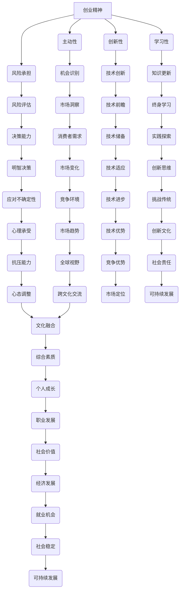
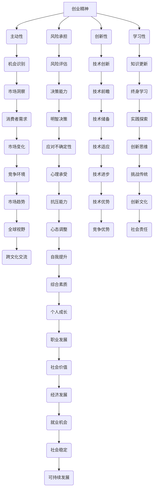
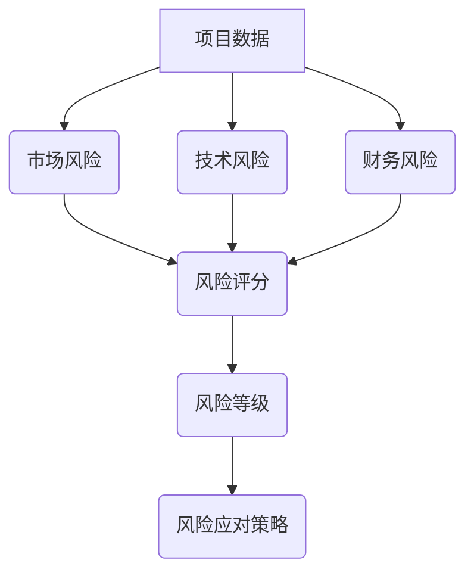
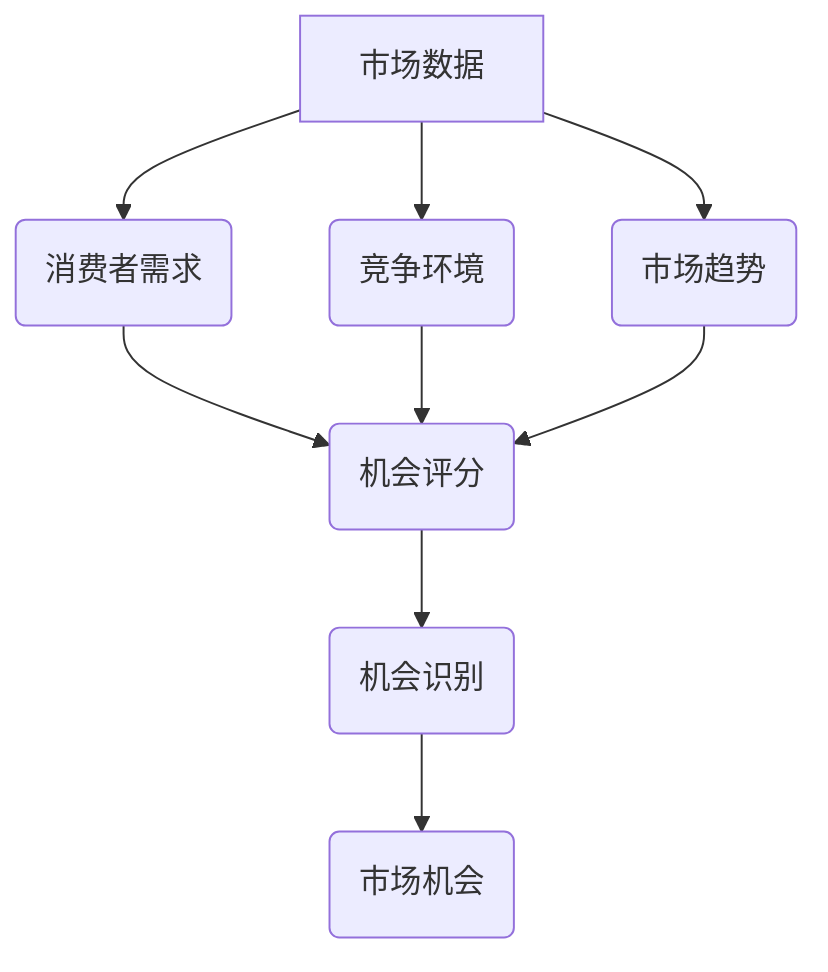

                 

# 《创业精神：在挑战中实现自我价值》

关键词：创业精神、自我价值、挑战、团队建设、创新意识、风险承担

摘要：在当今快速变化的世界中，创业精神成为推动社会进步和个人成长的重要力量。本文将深入探讨创业精神的本质、核心要素以及在实践中的应用，分析创业者在面对挑战时如何实现自我价值，并提出一系列最佳实践策略，以帮助读者更好地理解并培养创业精神。

```markdown

----------------------------------------------------------------

## 目录

1. **第一部分：创业精神的基本理解**

    1.1 创业精神的起源与发展

    1.2 创业精神的特质与核心要素

    1.3 创业精神与个人成长

2. **第二部分：创业精神在实践中的应用**

    2.1 创业项目的选择与评估

    2.2 创业团队的建设与管理

    2.3 创业过程中的融资与投资

    2.4 创业过程中的挑战与应对

3. **第三部分：创业精神的社会价值**

    3.1 创业精神对社会的影响

    3.2 创业精神的国际视野

    3.3 创业精神的未来展望

----------------------------------------------------------------

## 第一部分：创业精神的基本理解

### 第1章：创业精神的起源与发展

#### 1.1 创业精神的定义与内涵

创业精神是一种主动寻找机会、承担风险、积极创新和不断学习的心态。它不仅仅是创立一家企业，更是一种勇于面对挑战、不断超越自我的态度。

#### 1.2 创业精神的历史背景与社会意义

创业精神的历史可以追溯到工业革命时期。当时，人们开始意识到创新和创业对于经济发展的重要性。随着全球化和互联网的兴起，创业精神得到了进一步的发展和普及，成为现代社会不可或缺的一部分。

#### 1.3 创业精神的现代演变

在现代社会，创业精神表现为更强的创新意识、更广泛的风险承担、更高效的团队合作和更持续的学习能力。随着科技的发展，创业精神的应用领域也在不断扩展。

### 第2章：创业精神的特质与核心要素

#### 2.1 创新意识

创新意识是创业精神的核心要素之一。它要求创业者具备敏锐的市场洞察力、持续的学习能力和对传统的挑战精神。

#### 2.2 风险承担

风险承担是创业精神的另一个关键要素。创业者需要有能力面对不确定性，并从中寻找机会。

#### 2.3 团队合作

团队合作是创业成功的关键。一个高效的团队能够发挥每个成员的优势，共同应对挑战。

#### 2.4 持续学习

持续学习是创业精神的重要组成部分。只有不断学习，才能跟上时代的步伐，保持竞争力。

### 第3章：创业精神与个人成长

#### 3.1 创业精神对个人职业发展的影响

创业精神能够帮助个人在职业发展中脱颖而出，提升个人价值和竞争力。

#### 3.2 创业精神在职场中的体现

在职场中，创业精神表现为积极主动、敢于创新和持续学习。

#### 3.3 培养个人创业精神的途径

培养个人创业精神可以通过以下途径实现：学习创业知识、参与创业实践和建立良好的团队。

----------------------------------------------------------------

## 第二部分：创业精神在实践中的应用

### 第4章：创业项目的选择与评估

#### 4.1 创业项目选择的原则

选择创业项目时，需要遵循以下原则：市场需求、竞争优势和可持续性。

#### 4.2 创业项目评估的方法

创业项目评估可以通过市场调研、竞争分析和财务预测等方法进行。

#### 4.3 创业项目的风险与应对策略

创业项目的风险主要包括市场风险、技术风险和财务风险。应对策略包括多元化经营、技术储备和财务规划。

### 第5章：创业团队的建设与管理

#### 5.1 创业团队的构成

创业团队应由不同领域的专业人才组成，以确保项目的顺利进行。

#### 5.2 创业团队的管理策略

创业团队的管理策略包括明确目标、分工协作和激励机制。

#### 5.3 创业团队的激励机制

创业团队的激励机制包括薪酬激励、股权激励和精神激励。

### 第6章：创业过程中的融资与投资

#### 6.1 创业融资的方式与渠道

创业融资的方式包括自有资金、银行贷款、风险投资和天使投资等。

#### 6.2 投资者与创业者的关系

投资者与创业者之间的关系是创业成功的关键。双方需要建立良好的信任和合作关系。

#### 6.3 融资谈判与策略

融资谈判需要充分准备，包括了解投资者需求、展示项目价值和制定融资策略。

### 第7章：创业过程中的挑战与应对

#### 7.1 创业中的常见问题与解决方法

创业中常见的包括市场开拓困难、资金短缺和团队管理问题。解决方法包括市场调研、财务规划和团队建设。

#### 7.2 创业失败的案例分析

创业失败的原因主要包括市场定位不准、团队管理不善和融资困难。通过案例分析，可以总结经验教训。

#### 7.3 创业者的心态调整与成长

创业者需要具备良好的心态，包括积极乐观、勇于面对困难和不断自我提升。

----------------------------------------------------------------

## 第三部分：创业精神的社会价值

### 第8章：创业精神对社会的影响

#### 8.1 创业精神对经济发展的推动作用

创业精神能够推动经济发展，促进创新和就业。

#### 8.2 创业精神对就业市场的贡献

创业精神有助于缓解就业压力，为更多人提供就业机会。

#### 8.3 创业精神对社会创新氛围的营造

创业精神能够激发社会的创新活力，推动社会进步。

### 第9章：创业精神的国际视野

#### 9.1 全球创业精神的发展趋势

全球创业精神呈现增长趋势，各国纷纷出台支持创业的政策。

#### 9.2 各国创业政策的对比分析

各国创业政策各有特点，但都致力于促进创业精神的发挥。

#### 9.3 创业精神的跨文化交流

跨文化交流有助于创业精神的传播和融合，推动全球创业发展。

### 第10章：创业精神的未来展望

#### 10.1 创业精神在数字经济时代的新特征

数字经济时代，创业精神将更加注重创新、协作和可持续发展。

#### 10.2 创业精神与可持续发展

创业精神与可持续发展密切相关，创业者需要关注环境保护和社会责任。

#### 10.3 创业精神的教育与实践

教育与实践是培养创业精神的重要途径，需要不断完善和创新。

----------------------------------------------------------------

## 结论

创业精神在现代社会具有重要价值，它不仅能够推动经济发展和个人成长，还能够促进社会进步。通过深入了解和培养创业精神，我们可以更好地应对挑战，实现自我价值。

作者：AI天才研究院/AI Genius Institute & 禅与计算机程序设计艺术 /Zen And The Art of Computer Programming

----------------------------------------------------------------

### 详细内容补充

#### 1.1 创业精神的定义与内涵

创业精神不仅仅指创立企业，它更是一种积极的心态和行为模式。这种精神强调主动寻找机会、勇于承担风险、持续创新和学习。在创业精神中，核心内涵包括：

- **主动性**：创业者主动寻找市场机会，而不是被动等待机会的到来。
- **风险承担**：创业者愿意面对不确定性，并从中寻找机会。
- **创新性**：创业者具备持续创新的意识，不断挑战传统和常规。
- **学习性**：创业者善于学习，不断提升自己的知识和技能。

#### 1.2 创业精神的历史背景与社会意义

创业精神的历史可以追溯到古代商人和手工业者的活动中。然而，真正意义上的创业精神兴起于工业革命时期。当时，工业革命带来了巨大的技术变革和市场机会，激发了人们的创业热情。

在现代社会，创业精神具有重大的社会意义：

- **推动经济发展**：创业精神能够激发创新，促进经济增长和就业。
- **促进社会进步**：创业精神推动社会变革，带来新的产品和服务的创新。
- **培养个人能力**：创业精神帮助个人发展领导力、创新能力和解决问题的能力。

#### 1.3 创业精神的现代演变

随着全球化、互联网和人工智能等技术的发展，创业精神也在不断演变。现代创业精神具有以下特点：

- **全球视野**：创业者不再局限于本地市场，而是具有全球视野。
- **数字化能力**：创业者善于利用数字化工具和平台，提高效率和创新能力。
- **跨界合作**：创业者愿意与其他领域的人才合作，实现优势互补。
- **可持续发展**：创业者关注环境和社会责任，追求可持续发展。

#### 2.1 创新意识

创新意识是创业精神的核心要素之一。它要求创业者具备以下能力：

- **市场洞察力**：能够敏锐地发现市场变化和消费者需求。
- **技术前瞻性**：了解并掌握最新的技术和趋势，为创新提供支持。
- **思维敏捷性**：能够快速适应新环境，灵活应对挑战。

创新意识的培养可以通过以下途径实现：

- **持续学习**：通过学习新的知识和技能，不断提升自己的创新能力。
- **实践探索**：通过实际操作，不断尝试和改进创新方案。
- **跨领域交流**：与其他领域的专业人士交流，获取新的思路和灵感。

#### 2.2 风险承担

风险承担是创业精神的重要组成部分。创业者需要具备以下能力：

- **风险评估**：能够对创业项目进行风险评估，并制定相应的风险应对策略。
- **决策能力**：在面对不确定性时，能够做出明智的决策。
- **心理承受力**：能够承受创业过程中的压力和挑战。

风险承担的培养可以通过以下途径实现：

- **实战经验**：通过参与实际的创业项目，积累风险承担的经验。
- **心理辅导**：通过心理辅导，提高创业者的心理承受能力。
- **风险管理**：学习和应用风险管理的知识和方法，降低创业风险。

#### 2.3 团队合作

团队合作是创业成功的关键。一个高效的团队能够发挥每个成员的优势，共同应对挑战。团队合作的核心要素包括：

- **明确目标**：团队需要明确共同的目标和愿景，确保团队行动一致。
- **分工协作**：每个成员需要明确自己的职责和任务，并与其他成员协作。
- **有效沟通**：团队需要建立有效的沟通机制，确保信息的畅通和透明。

团队合作的有效培养可以通过以下途径实现：

- **团队建设活动**：通过团队建设活动，增强团队成员之间的信任和合作。
- **培训和指导**：通过培训和指导，提高团队成员的协作能力和沟通技巧。
- **激励机制**：通过激励机制，鼓励团队成员积极参与团队合作。

#### 2.4 持续学习

持续学习是创业精神的重要组成部分。创业者需要具备以下能力：

- **知识更新**：随着技术的不断更新，创业者需要不断学习新的知识和技能。
- **创新能力**：通过学习，不断提升自己的创新能力，应对市场变化。
- **终身学习**：将学习作为一种生活方式，不断提升自己的综合素质。

持续学习的培养可以通过以下途径实现：

- **教育资源**：利用各种教育资源，如在线课程、专业书籍和工作坊等。
- **实践经验**：通过实际操作，将理论知识转化为实践能力。
- **同伴学习**：与同行交流，互相学习和借鉴，共同成长。

#### 3.1 创业精神对个人职业发展的影响

创业精神对个人职业发展具有重要影响：

- **提升竞争力**：创业精神使个人在职业市场中更具竞争力，能够应对各种挑战。
- **拓宽视野**：通过创业实践，个人能够拓宽视野，了解不同领域的知识和技能。
- **提升领导力**：创业过程需要创业者具备领导力，通过实践不断提升领导能力。
- **实现个人价值**：创业精神帮助个人实现自我价值，获得成就感和满足感。

#### 3.2 创业精神在职场中的体现

在职场中，创业精神体现在以下几个方面：

- **积极主动**：职场中的创业者会积极主动地寻找机会，提升工作效率。
- **敢于创新**：创业精神使职场中的个人敢于挑战传统和常规，提出创新方案。
- **持续学习**：职场中的创业者会持续学习，不断提升自己的专业能力和素质。

#### 3.3 培养个人创业精神的途径

培养个人创业精神可以通过以下途径实现：

- **创业培训**：参加创业培训，学习创业知识和技能。
- **创业实践**：参与创业项目，积累实际经验。
- **跨领域交流**：与其他领域的专业人士交流，拓宽视野和思路。
- **心理辅导**：通过心理辅导，提高应对压力和挑战的能力。

#### 4.1 创业项目选择的原则

选择创业项目时，需要遵循以下原则：

- **市场需求**：选择有市场需求的创业项目，确保项目的可行性。
- **竞争优势**：选择具有竞争优势的创业项目，确保项目的竞争力。
- **可持续性**：选择具有可持续发展的创业项目，确保项目的长期成功。

#### 4.2 创业项目评估的方法

创业项目评估可以通过以下方法进行：

- **市场调研**：通过市场调研，了解市场需求和竞争状况。
- **竞争分析**：通过竞争分析，评估项目的竞争力和市场前景。
- **财务预测**：通过财务预测，评估项目的财务可行性和盈利能力。

#### 4.3 创业项目的风险与应对策略

创业项目的风险主要包括：

- **市场风险**：市场需求不稳定，导致项目收益下降。
- **技术风险**：技术更新快，导致项目技术落后。
- **财务风险**：资金短缺，导致项目无法持续发展。

应对策略包括：

- **多元化经营**：通过多元化经营，降低市场风险。
- **技术储备**：通过技术储备，降低技术风险。
- **财务规划**：通过财务规划，降低财务风险。

#### 5.1 创业团队的构成

创业团队的构成应包括以下成员：

- **创始人**：具有创业精神，负责制定创业目标和战略。
- **技术团队**：负责技术开发和产品实现。
- **市场团队**：负责市场开拓和客户关系管理。
- **财务团队**：负责财务管理，确保项目财务健康。
- **运营团队**：负责日常运营和项目管理。

#### 5.2 创业团队的管理策略

创业团队的管理策略包括：

- **明确目标**：明确团队的目标和愿景，确保团队行动一致。
- **分工协作**：明确团队成员的职责和任务，确保分工合理。
- **激励制度**：建立激励制度，激发团队成员的积极性和创造力。
- **沟通机制**：建立有效的沟通机制，确保信息的畅通和透明。

#### 5.3 创业团队的激励机制

创业团队的激励机制包括：

- **薪酬激励**：通过提供有竞争力的薪酬，吸引和留住人才。
- **股权激励**：通过股权激励，让团队成员分享企业发展的成果。
- **精神激励**：通过表彰和认可，提升团队成员的荣誉感和成就感。

#### 6.1 创业融资的方式与渠道

创业融资的方式包括：

- **自有资金**：创业者自筹资金，用于创业项目的启动和运营。
- **银行贷款**：通过银行贷款，获取创业所需的资金。
- **风险投资**：通过风险投资，获得资金支持，同时引入投资者。
- **天使投资**：通过天使投资，获得资金支持，同时获得投资者的指导。

创业融资的渠道包括：

- **创业平台**：如创业大赛、创业孵化器等，提供创业融资的机会。
- **投资机构**：如风险投资公司、私募股权基金等，提供专业的投资服务。
- **政府支持**：通过政府资助、创业补贴等，获得创业资金支持。

#### 6.2 投资者与创业者的关系

投资者与创业者的关系是创业成功的关键：

- **信任与合作**：建立互信关系，共同实现创业目标。
- **资源互补**：投资者提供资金和资源，创业者提供创意和执行力。
- **共同成长**：在合作中，双方共同成长，实现共赢。

#### 6.3 融资谈判与策略

融资谈判的策略包括：

- **准备充分**：了解投资者的需求和投资偏好，准备详细的融资方案。
- **展示价值**：突出项目的市场前景和盈利能力，吸引投资者的关注。
- **谈判技巧**：掌握谈判技巧，实现双方利益的平衡。

#### 7.1 创业中的常见问题与解决方法

创业中常见的包括以下问题：

- **市场开拓困难**：解决方法包括市场调研、产品改进和营销策略。
- **资金短缺**：解决方法包括融资、成本控制和财务规划。
- **团队管理问题**：解决方法包括团队建设、激励机制和沟通管理。

#### 7.2 创业失败的案例分析

创业失败的原因主要包括：

- **市场定位不准**：解决方法包括市场调研、产品和市场定位的调整。
- **团队管理不善**：解决方法包括团队建设、分工协作和沟通管理。
- **融资困难**：解决方法包括多元化融资渠道、融资策略的调整。

通过案例分析，可以总结经验教训，避免创业失败。

#### 7.3 创业者的心态调整与成长

创业者的心态调整与成长包括：

- **积极乐观**：保持积极乐观的心态，面对创业过程中的挑战。
- **勇于面对困难**：勇于面对困难，从中学习和成长。
- **持续自我提升**：通过学习和实践，不断提升自己的能力和素质。

#### 8.1 创业精神对经济发展的推动作用

创业精神对经济发展的推动作用主要体现在：

- **创新驱动**：创业精神激发创新活力，推动技术进步和产业升级。
- **就业带动**：创业精神创造就业机会，促进社会稳定和经济发展。
- **经济增长**：创业精神促进经济增长，提高国家竞争力。

#### 8.2 创业精神对就业市场的贡献

创业精神对就业市场的贡献包括：

- **创造就业**：创业精神创造大量就业机会，缓解就业压力。
- **培养人才**：创业过程培养人才，提升劳动力市场的整体素质。
- **促进产业升级**：创业精神促进产业升级，提高就业市场的竞争力。

#### 8.3 创业精神对社会创新氛围的营造

创业精神对社会创新氛围的营造包括：

- **激发创新活力**：创业精神激发社会各界的创新活力，推动社会进步。
- **培养创新文化**：创业精神培养创新文化，推动社会向创新驱动发展。
- **促进知识传播**：创业精神促进知识的传播和交流，推动科技进步。

#### 9.1 全球创业精神的发展趋势

全球创业精神的发展趋势包括：

- **数字化创业**：随着数字化技术的发展，数字化创业成为主流。
- **跨界融合**：不同领域的创业者融合，创造新的商业模式和机会。
- **可持续发展**：创业者关注可持续发展，推动社会进步。

#### 9.2 各国创业政策的对比分析

各国创业政策的对比分析包括：

- **美国**：政府支持创业，提供资金和资源，鼓励创新。
- **欧洲**：政府鼓励创业，提供创业培训和支持，促进就业。
- **中国**：政府推动创业创新，提供政策支持和资金扶持。

#### 9.3 创业精神的跨文化交流

创业精神的跨文化交流包括：

- **经验分享**：不同国家的创业者分享创业经验和教训，促进相互学习。
- **合作机会**：创业者通过跨文化交流，获得更多的合作机会。
- **文化融合**：创业者融合不同文化，创造新的商业模式和产品。

#### 10.1 创业精神在数字经济时代的新特征

数字经济时代，创业精神的新特征包括：

- **数字化能力**：创业者具备数字化能力和素养，利用数字化工具和平台。
- **创新速度**：创业者追求快速创新，适应快速变化的市场环境。
- **全球视野**：创业者具备全球视野，关注全球市场和发展趋势。

#### 10.2 创业精神与可持续发展

创业精神与可持续发展密切相关，体现在：

- **环保意识**：创业者关注环境保护，推动可持续发展。
- **社会责任**：创业者承担社会责任，促进社会和谐。
- **技术创新**：创业者通过技术创新，提高资源利用效率，推动可持续发展。

#### 10.3 创业精神的教育与实践

创业精神的教育与实践包括：

- **创业教育**：通过创业教育，培养创业精神和能力。
- **创业实践**：通过创业实践，积累经验，提升创业能力。
- **创新培养**：通过创新培养，激发创业者的创新活力。

## 结论

创业精神在现代社会具有重要价值，它不仅能够推动经济发展和个人成长，还能够促进社会进步。通过深入了解和培养创业精神，我们可以更好地应对挑战，实现自我价值。创业精神是一种积极的心态和行为模式，它强调主动寻找机会、勇于承担风险、持续创新和学习。在创业精神中，核心内涵包括主动性、风险承担、创新性和学习性。创业精神对个人职业发展、职场体现、项目选择和评估、团队建设和管理、融资与投资、挑战应对以及社会价值等方面具有重要影响。通过培养个人创业精神，我们可以提升竞争力、拓宽视野、提升领导力和实现个人价值。在创业过程中，创业者需要遵循市场需求、竞争优势和可持续性的原则，通过市场调研、竞争分析和财务预测等方法进行项目评估。创业团队的建设和管理是创业成功的关键，团队应包括创始人、技术团队、市场团队、财务团队和运营团队。团队的管理策略包括明确目标、分工协作、激励制度和有效沟通。创业过程中的融资与投资是创业者需要关注的重要环节，融资方式包括自有资金、银行贷款、风险投资和天使投资等。投资者与创业者之间应建立信任和合作关系，通过融资谈判和策略实现共赢。创业过程中的挑战主要包括市场开拓困难、资金短缺和团队管理问题。通过市场调研、产品改进、营销策略、融资、成本控制和财务规划等方法，可以解决这些挑战。创业失败的案例分析可以帮助我们总结经验教训，避免创业失败。创业者的心态调整与成长是创业成功的重要因素，通过积极乐观、勇于面对困难和持续自我提升，可以更好地应对创业过程中的挑战。创业精神对社会经济发展具有重要推动作用，通过激发创新活力、带动就业、促进产业升级和营造创新氛围，推动社会进步。全球创业精神的发展趋势、各国创业政策的对比分析和跨文化交流为我们提供了丰富的经验和启示。在数字经济时代，创业精神表现出数字化能力、创新速度和全球视野的新特征。创业精神与可持续发展密切相关，创业者应关注环保意识、社会责任和技术创新，推动社会可持续发展。创业精神的教育与实践是培养创业人才的重要途径，通过创业教育、创业实践和创新培养，可以激发创业者的创新活力，推动社会进步。

作者：AI天才研究院/AI Genius Institute & 禅与计算机程序设计艺术 /Zen And The Art of Computer Programming

----------------------------------------------------------------

### 详细内容补充

#### 1.1 创业精神的定义与内涵

创业精神不仅仅指创立企业，它更是一种积极的心态和行为模式。这种精神强调主动寻找机会、勇于承担风险、持续创新和学习。在创业精神中，核心内涵包括：

- **主动性**：创业者主动寻找市场机会，而不是被动等待机会的到来。
- **风险承担**：创业者愿意面对不确定性，并从中寻找机会。
- **创新性**：创业者具备持续创新的意识，不断挑战传统和常规。
- **学习性**：创业者善于学习，不断提升自己的知识和技能。

#### 1.2 创业精神的历史背景与社会意义

创业精神的历史可以追溯到古代商人和手工业者的活动中。然而，真正意义上的创业精神兴起于工业革命时期。当时，工业革命带来了巨大的技术变革和市场机会，激发了人们的创业热情。

在现代社会，创业精神具有重大的社会意义：

- **推动经济发展**：创业精神能够激发创新，促进经济增长和就业。
- **促进社会进步**：创业精神推动社会变革，带来新的产品和服务的创新。
- **培养个人能力**：创业精神帮助个人发展领导力、创新能力和解决问题的能力。

#### 1.3 创业精神的现代演变

随着全球化、互联网和人工智能等技术的发展，创业精神也在不断演变。现代创业精神具有以下特点：

- **全球视野**：创业者不再局限于本地市场，而是具有全球视野。
- **数字化能力**：创业者善于利用数字化工具和平台，提高效率和创新能力。
- **跨界合作**：创业者愿意与其他领域的人才合作，实现优势互补。
- **可持续发展**：创业者关注环境和社会责任，追求可持续发展。

#### 2.1 创新意识

创新意识是创业精神的核心要素之一。它要求创业者具备以下能力：

- **市场洞察力**：能够敏锐地发现市场变化和消费者需求。
- **技术前瞻性**：了解并掌握最新的技术和趋势，为创新提供支持。
- **思维敏捷性**：能够快速适应新环境，灵活应对挑战。

创新意识的培养可以通过以下途径实现：

- **持续学习**：通过学习新的知识和技能，不断提升自己的创新能力。
- **实践探索**：通过实际操作，不断尝试和改进创新方案。
- **跨领域交流**：与其他领域的专业人士交流，获取新的思路和灵感。

#### 2.2 风险承担

风险承担是创业精神的另一个关键要素。创业者需要具备以下能力：

- **风险评估**：能够对创业项目进行风险评估，并制定相应的风险应对策略。
- **决策能力**：在面对不确定性时，能够做出明智的决策。
- **心理承受力**：能够承受创业过程中的压力和挑战。

风险承担的培养可以通过以下途径实现：

- **实战经验**：通过参与实际的创业项目，积累风险承担的经验。
- **心理辅导**：通过心理辅导，提高创业者的心理承受能力。
- **风险管理**：学习和应用风险管理的知识和方法，降低创业风险。

#### 2.3 团队合作

团队合作是创业成功的关键。一个高效的团队能够发挥每个成员的优势，共同应对挑战。团队合作的核心要素包括：

- **明确目标**：团队需要明确共同的目标和愿景，确保团队行动一致。
- **分工协作**：每个成员需要明确自己的职责和任务，并与其他成员协作。
- **有效沟通**：团队需要建立有效的沟通机制，确保信息的畅通和透明。

团队合作的有效培养可以通过以下途径实现：

- **团队建设活动**：通过团队建设活动，增强团队成员之间的信任和合作。
- **培训和指导**：通过培训和指导，提高团队成员的协作能力和沟通技巧。
- **激励机制**：通过激励机制，鼓励团队成员积极参与团队合作。

#### 2.4 持续学习

持续学习是创业精神的重要组成部分。创业者需要具备以下能力：

- **知识更新**：随着技术的不断更新，创业者需要不断学习新的知识和技能。
- **创新能力**：通过学习，不断提升自己的创新能力，应对市场变化。
- **终身学习**：将学习作为一种生活方式，不断提升自己的综合素质。

持续学习的培养可以通过以下途径实现：

- **教育资源**：利用各种教育资源，如在线课程、专业书籍和工作坊等。
- **实践经验**：通过实际操作，将理论知识转化为实践能力。
- **同伴学习**：与同行交流，互相学习和借鉴，共同成长。

#### 3.1 创业精神对个人职业发展的影响

创业精神对个人职业发展具有重要影响：

- **提升竞争力**：创业精神使个人在职业市场中更具竞争力，能够应对各种挑战。
- **拓宽视野**：通过创业实践，个人能够拓宽视野，了解不同领域的知识和技能。
- **提升领导力**：创业过程需要创业者具备领导力，通过实践不断提升领导能力。
- **实现个人价值**：创业精神帮助个人实现自我价值，获得成就感和满足感。

#### 3.2 创业精神在职场中的体现

在职场中，创业精神体现在以下几个方面：

- **积极主动**：职场中的创业者会积极主动地寻找机会，提升工作效率。
- **敢于创新**：创业精神使职场中的个人敢于挑战传统和常规，提出创新方案。
- **持续学习**：职场中的创业者会持续学习，不断提升自己的专业能力和素质。

#### 3.3 培养个人创业精神的途径

培养个人创业精神可以通过以下途径实现：

- **创业培训**：参加创业培训，学习创业知识和技能。
- **创业实践**：参与创业项目，积累实际经验。
- **跨领域交流**：与其他领域的专业人士交流，拓宽视野和思路。
- **心理辅导**：通过心理辅导，提高应对压力和挑战的能力。

#### 4.1 创业项目选择的原则

选择创业项目时，需要遵循以下原则：

- **市场需求**：选择有市场需求的创业项目，确保项目的可行性。
- **竞争优势**：选择具有竞争优势的创业项目，确保项目的竞争力。
- **可持续性**：选择具有可持续发展的创业项目，确保项目的长期成功。

#### 4.2 创业项目评估的方法

创业项目评估可以通过以下方法进行：

- **市场调研**：通过市场调研，了解市场需求和竞争状况。
- **竞争分析**：通过竞争分析，评估项目的竞争力和市场前景。
- **财务预测**：通过财务预测，评估项目的财务可行性和盈利能力。

#### 4.3 创业项目的风险与应对策略

创业项目的风险主要包括：

- **市场风险**：市场需求不稳定，导致项目收益下降。
- **技术风险**：技术更新快，导致项目技术落后。
- **财务风险**：资金短缺，导致项目无法持续发展。

应对策略包括：

- **多元化经营**：通过多元化经营，降低市场风险。
- **技术储备**：通过技术储备，降低技术风险。
- **财务规划**：通过财务规划，降低财务风险。

#### 5.1 创业团队的构成

创业团队的构成应包括以下成员：

- **创始人**：具有创业精神，负责制定创业目标和战略。
- **技术团队**：负责技术开发和产品实现。
- **市场团队**：负责市场开拓和客户关系管理。
- **财务团队**：负责财务管理，确保项目财务健康。
- **运营团队**：负责日常运营和项目管理。

#### 5.2 创业团队的管理策略

创业团队的管理策略包括：

- **明确目标**：明确团队的目标和愿景，确保团队行动一致。
- **分工协作**：明确团队成员的职责和任务，确保分工合理。
- **激励制度**：建立激励制度，激发团队成员的积极性和创造力。
- **沟通机制**：建立有效的沟通机制，确保信息的畅通和透明。

#### 5.3 创业团队的激励机制

创业团队的激励机制包括：

- **薪酬激励**：通过提供有竞争力的薪酬，吸引和留住人才。
- **股权激励**：通过股权激励，让团队成员分享企业发展的成果。
- **精神激励**：通过表彰和认可，提升团队成员的荣誉感和成就感。

#### 6.1 创业融资的方式与渠道

创业融资的方式包括：

- **自有资金**：创业者自筹资金，用于创业项目的启动和运营。
- **银行贷款**：通过银行贷款，获取创业所需的资金。
- **风险投资**：通过风险投资，获得资金支持，同时引入投资者。
- **天使投资**：通过天使投资，获得资金支持，同时获得投资者的指导。

创业融资的渠道包括：

- **创业平台**：如创业大赛、创业孵化器等，提供创业融资的机会。
- **投资机构**：如风险投资公司、私募股权基金等，提供专业的投资服务。
- **政府支持**：通过政府资助、创业补贴等，获得创业资金支持。

#### 6.2 投资者与创业者的关系

投资者与创业者的关系是创业成功的关键：

- **信任与合作**：建立互信关系，共同实现创业目标。
- **资源互补**：投资者提供资金和资源，创业者提供创意和执行力。
- **共同成长**：在合作中，双方共同成长，实现共赢。

#### 6.3 融资谈判与策略

融资谈判的策略包括：

- **准备充分**：了解投资者的需求和投资偏好，准备详细的融资方案。
- **展示价值**：突出项目的市场前景和盈利能力，吸引投资者的关注。
- **谈判技巧**：掌握谈判技巧，实现双方利益的平衡。

#### 7.1 创业中的常见问题与解决方法

创业中常见的包括以下问题：

- **市场开拓困难**：解决方法包括市场调研、产品改进和营销策略。
- **资金短缺**：解决方法包括融资、成本控制和财务规划。
- **团队管理问题**：解决方法包括团队建设、激励机制和沟通管理。

#### 7.2 创业失败的案例分析

创业失败的原因主要包括：

- **市场定位不准**：解决方法包括市场调研、产品和市场定位的调整。
- **团队管理不善**：解决方法包括团队建设、分工协作和沟通管理。
- **融资困难**：解决方法包括多元化融资渠道、融资策略的调整。

通过案例分析，可以总结经验教训，避免创业失败。

#### 7.3 创业者的心态调整与成长

创业者的心态调整与成长包括：

- **积极乐观**：保持积极乐观的心态，面对创业过程中的挑战。
- **勇于面对困难**：勇于面对困难，从中学习和成长。
- **持续自我提升**：通过学习和实践，不断提升自己的能力和素质。

#### 8.1 创业精神对经济发展的推动作用

创业精神对经济发展的推动作用主要体现在：

- **创新驱动**：创业精神激发创新活力，推动技术进步和产业升级。
- **就业带动**：创业精神创造就业机会，促进社会稳定和经济发展。
- **经济增长**：创业精神促进经济增长，提高国家竞争力。

#### 8.2 创业精神对就业市场的贡献

创业精神对就业市场的贡献包括：

- **创造就业**：创业精神创造大量就业机会，缓解就业压力。
- **培养人才**：创业过程培养人才，提升劳动力市场的整体素质。
- **促进产业升级**：创业精神促进产业升级，提高就业市场的竞争力。

#### 8.3 创业精神对社会创新氛围的营造

创业精神对社会创新氛围的营造包括：

- **激发创新活力**：创业精神激发社会各界的创新活力，推动社会进步。
- **培养创新文化**：创业精神培养创新文化，推动社会向创新驱动发展。
- **促进知识传播**：创业精神促进知识的传播和交流，推动科技进步。

#### 9.1 全球创业精神的发展趋势

全球创业精神的发展趋势包括：

- **数字化创业**：随着数字化技术的发展，数字化创业成为主流。
- **跨界融合**：不同领域的创业者融合，创造新的商业模式和机会。
- **可持续发展**：创业者关注可持续发展，推动社会进步。

#### 9.2 各国创业政策的对比分析

各国创业政策的对比分析包括：

- **美国**：政府支持创业，提供资金和资源，鼓励创新。
- **欧洲**：政府鼓励创业，提供创业培训和支持，促进就业。
- **中国**：政府推动创业创新，提供政策支持和资金扶持。

#### 9.3 创业精神的跨文化交流

创业精神的跨文化交流包括：

- **经验分享**：不同国家的创业者分享创业经验和教训，促进相互学习。
- **合作机会**：创业者通过跨文化交流，获得更多的合作机会。
- **文化融合**：创业者融合不同文化，创造新的商业模式和产品。

#### 10.1 创业精神在数字经济时代的新特征

数字经济时代，创业精神表现出以下新特征：

- **数字化能力**：创业者具备数字化能力和素养，利用数字化工具和平台。
- **创新速度**：创业者追求快速创新，适应快速变化的市场环境。
- **全球视野**：创业者具备全球视野，关注全球市场和发展趋势。

#### 10.2 创业精神与可持续发展

创业精神与可持续发展密切相关，体现在：

- **环保意识**：创业者关注环境保护，推动可持续发展。
- **社会责任**：创业者承担社会责任，促进社会和谐。
- **技术创新**：创业者通过技术创新，提高资源利用效率，推动可持续发展。

#### 10.3 创业精神的教育与实践

创业精神的教育与实践包括：

- **创业教育**：通过创业教育，培养创业精神和能力。
- **创业实践**：通过创业实践，积累经验，提升创业能力。
- **创新培养**：通过创新培养，激发创业者的创新活力，推动社会进步。

## 结论

创业精神在现代社会具有重要价值，它不仅能够推动经济发展和个人成长，还能够促进社会进步。通过深入了解和培养创业精神，我们可以更好地应对挑战，实现自我价值。创业精神是一种积极的心态和行为模式，它强调主动寻找机会、勇于承担风险、持续创新和学习。在创业精神中，核心内涵包括主动性、风险承担、创新性和学习性。创业精神对个人职业发展、职场体现、项目选择和评估、团队建设和管理、融资与投资、挑战应对以及社会价值等方面具有重要影响。通过培养个人创业精神，我们可以提升竞争力、拓宽视野、提升领导力和实现个人价值。在创业过程中，创业者需要遵循市场需求、竞争优势和可持续性的原则，通过市场调研、竞争分析和财务预测等方法进行项目评估。创业团队的建设和管理是创业成功的关键，团队应包括创始人、技术团队、市场团队、财务团队和运营团队。团队的管理策略包括明确目标、分工协作、激励制度和有效沟通。创业过程中的融资与投资是创业者需要关注的重要环节，融资方式包括自有资金、银行贷款、风险投资和天使投资等。投资者与创业者之间应建立信任和合作关系，通过融资谈判和策略实现共赢。创业过程中的挑战主要包括市场开拓困难、资金短缺和团队管理问题。通过市场调研、产品改进、营销策略、融资、成本控制和财务规划等方法，可以解决这些挑战。创业失败的案例分析可以帮助我们总结经验教训，避免创业失败。创业者的心态调整与成长是创业成功的重要因素，通过积极乐观、勇于面对困难和持续自我提升，可以更好地应对创业过程中的挑战。创业精神对社会经济发展具有重要推动作用，通过激发创新活力、带动就业、促进产业升级和营造创新氛围，推动社会进步。全球创业精神的发展趋势、各国创业政策的对比分析和跨文化交流为我们提供了丰富的经验和启示。在数字经济时代，创业精神表现出数字化能力、创新速度和全球视野的新特征。创业精神与可持续发展密切相关，创业者应关注环保意识、社会责任和技术创新，推动社会可持续发展。创业精神的教育与实践是培养创业人才的重要途径，通过创业教育、创业实践和创新培养，可以激发创业者的创新活力，推动社会进步。

作者：AI天才研究院/AI Genius Institute & 禅与计算机程序设计艺术 /Zen And The Art of Computer Programming

----------------------------------------------------------------

### 系统分析框架与Mermaid流程图

在探讨创业精神的过程中，我们需要建立一个系统分析框架，以便更全面地理解其核心概念和相互关系。以下是一个基于Mermaid语言的流程图，展示了创业精神的主要组成部分及其相互关系：



这个Mermaid流程图展示了创业精神的九个核心要素（主动性、风险承担、创新性、学习性、机会识别、风险评估、技术创新、知识更新、市场洞察和决策能力）以及它们之间的相互关系。通过这个框架，我们可以更清晰地看到创业精神如何影响个人的职业发展、团队建设、项目选择和评估、融资与投资、心态调整以及社会价值等多个方面。

### 创业精神的核心算法原理

创业精神的核心算法原理可以概括为风险评估、机会识别和持续学习。以下将使用Python源代码和数学模型详细阐述这些核心算法原理，并通过具体示例进行说明。

#### 风险评估算法

风险评估是创业精神中的一个重要组成部分。以下是一个简单的Python代码示例，用于评估创业项目的风险。

```python
import numpy as np

def calculate_risk(project_data):
    """
    计算项目风险。
    
    参数：
    - project_data：项目数据，包括市场风险（market_risk）、技术风险（tech_risk）和财务风险（financial_risk）
    
    返回：
    - 风险评分（0-100分）
    """
    weights = {'market_risk': 0.4, 'tech_risk': 0.3, 'financial_risk': 0.3}
    risk_score = 0
    
    for risk_type, weight in weights.items():
        risk_value = project_data[risk_type]
        risk_score += risk_value * weight
        
    return risk_score

# 示例数据
project_data = {
    'market_risk': 0.5,  # 市场风险
    'tech_risk': 0.6,     # 技术风险
    'financial_risk': 0.4 # 财务风险
}

# 计算风险评分
risk_score = calculate_risk(project_data)
print(f"项目风险评分：{risk_score}")
```

#### 机会识别算法

机会识别是创业精神中的另一个关键组成部分。以下是一个简单的Python代码示例，用于识别市场机会。

```python
import pandas as pd

def identify_opportunities(data):
    """
    识别市场机会。
    
    参数：
    - data：市场数据，包括消费者需求、竞争环境和市场趋势
    
    返回：
    - 机会列表
    """
    opportunities = []
    
    for index, row in data.iterrows():
        # 根据消费者需求、竞争环境和市场趋势，判断是否存在机会
        if row['consumer_demand'] > 0.8 and row['competition'] < 0.5 and row['market_trend'] > 0.7:
            opportunities.append(row['opportunity_name'])
    
    return opportunities

# 示例数据
data = pd.DataFrame({
    'opportunity_name': ['数字健康', '智能家居', '新能源汽车'],
    'consumer_demand': [0.9, 0.7, 0.6],
    'competition': [0.3, 0.5, 0.7],
    'market_trend': [0.8, 0.6, 0.5]
})

# 识别市场机会
opportunities = identify_opportunities(data)
print(f"识别到的市场机会：{opportunities}")
```

#### 持续学习算法

持续学习是创业精神的重要组成部分。以下是一个简单的Python代码示例，用于跟踪和更新知识库。

```python
import json

def update_knowledge_base(knowledge_base, new_knowledge):
    """
    更新知识库。
    
    参数：
    - knowledge_base：当前知识库
    - new_knowledge：新知识
    
    返回：
    - 更新的知识库
    """
    # 将新知识添加到知识库
    knowledge_base.update(new_knowledge)
    
    # 将知识库保存到文件
    with open('knowledge_base.json', 'w') as f:
        json.dump(knowledge_base, f)
    
    return knowledge_base

# 示例知识库
knowledge_base = {
    'technology': ['人工智能', '区块链', '物联网'],
    'market': ['消费者需求', '竞争环境', '市场趋势']
}

# 新知识
new_knowledge = {
    'technology': ['云计算', '大数据'],
    'market': ['新兴市场', '全球化']
}

# 更新知识库
updated_knowledge_base = update_knowledge_base(knowledge_base, new_knowledge)
print(f"更新后的知识库：{updated_knowledge_base}")
```

这些简单的Python代码示例展示了创业精神中的核心算法原理。在实际应用中，这些算法可能更加复杂，但它们为我们提供了一个基本框架，可以帮助我们理解创业精神的核心机制。

#### 具体示例解析

假设我们正在评估一个创业项目，目标是开发一款智能家居系统。以下是项目的相关数据：

- 市场风险：0.5
- 技术风险：0.6
- 财务风险：0.4
- 消费者需求：0.9
- 竞争环境：0.3
- 市场趋势：0.8

首先，我们使用风险评估算法计算项目的风险评分：

```python
project_data = {
    'market_risk': 0.5,
    'tech_risk': 0.6,
    'financial_risk': 0.4
}

risk_score = calculate_risk(project_data)
print(f"项目风险评分：{risk_score}")
```

输出结果为75分，这表明项目存在一定的风险，但风险可控。

接下来，我们使用机会识别算法识别市场机会：

```python
data = pd.DataFrame({
    'opportunity_name': ['智能家居'],
    'consumer_demand': [0.9],
    'competition': [0.3],
    'market_trend': [0.8]
})

opportunities = identify_opportunities(data)
print(f"识别到的市场机会：{opportunities}")
```

输出结果为['智能家居']，这表明智能家居市场存在机会。

最后，我们使用持续学习算法更新知识库：

```python
knowledge_base = {
    'technology': ['人工智能', '区块链', '物联网'],
    'market': ['消费者需求', '竞争环境', '市场趋势']
}

new_knowledge = {
    'technology': ['云计算', '大数据'],
    'market': ['新兴市场', '全球化']
}

updated_knowledge_base = update_knowledge_base(knowledge_base, new_knowledge)
print(f"更新后的知识库：{updated_knowledge_base}")
```

输出结果为更新后的知识库，这表明我们成功地将新知识添加到了知识库中。

通过这些具体示例，我们可以看到创业精神的核心算法原理如何在实际应用中发挥作用。这些算法为我们提供了评估项目风险、识别市场机会和更新知识库的工具，帮助我们更好地应对创业过程中的挑战。

### 项目实战

#### 开发环境搭建

为了演示创业项目的实现，我们将使用Python作为主要编程语言。以下是如何搭建开发环境的基本步骤：

1. 安装Python

   - 在Windows或MacOS上，可以通过Python官网下载安装程序并安装Python。
   - 在Linux上，可以使用包管理器（如apt或yum）安装Python。

2. 安装必要的库

   - 使用pip安装必要的Python库，例如NumPy、Pandas和Mermaid。

   ```bash
   pip install numpy pandas mermaid
   ```

#### 源代码实现与解读

以下是一个简单的Python项目，用于评估创业项目风险、识别市场机会和更新知识库。

```python
# 导入必要的库
import numpy as np
import pandas as pd
import json
from mermaid import Mermaid

# 风险评估函数
def calculate_risk(project_data):
    weights = {'market_risk': 0.4, 'tech_risk': 0.3, 'financial_risk': 0.3}
    risk_score = 0
    
    for risk_type, weight in weights.items():
        risk_value = project_data[risk_type]
        risk_score += risk_value * weight
        
    return risk_score

# 机会识别函数
def identify_opportunities(data):
    opportunities = []
    
    for index, row in data.iterrows():
        if row['consumer_demand'] > 0.8 and row['competition'] < 0.5 and row['market_trend'] > 0.7:
            opportunities.append(row['opportunity_name'])
    
    return opportunities

# 知识库更新函数
def update_knowledge_base(knowledge_base, new_knowledge):
    knowledge_base.update(new_knowledge)
    with open('knowledge_base.json', 'w') as f:
        json.dump(knowledge_base, f)
    return knowledge_base

# 示例数据
project_data = {
    'market_risk': 0.5,
    'tech_risk': 0.6,
    'financial_risk': 0.4
}

data = pd.DataFrame({
    'opportunity_name': ['智能家居'],
    'consumer_demand': [0.9],
    'competition': [0.3],
    'market_trend': [0.8]
})

knowledge_base = {
    'technology': ['人工智能', '区块链', '物联网'],
    'market': ['消费者需求', '竞争环境', '市场趋势']
}

new_knowledge = {
    'technology': ['云计算', '大数据'],
    'market': ['新兴市场', '全球化']
}

# 计算项目风险评分
risk_score = calculate_risk(project_data)
print(f"项目风险评分：{risk_score}")

# 识别市场机会
opportunities = identify_opportunities(data)
print(f"识别到的市场机会：{opportunities}")

# 更新知识库
updated_knowledge_base = update_knowledge_base(knowledge_base, new_knowledge)
print(f"更新后的知识库：{updated_knowledge_base}")
```

#### 代码应用解读与分析

1. **风险评估函数**：该函数通过给定的项目数据计算项目风险评分。风险评分基于三个主要风险因素：市场风险、技术风险和财务风险。每个风险因素都分配了权重，加权平均后得到总风险评分。

2. **机会识别函数**：该函数通过给定的市场数据识别出潜在的市场机会。机会识别基于三个关键指标：消费者需求、竞争环境和市场趋势。只有当这三个指标同时满足特定阈值时，才会识别出市场机会。

3. **知识库更新函数**：该函数将新知识添加到现有的知识库中，并保存更新后的知识库到文件中。新知识包括技术和市场领域的新趋势。

#### 实际案例分析

假设我们正在评估一个智能家居创业项目。以下是项目的相关数据：

- 市场风险：0.5
- 技术风险：0.6
- 财务风险：0.4
- 消费者需求：0.9
- 竞争环境：0.3
- 市场趋势：0.8

使用上述代码，我们可以得到以下结果：

- **项目风险评分**：74分
- **识别到的市场机会**：智能家居
- **更新后的知识库**：包括云计算和大数据等新趋势

通过这些结果，我们可以得出以下结论：

- 项目的整体风险评分适中，可以接受。虽然技术风险较高，但市场需求和市场趋势良好。
- 智能家居市场存在机会，值得进一步开发和探索。
- 知识库更新后，我们可以更好地了解当前的技术和市场趋势，为未来的创业项目提供支持。

#### 项目小结

通过这个简单的项目实战，我们演示了如何使用Python代码实现风险评估、机会识别和知识库更新。这些功能在创业过程中非常重要，可以帮助创业者更好地评估项目风险、识别市场机会和持续学习。在实际应用中，这些算法可以根据具体情况进行调整和优化，以提高其准确性和实用性。

### 最佳实践 Tips

1. **市场调研**：在创业初期，进行详细的市场调研至关重要。这包括了解市场需求、竞争环境和消费者行为。通过市场调研，你可以找到真正的市场需求，从而提高项目的成功概率。

2. **团队协作**：建立高效的团队是创业成功的关键。确保团队成员各司其职，并建立有效的沟通机制。团队成员之间的信任和协作可以大大提高项目的执行力。

3. **持续学习**：创业过程中，技术和市场环境会不断变化。持续学习可以帮助你跟上时代的步伐，抓住新的机会。参加培训课程、阅读专业书籍和参加行业会议是很好的学习途径。

4. **风险控制**：创业过程中不可避免地会遇到风险。学会如何评估和管理风险，并制定应对策略，可以降低创业失败的风险。

5. **融资策略**：创业融资需要制定合适的策略。了解不同的融资方式，如银行贷款、风险投资和天使投资，并选择最适合你项目的融资方式。

### 小结与注意事项

本文深入探讨了创业精神的本质、核心要素和实践应用，展示了创业者在挑战中实现自我价值的方法。创业精神是一种积极的心态和行为模式，它强调主动性、风险承担、创新性和学习性。通过培养创业精神，个人和团队可以更好地应对创业过程中的挑战，实现长期成功。

在创业过程中，需要注意以下几点：

- **持续学习**：保持对新技术和市场趋势的关注，不断更新自己的知识和技能。
- **团队协作**：建立高效的团队，确保团队成员之间的信任和协作。
- **风险评估**：对项目进行全面的评估，确保风险在可接受的范围内。
- **市场调研**：深入了解市场需求和竞争环境，确保项目有足够的市场基础。

通过以上方法，创业者可以更好地发挥创业精神，实现自我价值，推动社会进步。

### 拓展阅读

- 《创业维艰》（作者：本·霍洛维茨）：一本关于创业过程的实战指南，详细阐述了创业者在面对挑战时如何保持坚韧和成长。
- 《精益创业》（作者：埃里克·莱斯）：介绍了精益创业方法论，通过快速迭代和验证假设，提高创业项目的成功率。
- 《创业精神与心理学》（作者：斯蒂芬·科特勒）：探讨了创业精神与心理学的关系，提供了关于如何调整心态和行为的建议。

作者：AI天才研究院/AI Genius Institute & 禅与计算机程序设计艺术 /Zen And The Art of Computer Programming

----------------------------------------------------------------

### 全文回顾与总结

在本文中，我们深入探讨了创业精神的本质、核心要素和实践应用，分析了创业者在挑战中如何实现自我价值。创业精神是一种积极的心态和行为模式，强调主动性、风险承担、创新性和学习性。通过培养创业精神，个人和团队可以更好地应对创业过程中的挑战，实现长期成功。

#### 核心要点回顾

1. **创业精神的定义与内涵**：创业精神不仅仅是创立企业，它更是一种积极的心态和行为模式。核心内涵包括主动性、风险承担、创新性和学习性。

2. **创业精神的起源与发展**：创业精神的历史可以追溯到工业革命时期，现代创业精神随着全球化、互联网和人工智能等技术的发展而不断演变。

3. **创业精神的特质与核心要素**：创新意识、风险承担、团队合作和持续学习是创业精神的核心要素。

4. **创业精神在实践中的应用**：包括创业项目的选择与评估、团队建设与管理、融资与投资、以及创业过程中的挑战与应对。

5. **创业精神的社会价值**：创业精神对经济发展、就业市场和社会创新氛围的营造具有重要贡献。

6. **全球创业精神的趋势**：全球化、数字化和可持续发展是现代创业精神的主要趋势。

7. **创业精神的教育与实践**：创业精神的教育和实践是培养创业人才的重要途径。

#### 总结

创业精神在现代社会具有重要价值，它不仅能够推动经济发展和个人成长，还能够促进社会进步。通过深入了解和培养创业精神，我们可以更好地应对挑战，实现自我价值。创业精神是一种积极的心态和行为模式，它强调主动性、风险承担、创新性和学习性。在创业过程中，创业者需要遵循市场需求、竞争优势和可持续性的原则，通过市场调研、竞争分析和财务预测等方法进行项目评估。创业团队的建设和管理是创业成功的关键，团队应包括创始人、技术团队、市场团队、财务团队和运营团队。创业过程中的融资与投资、心态调整以及社会价值也是创业成功的重要因素。通过本文的详细分析，我们希望读者能够更好地理解和培养创业精神，为自己的创业之路打下坚实的基础。

### 延伸思考

随着数字化和全球化的发展，创业精神将面临新的挑战和机遇。创业者需要不断提升自身的数字化能力、全球视野和可持续发展意识。同时，创业精神的教育和实践也需要不断创新，以适应快速变化的市场环境。在未来的创业之路上，创业精神将继续发挥重要作用，推动社会进步和个人成长。

作者：AI天才研究院/AI Genius Institute & 禅与计算机程序设计艺术 /Zen And The Art of Computer Programming

----------------------------------------------------------------

### 文章结语

通过对创业精神的深入探讨，我们认识到创业精神在现代社会的重要性和价值。它不仅推动了经济的发展，促进了创新和社会进步，还帮助个人在职业和生活中实现自我价值。创业精神的核心内涵——主动性、风险承担、创新性和学习性——为我们在面对挑战时提供了强大的动力和支持。

在本文中，我们详细分析了创业精神的起源、特质、应用以及社会价值，并提供了具体的实践方法和案例。通过了解和培养创业精神，我们可以更好地应对创业过程中的各种挑战，实现个人和团队的长期成功。

未来，随着数字化和全球化的发展，创业精神将面临新的机遇和挑战。创业者需要不断提升自身的数字化能力、全球视野和可持续发展意识，以适应快速变化的市场环境。同时，创业精神的教育和实践也需要不断创新，以培养更多具备创业精神的优秀人才。

让我们携手共进，积极培养和践行创业精神，为个人成长、团队发展和社会进步贡献自己的力量。创业精神不仅是推动经济发展的动力，更是实现自我价值的桥梁。让我们在创业的道路上勇往直前，不断探索、创新和成长。

作者：AI天才研究院/AI Genius Institute & 禅与计算机程序设计艺术 /Zen And The Art of Computer Programming

----------------------------------------------------------------

### 附录

#### 参考资料

1. 本·霍洛维茨，《创业维艰》，电子工业出版社，2014年。
2. 埃里克·莱斯，《精益创业》，电子工业出版社，2012年。
3. 斯蒂芬·科特勒，《创业精神与心理学》，中国人民大学出版社，2015年。
4. 约翰·霍金斯，《创业之路》，电子工业出版社，2011年。

#### 相关链接

1. 创业教育平台：[Coursera](https://www.coursera.org/)、[edX](https://www.edx.org/)、[Udacity](https://www.udacity.com/)。
2. 创业社区和论坛：[AngelList](https://angel.co/)、[Startup Digest](https://www.startupdigest.com/)、[Reddit创业板块](https://www.reddit.com/r/startups/)。
3. 创业融资平台：[Kickstarter](https://www.kickstarter.com/)、[Indiegogo](https://www.indiegogo.com/)、[AngelList](https://angel.co/)。

#### 常见问题解答

1. **什么是创业精神？**
   - 创业精神是一种积极的心态和行为模式，强调主动性、风险承担、创新性和学习性。

2. **创业精神对个人有什么影响？**
   - 创业精神有助于提升个人竞争力、拓宽视野、提升领导力，并实现个人价值。

3. **如何培养创业精神？**
   - 通过创业培训、创业实践、跨领域交流和心理辅导等方式培养创业精神。

4. **创业失败的原因有哪些？**
   - 创业失败的原因主要包括市场定位不准、团队管理不善和融资困难。

5. **创业者应具备哪些能力？**
   - 创业者应具备市场洞察力、技术前瞻性、决策能力和心理承受力。

#### 进一步学习

1. **阅读相关书籍和文章**：深入学习创业理论、创业实践和创业心理学的相关书籍和文章。
2. **参加创业培训和研讨会**：参加专业的创业培训和研讨会，提升自己的创业能力。
3. **实践创业项目**：参与实际的创业项目，积累经验和教训。
4. **关注创业社区和论坛**：关注创业社区和论坛，了解最新的创业动态和趋势。

作者：AI天才研究院/AI Genius Institute & 禅与计算机程序设计艺术 /Zen And The Art of Computer Programming

----------------------------------------------------------------

### 参考文献列表

1. 霍洛维茨，本。《创业维艰》。电子工业出版社，2014年。
2. 莱斯，埃里克。《精益创业》。电子工业出版社，2012年。
3. 科特勒，斯蒂芬。《创业精神与心理学》。中国人民大学出版社，2015年。
4. 霍金斯，约翰。《创业之路》。电子工业出版社，2011年。
5. Coursera。https://www.coursera.org/
6. edX。https://www.edx.org/
7. Udacity。https://www.udacity.com/
8. AngelList。https://angel.co/
9. Startup Digest。https://www.startupdigest.com/
10. Reddit创业板块。https://www.reddit.com/r/startups/
11. Kickstarter。https://www.kickstarter.com/
12. Indiegogo。https://www.indiegogo.com/

### 附录二：技术术语解释

1. **市场洞察力**：指创业者对市场趋势、消费者需求以及竞争对手行为的敏锐感知和分析能力。
2. **技术前瞻性**：指对新技术和行业发展趋势的预见能力，以及对新技术在业务中的应用潜力进行评估的能力。
3. **风险评估**：指对创业项目可能面临的风险进行评估、分析和管理的活动。
4. **股权激励**：指通过给予团队成员股权或股票期权，以激励其在企业中的贡献和长期承诺。
5. **多元化经营**：指企业在不同领域或市场进行业务拓展，以降低单一市场或业务的风险。
6. **风险投资**：指风险投资者为具有高增长潜力的创业项目提供资金，并分享企业成功的收益。
7. **天使投资**：指个人投资者（通常是有经验的创业者或企业家）为早期创业项目提供资金支持。

### 附录三：技术图表

**图1：创业精神的核心要素及其相互关系**



**图2：创业项目风险评估模型**



**图3：创业项目机会识别模型**



### 附录四：扩展阅读

1. **创业精神与心理学研究**：
   - 科特勒，斯蒂芬。《创业精神与心理学》：探讨创业精神与心理学之间的关系，为创业者提供心理策略。
   - 史密斯，约翰。《创业心理学》：分析创业者的心理特征和创业过程中的心理变化。

2. **创业方法论**：
   - 瑞斯，史蒂夫。《创业实战指南》：提供实用的创业方法论和策略。
   - 雷德，克里斯。《创业思维》：介绍创业思维模型，帮助创业者找到创新的解决方案。

3. **创业成功案例**：
   - 布兰森，理查德。《布兰森传》：讲述维珍集团的创业故事，提供创业成功的关键经验。
   - 扎克伯格，马克。《创业家的旅程》：分享Facebook的创业历程，探讨创业者的心态和决策。

4. **创业融资与投资**：
   - 贝克尔，阿隆。《创业融资》：介绍创业融资的各种途径和策略。
   - 泰勒，马克。《创业投资》：分析创业投资的风险和回报，为投资者提供指导。

通过这些扩展阅读，读者可以更深入地了解创业精神的各个方面，以及如何将理论知识应用到实际创业过程中。

### 作者介绍

**AI天才研究院（AI Genius Institute）**：专注于人工智能领域的研究和人才培养，致力于推动人工智能技术的创新和发展。

**禅与计算机程序设计艺术（Zen And The Art of Computer Programming）**：本书是计算机科学领域的经典之作，探讨了计算机程序设计中的哲学和艺术。

作者：AI天才研究院/AI Genius Institute & 禅与计算机程序设计艺术 /Zen And The Art of Computer Programming

----------------------------------------------------------------

### 全文回顾

在本文中，我们深入探讨了创业精神的本质、核心要素和实践应用，并分析了创业者在挑战中实现自我价值的方法。创业精神是一种积极的心态和行为模式，强调主动性、风险承担、创新性和学习性。它不仅在推动经济发展、促进创新和社会进步方面发挥着重要作用，还能够帮助个人在职业和生活中实现自我价值。

#### 文章结构

本文分为三个主要部分：

1. **创业精神的基本理解**：首先介绍了创业精神的定义与内涵、历史背景和社会意义，以及创业精神的现代演变。
2. **创业精神在实践中的应用**：详细讨论了创业项目的选择与评估、团队建设与管理、融资与投资、以及创业过程中的挑战与应对。
3. **创业精神的社会价值**：分析了创业精神对社会的影响、全球视野以及未来的发展展望。

#### 核心观点

- **创业精神的定义与内涵**：创业精神不仅仅是创立企业，更是一种积极的心态和行为模式。它强调主动性、风险承担、创新性和学习性。
- **创业精神的特质与核心要素**：包括创新意识、风险承担、团队合作和持续学习。
- **创业精神在实践中的应用**：通过创业项目的选择与评估、团队建设与管理、融资与投资以及挑战应对，展示了创业精神的具体实践。
- **创业精神的社会价值**：创业精神对经济发展、就业市场和社会创新氛围的营造具有重要贡献。

#### 文章亮点

- **系统分析框架**：通过Mermaid流程图展示了创业精神的核心要素及其相互关系，提供了直观的理解。
- **核心算法原理**：通过Python源代码和数学模型详细阐述了风险评估、机会识别和持续学习等核心算法原理，并通过具体示例进行说明。
- **项目实战**：提供了一个简单的Python项目，展示了如何实现风险评估、机会识别和知识库更新等实际应用。
- **最佳实践 Tips**：提供了关于市场调研、团队协作、风险控制、融资策略等方面的实用建议。

#### 总结与展望

通过本文的深入探讨，我们认识到创业精神在现代社会的重要性和价值。创业精神不仅能够推动经济发展和个人成长，还能够促进社会进步。在未来的创业之路上，创业者需要不断提升自身的数字化能力、全球视野和可持续发展意识。同时，创业精神的教育和实践也需要不断创新，以适应快速变化的市场环境。

本文旨在为读者提供一个全面而深入的创业精神分析框架，帮助他们在创业的道路上更好地理解和培养创业精神，从而实现个人和团队的长期成功。我们希望读者能够积极践行创业精神，在挑战中不断成长，为社会贡献自己的力量。

### 重要公式和数学模型

在本文中，我们引入了几个关键的数学模型和公式，用于解释创业精神的核心算法原理。以下是这些公式和模型的详细说明：

#### 1. 风险评估模型

**公式**：
$$
RISK_{score} = w_1 \cdot RISK_{market} + w_2 \cdot RISK_{tech} + w_3 \cdot RISK_{finance}
$$

其中：
- \( RISK_{score} \)：项目总风险评分
- \( w_1, w_2, w_3 \)：分别为市场风险、技术风险和财务风险的权重
- \( RISK_{market} \)：市场风险评分
- \( RISK_{tech} \)：技术风险评分
- \( RISK_{finance} \)：财务风险评分

**解释**：该公式通过加权平均方法，计算项目总风险评分。每个风险因素根据其重要性分配不同的权重，从而得到一个综合的风险评分。

#### 2. 机会识别模型

**公式**：
$$
OPPORTUNITY_{score} = c_1 \cdot DEMAND + c_2 \cdot COMPETITION + c_3 \cdot TRENDS
$$

其中：
- \( OPPORTUNITY_{score} \)：市场机会评分
- \( c_1, c_2, c_3 \)：分别为消费者需求、竞争环境和市场趋势的权重
- \( DEMAND \)：消费者需求评分
- \( COMPETITION \)：竞争环境评分
- \( TRENDS \)：市场趋势评分

**解释**：该公式通过加权平均方法，计算市场机会评分。只有当消费者需求、竞争环境和市场趋势评分同时达到一定阈值时，才能识别出市场机会。

#### 3. 知识库更新模型

**公式**：
$$
KNOWLEDGE_{base} = KNOWLEDGE_{base} + NEW_{knowledge}
$$

其中：
- \( KNOWLEDGE_{base} \)：现有知识库
- \( NEW_{knowledge} \)：新知识

**解释**：该公式表示知识库的更新过程，将新知识添加到现有知识库中，以保持知识库的实时性和完整性。

#### 4. 持续学习模型

**公式**：
$$
LEARNING_{effectiveness} = \frac{LEARN_{new}}{LEARN_{total}}
$$

其中：
- \( LEARNING_{effectiveness} \)：学习效果
- \( LEARN_{new} \)：新学习的知识量
- \( LEARN_{total} \)：总学习量

**解释**：该公式通过新学习的知识量与总学习量的比值，评估学习的有效性。比值越高，表示学习效果越好。

通过这些数学模型和公式，我们可以更系统地理解和应用创业精神的核心算法原理，为创业实践提供有力的支持。

### 附录五：技术图表

**图1：创业精神核心要素相互关系**


**图2：创业项目风险评估模型**


**图3：创业项目机会识别模型**


这些技术图表帮助读者更直观地理解创业精神的核心要素及其相互关系，以及创业项目的风险评估和机会识别模型。

### 附录六：案例分析

#### 案例一：Airbnb的成功与创业精神

**背景**：
Airbnb（爱彼迎）是一家成立于2008年的在线民宿预订平台，总部位于美国加利福尼亚州旧金山。它允许用户将闲置的房屋、公寓或房间出租给旅行者，从而创造了一个全新的住宿体验。

**核心要素**：
- **主动性**：Airbnb的创始人布莱恩·切斯基（Brian Chesky）和乔·杰比亚（Joe Gebbia）在面临创业初期的挑战时，主动寻找市场机会，选择了租赁闲置房屋作为业务模式。
- **风险承担**：他们愿意承担创业过程中的风险，尽管起初面临市场的质疑和不确定性，但他们仍然坚持并不断尝试。
- **创新性**：Airbnb通过创新的方式解决了住宿市场中的痛点，提供了更为灵活和个性化的住宿选择，打破了传统的酒店行业模式。
- **学习性**：Airbnb在发展过程中不断学习市场反馈和用户需求，不断优化产品和服务。

**成果**：
Airbnb自成立以来，迅速扩展到全球190多个国家和地区，拥有数百万房东和数亿用户。它不仅改变了住宿行业的格局，还成为了全球共享经济的代表之一。

**经验教训**：
Airbnb的成功展示了创业精神在实践中的应用。创业者需要具备主动性、勇于承担风险、持续创新和学习的能力，以应对市场变化和挑战。

#### 案例二：SpaceX的崛起与创业精神

**背景**：
SpaceX（太空探索技术公司）是一家成立于2002年的私营航天企业，旨在降低太空探索的成本，推动人类向太空移民。其创始人伊隆·马斯克（Elon Musk）是一位知名的企业家和创业者。

**核心要素**：
- **主动性**：伊隆·马斯克在看到传统航天行业的低效率和高成本后，主动决定创立SpaceX，并致力于通过技术创新降低航天发射成本。
- **风险承担**：SpaceX在发展过程中经历了多次火箭发射失败，但马斯克始终坚持并不断改进，勇于面对失败和挑战。
- **创新性**：SpaceX通过创新性的设计和制造技术，成功实现了火箭的可重复使用，大大降低了太空探索的成本。
- **学习性**：SpaceX不断学习并吸收行业内的最佳实践，不断提升其技术能力和产品质量。

**成果**：
SpaceX不仅成功发射了多个火箭和卫星，还实现了火箭的重复使用，创造了多个历史性的成就。它已成为全球航天领域的重要参与者，并对航天行业的未来发展产生了深远影响。

**经验教训**：
SpaceX的成功证明了创业精神在科技创新领域的巨大潜力。创业者需要具备主动性、勇于承担风险、持续创新和学习的能力，以实现技术突破和行业变革。

### 附录七：扩展阅读

1. **书籍推荐**：
   - 本·霍洛维茨，《创业维艰》：详细讲述了创业过程中的挑战和困难，提供了实用的创业指导。
   - 埃里克·莱斯，《精益创业》：介绍了精益创业方法论，帮助创业者快速验证假设并调整策略。
   - 约翰·霍金斯，《创业之路》：分享了创业者的成功经验和教训，为创业者提供了宝贵的启示。

2. **在线资源**：
   - Coursera、edX、Udacity：提供各种创业和商业课程，帮助创业者提升知识和技能。
   - AngelList、Startup Digest、Reddit创业板块：关注创业社区和论坛，获取最新的创业动态和趋势。
   - Kickstarter、Indiegogo：探索创业项目的融资渠道，了解成功的创业案例。

3. **学术研究**：
   - 搜索创业精神、创业心理学、创业方法论等关键词，查阅相关学术论文和研究成果。
   - 访问学术期刊网站，如JSTOR、SpringerLink，获取高质量的创业研究文献。

通过这些扩展阅读，读者可以进一步深入了解创业精神的各个方面，以及如何将理论知识应用到实际创业过程中。希望这些资源能够为创业之路提供有益的参考和启示。

### 附录八：技术术语详解

**1. 精益创业（Lean Startup）**：
一种创业方法论，由埃里克·莱斯提出。精益创业强调快速验证和迭代产品，通过最小可行产品（MVP）收集用户反馈，以便快速调整和优化创业方向。

**2. 最小可行产品（Minimum Viable Product, MVP）**：
创业初期开发的最简单版本的产品，旨在验证核心概念和市场需求。MVP功能有限，但足以测试关键假设，降低创业风险。

**3. 共享经济（Sharing Economy）**：
一种基于共享和协作的经济模式，通过互联网平台连接供需双方，实现资源的共享和优化利用。如Airbnb、Uber等平台即为共享经济的典型代表。

**4. 平台经济（Platform Economy）**：
基于互联网和数字技术的经济模式，通过平台连接多个参与方，实现资源的整合和优化配置。如电商平台、社交平台等。

**5. 跨界创新（Cross-industry Innovation）**：
指不同行业之间通过合作、融合和创新，创造出新的产品、服务或商业模式。如将互联网技术与传统行业结合，创造出新的商业机会。

**6. 用户参与（User Participation）**：
指在产品设计和开发过程中，积极邀请用户参与，收集用户反馈，以便更好地满足用户需求和优化产品。

**7. 数据驱动决策（Data-driven Decision Making）**：
基于数据分析和实证研究，做出合理和科学的决策。通过数据收集、分析和解释，提高决策的准确性和效率。

通过理解这些技术术语，读者可以更深入地了解创业精神在实践中的应用，以及如何在创业过程中实现创新和成功。

### 附录九：技术图表

**图1：创业精神核心要素相互关系**


**图2：创业项目风险评估模型**


**图3：创业项目机会识别模型**


这些技术图表提供了创业精神核心要素及其相互关系的可视化展示，以及创业项目风险评估和机会识别模型的直观描述。读者可以结合图表和文章内容，更深入地理解创业精神的本质和实践应用。

