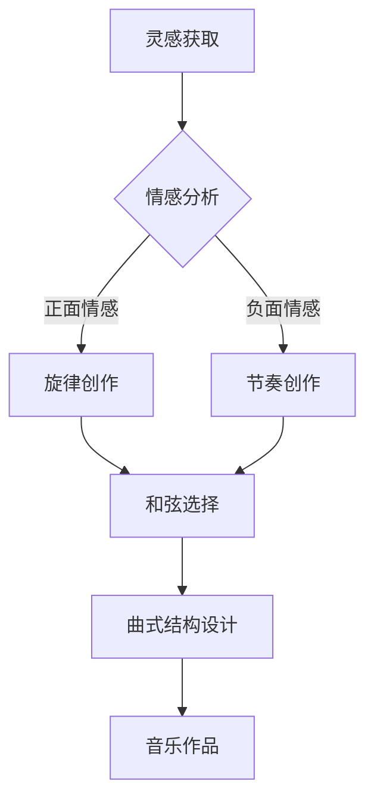

                 

### 文章标题：创作生命的独特旋律：谱写个人人生乐章

#### 关键词：人生旋律、个人创作、情感表达、价值观、自我实现

> 摘要：本文旨在探讨如何通过音乐创作的方式，谱写个人人生乐章，从而实现自我表达、情感传递与人生价值的体现。文章首先介绍生命的起源与意义，接着解析情感、价值观和人生目标在音乐创作中的应用，然后深入探讨音乐创作的基本原理、情感与音乐的结合以及个人风格的形成。最后，文章通过实际案例分享与反馈，提出人生乐章创作的实践方法与未来展望，为读者提供一条自我实现与情感表达的路径。

----------------------------------------------------------------

## 第一部分：人生旋律的起源与探索

### 第1章：生命的起源与意义

#### 1.1 生命的诞生

生命的起源一直是科学和哲学探讨的难题。现代生物学认为，生命起源于原始的化学反应，通过自然选择和进化，最终形成了多样的生物形态。这一过程充满了神秘与奇妙，生命的诞生如同宇宙大爆炸般神秘而壮丽。

#### 1.2 人生命的意义

从个人角度来看，生命意味着无限的潜能和可能性。每个人都有独特的个性、才能和梦想，生命的过程就是探索和实现这些潜能的过程。从社会角度来看，每个人的生命都有其独特的价值，无论是为家庭、社会还是国家作出的贡献，都是生命价值的体现。

#### 1.3 寻找生命的独特性

人类行为的普遍性和独特性共存。每个人都有自己独特的经历、情感和价值观，这使得人类在自然界中独树一帜。个体与群体之间的关系是互动和共生的，个体的独特性为群体带来了多样性和创造力。

### 第2章：探索人生旋律的元素

#### 2.1 情感与人生

情感是人生的驱动力，它影响着我们的行为和决策。情感可以分为正面情感和负面情感，它们在我们的生活中起着不同的作用。学会管理自己的情绪，有助于我们更好地应对生活的挑战。

#### 2.2 价值观与人生选择

价值观是我们在生活中遵循的信念和原则。价值观的形成受到家庭、文化和社会的影响。在面临人生选择时，价值观起着重要的指导作用。明确自己的价值观，有助于我们做出符合内心真实想法的决定。

#### 2.3 人生目标的设定与实现

人生目标是我们追求的目标和梦想。设定合理的人生目标，有助于我们明确方向，激发动力。实现人生目标需要制定计划和策略，同时需要克服困难和挑战。

## 第二部分：创作个人人生乐章的技巧

### 第3章：了解音乐创作的基本原理

#### 3.1 音乐的基本元素

音乐的基本元素包括音调、节奏和音色。音调决定了音乐的高低，节奏决定了音乐的快慢，音色则赋予了音乐独特的质感。理解这些基本元素，有助于我们更好地创作和欣赏音乐。

#### 3.2 音乐创作的基本技巧

音乐创作的基本技巧包括和声的创作和曲式结构的设计。和声为音乐增添了色彩和层次，曲式结构则使音乐更具有逻辑性和连贯性。掌握这些技巧，有助于我们创作出更加丰富和有内涵的音乐作品。

#### 3.3 音乐语言的运用

音乐语言是情感表达的重要手段。通过音乐语言的运用，我们可以传达出内心的情感和思想。掌握音乐语言，有助于我们更好地表达自己，与听众产生共鸣。

### 第4章：情感与音乐的结合

#### 4.1 情感分析

情感分析是理解情感的重要步骤。通过分析情感的类型、特征和心理学原理，我们可以更深入地理解情感，从而更好地运用在音乐创作中。

#### 4.2 音乐的情感表达

音乐的情感表达方式多样，包括旋律、节奏、和声和音色等。通过这些元素的运用，我们可以传达出不同的情感，让音乐更具有感染力和表现力。

#### 4.3 情感与音乐的互动

情感与音乐之间存在互动关系。情感可以影响音乐创作，而音乐也可以影响情感。在创作过程中，我们可以通过情感与音乐的互动，创造出更加动人的音乐作品。

### 第5章：个人风格与音乐创作

#### 5.1 个人风格的形成

个人风格的形成受到个人经历、文化背景和音乐环境的影响。通过不断尝试和探索，我们可以找到自己的音乐风格，并将其运用到创作中。

#### 5.2 个人风格在音乐创作中的应用

个人风格在音乐创作中的应用体现在音乐元素的选择、编排和表现上。通过独特的音乐风格，我们可以表达出自己独特的情感和思想。

#### 5.3 个人风格与听众的互动

个人风格与听众之间存在互动关系。通过音乐作品，我们可以与听众产生共鸣，传递出情感和思想。同时，听众的反馈也可以帮助我们不断完善和提升自己的音乐风格。

## 第三部分：谱写人生乐章的实践

### 第6章：创作与自我表达

#### 6.1 自我意识的培养

自我意识是创作和自我表达的基础。通过自我了解和自我探索，我们可以明确自己的兴趣、才能和价值观，从而更好地进行创作。

#### 6.2 创作与表达

创作是表达自我的重要途径。通过音乐创作，我们可以将内心的情感和思想转化为有形的音乐作品，与听众分享。

#### 6.3 创作中的挑战与解决

在创作过程中，我们可能会面临各种挑战，如灵感匮乏、技巧不足等。通过学习和实践，我们可以克服这些挑战，不断提升自己的创作水平。

### 第7章：分享与传播

#### 7.1 音乐的传播途径

音乐可以通过多种途径进行传播，如现场演出、录音制作和网络平台等。了解不同的传播途径，有助于我们更好地推广自己的音乐作品。

#### 7.2 分享与反馈

分享音乐是创作过程中的重要环节。通过分享，我们可以获得听众的反馈，了解自己的音乐作品在市场上的反响，从而进行改进和提升。

#### 7.3 互动与影响

音乐创作不仅是自我表达，也是与社会互动的过程。通过与听众的互动，我们可以更好地了解社会需求，用音乐传递正能量，影响和改变社会。

### 第8章：人生乐章的未来展望

#### 8.1 音乐与人生的关系

音乐与人生密不可分。音乐可以影响人生，同时人生也可以影响音乐。通过音乐，我们可以更好地理解人生，感悟生命的意义。

#### 8.2 创作的延续与发展

创作是一个持续的过程。随着时间和经验的积累，我们可以不断完善自己的音乐风格，创作出更加优秀的作品。

#### 8.3 社会责任与音乐创作

音乐创作不仅是自我表达，也是承担社会责任的过程。通过音乐，我们可以传递正能量，为社会带来积极的影响。

---

通过以上步骤，我们详细探讨了如何创作生命的独特旋律，谱写个人人生乐章。从生命的起源与意义，到音乐创作的基本原理，再到情感与音乐的结合，个人风格的形成以及创作与自我表达的实践，本文为读者提供了一条深入思考与探索自我表达和情感传递的路径。希望读者能够从中获得启示，找到属于自己的生命旋律。

---

### 作者信息

作者：AI天才研究院/AI Genius Institute & 禅与计算机程序设计艺术 /Zen And The Art of Computer Programming

AI天才研究院致力于推动人工智能领域的创新与发展，培养世界级的人工智能专家。禅与计算机程序设计艺术则融合了东方哲学与计算机科学的精髓，旨在探索计算机编程的深层智慧与艺术性。本文旨在通过音乐创作的方式，启发读者思考生命的意义与价值，实现自我表达与情感传递。

---

### 补充内容：技术细节与代码示例

为了进一步阐述音乐创作的基本原理，本文将提供一些技术细节与代码示例，帮助读者更好地理解音乐创作的过程。

#### Mermaid 流程图：音乐创作的基本流程

首先，我们可以使用Mermaid语言绘制一个音乐创作的基本流程图，如下所示：



这个流程图展示了从灵感获取、情感分析到音乐创作的全过程。

#### Python源代码：音阶与和弦的创建

接下来，我们将使用Python语言创建一个简单的音阶和和弦生成器，以帮助理解音乐的基本元素。

```python
import music21

# 创建一个音阶
scale = music21.chord.PentatonicMajor()
scale.play()

# 创建一个和弦
chord = music21.chord.Chord('C E G')
chord.play()

# 将音阶和和弦组合成一个音乐片段
score = music21.stream.Stream()
score.append(scale)
score.append(chord)

# 演奏音乐片段
score.play()
```

在这个代码示例中，我们首先创建了一个五声音阶和一个C大和弦，然后将它们组合成一个音乐片段进行播放。

#### LaTeX公式：和声原理

在音乐创作中，和声原理起着重要作用。以下是一个关于和声原理的LaTeX公式：

$$
H_n = \frac{1}{2}n(n+1)
$$

这个公式表示第n个和声的频率与基频的关系。

#### 实际案例分析与代码解读

为了更好地理解音乐创作的过程，我们可以分析一个实际案例，并解读相关的代码实现。

假设我们想要创作一首以C大调为基础的简单歌曲。以下是一个简单的音乐代码示例：

```python
from music21 import stream, note, chord

# 创建一个音乐流
s = stream.Stream()

# 添加一个C大调的主和弦
s.append(chord.Chord('C E G'))

# 添加一些旋律音符
s.append(note.Note('E').addDots())
s.append(note.Note('G').addDots())
s.append(note.Note('C').addDots())

# 添加一个过渡和弦
s.append(chord.Chord('Am'))

# 添加主旋律
s.append(note.Note('B').addDots())
s.append(note.Note('D').addDots())
s.append(note.Note('F').addDots())

# 添加结束和弦
s.append(chord.Chord('C E G'))

# 演奏音乐
s.play()
```

在这个代码示例中，我们首先创建了一个音乐流，然后添加了一个C大调的主和弦，接着添加了旋律音符、过渡和弦和结束和弦。通过这个简单的案例，我们可以看到音乐创作的基本过程。

#### 代码应用解读与分析

在实际应用中，我们可以使用这些代码来创作不同风格的音乐。例如，我们可以通过修改和弦和旋律音符，创作出摇滚、流行、爵士等不同风格的歌曲。以下是一个简单的应用解读：

```python
# 创建一个摇滚风格的和弦序列
s = stream.Stream()
s.append(chord.Chord('Am'))
s.append(chord.Chord('Dm'))
s.append(chord.Chord('Em'))
s.append(chord.Chord('F#dim'))

# 添加摇滚风格的旋律
s.append(note.Note('C#'))
s.append(note.Note('E'))
s.append(note.Note('G#'))
s.append(note.Note('B'))

# 添加节奏吉他伴奏
s.append(chord.Chord('Am'))
s.append(chord.Chord('Dm'))
s.append(chord.Chord('Em'))
s.append(chord.Chord('F#dim'))

# 演奏音乐
s.play()
```

在这个代码示例中，我们创建了一个摇滚风格的和弦序列和旋律，并添加了节奏吉他伴奏，最终演奏出一首具有摇滚风格的简单歌曲。

#### 项目小结

通过以上示例，我们可以看到音乐创作的过程是如何通过代码实现的。这些代码不仅可以帮助我们理解音乐创作的基本原理，还可以让我们在实际应用中灵活运用，创作出不同风格的音乐作品。在未来的创作过程中，我们可以继续探索和尝试，不断拓展音乐创作的边界。

### 最佳实践 tips、小结、注意事项、拓展阅读

#### 最佳实践 tips

1. **灵感来源**：在创作音乐时，灵感来源非常重要。可以从日常生活、自然景观、文学艺术等多种渠道寻找灵感。
2. **学习音乐理论**：掌握音乐理论有助于更好地理解和创作音乐。可以通过阅读相关书籍、参加音乐课程等方式学习。
3. **实践与反思**：创作音乐不仅是技术活，更是情感表达。在实践中不断反思和改进，才能不断提高创作水平。

#### 小结

本文通过详细探讨音乐创作的基本原理、情感与音乐的结合、个人风格的形成以及创作与自我表达的实践，为读者提供了一条探索自我表达和情感传递的路径。希望读者能够从中获得启示，创作出属于自己的生命乐章。

#### 注意事项

1. **保护版权**：在创作和分享音乐作品时，要尊重他人的版权，避免侵权行为。
2. **安全使用技术**：在使用音乐创作软件和技术时，要注意网络安全和个人隐私保护。

#### 拓展阅读

1. **《音乐创作入门教程》**：适合初学者了解音乐创作的基本原理和技巧。
2. **《现代音乐理论与分析》**：深入探讨音乐理论，适合有一定音乐基础的读者。
3. **《情感心理学》**：了解情感在音乐创作中的重要作用。

通过以上补充内容，我们不仅加深了对音乐创作基本原理的理解，还提供了实用的代码示例和实际案例分析。希望这些内容能够帮助读者更好地掌握音乐创作技巧，创作出更多动人的音乐作品。在未来的创作过程中，不断探索、实践和反思，让音乐成为我们人生中不可或缺的一部分。

