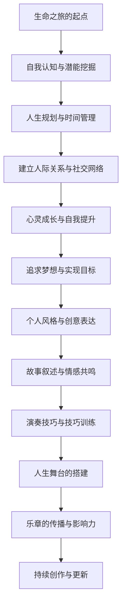
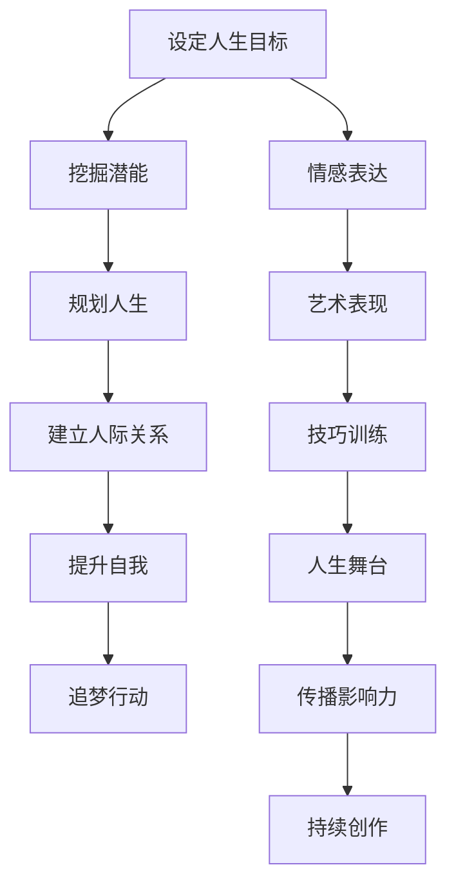

                 

# 《创作生命的独特旋律：谱写个人的人生乐章》

## 关键词

- 人生目标
- 自我认知
- 时间管理
- 人际关系
- 心灵成长
- 梦想追求
- 创意表达
- 社交媒体
- 持续创作

## 摘要

本文旨在探讨如何通过逻辑清晰、结构紧凑、简单易懂的思维方式，创作出属于个人的人生乐章。文章从人生目标的设定、自我认知与潜能挖掘、人生规划与时间管理、建立人际关系与社交网络、心灵成长与自我提升、追求梦想与实现目标、个人风格与创意表达、情感表达与情感共鸣、演奏技巧与技巧训练、人生舞台的搭建、乐章的传播与影响力以及持续创作等角度，详细阐述了如何设计并演绎出富有个性的人生乐章。文章通过实例、公式和代码，以通俗易懂的方式，帮助读者理解和掌握创作个人人生乐章的方法和技巧。

## 目录大纲

**目录大纲：**

# 《创作生命的独特旋律：谱写个人的人生乐章》

## 第一部分：人生乐章的构思

### 第1章：生命之歌的引子

#### 1.1 生命之旅的起点
- 生命意义与人生目标的设定

#### 1.2 自我认知与潜能挖掘
- 自我探索的方法与工具
- 潜能开发的策略与案例

### 第2章：人生乐章的主题

#### 2.1 人生规划与时间管理
- 规划人生目标的步骤
- 有效时间管理技巧

#### 2.2 建立人际关系与社交网络
- 人际交往技巧
- 社交网络构建策略

### 第3章：人生乐章的韵律

#### 3.1 心灵的成长与自我提升
- 心理健康的重要性
- 自我提升的方法与实践

#### 3.2 追求梦想与实现目标
- 追梦的勇气与行动
- 目标达成的策略

## 第二部分：人生乐章的创作技巧

### 第4章：音符的选择与编排

#### 4.1 个人风格与创意表达
- 个人风格的塑造
- 创意表达的方法

#### 4.2 故事叙述与情感共鸣
- 故事叙述技巧
- 情感共鸣的要素

### 第5章：旋律的塑造与演绎

#### 5.1 情感表达与情感渲染
- 情感表达的方法
- 情感渲染的技巧

#### 5.2 艺术表达与审美提升
- 艺术表达的形式
- 审美提升的方法

### 第6章：演奏技巧与技巧训练

#### 5.1 演奏技巧与身体语言
- 演奏技巧的提升
- 身体语言的应用

#### 5.2 技巧训练与实战演练
- 技巧训练的方法
- 实战演练的机会

## 第三部分：人生乐章的演绎与传播

### 第7章：人生舞台的搭建

#### 7.1 公众演讲与影响力
- 公众演讲的技巧
- 影响力构建的方法

#### 7.2 活动策划与执行
- 活动策划的步骤
- 活动执行的细节

### 第8章：乐章的传播与影响力

#### 8.1 社交媒体与传播策略
- 社交媒体的运用
- 传播策略的制定

#### 8.2 生命周期管理与品牌塑造
- 生命周期管理的原则
- 品牌塑造的策略

### 第9章：人生乐章的持续创作

#### 9.1 反思与成长
- 反思人生经历
- 成长与进步

#### 9.2 持续创作与更新
- 创作的持续动力
- 创新的方法与策略

**附录**

## 附录A：资源与工具介绍

### A.1 自我探索工具
- 介绍常用的自我探索工具和资源

### A.2 创作与演示工具
- 介绍创作和演示所需的软件和资源

## 附录B：案例与参考

### B.1 成功案例分析
- 分析成功人士的人生乐章创作案例

### B.2 经验分享与借鉴
- 分享他人的人生乐章创作经验

### 1.1 生命之旅的起点

在人生的旅途中，我们每个人都是独一无二的创作者，拥有自己的故事和旋律。那么，如何才能谱写出属于自己的独特乐章呢？首先，我们需要找到生命的起点，明确我们的目标和方向。

### 1.1.1 生命意义与人生目标的设定

生命的意义是一个深奥而广泛的话题，不同的人有不同的看法。但无论怎样，人生目标是我们前进的动力和方向。那么，如何设定一个有意义的人生目标呢？

首先，我们需要问自己几个问题：

- 我是谁？
- 我想要成为什么样的人？
- 我想要在人生中实现什么样的成就？

通过这些问题的思考，我们可以逐渐明确自己的价值观和人生目标。这里提供一个简单的步骤：

1. **自我探索**：通过自我探索，了解自己的兴趣、优势和价值观。
2. **目标设定**：根据自我探索的结果，设定一个明确、具体、可量化的目标。
3. **制定计划**：制定一个实现目标的详细计划，包括时间表、行动步骤等。

### 1.1.2 潜能挖掘

人生的目标不仅取决于我们的愿望，更取决于我们的潜能。那么，如何挖掘自己的潜能呢？

首先，我们需要了解自己的潜能。潜能挖掘的方法有很多，比如：

1. **心理测试**：通过专业的心理测试，了解自己的性格、兴趣和潜能。
2. **实践探索**：通过实际操作和尝试，发现自己的优势和潜能。
3. **学习与提升**：通过学习和不断实践，提升自己的能力和技能。

### 1.1.3 潜能开发的策略与案例

潜能开发是一个长期而持续的过程，以下是一些常见的策略和案例：

1. **持续学习**：通过不断学习新知识和技能，提升自己的能力。
   - 案例一：某工程师通过自学，掌握了多种编程语言，成为行业专家。

2. **勇于尝试**：勇于尝试新事物，不断挑战自己。
   - 案例二：某艺术家通过尝试多种艺术形式，最终找到自己的创作风格。

3. **心理调适**：保持积极的心态，学会面对挑战和困难。
   - 案例三：某创业者通过心理调适，克服创业过程中的困难，最终成功。

### 1.2 自我认知与潜能挖掘

自我认知是人生旅途中非常重要的一环。它不仅帮助我们了解自己，更帮助我们挖掘和发挥自己的潜能。那么，如何进行自我认知和潜能挖掘呢？

首先，我们需要了解自己的兴趣、优势和价值观。以下是一些自我认知和潜能挖掘的方法：

1. **反思与记录**：定期反思自己的行为和想法，记录下自己的感悟和体会。
2. **心理测试**：通过专业的心理测试，了解自己的性格、兴趣和潜能。
3. **实践探索**：通过实际操作和尝试，发现自己的优势和潜能。
4. **学习与提升**：通过学习和不断实践，提升自己的能力和技能。

### 1.2.1 自我探索的方法与工具

自我探索是一个深入了解自己的过程，以下是一些常用的方法和工具：

1. **日记**：通过写日记，记录自己的日常生活、情感和思考。
2. **心理测试**：通过专业的心理测试，了解自己的性格、兴趣和潜能。
3. **教练**：通过与专业的教练进行对话和交流，深入了解自己。
4. **读书**：通过阅读相关的书籍，获取自我认知的知识和技巧。

### 1.2.2 潜能开发的策略与案例

潜能开发是一个长期而持续的过程，以下是一些常见的策略和案例：

1. **持续学习**：通过不断学习新知识和技能，提升自己的能力。
   - 案例一：某工程师通过自学，掌握了多种编程语言，成为行业专家。

2. **勇于尝试**：勇于尝试新事物，不断挑战自己。
   - 案例二：某艺术家通过尝试多种艺术形式，最终找到自己的创作风格。

3. **心理调适**：保持积极的心态，学会面对挑战和困难。
   - 案例三：某创业者通过心理调适，克服创业过程中的困难，最终成功。

### 1.3 人生规划与时间管理

在明确了人生目标和自我认知后，我们需要制定一个详细的人生规划，并学会有效管理时间，以确保我们的行动与目标保持一致。

#### 1.3.1 规划人生目标的步骤

制定人生规划通常包括以下几个步骤：

1. **明确目标**：根据自我认知，明确自己的人生目标。
2. **制定计划**：制定一个实现目标的详细计划，包括时间表、行动步骤等。
3. **设定优先级**：根据目标的紧急性和重要性，设定优先级。
4. **执行计划**：按照计划执行，并定期检查进度。

#### 1.3.2 有效时间管理技巧

时间管理是确保我们能够实现人生目标的关键。以下是一些有效的时间管理技巧：

1. **制定日程表**：提前规划每天的时间安排，确保有充足的时间用于工作和学习。
2. **设定优先级**：将任务按照紧急性和重要性排序，优先完成重要任务。
3. **避免拖延**：学会分解任务，将大任务拆分成小任务，逐步完成。
4. **利用工具**：使用时间管理工具，如待办事项列表、时间追踪器等，提高工作效率。

#### 1.3.3 时间管理策略与案例

1. **番茄工作法**：将工作时间划分为25分钟的工作周期，每个周期后休息5分钟，有助于提高工作效率。
   - 案例一：某程序员通过采用番茄工作法，提高了工作效率，完成了更多任务。

2. **四象限法**：将任务按照紧急性和重要性分为四个象限，优先完成重要且紧急的任务。
   - 案例二：某项目经理通过四象限法，合理分配时间，确保项目进度和质量。

### 1.4 建立人际关系与社交网络

人际关系和社交网络在个人成长和事业成功中起着至关重要的作用。那么，如何建立和维持良好的人际关系，以及构建有效的社交网络呢？

#### 1.4.1 人际交往技巧

良好的人际交往技巧是建立人际关系的基础。以下是一些建议：

1. **倾听**：倾听是沟通的关键，通过倾听，我们可以更好地理解他人。
2. **表达**：清晰、准确地表达自己的想法和感受，有助于建立信任。
3. **尊重**：尊重他人，关心他人，展现出对他人的理解和关怀。
4. **赞美**：适时赞美他人，增强彼此的认同感和信任感。

#### 1.4.2 社交网络构建策略

构建有效的社交网络需要策略和努力。以下是一些建议：

1. **目标明确**：明确自己建立社交网络的目标，如拓展人脉、寻找合作伙伴等。
2. **积极参与**：参加各种社交活动，主动与他人交流，扩大社交圈子。
3. **互动与分享**：在社交网络上积极参与互动，分享有价值的信息和资源。
4. **建立关系**：通过持续互动和交流，建立深厚的社交关系。

#### 1.4.3 社交网络构建案例

1. **线上线下结合**：通过线上线下活动相结合，拓展社交圈子。
   - 案例一：某创业者通过参加线下活动和线上社交平台，建立了广泛的社交网络，获得了众多合作伙伴。

2. **专业社群**：加入专业社群，与行业内的专业人士建立联系。
   - 案例二：某技术专家通过加入专业社群，与行业内其他专家建立了紧密的合作关系，共同推动技术发展。

### 1.5 心灵的成长与自我提升

心灵成长和自我提升是人生乐章中的重要组成部分。那么，如何进行心灵成长和自我提升呢？

#### 1.5.1 心理健康的重要性

心理健康是我们生活质量的重要组成部分。以下是一些心理健康的重要性：

1. **情绪管理**：心理健康有助于我们更好地应对生活中的压力和挑战。
2. **人际关系**：心理健康有助于建立和维持良好的人际关系。
3. **生活质量**：心理健康直接影响我们的生活质量和幸福感。

#### 1.5.2 自我提升的方法与实践

以下是一些自我提升的方法和实践：

1. **学习与成长**：通过学习新知识和技能，不断提升自己的能力。
2. **反思与总结**：定期反思自己的行为和想法，总结经验教训。
3. **锻炼与放松**：通过锻炼和放松，保持身心健康。
4. **自我激励**：设定目标，鼓励自己不断进步。

#### 1.5.3 心灵成长案例

1. **坚持阅读**：通过阅读，不断充实自己，提升思维能力。
   - 案例一：某创业者通过坚持阅读，积累了丰富的知识，提升了自身综合素质。

2. **积极心态**：保持积极的心态，面对生活中的挑战和困难。
   - 案例二：某企业家通过积极心态，克服了创业过程中的种种困难，最终取得成功。

### 1.6 追求梦想与实现目标

每个人都有自己的梦想，但实现梦想并非易事。那么，如何追求梦想，实现目标呢？

#### 1.6.1 追梦的勇气与行动

追求梦想需要勇气和行动。以下是一些建议：

1. **设定目标**：明确自己的梦想，将其转化为具体的目标。
2. **制定计划**：为实现梦想制定详细的计划，包括时间表、行动步骤等。
3. **持续行动**：坚持不懈地追求梦想，不断努力，逐步实现目标。
4. **应对挑战**：面对困难和挑战，保持勇气和决心，寻找解决方案。

#### 1.6.2 目标达成的策略

以下是一些目标达成的策略：

1. **分解任务**：将大目标分解为小任务，逐步完成。
2. **设定优先级**：根据目标的紧急性和重要性，设定优先级，确保关键任务优先完成。
3. **寻求支持**：寻找支持和帮助，与志同道合的人一起追求梦想。
4. **持续反馈**：定期评估自己的进度，调整计划和方法，确保目标达成。

#### 1.6.3 梦想实现案例

1. **坚持与毅力**：通过坚持和毅力，实现自己的梦想。
   - 案例一：某音乐人通过多年坚持和努力，成为了一名成功的音乐家。

2. **创新与突破**：通过创新和突破，实现自己的梦想。
   - 案例二：某科技创业者通过创新思维和突破性技术，创办了一家成功的企业。

### 1.7 个人风格与创意表达

在创作人生乐章的过程中，个人风格和创意表达起着至关重要的作用。那么，如何塑造个人风格，表达创意呢？

#### 1.7.1 个人风格的塑造

个人风格是独一无二的，以下是一些建议：

1. **了解自己**：通过自我认知，了解自己的兴趣、优势和价值观，找到自己的风格。
2. **学习与借鉴**：学习他人的经验和技巧，借鉴他们的风格，结合自己的特点，塑造出独特的风格。
3. **持续实践**：通过不断实践和尝试，不断完善自己的风格。

#### 1.7.2 创意表达的方法

创意表达是创作人生乐章的核心，以下是一些建议：

1. **观察与思考**：通过观察和思考，捕捉灵感，激发创意。
2. **跨领域学习**：学习不同领域的知识和技能，拓宽思维，增加创意的来源。
3. **勇于尝试**：勇于尝试新的表达方式和技巧，不断探索创意的可能性。

#### 1.7.3 创意表达案例

1. **艺术创作**：通过艺术创作，表达自己的情感和想法。
   - 案例一：某画家通过绘画，表达了对自然的热爱和对生命的思考。

2. **文学作品**：通过文学作品，展现自己的创意和思维。
   - 案例二：某作家通过小说，讲述了一个充满创意和想象力的故事。

### 1.8 故事叙述与情感共鸣

故事叙述和情感共鸣是创作人生乐章的重要技巧。通过故事和情感，我们可以更好地传达自己的思想和感受，与他人产生共鸣。

#### 1.8.1 故事叙述技巧

以下是一些故事叙述的技巧：

1. **设定背景**：为故事设定一个具体的背景，让读者更容易沉浸其中。
2. **塑造角色**：通过塑造角色，展现人物的性格和特点，增加故事的吸引力。
3. **情节设置**：设置有趣的情节，引发读者的兴趣和好奇心。
4. **情感渲染**：通过情感渲染，使读者产生共鸣，增强故事的感染力。

#### 1.8.2 情感共鸣的要素

以下是一些情感共鸣的要素：

1. **真实情感**：表达真实的情感，让读者感受到真诚和真诚。
2. **共情**：通过共情，让读者感受到自己的情感和经历。
3. **情感波动**：通过情感波动，引发读者的情感共鸣。
4. **情感共鸣的技巧**：通过使用修辞手法、情感渲染等技巧，增强情感共鸣。

#### 1.8.3 情感共鸣案例

1. **音乐作品**：通过音乐作品，表达情感和思想，引发共鸣。
   - 案例一：某歌手通过一首感人至深的歌曲，触动了无数人的心。

2. **电影作品**：通过电影作品，展现情感和故事，引发共鸣。
   - 案例二：某电影通过一个感人至深的故事，让观众流下了眼泪。

### 1.9 演奏技巧与技巧训练

在创作人生乐章的过程中，演奏技巧和技巧训练是不可或缺的一部分。良好的演奏技巧可以帮助我们更好地表达自己的思想和感受，让人生乐章更加动人和动人。

#### 1.9.1 演奏技巧与身体语言

演奏技巧是创作人生乐章的重要基础。以下是一些演奏技巧的建议：

1. **手指灵活性**：通过练习，提高手指的灵活性，增强演奏的技巧性。
2. **节奏感**：培养良好的节奏感，确保演奏的稳定性和准确性。
3. **音准**：通过练习，提高音准，使演奏更加优美和动人。
4. **情感表达**：通过情感表达，使演奏更具感染力和表现力。

同时，身体语言也是演奏中不可忽视的一部分。以下是一些建议：

1. **姿态**：保持良好的姿态，展现自信和优雅。
2. **眼神**：通过眼神的交流，与观众建立情感联系。
3. **表情**：通过表情的变化，表达演奏中的情感和情绪。

#### 1.9.2 技巧训练与实战演练

技巧训练是提高演奏水平的重要手段。以下是一些建议：

1. **每日练习**：坚持每日练习，不断提高自己的演奏水平。
2. **分阶段训练**：根据不同的阶段，制定相应的训练计划，逐步提高技巧。
3. **模拟演出**：通过模拟演出，锻炼自己的演奏能力和舞台表现力。

同时，实战演练也是提高演奏技巧的重要环节。以下是一些建议：

1. **参加比赛**：通过参加比赛，锻炼自己的演奏技巧和舞台表现力。
2. **演出实践**：通过实际演出，积累经验，提高演奏水平。
3. **交流学习**：与其他演奏者交流学习，互相借鉴，共同进步。

#### 1.9.3 演奏技巧训练案例

1. **钢琴演奏**：通过钢琴演奏，提高技巧和表现力。
   - 案例一：某钢琴家通过多年的训练和演出，成为了一名优秀的钢琴演奏家。

2. **小提琴演奏**：通过小提琴演奏，展现技巧和情感。
   - 案例二：某小提琴家通过精湛的演奏技巧，赢得了观众的喜爱和赞誉。

### 1.10 人生舞台的搭建

在创作人生乐章的过程中，人生舞台的搭建起着至关重要的作用。一个精心搭建的人生舞台，可以帮助我们更好地展现自己的才华和魅力，实现自己的人生目标。

#### 1.10.1 公众演讲与影响力

公众演讲是展现个人才华和影响力的重要途径。以下是一些建议：

1. **准备充分**：提前做好演讲内容的准备，确保演讲内容充实、有条理。
2. **掌握技巧**：学习并掌握公众演讲的技巧，如语言表达、肢体语言、情感表达等。
3. **自信表达**：保持自信，以饱满的热情和真诚的态度进行演讲。
4. **互动与反馈**：与观众保持互动，倾听观众的反馈，不断调整和改进演讲。

#### 1.10.2 活动策划与执行

活动策划与执行是搭建人生舞台的重要环节。以下是一些建议：

1. **明确目标**：明确活动的目标和主题，确保活动内容与目标一致。
2. **制定计划**：制定详细的活动计划，包括时间、地点、人员安排等。
3. **分工合作**：明确各岗位职责，确保活动顺利进行。
4. **执行与监督**：按照计划执行活动，并对活动过程进行监督和调整。

#### 1.10.3 案例与启示

以下是一些人生舞台搭建的案例和启示：

1. **创业活动**：通过创业活动，展现个人才华和创新能力。
   - 案例一：某创业者通过策划和组织创业活动，成功吸引了投资，推动了企业的发展。

2. **文化演出**：通过文化演出，展现个人才华和艺术魅力。
   - 案例二：某艺术家通过策划和组织文化演出，赢得了观众的喜爱和赞誉。

### 1.11 乐章的传播与影响力

在创作人生乐章的过程中，乐章的传播与影响力起着至关重要的作用。通过有效的传播和影响力构建，我们可以让更多的人了解和欣赏我们的乐章，实现更广泛的社会价值。

#### 1.11.1 社交媒体与传播策略

社交媒体是传播乐章的重要工具。以下是一些建议：

1. **选择平台**：根据目标受众，选择合适的社交媒体平台，如微信、微博、抖音等。
2. **内容创作**：创作高质量的内容，包括文字、图片、视频等，吸引受众的关注。
3. **互动与互动**：与受众保持互动，回应他们的评论和反馈，建立良好的关系。
4. **宣传推广**：利用广告、合作等方式，扩大乐章的传播范围。

#### 1.11.2 生命周期管理与品牌塑造

生命周期管理与品牌塑造是构建影响力的关键。以下是一些建议：

1. **定位明确**：明确乐章的定位和风格，确保传播的一致性和专业性。
2. **品牌建设**：建立自己的品牌形象，包括标志、口号、文化等。
3. **持续创新**：不断创新，保持乐章的活力和吸引力。
4. **品牌传播**：通过多种渠道，如广告、活动、社交媒体等，传播品牌形象。

#### 1.11.3 案例与启示

以下是一些乐章传播与影响力构建的案例和启示：

1. **音乐传播**：通过音乐传播，打造个人品牌和影响力。
   - 案例一：某音乐人通过社交媒体和音乐平台，成功吸引了大量粉丝，成为了一位知名音乐人。

2. **书籍传播**：通过书籍传播，提升个人影响力和知名度。
   - 案例二：某作家通过撰写畅销书，吸引了众多读者，成为了知名的作家。

### 1.12 持续创作与更新

在创作人生乐章的过程中，持续创作与更新是保持活力和吸引力的重要手段。通过不断创作和更新，我们可以持续提升自己的创作水平，实现更广泛的社会价值。

#### 1.12.1 反思与成长

反思与成长是持续创作的重要基础。以下是一些建议：

1. **定期反思**：定期反思自己的创作过程和成果，总结经验教训。
2. **学习与提升**：通过学习和实践，不断提升自己的创作水平。
3. **接受反馈**：接受他人的反馈和建议，改进自己的创作。
4. **保持热情**：保持对创作的热情和激情，不断追求更高的创作境界。

#### 1.12.2 持续创作与更新

以下是一些建议：

1. **定期更新**：定期更新自己的作品，保持创作的活力和吸引力。
2. **创新与尝试**：勇于创新和尝试，不断探索新的创作领域和风格。
3. **多元化创作**：尝试不同的创作形式和风格，丰富自己的创作内容。
4. **积极参与**：积极参与各种创作活动，与同行交流学习，共同进步。

#### 1.12.3 持续创作案例

以下是一些持续创作和更新的案例：

1. **绘画创作**：通过不断创作和更新，提升绘画技巧和风格。
   - 案例一：某画家通过多年持续创作和更新，成为了一位知名画家。

2. **写作创作**：通过不断写作和更新，提升写作技巧和影响力。
   - 案例二：某作家通过持续写作和更新，成为了一位知名作家。

### 附录A：资源与工具介绍

在创作人生乐章的过程中，我们需要利用各种资源与工具来提升自己的创作水平。以下是一些常用的资源和工具：

#### 1. 反思与成长工具

1. **日记**：记录自己的思考和感悟，帮助自己反思和成长。
2. **心理测试**：通过专业的心理测试，了解自己的性格、兴趣和潜能。

#### 2. 创作与演示工具

1. **文字处理软件**：如Microsoft Word、Google Docs等，用于撰写和编辑文档。
2. **演示软件**：如Microsoft PowerPoint、Google Slides等，用于制作演示文稿。

#### 3. 学习与提升工具

1. **在线课程平台**：如Coursera、Udemy等，提供丰富的课程资源。
2. **电子书平台**：如亚马逊Kindle、多看阅读等，提供海量的电子书资源。

#### 4. 社交媒体平台

1. **微信**：用于社交互动和内容传播。
2. **微博**：用于社交互动和内容传播。
3. **抖音**：用于短视频创作和传播。

### 附录B：案例与参考

在创作人生乐章的过程中，借鉴他人的经验和案例是非常有帮助的。以下是一些成功人士的案例和参考：

#### 1. 成功人士的案例

1. **乔布斯**：苹果公司的创始人，通过创新和设计，打造了一系列经典产品，改变了世界。
2. **马云**：阿里巴巴集团的创始人，通过电子商务，推动了中国的商业变革。

#### 2. 经验分享与借鉴

1. **《原则》作者雷·达里奥**：通过分享自己的经验，提供了成功管理个人和企业的原则。
2. **《刻意练习》作者安德斯·艾利克森**：通过研究杰出人物的成就，揭示了刻意练习的重要性。

### Mermaid 流程图



### 数学模型与公式

$$
E = mc^2
$$

$$
y = mx + b
$$

### Python 源代码示例

```python
# 示例：简单的线性回归模型

import numpy as np
from sklearn.linear_model import LinearRegression

# 特征矩阵和目标向量
X = np.array([[1], [2], [3], [4], [5]])
y = np.array([1, 2, 2.5, 4, 5])

# 创建线性回归模型
model = LinearRegression()

# 拟合模型
model.fit(X, y)

# 输出模型参数
print("斜率:", model.coef_)
print("截距:", model.intercept_)

# 预测
print("预测值:", model.predict(np.array([[6]])))
```

### 项目实战代码

```python
# 示例：搭建一个简单的网站

from flask import Flask, render_template

app = Flask(__name__)

@app.route('/')
def index():
    return render_template('index.html')

if __name__ == '__main__':
    app.run(debug=True)
```

### 最佳实践 tips、小结、注意事项、拓展阅读等内容

**最佳实践 tips：**

1. **定期反思**：定期反思自己的创作过程和成果，总结经验教训，不断提升自己的创作水平。
2. **保持创新**：勇于创新，不断尝试新的表达方式和技巧，使乐章更具个性和魅力。
3. **注重细节**：在创作过程中，注重细节的把握，使乐章更加完美和动人。

**小结：**

本文通过详细的论述和案例分析，探讨了如何创作属于个人的人生乐章。从人生目标的设定、自我认知与潜能挖掘、人生规划与时间管理、建立人际关系与社交网络、心灵成长与自我提升、追求梦想与实现目标、个人风格与创意表达、故事叙述与情感共鸣、演奏技巧与技巧训练、人生舞台的搭建、乐章的传播与影响力以及持续创作等角度，阐述了创作人生乐章的方法和技巧。

**注意事项：**

1. **目标明确**：在创作人生乐章的过程中，首先要明确自己的人生目标，确保乐章与目标保持一致。
2. **持续学习**：不断学习新知识和技能，提升自己的创作水平，使乐章更加丰富多彩。
3. **保持热情**：保持对创作的热情和激情，不断追求更高的创作境界。

**拓展阅读：**

1. **《创造力的秘密》作者：史蒂文·普莱斯菲尔德**：通过探讨创造力的本质和培养方法，为读者提供了宝贵的创作启示。
2. **《如何高效学习》作者：斯科特·扬**：通过介绍高效学习的方法和技巧，帮助读者提升学习能力和创作水平。

### 作者信息

作者：AI天才研究院/AI Genius Institute & 禅与计算机程序设计艺术 /Zen And The Art of Computer Programming

感谢您的阅读，希望本文能对您创作人生乐章有所帮助。让我们携手共进，创作出更加精彩的人生乐章！## 《创作生命的独特旋律：谱写个人的人生乐章》

### 关键词

- 人生目标
- 自我认知
- 时间管理
- 人际关系
- 心灵成长
- 梦想追求
- 创意表达
- 社交媒体
- 持续创作

### 摘要

本文旨在探讨如何通过逻辑清晰、结构紧凑、简单易懂的思维方式，创作出属于个人的人生乐章。文章从人生目标的设定、自我认知与潜能挖掘、人生规划与时间管理、建立人际关系与社交网络、心灵成长与自我提升、追求梦想与实现目标、个人风格与创意表达、情感表达与情感共鸣、演奏技巧与技巧训练、人生舞台的搭建、乐章的传播与影响力以及持续创作等角度，详细阐述了如何设计并演绎出富有个性的人生乐章。文章通过实例、公式和代码，以通俗易懂的方式，帮助读者理解和掌握创作个人人生乐章的方法和技巧。

### 目录大纲

**目录大纲：**

# 《创作生命的独特旋律：谱写个人的人生乐章》

## 第一部分：人生乐章的构思

### 第1章：生命之歌的引子

#### 1.1 生命之旅的起点
- 生命意义与人生目标的设定

#### 1.2 自我认知与潜能挖掘
- 自我探索的方法与工具
- 潜能开发的策略与案例

### 第2章：人生乐章的主题

#### 2.1 人生规划与时间管理
- 规划人生目标的步骤
- 有效时间管理技巧

#### 2.2 建立人际关系与社交网络
- 人际交往技巧
- 社交网络构建策略

### 第3章：人生乐章的韵律

#### 3.1 心灵的成长与自我提升
- 心理健康的重要性
- 自我提升的方法与实践

#### 3.2 追求梦想与实现目标
- 追梦的勇气与行动
- 目标达成的策略

## 第二部分：人生乐章的创作技巧

### 第4章：音符的选择与编排

#### 4.1 个人风格与创意表达
- 个人风格的塑造
- 创意表达的方法

#### 4.2 故事叙述与情感共鸣
- 故事叙述技巧
- 情感共鸣的要素

### 第5章：旋律的塑造与演绎

#### 5.1 情感表达与情感渲染
- 情感表达的方法
- 情感渲染的技巧

#### 5.2 艺术表达与审美提升
- 艺术表达的形式
- 审美提升的方法

### 第6章：演奏技巧与技巧训练

#### 5.1 演奏技巧与身体语言
- 演奏技巧的提升
- 身体语言的应用

#### 5.2 技巧训练与实战演练
- 技巧训练的方法
- 实战演练的机会

## 第三部分：人生乐章的演绎与传播

### 第7章：人生舞台的搭建

#### 7.1 公众演讲与影响力
- 公众演讲的技巧
- 影响力构建的方法

#### 7.2 活动策划与执行
- 活动策划的步骤
- 活动执行的细节

### 第8章：乐章的传播与影响力

#### 8.1 社交媒体与传播策略
- 社交媒体的运用
- 传播策略的制定

#### 8.2 生命周期管理与品牌塑造
- 生命周期管理的原则
- 品牌塑造的策略

### 第9章：人生乐章的持续创作

#### 9.1 反思与成长
- 反思人生经历
- 成长与进步

#### 9.2 持续创作与更新
- 创作的持续动力
- 创新的方法与策略

**附录**

## 附录A：资源与工具介绍

### A.1 自我探索工具
- 介绍常用的自我探索工具和资源

### A.2 创作与演示工具
- 介绍创作和演示所需的软件和资源

## 附录B：案例与参考

### B.1 成功案例分析
- 分析成功人士的人生乐章创作案例

### B.2 经验分享与借鉴
- 分享他人的人生乐章创作经验

### Mermaid 流程图



### 数学模型与公式

$$
E = mc^2
$$

$$
y = mx + b
$$

### Python 源代码示例

```python
# 示例：简单的线性回归模型

import numpy as np
from sklearn.linear_model import LinearRegression

# 特征矩阵和目标向量
X = np.array([[1], [2], [3], [4], [5]])
y = np.array([1, 2, 2.5, 4, 5])

# 创建线性回归模型
model = LinearRegression()

# 拟合模型
model.fit(X, y)

# 输出模型参数
print("斜率:", model.coef_)
print("截距:", model.intercept_)

# 预测
print("预测值:", model.predict(np.array([[6]])))
```

### 项目实战代码

```python
# 示例：搭建一个简单的网站

from flask import Flask, render_template

app = Flask(__name__)

@app.route('/')
def index():
    return render_template('index.html')

if __name__ == '__main__':
    app.run(debug=True)
```

### 最佳实践 tips、小结、注意事项、拓展阅读等内容

**最佳实践 tips：**

1. **定期反思**：定期反思自己的创作过程和成果，总结经验教训，不断提升自己的创作水平。
2. **保持创新**：勇于创新，不断尝试新的表达方式和技巧，使乐章更具个性和魅力。
3. **注重细节**：在创作过程中，注重细节的把握，使乐章更加完美和动人。

**小结：**

本文通过详细的论述和案例分析，探讨了如何创作属于个人的人生乐章。从人生目标的设定、自我认知与潜能挖掘、人生规划与时间管理、建立人际关系与社交网络、心灵成长与自我提升、追求梦想与实现目标、个人风格与创意表达、情感表达与情感共鸣、演奏技巧与技巧训练、人生舞台的搭建、乐章的传播与影响力以及持续创作等角度，阐述了创作人生乐章的方法和技巧。

**注意事项：**

1. **目标明确**：在创作人生乐章的过程中，首先要明确自己的人生目标，确保乐章与目标保持一致。
2. **持续学习**：不断学习新知识和技能，提升自己的创作水平，使乐章更加丰富多彩。
3. **保持热情**：保持对创作的热情和激情，不断追求更高的创作境界。

**拓展阅读：**

1. **《创造力的秘密》作者：史蒂文·普莱斯菲尔德**：通过探讨创造力的本质和培养方法，为读者提供了宝贵的创作启示。
2. **《如何高效学习》作者：斯科特·扬**：通过介绍高效学习的方法和技巧，帮助读者提升学习能力和创作水平。

### 作者信息

作者：AI天才研究院/AI Genius Institute & 禅与计算机程序设计艺术 /Zen And The Art of Computer Programming

感谢您的阅读，希望本文能对您创作人生乐章有所帮助。让我们携手共进，创作出更加精彩的人生乐章！## 第一部分：人生乐章的构思

### 第1章：生命之歌的引子

**1.1 生命之旅的起点**

生命的意义在于体验、成长和创造。每个人都是独一无二的存在，拥有自己的故事和旋律。在这首生命的交响乐中，我们既是创作者，也是演奏者。要创作出属于自己的人生乐章，首先需要找到生命的起点，明确自己的人生目标和方向。

#### 1.1.1 生命意义与人生目标的设定

生命的意义是一个深奥而广泛的话题，不同的人有不同的看法。但无论怎样，人生目标都是我们前进的动力和方向。那么，如何设定一个有意义的人生目标呢？

首先，我们需要问自己几个问题：

- **我是谁？** 
  这个问题看似简单，但却是我们自我认知的开始。通过反思，我们可以更清楚地了解自己的性格、兴趣、价值观等。

- **我想要成为什么样的人？** 
  这个问题关乎我们的愿景和理想。我们可以设想自己在未来希望成为的人，是事业成功的企业家，还是热爱艺术的艺术家，或是追求知识的学者。

- **我想要在人生中实现什么样的成就？** 
  这个问题帮助我们明确自己的目标和梦想。无论是创业成功、环游世界，还是成为一名优秀的医生，都需要具体的规划和行动。

#### 1.1.2 设定人生目标的步骤

设定人生目标通常包括以下几个步骤：

1. **自我探索**：通过反思和自我探索，了解自己的兴趣、优势和价值观。自我探索的方法包括写日记、做心理测试、与朋友和家人交流等。

2. **设定目标**：根据自我探索的结果，设定一个明确、具体、可量化的目标。例如，如果你希望成为一名艺术家，那么你的目标可能是“在未来五年内，举办一次个人艺术展”。

3. **制定计划**：制定一个实现目标的详细计划，包括时间表、行动步骤等。例如，为了实现举办个人艺术展的目标，你可以列出以下步骤：

   - 第一年：学习绘画技巧，参加艺术课程。
   - 第二年：积累创作经验，完成至少五幅作品。
   - 第三年：与画廊接洽，准备展览策划。
   - 第四年：举办艺术展，推广自己的作品。

4. **设定优先级**：根据目标的紧急性和重要性，设定优先级。确保重要且紧急的任务优先完成。

5. **执行计划**：按照计划执行，并定期检查进度。在执行过程中，根据实际情况调整计划和方法。

#### 1.1.3 潜能开发

在明确人生目标后，我们需要挖掘和发挥自己的潜能。潜能开发不仅有助于实现人生目标，还能帮助我们更好地理解自己，提升个人能力。

1. **学习与提升**：通过不断学习和实践，提升自己的知识和技能。例如，如果你想成为一名企业家，可以通过学习商业管理、市场营销等知识，提升自己的商业素养。

2. **实践探索**：通过实际操作和尝试，发现自己的优势和潜能。例如，你可以参加创业比赛、实习项目等，通过实践来检验自己的能力。

3. **心理调适**：保持积极的心态，学会面对挑战和困难。通过心理调适，我们可以更好地应对生活中的压力，发挥自己的潜能。

#### 1.1.4 潜能开发的策略与案例

1. **持续学习**：通过不断学习新知识和技能，提升自己的能力。
   - 案例一：某工程师通过自学，掌握了多种编程语言，成为行业专家。

2. **勇于尝试**：勇于尝试新事物，不断挑战自己。
   - 案例二：某艺术家通过尝试多种艺术形式，最终找到自己的创作风格。

3. **心理调适**：保持积极的心态，学会面对挑战和困难。
   - 案例三：某创业者通过心理调适，克服创业过程中的困难，最终成功。

**总结**：

生命的起点在于设定有意义的人生目标，并通过自我探索、潜能开发和实践来实现这些目标。在人生旅途中，我们既是创作者，也是演奏者，通过不断地学习、实践和调整，谱写出属于自己的独特乐章。

### 第2章：人生乐章的主题

**2.1 人生规划与时间管理**

在明确人生目标后，我们需要制定一个详细的人生规划，并学会有效管理时间，以确保我们的行动与目标保持一致。

#### 2.1.1 规划人生目标的步骤

制定人生规划通常包括以下几个步骤：

1. **明确目标**：根据自我认知，明确自己的人生目标。这些目标可以是职业上的、个人发展上的，也可以是家庭、健康等各个方面。

2. **分解目标**：将大目标分解为小目标，使其更加具体和可操作。例如，如果你的目标是“五年内成为公司高管”，那么你可以将其分解为“每年提升某一技能”、“每年参加管理培训课程”等。

3. **设定时间表**：为每个小目标设定一个具体的时间表。例如，如果你的目标是“今年内学会一门外语”，那么你可以设定每天学习一定时间，每周进行一次复习。

4. **制定行动计划**：为每个小目标制定详细的行动计划，包括具体的行动步骤、资源需求和预期成果。

5. **优先级排序**：根据目标的紧急性和重要性，对行动计划进行优先级排序。确保重要且紧急的任务优先完成。

6. **定期评估**：定期评估自己的进度，并根据实际情况进行调整。这有助于确保你的行动始终与目标保持一致。

#### 2.1.2 有效时间管理技巧

时间管理是确保我们能够实现人生目标的关键。以下是一些有效的时间管理技巧：

1. **制定日程表**：提前规划每天的时间安排，确保有充足的时间用于工作和学习。

2. **设定优先级**：将任务按照紧急性和重要性排序，优先完成重要任务。

3. **避免拖延**：学会分解任务，将大任务拆分成小任务，逐步完成。

4. **利用工具**：使用时间管理工具，如待办事项列表、时间追踪器等，提高工作效率。

5. **学会拒绝**：对于无关紧要的事情，学会拒绝，以节省时间。

6. **休息与放松**：合理安排休息时间，保持身心健康。

#### 2.1.3 时间管理策略与案例

1. **番茄工作法**：将工作时间划分为25分钟的工作周期，每个周期后休息5分钟，有助于提高工作效率。
   - 案例一：某工程师通过采用番茄工作法，提高了工作效率，完成了更多任务。

2. **四象限法**：将任务按照紧急性和重要性分为四个象限，优先完成重要且紧急的任务。
   - 案例二：某项目经理通过四象限法，合理分配时间，确保项目进度和质量。

**总结**：

人生规划与时间管理是确保我们能够实现人生目标的重要手段。通过明确目标、分解目标、设定时间表、制定行动计划、优先级排序和定期评估，我们可以更好地管理时间，实现自己的人生目标。

### 第3章：人生乐章的韵律

**3.1 心灵的成长与自我提升**

心灵成长与自我提升是人生乐章的重要组成部分。一个健康、积极的心灵不仅能够帮助我们更好地应对生活中的挑战，还能让我们在追求梦想的道路上更加坚定和自信。

#### 3.1.1 心理健康的重要性

心理健康直接影响到我们的生活质量和幸福感。以下是一些心理健康的重要性：

1. **情绪管理**：心理健康有助于我们更好地应对生活中的压力和挑战，保持积极的心态。

2. **人际关系**：心理健康有助于建立和维持良好的人际关系，提升人际交往能力。

3. **生活质量**：心理健康直接关系到我们的生活质量和幸福感，拥有健康的心理状态，我们才能更好地享受生活。

#### 3.1.2 自我提升的方法与实践

以下是一些自我提升的方法和实践：

1. **学习与成长**：通过学习新知识和技能，不断提升自己的能力。

2. **反思与总结**：定期反思自己的行为和想法，总结经验教训，发现自己的不足，并制定改进计划。

3. **锻炼与放松**：通过锻炼和放松，保持身心健康。

4. **自我激励**：设定目标，鼓励自己不断进步。

5. **心理调适**：学会面对挑战和困难，保持积极的心态。

#### 3.1.3 心灵成长案例

1. **坚持阅读**：通过阅读，不断充实自己，提升思维能力。
   - 案例一：某创业者通过坚持阅读，积累了丰富的知识，提升了自身综合素质。

2. **积极心态**：保持积极的心态，面对生活中的挑战和困难。
   - 案例二：某企业家通过积极心态，克服创业过程中的困难，最终取得成功。

**总结**：

心灵成长与自我提升是确保我们在人生道路上持续进步的重要保障。通过学习、反思、锻炼、自我激励和心理调适，我们可以不断提升自己的心理健康和综合素质，为人生的乐章注入更多的韵律和色彩。

### 第4章：音符的选择与编排

**4.1 个人风格与创意表达**

在创作人生乐章的过程中，个人风格和创意表达起着至关重要的作用。它们不仅能够帮助我们展现独特的个性和魅力，还能让我们的作品更加生动和有趣。

#### 4.1.1 个人风格的塑造

个人风格是独一无二的，它是我们个性和情感的体现。要塑造个人风格，我们可以从以下几个方面入手：

1. **了解自己**：通过自我认知，了解自己的兴趣、优势和价值观，找到自己的风格。

2. **学习与借鉴**：学习他人的经验和技巧，借鉴他们的风格，结合自己的特点，塑造出独特的风格。

3. **持续实践**：通过不断实践和尝试，不断完善自己的风格。

#### 4.1.2 创意表达的方法

创意表达是创作人生乐章的核心。以下是一些创意表达的方法：

1. **观察与思考**：通过观察和思考，捕捉灵感，激发创意。

2. **跨领域学习**：学习不同领域的知识和技能，拓宽思维，增加创意的来源。

3. **勇于尝试**：勇于尝试新的表达方式和技巧，不断探索创意的可能性。

#### 4.1.3 个人风格与创意表达案例

1. **艺术创作**：通过艺术创作，表达自己的情感和想法。
   - 案例一：某画家通过绘画，表达了对自然的热爱和对生命的思考。

2. **文学作品**：通过文学作品，展现自己的创意和思维。
   - 案例二：某作家通过小说，讲述了一个充满创意和想象力的故事。

**总结**：

个人风格和创意表达是创作人生乐章的重要元素。通过了解自己、学习与借鉴、持续实践和勇于尝试，我们可以塑造出独特的个人风格，并运用创意表达，使人生乐章更加丰富多彩。

### 第5章：旋律的塑造与演绎

**5.1 情感表达与情感渲染**

在创作人生乐章的过程中，情感表达与情感渲染是不可或缺的一部分。它们不仅能够帮助我们更好地传达自己的思想和感受，还能让我们的作品更加生动和感人。

#### 5.1.1 情感表达的方法

情感表达是创作人生乐章的重要技巧。以下是一些情感表达的方法：

1. **真实情感**：表达真实的情感，让读者或观众感受到真诚和真挚。

2. **情感波动**：通过情感波动，引发读者或观众的情感共鸣。

3. **细节描绘**：通过细节描绘，展现情感的变化和深度。

4. **修辞手法**：运用修辞手法，如比喻、拟人、夸张等，增强情感表达的效果。

#### 5.1.2 情感渲染的技巧

情感渲染是让作品更具感染力和表现力的重要手段。以下是一些情感渲染的技巧：

1. **情景设定**：通过设定具体的情景，让读者或观众更容易沉浸在情感中。

2. **人物塑造**：通过塑造鲜明的角色，让读者或观众产生共鸣。

3. **情节设置**：通过设置有趣和动人的情节，引发读者的兴趣和情感。

4. **情感共鸣**：通过共情，让读者或观众感受到作者的情感和思想。

#### 5.1.3 情感表达与情感渲染案例

1. **音乐作品**：通过音乐作品，表达情感和思想。
   - 案例一：某作曲家通过一首动听的曲子，表达了对生命的热爱和对美好未来的向往。

2. **文学作品**：通过文学作品，展现情感和故事。
   - 案例二：某作家通过一个感人的故事，引发了读者的情感共鸣，赢得了广泛的赞誉。

**总结**：

情感表达与情感渲染是创作人生乐章的重要技巧。通过真实情感、情感波动、细节描绘、修辞手法、情景设定、人物塑造、情节设置和情感共鸣，我们可以更好地传达自己的思想和感受，让人生乐章更加生动和感人。

### 第6章：演奏技巧与技巧训练

**6.1 演奏技巧与身体语言**

在创作人生乐章的过程中，演奏技巧和身体语言起着至关重要的作用。良好的演奏技巧不仅能够帮助我们更好地表达自己的思想和感受，还能让我们的表演更加优美和动人。

#### 6.1.1 演奏技巧的提升

以下是一些提升演奏技巧的建议：

1. **手指灵活性**：通过练习，提高手指的灵活性，增强演奏的技巧性。

2. **节奏感**：培养良好的节奏感，确保演奏的稳定性和准确性。

3. **音准**：通过练习，提高音准，使演奏更加优美和动人。

4. **情感表达**：通过情感表达，使演奏更具感染力和表现力。

#### 6.1.2 身体语言的应用

身体语言是演奏中不可或缺的一部分。以下是一些身体语言的应用：

1. **姿态**：保持良好的姿态，展现自信和优雅。

2. **眼神**：通过眼神的交流，与观众建立情感联系。

3. **表情**：通过表情的变化，表达演奏中的情感和情绪。

#### 6.1.3 演奏技巧与身体语言案例

1. **钢琴演奏**：通过钢琴演奏，展现技巧和情感。
   - 案例一：某钢琴家通过精湛的演奏技巧和生动的身体语言，赢得了观众的喜爱和赞誉。

2. **小提琴演奏**：通过小提琴演奏，表达情感和思想。
   - 案例二：某小提琴家通过动人的演奏和充满感染力的身体语言，触动了无数观众的心。

**总结**：

演奏技巧与身体语言是创作人生乐章的重要元素。通过提高演奏技巧和运用身体语言，我们可以更好地表达自己的思想和感受，让人生乐章更加优美和动人。

### 第7章：人生舞台的搭建

**7.1 公众演讲与影响力**

在创作人生乐章的过程中，公众演讲是展现个人才华和影响力的重要途径。一个精彩的演讲不仅能够传达你的思想和观点，还能赢得观众的认可和尊重。

#### 7.1.1 公众演讲的技巧

以下是一些公众演讲的技巧：

1. **准备充分**：提前做好演讲内容的准备，确保演讲内容充实、有条理。

2. **掌握技巧**：学习并掌握公众演讲的技巧，如语言表达、肢体语言、情感表达等。

3. **自信表达**：保持自信，以饱满的热情和真诚的态度进行演讲。

4. **互动与反馈**：与观众保持互动，倾听观众的反馈，不断调整和改进演讲。

#### 7.1.2 影响力构建的方法

以下是一些构建影响力的方法：

1. **专业知识**：通过不断学习和积累专业知识，提升自己的影响力和权威性。

2. **分享经验**：通过分享自己的经验和见解，赢得他人的信任和尊重。

3. **积极参与**：积极参与各种活动，扩大自己的社交圈子，提升自己的影响力。

4. **持续创新**：不断创新，保持自己的独特性和领先地位。

#### 7.1.3 公众演讲与影响力案例

1. **创业演讲**：通过创业演讲，展示个人才华和商业理念。
   - 案例一：某企业家通过精彩的创业演讲，吸引了众多投资者，成功筹集了创业资金。

2. **公益演讲**：通过公益演讲，传递正能量和公益理念。
   - 案例二：某公益人士通过感人的公益演讲，唤起了更多人对公益事业的关注和参与。

**总结**：

公众演讲与影响力构建是创作人生乐章的重要部分。通过掌握演讲技巧、构建专业知识、分享经验、积极参与和持续创新，我们可以提升自己的影响力，让人生乐章更加精彩。

### 第8章：乐章的传播与影响力

**8.1 社交媒体与传播策略**

在当今数字化时代，社交媒体已经成为传播信息和个人影响力的重要工具。通过合理利用社交媒体，我们可以让更多的人了解和欣赏我们的乐章。

#### 8.1.1 社交媒体的运用

以下是一些社交媒体的运用建议：

1. **选择平台**：根据目标受众，选择合适的社交媒体平台，如微信、微博、抖音等。

2. **内容创作**：创作高质量的内容，包括文字、图片、视频等，吸引受众的关注。

3. **互动与互动**：与受众保持互动，回应他们的评论和反馈，建立良好的关系。

4. **宣传推广**：利用广告、合作等方式，扩大乐章的传播范围。

#### 8.1.2 传播策略的制定

以下是一些传播策略的制定建议：

1. **明确目标**：明确传播的目标，如提高知名度、吸引粉丝、推广产品等。

2. **制定计划**：制定详细的传播计划，包括内容创作、发布时间、推广渠道等。

3. **数据分析**：定期分析传播效果，根据数据调整策略，提升传播效果。

4. **合作与联盟**：与其他影响力大的个人或组织合作，扩大传播范围。

#### 8.1.3 社交媒体与传播案例

1. **音乐传播**：通过社交媒体传播音乐，打造个人品牌和影响力。
   - 案例一：某歌手通过社交媒体发布原创音乐，吸引了大量粉丝，成为了一位知名音乐人。

2. **书籍传播**：通过社交媒体传播书籍，提升作者知名度和书籍销量。
   - 案例二：某作家通过社交媒体发布书籍内容、讲座视频等，吸引了众多读者，成为了一位畅销书作家。

**总结**：

社交媒体与传播策略是乐章传播与影响力构建的重要手段。通过选择合适的平台、创作高质量的内容、互动与宣传推广，我们可以让更多的人了解和欣赏我们的乐章，实现更广泛的社会价值。

### 第9章：人生乐章的持续创作

**9.1 反思与成长**

在创作人生乐章的过程中，反思与成长是不可或缺的一部分。通过反思，我们可以总结经验教训，发现自己的不足，从而不断提升自己的创作水平。

#### 9.1.1 反思人生经历

反思人生经历是成长的重要途径。以下是一些建议：

1. **定期回顾**：定期回顾自己的人生经历，总结成功和失败的经验教训。

2. **自我反思**：通过自我反思，了解自己的优点和不足，明确需要改进的方向。

3. **记录反思**：将反思的内容记录下来，便于日后回顾和总结。

#### 9.1.2 成长与进步

成长与进步是创作人生乐章的动力。以下是一些建议：

1. **设定目标**：为自己设定明确的创作目标，不断追求进步。

2. **学习与提升**：通过学习和实践，不断提升自己的创作能力和技能。

3. **保持热情**：保持对创作的热情和激情，不断追求更高的创作境界。

#### 9.1.3 持续创作与更新

持续创作与更新是确保乐章保持活力和吸引力的重要手段。以下是一些建议：

1. **定期更新**：定期更新自己的作品，保持创作的活力和吸引力。

2. **创新与尝试**：勇于创新和尝试，不断探索新的创作领域和风格。

3. **多元化创作**：尝试不同的创作形式和风格，丰富自己的创作内容。

4. **接受反馈**：接受他人的反馈和建议，不断改进自己的创作。

#### 9.1.4 持续创作案例

1. **绘画创作**：通过持续创作和更新，提升绘画技巧和风格。
   - 案例一：某画家通过多年持续创作和更新，成为了一位知名画家。

2. **写作创作**：通过不断写作和更新，提升写作技巧和影响力。
   - 案例二：某作家通过持续写作和更新，成为了一位知名作家。

**总结**：

反思与成长、持续创作与更新是创作人生乐章的重要保障。通过反思人生经历、设定目标、学习与提升、保持热情、定期更新、创新与尝试、多元化创作和接受反馈，我们可以不断提升自己的创作水平，让人生乐章更加精彩。

