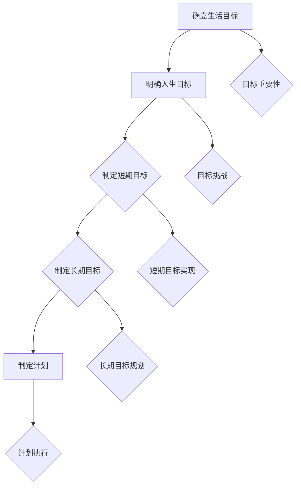

                 

# 《创造个人生活节奏：谱写独特的人生乐章》

## 摘要

在现代快节奏的生活中，创造个人生活节奏成为了一项至关重要的能力。本文旨在探讨如何通过确立生活目标、时间管理、睡眠与休息、锻炼与健康、社交与人际关系、心理健康、艺术与爱好以及精神修行等多个方面，构建一个健康、平衡且有意义的生活节奏。本文将结合实际案例与算法原理，提供具体的策略和实践方法，帮助读者发现并实现个人的生活平衡。

### 关键词

- 生活节奏
- 时间管理
- 心理健康
- 锻炼与健康
- 社交与人际关系
- 艺术与爱好
- 精神修行

## 第1章 引言

### 1.1 生活的本质与节奏

生活的本质是一个动态平衡的过程，它包含了工作、学习、娱乐、社交等多个方面。生活节奏，即个体在日常生活中所保持的周期性和规律性，是生活质量的重要因素之一。在快节奏的现代生活中，保持良好的生活节奏对于个人的身心健康和幸福感至关重要。

### 1.2 面对生活节奏的挑战

随着科技的发展和全球化进程的加速，人们的生活节奏变得越来越快。这带来了诸多挑战，包括压力增加、心理健康问题、缺乏时间管理能力等。因此，如何面对这些挑战，成为每个人都需要思考和解决的问题。

### 1.3 创造个人生活节奏的意义

创造个人生活节奏不仅有助于提高生活质量，还能增强个人的自我管理能力和幸福感。一个良好的生活节奏能帮助人们更好地平衡工作与生活，减少压力，提高工作效率，同时保持身心健康。

## 第2章 确立生活目标

### 2.1 明确人生目标的重要性

明确的人生目标是个体生活节奏的基础。它不仅能指导个人的行动方向，还能提供持久的动力和意义。没有明确目标的生活往往会陷入迷茫和无力感。

### 2.2 制定可行的短期目标

短期目标是实现长期目标的重要步骤。制定可行的短期目标需要考虑到个人能力、资源、时间等多方面因素，确保目标的实现具有实际可操作性。

### 2.3 制定长期目标与计划

长期目标是个人未来的蓝图。制定长期目标需要从宏观的角度出发，考虑到个人的人生规划和社会环境的变化。同时，制定合理的计划是实现长期目标的关键。

### Mermaid 流程图



## 第3章 时间管理

### 3.1 时间管理的原则

时间管理是一项重要的技能，它能够帮助人们更有效地利用时间，提高工作效率和生活质量。时间管理的原则包括优先级排序、时间块划分、避免时间浪费等。

### 3.2 有效的时间管理工具

现代科技提供了多种时间管理工具，如日历、任务管理软件、时间跟踪器等。选择合适的工具，结合个人习惯和工作需求，能够大大提高时间管理的效率。

### 3.3 时间管理实践

时间管理的实践是理论应用的过程。通过实际操作，我们可以发现哪些方法更适合自己的生活方式，从而不断优化时间管理策略。

### Python 源代码示例

```python
import time
from datetime import datetime, timedelta

# 设置时间管理目标
start_time = datetime.now()
end_time = start_time + timedelta(hours=2)

# 时间块划分
def time_block(start, duration):
    end = start + duration
    print(f"时间块开始：{start}，持续时间：{duration}小时")
    time.sleep(duration * 3600)  # 模拟时间块执行
    print(f"时间块结束：{end}")

# 实施时间管理
time_block(start_time, 1)  # 工作
time_block(end_time - timedelta(hours=1), 1)  # 休息
time_block(end_time, 1)  # 学习

# 计算时间管理效率
current_time = datetime.now()
time_spent = current_time - start_time
print(f"总时间：{time_spent}，效率：{time_spent.total_seconds() / 3600}")
```

## 第4章 睡眠与休息

### 4.1 睡眠的重要性

睡眠是人体恢复和修复的重要过程，对身体健康和心理健康都有着至关重要的影响。缺乏睡眠会导致免疫力下降、注意力不集中、情绪波动等问题。

### 4.2 建立健康的睡眠习惯

建立健康的睡眠习惯是保证良好睡眠质量的关键。这包括规律的作息时间、舒适的睡眠环境、避免夜间使用电子设备等。

### 4.3 睡眠质量的提升方法

提升睡眠质量的方法多种多样，如进行放松训练、进行睡前瑜伽、使用睡眠面膜等。这些方法能够帮助个体更好地进入深度睡眠，提高睡眠质量。

### 数学模型与公式

$$
Q = 0.4 \times T + 0.3 \times E + 0.2 \times C + 0.1 \times S
$$

其中，$Q$表示睡眠质量，$T$表示体温，$E$表示环境舒适度，$C$表示床品舒适度，$S$表示睡前活动。

### 实际案例

假设某人每天晚上10点上床，11点入睡，早上7点起床。通过改善环境舒适度和睡前活动，如降低室温、使用舒适床品、进行深呼吸练习，可以显著提高睡眠质量。

## 第5章 锻炼与健康

### 5.1 运动与健康的关系

运动是保持健康的重要手段。它能够增强心肺功能、提高免疫力、改善心理健康等。科学研究表明，定期运动对预防多种慢性疾病具有显著效果。

### 5.2 选择适合自己的运动方式

不同的运动方式适用于不同的人群和健康状况。例如，跑步适合心肺功能较好的个体，瑜伽适合追求身心平衡的人群。选择适合自己的运动方式能够更好地达到锻炼效果。

### 5.3 运动习惯的养成

养成运动习惯需要持之以恒的努力。从简单的日常活动开始，逐渐增加运动强度和时间，逐步形成稳定的运动习惯。

### Python 源代码示例

```python
import random

# 设定运动计划
def exercise_plan():
    exercises = ["跑步", "瑜伽", "游泳", "健身"]
    print(f"今天的运动计划是：{random.choice(exercises)}")

# 模拟运动习惯养成
exercise_plan()
for _ in range(5):
    exercise_plan()
    time.sleep(1)  # 模拟每天的运动习惯
```

## 第6章 社交与人际关系

### 6.1 社交的重要性

社交是人类社会性需求的重要组成部分。良好的社交能力有助于个体建立人际关系网络，提高社会地位，增加生活满意度。

### 6.2 建立良好的人际关系

建立良好的人际关系需要真诚、信任和尊重。通过倾听、共情和有效的沟通，个体能够与他人建立深厚的情感联系。

### 6.3 社交技巧的提升

提升社交技巧包括非语言沟通、倾听技巧、公共演讲等。这些技巧能够帮助个体更好地与他人交流，提高社交效果。

### 实际案例

一个人通过参加社区活动、加入兴趣小组等方式，积极拓展社交圈，不仅结识了新朋友，还在社交中获得了职业发展的机会。

## 第7章 心理健康

### 7.1 心理健康的定义

心理健康是指个体在情绪、认知和行为上的良好状态。它不仅仅是没有心理疾病，还包括能够积极应对生活中的压力和挑战。

### 7.2 常见心理问题及应对方法

常见心理问题包括焦虑、抑郁、压力等。针对这些问题，可以通过心理治疗、药物治疗、自我调适等方法进行缓解。

### 7.3 心理健康的维护与促进

维护心理健康的方法包括定期进行心理健康检查、保持良好的生活习惯、培养积极的情绪态度等。通过这些方法，个体能够更好地应对生活中的各种挑战。

### Python 源代码示例

```python
import random

# 心理健康测试
def mental_health_test():
    questions = [
        "你是否感到经常焦虑或紧张？",
        "你是否感到情绪低落或对日常活动失去兴趣？",
        "你是否感到睡眠障碍或食欲异常？"
    ]
    print("请回答以下问题（是/否）：")
    for question in questions:
        print(question)
        answer = input()
        if answer.lower() == "是":
            return "可能存在心理健康问题，建议咨询专业人士。"
    return "心理健康状况良好。"

# 模拟测试
print(mental_health_test())
```

## 第8章 艺术与爱好

### 8.1 艺术对生活的意义

艺术是生活的调味品，它能够丰富个体的情感世界，提高生活品质。通过艺术创作和欣赏，个体能够获得精神上的满足和愉悦。

### 8.2 发掘自己的艺术天赋

每个人都有独特的艺术天赋，发掘并培养这些天赋能够帮助个体实现自我价值。通过不断练习和探索，个体能够找到最适合自己的艺术表达方式。

### 8.3 爱好与个人成长

爱好是个体兴趣的延伸，它能够激发创造力、提高自信、增强学习能力。一个健康的爱好不仅能够带来乐趣，还能促进个人全面发展。

### 实际案例

一个人通过学习绘画，不仅提升了自己的艺术技巧，还在绘画中找到了情感宣泄的出口，显著改善了心理健康状况。

## 第9章 精神修行

### 9.1 精神修行的概念

精神修行是指通过内心的探索和修炼，达到身心合一、精神宁静的状态。它是追求内在和平与智慧的过程。

### 9.2 精神修行的实践方法

精神修行的实践方法包括冥想、正念、内观等。这些方法能够帮助个体提高自我意识，减少心理压力，增强心理韧性。

### 9.3 精神修行对生活的影响

精神修行能够显著提高个体的生活质量。通过精神修行，个体能够更好地应对生活中的挑战，提高自我满足感和幸福感。

### Python 源代码示例

```python
import time

# 冥想练习
def meditation(duration):
    print(f"开始冥想，请保持安静，持续{duration}分钟。")
    time.sleep(duration * 60)  # 模拟冥想过程
    print("冥想结束，请放松身心。")

# 模拟冥想练习
meditation(15)
```

## 第10章 持续成长

### 10.1 成长的心态

成长心态是指个体在面对挑战和失败时，保持积极、开放和持久的心态。它能够帮助个体不断学习和进步。

### 10.2 持续学习的策略

持续学习是个人成长的重要途径。通过设定学习目标、制定学习计划、积极参与社区交流等方式，个体能够不断提高自己的知识水平和技能。

### 10.3 成长与人生的意义

个人成长不仅是实现自我价值的过程，也是提升生活质量、实现人生目标的重要手段。通过持续成长，个体能够更好地理解世界，找到属于自己的位置。

### 实际案例

一个人通过不断学习新技术、参加行业研讨会、阅读专业书籍等方式，不断提升自己的专业技能，最终实现了职业生涯的显著提升。

## 结论

创造个人生活节奏是一项复杂而长期的任务，需要个体在多个方面进行综合调整和实践。通过确立生活目标、时间管理、睡眠与休息、锻炼与健康、社交与人际关系、心理健康、艺术与爱好以及精神修行等多个方面的努力，个体能够谱写出一首独特的人生乐章。让我们从现在开始，逐步行动，打造属于自己的美好生活。

## 作者信息

作者：AI天才研究院/AI Genius Institute & 禅与计算机程序设计艺术 /Zen And The Art of Computer Programming

