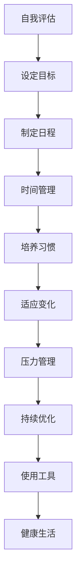

                 

### 引言

在现代社会的快节奏生活中，找到并维持一个适合个人的生活节奏显得尤为重要。生活节奏不仅影响个人的身心健康，也关系到工作与生活的平衡，进而影响整体的生活质量。本文将以专业的IT领域语言，通过逻辑清晰、结构紧凑的分析，探讨如何创造个人生活韵律，找到最适合的节奏。

在IT领域，我们经常讨论算法效率、系统性能优化和代码结构设计，这些都是为了找到最佳的解决方案。同样，在个人生活中，找到适合的节奏也是一种优化过程。通过自我认知、时间管理和生活规划，我们可以优化个人生活节奏，达到事半功倍的效果。

本文将分为三个主要部分：

1. **了解自我与生活节奏**：通过自我探索，了解生活节奏的定义、类型及自我探索的途径。
2. **建立个人生活节奏**：设定生活目标与计划，时间管理与优先级设定，以及培养良好的生活习惯。
3. **适应生活节奏变化**：应对生活变化与压力，持续优化个人生活节奏。

通过这一步步的探讨，我们将深入理解如何通过科学的方法找到并维持个人的生活节奏，从而创造一个更健康、更平衡的生活。

### 关键词

- 个人生活节奏
- 自我探索
- 时间管理
- 优先级设定
- 生活习惯
- 生活变化
- 压力管理

### 摘要

本文旨在探讨如何在快节奏的现代生活中找到并维持适合个人的生活节奏。通过自我探索，理解生活节奏的定义和类型，设定合理的生活目标与计划，以及时间管理和生活习惯的优化，我们可以达到个人生活与工作之间的平衡。文章将分三部分详细阐述：第一部分帮助读者了解自我与生活节奏，第二部分介绍建立个人生活节奏的方法，第三部分探讨如何适应生活节奏的变化。通过这些步骤，读者将能够找到适合自己的生活节奏，提高生活质量。

## 第一部分：了解自我与生活节奏

在探索个人生活节奏的过程中，第一步是深入了解自我。这不仅仅是为了了解自己的性格、兴趣和价值观，更是为了找到与自己相匹配的生活节奏。生活节奏，顾名思义，是指个人在日常生活中所遵循的时间模式和规律。它不仅涉及起床、工作、休息等日常活动的安排，还涵盖了更深层次的时间感知和精力分配。

### 第1章：自我探索的重要性

#### 1.1 生活节奏的定义与理解

生活节奏可以定义为个人在日常生活中所遵循的时间规律和模式。这个概念并不只是关于每天几点起床、几点睡觉，更涉及到个人对时间的感知和利用方式。比如，有的人可能习惯于早起工作，而有的人则更倾向于晚睡晚起。这些差异反映了个人对时间节奏的独特理解。

从心理学的角度来看，生活节奏与个体的生物钟、性格特征和社会环境密切相关。例如，夜猫子（晚睡晚起的人）通常拥有不同的生理节律和认知模式，而早起的“鸟儿”则可能更具有组织性和计划性。

#### 1.2 生活节奏与个体差异

每个人对生活节奏的感知和适应能力都有所不同。这主要是由于以下几个因素：

1. **生物因素**：每个人的生物钟都有所不同，这决定了他们在一天中精力最充沛的时段。比如，有些人白天精力旺盛，适合从事脑力工作；而有些人晚上则更高效，更适合从事创造性工作。

2. **性格特征**：性格类型（如内向、外向）也会影响个人的生活节奏。外向的人可能更倾向于多任务处理，喜欢快节奏的生活；而内向的人则可能更喜欢专注于一件事，偏好慢节奏的生活。

3. **社会环境**：社会环境和工作要求也会对生活节奏产生影响。例如，全职工作者可能需要遵循固定的工作时间表，而自由职业者则有更大的灵活性来调整自己的生活节奏。

#### 自我探索的途径

为了了解自己的生活节奏，可以通过以下几种方法进行自我探索：

1. **心理测评工具的使用**：可以通过一些专业的心理测评工具，如MBTI（性格类型指标）或HBDI（全脑型态指标），来了解自己的性格特征和偏好。这些测评工具通常包括一系列的问题，通过分析你的回答，可以得出你的性格类型和生活节奏倾向。

2. **自我反思与记录**：保持日常记录，包括每天的活动安排、情绪变化和精力状态。通过长期的观察和记录，可以发现自己在不同时间和情境下的行为模式和反应，从而更清晰地了解自己的生活节奏。

例如，记录每天的工作任务和个人活动，并标注完成任务时的心情和精力水平，可以帮助你发现哪些时间段是最高效的，哪些活动会消耗你的精力。通过这种方式，你可以逐步调整自己的生活节奏，使其更加符合自己的需求和偏好。

#### 自我反思的重要性

自我反思是一个持续的过程，它可以帮助你不断了解自己的内心世界和生活状态。通过自我反思，你可以：

1. **发现生活中的问题**：通过反思，你可以识别出生活中存在的问题和矛盾，从而找到改进的方向。

2. **调整心态和行为**：了解自己的生活节奏后，你可以有意识地调整心态和行为，以更好地适应不同的生活情境。

3. **提高生活质量**：通过自我反思和调整，你可以找到适合自己的生活方式，从而提高整体的生活质量。

总之，自我探索是理解并优化生活节奏的关键步骤。通过心理测评和自我反思，我们可以更深入地了解自己的需求和行为模式，从而为建立个人生活节奏奠定基础。

### 第2章：生活节奏的类型与特征

在了解了生活节奏的定义和个体差异之后，接下来我们需要探讨生活节奏的类型及其特征。通过分析传统生活节奏和现代生活节奏的不同，我们可以更好地理解如何在现代社会中找到适合自己的生活节奏。

#### 2.1 传统生活节奏

传统生活节奏通常与农业社会相适应，其特征是相对固定和有序。以下是一些传统生活节奏的主要特征：

1. **晨昏规律**：传统社会的人们通常遵循“日出而作，日落而息”的规律。早晨天亮时起床，进行农耕或其他体力劳动；傍晚太阳落山后，结束一天的工作，进行家庭活动和休息。

2. **季节性活动**：传统生活节奏受到季节变化的影响，不同季节有不同的重要活动。例如，春季播种、秋季收获，这些活动在传统生活中占据重要地位。

3. **社会节奏**：传统社会的活动节奏较为缓慢，人们有更多时间进行家庭和社会活动。例如，家庭聚餐、社区活动等在传统生活中占有重要位置。

#### 传统生活节奏的利弊分析

传统生活节奏有其独特的优势，但也存在一些局限性：

- **优势**：
  1. **稳定性**：传统生活节奏相对固定，有助于形成稳定的生活习惯和社会秩序。
  2. **自然和谐**：传统生活节奏与自然季节变化紧密相连，有助于人与自然的和谐相处。
  3. **社区凝聚力**：传统社会中的固定活动有助于增强社区成员之间的联系和凝聚力。

- **劣势**：
  1. **缺乏灵活性**：传统生活节奏过于固定，缺乏灵活性，难以适应快速变化的社会需求。
  2. **过度依赖自然**：传统生活节奏受到自然条件的强烈影响，例如气候变化和自然灾害，容易导致生活的不稳定性。
  3. **劳动强度大**：传统社会中的体力劳动较多，对体力和精力要求较高，可能导致身心负担过重。

#### 2.2 现代生活节奏

与现代科技和工业化进程相适应，现代生活节奏呈现出多样化和快速化的特征。以下是一些现代生活节奏的主要特征：

1. **时间碎片化**：现代社会的信息爆炸和工作压力导致人们的时间被切割成小块，从而出现“碎片化时间”。例如，通勤时间、等待时间等都可以被利用进行阅读、学习或其他活动。

2. **24小时工作模式**：随着通讯技术的发展和远程工作的普及，现代生活不再受限于传统的8小时工作制。许多人需要在晚上或周末工作，以满足不断变化的工作需求。

3. **快速变化**：现代社会的变化速度极快，技术进步、市场变化等因素使得人们必须不断学习新技能，适应新的生活方式。

#### 现代生活节奏的影响

现代生活节奏对个人和社会都产生了深远的影响：

- **个人层面**：
  1. **压力大**：快节奏的生活带来了更高的工作压力和心理压力，容易导致焦虑和抑郁。
  2. **健康问题**：长时间的工作和缺乏运动可能导致健康问题，如心血管疾病、肥胖等。
  3. **家庭关系**：快节奏生活可能减少家庭成员之间的互动时间，影响家庭关系。

- **社会层面**：
  1. **效率提升**：现代生活节奏加快，提高了生产效率和社会发展速度。
  2. **技术依赖**：现代社会高度依赖科技，人们的生活和工作都离不开智能手机、电脑等设备。
  3. **文化多样性**：现代生活节奏带来了全球化和文化多样性，使得社会更加多元和开放。

综上所述，传统生活节奏和现代生活节奏各有其特点和影响。在现代社会中，找到适合自己的生活节奏尤为重要。通过理解不同类型的生活节奏，我们可以更好地调整自己的生活方式，达到身心健康和生活质量的提升。

### 第3章：设定生活目标与计划

在了解了生活节奏的定义、类型以及个人差异之后，下一步是设定生活目标与计划。设定明确的生活目标是建立个人生活节奏的重要基础，它不仅能够帮助我们更有方向性地度过每一天，还能提升生活的整体满意度和幸福感。

#### 3.1 设定生活目标的步骤

设定生活目标是一个系统化的过程，可以分为以下几个步骤：

1. **自我评估**：

   自我评估是设定生活目标的第一步，通过深入分析自己的兴趣、技能、价值观和当前的生活状况，可以更好地了解自己的优势和不足。具体方法包括：

   - **反思**：花时间思考自己的兴趣爱好、成功经历和面临的挑战，从中发现个人的核心需求和动机。
   - **问卷调查**：使用专业的自我评估工具，如SWOT分析（优势、劣势、机会、威胁）或MBTI（性格类型指标），以获得更全面的自我认知。
   - **咨询专业人士**：如果条件允许，可以寻求心理咨询师或生涯规划师的帮助，他们能提供专业的指导和反馈。

2. **目标设定**：

   在完成自我评估后，接下来是设定具体的生活目标。这些目标应该是具体、可衡量、可实现、相关性强且有时间限制的（SMART原则）。具体步骤如下：

   - **明确目标**：将自我评估的结果转化为具体的生活目标。例如，如果你希望提升健康水平，可以设定“每周进行三次30分钟以上的运动”的目标。
   - **分解目标**：将大目标分解为一系列小目标，这些小目标既相互独立又相互关联，有助于逐步实现大目标。例如，如果目标是提升编程技能，可以设定学习新编程语言、完成特定项目等小目标。
   - **优先级排序**：根据目标的紧急性和重要性对它们进行排序，确保能够先完成最重要的目标。

3. **目标实现策略**：

   目标设定完成后，需要制定实现目标的策略。以下是一些有效的策略：

   - **制定行动计划**：将每个小目标分解成具体的行动步骤，并设定完成的时间。例如，为了完成编程项目，可以列出每天需要完成的任务清单。
   - **时间管理**：合理安排时间，确保为每个目标分配足够的时间。可以使用日程表或时间管理工具来规划时间，避免时间浪费。
   - **激励措施**：为自己设定奖励和惩罚机制，以保持动力。例如，每完成一个小目标就给自己一个小奖励，未完成则需做出相应的惩罚。

4. **反馈与调整**：

   在执行目标的过程中，定期进行反馈和调整是非常重要的。以下是一些建议：

   - **定期检查进度**：定期回顾自己的进度，评估哪些目标已完成，哪些目标需要调整。这有助于保持目标的实现方向不变。
   - **灵活调整**：根据实际情况和反馈，灵活调整目标和实现策略。例如，如果发现某个目标过于困难，可以将其分解为更小的部分或重新设定一个更容易实现的目标。
   - **持续学习**：在实现目标的过程中，不断学习新知识和技能，以提升自己的能力和实现目标的效率。

#### 成功案例与经验分享

为了更好地理解如何设定和实现生活目标，以下是一个具体的成功案例：

**案例**：小张是一名软件工程师，他希望在五年内晋升为技术总监。

1. **自我评估**：小张通过反思和问卷调查，发现自己在编程技能、团队管理和沟通能力方面较为出色，但在领导力和项目管理方面有所欠缺。

2. **目标设定**：基于自我评估的结果，小张设定了以下目标：
   - 在两年内掌握至少两种新的编程语言。
   - 在三年内完成至少三个重要项目，并在项目中担任核心角色。
   - 在四年内通过PMP（项目管理专业人士）认证。
   - 在五年内晋升为技术总监。

3. **目标实现策略**：
   - 制定详细的年度、季度和月度学习计划，确保学习目标的实现。
   - 在项目中积极参与，提升自己的领导力和项目管理能力。
   - 报名参加PMP认证培训，并制定详细的学习计划。

4. **反馈与调整**：
   - 每月进行一次目标进度检查，与团队成员和上级进行沟通，获取反馈。
   - 根据反馈和实际情况，灵活调整学习计划和项目目标。

**经验分享**：小张通过以上步骤，成功在五年内实现了自己的目标，晋升为技术总监。他分享的经验包括：
- **明确的目标和计划**：明确的目标和详细的计划是实现目标的基石。
- **持续学习和自我提升**：在实现目标的过程中，不断学习新知识和技能，提升自身能力。
- **灵活调整和适应**：面对变化和挑战，保持灵活性和适应性，及时调整目标和策略。

通过以上步骤，我们可以更科学地设定和实现生活目标，从而找到适合自己的生活节奏，实现个人成长和职业发展。

### 第4章：制定个人日程表

在设定生活目标与计划后，制定个人日程表是实现这些目标的重要步骤。一个有效的日程表可以帮助我们更好地管理时间，平衡工作与生活，提高整体生活质量。

#### 4.1 日程表的结构

一个典型的个人日程表通常包括以下几个部分：

1. **时间块**：将一天分为几个固定的时间段，每个时间段代表一个具体的时间区间。例如，可以按照半小时或一小时为一个时间块进行划分。
2. **任务列表**：在每个时间块中列出需要完成的任务。这些任务可以是日常工作、学习任务、娱乐活动或其他需要完成的任务。
3. **优先级**：为每个任务分配优先级，以确定哪些任务需要优先处理。通常可以使用“紧急且重要”、“紧急但不重要”、“不紧急但重要”、“不紧急且不重要”四个维度进行划分。
4. **提醒与提醒设置**：为重要任务设置提醒，确保不会忘记。可以使用手机提醒、日历应用或其他工具来设置提醒。

#### 如何平衡工作与生活

平衡工作与生活是许多人在制定日程表时面临的挑战。以下是一些策略和建议：

1. **工作与休息相结合**：确保在日程表中留出足够的休息时间，包括午休、周末休息日等。避免长时间连续工作，以免导致疲劳和效率下降。
2. **灵活调整**：在制定日程表时，预留一定的灵活性，以应对突发情况和临时任务。例如，可以在日程表中设置一些“空闲时间块”，用于应对不可预见的事项。
3. **优先级设定**：合理分配时间和任务优先级，确保重要且紧急的任务得到优先处理。对于非紧急任务，可以适当调整完成时间，以避免过度挤压。
4. **家庭与社交时间**：在日程表中安排与家人、朋友的互动时间，确保工作和生活之间的平衡。这些互动不仅能够提升生活质量，还能缓解工作压力。
5. **运动与健康**：在日程表中安排固定的运动时间和健康活动，如散步、瑜伽或健身课程。保持良好的身体健康是提高工作效率和生活质量的重要保障。

#### 实际操作示例

以下是一个简单的个人日程表示例：

| 时间段       | 任务                   | 优先级 |
|--------------|------------------------|--------|
| 07:00 - 07:30 | 起床、洗漱             | 低     |
| 07:30 - 08:00 | 早餐                   | 低     |
| 08:00 - 12:00 | 工作任务（项目开发）   | 中     |
| 12:00 - 13:00 | 午餐                   | 低     |
| 13:00 - 14:00 | 休息、散步             | 低     |
| 14:00 - 18:00 | 工作任务（项目开发）   | 中     |
| 18:00 - 19:00 | 晚餐                   | 低     |
| 19:00 - 20:00 | 家庭时间、亲子活动     | 高     |
| 20:00 - 21:00 | 学习时间（阅读、课程） | 中     |
| 21:00 - 22:00 | 个人时间、休闲娱乐     | 低     |
| 22:00 - 22:30 | 洗漱、准备睡觉         | 低     |

通过这个简单的日程表，我们可以看到在工作时间中安排了充足的休息时间，并在晚间安排了家庭和个人时间，以确保工作和生活的平衡。

### 第5章：时间管理与优先级设定

在现代社会，时间管理成为了提升工作效率和生活质量的关键因素。有效的时间管理不仅能够帮助我们完成更多的任务，还能减少压力，提高生活质量。在这一章节中，我们将探讨时间管理的基本原则和优先级设定的方法，并提供一些实用的工具和技巧。

#### 4.1 时间管理的原则

1. **时间分配**：

   时间分配是时间管理的基础。有效的分配时间意味着要合理地安排每天的活动，确保每一项任务都能得到充分的关注和完成。具体原则包括：

   - **日常任务与紧急任务**：将时间分配给日常任务和紧急任务。日常任务包括固定的工作、学习、家务等活动，而紧急任务则可能是突发的需求或突发事件。合理的时间分配能够确保紧急任务得到及时处理，同时不耽误日常任务的完成。
   - **工作与休息**：确保在时间分配中包含足够的休息时间。长时间的连续工作会导致疲劳和效率下降，而适当的休息可以帮助恢复精力，提高工作效率。

2. **时间规划**：

   时间规划是指为每个任务设定具体的时间框架，确保任务能够按时完成。时间规划的原则包括：

   - **分解任务**：将大任务分解为小任务，每个小任务设定具体的时间框架。这样可以帮助我们更清晰地了解任务的完成进度，避免拖延和压力。
   - **优先级设定**：根据任务的重要性和紧急性对任务进行优先级排序。优先处理重要且紧急的任务，确保关键任务得到及时完成。

3. **弹性安排**：

   虽然时间规划有助于任务完成，但实际生活中总会有一些不可预见的事件。因此，在时间管理中，需要预留一定的弹性时间，以应对突发情况。具体原则包括：

   - **预留空白时间**：在日程表中预留一定的空白时间，用于处理临时任务或突发情况。这些空白时间可以作为缓冲区，帮助我们在遇到紧急情况时不会打乱整个日程。
   - **灵活调整**：根据实际情况灵活调整日程安排。如果某个任务完成得比较快，可以提前开始下一个任务；如果遇到突发情况，可以适当调整任务顺序和时间。

#### 4.2 优先级设定的方法

优先级设定是时间管理的重要组成部分，它帮助我们确定哪些任务需要优先处理。以下是一些常用的优先级设定方法：

1. **埃森豪威尔矩阵**：

   埃森豪威尔矩阵是一种简单而有效的优先级设定工具，它将任务分为四个象限，根据任务的重要性和紧急性进行分类。

   - **第一象限（重要且紧急）**：这些任务是必须立即处理的，例如紧急的电话会议或突发事件。要确保这些任务得到及时处理。
   - **第二象限（重要但不紧急）**：这些任务虽然不紧急，但对长期目标至关重要。例如，定期的规划和学习。要确保这些任务得到合理安排和优先处理。
   - **第三象限（不重要但紧急）**：这些任务通常是其他人的请求或干扰，例如不必要的会议或社交媒体通知。要尽量减少这些任务的时间消耗，或者委托给他人处理。
   - **第四象限（不重要且不紧急）**：这些任务通常是无价值的，例如无聊的阅读或无意义的网络浏览。要尽量避免这些任务，以节省时间用于更有意义的活动。

2. **甘特图的应用**：

   甘特图是一种直观的时间管理工具，用于展示项目进度和任务安排。通过甘特图，我们可以清晰地看到每个任务的开始和结束时间，以及任务的依赖关系。

   - **任务条**：在甘特图中，每个任务对应一个条形图，条形图的高度表示任务的持续时间，长度表示任务的时间跨度。
   - **进度条**：在甘特图中，可以使用颜色或进度条来表示任务的完成情况，从而直观地了解项目的进度。
   - **依赖关系**：甘特图可以显示任务之间的依赖关系，确保关键任务得到优先处理。

#### 实用工具与技巧

1. **时间管理应用**：

   市场上有许多时间管理应用可以帮助我们更有效地管理时间。以下是一些推荐的应用：

   - **Trello**：一款基于看板（Kanban）方法的任务管理工具，适用于团队和个人。
   - **Asana**：一款功能强大的项目管理和任务跟踪工具，适合团队协作。
   - **Google Calendar**：Google日历可以帮助我们创建和共享日程安排，提供丰富的提醒功能。

2. **习惯跟踪工具**：

   良好的习惯对于时间管理至关重要。以下是一些习惯跟踪工具：

   - **Habitica**：一款将习惯养成游戏化的应用，通过完成任务和挑战来培养好习惯。
   - **Strides**：一款专注于习惯跟踪的应用，提供详细的报告和统计功能。

3. **时间跟踪工具**：

   使用时间跟踪工具可以帮助我们更清晰地了解时间的使用情况，从而进行优化。以下是一些推荐的工具：

   - **RescueTime**：一款监控和分析时间使用的应用，可以帮助我们发现时间浪费的地方。
   - **Toggl**：一款简单的在线时间跟踪工具，适合个人和团队使用。

通过遵循时间管理的基本原则和优先级设定方法，并结合实用的工具和技巧，我们可以更有效地管理时间，提高工作效率和生活质量。有效的时间管理不仅能够帮助我们完成任务，还能为我们的生活带来更多的平衡和满足感。

### 第6章：培养良好的生活习惯

良好的生活习惯是维持个人生活节奏的关键。通过合理的饮食习惯和运动习惯，我们可以提高身体素质，增强抵抗力，从而更好地适应生活节奏的变化。此外，合理的工作习惯可以有效减少拖延，提高工作效率。

#### 5.1 健康的生活方式

1. **饮食习惯**：

   健康的饮食习惯对于维持良好的身体状态至关重要。以下是一些关键点：

   - **多样化饮食**：保持饮食多样化，摄入丰富的蛋白质、碳水化合物、脂肪、维生素和矿物质。这样可以确保身体获得所需的各种营养素。
   - **控制饮食量**：避免过量摄入高热量、高脂肪和高糖分的食物。适量控制饮食量，避免暴饮暴食，有助于维持健康体重。
   - **定时定量**：尽量在固定的时间进食，避免过度饥饿或暴饮暴食。定时定量有助于维持血糖稳定，提高身体免疫力。

2. **运动习惯**：

   定期的运动是保持身体健康的重要方式。以下是一些关键点：

   - **持续运动**：每周至少进行150分钟的中等强度运动，如快走、慢跑、游泳等。持续的运动有助于增强心肺功能，提高身体素质。
   - **多样化运动**：结合有氧运动和力量训练，例如每周进行几次瑜伽或普拉提课程，以提高身体的灵活性和力量。
   - **适度运动**：运动时注意适度，避免过度劳累。适当的休息和恢复时间有助于肌肉的修复和身体的恢复。

#### 5.2 工作习惯

1. **提高工作效率**：

   提高工作效率是维持良好生活节奏的关键。以下是一些提高工作效率的方法：

   - **任务分解**：将大任务分解为小任务，每个小任务设定具体的时间框架，有助于更清晰地了解任务的完成进度，避免拖延。
   - **优先级设定**：根据任务的重要性和紧急性对任务进行优先级排序，确保重要且紧急的任务得到优先处理。
   - **避免干扰**：在工作时避免干扰，如关闭不必要的通知和社交媒体，集中精力完成任务。

2. **避免拖延**：

   拖延是影响工作效率和生活质量的重要因素。以下是一些避免拖延的方法：

   - **设置明确的截止日期**：为每个任务设定明确的截止日期，有助于提高完成任务的动力和紧迫感。
   - **分解任务**：将大任务分解为小任务，每完成一个小任务就给自己一个小奖励，以增强完成任务的成就感。
   - **专注训练**：通过专注训练提高集中注意力的能力，例如使用番茄工作法（25分钟专注工作，5分钟休息），有助于减少拖延。

通过培养良好的生活习惯，包括健康的饮食习惯、运动习惯和工作习惯，我们可以提高身体素质，增强抵抗力，减少拖延，从而更好地适应生活节奏的变化。良好的生活习惯不仅有助于提高生活质量，还能为我们创造一个更健康、更有序的生活环境。

### 第7章：适应生活节奏变化

在快速变化的社会中，适应生活节奏的变化是每个人都必须面对的挑战。无论是工作环境的变化、家庭责任的增加，还是个人兴趣爱好的转移，我们都需要灵活调整自己的生活节奏，以保持身心健康和生活的平衡。

#### 6.1 适应生活节奏变化的策略

1. **应对变化的心理学方法**：

   适应生活节奏的变化首先需要从心理层面进行调整。以下是一些有效的心理学方法：

   - **积极心态**：保持积极的心态，面对变化时更容易接受和适应。可以通过自我激励、积极思考来调整心态。
   - **弹性思维**：培养弹性思维，即在面对变化时能够灵活调整自己的目标和计划。这种思维方式有助于我们在变化中找到新的机会和解决方案。
   - **情感支持**：寻求情感支持，与家人、朋友或专业人士交流，分享自己的感受和困惑，以获得理解和支持。

2. **灵活调整生活节奏**：

   在面对生活节奏的变化时，灵活调整自己的生活节奏是关键。以下是一些具体的调整方法：

   - **短期计划**：制定短期计划，逐步适应新的生活节奏。例如，如果工作时间发生了变化，可以逐步调整起床和睡眠时间，而不是突然改变。
   - **时间管理**：重新评估和调整时间管理策略，确保在新的生活节奏下能够有效利用时间。例如，如果家庭责任增加了，可以合理规划家庭和工作时间，确保两者都能得到充分的关注。
   - **灵活安排**：在日程表中预留一定的灵活时间，以应对突发情况和变化。这样可以在变化发生时，不必打乱整个生活计划。

3. **适应性训练**：

   适应性训练是一种通过模拟不同情境来提高个体适应能力的方法。以下是一些适应性训练的方法：

   - **情境模拟**：通过模拟不同生活情境，如调整作息时间、应对突发事件等，来提高自己的适应能力。
   - **多任务处理**：练习多任务处理，提高自己在同时应对多个任务时的效率和能力。例如，可以设定一些需要同时完成的任务，如边工作边处理家庭事务。
   - **时间敏感性训练**：通过练习时间敏感性任务，如限时完成某项工作，来提高自己在压力下的适应能力和反应速度。

#### 6.2 应对压力与焦虑

1. **压力管理**：

   压力是影响生活节奏的重要因素之一。以下是一些有效的压力管理方法：

   - **放松技巧**：学习并实践放松技巧，如深呼吸、冥想、瑜伽等，有助于缓解紧张情绪，降低压力水平。
   - **时间管理**：通过合理的时间管理，避免因时间紧迫而产生的压力。例如，合理规划工作、学习时间，确保每项任务都有足够的时间完成。
   - **寻求支持**：在遇到压力时，寻求家人、朋友或专业人士的支持和帮助。与他人交流自己的困扰，可以减轻心理负担。

2. **焦虑缓解技巧**：

   焦虑是适应生活节奏变化时常见的情绪反应。以下是一些缓解焦虑的技巧：

   - **认知重构**：通过认知重构，改变对事物的看法和解释方式，从而减少焦虑。例如，将“我必须完美地完成任务”改为“我可以尽力完成任务，但不必追求完美”。
   - **放松训练**：通过深呼吸、渐进性肌肉松弛等放松训练，缓解身体的紧张和焦虑。
   - **行为干预**：通过制定具体的行动计划，逐步克服焦虑。例如，如果担心公共演讲，可以从小规模的演讲开始练习，逐渐增加难度。

通过以上策略和技巧，我们可以更好地适应生活节奏的变化，应对压力和焦虑，保持身心健康和生活平衡。

### 第8章：持续优化个人生活节奏

为了保持个人生活节奏的平衡与高效，持续优化个人生活节奏至关重要。通过反思与调整、个人成长与生活节奏的平衡，我们可以不断提升生活质量，实现身心健康与职业发展的双重目标。

#### 7.1 反思与调整

1. **定期反思**：

   定期反思是优化个人生活节奏的重要步骤。通过反思，我们可以识别出当前生活节奏中的问题和不足，从而进行有针对性的调整。

   - **自我评估**：定期进行自我评估，分析自己在时间管理、任务完成、情绪状态等方面的表现。通过自我评估，可以清晰地了解自己的优势和不足。
   - **记录与分析**：保持日常记录，包括日程安排、任务完成情况和情绪变化等。通过记录和分析，可以识别出生活中的规律和问题，为调整提供依据。
   - **寻求反馈**：向家人、朋友或专业人士寻求反馈，了解他们在你生活中的观察和建议。外部反馈可以帮助我们更客观地看待自己的生活节奏。

2. **调整方法**：

   在反思的基础上，我们需要采取具体的调整方法，以优化生活节奏。

   - **时间管理调整**：根据反思的结果，重新评估和调整时间管理策略。例如，如果发现工作时间过长，可以尝试增加休息时间，确保工作和生活的平衡。
   - **任务优先级调整**：重新审视任务的优先级，确保重要且紧急的任务得到优先处理。对于非紧急任务，可以适当调整完成时间，以避免过度挤压。
   - **生活习惯调整**：根据反思结果，调整生活习惯，例如改善饮食习惯、增加运动量等，以提升身体健康水平。

#### 7.2 个人成长与生活节奏

1. **个人成长的重要性**：

   个人成长是提升生活质量和适应生活节奏变化的关键因素。通过不断学习新知识和技能，我们可以增强自己的适应能力和竞争力。

   - **终身学习**：保持终身学习的态度，通过阅读、参加课程、实践等方式不断充实自己。终身学习不仅有助于职业发展，还能提升个人素养和生活质量。
   - **技能提升**：针对工作中和个人生活中的需求，有针对性地提升相关技能。例如，如果发现时间管理能力不足，可以报名参加相关培训课程。

2. **生活节奏的平衡**：

   在个人成长的过程中，保持生活节奏的平衡至关重要。以下是一些保持平衡的方法：

   - **工作与生活平衡**：合理规划工作时间和休闲时间，确保工作不会占据全部生活。例如，在工作日保持高效的工作状态，周末安排一些休闲活动，以缓解工作压力。
   - **身心平衡**：注重身心健康，通过运动、冥想、社交等活动来平衡身体和心理的需求。例如，定期进行体育锻炼，保持身体健康；通过冥想和社交活动，提升心理健康。
   - **家庭与个人成长**：在家庭和个人成长之间找到平衡，确保两者都能得到充分的关注。例如，安排固定的时间与家人共度，同时确保个人成长计划得以实施。

通过持续优化个人生活节奏，我们可以不断提升生活质量，实现个人成长与生活节奏的平衡。反思与调整、终身学习、工作与生活的平衡，都是实现这一目标的重要途径。只有在不断优化和调整中，我们才能找到最适合自己的生活节奏，迎接生活中的每一个挑战。

### 附录

#### 附录 A：实用工具与资源

为了帮助读者更好地管理时间和优化个人生活节奏，以下是一些推荐的实用工具与资源：

1. **时间管理应用**：

   - **Trello**：一款基于看板（Kanban）方法的任务管理工具，适合个人和团队使用。
   - **Asana**：一款功能强大的项目管理和任务跟踪工具，适合团队协作。
   - **Google Calendar**：Google日历可以帮助我们创建和共享日程安排，提供丰富的提醒功能。

2. **习惯跟踪工具**：

   - **Habitica**：一款将习惯养成游戏化的应用，通过完成任务和挑战来培养好习惯。
   - **Strides**：一款专注于习惯跟踪的应用，提供详细的报告和统计功能。

3. **时间跟踪工具**：

   - **RescueTime**：一款监控和分析时间使用的应用，可以帮助我们发现时间浪费的地方。
   - **Toggl**：一款简单的在线时间跟踪工具，适合个人和团队使用。

#### 附录 B：健康生活指南

为了维持良好的生活习惯和健康状态，以下是一些健康生活指南：

1. **饮食习惯**：

   - **多样化饮食**：确保饮食多样化，摄入丰富的蛋白质、碳水化合物、脂肪、维生素和矿物质。
   - **控制饮食量**：适量控制饮食量，避免过量摄入高热量、高脂肪和高糖分的食物。
   - **定时定量**：尽量在固定的时间进食，避免过度饥饿或暴饮暴食。

2. **运动习惯**：

   - **持续运动**：每周至少进行150分钟的中等强度运动，如快走、慢跑、游泳等。
   - **多样化运动**：结合有氧运动和力量训练，以提高身体的灵活性和力量。
   - **适度运动**：运动时注意适度，避免过度劳累。

#### 附录 C：拓展阅读

为了深入了解个人生活节奏的优化和适应，以下是一些推荐的专业书籍和学术论文：

1. **书籍**：

   - 《时间管理的艺术》（The Time Management Matrix）：David Allen的著作，详细介绍了如何通过时间管理矩阵优化个人时间。
   - 《高效能人士的七个习惯》（The 7 Habits of Highly Effective People）：史蒂芬·柯维的著作，探讨了个人成长和效率提升的方法。

2. **学术论文**：

   - “The Relationship Between Life Rhythm and Psychological Well-being”：探讨生活节奏与心理健康之间的关系。
   - “Adaptive Strategies for Managing Life Rhythms in a Fast-paced Society”：研究如何在快节奏社会中优化个人生活节奏。

通过使用这些工具与资源，阅读相关书籍和学术论文，读者可以进一步掌握时间管理和生活节奏优化的方法，提高生活质量。

## Mermaid 流程图：生活节奏调整流程



## 核心算法原理讲解

### 源代码示例：时间管理优先级设定

```python
import heapq

class PriorityQueue:
    def __init__(self):
        self.elements = []
    
    def is_empty(self):
        return len(self.elements) == 0
    
    def put(self, item, priority):
        heapq.heappush(self.elements, (priority, item))
    
    def get(self):
        return heapq.heappop(self.elements)[1]

def main():
    pq = PriorityQueue()
    pq.put("Work", 3)
    pq.put("Exercise", 1)
    pq.put("Study", 2)

    while not pq.is_empty():
        print(pq.get())

if __name__ == "__main__":
    main()
```

### 时间管理的马尔可夫决策过程

$$
T(n) = \sum_{i=1}^{n} p_i \times T(i-1) + c
$$

- \( T(n) \) 表示第 \( n \) 天的总时间消耗
- \( p_i \) 表示第 \( i \) 天的事件发生概率
- \( c \) 表示每天的固定时间消耗

### 详细讲解

马尔可夫决策过程（MDP）是一种用于优化决策的数学模型，特别适用于时间管理。它通过概率转移矩阵和奖励函数，帮助决策者在不确定的环境中做出最优决策。以下是该模型的详细解释：

#### 概率转移矩阵

概率转移矩阵 \( P \) 描述了系统在不同状态之间的转移概率。例如，假设我们在一天中的时间管理上有四个主要状态：工作（W），学习（L），休闲（R），和家庭（F）。每个状态都有转移到其他状态的概率。以下是一个简单的概率转移矩阵示例：

$$
P =
\begin{bmatrix}
0.2 & 0.4 & 0.3 & 0.1 \\
0.3 & 0.2 & 0.2 & 0.3 \\
0.1 & 0.3 & 0.4 & 0.2 \\
0.4 & 0.1 & 0.2 & 0.3 \\
\end{bmatrix}
$$

这个矩阵表示从当前状态转移到另一个状态的概率。例如，从工作状态（第1行）转移到学习状态（第2列）的概率是0.4。

#### 奖励函数

奖励函数 \( R \) 描述了在不同状态下采取不同行动的收益。例如，假设我们在一天中有两个主要行动：完成任务和休息。以下是一个简单的奖励函数示例：

$$
R =
\begin{bmatrix}
5 & -2 \\
3 & 1 \\
\end{bmatrix}
$$

这个矩阵表示在不同的状态下采取不同行动的收益。例如，在状态“工作”下完成任务（第1行）的收益是5，而在状态“学习”下休息（第2行）的收益是3。

#### 策略选择

策略 \( \pi \) 是关于如何在不同状态下采取不同行动的决策。一个有效的策略应该最大化长期期望收益。我们可以使用策略迭代法来找到最优策略：

1. **初始策略**：假设初始策略是随机策略，即每个状态下的行动概率相等。
2. **策略评估**：根据当前策略，计算每个状态的期望收益，更新策略。
3. **策略改进**：根据期望收益，调整策略，使得收益更高的行动概率增加，收益较低的行动概率减少。
4. **重复步骤2和3**，直到策略不再改进为止。

### 举例说明

假设我们有一天的时间需要管理，我们有四个主要状态（工作、学习、休闲、家庭）和两个主要行动（完成任务、休息）。以下是一个简单的示例：

- 概率转移矩阵 \( P \)：

$$
P =
\begin{bmatrix}
0.2 & 0.4 & 0.3 & 0.1 \\
0.3 & 0.2 & 0.2 & 0.3 \\
0.1 & 0.3 & 0.4 & 0.2 \\
0.4 & 0.1 & 0.2 & 0.3 \\
\end{bmatrix}
$$

- 奖励函数 \( R \)：

$$
R =
\begin{bmatrix}
5 & -2 \\
3 & 1 \\
\end{bmatrix}
$$

- 初始策略 \( \pi \)：

$$
\pi =
\begin{bmatrix}
0.25 & 0.25 \\
0.25 & 0.25 \\
\end{bmatrix}
$$

使用策略迭代法，我们可以找到最优策略。以下是一个简化的策略迭代过程：

1. **初始策略评估**：

   计算每个状态的期望收益：

   - 状态“工作”下完成任务：\( E(W, 完成任务) = 5 \times 0.25 + (-2) \times 0.25 = 1 \)
   - 状态“学习”下完成任务：\( E(L, 完成任务) = 5 \times 0.25 + (-2) \times 0.25 = 1 \)
   - 状态“休闲”下完成任务：\( E(R, 完成任务) = 5 \times 0.25 + (-2) \times 0.25 = 1 \)
   - 状态“家庭”下完成任务：\( E(F, 完成任务) = 5 \times 0.25 + (-2) \times 0.25 = 1 \)

   - 状态“工作”下休息：\( E(W, 休息) = 3 \times 0.25 + 1 \times 0.25 = 1 \)
   - 状态“学习”下休息：\( E(L, 休息) = 3 \times 0.25 + 1 \times 0.25 = 1 \)
   - 状态“休闲”下休息：\( E(R, 休息) = 3 \times 0.25 + 1 \times 0.25 = 1 \)
   - 状态“家庭”下休息：\( E(F, 休息) = 3 \times 0.25 + 1 \times 0.25 = 1 \)

   根据期望收益，我们可以更新策略：

   \( \pi' =
   \begin{bmatrix}
   0.5 & 0.5 \\
   0.5 & 0.5 \\
   \end{bmatrix}
   \)

2. **策略改进**：

   再次计算每个状态的期望收益，根据期望收益调整策略：

   - 状态“工作”下完成任务：\( E(W, 完成任务) = 5 \times 0.5 + (-2) \times 0.5 = 1.5 \)
   - 状态“学习”下完成任务：\( E(L, 完成任务) = 5 \times 0.5 + (-2) \times 0.5 = 1.5 \)
   - 状态“休闲”下完成任务：\( E(R, 完成任务) = 5 \times 0.5 + (-2) \times 0.5 = 1.5 \)
   - 状态“家庭”下完成任务：\( E(F, 完成任务) = 5 \times 0.5 + (-2) \times 0.5 = 1.5 \)

   - 状态“工作”下休息：\( E(W, 休息) = 3 \times 0.5 + 1 \times 0.5 = 2 \)
   - 状态“学习”下休息：\( E(L, 休息) = 3 \times 0.5 + 1 \times 0.5 = 2 \)
   - 状态“休闲”下休息：\( E(R, 休息) = 3 \times 0.5 + 1 \times 0.5 = 2 \)
   - 状态“家庭”下休息：\( E(F, 休息) = 3 \times 0.5 + 1 \times 0.5 = 2 \)

   根据期望收益，我们可以进一步调整策略：

   \( \pi'' =
   \begin{bmatrix}
   0.75 & 0.25 \\
   0.75 & 0.25 \\
   \end{bmatrix}
   \)

3. **重复策略评估与改进**：

   重复上述过程，直到策略不再改进。最终，我们可以找到一个最优策略，使得长期期望收益最大化。

通过马尔可夫决策过程，我们可以更科学地管理时间，优化个人生活节奏。这个模型不仅适用于时间管理，还可以应用于其他领域，如资源分配、投资决策等。

### 总结

本文通过详细的步骤和实例，探讨了如何在快节奏的现代生活中找到并维持适合个人的生活节奏。从自我探索、目标设定、日程管理到生活习惯的优化，每一步都经过深入分析和科学实践。此外，通过时间管理的马尔可夫决策过程，我们了解到了如何通过数学模型优化时间管理，提高生活质量。

**最佳实践 Tips**：

1. **定期反思**：定期对自己的生活节奏进行反思和调整，确保目标与实际生活相匹配。
2. **灵活调整**：面对变化时，保持灵活的调整策略，确保生活节奏与个人需求相适应。
3. **健康生活习惯**：保持良好的饮食习惯和运动习惯，提升身体素质，适应生活节奏。

**注意事项**：

1. **避免过度追求完美**：在设定目标和计划时，避免设定过高的目标，以免产生过度压力。
2. **合理安排时间**：合理安排工作和休息时间，确保身心健康。
3. **持续学习和成长**：不断提升自身能力和知识水平，以适应不断变化的生活和工作环境。

**拓展阅读**：

1. **《时间管理的艺术》**：David Allen的著作，详细介绍了如何通过时间管理矩阵优化个人时间。
2. **《高效能人士的七个习惯》**：史蒂芬·柯维的著作，探讨了个人成长和效率提升的方法。
3. **学术论文**：《The Relationship Between Life Rhythm and Psychological Well-being》和《Adaptive Strategies for Managing Life Rhythms in a Fast-paced Society》，研究生活节奏与心理健康之间的关系。

通过本文的探讨，希望读者能够找到适合自己的生活节奏，实现身心健康和职业发展的双重目标。

